# ARMv7-A ARMv8-A体系结构

ARMv7-M体系结构笔记[传送门](201020a_stm32.md)

## 参考

[ARM Developer](https://developer.arm.com)

[ARM Cortex-A Series Programmer's Guide for ARMv7-A, ARM](https://developer.arm.com/documentation/den0013/d/?lang=en)

[ARM Architecture Reference Manual ARMv7-A and ARMv7-R edition, ARM](https://developer.arm.com/documentation/ddi0406/cd/?lang=en)

[GNU ARM Assembler Quick Reference](src/200920a01/gnu-arm-directives.pdf)


## 0 常见SoC厂商与产品

从普通爱好者角度，可以折腾的ARM SoC

**中国厂商**

御三家

+ Allwinner 全志科技（珠海）
    + Datasheet & TRM [Repo](https://github.com/DeciHD/allwinner_docs)
    + 开发者论坛 https://bbs.aw-ol.com/
    + sunxi wiki https://linux-sunxi.org/Main_Page
    + 部分新产品文档 https://gitee.com/aw-sunxi/awesome-sunxi
    + T113-s3/T113-s4/R528 (2xA7 with 128MB/256MB SIP DDR3, T113-s3/s4 are eLQFP128 packaged, 22nm)
    + T113-i (2xA7+1xRISCV(C906), 22nm)
    + A40i/V40/R40/T3 (4xA7, SATA embedded, no HDMI on T3, 40nm)
    + V853/V851/V853s/V851s/V851se (1xA7+1xRISCV(E907), s variants feature 64MB SIP DDR, e variants feature SIP EPHY)
    + R128 (RISCV+xtensa DSP+ARM with 8/16MB DRAM and WIFI/Bluetooth, QFN)
    + V833/V831 (1xA7)
    + A33/R16 (4xA7, 28nm)
    + H3/H2+ (4xA7, 40nm)
    + V3s (1xA7 with 64MB DDR2, eLQFP128)
    + F1C100/200s (1xARM9 with DDR)
    + 以下是未来会出的中高端型号（仅供参考）
    + A523/A527/T523/T527/MR527/R828(?) (8xA55+1xRISCV(E906), no HDMI on A523 MR527, sun55i new product 2023, 22nm)（只有T527为完整功能）
    + A513 (4xA55, new product 2023/2024, 22nm)
    + R923 (4xA73+4xA53+1xRISCV(E906), sun60i new product 2023/2024, 12nm)
    + A736/T736 (2xA76+6xA55, IMG BXM GPU, sun60i new product 2023/2024, 12nm)
    + A737/T737 (2xA78+6xA55, IMG BXM GPU, 12nm)
    + 以下是sun50i系列。尽管为64位ARMv8，为减小芯片Die size，内部数据总线只有32位宽，可能遇到瓶颈
    + A133/R818 (4xA53, IMG GE8300 GPU, 28nm)
    + H616/H618/T507 (4xA53, 28nm)
+ Rockchip 瑞芯微（福州）
    + Datasheet & TRM [Repo](https://github.com/DeciHD/rockchip_docs)
    + wiki https://opensource.rock-chips.com/wiki_Main_Page
    + RK3588/RK3588S (4xA76+4xA55+3xM0, 8nm)
    + RK3566/RK3568/RK3568B2/RK3568J (4xA55+1xRISCV(RV32IMC), 22nm)
    + RK3562 (4xA53, new product 2023)
    + RK3528 (4xA53, new product 2023, Allwinner sun50i counterpart)
    + RK3399 (2xA72+4xA53+2xM0, 28nm)
    + RK3328 (4xA53, 28nm)
    + RK3326/PX30 (4xA35, 28nm)
    + RK3308 (4xA35, 28nm)
    + RK1808 (2xA35, 28nm)
    + RV1126 (4xA7+1xRISCV(RV32IMC), 28nm)
    + RV1109 (2xA7+1xRISCV(RV32IMC), 28nm)
    + RV1106 (1xA7+1xRISCV(RV32IMC), 128MB/256MB SIP DDR, 28nm)
    + RV1103 (1xA7+1xRISCV(RV32IMC), 64MB SIP DDR, 28nm, Allwinner V851se counterpart)
+ Amlogic 晶晨半导体（上海）
    + Datasheet & TRM [Repo](https://github.com/DeciHD/amlogic_docs)
    + A311D2 (4xA73+4xA53, 12nm)
    + A311D (4xA73+2xA53, 12nm)
    + S922X (4xA73+2xA53, 12nm)
    + S928X (1xA76+4xA55, new product 2023, 12nm)
    + S905X4 (4xA55, 12nm)
    + S905X3/D3 (4xA55, 12nm)
    + S905X2/S905Y2 (4xA53, 12nm)
    + S905D/S905L/S905X (4xA53, 28nm)

> 同一厂商参数相近的SoC经常会使用同一个Die，开启或屏蔽部分功能。通过配置特性或命名就能推测

**国际厂商**

+ ST 意法半导体
    + 文档开放
    + STM32MP1
    + STM32MP2
+ NXP 恩智浦半导体
    + 文档开放
    + i.MX
+ TI 德州仪器
    + 文档开放（需要注册）
    + Sitara AMxxxx
+ Renesas 瑞萨半导体
    + 文档开放（需要注册）
    + RZ MPU
+ Microchip 微芯半导体
    + ATSAMA5
+ AMD Xilinx 赛灵思
    + FPGA+ARM混合。文档开放
    + ZYNQ-7000
+ Qualcomm 高通
    + https://wiki.postmarketos.org/wiki/Mainlining
    + MSM8916 (Snapdragon 410)/APQ8016 https://github.com/msm8916-mainline 
    + MSM8939 (Snapdragon 615/616)
    + SDM845 (Snapdragon 845)
+ Nvidia 英伟达
    + 文档开放（需要注册）
+ Samsung 三星半导体
    + 大部分原有产品已停产。不推荐

> 国际大厂ST，NXP，TI，Renesas的SoC通常性能一般，并且价格较高，但是文档开放，软件支持更好，稳定性优，更适合工业或车规产品，以及初学入门。而除手机、平板外的商业消费电子、广告屏等基本由御三家方案主导。由于成本优势，近几年御三家的产品在工控和车载领域也已经有很多应用

> 树莓派定位主要作为普通PC使用，走的是和大部分x86 PC一样的消费电子路线，不开放原理图，SoC手册也严格保密，不属于开源硬件。新出的5B分离了处理器和部分外设（RP1芯片类似南桥，走PCIe）更加佐证了这一趋势。硬件爱好者不可能基于树莓派的定制SoC设计自己的开发板。树莓派优势在于软件生态良好，由于用户多，并且树莓派主要面向新手用户，很多问题基金会官方与社区已经帮用户填坑，对于toy project的需求而言，它的可用性要优于几乎所有的同类产品
>
> 虽然树莓派外观好看，其尺寸和接口布局被各厂商模仿，但事实上硬件设计不能算树莓派的强项。从4B的Type-C电阻设计失误，到5B的5V5A大电流供电都体现了这样的问题。5B的设计使得用户无法再使用普通的廉价数据线和手头已有的电源，而这仅仅是添加一个板载DCDC就可以解决的问题（基金会的态度很明显，想要用户再单独购买官方电源。5B的研发成本大约为25M美元，为4B的5倍）
>
> 另一方面，虽然御三家资源相对开放，玩转这些SoC仍然需要相当的专业技能，尤其GPU驱动方面，需要社区的共同努力。这些开发板很多是为具备专业软硬件技能的爱好者设计的，和树莓派相比本身定位就不同。事实上这些开发板商家甚至没有能力解决一些软件上的问题，只能依靠社区，例如GPU、编解码、PD协商等，这些问题更多在于SoC厂家支持不力，或来自IP核供应商的问题，此外相比树莓派还有人数与热度的劣势。明确自己的需求，如果你的需求仅仅是作为NAS等网络服务器使用，而对ARM体系结构底层、U-Boot、Linux内核、系统编程、逆向、硬件调试、驱动开发、硬件设计等不了解，也没有足够的时间和兴趣，最好的选择也许依旧是低功耗x86平台。如果只是想要快速做成一个简单的玩具项目，同时有一定的性能要求，树莓派可能是较好的选择


## 1 简介

ARMv7 Cortex-A和R、M两个系列不同，它面向完整的现代操作系统应用，拥有更强大的性能与功能，最大的特性是具备MMU。同时，ARMv7-A系列通常还具备较长的流水线，更高的运行频率，并配备有Cache。多数内核支持超标量和乱序执行。除Cortex-A8以外其他处理器都原生支持多核配置，每个Cluster可以配备1到4个核心（现在部分ARMv8新产品已经不再限制4核。Cluster主要是为了核间通信，Cache一致性等多核系统存在的问题而设计，也方便了SoC厂商集成）。同时为满足多媒体运算需求，ARMv7 Cortex-A核心通常会配备有VFP以及NEON SIMD扩展

## 1.1 说明

本笔记主要分析ARMv7-A体系结构，ARMv8-A作为补充说明。ARMv9本质就是ARMv8，仅仅添加了一些扩展而已。ARMv9.0相当于ARMv8.6，不像ARMv7到ARMv8那样出现ISA的跨越性改变

本笔记仅对重要的基本指令进行讲解，系统应用以外的指令如NEON和VFP指令只会简略讲解。重点在于内存架构、中断异常和多核，这是ARMv7-A区别于R、M两种核心的重要特性

ARMv7-A的体系规范不包含DMA。ARM提供DMA330，DMA350等IP

ARMv7-A部分指令和ARMv7-M工作原理相同，例如`IT`指令，这里不再详细讲述，具体内容可以看[ARMv7-M体系结构笔记](201020a_stm32.md)

## 1.2 ARMv7-A系列特性概览

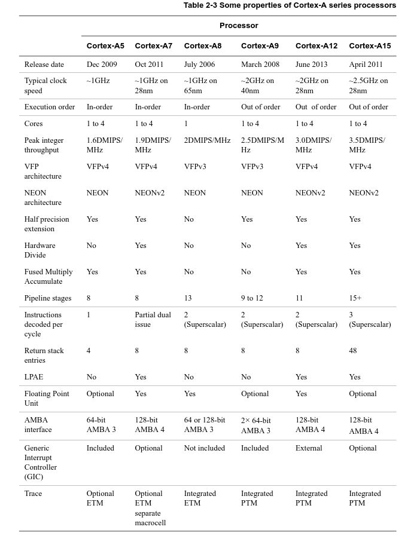

> 后来推出的Cortex-A17是Cortex-A12的改进版

## 1.3 微架构概览：以Cortex-A9为例

Cortex-A9是ARM推出的第一款多核ARMv7处理器，拥有9-12级可变长度流水线，动态预测，双发射乱序执行结构

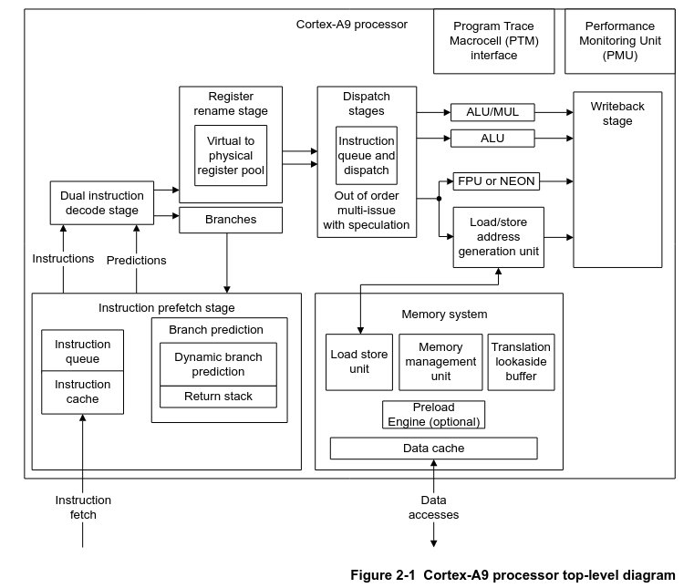

MPCore，单个Cluster结构

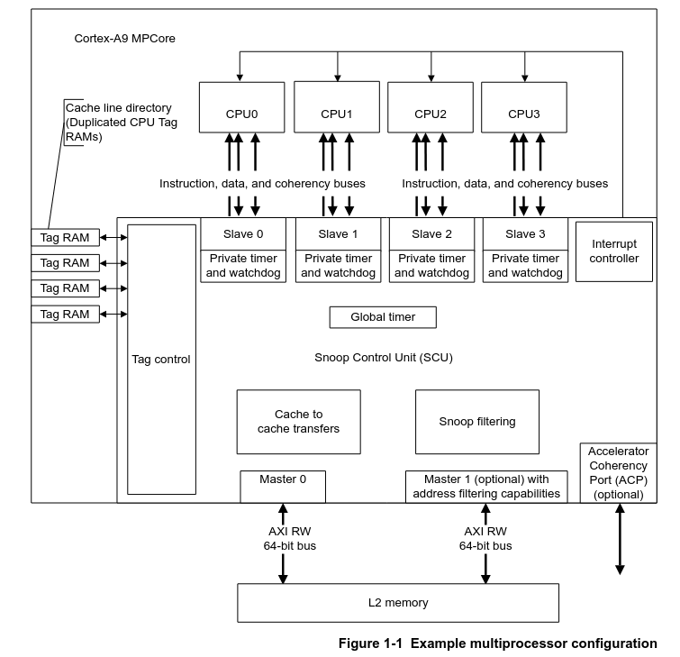

> Cortex-A9 MPCore可以配备多个核心，且核心的功能只包含指令的执行、数据的运算和存取，核心包含了L1指令和数据缓存
>
> 其他部件相当于处理器核心的外壳，每一个核心可以拥有一个私有的定时器以及看门狗。其他的部件，如全局定时器，访存并行加速器ACP，中断控制GIC，AXI总线接口等，都是由4个核心共享的。4个处理器的中断都是由一个GIC进行分配和控制。而SCU主要负责多个核心之间L1缓存的同步
>
> Cortex-A9使用AMBA3 AXI连接到L2缓存。L2不属于Cortex-A9的组成部分，但是几乎所有的SoC都会配备有L2
>
> 其他MPCore处理器除核心外，组成结构基本类似。ARM会推出拥有相近指令特性但能耗特性不同的MPCore处理器来组成big.LITTLE大小核。ARMv7中使用Cortex-A7和Cortex-A15组成大小核。而ARMv8常见的有Cortex-A53（高频）+Cortex-A53（低频）组合，Cortex-A53+Cortex-A57组合，Cortex-A53+Cortex-A72组合，Cortex-A53+Cortex-A73组合，Cortex-A55+Cortex-A76组合，Cortex-A55+Cortex-A77组合等。最新的ARMv9有Cortex-A510+Cortex-A710，X系列超大核也开始普及

## 1.4 其他关键特性

双指令集，支持32位定长指令ARM模式以及16/32位变长指令Thumb-2模式

MMU硬件实现的地址查表转换

TLB快表

大小端模式支持

页面可配置大小：4KB，64KB，1MB，16MB

TrustZone安全扩展

虚拟化扩展

可选的VFP浮点扩展，NEON SIMD扩展

> 许多ARMv7-A处理器中，旧有的Jazelle以及ThumbEE支持是可选的。有些SoC厂商会选择不配备这些扩展


## 2 工作模式与寄存器

## 2.1 工作模式

Cortex-A的运行模式和Cortex-M完全不同

带有**虚拟化扩展**以及**TrustZone安全扩展**的ARMv7-A处理器支持以下工作模式

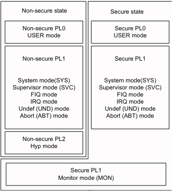

> `PL0`为非特权模式（Unprivileged），`PL1 PL2`为特权模式（Privileged）。`PL1 PL2`模式可以访问的部件更多

| 模式 | 全称 | CPSR.M[4:0] | 等级 | 说明 | 安全模式（如果处理器支持TrustZone） |
| :-: | :-: | :-: | :-: | :-: | :-: |
| USR | User 用户模式 | `10000` | `PL0` | 用户程序代码的工作模式，受限访问MMU等敏感部件的配置寄存器 | `Secure/Non-secure` |
| SYS | System 系统模式 | `11111` | `PL1` | 操作系统代码的工作模式，可以访问MMU，GIC等部件 | `Secure/Non-secure` |
| FIQ | 快速中断 | `10001` | `PL1` | 执行快速中断的工作模式。快速中断一般用于实时性要求较高的场合 | `Secure/Non-secure` |
| IRQ | 普通中断 | `10010` | `PL1` | 执行普通中断的工作模式 | `Secure/Non-secure` |
| SVC | Supervisor | `10011` | `PL1` | CPU复位或执行`SVC`指令后进入的模式。`SVC`指令一般由用户程序执行来请求系统调用 | `Secure/Non-secure` |
| ABT | Abort 访存异常 | `10111` | `PL1` | 访存异常后进入的模式 | `Secure/Non-secure` |
| UND | Undef 未定义指令 | `11011` | `PL1` | 执行未定义指令后进入的模式 | `Secure/Non-secure` |
| HYP | Hypervisor | `11010` | `PL2` | 支持虚拟化的处理器中，Hypervisor代码运行的模式，用以支持同时运行多操作系统 | `Non-secure` |
| MON | Monitor 监视模式 | `10110` | `PL1` | 在支持TrustZone扩展的处理器中的特殊模式，通常用于切换Secure模式 | `Secure` |

在支持TrustZone安全扩展的处理器中，运行状态的`Secure`或`Non-secure`模式（TrustZone）和`PL`模式是互相独立的，两者没有必然联系。运行在`Non-secure`模式下的处理器无法访问`Secure`模式下使用的内存，包括外设。`MON`模式就是用于切换处理器运行的`Secure`和`Non-secure`模式，如下

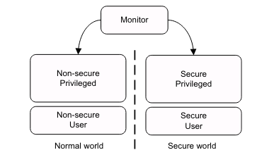

> 通常情况下，用户程序以及操作系统内核都运行在`Non-secure`模式下。只有一些硬件固件以及包含敏感信息的软件需要通过TrustZone来保护

在支持虚拟化扩展的处理器中，Hypervisor和操作系统、用户程序的关系如下

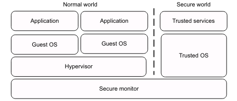

## 2.2 寄存器

### 2.2.1 通用寄存器和CPSR

和ARMv7-M一样，ARMv7 Cortex-A也拥有16个基本的通用寄存器GPR。其中`R0`到`R7`为低寄存器，`R8`到`R12`为高寄存器，剩余3个有特殊用途，`R13`为`SP`栈寄存器，`R14`为`LR`链接寄存器（函数调用时用于存放返回地址，模式切换时用于存放之后`PC`返回值），`R15`为`PC`程序计数器

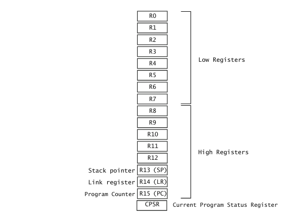

> ARM模式下读取`PC`获得的是当前指令地址`+8`，Thumb模式下获得的是当前指令地址`+4`，相当于两条指令的长度。因为最早的ARM是3级流水线结构
>
> 复位后，处理器的`R0`到`R14`是不确定值，`SP`必须由代码进行初始化后才能正常使用

此外ARMv7-A处理器在特权模式下，部分寄存器会被替换为物理上单独的专用寄存器，这些寄存器会取代原来用户模式（非特权模式）下的寄存器，称为`banking`（这个术语在之后会经常用到）

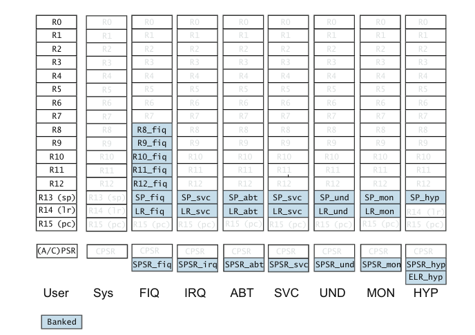

> 上表中蓝色块代表该模式下被bank的寄存器。其中除`SYS`模式以外，其余所有特权模式都bank了`SP`寄存器，同时添加了`SPSR`用于**保存**进入当前模式之前`CPSR`的状态，以便任务执行完毕以后将`SPSR`恢复到`CPSR`回到原来的状态
>
> `FIQ`快速中断相比普通中断`IRQ`bank了高寄存器，这意味着进入`FIQ`时高寄存器可以不用压栈，这也是`FIQ`有更快响应性能的原因之一
>
> `HYP`模式下同时具有`LR`以及`ELR`寄存器，`LR`和`USR`模式使用的是同一个，用于`HYP`模式下的函数调用返回；而`ELR`用于异常返回

`CPSR`定义如下

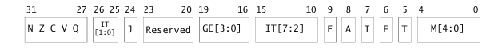

> `USR`模式下实际只能访问`CPSR`的`APSR`部分（`A`指Application）。此时`APSR`只有`N Z C V Q`以及`GE[3:0]`是可访问的

各bit功能，和ARMv7-M不同

| 名称 | 位域 | 作用 | 复位值 | 备注 |
| :-: | :-: | :-: | :-: | :-: |
| `N` | 31 | Negative标志，整数计算结果首位为1 | UNKNOWN | 任意模式下可以任意读写，建议通过指令自动更改。条件指令依照这些位执行 |
| `Z` | 30 | Zero标志，整数计算结果为0 | UNKNOWN | 同上 |
| `C` | 29 | Carry标志，无符号运算产生进位 | UNKNOWN | 同上 |
| `V` | 28 | Overflow标志，有符号运算产生溢出，例如加法中正正得负或负负得正 | UNKNOWN | 同上 |
| `Q` | 27 | 整数饱和运算标志 | UNKNOWN | 同上，但是不属于`N Z C V`标准标志位，条件指令不会检测该位 |
| `IT[1:0]` | 26:25 | 用于`IT`条件指令 | `00` | `MRS`读取全`0`，`MSR`写无效 |
| `J` | 24 | Jazelle模式。大部分ARMv7处理器不再使用此扩展，该位没有实际作用 | `0` | `MRS`读取为`0`，`MSR`写无效 |
| `GE[3:0]` | 19:16 | 用于部分整数SIMD指令（不是NEON或VFP），表示32位运算中每个字节大于或等于 | UNKNOWN | 同`N Z C V`，但是影响例如`SEL`的执行 |
| `IT[7:2]` | 15:10 | 用于`IT`条件指令 | `000000` | `MRS`读取全`0`，`MSR`写无效 |
| `E` | 9 | 指示**数据**大小端模式Endianness，`0`小端，`1`大端。指令大小端不受影响 | `=SCTLR.EE`，一般为`0`小端模式 | 在`PL1`及以上模式可以使用`MRS MSR`读写，但是不建议这样操作。更改大小端需要使用`SETEND`指令 |
| `A` | 8 | Asynchronous abort屏蔽位 | `1`，默认禁用 | 仅支持TrustZone的处理器中，如果`SCR.AW=0`该位无法更改。如果还支持虚拟化，`SCR.AW=0`会使得该位的更改受限 |
| `I` | 7 | `IRQ`屏蔽位 | `1`，默认禁用 |  |
| `F` | 6 | `FIQ`屏蔽位 | `1`，默认禁用 | 仅支持TrustZone的处理器中，如果`SCR.FW=0`该位无法更改。如果还支持虚拟化，`SCR.FW=0`会使得该位的更改受限。如果处理器支持`NMFI`不可屏蔽快速中断，也即`SCTLR.NMFI=1`，该位无法置`1` |
| `T` | 5 | 指令模式，`J`为`0`时置`1`表示Thumb-2，置`0`表示ARM | `=SCTLR.TE`，一般为`0`处于ARM模式 | `MRS`读取为`0`，`MSR`写无效 |
| `M[4:0]` | 4:0 | 表示当前[工作模式](#21-工作模式) | `10011`，默认处于`SVC`模式 | 通常只在`PL1`及以上运行模式下读写 |

> `IT J E T`位为指示位，**除调试模式外**，只有专用的指令才能更改这些位。`IT`位对应`IT`条件指令（**Thumb模式专有指令**），`E`使用`SETEND`指令。更改`T`需要使用跳转指令进行ARM和Thumb模式的切换

### 2.2.2 协处理器简介

协处理器在ARMv8中被废弃，转而使用特殊寄存器指令访问这些系统配置相关的寄存器

ARMv7-A依然沿用了协处理器，使用专用的协处理器指令如`MRC` `MCR`访问，共计16个协处理器`CP0`到`CP15`，其中`CP8`到`CP15`为ARM保留使用。现实中协处理器`CP14 CP15`主要用于系统配置，`CP10 CP11`主要用于VFP以及NEON SIMD相关功能

为方便对于协处理器概念的理解，这里给出协处理器指令`MRC` `MRRC`格式如下（`MCR` `MCRR`类似）

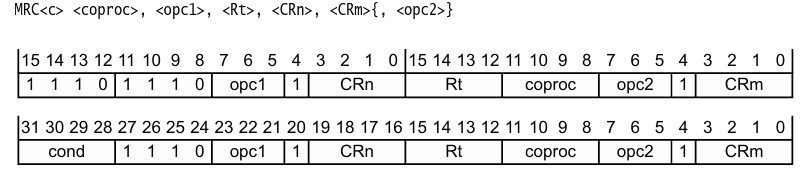

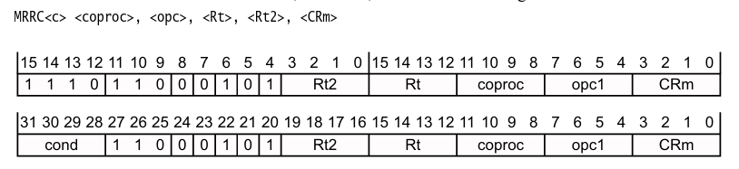

> `MRC`指令读取指定协处理器的一个32位寄存器并存入到1个指定的GPR，而`MRRC`指令读取指定协处理器的一个64位寄存器并存入到2个指定的GPR
>
> `MRC`指令中，`opc1`以及`opc2`为操作码，`CRn`以及`CRm`为协处理器中的逻辑寄存器。由于`MRC`指令中操作码长度为`3`，所以每个操作码支持`8`种操作；而`CRn`和`CRm`地址长度为`4`，所以支持`16`个寄存器，使用`c0`到`c15`表示
>
> 协处理器如`CP15`在实际的应用中作为配置寄存器使用。我们可以将协处理器完全视作一堆寄存器，而`opc1 opc2 CRn CRm`中所有编码的任意组合视作一个地址，那么一个协处理器可以支持`2^(3+3+4+4)=16384`个`32`位寄存器。而如果使用`MRRC`访问，一个协处理器可以支持`2^(4+4)=256`个`64`位寄存器

### 2.2.3 系统控制：协处理器CP15

`CP15`为System Control coprocessor，在系统的控制中有重要作用。而在Cortex-M中这些配置寄存器通常位于内存空间，使用例如`SCB` `MPU`这样的结构体访问

> 使用`MRC`指令访问时，指令中的`CRn`指定`CP15`的`Primary register`；使用`MRRC`访问时，指令中的`CRm`指定`CP15`的`Primary register`。协处理器中同一个`Primary register`对应的物理寄存器功能通常属于同一类别，如下所示

`CP15`中各`Primary register`对应寄存器的主要作用

| 寄存器编号 | 作用 |
| :-: | :-: |
| `c0` | 处理器基本信息 |
| `c1` | System Control registers，系统控制 |
| `c2 c3` | Memory protection and control registers，用于配置MMU |
| `c5 c6` | Memory system fault registers，访存错误信息 |
| `c7` | Cache maintenance and other functio访问ns，主要用于配置Cache |
| `c8` | TLB maintenance operations，用于配置TLB快表 |
| `c9` | Performance monitors，用于监视性能 |
| `c12` | Security Extensions registers，TrustZone扩展 |
| `c13` | Process, context and thread ID registers，操作系统相关 |
| `c15` | Implementation defined |

以下是`CP15`中**部分**物理寄存器的作用，在C代码中访问`CP15`时使用这些寄存器名访问

| 寄存器名 | 作用 | 所属 |
| :-: | :-: | :-: |
| `MIDR` | Main ID，主要是处理器的基本信息 | `c0` |
| `MPIDR` | 用于区分多核系统中的每个核 | `c0` |
| `SCTLR` | System Control Register，最重要的**系统控制**寄存器 | `c1` |
| `ACTLR` | Auxiliary Control Register，不同的处理器功能不同 | `c1` |
| `CPACR` | 控制除`CP14 CP15`以外所有的协处理器访问权限 | `c1` |
| `SCR` | 安全配置，用于TrustZone扩展 | `c1` |
| `TTBR0` | MMU相关，level 1转换表基址 | `c2 c3` |
| `TTBR1` | MMU相关，level 1转换表基址 | `c2 c3` |
| `TTBCR` | 控制`TTB0`和`TTB1` | `c2 c3` |
| `DFSR` | 数据访存错误状态信息 | `c5 c6` |
| `IFSR` | 指令访存错误状态信息 | `c5 c6` |
| `DFAR` | 数据访存错误地址（Virtual address） | `c5 c6` |
| `IFAR` | 指令访存错误地址（Virtual address） | `c5 c6` |
| `VBAR` | TrustZone扩展，非Monitor模式中断异常向量基址 | `c12` |
| `MVBAR` | TrustZone扩展，Monitor模式中断异常向量基址 | `c12` |
| `CONTEXTIDR` | ASID | `c13` |
| `CBAR` | GIC、定时器等外设配置基址 | `c15` |

`SCTLR`**寄存器**

`SCTLR`长度32位，位于`c1`，是重要的系统配置寄存器，同时也是A系列处理器MMU的配置寄存器之一，完整定义如下

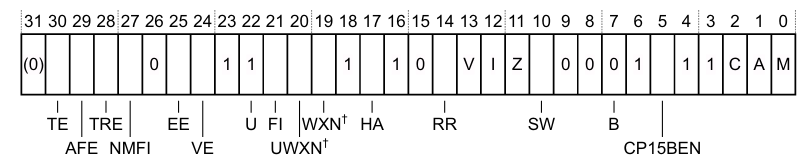

这里只讲述部分bit的定义，如下

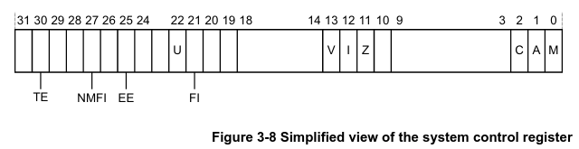

| 名称 | 位域 | 作用 | 复位值 | R/W | 备注 | TrustZone |
| :-: | :-: | :-: | :-: | :-: | :-: | :-: |
| `TE` | 30 | 进入异常时使用`0`ARM模式或`1`Thumb模式 | 通常`0` | RW | 控制包括`Reset`异常在内的模式，可使用外部信号配置默认复位值 | Banked |
| `NMFI` | 27 | 是否支持`NMFI`不可屏蔽`FIQ`。为`1`表示`CPSR.F`无法置`1` |  | R | `NMFI`特性只能通过硬件配置，软件无法更改。支持虚拟化扩展的处理器通常不支持`NMFI` | Common |
| `EE` | 25 | 进入异常时使用`0`小端模式或`1`大端模式 | 通常`0` | RW | 控制包括`Reset`异常在内的模式，可使用外部信号配置默认复位值。同时控制内存映射表的大小端 | Banked |
| `U` | 22 | 表示访存对齐模式，`1`表示支持不对齐访问 | `1` | R | ARMv7中永远为`1` | Common |
| `FI` | 21 | `FIQ`响应性能配置。`0`普通，`1`快速 | `0` | RW | 在支持TrustZone扩展的处理器中，只有在Secure模式下该位才可更改 | Common |
| `V` | 13 | 中断向量表基址设置。`0`位于`0x00000000`，`1`位于`0x0000FFFF` | 通常`0` | RW | 可使用外部信号配置默认复位值。支持TrustZone的处理器可以配置`V=0`时的基址 | Banked |
| `I` | 12 | 为`1`使能Icache指令缓存 | `0` | RW |  | Banked |
| `Z` | 11 | 为`1`使能分支预测 | `0` | RW | 部分处理器不支持分支预测或无法禁用该特性 | Banked |
| `C` | 2 | 为`1`使能Dcache以及L2缓存 | `0` | RW |  | Banked |
| `A` | 1 | 为`1`使能访存对齐检查，不对齐访存会触发`Abort`（`Alignment Fault`） | `0` | RW | 带有虚拟化扩展的处理器中非对齐访问`Device`或`Strongly-ordered`永远会触发`Abort` | Banked |
| `M` | 0 | 为`1`使能1级MMU（PL1&0） | `0` | RW | 带虚拟化扩展的处理器支持2级MMU（PL1&0），以及1级MMU（PL2,1&0） | Banked |


### 2.2.4 VFP与NEON SIMD寄存器

## 3 内存架构

## 3.1 Cache

## 3.2 MMU

## 4 中断与异常

## 5 指令集

## 6 GNU汇编

GNU汇编源代码使用`.s`文件后缀。每一行代码的基本格式如下

```arm
label: instruction @ comment
```

每一行汇编代码中，这三者不一定都出现

其中`label`后面必须接`:`，用于给一段代码、函数或一段数据命名，之后在汇编指令中可以使用这些`label`进行程序的跳转，函数的调用，以及变量、只读数据的访问等。汇编器会自动计算`label`的地址

`instruction`可以是一条汇编指令，也可以是directives（以`.`开头），用于给汇编器提供必要的解释性信息

| Directives | 作用 |
| :-: | :-: |
| `.code16 .thumb` `.code32 .arm` | 规定使用的指令集 |
| `.include "<filename>"` | 包含的文件 |
| `.end` | 汇编文件的结束，通常不使用 |
| `.equ <name>, <value>` | 为一个symbol赋值 |
| `.set` |  |
| `.req` |  |
| `.section` |  |
| `.global` |  |
| `.byte <byte1>{, <byte2>...}` | 字节数据 |
| `.hword <short1>{, <short2>...}` | 半字数据（2字节） |
| `.word <word1>{, <word2>...}` | 单字数据（4字节） |
| `.ascii "<string>"` `.asciz "<string>"` | 字符串数据，通常放在数据Section中。`.asciz`在末尾自动加上`NULL` |
| `.balign 2{, <fill_value>{, <max_padding>}}` | 按`2`字节对齐，也可以其他`2^n`字节。可以设置占位数据，以及padding限制（超过就不会进行对齐） |
| `.space` |  |
| `.if .else .endif .ifdef .ifndef` | 条件编译 |
| `.err` |  |
| `.macro .exitm .endm` |  |
| `.rept .endr` |  |
| `.irp .endr` |  |


## 7 ARMv8-A