# 数字电路基础以及 Verilog FPGA 开发入门笔记

有关数字电路的一些较为底层的理论知识，Verilog语法、仿真以及FPGA开发入门

可以作为CPLD、FPGA以及ASIC开发的基础知识


## 参考书籍

*Fundamentals of Digital Logic with Verilog Design (Second Edition), Stephen Brown, Zvonko Vranesic, Canada, 2007*

*CPU自作入門, Kazutoshi Suito, Ryo Yonezawa, Yuji Fujita, Japan, 2012*


## 开发平台

EDA: Intel Quartus Prime Lite

FPGA: Intel Altera Cyclone IV EP4CE10E22C8N

**2021.02.20更新：之前在网上找类似ModelSim的Verilog仿真软件时，了解到国外高校教学很多都使用开源的Verilator和iVerilog（Icarus Verilog），配合gtkwave波形编辑器使用。在搜索FreeBSD、ArchLinux仓库之后发现官方仓库都有收录，可以直接安装。加上《CPU自制入门》介绍了Icarus Verilog和gtkwave的使用，因此添加Verilator、iVerilog以及gtkwave的使用教程**


## 0 先行预备知识

~~这里假设已经会C语言，直接从数字集成电路的底层讲起~~，只补充集成电路的物理构成与原理


### 0.1 半导体：N型和P型

**N型半导体**：通过粒子加速向硅等4价元素单质（本征半导体）掺杂高价元素如5价磷、5价砷等形成，呈电中性，**自由电子为多数载流子（空穴为少数载流子）**

**P型半导体**：掺杂低价元素如3价硼，3价铟等形成，呈电中性，**自由空穴为多数载流子（电子为少数载流子）**

**掺杂工艺**：通过高能电场加速将要掺杂的杂质粒子嵌入到硅基板，之后通过退火（Anneal）热处理，使得不在晶格处的杂质粒子归位并产生自由载流子，并修复掺杂过程中产生的晶格缺陷。杂质浓度越高，导电性越强

**PN结（PN junction）**：将一个P型半导体和N型半导体放在一起就可以形成一个PN结。由于P和N型半导体的载流子浓度差异巨大，**P半导体的空穴会向N半导体扩散，N半导体的电子会向P半导体扩散，这样P半导体交界处会带上负电，N半导体交界处会带上正电，形成一个由N半导体指向P半导体的阻止粒子继续扩散的电场，最终达到动态平衡**。这片区域为空间电荷层，由于此处双方都缺少多数载流子，也被称为**耗尽层**

想要使得一个PN节导电，只要添加外部电场消除耗尽层的电场即可。方法就是**将P半导体接到高电位，将N半导体接到低电位，这样PN结处就会开始导电**。如果添加相反电场则会使得耗尽层变厚，这也是PN结单向导电的原理


### 0.2 晶体管：NMOS和PMOS以及工作原理

现代硅基数字集成电路都是由MOSFET构成，MOSFET分为NMOS（N沟道）和PMOS（P沟道），NMOS结构如下图


在集成电路中，NMOS的G极作输入端，和衬底以及SD之间有二氧化硅隔开，输入电阻理想状态是无穷大，S和D极是完全相同的两端，当G极输入高电平时S和D导通。S和D极为N型半导体，衬底为P型半导体，连接低电势位。S和D极电势一定大于等于衬底

当NMOS的G极输入高电平时，可以将P型衬底的少数电子全部吸引到靠近G极处，在二氧化硅层下形成电子载流区，连通S和D极，此时S和D极之间导通

PMOS和NMOS原理相反，S和G极为P型半导体，衬底为N型半导体，连接高电势位。当G极输入低电平时导通，如下图


### 0.3 工艺：TTL和CMOS

一般常见的74系列数字电路分为"LS"TTL型和"HC"CMOS型两大系列。TTL型电路一般只使用单一种类三极管或MOS管构建，而CMOS全称为"Complementary Metal Oxide Semiconductor"，顾名思义CMOS使用了NMOS和PMOS两种极性互补的MOS管构建电路

TTL一般只由单一极性晶体管（BJT或MOSFET）配合电阻构建，由于工作需要持续电流，功耗较大，以非门为例


而CMOS使用互补晶体管，同一时间只有其中一种晶体管导通。而MOS管G极电阻近乎无穷大，这也是CMOS电路省电的原因。CMOS电路一般只在动态切换时会产生漏电增加功耗，静态功耗很小可忽略不计，同样以非门为例


## 1 数字电路基础

*记录比较常用的一些理论以及解决问题的方法*


### 1.1 布尔（逻辑）代数公理

用于基本与或非电路的设计

*（离散数学学过了）*

| 名称 | 公式 |
| :--: | :--: |
| 双否律 | ~~A = A |
| 交换律 | A·B = B·A, A+B = B+A |
| 结合律 | (A·B)·C = A·(B·C), (A+B)+C = A+(B+C) |
| 分配律 | (A·B)+C = (A+C)·(B+C), (A+B)·C = (A·C)+(B·C) |
| 德摩根律 | ~(A+B) = (~A)·(~B), ~(A·B) = (~A)+(~B) |
| 吸收律 | A·(A+B) = A, A+(A·B) = A |
| 幂等律 | A+A = A, A·A = A |
| 同一律 | A+0 = A, A·1 = A |
| 零一律 | A·0 = 0, A+1 = 1 |
| 排中律 | (~A)+A = 1 |
| 矛盾律 | (~A)·A = 0 |
| 异或等价公式 | A⊕B = (B·~A)+(A·~B) | 
| 补充吸收律（在之后的异步电路的设计中涉及到冒险竞争，可吸收的那一项被称为冗余项） | AB+(~A)C+BC = AB+(~A)C |

补充吸收律证明：AB+(~A)C+BC = AB+(~A)C+BC((~A)+A)

= AB+(~A)C+(~A)BC+ABC

= A(B+BC)+(~A)(C+BC)

= AB+(~A)C


### 1.2 触发器，寄存器，计数器

逻辑电路中，触发器为重要组成部分，带入了同步时序（异步时序使用反馈回环实现），将逻辑电路的行为从空间扩展到了时间，从组合逻辑到时序逻辑


### 1.2.1 RS锁存器

**RS锁存器** 电路如下


可以看作由两个非门的电路演变而来


经过分析，RS锁存器行为可定义如下

| S | R | Q | ~Q |
| :-: | :-: | :-: | :-: |
| 0 | 0 | 0/1 | 1/0 |
| 1 | 0 | 1 | 0 |
| 0 | 1 | 0 | 1 |
| 1 | 1 | 0 | 0 |

当S,R都为0时输出状态保持不变。S高电平R低电平置位，R高电平S低电平复位，RS高电平输出都为低电平

*注意：RS触发器在RS端都为0时上电瞬间，以及RS端同时从1跳变为0时会出现短时间振荡*

**门控RS锁存器**


就是在RS触发器基础上加一个输入控制门

与非门实现的门控RS锁存器


表示符号如下


*注意：同上，当RS端同时为1时，如果Clk负跳变会导致短时间振荡*


### 1.2.2 D锁存器

D锁存器就是为了解决RS触发器可能出现的不确定情况而出现的（防止RS同时为1）


D高电平，Clk高电平，D被锁存

电路符号如下


**主从D触发器**

主从D触发器结构如下图


D在Clk高电平时被主触发器取样，输出不变，Clk变为低电平后从从触发器输出

电路符号如下


**边沿触发D触发器**

边沿触发D触发器结构如下图


由上图分析，当Clk为0时，P1 = P2 = 1，P3 = D，P4 = ~D，触发器状态不变。若Clk正跳变时D为0，P1 = 1，P4 = 1，P2 = 0，P3 = 0，Q = 0，此时若D变为1，由于P2 = 0锁死了P4 = 1，所以不会有变化。若Clk正跳变时D为1，P1 = 0，P4 = 0，P2 = 1，P3 = 1，此时若D变为0，由于P1 = 0锁死了P3 = 1，P2 = 1，所以也不会有变化。

边沿D触发器可以保证在Clk高电平时D发生改变而输出状态不变

电路符号如下


**有清零端和预置信号的D触发器**

带清零端和置位端的主从D触发器


使用时，需要保持清零端和置位端为高电平。清零和置位为异步于时钟，低电平有效


带清零端和置位端的沿触发D触发器


使用时，需要保持清零端和置位端为高电平。清零和置位为异步于时钟，低电平有效


**同步清零的实现：**

如下，实现同步清零直接在数据输入端加一个与门即可


### 1.2.3 T触发器

T触发器结构如下图


T触发器符号


T触发器行为可以定义如下：如果T = 0则不跳变；如果T = 1则不停跳变


### 1.2.4 JK触发器

JK触发器结构如下图


JK触发器有两个输入端J和K，既可以当RS触发器使用，也可以当T触发器使用（T触发器就是由JK触发器演变而来）。R = S = 1在RS触发器中是不允许的状态，此时JK触发器可以相当于T触发器T = 1不停跳变；其他状态相当于J = S，K = R，相当于RS触发器的RS端


### 1.2.5 寄存器

**移位寄存器**


移位寄存器由沿触发D锁存器组成，一个D触发器的Q输出端接下一个D触发器D输入端，原理好理解

**并行存取移位寄存器**


并行存取移位寄存器结合了并行寄存器以及移位寄存器的功能，加入了外部电路，实现~SHIFT/LOAD端低电平时串行移位，高电平时并行置位，如图原理好理解


### 1.2.6 计数器

**异步计数器(Asynchronous Timer)**


异步计数器由T触发器组成，上一个触发器的反相输出端连接下一个触发器的时钟输入端，T输入端接高电平

以上是递增计数器，递减计数器如下


异步计数器由于时钟经过每一级都会有延迟，所以不能用于对时序要求高的高频场合

**同步计数器(Synchronous Timer)**


同步计数器保证了时钟的同步，所有位延迟相同

同步计数器添加复位和使能端后如图，复位为异步复位，使能端即第一个触发器的T端


**D触发器实现的同步计数器**

由T触发器的实现电路简化而来（使用一个异或门和一个D触发器同样可以等价实现T触发器）


**支持并行加载的计数器**

计数器可以使用触发器自带的异步Preset以及Clear端进行置位或复位，这里使用另外一种同步并行加载法


并行加载计数器的应用：并行加载的计数器可以添加少量外部器件构建任意模数以及复位初始值的计数器，可以使用与门使计数器计数到特定值后输出高电平到Load端，加载预置输入，如下图实现了一个模6（输出0~5）计数器


该模6计数器时序图如下


由上图分析，在计数器计数到5后，Load变为高电平，下一次时钟到来时会直接将预置值加载

下图示例另外一种使用异步复位端的模5计数器以及其时序图，并说明这种设计的缺陷


这个计数器设计和以上同步加载的相同，区别是它只能作为模5（输出0~4）计数器使用，由时序图可知，其输出为5的时间非常短，但是确实会输出5用于复位（输出为5后立即强制复位），和时钟无关，只和门电路固有延迟有关。虽然这个电路相对来说更简单，但是这在一个数字系统中，尤其是使用同步时钟的系统，是可能带来不可预知的行为的，要尽量避免。

**BCD（8421码计数器）**


由同步加载计数器可以设计出以上2位BCD码计数器。计数器巧妙应用了第2位计数器的Enable端，可以实现逢十进一。

**环形计数器**

环形计数器原理和移位寄存器差不多，区别于一般二进制计数器，环形计数器输出不代表二进制数，同一时刻只有一个输出为高电平（独热码）。


如图，模n环形计数器有一个异步Start端，相当于是这个计数器的复位端，Start高电平将Q0置位为1，其他复位为0，时钟触发后Q0逐个移位作为计数功能

环形计数器也可以使用一般二进制计数器加上译码器组成，适用于较大的环形计数器

**Johnson计数器**


Johnson计数器和环形计数器差不多，区别就是Johnson计数器复位后所有位为0，且最后一位的反相输出端连接到第一个触发器的输入端，Johnson计数器工作输出规律如下：0000,1000,1100,1110,1111,0111,0011,0001,0000


### 1.3 组合逻辑表达式的推导

有两种方法，所有真值为1的项的主析取范式（积之和），或所有真值为0的项的主合取范式（和之积），具体视情况而定，尽量使用较简单的方法

**示例**

有如下真值表，ABC为输入，X为输出

| A | B | C | X |
| :-: | :-: | :-: | :-: |
| 0 | 0 | 0 | 1 |
| 1 | 0 | 0 | 1 |
| 0 | 1 | 0 | 0 |
| 1 | 1 | 0 | 1 |
| 0 | 0 | 1 | 0 |
| 1 | 0 | 1 | 1 |
| 0 | 1 | 1 | 0 |
| 1 | 1 | 1 | 0 |

**取1项作主析取范式（正则积之和形式，每一个积都是最小项）**

> X = (~A)·(~B)·(~C) + A·(~B)·(~C) + A·B·(~C) + A·(~B)·C

**取0项作主合取范式（正则和之积形式，每一个和都是最大项）**

> X = (A+(~B)+C) · (A+B+(~C)) · (A+(~B)+(~C)) · ((~A)+(~B)+(~C))

**积之和/和之积互相转换**

以上为例，积之和为

> X = (~A)·(~B)·(~C) + A·(~B)·(~C) + A·B·(~C) + A·(~B)·C

没有出现的项为

> A·B·C, (~A)·B·C, (~A)·(~B)·C, (~A)·B·(~C)

那么

> ~X = A·B·C + (~A)·B·C + (~A)·(~B)·C + (~A)·B·(~C)

由双否律以及德摩根律又可以推出

> X = ~~X = ~(A·B·C + (~A)·B·C + (~A)·(~B)·C + (~A)·B·(~C))
> 
> X = ((~A)+(~B)+(~C)) · (A+(~B)+(~C)) · (A+B+(~C)) · (A+(~B)+C)

*反之求和之积的积之和同理*

**补充：积之和/和之积一般表示方式**

积之和

> X = m0 + m1 + m3 + m5 = ∑m(0, 1, 3, 5)

和之积

> X = M2 · M4 · M6 · M7 = ∏M(2, 4, 6, 7)

*最小项与其对应的最大项关系 m2 = ~M2（德摩根）*


### 1.4 组合逻辑电路的优化

在逻辑电路的设计中，同一个电路一般有多种具体实现，考虑到成本，设计复杂度以及功耗，需要对电路进行化简

门电路数以及门电路输入端数量之和为衡量电路成本的重要因素


### 1.4.1 一般化简

简单情况下，逻辑电路的化简，就是使用布尔代数公理，化简积之和/和之积的过程

在之前的示例中，可以化简积之和如下

> X = (~B)·(~C) + (~B)·A + (~C)·A = （~B)·A + (~C)·A


### 1.4.2 优化理论概要：卡诺图法，列表法和立方体表示法

在大规模电路中，一般的根据布尔代数公理推导会非常复杂，因此引入一套完整的理论用于逻辑代数的优化，也可以看作是通用的高级优化方法。这些方法被广泛应用于集成电路设计以及FPGA的EDA中。常见的有卡诺图法、列表法以及立方体化简法。卡诺图法和列表法适合于简单逻辑的设计，适合手动操作，不适用于复杂的电路（是个NP完全问题，也不适用于计算机解决）；立方体法经过改良（实际同样是个NP完全问题，可以改良使用启发式算法）可以用于计算机算法。目前在数字电路设计的领域已经开发出了很多相关算法，有兴趣的可以看看国外论文


### 1.4.3 图表法（卡诺图法，适用于人工作业）

*可以使用积之和，也可以和之积，原理相同*

**二变量卡诺图**

真值表

| X1 | X2 | X |
| :-: | :-: | :-: |
| 0 | 0 | m0 |
| 0 | 1 | m1 |
| 1 | 0 | m2 |
| 1 | 1 | m3 |

卡诺图

| X2 \ X1 | 0 | 1 |
| :-: | :-: | :-: |
| 0 | m0 | m2 |
| 1 | m1 | m3 |

这里设 m0=1, m1=1, m2=0, m3=1 

| X2 \ X1 | 0 | 1 |
| :-: | :-: | :-: |
| 0 | 1 | 0 |
| 1 | 1 | 1 |

**分析**：由上图可以发现，X1=0 对应的列为1，X2=1 对应的行为1，直接可以得出

> X = (~X1) + X2

**三变量卡诺图**

真值表

| X1 | X2 | X3 | X |
| :-: | :-: | :-: | :-: |
| 0 | 0 | 0 | 0 |
| 0 | 0 | 1 | 1 |
| 0 | 1 | 0 | 0 |
| 0 | 1 | 1 | 0 |
| 1 | 0 | 0 | 1 |
| 1 | 0 | 1 | 1 |
| 1 | 1 | 0 | 1 |
| 1 | 1 | 1 | 0 |

卡诺图，三维表格

| X3 \ X1X2 | 00 | 01 | 11 | 10 |
| :-: | :-: | :-: | :-: | :-: |
| 0 | 0 | 0 | 1 | 1 |
| 1 | 1 | 0 | 0 | 1 |

这里X1X2行需要使用格雷码，有关格雷码这里~~随便乱写~~了一个生成器，[查看源码](src/200920c01/graycode/gray.c)

**分析**：由上图，可以把表想象成可以卷起来的圆筒，X1X2行构成循环，所以X1X2=00 X3=1以及X1X2=10 X3=1也要考虑 

> X = X1(~X3) + (~X2)X3

**卡诺图优化一般规律总结**

找到卡诺图里面相邻2^n(2, 4, 8, 16...)个都是1的格子，可以合并成一个项，在拐角处相交重合的也可以优化，正方形的也可以优化成一个项，总之基本原则就是使用尽量少的优化次数优化尽量多的项，并且一次优化的数量在允许范围内要尽可能多，以减少单个项的元素数，例如在有正方形存在情况下就不要使用相邻两个优化了

**再举例：四变量卡诺图**

四维表格

| X3X4 \ X1X2 | 00 | 01 | 11 | 10 |
| :-: | :-: | :-: | :-: | :-: |
| 00 | 1 | 0 | 0 | 1 |
| 01 | 0 | 0 | 0 | 0 |
| 11 | 1 | 1 | 1 | 0 |
| 10 | 1 | 1 | 0 | 1 |

通过观察

> X = (~X1)X3 + (~X2)(~X4) + X2X3X4

**扩展：五变量卡诺图**

五维表格，可以使用两张四维表格表示

X5 = 0

| X3X4 \ X1X2 | 00 | 01 | 11 | 10 |
| :-: | :-: | :-: | :-: | :-: |
| 00 | 0 | 0 | 0 | 0 |
| 01 | 0 | 0 | 1 | 1 |
| 11 | 1 | 1 | 0 | 0 | 
| 10 | 1 | 1 | 0 | 0 |

X5 = 1

| X3X4 \ X1X2 | 00 | 01 | 11 | 10 |
| :-: | :-: | :-: | :-: | :-: |
| 00 | 0 | 0 | 0 | 1 |
| 01 | 0 | 0 | 1 | 1 |
| 11 | 1 | 1 | 0 | 0 | 
| 10 | 1 | 1 | 0 | 0 |

> X = (~X1)X3 + X1(~X3)X4 + X1(~X2)(~X3)X5

**卡诺图法小记**

卡诺图法只适用于少量变量的情况

介绍几个概念：

> 蕴含项：可以使f=1的项
>
> 质蕴含项：不可再次合并为项数更少的项
> 
> 本质蕴含项：不可缺少，必须包含的质蕴含项，其他可有可无的为非本质蕴含项
>
> 覆盖：一个蕴含项的集合可以说明函数值为1的所有情况
> 
> 成本：假设求反成本为零，门电路数与输入端数之和

在优化中，要在可能的蕴含项集合中凑出相比其他大部分方案更节约成本的方案，因为可能的解法一般远远不止一种，而且这些方案成本一般会不同

有时候会碰到根本不存在本质蕴含项的情况，这种情况只能逐个方案计算比较（一般如果图中所有蕴含项排列正好形成一个闭环首尾相接，就会出现这种情况）

**补充：非完全指定函数**

有时候一个逻辑电路的所有输入情况并不会全部出现，这种情况下就会形成非完全指定函数，如下例

| X3X4 \ X1X2 | 00 | 01 | 11 | 10 |
| :-: | :-: | :-: | :-: | :-: |
| 00 | 0 | 1 | d | 0 |
| 01 | 0 | 1 | d | 0 |
| 11 | 0 | 0 | d | 0 | 
| 10 | 1 | 1 | d | 1 |

其中，d代表的输入永远不会出现

这样，可以把部分d补为1，以实现最简电路

| X3X4 \ X1X2 | 00 | 01 | 11 | 10 |
| :-: | :-: | :-: | :-: | :-: |
| 00 | 0 | 1 | 1 | 0 |
| 01 | 0 | 1 | 1 | 0 |
| 11 | 0 | 0 | d | 0 | 
| 10 | 1 | 1 | 1 | 1 |

> X = X2(~X3) + X3(~X4)

**补充：多输出电路**

很多时候要求一个电路输出端不止一个，这时候就要求设计共用尽量多的电路，以下为一般方法

f1定义

| X3X4 \ X1X2 | 00 | 01 | 11 | 10 |
| :-: | :-: | :-: | :-: | :-: |
| 00 |  |  |  |  |
| 01 | 1 | 1 | 1 |  |
| 11 | 1 | 1 | 1 |  | 
| 10 |  | 1 |  |  |

f2定义

| X3X4 \ X1X2 | 00 | 01 | 11 | 10 |
| :-: | :-: | :-: | :-: | :-: |
| 00 |  |  |  |  |
| 01 | 1 |  | 1 | 1 |
| 11 | 1 |  | 1 | 1 | 
| 10 |  | 1 |  |  |

> f1 = X1X2X4 + (~X1)X2X3(~X4) + (~X1)X4
>
> f2 = X1X2X4 + (~X1)X2X3(~X4) + (~X2)X4

可以达到共用的目的

**补充：多级综合问题**

有时候当一个电路的输入端过多时，需要解决电路的扇入问题

在一般的逻辑电路中，与门输入端一般不超过8个，FPGA中单个LUT的输入也是相当有限的，所以要将多输入的逻辑函数分解成多级以适应具体的电路限制

示例：

> f = X1X3(~X6) + X1X4X5(~X6) + X2X3X7 + X2X4X5X7

提取公因式

> f = X1(~X6)(X3 + X4X5) + X2X7(X3 + X4X5)

可以用于2输入端逻辑单元的FPGA

补充：子函数分解

有时候可以将某些部分看作一个完整的子函数，可以大大降低电路成本

示例：

> f = ((~X1)X2 + X1(~X2))X3 + (X1X2 + (~X1)(~X2))X4

推导可知

> (~X1)X2 + X1(~X2) = ~(X1X2 + (~X1)(~X2))

可以将(~X1)X2 + X1(~X2)看作一个子函数g(X1, X2)

那么

> f = g(X1, X2)·X3 + ~g(X1, X2)·X4

### 1.4.4 列表法/立方体表示法简介

所谓立方体实际是一个抽象概念

设想这样一个由3位格雷码生成的立方体


**所有边连接的两个顶点都只有一个比特不同**，一条边代表有两个比特相同的项，比如连接 000 010 的边代表项 (~X1)(~X3)，可以表示为 0x0。相似的，一个面 000 100 010 110 代表项 (~X3)，可以表示为 xx0。立方体中每个顶点都和另外3个顶点相连，这另外3个顶点正好就只差一个比特。**所谓立方体就是指的这种互联结构。这种互联结构可以看作多维立方体（2^n个顶点），内部包含低于其维度的子立方体**。

要找出一个电路的优化，首先就要找出所有f=1的边。

立方体的合并：两个小立方体可以合并成为一个大立方体。例如：0xx1x 和 0xx0x 可以合并为 0xxxx

### 1.4.5 列表法化简

设 f = ∑m(0, 4, 8, 10, 11, 12, 13, 15)

可以列表如下

| m | x x x x |
| :-: | :-: |
| 0 | 0 0 0 0 |
| 4 | 0 1 0 0 |
| 8 | 1 0 0 0 |
| 10 | 1 0 1 0 |
| 12 | 1 1 0 0 |
| 11 | 1 0 1 1 |
| 13 | 1 1 0 1 |
| 15 | 1 1 1 1 |

最终合并如下

| m | x x x x |
| :-: | :-: |
| 8,10 | 1 0 x 0 |
| 10,11 | 1 0 1 x |
| 12,13 | 1 1 0 x |
| 11,15 | 1 x 1 1 |
| 13,15 | 1 1 x 1 |

| m | x x x x |
| :-: | :-: |
| 0,4,8,12 | x x 0 0 |

设P={10x0, 101x, 110x, 1x11, 11x1, xx00} = {p1, p2, p3, p4, p5, p6}，可以列出蕴含列表如下

| P | 0 | 4 | 8 | 10 | 11 | 12 | 13 | 15 |
| :-: | :-: | :-: | :-: | :-: | :-: | :-: | :-: | :-: |
| p1 |   |   | √ | √ |   |   |   |   |
| p2 |   |   |   | √ | √ |   |   |   |
| p3 |   |   |   |   |   | √ | √ |   |
| p4 |   |   |   |   | √ |   |   | √ |
| p5 |   |   |   |   |   |   | √ | √ |
| p6 | √ | √ | √ |   |   | √ |   |   |

由上表，p6唯一覆盖了0 4，必须包含

去掉p6行以及对应的0,4,8,12列，得到下表

| P | 10 | 11 | 13 | 15 |
| :-: | :-: | :-: | :-: | :-: |
| p1 | √ |   |   |   |
| p2 | √ | √ |   |   |
| p3 |   |   | √ |   |
| p4 |   | √ |   | √ |
| p5 |   |   | √ | √ |

**支配行**：由上表可以看到p2包含了p1的情况，称为p2支配p1，并且p2和p1实现成本相同，因此可以去掉p1（如果p2实现成本高于p1则不可删除），同理可以去掉p3得到下表

另外还有**支配列**的概念，和支配行类似，不同的是支配列去掉的是支配列而不是被支配列，好理解

| P | 10 | 11 | 13 | 15 |
| :-: | :-: | :-: | :-: | :-: |
| p2 | √ | √ |   |   |
| p4 |   | √ |   | √ |
| p5 |   |   | √ | √ |

发现p2和p5不可删除，p4包含在p2和p5里面

所以最终覆盖C={p2, p5, p6}={101x, 11x1, xx00}

**列表法算法小结**

>   1. 首先根据真值表列出所有f=1的最小项，使用立方体比较产生f的所有质蕴含项
>   2. 列出质蕴涵项覆盖表
>   3. 将当前已经发现的本质蕴含项包含到最终覆盖表并去除对应行和列
>   4. 使用行支配以及列支配进一步化简，注意先比较成本再决定是否删去
>   5. 重复3至4，直到覆盖表变空或不可化简
>   6. 若化简后不为空，用分支法确定哪些项应该包含在最终覆盖表中（一个一个算并对比）

*列表法局限性：一般逻辑函数很少以最小项形式给出，而是以代数表达式或立方体集合给出。这样就需要先将代数表达式和立方体集合扩展成为最小项形式。这样的覆盖表会变得非常大，立方体简化也会异常复杂，算法速度很慢*

### 1.4.6 立方体表示法化简

~~记于2021.2.19：这种算法复杂度依然非常高x，也是NP完全问题，一般市面上的EDA都会用更加优化的方法，并且很少开放~~。有兴趣可以了解一下加州大学伯克利分校的Espresso，使用启发式的算法

这些算法一般会在EDA里面集成用于电路的优化，一般用户不用考虑这些算法，了解一下就可以（~~除非你要开发一个EDA~~）

实际应用中，EDA一般得到的用户输入都是蕴含项之和的形式，这些蕴含项不一定是最小项或者质蕴含项。

这里定义 **星积（\*）** 运算：

星积运算一般用于寻找质蕴涵项，运算结果如果是维数大的立方体则保留，维数相同看包含关系决定是否删除（其实就是看生成的C立方体是否被原来的包含）

设A,B为n变量函数中的两个蕴含项

> A = A1A2...An
> 
> B = B1B2...Bn
> 
> Ai或Bi可以为0,1,x

设C = A \* B

\*运算规律如下

| Ai\Bi | 0 | 1 | x |
| :-: | :-: | :-: | :-: |
| 0 | 0 | ∅ | 0 |
| 1 | ∅ | 1 | 1 |
| x | 0 | 1 | x |

生成C规则：

1. 若多于一个Ai\*Bi=∅，则C=∅
2. 以上条件不满足，则当Ai\*Bi=∅时Ci=x；Ai\*Bi≠∅时Ci=Ai\*Bi

计算f质蕴涵项步骤

1. 设Ck为f的一个覆盖，对Ck中所有项两两配对进行\*运算后生成Gk+1
2. 设Ck+1 = Ck ∪ Gk+1 - 冗余立方体（冗余立方体：若A被B所包含，则去掉A，比如00x1和00xx应该去掉00x1）
3. 重复以上运算直到Ck+1 = Ck
4. 最终的C就是质蕴含项集合

再定义一个 **飒（\#）** 运算：

飒运算用于确定本质蕴含项，直接功能是用来判断一个立方体是否包含另一个立方体

\#运算规律如下，\#运算具有反对称性，不支持交换律。ε大概表示覆盖的意思，好理解

| Ai\Bi | 0 | 1 | x |
| :-: | :-: | :-: | :-: |
| 0 | ε | ∅ | ε |
| 1 | ∅ | ε | ε |
| x | 1 | 0 | ε |

生成C规则：

1. 若存在Ai \# Bi = ∅，则C = A （不相交）
2. 若所有Ai \# Bi = ε，则C = ∅ （此时B完全覆盖A）
3. 除以上情况，如果是部分覆盖可能生成一个或多个立方体，即对于每个出现的Ai = x，Bi = 0或1 的情况，都会生成一个C = ∪i(A1, A2,...(~Bi)...,An) （此时B部分覆盖A）。如果生成多个立方体，那么这所有的立方体都要分别进行剩下的运算

**获取本质蕴含项步骤**：

1. 直接套公式：如果pi \# (P - pi) \# DC ≠ ∅ 成立，那么pi就是本质蕴含项

其中，P为质蕴含项总集合（由之前的星积运算得出），pi为其中一个质蕴含项，DC为无关项总集合（即之前提到的值为d的集合）

**使用飒运算的方法举例**

设通过星运算得出的质蕴含项集合P={x01x，x101，01x1，0x1x，xx10}

> 解：
>
> 没有无关项集合DC，首先拿x01x运算，x01x \# x101 = x01x，x01x \# 01x1 = x01x，x01x \# 0x1x = 101x，101x \# xx10 = 1011
>
> 则最终x01x \# ( P - x01x ) = 1011 ≠ ∅
> 
> 其他 x101 \# ( P - x101 ) = 1101 ≠ ∅，01x1 \# ( P - 01x1 ) = ∅，0x1x \# ( P - 0x1x ) = ∅，xx10 \# ( P - xx10 ) = 1110 ≠ ∅
> 
> 最终求得本质蕴含项为x01x，x101，xx10

**总结：使用星运算和飒运算求解最小覆盖**

函数的最初覆盖为DC（无关项的集合）和ON（使f=1的集合）的并集

> 1. 设初始覆盖C0=DC ∪ ON
> 2. 应用星积运算求出所有质蕴含项，形成集合P
> 3. 应用星积运算求出所有本质蕴含项。若本质蕴含项包含了开集ON，则这个本质蕴含项构成最小化覆盖
> 4. 如果质蕴含项pi成本比pj高，并且pi \# DC \# pj = ∅，那么要把pi删掉
> 5. 找出覆盖所有剩余顶点成本最低的质蕴含项，如果找出质蕴含项成本相同，则使用启发式分支算法求出最终解


### 1.5 同步时序电路设计与分析

时序电路又被称为**有限状态机**。由于异步时序设计的复杂性，一般同一模块的电路都使用同步时序设计，而在使用不相关时钟的同步电路之间会涉及到异步时序设计

同步时序电路由基本组合逻辑电路以及触发器组成，使用时钟信号控制，如下


W为输入端，Z为输出端。电路的状态可以取决于当前触发器的输出Q（反馈至输入端）以及电路的输入W。其中触发器应当是边沿触发器，而非普通的D触发器。

电路输出Z仅取决于当前电路状态的电路称为**Moore**型电路，同时取决于当前状态以及主输入的称为**Mealy**型电路


### 1.5.1 Moore型电路基本设计步骤

设想要设计这样一个电路，在连续两个时钟输入1后输出会变成1，一旦输入变为0之后输出变回0。（这样的电路被称为序列检测器）

输出状态变化如下图所示，输出取决于之前的输入


设计这样的电路涉及到状态机理论。可以选择一个状态作为初始态，比如上电复位态。

由以上分析，该状态机需要3个状态：上电且输入W为0，设为状态A；一旦输入1，转为状态B；再次输入1，转到状态C，Z输出1；一旦输入0，就转回A，Z输出0。

假设这里先使用D触发器的方案，使用其他触发器的方案之后讨论

可以得到**状态转移图**如下图


另外注意异步Reset也可以将所有状态强制复位到A，这里省略。

将以上状态转移图转化成为**状态转移表**如下


基本的设计方法如下：

先进行状态赋值

由于只要实现3个状态，使用2个D触发器（状态变量）即可，分别设为y1和y2。（最多可以表示4种状态）基本框图如下：


其中，输出Z只和当前电路状态有关(Moore型电路特性)，是y1、y2的函数。y1和y2的输出反馈至输入一端，和输入W共同决定下一状态。可以列出状态赋值表如下图：


其中，y1=y2=1的情况未被使用到，可以设为任意量利于后续电路简化。根据输入y1、y2、W以及输出下一状态Y1、Y2列表。

接下来就可以使用之前在组合逻辑部分讲述的方法构建并简化逻辑表达式，其中d可以使用随意条件


最终得到的电路如下图所示


波形图如下，**注意观察W是在下一次变化周期到来之前被采样，所以看上去好像y1和y2是在W之后一个周期发生变化，y1和y2在W被采样后的下一个周期内才变换到上一个周期采样应当变换到的状态，有一个时钟的延迟，之后会讲述时钟同步问题**


**补充：最优状态赋值**

获得最优状态赋值没有特殊方法，一般只能暴力穷解，如上例，重新赋值如下，可以得到更简的电路


对于大规模电路来说，基本无法寻找一种最优的赋值（是个NP完全问题），一般EDA厂商使用专用的启发式算法，不公开

**补充：使用一位有效编码（独热码）**

以上方案都使用了二进制编码赋值的方案，优点是使用的触发器比较少，这里介绍一种独热码的方案，使用和状态数相同数量的触发器，这种方案很多时候虽然不是最优，但是很多时候还是有优势的，将上例更改如下


可以发现没有用到y2，EDA会自动检测并删除

有时候使用独热码可以使表达式更简单


### 1.5.2 Mealy型电路设计步骤

Mealy型电路输出和当前电路状态以及当前电路的输入有关

对以上例子进行更改，现在要求状态机在第一次W=1时由A状态转到B状态，之后若W保持为1，输出Z立即变为1，相当于将总的输出时序提前一个周期，在第一次输入W=1之后第二次采样到来之前（此时W=1）Z即输出1

这样状态机只需要两种状态，如下图


注意在这里输出Z被标在了弧线上，而不是状态上，Z需要由当前W的状态决定

这个电路和之前的电路最主要的区别就是输出同时取决于输入，所以列出的状态表输出Z会有W=1和W=0之分，状态表，以及状态赋值表可以表示为如下


设计出的电路如下图


Mealy型电路有更好的灵活性，可以加一个D触发器转换成为如下的Moore型电路


这个电路很熟悉，它就是上面状态赋值中得到的优化电路

Mealy型电路不一定更简，但是由于消除了延迟的一个周期，所以执行同样的操作会比Moore型电路短一个周期。


### 1.5.3 状态最小化

一般设计电路时使用的状态数都会多于最后实际使用的状态数，对状态数进行最小化有利于简化电路

如果一个有限状态机状态可以减少，那么这些状态里面一定有一些状态对外在表现的贡献是等价的

> 这里先引入两个定义
>
> 定义1：如果对于状态Si和Sj，任何输入序列都产生相同的输出序列，则这两种状态称为等价
>
> 如果Si通过w=1到达Su，则称Su为Si的1继承（1-successor），如果Sj通过w=0到达Sv，则称Sv为Sj的0继承（0-successor）。如果输入有多种状态（比如w=10），则称为10继承
>
> 定义2：一个划分可以一个或者多个块构成，状态中每个块包含一个状态子集（~~套娃~~），这些状态可能等价，但是给定块中的状态和其他状态不可以等价

> 在编译原理中已经大概应用过了状态机理论。一个正则表达式，可以先转换为NFA后转换为DFA，**再对DFA进行最小化**。电路的状态最小化其实和DFA最小化过程非常相似，基本是相同的原理

这里直接拿实例讲解最小化过程，一个单一变量输入的有限状态机化简之前的状态表如下

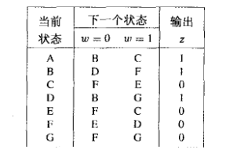

有限状态机的最小化需要根据输出将状态分成两大组

> P1 = (ABCDEFG)
>
> P2 = (ABD)(CEFG)

分成ABD和CEFG两组

分析，(ABD)的1继承为(CFG)，0继承为(BDB)；(CEFG)的1继承为(ECDG)，0继承为(FFEF)。由于(ABD)的1继承全部映射到(CEFG)以内，而0继承全部映射到(ABD)以内，所以(ABD)暂时不拆。而(CEFG)的1继承映射到(ABD)和(CEFG)，0继承映射到(CEFG)，显然(CEFG)需要拆开，拆成(CEG)(F)。这样就需要继续重新检查拆解

> P3 = (ABD)(CEG)(F)
>
> P4 = (AD)(B)(CEG)(F)
>
> P5 = (AD)(B)(CEG)(F) 无法继续拆解

所以最终将(AD)设为A，(B)设为B，(CEG)设为C，(F)设为F。（习惯上取第一个字母，随便命名也可以）

最终得到最小化的状态转移表如下

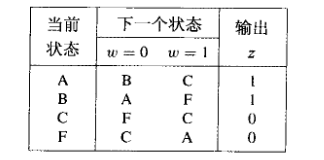


### 1.5.4 同步时序电路设计小结

> 1. 首先进行要求分析
> 2. 推导状态机所有状态，创建状态图
> 3. 将状态图转换成为状态表
> 4. 对状态数量进行最小化，得到最简推导结果
> 5. 对需要的状态进行赋值，注意赋值方案也有最简，要使用最简的
> 6. 选择要使用的触发器类型，推导下一状态的逻辑表达式
> 7. 实现电路设计

**补充：同步时序电路的分析**

分析一个同步时序电路其实基本就是设计的逆过程，可以先根据电路列出逻辑表达式，推导出状态赋值表，如下例


赋值状态表


基于JK触发器的电路的分析同理

**补充：算法状态机图（FSM）**

~~算法状态机图和普通的流程图相似，用于较为复杂的电路，这里不做描述了~~


### 1.6 异步时序电路设计与分析

异步时序电路状态不由时钟脉冲触发，而是由电路各输入端为0或1决定，不使用触发器表示电路状态

**定义：基本模式** 是指异步时序电路**所有输入同时只有一个发生变化**，在两个单次变化之间保证有足够的时间可以使电路达到稳态。**这也是异步电路正常工作的必要条件**（一个电路在特定输入下如果会产生无法预测的行为，是非常糟糕的）

异步时序电路的特征之一就是在有两个输入同时发生变化时可能产生不确定的结果，一个典型的栗子就是RS触发器的RS输入同时从高电平转为低电平时


### 1.6.1 异步行为

如下，可以对RS触发器进行分析（这里只取输出其中一端分析，实际当中最好对所有反馈回环进行分析）


设两个或非门都是理想的没有延迟，取RS触发器的Q进行分析，**在反馈回环添加一个断点**，断点前后延迟就是两个逻辑门的等价延迟，设当前输出为y，输入改变后经过Δ时间以后输出下一状态Y

假设当前Q输出y=0，输入S=R=0；此时若R变为1，S保持0，输出Q不变；接下来S也变为1，输出依然不变（此时电路状态其实是有变化的，或非回环的另一部分变为0）；此时若R再变回0，输出Q会发生变化，此时对应的Y=1≠y，电路处于非稳态，经过Δ延时以后y变为1。

观察上表，表中列出了在y当前输出为0和1时，输入SR后对应的期望输出Y。其中，若期望输出Y和当前y相同，称电路处于稳态，用圆圈圈出；其余会发生变化的称为非稳态

由上表推导，可以得出Y=~R·(S+y)

可以得出状态转移表和状态转移图如下


其中，设输出0为状态A，1为状态B，该电路为Moore型有限状态机

和同步时序电路不同，异步时序电路不使用触发器表示状态，而是直接将逻辑门连接，一般在电路中会形成回环

可以发现，异步电路综合的方法和同步电路还是有相似之处的

下来换一种分析模型，换成**Mealy模型**，状态表和状态转移图如下


上图中，和之前同步电路相同，输出Q对于每个输入SR都有对应的值，但是在状态发生变化时，例如从00变为10，会发生状态的改变，转变为B。**但是根据Mealy型电路的定义，Mealy型电路的输出同时取决于输入和电路状态，也就是说输出和输入之间有直接的逻辑门连接**。而在这里输出直接取决于电路的状态，无需再将输入和输出使用逻辑门直接连接。**在这里应该将其标记为"-"，可以任意赋值0或1**，以简化电路

**术语补充**

流程表：相当于异步电路的状态表

状态转换表/激励表：相当于异步电路的状态赋值表


### 1.6.2 异步电路分析

直接使用例子讲述（可以跳过例1例2直接看例3）

例1：对一个D触发器进行分析


> Y = CD + (~C)y + Dy = CD + (~C)y （补充吸收律）（注意，在这里Dy的存在与否形成的电路并不是等价的，这里存在冒险竞争的问题，在之后章节会解释。该项被称为冗余项，会影响到电路的冒险竞争行为。这个示例去除了该冗余项。）
>
> 使用以上式子对所有输入状态进行分析，可以得出激励表和流程表如下


例2：对主从D触发器进行分析，使用分析异步电路的方法分析同步电路

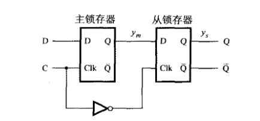

> 在上图中，Ym = CD + (~C)ym (+ Dym)，Ys = (~C)ym + Cys (+ ymys)（最后一项都是冗余项）
> 
> 其中m和s分别代表触发器主级和从级，将这4个状态设为S1~S4，可以以这两个变量构建激励表和流程表

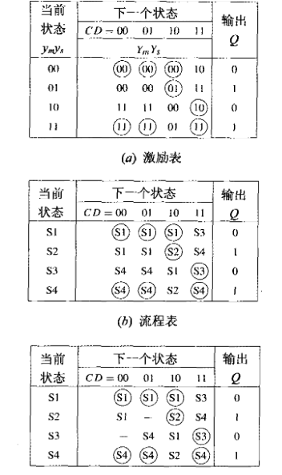

> 解析：注意看上图，绘制了两张流程表，一张带不定项。**其中第一张流程表是直接将式子代入求出来的**。
>
> 但是由于异步电路的基本工作条件，所有输入在同一时刻只能有一个发生变化。**这样我们需要重新审视一下这个流程表之后被设为未定项的位置，可以发现在S2状态时，输入一定是C=1，D=0，而与此对应的CD=01项就会导致C和D同时发生变化，变化结果是未确定的（也可以说这种状态转移在电路中是不可能发生的，这种情况在异步电路中是普遍的）**。所以要将第二张流程表中这两项设为未定项（不可能发生的转移）
>
> 可以得出以下状态转移图

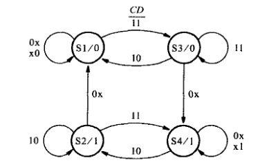

> 而在最后可以使用最上面的激励表反推逻辑表达式，可以得到最初的带冗余项的逻辑表达式。

例3：再拿一个售货机电路分析，通过这个例子可以更加明确的理解异步电路的分析过程，~~前面两个例子随便看看就行~~

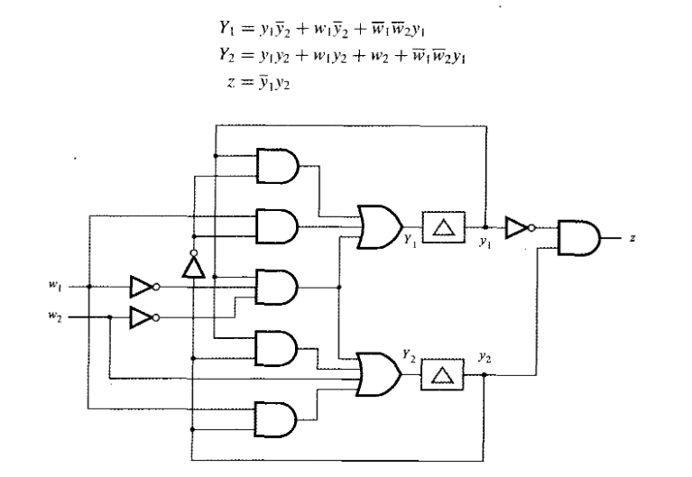

> 以上为售货机电路以及其状态逻辑表达式。可以直接得到激励表和流程表如下

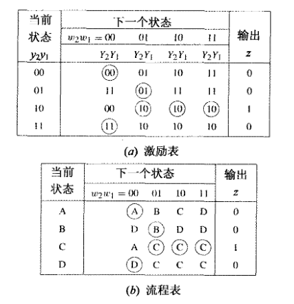

> 在上图中，和之前一样，所有状态不变的项（稳态）都已经圈出。而最后带不定项的流程表如下

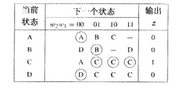

> 解析：如果使用之前两例的思维方式分析，比如**在A状态下稳态为w2w1=00**，那么根据异步电路每次只能有一个输入变化的原理，**在A状态下不能输入w2w1=11，也就是w2w1=11项需要设为未定，这没有问题**。但是如果拿D状态为例，按理说w2w1=11的状态也要设为未定，**但是这里却没有这么做，这有点令人疑惑**。
>
> 其实我们可以从**B状态的w2w1=11输入入手。这时状态会从B跳到D状态，正好对应D的w2w1=11输入，而这又是一个不稳定的状态，状态又会瞬间从D跳到C对应的w2w1=11输入态**。这种中间状态现象被称为**不稳定态**。在此例中，起始态B输出0，中间态D输出0，终态输出1，所以**这样的中间态是可以接受的，可以保留，因为它并不会产生不想要的输出**。但是假设在另一种情况下，比如起始态输出0，中间态输出1，终态输出0，**那这种状态转移就需要尽量避免，需要舍去，因为这种状态会产生瞬时的信号毛刺，这在实际电路中会导致意外状况的发生**。电路设计还是尽量严格遵循规范。**当然，一次状态跳变中可能经历不止一个中间状态**
>
> 最终得出的状态机图如下


**总结：异步电路的分析步骤**

> 1. 将电路内每一个反馈回路切断，加入延迟元件以及观测变量。变量数量最好最小化，不要重复切割
> 2. 建立逻辑表达式
> 3. 创建激励表
> 4. 创建并优化流程表
> 5. 根据流程表绘制相应状态图


### 1.6.3 异步电路的综合（设计）

**异步电路设计步骤**

> 1. 根据需求画出状态机图
> 2. 推导出流程表，并尽量减少状态个数
> 3. 分配状态，得出激励表
> 4. 求逻辑表达式
> 5. 构建电路

构建电路时，需要确保电路在各稳态下可以产生正确的输出。如果有不稳定态，就需要保证不稳定态不会产生意外的输出

这里同样直接使用示例进行说明

例1：设计一个串行奇偶校验发生器

> 解析：首先设输入为w，输出为z。若输入的脉冲数为偶数那么输出为0，如果为奇数那么输出为1
>
> 所谓脉冲，就是完整的一次从低电平跳转到高电平再到低电平的过程。可以构建状态图以及相应流程表如下

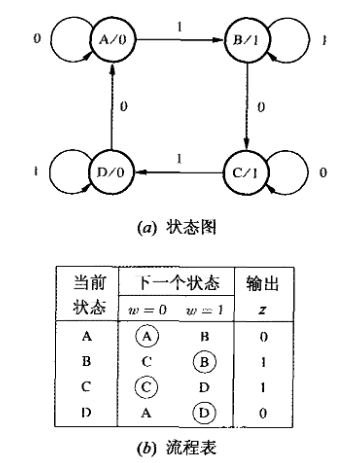

> 分析上图，一共定义了4个状态。设初态为A，输出0，在输入变为1之后立即进入状态B，代表输入奇数个脉冲，同时输出变为1。此时再次输入0，进入状态C，代表奇数个脉冲输入完成，输出不变。再次输入1，进入状态D，此时代表输入了偶数个脉冲，同时输出变为0。最后输入0，回到状态A，输出不变，此时代表输入偶数个脉冲完成
>
> 接下来进行状态赋值，注意不是所有的赋值方式都是好的，以下就对比了两种不同的赋值方式（可以很明显的观察到，较好的赋值使用了**格雷码**，这是格雷码又一重要应用）


> 其中第一种赋值不好的原因，拿D（y2y1=11）做分析就可以：如果在D状态下输入w=0，那么状态就需要从当前的y2y1=11直接跳转到y2y1=00的状态，这时会出现**同时有两个变量变化**的情况。而这两个状态变量由于逻辑门的延迟，**在实际中一定会有一个变量先发生变化**。假设首先发生变化的变量是y1，那么**状态会首先跳转到y2y1=10并停留在C状态稳定下来**，显然这并不是我们想要的结果。
> 
> 所以，在这种环形状态图中，最终的赋值需要使用格雷码（相邻两个状态之间只有一个状态变量发生变化）。这同时也补充了一条异步电路设计的准则：**只有一个输入发生变化时，同时只有一个状态变量发生变化**
>
> 最终得出的逻辑表达式如下，注意这里保留了冗余项：

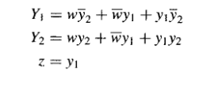

> 依据逻辑表达式构建的电路

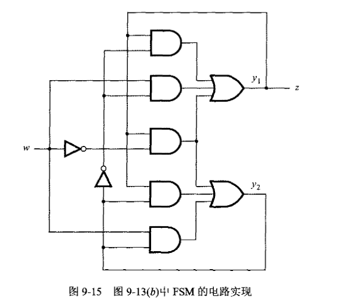

例2：设计一个简单的仲裁器

> 在计算机中，某个设备如果想要请求某个共享设备，就需要向仲裁器提出请求。大概的结构如下

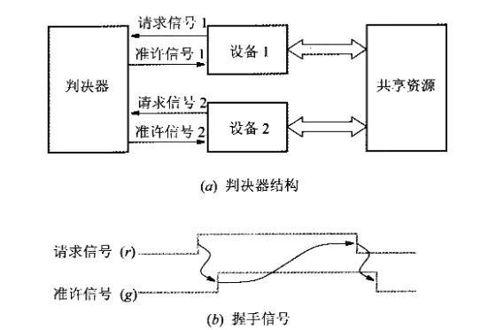

> 解析：上图为控制两个设备共享的仲裁器。仲裁器和每一个设备有一个**Grant**输出和一个**Request**输入连接。当设备需要请求资源时，可以将**Request**信号线拉高，而仲裁器想准许设备使用只需将**Grant**信号线拉高即可。这种异步电路的优势在于不需要时钟，而且响应性能良好
>
> 所以可以画出状态图如下

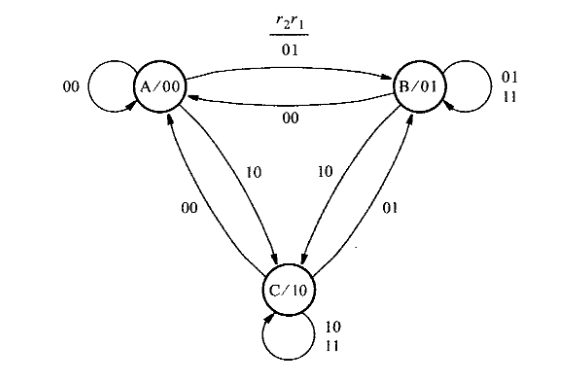

> 其中，设仲裁器有两个请求输入r2r1，两个输出g2g1。初态为A，此时为起始态，输出g2g1=00。如果这时设备1将r1拉高，那么仲裁器进入B状态，输出g2g1=01，表示准许设备1使用设备。此时若设备2想要使用设备，将r2拉高，那么仲裁器依然会处于B状态，直到设备1拉低r1，仲裁器会进入C状态输出g2g1=10准许设备2使用共享设备。
>
> 但是这里**存在一个很明显的问题**：正如上面例1所表示的，异步电路的状态变量同时只能有一个发生变化。而在状态图中，假设当前处于B状态并且输入为r2r1=11，如果此时输入变为r2r1=10，那么状态需要从B跳转至C，**但是这也意味着g2g1必须经历从01到10的转变**。而实际中g2g1一定有一个比另一个先发生变化。**假设g1先变化**，也就是说先变为g2g1=00，跳转到A状态，这时输入依然为r2r1=10，状态立即再跳转到C，会经历一个中间态，并且不会产生不期望的输出。而**如果是g2先变化**，也就是说先变为g2g1=11（这在实际中是不可能存在的状态，可以看作一个非稳态），那么就需要再创建一个g2g1=11的非稳态D（没有圈）来解决。最终得到的流程表和激励表如下：

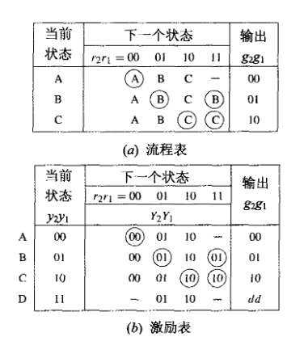

> 可以注意到，在B状态下，输入r2r1=11的状态被设为稳态，同时r2r1=10输入时直接跳转到到C状态。而另外添加的D非稳态只在r2r1=01和10时有状态赋值，是作为补充，保证可以正常跳转状态
> 
> 现在再次重新审视一下添加的D状态：如果真的添加D状态，此时如果从B状态跳转到C状态中间出现了g2g1=11的情况，似乎会导致两个设备同时使用资源，但是有**设备先释放资源再拉低Request**这个前提，**状态转移之前资源一定已经被释放**，所以D的加入不会导致两个设备同时使用资源
>
> 虽然在这里，多余的状态的加入不会导致异常的出现，但是并不是所有中间状态的加入都是这样。**所以在异步电路的设计中如果要添加中间态，一定要注意检查添加的中间态是否有可能导致不想要的行为的发生，因为虽然这个中间态只是发生在一瞬间，但是它还是确确实实发生了**
>
> 最终得到的逻辑表达式如下

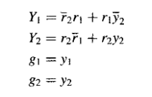

> 化简下一个状态表达式，得到

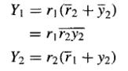

> 最终得到的电路如下

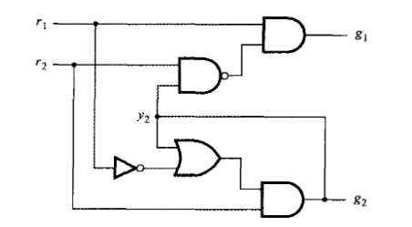

补充1

> 其实解决状态转移时可能发生的竞争冒险还有一个方法，就是不添加多余状态，直接防止其进入不确定的状态。在这个例子中，可以直接强制其经由A状态进行跳转。修改后的流程表、激励表如下

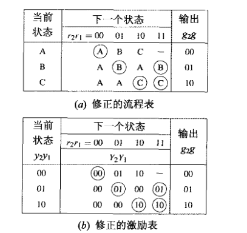

补充2

> 还可以使用Mealy规则设计同样的电路
>
> 可以对仲裁器进行分析。从Mealy型电路的构成特征入手，任意时间如果输入r2r1=00，那么输出一定为g2g1=00，所以A状态其实是可以和BC状态合并的，而在输入为00时直接输出为00，状态变量可以减少为1个
>
> 合并之后的Mealy型状态图如下

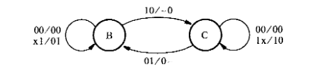

> 可以得出激励表和流程表如下

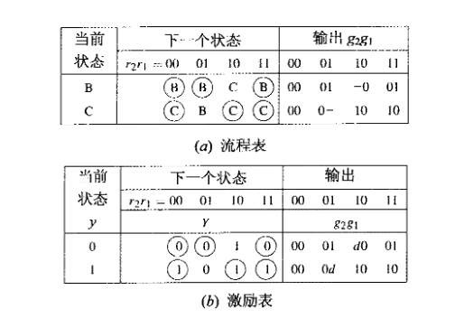

> 最终得到的逻辑表达式如下，这个电路同样需要小心赋值，防止状态变量的竞争

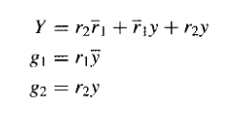


### 1.6.4 状态最小化

和同步时序电路的设计一样，异步电路状态的简化同样有利于电路的设计，本章引入一种两个阶段的化简方法

同样使用例子讲解

> 这里首先引入一个定义：如果一个流程表每一行都有一个稳态，那么这个流程表就被称为基本流程表。
>
> 合并的两个阶段：第一阶段和同步电路的状态简化相似，而第二阶段是异步电路简化特有的步骤

例1：设计这样一个售货机电路：每颗糖果为1角，售货机接受5分和1角硬币，多给不找零

> 由需求分析，设初始状态为A，输出0。有两个输入N和D，分别代表掷入5分和1角。**由于不可能同时掷入1角和5分，所以DN=11的情况是不可能出现的输入**，因此DN=11输入可以全部设为无关项。掷入一次5分后，状态立即转变到B。由于此时一定是输入DN=00，可以将DN=00输入设为中间态，直接跳转到D状态。最后投入5角或1分，状态分别转移到E和F态，最终售货机输出1放出糖果。此时输入DN=00，直接跳转回A状态


> 由以上流程表分析，首先采取第一阶段的简化。首先将输出为0或1的行合并，得到P0=(ABD)(CEF)，进而推得P1=(AD)(B)(CF)(E)，P2=(A)(D)(B)(CF)(E)，P3=P2，代表F需要和C合并，同时需要替换掉所有项。注意合并时要考虑无关项，这里没有碰到，遇到同一列有无关项和确定项时要拆分。最终合并后的流程表如下


> 接下来进入第二阶段，利用无关项对行进行合并
>
> 观察流程表，可以发现C状态包含了A和E状态，而其他都存在冲突（所谓冲突就是指在两行的同一列，如果同时非无关项且不同，比如一个为状态A一个为状态E，则称之为冲突）。所以这里考虑尝试将C和A或E合并为一个状态。
>
> **但是观察A和C的输出，发现A和C输出不同，说明只能通过Mealy模型实现。所以决定合并E和C**
> 
> 最终合并以后的流程表如下

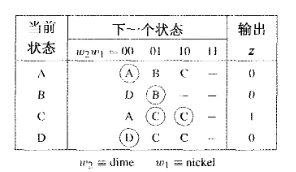

> 上表中，所有E都要改成C，并且C原先的不定项都要按照E修改


### 1.6.5 状态最小化通用步骤：使用合并图

首先引入一个定义

> 定义1：对于相容（不冲突）的两个状态Si和Sj的每组输入，以下条件之一必须为真
>
> 1. **Si和Sj有相同后续**
> 2. **Si和Sj都是稳定的**
> 3. **Si和Sj的后继之一为无关项或两者都是无关项**
>
> **如果是使用的Moore模型，有一个前提是Si和Sj输出相同，这点一定要注意，反之Mealy模型则没有**

例1：化简以下流程表

**使用Moore模型**

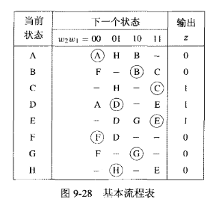

> 由上表，可以通过观察得到状态对(A,H)(B,F)(B,G)(D,E)(F,G)(G,H)，可以合并
>
> 直接观察合并的难度比较高，可以构建合并图如下

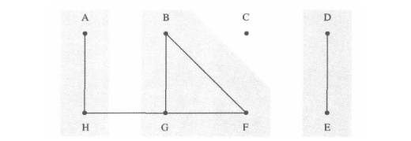

> 上图中，BFG两两相容，可以合并为一个项。而A和H、D和E同样可以合并。和之前在组合逻辑章节中讲到的化简同理，合并图的化简的基本目标也是最后包含尽量少的状态数
>
> 所以最后得到的化简后的流程表如下，原来有稳态的列在合并后都必须为稳态

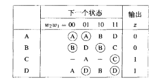

**使用Mealy模型**

> 使用Mealy模型不需要关注输出，可以直接得到合并图如下

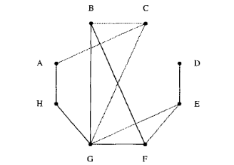

例2：化简以下流程表，使用Mealy模型

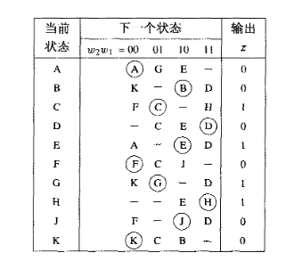

> 先划分合并等价状态，过程省略


> 直接将上表的FSM转换为Mealy模型，可以得到流程表如下

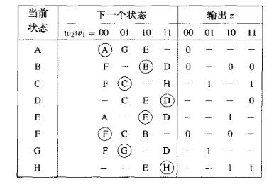

> 观察上表。可以总结出这样的转化规律：如果从一个状态跳转到另一个状态输出不变，那么对应该项输出z设为与前一状态相同；如果前后状态输出不同或为不定状态，那么z可以设为不定项

**小结：状态化简的基本步骤**

> 1. 对最初的流程表进行最小化合并等价状态
> 2. 建立合并图
> 3. 依据尽量减少子集数量的原则合并相容状态
> 4. 合并行，得到简化后流程表
> 5. 换一种合并相容项方式，看是否可以得到最佳解


### 1.6.6 状态赋值通用步骤：重标记流程表

异步FSM的状态赋值非常复杂，需要保证同一时刻只有一个位发生改变

> 定义：汉明距离：汉明距离即两个码之间不同的比特数。比如1101和0110的汉明距离是3
> 
> **立方体任意两相邻顶点之间的汉明距离都是1**
> 
> 理想的状态分配之间所有转移的汉明距离都是1
> 
> 若理想的状态不可能实现，那么就一定要经过未分配状态或非稳态

**使用状态转移图（状态邻接图），以及重标记流程表实现。一般有三种技巧，使用未指定项，添加附加状态，以及使用独热码**

转移图（邻接图）用于寻找合适的状态分配方案

> 合适的状态转移图一定可以嵌入到一个k维的立方体，所谓的嵌入立方体就是说一个转移图中，不存在连接对角线的边（汉明距离大于等于2）

例1：对之前的仲裁器流程图进行重标记，并构建转移图

> 原先的状态转移图以及添加D项后的转移图如下

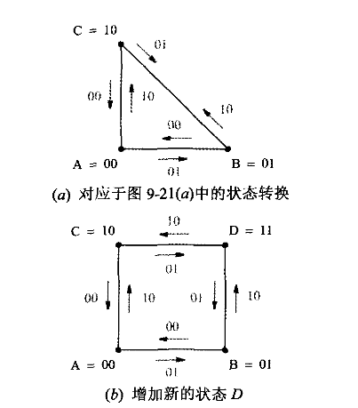

> 现在对状态表进行重标记

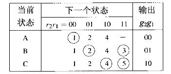

> 重标记状态的基本步骤就是，**首先按顺序将所有画圈的稳态标记为1，2，3，4等，然后将所有其他非稳态使用对应已标记状态替换（替换规则见小结）**
>
> 之后可以重新构建转移图如下

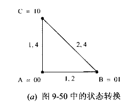

> 上图中，每条线上都标记了状态编号。标记的规律就是，比如直接从C到A，会到达A的稳定状态1，那么在相应边上标记1，同理如果从A到C，就应该在边上标记4。
>
> 之前在仲裁器的设计中已经说过，B和C之间的转换可以通过A中转。接下来就可以继续标记，如下图

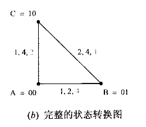

> 相比上一张图，这里的转换图使用灰色字体添加了几个状态。由于C可能通过A到达B的稳态2，所以这里在AC边使用灰色字体添加了2以表示这种可能性。黑色字体代表直接的转移，灰色字体代表间接的转移。**但是B到C的过程经过了对角线，不能嵌入到立方体**

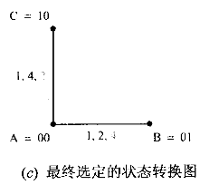

> **只要两个状态在重新标记的流程表中有相同的未画圈的标记，那么这两个状态之间就存在状态转移的可能路径**

**小结：转移图的推导步骤**

> 1. 首先推导出重新标记后的流程表。**经过不稳定状态最终到达稳定状态的转移使用与最终到达的稳定状态等价的数字做标记**
> 2. 使用顶点表示流程表相应行
> 3. 若流程表中任意两个顶点Vi和Vj在任意列有相同数字，则连接Vi和Vj
> 4. 对于Vi和Vj有相同数字的每一列，用数字对边进行标记。使用黑色字体标记直接到稳定状态的转移，使用灰色字体标记下一状态为非稳态的项

+ **使用未指定项**

使用未指定项的方法非常复杂，最终需要使用Mealy模型解决，随便看看就行

例2：对以下流程表进行状态分配

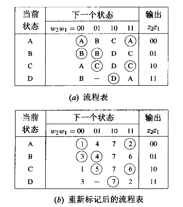

> 可以先随便分配一下，构建一个状态转移图

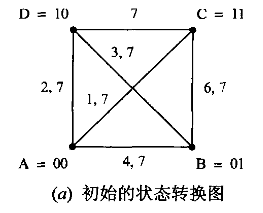

> 分析以上转移图。可以发现两条对角线都不可以去除，C直接到达A只有唯一的一条1将两者连接，而D到B只有唯一的3连接，所以两条对角线都无法去除
>
> 接下来换一种分配方法，构建状态转移图

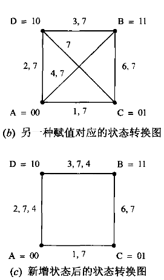

> 分析以上转移图，可以发现两条对角线都可以去除。**AB可以去除，是因为利用了无关项，将其设为4，A到B就可以经过D中转**。而CD是因为D到C可以通过B中转
>
> 根据化简以后的状态转换图，**最终将流程表转为Mealy形式，以保证输出正确性**

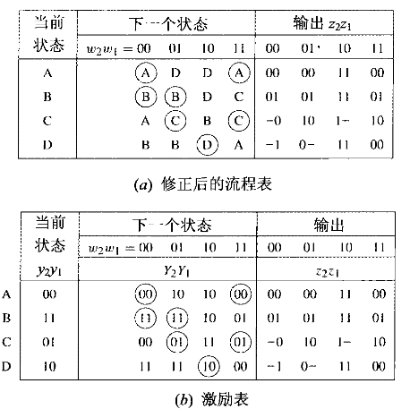

> 流程表的转换，就是根据变化对应的进行处理（一般情况下最好对整张表进行重构建）。由于现在w2w1=01时，A需要通过D跳转到B，所以相应的w2w1=01列要表现出来。同理，w2w1=10时，C只能通过B跳到D，所以相应的w2w1=10列也要表现出来。
>
> 最后是有关于输出z2z1的填写。填写的一般规律和上面化简章节讲的一样，不同的是这里输出和状态赋值已经不一样了。**首先填写稳态（带圈项）的输出，其次根据变化填写其他非稳态项输出（非稳态输出只和始末状态差别有关，在Mealy模型下和非稳态本身应该的输出无关）**。拿A到B的转换为例，中间会经过D，而A输出z2z1=00，B输出z2z1=01，如果使用的是Moore模型就会导致D输出z2z1=11，z2出现毛刺，此时就要强制D在w2w1=01时输出z2=0。而在z2z1=10列，B到D需要强制z1=1，应当设B行w2w1=10列为-1，然而C需要通过B跳到D，所以又要强制z2=1，所以最终B行w2w1=10列为11

+ **使用附加状态**

可以利用未指定项解决问题的情况其实很少见，更多的情况下需要添加不稳定的附加状态。**利用附加非稳态是在转换图边上添加顶点，利用等价状态对则是将一个状态分裂成为两个或多个**

例3：（利用附加非稳态）分配以下流程表


> 可以构建转移图如下

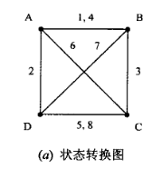

> 可以发现这个转移图无法简化到可以嵌入到立方体
>
> 现在可以添加一个状态变量，使得变量变成3bit变量。此时，假设令A=000，B=001，C=100，D=010，那么(B,D)、(B,C)和(C,D)之间的汉明距离就不再是1，变成了2，需要在边上添加1个顶点，形成如下状态转换图，而这个状态转换图可以嵌入到立方体中

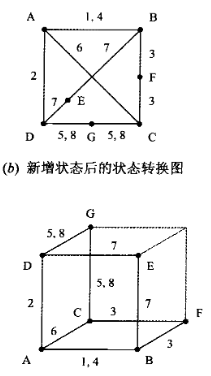

> 最终可以重新构建Moore流程表如下。**为防止毛刺干扰的发生，可以和例2一样转为Mealy模型处理，这里省略过程**

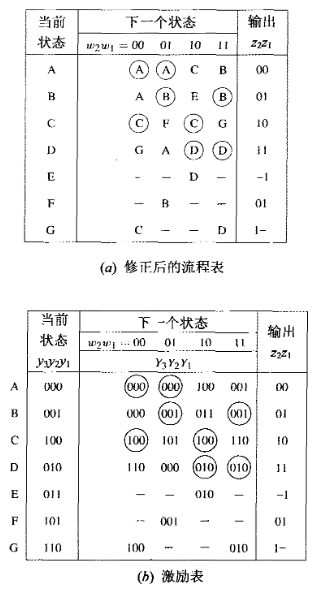

例4：（利用等价状态对）分配例3中的流程表

> 将ABCD各分为两个状态，添加后缀如下，各自输出和原来一致

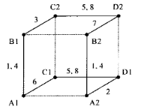

> **分配的规律其实还是比较容易观察出来的。对于有两个数字的边，一般会构建两条平行的，正如上图中的A1B1，A2B2以及C1D1，C2D2边，并且保证分顶点汉明距离为1**
> 
> 于是构建流程表如下

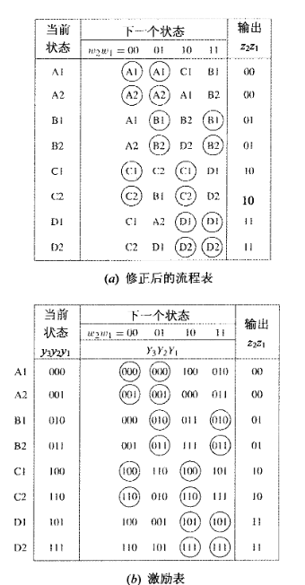

+ **使用独热码**

使用独热码可以降低状态赋值难度，但是会增加电路实现复杂度

例5：（利用独热码）分配例3中的流程表

> 使用独热码，就要对每一条边都创建一个无竞争的中间状态，比如A到B的中间态E赋值为0011

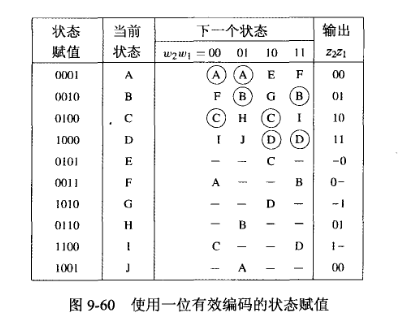


### 1.6.7 冒险（Hazard）简介

非理想门电路的传播是有延迟的，由于电路的结构或电路中的传播延迟引起的瞬时脉冲就称为**冒险**。冒险分为**静态冒险**和**动态冒险**


### 1.6.8 静态冒险

静态冒险的一般波形表现如下，在本该保持稳定的输出时出现了毛刺

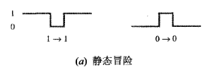

可以观察以下电路

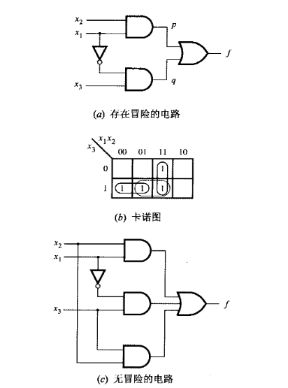

> 上图中，存在冒险的电路逻辑表达式为f=X1X2+(~X1)X3。由于X1取反引入延迟，会导致p先于q发生变化。在X1X2X3同时为1时，如果X1变为0，那么就会发生静态冒险，f会出现一个瞬时的负脉冲
>
> 由卡诺图分析，可以说明这样的规律：**如果卡诺图中有相邻的两个1未被乘积项覆盖，那么这样的电路就可能导致静态冒险**
>
> **解决静态冒险的方法就是覆盖所有相邻的1，比如在上图中添加了一个冗余项**

**静态冒险可能导致异步时序电路进入错误状态**。以下为例：

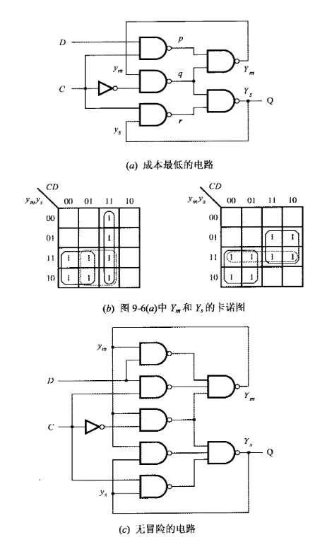

> 如果Ym和Ys的卡诺图都不使用冗余项覆盖，得到的逻辑表达式如下

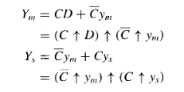

> 假设这样的情况：设Ys=1，Ym=1且C=D=1，此时若C变为0，Ys本该一直保持1，但是C和~C会在一瞬间变为00，导致出现Ys=Ym=0的情况，并停留在Ys=0的错误状态中。所以引入冗余项后的逻辑表达式如下

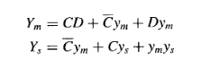

> 以上表达式避免了冒险，可以防止状态转移时进入错误状态

**小结：避免静态冒险的方法**

> 避免静态冒险，**基本方法就是要在积之和中包含所有的质蕴含项，但不代表必须包含所有的质蕴含项，比如在有无关项存在的情况下，可以不将无关项计入**。


### 1.6.9 动态冒险

动态冒险的一般波形表现如下，在变化状态时出现了毛刺

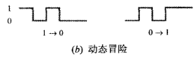

以下电路就存在动态冒险

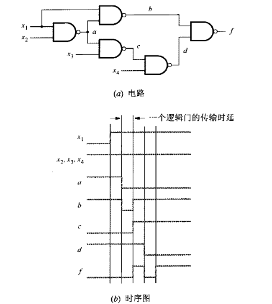

> 动态冒险一般由电路结构引起。动态冒险出现的一般规律就是，**一个信号如果对于某个输出有多条传播路径，那么就会产生动态冒险；单次变化的次数代表了最少的传播路径数。**
>
> **存在动态冒险的电路一定在某部分存在静态冒险**
>
> **可以通过限制电路到两级门，并且确保没有静态冒险的方法规避动态冒险**
>
> 在上例中，就可以将表达式限制到两级以规避动态冒险，如下


**小结：避免动态冒险的方法**

> 在异步时序电路中避免冒险，就要**保证产生下一状态的电路无冒险**，可以通过限制电路级数并排除静态冒险实现


### 1.7 其他实用知识补充

下面补充在日常实践中容易遇到的问题，实用的技巧以及解决方案


### 1.7.1 触发器亚稳态问题

触发器的亚稳态，就是指一个触发器无法在一定时间以内到达一个确定的状态。触发器会输出一些中间电平，这些中间电平无法预测，可能会出现振荡的情况，并且这种中间电平会传递给下一级触发器导致后级触发器也出现亚稳态，如下图中B由于AB时钟的不同步，取到了A触发器的中间输出，导致了B的亚稳态


> 这里引入一个术语：MTBF，即平均故障间隔时间，是故障率的倒数，指的是下一级D触发器发生故障的时间间隔。
>
> 一般通过使用多级D触发器的形式改善亚稳态的问题


## 2 Verilog HDL开发环境

Windows下基于Quartus Prime的FPGA开发，以及类Unix下的Verilog设计仿真环境，和基本的设计流程


### 2.1 类Unix下的Verilog编译和仿真环境：使用Verilator或Icarus Verilog，配合gtkwave

ArchLinux下安装:

```shell
pacman -S iverilog verilator gtkwave yosys
```

FreeBSD下通过`pkg`安装：

```shell
pkg install iverilog verilator gtkwave
```

`yosys`可以用于RTL的生成


### 2.1.1 源文件编写与组织

一般一个Verilog工程至少应当包含**源代码**（包含了设计好的电路，使用.v后缀），**Testbench**（用于对电路进行仿真测试，调用设计好的电路，使用.v后缀）。仿真以后还会生成**波形文件**（电路仿真的结果，使用gtkwave查看，有多种格式，见下）


### 2.1.2 编译以及仿真，使用Icarus Verilog

直接使用示例说明

假设创建了一个源文件`innovate.v`，一个Testbench`innovate_tb.v`，编译

```shell
iverilog -s innovate_tb -o innovate_tb.out innovate.v innovate_tb.v
```

其中`-s`指定topmodule，**即Testbench中定义的模块名**；`-o`指定输出文件名

仿真使用`vvp`命令。**输出文件名在Testbench中定义**

```shell
vvp -n innovate_tb.out
```

可以指定输出文件的格式，可以使用`.lxt2` `.lxt` `.fst`，这些文件和`.vcd`类似，区别是`.lxt2`体积小，`.lxt`速度快，`.fst`比较新

```shell
vvp -n innovate_tb.out -lxt2
```


### 2.1.3 查看波形，基于gtkwave

直接使用`gtkwave`打开`.vcd`文件（或其他比如`.lxt2` `.lxt`和`.fst`文件）

```shell
gtkwave innovate.vcd
```


### 2.2 Intel Quartus Prime 使用简介，仿真基于ModelSim


## 3 Verilog HDL语言基础

记录Verilog的语法和设计模式

Verilog的IEEE官方文档[IEEE1800-2012](https://ieeexplore.ieee.org/document/6469140)


### 3.1 模块

模块是Verilog中最基本的组成单位。模块声明如下示例，设计一个16位加法器。**圆括号内声明输入输出，之后描述电路**

```verilog
module adder (
    input   wire [15:0] in_a,
    input   wire [15:0] in_b,
    output  wire [15:0] out
);

    assign out = in_a + in_b;

endmodule
```

> 输入为**input**，输出为**output**，双向输入输出为**inout**
>
> 变量比特位使用[MSB:LSB]格式描述
>
> 有效变量名格式为`[a-zA-Z_][0-9a-zA-Z_-]*`

**模块实例化**

模块实例化调用已定义的模块，以下实例化了一个adder。使用`.`运算符调用信号，并命名在实例中的名称

```verilog
adder adder01 (
    .in_a   (adder01_in_a),
    .in_b   (adder01_in_b),
    .out    (adder01_out)
);
```


### 3.2 常量

常量的使用和其他一般编程语言有较大不同

| 逻辑值 | 描述 |
| :-: | :-: |
| 0 | 低电平 |
| 1 | 高电平 |
| x | 不定值 |
| z | 高阻态，High impedance |

**常量需要指出进制以及位宽，b为二进制，o为八进制，d为十进制，h为十六进制，示例如下**

```verilog
4'b1100
6'o75
4'd8
8'h4e
```

**使用parameter声明常量**

可以使用`parameter`在同一个地方声明常量，这样更改常量只需要修改一个地方

```verilog
parameter MSB = 15;
```


### 3.3 变量及其类型

Verilog中的变量分为寄存器型和网络型两种。寄存器型可以根据情况生成锁存器或触发器，或其他组合电路。

### 3.3.1 寄存器型变量声明与赋值

寄存器型变量常用的有3种类型

| 名称 | 位宽 | 符号 | 描述 |
| :-: | :-: | :-: | :-: |
| reg | 1 | 无 | 一般寄存器变量 | 
| integer | 32 | 有 | 整数 |
| real | 64 | 有 | 实数 |

寄存器型变量可以在`initial`或`always`语句中赋值，称为**过程赋值**。过程赋值又分为**阻塞赋值（顺序赋值）和非阻塞赋值（并行赋值）**，**且两者不能在同一个过程块中出现**

以下为示例

```verilog
reg             [15:0]  reg_1;  //16位无符号
reg             [15:0]  reg_2;
reg signed      [15:0]  reg_3;  //16位有符号
reg signed      [15:0]  reg_arr [15:0]; //16*16寄存器阵列
```

```verilog
reg_1 <= reg_1 + 1; //并行赋值，若reg_1初始值为0，那么最后reg_1和reg_2都是1
reg_2 <= reg_1 + 1;
``` 

```verilog
reg_1 = reg_1 + 1;  //顺序赋值，reg_1为1，reg_2为2
reg_2 = reg_1 + 1;
```


### 3.3.2 网络型变量声明与赋值

网络型变量不持有数据，仅仅描述数据的传输。

网络型变量常用的有5种类型

| 名称 | 位宽 | 符号 | 描述 |
| :-: | :-: | :-: | :-: |
| wire/tri | 1 | 无 | 线连接 |
| wor/trior | 1 | 无 | 线或 |
| wand/triand | 1 | 无 | 线与 |
| tri1 | 1 | 无 | 带上拉的线 |
| tri0 | 1 | 无 | 带下拉的线 |
| supply1 | 1 | 无 | 直连高电平 |
| supply0 | 1 | 无 | 直连低电平 |

**如果使用了default_nettype指定了默认网络类型，变量可以不声明类型，比如wire等**。网络型变量可以在`assign`语句中赋值，wire同样可以声明符号

以下为示例

```verilog
wire            [15:0]  wire_1;         //16位无符号
wire            [7:0]   wordl, wordh;

/*  也可以在声明变量时赋值
wire            [7:0] wordl = wire_1 [7:0];
wire            [7:0] wordh = wire_1 [15:8];
*/

assign  wordl = wire_1[7:0];
assign  wordh = wire_2[15:8];
```

wire型变量有无符号的转换可以使用`$signed()`和`$unsigned()`更改，这两个属于**系统任务**

```verilog
wire    signed  [7:0] wire_s;
wire            [7:0] wire_u;

assign wire_u = $unsigned(wire_s);
```

> 由于网络变量可以不加声明直接使用，**所以在实际使用中容易出现引用了不存在的变量名却无法检查出错误的问题**。所以在RTL设计时最好指定`default_nettype`为`none`，而不是`wire`

```verilog
`default_nettype none //verilog中使用`作为预处理命令
```


### 3.4 运算符

**算术运算符**

| 符号 | 描述 | 优先级 |
| :-: | :-: | :-: |
| + | 加法 | 3 |
| - | 减法 | 3 |
| * | 乘法 | 2 |
| / | 除法 | 2 |
| % | 求余 | 2 |

**位运算符**

| 符号 | 描述 | 优先级 |
| :-: | :-: | :-: |
| ~ | 非 | 1 |
| & | 与 | 7 |
| \| | 或 | 8 |
| ^ | 异或 | 7 |
| ~^ | 同或 | 7 |
| << | 逻辑左移 | 4 |
| >> | 逻辑右移 | 4 |
| <<< | 算数左移 | 4 |
| >>> | 算数右移 | 4 |

**缩减运算符**

| 符号 | 描述 | 优先级 |
| :-: | :-: | :-: |
| & | 与 | 1 |
| ~& | 与非 | 1 |
| \| | 或 | 1 |
| ~\| | 或非 | 1 |
| ^ | 异或 | 1 |
| ~^ | 异或非 | 1 |

> 缩减运算符一般用于对多位量的每一个bit进行计算，并输出到一个单bit量中
>
> 示例如下

```verilog
wire    [7:0]   byte_1;
wire    bit_1;

assign bit_1 = |byte_1; //相当于byte_1[7] | byte_1[6] | ... | byte_1[0]
```

**比较运算符**

| 符号 | 描述 | 优先级 |
| :-: | :-: | :-: |
| == | 相等 | 6 |
| != | 不等 | 6 |
| === | 相等，包括xz | 6 |
| !== | 不等，包括xz | 6 |
| > | 大于 | 5 |
| < | 小于 | 5 |
| >= | 大于等于 | 5 |
| <= | 小于等于 | 5 |

**逻辑运算符**

| 符号 | 描述 | 优先级 |
| :-: | :-: | :-: |
| ! | 逻辑非 | 1 |
| \|\| | 逻辑或 | 9 |
| && | 逻辑与 | 10 |

**其他运算符**

| 符号 | 描述 | 优先级 |
| :-: | :-: | :-: |
| ? : | 条件运算 | 11 |
| {} | 拼接 | N/A |

> 拼接运算符用于将多个变量合成一个变量
>
> 示例如下

```verilog
wire    [7:0]   byte_0, byte_1, byte_2, byte_3;
wire    [31:0]  word_1 = {byte_0, byte_1, byte_2, byte_3};  //可以合并不同变量
wire    [15:0]  word_2 = {2{byte_0}};   //也可以将变量重复n遍
```


### 3.5 条件

条件可以在`initial`或`always`中使用

### 3.5.1 if

示例

```verilog
if ( a > b ) begin
    a = a + 1;
end else if ( a == b ) begin
    b = b + 1;
end else begin
    a = a + b;
end
```


### 3.5.2 case

示例

```verilog
case (byte_1[7:0])
    8'h00   : begin
        a = a + 1;
    end
    8'he4, 8'hf6    : begin
        a = a + 2;
    end
    default : begin
        a = a + 3;
    end
endcase
```


### 3.6 循环

循环同样可以在`initial`或`always`中使用

### 3.6.1 for

示例

```verilog
for (i = 0; i < 10; i = i + 1) begin
    a = a - 1;
end
```


### 3.6.2 while

示例

```verilog
while (i < 10) begin
    i = i + 1;
end
```


### 3.6.3 repeat

`repeat`可以指定循环次数

示例

```verilog
repeat (5) begin
    a = a + 1;
end
```


### 3.7 always过程块

always过程块是Verilog中用于描述流程最基本的组件

示例1

```verilog
always @(*) begin
    a = ~a;
end

always @(posedge clk_1 or negedge clk_2) begin
    b = b + 1;
end
```

> `always`语句中，`@()`之内**填写触发事件**。触发事件有常用的有两种类型，一种是**posedge**，一种是**negedge**，也可以使用*表示在信号发生任何变化时都执行语句，可以使用`or`分隔多个触发事件

示例2

```verilog
always #10 begin
    a = a + 1;
end

always #(STEP / 4) begin
    b = b ^ a;
end
```

> `always`语句也可以用于在Testbench中定时运行指令，使用`#`指定运行的时间间隔，单位为电路基本始终

**默认行为与无关项**

在Verilog中，使用`always`的语句如果缺少某些输入状态的行为描述，可能会导致锁存器的引入，如下

```verilog
module mod_1 (
    input   wire    [3:0]   in;
    output  reg     [1:0]   out; 
);

    always  @(*)    begin
        case    (in)
            4'h0 : out = 2'b10;
            4'h1 : out = 2'b11;
        endcase
    end

endmodule
```

> 由于缺少一些输入状态的行为描述，所以在输入为其他状态时输出应该不变，此时就会引入异步时序电路，这不是想要的结果
> 
> 解决的方法就是补全说明或使用`default`设置默认值，如果是无关项可以设为x

```verilog
module mod_1 (
    input   wire    [3:0]   in;
    output  reg     [1:0]   out; 
);

    always  @(*)    begin
        case    (in)
            4'h0 : out = 2'b10;
            4'h1 : out = 2'b11;
            default : out = 2'b00;
            // 如果是无关项，可以设为 default : out = 2'bxx;
        endcase
    end

endmodule
```

示例3

使用Verilog描述一个D触发器如下

```verilog
module dff (
    input   wire    d_in;
    input   wire    reset_;
    input   wire    clk;
    output  reg     d_out;
);

    always @(posedge clk or negedge reset_) begin
        if (reset_ == 1'b0) begin   //异步复位
            d_out <= 1'b0;
        end else begin
            d_out <= d_in;
        end
    end

endmodule
```


### 3.8 Testbench构造

> 一般Testbench有8个部分构成
> 1. 定义Timescale
> 2. 引用头文件
> 3. 声明测试模块
> 4. 定义内部信号
> 5. 生成时钟
> 6. 实例化要测试的模块
> 7. 编写测试用例
> 8. 输出波形

### 3.8.1 Timescale定义

使用`timescale`宏设定仿真的时间单位和精度

```verilog
`timescale 1us/1ns
```

> 以上设定仿真时间单位为1us，时间精度为1ns。**单位时间必须大于等于时间精度**


### 3.8.2 initial语句和延迟语句

`initial`只在仿真开始时会执行一次

示例

```verilog
initial begin
    #0 begin        //时刻0执行
        a = a + 1;
    end

    #10 begin       //时刻10执行
        b = b + 1;
    end

    #10 begin       //时刻20执行
        c = c + 1;
    end
end
```

> 使用`#`指定延迟时间，这种语句称为**延迟语句**，一般只用在Testbench中

示例

```verilog
always  @(*)    begin
    a = #10 b;  //10个时钟周期后赋值
end

initial begin
    #0  a = 1'b1;   //0刻a为1
    #10 a = 1'b0;   //10刻a为0
end
```

> 在实际仿真中，仿真器默认的延迟为0。**这是理想状态下的输出延迟，但是实际中输出总是有延迟的，所以要使用延迟语句加入延迟，以得到真实的仿真结果**

示例

```verilog
module dff (
    input   wire    d_in;
    input   wire    reset_;
    input   wire    clk;
    output  reg     d_out;
);

    always @(posedge clk or negedge reset_) begin
        if (reset_ == 1'b0) begin   //异步复位
            d_out <= #1 1'b0;       //延迟一个时间单位
        end else begin
            d_out <= #1 d_in;       //延迟一个时间单位
        end
    end

endmodule
```

### 3.8.3 时钟生成

示例

```verilog
always #10 begin
    clk <= ~clk;
end

initial begin
    #0 begin        //时钟初始化
        clk <= 1'b0;
    end
    //后接以后的仿真语句
end
```


### 3.8.4 仿真常用系统任务

**输出字符串**

```verilog
$display("string %d", i);     //带回车符，可以使用类似c语言的格式化输出
$write("string %d", i);       //不带回车符
```

**返回目前仿真时间**

```verilog
$time;
```

**结束仿真**

```verilog
$finish;
```

**载入存储映像**

```verilog
$readmemh("filename.dat", mem); //将filename读入到mem中，mem可以是一个reg阵列。数据文件使用十六进制文本记录
```

**指定输出**

```verilog
initial begin
    $dumpfile("test1.vcd"); //指定输出文件名
    $dumpvars(0, test);     //从时刻0开始，模块名test的输出波形
end
```

### 3.9 补充

### 3.9.1 并行语句块

顺序执行的语句块一般用`begin end`声明。而如果块中的语句并行执行，可以使用`fork join`

```verilog
fork        //使用fork join，即便使用阻塞赋值也会并行执行语句
    a = 1'b1;
    b = 1'b0;
join
```


## 4 常用的算术硬件以及计算方法

算术电路是CPU的核心部分，常见的一般有加法器，乘法器，除法器，以及针对定点浮点运算的算术逻辑电路

本小节也会记录各种算法原理，如二进制乘法除法，浮点算法，以及其他常用加密/校验算法，如AES，DES，CRC等（现代CPU很多都带有加解密硬件以及对应扩展指令）

### 4.1 加法器

常见的CPU架构中，加减法都是使用加法器实现

**在一般的处理器设计中，加法指令不分有无符号（对于加法指令来说一个数也不分正负，10001100表示为140还是-116是软件层面解决的问题）。而减法指令同样不分有无符号，对减数所有位求补之后做加法**

### 4.1.1 普通加法器

普通加法器使用全加器构成。全加器级联之后形成的加法器又被称为**行波进位加法器**

全加器具有三个输入Xi、Yi、Ci，以及两个输出Si、Ci+1。Si为当前位结果输出，Ci+1为进位输出。Xi、Yi为两个加数输入，Ci接上一位进位输出Ci-1。

各位逻辑关系为：Si=Xi⊕Yi⊕Ci，Ci+1=Xi·Yi+Yi·Ci+Xi·Ci，示意图如下


这种加法器虽然实现简单，**但是有一个致命的缺点：假设最低位发生了变化，进位要经过全部全加器才会传递到最高位，延迟过高，不适用于高速电路**


### 4.1.2 快速加法器

快速加法器又称**超前进位加法器**，相比普通加法器具有更低的延迟，适用于高速电路

关于快速加法器可以作如下推导

> 之前的普通加法器主要问题出在进位的传递上。Ci+1=Xi·Yi+Yi·Ci+Xi·Ci，可以将进位和XiYi分开，Ci+1=Xi·Yi+(Xi+Yi)·Ci。可以设pi=Xi·Yi


### 4.2 乘法器

常见的CPU架构中，和加减法不同，乘法指令分为有符号和无符号，使用不同的处理方法

### 4.2.1 时序乘法器

### 4.2.2 阵列乘法器

### 4.3 除法器

### 4.4 浮点运算

### 4.4.1 IEEE754-2019浮点数标准

有关IEEE规定的浮点数表示以及运算标准见[补充](200920c_verilog.md#5-补充)章节

### 4.4.2 定点浮点互转

### 4.5 二进制转BCD

虽然二进制转BCD可以使用除法以及求余得到，但是效率很低，尤其是在一些不支持硬件乘除的机器上。这里引入一种基于移位的方法


### 4. 桶式移位寄存器

### 4. DES

### 4. AES

### 4. CRC

### 4. 设计简单的处理器

## 5 补充

### 5.1 IEEE754-2019浮点数标准

[IEEE754-2019官方文档](https://ieeexplore.ieee.org/document/8766229)

### 5.1.1 浮点数的表示

### 5.1 舍入

### 5.1 运算操作

### 5.1 NaN，无穷大以及符号位

### 5.1 异常及其处理