# 数字电路基础以及 Verilog FPGA 开发入门笔记

有关数字电路的一些理论知识以及基于Verilog的FPGA开发入门

## 参考书籍

*Fundamentals of Digital Logic with Verilog Design (Second Edition), Stephen Brown, Zvonko Vranesic, Canada, 2007, ISBN 978-7-111-22182-1*

## 开发平台

EDA: Intel Quartus Prime Lite

FPGA: Intel Altera Cyclone IV EP4CE10E22C8N

## 0 先行预备知识

~~这里假设已经会C语言~~，只补充集成电路的物理构成与原理

### 0.1 半导体：N型和P型

**N型半导体**：通过粒子加速向硅等4价元素单质（本征半导体）掺杂高价元素如5价磷、5价砷等形成，呈电中性，**自由电子为多数载流子（空穴为少数载流子）**

**P型半导体**：掺杂低价元素如3价硼，3价铟等形成，呈电中性，**自由空穴为多数载流子（电子为少数载流子）**

**掺杂工艺**：通过高能电场加速将要掺杂的杂质粒子嵌入到硅基板，之后通过退火（Anneal）热处理，使得不在晶格处的杂质粒子归位并产生自由载流子，并修复掺杂过程中产生的晶格缺陷。杂质浓度越高，导电性越强

**PN结（PN junction）**：将一个P型半导体和N型半导体放在一起就可以形成一个PN结。由于P和N型半导体的载流子浓度差异巨大，**P半导体的空穴会向N半导体扩散，N半导体的电子会向P半导体扩散，这样P半导体交界处会带上负电，N半导体交界处会带上正电，形成一个由N半导体指向P半导体的阻止粒子继续扩散的电场，最终达到动态平衡**。这片区域为空间电荷层，由于此处双方都缺少多数载流子，也被称为**耗尽层**

想要使得一个PN节导电，只要添加外部电场消除耗尽层的电场即可。方法就是**将P半导体接到高电位，将N半导体接到低电位，这样PN结处就会开始导电**。如果添加相反电场则会使得耗尽层变厚，这也是PN结单向导电的原理

### 0.2 晶体管：NMOS和PMOS以及工作原理

现代硅基数字集成电路都是由MOSFET构成，MOSFET分为NMOS（N沟道）和PMOS（P沟道），NMOS结构如下图

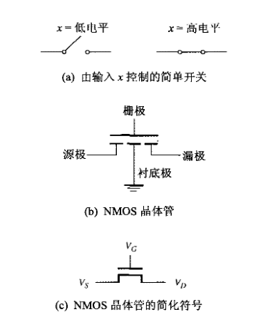

在集成电路中，NMOS的G极作输入端，和衬底以及SD之间有二氧化硅隔开，输入电阻理想状态是无穷大，S和D极是完全相同的两端，当G极输入高电平时S和D导通。S和D极为N型半导体，衬底为P型半导体，连接低电势位。S和D极电势一定大于等于衬底

当NMOS的G极输入高电平时，可以将P型衬底的少数电子全部吸引到靠近G极处，在二氧化硅层下形成电子载流区，连通S和D极，此时S和D极之间导通

PMOS和NMOS原理相反，S和G极为P型半导体，衬底为N型半导体，连接高电势位。当G极输入低电平时导通，如下图

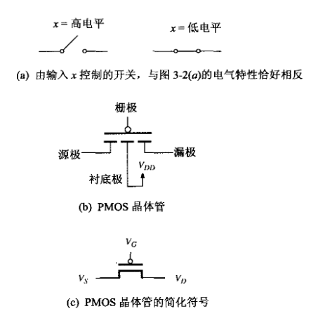

### 0.3 工艺：TTL和CMOS

一般常见的74系列数字电路分为"LS"TTL型和"HC"CMOS型两大系列。TTL型电路一般只使用单一种类三极管或MOS管构建，而CMOS全称为"Complementary Metal Oxide Semiconductor"，顾名思义CMOS使用了NMOS和PMOS两种极性互补的MOS管构建电路

TTL一般只由单一极性晶体管（BJT或MOSFET）配合电阻构建，由于工作需要持续电流，功耗较大，以非门为例

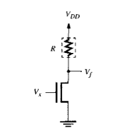

而CMOS使用互补晶体管，同一时间只有其中一种晶体管导通。而MOS管G极电阻近乎无穷大，这也是CMOS电路省电的原因。CMOS电路一般只在动态切换时会产生漏电增加功耗，静态功耗很小可忽略不计，同样以非门为例

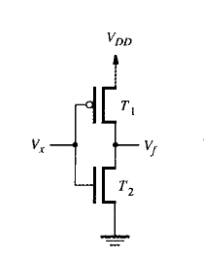

## 1 数字电路基础

*记录比较常用的一些理论以及解决问题的方法*

### 1.1 布尔（逻辑）代数公理

用于基本与或非电路的设计

*（离散数学学过了）*

| 名称 | 公式 |
| :--: | :--: |
| 双否律 | ~~A = A |
| 交换律 | A·B = B·A, A+B = B+A |
| 结合律 | (A·B)·C = A·(B·C), (A+B)+C = A+(B+C) |
| 分配律 | (A·B)+C = (A+C)·(B+C), (A+B)·C = (A·C)+(B·C) |
| 德摩根律 | ~(A+B) = (~A)·(~B), ~(A·B) = (~A)+(~B) |
| 吸收律 | A·(A+B) = A, A+(A·B) = A |
| 幂等律 | A+A = A, A·A = A |
| 同一律 | A+0 = A, A·1 = A |
| 零一律 | A·0 = 0, A+1 = 1 |
| 排中律 | (~A)+A = 1 |
| 矛盾律 | (~A)·A = 0 |
| 异或等价公式 | A⊕B = (B·~A)+(A·~B) | 
| 补充吸收律（很重要） | AB+(~A)C+BC = AB+(~A)C |

补充吸收律证明：AB+(~A)C+BC = AB+(~A)C+BC((~A)+A)

= AB+(~A)C+(~A)BC+ABC

= A(B+BC)+(~A)(C+BC)

= AB+(~A)C

### 1.2 触发器，寄存器，计数器

逻辑电路中，触发器为重要组成部分，带入了时序，将逻辑电路的行为从空间扩展到了时间，从组合逻辑到时序逻辑

### 1.2.1 RS锁存器

**RS锁存器** 电路如下

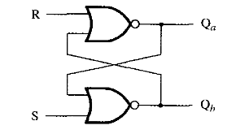

可以看作由两个非门的电路演变而来

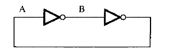

经过分析，RS锁存器行为可定义如下

| S | R | Q | ~Q |
| :-: | :-: | :-: | :-: |
| 0 | 0 | 0/1 | 1/0 |
| 1 | 0 | 1 | 0 |
| 0 | 1 | 0 | 1 |
| 1 | 1 | 0 | 0 |

当S,R都为0时输出状态保持不变。S高电平R低电平置位，R高电平S低电平复位，RS高电平输出都为低电平

*注意：RS触发器在RS端都为0时上电瞬间，以及RS端同时从1跳变为0时会出现短时间振荡*

**门控RS锁存器**

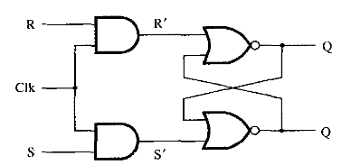

就是在RS触发器基础上加一个输入控制门

与非门实现的门控RS锁存器

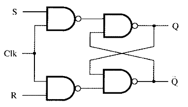

表示符号如下

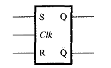

*注意：同上，当RS端同时为1时，如果Clk负跳变会导致短时间振荡*

### 1.2.2 D锁存器

D锁存器就是为了解决RS触发器可能出现的不确定情况而出现的（防止RS同时为1）

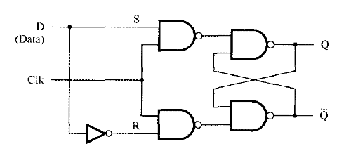

D高电平，Clk高电平，D被锁存

电路符号如下

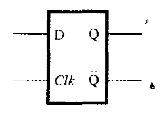

**主从D触发器**

主从D触发器结构如下图

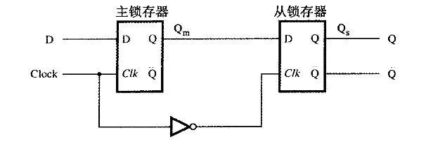

D在Clk高电平时被主触发器取样，输出不变，Clk变为低电平后从从触发器输出

电路符号如下

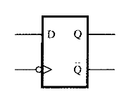

**边沿触发D触发器**

边沿触发D触发器结构如下图

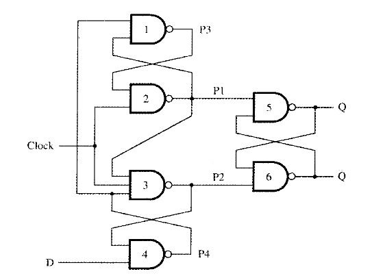

由上图分析，当Clk为0时，P1 = P2 = 1，P3 = D，P4 = ~D，触发器状态不变。若Clk正跳变时D为0，P1 = 1，P4 = 1，P2 = 0，P3 = 0，Q = 0，此时若D变为1，由于P2 = 0锁死了P4 = 1，所以不会有变化。若Clk正跳变时D为1，P1 = 0，P4 = 0，P2 = 1，P3 = 1，此时若D变为0，由于P1 = 0锁死了P3 = 1，P2 = 1，所以也不会有变化。

边沿D触发器可以保证在Clk高电平时D发生改变而输出状态不变

电路符号如下

**有清零端和预置信号的D触发器**

带清零端和置位端的主从D触发器

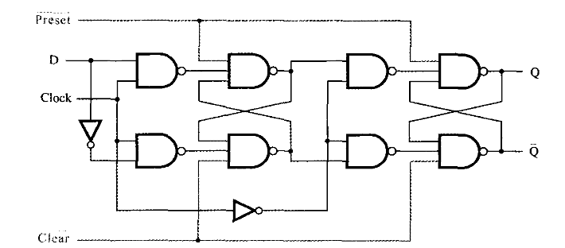

使用时，需要保持清零端和置位端为高电平。清零和置位为异步于时钟，低电平有效

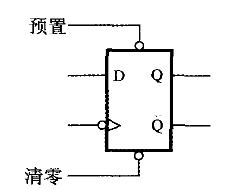

带清零端和置位端的沿触发D触发器

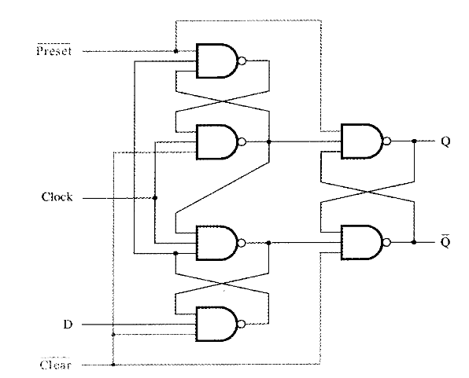

使用时，需要保持清零端和置位端为高电平。清零和置位为异步于时钟，低电平有效

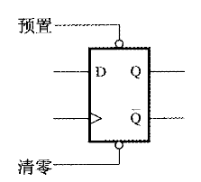

**同步清零的实现：**

如下，实现同步清零直接在数据输入端加一个与门即可

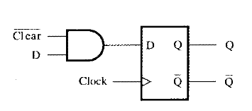

### 1.2.3 T触发器

T触发器结构如下图

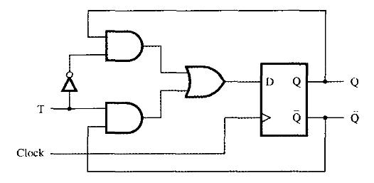

T触发器符号

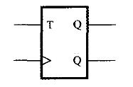

T触发器行为可以定义如下：如果T = 0则不跳变；如果T = 1则不停跳变

### 1.2.4 JK触发器

JK触发器结构如下图

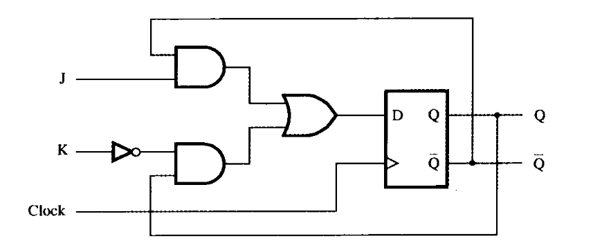

JK触发器有两个输入端J和K，既可以当RS触发器使用，也可以当T触发器使用（T触发器就是由JK触发器演变而来）。R = S = 1在RS触发器中是不允许的状态，此时JK触发器可以相当于T触发器T = 1不停跳变；其他状态相当于J = S，K = R，相当于RS触发器的RS端

### 1.2.5 寄存器

**移位寄存器**

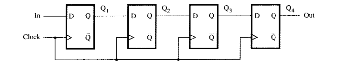

移位寄存器由沿触发D锁存器组成，一个D触发器的Q输出端接下一个D触发器D输入端，原理好理解

**并行存取移位寄存器**

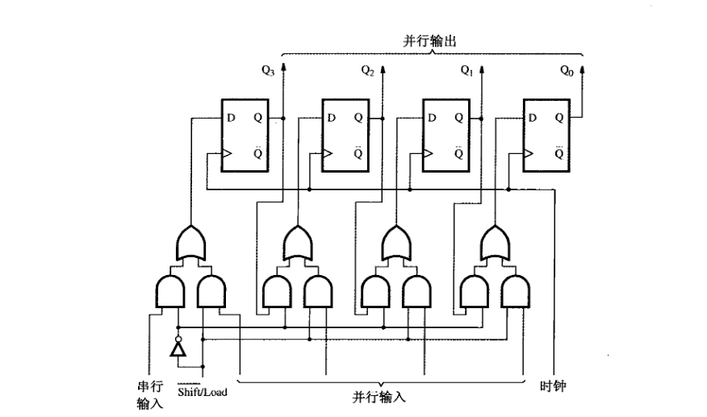

并行存取移位寄存器结合了并行寄存器以及移位寄存器的功能，加入了外部电路，实现~SHIFT/LOAD端低电平时串行移位，高电平时并行置位，如图原理好理解

### 1.2.6 计数器

**异步计数器(Asynchronous Timer)**

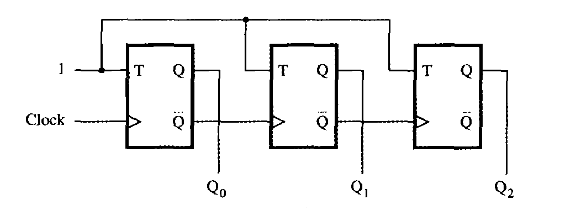

异步计数器由T触发器组成，上一个触发器的反相输出端连接下一个触发器的时钟输入端，T输入端接高电平

以上是递增计数器，递减计数器如下

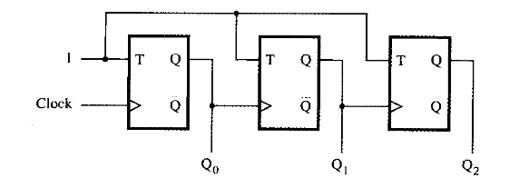

异步计数器由于时钟经过每一级都会有延迟，所以不能用于对时序要求高的高频场合

**同步计数器(Synchronous Timer)**

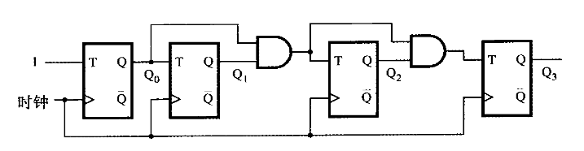

同步计数器保证了时钟的同步，所有位延迟相同

同步计数器添加复位和使能端后如图，复位为异步复位，使能端即第一个触发器的T端

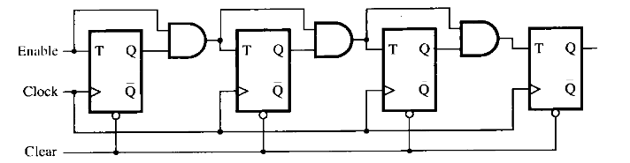

**D触发器实现的同步计数器**

由T触发器的实现电路简化而来（使用一个异或门和一个D触发器同样可以等价实现T触发器）

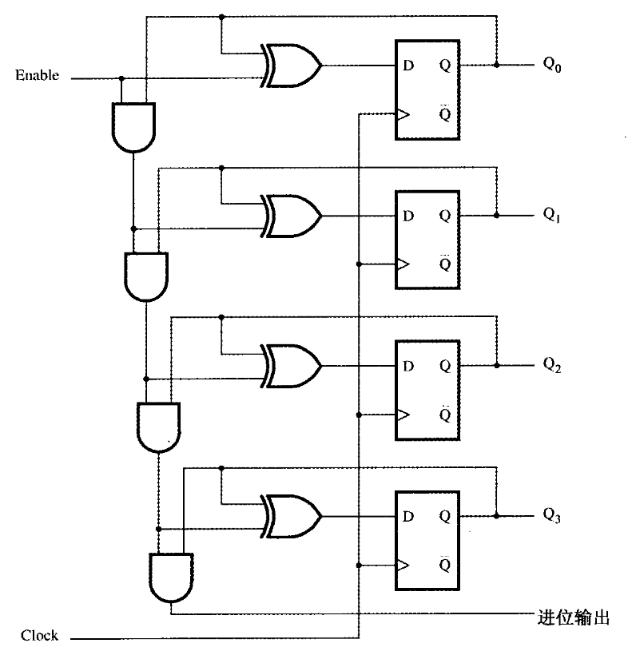

**支持并行加载的计数器**

计数器可以使用触发器自带的异步Preset以及Clear端进行置位或复位，这里使用另外一种同步并行加载法

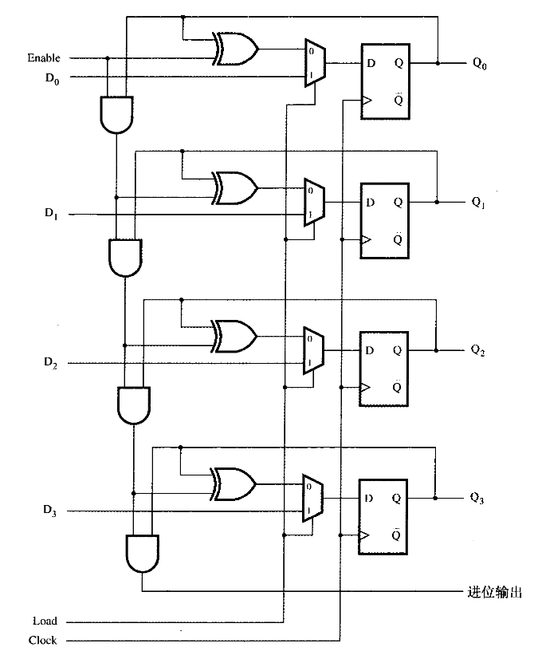

并行加载计数器的应用：并行加载的计数器可以添加少量外部器件构建任意模数以及复位初始值的计数器，可以使用与门使计数器计数到特定值后输出高电平到Load端，加载预置输入，如下图实现了一个模6（输出0~5）计数器

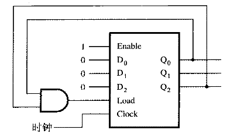

该模6计数器时序图如下

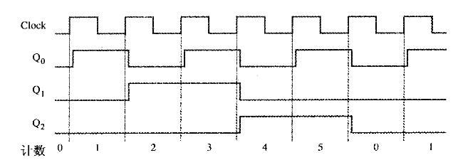

由上图分析，在计数器计数到5后，Load变为高电平，下一次时钟到来时会直接将预置值加载

下图示例另外一种使用异步复位端的模5计数器以及其时序图，并说明这种设计的缺陷
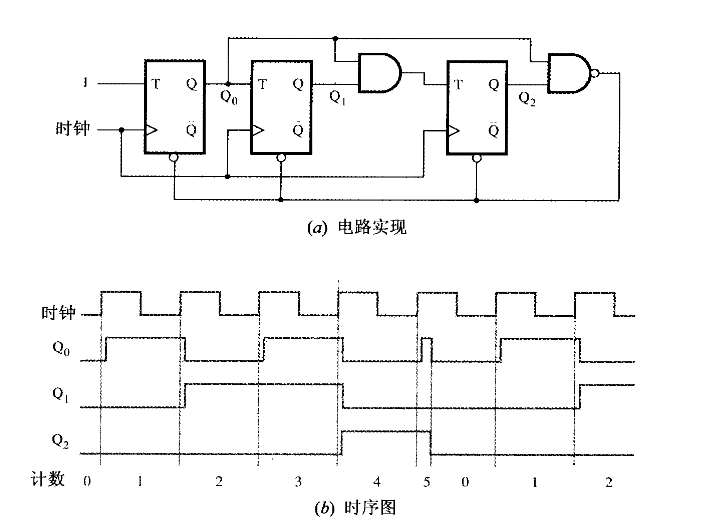

这个计数器设计和以上同步加载的相同，区别是它只能作为模5（输出0~4）计数器使用，由时序图可知，其输出为5的时间非常短，但是确实会输出5用于复位（输出为5后立即强制复位），和时钟无关，只和门电路固有延迟有关。虽然这个电路相对来说更简单，但是这在一个数字系统中，尤其是使用同步时钟的系统，是可能带来不可预知的行为的，要尽量避免。

**BCD（8421码计数器）**

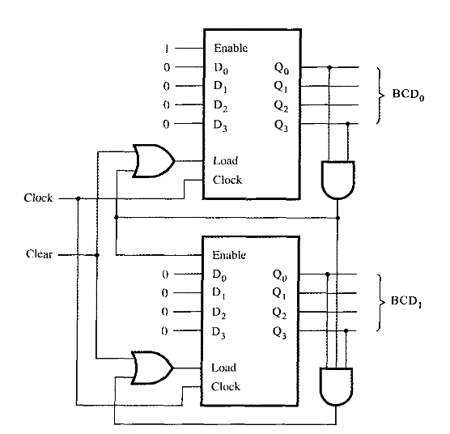

由同步加载计数器可以设计出以上2位BCD码计数器。计数器巧妙应用了第2位计数器的Enable端，可以实现逢十进一。

**环形计数器**

环形计数器原理和移位寄存器差不多，区别于一般二进制计数器，环形计数器输出不代表二进制数，同一时刻只有一个输出为高电平（独热码）。

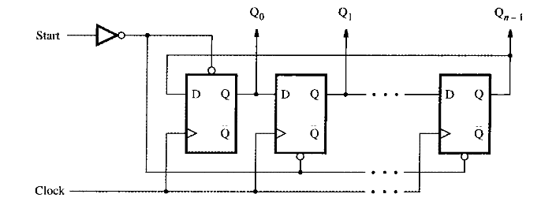

如图，模n环形计数器有一个异步Start端，相当于是这个计数器的复位端，Start高电平将Q0置位为1，其他复位为0，时钟触发后Q0逐个移位作为计数功能

环形计数器也可以使用一般二进制计数器加上译码器组成，适用于较大的环形计数器

**Johnson计数器**

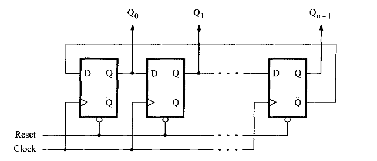

Johnson计数器和环形计数器差不多，区别就是Johnson计数器复位后所有位为0，且最后一位的反相输出端连接到第一个触发器的输入端，Johnson计数器工作输出规律如下：0000,1000,1100,1110,1111,0111,0011,0001,0000

### 1.3 组合逻辑表达式的推导

有两种方法，所有真值为1的项的主析取范式（积之和），或所有真值为0的项的主合取范式（和之积），具体视情况而定，尽量使用较简单的方法

**示例**

有如下真值表，ABC为输入，X为输出

| A | B | C | X |
| :-: | :-: | :-: | :-: |
| 0 | 0 | 0 | 1 |
| 1 | 0 | 0 | 1 |
| 0 | 1 | 0 | 0 |
| 1 | 1 | 0 | 1 |
| 0 | 0 | 1 | 0 |
| 1 | 0 | 1 | 1 |
| 0 | 1 | 1 | 0 |
| 1 | 1 | 1 | 0 |

**取1项作主析取范式（正则积之和形式，每一个积都是最小项）**

> X = (~A)·(~B)·(~C) + A·(~B)·(~C) + A·B·(~C) + A·(~B)·C

**取0项作主合取范式（正则和之积形式，每一个和都是最大项）**

> X = (A+(~B)+C) · (A+B+(~C)) · (A+(~B)+(~C)) · ((~A)+(~B)+(~C))

**积之和/和之积互相转换**

以上为例，积之和为

> X = (~A)·(~B)·(~C) + A·(~B)·(~C) + A·B·(~C) + A·(~B)·C

没有出现的项为

> A·B·C, (~A)·B·C, (~A)·(~B)·C, (~A)·B·(~C)

那么

> ~X = A·B·C + (~A)·B·C + (~A)·(~B)·C + (~A)·B·(~C)

由双否律以及德摩根律又可以推出

> X = ~~X = ~(A·B·C + (~A)·B·C + (~A)·(~B)·C + (~A)·B·(~C))
> 
> X = ((~A)+(~B)+(~C)) · (A+(~B)+(~C)) · (A+B+(~C)) · (A+(~B)+C)

*反之求和之积的积之和同理*

**补充：积之和/和之积一般表示方式**

积之和

> X = m0 + m1 + m3 + m5 = ∑m(0, 1, 3, 5)

和之积

> X = M2 · M4 · M6 · M7 = ∏M(2, 4, 6, 7)

*最小项与其对应的最大项关系 m2 = ~M2（德摩根）*

### 1.4 组合逻辑电路的优化

在逻辑电路的设计中，同一个电路一般有多种具体实现，考虑到成本，设计复杂度以及功耗，需要对电路进行化简

门电路数以及门电路输入端数量之和为衡量电路成本的重要因素

### 1.4.1 一般化简

简单情况下，逻辑电路的化简，就是使用布尔代数公理，化简积之和/和之积的过程

在之前的示例中，可以化简积之和如下

> X = (~B)·(~C) + (~B)·A + (~C)·A = （~B)·A + (~C)·A

### 1.4.2 优化理论概要

在大规模电路中，一般的根据布尔代数公理推导会非常复杂，因此引入一套完整的理论用于逻辑代数的优化，也可以看作是通用的高级优化方法。这些方法被广泛应用于集成电路设计以及FPGA的EDA中。常见的有卡诺图法以及立方体化简法。卡诺图法适合于简单逻辑的设计，适合手动操作，不适用于复杂的电路（是个NP完全问题，也不适用于计算机解决）；而立方体法适用于计算机算法。目前在数字电路设计的领域已经开发出了很多相关算法，有兴趣的可以看看国外论文

### 1.4.3 图表法（卡诺图法，适用于人工作业）

*可以使用积之和，也可以和之积，原理相同*

**二变量卡诺图**

真值表

| X1 | X2 | X |
| :-: | :-: | :-: |
| 0 | 0 | m0 |
| 0 | 1 | m1 |
| 1 | 0 | m2 |
| 1 | 1 | m3 |

卡诺图

| X2 \ X1 | 0 | 1 |
| :-: | :-: | :-: |
| 0 | m0 | m2 |
| 1 | m1 | m3 |

这里设 m0=1, m1=1, m2=0, m3=1 

| X2 \ X1 | 0 | 1 |
| :-: | :-: | :-: |
| 0 | 1 | 0 |
| 1 | 1 | 1 |

**分析**：由上图可以发现，X1=0 对应的列为1，X2=1 对应的行为1，直接可以得出

> X = (~X1) + X2

**三变量卡诺图**

真值表

| X1 | X2 | X3 | X |
| :-: | :-: | :-: | :-: |
| 0 | 0 | 0 | 0 |
| 0 | 0 | 1 | 1 |
| 0 | 1 | 0 | 0 |
| 0 | 1 | 1 | 0 |
| 1 | 0 | 0 | 1 |
| 1 | 0 | 1 | 1 |
| 1 | 1 | 0 | 1 |
| 1 | 1 | 1 | 0 |

卡诺图，三维表格

| X3 \ X1X2 | 00 | 01 | 11 | 10 |
| :-: | :-: | :-: | :-: | :-: |
| 0 | 0 | 0 | 1 | 1 |
| 1 | 1 | 0 | 0 | 1 |

这里X1X2行需要使用格雷码，有关格雷码这里~~随便乱写~~了一个生成器，[查看源码](src/200920c01/graycode/gray.c)

**分析**：由上图，可以把表想象成可以卷起来的圆筒，X1X2行构成循环，所以X1X2=00 X3=1以及X1X2=10 X3=1也要考虑 

> X = X1(~X3) + (~X2)X3

**卡诺图优化一般规律总结**

找到卡诺图里面相邻2^n(2, 4, 8, 16...)个都是1的格子，可以合并成一个项，在拐角处相交重合的也可以优化，正方形的也可以优化成一个项，总之基本原则就是使用尽量少的优化次数优化尽量多的项，并且一次优化的数量在允许范围内要尽可能多，以减少单个项的元素数，例如在有正方形存在情况下就不要使用相邻两个优化了

**再举例：四变量卡诺图**

四维表格

| X3X4 \ X1X2 | 00 | 01 | 11 | 10 |
| :-: | :-: | :-: | :-: | :-: |
| 00 | 1 | 0 | 0 | 1 |
| 01 | 0 | 0 | 0 | 0 |
| 11 | 1 | 1 | 1 | 0 | 
| 10 | 1 | 1 | 0 | 1 |

通过观察

> X = (~X1)X3 + (~X2)(~X4) + X2X3X4

**扩展：五变量卡诺图**

五维表格，可以使用两张四维表格表示

X5 = 0

| X3X4 \ X1X2 | 00 | 01 | 11 | 10 |
| :-: | :-: | :-: | :-: | :-: |
| 00 | 0 | 0 | 0 | 0 |
| 01 | 0 | 0 | 1 | 1 |
| 11 | 1 | 1 | 0 | 0 | 
| 10 | 1 | 1 | 0 | 0 |

X5 = 1

| X3X4 \ X1X2 | 00 | 01 | 11 | 10 |
| :-: | :-: | :-: | :-: | :-: |
| 00 | 0 | 0 | 0 | 1 |
| 01 | 0 | 0 | 1 | 1 |
| 11 | 1 | 1 | 0 | 0 | 
| 10 | 1 | 1 | 0 | 0 |

> X = (~X1)X3 + X1(~X3)X4 + X1(~X2)(~X3)X5

**卡诺图法小记**

卡诺图法只适用于少量变量的情况

介绍几个概念：

> 蕴含项：可以使f=1的项
>
> 质蕴含项：不可再次合并为项数更少的项
> 
> 本质蕴含项：不可缺少，必须包含的质蕴含项，其他可有可无的为非本质蕴含项
>
> 覆盖：一个蕴含项的集合可以说明函数值为1的所有情况
> 
> 成本：假设求反成本为零，门电路数与输入端数之和

在优化中，要在可能的蕴含项集合中凑出相比其他大部分方案更节约成本的方案，因为可能的解法一般远远不止一种，而且这些方案成本一般会不同

有时候会碰到根本不存在本质蕴含项的情况，这种情况只能逐个方案计算比较（一般如果图中所有蕴含项排列正好形成一个闭环首尾相接，就会出现这种情况）

**补充：非完全指定函数**

有时候一个逻辑电路的所有输入情况并不会全部出现，这种情况下就会形成非完全指定函数，如下例

| X3X4 \ X1X2 | 00 | 01 | 11 | 10 |
| :-: | :-: | :-: | :-: | :-: |
| 00 | 0 | 1 | d | 0 |
| 01 | 0 | 1 | d | 0 |
| 11 | 0 | 0 | d | 0 | 
| 10 | 1 | 1 | d | 1 |

其中，d代表的输入永远不会出现

这样，可以把部分d补为1，以实现最简电路

| X3X4 \ X1X2 | 00 | 01 | 11 | 10 |
| :-: | :-: | :-: | :-: | :-: |
| 00 | 0 | 1 | 1 | 0 |
| 01 | 0 | 1 | 1 | 0 |
| 11 | 0 | 0 | d | 0 | 
| 10 | 1 | 1 | 1 | 1 |

> X = X2(~X3) + X3(~X4)

**补充：多输出电路**

很多时候要求一个电路输出端不止一个，这时候就要求设计共用尽量多的电路，以下为一般方法

f1定义

| X3X4 \ X1X2 | 00 | 01 | 11 | 10 |
| :-: | :-: | :-: | :-: | :-: |
| 00 |  |  |  |  |
| 01 | 1 | 1 | 1 |  |
| 11 | 1 | 1 | 1 |  | 
| 10 |  | 1 |  |  |

f2定义

| X3X4 \ X1X2 | 00 | 01 | 11 | 10 |
| :-: | :-: | :-: | :-: | :-: |
| 00 |  |  |  |  |
| 01 | 1 |  | 1 | 1 |
| 11 | 1 |  | 1 | 1 | 
| 10 |  | 1 |  |  |

> f1 = X1X2X4 + (~X1)X2X3(~X4) + (~X1)X4
>
> f2 = X1X2X4 + (~X1)X2X3(~X4) + (~X2)X4

可以达到共用的目的

**补充：多级综合问题**

有时候当一个电路的输入端过多时，需要解决电路的扇入问题

在一般的逻辑电路中，与门输入端一般不超过8个，FPGA中单个LUT的输入也是相当有限的，所以要将多输入的逻辑函数分解成多级以适应具体的电路限制

示例：

> f = X1X3(~X6) + X1X4X5(~X6) + X2X3X7 + X2X4X5X7

提取公因式

> f = X1(~X6)(X3 + X4X5) + X2X7(X3 + X4X5)

可以用于2输入端逻辑单元的FPGA

补充：子函数分解

有时候可以将某些部分看作一个完整的子函数，可以大大降低电路成本

示例：

> f = ((~X1)X2 + X1(~X2))X3 + (X1X2 + (~X1)(~X2))X4

推导可知

> (~X1)X2 + X1(~X2) = ~(X1X2 + (~X1)(~X2))

可以将(~X1)X2 + X1(~X2)看作一个子函数g(X1, X2)

那么

> f = g(X1, X2)·X3 + ~g(X1, X2)·X4

### 1.4.4 列表法/立方体表示法简介

所谓立方体实际是一个抽象概念

设想这样一个由3位格雷码生成的立方体

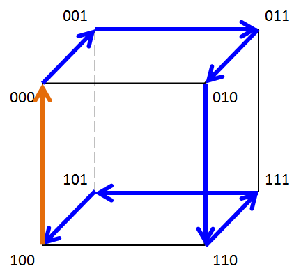

**所有边连接的两个顶点都只有一个比特不同**，一条边代表有两个比特相同的项，比如连接 000 010 的边代表项 (~X1)(~X3)，可以表示为 0x0。相似的，一个面 000 100 010 110 代表项 (~X3)，可以表示为 xx0。立方体中每个顶点都和另外3个顶点相连，这另外3个顶点正好就只差一个比特。**所谓立方体就是指的这种互联结构。这种互联结构可以看作多维立方体（2^n个顶点），内部包含低于其维度的子立方体**。

要找出一个电路的优化，首先就要找出所有f=1的边。

立方体的合并：两个小立方体可以合并成为一个大立方体。例如：0xx1x 和 0xx0x 可以合并为 0xxxx

### 1.4.5 列表法化简，适用于变量较多的式子

设 f = ∑m(0, 4, 8, 10, 11, 12, 13, 15)

可以列表如下

| m | x x x x |
| :-: | :-: |
| 0 | 0 0 0 0 |
| 4 | 0 1 0 0 |
| 8 | 1 0 0 0 |
| 10 | 1 0 1 0 |
| 12 | 1 1 0 0 |
| 11 | 1 0 1 1 |
| 13 | 1 1 0 1 |
| 15 | 1 1 1 1 |

最终合并如下

| m | x x x x |
| :-: | :-: |
| 8,10 | 1 0 x 0 |
| 10,11 | 1 0 1 x |
| 12,13 | 1 1 0 x |
| 11,15 | 1 x 1 1 |
| 13,15 | 1 1 x 1 |

| m | x x x x |
| :-: | :-: |
| 0,4,8,12 | x x 0 0 |

设P={10x0, 101x, 110x, 1x11, 11x1, xx00} = {p1, p2, p3, p4, p5, p6}，可以列出蕴含列表如下

| P | 0 | 4 | 8 | 10 | 11 | 12 | 13 | 15 |
| :-: | :-: | :-: | :-: | :-: | :-: | :-: | :-: | :-: |
| p1 |   |   | √ | √ |   |   |   |   |
| p2 |   |   |   | √ | √ |   |   |   |
| p3 |   |   |   |   |   | √ | √ |   |
| p4 |   |   |   |   | √ |   |   | √ |
| p5 |   |   |   |   |   |   | √ | √ |
| p6 | √ | √ | √ |   |   | √ |   |   |

由上表，p6唯一覆盖了0 4，必须包含

去掉p6行以及对应的0,4,8,12列，得到下表

| P | 10 | 11 | 13 | 15 |
| :-: | :-: | :-: | :-: | :-: |
| p1 | √ |   |   |   |
| p2 | √ | √ |   |   |
| p3 |   |   | √ |   |
| p4 |   | √ |   | √ |
| p5 |   |   | √ | √ |

**支配行**：由上表可以看到p2包含了p1的情况，称为p2支配p1，并且p2和p1实现成本相同，因此可以去掉p1（如果p2实现成本高于p1则不可删除），同理可以去掉p3得到下表

另外还有**支配列**的概念，和支配行类似，不同的是支配列去掉的是支配列而不是被支配列，好理解

| P | 10 | 11 | 13 | 15 |
| :-: | :-: | :-: | :-: | :-: |
| p2 | √ | √ |   |   |
| p4 |   | √ |   | √ |
| p5 |   |   | √ | √ |

发现p2和p5不可删除，p4包含在p2和p5里面

所以最终覆盖C={p2, p5, p6}={101x, 11x1, xx00}

**列表法算法小结**

>   1. 首先根据真值表列出所有f=1的最小项，使用立方体比较产生f的所有质蕴含项
>   2. 列出质蕴涵项覆盖表
>   3. 将当前已经发现的本质蕴含项包含到最终覆盖表并去除对应行和列
>   4. 使用行支配以及列支配进一步化简，注意先比较成本再决定是否删去
>   5. 重复3至4，直到覆盖表变空或不可化简
>   6. 若化简后不为空，用分支法确定哪些项应该包含在最终覆盖表中（一个一个算并对比）

*列表法局限性：一般逻辑函数很少以最小项形式给出，而是以代数表达式或立方体集合给出。这样就需要先将代数表达式和立方体集合扩展成为最小项形式。这样的覆盖表会变得非常大，立方体简化也会异常复杂，算法速度很慢*

### 1.4.6 立方体表示法化简（可用于计算机算法）

~~记于2021.2.19：后来看了一下，其实这种算法复杂度依然非常高x，一般市面上的EDA都会用更加优化的方法，并且很少开放~~。有兴趣可以了解一下加州大学伯克利分校的Espresso，使用启发式的算法

这些算法一般会在EDA里面集成用于电路的优化，一般用户不用考虑这些算法，了解一下就可以（~~除非你要开发一个EDA~~）

实际应用中，EDA一般得到的用户输入都是蕴含项之和的形式，这些蕴含项不一定是最小项或者质蕴含项。

这里定义 **星积（\*）** 运算：

星积运算一般用于寻找质蕴涵项，运算结果如果是维数大的立方体则保留，维数相同看包含关系决定是否删除（其实就是看生成的C立方体是否被原来的包含）

设A,B为n变量函数中的两个蕴含项

> A = A1A2...An
> 
> B = B1B2...Bn
> 
> Ai或Bi可以为0,1,x

设C = A \* B

\*运算规律如下

| Ai\Bi | 0 | 1 | x |
| :-: | :-: | :-: | :-: |
| 0 | 0 | ∅ | 0 |
| 1 | ∅ | 1 | 1 |
| x | 0 | 1 | x |

生成C规则：

1. 若多于一个Ai\*Bi=∅，则C=∅
2. 以上条件不满足，则当Ai\*Bi=∅时Ci=x；Ai\*Bi≠∅时Ci=Ai\*Bi

计算f质蕴涵项步骤

1. 设Ck为f的一个覆盖，对Ck中所有项两两配对进行\*运算后生成Gk+1
2. 设Ck+1 = Ck ∪ Gk+1 - 冗余立方体（冗余立方体：若A被B所包含，则去掉A，比如00x1和00xx应该去掉00x1）
3. 重复以上运算直到Ck+1 = Ck
4. 最终的C就是质蕴含项集合

再定义一个 **飒（\#）** 运算：

飒运算用于确定本质蕴含项，直接功能是用来判断一个立方体是否包含另一个立方体

\#运算规律如下，\#运算具有反对称性，不支持交换律。ε大概表示覆盖的意思，好理解

| Ai\Bi | 0 | 1 | x |
| :-: | :-: | :-: | :-: |
| 0 | ε | ∅ | ε |
| 1 | ∅ | ε | ε |
| x | 1 | 0 | ε |

生成C规则：

1. 若存在Ai \# Bi = ∅，则C = A （不相交）
2. 若所有Ai \# Bi = ε，则C = ∅ （此时B完全覆盖A）
3. 除以上情况，如果是部分覆盖可能生成一个或多个立方体，即对于每个出现的Ai = x，Bi = 0或1 的情况，都会生成一个C = ∪i(A1, A2,...(~Bi)...,An) （此时B部分覆盖A）。如果生成多个立方体，那么这所有的立方体都要分别进行剩下的运算

**获取本质蕴含项步骤**：

1. 直接套公式：如果pi \# (P - pi) \# DC ≠ ∅ 成立，那么pi就是本质蕴含项

其中，P为质蕴含项总集合（由之前的星积运算得出），pi为其中一个质蕴含项，DC为无关项总集合（即之前提到的值为d的集合）

**使用飒运算的方法举例**

设通过星运算得出的质蕴含项集合P={x01x，x101，01x1，0x1x，xx10}

> 解：
>
> 没有无关项集合DC，首先拿x01x运算，x01x \# x101 = x01x，x01x \# 01x1 = x01x，x01x \# 0x1x = 101x，101x \# xx10 = 1011
>
> 则最终x01x \# ( P - x01x ) = 1011 ≠ ∅
> 
> 其他 x101 \# ( P - x101 ) = 1101 ≠ ∅，01x1 \# ( P - 01x1 ) = ∅，0x1x \# ( P - 0x1x ) = ∅，xx10 \# ( P - xx10 ) = 1110 ≠ ∅
> 
> 最终求得本质蕴含项为x01x，x101，xx10

**总结：使用星运算和飒运算求解最小覆盖**

函数的最初覆盖为DC（无关项的集合）和ON（使f=1的集合）的并集

> 1. 设初始覆盖C0=DC ∪ ON
> 2. 应用星积运算求出所有质蕴含项，形成集合P
> 3. 应用星积运算求出所有本质蕴含项。若本质蕴含项包含了开集ON，则这个本质蕴含项构成最小化覆盖
> 4. 如果质蕴含项pi成本比pj高，并且pi \# DC \# pj = ∅，那么要把pi删掉
> 5. 找出覆盖所有剩余顶点成本最低的质蕴含项，如果找出质蕴含项成本相同，则使用启发式分支算法求出最终解

### 1.5 同步时序电路设计

时序电路又被称为**有限状态机**

同步时序电路由基本组合逻辑电路以及触发器组成，使用时钟信号控制，如下

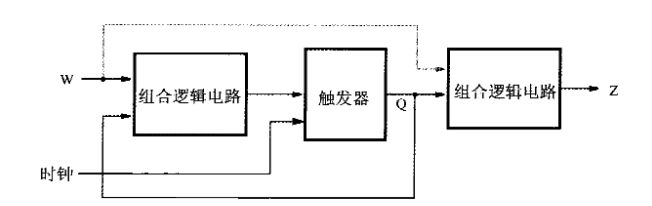

W为输入端，Z为输出端。电路的状态取决于当前触发器的输出Q（反馈至输入端）以及电路的输入W。其中触发器应当是边沿触发器，而非普通的D触发器。

电路输出Z仅取决于当前电路状态的电路称为**Moore**型电路，同时取决于当前状态以及主输入的称为**Mealy**型电路

### 1.5.1 Moore型电路基本设计步骤

设想要设计这样一个电路，在连续两个时钟输入1后输出会变成1，一旦输入变为0之后输出变回0。（这样的电路被称为序列检测器）

输出状态变化如下图所示，输出取决于之前的输入

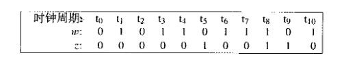

设计这样的电路涉及到状态机理论。可以选择一个状态作为初始态，比如上电复位态。

由以上分析，该状态机需要3个状态：上电且输入W为0，设为状态A；一旦输入1，转为状态B；再次输入1，转到状态C，Z输出1；一旦输入0，就转回A，Z输出0。

假设这里先使用D触发器的方案，使用其他触发器的方案之后讨论

可以得到**状态转移图**如下图

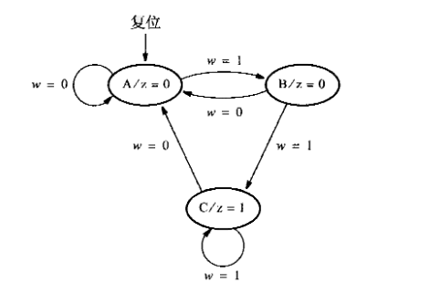

另外注意异步Reset也可以将所有状态强制复位到A，这里省略。

将以上状态转移图转化成为**状态转移表**如下

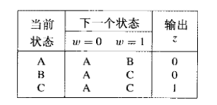

基本的设计方法如下：

先进行状态赋值

由于只要实现3个状态，使用2个D触发器（状态变量）即可，分别设为y1和y2。（最多可以表示4种状态）基本框图如下：

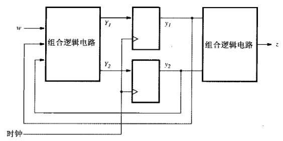

其中，输出Z只和当前电路状态有关(Moore型电路特性)，是y1、y2的函数。y1和y2的输出反馈至输入一端，和输入W共同决定下一状态。可以列出状态赋值表如下图：

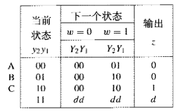

其中，y1=y2=1的情况未被使用到，可以设为任意量利于后续电路简化。根据输入y1、y2、W以及输出下一状态Y1、Y2列表。

接下来就可以使用之前在组合逻辑部分讲述的方法构建并简化逻辑表达式，其中d可以使用随意条件

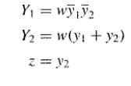

最终得到的电路如下图所示

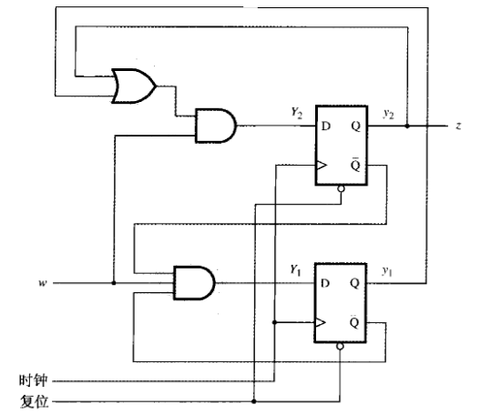

波形图如下，**注意观察W是在下一次变化周期到来之前被采样，所以看上去好像y1和y2是在W之后一个周期发生变化，y1和y2在W被采样后的下一个周期内才变换到上一个周期采样应当变换到的状态，有一个时钟的延迟，之后会讲述时钟同步问题**

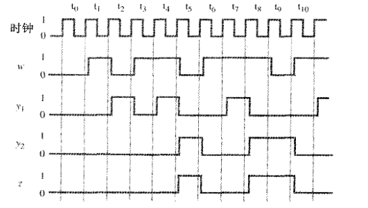

**补充：最优状态赋值**

获得最优状态赋值没有特殊方法，一般只能凑，如上例，重新赋值如下，可以得到更简的电路

对于大规模电路来说，基本无法寻找一种最优的赋值，一般EDA厂商使用专用的启发式算法，不公开

**补充：使用一位有效编码（独热码）**

以上方案都使用了二进制编码赋值的方案，优点是使用的触发器比较少，这里介绍一种独热码的方案，使用和状态数相同数量的触发器，这种方案很多时候虽然不是最优，但是很多时候还是有优势的，将上例更改如下

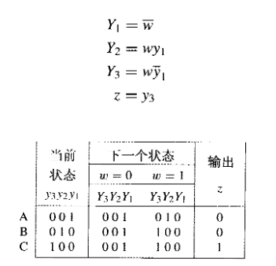

可以发现没有用到y2，EDA会自动检测并删除

有时候使用独热码可以使表达式更简单

### 1.5.2 Mealy型电路设计步骤

Mealy型电路输出和当前电路状态以及当前电路的输入有关

对以上例子进行更改，现在要求状态机在第一次W=1时由A状态转到B状态，之后若W保持为1，输出Z立即变为1，相当于将总的输出时序提前一个周期，在第一次输入W=1之后第二次采样到来之前（此时W=1）Z即输出1

这样状态机只需要两种状态，如下图

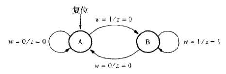

注意在这里输出Z被标在了弧线上，而不是一个单独的状态，Z需要对当前W的状态决定

这个电路和之前的电路最主要的区别就是输出同时取决于输入，所以列出的状态表输出Z会有W=1和W=0之分，状态表，以及状态赋值表可以表示为如下

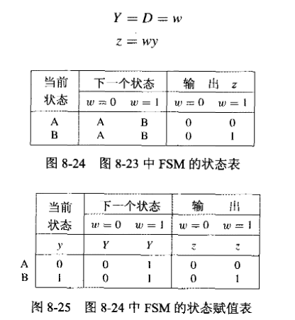

设计出的电路如下图

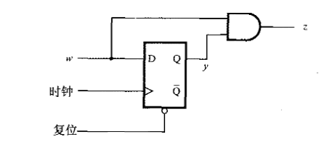

Mealy型电路有更好的灵活性，可以加一个D触发器转换成为如下的Moore型电路

这个电路很熟悉，它就是上面状态赋值中得到的优化电路

Mealy型电路不一定更简，但是由于消除了延迟的一个周期，所以执行同样的操作会比Moore型电路短一个周期。

### 1.5.3 同步时序电路设计小结

> 1. 首先进行要求分析
> 2. 推导状态机所有状态，创建状态图
> 3. 将状态图转换成为状态表，
> 4. 对状态数量进行最小化，得到最简推导结果
> 5. 对需要的状态进行赋值，注意赋值方案也有最简，要使用最简的
> 6. 选择要使用的触发器类型，推导下一状态的逻辑表达式
> 7. 实现电路设计

**补充：同步时序电路的分析**

分析一个同步时序电路其实基本就是设计的逆过程，可以先根据电路列出逻辑表达式，推导出状态赋值表，如下例

赋值状态表

基于JK触发器的电路的分析同理

**补充：算法状态机图**

算法状态机图和普通的流程图相似，用于较为复杂的电路，这里不做描述了

### 1.6 异步时序电路设计

异步时序电路状态不由时钟脉冲触发，而是由电路各输入端为0或1决定，不使用触发器表示电路状态

**定义：基本模式** 是指异步时序电路所有输入同时只有一个发生变化，在两个单次变化之间保证有足够的时间可以使电路达到稳态

异步时序电路在有两个输入同时发生变化时可能产生不确定的结果，一个典型的栗子就是RS触发器的RS输入同时从高电平转为低电平时

### 1.6.1 异步行为

如下，可以对RS触发器进行分析

设两个或非门都是理想的没有延迟，取RS触发器的Q进行分析，设当前输出为y，输入改变后经过Δ时间以后输出下一状态Y

假设当前Q输出y=0，输入S=R=0；此时若R变为1，S保持0，输出Q不变；接下来S也变为1，输出依然不变（此时电路状态其实是有变化的，或非回环的另一部分变为0）；此时若R再变回0，输出Q会发生变化，此时对应的Y=1≠y，电路处于非稳态，经过Δ延时以后y变为1。

观察上表，表中列出了在y当前输出为0和1时，输入SR后对应的期望输出Y。其中，若期望输出Y和当前y相同，称电路处于稳态，用圆圈圈出；其余会发生变化的称为非稳态

由上表推导，可以得出Y=~R·(S+y)

可以得出状态转移表和状态转移图如下

其中，设输出0为状态A，1为状态B，该电路为Moore型有限状态机

和同步时序电路不同，异步时序电路不使用触发器表示状态，而是直接将逻辑门连接

可以发现，异步电路综合的方法和同步电路相似

下来换一种分析模型，换成**Mealy模型**，状态表和状态转移图如下

上图中，和之前同步电路相同，输出Q对于每个输入SR都有对应的值，但是在状态发生变化时，例如从00变为10，如果在输出Q写1，会导致重复标记（在状态表中已经将B标出，变成B时Q会变成1），因此将其标记为"-"，可以任意赋值，以简化电路

**术语补充**

流程表：相当于异步电路的状态表

状态转换表/激励表：相当于异步电路的状态赋值表

### 1.6.2 异步电路分析

举例：对一个D触发器进行分析

Y = CD+(~C)y+Dy = CD + (~C)y （第一章基本公式）

对所有输入状态进行分析，可以得出激励表和流程表如下

### 1.6.3 

### 1.7 常用的算术硬件以及计算方法

算术电路是CPU的核心部分，常见的一般有加法器，乘法器，除法器，以及针对定点浮点运算的算术逻辑电路

本小节也会记录各种算法原理，如二进制乘法除法，浮点算法，以及其他常用加密/校验算法，如AES，DES，CRC等（现代CPU很多都带有加解密硬件）

### 1.7.1 加/减法器

### 1.7.2 乘法器

### 1.7.3 除法器

### 1.7.4 浮点运算

### 1.7.5 DES

### 1.7.6 AES

### 1.7.7 CRC

## 2 Verilog HDL入门以及开发实战

记录Verilog的语法和设计模式，以及Quartus Prime的使用方法

### 2.1 Intel Quartus Prime 使用简介

