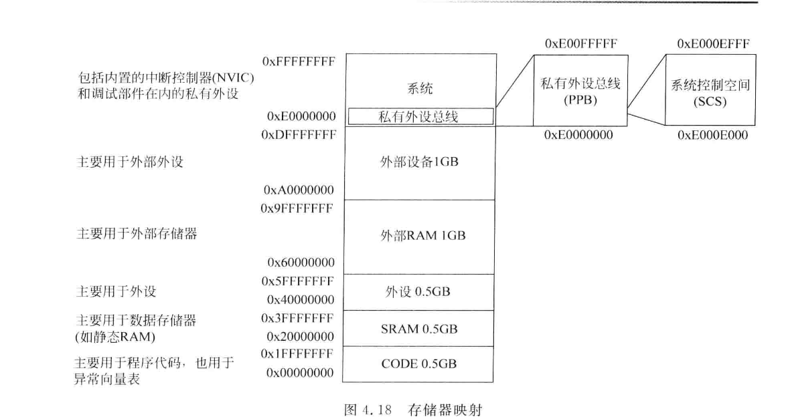

# ARM Cortex-M体系结构研究，STM32学习笔记（基于GNU工具链）

## 参考资料

*《ARM Cortex-M3与Cortex-M4权威指南（第3版）》，Joseph Yiu，2015.11，清华大学出版社*


## 1 ARMv7-M体系结构

## 1.1 简介

目前在低功耗微控制器中最主流的32位ARM核心有Cortex-M3以及Cortex-M4。这两种核心都使用**3级流水线**，**哈佛总线结构**，以及**统一的内存地址空间**，总共可以寻址**4GB**

Cortex-M核心内建了中断控制器系统，称为**NVIC**（Nested Vectored Interrupt Controller），中文翻译为**嵌套向量中断控制器**，是属于核心的一部分。它支持最多240个中断请求以及8到256个中断优先级（具体要看实际的核心配置，一般是8到16级优先级居多）

Cortex-M支持在一个MCU系统中集成多个处理器核心

另外Cortex-M还支持可选的MPU，用于提高运行时内存的安全性（目前大多数Cortex-M核心的MCU不会配备MPU。如果有MPU的需求一般直接使用Cortex-R系列核心）


## 1.2 ISA与微架构概览

由于MCU存储资源有限，为压缩程序大小，ARMv7-M的CPU只支持Thumb-2，不支持32位的ARM指令集。该指令集是对旧有Thumb指令集的扩展，是16位（2字节）或32位（4字节）可变长度的。其中很多常用指令都使用16位编码以减小代码长度

+ 支持硬件除法

+ 支持字节（B）、半字（H）、单字（W）、双字（D）存储器访问与数据操作，可变的大小端模式

+ 支持累乘加`MAC`以及饱和指令

+ 支持多种跳转以及函数调用指令

Cortex-M4相比Cortex-M3多出了一些适用于DSP的指令，比如对于浮点数的硬件支持，以及SIMD指令等


### 1.2.1 架构，系统总线与中断控制

**架构**

ARMv7-M的处理器为典型的32位机，其通用寄存器（GPR），数据总线，总线接口都是32位，寻址也是32位所以总共支持4GB的内存空间。不同于8051等早期单片机，ARM使用统一的内存架构，包括SRAM，程序Flash以及各种外设寄存器等都位于相同的内存空间，拥有唯一的地址。这些使用ARM Cortex-M核心的MCU既可以在Flash中运行程序，也可以将程序放到SRAM中运行

**总线**

之前说过Cortex-M3，Cortex-M4都是使用3级流水线的哈佛结构，取指令和存取数据可以同时执行，当然前提是指令和数据不使用同一条总线。**一般在一个MCU中会有多片SRAM以及Flash，尽管它们使用统一的内存编址，这些存储器都拥有物理上独立的总线。CPU核心以及DMA等通过总线交换矩阵和它们连接，可以同时访问不同的存储器**。这种情况下，如果将指令和数据放在同一片SRAM中将会导致总线冲突，降低流水线效率。以下是STM32F4中典型的总线结构


基于Cortex-M的MCU内部都使用了AMBA标准总线，该标准由ARM规定。MCU中常见的有两种总线类型：**AHB Lite**以及**APB**。AHB总线是系统高速总线（矩阵），运行频率高，一般用于连接CPU，SRAM，Flash，DMA，APB桥，DMA-USB等。而APB用于一些低速IO外设，如I2C，SPI，USART，CAN，ADC，DAC等，**APB总线通过APB桥挂接到AHB总线**。有些MCU中的APB也分为低速APB和高速APB

Cortex-M0以及Cortex-M0+属于ARMv6-M，并且使用冯诺依曼结构。这两种核心能耗较低，门电路数量少

**中断**

对于所有Cortex-M核心，NVIC的寄存器地址都是固定且相同的，并且也是使用和SRAM、Flash以及外设IO相同的地址空间。NVIC的编程模型都是相同的。NVIC支持**外设中断**，**NMI不可屏蔽中断**以及**处理器内部异常**等多种异常和中断，总共最多支持240个中断，除NMI以外所有中断都可以单独使能或禁止。NVIC还支持中断的屏蔽功能。Cortex-M3以及M4的中断优先级可以在运行时修改，Cortex-M0和M0+不支持该功能。中断向量取出由CPU硬件自动实现，无需软件判断中断源，同时中断向量表可以重定位映射到不同的地址（默认位于地址0x00）


### 1.2.2 指令集ISA

以前更老的ARM处理器以及现在的Cortex-A核心一般支持32位ARM指令。32位的ARM指令相比Thumb以及Thumb-2在执行时具有更好的性能，但是程序较大。为优化程序大小一般需要在ARM执行模式以及Thumb模式下来回切换

ARMv7-M直接舍弃了庞大的ARM指令。所有的Cortex-M核心（包括ARMv6-M的Cortex-M0以及M0+）都只支持Thumb-2的不同子集，ARMv7-M的处理器兼容ARMv6-M所有的指令。这些处理器也舍弃了部分在旧有Thumb中的指令，如协处理器指令，指令集状态切换指令等

绝大多数使用Cortex-M4核心的MCU都为核心配备了FPU（带FPU的M4核心），支持额外的FPU指令。而Cortex-M3没有FPU以及SIMD指令的支持


### 1.2.3 OS支持特性

Cortex-M3和M4带有SysTick节拍定时器，同时提供了两个栈指针**MSP**和**PSP**，分别用于OS和用户进程。在一般的应用中如果不使用OS特性，可以只使用MSP

另外，这两种CPU核心还支持特权以及非特权模式。在一般的应用中默认使用的是特权模式。非特权模式一般要在RTOS中的用户程序中才会使用到，这种模式会限制用户对于一些模块如NVIC的访问


### 1.2.4 工作模式

Cortex-M3和M4处理器有2种运行状态，分别为**Thumb状态**以及**调试状态**。其中**Thumb状态**分为2种操作模式，执行中断或异常处理程序时为**处理模式**，正常执行程序时为**线程模式**。另外Cortex-M3和M4核心除一般的**特权模式**以外还支持**非特权模式**（Cortex-M0不支持）

状态转换示意图如下，一共可以分为3种主要的工作模式


其中特权模式到非特权模式的转换是单向的，非特权模式想要到达特权模式只能通过异常来处理。执行中断或异常时称为处理模式，这种处理模式权限上和特权模式类似。非特权模式可以保护NVIC的寄存器，防止用户程序篡改。另外在支持非特权模式的处理器（M3和M4）中，物理上有2个**SP**寄存器，一个用于特权模式，另一个影子寄存器用于非特权模式


## 1.3 常用软硬件以及程序架构

一般情况下，MCU厂商提供的SDK中除了各自的MCU外设库以外都会包含CMSIS（Cortex-M Software Interface Standard，由ARM提出并开发）。这个软件库包含了各种基本的库与头文件，以及针对各种Cortex-M核心的专有功能与对应函数（比如DSP函数库）

开发环境方面，以前最流行的就是Keil MDK和IAR了。然而现在各路MCU厂商都开始大力推广自家的开发环境，典型的有ST的STM32CubeIDE（基于Eclipse），TI的CCS（基于Eclipse），Microchip的Atmel Studio（基于Visual Studio）等。以前的Keil使用ARMCC编译器（现在Keil最新版已经转向基于LLVM的定制版工具链），而现在越来越多的厂商开始使用GNU工具链。这也是总趋势

在运行调试方面，一般的MCU都支持JTAG和SWD两种调试接口。目前常用的调试硬件有JLINK，ULINK以及开源的CMSIS-DAP（Debug Access Port）。其中CMSIS-DAP由于其开放的特性，近几年已经得到广泛的采用。CMSIS-DAP其实就是一种开源的调试器固件实现，走USB-HID所以在所有操作系统平台免驱，用户可以对固件进行适当的更改以后下载到一个廉价的小型开发板上将开发板变成一个调试器（最流行的就是使用搭载STM32F103的BluePill）。而调试上位机除了各IDE集成的以外，目前在开源平台最流行的就是OpenOCD

如果想要在Linux平台开发ARM单片机，并且想要使用开源工具集，只使用厂商的SDK而不依赖IDE，那么最少需要ARM的GNU工具链（arm-none-eabi-gcc），OpenOCD，Make等，再使用一个小核心板烧录CMSIS-DAP固件作为调试器即可

在Windows平台建议安装MSYS2


### 1.3.1 编译流程

在PC上编译单片机程序就是交叉编译。关于编译器基本原理，GNU工具链的组成与工作流程可以见[笔记](210731a_llvm.md#11-编译器基本工作流程)

编译单片机程序时，一般首先需要提供一个`.s`启动文件。这个启动文件使用汇编语言编写，相当于单片机的Bootloader，单片机在上电时会首先执行该程序对时钟等部件进行初始化，建立一个可用的程序执行环境，再调用`main()`函数入口开始执行用户程序


如上图，编译一个单片机程序，需要将所有的`.c`源代码以及`.s`汇编代码全部编译为`.o`可重定位二进制文件，最终通过`ld`链接器链接成为可执行映像。其中`ld`链接过程需要用到的链接器脚本有时会随厂商的开发环境发布。实际的应用中建议直接使用编译器驱动器`arm-none-eabi-gcc`自动调用工具链


### 1.3.2 程序设计

**轮询**

轮询是最傻瓜式的程序结构，基本原理就是将整个重复的工作流程编写成为一个大循环，两次循环之间一般会加入软延时（一般是`delay()`函数）。这种程序经过恰当的设计可以实现功能，但是缺点很多：代码难以维护，循环间隔时间难以控制，能耗比差，CPU利用率较差，反应迟钝等。只适合在初学者在要求不严格的场合使用。最典型的程序就是基于软延时的Blink

**中断**

实际的应用中建议使用**中断驱动**结合**状态机**的程序设计模式。这种工作模式下，定时任务不依赖CPU的软延时，而是依赖定时器产生的中断。而无法预测的突发事件同样通过中断服务程序处理。事实上中断系统才是单片机良好工作表现的根本保证。所有的单片机中断系统都支持中断优先级，更高级别的中断可以打断低级别的中断程序。这种工作模式下，定时任务会有精准的时间间隔，突发事件也可以得到及时的响应。同时CPU在无任务执行时可以进入休眠或最低功耗模式，节省能源。各类操作系统也是建立于中断技术上的

**RTOS实时操作系统**

随着MCU程序的不断复杂化，有时会遇到更加复杂的控制需求，比如多个任务同时执行的需求，这种情况下使用中断程序已经难以满足要求，就需要用到时间片轮转等方式，需要一个调度器。这种情况下就要使用到RTOS，这些RTOS一般还有信号量以及消息等特性。但是使用RTOS会占用更多的资源，有些低端MCU限于内存与Flash大小基本无法使用RTOS，这就要结合实际进行权衡。目前已经有上百种开源RTOS，这些RTOS也是学习操作系统原理的良好选择


## 1.3.3 CMSIS

CMSIS由ARM提出并被所有使用ARM核心的MCU厂商所采用，目的是保证单片机软件的复用性，兼容性，可移植性，工具链独立性以及开放性，开发者可以通过这些代码访问Cortex-M处理器的各种特性。CMSIS还提供了DSP算法的实现，以及RTOS的API定义，避免开发者重复造轮子造成混乱。CMSIS-DAP调试器也是属于CMSIS项目的一部分

CMSIS包括但不限于以下功能：

+ 和处理器有关的部件的寄存器定义，如中断控制器NVIC，节拍定时器SysTick以及SCB的寄存器定义等，以及和这些外设有关的C函数（API）

+ 用于特殊指令的C函数（否则要使用内联汇编实现），如`WFI`

+ 为各种异常处理进行了命名

+ 系统的初始化函数（`SystemInit()`，对于不同的MCU该函数有不同的实现）

+ 时钟频率数值的获取

+ 常用DSP函数的实现

CMSIS事实上是可有可无的，程序开发者不使用CMSIS提供的各种定义也可以实现功能，但是建议普通开发者还是充分利用CMSIS提供的函数与功能，避免重复冗余的劳动


## 1.4 寄存器和内存

### 1.4.1 通用寄存器组GPR

定义如下


> 其中，R0到R12可以分为高低两组，低组8个为R0到R7，高组5个为R8到R12。限于Thumb指令的长度要求，**绝大多数16位长度的指令都只能使用低8个寄存器**。而高5个寄存器只有32位指令以及少数16位指令可用
>
> R13寄存器又称为**SP**，作为栈指针使用，一般不做其他用途。栈是RAM中的一片空间，用于放置局部变量，以及在函数或子程序调用、中断处理时保存寄存器现场。在Cortex-M3和M4中两个物理上的寄存器分别为**MSP和PSP**，分别用于**特权模式**以及**非特权模式**。在运行过程中，当前使用到的寄存器是MSP还是PSP由特殊寄存器**CONTROL**的设置决定，一般只有RTOS才会涉及到PSP的使用。**在ARM中栈是从高地址向低地址生长的**，同时**栈访问必须是4字节对齐的**，所以事实上SP的低2位没有作用，总是00。另外，**复位后MSP的初始值是从中断向量的最开头4字节取出的**
>
> R14寄存器又称为**LR**，作为链接寄存器使用。在程序中如果发生了函数或子程序调用，LR寄存器会自动保存该函数返回时的地址。在函数与子程序运行结束以后，LR中的地址就会被加载到PC中，CPU就可以返回到原来的地方继续执行。然而在中断程序中情况不是这样，LR会被更新为特殊值**EXC_RETURN**，这会在之后的中断中讲到。此外，在处理子程序调用时同样不要忘记将LR压栈，否则当前代码返回的地址就丢失了。因为Cortex-M的Thumb-2指令集是2字节或4字节可变长的，所以**指令的访问是2字节对齐的**，~~LR最低位看似没有意义~~。然而LR的最低位事实上是有意义的，部分调用指令需要**将LR最低位置1表示使用Thumb状态**（**这是Cortex-M在舍弃掉ARM指令后的遗留问题**）
>
> R15寄存器又称为**PC**，作为程序计数器使用。由于ARM处理器的流水线结构，读取PC获得的地址是**当前正在执行指令的地址加4（两条2字节指令长度）**。使用一般寄存器指令写PC寄存器会触发跳转。和LR寄存器类似的，使用部分跳转指令或寄存器指令操作PC时，需要将最低位置1表示Thumb。一般情况下函数调用以及跳转会使用子程序调用指令实现，而不是使用一般寄存器指令写PC。但是在访问连续的常量字符数据时可以将PC作为基址寄存器使用


### 1.4.2 特殊寄存器

定义如下


特殊寄存器只能通过`MRS`以及`MSR`指令进行访问，在通用寄存器以及特殊寄存器之间传输

**PSR**寄存器

**PSR**寄存器是程序状态寄存器，物理上一共有3个PSR寄存器，分别为**APSR**应用PSR，**IPSR**中断PSR和**EPSR**执行PSR。这3个PSR在汇编中可以通过符号`PSR`访问，另外也可以使用符号`APSR`和`IPSR`访问指定的PSR（符号`EPSR`不能访问，符号`IPSR`只读）。这3个寄存器的定义如下


各位的作用如下


> 其中**N**位代指Negative，如果一次整数运算导致寄存器最高位为1那么该位置1。可以用于判断结果正负
>
> **Z**位代指Zero，如果一次计算导致寄存器所有位为0那么该位置1。CMP指令同样可以将该位置1（相当于没有输出寄存器的减法）
>
> **C**位代指Carry，指示无符号运算进位。在加法中如果在最高位产生进位那么该位置1，减法看作补码加法处理。可以用于计算64位整数（C中为long long）
>
> **V**位代指Overflow，指示有符号运算溢出。所谓溢出就是如加法中正正得负或负负得正的情况，看最高位。加法（减法看作补码加）中设操作数1符号S1，操作数2符号S2，输出结果符号S3，那么$ V = (\overline{S_1}\overline{S_2}S_3)+(S_1S_2\overline{S_3}) $
>
> **Q**位用于饱和运算指令中表示发生了饱和。饱和运算一般用在DSP算法中，如果两个数相加会导致溢出那么就将结果设为可表示的最大或最小值。该位一旦置位需要软件清零，不会自动清零
>
> 此外，**GE**是用于FPU的所以只有在Cortex-M4中存在。而**T**是属于舍弃ARM指令集以后的遗留问题，置1表示运行在Thumb指令模式下

Cortex-M的PSR寄存器定义和其他ARM处理器（ARM7，Cortex-A等）有所不同，具体对比如下


**PRIMASK**，**FAULTMASK**以及**BASEPRI**寄存器

在ARM中，**中断优先级数字越小优先级越高**。这3个寄存器用于控制中断的屏蔽，作用和Cortex-A中的I（IRQ）和F（FIQ）位类似，**只能在特权模式下访问**，可以使用`MRS MSR`或`CPS`指令更改，如下


> **PRIMASK**只有最低一位有效，置位时将当前执行优先级设为0，会屏蔽除NMI（不可屏蔽中断）以及HardFault以外所有的异常和中断。异常返回以后不会自动清零
>
> **FAULTMASK**同样只有最低一位有效，置位时临时将当前优先级设为-1，会屏蔽除NMI以外的所有异常和中断，一般用于HardFault错误处理流程中，防止发生新的错误造成灾难性后果。异常返回后**会自动清零**
>
> **BASEPRI**的有效位位于该寄存器最后8位，长度需要看具体的处理器配置，依据优先级屏蔽中断以及异常。一般的Cortex-M3和M4都是配置为8到16级优先级，所以有效位一般为3到4位。将BASEPRI设为0时屏蔽不起作用，设为非0时**会屏蔽小于等于设定优先级的中断**
>
> 另外，部分ARMv6-M核心没有FAULTMASK以及BASEPRI寄存器

**CONTROL**寄存器

该寄存器用于控制线程模式下的特权等级，使用的栈指针，以及指示目前是否在使用FPU，定义如下。在更改CONTROL寄存器以后理论上应该执行一下`ISB`同步屏障指令使得此次更改对接下来的指令生效，但是由于Cortex-M3和M4处理器流水线都很短，所以不执行也可以


> **nPRIV**只在线程模式下有效，**默认置0**处于特权模式，置1处于非特权模式，**并且置1以后无法再访问CONTROL寄存器（只能通过发起异常返回到特权模式，该异常处理程序属于操作系统实现的一部分是受信任的）**。在处理模式下CPU永远都为特权模式所以无意义
>
> **SPSEL**用于选择使用MSP还是PSP，**默认置0**使用MSP，在线程模式下可以置1使用PSP。在处理模式下永远为0且不可更改
>
> **FPCA**只在带FPU的Cortex-M4核心中才有，如果是1表示当前正在使用FPU，在调用函数时需要记得保存FPU寄存器内容。在执行FPU指令以后FPCA会自动置位，而在异常入口处FPCA会自动清0，同时将FPU寄存器数据压栈。注意，如果在浮点计算上下文中FPCA被意外清零，那么接下来一旦发生异常或中断就会导致错误（未将FPU数据压栈）

一般的应用场景参考如下


> **解释**：
>
> 之前说过有3种执行模式，分别为**线程模式的非特权模式**，**线程模式的特权模式**以及**处理模式**
>
> 线程模式的特权模式可以有两种情况，使用MSP和使用PSP。前者00用于OS内核的运行，后者01用于特权程序的运行
>
> 线程模式的非特权模式一般只会使用PSP（虽然也可以使用MSP，但是对于大部分OS来说不会这么做）。对应11（一般不会使用10），用于非特权程序的运行。
>
> 处理模式只能使用MSP。在该模式下nPRIV位没有影响，可以任意更改（处理模式下程序本身永远处于特权模式，它有一个重要作用就是负责判断非特权模式和特权模式之间的切换），对应00或10用于绝大多数的异常以及中断程序
>
> **总之，在没有使用到OS时，无需改动CONTROL，使用默认的00（特权模式，MSP）就行。这也是绝大多数一般MCU程序的工作模式**。很多简单的OS甚至只运行在特权模式下，不会使用到非特权模式，只是充当简单的调度器使用


### 1.4.3 FPU寄存器

FPU是Cortex-M4的可选部件，有关IEEE754-2008浮点数标准[看这里](200920c_verilog.md#51-IEEE754浮点数标准)

**S0到S31**数据寄存器


> S0到S31寄存器单个长度为32位，可以存放一个单精度浮点数；其中两两还可通过D0到D15访问，单个长度为64位，可以存放一个双精度浮点数，但是Cortex-M4的FPU不支持双精度运算

**FPSCR**状态以及控制寄存器


位域定义如下


> 这些状态位以及控制位的作用可以参考IEEE754中相关内容，包括舍入，NaN等。**IXC**即**Inexact**，**UFC**即**Underflow**，**OFC**即**Overflow**，**DZC**即**Divide by zero**，**IOC**即**Invalid Operation**

除了内置的FPSCR，还有位于内存空间的CPACR寄存器，用于使能浮点单元（默认关闭）


### 1.4.4 内存

前面说过Cortex-M为统一内存设计，只有一个内存地址空间。这些内存空间事实上被ARM划分成为几个区块，这些区块有固定功能。如SRAM和程序代码（Flash）可以并行访问。同时所有ARMv7-M的处理器都支持非对齐访问，并且**32位指令也可以对齐单字（4字节）或半字（2字节）**




### 1.4.5 栈

前面说过寄存器**R13**也被称为**SP**堆栈指针。堆栈使用`PUSH`和`POP`分别进行压栈和出栈操作

> 栈一般有以下几个功能：
>
> 在中断处理或函数、子程序调用时，保存寄存器现场
>
> 存储局部变量
>
> 向函数或子程序传参

ARM中的SP使用**满递减**方式（栈**自顶向下**生长）工作。`PUSH`时，SP先减小，后将要压栈的寄存器内容存储到当前SP所指地址（32位就是先减4后压栈，相当于存到栈空间最后4个字节。SP初始值应该为栈空间**最高地址+1**，最低2位永远为0）。`POP`时相反，先输出数据到寄存器后SP才增大


## 1.5 NVIC嵌套向量中断控制器


NVIC可以接受外设中断IRQ，NMI，节拍定时器SysTick（用于操作系统节拍或中断运行方式），以及处理器抛出的异常作为输入源。优先级以及编号如下，最多可以配置核心支持255个异常和中断源，其中外设IRQ中断最多可以240个

NVIC还包含了SCB系统控制模块，其中的VTOR用于中断向量表的重定位


> NVIC接受高电平作为中断触发，可以是脉冲（自动维持高电平）或电平触发（需要中断源维持高电平）。在中断、异常到来时NVIC会将其优先级和当前优先级对比，若**大于**当前优先级那么会转入该中断处理程序。Cortex-M核心支持硬件取出中断向量
>
> 硬件错误HardFault和总线错误、内存管理错误以及使用错误（UsageFault）相关。后三者默认是屏蔽的，就会触发HardFault

中断向量表见下，地址自下向上递增，一个元素长4字节，**存储中断程序的地址（最低位永远为1表示Thumb模式）**。可以看到0x00存储了SP初始值，这也是中断源数最多255而不是256的原因


> Cortex-M支持3种复位方式，分别是上电复位（复位所有部分），系统复位（除调试部件以外）以及处理器复位（外设以及调试部件不复位）。**处理器复位后会首先读取中断向量表的头两个字，分别赋值给SP和PC**


## 1.6 ISA详解：ARMV6-M指令集

ARMv7-M指令集是ARMv6-M指令集的一个超集。Cortex-M4F，M3以及M0核心依次向下兼容


GNU工具链中汇编基本格式如下示例

```arm
label:
    MOVS R0, #0x12 /* 指令格式 */
```

定义常数/常量

```arm
.equ    NVIC_IRQ_SETEN,     0xE000E100 /* 大常数 */
.equ    NVIC_IRQ0_ENABLE,   0x1 /* 小常数 */

LDR R0, =NVIC_IRQ_SETEN /* 将0xE000E100加载到R0，该指令是伪指令，加上=相当于取地址（指令存不下立即数，需要先将该地址存储到一个寄存器中） */
MOVS R1, #NVIC_IRQ0_ENABLE /* 将0x1装入R1。0x1可以作为立即数直接编码到MOV指令中，所以使用#修饰 */
STR R1, [R0]

.align 4    /* 强制4字节对齐 */
TEST_DATA:
.word 0x00032C10 /* 插入数据TEST_DATA为0x00032C10 */
HELLO_TEXT:
.asciz "Hello World!"

/*
数据插入使用
.byte       1字节
.hword      2字节/半字，可以表示一条16位指令
.word       4字节/单字，可以表示一条32位指令
.quad       8字节/双字
.float      单精度浮点/32位
.double     双精度浮点/64位
.ascii      字符串
.asciz      末尾添加NULL的字符串
*/
```

尾缀用法

```arm
ADDS.N R0, #1 /* 使用16位ADD指令（Narrow），更新APSR */
ADD.W R0, #1 /* 使用32位ADD指令（Wide），不更新APSR */
ADDSEQ.W R0, R0, R1 /* 如果APSR中Z为1那么执行该指令（EQ），更新APSR（S） */
```

尾缀定义


### 1.6.1 UAL统一汇编语言简介

以前在ARM7TDMI的远古时代还不存在UAL。后来随着较新世代ISA如v6和v7的出现，为了统一各代ARM汇编的写法就产生了UAL，UAL规范和传统汇编写法主要有以下区别

> 部分运算指令统一从2个操作数改为3个操作数，如`ADD R0 R1`需要改写为`ADD R0 R0 R1`
>
> 必须明确使用`S`后缀才会更新**APSR**，例如`ADDS R0 R0 R1`（ARM7中几乎大部分指令都会强制更新APSR，这和较新的v6以及v7处理器不同）

建议汇编全部遵循UAL


## 1.7 ISA详解：ARMv7-M指令集


## 2 STM32F103C8T6/C6T6


## 3 STM32F401CCU6/411CEU6


## 4 STM32F407VET6


## 5 STM32L496VGT6


## 补充：ARMv6-M体系结构（Cortex-M0+）

ARMv6-M仅仅支持16位长的Thumb指令