# ARM Cortex-M体系结构研究，STM32学习笔记（基于GNU工具链）

## 参考资料

《ARM Cortex-M3与Cortex-M4权威指南（第3版）》，Joseph Yiu，2015.11，清华大学出版社

[ARMv7-M Architecture Reference Manual, ARM](https://developer.arm.com/documentation/ddi0403/ee/?lang=en)

> 建议《权威指南》结合ARM官方文档看，一切以官方为准

## 0 空降

[通用寄存器](#141-通用寄存器组gpr)

[中断向量表](#154-向量表)

[NVIC](#158-nvic相关寄存器)

[SCB](#159-scb相关寄存器)

[内存](#144-内存)

[汇编指令集](#16-isa详解指令集)

[SysTick定时器](#181-systick定时器)

[MPU](#19-内存管理以及mpu)


## 目录

+ [**0**](#0-空降) 空降
+ [**1**](#1-armv7-m体系结构) ARMv7-M体系结构
    + [**1.1**](#11-简介) 简介
    + [**1.2**](#12-isa与微架构概览) ISA与微架构概览
        + [**1.2.1**](#121-架构系统总线与中断控制) 架构，系统总线与中断控制
        + [**1.2.2**](#122-指令集isa) 指令集ISA
        + [**1.2.3**](#123-os支持特性) OS支持特性
        + [**1.2.4**](#124-工作模式) 工作模式
    + [**1.3**](#13-常用软硬件以及程序架构) 常用软硬件以及程序架构
        + [**1.3.1**](#131-编译流程) 编译流程
        + [**1.3.2**](#132-程序设计) 程序设计
        + [**1.3.3**](#133-cmsis) CMSIS
    + [**1.4**](#14-寄存器和内存架构) 寄存器和内存架构
        + [**1.4.1**](#141-通用寄存器组gpr) 通用寄存器组GPR
        + [**1.4.2**](#142-特殊寄存器) 特殊寄存器
        + [**1.4.3**](#143-fpu寄存器) FPU寄存器
        + [**1.4.4**](#144-内存) 内存
        + [**1.4.5**](#145-栈) 栈
    + [**1.5**](#15-nvic中断与异常处理) NVIC：中断与异常处理
        + [**1.5.1**](#151-中断异常架构) 中断/异常架构
        + [**1.5.2**](#152-中断异常处理流程) 中断/异常处理流程
        + [**1.5.3**](#153-异常返回) 异常返回
        + [**1.5.4**](#154-向量表) 向量表
        + [**1.5.5**](#155-异常程序设计) 异常程序设计
        + [**1.5.6**](#156-中断异常优先级) 中断/异常优先级
        + [**1.5.7**](#157-运行状态与挂起pending行为) 运行状态与挂起（Pending）行为
        + [**1.5.8**](#158-nvic相关寄存器) NVIC相关寄存器
        + [**1.5.9**](#159-scb相关寄存器) SCB相关寄存器
        + [**1.5.10**](#1510-中断异常调用过程详解) 中断/异常调用过程详解
        + [**1.5.11**](#1511-处理器对中断异常的自动优化) 处理器对中断/异常的自动优化
    + [**1.6**](#16-isa详解指令集) ISA详解：指令集
        + [**1.6.1**](#161-ual统一汇编语言简介) UAL统一汇编语言简介
        + [**1.6.2**](#162-寄存器传送指令) 寄存器传送指令
        + [**1.6.3**](#163-存储器指令) 存储器指令
        + [**1.6.4**](#164-算术饱和逻辑移位与数据转换) 算术、饱和、逻辑、移位与数据转换
        + [**1.6.5**](#165-位域处理指令) 位域处理指令
        + [**1.6.6**](#166-比较测试与程序流控制) 比较、测试与程序流控制
        + [**1.6.7**](#167-异常指令) 异常指令
        + [**1.6.8**](#168-休眠指令) 休眠指令
        + [**1.6.9**](#169-存储器屏障) 存储器屏障
        + [**1.6.10**](#1610-杂项) 杂项
        + [**1.6.11**](#1611-cortex-m4浮点指令simd与乘法) Cortex-M4：浮点指令，SIMD与乘法
    + [**1.7**](#17-处理器休眠与低功耗应用) 处理器休眠与低功耗应用
        + [**1.7.1**](#171-配置寄存器) 配置寄存器
        + [**1.7.2**](#172-休眠指令) 休眠指令
        + [**1.7.3**](#173-低功耗应用设计) 低功耗应用设计
    + [**1.8**](#18-systick定时器与系统控制) SysTick定时器与系统控制
        + [**1.8.1**](#181-systick定时器) SysTick定时器
        + [**1.8.2**](#182-通过寄存器直接操作systick) 通过寄存器直接操作SysTick
        + [**1.8.3**](#183-系统特性配置与控制ccr) 系统特性配置与控制CCR
        + [**1.8.4**](#184-协处理器访问控制cpacr) 协处理器访问控制CPACR
        + [**1.8.5**](#185-辅助控制寄存器actlr) 辅助控制寄存器ACTLR
    + [**1.9**](#19-内存管理以及mpu) 内存管理以及MPU
        + [**1.9.1**](#191-mpu简介) MPU简介
        + [**1.9.2**](#192-相关寄存器) 相关寄存器
        + [**1.9.3**](#193-mpu配置步骤) MPU配置步骤
    + [**1.10**](#110-浮点计算) 浮点计算
        + [**1.10.1**](#1101-控制寄存器) 控制寄存器
        + [**1.10.2**](#1102-浮点异常) 浮点异常
    + [**1.11**](#111-其他核心) 其他核心
        + [**1.11.1**](#1111-cortex-m0) Cortex-M0+
        + [**1.11.2**](#1112-cortex-m7) Cortex-M7
    + [**1.12**](#112-附录) 附录
        + [**1.12.1**](#1121-cpuid) CPUID
    + [**1.13**](#113-补充错误异常与处理) 补充：错误异常与处理
        + [**1.13.1**](#1131-memmanage错误) MemManage错误
        + [**1.13.2**](#1132-busfault错误) BusFault错误
        + [**1.13.3**](#1133-usagefault错误) UsageFault错误
        + [**1.13.4**](#1134-hardfault错误) HardFault错误
        + [**1.13.5**](#1135-错误相关寄存器) 错误相关寄存器
        + [**1.13.6**](#1136-锁定) 锁定
+ [**2**](#2-linux环境下stm32开发) Linux环境下STM32开发


## 1 ARMv7-M体系结构

## 1.1 简介

目前在低功耗微控制器中最主流的32位ARM核心有Cortex-M3以及Cortex-M4。这两种核心都使用**3级流水线**，**哈佛总线结构**，以及**统一的内存地址空间**，总共可以寻址**4GB**。Cortex-M系列核心适用于对成本、功耗敏感以及实时性要求较高的场合

Cortex-M核心内建了中断控制器系统，称为**NVIC**（Nested Vectored Interrupt Controller），中文翻译为**嵌套向量中断控制器**，是属于核心的一部分。它支持最多240个中断请求以及8到256个中断优先级（具体要看实际的核心配置，一般是8到16级优先级居多）

Cortex-M支持在一个MCU系统中集成多个处理器核心

另外Cortex-M系列核心还支持可选的MPU，用于提高运行时内存的安全性（在Cortex-M3、M4中如果没有特殊需求一般MPU用处不是很大，在Cortex-M7中由于Cache的存在所以需要使用到MPU）


## 1.2 ISA与微架构概览

由于MCU存储资源有限，为压缩程序大小，同时简化处理器设计、减少硅晶片面积占用并降低功耗，ARMv7-M的CPU只支持Thumb-2，不支持32位长度的ARM指令集。该指令集是对旧有Thumb指令集的扩展，是16位（半字）或32位（单字）可变长度的。最常用的指令很多都使用16位编码以最大限度压缩代码

Cortex-M3特性如下

+ 支持硬件除法
+ 支持字节（B）、半字（H）、单字（W）、双字（D）存储器访问与数据操作，可变的大小端模式
+ 支持累乘加`MAC`以及饱和指令
+ 支持多种跳转以及函数调用指令

Cortex-M4相比Cortex-M3多出了一些适用于DSP的指令，比如浮点指令和SIMD指令等


### 1.2.1 架构，系统总线与中断控制

**架构**

ARMv7-M的处理器为典型的32位机，总共可以访问4GB的内存空间。不同于8051等早期单片机，ARM使用统一的内存架构，包括SRAM，程序Flash，部分系统控制寄存器，以及各种外设寄存器都位于相同的内存空间，拥有唯一的地址。这些使用ARM Cortex-M核心的MCU既可以在Flash中运行程序，也可以将程序放到SRAM中运行

**总线**

由于采用**哈佛结构**设计，M3和M4中取指令和存取数据可以同时执行，当然前提是指令和数据不使用同一条总线

一般在一个MCU中会有多片SRAM以及Flash，尽管它们使用统一的内存编址，这些存储器都拥有物理上独立的总线。CPU核心以及DMA等通过总线交换矩阵和它们连接，由此可以同时灵活访问不同的存储器。这种情况下，如果将指令和数据放在同一片SRAM中将会导致总线冲突，降低CPU流水线执行效率，**建议程序和运存不要使用同一片存储器**

以下是STM32F4中典型的总线结构，其中圆圈表示该交叉节点有开关连通

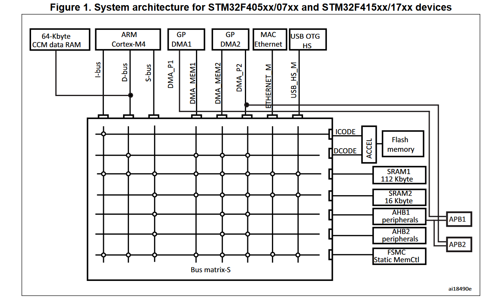

基于Cortex-M的MCU内部都使用了AMBA总线，由ARM设计。MCU中常见的有两种总线类型：**AHB Lite**以及**APB**。AHB总线是系统高速总线（矩阵），运行频率高，一般用于连接CPU，SRAM，Flash，DMA，APB桥，DMA-USB等。而APB用于一些低速IO外设，如I2C，SPI，USART，CAN，ADC，DAC等，**APB总线通过APB桥挂接到AHB总线**。有些MCU中的APB也分为低速APB和高速APB。通常基于Cortex-M7的MCU会使用到更高级的AXI总线

Cortex-M0以及Cortex-M0+属于ARMv6-M，使用传统的**冯诺依曼结构**（普林斯顿结构）设计。这两种核心功耗较低，门电路数量少

**中断**

对于所有Cortex-M核心，NVIC的寄存器地址都是固定且相同的，并且也是使用和SRAM、Flash以及外设IO相同的地址空间。NVIC的编程模型都是相同的。NVIC支持**外设中断**，**NMI不可屏蔽中断**以及**处理器内部异常**等多种异常和中断，总共最多支持240个外部中断，除NMI以外的中断或异常可以单独使能或禁止。NVIC还支持中断的屏蔽功能。Cortex-M3以及M4的中断优先级可以在运行时修改，Cortex-M0和M0+不支持该功能。中断向量取出由CPU硬件自动实现，无需软件判断中断源，同时中断向量表可以重定位映射到不同的地址（默认位于地址`0x00000000`）


### 1.2.2 指令集ISA

所有的Cortex-M核心（包括ARMv6-M的Cortex-M0以及M0+）都只支持Thumb-2的不同子集，ARMv7-M的处理器兼容ARMv6-M所有的指令。这些处理器也舍弃了部分在旧有Thumb中的指令，如协处理器指令，指令集状态切换指令等

绝大多数使用Cortex-M4核心的MCU都为核心配备了FPU扩展（Cortex-M4F），支持额外的FPU指令（以及整数SIMD扩展）。而Cortex-M3没有FPU的支持


### 1.2.3 OS支持特性

Cortex-M3和M4带有SysTick节拍定时器，同时提供了两个栈指针`MSP`和`PSP`，可以分别用于OS和用户进程。在一般的应用中如果不使用OS特性，一般只使用`MSP`

另外，这两种CPU核心还支持特权以及非特权模式。在一般的应用中默认使用的是特权模式。非特权模式一般要在RTOS中的用户程序中才会涉及到，这种模式会限制用户对于一些模块如NVIC的访问


### 1.2.4 工作模式

Cortex-M3和M4处理器有2种运行状态，分别为**Thumb状态**以及**调试状态**。其中**Thumb状态**分为2种操作模式，执行中断或异常处理程序时为**处理模式**，正常执行程序时为**线程模式**。另外Cortex-M3和M4核心除一般的**特权模式**以外还支持**非特权模式**（Cortex-M0不支持）

状态转换示意图如下，一共可以分为3种主要的工作模式


其中特权模式到非特权模式的转换是单向的，非特权模式想要到达特权模式只能通过异常来处理。执行中断或异常时称为处理模式，这种处理模式特权模式类似。非特权模式可以保护NVIC的寄存器，防止用户程序篡改


## 1.3 常用软硬件以及程序架构

**CMSIS**（**Cortex-M Software Interface Standard**，由ARM提出并开发）包含了各种基本的库与头文件，以及针对各种Cortex-M核心的专有功能与对应函数（比如DSP函数库）

开发环境方面，以前最流行的是Keil MDK和IAR。然而现在各路MCU厂商都开始大力推广自家的开发环境，典型的有ST的STM32CubeIDE（基于Eclipse），TI的CCS（基于Eclipse），Microchip的Atmel Studio（基于Visual Studio）等。以前的Keil使用ARMCC编译器（现在MDK最新版已经转向基于LLVM的定制版工具链），现在越来越多的厂商开始使用GNU的工具链。这也是总趋势

在运行调试方面，一般的MCU都支持**JTAG**和**SWD**两种调试接口。目前常用的调试硬件有JLINK，ULINK以及开源的CMSIS-DAP（Debug Access Port）。其中CMSIS-DAP由于其开放的特性在近几年比较流行。CMSIS-DAP就是一种开源的调试器，走USB-HID协议所以免驱，用户可以对固件进行适当的更改以后下载到一个廉价的小型开发板上将开发板变成一个调试器（最流行的就是BluePill）。而调试上位机除了各IDE集成的以外，目前在开源平台最流行的就是OpenOCD

如果想要在Linux平台开发ARM单片机，那么最少需要GNU的ARM工具链（arm-none-eabi-gcc），OpenOCD，Make等，再使用一个小核心板烧录CMSIS-DAP固件作为调试器

在Windows平台可以安装MSYS2使用MINGW提供的GNU工具链


### 1.3.1 编译流程

编译单片机程序时，一般首先需要提供一个`.s`启动文件。这个启动文件使用汇编语言编写，类似于Bootloader，单片机在上电时会首先执行该程序对时钟等部件进行初始化，建立一个可用的程序执行环境，再调用`main()`函数入口开始执行用户程序

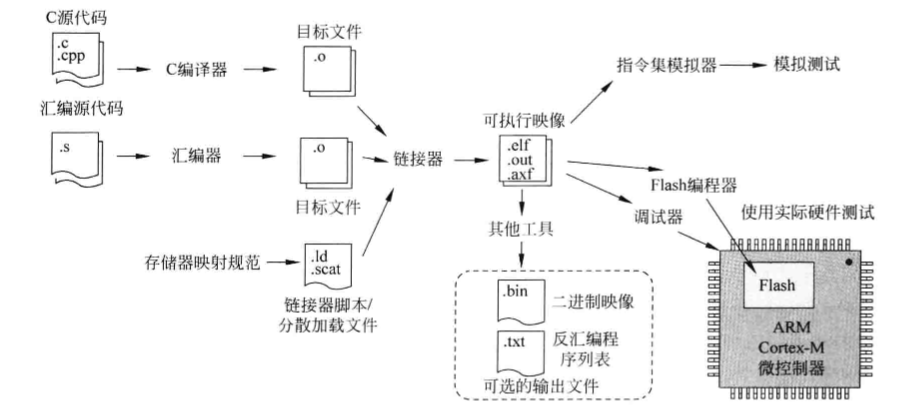

如上图，编译一个单片机程序，需要将所有的`.c`源代码以及`.s`汇编代码全部编译为`.o`可重定位二进制文件，最终通过`ld`链接器链接成为可执行映像。其中`ld`链接过程需要用到的链接器脚本厂商会随开发环境发布。实际的应用中建议直接使用`arm-none-eabi-gcc`命令自动调用工具链


### 1.3.2 程序设计

**轮询**

轮询是最傻瓜式的程序结构，基本原理就是将整个重复的工作流程编写成为一个大循环，两次循环之间一般会加入软延时（一般是`delay()`函数）。这种程序经过恰当的设计可以实现功能，但是缺点较多：代码难以维护，循环间隔时间难以控制，能耗比差，CPU利用率较差，反应迟钝等。只适合在初学者在要求不严格的场合使用。最典型的程序就是基于软延时的Blink

**中断**

实际的应用中建议使用**定时器中断驱动**结合**状态机**的程序设计模式。这种工作模式下，定时任务不依赖CPU的软延时，而是依赖定时器产生的中断。而无法预测的突发事件同样通过中断服务程序处理。绝大部分成熟的单片机程序都依赖于中断系统，在具有优先级管理的单片机中，更高级别的中断可以打断低级别的中断程序

这种工作模式下，定时任务会有精准可计算的时间间隔，突发事件也可以得到及时的响应。同时CPU在无任务执行时可以进入休眠或最低功耗模式，节省能源。各类操作系统一般也是建立于定时器中断技术之上的（SysTick节拍定时器）

**RTOS实时操作系统**

随着MCU程序的不断复杂化，有时会遇到更加复杂的控制需求，比如多个任务同时执行的需求，这种情况下使用中断程序已经难以满足要求，就需要用到时间片轮转等方式，需要一个调度器

这种情况下可以使用线程调度器或RTOS，这些RTOS一般还有信号量，队列以及消息等特性。但是使用RTOS会占用更多的资源，这就要结合实际进行权衡。目前已经有上百种开源RTOS，这些RTOS也是学习操作系统原理的良好选择，相比传统庞大的系统如Linux等更易于上手，同时RTOS一般还有相对更高的实时响应性能与执行效率，更加适合工控等领域


## 1.3.3 CMSIS

CMSIS由ARM提出并被所有使用ARM核心的MCU厂商所采用，目的是保证单片机软件的复用性，兼容性，可移植性，工具链独立性以及开放性，开发者可以通过这些代码访问Cortex-M处理器的各种特性。CMSIS还提供了DSP算法的高效实现，以及RTOS的API定义，避免开发者重复造轮子造成混乱。CMSIS-DAP调试器也是属于CMSIS项目的一部分

CMSIS包括但不限于以下功能：

+ 和处理器有关的部件的寄存器定义，如中断控制器NVIC，节拍定时器SysTick以及SCB的寄存器定义等，以及和这些外设有关的C函数（API）
+ 用于特殊指令的C函数（否则要使用内联汇编实现），如`_WFI()`
+ 为各种异常处理进行了命名
+ 系统的初始化函数（`SystemInit()`，对于不同的MCU该函数有不同的实现）
+ 时钟频率数值的获取
+ 常用DSP函数的实现


## 1.4 寄存器和内存架构

### 1.4.1 通用寄存器组GPR

定义如下

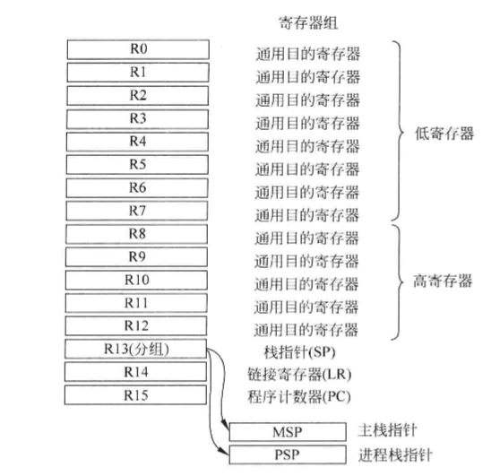

> 其中，`R0`到`R12`可以分为高低两组，低组8个为`R0`到`R7`，高组5个为`R8`到`R12`。限于Thumb指令的长度要求，**绝大多数16位长度的指令都只能使用低8个寄存器**。而高5个寄存器只有32位指令以及少数16位指令可用
>
> `R13`寄存器又称为`SP`，作为栈指针使用，一般不做其他用途。栈是RAM中的一片空间，用于放置局部变量，以及在函数或子程序调用、中断处理时保存寄存器现场。在Cortex-M3和M4中两个物理上的寄存器分别为`MSP`和`PSP`。在运行过程中，当前使用到的寄存器是`MSP`还是`PSP`由特殊寄存器`CONTROL`的设置决定，一般只有RTOS才会涉及到`PSP`的使用。**在ARM中栈是从高地址向低地址生长的**，同时**栈访问必须是4字节对齐的**，所以事实上`SP`的低2位没有作用，总是00。另外，**复位后`MSP`的初始值是从中断向量的最开头4字节取出的**
>
> `R14`寄存器又称为`LR`，作为链接寄存器使用。在程序中如果发生了函数或子程序调用，`LR`寄存器会自动保存该函数返回时的地址。在函数与子程序运行结束以后，`LR`中的地址就会被加载到`PC`中，CPU就可以返回到原来的地方继续执行。然而在中断程序中情况不是这样，`LR`会被更新为特殊值`EXC_RETURN`，这会在之后的中断中讲到。此外，在处理子程序调用时同样不要忘记将`LR`压栈，否则当前代码返回的地址就丢失了。因为Cortex-M的Thumb-2指令集是2字节或4字节可变长的，所以**指令的访问是2字节对齐的**。然而`LR`的最低位事实上是有重要作用的，部分调用指令需要**将`LR`最低位置1表示使用Thumb状态**（**这是Cortex-M在舍弃掉ARM指令后的遗留问题**）
>
> `R15`寄存器又称为`PC`，作为程序计数器使用。由于ARM处理器的流水线结构，读取`PC`获得的地址是**当前正在执行指令的地址加4（两条2字节指令长度）**。使用一般寄存器指令写`PC`寄存器会触发跳转。和`LR`寄存器类似的，使用部分跳转指令或寄存器指令操作`PC`时，需要将最低位置1表示Thumb。一般情况下函数调用以及跳转会使用子程序调用指令实现，而不是使用一般寄存器指令写`PC`。但是在访问连续的常量字符数据时可以将`PC`作为基址寄存器使用


### 1.4.2 特殊寄存器

定义如下

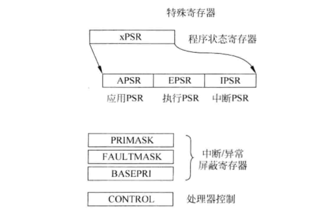

特殊寄存器只能通过`MRS`以及`MSR`指令进行访问，在通用寄存器以及特殊寄存器之间传输

**`PSR`寄存器**

`PSR`寄存器是程序状态寄存器，物理上一共有3个`PSR`寄存器，分别为`APSR`应用PSR，`IPSR`中断PSR和`EPSR`执行PSR。这3个PSR在汇编中可以通过符号`PSR`访问，另外也可以使用符号`APSR`和`IPSR`访问指定的PSR（符号`EPSR`不能访问，符号`IPSR`只读）。这3个寄存器的定义如下

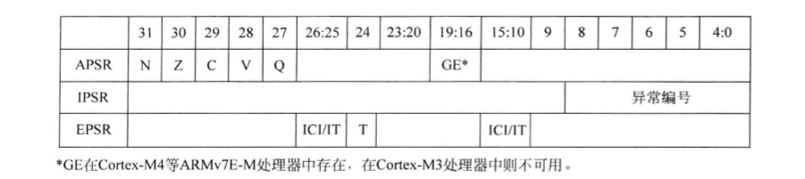

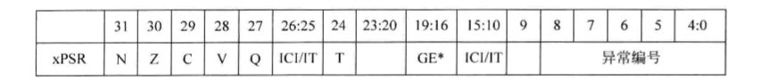

各位的作用如下

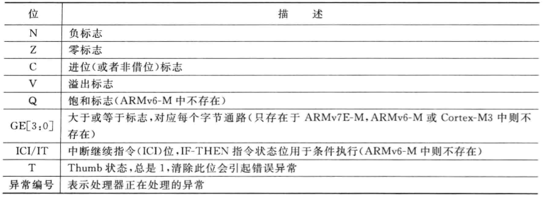

> 其中`N`位代指`Negative`，如果一次整数运算导致寄存器最高位为1那么该位置1。可以用于判断结果正负
>
> `Z`位代指`Zero`，如果一次计算导致寄存器所有位为0那么该位置1。类似`CMP`指令同样可以将该位置1（相当于没有输出寄存器的减法）
>
> `C`位代指`Carry`，指示无符号运算进位。在加法中如果在最高位产生进位那么该位置1，减法看作补码加法处理。可以用于计算64位整数（C中为long long）
>
> `V`位代指`Overflow`，指示有符号运算溢出。所谓溢出就是如加法中正正得负或负负得正的情况，看最高位。加法（减法看作补码加）中设操作数1符号S1，操作数2符号S2，输出结果符号S3，那么$ V = (\overline{S_1}\overline{S_2}S_3)+(S_1S_2\overline{S_3}) $
>
> `Q`位用于饱和运算指令中表示发生了饱和。饱和运算一般用在DSP算法中，如果两个数相加会导致溢出那么就将结果设为可表示的最大或最小值。**该位一旦置位需要软件清零**，不会自动清零，且和条件指令`B`或`IT`无关
>
> 此外，`GE`用于Cortex-M4的整数SIMD指令。而`T`是舍弃ARM指令集以后的遗留，置1表示运行在Thumb模式下
>
> `IT`位共计8位，用于`If-Then`的执行以及可中断的`LDM`、`STM`指令。用于`IT`指令时称为`ITSTATE`
>
> `ICI`和`IT`共用，在`LDM`，`STM`，`POP`，`PUSH`等**多寄存器**操作被打断时有用，用于存储这些操作被打断之后的下一个寄存器，这样可以恢复到原先的上下文。`ICI`在`IT`指令的上下文中不起作用，这些指令在`IT`上下文被打断后只能重新执行

Cortex-M的PSR寄存器定义和其他ARM处理器（ARM7，ARM9，ARM11，Cortex-A等）有所不同，具体对比如下

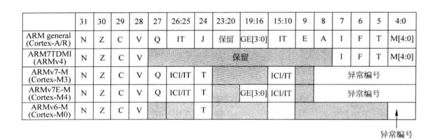

**`PRIMASK`，`FAULTMASK`以及`BASEPRI`寄存器**

在ARM中，**中断优先级数字越小优先级越高**。这3个寄存器用于控制中断的屏蔽，作用和Cortex-A中的`I`（IRQ）和`F`（FIQ）位类似，**只能在特权模式下访问**，可以使用`MRS MSR`或`CPS`指令更改，如下

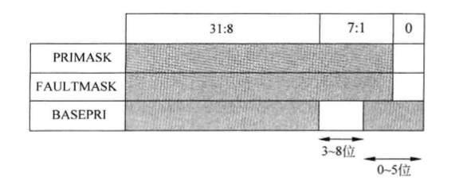

> `PRIMASK`只有最低一位有效，置位时将当前执行优先级设为0，会屏蔽除NMI（不可屏蔽中断）以及HardFault以外所有的异常和中断。异常返回以后不会自动清零（线程模式默认运行于最低优先级+1）
>
> `FAULTMASK`同样只有最低一位有效，置位时临时将当前优先级设为-1，会屏蔽除NMI以外的所有异常和中断，一般用于HardFault错误处理流程中，防止发生新的错误造成灾难性后果。异常返回后**会自动清零**
>
> `BASEPRI`的有效位位于该寄存器最后8位，长度需要看具体的处理器配置，依据优先级屏蔽中断以及异常。一般的Cortex-M3和M4都是配置为8到16级优先级，所以有效位一般为3到4位。将`BASEPRI`设为0时屏蔽不起作用，设为非0时**会屏蔽小于等于设定优先级的中断**
>
> 另外，部分ARMv6-M核心没有`FAULTMASK`以及`BASEPRI`寄存器

**`CONTROL`寄存器**

该寄存器用于控制线程模式下的特权等级，使用的栈指针，以及指示目前是否在使用FPU，定义如下。在更改`CONTROL`寄存器以后应该执行一下`ISB`同步屏障指令使得此次更改对接下来的指令生效

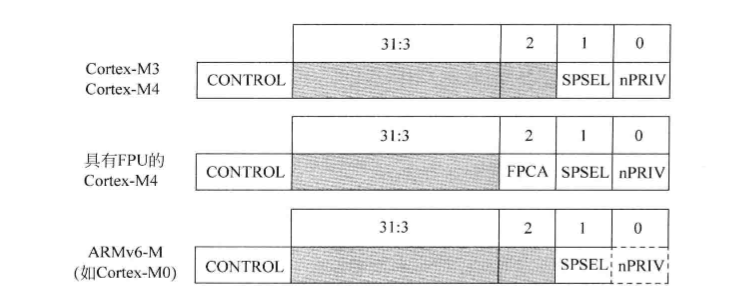

> `nPRIV`只在线程模式下有效，**默认置0**处于特权模式，置1处于非特权模式，**并且置1以后无法再访问`CONTROL`寄存器（只能通过发起异常返回到特权模式更改，异常处理状态下可以任意更改，该异常处理程序属于操作系统实现的一部分）**
>
> `SPSEL`用于选择使用`MSP`还是`PSP`，**默认置0**使用`MSP`，在线程模式下可以置1使用`PSP`。在处理模式下永远为0且不可更改
>
> `FPCA`只在带FPU的Cortex-M4核心中才有，如果是1**表示当前正在使用FPU**，在执行FPU指令以后`FPCA`会自动置位。这时在调用函数时需要记得压栈保存FPU寄存器内容。而在异常入口处`FPCA`会自动清0，同时将FPU寄存器数据压栈。注意，如果在浮点计算上下文中`FPCA`被意外清零，那么接下来一旦发生异常或中断就会导致错误（未将FPU数据压栈）

一般的应用场景参考如下

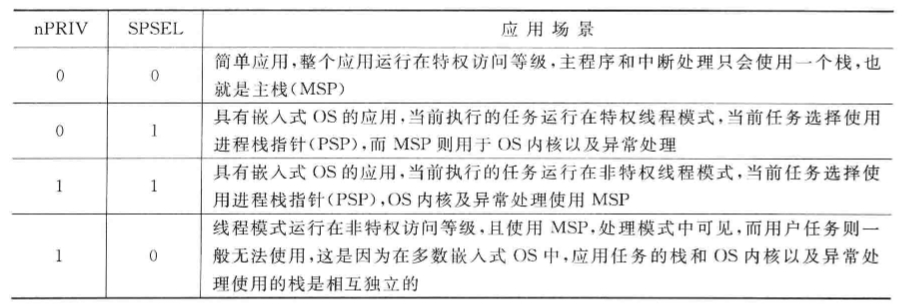

> **解释**：
>
> 之前说过有3种执行模式，分别为**线程模式的非特权模式**，**线程模式的特权模式**以及**处理模式**
>
> 线程模式的特权模式可以有两种情况，使用`MSP`和使用`PSP`。前者00用于OS内核的运行，后者01用于特权程序的运行
>
> 线程模式的非特权模式一般只会使用`PSP`（虽然也可以使用`MSP`，但是对于大部分OS来说不会这么做）。对应11（一般不会使用10），用于非特权程序的运行。
>
> 处理模式只能使用`MSP`。在该模式下`nPRIV`位没有影响，可以任意更改（处理模式下程序本身永远处于特权模式，它有一个重要作用就是负责判断非特权模式和特权模式之间的切换），对应00或10用于绝大多数的异常以及中断程序
>
> **总之，在没有使用到OS时，无需改动`CONTROL`，使用默认的00（特权模式，`MSP`）就行。这也是绝大多数一般MCU程序的工作模式**。很多简单的OS甚至只运行在特权模式下，不会使用到非特权模式，只是充当简单的调度器使用


### 1.4.3 FPU寄存器

FPU是Cortex-M4的可选部件

**`S0`到`S31`数据寄存器**

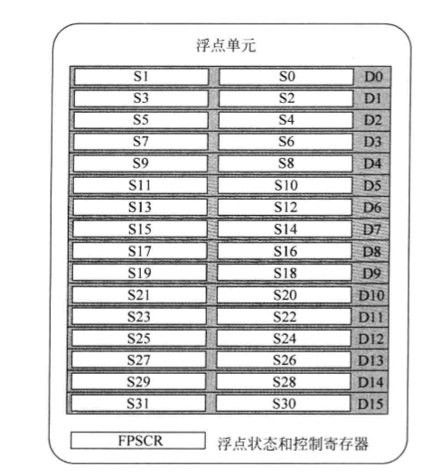

> `S0`到`S31`寄存器单个长度为32位，可以存放一个单精度浮点数；其中两两还可通过`D0`到`D15`访问，单个长度为64位，可以存放一个双精度浮点数，但是Cortex-M4的FPU不支持双精度运算

**`FPSCR`状态以及控制寄存器**


位域定义如下

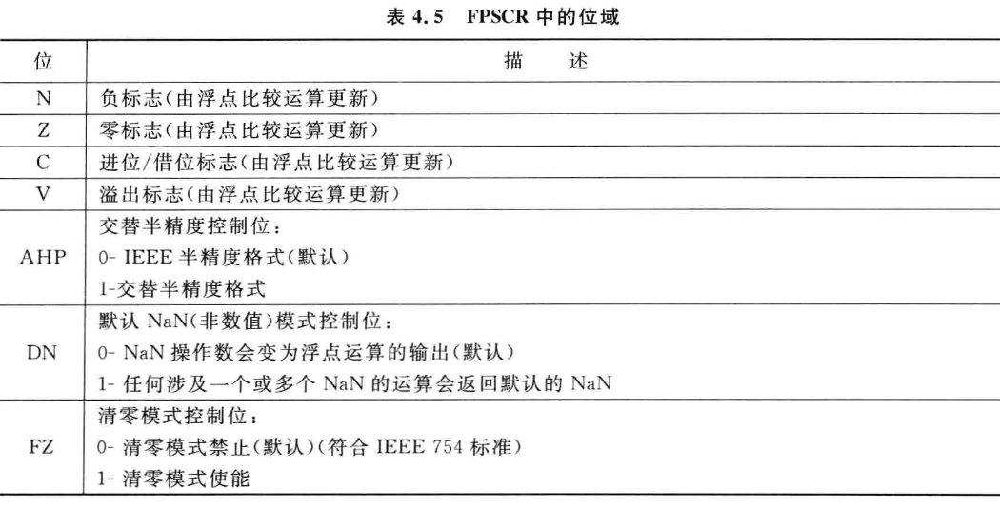

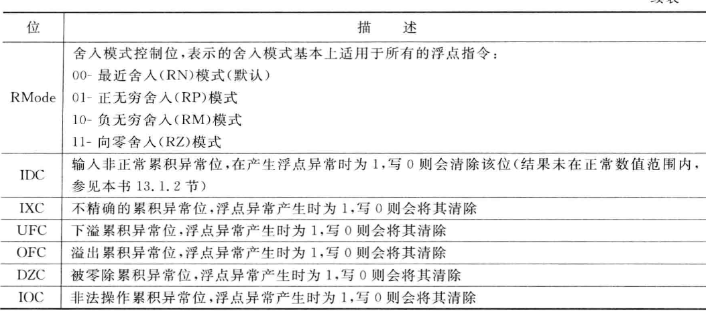

> 这些状态位以及控制位的作用可以参考IEEE754中相关内容，包括舍入，NaN等。`IDC`即**Input Denormal**，`IXC`即**Inexact**，`UFC`即**Underflow**，`OFC`即**Overflow**，`DZC`即**Divide by zero**，`IOC`即**Invalid Operation**

除了内置的`FPSCR`特殊寄存器，还有位于内存空间的`CPACR`寄存器，用于使能浮点单元（默认关闭）

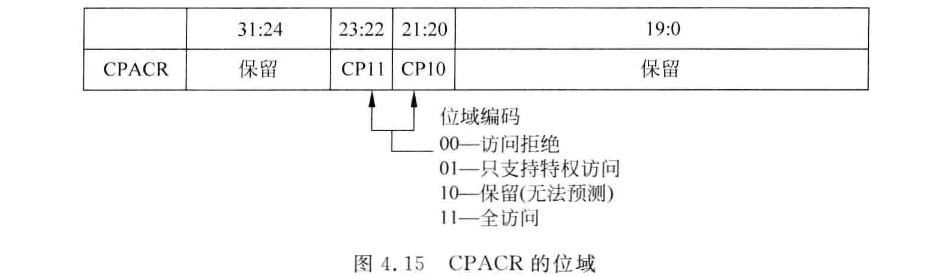


### 1.4.4 内存

Cortex-M支持Big-Endian和Little-Endian两种模式。一般MCU厂商默认使用小端模式，片内外设也使用小端模式

前面说过Cortex-M为统一内存设计，只有一个内存地址空间。这些内存空间事实上被ARM划分成为几个区块，这些区块有固定功能。SRAM和程序代码（Flash）通常使用物理上独立的总线，可以同时访问。同时ARMv7-M的处理器部分指令支持**非对齐访问**，并且**32位指令也可以对齐单字（4字节）或半字（2字节）**（但是非对齐访问会降低访存效率，不到特殊情况不要使用非对齐）

> `LDM`和`STM`多寄存器存取指令，以及`PUSH`和`POP`栈操作指令，排他访问指令`LDREX`和`STREX`都不支持非对齐传输

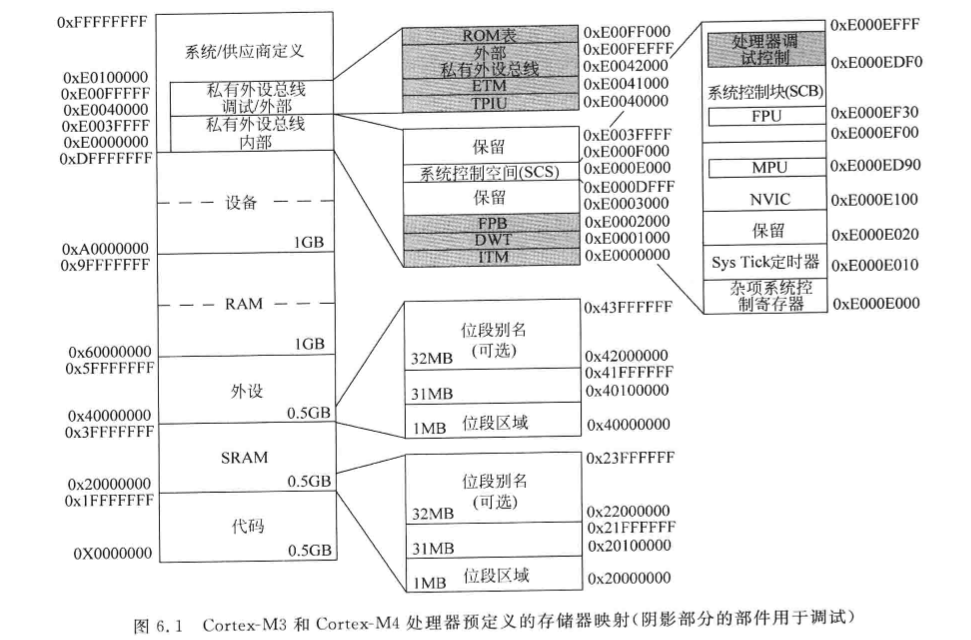

| 起始地址 | 终止地址 | 主要作用 |
| :-: | :-: | :-: |
| `0x00000000` | `0x1FFFFFFF` | 大小512MB，一般将Flash映射到这里，用于存储程序代码以及常数数据、字符数据、查找表等。中断向量表默认也是映射到这片区域的开头 |
| `0x20000000` | `0x3FFFFFFF` | 大小512MB，一般将内置SRAM映射到这里。位段区域是可选特性，有点类似8051的位寻址区域，大小1MB，位段别名是该片区域的影子，大小32MB（1MB*32位），一般通过对位段别名的访问实现位段区域的单bit修改，读写时有效数据都位于32bit单字的最低1bit（LSB）。位段区域还可以用于程序中的状态变量 |
| `0x40000000` | `0x5FFFFFFF` | 大小512MB，一般将内置外设如SPI，I2C，USB控制模块等映射到这里，位寻址同上，不可在此执行指令 |
| `0x60000000` | `0x9FFFFFFF` | 大小为两个512MB，一般用于片外RAM |
| `0xA0000000` | `0xDFFFFFFF` | 大小为两个512MB，一般用于片外设备 |
| `0xE0000000` | `0xFFFFFFFF` | 大小512MB，最重要的区域。SCS映射到这片区域，`0xE000E000`到`0xE000EFFF`需要重点关注，其中包含了SCB，FPU，MPU，NVIC，SysTick等关键模块，大小4kB，不可在此执行指令，且这些模块除NVIC可设置允许用户程序访问，其他所有模块在非特权线程模式下都无法访问，会引发总线错误 |


### 1.4.5 栈

前面说过寄存器`R13`也被称为`SP`堆栈指针。堆栈使用`PUSH`和`POP`分别进行压栈和出栈操作

> 栈一般有以下几个功能：
>
> 在中断处理或函数、子程序调用时，保存寄存器现场
>
> 存储局部变量
>
> 向函数或子程序传参

ARM中的`SP`使用**满递减**方式（栈从高地址向低地址生长）工作。`PUSH`时，`SP`先减小，后将要压栈的寄存器内容存储到当前`SP`所指地址（32位就是先减4后压栈，相当于存到栈空间最后4个字节。`SP`初始值应该为栈空间**最高地址+1**，最低2位永远为0）。`POP`时相反，先输出数据到寄存器后`SP`才增大


## 1.5 NVIC：中断与异常处理

### 1.5.1 中断/异常架构

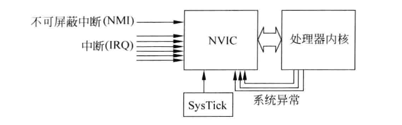

NVIC可以接受外设中断IRQ，NMI，节拍定时器SysTick（用于操作系统节拍或中断运行方式），以及处理器抛出的异常作为输入源。优先级以及编号如下，最多可以配置核心支持255个异常和中断源，其中外设IRQ中断最多可以240个

**NVIC**包含了**SCB**系统控制模块，其中的`VTOR`用于中断向量表的重定位

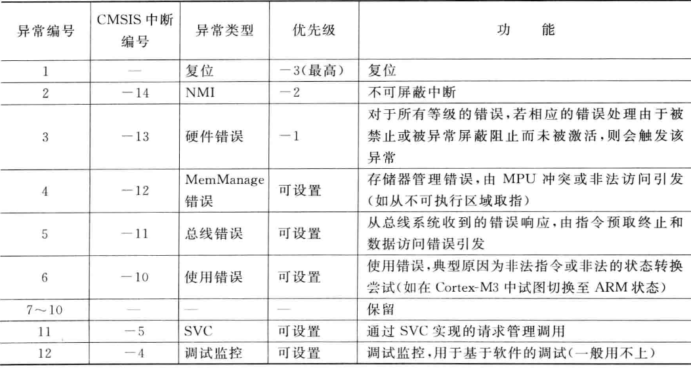

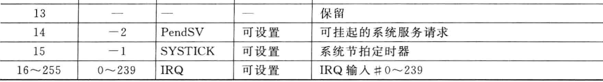

> NVIC接受高电平作为中断触发，可以是脉冲（自动维持高电平）或电平触发（需要中断源维持高电平）。在中断、异常到来时NVIC会将其优先级和当前优先级对比，若**大于**当前优先级那么会转入该中断处理程序。Cortex-M核心使用硬件取出中断向量
>
> 硬件错误HardFault和总线错误、内存管理错误以及使用错误（UsageFault）相关。后三者默认是屏蔽的，就会触发HardFault


### 1.5.2 中断/异常处理流程

> 1. 寄存器**自动压栈**，压入`MSP`或`PSP`取决于当前使用的栈
>
> 2. 取异常向量并取指（`PC`不是真正的程序计数器，只是一个操控接口，真正的程序计数器对用户不可见）。有些处理器中会和压栈并行执行
>
> 3. 更新`PSR`，`PC`，`LR`，`SP`以及`NVIC`中的寄存器。异常处理模式下永远使用`MSP`且为特权模式（可以在该模式下进行特权模式切换）。其中`PC`被更新为异常处理程序起始地址，`LR`被更新为`EXC_RETURN`，这个特殊值用于中断程序的返回。`EXC_RETURN[31:5]`为1，而剩下5位`EXC_RETURN[4:0]`用于存储一些信息，例如中断前使用了`MSP`还是`PSP`

> `EXC_RETURN`本身可以看作是一个地址，这个特殊的机制使得异常处理可以像子程序调用与返回一样处理。`EXC_RETURN`的值对应的地址空间[是不可执行的](#144-内存)


### 1.5.3 异常返回

异常返回通过将`EXC_RETURN`写入`PC`触发，可以通过以下3种方法

> 1. 如果此时`EXC_RETURN`还在`LR`，那么可以使用`BX LR`（见[程序流控制](#166-比较测试与程序流控制)）
>
> 2. 也可以在异常处理中将`LR`压栈，这样只要通过`POP PC`也可以实现异常返回
>
> 3. 也可以在异常处理中将`LR`放到内存，这样通过`LDR`或`LDM`也可以实现返回


### 1.5.4 向量表

中断向量表见下，其定义一般包含在MCU厂商提供的SDK中，位于`.s`启动汇编文件中（编译时将其置于二进制文件的开头）。如下图，地址自下向上递增，一个元素长4字节，**存储中断程序的地址（最低位永远为1表示Thumb模式）**。可以看到`0x00`存储了`SP`初始值（中断源数量最多为255而不是256）

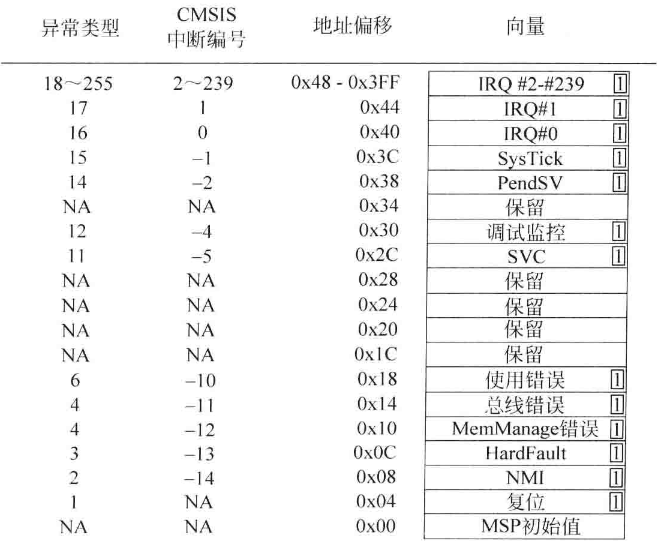

> Cortex-M支持3种复位方式，分别是上电复位（复位所有部分），系统复位（除调试部件以外）以及处理器复位（外设以及调试部件不复位）。**处理器复位后会首先读取中断向量表的头两个字，分别赋值给`SP`和`PC`**

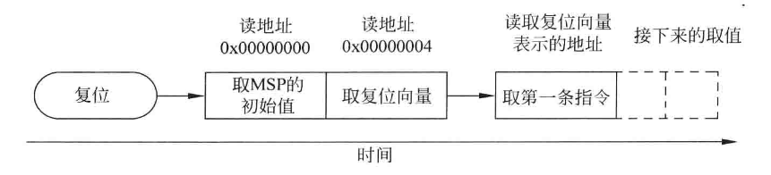

以下情况可以通过`VTOR`进行向量表重映射

> 1. 在使用到Bootloader的应用中，一般存在两个中断向量表，一个是Bootloader的，一个是用户程序的。在Bootloader执行完毕进入到用户程序时，需要切换到用户程序的向量表
>
> 2. 在程序需要被加载到RAM中执行的情况下。这种情况一般也会使用到一个类似Bootloader功能的程序，会切换向量表
>
> 3. 需要动态修改中断向量的情况


### 1.5.5 异常程序设计

在一般的应用中建议使用CMSIS提供的中断访问库函数以提高可移植性。CMSIS提供了使能以及禁用总中断，外部中断，以及设置优先级等功能的库函数

> 复位后Cortex-M默认禁用所有中断，通常情况下使能一个中断需要以下步骤
>
> 1. 设置优先级分组（可选），如果向量表需要重定位那么需要再设置`VTOR`
>
> 2. 设置优先级
>
> 3. 使能外设的中断触发信号
>
> 4. 在NVIC中**手动清除挂起标志位**并**使能中断**


### 1.5.6 中断/异常优先级

之前在[特殊寄存器](#142-特殊寄存器)提到过`BASEPRI`优先级屏蔽寄存器使用了最低一个字节的高3位（8级优先级）或4位（16级优先级）表示优先级

中断的优先级配置寄存器的设定同理，如下图

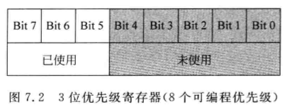

该寄存器灰色部分无效，优先级可以设定为0x00到0xE0，使用高位是为了方便软件的移植。比较形象的对比如下，其中复位、NMI和HardFault的优先级是固定的无法更改

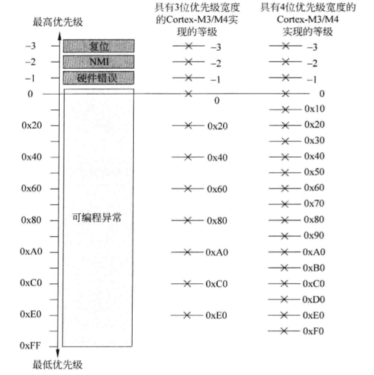

**优先级支持分组**，可以将优先级寄存器分为**分组优先级**和**子优先级**两个部分。此时的优先级数量等于**分组优先级**数量，而子优先级只有在两个中断**位于相同的优先级分组**以内才会起作用，此时拥有更高子优先级的中断可以抢占低子优先级的中断

如下示例，优先级分组可以设置`0`到`7`。在全部`8`位都有效的中断配置中，设置为`0`时具有`128`级可配置优先级，设置为`7`时所有中断位于同一优先级组，互相之间无法中断。若两个中断在同一个时刻发生且中断优先级完全相同，那么**中断编号更小**的中断优先（注意这不是抢占，同优先级的异常无法互相抢占）

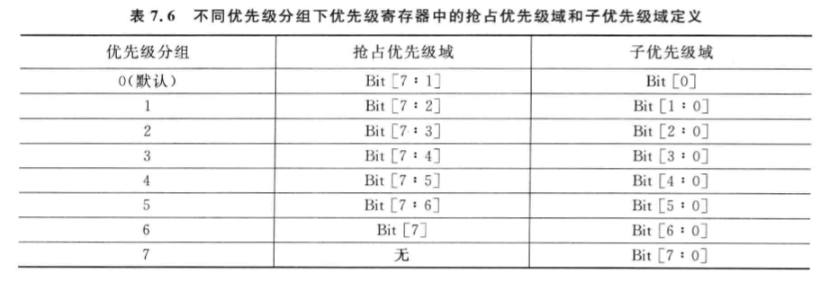

> **线程模式也可以看作是有优先级的，其优先级为全系统最低**。例如一个CPU支持16级优先级（0~15），那么线程模式优先级为16


### 1.5.7 运行状态与挂起（Pending）行为

之前说过NVIC可以接受外设发送来的**正脉冲**或**高电平**触发中断。以前一些更老版本的ARM处理器仅仅支持高电平触发中断，高电平一旦撤销中断就不会再触发。ARMv7-M的NVIC实现了中断状态存储功能，只要输入的脉冲大于1个时钟就会触发，这样就支持了脉冲触发

> 一个中断程序有多个属性：禁止或使能（指在NVIC中），挂起或非挂起，活跃或非活跃。其中中断的使能以及挂起状态可以读写，而活跃状态指示位是只读的
>
> 这里必须首先引入一个概念：**挂起状态用于表示中断是否需要处理**。NVIC在确认有中断触发之后，中断程序首先进入的是**挂起**状态。中断处理的时序如下

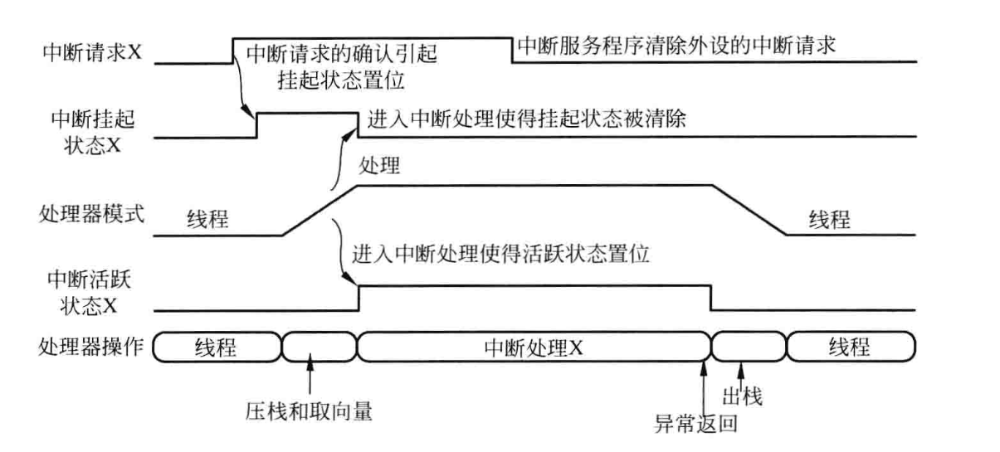

> 在中断没有被屏蔽且正常触发时，首先触发挂起状态（Pending置1）。如果此时没有更高优先级的代码在执行，那么处理器会**自动压栈**并直接进入到中断的处理，此时中断活跃状态置1。如果有更高优先级在执行那么就会保持挂起状态。**挂起状态在中断被处理时自动清0**（也可以提前软件清0）。之后外设信号看情况，如果信号不会自动撤销那么还需要将外设发来的信号关闭
>
> **在中断嵌套的情况下，被抢占后原先的中断活跃状态不变，保持为1。此时会有多个处于活跃状态的中断**
>
> 如果中断被NVIC禁止，那么其挂起标志位仍然会正常触发并维持。使能中断以后会照常进入中断处理程序并自动将挂起状态清0
>
> 如果中断输入源是脉冲，且在处理程序开始之前触发了多次（即活跃状态置位之前），那么这些脉冲算作1次触发


### 1.5.8 NVIC相关寄存器

`NVIC`中的寄存器可以通过`CMSIS`中的`NVIC`结构指针访问，用于配置与操作**外部中断**，例如`NVIC->ISER[0]`。下表使用在C语言中的表示方法

| 寄存器 | 作用 |
| :-: | :-: |
| `ISER[n]` | 一个长度32位，向相应bit写1使能外部中断，`n`取决于外部中断输入数。例如只有32个外部中断输入，那么`n`只能取0。读取值为当前使能状态 |
| `ICER[n]` | 一个长度32位，向相应bit写1禁止外部中断，`n`同上 |
| `ISPR[n]` | 一个长度32位，向相应bit写1将外部中断置为挂起状态，`n`同上，可以用于生成软件中断。读取值为当前挂起状态 |
| `ICPR[n]` | 一个长度32位，向相应bit写1将外部中断置为非挂起状态，`n`同上，可以用于取消一个中断 |
| `IABR[n]` | 一个长度32位，只读存储器，指示各中断服务程序的活跃状态，在服务代码开始执行时自动置1，退出时自动清0，`n`同上。如果发生了中断嵌套，那么之前的活跃标志位依然会保持1 |
| `IP[n]` | 一个长度8位，优先级寄存器，一个`n`对应一个中断的优先级。所以一般`IP`寄存器的数量最多为`ISER`的32倍。这些寄存器也建议32位对齐访问 |
| `STIR` | 8位，软件触发寄存器，向`STIR`写入数字可以挂起相应的外部中断，例如写4就可以触发外部中断#4。**如果想要让非特权程序访问该寄存器，需要使能**`SCB->CCR`[寄存器](#183-系统特性配置与控制ccr)中的`USERSETMPEND`位 |

> **建议通过**`STIR`**触发软件中断**，使用`CMSIS`中的`NVIC_SetPendingIRQ()`函数
>
> 另外支持的中断数量也可以通过`SCnSCB->ICTR`得到，`0`表示实现的中断数量在`1~32`之间。依此类推


### 1.5.9 SCB相关寄存器

`SCB`主要和系统的基本配置相关，另外也控制了除外部中断以外的系统异常

和`NVIC`类似，`SCB`也是通过结构体指针访问

部分寄存器定义另见[低功耗](#17-处理器休眠与低功耗应用)（`SCR`寄存器），[系统控制](#183-系统特性配置与控制ccr)（`CCR`，`ACRLR`和`CPACR`寄存器），[附录](#112-附录)（`CPUID`寄存器）和[错误寄存器](#1135-错误寄存器)

| 寄存器 | 作用 |
| :-: | :-: |
| `CPUID` | 只读，检验使用CPU的类型以及版本 |
| `ICSR` | 系统异常控制与状态 |
| `VTOR` | 中断向量表重定位地址 |
| `AIRCR` | 优先级分组以及复位控制 |
| `SCR` | 休眠与低功耗配置 |
| `CCR` | 高级特性 |
| `SHP[0]~SHP[11]` | 系统异常优先级配置 |
| `SHCSR` | 异常使能以及状态控制 |
| `CFSR` | 错误异常的提示信息 |
| `HFSR` | `HardFault`事件提示信息 |
| `DFSR` | 调试事件提示信息 |
| `MMFAR` | 存储管理错误的地址 |
| `BFAR` | 总线错误地址 |
| `AFSR` | 设备错误状态信息 |
| `PFR[0]~PFR[1]` | 只读，处理器可用特性 |
| `DFR` | 只读，可用调试特性 |
| `AFR` | 只读，可用辅助特性 |
| `MMFR[0]~MMFR[3]` | 只读，可用存储器特性 |
| `ISAR[0]~ISAR[4]` | 只读，指令集特性 |
| `CPACR` | Cortex-M4中的浮点使能 |

**`ICSR`寄存器**

长度32位，定义如下

| 位域 | 名称 | 作用 |
| :-: | :-: | :-: |
| 31 | `NMIPENDSET` | 写1挂起`NMI`异常，读取获得`NMI`挂起/活跃状态 |
| 28 | `PENDSVSET` | 写1挂起`PendSV`异常，读取获得`PendSV`挂起状态 |
| 27 | `PENDSVCLR` | 写1清除`PendSV`异常 |
| 26 | `PENDSTSET` | 写1挂起`SysTick`异常，读取获得`SysTick`挂起状态 |
| 25 | `PENDSTCLR` | 写1清除`SysTick`异常 |
| 23 | `ISRPREEMPT` | **用于调试模式**，指示是否有挂起等待的异常 |
| 22 | `ISRPENDING` | 指示NVIC是否有**外部中断**处于挂起状态 |
| 20:12 | `VECTPENDING` | 指示当前**使能并挂起**的最高优先级。为0表示没有异常 |
| 11 | `RETTOBASE` | 处理模式下，为0代表当前除`IPSR`指示的异常以外还有其他活跃的异常。一般出现在中断嵌套中 |
| 9:0 | `VECTACTIVE` | 指示当前执行的异常号码 |

有关`SVC`和`PendSV`：

> 非特权程序可以执行`SVC`指令进行系统调用，此时产生一个`SVC`异常，且`SVC`优先级较高**一般会得到立即响应（如果被屏蔽那么会变成Hardfault）**。而`PendSV`只能通过在特权模式下写寄存器挂起，且一般将`PendSV`设置为较低优先级，它会像普通中断一样延迟执行。`PendSV`一般应用在多任务RTOS的线程调度、上下文切换中。具体应用示例见下文解释

> 操作系统内核依赖于`SysTick`定时器中断进行时间片轮转式的任务调度，所以一般将`SysTick`设置为较高的优先级。这就带来一个问题，如果`SysTick`到来时正在响应另一个异常且`SysTick`将其抢占，如果不加判断，那么接下来进程调度会直接试图再次进入到**线程模式**，这会导致触发`UsageFault`（用法错误异常），同时异常处理也会延迟
>
> 为了解决这个问题，可以将上下文切换操作设定为`PendSV`异常的处理程序（服务）。内核一旦决定进行上下文切换就可以挂起一个`PendSV`异常，这样可以在异常处理完毕以后再自动执行切换

**`VTOR`寄存器**

长度32位，定义了中断向量表的起始地址，如下

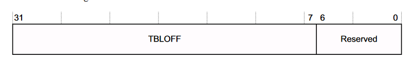

其中低7位无效

> 注意，部分处理器中`VTOR`的高2位不可用，向量表只能定位于内存的开头1GB空间内

**`AIRCR`寄存器**

长度32位，主要提供了自复位，大小端模式，调试，中断优先级分组等相关功能

| 位域 | 名称 | 作用 |
| :-: | :-: | :-: |
| 31:16 | `VECTKEY` | 访问键值，写入永远为0x05FA |
| 15 | `ENDIANNESS` | 1表示使用大端，0表示使用小端。默认0小端，只能在复位后更改 |
| 10:8 | `PRIGROUP` | [优先级分组](#156-中断异常优先级)，可以设置为0到7。默认0 |
| 2 | `SYSRESETREQ` | 写1触发一次全芯片复位 |
| 1 | `VECTCLRACTIVE` | 一般用于调试，清除所有异常的活跃标记位 |
| 0 | `VECTRESET` | 一般用于调试，写1触发一次CPU核心复位 |

**`SHP`寄存器**

定义系统异常优先级，一共有12个，为`SHP[0]~SHP[11]`，单个长度8位，其中只有7个有定义，见下表

| 编号 | 定义 | 复位值 |
| :-: | :-: | :-: |
| 0 | `MemManage`优先级 | 0x00 |
| 1 | `BusFault`优先级 | 0x00 |
| 2 | `UsageFault`优先级 | 0x00 |
| 7 | `SVC`优先级 | 0x00 |
| 8 | `DebugMonitor`优先级 | 0x00 |
| 10 | `PendSV`优先级 | 0x00 |
| 11 | `SysTick`优先级 | 0x00 |

**`SHCSR`寄存器**

使能/禁用系统异常，指示系统异常的状态，长度32位，其中只有14位有用。一般只使用到前3位对异常进行使能或禁止

| 位域 | 名称 | 作用 |
| :-: | :-: | :-: |
| 18 | `USGFAULTENA` | `UsageFault`使能 |
| 17 | `BUSFAULTENA` | `BusFault`使能 |
| 16 | `MEMFAULTENA` | `MemManage`使能 |
| 15 | `SVCALLPENDED` | `SVC`挂起状态 |
| 14 | `BUSFAULTPENDED` | `BusFault`挂起状态 |
| 13 | `MEMFAULTPENDED` | `MemManage`挂起状态 |
| 12 | `USGFAULTPENDED` | `UsageFault`挂起状态 |
| 11 | `SYSTICKACT` | `SysTick`活跃状态 |
| 10 | `PENDSVACT` | `PendSV`活跃状态 |
| 8 | `MONITORACT` | `DebugMonitor`活跃状态 |
| 7 | `SVCALLACT` | `SVC`活跃状态 |
| 3 | `USGFAULTACT` | `UsageFault`活跃状态 |
| 1 | `BUSFAULTACT` | `BusFault`活跃状态 |
| 0 | `MEMFAULTACT` | `MemManage`活跃状态 |


### 1.5.10 中断/异常调用过程详解

由于ARM的设计，中断和异常处理得以和普通的函数调用一样编程

> 这里首先引入**AAPCS**（ARM架构过程调用标准）的定义，这个标准规定了函数调用时使用哪些寄存器传参，以及哪些寄存器在什么时候进行压栈，见下图

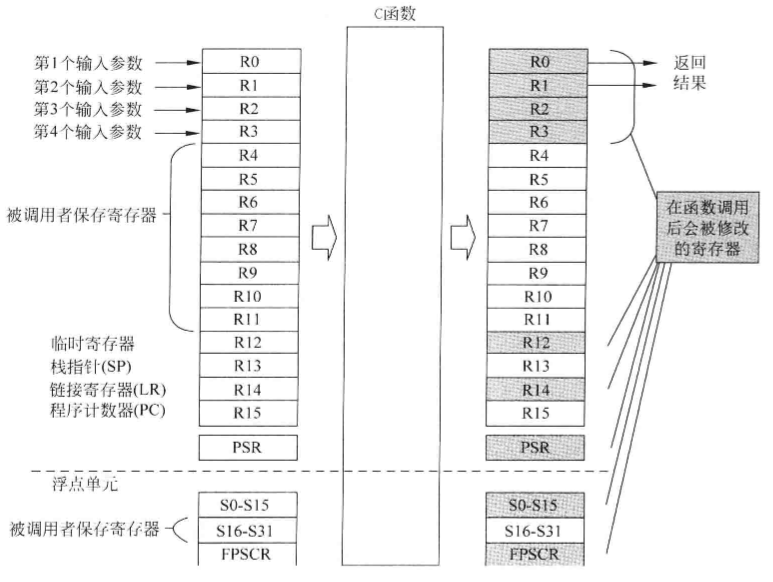

> 其中，`R0`到`R3`，`R12`，`R14(LR)`以及`PSR`（M4核心还有`S0`到`S15`以及`FPSCR`）称为**调用者保存寄存器**，父程序需要在进入子程序之前将这些寄存器压栈
>
> `R4`到`R11`（M4核心还有`S16`到`S31`）称为**被调用者保存寄存器**。这些寄存器在进入子程序之前一直到子程序返回**不能有更改**，所以子程序如果需要用到这些寄存器就需要将它们压栈，并在返回之前出栈恢复

而在中断处理时，**处理器硬件会自动完成调用者寄存器保存**（在M3核心中为`R0`到`R3`，`R12`，`R14(LR)`以及`PSR`）。除此之外还需要将返回地址压栈，这和传统的函数调用不同，这样一次压栈需要使用8个字（32字节）

> 关于中断处理和函数调用的区别：[之前提到过](#152-中断异常处理流程)中断时`LR`会被设为`EXC_RETURN`，然后[在返回时](#153-异常返回)`EXC_RETURN`会和普通的函数调用一样被加载到`PC`以触发异常返回。所以和普通的函数调用不同，异常处理的**返回地址存储在栈中**而不是`LR`中。**异常返回时的地址出栈，**`PC`**赋值等众多操作同样由硬件自动处理**。另外，**异常处理不需要返回结果**，也不能影响到原先程序的执行，所以异常在退出以后CPU对寄存器立即进行硬件出栈恢复。这和函数调用也不一样，函数调用中父程序还需要先保存返回值再出栈恢复
>
> `EXC_RETURN`位域定义如下

| 位域 | 定义 |
| :-: | :-: |
| 31:5 | 全为1，0xFFFFFFE |
| 4 | 表栈帧长度，`1`表示8字，`0`表示26字。进入中断时会将`CONTROL`（[见前](#142-特殊寄存器)）的`FPCA`**取反**并存入该位，之后在返回时将该位取反存入`FPCA` |
| 3 | 表返回模式，`1`表示返回到**线程模式**，`0`表示返回到**处理模式**（一般在中断嵌套情况下会发生）。如果此时有异常处于活跃状态，尝试返回到线程模式会导致`UsageFault`的触发 |
| 2 | 表返回后使用的栈，`1`表示使用`PSP`，`0`表示使用`MSP`。同样取决于当前`CONTROL`寄存器的`SPSEL`位 |
| 1 | 永远为0 |
| 0 | 永远为1 |

> 综上，`EXC_RETURN`只有6个合法值

**栈帧**

在异常入口处压入内存的栈数据块称为栈帧，一般Cortex-M3中栈帧大小为8个字（32字节），而带有FPU的Cortex-M4中栈帧大小为26个字（104字节）

栈帧相对于MCU有限（kB级别居多）的内存来说非常庞大。这也是为什么很多ARM MCU中只会配置8到16个中断优先级（有些甚至只有4个），并且不建议使用函数递归算法或者像一般的PC应用一样滥用函数嵌套。在MCU应用中，中断或函数嵌套太多容易导致爆栈

**AAPCS**规定栈指针在函数/异常的入口和出口处需要**对齐双字**。在一般的函数调用中这需要软件实现，而在异常处理中由于是处理器硬件自动进行压栈操作，如果未对齐双字处理器会自动插入一个字

异常处理中的栈帧示意图如下，将通用寄存器放在最后，这样可以**方便通过**`SP`**访问传递的参数**。如果`xPSR[9]=0`，就表示本次压栈是对齐双字的。如果没有对齐双字那么就会在一开始`xPSR`之前插入一个字并将`xPSR[9]`置1，CPU会在异常退出时根据该位确定`SP`是否需要调整

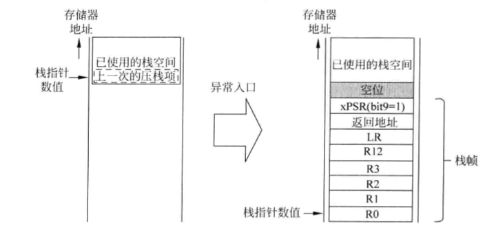

> 事实上异常处理入口的寄存器压栈是乱序的，和栈帧的顺序不一样，如下。首先压栈的是返回地址，最后才是`LR`（因为压栈和取向量是并行执行的，取向量会改变`PC`**所以要尽早将返回地址压栈**）

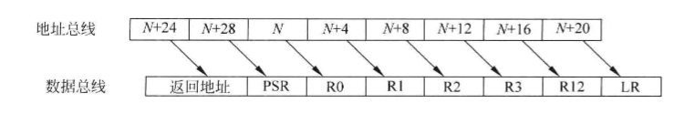

在Cortex-M4中的栈帧示意图如下

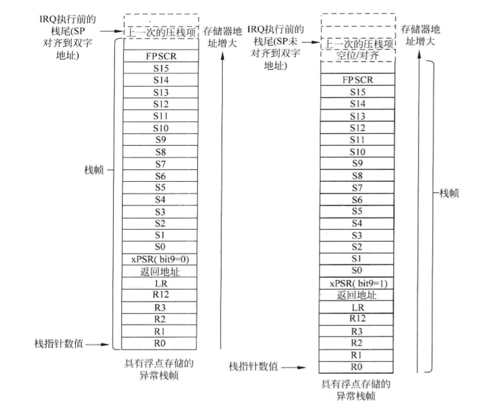

> 事实上栈双字对齐这个特性是可选的。在Cortex-M3 r2p0以及Cortex-M4中这个特性是默认开启的所以无需额外配置


### 1.5.11 处理器对中断/异常的自动优化

**异常的末尾连锁**

如果一个较低优先级的异常触发时遇到了高优先级的异常正在执行，那么它就会挂起并阻塞，等到高优先级的异常执行完成以后再开始执行。此时高优先级异常在返回后CPU不会进行出栈恢复操作，而是直接开始执行低优先级的异常。如下图

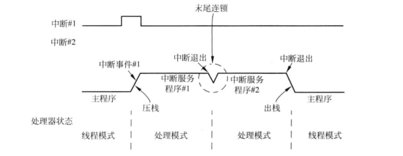

**异常的延迟到达**

如果一个低优先级异常触发了压栈操作，在压栈还未完成时发生了更高优先级的异常，那么CPU会取高优先级异常对应的向量，高优先级的异常会首先执行。如下

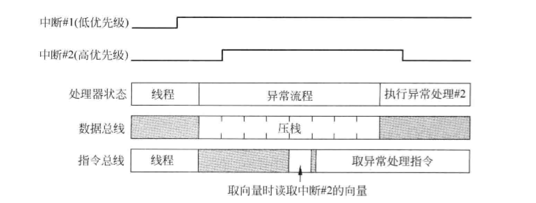

**异常的出栈抢占**

如果在某个异常执行完成出栈时又发生了异常，那么异常的出栈操作会被舍弃（Aborted），直接取向量执行下一个异常处理

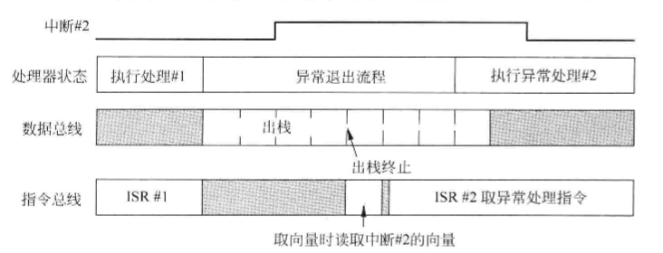

**惰性压栈**

惰性压栈和浮点寄存器相关，只有带有FPU的Cortex-M4核心具有该特性。详情见[浮点计算](#110-浮点计算)

由于浮点寄存器较多，压栈会占用更多的周期，这会拖慢异常响应的速度。所以Cortex-M4引入了惰性压栈，且这个特性默认开启。这样在**浮点上下文中**收到异常而开始压栈时，CPU可以在栈中**给浮点寄存器预留空间**的同时**只将基本的寄存器/返回地址（32字节）压栈**。这样可以将中断响应时间控制在12个时钟周期。如果异常处理中遇到了浮点指令，那么CPU会暂停并将`S0`到`S15`压栈，之后继续执行异常

发生惰性压栈时，寄存器`LSPACT`会置位，同时寄存器`FPCAR`存放栈中为浮点寄存器预留空间的地址

如果不在浮点上下文中（`FPCA=0`），那么栈帧依然保持为8字长度


## 1.6 ISA详解：指令集

ARMv7-M指令集是ARMv6-M指令集的一个超集。Cortex-M4F，M3以及M0核心依次向下兼容。很多基本指令有16位（半字）和32位（单字）两种版本，编译器以及汇编器会根据需求选择尽量短的指令以缩小程序体积


GNU工具链中汇编基本格式如下示例

```arm
label:
    MOVS R0, #0x12 /* 指令格式 */
```

定义常数/常量

```arm
.equ    NVIC_IRQ_SETEN,     0xE000E100 /* 大常数 */
.equ    NVIC_IRQ0_ENABLE,   0x1 /* 小常数 */

LDR R0, =NVIC_IRQ_SETEN /* 将0xE000E100加载到R0，该指令是伪指令，加上=相当于取地址（指令存不下立即数，需要先将该地址存储到一个寄存器中） */
MOVS R1, #NVIC_IRQ0_ENABLE /* 将0x1装入R1。0x1可以作为立即数直接编码到MOV指令中，所以使用#修饰 */
STR R1, [R0]

.align 4    /* 强制4字节对齐 */
TEST_DATA:
.word 0x00032C10 /* 插入数据TEST_DATA为0x00032C10 */
HELLO_TEXT:
.asciz "Hello World!"

/*
数据插入使用
.byte       1字节
.hword      2字节/半字，可以表示一条16位指令
.word       4字节/单字，可以表示一条32位指令
.quad       8字节/双字
.float      单精度浮点/32位
.double     双精度浮点/64位
.ascii      字符串
.asciz      末尾添加NULL的字符串
*/
```

尾缀用法

```arm
ADDS.N R0, #1 /* 使用16位ADD指令（Narrow），更新APSR */
ADD.W R0, #1 /* 使用32位ADD指令（Wide），不更新APSR */
ADDSEQ.W R0, R0, R1 /* 如果APSR中Z为1那么执行该指令（EQ），更新APSR（S） */
```

尾缀定义

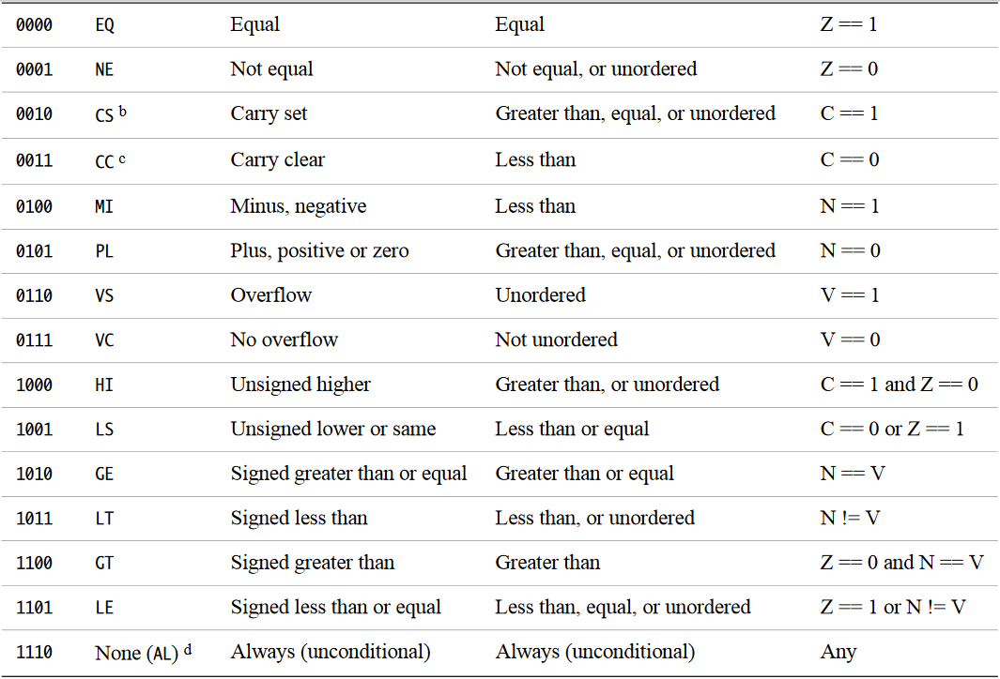


### 1.6.1 UAL统一汇编语言简介

以前在ARM7TDMI的远古时代还不存在UAL。后来随着较新世代ISA如v6和v7的出现，为了统一各代ARM汇编的写法就产生了UAL，UAL规范和传统汇编写法主要有以下区别

> 部分运算指令从2个操作数改为3个操作数，如`ADD R0 R1`需要改写为`ADD R0 R0 R1`，遵循`OP Rd, Rn, Rm`的格式（目标寄存器放在最前）
>
> 必须明确使用`S`后缀才会更新`APSR`，例如`ADDS R0 R0 R1`（ARM7中几乎大部分指令都会强制更新APSR，这和较新的v6以及v7处理器不同）
>
> 另外，几乎所有的16位Thumb指令只能访问`R0`到`R7`寄存器，想要访问高寄存器只能使用32位Thumb指令


### 1.6.2 寄存器传送指令

| 指令示例 | 解释 |
| :-: | :-: |
| `MOV R0, R3` | 将`R3`数据传送到`R0` |
| `MOVS R0, R3` | 同上，更新`APSR` |
| `MOV R3, #0x34` | 将立即数（**不大于8位**）传送到`R3` |
| `MOVS R3, #0x34` | 同上，更新`APSR` |
| `MOVW R6, #0x7B5A` | 赋值大立即数（9到16位）。立即数较大时汇编器会自动转换指令`MOV`为`MOVW` |
| `MOVT R6, #0x4D2C` | 赋值`R6`高16位 |
| `MVN R4, R3` | 将`R3`取反赋值给`R4` |
| `MRS R0, PRIMASK` | 特殊寄存器指令，将`PRIMASK`数据传输到`R0`。可以这样记忆：`MRS`的RS就是代表GPR在前，特殊寄存器在后 |
| `MSR PRIMASK, R0` | 将`R0`数据传输到`PRIMASK` |

> 32位立即数赋值一般使用伪指令（16以及32位指令无法编码），如`LDR R0, =0x1728D45A`，事实上使用了`LDR R0, [PC, #offset]`的寻址方式，将0x1728D45A编码到`.pool`文字池中。
>
> 还可以使用`MOVW`和`MOVT`结合使用的方法，这在特定情况下可以规避`LDR`导致数据缓存丢失的问题
>
> 如果想要将一个寄存器设为一个32位地址，可以使用伪指令`ADR`或`ADRL`，如`ADR R0, MyString`，其中`MyString`是程序文件中数据的地址标记


### 1.6.3 存储器指令

**单寄存器传输**

| 指令示例 | 解释 |
| :-: | :-: |
| `LDRB R0, [R4, #0xF]` | 将`R4+0xF`所表示的地址处**1字节**数据传输到`R0`，16位指令中立即数最大可取`0x1F`，32位指令中可取`-0xFF`到`0xFFF`，立即数域可以省略（`0x0`）。使用`LDRSB`指令对单字节数据进行符号扩展，如`0x95`转为`0xFFFFFF95`（和`APSR`无关，不要混淆）。32位指令可以加感叹号`LDRB R0, [R4, #0xF]!`表示更新`R4`值为`R4+0xF` |
| `STRB R0, [R4, #0xF]` | 将`R0`**低1字节**存储到`R4+0xF`处，立即数取值同上 |
| `LDRH R0, [R3, #0x3]` | 将`R3+0x3`处**2字节**数据传输到`R0`。使用`LDRSH`进行符号扩展，立即数取值同上 |
| `STRH R0, [R3, #0x3]` | 将`R0`**低2字节**存储到`R3+0x3`处，立即数取值同上 |
| `LDR R0, [R2, #0xA]` | 将`R2+0xA`处**4字节**数据传输到`R0`，立即数取值同上 |
| `STR R0, [R2, #0xA]` | 将`R0`存储到`R2+0xA`处，立即数取值同上 |

> `LDRB LDRSB LDRH LDRSH LDR`可以使用`PC`作为基址寄存器
>
> 可以使用**寄存器偏移**方式访问，示例`LDR R2, [R4, R5, LSL #3]`，表示从地址`R4+R5<<3`处读取，立即数可取0到3
>
> 还可以使用**后序**方式访问，示例`LDR R2, [R3], #2`，在每次访问之后会`R3`会自动加2。**适用于数组访问**
>
> 另外这些指令还有`T`结尾的版本，如`LDRT R0, [R2, #0xA]`，用于一些操作系统中特权API的实现，可以允许特权模式下的代码访问非特权内存

**双寄存器传输**

| 指令示例 | 解释 |
| :-: | :-: |
| `LDRD R2, R3, [R1, #-0x8D]` | 将`R1-0x8D`处**8字节**数据传输到`R2`和`R3`，立即数可取`-0xFF`到`0xFF` |
| `STRD R2, R3, [R1, #-0x8D]` | 将`R2`和`R3`依次存储到`R1-0x8D`处，立即数同上 |

> `LDRD`可以使用`PC`作为基址寄存器
>
> 不支持寄存器偏移方式。支持后序方式

**多寄存器传输**

| 指令示例 | 解释 |
| :-: | :-: |
| `LDMIA R1, {R2-R4, R6}` | 将`R1`处16字节数据依次存储到括号中的寄存器，每次读后地址增加。可以添加感叹号`LDMIA R1!, {R2-R4, R6}`将地址写回R1寄存器 |
| `STMIA R1, {R2-R4, R6}` | 将括号中寄存器依次存储到`R1`处，每次写后地址增加 |
| `LDMDB R3, {R1, R5-R9}` | 将`R3`之前24字节数据存储到括号中的寄存器，每次读前地址减小 |
| `STMDB R3, {R1, R5-R9}` | 将括号中寄存器存储到`R3`处，每次写前地址减小 |

> 多寄存器传输和下面的栈操作在一般情况下（指不在`IT`上下文中）可以被中断后继续执行，原因[见前](#142-特殊寄存器)`PSR`寄存器

**栈操作**

| 指令示例 | 解释 |
| :-: | :-: |
| `PUSH {R3, R5-R7, LR}` | 压栈，`SP`先减小后压栈。16位`PUSH`只能使用`R0-R7`以及`PC` `LR` |
| `POP {R3, R5-R7, PC}` | 出栈，出栈后`SP`才增大 |

**排他访问**

**排他访问需要硬件的支持**，使用较少（在具有MPU的MCU中比较有用，需要监控器），可以针对一片需要排他访问的内存（比如shareable）设置一个寄存器作为标志位（一般在global monitor中），保证**Read-Modify-Write**的正常运行，由一对特殊的LOAD以及STORE指令组成。信号位一般情况下为0，LOAD（占用）时置1，正常STORE（释放）后回0

> 排他访问的意义在于高优先级抢占低优先级时，如果要求低优先级的RMW操作是原子的，使用传统方法只能关中断或在高优先级中加入额外判断，这会导致高优先级任务的延迟，紧急任务得不到及时响应。使用排他访问指令就可以使得低优先级任务知道自己是否正确进行了RMW操作，事后处理而不影响高优先级任务的执行，优化实时响应性能
>
> 一般导致排他RMW操作失败的原因有内存被其他处理器访问，执行了`CLREX`或过程中遇到了中断

| 指令示例 | 解释 |
| :-: | :-: |
| `LDREXB R4, [R5]` | 将`R5`处**1字节**数据传输到`R4`，立即数可以取`0x00`到`0xFF` |
| `STREXB R0, R4, [R5]` | 将`R4`的**低1字节**传输到`R5`所指地址处，同时将存储执行结果（成功为0失败为1）返回到`R0`中，立即数同上 |
| `LDREXH R4, [R5]` | 将`R5`处**2字节**数据传输到`R4` |
| `STREXH R0, R4, [R5]` | 略 |
| `LDREX R4, [R5, #0xD]` | 略 |
| `STREX R0, R4, [R5, #0xD]` | 略 |
| `CLREX` | 用于一对LOAD以及STORE指令之间，清除标记位强制下一次排他写入失败 |


### 1.6.4 算术、饱和、逻辑、移位与数据转换

**算术**

加减法

| 指令示例 | 解释 |
| :-: | :-: |
| `ADD R1, R4, R7` | 寄存器加，`R1=R4+R7`，16位指令只能使用低寄存器，32位指令可以使用高寄存器并对`R7`进行移位，例如`ADD.W R1, R4, R7, ASR #0x1` |
| `ADD R1, #0x2C` | 立即数加，`R1=R1+0x2C`，16位指令，立即数可以取`0x00`到`0xFF` |
| `ADD R1, R4, #0x4` | 立即数加，`R1=R4+4`，16位指令立即数只能取`0x0`到`0x7`，32位指令（`.W`）可以使用高寄存器并可以使用更大的常数 |
| `ADDW R1, R4, #0xF4` | 立即数加，`R1=R4+0xF4`，只有32位，立即数最大可取`0xFFF` |
| `ADC R4, R7` | 寄存器带进位加，`R4=R4+R7`，32位示例`ADC.W R0, R1, R9, ASR #0x2` |
| `ADC R1, R4, #23` | 立即数带进位加，`R1=R4+23`，32位 |
| `SUB R2, R4, R5` | 寄存器减，`R2=R4-R5`，有16位和32位，同`ADD` |
| `SUB R2, #0x1D` | 立即数减，`R2=R2-0x1D`，只有16位，同`ADD` |
| `SUB R2, R4, #0x2` | 立即数减，`R2=R4-2`，有16位和32位，同`ADD` |
| `SUBW R2, R9, #0x3D` | 立即数减，`R2=R9-0x3D`，只有32位，同`ADDW` |
| `SBC R1, R6` | 寄存器带进位减，`R1=R1-R6`，有16位和32位，同`ADC` |
| `SBC R2, R9, #12` | 立即数带进位减，`R2=R9-12`，只有32位，同`ADC` |
| `RSB R5, R6, R8, ASR #0x1` | 寄存器反向减，`R5=R8/2-R6`，只有32位 |
| `RSB.W R4, R3, #3` | 立即数反向减，`R4=3-R3`，32位指令 |
| `RSB R1, R2, #0` | 立即数反向减，**立即数只能取0**，相当于求相反数 |

> 以上指令除`ADDW SUBW`外都可以在指令名称后加`S`后缀，如`ADDS.W R1, R4, R10`

乘除法

| 指令示例 | 解释 |
| :-: | :-: |
| `MUL R4, R5, R3` | 寄存器乘，`R4=R5*R3`，32位指令（有16位版本，`Rd`和`Rm`使用同一个寄存器），结果只取低32位 |
| `UDIV R3, R2, R9` | 寄存器无符号除，`R3=R2/R9`，32位指令 |
| `SDIV R3, R2, R9` | 寄存器有符号除，`R3=R2/R9`，32位指令 |
| `MLA R4, R10, R5, R3` | 寄存器乘累加，`R4=R3+R10*R5`，32位指令 |
| `MLS R4, R10, R5, R3` | 寄存器乘累减，`R4=R3-R10*R5`，32位指令 |
| `SMULL R0, R1, R4, R9` | 有符号寄存器乘，`[R1:R0]=R4*R9`，32位指令，可以输出64位结果 |
| `SMLAL R0, R1, R4, R9` | 有符号寄存器乘累加，`[R1:R0]=[R1:R0]+R4*R9`，32位指令 |
| `UMULL R0, R1, R4, R9` | 无符号寄存器乘，`[R1:R0]=R4*R9`，32位指令 |
| `UMLAL R0, R1, R4, R9` | 无符号寄存器乘累加，`[R1:R0]=[R1:R0]+R4*R9`，32位指令 |

> 以上指令只有`MUL`可以加`S`后缀

饱和运算

| 指令示例 | 解释 |
| :-: | :-: |
| `SSAT R0, #12, R8, ASR #1` | 有符号饱和，取前12位，32位指令，如果饱和那么`APSR`的`Q`会置位，需要写`APSR`清除。无可加`S`后缀，可以移位`R8`。只能`LSL`或`ASR`移位 |
| `USAT R0, #12, R8` | 无符号饱和，同理 |

**逻辑与移位**

逻辑运算

| 指令示例 | 解释 |
| :-: | :-: |
| `AND R4, R5` | 寄存器与，`R4=R4&R5`，16位指令，32位示例`AND.W R4, R5, R8, LSL #4` |
| `AND R4, R8, #3` | 立即数与，`R4=R8&3`，32位指令 |
| `BIC R4, R5` | 寄存器与，`R4=R4&(~R5)`，有16位和32位，同`AND` |
| `BIC R4, R8, #3` | 立即数与，`R4=R8&(~3)`，32位指令，同`AND` |
| `ORR R4, R5` | 寄存器或，`R4=R4\|R5`，有16位和32位，同`AND` |
| `ORR R4, R8, #3` | 立即数或，`R4=R8\|3`，32位指令，同`AND` |
| `EOR R4, R5` | 寄存器异或，`R4=R4^R5`，有16位和32位，同`AND` |
| `EOR R4, R8, #3` | 立即数异或，`R4=R8^3`，32位指令，同`AND` |
| `ORN R1, R2, R8, LSL #1` | 寄存器或非，`R1=~(R2\|(R8<<1))`，32位指令 |
| `ORN R1, R2, #3` | 立即数或非，`R1=~(R2\|3)`，32位指令 |

> 可以添加`S`后缀。没有逻辑非指令，可以通过其他指令等价实现

移位

| 指令示例 | 解释 |
| :-: | :-: |
| `ASR R1, R4` | 寄存器算术右移，`R1=R1>>R4`，16位指令，32位示例`ASR.W R1, R2, R5` |
| `ASR R1, R4, #4` | 立即数算术右移，`R1=R4>>4`，16位指令，32位示例`ASR.W R1, R2, #8` |
| `LSL R1, R4` | 寄存器逻辑左移，`R1=R1<<R4`，有16位和32位，同`ASR` |
| `LSL R1, R4, #4` | 立即数逻辑左移，`R1=R4<<4`，有16位和32位，同`ASR` |
| `LSR R1, R4` | 寄存器逻辑右移，`R1=R1>>R4`，有16位和32位，同`ASR` |
| `LSR R1, R4, #4` | 立即数逻辑右移，`R1=R4>>4`，有16位和32位，同`ASR` |
| `ROR R1, R4` | 寄存器循环右移，有16位和32位，同`ASR` |
| `ROR R1, R4, #4` | 立即数循环右移，只有32位 |
| `RRX R4, R8` | 带扩展的寄存器循环右移，只有32位指令，移出的位先存入`APSR`的`C`中再移入最高位（相当于33位移位寄存器） |

> 可以添加`S`后缀。移位后`APSR`中的`C`等于最后移出的1位

**数据转换**

展开，将寄存器中的字节、半字扩展为32位单字长

| 指令示例 | 解释 |
| :-: | :-: |
| `SXTB R1, R4` | 有符号**字节**扩展，16位指令，32位示例`SXTB.W R1, R4, ROR #5`，只能使用循环右移`ROR` |
| `SXTH R1, R4` | 有符号**半字**扩展，16位指令，32位示例`SXTH.W R1, R4, ROR #5`，同`SXTB` |
| `UXTB R1, R4` | 无符号**字节**扩展，有16位和32位，同`SXTB` |
| `UXTH R1, R4` | 无符号**半字**扩展，有16位和32位，同`SXTB` |

> 无可用`S`后缀

反转，用于将寄存器中的字节交换，多用于[SIMD应用](#1611-cortex-m4浮点指令simd与乘法)

| 指令示例 | 解释 |
| :-: | :-: |
| `REV R1, R3` | 全寄存器字节反转，`R1[7:0]=R3[31:24]`，依次类推，16位指令，32位示例`REV.W R1, R10` |
| `REV16 R1, R3` | 半字字节反转，`R1[7:0]=R3[15:8], R1[15:8]=R3[7:0]`，两两交叉依次类推，有16位和32位指令，和`REV`相同 |
| `REVSH R1, R3` | 有符号半字字节反转，只反转`R1[7:0]=R3[15:8], R1[15:8]=R3[7:0]`，同时扩展符号，有16位和32位指令，和`REV`相同 |

> 无可用`S`后缀


### 1.6.5 位域处理指令

位域处理指令主要是设计用于DSP应用的，而并不是类似8051和AVR的位寻址功能。ARM的寻址方式永远基于字节，虽然ARM有可选的位段特性，可以在内存中设置一片位段区域支持类似8051的位寻址功能

| 指令示例 | 解释 |
| :-: | :-: |
| `BFC R1, #8, #16` | `R1[23:8]=0`，将寄存器中从n位开始的m位置0，32位指令 |
| `BFI R0, R1, #8, #16` | `R0[23:8]=R1[15:0]`，将一个寄存器中指定尾数嵌入到另一个寄存器指定位置，32位指令 |
| `CLZ R0, R2` | 前导0计数，计算第一个1之前的0个数，32位指令。Count Leading Zeros |
| `RBIT R1, R3` | 比特反转，`R1[31:0]=R3[0:31]`，32位指令 |
| `UBFX R0, R1, #8, #16` | `R0=R1[8:23]`，提取寄存器指定位域并使用0扩展，32位指令 |
| `SBFX R0, R1, #8, #16` | 同上，使用符号扩展，32位指令 |

> 无可用`S`后缀


### 1.6.6 比较、测试与程序流控制

**比较与测试**

| 指令示例 | 解释 |
| :-: | :-: |
| `CMP R1, R2` | 寄存器比较，相当于没有输出的**减法**，16位指令，32位指令示例`CMP.W R1, R2, ASR #1`，总是更新`APSR` |
| `CMP R1, #0xAF` | 立即数比较，16位指令，立即数最大取`0xFF`，32位指令示例`CMP.W R10, #10` |
| `CMN R1, R2` | 寄存器比较，相当于没有输出的**加法**，有16位和32位指令，同`CMP`，用于判断相反数 |
| `CMN R1, #0xAF` | 立即数比较，有16位和32位指令，同`CMP` |
| `TST R1, R2` | 寄存器测试，相当于没有输出的**与运算**，有16位和32位指令，同`CMP`，更新`APSR`的`N Z`两位 |
| `TST R1, #0xAF` | 立即数比较，有16位和32位指令，同`CMP` |
| `TEQ R1, R2` | 寄存器测试，相当于没有输出的**异或运算**，有16位和32位指令，同`CMP`，更新`APSR`的`N Z`两位 |
| `TEQ R1, #0xAF` | 立即数比较，有16位和32位指令，同`CMP` |

> 这些指令总是更新`APSR`，所以也没有可选的`S`后缀

**跳转与子程序调用**

几乎所有的普通指令都可以使用条件执行后缀，如`ADDEQ R1, R2, R3`，而事实上这些指令都是伪指令，在ARMv7-M中会自动添加`IT`指令

[条件后缀定义传送门](#16-isa详解指令集)

| 指令示例 | 解释 |
| :-: | :-: |
| `B label` | 跳转到`label`处，是16位指令，32位指令可以有更大的跳转范围，示例`B.W label`，**向前或向后相对跳转（半字对齐）**。从机器码层面看，这是事实上可以接受`APSR`中状态位判断参数的指令之一（如`EQ NE GT`等。另一条指令是`IT`）。如果使用了后缀那么跳转范围会相应的缩小，因为事实上有两条不同的`B`指令分别用于带后缀与不带后缀的情况 |
| `BX R1` | 跳转到`R1`所指位置，16位指令，`R1`最低位必须置1表示Thumb状态下，**绝对地址跳转** |
| `BL label` | 子程序调用，跳转到`label`处，同时将该指令下一条指令的地址存入`LR(R14)`，只有32位指令 |
| `BLX R1` | 子程序调用，跳转到`R1`同时将该指令下一条指令的地址存入`LR(R14)`，只有16位指令，`R1`最低位必须置1 |
| `CBZ R1, label` | 检查`R1`的值，如果等于0那么跳转到`label`。只能向前跳转 |
| `CBNZ R1, label` | 不为0时跳转到`label` |

> 进入子程序时使用`BL`或`BLX`，而子程序返回一般使用`BX LR`

**If-Then跳转**

ARMv7-M中引入了`IT`指令，长度16位，在一般的汇编代码编写中用不到，汇编器会自动添加。例如我们写一条`ADDEQ R1, R1, R2`，汇编器会自动在前面添加`IT EQ`

示例1

```
IT EQ
ADDEQ R4, R5, R3
```

示例2

```
ITET NE
ADDNE R1, R5, R3
ADDEQ R4, R5, R3
ADDNE R7, R5, R3
```

示例3

```
ITETT GT
ADDGT R1, R5, R3
ADDLE R4, R5, R3
ADDGT R7, R5, R3
ADDGT R2, R5, R3
```

> `IT`可以说是ARMv7-M中最诡异的指令。其添加后缀可以是`ITE ITT ITEE ITET ITTE ITTT ITEEE ITETT`等任意排列组合方式，后加`EQ`表示符合的条件（检查的是`PSR`）。`IT`指令之后可以跟最多4条指令，而这4条指令也必须带有后缀，如`ADDNE R1, R0, R3`，同时后缀一定要和`ITXXX`所表示的条件相符（这些后缀是无意义的，它们只是重复描述了`ITETT`的条件位而已，但是代码规定必须添加），`T`表示符合所以使用同后缀，`E`表示不符所以使用相反后缀。`IT`指令最多跟3个后缀加1个条件后缀，其本身代表一个`T`后缀
>
> `IT`每遇到一个不符合条件的指令也会消耗一定的时间，所以有时候`IT`不一定比传统的基于`B`指令的跳转快
>
> > 基于`B`指令实现判断语句需要使用一个有条件跳转例如`BEQ`加一个无条件跳转`B`。具体写法不再详述
>
> 注意，`IT`指令块中只有最后一条指令可以修改`PC`，**例如**`B`**等，只能在**`IT`**指令块中最后一条指令处出现**

在`PSR`中有`ITSTATE`，用于指示当前的`IT`执行状态，共计8位`PSR[26:25][15:10]`，可以分为`IT[7:5]`和`IT[4:0]`两部分。执行过程中遇到异常`IT`会被打断，之后就要使用`ITSTATE`进行恢复

> `IT[7:5]`储存该`IT`指令的条件位高3位
>
> `IT[4:0]`表示`IT`后的指令条数（看最低1的位置），并决定指令1到4执行与否。每运行一条`IT`块中的指令，右侧的0都会增加一个。参照下表，每运行一条指令都会跳到表格下一项

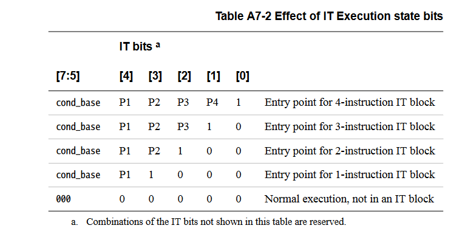

**表格跳转**

表格跳转指令`TBB`和`TBH`用于实现C语言的`switch`语句

| 指令示例 | 解释 |
| :-: | :-: |
| `TBB [R0, R1]` | 执行到该指令时，使用`R0`地址作为跳转表格的基址，`R1`中存储跳转项在表格中的**下标（Index，不是偏移地址）**，那么跳转项位于`R0+R1`，之后直接跳转到`PC+([R0+R1]<<1)`处的指令（`[R0+R1]`指的是地址`R0+R1`处这个单字节数据）。最多可以相对偏移512字节。该指令长度32位 |
| `TBH [R0, R1, LSL #1]` | 表格中跳转项长度为2字节，`R1`为下标（`LSL #1`不能省略），跳转项位于`R0+(R1<<1)`，之后跳转到`PC+([R0+(R1<<1)]<<1)`，其余相同。最多可以相对指令表格基地址偏移128k字节。该指令长度32位 |

GNU汇编示例

```
ADR.W R0, Branch_Table
TBB [R0, R1]
Case1:
    /*Instructions*/
Case2:
    /*Instructions*/

...

Branch_Table:
.byte 0
.byte ((Case2-Case1)/2) /*因为TBB指令跳转地址左移一位所以除以2*/
```

> 和C语言中写`switch()`语句要加`break`语句的原理一样，每一个`Case`之后的指令一般都要在最后加上一个无条件跳转指令（`B`或`BX`），否则一种`Case`执行完以后还会执行接下来的指令


### 1.6.7 异常指令

**Supervisor Call系统调用**

系统调用使用`SVC`指令，只在涉及到操作系统的场合会有应用，关于`SVC`中断编号[见前](#154-向量表)

| 指令示例 | 解释 |
| :-: | :-: |
| `SVC #0xAF` | 应用程序产生系统调用异常，后面可以跟8位数字，用于参数传递（比如应用想要调用何种系统服务），因为NMI和HardFault优先级一定比Supervisor更高所以在这两种异常中不能执行`SVC`。8位参数只是一个数字对异常的行为没有影响，**系统程序需要通过已经压栈的**`PC`**获取该条**`SVC`**指令的地址并读取该数字**，因此PC一般需要在SVC调用之前压栈 |

**中断屏蔽控制**

指令`CPS`用于控制中断的屏蔽，参见[1.4.2节](#142-特殊寄存器)`PRIMASK`和`FAULTMASK`

| 指令示例 | 解释 |
| :-: | :-: |
| `CPSIE I` | `PRIMASK`清0使能中断 |
| `CPSID I` | `PRIMASK`置1禁用除NMI和HardFault外的中断 |
| `CPSIE F` | `FAULTMASK`清0 |
| `CPSID F` | `FAULTMASK`置1禁用除NMI外的中断 |


### 1.6.8 休眠指令

处理器核心休眠

| 指令示例 | 解释 |
| :-: | :-: |
| `WFI` | 等待中断，此时处理器立即进入休眠模式，可以通过中断、复位或调试唤醒 |
| `WFE` | 等待事件，此时处理器会条件性地进入休眠，可以通过中断、复位、调试或其他事件（如多核系统中其他处理器发送来的信号）唤醒 |
| `SEV` | 事件输出，在多核系统中可以向其他核心发送信号 |


### 1.6.9 存储器屏障

存储器屏障，一般用于具有超标量以及乱序执行的处理器系统中，可以解决一些乱序访存导致的错误

| 指令示例 | 解释 |
| :-: | :-: |
| `DMB` | 存储器屏障，确保**下一次访存**之前所有访存操作已完成 |
| `DSB` | 数据同步屏障，确保**下一指令**前所有访存操作已完成 |
| `ISB` | 指令同步屏障，清空流水线确保下一指令前所有指令执行完成 |

> Cortex-M核心因为流水线比较简单，在一般情况下是不需要用到这些屏障的。使用到屏障一般有以下几种情况：
>
> 更改`CONTROL`寄存器之后（[见前](#142-特殊寄存器)），需要使用`ISB`指令确保之后的指令使用正确的`SP`寄存器并运行在正确的模式下
>
> 如果在处理模式下使能了`SCR`寄存器的`SLEEPONEXIT`，那么就表示处理程序结束后会立即进入休眠，需要在结束时执行`DSB`保证数据安全写入到SRAM
>
> 异常挂起后，需要确保该异常在之后的操作之前执行，需要执行`DSB`和`ISB`
>
> 禁用中断后想要中断立即起效，执行`DSB`和`ISB`
>
> 自修复，执行`DSB`和`ISB`
>
> 运行时更改了程序存储Flash的映射地址，需要立即起效，执行`DSB`和`ISB`
>
> 运行时更改了数据SRAM的映射地址，需要立即起效，执行`DSB`
>
> 通过MPU更改了一片程序存储区域的配置（如权限等），且需要到该区域取指并执行，执行`DSB`和`ISB`

> 以下情况遇到问题可以尝试添加屏障
>
> 通过MPU将一片存储区域从**仅允许数据访问**更改为**可取指**，且需要到该区域取指并执行，执行`DSB`
>
> 执行`WFI`或`WFE`休眠之前，执行`DSB`
>
> 执行信号量操作时，执行`DMB`或`DSB`
>
> 修改了`SVC`指令的优先级并触发，在触发前执行`DSB`
>
> 通过`VTOR`修改了中断向量表的偏移并触发中断，在触发前执行`DSB`
>
> CPU自复位之前，执行`DSB`


### 1.6.10 杂项

| 指令示例 | 解释 |
| :-: | :-: |
| `NOP` | 什么都不做，长度16位，一般可以用于指令对齐或软延时 |
| `BKPT #0x24` | 用于调试，CPU在执行到该指令时会暂停，触发调试异常，同时用户可以执行一些调试任务。后面的8位长数字和`SVC`一样，只是用于存储参数 |


### 1.6.11 Cortex-M4：浮点指令，SIMD与乘法

可以通过CMSIS-DSP库调用这些浮点以及SIMD等高级算术功能，该函数库由ARM委托DSP Concepts（[dspconcepts.com](https://w.dspconcepts.com/)）开发。`FPSCR`寄存器定义见[1.4.3](#143-fpu寄存器)


> 开始本章之前建议先了解一下有关IEEE754浮点数标准，可以[看这里](200920c_verilog.md#51-ieee754浮点数标准)

**浮点指令**

所有的浮点指令都以`V`开头，**Cortex-M4只支持单精度浮点数的运算**，所以大部分指令使用`.F32`作为后缀

寄存器传送

| 指令示例 | 解释 |
| :-: | :-: |
| `VMOV.F32 R4, S2` | 将32位浮点寄存器`S2`数据传输到`R4` |
| `VMOV.F32 S0, R2` | 将32位浮点寄存器`R2`数据传输到`S0` |
| `VMOV.F32 S2, S3` | 将32位浮点寄存器`S3`数据传输到`S2` |
| `VMOV.F32 S5, #1.0` | 将单精度浮点数1.0传送到浮点寄存器`S5` |
| `VMOV S0, S1, R0, R1` | 将`R0 R1`两个数传输到`S0 S1` |
| `VMOV R0, R1, S0, S1` | 将`S0 S1`两个数传输到`R0 R1` |
| `VMRS.F32 R0, FPSCR` | 将浮点状态寄存器`FPSCR`数据传送到`R0` |
| `VMRS APSR_nzcv, FPSCR` | 将浮点状态寄存器`FPSCR`的`NZCV`位传送到`APSR`的状态位（多用于浮点条件运算） |
| `VMSR FPSCR, R0` | 将`R0`传送到`FPSCR` |

浮点访存

| 指令示例 | 解释 |
| :-: | :-: |
| `VLDR.F32 S0, [R1, #0xA]` | 将`R1+0xA`处4字节单精度传输到`S0`。8字节双精度使用`.F64`以及`D0`，立即数可取`-0xFF`到`0xFF`，可以使用`PC`作为基址寄存器，也可以使用`label`，示例`VLDR.F32 S0, label` |
| `VSTR.F32 S6, [R5, #0x4]` | 将`S6`中的单精度数存储到`R5+0x4`处。双精度以及立即数同上 |
| `VLDMIA.F32 R2, {S0, S3-S7}` | 传输到多个寄存器，`R2`基址递增。双精度寄存器使用`.F64`，可以添加感叹号`VLDMIA.F32 R2!, {S0, S3-S7}`表示地址写回 |
| `VSTMIA.F32 R2, {S0, S3-S7}` | 将多个寄存器存储到内存，`R2`基址递增，其余同上 |
| `VLDMDB.F32 R2, {S0, S3-S7}` | 传输到多个寄存器，`R2`基址递减 |
| `VSTMDB.F32 R2, {S0, S3-S7}` | 将多个寄存器存储到内存，`R2`基址递增 |
| `VPUSH.F32 {S3-S9, S11}` | 浮点寄存器压栈，双精度版本示例`VPUSH.F64 {D1, D3-D10}` |
| `VPOP.F32 {S3-S9, S11}` | 浮点寄存器出栈，双精度版本示例`VPOP.F64 {D1, D3-D10}` |

基本算术指令

| 指令示例 | 解释 | 异常 |
| :-: | :-: | :-: |
| `VABS.F32 S0, S1` | 求绝对值，`S0=Abs(S1)` |  |
| `VNEG.F32 S0, S1` | 浮点取相反数，`S0=-S1` |  |
| `VADD.F32 S0, S1, S2` | 加法，`S0=S1+S2` | `IDC IOC OFC UFC IXC` |
| `VSUB.F32 S0, S1, S2` | 减法，`S0=S1-S2` | `IDC IOC OFC UFC IXC` |
| `VCMP.F32 S0, S1` | 比较`S1`和`S0`，更新`FPSCR`，若一个数为sNaN那么抛出`IOC`。立即数版本`VCMP.F32 S0, #0.0`只能和0进行比较。带`E`后缀版本`VCMPE.F32 S0, S1`在遇到任意NaN都会抛出`IOC` | `IDC IOC` |
| `VMUL.F32 S0, S1, S2` | 浮点乘法，`S0=S1*S2` | `IDC IOC OFC UFC IXC` |
| `VNMUL.F32 S0, S1, S2` | 浮点乘法取反，`S0=-(S1*S2)` | `IDC IOC OFC UFC IXC` |
| `VDIV.F32 S0, S1, S2` | 浮点除法，`S0=S1/S2` | `IDC IOC OFC UFC IXC DZC` |
| `VSQRT.F32 S0, S1` | 均方根，`S0=sqrt(S1)` | `IOC IDC IXC` |
| `VFMA.F32 S0, S1, S2` | 融合乘加，`S0=S0+(S1*S2)` | `IDC IOC OFC UFC IXC` |
| `VFMS.F32 S0, S1, S2` | 融合乘减，`S0=S0-(S1*S2)` | `IDC IOC OFC UFC IXC` |
| `VFNMA.F32 S0, S1, S2` | 融合负乘加，`S0=-S0+(S1*S2)` | `IDC IOC OFC UFC IXC` |
| `VFNMS.F32 S0, S1, S2` | 融合负乘减，`S0=-S0-(S1*S2)` | `IDC IOC OFC UFC IXC` |
| `VMLA.F32 S0, S1, S2` | 浮点乘加，`S0=S0+(S1*S2)` | `IDC IOC OFC UFC IXC` |
| `VMLS.F32 S0, S1, S2` | 浮点乘减，`S0=S0-(S1*S2)` | `IDC IOC OFC UFC IXC` |
| `VNMLA.F32 S0, S1, S2` | 浮点乘加取反，`S0=-(S0+(S1*S2))` | `IDC IOC OFC UFC IXC` |
| `VNMLS.F32 S0, S1, S2` | 浮点乘减取反，`S0=-(S0-(S1*S2))` | `IDC IOC OFC UFC IXC` |

整数转换

| 指令示例 | 解释 | 异常 |
| :-: | :-: | :-: |
| `VCVT.S32.F32 S0, S1` | 32位有符号转浮点，向0舍入，`S0=(Float)S1`。带`R`后缀版本示例`VCVTR.S32.F32 S0, S1`，表示使用`FPSCR`指定的舍入方式 | `IDC IOC IXC` |
| `VCVT.U32.F32 S0, S1` | 32位无符号转浮点，向0舍入，`S0=(Float)S1`。带`R`后缀同理 | `IDC IOC IXC` |
| `VCVT.F32.S32 S0, S1` | 浮点转32位有符号，`S0=sInt32(S1)` | `IDC IOC IXC` |
| `VCVT.F32.U32 S0, S1` | 浮点转32位无符号，`S0=uInt32(S1)` | `IDC IOC IXC` |

定点数转换

| 指令示例 | 解释 | 异常 |
| :-: | :-: | :-: |
| `VCVT.S16.F32 S0, S0, #12` | 16位有符号定点数转浮点数，小数12位，向最近数舍入，操作数和结果只能使用同一个寄存器。16位无符号定点版示例`VCVT.U16.F32 S0, S0, #12`，另有32位有符号以及无符号版`VCVT.S32.F32`和`VCVT.U32.F32` | `IDC IOC IXC` |
| `VCVT.F32.S16 S0, S0, #5` | 浮点数转16位有符号定点数，小数5位。有`U16 S32 U32`版同上 | `IDC IOC IXC` |

16位半精度转换

| 指令示例 | 解释 | 异常 |
| :-: | :-: | :-: |
| `VCVTB.F32.F16 S0, S1` | 单精度转半精度，`S0[15:0]=(Half)S1` | `IDC IOC OFC UFC IXC` |
| `VCVTF.F32.F16 S0, S1` | 单精度转半精度，`S0[31:16]=(Half)S1` | `IDC IOC OFC UFC IXC` |
| `VCVTB.F16.F32 S0, S1` | 半精度转单精度，`S0=(Float)S1[15:0]` | `IDC IOC OFC UFC IXC` |
| `VCVTF.F16.F32 S0, S1` | 半精度转单精度，`S0=(Float)S1[31:16]` | `IDC IOC OFC UFC IXC` |

**SIMD指令**

Cortex-M4只支持在GPR上进行整数的SIMD计算，多用于DSP应用（ADC采样本质是整数，RGB图像也是整数），和Cortex-A核心支持的NEON高级SIMD扩展不是一回事

所有的SIMD指令和浮点指令都是32位长度

在SIMD中数据在GPR中可以有以下几种格式，可以是4个单字节数据或2个半字数据

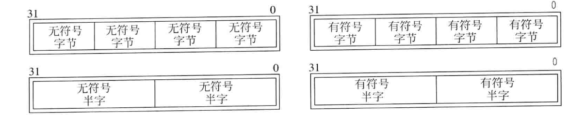

SIMD数据格式不属于标准C，如果要使用C开发就只能通过CMSIS-DSP使用SIMD功能

| 指令示例 | 解释 |
| :-: | :-: |
| `SADD8 R0, R1, R3` | `R1`中4个有符号8位数和`R3`一一对应相加存入`R0`，`S`为前缀。其他可选前缀有`U`无符号数，`SH`有符号半值（结果除以2）和`UH`无符号半值，`Q`有符号饱和（上限127下限-128）以及`UQ`无符号饱和（上限255下限0）。饱和运算会更新`PSR`的`Q`标记位，`S`和`U`会更新`GE[3:0]` |
| `SSUB8 R0, R1, R3` | 4个字节对应相减。可用前缀同上 |
| `SADD16 R0, R1, R3` | 2个半字对应相加。可用前缀同上 |
| `SSUB16 R0, R1, R3` | 2个半字对应相减。可用前缀同上 |
| `SASX R0, R1, R3` | `R0[15:0]=R1[15:0]-R3[31:16], R0[31:16]=R1[31:16]+R3[15:0]`。可用前缀同上 |
| `SSAX R0, R1, R3` | `R0[15:0]=R1[15:0]+R3[31:16], R0[31:16]=R1[31:16]-R3[15:0]`。可用前缀同上 |
| `USAD8 R0, R1, R3` | 无符号绝对差之和，`R0=Abs(R1[7:0]-R3[7:0])+Abs(R1[15:8]-R3[15:8])+Abs(R1[23:16]-R3[23:16])+Abs(R1[31:24]-R3[31:24])` |
| `USADA8 R0, R1, R2, R3` | 无符号绝对差累加，`{USADA8 R0, R1, R2, R3}={USAD8 R0, R1, R2}+R3` |
| `USAT16 R0, #12, R1` | 无符号半字饱和，`R1`保留12位存到`R0` |
| `SSAT16 R0, #12, R1` | 有符号半字饱和，保留12位 |
| `SEL R0, R1, R2` | 根据`GE[3:0]`选择字节，`R0[7:0]=GE[0]?R1[7:0]:R2[7:0]` |

**饱和指令**

除Cortex-M3支持的[整数饱和指令](#164-算术饱和逻辑移位与数据转换)，M4支持更多的饱和指令

| 指令示例 | 解释 |
| :-: | :-: |
| `QADD R0, R1, R3` | 有符号32位数相加并饱和，会更新`Q`寄存器 |
| `QDADD R0, R1, R3` | 有符号32位数饱和运算`R0=R1*2+R3`，`R1*2`饱和或加法饱和都会更新`Q`寄存器 |
| `QSUB R0, R1, R3` | 有符号32位数相减并饱和，同`QADD` |
| `QDSUB R0, R1, R3` | 有符号32位数饱和运算`R0=R1*2-R3`，同`QDADD` |

**乘法与MAC指令**

除Cortex-M3支持的[乘除法指令](#164-算术饱和逻辑移位与数据转换)，M4也支持额外的乘法以及MAC指令

| 指令示例 | 解释 |
| :-: | :-: |
| `UMAAL R0, R1, R3, R4` | 无符号乘加，`[R1:R0]=R0+R1+R3*R4` |
| `SMULBT R0, R1, R2` | 有符号半字乘法，`BT`为后缀，`R0=R1[15:0]*R2[31:16]`。其他可用后缀`BB`，`TB`，`TT`，`B`表示使用低半字，`T`表示使用高半字 |
| `SMLABT R0, R1, R2, R3` | `SMULBT`累加版，`BT`为后缀，`R0=R1[15:0]*R2[31:16]+R3`。符号溢出会置位`Q`，后缀定义同上 |
| `SMULWB R0, R1, R2` | 有符号半字和字相乘取高32位，`B`为后缀，`R0={R1*R2[15:0]}[47:16]`。后缀定义如上 |
| `SMLAWB R0, R1, R2, R3` | `SMULWB`累加版，`B`为后缀，`R0={R1*R2[15:0]}[47:16]+R3`。符号溢出会置位`Q` |
| `SMMUL R0, R1, R2` | 相乘取高32位，`R0={R1*R2}[63:32]`。另有一个带舍入的`SMMULR R0, R1, R2`，其中`R0={R1*R2+0x80000000}[63:32]` |
| `SMMLA R0, R1, R2, R3` | `SMMUL`累加版，`R0={R3<<32+R1*R2}[63:32]`。带舍入版本`SMMLAR R0, R1, R2, R3`，其中`R0={R1*R2+R3<<32+0x80000000}[63:32]` |
| `SMMLS R0, R1, R2, R3` | `SMMUL`累减版，`R0={R3<<32-R1*R2}[63:32]`。带舍入版本`SMMLSR R0, R1, R2, R3`，其中`R0={R3<<32-R1*R2+0x80000000}[63:32]` |
| `SMLALBB R0, R1, R2, R3` | 有符号半字乘累加，`BB`为后缀，`[R1:R0]=[R1:R0]+R2[15:0]*R3[15:0]`，后缀定义同`SMUL` |
| `SMUAD R0, R1, R2` | 有符号半字乘和，`R0=R1[15:0]*R2[15:0]+R1[31:16]*R2[31:16]`，取低32位。有一个交换版`SMUADX R0, R1, R2`，`R0=R1[15:0]*R2[31:16]+R1[31:16]*R2[15:0]`。符号溢出更新`Q` |
| `SMUSD R0, R1, R2` | 有符号半字乘差，`R0=R1[15:0]*R2[15:0]-R1[31:16]*R2[31:16]`，取低32位。有一个交换版`SMUSDX R0, R1, R2`，`R0=R1[15:0]*R2[31:16]-R1[31:16]*R2[15:0]` |
| `SMLAD R0, R1, R2, R3` | `SMUAD`的32位累加版，`R0=R1[15:0]*R2[15:0]+R1[31:16]*R2[31:16]+R3`，交换版`SMLADX R0, R1, R2, R3`，符号溢出更新`Q` |
| `SMLSD R0, R1, R2, R3` | `SMUSD`的32位累加版，`R0=R1[15:0]*R2[15:0]-R1[31:16]*R2[31:16]+R3`，交换版`SMLSDX R0, R1, R2, R3`，符号溢出更新`Q` |
| `SMLALD R0, R1, R2, R3` | `SMLAD`的64位完整结果版，`[R1:R0]=[R1:R0]+R1[15:0]*R2[15:0]+R1[31:16]*R2[31:16]`，交换版`SMLALDX R0, R1, R2, R3` |
| `SMLSLD R0, R1, R2, R3` | `SMLSD`的64位完整结果版，`[R1:R0]=[R1:R0]+R1[15:0]*R2[15:0]-R1[31:16]*R2[31:16]`，交换版`SMLSLDX R0, R1, R2, R3` |

**数据打包**

除之前的[数据转换](#164-算术饱和逻辑移位与数据转换)指令，M4还支持以下指令

| 指令示例 | 解释 |
| :-: | :-: |
| `PKHBT R0, R1, R2, LSL #3` | 打包两个半字，`R0=[R1[15:0]:{R2[31:16]<<3}]` |
| `PKHTB R0, R1, R2, ASR #3` | 打包两个半字，`R0=[R1[31:16]:{R2[15:0]>>3}]` |
| `SXTB16 R0, R1` | 有符号字节扩展，`R0=[SExt16{R1[23:16]}:SExt16{R1[7:0]}]`，可加`ROR`移位，示例`SXTB16 R0, R1, ROR #3`，以下所有指令中寄存器移位同理 |
| `UXTB16 R0, R1` | 无符号字节扩展，同上 |
| `SXTAB R0, R1, R2` | 有符号字节扩展累加，`R0=R1+SExt32{R2[7:0]}` |
| `SXTAH R0, R1, R2` | 有符号半字扩展累加，`R0=R1+SExt32{R2[15:0]}` |
| `SXTAB16 R0, R1, R2` | 有符号双字节扩展累加，`R0[15:0]=R1[15:0]+SExt16{R2[7:0]}, R0[31:16]=R1[31:16]+SExt16{R[23:16]}` |
| `UXTAB R0, R1, R2` | `SXTAB`无符号扩展版 |
| `UXTAH R0, R1, R2` | `SXTAH`无符号扩展版 |
| `UXTAB16 R0, R1, R2` | `SXTAB16`无符号扩展版 |


## 1.7 处理器休眠与低功耗应用

一般MCU都有多种低功耗特性。这些功能常用于需要电池供电的场合，例如可以在中断驱动的程序中使用休眠替代`NOP`无穷循环（在操作系统中`NOP`循环一般也被称为CPU的**Idle模式**）。另外低功耗模式还可以降低干扰，这在无线通信以及高质量ADC采样中有应用

设计Cortex-M的低功耗应用，需要休眠相关指令`WFI WFE SEV`，配置寄存器`SCB->SCR`，以及事件寄存器`Event Register`这三者共同作用

### 1.7.1 配置寄存器

`SCB->SCR`寄存器长度32位，定义如下，有3个位

| 位域 | 名称 | 作用 |
| :-: | :-: | :-: |
| 4 | `SEVONPEND` | 置1时，异常在挂起时会作为唤醒事件，将事件寄存器置位。**中断被屏蔽时唤醒依然有效**（因为此时Pending依然会正常置位） |
| 2 | `SLEEPDEEP` | 置1时为深度睡眠，唤醒耗时较长。置0为非深度睡眠 |
| 1 | `SLEEPONEXIT` | 置1时，CPU会在异常返回后自动进入休眠模式。如果此时为中断嵌套那么需要继续执行完其他活跃的异常处理。**这是除**`WFI WFE`**以外第3种可以进入休眠模式的方法**，其相当于自动的`WFI`指令 |

> ARM建议使用到`SLEEPONEXIT`特性的应用中特别要注意防范spurious wakeup events，如调试事件导致的唤醒，可以加判断


### 1.7.2 休眠指令

休眠指令见[1.6.8](#168-休眠指令)

处理器可以通过`WFI`或`WFE`这两条指令进入到休眠模式，这些指令属于**Hint Instruction**，即在绝大多数情况下和`NOP`一样不会影响程序的运行结果

CPU是在执行这两条指令的**过程中**停止运行，在唤醒后睡眠指令的执行也就随即结束了。这两条指令的主要区别是`WFE`依赖于事件寄存器，**唤醒事件**（Wakeup Event）有所不同

**`WFE`和`SEV`指令**

> 在讲解`WFE`指令之前首先需要说一下事件寄存器`Event Register`。每一个CPU中都有一个**1bit**的事件寄存器，且它对于用户**不可见**不能直接操作（当然多核系统中每个核心都有）。**这个寄存器如果置位那么就表示有事件发生**
>
> CPU复位会导致事件寄存器复位，`WFE`指令也会将该寄存器复位
>
> 如果有**唤醒事件**到来，或者触发了异常进入/返回，那么该寄存器会置位
>
> 此外，MCU设计者还可以将DMA等外设的信号输出接入到事件寄存器（一般接入到NVIC，功能类似。这样CPU就无须忙等）

对于`WFE`来说唤醒事件有以下几种

> 1. 多CPU系统中其他正在运行的CPU执行了`SEV`指令（通常情况下一个CPU执行`SEV`**会导致所有CPU的事件寄存器置位**并被唤醒）
>
> 2. `SEVONPEND`置位时，有异常挂起。见下表
>
> 3. 有异常抢占（高于当前优先级）。见下表
>
> 4. 调试事件

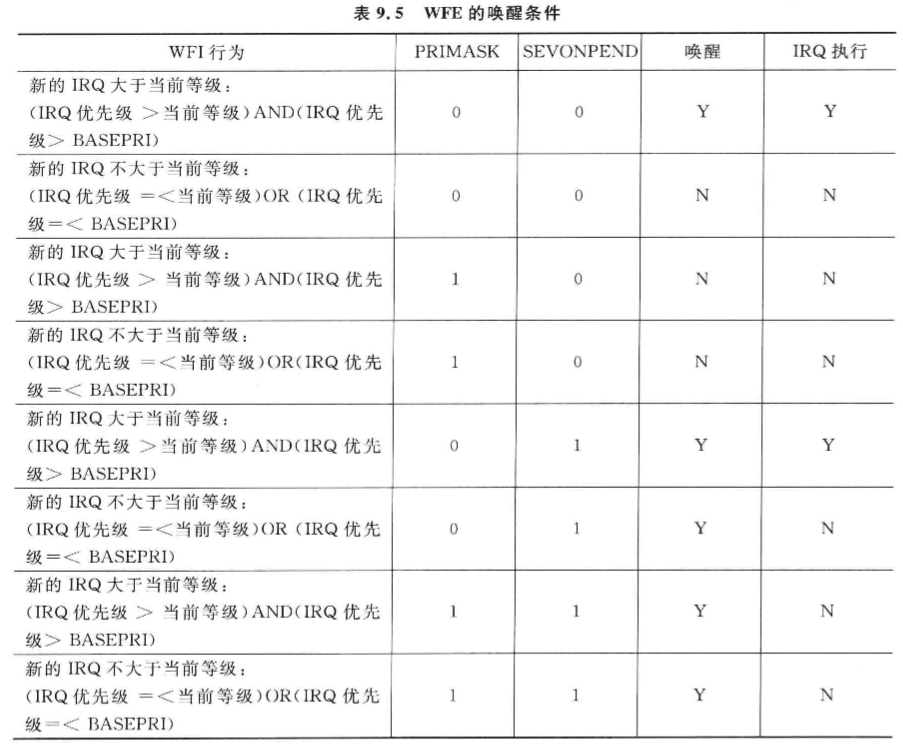

指令`WFE`的行为如下

> 如果执行`WFE`时事件寄存器已经置位，那么此时`WFE`指令会将事件寄存器清除并立即返回继续执行
>
> 如果此时事件寄存器未置位，那么就表示可以休眠，CPU会进入到休眠模式
>
> **很多时候需要执行2次**`WFE`，第一次清除事件寄存器，第二次进入休眠模式
>
> 假设一个CPU被异常唤醒，此时事件寄存器置1，在异常处理中`WFE`将该位清0。异常退出寄存器再次置1，返回到线程模式中执行3次`WFE`休眠。一共需要3次`WFE`
>
> 假设一个CPU被异常挂起（该异常已屏蔽）唤醒，此时事件寄存器置1，在线程模式中执行2次`WFE`休眠

**`WFI`指令**

该指令和事件寄存器无关。对于`WFI`指令来说唤醒事件有以下几种

> 1. 复位
>
> 2. 有异常抢占（高于当前优先级）。`PRIMASK`配置决定是否执行异常处理，见下表
>
> 3. 调试事件
>
> 4. 具体的处理器型号定义的`WFI`事件

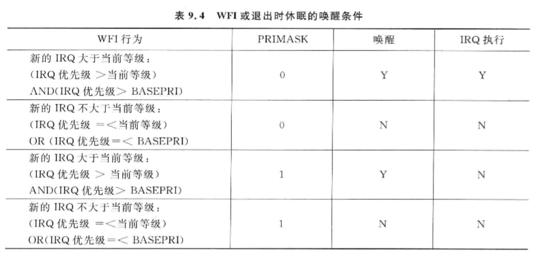

指令`WFI`的唤醒后行为有以下两种

> 如果当前有挂起的异常，且该异常可以抢占当前优先级，那么就开始处理这个异常
>
> 直接执行之后的代码（一般是调试事件唤醒）

如果使用了`SLEEPONEXIT`特性，那么程序流程图如下

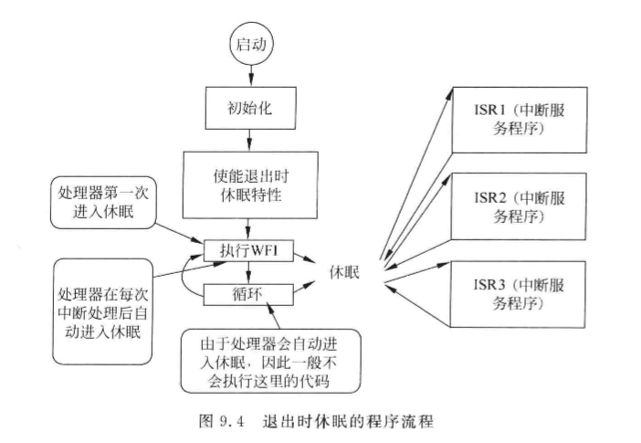


### 1.7.3 低功耗应用设计

在一般的应用中，可以使用`_WFI()`设计中断驱动的应用，使用伪代码如下大致示意

```c
void main() {
    app_setup();
    NVIC_setup();
    SCB->SCR |= 1 << 1; // 退出后休眠
    while(1) {
        _WFI();
    }
}
```

> 一般将`_WFI()`放在一个死循环中，其实就是替代了`NOP`达到更加节能的效果（一般所说的CPU Idle本质就是`NOP`死循环）。未屏蔽的中断每隔一段时间会触发，CPU就会被唤醒，结束`WFI`指令的执行并开始执行异常处理，结束后再次休眠，如此往复循环

然而在有些应用场合中，尤其是异常触发的时间太短或不确定，程序可能面临如下代码示例的问题

```c
timer0_setup();
NVIC_EnableIRQ(Timer0_IRQn);
_WFI();
```

> 这段代码想要在定时器0单次定时结束后先执行Timer0的异常处理，之后继续执行`_WFI()`之后的代码。如果Timer0延时较长那么基本不用担心。但是如果Timer0延时过短，或者在`timer0_setup()`之后有中断抢占，那么`_WFI()`开始执行时可能已经错过唯一一次中断，这样程序就会发生异常（这里是永久停止）。如此使用`_WFI()`是不安全的，即便加上额外的判断也无法保证百分百的安全

```c
volatile int timer0irq_flag;
timer0_setup();
NVIC_EnableIRQ(Timer0_IRQn);
if(timer0irq_flag == 0) {
    _WFI();
}
```

此时就需要使用基于事件的`_WFE()`

> 就像之前说过的，很多时候需要执行2次`_WFE()`才能使得CPU进入到睡眠模式，第一次将事件寄存器复位。所以可以将以上代码改写如下

```c
volatile int timer0irq_flag;
timer0irq_flag = 0;
timer0_setup();
NVIC_EnableIRQ(Timer0_IRQn);
while(timer0irq_flag == 0) {
    _WFE();
}
```

> 这里将判断改为循环，就是为了防范**事件寄存器已经置位**的情况下无法进入到休眠模式。而如果此时中断已经触发，就会直接跳过循环。使用`_WFE()`规避了中断触发时刻的不确定性，它可以记忆事件（中断是否触发）。这样即便中断在`while()`判断条件或`_WFE()`之间触发也不会导致错过中断无法唤醒

> 部分Cortex-M3（版本r0p0~r2p0）由于自身缺陷，需要在中断处理中执行`_SEV()`一下才能正确触发事件寄存器

> 事件寄存器可以通过`_SEV()`置1，通过依次执行`_SEV(); _WFE()`清0


## 1.8 SysTick定时器与系统控制

### 1.8.1 SysTick定时器

`SysTick`长度24位，向下计数。只能在**特权模式**下访问，可以作为普通定时器使用，在RTOS中作为节拍定时器使用。定时器一共有4个寄存器`CTRL LOAD VAL CALIB`（CMSIS命名），都可以通过`SysTick`结构体指针访问，示例`SysTick->CTRL`

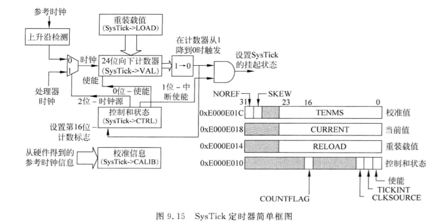

> `LOAD`（`RELOAD`）为重新装载值寄存器，`VAL`（`CURRENT`）为当前值寄存器，`CALIB`为校准值寄存器，`CTRL`为状态以及控制寄存器

`CTRL`寄存器定义如下

| 位域 | 名称 | 作用 |
| :-: | :-: | :-: |
| 16 | `COUNTFLAG` | 指示位，计数到0时该位置1。向`VAL`寄存器写入任何值都会导致`VAL`寄存器清0，同时该位清0。读取`CTRL`也会导致该位清0 |
| 2 | `CLKSOURCE` | 置0使用`STCLK`外部参考时钟，置1使用CPU内核时钟 |
| 1 | `TICKINT` | 置1会在定时器计数到0时**产生异常** |
| 0 | `ENABLE` | 使能`SysTick` |

`CALIB`寄存器一般用不上，定义如下

| 位域 | 名称 | 作用 |
| :-: | :-: | :-: |
| 31 | `NOREF` | 外部时钟参考指示位，为0表示外部参考时钟可用 |
| 30 | `SKEW` | 为0表示`TENMS`中的10mS重载值是准确的 |
| 23:0 | `TENMS` | 用于10mS延时的标准重载值。为0表示不可用 |


### 1.8.2 通过寄存器直接操作SysTick

建议按以下步骤配置定时器

> 1. 通过`CTRL`禁用定时器
>
> 2. 写`SysTick->LOAD`重载值（定时周期-1）
>
> 3. 写`SysTick->VAL`清0
>
> 4. 写`CTRL`启动定时器


### 1.8.3 系统特性配置与控制CCR

`CCR`寄存器可以通过`SCB->CCR`访问，定义如下

| 位域 | 名称 | 作用 |
| :-: | :-: | :-: |
| 9 | `STKALIGN` | 置1强制异常压栈**对齐双字** |
| 8 | `BFHFNMIGN` | 默认0，置1在NMI以及HardFault期间忽略BusFault |
| 4 | `DIV_0_TRP` | 默认0，置1使能Divide by zero trap，如果`SDIV`或`UDIV`中出现被0除就会触发异常（UsageFault或HardFault） |
| 3 | `UNALIGN_TRP` | 默认0，置1使能非对齐访问trap，此时非对齐访问会触发异常 |
| 1 | `USERSETMPEND` | 默认0，置1时非特权程序可以写`STIR`[寄存器](#158-nvic相关寄存器)触发软件中断 |
| 0 | `NONBASETHRDENA` | 默认0，在有异常活跃时试图进入到线程模式会触发异常。置1允许返回，一般保持默认。有关这个特性之前在[PendSV异常](#159-scb相关寄存器)中提到过 |

另外在Cortex-M7核心中还增加了以下几位

| 位域 | 名称 | 作用 |
| :-: | :-: | :-: |
| 18 | `BP` | 置1使能分支预测 |
| 17 | `IC` | 置1使能Icache指令缓存 |
| 16 | `DC` | 置1使能Dcache数据以及通用缓存 |


### 1.8.4 协处理器访问控制CPACR

在Cortex-M4中可用，可以通过`SCB->CPACR`访问

| 位域 | 名称 | 作用 |
| :-: | :-: | :-: |
| 23:22 | `CP11` | `00`禁用FPU，`11`全使能，`01`仅允许特权访问 |
| 21:20 | `CP10` | 必须设置和`CP11`一样 |


### 1.8.5 辅助控制寄存器ACTLR

通过`SCB->ACTLR`访问。不同的Cortex-M核心定义不同，这里的定义适用于M3和M4核心。该寄存器一般复位值为0

| 位域 | 名称 | 作用 |
| :-: | :-: | :-: |
| 2 | `DISFOLD` | 置1禁止`IT`指令重叠。 |
| 1 | `DISDEFWBUF` | 置1禁止默认背景的写缓冲Buffer |
| 0 | `DISMCYCINT` | 置1防止多周期指令被中断，如`LDM`等 |

Cortex-M4F还有以下位域定义

| 位域 | 名称 | 作用 |
| :-: | :-: | :-: |
| 9 | `DISOOFP` | 由于整数指令和浮点指令不使用一条管线，该位置1可以防止整数指令和浮点指令顺序错乱 |
| 8 | `DISFPCA` | 置1可以禁止`CONTROL`中的`FPCA`自动置位（执行FPU指令时不会自动置位） |


## 1.9 内存管理以及MPU

### 1.9.1 MPU简介

`MPU`用于配置内存属性，例如访问权限，缓冲缓存等，Cortex-M系列核心中的`MPU`最多可以配置8片内存区域的属性。一般只存在于一些较为高端的MCU中。Cortex-A系列核心中的`MMU`相比`MPU`增加了虚拟地址映射等众多利于操作系统实现的特性

`MPU`在实际应用中可以提高RTOS的健壮性，例如可以防止用户程序破坏内核使用的栈和内存（例如栈溢出攻击。可以将栈空间最低一片内存设为不可访问），非特权任务访问外设，代码注入攻击等。非法访存会触发`MemManage`或`HardFault`异常（被屏蔽的情况下）。而不具有`MPU`的MCU就容易受到上述错误或攻击影响

在具备Cache的高性能MCU中，例如使用了Cortex-M7内核，必须依赖`MPU`配置内存的缓存属性

默认地址映射见[内存](#144-内存)章节，ARM官方文档中对于默认的地址映射规定如下

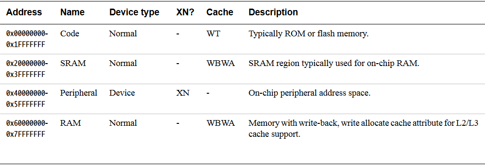

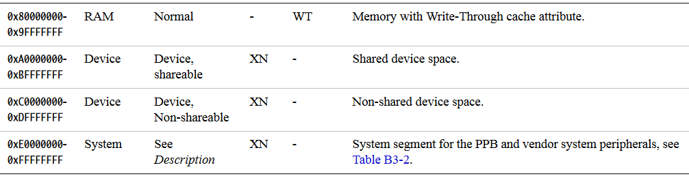


> 以上地址映射（包括区域属性）在不具有或未使能`MPU`的CPU中是默认的配置。而在使能`MPU`的CPU中这个映射可以配置为**特权模式下的背景**（区域号-1）
>
> 在使能`MPU`后，所有我们想要配置的内存区域属性都必须通过寄存器一个一个处理，最多可以配置8个内存区域。**如果此时未使能背景，那么访问未配置的区域一定会抛出异常**。所谓**背景**就是将默认的地址映射（属性）作为特权模式下的默认访问属性，而通过`MPU`配置的属性会覆盖默认的属性。这样就省去了很多繁琐的配置
>
> `XN`表示`Execute Never`即不可执行（取指触发异常），`WT`表示`Write-Through`，`WBWA`表示`Write-Back, write allocate`
>
> 默认情况下标记为`Device`以及`SO`（`Strongly-ordered`强序访问）的地址空间都是不可执行且无缓存，这些地址空间一般用于各种寄存器。而`Normal`一般用于数据存储器如SRAM，外置RAM，程序Flash以及掩膜ROM等
>
> `Device`区域如果配置为`Shareable`就表示这片区域可能同时被几个CPU或DMA访问，反之就表示同时只能有一个CPU或DMA访问。`SO`区域永远是可共享的


### 1.9.2 相关寄存器

**`TYPE`寄存器**

只读寄存器，用于确定MPU是否存在

| 位域 | 名称 | 作用 |
| :-: | :-: | :-: |
| 23:16 | `IREGION` | 8位长，永远为0 |
| 15:8 | `DREGION` | 8位长，表示支持的区域数量，`MPU`存在时为`8`，不存在时为`0` |
| 0 | `SEPARATE` | 永远为0 |

**`CTRL`寄存器**

基本的配置，启用`MPU`以及背景使能

| 位域 | 名称 | 作用 |
| :-: | :-: | :-: |
| 2 | `PRIVDEFENA` | **背景**使能（[见上](#191-mpu简介)），将默认的映射以及属性作为特权模式下的默认访问属性，可以被`MPU`配置覆盖 |
| 1 | `HFNMIENA` | 置0在`NMI`和`HardFault`异常处理模式下禁用`MPU` |
| 0 | `ENABLE` | 置1使能`MPU`。在此之前需要先设置好内存区域属性 |

**`RNR`寄存器**

可以不使用该寄存器，因为下面的`RBAR`寄存器功能重复

| 位域 | 名称 | 作用 |
| :-: | :-: | :-: |
| 7:0 | `REGION` | 指定想要配置的区域号，因为只支持8个区域所以只有2:0有用 |

**`RBAR`寄存器**

配置想要的区域基址与区域号

| 位域 | 名称 | 作用 |
| :-: | :-: | :-: |
| 31:N | `ADDR` | 设置区域的**基地址**。最多使用高27位，所以**分区最小颗粒度为32Byte** |
| 4 | `VALID` | 置1使用下面的`REGION`域覆盖`RNR`寄存器 |
| 3:0 | `REGION` | 指定想要配置的区域号，0~7 |

> 配置的内存区域可以重叠，区域号越大优先级越高

**`RASR`寄存器**

| 位域 | 名称 | 作用 |
| :-: | :-: | :-: |
| 28 | `XN` | 置1该区域禁止执行（取指） |
| 26:24 | `AP` | 设置访问权限 |
| 21:19 | `TEX` | 和`C B S`位共同决定存储器属性 |
| 18 | `S` | 是否共享（设为1共享后意味着会有其他处理器、DMA访问，尤其在有Cache的系统中还涉及到缓存一致性的问题） |
| 17 | `C` | 是否Cache（M3和M4核心没有内置Cache但是还是要正确设置） |
| 16 | `B` | 是否Buffer（写入到内存时是否Buffer。和Cache是独立的概念不要混淆） |
| 15:8 | `SRD` | 长度8，将区域等分为8个子区域后单独使能或禁止。**区域大小小于128B时不可使用** |
| 5:1 | `SIZE` | 长度5，指定区域大小 |
| 0 | `ENABLE` | 置1使能该区域 |

> 有几个影子寄存器`RBAR_Ax`和`RASR_Ax`，它们其实也映射到`RBAR`和`RASR`，这样设计是方便使用`STM`等指令一次设定多片区域

区域大小定义如下

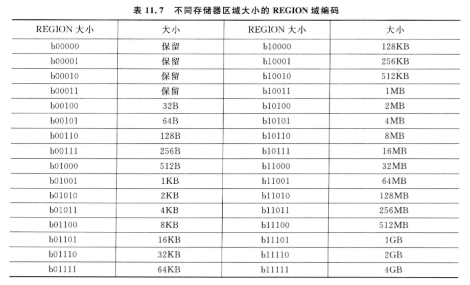

`AP`域定义如下，和`XN`位共同决定访问权限

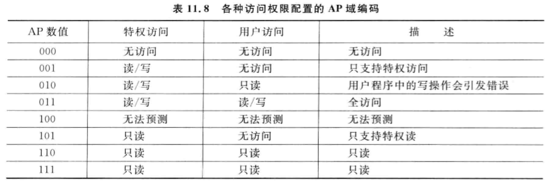

`TEX`和`S C B`定义如下，`S`位的配置只在部分情况下有效

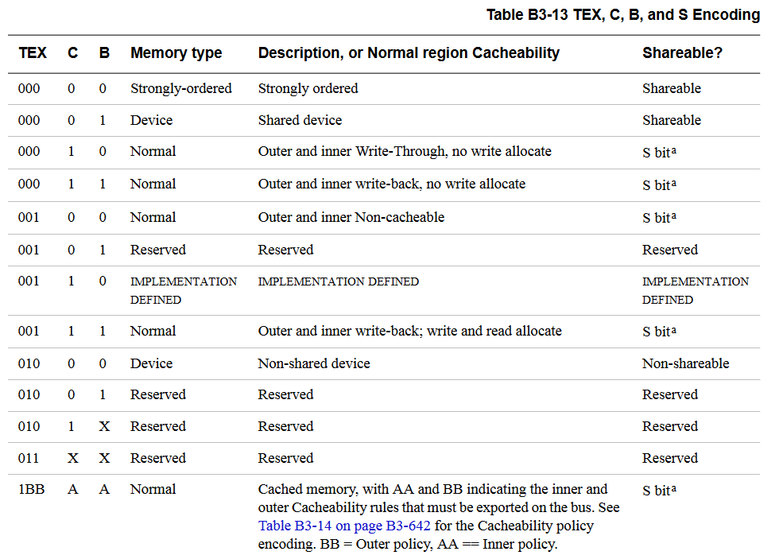

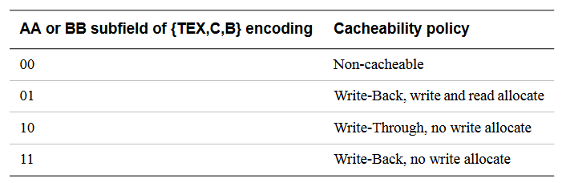

> 在Cortex-M3或M4核心的MCU中，内存访问的机构如下。采用这两种核心的主流MCU也很少有配备系统级Cache，但是有Buffer写缓冲，`B`位的配置还是会对写入产生影响

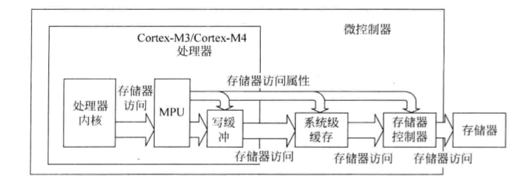

在`TEX`最高位配置为0时，内部缓存以及外部缓存使用相同的配置。**内部缓存**指的是CPU内核集成的缓存，例如Cortex-M7就拥有Icache和Dcache内部缓存，而其他核心也有写缓存。**外部缓存**一般属于系统，可以多个CPU共享（如L2二级缓存）

在Cortex-M3和M4中常用配置如下

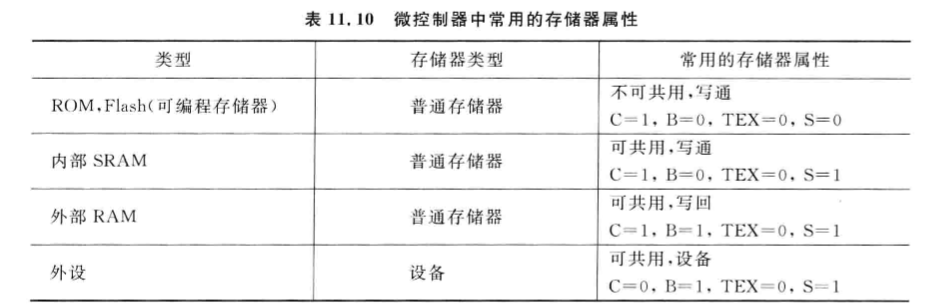

由于ROM和Flash一般是只读的，速度和CPU差不多，所以无需开启Buffer，同时设置为不可共用，处理器可以随意读取，可以提高效率

内置SRAM和CPU基本一个速度所以也无需开启Buffer，同时设置为Shareable表示不是独占的（有DMA，也可能有多个CPU核心）

外置RAM由于写入延迟较高所以需要开启Buffer

而设备除了设置为`Device`以外也可以设置为强序`Strongly-ordered`

> 缓存读写行为分为命中和未命中两种情况（参照CSAPP第6章）：
>
> `Write-Through`和`Write-Back`针对的是**写命中**的情况，`Write-Through`将数据写入到Cache后再立即写入内存，`Write-Back`只将数据写入到Cache，只有当替换算法要驱逐这个数据时该数据才会写入到内存
>
> `Write allocate`和`No write allocate`针对的是**写未命中**的情况，此时想要的数据不在Cache里面。`Write allocate`会将数据先从内存中复制到Cache中再更新Cache中的这个数据，而`No write allocate`直接绕开Cache将数据写入到内存中
>
> 在写入时，一般将`Write-Back`和`Write allocate`结合起来使用，这两种操作都只更新了Cache而没有更新内存。`Write-Through`和`No write allocate`结合起来使用，这两种操作都保证了内存被及时更新，但是会带来更大的总线流量，由于更大的延迟执行也会更慢
>
> **读命中**的情况下，直接从Cache读取数据即可
>
> `Read allocate`针对的是**读未命中**的情况，此时会将数据从内存中复制到Cache再读取
>
> 强序`Strongly-ordered`可以看作是一种特殊的`Device`，和`Device`的区别就是禁用了内存写入Buffer，使得写入操作以及之后的程序更加安全，而效率稍低。强序内存在ARMv8中废除


### 1.9.3 MPU配置步骤

示例

```c
_DMB();
// 禁用MPU
MPU->CTRL = 0;
// 只配置区域0
MPU->RNR = 0;
MPU->RBAR = MPU_CFG_RBAR;
MPU->RASR = MPU_CFG_RASR;
// 禁用剩余的区域
for(i = 1; i < 8; i++) {
    MPU->RNR = i;
    MPU->RBAR = 0;
    MPU->RASR = 0;
}
// 使能MPU，使能背景，同时处理模式禁用MPU
MPU->CTRL = 0x00000005;
_DSB();
_ISB();
```


## 1.10 浮点计算

在我们开发的应用中如果使用到了浮点数，编译器会自动根据我们指定的处理器核心类型编译出相对最优化的代码。在Cortex-M3和M0+中所有的浮点计算都使用库函数处理。而在Cortex-M4F中则自动调用单精度浮点指令。在Cortex-M7中自动调用单精度和双精度浮点指令

GCC开发中使用`__fp16`声明半精度浮点数，`float`声明单精度，`double`声明双精度

Cortex-M4设计上将浮点单元的译码和执行单元分开

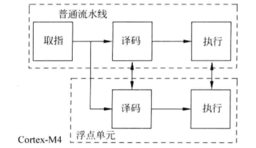


### 1.10.1 控制寄存器

Cortex-M4的硬件浮点支持通过`CPACR`使能，[见前](#184-协处理器访问控制cpacr)

浮点状态寄存器`FPSCR`定义[见前](#143-fpu寄存器)，需要将`FPSCR`标志位传送到`PSR`实现条件执行。浮点比较一般使用`VCMP`，比较结果定义如下表

| N | Z | C | V | 比较结果 |
| :-: | :-: | :-: | :-: | :-: |
| 0 | 1 | 1 | 0 | 相等 |
| 1 | 0 | 0 | 0 | 小于 |
| 0 | 0 | 1 | 0 | 大于 |
| 0 | 0 | 1 | 1 | Unordered |

**`FPCCR`寄存器**

浮点上下文控制寄存器，用于控制浮点上下文的[惰性压栈](#1511-处理器对中断异常的自动优化)等特性，通过`FPU->FPCCR`访问

| 位域 | 名称 | 作用 |
| :-: | :-: | :-: |
| 31 | `ASPEN` | 默认置1，在异常入口处自动清除`CONTROL`寄存器中的`FPCA`位，同时将`S0`到`S15`以及`FPSCR`压栈。异常退出自动恢复寄存器以及`FPCA` |
| 30 | `LSPEN` | 默认置1，使能异常的**惰性压栈**，在异常使用到浮点指令时才将浮点寄存器压栈 |
| 8 | `MONRDY` | 默认置0，禁止挂起调试监控 |
| 6 | `BFRDY` | 默认置0，禁止挂起总线错误 |
| 5 | `MMRDY` | 默认置0，禁止挂起内存错误 |
| 4 | `HFRDY` | 默认置0，禁止挂起硬件错误 |
| 3 | `THREAD` | 默认置0，表示分配浮点栈帧时为**处理模式**。置1为**线程模式** |
| 1 | `USER` | 默认置0，表示分配浮点栈帧时为**特权模式**。置1为**非特权模式** |
| 0 | `LSPACT` | 惰性压栈指示位。1表示当前已经分配浮点栈帧但是未压栈 |

> 一般只需要改动`LSPEN`位

**`FPCAR`寄存器**

惰性压栈地址寄存器。实际应用基本不会用到

| 位域 | 作用 |
| :-: | :-: |
| 31:3 | 在惰性压栈上下文中指示`S0`寄存器压入的地址。栈帧双字对齐所以最低3位无效 |

**`FPDSCR`寄存器**

默认状态设置，该寄存器的设置会在浮点上下文切换时被复制到`FPSCR`寄存器。实际应用基本不会用到

| 位域 | 名称 | 作用 |
| :-: | :-: | :-: |
| 26 | `AHP` | 半精度格式默认设置 |
| 25 | `DN` | 默认NaN设置 |
| 24 | `FZ` | 默认清零设置 |
| 23:22 | `RMode` | 舍入模式默认设置 |

**`MVFR0`和`MVFR1`寄存器**

只读存储器，指示FPU支持的特性


### 1.10.2 浮点异常

浮点常见的异常和IEEE754中定义的一致。编译器编译出来的代码在大部分情况下会忽略这些异常

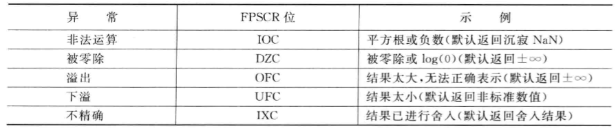

此外针对Input Denormal的问题，`IDC`会置位同时默认将数据替换为0进行计算


## 1.11 其他核心

### 1.11.1 Cortex-M0+

Cortex-M0+是常见的M系列核心中门电路数量最少的，常用于低成本、低功耗的MCU中

**指令集**

Cortex-M0+属于ARMv6-M，仅仅支持少量的32位指令，且不支持除法指令。编写Cortex-M0+汇编代码时注意很多指令只能使用`R0~R7`，且目标寄存器`Rd`需要和操作数寄存器之一相同（具体要看指令）

**内存访问**

Cortex-M0+在区域`0xE0000000`到`0xEFFFFFFF`只支持对齐访问，所以如果想要开发同时适用于ARMv7-M和ARMv6-M的程序，建议强制内存对齐，将`SCB->CCR`[寄存器](#183-系统特性配置与控制ccr)的`STKALIGN`和`UNALIGN_TRP`位置1

**特权等级**

Cortex-M0+特权等级配置是可选的，有些不支持非特权模式，需要注意具体MCU产品的配置。但是依然有`MSP(R13)`和`PSP`两个寄存器

**NVIC**

Cortex-M0+的NVIC最多仅支持32个外部中断，且只支持4级优先级。同时向量表的重定位是可选的，有些MCU可能不支持重定位

**多周期指令**

和ARMv7-M的处理器不同，Cortex-M0+的`LDM`和`STM`指令被中断后会直接Abandon，异常返回后从头开始执行。而不是存储到`PSR`中的`ICI`[位](#142-特殊寄存器)

此外，Cortex-M0+有2种不同的硬件乘法器配置，一种是单周期阵列乘法器，另一种是32周期时序乘法器。如果使用了32周期乘法器配置，`MUL`被中断后指令也会在异常返回后从头执行

**MPU**

Cortex-M0+中的MPU配置寄存器无[TEX域](#192-相关寄存器)，且没有`RBAR`和`RASR`的别名寄存器，不能使用一条指令设置多片区域


### 1.11.2 Cortex-M7

Cortex-M7是ARMv7-M中性能最高的，采用了双发射超标量顺序流水线设计，支持分支预测，集成了数据Cache和指令Cache（支持ECC），同时具有双精度浮点的指令和硬件支持，可以运行在很高的频率。Cortex-M7核心由于其Cache的存在所以一般需要依赖MPU进行内存管理


## 1.12 附录

### 1.12.1 CPUID

`CPUID`定义如下

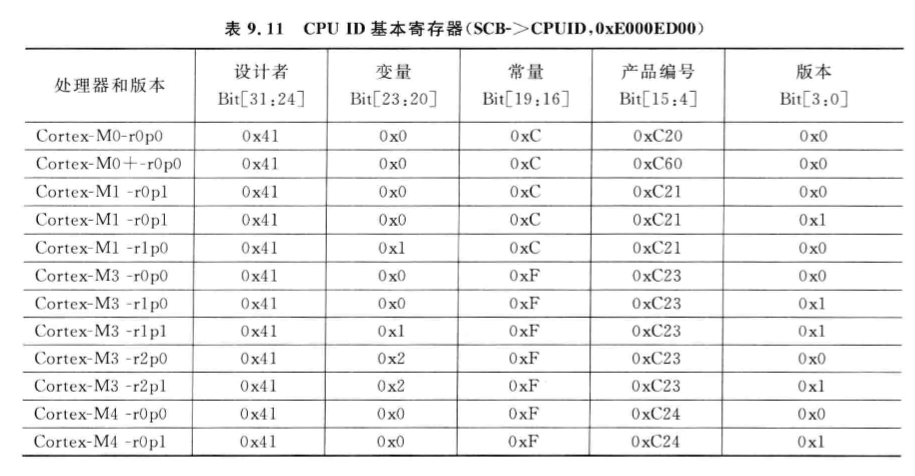


## 1.13 补充：错误异常与处理

在注重高可靠性的控制系统中，仅仅依靠Watchdog或掉电检测Brown-out detection是不够的，很多时候这些外挂机构无法及时复位MCU（有些应用情况下1mS的延迟都会导致致命后果）。恶劣的工况容易导致MCU程序异常，想要及时检测到就需要依赖主动的错误机制

在日常的错误调试中，常用的手段有以下几种：栈跟踪（检查已经压栈的数据，可以在异常处理开头插入一条断点指令），事件跟踪（输出程序运行失败前的异常），指令跟踪（需要ETM，输出失败前的CPU操作）等

在默认情况下，所有错误都触发`HardFault`[异常](#154-向量表)（异常类型3，优先级-1）。其他错误如`MemManage`，`BusFault`，`UsageFault`和`HardFault`的逻辑关系如下

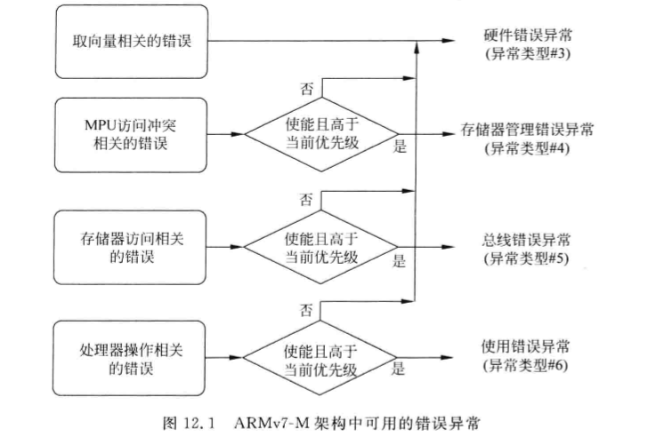

> `MemManage`的异常类型为4，`BusFault`异常类型为5，`UsageFault`异常类型为6


### 1.13.1 MemManage错误

只要CPU在访问内存时违反了内存的访问权限就会触发内存管理错误

触发`MemManage`一般有以下几种情况：

> 1. 非特权模式下访问特权内存区域
>
> 2. 未使能背景的情况下，访问未经过MPU定义的内存区域（私有外设除外）
>
> 3. 写入只读区域
>
> 4. 从`XN`区域取指
>
> 所谓内存访问包括但不限于取指，栈操作。异常入口处压栈发生`MemManage`为压栈错误，异常出口处为出栈错误


### 1.13.2 BusFault错误

总线错误一般和总线数据传输有关

触发`BusFault`一般有以下几种情况：

> 1. 访问了一片非法的内存区域（例如没有连接任何存储器或寄存器的区域）
>
> 2. 设备未初始化，不允许访问（例如DRAM）
>
> 3. 设备正常工作，但是不支持或不允许该种传输
>
> 4. 非特权模式访问私有外设总线
>
> 总线错误可能在访存指令之后立即触发（精确），也可能延迟触发（不精确，写入缓冲Buffer的存在会导致这种不精确的情况）
>
> 传统ARM处理器中，取指触发总线异常称为预取终止，读写数据时触发称为数据终止。异常入口出口处被称为压栈出栈错误


### 1.13.3 UsageFault错误

使用错误的触发一般有以下几种情况

> 1. 执行未定义的指令或FPU禁用时执行浮点指令
>
> 2. 执行Cortex-M系列核心中不支持的协处理器指令
>
> 3. 尝试从Thumb切换到ARM
>
> 4. 使用了非法的`EXC_RETURN`[代码](#1510-中断异常调用过程详解)，尤其是在有异常处于活跃的状态下，尝试返回到线程模式会触发
>
> 5. 执行`STM`或`LDM`指令时内存非对齐
>
> 6. 当前优先级高于`SVC`或相等时执行`SVC`指令
>
> 7. 异常返回后处理器发现`PSR`中的`ICI`位域非0，然而执行的指令不为`LDM`等指令
>
> 8. `CCR`[寄存器](#183-系统特性配置与控制ccr)中的`DIV_0_TRP`和`UNALIGN_TRP`置位时，如果此时发生整数0除或内存的非对齐访问，就会触发`UsageFault`


### 1.13.4 HardFault错误

以上3种错误如果未使能，就会触发`HardFault`。此外，以下情况也会触发硬件错误

> 1. 触发异常取向量时遇到总线错误
>
> 2. 调试中，调试器处于连接状态且未使能调试监控异常，执行`BKPT`断点指令

以上所有错误的使能见`SCB`中的`SHCSR`[寄存器](#159-scb相关寄存器)


### 1.13.5 错误相关寄存器

以下所有的寄存器都可以通过`SCB`结构体访问

**`CFSR`寄存器**

可配置错误，包含`MemManage`，`BusFault`，`UsageFault`的错误状态信息

| 位域 | 寄存器 | 作用 |
| :-: | :-: | :-: |
| 31:16 | `UFSR` | `UsageFault`错误状态 |
| 15:8 | `BFSR` | `BusFault`错误状态 |
| 7:0 | `MFSR` | `MemManage`错误状态 |

使用错误状态子区域

| 位域 | 名称 | 作用 |
| :-: | :-: | :-: |
| 25 | `DIVBYZERO` | 表示发生了**Divide-by-zero**，仅在`DIV_0_TRP`置位时才会触发 |
| 24 | `UNALIGNED` | 表示发生了**非对齐访问**，仅在`UNALIGN_TRP`置位时才会触发 |
| 19 | `NOCP` | 表示试图执行在Cortex-M中不被允许的**协处理器指令** |
| 18 | `INVPC` | 表示使用了非法的`EXC_RETURN` |
| 17 | `INVSTATE` | 表示试图切换到Cortex-M中不允许的ARM模式 |
| 16 | `UNDEFINSTR` | 表示试图执行未定义的指令 |

总线错误状态子区域

| 位域 | 名称 | 作用 |
| :-: | :-: | :-: |
| 15 | `BFARVALID` | 表示`BFAR`中的地址是否有效 |
| 13 | `LSPERR` | 表示此次为**浮点惰性压栈**导致的错误 |
| 12 | `STKERR` | 表示此次为**压栈错误** |
| 11 | `UNSTKERR` | 表示此次为**出栈错误** |
| 10 | `IMPRECISERR` | 表示此次**数据访问**错误是不精确的，发生错误的数据地址不会存放到`BFAR`中 |
| 9 | `PRECISERR` | 表示此次**数据访问**错误是精确的，发生错误的数据地址可以通过`BFAR`获得，同时发生错误的指令地址可以通过异常中被压栈的`PC`数值确定 |
| 8 | `IBUSERR` | 表示此次是**取指**触发了错误 |

内存错误状态子区域

| 位域 | 名称 | 作用 |
| :-: | :-: | :-: |
| 7 | `MMARVALID` | 表示`MMFAR`中的地址是否有效 |
| 5 | `MLSPERR` | 表示此次为**浮点惰性压栈**导致的内存错误 |
| 4 | `MSTKERR` | 表示此次为**压栈错误** |
| 3 | `MUNSTKERR` | 表示此次为**出栈错误** |
| 1 | `DACCVIOL` | 表示此次是**数据访问**触发了内存错误 |
| 0 | `IACCVIOL` | 表示此次是**取指**触发了内存错误 |

**`HFSR`寄存器**

包含`HardFault`的错误状态信息

| 位域 | 名称 | 作用 |
| :-: | :-: | :-: |
| 31 | `DEBUGEVT` | 表示由**调试事件**触发 |
| 30 | `FORCED` | 表示由`MemManage`，`BusFault`，`UsageFault`触发 |
| 1 | `VECTBL` | 表示由异常触发时的取向量失败触发 |

**`DFSR`寄存器**

包含调试错误状态信息，在调试中调试上位机会访问该寄存器

| 位域 | 名称 | 作用 |
| :-: | :-: | :-: |
| 4 | `EXTERNAL` | 表示外部信号（如`EDBGRQ`）触发调试事件 |
| 3 | `VCATCH` | 表示异常取向量触发调试事件，CPU可以在进入异常时自动暂停 |
| 2 | `DWTTRAP` | 表示监视点触发调试事件 |
| 1 | `BKPT` | 表示断点触发调试事件 |
| 0 | `HALTED` | 表示CPU已经被调试器暂停 |

**`MMFAR`寄存器**

| 位域 | 作用 |
| :-: | :-: |
| 31:0 | `MMARVALID`为1时，存放导致`MemManage`错误触发时访问的内存地址 |

**`BFAR`寄存器**

| 位域 | 作用 |
| :-: | :-: |
| 31:0 | `BFARVALID`为1时，存放导致`BusFault`错误触发时访问的内存地址 |

**`AFSR`寄存器**

辅助错误状态寄存器，不同MCU厂商定义会不一样，用于提供额外的错误信息


### 1.13.6 锁定

触发锁定的情况包括但不限于以下情况，此时由于错误的优先级低于当前优先级，CPU核心会输出`LOCKUP`信号，有些MCU厂商会将该信号连接至系统复位

> 1. 在`HardFault`或`NMI`的异常处理程序中触发异常
>
> 2. 在`HardFault`或`NMI`异常取向量时触发`BusFault`（但是异常压栈出栈不会触发锁定）
>
> 3. 在`HardFault`或`NMI`的异常处理程序中试图实行`SVC`指令

在程序设计中需要尽量避免锁定的发生，一般有以下方法

> 1. 尽量将`HardFault`和`NMI`异常的处理程序设计的短小精悍，少使用栈，只包含关键任务，其他附加任务可以通过挂起`PendSV`处理
>
> 2. 检查`HardFault`和`NMI`异常的处理程序是否有`SVC`指令


## 2 Linux环境下STM32开发

## 3 GNU汇编

## 3.1 裸机汇编

## 3.2 C语言中的内联汇编