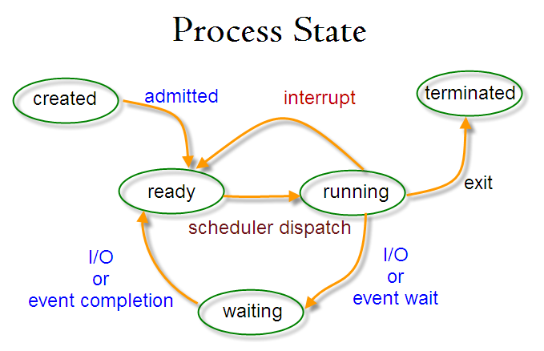

# Linux命令行以及Shell脚本

记录Linux下一些常见的命令的比较有用的用法，以及Shell脚本的编写

**包含了sed使用和awk编程**


## 参考书籍

*Linux命令行与Shell脚本编程大全 3rd Edition. Richard Blum, Christine Bresnahan, 2016*

## 1 常用基本命令以及命令行参数

### 1.1 文件管理

包含常用的目录浏览以及文件处理命令

#### 1.1.1 ls或dir

列出文件

```shell
ls

命令行参数
-R 递归显示目录下内容
-a 列出所有，包括.开头的隐藏文件
-l 详细信息，格式：mode owner group size time name
    mode：l代表链接，d代表目录，b代表块设备，c代表字符设备，p代表FIFO。rwx分别代表读写运行权限
-F 用于区分目录，在目录后加/
-h 显示文件大小时自动换算为K，M，G
--time=atime 显示访问时间而非修改时间
-i inode编号，系统中每一个文件和目录都有，且唯一
```

文件匹配

```shell
ls *.txt            显示以.txt结尾
ls date?.txt        显示date1.txt，datea.txt等
ls date[12].txt     显示date1.txt，date2.txt
ls date[1-3].txt    显示date1.txt，date2.txt，date3.txt
ls date[!1].txt     不显示date1.txt
```

#### 1.1.2 pwd

打印当前目录

#### 1.1.3 cd 

到一个目录下

`../`代表父目录，`./`代表当前目录

#### 1.1.4 touch

新建/访问一下文件，不会修改已有文件

```shell
touch test.txt
```

#### 1.1.5 cp

拷贝文件

```shell
cp source.txt destination.txt
cp source.txt destination/

命令行参数
-r 递归，用于复制一个目录
-i 遇到同名文件询问是否覆盖
-v 显示当前动作
-p 保留文件时间戳，mode，用户等信息
--preserve=mode,ownership,timestamps
--preserve=all
-f 强制拷贝
```

#### 1.1.6 mv

移动/重命名文件

```shell
mv source.txt destination.txt
```

#### 1.1.7 rm和rmdir

删除/删除目录

```shell
rm 

命令行参数
-i 询问是否删除
-r 递归删除一个目录
-f 强制删除
```

#### 1.1.8 mkdir

创建目录

```shell
mkdir 

命令行参数
-p 如果创建多级目录，则递归生成
```

#### 1.1.9 ln

链接

```shell
ln file link

命令行参数
无参 硬链接，信息和源文件相同，是同一个文件（使用同一个inode），等同于引用源文件，只能用于同一个文件系统
-s 符号链接，创建的是一个符号文件，不是同一个文件，可以用于不同文件系统之间的引用
```

#### 1.1.10 file

查看文件类型

#### 1.1.11 cat

输出/连接文件，并输出到标准输出

```shell
cat file1.txt
cat file1.txt file2.txt

命令行参数
-n -b 显示行号
```

#### 1.1.12 less和more

分页文本查看器

#### 1.1.13 tail和head

查看一个文件的开头n行或结尾n行

```shell
head -n 5 log.txt
tail -n 5 log.txt
tail -5 log.txt
```

#### 1.1.14 文件归档、压缩和解压缩

归档常用工具：tar

压缩常用工具：gzip，bzip2，zip，xz，zstd

解压缩：gzip，bzip2，unzip，xz，zstd

**tar**

```shell
tar option file

命令行参数
一般操作
-x 解压
-u 更新，仅更改新近修改的文件
-c -f file1 file2 创建归档
-t 列出内容
-f 指出文件
-p 保留权限
-v 显示过程

解压选项
-a 根据文件后缀自动决定解压方式
-z 使用gzip
--zstd 使用zstd
-j 使用bzip2
-J 使用xz
```

**gzip**

```shell
gzip option file

命令行参数
-d 解压
-t 测试压缩包
-v 显示过程
-q 无输出
-c 输出到标准输出，常用于管道操作
-1 最快，最小压缩率
-9 最慢，最大压缩率
```

**bzip2**

```shell
bzip2 option file

命令行参数
-d 解压
-z 压缩
-k 保留输入文件
-t 测试压缩包
-v 显示过程
-q 无输出
-c 输出到标准输出，常用于管道操作
-1 最快，最小压缩率
-9 最慢，最大压缩率
```

**xz**

```shell
xz option file

命令行参数
-d 解压
-z 压缩
-k 保留输入文件
-t 测试压缩包
-v 显示过程
-q 无输出
-c 输出到标准输出，常用于管道操作
-0 最快，最小压缩率
-9 最慢，最大压缩率
--threads=N 使用N个线程压缩，0默认使用最多线程
```

**zstd**

```shell
zstd option file -o file

命令行参数
-d 解压
-k 保留输入文件（默认）
--test 测试压缩包
-v 显示过程
-q 无输出
-c 输出到标准输出，常用于管道操作
-1 最快，最小压缩率
-19 最慢，最大压缩率
```

**zip/unzip**

```shell
zip option file

命令行参数
-u 仅更新以及添加的文件
-q 不显示过程
-v 显示过程
-T 测试压缩包
-1 最快压缩，最小压缩率
-9 最慢压缩，最大压缩率
```

```shell
unzip option file

命令行参数
-p 解压到管道
-l 列出包含的文件
-t 测试压缩包
-p 更新文件
-q 不显示过程
-v 显示过程
-o 直接覆盖文件
```

#### 1.1.15 sort

对文件内容排序

```shell
sort file1.txt

命令行参数
-n 按数字识别并排序
-g 按浮点/科学计数法排序
-M 按月份简写排序
-b 忽略起始空白
-f 忽略大小写
-o file 写入到指定文件
-r 升序改降序
-t ':'指定分隔符
-k 指定排序字段
```

#### 1.1.16 grep

在一串字符中查找匹配的行

```shell
grep options pattern file.txt
cat file.txt | grep option pattern
egrep regexp file.txt

pattern可以为正则表达式

命令行参数
-v 反选输出
-n 显示行号
-c 匹配行数
-e pattern 指定多个模式
```

#### 1.1.17 which和type

which和type可以用于在bash可执行文件路径变量下查找指定的文件，另外type还可以用于指示一个命令是否是内建命令

```shell
which lsblk
type cd
```

#### 1.1.18 chmod和umask

chmod可以更改文件的权限，而umask可以更改当前创建文件时使用的默认权限。chmod的三个权限分别使用u，g，o表示

**在linux中，-代表普通文件，l代表链接，d代表目录，b代表块设备，c代表字符设备**

**一般的权限可以使用三位八进制表示，比如rwxr-xr--可以表示为754**

**linux的权限除rwx以外，x位常见的还有t和s。s代表运行时重新设置UID和GID，常用于sudo等，而t代表保留文件或目录**

```shell
chmod u+x ./test1.sh
chmod 777 ./test2.sh
```

使用umask时，遮挡指定权限位，比如022，设置权限755。0022的第一位八进制为粘着位，分别代表使能SUID，SGID以及粘着位。

**SUID指的就是文件被用户使用时会以文件属主身份运行，SGID同理，但是也会使得一个目录下创建的文件全部使用目录的属组，而粘着指的就是进程结束以后文件还驻留在内存**

```shell
umask 0022
umask 022
```

#### 1.1.19 chown和chgrp

```shell
chown k file.txt
chgrp sample file.txt
```

#### 1.1.20 date

用于显示时间

```shell
date +%M%S
date --date="@2147483647" #计算一个具体的UNIX时间对应的日期与时间

常用格式
%a %A 星期简写以及全称
%b %B 月份简写以及全称
%Y %y 年份
%m 月份，补0
%d 日期，补0
%u 星期，1..7
%H 小时，24，补0
%I 小时，12，补0
%P %p AM或PM
%M 分钟，补0
%S 秒种，补0
%N 纳秒
%s 从UNIX零点开始的秒数
%j 一年中的第几天
```

### 1.2 系统管理

#### 1.2.1 ps

显示当前进程

```shell
ps

命令行参数

UNIX
过滤
-A -e 显示所有进程
-a 列出除控制进程以及无终端进程以外所有进程
-d 列出除控制进程以外的进程
-C cmdlist 列出所有在cmd列表中的进程（命令名，如xinit）
-G -g grplist 列出所有在group列表中的进程（组名或组ID）
-U userlist 列出属主uid在userlist中的进程（用户名或用户ID）
-u userlist 显示有效用户uid在userlist中的进程
-p pidlist 显示PID在pidlist中的进程
-s sessionlist 显示会话ID在sessionlist中的进程
-t ttylist 显示终端ID在ttylist中的进程
显示格式
无参 显示默认参数（PID,TTY,TIME,CMD）
-o format 仅显示format规定输出列
-O format 显示默认输出列以及format规定输出列
-F 显示完整格式（default+UID,PPID,C,SZ,RSS,PSR,STIME）
-M 显示安全信息（default+LABEL）
-c 显示额外调度器信息（default+CLS,PRI）
-j 显示任务信息（default+PGID,SID）
-l 显示长列表（default+F,S,UID,PPID,C,PRI,NI,ADDR,SZ,WCHAN）
-z 显示安全标签（SELinux）
-H 层级显示
-n namelist WCHAN显示的值
-L 显示进程的线程

BSD
过滤
T 显示于当前终端有关
a 显示和任意终端有关
g 显示所有，包括控制进程
x 显示所有，包括无终端
r 仅显示运行中
U 属主用户UID
p 进程PID
t 终端tty号
显示格式
O 格式
z 安全信息SELinux
j 任务信息
l 长模式
o format 仅format
----新增格式----
s 信号格式
u 基于用户
v 基于虚拟内存
N namelist WCHAN显示的值
O order 显示顺序
S 将子进程数据加到父进程上
c 显示真实命令名称
e 显示命令的环境变量
f 分层显示
h 不显示头信息（表头）
k sort 按某列排序
n 用户ID和组ID
H 将线程按进程显示
m 在进程后显示线程
L 列出所有格式指定符
```

显示的各参数含义\
**UID:**      进程属主\
**PID:**      进程ID\
**PPID:**     父进程ID\
**C:**        CPU利用率\
**STIME:**    启动时时间\
**TTY:**      终端号\
**TIME:**     累计CPU时间\
**CMD:**      程序名\
**F:**        进程系统标记\
**S:**        进程状态（D不可中断休眠，S可中断休眠，I空闲的内核进程，R运行或可运行，Z僵尸进程，T停止或跟踪，X已终结）\
**PRI:**      优先级，越小的数字代表越高的优先级\
**NI:**       谦让度\
**ADDR:**     内存地址\
**SZ:**       swap所需大致空间\
**WCHAN:**    进程休眠的内核函数地址\
**PSR:**      运行在哪颗CPU上

BSD格式\
**VSZ:**      进程占内存大小\
**RSS:**      未swap时占用的物理内存\
**STAT:**     双字符状态码（UNIX格式加第二个字符，<高优先级，N低优先级，L有页面锁定在内存，s控制进程，l多线程，+运行在前台）

**常用用法参数：**

UNIX格式：
```shell
显示STIME，PSR
ps -l 
显示S，UID，PPID，PRI，NI，ADDR，SZ
ps -F
显示所有
ps -e
显示一个用户的进程
ps -U userid
显示一个终端的进程
ps -t tty1
显示除控制进程以外的进程
ps -d
```

BSD格式：
```shell
显示USER，PID，CPU，MEM，VSZ，RSS，TTY，STAT，START，TIME，CMD
ps u
显示F，UID，PID，PPID，PRI，NI，VSZ，RSS，WCHAN，STAT，TTY，TIME，CMD
ps l
显示线程
ps m
累计进程占用资源
ps S
按指定列排序显示
ps k sort
所有进程，包括控制
ps g
所有进程，包括无终端
ps x
所有终端
ps a
运行中
ps r
```

#### 1.2.2 top

和ps类似，区别是top是实时监测显示

部分显示参数注释\
**VIRT**      占用虚拟内存总量\
**RES**       占用物理内存总量\
**SHR**       共享内存总量\
**S**         进程状态（D休眠可中断，R运行，S休眠，T跟踪或停止，Z僵尸进程）\
**TIME+**     累计CPU时间

#### 1.2.3 kill和killall

向进程发送信号

kill使用PID指定进程，killall使用进程名指定进程

```shell
kill -s SIGNAL 2350
killall -s SIGNAL http*

可用信号
HUP 挂起
INT 中断
QUIT 结束运行
KILL 无条件终止
SEGV Segment错误
TERM 尽可能终止
STOP 无条件停止运行但不终止
TSTP 停止暂停并在后台运行
CONT STOP或TSTP后继续运行
```

#### 1.2.4 mount和umount

挂载文件系统

```shell
mount /dev/sdxx /mnt

命令行参数
-a -aF 挂载所有在/etc/fstab里的文件系统
-f 模拟挂载
-v 显示挂载过程
-l 自动添加标签
-n 挂载但不注册到/etc/mtab
-p num 加密挂载
-o 指定挂载选项（ro只读,rw读写,user,check=none,loop）
-L label
-U uuid
-t 指定文件系统类型
```

#### 1.2.5 du和df

```shell
du /directory
查看一个目录占用的空间

命令行参数
-h 自动换算为k,M,G
-s 统计

df /directory
查看一个目录所在文件系统剩余空间

命令行参数
-h 自动换算为k,M,G
```

#### 1.2.6 用户管理

**useradd添加用户**

```shell
useradd k

常用命令行参数
-m 添加同时穿创建home目录
-e 设置账户过期时间，使用YYYY-MM-DD指定
-g group 设置登录组
-G group1 group2 设置除登录组以外的附属组
-n 创建一个和用户同名的新组（默认行为）
-u 指定uid
```

**userdel删除用户**

```shell
userdel k

常用命令行参数
-r 同时删除home
```

**usermod修改用户字段**

```shell
usermod k
usermod -G sample k 

常用命令行参数
-c 添加备注
-e 修改过期日期
-g 修改默认登录组
-G 修改附属组
-l 修改登录名
-L 锁定账户
-p 修改密码
-U 解除锁定
```

**passwd/chpasswd修改密码**

```shell
passwd k
chpasswd k:123456
```

**chsh和chfn**

chsh可以修改默认登录shell，而chfn用于修改/etc/passwd

```shell
chsh -s /bin/zsh k
```

**groupadd创建组**

```shell
groupadd sample
```

**groupmod修改组**

```shell
groupmod sample

常用命令行参数
-g 修改GID
-n 修改组名
```

### 1.3 shell的基本概念以及用法

#### 1.3.1 命令的运行以及shell的父子关系

命令进程由bash创建，bash为一个命令进程的父进程。这点可以从ps的PPID参数看出。在命令提示符之后输入bash（或其他shell，如zsh等），可以启动一个子shell，通过`exit`命令退出并返回父shell。

查看目前是最底层shell之上第几层子shell，使用变量$BASH_SUBSHELL查看即可。

#### 1.3.2 连续执行，进程列表

类似C语言中的语句，shell可以使用 **;** 分隔一行中的多个命令，比如

```shell
cd ../ ; pwd ; ls ; cd ~
```

而加上圆括号，则会启动一个子shell执行这些命令，这就是进程列表

```shell
( cd ../ ; pwd ; ls ; cd ~ )
```

而花括号不同，其只相当于分隔符的作用，命令在当前shell执行，并且注意每一个命令后面都要加上分号，这也表明其包含的只是一个顺序执行命令的序列

```shell
{ cd ../ ; pwd ; ls ; cd ~ ;}
```

#### 1.3.3 后台运行

可以将一个或一行命令置入后台运行，在命令最后加上 **&**，可以在当前shell启动一个进程并将其转到后台，此时用户可以进行其他作业，但后台进程依然会在当前终端输出

```shell
ls & 
```

#### 1.3.4 协程

不同于后台运行，协程会在后台新建一个子shell并运行程序，执行结果不会在当前终端显示

```shell
coproc ls
```

也可以对协程命名

```shell
coproc MyTask { sleep 10 ; ls }
```

生成shell的成本并不低，所以尽量减少子shell的级数

#### 1.3.5 内建命令和外部命令

Bash的外部命令一般可以在/bin找到，而内建命令由bash本身实现。典型的内建命令有`cd`，`exit`，`history`等。

可以使用type查看一个命令是否为内建或外部命令，有的命令同时有内建和外部实现，可以在`type`后加上`-a`参数

```shell
type -a pwd
type -a echo
```

#### 1.3.6 history查看命令记录

使用`history`查看命令记录，或删除命令记录，记录条数由`$HISTSIZE`决定

```shell
history 

命令行参数
-c 清除记录
```

重复执行上一条命令，只要使用`!!`命令

```shell
!!
```

#### 1.3.7 alias命令别名

查看以及设置当前的命令别名，**注意赋值表达式不能有空格**

```shell
alias 

命令行参数
command='command alias'

常用
alias ls='ls --color=auto'
```

### 1.4 网络工具

#### 1.4.1 nmap

#### 1.4.2 curl

#### 1.4.3 tracepath

#### 1.4.4 dnsutils


## 2 shell脚本基础

包含了基本shell脚本编写的各方面

### 2.1 变量

**在shell中，所有变量都使用字符串形式存储，包括数字。一个变量是否是数字实际需要程序自身判断其有效性。使用`var="2"`和`var=2`效果相同**

#### 2.1.1 局部变量

shell下的变量一般使用`$`引用。局部变量一般使用小写字母，只对当前shell可见，**对子shell也不可见**，可以使用`set`查看当前的所有局部、用户定义和全局变量

```shell
set
```

设置局部变量，**注意赋值表达式不能有空格**

```shell
my_var=sample
my_var="sample with space"
```

删除局部变量，使用`unset`

```shell
unset my_var
```

#### 2.1.2 全局变量

**全局变量对父shell的所有子进程可见**，可以使用`env`查看所有全局变量，`printenv`也可以用于查看个别变量，也可以通过`echo`返回使用`$`引用的变量。bash启动时的变量在 */etc/profile* 设定，或在带有PAM的系统中，在 */etc/environment* 或 *~/.pam_environment* 设定，bash启动在 *~/.bashrc* 更改。登录shell有/etc/profile，而创建的交互shell不会访问 */etc/profile* ，只会访问 *~/.bashrc*

```shell
env
printenv HOME
echo $HOME
```

设置全局变量，可以将一个局部变量使用`export`设定为全局变量，**注意赋值表达式不能有空格**

```shell
MY_VAR="sample global"
export MY_VAR
export MY_VAR2="sample global"
```

全局变量只能在父进程删除，使用`unset`

**常用全局变量：**

*SHELL:* 默认shell

*HOME:* 当前用户主目录

*PATH:* shell用于查找命令的路径，追加方法：`PATH=$PATH:my_path`

*USER:* 当前用户

*PS1:* 命令提示符格式

**bash自有变量（只可通过$引用）：**

*UID:* 当前用户ID

*BASH_SUBSHELL:* shell嵌套级别

*BASHPID:* 当前bash的PID

*COLUMNS:* 当前终端可用宽度

*HOSTNAME:* 当前主机名

*HOSTTYPE:* 当前使用主机的CPU指令集

*LINENO:* 当前执行的行号

*OLDPWD:* 之前的目录

*PPID:* 父进程PID

*PWD:* 当前目录

*RANDOM:* 返回一个0~32767的随机数

*SECONDS:* 启动shell到现在的秒数

#### 2.1.3 结构变量

**数组变量：** 可以使用圆括号将多个值括起来，使用下标访问，修改或使用`unset`置空。但是注意不是所有shell都对数组支持良好

```
myarray=(one two three four)
echo ${myarray[0]}
echo ${myarray[*]}
```

### 2.2 Shell脚本基本构成

脚本使用`#!`指定要使用的shell，而使用`#`将一行注释

```shell
#!/bin/bash
# This is a comment
```

假设要显示指定字符，使用echo命令即可，如果不想换行可以添加`-n`

```shell
echo This is a test
echo -n This is a test
echo "This is a 'test'"
```

### 2.3 使用一个命令的输出结果

可以使用`$()`或者``将想要的命令括起来，并取其输出。可以将命令的输出赋值到一个变量

```shell
output=$(ls -a)
output=`ls -a`
```

一个实用的例子，就是自动命名文件

```shell
name=log-$(date +%m%d%H%M%S).txt
touch $name
```

### 2.4 重定向

#### 2.4.1 输出重定向

将命令的输出重定向到一个文件

```shell
ls -a > ls.txt #新建或覆写
ls -a >> ls.txt #追加到文件尾
```

#### 2.4.2 输入重定向

将文件重定向到一个命令的标准输入，比如用于统计字数的wc命令

```shell
wc < test.txt
```

内联重定向，可以指定输入的终止符，到达终止符后命令即停止并输出结果

```shell
wc << END
> string1
> string2
> END
```

其中，次提示符由`$PS2`指定，这里是`>`

### 2.5 管道

管道可以看作内存中的一个FIFO，将一个程序的标准输出连接到另一个程序的标准输入。

```shell
ls /bin | less #使用查看/bin下的文件
```

```shell
xz -dkc package.tar.xz | tar -xv #解压缩，和tar -Jxvf作用等价
```

### 2.6 整数、浮点以及字符串运算

#### 2.6.1 传统的Bourne shell格式

使用`expr`（/bin/sh），结果通过标准输出返回

```shell
expr arg operator arg

可用运算符
算数运算（返回运算结果）： + - * / %
逻辑运算（返回一个arg值）： & |
比较运算（返回整数0或1，分别代表否或是）： > >= < <= == !=
```

注意，所有在shell中有特殊含义的运算符，比如\*，/，&，|，>，< 都要加上转义符`\`才可正常工作

```shell
字符串运算

匹配正则表达式，返回匹配到的符合的字符串的字符数总和
expr STRING : REGEXP
expr match STRING REGEXP

子字符串，返回从START开始的LENGTH个字符，索引从1计数
expr substr STRING START LENGTH
例如 expr substr hello 1 4 返回hell

计算字符串长度
expr length STRING

查找一个CHARS第一次出现的位置
expr index STRING CHARS
例如 expr index hello l 返回3
```

#### 2.6.2 bash格式

使用`$[]`（/bin/bash），**特殊符号不需要转义**

```shell
var=$[num operator num]

例如sample=$[($var1 + $var2) * $var3]
```

#### 2.6.3 双括号

常用，`(())`用于算术以及逻辑运算， `[[]]`用于字符串比较，只有返回值，见if-then判断部分

#### 2.6.4 浮点计算

以上方法仅适用于整数运算，浮点运算需要使用专用的工具，在类UNIX系统下常见的有bc

使用bc时必须对内建变量scale赋值，以指定小数点位数

使用命令替换，echo配合管道符

```shell
var=$(echo "scale = 2; var1 = 3; var2 = 7; var1 + var2 + 5.33" | bc)
```

使用内联输入重定向

```shell
var=$(bc << EOF
    scale = 2
    var1 = 3
    var2 = 7
    var1 + var2 + 5.33
    EOF
)
```

### 2.7 退出状态

可以使用变量`$?`查看上一个命令的退出状态

```shell
echo $?

常见状态码
0 成功
1 一般未知错误
2 不适合的shell命令
126 命令无法执行 
127 命令未找到
130 已通过^C终止
255 正常退出码之外的状态码
```

也可以使用`exit`指定退出码

```shell
exit 5
```

### 2.8 判断

if-then结构，如果if之后的命令成功运行（注意是返回0，且只能是命令），则执行then之后的语句

```shell
if CMD
then 
    CMDs
elif CMD
then 
    CMDs
else
    CMDs
fi
```

if之后的命令可以使用test以实现条件满足性的检测，比如一个变量是否为空

```shell
if test $var
then 
    CMDs
fi
```

以上用法不常用，一般还是使用方括号的格式替代test命令

```shell
if [ condition ]
then
    CMDs
fi
```

并且可以使用`&&`或`||`符合条件

```shell
if [ condition1 ] && [ condition2 ]
then 
    CMDs
fi
```

常用的除if-then以外，判断结构同样支持类似其他语言的`case`

```shell
case $var in 
pattern1 | pattern2)
    CMDs;;
pattern3)
    CMDs;;
*)
    CMDs;;
esac
```

case只可以使用变量作为其判断依据，并且可以使用或`|`

**一般常见的条件检测（condition域）**

#### 2.8.1 整型数值

整型数值比较，shell不使用大于小于号

```shell
n1 -eq n2 相等
n1 -gt n2 大于
n1 -ge n2 大于等于
n1 -lt n2 小于
n1 -le n2 小于等于
n1 -ne n2 不等于
```

示例

```shell
if [ $var -eq 1 ]
then 
    var=$[$var + 1]
fi
```

#### 2.8.2 字符串比较

注意大于小于号必须要在前面添加转义符。另外，字符串的比较是根据ASCII的顺序，大写字母被认为小于小写字母

```shell
str1 = str2 相等
str1 != str2 不相等
str1 \< str2 小于
str1 \> str2 大于
-n str1 长度非0
-z str1 长度0
```

示例

```shell
if [ $str1 \> $str2 ]
then 
    echo $str1
fi
```

#### 2.8.3 文件处理

```shell
-e file 存在
-d file 存在并且是一个目录
-f file 存在并且是一个文件
-s file 存在并非空
-r file 存在并可读
-w file 存在并可写
-x file 存在并可执行
-O file 存在并属于当前用户
-G file 存在且属于当前用户默认组
file1 -nt file2 file1比file2新
file1 -ot file2 file1比file2旧
```

示例

```shell
if [ -f file.txt ]
then 
    rm -f file.txt
fi
```

#### 2.8.4 双括号

格式：使用`(())`和`[[]]`

**双圆括号**`(())`语句一般用于特殊算术逻辑运算以及比较赋值，支持位运算。可以在`if`之后以及作为一般语句使用。可以替代`test`以及其等价`[]`，但它不是`test`

```shell
if (( $var1 == $var2 ** 2 ))
then 
    (( var1 = $var2 + 1 ))
fi
```

如上，双括号在一般语句中用于赋值，而在if之后用于比较，因为其所有的执行仅返回执行码。可以使用的算术符号如下，不需要转义

```
+ - * / % 一般算术符
! && || 逻辑运算
~ & | << >> 位运算
< > == != >= <= 比较
= 赋值
val++ val-- ++val --val 加一或减一
```

**双方括号**`[[]]`用于字符串比较，返回执行结果码（不是所有shell都良好支持）

```shell
if [[ $str == e* ]]
then 
    echo "yes"
fi
```

其中e*是一个pattern

> 说到这里，shell中这么多类型括号的使用非常令人迷惑。整理一下：\
`${}`将一个变量括起来，常用于数组变量\
`$()`用于提取一个命令的执行结果输出，常用于赋值\
`$[]`可以看成`expr`的等价，用于计算整数以及比较，通过标准输出返回结果\
`{}`用于一个命令区块，执行一串命令\
`()`用于命令列表，使用`;`分隔，也用于定义一个数组变量\
`[]`可以看成`test`的等价，用于处理整数、字符串以及文件相关，返回执行结果码\
``(())``用于整数运算、特殊运算、赋值以及比较，返回执行结果码，但是并不是`test`的等价\
``[[]]``用于字符串比较，返回执行结果码

### 2.9 迭代/遍历

一般使用`for`进行迭代。**由于需要对迭代变量进行赋值，这里的变量不添加引用符`$`，这和`case`不同**，不要将两者混淆。另外`for`的迭代变量在迭代后会一直保持有效

```shell
for var in list
do
    CMDs
done
```

示例

```shell
for i in GNU\'s NOT Unix 
do
    echo $i
done
```

```shell
string="GNU's NOT Unix"
for i in $string
do 
    echo $i
done
```

结果

```
GNU's
NOT
Unix
```

**同样，`for`也可以使用shell展开的通配符，用于遍历文件，和使用$(ls /dir/)等价**

```shell
for i in /dir/*
do 
    file $i
done
```

**注：在默认情况下，bash将空格，制表符，以及换行符作为字段分隔的依据，这样导致`for`遇到含空格的变量后就会出现问题。可以有两种问题解决，一个是使用`""`，另一个是修改`$IFS`变量**

示例

```shell
for i in GNU\'s "N O T" Unix
do 
    echo $i
done
```

或在bash下

```shell
IFS=$'\n' # 将换行符'\n'作为唯一字段分隔符
IFS=$'\n':; # 将'\n'以及冒号、分号作为字段标识符。使用冒号可以在读取例如/etc/passwd时发挥妙用
```

### 2.10 循环

#### 2.10.1 C风格for

C风格的`for`的使用方法是特制的，并不符合传统shell中变量使用的常识，使用应当小心。虽然使用双括号，但是并不能使用双括号的原理去理解。

```shell
for (( i=1, j=15; i < 11; i++, j-- ))
do
    echo $i,$j
done
```

并且如上，C风格`for`支持**多于一个迭代变量**

#### 2.10.2 while

`while`使用和if-then相同的`test`命令，根据执行返回的状态码判断是否继续循环

```shell
while CMD
do
    CMDs
done
```

如下，`while`之后可以跟多个测试命令

```shell
while echo $i
    [ $i -ge 1 ]
do
    echo "message"
    i=$i-1
done
```

#### 2.10.3 until

`until`和`while`格式相同，**区别在于`until`只在当测试命令返回异常（非0）时才继续迭代**，当测试命令返回0时才终止（因为返回码无法取反）

```shell
until [ $i -gt 15 ]
do
    i=$i+1
done
```

#### 2.10.4 break

`break`是一个语句，用法和C语言中的break同理，**区别是可以通过`break n`指定要跳出的循环层级数**

示例

```shell
while [ $i -ge 0 ]
do
    j=4

    while [ $j -ge 0 ]
    do
        if [ $i -eq 3 ]
        then 
            break 2
        else
            j=$j-1
        fi
    done

    i=$i-1
done
```

#### 2.10.5 continue

`continue`同样和C语言中的continue同理，如果满足一定条件就会跳过之后的命令

示例

```shell
while [ $i -ge 0 ]
do
    if [ $i -eq 5 ]
    then
        i=$i-1 
        continue
    else
        i=$i-1
    fi
done
```

#### 2.10.6 处理输出

可以将一个循环的输出统一处理，通过重定向或管道

示例

```shell
while [ $i -ge 0 ]
do
    echo "This is $i"
    i=$i-1
done > test.txt
```

管道同理

### 2.11 用户输入

#### 2.11.1 命令行参数

**shell使用`$#`获取输入的命令行参数数量，使用`$0`引用执行当前命令时的输入（比如`./test.sh`），使用`$1`引用第1个命令行参数，使用`$2`引用第2个命令行参数**，以此类推。命令行参数默认使用空格作分隔，如果要传入带空格的参数就要使用引号

脚本的名称可以使用命令`basename $0`提取，通常用于创建两个名称不同而内容相同的脚本，用于功能区分

此外，**最后一个命令行参数可以使用`${!#}`提取**（花括号以内不可以使用`$`，只能使用`!`代替）

**使用不符合要求的命令行参数会导致脚本出错。为提高程序健壮性，要养成对参数做有效性检查的习惯，比如使用`[ -n $1 ]`检查参数是否为空**

#### 2.11.2 遍历所有参数

遍历参数除了直接使用`$#`和`$1`等之外，还可以使用`$*`以及`$@`。两者都记录了所有参数，但是`$@`更加常用。**`$@`将所有输入参数作为一个字符串中的单独单词，可以使用迭代`for`对其进行遍历访问**。而`$*`则相反，将所有参数作为一个整体，需要使用特殊方式访问

示例

```shell
for i in "$@"
do 
    echo $i
done
```

**使用`shift`指令遍历**

`shift`可以将从`$1`开始的所有参数向左移动一格，这也是一种遍历的方法

可以加上一个数字，使用`shift n`指定移动次数

示例

```shell
while [ -n $1 ]
do 
    echo $1
    shift
done
```

#### 2.11.3 选项与参数处理：getopt

用法

```shell
getopt <optstring> <option | parameter>
```

一般命令行参数可以使用`case`语句处理，可以将除所有选项以外的输入（参数）列入`*)`处理（比如返回提示"Invalid command"）。**在Linux下，选项和参数之间一般使用`--`分隔**

**可以使用`getopt`，或它的高级版本`getopts`，对命令行输入进行标准格式化。由于一般的命令行参数可以连用选项，比如`-a -f`可以连写成为`-af`，这样使用传统的方法就很难判别了。**`getopt`就是用于对输入参数进行规范化

**在规定字符串中，如果一个选项`-b`之后需要带参数，可以其之后添加`:`，形式如`b:`**

示例

```shell
getopt -q ab:cd -a -b param1 -cd param2 param3
set -- $(getopt -q ab:cd "$@")

选项
-q 不输出
```

输出结果，其中选项`-b`参数为`param1`，后面`param2 param3`都是附加参数

```shell
-a -b 'param1' -c -d -- 'param2' 'param3'
```

`getopt`局限就在于不能恰当的处理带引号和空格的参数。

#### 2.11.4 选项与参数处理：getopts

`getopts`可以对命令行参数输入依次进行处理，会使用到两个临时环境变量`$OPTARG`和`$OPTIND`，分别代表当前选项对应的参数值以及当前正在处理的参数位置（不包含命令，从2开始，每次递增1）

`getopts`在每次解析成功一个选项之后会有返回值，有选项返回0。**在optstring之前添加`:`以禁止报错输出**

> 经过测试，一个选项之后的参数是否为空**只能使用`[ -z $OPTARG ]`判定，而不能使用`[ -n $OPTARG ]`判定**。并且所有选项之前**添加的`-`都会被去除**

示例

```shell
while getopts :ab:c opt 
do 
    if [ -z opt ]
    then 
        echo "Option $OPTIND : No argument"
    else
        echo "Option $OPTIND : $OPTARG"
    fi
done
```

补充：Linux中常见选项的用法和含义

```
-a 所有
-d 后接指定目录
-f 后接指定文件
-h 显示帮助信息
-l 长格式
-o 指定输出文件
-q 安静模式
-r 递归处理目录
-v 输出详细信息：verbose
-x 排除一个对象
-y 交互模式中，所有选项都回答yes
```

#### 2.11.5 获取用户交互输入：read

使用方法

```shell
read opt1 opt2
read -p "Enter your option : " opt1 opt2
```

`read`通过标准输入读取输入字符串并将其赋值到指定变量，输入以空格为界。**如果变量数不够那么所有剩余变量都会被赋值给最后一个变量**。通过`-p`参数指定提示符

**如果在`read`之后不指定变量，那么输入就会自动赋值给`$REPLY`**

可以使用`-t`参数添加一个超时，超时后返回一个非零值

```shell
if read -t 5 opt
then
    echo $opt
else
    echo "No input"
fi
```

可以使用`-n1`指定输入一个参数以后就继续，无需回车

```shell
read -n1 opt
```

**从文件读取**

```shell
cat test.txt | while read line
do
    echo $line
done
```

### 2.12 输入输出以及重定向

在一个shell进程中，文件描述符为0~8的非负整数，是一个指针，指向实体文件或设备。其中0、1、2前3个描述符为保留，分别为`STDIN STDOUT STDERR`

**默认情况下STDERR和STDOUT使用的文件描述符不同，但通常这些文件描述符都指向同一个位置**

#### 2.12.1 STDERR重定向

**可以使用`n>`指定一个文件描述符对应的重定向文件**，这样可以使用`2>`重定向标准错误到一个错误日志文件

```shell
ls badfile 2> error.log
```

想要重定向`STDOUT`和`STDERR`到两个文件，很简单，只要连用就可以了

```shell
ls -R /home 2> error.log 1> out.log
```

如果想**重定向所有文件描述符到同一个文件，可以使用`&>`。**

**注意在bash中，标准错误的信息优先，会被重定向到标准输出行的上方**

```shell
ls -R /home &> all.log
```

而如果想要**将一个标准输出重定向到标准错误（注意不是输出到一个日志文件）**，也是可以实现的，使用`>&2`即可

```shell
echo "Redirect to STDERR" >&2
```

这样在`./test.sh 2> error.log`时该行命令输出也会被重定向到文件

#### 2.12.2 永久重定向：文件描述符到文件

可以**使用`exec n>`指定整个脚本运行中一个文件描述符对应的重定向文件**

```shell
exec 1>output.log
exec 2>error.log
```

如果**使用`exec n>>`，那么就会将重定向内容追加到文件末尾**

```shell
exec 1>>output.log
```

同样，输入重定向也是使用类似方法。**这样在read试图从标准输入读取时可以从重定向文件读取，这在使用文件输入时很实用**

```shell
exec 0< input.txt
```

也可以将输入输出重定向指向同一个文件。

**这时要注意，shell会在内部维护一个指针，本次操作会在上一次操作结束位置之后开始操作，无论读写**

```shell
exec 3<> io.txt
```

#### 2.12.3 永久重定向：文件描述符到文件描述符

文件描述符之间的重定向格式，将3重定向到1指向的对象（显示器），将4重定向到0指向的对象（键盘输入）

**技巧：`>&`和`<&`的使用看起来可能比较难以理解。可以这样看：`3`和`1`都可以看作指针，当前`1`指向标准输出（即显示器），而`3>&1`相当于使`3`指向显示器。之后假设`1`被重定向到一个文件，`3`依然指向显示器不变。这在临时重定向保存指针时很有用**

```shell
exec 3>&1
exec 4<&0
```

**可以使用`-`代指空指针，用于置空一个文件描述符，关闭一个文件描述符**

```shell
exec 3>&-
```

在关闭文件描述符以后，shell维护的文件指针会被销毁。如果再次打开同一个文件，操作会从头开始

#### 2.12.4 lsof列出打开的文件描述符

使用lsof，显示指定用户或进程当前使用的文件描述符对应的文件名（可以是终端，普通文件等）

```shell
lsof -a -p PID -d n,n,n

命令行选项
-a  求-p和-d过滤的交集
-p  指定PID，使用$$引用当前shell的PID
-d  指定文件描述符

显示信息
COMMAND 命令名
PID     当前进程PID
FD      对应文件描述符以及读写模式。如1u代表文件描述符1使用读写模式，2w代表文件描述符2使用写模式
TYPE    指向文件类型，CHR字符设备，BLK块设备，DIR目录，REG一般文件
NAME    指向文件名
```

#### 2.12.5 使用/dev/null防止命令输出

Linux以及其他类Unix中有一个特殊的文件`/dev/null`，可以将输出重定向到这里销毁，也可以用于日志文件清除

```shell
echo "No output" > /dev/null
cat /dev/null > log.txt
```

### 2.13 临时文件以及目录

类Unix系统一般都可以在开机时清空/tmp，可以使用`mktemp`在/tmp创建临时文件或目录而不用担心日后的清理问题

```shell
mktemp

命令行选项
-t  强制在/tmp下创建
-d  创建目录而非文件
```

默认情况下，单独使用`mktemp`而不使用任何参数会在/tmp下创建一个类似tmp.7RaVm6YsN3的文件。也可以指定文件位置，甚至可以使用模板格式让`mktemp`自动命名文件。**可以将`mktemp`返回的文件名赋值给一个变量，之后使用该文件**

```shell
mktemp log.XXXXXX # 在当前目录创建文件，自动命名
```

### 2.14 使用tee分流输出到文件以及显示器

如果想要同时输出到一个文件以及标准输出（显示器），可以使用`tee`分流，相当于T型接头

**`tee`将其获取的标准输入同时输出到显示器以及一个指定文件**

```shell
echo "This is a log test" | tee log.txt
```

### 2.15 函数

同其他编程语言，shell也可以使用函数编程，也可以封装成库使用。~~当然，shell不能面向对象x~~

#### 2.15.1 函数基本格式

定义一个函数格式如下，`()`是摆设。**注意，函数定义必须在函数调用之前，否则会出错**

shell脚本可以看作是一种面向过程的语言，**一个函数可以重复被定义，每次定义之后调用的都是最近定义的版本**

**shell的函数支持递归**

```shell
function funcname {
    CMDs
}

function funcname() {
    CMDs
}
```

#### 2.15.2 函数：全局变量和局部变量

**shell的变量使用和C以及其他传统编程语言有较大差别，本节划重点**

**全局变量**

在shell中，使用默认方式创建的变量**都是全局变量**，无论这个变量是在函数内还是在函数外，都可以在脚本内任何地方访问

```shell
function func {
    var="You can use it everywhere"
}

echo $var
```

**局部变量**

函数内局部变量的申明需要**加上`local`关键字**

```shell
function func {
    local var="You can't use it outside the function"
}
```

#### 2.15.3 函数执行返回值

shell将每一个函数当作一个小型脚本看待，**默认情况下，函数的执行返回值为最后一个命令的返回值，使用`$?`引用**

和C语言一样，shell也可以**使用`return`语句指定最终执行返回值0~255**

另外注意，**如果想要取一个函数的返回值，就不能在函数结束之后执行任何语句，否则会刷掉之前的`$?`**

```shell
function func {
    if [ -f test.txt ]
    then
        return 0
    else
        return 1
    fi
}
```

#### 2.15.4 函数结果返回值

**在函数最后使用`echo`通过标准输出返回函数结果**。如果要输出到标准输出，比如`read`可以使用`read -p "Input" var`以输出提示信息到标准输出，**因为bash只认使用`echo`返回的值。这同时也要注意不能滥用`echo`，否则会导致返回结果的异常**

```shell
function func {
    echo "This is the result"
}

var=$(func)
```

#### 2.15.5 函数参数

正是由于shell将函数当作子脚本看待，所以**函数也可以使用命令行的参数传递方法，也可以在函数内使用`$#`引用参数数量，使用`$1`引用参数等**。这里引用的变量不是传给脚本的变量

示例

```shell
function func {
    if [ $# -eq 1 ]
    then 
        echo $1
    else
        echo -1
    fi
}

func 9 # 调用函数，返回值
var=$(func 12)
```

#### 2.15.6 数组参数以及结果

在函数中使用数组不是很容易。

**数组作为输入参数的使用**

如果在函数中直接通过`$@`和`$1`使用数组变量，只能引用到第一个变量，以下为反例

```shell
function func {
    for var in $@ # 试图通过$@引用数组所有变量，失败，只引用到第一个变量
    do 
        echo $var
    done

    out=$1 # 试图通过$1引用数组并赋值给一个变量，失败，只引用到第一个变量

    echo "${out[*]}"
}
```

正确的方法是使用一定方法**将数组拆分，再`echo`所有数值，添加括号赋值给一个数组变量**

示例

```shell
function func {
    local newarray
    newarray=($(echo $@)) # 参数不能有空格，最外层括号相当于给echo的返回结果加上一层括号，为数组赋值方式
    echo ${newarray[*]}
}

array=(1 2 3 4 5)
func ${array[*]} # 注意一定要使用数组的通配遍历方法将数组传递给函数
```

**数组作为输出结果的使用**

想要返回一个数组也是同理

示例

```shell
function func {
    local array=(1 2 3 4 5)
    echo ${array[*]}
}

output=($(func))
echo ${output[*]}
```

技巧：在shell中使用数组变量，主要就是**使用通配遍历拆分数组**以及**赋值时括号的添加**

#### 2.15.7 使用库

使用通常方法直接在脚本之下运行库文件是没有用的，因为**运行时函数被定义在了子shell之下，无法在当前shell使用**

想要使用库需要使用`source`使其在当前脚本所在shell运行

```shell
source ./lib.sh
```

或`source`的缩写`.`

```shell
. ./lib.sh
```

### 2.16 脚本作业控制

包含了脚本中信号的使用，后台运行，以及优先级调整

**预备知识：Linux中进程的几种状态以及操控信号**

之前在系统管理章节讲到`ps`命令时已经了解过了Linux下的几种状态，这里再使用表格形式展示一遍

| 状态 | 名称 | 描述 |
| :-: | :-: | :-: |
| R | Running           | 进程正在运行或可执行（Ready），教科书一般将这两种状态分开，Linux下算作一种状态 |
| D | Uninterruptible   | 不可中断睡眠，不会处理任何信号，不能使用kill -9终结，常见于不可中断的重要进程，比如传输 |
| S | Interruptible     | 可中断睡眠，一般由于进程等待某事件发生，收到信号后即恢复运行 |
| T | Stopped/Traced    | 停止态或跟踪态，停止态进程依旧停留在内存并且可以从断点处继续执行，跟踪态常见于使用gdb等调试断点时 |
| X | Exit-Dead         | 退出态，进程即将销毁，一般捕捉不到 |
| Z | Exit-Zombie       | 退出态，僵尸进程，一般是进程退出后PCB还驻留在内存，可能是等待父进程来读取信息 |

这里再引用一张图表示Linux下进程的调度过程



**Linux下操控进程常用的信号（使用`kill`或`killall`加对应序号）**

| 值 | 名称 | 描述 |
| :-: | :-: | :-: |
| 1     | SIGHUP    | 挂起，用于通知进程其控制终端已关闭，行为可由软件开发者定义，默认行为终止 |
| 2     | SIGINT    | 普通中断信号，行为可由开发者定义，默认行为终止 |
| 3     | SIGQUIT   | 退出，默认行为终止并生成core dump |
| 9     | SIGKILL   | 无条件终止，行为不可由开发者定义，无处理过程 |
| 15    | SIGTERM   | 尽可能终止，行为可以由开发者定义，有处理过程 |
| 17    | SIGSTOP   | 无条件停止，行为不可由开发者定义，无处理过程 |
| 18    | SIGTSTP   | 尽可能停止，行为可以由开发者定义，有处理过程 |
| 19    | SIGCONT   | 停止后继续运行 |

**可以通过`jobs`查看当前已暂停或正在运行的脚本**，带`+`的是当前默认控制的进程，带`-`的是下一个

```shell
jobs

命令行选项
-l  显示PID和作业号
-p  仅显示PID
-r  仅运行中
-s  仅已停止
-n  仅改变过状态
```

#### 2.16.1 使用以及捕获信号

除`SIGKILL`以及`SIGSTOP`强制退出或停止进程以外，向进程发送信号后的反应**要看程序对各种信号的具体处理行为方式**。一般日常开发的可执行程序**其实都已经定义了应对各种标准信号的默认行为**，可以在自己设计的程序中定义行为

可以在一个命令或脚本运行时通过`kill`或快捷键向进程发送信号

```shell
kill -9 2401 # 无条件终止PID=2401的进程
```

**Ctrl+C:** 发送SIGINT

**Ctrl+Z:** 发送SIGTSTP

**可以在脚本中使用`trap`命令重定义接收到信号的行为**，基本格式如下：

```shell
trap CMDs signals
```

示例

```shell
trap "echo 'Interrupted'" SIGINT
trap "echo 'Another interrupt'" SIGINT # 可以重定义行为
trap -- SIGINT # 移除行为
```

在一个shell脚本**执行结束时shell进程会给自身发送一个特殊的`EXIT`信号，也可以捕获并在退出时执行语句**

```shell
trap "echo 'Exit...'" EXIT
```

#### 2.16.2 后台运行

之前已经讲过了后台运行的方法，后台运行的`STDOUT`和`STDERR`依然会在当前终端输出

```shell
./script.sh &
./script.sh > out.txt & # 重定向输出
```

这里补充可以使脚本在终端退出以后依然可以运行的方法

**可以使用`nohup`使脚本不受关闭终端的影响**，其实相当于是阻断了所有发送到该进程的`SIGHUP`信号，注意此时进程的输出会被重定向到nohup.out文件

```shell
nohup ./script.sh &
```

另外，**可以使用`bg`继续已停止的后台作业**

```shell
bg 3 # 作业号由jobs获得
```

反之，在前台重启，使用`fg`

```shell
fg 3
```

#### 2.16.3 优先级以及谦让度

在Linux中，优先级使用-20到19表示，**数字越大优先级越低（相当于nice级别）**，Linux中默认启动优先级为0

可以使用`nice`或`renice`调节优先级

```shell
nice -n 10 ./script.sh # 启动时指定优先级，普通用户只能指定更低的优先级（不小于0）
```

`renice`用于调节一个正在运行进程的优先级

```shell
renice -n 10 -p 5537 # 调节PID=5537优先级到10，普通用户只能指定更低的优先级
```

#### 2.16.4 设置预约运行

**`at`用于指定作业运行时间**，为POSIX命令，在类Unix系统一般都可以使用

`at`对应后台daemon`atd`会在每分钟检查`/var/spool/at`以确定是否有已提交的作业要运行。**作业被提交到作业队列中，一共26个队列（a-z），a优先级最低**

```shell
at -f ./script.sh -q a TIME

TIME格式
23:59   时分表示
3:15 PM 使用AM/PM指示符
now     立即执行
```

**`at`通过email应用发送脚本输出，需要在脚本中重定向，可以使用`-M`屏蔽输出**

可以使用`atq`显示当前正在等待的命令


#### 2.16.5 设置定时运行

使用`cron`定时运行任务


## 3 shell脚本进阶

### 3. sed

### 3. awk

### 3. 补充：正则表达式

### 3. 使用dialog包生成伪图形界面