# Linux命令行以及Shell脚本

记录Linux下一些常见的命令用法，Linux系统管理，以及Shell脚本的编写

其他一些Linux运维相关[系统管理技能](210130a_install-notice.md)，[容器与虚拟化](230709a_container.md)

包含了[Awk编程](#31-awk编程)，[Tcl编程](#33-tcl编程)，[Git教程](#35-git使用)，[GPG用法](#1130-gpg)

## 参考资料

Linux命令行与Shell脚本编程大全 3rd Edition. Richard Blum, Christine Bresnahan, 2016

鸟哥的Linux私房菜

ArchWiki

Pro Git: Everything you need to know about Git. Scott Chacon, Ben Straub

## 目录

+ [**1**](#1-常用基本命令以及命令行参数) 常用基本命令以及命令行参数
    + [**1.1**](#11-文件管理) 文件管理
        + [**1.1.1**](#111-ls或dir) ls或dir
        + [**1.1.2**](#112-pwd) pwd
        + [**1.1.3**](#113-cd) cd
        + [**1.1.4**](#114-touch) touch
        + [**1.1.5**](#115-cp) cp
        + [**1.1.6**](#116-mv) mv
        + [**1.1.7**](#117-rm和rmdir) rm和rmdir
        + [**1.1.8**](#118-mkdir) mkdir
        + [**1.1.9**](#119-ln) ln
        + [**1.1.10**](#1110-file) file
        + [**1.1.11**](#1111-catsplit和cut) cat，split和cut
        + [**1.1.12**](#1112-less和more) less和more
        + [**1.1.13**](#1113-tailhead和od) tail，head和od
        + [**1.1.14**](#1114-文件归档压缩和解压缩) 文件归档、压缩和解压缩
        + [**1.1.15**](#1115-sort) sort
        + [**1.1.16**](#1116-grep) grep
        + [**1.1.17**](#1117-which和type) which和type
        + [**1.1.18**](#1118-权限管理基础chmod和umask) 权限管理基础：chmod和umask
        + [**1.1.19**](#1119-chown和chgrp) chown和chgrp
        + [**1.1.20**](#1120-date) date
        + [**1.1.21**](#1121-fallocate) fallocate
        + [**1.1.22**](#1122-losetup) losetup
        + [**1.1.23**](#1123-echo和printf技巧) echo和printf技巧
        + [**1.1.24**](#1124-id) id
        + [**1.1.25**](#1125-write发送消息) write发送消息
        + [**1.1.26**](#1126-权限管理进阶acl) 权限管理进阶：ACL
        + [**1.1.27**](#1127-文件属性进阶) 文件属性进阶
        + [**1.1.28**](#1128-命令和文件查找) 命令和文件查找
        + [**1.1.29**](#1129-patch和diff) patch和diff
        + [**1.1.30**](#1130-gpg) GPG
        + [**1.1.31**](#1131-随机uuid) 随机UUID
        + [**1.1.32**](#1132-字节统计) 字节统计
    + [**1.2**](#12-系统管理) 系统管理
        + [**1.2.1**](#121-ps和pstree) ps和pstree
        + [**1.2.2**](#122-top) top
        + [**1.2.3**](#123-kill和killall) kill和killall
        + [**1.2.4**](#124-mount和umount) mount和umount
        + [**1.2.5**](#125-du和df) du和df
        + [**1.2.6**](#126-用户管理) 用户管理
        + [**1.2.7**](#127-逻辑卷管理lvm) 逻辑卷管理LVM
        + [**1.2.8**](#128-内核参数) 内核参数
        + [**1.2.9**](#129-安全) 安全
        + [**1.2.10**](#1210-time命令) time命令
        + [**1.2.11**](#1211-uname) uname
        + [**1.2.12**](#1212-timedatectl时区设置) timedatectl时区设置
    + [**1.3**](#13-shell的基本概念以及用法) shell的基本概念以及用法
        + [**1.3.1**](#131-命令的运行以及shell的父子关系) 命令的运行以及shell的父子关系
        + [**1.3.2**](#132-连续执行进程列表) 连续执行，进程列表
        + [**1.3.3**](#133-后台运行) 后台运行
        + [**1.3.4**](#134-协程) 协程
        + [**1.3.5**](#135-内建命令和外部命令) 内建命令和外部命令
        + [**1.3.6**](#136-history查看命令记录) history查看命令记录
        + [**1.3.7**](#137-alias命令别名) alias命令别名
        + [**1.3.8**](#138-其他一些实用的键盘快捷键) 其他一些实用的键盘快捷键
    + [**1.4**](#14-网络工具) 网络工具
        + [**1.4.1**](#141-nmap) nmap
        + [**1.4.2**](#142-curl) curl
        + [**1.4.3**](#143-tracepath) tracepath
        + [**1.4.4**](#144-dnsutils) dnsutils
        + [**1.4.5**](#145-终端浏览器elinks) 终端浏览器elinks
        + [**1.4.6**](#146-带宽测试iperf) 带宽测试iperf
+ [**2**](#2-shell脚本基础) shell脚本基础
    + [**2.1**](#21-变量) 变量
        + [**2.1.1**](#211-局部变量) 局部变量
        + [**2.1.2**](#212-全局变量) 全局变量
        + [**2.1.3**](#213-结构变量) 结构变量
        + [**2.1.4**](#214-shell脚本中的引号) shell脚本中的引号
    + [**2.2**](#22-shell脚本基本构成) Shell脚本基本构成
    + [**2.3**](#23-使用一个命令的输出结果) 使用一个命令的输出结果
    + [**2.4**](#24-重定向) 重定向
        + [**2.4.1**](#241-输出重定向) 输出重定向
        + [**2.4.2**](#242-输入重定向) 输入重定向
    + [**2.5**](#25-管道) 管道
    + [**2.6**](#26-整数浮点以及字符串运算) 整数、浮点以及字符串运算
        + [**2.6.1**](#261-传统的bourne-shell格式) 传统的Bourne shell格式
        + [**2.6.2**](#262-bash支持的替代写法) bash支持的替代写法
        + [**2.6.3**](#263-双括号) 双括号
        + [**2.6.4**](#264-浮点计算) 浮点计算
    + [**2.7**](#27-退出状态) 退出状态
    + [**2.8**](#28-判断) 判断
        + [**2.8.1**](#281-整型数值) 整型数值
        + [**2.8.2**](#282-字符串比较) 字符串比较
        + [**2.8.3**](#283-文件处理) 文件处理
        + [**2.8.4**](#284-双括号) 双括号
    + [**2.9**](#29-迭代遍历) 迭代/遍历
    + [**2.10**](#210-循环) 循环
        + [**2.10.1**](#2101-c风格for) C风格for
        + [**2.10.2**](#2102-while) while
        + [**2.10.3**](#2103-until) until
        + [**2.10.4**](#2104-break) break
        + [**2.10.5**](#2105-continue) continue
        + [**2.10.6**](#2106-处理输出) 处理输出
    + [**2.11**](#211-用户输入) 用户输入
        + [**2.11.1**](#2111-命令行参数) 命令行参数
        + [**2.11.2**](#2112-遍历所有参数) 遍历所有参数
        + [**2.11.3**](#2113-选项与参数处理getopt) 选项与参数处理：getopt
        + [**2.11.4**](#2114-选项与参数处理getopts) 选项与参数处理：getopts
        + [**2.11.5**](#2115-获取用户交互输入read) 获取用户交互输入：read
    + [**2.12**](#212-输入输出以及重定向) 输入输出以及重定向
        + [**2.12.1**](#2121-stderr重定向) STDERR重定向
        + [**2.12.2**](#2122-永久重定向文件描述符到文件) 永久重定向：文件描述符到文件
        + [**2.12.3**](#2123-永久重定向文件描述符到文件描述符) 永久重定向：文件描述符到文件描述符
        + [**2.12.4**](#2124-lsof列出打开的文件描述符) lsof列出打开的文件描述符
        + [**2.12.5**](#2125-使用devnull丢弃命令的标准输出) 使用/dev/null丢弃命令的标准输出
    + [**2.13**](#213-临时文件以及目录) 临时文件以及目录
    + [**2.14**](#214-使用tee分流输出到文件以及显示器) 使用tee分流输出到文件以及显示器
    + [**2.15**](#215-函数) 函数
        + [**2.15.1**](#2151-函数基本格式) 函数基本格式
        + [**2.15.2**](#2152-函数全局变量和局部变量) 函数：全局变量和局部变量
        + [**2.15.3**](#2153-函数执行返回值) 函数执行返回值
        + [**2.15.4**](#2154-函数结果返回值) 函数结果返回值
        + [**2.15.5**](#2155-函数参数) 函数参数
        + [**2.15.6**](#2156-数组参数以及结果) 数组参数以及结果
        + [**2.15.7**](#2157-使用库) 使用库
    + [**2.16**](#216-脚本作业控制) 脚本作业控制
        + [**2.16.1**](#2161-使用以及捕获信号) 使用以及捕获信号
        + [**2.16.2**](#2162-后台运行) 后台运行
        + [**2.16.3**](#2163-优先级以及谦让度) 优先级以及谦让度
        + [**2.16.4**](#2164-设置预约运行) 设置预约运行
        + [**2.16.5**](#2165-设置定时任务) 设置定时任务
        + [**2.16.6**](#2166-ftp和samba命令行客户端) FTP和Samba命令行客户端
+ [**3**](#3-进阶) 进阶
    + [**3.1**](#31-awk编程) Awk编程
        + [**3.1.1**](#311-打印) 打印
        + [**3.1.2**](#312-变量) 变量
        + [**3.1.3**](#313-算术逻辑) 算术逻辑
        + [**3.1.4**](#314-正则表达式) 正则表达式
        + [**3.1.5**](#315-程序流控制) 程序流控制
        + [**3.1.6**](#316-函数) 函数
        + [**3.1.7**](#317-内置函数) 内置函数
    + [**3.2**](#32-sed用法) sed用法
    + [**3.3**](#33-tcl编程) Tcl编程
        + [**3.3.1**](#331-hello-world) Hello World
        + [**3.3.2**](#332-变量基础) 变量基础
        + [**3.3.3**](#333-表达式运算) 表达式运算
        + [**3.3.4**](#334-程序流控制) 程序流控制
        + [**3.3.5**](#335-自定义函数) 自定义函数
        + [**3.3.6**](#336-列表) 列表
        + [**3.3.7**](#337-字符串处理) 字符串处理
        + [**3.3.8**](#338-数组) 数组
        + [**3.3.9**](#339-字典) 字典
        + [**3.3.10**](#3310-文件) 文件
        + [**3.3.11**](#3311-调用其他可执行文件) 调用其他可执行文件
        + [**3.3.12**](#3312-info) info
        + [**3.3.13**](#3313-source) source
        + [**3.3.14**](#3314-运行时创建命令eval) 运行时创建命令：eval
        + [**3.3.15**](#3315-模块化与命名空间) 模块化与命名空间
        + [**3.3.16**](#3316-错误处理) 错误处理
        + [**3.3.17**](#3317-命令行参数) 命令行参数
        + [**3.3.18**](#3318-tcl网络开发) Tcl网络开发
        + [**3.3.19**](#3319-文件进阶fblocked和fconfigure) 文件进阶：fblocked和fconfigure
        + [**3.3.20**](#3320-时间) 时间
    + [**3.4**](#34-expect编程) expect编程
        + [**3.4.1**](#341-简介) 简介
        + [**3.4.2**](#342-示例) 示例
        + [**3.4.3**](#343-命令详解) 命令详解
    + [**3.5**](#35-git使用) Git使用
        + [**3.5.1**](#351-使用前的准备) 使用前的准备
        + [**3.5.2**](#352-创建仓库) 创建仓库
        + [**3.5.3**](#353-基本的文件操作) 基本的文件操作
        + [**3.5.4**](#354-查看提交历史) 查看提交历史
        + [**3.5.5**](#355-撤销) 撤销
        + [**3.5.6**](#356-配置远程仓库) 配置远程仓库
        + [**3.5.7**](#357-标签) 标签
        + [**3.5.8**](#358-分支基本操作) 分支基本操作
        + [**3.5.9**](#359-分支的合并) 分支的合并
        + [**3.5.10**](#3510-分支使用习惯) 分支使用习惯
        + [**3.5.11**](#3511-远程分支) 远程分支
        + [**3.5.12**](#3512-rebasing) Rebasing
        + [**3.5.13**](#3513-简易git服务器基于本地路径访问) 简易Git服务器：基于本地路径访问
        + [**3.5.14**](#3514-简易git服务器基于ssh) 简易Git服务器：基于SSH
        + [**3.5.15**](#3515-简易git服务器基于git服务) 简易Git服务器：基于Git服务
        + [**3.5.16**](#3516-简易git服务器基于http) 简易Git服务器：基于HTTP
        + [**3.5.17**](#3517-高级git服务器基于gitlab) 高级Git服务器：基于GitLab
        + [**3.5.18**](#3518-分布式工作流) 分布式工作流
        + [**3.5.19**](#3519-commit查看和引用方式) Commit查看和引用方式
        + [**3.5.20**](#3520-交互式staging) 交互式Staging
        + [**3.5.21**](#3521-stashing现场保存) Stashing现场保存
        + [**3.5.22**](#3522-清扫工作目录) 清扫工作目录
        + [**3.5.23**](#3523-使用gpg签名) 使用GPG签名
        + [**3.5.24**](#3524-查找功能) 查找功能
        + [**3.5.25**](#3525-更改历史) 更改历史
        + [**3.5.26**](#3526-reset和checkout) Reset和Checkout
        + [**3.5.27**](#3527-高级合并技巧) 高级合并技巧
        + [**3.5.28**](#3528-子模块submodule) 子模块Submodule
        + [**3.5.29**](#3529-打包) 打包
        + [**3.5.30**](#3530-历史替换) 历史替换
        + [**3.5.31**](#3531-其他命令参考) 其他命令参考

## 1 常用基本命令以及命令行参数

## 1.1 文件管理

包含常用的目录浏览以及文件处理命令

### 1.1.1 ls或dir

列出文件

```shell
ls

# 命令行参数
# -R 递归显示目录下内容
# -a 列出所有，包括.开头的隐藏文件
# -r 反向排序
# -l 详细信息，格式：mode owner group size time name
#     mode：l代表链接，d代表目录，b代表块设备，c代表字符设备，p代表FIFO。rwx分别代表读写运行权限
# -F 用于区分目录，在目录后加/
# -h 显示文件大小时自动换算为K，M，G
# --time=atime 显示访问时间而非修改时间
# -i inode编号，系统中每一个文件和目录都有，且唯一
```

文件通配符

```shell
ls *.txt            # 显示任意以.txt结尾的文件
ls date?.txt        # 显示date1.txt，datea.txt等
ls date[12s].txt     # 显示date1.txt，date2.txt, dates.txt（括号中任意一个字符）
ls date[1-3].txt    # 显示date1.txt，date2.txt，date3.txt
ls date[!123].txt     # 显示date1.txt date2.txt date3.txt以外的文件
ls date[^123].txt     # 同上
ls [[:alpha:]]*.txt   # 字母开头
ls [[:lower:]]*.txt   # 小写字母开头
ls [[:upper:]]*.txt   # 大写字母开头
ls [[:alnum:]]*.txt   # 字母或数字
ls [[:punct:]]*.txt   # 标点开头
ls [[:digit:]]*.txt   # 数字开头
ls *[[:space:]]*.txt  # 中间含换行，回车，空格，制表符等
```

> 更多文件名应用（Permutation）见[2.1.1](#211-局部变量)
>
> 文件权限见[1.1.18](#1118-chmod和umask)

> 文件`atime`指访问时间Access time，不一定所有文件系统都支持，需要文件系统开启该功能。`ctime`指状态改变时间Status time。`mtime`指Modification time文件内容修改时间

`basename`和`dirname`可以分别提取一个完整文件路径字符串的文件名部分和目录部分

```
$ basename /etc/pacman.d/mirrorlist
mirrorlist
$ dirname /etc/pacman.d/mirrorlist
/etc/pacman.d
```

`tree`命令会以图形的形式显示层次

```
$ tree mydir/
```

### 1.1.2 pwd

打印当前目录

### 1.1.3 cd

到一个目录下

`../`代表父目录，`./`代表当前目录，`~`或空` `表示当前用户的家目录，`-`表示刚才的目录

### 1.1.4 touch

新建/访问一下文件，不会修改已有文件。如果文件系统开启了`atime`，会更新`inode`的`atime`（访问时间。不使用`noatime`挂载参数，通常使用`relatime`参数）

```shell
touch test.txt
```

### 1.1.5 cp

拷贝文件

```shell
cp source.txt destination.txt
cp source.txt destination/

# 命令行参数
# -r 递归，用于复制一个目录
# -i 遇到同名文件询问是否覆盖
# -v 显示当前动作
# -p 保留文件时间戳，mode，用户等信息。全系统拷贝时有用
# --preserve=mode,ownership,timestamps
# --preserve=all
# -f 强制拷贝
```

### 1.1.6 mv

移动/重命名文件

```shell
mv source.txt destination.txt
```

### 1.1.7 rm和rmdir

删除/删除目录

```shell
rm 

# 命令行参数
# -i 询问是否删除
# -r 递归删除一个目录
# -f 强制删除
```

### 1.1.8 mkdir

创建目录

```shell
mkdir 

# 命令行参数
# -p 如果创建多级目录，则递归生成
```

### 1.1.9 ln

创建硬链接或软链接

```shell
ln file.txt link

# 命令行参数
# 无参 硬链接，信息和源文件相同，是同一个文件（使用同一个inode），等同于引用原文件，只能用于同一个文件系统，且不能用于目录
# -s 符号链接，创建的是一个符号文件，不是同一个文件，可以用于不同文件系统之间的引用
```

### 1.1.10 file

查看文件类型。`--mime`显示MIME类型以及编码，相当于`--mime-type --mime-encoding`

```
$ file /bin/bash
/bin/bash: ELF 64-bit LSB pie executable, x86-64, version 1 (SYSV), dynamically linked, interpreter /lib64/ld-linux-x86-64.so.2
```

### 1.1.11 cat，split和cut

`cat`用于输出/连接文件，并输出到标准输出

```shell
cat file1.txt
cat file1.txt file2.txt

# 命令行参数
# -n -b 显示行号
```

`split`用于分割文件（例如用于仅支持4G单个文件的FAT32文件系统），会自动生成文件名

```shell
split -n 4 large.zip # 按照大致相同大小分割为4个文件，xaa，xab，xac，xad
split -d -n 4 large.zip # 同上，但文件名为x00，x01，x02，x03
split -C 4G large.zip # 分割为4G大小文件
split -l 100 dump.log # 分割为100行文本文件
split -n l/4 dump.log # 分割为4个文件，但保持行完整性

# 命令行参数
# -n 大致分割为n等分
# -d 使用数字命名文件
# -x 使用16进制命名文件
# -a 指定文件命名后缀长度，默认2
# -C 指定分割时每个文件最多大小
# -e 不要生成空文件
# -l 用于字符文件，每个文件行数
# -t 指定文本行分隔符
```

`cut`用于从文本文件的每一行提取特定位置的字符

```shell
cat /etc/group | cut -f 1 -d : # 冒号为分隔符，取第一个域
cat /etc/group | cut -c 1-10 # 显示1-10个字符
cat /etc/group | cut -b 2-3,5 # 显示第2到3，第5字节

# 命令行参数
# -b 指定每行取字节范围
# -c 指定每行取字符范围
# -f 指定每行域，-d指定分隔符
```

### 1.1.12 less和more

分页文本浏览器

### 1.1.13 tail，head和od

查看一个文件的开头n行或结尾n行

```shell
head -n 5 log.txt
tail -n 5 log.txt
tail -5 log.txt
```

`od`以可读方式输出二进制文件，后接

```shell
od -t c file # 以字符方式
od -t xCc file # 以十六进制+字符对照方式

# 格式：可以写多个进行对照。a表示最高1bit置0的字符（不常用），c表示可打印字符或反斜杠表示（常用）
# d o u x分别表示有符号十进制，o表示八进制，u表示无符号十进制，x表示16进制。后需要加单个数据单元大小，C表示char，S表示short，I表示int，L表示long
# f表示浮点。后加F表示单精度，D双精度，L表示扩展精度（80位浮点）
```

### 1.1.14 文件归档、压缩和解压缩

归档常用工具：`tar`

压缩常用工具：`gzip`，`bzip2`，`zip`，`xz`，`zstd`

解压缩：`gzip`，`bzip2`，`unzip`，`xz`，`zstd`

**tar**

```shell
tar option file

# 命令行参数
# 一般操作
# -x 解压
# -u 更新，仅更改新近修改的文件
# -c -f file1 file2 创建归档
# -t 列出内容
# -f 指出文件
# -p 保留权限
# -v 显示过程

# 解压选项
# -a 根据文件后缀自动决定解压方式
# -z 使用gzip
# --zstd 使用zstd
# -j 使用bzip2
# -J 使用xz
```

**gzip**

```shell
gzip option file

# 命令行参数
# -d 解压
# -t 测试压缩包
# -v 显示过程
# -q 无输出
# -c 输出到标准输出，常用于管道操作
# -1 最快，最小压缩率
# -9 最慢，最大压缩率
```

**bzip2**

```shell
bzip2 option file

# 命令行参数
# -d 解压
# -z 压缩
# -k 保留输入文件
# -t 测试压缩包
# -v 显示过程
# -q 无输出
# -c 输出到标准输出，常用于管道操作
# -1 最快，最小压缩率
# -9 最慢，最大压缩率
```

**xz**

```shell
xz option file

# 命令行参数
# -d 解压
# -z 压缩
# -k 保留输入文件
# -t 测试压缩包
# -v 显示过程
# -q 无输出
# -c 输出到标准输出，常用于管道操作
# -0 最快，最小压缩率
# -9 最慢，最大压缩率
# --threads=N 使用N个线程压缩，0默认使用最多线程
```

**zstd**

```shell
zstd option file -o file

# 命令行参数
# -d 解压
# -k 保留输入文件（默认）
# --test 测试压缩包
# -v 显示过程
# -q 无输出
# -c 输出到标准输出，常用于管道操作
# -1 最快，最小压缩率
# -19 最慢，最大压缩率
```

**zip/unzip**

```shell
zip option file

# 命令行参数
# -u 仅更新以及添加的文件
# -q 不显示过程
# -v 显示过程
# -T 测试压缩包
# -1 最快压缩，最小压缩率
# -9 最慢压缩，最大压缩率
```

```shell
unzip option file

# 命令行参数
# -p 解压到管道
# -l 列出包含的文件
# -t 测试压缩包
# -p 更新文件
# -q 不显示过程
# -v 显示过程
# -o 直接覆盖文件
```

### 1.1.15 sort

对文件内容排序，或从标准输入读入并排序

```shell
sort file1.txt

# 命令行参数
# -n 按字符所表示数字排序。常用
# -b 忽略起始空白
# -i 仅考虑可打印字符
# -d 仅按空白或字母数字的字典序排序
# -f 忽略大小写
# -h 按human readable格式排序，例如1M，2G，44G
# -g 按浮点/科学计数法排序
# -M 按月份简写排序
# -V 按版本号格式排序

# -o file 写入到指定文件
# -r 升序改降序输出
# -t ':'指定分隔符
# -k 指定排序字段
```

### 1.1.16 grep

在一串字符中查找匹配的行

```shell
grep options pattern file.txt
cat file.txt | grep option pattern
egrep regexp file.txt
zgrep pattern pkt.gz

# pattern可以为正则表达式

# 命令行参数
# -v 反选输出，例如删除文件时排除一个文件时有用
# -n 显示行号
# -c 匹配行计数
# -e pattern 指定多个模式
# -i 忽略大小写
```

示例，计算Apache2服务器访问日志中`403`的行，返回一个数字

```
$ grep -c "403" /var/log/httpd/access_log
14
```

### 1.1.17 which和type

`which`和`type`可以用于在bash可执行文件路径变量下查找指定的文件，另外`type`还可以用于指示一个命令是否是内建命令

```shell
which lsblk
type cd
```

### 1.1.18 权限管理基础：chmod和umask

先了解一下Linux中的文件权限概念

```
$ ls -l
-rw-r--r-- 1 username username 0 Oct 25 14:01 1.txt
-rw-r--r-- 1 username username 0 Oct 25 14:01 2.txt
-rw-r--r-- 1 username username 0 Oct 25 14:01 3.txt
```

在Linux中，`-`代表**普通文件（以及硬链接）**，`l`代表**符号链接**，`d`代表**目录**，`b`代表**块设备**，`c`代表**字符设备**

权限可以使用三位八进制表示，比如`rwxr-xr--`可以表示为`754`

对于文件和目录来说，`rwx`代表的意义是不同的。对于**文件**来说，`r`表示可以读取文件内容，`w`表示可以修改文件内容，`x`表示可以执行该文件。特别地，对于**目录**来说，`r`表示对应用户可以**列出该目录下的文件**，`w`表示用户可以**更改文件名**，`x`权限表示对应用户**是否有进入到该目录的权限**

假设我们在普通用户（不在`root`用户组）家目录下使用`root`身份创建一个文件`1.txt`，并且权限为`640`，我们使用普通用户身份无法访问其中的内容，但是我们可以删除它，因为我们对当前目录有修改的权限

```
$ ls -l
total 4
-rw-r----- 1 root root    6 Oct 25 14:01 1.txt
$ rm 1.txt
rm: remove write-protected regular file '1.txt'? y
$
```

假设我们以`root`用户身份在普通用户家目录下创建一个目录，设置权限为`750`，作为普通用户无法列出该目录下的文件名，也无法读取该目录下的文件（即便文件的`o`权限为`r--`）

```
# mkdir dir
# chmod 750 dir
# echo hello > dir/1.txt
# echo hello > dir/2.txt
# ls -l dir/
total 8
-rw-r--r-- 1 root root 6 Oct 25 14:01 1.txt
-rw-r--r-- 1 root root 6 Oct 25 14:01 2.txt
```

```
$ ls -l
total 4
drwxr-x--- 2 root root 4096 Oct 25 14:01 dir
$ ls dir/
ls: cannot open directory 'dir': Permission denied
$ cat dir/1.txt
cat: dir/1.txt: Permission denied
```

如果我们将`dir/`目录权限改为`754`，仅给予`r`权限，我们可以列出该目录下的文件，但是不会显示文件的各项属性，也无法进入到该目录

```
$ ls -l
total 4
drwxr-xr-- 2 root root 4096 Oct 25 14:01 dir
$ ls -l dir/
ls: cannot access 'dir/1.txt': Permission denied
ls: cannot access 'dir/2.txt': Permission denied
total 0
-????????? ? ? ? ?            ? 1.txt
-????????? ? ? ? ?            ? 2.txt
$ cd dir/
bash: cd: dir: Permission denied
```

如果将`dir/`权限改为`751`，仅给予`x`权限，我们无法列出该目录下的文件，但是可以直接访问文件，也可以进入到该目录中

```
$ ls -l
total 4
drwxr-x--x 2 root root 4096 Oct 25 14:01 dir
$ ls dir/
ls: cannot open directory 'dir/': Permission denied
$ cat dir/1.txt
hello
$ cd dir/
$
```

只有给予`755`权限时，可以同时列出目录下文件（包括属性），访问文件，以及进入到目录

```
$ ls -l
total 4
drwxr-xr-x 2 root root 4096 Oct 25 15:01 dir
$ ls dir/
1.txt  2.txt
$ cat dir/1.txt
hello
$ cd dir
```

`chmod`可以更改文件的权限，而`umask`可以更改当前创建文件时使用的默认权限。`chmod`的三个权限分别使用`u`，`g`，`o`表示。`u`域代表文件**属主**拥有的权限，`g`域代表文件**所属用户组的用户**拥有的权限，`o`域代表**其他所有身份的人**拥有的权限

```shell
chmod u+x ./test1.sh
chmod 777 ./test2.sh
chmod o-x ./test3.sh
```

Linux下除了`rwx`权限以外，还有`SUID` `SGID`以及`SBIT`特殊权限

其中，`SUID`在原`u`域的`x`位使用`s`表示，它表示其他用户在执行该程序时会以该程序属主的身份执行，可以使用`chmod u+s`添加该权限。`/bin/passwd`就是一个例子，我们可以以普通用户身份执行`passwd`而无需`sudo`，该程序会自动以`root`身份执行后返回，修改`/etc/shadow`

```
$ ls -l /bin/passwd
-rwsr-xr-x 1 root root 80768 Sep 24 13:50 /bin/passwd
$ ls -l /etc/shadow
-rw------- 1 root root 1051 Sep 25 16:52 /etc/shadow
```

> 随意乱用`SUID`容易造成安全问题

`SGID`原理类似，用户执行该程序时会自动临时获得该程序所属群组的身份，执行该程序时可以访问所属群组相同的文件，该权限在`g`域的`x`位使用`s`表示。如下示例，以普通用户执行`locate`时，可以访问`/var/lib/mlocate`下面的内容

```
$ ls -l /usr/bin/locate
-rwxr-sr-x 1 root locate 38832 Apr 21  2021 /bin/locate
$ ls -ld /var/lib/mlocate/
drwxr-x--- 2 root locate 4096 Apr 21  2021 /var/lib/mlocate/
```

> `SGID`对目录也是有用的，后面讲的[Git部署](#3515-简易git服务器基于ssh)就会用到。当目录权限的`g`域的`x`设定为`s`时，如果用户对该目录同时有`r`和`x`权限，那么该用户可以进入到该目录
>
> 用户在进入到该目录后，其用户组**会自动切换为该目录的属组**，如果允许创建文件或目录（该用户已被邀请加入了用户组，同时当前目录的`g`域为`rws`），创建文件所属的用户组也为该目录的属组（而不是用户本来所属组）；如果创建的是目录，会继承父目录的`group`以及权限。相当于用户临时切换到了该用户组。这里不再演示

`SBIT`为粘着位，在`o`域的`x`位使用`t`表示。系统根目录下的`/tmp`就使用到了这个特殊权限，其中的文件只能由文件属主或`root`删除

> 任何用户都可以修改目录`/tmp`。如果不加以限制，普通用户就可以随意地删除其他用户的文件（即便他没有权限访问或更改文件内容）。`t`就是这样产生的，它可以限制用户对`/tmp`目录的更改

```
$ ls -ld /tmp
drwxrwxrwt 11 root root 240 Oct 25 17:21 /tmp
```

> 有时我们还会看到有些权限为大写的`S`或`T`。这表示原先的`x`标记没有置位

```
$ ls -l
total 0
-rw-r--r-- 1 rev rev 0 Oct 25 18:15 1.sh
$ chmod u+s 1.sh 
$ ls -l
total 0
-rwSr--r-- 1 rev rev 0 Oct 25 18:15 1.sh
```

使用`umask`时，遮挡指定权限位，比如`022`。`0022`的第一位代表使能SUID，SGID以及粘着位。

```shell
umask 0022
umask 022
```

> `root`默认创建目录时为`755`，文件为`644`。而其他用户创建目录为`775`，文件为`664`。如果设置`root`的`umask`为`0007`，那么`root`创建目录的权限会变为`750`

### 1.1.19 chown和chgrp

更改文件属主和用户组

```shell
chown k file.txt
chgrp sample file.txt
```

### 1.1.20 date

用于显示时间

```shell
date +%H%M%S
date --date="@2147483647" #计算一个具体的UNIX时间对应的日期与时间

# 常用格式
# %a %A 星期简写以及全称
# %b %B 月份简写以及全称
# %Y %y 年份
# %m 月份，补0
# %d 日期，补0
# %u 星期，1..7
# %H 小时，24，补0
# %I 小时，12，补0
# %P %p AM或PM
# %M 分钟，补0
# %S 秒种，补0
# %N 纳秒
# %s 从UNIX零点开始的秒数
# %j 一年中的第几天

# 常用选项
# -R 同时显示当前本地时间和时区
# -u 显示UTC（GMT）时间
```

### 1.1.21 fallocate

用于创建一个指定大小的文件，常用于创建磁盘映像文件

```shell
fallocate -l 1G disk.img # 创建1G大小的文件
```

### 1.1.22 losetup

常用于将磁盘/光盘映像文件创建为块设备

```shell
losetup -f --show raw.img # 寻找第一个未使用的loop名（例如loop1），创建/dev/loop1后输出该loop设备路径
losetup -d /dev/loop2 # 将loop2和对应文件解耦（loop2节点不会删除）
losetup -D # 解耦所有loop
losetup -a # 显示当前所有loop设备
losetup -l /dev/loop0 # 显示loop0信息
losetup -fr --show raw2.img # 将raw2.img创建为只读loop
losetup -j raw.img # 显示和文件raw.img相关的loop
```

### 1.1.23 echo和printf技巧

`echo`默认原样输出给出的字符串

```
$ echo "Hello\n"
Hello\n
$
```

添加`-n`参数不输出换行符

```
$ echo -n "Hello"
Hello$
```

添加`-e`参数使能转义

```
$ echo -e "Count\t3"
Count   3
```

> `printf`功能基本相当于`echo -en`

可以通过转义指定输出字体颜色

```
$ RED="\033[0;31m"
$ NOCOLOR="\033[0m"
$ echo -e "This is ${RED}red${NOCOLOR}!"
```

可用色码

| 颜色 | 码 |
| :- | :- |
| 黑 | `\033[0;30m` |
| 红 | `\033[0;31m` |
| 绿 | `\033[0;32m` |
| 橙/棕 | `\033[0;33m` |
| 蓝 | `\033[0;34m` |
| 紫 | `\033[0;35m` |
| 青 | `\033[0;36m` |
| 浅灰 | `\033[0;37m` |
| 深灰 | `\033[1;30m` |
| 浅红 | `\033[1;31m` |
| 浅绿 | `\033[1;32m` |
| 黄 | `\033[1;33m` |
| 浅蓝 | `\033[1;34m` |
| 浅紫 | `\033[1;35m` |
| 浅青 | `\033[1;36m` |
| 白 | `\033[1;37m` |
| 无 | `\033[0m` |

### 1.1.24 id

查看自己或指定用户的`id`信息，包括`uid, gid`以及所有所属组

```
$ id
uid=1000(username) gid=1000(username) groups=1000(username),961(docker)
$ id username
uid=1000(username) gid=1000(username) groups=1000(username),961(docker)
```

### 1.1.25 write发送消息

可以使用`write`向指定终端的用户发送消息，信息将会在接收方的终端直接显示

```
$ write username /dev/tty4
```

使用`wall`广播一条信息

```
$ wall
```

可以指定只广播给一个用户组

```
$ wall --group wheel
```

### 1.1.26 权限管理进阶：ACL

Linux的ACL（Access Control List）可以为文件添加针对特定用户和组的权限

首先可以通过以下命令查看内核是否开启了ACL

```
# dmesg | grep -i acl
[    3.834259] systemd[1]: systemd 254.5-1-arch running in system mode (+PAM +AUDIT -SELINUX -APPARMOR -IMA +SMACK +SECCOMP +GCRYPT +GNUTLS +OPENSSL +ACL +BLKID +CURL +ELFUTILS +FIDO2 +IDN2 -IDN +IPTC +KMOD +LIBCRYPTSETUP +LIBFDISK +PCRE2 -PWQUALITY +P11KIT -QRENCODE +TPM2 +BZIP2 +LZ4 +XZ +ZLIB +ZSTD +BPF_FRAMEWORK +XKBCOMMON +UTMP -SYSVINIT default-hierarchy=unified)
```

ACL设定主要通过`setfacl`和`getfacl`进行

```shell
setfacl -m u:username:rw file

# -m 更改acl设定
# -x 删除指定条目，例如u:username删除用户相关，g:groupname删除组相关，default:u:username同理，m:删除mask设定
# -b 删除所有ACL设定
# -k 删除所有default默认设定
# -n 不设定mask（通常mask会在-m设定时被一同设定）
# -R 递归遍历

# 权限格式
# u:username:rwx 设定指定用户
# g:groupname:rwx 设定指定用户组
# m::rw 设定允许给的权限mask，会覆盖上述设定
# d:u:username:rw 设定username在该目录及以下的default默认权限，会被子目录和其中文件递归继承下去
```

示例，为`1.sh`文件（属主`me`）添加用户`username`的`rw`权限

```
$ ls -l
total 0
-rwxr--r-- 1 me me 0 Oct 25 14:00 1.sh

$ getfacl 1.sh
# file: 1.sh
# owner: me
# group: me
user::rwx
group::r--
other::r--
```

```
$ setfacl -m u:username:rw 1.sh

$ ls -l
total 0
-rwxrw-r--+ 1 me me 0 Oct 25 14:00 1.sh

$ getfacl 1.sh 
# file: 1.sh
# owner: me
# group: me
user::rwx
user:username:rw-
group::r--
mask::rw-
other::r--
```

> 通过`getfacl`可以看到，除了原属主`me`，还显示了用户`username`相关的读写权限。并且`ls -l`显示的权限后多了一个`+`，代表额外ACL设定的存在
>
> `getfacl`中不带`#`开头的每一行本质都是一条记录，添加的可以通过`-x`删除
>
> 如果通过`m`设置`mask`，可以屏蔽用户`username`以及用户组`me`的指定权限

```
$ setfacl -m m::x 1.sh

$ getfacl 1.sh 
# file: 1.sh
# owner: me
# group: me
user::rwx
user:username:rw-   #effective:---
group::r--          #effective:---
mask::--x
other::r--
```

而关于`d`的作用，可以通过以下对比示例展现

```
$ getfacl dir/
# file: dir/
# owner: me
# group: me
user::rwx
group::r-x
other::r-x

$ setfacl -m d:u:username:rwx dir/

$ getfacl dir/
# file: dir/
# owner: me
# group: me
user::rwx
group::r-x
other::r-x
default:user::rwx
default:user:username:rwx
default:group::r-x
default:mask::rwx
default:other::r-x

$ getfacl dir1/
# file: dir1/
# owner: me
# group: me
user::rwx
group::r-x
other::r-x

$ setfacl -m u:username:rwx dir1/

$ getfacl dir1/
# file: dir1/
# owner: me
# group: me
user::rwx
user:username:rwx
group::r-x
mask::rwx
other::r-x

$ mkdir dir/subdir

$ getfacl dir/subdir/
# file: dir/subdir/
# owner: me
# group: me
user::rwx
user:username:rwx
group::r-x
mask::rwx
other::r-x
default:user::rwx
default:user:username:rwx
default:group::r-x
default:mask::rwx
default:other::r-x

$ mkdir dir1/subdir

$ getfacl dir1/subdir/
# file: dir1/subdir/
# owner: me
# group: me
user::rwx
group::r-x
other::r-x
```

> 可以发现，没有为用户`username`设定默认权限的`dir1`下创建的目录`subdir`没有继承父目录`dir1`中对于用户`username`的设定

### 1.1.27 文件属性进阶

文件除了上述权限属性，还有很多隐藏属性，需要通过`lsattr`和`chattr`查看并修改

```
$ lsattr /etc/hosts
--------------e------- /etc/hosts
```

> 上述命令查看了`/etc/hosts`的特殊属性。特殊属性都需要文件系统的支持，并不是所有的文件系统支持记录这些特殊属性
>
> `-d`表示显示目录本身的属性，`-R`表示递归显示

```
$ sudo chattr +a file
$ lsattr file
-----a--------e------- file
```

> `+`表示添加属性，`-`表示去除属性，`=`表示设定属性。常用属性如下

| 属性 | 说明 |
| :- | :- |
| `A` | 访问该文件时，`atime`不会更改 |
| `S` | 强制同步写入磁盘（无缓冲） |
| `a` | 文件只能增添内容，无法修改、删除数据，必须以`root`身份设定 |
| `c` | 文件自动压缩 |
| `d` | 防止文件被`dump`备份 |
| `i` | 不可更改文件，常用，必须以`root`身份设定 |
| `s` | 删除文件的同时被trim（从磁盘上彻底抹除） |
| `u` | 和`s`相反。通常为默认行为 |

### 1.1.28 命令和文件查找

可以使用`which`和`type`查找一条命令

```
$ which -a pwd
/usr/bin/pwd
$ type -a pwd
pwd is a shell builtin
pwd is /usr/bin/pwd
$ which -a for
which: no for in (/usr/local/sbin:/usr/local/bin:/usr/bin:/usr/bin/site_perl:/usr/bin/vendor_perl:/usr/bin/core_perl)
$ type -a for
for is a shell keyword
```

> ArchLinux中有些命令如`cd`是`shell builtin`，而在`/usr/bin`下没有可执行文件。`pwd`同时拥有可执行文件，也是一个`shell builtin`。`type`命令可以支持`shell builtin`的查找
>
> 也可以使用`whereis`查找，`whereis`默认会查找`/usr/bin /bin /etc /lib`等常用可执行文件，库和配置文件目录，以及`man`数据库。`-b`表示仅二进制文件，`-m`表示仅Manual，`-s`表示仅source

查找普通文件通常通常使用`locate`或`find`命令

`find`命令适合在没有`locate`时使用，它就是一个简单的遍历工具。通常`cpio`命令可以和`find`一起用进行系统备份

```
find /etc/ -mtime -4
find /etc/ -newer /etc/hosts
```

> 查找`/etc`下`4`天之内更改过的文件。`+4`表示`4`天之外，`4`表示`4`天前的一天内。如果为`0`，表示过去`24`小时内。`-newer`表示比指定文件新的。`-readable -writable -executable`指定权限。其他选项见`--help`

> 此外，`-user USER`表示查找指定用户的文件，`-nouser`表示查找不属于任何用户的文件。`-group`同理

`cpio`和普通的拷贝备份的区别是，它可以同时记录文件系统中的设备节点。Linux在启动时会用到一个临时的RAM文件系统（initramfs），这个文件系统就是`cpio`格式的（可能会压缩）

```
$ find dir | cpio -ovcB > file
$ cpio -ivcdu < file
$ cpio -ivct < file
```

> `cpio`从标准输入读取要备份的文件名（`find`列出`dir`以及其下所有的文件）。`-o`表示备份并输出，`-B`表示将IO Blocks设定为5120字节
>
> `-i`表示从备份文件输入并恢复，`-d`表示自动创建目录，`-c`表示使用ASCII格式，`-u`表示自动覆盖旧文件

`locate`使用`pacman -S mlocate`安装。它需要建立数据库，查找直接在数据库进行

安装完`mlocate`以后会有一个`updatedb`程序用于定时扫描文件系统并更新数据库，也可以手动执行`updatedb`。其配置文件位于`/etc/updatedb.conf`，默认每天执行一次（注意如果是笔记本，可能增加耗电降低续航）

```
$ systemctl status updatedb
○ updatedb.service - Update locate database
     Loaded: loaded (/usr/lib/systemd/system/u>
     Active: inactive (dead)
TriggeredBy: ● updatedb.timer

$ systemctl status updatedb.timer
● updatedb.timer - Daily locate database update
     Loaded: loaded (/usr/lib/systemd/system/updatedb.timer; static)
     Active: active (waiting) since xxx
    Trigger: xxx
   Triggers: ● updatedb.service

xxx systemd[1]: Started Daily locate database update.
```

`locate`查找一个文件

```
$ locate -i mirrorlist
/etc/pacman.d/mirrorlist
/etc/pacman.d/mirrorlist.pacnew
```

> `-i`表示不区分大小写，`-c`表示仅输出找到的文件数量，`-l 3`表示只输出`3`行，`-r`表示正则表达式

可以查看数据库文件信息

```
$ locate -S
Database /var/lib/mlocate/mlocate.db:
	110,023 directories
	1,860,263 files
	157,677,888 bytes in file names
	45,348,231 bytes used to store database
```

### 1.1.29 patch和diff

`diff`和`patch`是常用的源码补丁工具。开发者通过`diff`生成`.patch`补丁文件，它会记录源码的更改；而编译该程序的用户只需使用`patch`将这些更改应用到原来的代码上

`git`也有补丁功能，实际应用中更为常用，见[Git教程](#3531-其他命令参考)

**diff用法和输出格式**

生成文件`b.src`相对于文件`a.src`的差分

```
$ diff a.src b.src
```

`diff`可以支持很多种输出格式

不加任何参数就是默认格式，示例。这种格式不包含文件名等信息

```
2c2
< ⟨git://git.savannah.gnu.org/diffutils.git⟩ on 2023-12-22.  (At
---
> ⟨git://git.savannah.gnu.org/diffutils.git⟩ on 2023-12-22. new (At
5c5
< problems in this HTML version of the page, or you should believe there
---
> problems in this HTML version of the page, or you believe there
```

以下示例使用`unified`上下文格式。这就是我们熟知的`git diff`默认使用的格式

```
$ diff -u a.src b.src
$ diff -U 3 a.src b.src
```

格式如下

```
--- a.txt	2024-01-21 xxx
+++ b.txt	2024-01-21 xxx
@@ -1,8 +1,8 @@
 This page was obtained from the project's upstream Git repository
-⟨git://git.savannah.gnu.org/diffutils.git⟩ on 2023-12-22.  (At
+⟨git://git.savannah.gnu.org/diffutils.git⟩ on 2023-12-22. new (At
 that time, the date of the most recent commit that was found in
 the repository was 2023-09-20.)  If you discover any rendering
-problems in this HTML version of the page, or you should believe there
+problems in this HTML version of the page, or you believe there
 is a better or more up-to-date source for the page, or you have
 corrections or improvements to the information in this COLOPHON
 (which is not part of the original manual page), send a mail to
```

> `unified`可以通过`-U`后加数字指定上下文行数（即更改行前后包含的冗余行数），默认`3`行

`copied`上下文格式同理

```
$ diff -c a.src b.src
$ diff -C 3 a.src b.src
```

格式示例

```
*** a.txt	2024-01-21 ...
--- b.txt	2024-01-21 ...
***************
*** 1,8 ****
  This page was obtained from the project's upstream Git repository
! ⟨git://git.savannah.gnu.org/diffutils.git⟩ on 2023-12-22.  (At
  that time, the date of the most recent commit that was found in
  the repository was 2023-09-20.)  If you discover any rendering
! problems in this HTML version of the page, or you should believe there
  is a better or more up-to-date source for the page, or you have
  corrections or improvements to the information in this COLOPHON
  (which is not part of the original manual page), send a mail to
--- 1,8 ----
  This page was obtained from the project's upstream Git repository
! ⟨git://git.savannah.gnu.org/diffutils.git⟩ on 2023-12-22. new (At
  that time, the date of the most recent commit that was found in
  the repository was 2023-09-20.)  If you discover any rendering
! problems in this HTML version of the page, or you believe there
  is a better or more up-to-date source for the page, or you have
  corrections or improvements to the information in this COLOPHON
  (which is not part of the original manual page), send a mail to
```

输出为`ed`脚本格式

```
$ diff -e a.src b.src
```

格式示例。同样没有文件名信息

```
5c
problems in this HTML version of the page, or you believe there
.
2c
⟨git://git.savannah.gnu.org/diffutils.git⟩ on 2023-12-22. new (At
.
```

输出为`rcs`格式

```
$ diff -n a.src b.src
```

格式示例。没有文件名

```
d2 1
a2 1
⟨git://git.savannah.gnu.org/diffutils.git⟩ on 2023-12-22. new (At
d5 1
a5 1
problems in this HTML version of the page, or you believe there
```

以下为`diff`中一些字符相关操作

输出时使用空格替换制表符

```
$ diff -t a.src b.src
```

指定制表符大小（默认`8`空格宽度）

```
$ diff --tabsize=4 a.src b.src
```

忽略制表符更改

```
$ diff -E a.src b.src
```

忽略行尾空格更改

```
$ diff -Z a.src b.src
```

读入时将Windows格式文本文档转为Unix格式（`\r\n`改为`\n`）

```
$ diff --strip-trailing-cr a.src b.src
```

**patch用法**

生成`patch`可用的补丁建议使用如下命令

```
$ diff -Naur path/to/old.src path/to/new.src > update.patch
```

`patch`可以支持`copied`，`unified`，`normal`，`ed`四种`diff`格式。默认情况下，`patch`会直接将更改应用到原文件

最基本的`patch`命令

```
$ patch -i update.patch
```

或使用输入重定向方式

```
$ patch <update.patch
```

保留原文件，重命名为`*.orig`

```
$ patch -b -i update.patch
```

打补丁之前切换到指定目录

```
$ patch -d src/ -i update.patch
```

> 注意，打补丁之前最好检查一下补丁中记录的文件名。`patch`只会严格按照该文件路径去处理文件。如果当前不在指定路径，需要使用`-p`更改文件路径或`-d`切换当前路径。**补丁发送方需要明确说明补丁是如何应用的**

`-p`参数的用法是通过数字指定`patch`中记录文件路径需要减去多少层`/`

```
$ patch -p1 -i update.patch
```

> 例如原来路径为`/path/to/a.src`，结果为`path/to/a.src`。如果`-p2`，那么结果变为`to/a.src`

`patch`还可以支持反向应用补丁，将更新后的文件再变回原样

```
$ patch -R -i update.patch
```

设置被更改文件时间戳为补丁中时间（UTC）

```
$ patch -Z -i update.patch
```

**推荐的用法**

补丁发送者通过以下命令生成代码库补丁

```
$ LC_ALL=C TZ=UTC0 diff -Naur repo-1.1 repo-1.2
```

告诉接收方如何应用该补丁。例如进入到子目录，就要使用`-p1`

```
$ patch -Np1 -i update.patch
```

> `-N`（`--forward`）参数常用
>
> `patch`一旦应用变更失败，会尝试反向应用第一个`hunk`（更改的代码块）。`-N`参数可以制止这种行为

### 1.1.30 GPG

**OpenPGP：作用和原理**

GPG只是OpenPGP（RFC4880）的一个GNU实现。OpenPGP设计的初衷是为加密数据提供一套统一的方案。OpenPGP主要提供这些功能：**数据加密**（Confidentiality），**数据的数字签名**（Authentication），**数据压缩**（Compression），**编码转换**（Radix-64，和Base64相近），**密钥管理**（Key Management），以及**签名服务**（Signature-Only）等

数据加密

> 在OpenPGP中，数据加密同时使用到了对称加密和非对称加密，明文数据是通过对称加密变成密文的。**每次**加密数据，OpenPGP都会为该组数据**生成一个随机的临时密钥**，这个密钥就是对称加密算法用到的密钥，该密钥也被称为**会话密钥**（Session Key），并且同数据一同发送
>
> **会话密钥**本身使用**接收方**的**公钥**加密，接受方收到以后需要使用自己的私钥解密
>
> 完整的数据收发过程如下：
>
> 发送方首先根据发送的数据创建一个随机数，并且仅用于当前的发送数据；
>
> 发送方使用接收方的公钥加密会话密钥；
>
> 发送方压缩数据并使用会话密钥加密发送的数据；
>
> 接收方使用自己的私钥解密数据包里的会话密钥；
>
> 接收方使用会话密钥解密数据，并解压数据；

> 会话密钥不仅可以使用非对称算法加密，也可以使用基于预定密码（shared secret）的对称加密。发送数据一方可以指定多条密码；而解密方除了需要拥有发送方的公钥之外，输入所有这些密码才能得到正确的会话密钥

> 如果是有签名的数据包，首先对明文进行签名操作，之后再将明文连带签名一起使用会话密钥对称加密

数字签名

> 数字签名证明的是这个数据包的发送方确实拥有对应的私钥，因此接收方可以知道发送方身份，认为该数据包来源可信。数字签名使用的是**发送方**的密钥而不是**接收方**的密钥，也是因此双方在传输数据包之前需要交换公钥
>
> 签名流程如下：
>
> 数据发送方基于数据明文生成一条哈希值；
>
> 数据发送方使用自己的私钥加密这个哈希值，得到的结果就是签名，并附加到数据包中；
>
> 接收方使用发送方的公钥解密这个签名得到原来的哈希值并暂存；
>
> 接收方解密数据内容，根据得到的明文重新计算一个哈希值，并和原来的比对。如果两个哈希值相同，验证通过；

数据压缩

> OpenPGP的数据压缩发生在添加签名后，加密所有数据前

Radix-64编码

> OpenPGP使用Radix-64将加密后的数据，签名证书，密钥等二进制格式数据转换为可打印字符。Radix-64基于Base64设计

签名服务

> 虽然OpenPGP要求必须实现加密功能，但是有些应用只需签名就可以达成目的。OpenPGP允许数据包只有签名

**安装与配置文件路径**

首先安装`gnupg`

```
$ sudo pacman -S gnupg
```

`gnupg`默认将keyring，密钥和配置文件存放在当前用户的`～/.gpupg`下（`gnupg home`），权限`700`，其中文件权限`600`

全局配置文件存放在`/etc/gpg`，用户配置存放于`gnupg home`。比较重要的配置文件有`gpg.conf`和`dirmngr.conf`两个文件。如果想要这些配置文件，需要手动创建

创建新用户时在其`home`添加的配置文件可以放到`/etc/skel/.gnupg`

**GPG密钥简介**

在GPG中，密钥分为**主密钥**（`primary key`）和**子密钥**（`subkey`），作用分为签名和加密。**主密钥和子密钥都有自己的**`key-id`。通常主密钥本质上**只有签名功能**，而子密钥关联于一个主密钥，既可能用于数据加密（将公钥分享给对方），也可能用于签名，但不能同时支持加密和签名，它独立于主密钥存放。在我们创建一个密钥对时，默认会自动创建一个主密钥以及一个子密钥（用于加密数据）

对于主密钥来说，一个主密钥可以有多个`uid`与之关联，也可以有多个`subkey`与之关联。在`gpg --edit-key`主密钥编辑命令中指定一个`uid`（`gpg --edit-key uid`），会编辑`gpg --list-keys`输出结果中最先出现该`uid`的主密钥；如果指定的是一个`subkey id`，那么就会编辑包含该子密钥的主密钥

大部分场合只会使用子密钥`subkey`，而主密钥的私钥需要严格保密。主密钥作用仅限于在本机修改其他密钥（本质都是使用主密钥的**私钥**进行自签名操作，所谓的自签名就是**使用主密钥私钥对子密钥公钥等关联部分进行签名**）。只需在以下场合调用到主密钥：

> 在本机对导入的密钥进行签名或注销一个已有的签名密钥；
>
> 给一对主密钥添加一个新的`uid`，或者将`uid`设定为`primary`；
>
> 创建一个新子密钥`subkey`；
>
> 注销一个`uid`或`subkey`；
>
> 更改`uid`偏好设定；
>
> 更改主密钥或子密钥的有效期；
>
> 为密钥生成一个Revocation Certificate

而子密钥的公钥可以公开于不同的场合，例如密钥服务器，以方便他人使用。万一子密钥失效或被盗等原因无法继续使用，只需废除（Revoke）注销该子密钥即可，不会影响到主密钥的安全

> 在`gpg`命令行使用中，通常非交互式地通过命令行参数只能处理主密钥相关的操作；而想要操作主密钥下的`uid`和`subkey`，则需要使用`gpg --edit-key`交互模式操作

**密钥生成与共享**

创建一对密钥

```
$ gpg --gen-key
```

或

```
$ gpg --full-gen-key
```

如果想要更多高级选项

```
$ gpg --full-gen-key --expert
```

> 首先，非对称算法选择`ECC (sign and encrypt)`即可，会使用基于椭圆曲线的算法。会生成一个主密钥和一个子密钥
>
> 之后会提示选择椭圆曲线的标准，默认`Curve 25519`
>
> 有效期可以选有限长度，例如一年（`1y`）
>
> 之后就是输入名称（`user-id`），邮箱，注释（通常留空），没有问题选`Okay`
>
> 最后需要输入一个密码，保护主密钥（以后每次对该主密钥进行更改，例如添加`uid`和`subkey`，都需要输入该密码）

最终会更新`.gnupg/public-keys.d`，`.gnupg/private-keys-v1.d`，`.gnupg/openpgp-revocs.d`，`.gnupg/trustdb.gpg`这些目录和文件

添加一个子密钥，专门用于签名（`ECC (sign only)`）。避免使用主密钥进行签名

```
$ gpg --edit-key key-id
> addkey
> 10
...
> save
```

列出`public key ring`中的密钥（公钥）

```
$ gpg --list-keys
```

> `key-id`有几种表示方式，`long`格式为`16`位十六进制。使用`gpg --list-keys --keyid-format=long`。`short`格式为`8`位十六进制。而`pub`第二行的长十六进制表示的是密钥的指纹，而非`key-id`。在命令行指定密钥时也可以通过指纹指定
>
> `[]`中的字母表示密钥的作用。`[A]`为`Authentication`，`[E]`为`Encryption`，`[S]`为`Signature`，`[C]`表示主密钥。通常创建的主密钥类型为`[SC]`

列出`secret key ring`中的密钥（私钥）

```
$ gpg --list-secret-keys
```

为保证和其他OpenPGP实现的兼容性，需要禁用GPG生成密钥的`AEAD`。通过偏好设定

```
$ gpg --expert --edit-key key-id
> showpref
...
    Cipher: AES256, AES192, AES, 3DES
    AEAD: OCB
    Digest: SHA512, SHA384, SHA256, SHA224, SHA1
    Compression: ZLIB, BZIP2, ZIP, Uncompressed
    Features: MDC, AEAD, Keyserver no-modify
```

设置好特性即可

```
> setpref AES256 AES192 AES SHA512 SHA384 SHA256 SHA224 ZLIB BZIP2 ZIP
```

上述任务完成以后，先备份一下私钥到一个安全的地方，条件允许可以备份多份到不同的设备上。以下命令使用ASCII格式导出指定的**主密钥私钥**和**关联的子密钥私钥**，注意**文件没有防护，严禁泄密**，否则他人可以使用这些泄露的信息冒充你进行数据传输和签名。可以指定`user-id`或`key-id`

```
$ gpg --export-secret-keys --armor --output /path/to/private-key.asc user-id
```

如果使用原始的`.gpg`二进制格式导出

```
$ gpg --export-secret-keys --output /path/to/private-key.gpg user-id
```

如果只导出主密钥的部分子密钥私钥，需要指定子密钥`key-id`，后面加上`!`

```
$ gpg --export-secret-keys --output /path/to/private-key.gpg key-id1! key-id2! ...
```

由于上述方法难以避免的泄密问题，建议直接将导出密钥放在加密磁盘镜像里，避免复制。Linux下有一个磁盘加密工具`cryptsetup`。这里创建一个加密的`ext3`镜像`disk.img`放在U盘，挂载到`~/mnt_secret`

```
# fdisk /dev/sda
# mkfs.vfat /dev/sda1
# mount /dev/sda1 /mnt
# dd if=/dev/urandom of=/mnt/disk.img bs=1M count=256
# losetup /dev/loop0 /mnt/disk.img
# cryptsetup -v luksFormat /dev/loop0
# cryptsetup isLuks /dev/loop0 && echo "Setup success"
# cryptsetup open /dev/loop0 usbkey
# mkfs.ext3 /dev/mapper/usbkey
# mount /dev/mapper/usbkey ~/mnt_secret
```

存放好以后依次执行以下操作卸载

```
# umount ~/mnt_secret
# cryptsetup remove usbkey
# losetup -d /dev/loop0
# umount /mnt
```

> 保险起见，**不要让该备份文件接触该加密镜像以外的磁盘**，否则通过磁盘镜像取证是有可能恢复这个已删除的文件的。如果已经这样做了，可以使用垃圾数据填充一下磁盘。固态硬盘可以再执行一下`fstrim`

除以上方案，使用以下方法也可以更安全地导出密钥，该密钥受密码保护

```
$ gpg --output public-key.gpg --export key-id && \
> gpg --output - --export-secret-key key-id |\
> cat public-key.gpg - |\
> gpg --armor --output mykey.asc --symmectric --cipher-algo AES256
```

> 需要输入两次密码，一次是为该导出文件设置密码（输入两次以创建密码），一次是从本地密钥库中提取该密钥时需要输入密码（创建密钥时的密码）

在其他环境导入该密钥，会要求输入密码

```
$ gpg --output - mykey.asc | gpg --import
```

> 如果导入不成功，尝试在`--import`后添加`--batch`

还有一种方案，如果只是想通过`ssh`传输密钥到其他机器，不必生成密钥文件，使用以下命令即可

```
$ gpg --export-secret-key key-id | ssh user@host gpg --import
```

或者从其他机器拉取密钥

```
$ ssh user@host gpg --export-secret-key key-id | gpg --import
```

其次**必须**备份一下Revocation Certificate证书，在后续弃用该**主密钥**时有用，可以和备份的主密钥私钥放在一起。该证书需要严格保密，并妥善保管，防止他人吊销你的密钥

该证书在创建**主密钥**时会自动创建，在`~/.gnupg/openpgp-revocs.d/`，以密钥指纹命名

使用下述方法可以手动导出ASCII格式证书

```
$ gpg --gen-revoke --armor --output revoc.asc user-id
```

如果他人想要给你发送加密文件，你需要提供你的公钥。和导出私钥备份类似的，以下命令导出ASCII格式的公钥，可以通过Email将这个公钥发送给他人。加`--no-emit-version`可以要求不包含版本号

```
$ gpg --export --armor --output public-key.asc user-id 
```

如果只需要部分子密钥

```
$ gpg --export --armor --output public-key.asc key-id1! key-id2! ...
```

> 不指定`user-id`会导出`keyring`中所有的公钥

而作为消息发送方，需要导入上述公钥到自己的`public key ring`，才能向该公钥持有方发送消息

```
$ gpg --import public-key.asc
```

注意，**导入的密钥必须通过自己密钥的签名或**`trust`**以后才被认为是有效的**。要进行以下操作

> 安全起见，导入他人的主密钥后需要查看一下密钥指纹，并和密钥持有方核对。如无误，可能需要手动`trust`信任该密钥。如果确认密钥来源可信，选`trust level`为`full`或`ultimate`

```
$ gpg --edit-key key-id
> trust
> 5
```

> `trust level`分为几个等级。它和密钥本身没有固定联系，导出的密钥中不会存储`trust level`
>
> `unknown`表示没有任何有关于该密钥持有方签署过密钥的评价。是导入密钥后该密钥默认的`trust level`（注意不是`uid`前面的，在主密钥`pub`中显示（`trust: unknown`））
>
> `none`表示该密钥持有方签署过的密钥不受信任（因此导入他签署过的密钥不会自动信任）
>
> `marginal`表示该密钥持有方在使用自己密钥签署其他密钥之前会进行有效检验，稍弱于`full`。如果一个密钥被`3`个`marginal`的密钥信任过，那么`gpg`就会自动认为它是可信任的
>
> `full`表示持有方签署过的密钥和你自己签署过的同样可信，可以信任他签署过的密钥。也就是说`gpg`会直接信任被一个`full`密钥信任过的密钥
>
> 除上述规则，`gpg`中信任链最长不超过`5`

**对导入密钥进行签名**

> 在本地使用自己的密钥对导入密钥依次进行签名还是比较繁琐的。`gpg`中更多还是使用Web of Trust（通过上文所述的`trust`）

`gpg`对主密钥下关联的子密钥签名的目的是防止子密钥共享过程中被篡改。该签名存放在子密钥的公钥中。`--edit-key`模式下通过`check`不会显示

通过以下命令可以对主密钥关联的`uid`进行签名（使用自己的密钥进行签名）。签名后`[unknown]`的`uid`会变成`[full]`

```
$ gpg --edit-key key-id
> sign
> check
```

也可以直接通过命令行进行`uid`签名。需要指定我们本地用于签名的私钥`key-id`（通过`--list-secret-keys`查看）

```
$ gpg -u secret-key-id --sign-key imported-key-id
```

上述签名验证完成以后，如有必要，需要将该导入密钥再导出一次给原来的密钥持有方，让他再导入到自己的密钥库，并再和密钥服务器同步

**使用密钥服务器**

除了通过邮件等途径共享密钥，也可以通过密钥服务器共享密钥。可以指定上传的子密钥`key-id`

注意一旦密钥被上传到服务器，就无法删除。并且会暴露邮件地址，会有spam，需要注意防范

```
$ gpg --send-keys key-id
```

在服务器上查找用户`user-id`相关的密钥

```
$ gpg --search-keys user-id
```

从服务器导入一个ID为`key-id`（`16`位十六进制）的密钥

```
$ gpg --receive-keys key-id
```

> 注意**需要验证服务器上导入密钥来源是否可信**，方法是和对方核对公钥的指纹
>
> 如果出现`gpg: keyserver receive failed: General error`报错，需要在`dirmngr.conf`添加一行配置`hkp-cacert /usr/share/gnupg/sks-keyservers.netCA.pem`，之后重启`dirmngr`服务`systemctl restart --user dirmngr`

从服务器更新Keychain

```
$ gpg --refresh-keys
```

可以在`dirmngr.conf`中添加密钥服务器

```
keyserver hkp://keyserver.ubuntu.com
```

> 可以指定端口，例如`hkp://keyserver.ubuntu.com:80`

也可以在执行命令时使用`--keyserver`临时指定一个服务器

```
$ gpg --keyserver hkps://keys.openpgp.org/ --search-keys user-id
```

**文件加密**

文件加密的前提是已经导入了对方带`[E]`加密功能的密钥，签名需要`[S]`签名功能的密钥

加密想要发送给`user-id`的文档`doc`，使用`-r`或`--receipient`指定`user-id`。加`--no-emit-version`可以要求不包含版本号。默认输出`.gpg`二进制格式文件

```
$ gpg --recipient user-id --encrypt doc
```

使用ASCII格式，输出`.asc`格式文件

```
$ gpg --recipient user-id --armor --encrypt doc
```

如果想要同时进行签名

```
$ gpg --recipient user-id --encrypt --sign doc
```

可以在加密文件中隐藏接收方`key-id`，使用`-R`或`--hidden-recipient`。推荐使用

```
$ gpg -R user-id --encrypt doc
```

如果想要使用别人提供的特定`subkey`进行加密，需要通过`--local-user`指定。不能同时签名，只能后续手动签名

```
$ gpg --local-user subkey-id --encrypt --recipient user@example.com doc
```

如果只是想要加密自己的文件，并不会发送给别人，可以使用`--default-recipient-self`加密自己的文件

```
$ gpg --default-recipient-self --encrypt doc
```

**文件解密**

使用自己的私钥解密别人发送的加密文件`doc.gpg`

```
$ gpg --output doc --decrypt doc.gpg
```

> 由于解密时涉及到私钥，需要输入在创建密钥时输入的密码

**仅使用对称加密**

可以不使用非对称加密，只用对称加密，输入一个密码即可。使用`-c`或`--symmetric`。不支持同时签名

```
$ gpg -c doc
```

或者更完整的用法

```
$ gpg --symmetric --encrypt --recipient user@email.com doc
```

示例，使用`AES256`加密；密码使用`SHA512`进行哈希，迭代`65536`次

```
$ gpg -c --s2k-cipher-algo AES256 --s2k-digest-algo SHA512 --s2k-count 65536 doc
```

解密

```
$ gpg --output doc --decrypt doc.gpg
```

**签名操作**

可以不加密文件，直接签名（证明该文件由我发出）。以下命令生成的文件会包含原文件的压缩副本，只是相当于在压缩副本上附加了签名

```
$ gpg --sign msg
```

或完整用法

```
$ gpg --output msg.sig --sign msg
```

使用特定`subkey`

```
$ gpg --local-user subkey-id --sign msg
```

可以不压缩，直接给原文件签名，生成的文件使用`.asc`格式

```
$ gpg --clear-sign msg
$ gpg --local-user subkey-id --clear-sign msg
```

常用的是生成一个独立的签名文件，使用`--detach-sign`，在Linux下发布软件包常用

```
$ gpg --output msg.sig --detach-sign msg
$ gpg --output msg.sig --detach-sign --local-user subkey-id msg
```

**签名验证**

如果文件包含了签名，直接`--verify`。需要本地有对应的`[S]`公钥

```
$ gpg --verify msg.sig
```

如果使用的是`--detach-sign`，需要保证原文件在当前目录可访问。也可以手动指定原文件路径

```
$ gpg --verify /path/to/msg.sig /path/to/msg
```

如果签名文件包含了明文/压缩/加密副本，使用`--decrypt`即可提取原文件

```
$ gpg --output msg --decrypt msg.sig
```

> 任何签名验证如果出现错误，都需要认真对待，排查出错的环节

**编辑主密钥**

使用以下命令可以使用交互式命令处理指定的主密钥

```
$ gpg --edit-key key-id
```

给一个主密钥对添加`uid`

```
> adduid
```

删除`uid`

```
> deluid
```

给一个主密钥对添加`subkey`子密钥

```
> addkey
```

删除第`2`个`subkey`

```
> key 2
> delkey
```

> 注意，在实际应用中，如果是有多身份的场合（例如以不同的名字身份活跃），可以给一个密钥添加多个`uid`。上传服务器时，指定对应的`uid`上传
>
> 日常的数据加密、签名只会使用子密钥，而不会使用主密钥
>
> 添加的新`uid`和`subkey`会使用当前主密钥的私钥进行自签名，因此需要输入主密钥密码

可以修改主密钥密码

```
$ gpg --expert --edit-key key-id
> passwd
```

**导出子密钥**

在`gpg`中，一个密钥由主密钥（`master`）和一个/多个子密钥（`subkey`）构成。可以只在不受信任的主机上导入子密钥

前面已经讲述了主密钥的公钥、私钥导出操作，这里讲述的是如何在不导出主密钥的情况下单独导出子密钥使用

使用如下命令可以看到创建的子密钥的指纹

```
$ gpg --list-secret-keys --with-subkey-fingerprint
```

导出指定子密钥

```
$ gpg --armor --export-secret-subkeys key-id! > subkey.asc
```

如果想要更改该子密钥的密码，可以导出到其他目录后处理，继续使用如下步骤

```
$ mkdir -p tmp/gpg
$ cp subkey.asc tmp/
$ gpg --homedir ~/tmp/gpg --import ~/tmp/subkey.asc
$ gpg --homedir ~/tmp/gpg --edit-key user-id
> passwd
> save
$ gpg --homedir ~/tmp/gpg -a --export-secret-subkeys key-id! > ~/tmp/subkey.altpass.asc
```

**删除密钥**

可以从本地密钥库删除一个主密钥，例如用户不再使用本机。如果该主密钥已经发布（例如上传到密钥服务器），那么不可随意删除该密钥，需要首先发布一个注销证书并保持一段时间

删除指定主密钥

```
$ gpg --delete-secret-and-public-keys key-id
```

也可以只删除主密钥的私钥，直接删除`~/.gnupg/private-keys-v1.d/`下对应的文件（以密钥指纹命名）。需要保证主密钥私钥已经备份妥当

```
$ rm ~/.gnupg/private-keys-v1.d/FINGERPRINT.key
$ rm ~/.gnupg/secring.gpg
```

删除子密钥通过主密钥编辑功能，选中后`delkey`

```
$ gpg --expert --edit-key key-id
> key 2
> delkey
```

**延长有效期**

编辑密钥即可实现

```
$ gpg --edit-key key-id
> expire
```

> 更改以后需要在其他不知道更改的主机上重新导入公钥。如果通过密钥服务器公布，还需要使用`--send-keys`进行同步

**滚动（Rotate）子密钥**

子密钥在过期之后可以通过延长有效期继续使用，也可以创建新的子密钥。这里称为Rotate，通常在一个子密钥过期几周之前进行此操作

```
$ gpg --edit-key user-id
> addkey
```

> 之后`--send-keys`与密钥服务器同步，同时不要忘记备份新的子密钥

**废除（Revoke）密钥**

如果主密钥出现私钥泄露，或者不再有用，需要使用Revocation Certificate进行作废，而不是立即删除

> 非特殊情况应当尽量少使用主密钥的Revoke操作

前文已经讲述过证书的生成方法，这里假设证书文件名为`revoc.asc`，直接导入就可以实现作废操作。结果通过`--list-secret-keys`查看

> 如果本地已经无法访问该密钥，在不相关环境导入公钥后执行以下命令也可生效

```
$ gpg --import revoc.asc
```

> 之后`--send-keys`与密钥服务器同步，使作废生效。如果其他地方还有未Revoke副本，都要导入一下

如果是子密钥作废，不会影响到主密钥的安全，也无需证书。只需要使用`gpg`的密钥编辑功能即可。编辑相关主密钥

```
$ gpg --expert --edit-key key-id
```

`gpg`会输出包含的子密钥列表，输入以下命令选中第`2`个子密钥。选中的密钥会加`*`，同时字体加粗

```
> key 2

sec ed25519/...
...
ssb cv25519/...
...
ssb* ed25519/...
...
```

输入`revkey`使密钥作废

```
> revkey
```

除了密钥以外，`gpg`还支持`uid`的废除操作

```
$ gpg --edit-key key-id
> revsig
```

**撤销废除操作**

如果在本地废除主密钥后反悔，可以撤销，前提是废除操作还未公开

首先导出已经Revoke的主密钥公钥

```
$ gpg --export key-id --output revoked.gpg
```

切分该密钥，会生成多个类似`000001-006.xxx`这样的文件

```
$ gpgsplit revoked.gpg
```

找出其中的Revoke Certificate部分，通常为`000002-002.sig`，其`sigclass`为`0x20`

```
$ gpg --list-packets 000002-002.sig
...
... sigclass 0x20
...
```

删除该文件

```
$ rm 000002-002.sig
```

基于剩下的文件重新组装密钥

```
$ cat 00000* > fixedkey.gpg
```

删除密钥库内的主密钥

```
$ gpg --expert --delete-key key-id
```

最后重新导入修复的密钥

```
$ gpg --import fixedkey.gpg
```

**keyring导出**

可以通过以下命令导出整个`keyring`

```
$ gpg --export-secret-keys > secret-keyring.gpg
$ gpg --export-options export-local-sigs --export > public-keyring.gpg
```

导入上述文件

```
$ gpg --import secret-keyring.gpg
$ gpg --import-options import-local-sigs --import public-keyring.gpg
```

### 1.1.31 随机UUID

直接读取`/proc/sys/kernel/random/uuid`即可获取一个随机的UUID

```
$ cat /proc/sys/kernel/random/uuid
e421f414-4dbf-4c49-b679-46fc2bde1ae2
```

### 1.1.32 字节统计

使用`wc`命令，依次显示newline符号数，word数，以及字符数（包含空格，换行）

```
$ wc abc.txt
 1  1 22 abc.txt

# -c 字节计数（可用于非文本文件）
# -m 字符计数
# -l newline计数
# -L 最大行字符数
# -w word计数
```

## 1.2 系统管理

### 1.2.1 ps和pstree

显示当前进程

```shell
ps

# 命令行参数

# UNIX
# 过滤
# -A -e 显示所有进程，-e常用
# -a 列出除控制进程以及无终端进程以外所有进程
# -d 列出除控制进程以外的进程
# -C cmdlist 列出所有在cmd列表中的进程（命令名，如xinit）
# -G -g grplist 列出所有在group列表中的进程（组名或组ID）
# -U userlist 列出属主uid在userlist中的进程（用户名或用户ID）
# -u userlist 显示有效用户uid在userlist中的进程
# -p pidlist 显示PID在pidlist中的进程
# -s sessionlist 显示会话ID在sessionlist中的进程
# -t ttylist 显示终端ID在ttylist中的进程
# -Z 显示SELinux相关标签
# 显示格式
# 无参 显示默认参数（PID,TTY,TIME,CMD）
# -o format 仅显示format规定输出列
# -O format 显示默认输出列以及format规定输出列
# -F 显示完整格式（default+UID,PPID,C,SZ,RSS,PSR,STIME）
# -M 显示安全信息（default+LABEL）
# -c 显示额外调度器信息（default+CLS,PRI）
# -j 显示任务信息（default+PGID,SID）
# -l 显示长列表（default+F,S,UID,PPID,C,PRI,NI,ADDR,SZ,WCHAN）
# -z 显示安全标签（SELinux）
# -H 层级显示
# -n namelist WCHAN显示的值
# -L 显示进程的线程

# BSD
# 过滤
# T 显示于当前终端有关
# a 显示和任意终端有关
# g 显示所有，包括控制进程
# x 显示所有，包括无终端
# r 仅显示运行中
# U 属主用户UID
# p 进程PID
# t 终端tty号
# 显示格式
# O 格式
# z 安全信息SELinux
# j 任务信息
# l 长模式
# o format 仅format
# ----新增格式----
# s 信号格式
# u 基于用户
# v 基于虚拟内存
# N namelist WCHAN显示的值
# O order 显示顺序
# S 将子进程数据加到父进程上
# c 显示真实命令名称
# e 显示命令的环境变量
# f 分层显示
# h 不显示头信息（表头）
# k sort 按某列排序
# n 用户ID和组ID
# H 将线程按进程显示
# m 在进程后显示线程
# L 列出所有格式指定符
```

计算机的CPU核心数可以通过`nproc`命令获取

```
$ nproc
16
```

显示的各参数含义

| 名称 | 定义 |
| :-: | :-: |
| **UID**    |  进程属主 |
| **PID**    |  进程ID  |
| **PPID**   |  父进程ID    |
| **C**      |  CPU利用率   |
| **STIME**  |  启动时时间  |
| **TTY**    |  终端号  |
| **TIME**   |  累计CPU时间 |
| **CMD**    |  程序名  |
| **F**      |  进程系统标记    |
| **S**      |  进程状态（`D`不可中断休眠，`S`可中断休眠，`I`空闲的内核进程，`R`运行或可运行，`Z`僵尸进程，`T`停止或跟踪，`X`已终结）|
| **PRI**    |  优先级，越小的数字代表越高的优先级 |
| **NI**     |  谦让度  |
| **ADDR**   |  内存地址    |
| **SZ**     |  swap所需大致空间    |
| **WCHAN**  |  进程休眠的内核函数地址  |
| **PSR**    |  运行在哪颗CPU上 |

BSD格式

| 名称 | 定义 |
| :-: | :-: |
| **VSZ:**      | 进程占内存大小 |
| **RSS:**      | 未swap时占用的物理内存 |
| **STAT:**     | 双字符状态码（UNIX格式加第二个字符，`<`高优先级，`N`低优先级，`L`有页面锁定在内存，`s`控制进程，`l`多线程，`+`运行在前台） |

**常用用法：**

UNIX格式：
```shell
# 显示STIME，PSR
ps -l 
# 显示S，UID，PPID，PRI，NI，ADDR，SZ
ps -F
# 显示所有
ps -e
# 显示一个用户的进程
ps -U userid
# 显示一个终端的进程
ps -t tty1
# 显示除控制进程以外的进程
ps -d
```

BSD格式：
```shell
# 显示USER，PID，CPU，MEM，VSZ，RSS，TTY，STAT，START，TIME，CMD
ps u
# 显示F，UID，PID，PPID，PRI，NI，VSZ，RSS，WCHAN，STAT，TTY，TIME，CMD
ps l
# 显示线程
ps m
# 累计进程占用资源
ps S
# 按指定列排序显示
ps k sort
# 所有进程，包括控制
ps g
# 所有进程，包括无终端
ps x
# 所有终端
ps a
# 运行中
ps r
```

使用`pstree`以树状列表输出

```
$ pstree
systemd─┬─NetworkManager───3*[{NetworkManager}]
        ├─Xwayland───9*[{Xwayland}]
        ├─2*[chrome_crashpad───{chrome_crashpad}]
        ├─chrome_crashpad
        ├─chromium─┬─chromium───chromium───21*[{chromium}]
        │          ├─chromium───chromium─┬─chromium───7*[{chromium}]
        │          │                     ├─chromium───18*[{chromium}]
        │          │                     ├─2*[chromium───16*[{chromium}]]
        │          │                     ├─chromium───22*[{chromium}]
        │          │                     ├─4*[chromium───17*[{chromium}]]
        │          │                     └─chromium───8*[{chromium}]
        │          ├─chromium───17*[{chromium}]
        │          ├─chromium───7*[{chromium}]

...
```

### 1.2.2 top

和ps类似，区别是top是实时监测显示

部分显示参数

| 名称 | 定义 |
| :-: | :-: |
| **VIRT**   |   占用虚拟内存总量 |
| **RES**    |   占用物理内存总量 |
| **SHR**    |   共享内存总量 |
| **S**      |   进程状态（`D`休眠可中断，`R`运行，`S`休眠，`T`跟踪或停止，`Z`僵尸进程） |
| **TIME+**  |   累计CPU时间 |

### 1.2.3 kill和killall

向进程发送信号，具体的解释见[之后的章节](#216-脚本作业控制)

`kill`使用PID指定进程，`killall`使用进程名指定进程

```shell
kill -s SIGNAL 2350
killall -s SIGNAL http*

# 可用信号
# HUP 挂起
# INT 中断
# QUIT 结束运行
# KILL 无条件终止
# SEGV Segment错误
# TERM 尽可能终止
# STOP 无条件停止运行但不终止
# TSTP 停止暂停并在后台运行
# CONT STOP或TSTP后继续运行
```

### 1.2.4 mount和umount

挂载文件系统

```shell
mount /dev/sdxx /mnt

# 命令行参数
# -a -aF 挂载所有在/etc/fstab里的文件系统
# -f 模拟挂载
# -v 显示挂载过程
# -l 自动添加标签
# -n 挂载但不注册到/etc/mtab
# -p num 加密挂载
# -o 指定挂载选项（ro只读,rw读写,user,check=none,loop）
# -L label
# -U uuid
# -t 指定文件系统类型
```

由于主机写入到磁盘有一个写入缓冲，经常需要使用`sync`命令对缓冲进行flush，尤其是对于U盘来说

```
sync
```

### 1.2.5 du和df

```shell
du /directory # 查看一个目录占用的空间

# 命令行参数
# -h 自动换算为k,M,G
# -s 统计

df /directory # 查看一个目录所在文件系统剩余空间

# 命令行参数
# -h 自动换算为k,M,G
```

### 1.2.6 用户管理

`useradd`添加用户

```shell
useradd k

# 常用命令行参数
# -m 添加同时穿创建home目录
# -e 设置账户过期时间，使用YYYY-MM-DD指定
# -g group 设置登录组
# -G group1 group2 设置除登录组以外的附属组
# -n 创建一个和用户同名的新组（默认行为）
# -u 指定uid
```

`userdel`删除用户

```shell
userdel k

# 常用命令行参数
# -r 同时删除home
```

`usermod`修改用户字段

```shell
usermod k
usermod -G group1 k
usermod -a -G group2 k

# 常用命令行参数
# -a 将用户添加到组
# -c 添加备注
# -e 修改过期日期
# -g 修改默认登录组
# -G 修改附属组
# -l 修改登录名
# -L 锁定账户
# -p 修改密码
# -U 解除锁定
```

`passwd`或`chpasswd`修改密码

```shell
passwd k
chpasswd k:123456
```

> 历史原因，`/etc/passwd`中存放的是该主机上的用户信息，而用户密码的哈希值（使用SHA）存放在`/etc/shadow`

`/etc/passwd`中每一行都表示一个用户，分为7个域，分别为用户名，密码（不使用，为`x`），UID，GID，用户描述，`home`目录，以及登录时使用的默认shell程序

```
postgres:x:960:960:PostgreSQL user:/var/lib/postgres:/bin/bash
```

`/etc/shadow`中每一行都记录了一个用户的密码信息，分为9个域，分别为用户名，密码的SHA哈希值，最近更改密码的日期（1970/01/01开始算起的天数），从最近更改算起密码不可更改天数，从最近更改算起密码需要再次更改的天数，密码更改警告天数，密码更改宽限天数，账号失效日期（1970/01/01开始算起的天数），保留域

`/etc/group`中每一行都记录了一个用户组，分为4个域，分别为群组名，群组密码，GID，该用户组包含的用户账号

> 如有必要，可以在`/etc/login.defs`以及`/etc/default/useradd`中设定创建用户时的默认参数

`chsh`和`chfn`

`chsh`可以修改默认登录shell，而`chfn`用于修改`/etc/passwd`

```shell
chsh -s /bin/zsh k
```

> Linux下有一个特殊shell，为`/bin/nologin`，它是一些系统用户使用的默认shell，可以防止这些系统用户信息泄漏导致被攻破时防止登录

`groupadd`创建组

```shell
groupadd group1
```

`groupmod`修改组

```shell
groupmod group1

# 常用命令行参数
# -g 修改GID
# -n 修改组名
```

### 1.2.7 逻辑卷管理LVM

首先需要了解几个有关LVM的基本概念

PV：Physical Volume，物理卷，可以是一个分区，也可以是整个磁盘

VG：Volume Group，卷组，多个物理卷PV组合就成为了卷组

PE：Physical Extent，LVM数据传输的最小区块，类似块设备的数据块，最小4M

LV：Logical Volume，逻辑卷，可以将VG再次分为多个LV。用户格式化并挂载使用的就是LV

**fdisk创建LVM分区**

需要使用`fdisk`指定分区类型代号`44`

```
Command (m for help): t
Partition number (1-6, default 6): 1
Partition type or alias (type L to list all): 44

Changed type of partition 'Linux filesystem' to 'Linux LVM'.
```

在`/dev/sda`创建6个LVM分区

```
$ sudo fdisk -l /dev/sda
...
Disklabel type: gpt
Disk identifier: XXXXXXXX-XXXX-XXXX-XXXX-XXXXXXXXXXXX

Device       Start     End Sectors  Size Type
/dev/sda1     2048 1050623 1048576  512M Linux LVM
/dev/sda2  1050624 2099199 1048576  512M Linux LVM
/dev/sda3  2099200 3147775 1048576  512M Linux LVM
/dev/sda4  3147776 4196351 1048576  512M Linux LVM
/dev/sda5  4196352 5244927 1048576  512M Linux LVM
/dev/sda6  5244928 6293503 1048576  512M Linux LVM
```

**创建PV**

创建、管理PV有以下命令

```shell
# 扫描并显示所有已有的LVM物理分区，加-u参数显示uuid，加--listlvs或--listvg分别显示LV和VG，--cache显示记录
pvscan
# 创建PV，加--uuid参数可以指定UUID
pvcreate
# 显示PV各项信息，-v详细，-m显示segments
pvdisplay
# 从一个分区删除LVM标签，-f表示强制删除
pvremove
# pvchange可以更改指定LVM的设定。--addtag和--deltag增删标签，-x设定是否allocatable
pvchange
# 扩张一个指定PV分区到最大（需要事先使用fdisk扩大分区），加--setphysicalvolumesize可以指定大小（可用于缩小）
pvresize
# 移动数据（PE），从s1-s2区间移动到s3-s4区间，或移动到其他卷，或移动到指定卷。vgreduce前的必要操作
pvmove PV1:s1-s2 PV2:s3-s4
pvmove /dev/sdxx
pvmove /dev/sdxx /dev/sdyy
# 简略列出
pvs
```

使用`pvcreate`命令格式化PV分区`sda1`到`sda6`

```
$ sudo pvcreate /dev/sda{1..6}
  Physical volume "/dev/sda1" successfully created.
  Physical volume "/dev/sda2" successfully created.
  Physical volume "/dev/sda3" successfully created.
  Physical volume "/dev/sda4" successfully created.
  Physical volume "/dev/sda5" successfully created.
  Physical volume "/dev/sda6" successfully created.
```

`pvscan`查看一下

```
$ sudo pvscan
  PV /dev/sda1                      lvm2 [512.00 MiB]
  PV /dev/sda2                      lvm2 [512.00 MiB]
  PV /dev/sda3                      lvm2 [512.00 MiB]
  PV /dev/sda4                      lvm2 [512.00 MiB]
  PV /dev/sda5                      lvm2 [512.00 MiB]
  PV /dev/sda6                      lvm2 [512.00 MiB]
  Total: 6 [3.00 GiB] / in use: 0 [0   ] / in no VG: 6 [3.00 GiB]
```

**创建VG**

创建、管理VG有以下命令

```shell
# 显示已有VG组
vgscan
# 创建一个VG组，-A y表示自动备份，-c y表示clustered，-l限制该VG最多允许的LV数量，-p限制该VG最多允许的PV数量，-s指定PE大小，默认4M
vgcreate VG PV
# 显示特定VG的信息
vgdisplay
# 将指定PV添加到VG，-f表示force，-A y表示自动备份
vgextend VG PV
# 从VG中删除一个PV，--all表示删除所有未使用PV，--removemissing表示删除不存在的PV，删除前需要pvmove转移数据
vgreduce VG PV
# 删除一个VG，-f表示force
vgremove
# 更改VG设置，-a y表示激活一个VG，-a n表示deactivate。--refresh表示reactivate操作。--systemid更改system ID。-l和-p同vgcreate。-u更改uuid。-s更改PE大小。-x y设定为允许调节大小
vgchange VG
# 更改VG名
vgrename VG1 VG2
# 简略列出
vgs
```

`vgcreate`将`sda1`到`sda6`创建成为一个VG组，命名为`vg1`，PE大小为`16M`

```
$ sudo vgcreate -s 16M vg1 /dev/sda{1..6}
  Volume group "usbvg" successfully created
```

`vgscan`查看一下

```
$ sudo vgscan
  Found volume group "vg1" using metadata type lvm2
```

`vgdisplay`查看`vg1`详细信息

```
$ sudo vgdisplay vg1
  --- Volume group ---
  VG Name               vg1
  System ID             
  Format                lvm2
  Metadata Areas        6
  Metadata Sequence No  1
  VG Access             read/write
  VG Status             resizable
  MAX LV                0
  Cur LV                0
  Open LV               0
  Max PV                0
  Cur PV                6
  Act PV                6
  VG Size               <2.91 GiB
  PE Size               16.00 MiB
  Total PE              186
  Alloc PE / Size       0 / 0   
  Free  PE / Size       186 / <2.91 GiB
  VG UUID               XXXXXX-XXXX-XXXX-XXXX-XXXX-XXXX-XXXXXX
```

`vgreduce`从`vg1`删除`sda6`

```
$ sudo vgreduce vg1 /dev/sda6
  Removed "/dev/sda6" from volume group "vg1"
```

`vgremove`删除`vg1`

```
$ sudo vgremove vg1
  Volume group "vg1" successfully removed
```

**创建LV**

创建、管理LV有以下命令

```shell
# 显示已有LV
lvscan
# 创建一个LV，会自动根据PE大小确定最接近的SIZE大小
lvcreate -n LV -L SIZE VG
lvcreate -n LV -l 100%FREE VG
# 显示LV信息
lvdisplay
# 更改LV大小。--resizefs同时更改文件系统大小（仅ext以及xfs文件系统，注意只有ext4可以缩小）。不添加此参数时需要手动进行文件系统扩展，ext4使用resize2fs进行扩张或缩小，注意两个操作的顺序
lvresize -L +10G --resizefs VG/LV
lvresize -L 40G --resizefs VG/LV
lvresize -l +100%FREE --resizefs VG/LV
lvresize -L 40G VG/LV1
# 同lvresize，区别是只能+扩张
lvextend
# 同lvresize，区别是只能-缩小
lvreduce
# 删除指定LV
lvremove
# 更改设定，-C y表示continuous，-p rw或-p r设定读写模式，-a y和-a n激活或反激活指定LV
lvchange
# 更改LV名
lvrename LV1 LV2
# 简略列出
lvs
```

在`vg1`创建一个LVM逻辑卷`lv1`，设备地址位于`/dev/vg1/lv1`

```
$ sudo lvcreate -n lv1 -L 800M vg1
  Logical volume "lv1" created.
```

### 1.2.8 内核参数

内核参数通常由Bootloader设定，或通过`sysctl`（临时）以及配置文件（永久）管理

通过`grub`传递的内核参数可以通过编辑`/etc/default/grub`的`GRUB_CMDLINE_LINUX_DEFAULT`更改，之后`grub-mkconfig`即可。见[笔记](210130a_install-notice.md#143-将grub配置文件安装到esp分区)

示例

```
GRUB_CMDLINE_LINUX_DEFAULT="loglevel=3 iommu=pt"
```

系统启动后，所有的内核参数在`/proc/sys`下可以看到。例如参数`kernel.printk`，其路径就在`/proc/sys/kernel/printk`

`sysctl`用于在系统运行时管理内核参数。开机时`systemd`会加载`/etc/sysctl.d/*.conf`以及`/usr/lib/sysctl.d/*.conf`中设定的内核参数，配置文件一般命名为`xx-name.conf`，其中`xx`为两个数字，代表了处理这些文件的顺序。数字越大表示越后处理，后面的设定会覆盖前面的设定

使用`sysctl`查看当前所有可获取的内核参数

```
sysctl -a
```

使用`sysctl`加载一遍所有`.conf`配置文件

```
sysctl --system
```

加载单个文件

```
sysctl --load=file.conf
```

临时更改一个参数，重启失效

```
sysctl parameter.name=value
```

> 也可以直接更改`/proc/sys`下的文件

**常用网络栈相关内核参数**

| 参数 | 定义 |
| :- | :- |
| `net.core.netdev_max_backlog` | 接收队列。在超高速网络连接中有利于减少丢包的情况 |
| `net.core.somaxconn` | 最大允许的并发网络连接。当前Linux内核默认限制`4096`，在高并发服务器上有用 |
| `net.core.rmem_max` `net.core.rmem_default` `net.core.wmem_max` `net.core.wmem_default` | 内存相关。无需更改 |
| `net.core.optmem_max` | 内存相关。无需更改 |
| `net.ipv4.tcp_rmem` `net.ipv4.tcp_wmem` | 内存相关。无需更改 |
| `net.ipv4.udp_rmem_min` `net.ipv4.udp_wmem_min` | 内存相关。无需更改 |
| `net.ipv4.tcp_fastopen` | TCP Fast Open，类似QUIC的`0-RTT`，通常无需更改。改为`3`可以同时使能主动、被动连接的Fast Open |
| `net.ipv4.tcp_max_syn_backlog` | 最多的等待TCP ACK的连接数。调高该参数可以一定程度降低DoS攻击影响。网络连接负载较高时可能需要上调一些 |
| `net.ipv4.tcp_syncookies` | 设为`1`开启，达到`net.ipv4.tcp_max_syn_backlog`限制时起作用 |
| `net.ipv4.tcp_max_tw_buckets` | 最多的处于`TIME_WAIT`状态的socket数量。调高该参数可以一定程度降低DoS攻击影响 |
| `net.ipv4.tcp_tw_reuse` | 设置`1`开启，允许`TIME_WAIT`状态发起新连接时复用先前的连接资源，防止socket耗尽 |
| `net.ipv4.tcp_fin_timeout` | 强制销毁socket之前等待TCP FIN数据包的时间，默认`180`，设定更短的时间可以降低DoS影响 |
| `net.ipv4.tcp_slow_start_after_idle` | TCP连接处于`idle`模式后再次开始传输时，采用慢启动。通常设置为`0`关闭 |
| `net.ipv4.tcp_keepalive_time` `net.ipv4.tcp_keepalive_intvl` `net.ipv4.tcp_keepalive_probes` | 常用。TCP Keep-alive数据包设定相关，依次设定发送第一个Keep-alive的时间（单位秒，默认`7200`），后续发送数据包的间隔（默认`75`），以及后续再发送数据包的数量。之后TCP连接自动关闭 |
| `net.ipv4.tcp_mtu_probing` | 设为`1`使能MTU检测 |
| `net.ipv4.tcp_timestamps` | TCP时间戳，默认`1`开启，不要更改 |
| `net.ipv4.tcp_sack` | 设为`1`使能TCP SACK扩展 |
| `net.core.default_qdisc = cake` `net.ipv4.tcp_congestion_control = bbr` | 使能BBR拥塞控制算法 |
| `net.ipv4.ip_local_port_range = 30000 65535` | TCP UDP等使用的客户端端口范围 |
| `net.ipv4.conf.default.rp_filter` `net.ipv4.conf.all.rp_filter` | Reverse path flitering，会检查数据包来源，防范基于IP欺骗的攻击。设为`1`为严格模式，`2`为宽松模式 |
| `net.ipv4.conf.default.log_martians` `net.ipv4.conf.all.log_martians` | 设定为`1`记录IP为IANA保留用于特殊用途的数据包。这些数据包可能和危险行为关联 |
| `net.ipv4.conf.all.accept_redirects` `net.ipv4.conf.default.accept_redirects` `net.ipv4.conf.all.secure_redirects` `net.ipv4.conf.default.secure_redirects` `net.ipv6.conf.all.accept_redirects` `net.ipv6.conf.default.accept_redirects` | 设定为`0`禁止接受ICMP转发 |
| `net.ipv4.conf.all.send_redirects` `net.ipv4.conf.default.send_redirects` | 设定为`0`禁止转发ICMP，在非路由平台有用 |
| `net.ipv4.icmp_echo_ignore_all` `net.ipv6.icmp_echo_ignore_all` | 常用。设定为`1`禁止回复ICMP ECHO请求（即不回复`ping`请求） |

### 1.2.9 安全

[SELinux](210130a_install-notice.md#5-安全专题selinux)

[AppArmor](210130a_install-notice.md#6-安全专题apparmor)

### 1.2.10 time命令

`time`命令用于调用一个命令，并且输出耗时

```
$ time sleep 1

real	0m1.002s
user	0m0.001s
sys     0m0.000s
```

### 1.2.11 uname

`uname`可以查看本机的CPU架构，操作系统，内核版本等信息

```
$ uname -m
x86_64
```

> `-a`显示全部，`-s`显示内核名称，`-r`显示内核版本，`-m`显示CPU架构，`-o`显示操作系统

### 1.2.12 timedatectl时区设置

设置时区

```
$ timedatectl list-timezones
$ sudo timedatectl set-timezone Asia/Shanghai
```

## 1.3 shell的基本概念以及用法

### 1.3.1 命令的运行以及shell的父子关系

命令进程由bash创建，bash为一个命令进程的父进程。这点可以从`ps`的PPID参数看出。在命令提示符之后输入bash（或其他shell，如zsh等），可以启动一个子shell，通过`exit`命令退出并返回父shell。

查看目前是最底层shell之上第几层子shell，使用变量`$BASH_SUBSHELL`查看即可

### 1.3.2 连续执行，进程列表

类似C语言中的语句，shell可以使用`;`分隔一行中的多个命令，比如

```shell
cd ../ ; pwd ; ls ; cd ~
```

而加上圆括号，则会启动一个子shell执行这些命令，这就是进程列表

```shell
( cd ../ ; pwd ; ls ; cd ~ )
```

而花括号不同，其只相当于分隔符的作用，命令在当前shell执行，并且注意每一个命令后面都要加上分号，这也表明其包含的只是一个顺序执行命令的序列

```shell
{ cd ../ ; pwd ; ls ; cd ~ ;}
```

### 1.3.3 后台运行

可以将一个或一行命令置入后台运行，在命令最后加上`&`，可以在当前shell启动一个进程并将其转到后台，此时用户可以进行其他作业，但后台进程依然会在当前终端输出

```shell
ls & 
```

### 1.3.4 协程

不同于后台运行，协程会在后台新建一个子shell并运行程序，执行结果不会在当前终端显示

```shell
coproc ls
```

也可以对协程命名

```shell
coproc MyTask { sleep 10 ; ls }
```

生成shell的成本并不低，所以尽量减少子shell的级数

### 1.3.5 内建命令和外部命令

Bash的外部命令一般可以在`/bin`找到，而内建命令由bash本身实现。典型的内建命令有`cd`，`exit`，`history`等。

可以使用type查看一个命令是否为内建或外部命令，有的命令同时有内建和外部实现，可以在`type`后加上`-a`参数

```shell
type -a pwd
type -a echo
```

### 1.3.6 history查看命令记录

使用`history`查看命令记录，或删除命令记录，记录条数由`$HISTSIZE`决定

```shell
history
history 13

# 命令行参数
# -c 清除记录
```

重复执行上一条命令，只要使用`!!`命令

```shell
!!
```

重复执行指定命令

```shell
!13
```

### 1.3.7 alias命令别名

查看以及设置当前的命令别名，**注意赋值表达式不能有空格**

```shell
alias command='command alias'

# 常用
alias ls='ls --color=auto'
```

### 1.3.8 其他一些实用的键盘快捷键

`^L`或`clear`清屏

```
$ clear
```

`^A`移动到开头，`^E`移动到末尾

`^U`删除光标到开头，`^K`删除光标到末尾

`^R`搜索执行过的命令

`^`左右方向键，跳转命令行单词

## 1.4 网络工具

### 1.4.1 nmap

`nmap`用于扫描一个网络内的主机以及开放的端口

```
nmap -v -sn 192.168.1.1/24 # Ping扫描
nmap -v -sU hostname # UDP扫描
nmap -v -sS -p10-8192 hostname # TCP握手扫描，10到8192端口
nmap -v -sT hostname # TCP连接建立
sudo nmap -v -sS -p10-8192 -O hostname # 开启OS侦测
```

### 1.4.2 curl

`curl`是一个非常强大的资源传输工具，通过指定的URL请求资源，支持协议如下

```
DICT, FILE, FTP, FTPS, GOPHER, GOPHERS, HTTP, HTTPS, IMAP, IMAPS, LDAP, LDAPS, MQTT, POP3, POP3S, RTMP, RTMPS, RTSP, SCP, SFTP, SMB, SMBS, SMTP, SMTPS, TELNET or TFTP
```

**HTTP/HTTPS示例**

和日常使用浏览器访问不同，**所有的URL都必须使用完整格式，指定使用的协议，域名也要保持完整**

```shell
# 通过https请求一个网页，输出到标准输出
curl https://www.nic.funet.fi

# 请求一个网页并保存到指定文件
curl -o mainpage.html https://www.nic.funet.fi
# 如果URL已知文件名，可以直接使用-O
curl -O http://www.test.me/index.html
```

另外`curl`支持一次获取多个资源，可以使用括号`{}`以及`[]`，示例如下

```shell
# 可以一次指定多个URL
curl https://test.me/msg.txt http://another.me/msg.html

# 连续数字，获取msg1.txt到msg30.txt共30个文件
curl https://test.me/msg[1-30].txt

# 字母，msgc.txt到msgf.txt，同时指定通过8080端口
curl https://test.me:8080/msg[c-f].txt

# 字符串列表，获取msgJan.txt，msgFeb.txt，msgMar.txt
curl https://test.me/msg{Jan,Feb,Mar}.txt

# 括号可以连用但不能嵌套
curl https://test.me/msg[0-5]{Jan,Feb,Mar}.txt
```

**DICT示例**

dict，也即dictionary，字典协议，是一种比较有趣的协议。网站可以通过该协议提供类似在线字典的服务，示例如下

```shell
# 粗略查询符合条件单词，返回单词列表
curl dict://dict.org/m:nitrogen

# 精确查询一个确切单词的含义，常用
curl dict://dict.org/d:nitrogen
```

### 1.4.3 tracepath

`tracepath`用于追踪路由路径

```shell
tracepath 23.17.233.12
```

### 1.4.4 dnsutils

用于域名的查询以及反解析查询

```shell
host 13.114.5.27    # 显示一个ip对应的域名
host pixiv.net      # 反向解析，显示一个域名对应的ip
```

或使用`dig`

```shell
dig github.com
```

### 1.4.5 终端浏览器elinks

tty界面下的浏览器

```
$ elinks zephray.me
```

效果

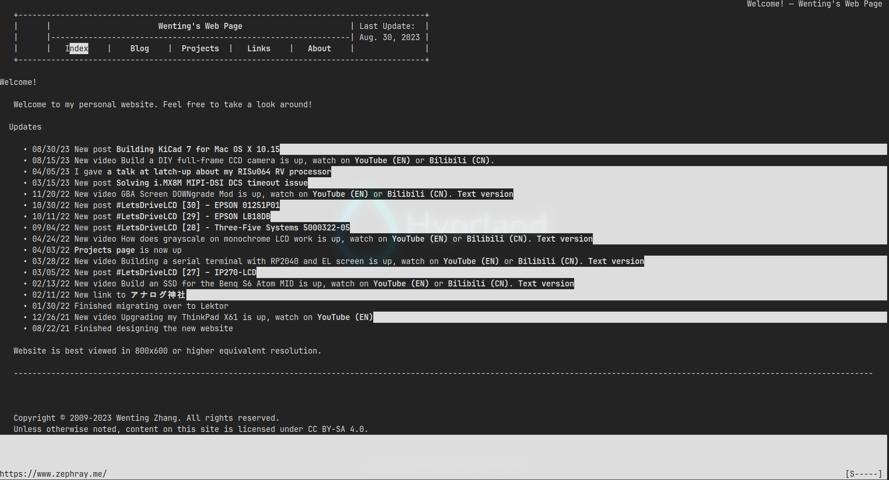

### 1.4.6 带宽测试iperf

在IP网络下测试带宽和延迟使用`iperf`或`iperf3`。其中`iperf`基于Socket开发，支持TCP和UDP；而`iperf3`支持TCP，UDP和SCTP

`iperf`和`iperf3`都需要用户建立一个Server和一个Client，测试结果是这两台主机之间的网络性能

`iperf`使用方法如下

启动服务端

```
$ iperf -s
```

在另一台主机上使用客户端测试，需要指定服务器IP地址

```
$ iperf -c server_ip
```

> `5001`是默认使用的端口。如果需要指定其他端口，使用`-p`

上述示例使用TCP，使用UDP需要加上`-u`

```
$ iperf -u -s
```

```
$ iperf -u -c server_ip
```

`iperf`其他常用选项如下

```
-e              #显示更多信息，例如写数据次数，cwnd/RTT等
-p 5102         #指定服务器监听/客户端连接的TCP/UDP端口号
-b 12M          #限制带宽到指定速度
-i 1            #两次报告输出之间的间隔，单位秒。iperf默认只在结束时报告一次
-l 64K          #指定一次写的数据量。受限于-b
-m              #显示当前TCP的MSS
-w 65535        #TCP窗口大小
-z              #启用TCP实时特性
-Z reno         #指定TCP拥塞算法，可选reno，cubic等

# 客户端常用
-d              #双向测试，使用两个socket
--full-duplex   #双向测试，使用一个socket
-n 32M          #指定传输的总字节数
-t 5            #指定测试时长，默认10
-P 4            #指定客户端线程数，同时进行几个传输
-R              #反向测试，客户端收服务器发
-T 32           #指定ttl
--isochronous 10        #模拟视频数据流
--bounceback            #非连续数据传输，常用于RTT检测
--bounceback-hold 10    #让服务器在每次回复之前等待10毫秒
```

`iperf3`使用方法类似，命令行选项有所不同。服务器无需指定运行TCP，UDP还是SCTP，会自动协商

```
$ iperf3 -s
```

```
$ iperf3 -c server_ip
```

`iperf3`其他常用选项如下

```
-p 5111         #指定服务器监听/客户端连接的端口号
-f K            #显示单位Kbit
-i 1            #两次报告输出之间的间隔，单位秒。iperf3默认1
-V              #显示更多信息

# 服务器常用
--idle-timeout 15       #服务器stuck以后经过15秒创建一个新服务器进程

# 客户端常用
--bidir         #双向测试
-u              #使用UDP
--sctp          #使用SCTP。不常用
-b 512K         #限制传输速率。UDP默认1Mbit/s
-n 32M          #指定传输的总字节数
-t 5            #指定测试时长，默认10
-k 200          #指定传输数据包总数
-l 64K          #指定一次写的数据量
-P 4            #指定客户端线程数，同时进行几个传输
-R              #反向测试，客户端收服务器发
-w 65535        #TCP窗口大小
-C reno         #指定TCP拥塞算法，可选reno，cubic等
-M 500          #指定TCP的MSS大小
-4 -6           #仅使用IPv4/IPv6
-S 213          #设定ToS
--get-server-output     #显示服务器结果
--dont-fragment #TCP不要分块
```

## 2 shell脚本基础

## 2.1 变量

在shell中，除数组外所有变量都使用**字符串**形式存储，包括数字。一个变量是否是数字实际需要程序自身判断其有效性。使用`var="2"`和`var=2`效果相同

### 2.1.1 局部变量

shell下的变量一般使用`$`引用，有时还会习惯加上括号`${}`。代码习惯上局部变量使用小写字母，**只对当前shell可见，对子shell也不可见**，可以使用`set`查看当前的所有局部、用户定义和全局变量

```shell
set
```

设置局部变量，**注意赋值表达式不能有空格**

```shell
my_var=sample
my_var="sample with space"
```

删除局部变量，使用`unset`

```shell
unset my_var
```

**字符Permutation**

shell可以支持如下格式的字符排列组合，**有重要应用**

```shell
echo {1..10}            # 打印 1 2 3 4 5 6 7 8 9 10
echo {a,d,0}            # 打印 a d 0
echo {1..4}{a,b,c}      # 打印 1a 1b 1c 2a 2b 2c 3a 3b 3c 4a 4b 4c
```

在`./configure`中的应用

```shell
# 相当于./configure --enable-optimization --enable-trace --enable-rewind
./configure --enable-{optimization,trace,rewind}
```

**变量展开**

我们在很多脚本中会看到形如`${parameter:-word}` `${parameter:+word}`的变量使用形式。这是shell的变量展开功能，主要用于设置默认值等

| 格式 | 作用 |
| :- | :- |
| `${parameter:-word}` | 如果`parameter`为空或`unset`，返回`word`字面值，`parameter`**值不变**；反之返回`parameter`的值。`word`如果为`${}`格式会展开。例如`${VAR1:-$VAR2}`和`${VAR1:-1000}`，如果`VAR1`为空或`unset`，那么分别返回`VAR2`的值和`1000` |
| `${parameter:=word}` | 如果`parameter`为空或`unset`，返回`word`字面值，**同时将变量**`parameter`**赋值为该值**；反之返回`parameter`的值 |
| `${parameter:+word}` | 如果`parameter`为空或`unset`，返回空；反之返回`word`字面值 |
| `${parameter:?word}` | 如果`parameter`为空或`unset`，将`word`字面值输出到标准错误，并会导致脚本退出。反之返回`parameter`的值 |
| `${parameter:offset}` `${parameter:offset:length}` | 取子字符串，不带`length`表示到结尾，下标从`0`开始。例如`${string:3:4}`表示从字符串`3`字符开始，取长度为`4`字符串并返回。在shell脚本中这在特殊变量`$@` `$*`中也有应用 |
| `${!prefix*}` `${!prefix@}` | 返回所有名称以`prefix`开头的变量，可以使用`for in`依次输出 |
| `${!name[@]}` `${!name[*]}` | 返回数组`name[]`的所有已赋值下标 |
| `${#parameter}` | 返回`parameter`字符串的长度 |
| `${parameter#pattern}` `${parameter##pattern}` | 将`pattern`和变量`parameter`匹配。如果`pattern`匹配上了`parameter`**前段**，那么返回删除该前段后的`parameter`。`#`为最短匹配，`##`为最长匹配。`pattern`不是正则表达式，和文件通配类似 |
| `${parameter%pattern}` `${parameter%%pattern}` | 将`pattern`和变量`parameter`匹配。如果`pattern`匹配上了`parameter`**后段**，那么返回删除该后段后的`parameter`。`%`为最短匹配，`%%`为最长匹配 |
| `${parameter/pattern/string}` `${parameter//pattern/string}` `${parameter/#pattern/string}` `${parameter/%pattern/string}` | 返回`parameter`，将`pattern`的最长匹配部分替换为`string`。第一种表示仅替换第一处，第二种表示替换所有，第三种表示仅从头匹配，第四种表示仅末尾匹配 |
| `${parameter^pattern}` `${parameter^^pattern}` `${parameter,pattern}` `${parameter,,pattern}` | 返回`parameter`，将`pattern`匹配的字符转大或小写。`^`将第一个字符转大写，`^^`全部大写；`,`将第一个字符转小写，`,,`全部小写 |
| `${parameter@U}` | 返回`parameter`，所有字符转大写 |
| `${parameter@u}` | 返回`parameter`，第一个字符转大写 |
| `${parameter@L}` | 返回`parameter`，所有字符转小写 |
| `${parameter@Q}` | 返回`parameter`，将字符串使用`''`括起来 |

### 2.1.2 全局变量

全局变量对一个shell的所有子进程可见，但是对其他进程（包括父进程）不可见

设置全局变量，必须在当前shell将一个局部变量使用`export`设定为全局变量（才能被子进程使用），**注意赋值表达式不能有空格**

```shell
MY_VAR="sample global"
export MY_VAR
export MY_VAR2="sample global"
```

全局变量只能使用`unset`在父进程删除

**环境变量**

环境变量属于全局变量。可以使用`env`查看当前环境变量，`printenv`也可以用于查看个别变量，也可以通过`echo`返回使用`$`引用的变量

`/etc/profile`以及`/etc/profile.d`中设定的是login shell的变量；在带有PAM的系统中，可以在`/etc/environment`中使用键值对或`/etc/security/pam_env.conf`中（ArchLinux中`~/.pam_environment`已经废弃）设定环境变量；bash启动时设定的变量可以在`/etc/bash.bashrc`以及`~/.bashrc`更改（建议只更改当前用户的，尽量不要更改`/etc`下的文件）。login shell会执行`profile`，新建的bash会执行`bashrc`

```shell
env
env EDITOR=vim xterm # 启动xterm时将EDITOR临时设定为vim，不会影响上层的EDITOR变量
printenv HOME
echo $HOME
```

如果只是想要更改当前用户的环境变量，建议更改`~/.bashrc`达到效果，如下示例

```shell
# ~/.bashrc

export PATH="${PATH}:/home/my_user/bin"
```

> `~/.bashrc`改完可以`source`一下生效

如果只是想要更改当前用户在启动图形界面时的环境变量，可以更改`~/xprofile`（大部分DM），`~/.xinitrc`（startx），`~/.xsession`（XDM）达到目的，如下示例

```shell
# ~/.xinitrc

export PATH="${PATH}:/home/my_user/bin"
```

常用环境变量：

| 名称 | 定义 |
| :-: | :-: |
| `SHELL` | 默认shell |
| `HOME` | 当前用户主目录 |
| `PATH` | shell用于查找命令的路径，追加方法：`PATH=$PATH:my_path`。有些发行版为`/etc/profile.d`中的脚本提供了`append_path`shell函数，示例`append_path '/opt/xxx/bin'` |
| `USER` | 当前用户 |
| `PS1` | 命令提示符格式 |
| `MANPATH` `INFOPATH` | Manual和Info路径 |

个人常用`PS1`显示配置

```shell
PS1='[\[\e[32;1m\]\u\[\e[0m\]@\[\e[32;1m\]\h \[\e[33;1m\]\A\[\e[0m\] \W]\[\e[31;1m\]\$\[\e[0m\] '
```

**bash相关变量（只可通过$引用）**

| 名称 | 定义 |
| :-: | :-: |
| `UID` | 当前用户ID |
| `BASH_SUBSHELL` | shell嵌套级别 |
| `BASHPID` | 当前bash的PID |
| `COLUMNS` | 当前终端可用宽度 |
| `HOSTNAME` | 当前主机名 |
| `HOSTTYPE` | 当前使用主机的CPU指令集 |
| `LINENO` | 当前执行的行号 |
| `OLDPWD` | 之前的目录 |
| `PPID` | 父进程PID |
| `PWD` | 当前目录 |
| `RANDOM` | 返回一个0~32767的随机数 |
| `SECONDS` | 启动shell到现在的秒数 |
| `MACHTYPE` | 平台类型，包括CPU指令集，操作系统内核等，例如`x86_64-pc-linux-gnu` |

### 2.1.3 结构变量

数组：本质是哈希表，定义时使用圆括号将多个值括起来。可以使用下标访问，修改或使用`unset`置空。下标可以为任意值，例如数字或单词等。但是注意不是所有shell都对数组支持良好

```
myarray=(one two three four)
echo ${myarray[0]}
echo ${myarray[*]}
myarray[final]="five"
```

### 2.1.4 shell脚本中的引号

**重点**

shell脚本中不同的引号`' '`以及`" "`具有不同的作用。**单引号不会对内含**`$var`**格式的变量进行展开，保留字面义**。而**双引号内含**`$var`**格式的变量会被展开转换为当前值**

示例

```shell
var='Hello world'
echo "$var" # 输出Hello world
echo '$var' # 输出$var
```

引号在一个变量含有空格时非常有用，尤其是在实际的文件处理中，很多文件路径都会带有空格，这时就不得不使用引号

## 2.2 Shell脚本基本构成

脚本使用`#!`指定shell程序，使用`#`将一行注释

```shell
#!/bin/bash
# This is a comment
```

假设要显示指定字符，使用echo命令即可，如果不想换行可以添加`-n`

```shell
echo This is a test
echo -n This is a test
echo "This is a 'test'"
```

## 2.3 使用一个命令的输出结果

可以使用`$()`将想要的命令括起来，并取其输出。可以将命令的输出赋值到一个变量

```shell
output=$(ls -a)
output=`ls -a`
```

一个实用的例子，就是自动命名文件

```shell
name=log-$(date +%m%d%H%M%S).txt
touch $name
```

## 2.4 重定向

### 2.4.1 输出重定向

将命令的输出重定向到一个文件

```shell
ls -a > ls.txt #新建或覆写
ls -a >> ls.txt #追加到文件尾
```

### 2.4.2 输入重定向

将文件重定向到一个命令的标准输入，比如用于统计字数的wc命令

```shell
wc < test.txt
```

内联重定向，可以指定输入的终止符，到达终止符后命令即停止并输出结果

```shell
wc << END
> string1
> string2
> END
```

其中，次提示符由`$PS2`指定，这里是`>`

## 2.5 管道

管道可以看作内存中的一个FIFO，将一个程序的标准输出连接到另一个程序的标准输入。

```shell
ls /bin | less #使用查看/bin下的文件
```

```shell
xz -dkc package.tar.xz | tar -xv #解压缩，和tar -Jxvf作用等价
```

## 2.6 整数、浮点以及字符串运算

### 2.6.1 传统的Bourne shell格式

使用`expr`，结果通过标准输出返回

```shell
expr arg operator arg

# 可用运算符
# 算数运算（返回运算结果）： + - * / %
# 逻辑运算（返回一个arg值）： & |
# 比较运算（返回整数0或1，分别代表否或是）： > >= < <= == !=
```

注意，所有在shell中有特殊含义的运算符，比如`*`，`/`，`&`，`|`，`>`，`<`都要加上转义符`\`才可正常工作

```shell
# 字符串运算

# 匹配正则表达式，返回匹配到的符合的字符串的字符数总和
expr STRING : REGEXP
expr match STRING REGEXP

# 子字符串，返回从START开始的LENGTH个字符，索引从1计数
expr substr STRING START LENGTH
# 例如 expr substr hello 1 4 返回hell

# 计算字符串长度
expr length STRING

# 查找一个CHARS第一次出现的位置
expr index STRING CHARS
# 例如 expr index hello l 返回3
```

### 2.6.2 bash支持的替代写法

使用`$[]`，**特殊符号不需要转义**

```shell
var=$[num operator num]

# 例如sample=$[($var1 + $var2) * $var3]
```

### 2.6.3 双括号

常用，`(())`用于算术以及逻辑运算， `[[]]`用于字符串比较，只有返回值，见if-then判断部分

### 2.6.4 浮点计算

以上方法仅适用于整数运算，浮点运算需要使用专用的工具，在类UNIX系统下常见的有`bc`

使用`bc`时必须对内建变量scale赋值，以指定小数点位数

使用命令替换，`echo`配合管道符

```shell
var=$(echo "scale = 2; var1 = 3; var2 = 7; var1 + var2 + 5.33" | bc)
```

使用内联输入重定向

```shell
var=$(bc << EOF
    scale = 2
    var1 = 3
    var2 = 7
    var1 + var2 + 5.33
    EOF
)
```

## 2.7 退出状态

可以使用变量`$?`查看上一个命令的退出状态

```shell
echo $?

# 常见状态码
# 成功 0
# 一般未知错误 1
# 不适合的shell命令 2
# 命令无法执行 126
# 命令未找到 127
# 已通过^C终止 130
# 正常退出码之外的状态码 255
```

也可以使用`exit`指定退出码

```shell
exit 5
```

## 2.8 判断

if-then结构，如果`if`之后的命令成功运行（注意是返回0，且只能是命令），则执行`then`之后的语句

```shell
if CMD
then 
    CMDs
elif CMD
then 
    CMDs
else
    CMDs
fi
```

或习惯写法

```shell
if CMD; then
    CMDs
elif CMD; then
    CMDs
else
    CMDs
fi
```

`if`之后的命令可以使用`test`以实现条件满足性的检测，比如一个变量是否为空

```shell
if test $var
then 
    CMDs
fi
```

以上用法不常用，一般还是使用方括号的格式替代`test`命令

```shell
if [ condition ]
then
    CMDs
fi
```

并且可以使用`&&`或`||`进行与或运算

```shell
if [ condition1 ] && [ condition2 ]
then 
    CMDs
fi
```

> 对于`&&`，只有当前面一条命令返回`0`才会执行后面一条命令。而对于`||`，只有前面一条指令返回非`0`才会执行后面一条指令。在shell编程中有时可以利用这种特性

`test`语句可以`!`取反

```shell
if [ ! condition ]
then
    CMDs
fi
```

常用的除if-then以外，判断结构同样支持类似其他语言的`case`

```shell
case $var in 
    pattern1 | pattern2)
        CMDs;;
    pattern3)
        CMDs;;
    *)
        CMDs;;
esac
```

case只可以使用变量作为其判断依据，并且可以使用或运算`|`

### 2.8.1 整型数值

整型数值比较，shell不使用大于小于号

```shell
n1 -eq n2 # 相等
n1 -gt n2 # 大于
n1 -ge n2 # 大于等于
n1 -lt n2 # 小于
n1 -le n2 # 小于等于
n1 -ne n2 # 不等于
```

示例

```shell
if [ $var -eq 1 ]
then 
    var=$[$var + 1]
fi
```

### 2.8.2 字符串比较

注意大于小于号必须要在前面添加转义符。另外，字符串的比较是根据ASCII的顺序，大写字母被认为小于小写字母

```shell
str1 = str2     # 相等
str1 != str2    # 不相等
str1 \< str2    # 小于
str1 \> str2    # 大于
-n str1         # 长度非0
-z str1         # 长度0
```

示例

```shell
if [ $str1 \> $str2 ]
then 
    echo $str1
fi
```

### 2.8.3 文件处理

```shell
-e file             # 存在
-d file             # 存在并且是一个目录
-f file             # 存在并且是一个文件
-s file             # 存在并非空
-r file             # 存在并可读
-w file             # 存在并可写
-x file             # 存在并可执行
-O file             # 存在并属于当前用户
-G file             # 存在且属于当前用户默认组
file1 -nt file2     # file1比file2新
file1 -ot file2     # file1比file2旧
```

示例

```shell
if [ -f file.txt ]
then 
    rm -f file.txt
fi
```

### 2.8.4 双括号

格式：使用`(())`和`[[]]`

**双圆括号**`(())`语句一般用于特殊算术逻辑运算以及比较赋值，支持位运算。可以在`if`之后以及作为一般语句使用。可以替代`test`以及其等价`[]`，但它不是`test`

```shell
if (( $var1 == $var2 ** 2 ))
then 
    (( var1 = $var2 + 1 ))
fi
```

如上，双括号在一般语句中用于赋值，而在`if`之后用于比较，因为其所有的执行仅返回执行码。可以使用的算术符号如下，不需要转义

| 符号 | 类型 |
| :-: | :-: |
| `+ - * / % **` | 一般算术符（`**`求幂） |
| `! && \|\|` | 逻辑运算 |
| `~ & \| << >>` | 位运算 |
| `< > == != >= <=` | 比较 |
| `=` | 赋值 |
| `val++ val-- ++val --val` | 加一或减一 |

**双方括号**`[[]]`用于字符串比较，返回执行结果码（不是所有shell都良好支持）

```shell
if [[ $str == e* ]]
then 
    echo "yes"
fi
```

其中`e*`是一个pattern

> 说到这里，shell中这么多类型括号的使用非常令人迷惑。整理一下：
>
> `${}`将一个变量括起来，起展开变量的作用，常用于数组变量
>
> `$()`用于提取一个命令的执行结果输出，常用于赋值，可以使用` `` `替代
>
> `$[]`可以看成`expr`的等价，用于计算整数以及比较，通过标准输出返回结果
>
> `{}`用于一个命令区块，执行一串命令
>
> `()`用于命令列表，使用`;`分隔，也用于定义一个数组变量
>
> `[]`可以看成`test`的等价，用于处理整数、字符串以及文件相关，返回执行结果码
>
> `(())`用于整数运算、特殊运算、赋值以及比较，返回执行结果码，但是并不是`test`的等价
>
> `[[]]`用于字符串比较，返回执行结果码

## 2.9 迭代/遍历

一般使用`for`进行迭代。**由于需要对迭代变量进行赋值，这里的变量不添加引用符**`$`，这和`case`不同，不要将两者混淆。另外`for`的迭代变量在迭代后会一直保持有效

```shell
for var in list
do
    CMDs
done
```

`for`还可以使用shell展开的通配符，用于遍历文件，这是`for in`的又一大常用应用

```shell
for i in /dir/*
do 
    file $i
done
```

示例

```shell
for i in GNU\'s NOT Unix 
do
    echo $i
done
```

```shell
string="GNU's NOT Unix"
for i in $string
do 
    echo $i
done
```

结果

```
GNU's
NOT
Unix
```

> 注：在默认情况下，bash将空格，制表符，以及换行符作为字段分隔的依据，这样导致`for`遇到含空格的变量后就会出现问题。可以有两种问题解决，一个是使用`" "`，另一个是修改`$IFS`变量

示例

```shell
for i in GNU\'s "N O T" Unix
do 
    echo $i
done
```

或在bash下

```shell
IFS=$'\n' # 将换行符'\n'作为唯一字段分隔符
IFS=$'\n':; # 将'\n'以及冒号、分号作为字段标识符。使用冒号可以在读取例如/etc/passwd时发挥妙用
```

## 2.10 循环

### 2.10.1 C风格for

C风格的`for`的使用方法是特制的，这里的双括号不是前面的双括号

```shell
for (( i=1, j=15; i < 11; i++, j-- ))
do
    echo $i,$j
done
```

如上，C风格`for`支持**多于一个循环变量**

### 2.10.2 while

`while`使用和if-then相同的`test`命令，根据执行返回的状态码判断是否继续循环

```shell
while CMD
do
    CMDs
done
```

如下，`while`之后可以跟多个测试命令

```shell
while echo $i
    [ $i -ge 1 ]
do
    echo "message"
    i=$i-1
done
```

### 2.10.3 until

`until`和`while`格式相同，区别在于`until`**只在当测试命令返回异常（非0）时才继续循环，当测试命令返回0时才终止**（因为返回码无法取反）

```shell
until [ $i -gt 15 ]
do
    i=$i+1
done
```

### 2.10.4 break

`break`是一个语句，用法和C语言中的`break`同理，区别是可以通过`break n`指定要跳出的循环层级数

示例

```shell
while [ $i -ge 0 ]
do
    j=4

    while [ $j -ge 0 ]
    do
        if [ $i -eq 3 ]
        then 
            break 2
        else
            j=$j-1
        fi
    done

    i=$i-1
done
```

### 2.10.5 continue

`continue`同样和C语言中的`continue`同理，如果满足一定条件就会跳过之后的命令

示例

```shell
while [ $i -ge 0 ]
do
    if [ $i -eq 5 ]
    then
        i=$i-1 
        continue
    else
        i=$i-1
    fi
done
```

### 2.10.6 处理输出

可以将一个循环的输出统一处理，通过重定向或管道

示例

```shell
while [ $i -ge 0 ]
do
    echo "This is $i"
    i=$i-1
done > test.txt
```

管道同理

## 2.11 用户输入

### 2.11.1 命令行参数

shell使用`$#`获取输入的命令行参数数量（`0`或正整数，不包含命令本身），使用`$0`引用执行当前命令时的输入（比如`./test.sh`），使用`$1`引用第1个命令行参数，使用`$2`引用第2个命令行参数，以此类推。命令行参数默认使用空格作分隔，如果要传入带空格的参数就要使用引号

脚本的名称可以使用命令`basename $0`提取，通常用于创建两个名称不同而内容相同的脚本，用于功能区分

此外，**最后一个命令行参数可以使用**`${!#}`**提取**（花括号以内不可以使用`$`，只能使用`!`代替）

> 使用不符合要求的命令行参数会导致脚本出错。为提高程序健壮性，要养成对参数做有效性检查的习惯，比如使用`[ -n $1 ]`检查参数是否为空

### 2.11.2 遍历所有参数

遍历参数除了直接使用`$#`和`$1`等之外，还可以使用`$*`以及`$@`。两者都记录了所有参数，但是`$@`更加常用。`$@`将所有输入参数作为一个字符串中的单独单词，可以使用迭代`for`对其进行遍历访问。而`$*`则相反，将所有参数作为一个整体，需要使用特殊方式访问

示例

```shell
for i in "$@"
do 
    echo $i
done
```

使用`shift`指令遍历

`shift`可以将从`$1`开始的所有参数向左移动一格，这也是一种遍历的方法

可以加上一个数字，使用`shift n`指定移动次数

示例

```shell
while [ -n $1 ]
do 
    echo $1
    shift
done
```

### 2.11.3 选项与参数处理：getopt

用法

```
getopt <optstring> <option | parameter>
```

一般命令行参数可以使用`case`语句处理，可以将除所有选项以外的输入（参数）列入`*)`处理（比如返回提示"Invalid command"）

> 在Linux下，选项和参数之间一般使用`--`分隔

可以使用`getopt`，或它的高级版本`getopts`，对命令行输入进行标准格式化。由于一般的命令行参数可以连用选项，比如`-a -f`可以连写成为`-af`，这样使用传统的方法就很难判别了。`getopt`就是用于对输入参数进行规范化

在规定字符串中，如果一个选项`-b`之后需要带参数，可以其之后添加`:`，形式如`b:`

示例

```shell
getopt -q ab:cd -a -b param1 -cd param2 param3
set -- $(getopt -q ab:cd "$@")

# 选项
# -q 不输出
```

输出结果，其中选项`-b`参数为`param1`，后面`param2 param3`都是附加参数

```shell
-a -b 'param1' -c -d -- 'param2' 'param3'
```

`getopt`局限就在于不能恰当的处理带引号和空格的参数。

### 2.11.4 选项与参数处理：getopts

`getopts`可以对命令行输入依次进行处理，会使用到两个临时环境变量`$OPTARG`和`$OPTIND`，分别代表当前option对应的argument值以及当前正在处理的命令行参数位置（不包含命令，从2开始，每过一个argument或option增加1）

`getopts`在每次解析成功一个指定的option之后会返回0。optstring格式同`getopt`，如果需要argument就在对应option后面加`:`。在optstring开头添加`:`可以禁止`getopts`本身的报错输出

> 经过测试，一个option之后的argument是否为空只能使用`[ -z $OPTARG ]`判定，而不能使用`[ -n $OPTARG ]`判定。并且所有option之前添加的`-`都会被去除

示例

```shell
while getopts :ab:c opt 
do 
    if [ -z $OPTARG ]
    then 
        echo "Option $OPTIND : No argument"
    else
        echo "Option $OPTIND : $OPTARG"
    fi
done
```

> `$opt`中存放的是当前处理的option，`$OPTARG`中才是当前option后面跟的argument（如果有）

补充：Linux程序设计中约定俗成的参数定义

```shell
-a # 所有
-d # 后接指定目录
-f # 后接指定文件
-h # 显示帮助信息
-l # 长格式
-o # 指定输出文件
-q # 安静模式
-r # 递归处理目录
-v # 输出详细信息：verbose
-x # 排除一个对象
-y # 交互模式中，所有选项都回答yes
```

### 2.11.5 获取用户交互输入：read

使用方法

```shell
read opt1 opt2
read -p "Enter your option : " opt1 opt2
```

`read`通过标准输入读取输入字符串并将其赋值到指定变量，输入以空格为界。**如果变量数不够那么所有剩余变量都会被赋值给最后一个变量**。通过`-p`参数指定提示符

如果在`read`之后不指定变量，那么输入就会自动赋值给`$REPLY`

可以使用`-t`参数添加一个超时，超时后返回一个非零值

```shell
if read -t 5 opt
then
    echo $opt
else
    echo "No input"
fi
```

可以使用`-n1`指定输入一个参数以后就继续，无需回车

```shell
read -n1 opt
```

**从文件读取**

```shell
cat test.txt | while read line
do
    echo $line
done
```

## 2.12 输入输出以及重定向

在一个shell进程中，文件描述符为0~8的非负整数，是一个指针，指向实体文件或设备。其中0、1、2前3个描述符为保留，分别为`STDIN STDOUT STDERR`

**默认情况下STDERR和STDOUT使用的文件描述符不同，但通常这些文件描述符都指向同一个位置**

### 2.12.1 STDERR重定向

可以使用`n>`指定一个文件描述符对应的重定向文件，这样可以使用`2>`重定向标准错误到一个错误日志文件

```shell
ls badfile 2> error.log
```

想要重定向`STDOUT`和`STDERR`到两个文件，很简单，只要连用就可以了

```shell
ls -R /home 2> error.log 1> out.log
```

如果想重定向所有文件描述符到同一个文件，可以使用`&>`

**注意在bash中，标准错误的信息优先，会被重定向到标准输出行的前面**

```shell
ls -R /home &> all.log
```

而如果想要**将标准输出重定向到标准错误（注意不是输出到一个日志文件）**，也是可以实现的，使用`>&2`即可

```shell
echo "Redirect to STDERR" >&2
```

这样在`./test.sh 2> error.log`时该行命令输出也会被重定向到错误文件

### 2.12.2 永久重定向：文件描述符到文件

可以使用`exec n>`指定整个脚本运行中一个文件描述符对应的重定向文件

```shell
exec 1> output.log
exec 2> error.log
```

如果使用`exec n>>`，那么就会将重定向内容追加到文件末尾

```shell
exec 1>> output.log
```

同样，输入重定向也是使用类似方法。**这样在read试图从标准输入读取时可以从重定向文件读取，这在使用文件输入时很实用**

```shell
exec 0< input.txt
```

也可以将输入输出重定向指向同一个文件

这时要注意，**此时读写使用同一个指针，本次操作会在上一次操作结束位置之后开始操作，无论读写**

```shell
exec 3<> io.txt
```

### 2.12.3 永久重定向：文件描述符到文件描述符

文件描述符之间的重定向格式，将3重定向到1指向的对象（显示器），将4重定向到0指向的对象（键盘输入）

> 技巧：`>&`和`<&`的使用看起来可能比较难以理解。可以这样看：`3`和`1`都可以看作指针，当前`1`指向标准输出（即显示器），而`3>&1`相当于使`3`指向显示器。之后假设`1`被重定向到一个文件，`3`依然指向显示器不变。这在临时重定向保存指针时很有用

```shell
exec 3>&1
exec 4<&0
```

可以使用`-`代指空指针，用于置空一个文件描述符，关闭一个文件描述符

```shell
exec 3>&-
```

在关闭文件描述符以后，shell维护的文件指针会被销毁。如果再次打开同一个文件，操作会从头开始

### 2.12.4 lsof列出打开的文件描述符

使用`lsof`，显示指定用户或进程当前使用的文件描述符对应的文件名（可以是终端，普通文件等），可以查看端口被哪些程序占用

```shell
lsof -a -p PID -d n,n,n

# 命令行选项
# -a  求-p和-d过滤的交集
# -p  指定PID，使用$$引用当前shell的PID
# -d  指定文件描述符
# -i  查看指定TCP或UDP端口。-i tcp:8080查看占用TCP 8080端口的进程，udp:232同理，仅指定tcp或udp查看对应所有网络连接

# 显示信息
# COMMAND 命令名
# PID     当前进程PID
# FD      对应文件描述符以及读写模式。如1u代表文件描述符1使用读写模式，2w代表文件描述符2使用写模式
# TYPE    指向文件类型，CHR字符设备，BLK块设备，DIR目录，REG一般文件
# NAME    指向文件名
```

### 2.12.5 使用/dev/null丢弃命令的标准输出

Linux以及其他类Unix中有一个特殊的文件`/dev/null`，可以将输出重定向到这里销毁，也可以用于日志文件清除

```shell
echo "No output" > /dev/null
cat /dev/null > log.txt
```

## 2.13 临时文件以及目录

类Unix系统一般都可以在开机时清空`/tmp`，可以使用`mktemp`在`/tmp`创建临时文件或目录而不用担心日后的清理问题

```shell
mktemp

# 命令行选项
# -t  强制在/tmp下创建
# -d  创建目录而非文件
```

> 可以使用类似`TEMPDIR=$(mktemp -d)`记录创建的目录，方便后续使用

默认情况下，单独使用`mktemp`而不使用任何参数会在`/tmp`下创建一个类似`tmp.7RaVm6YsN3`的文件。也可以指定文件位置，甚至可以使用模板格式让`mktemp`自动命名文件。可以将`mktemp`返回的文件名赋值给一个变量，之后使用该文件

```shell
mktemp log.XXXXXX # 在当前目录创建文件，自动命名
```

## 2.14 使用tee分流输出到文件以及显示器

如果想要同时输出到一个文件以及标准输出（显示器），可以使用`tee`分流，相当于T型接头。`tee`将其获取的标准输入同时输出到显示器以及一个指定文件

```shell
echo "This is a log test" | tee log.txt
```

## 2.15 函数

同其他编程语言，shell也可以使用函数编程，也可以封装成库使用。当然shell不能面向对象

### 2.15.1 函数基本格式

定义一个函数格式如下，`()`是摆设。**注意，函数定义必须在函数调用之前，否则会出错**

shell脚本是一种面向过程的语言，**一个函数可以重复被定义，每次定义之后调用的都是最近定义的版本**

**shell的函数支持递归**

```shell
function funcname {
    CMDs
}

function funcname() {
    CMDs
}
```

### 2.15.2 函数：全局变量和局部变量

**shell的变量使用和C以及其他传统编程语言有较大差别，本节划重点**

**全局变量**

在shell中，使用默认方式创建的变量**都是全局变量**，无论这个变量是在函数内还是在函数外，都可以在脚本内任何地方访问

```shell
function func {
    var="You can use it anywhere"
}

echo $var
```

**局部变量**

函数内局部变量的申明需要加上`local`关键字

```shell
function func {
    local var="You can't use it outside the function"
}
```

### 2.15.3 函数执行返回值

shell将每一个函数当作一个小型脚本看待，默认情况下，函数的执行返回值为最后一个命令的返回值，使用`$?`引用

和C语言一样，shell也可以使用`return`语句指定最终执行返回值`0~255`

另外注意，如果想要取一个函数的返回值，就不能在函数结束之后执行任何语句，否则会刷掉之前的`$?`

```shell
function func {
    if [ -f test.txt ]
    then
        return 0
    else
        return 1
    fi
}
```

### 2.15.4 函数结果返回值

在函数最后使用`echo`通过标准输出返回函数结果。如果要输出到标准输出，比如`read`可以使用`read -p "Input" var`以输出提示信息到标准输出，因为bash只认使用`echo`返回的值。这同时也要注意不能滥用`echo`，否则会导致返回结果的异常

```shell
function func {
    echo "This is the result"
}

var=$(func)
```

### 2.15.5 函数参数

正是由于shell将函数当作子脚本看待，所以函数也可以使用命令行的参数传递方法，也可以在函数内使用`$#`引用参数数量，使用`$1`引用参数等。这里引用的变量不是传给脚本的变量

示例

```shell
function func {
    if [ $# -eq 1 ]
    then 
        echo $1
    else
        echo -1
    fi
}

func 9 # 调用函数，返回值
var=$(func 12)
```

### 2.15.6 数组参数以及结果

在函数中使用数组不是很容易。

**数组作为输入参数的使用**

如果在函数中直接通过`$@`和`$1`使用数组变量，只能引用到第一个变量，以下为反例

```shell
function func {
    for var in $@ # 试图通过$@引用数组所有变量，失败，只引用到第一个变量
    do 
        echo $var
    done

    out=$1 # 试图通过$1引用数组并赋值给一个变量，失败，只引用到第一个变量

    echo "${out[*]}"
}
```

正确的方法是使用一定方法将数组拆分，再`echo`所有数值，添加括号赋值给一个数组变量

示例

```shell
function func {
    local newarray
    newarray=($(echo $@)) # 参数不能有空格，最外层括号相当于给echo的返回结果加上一层括号，为数组赋值方式
    echo ${newarray[*]}
}

array=(1 2 3 4 5)
func ${array[*]} # 注意一定要使用数组的通配遍历方法将数组传递给函数
```

**数组作为输出结果的使用**

想要返回一个数组也是同理

示例

```shell
function func {
    local array=(1 2 3 4 5)
    echo ${array[*]}
}

output=($(func))
echo ${output[*]}
```

技巧：在shell中使用数组变量，主要就是**使用通配遍历拆分数组**以及**赋值时括号的添加**

### 2.15.7 使用库

使用常规方法直接在脚本之下运行库文件是没有用的，因为**运行时函数被定义在了子shell之下，无法在当前shell使用**

想要使用库需要使用`source`使其在当前脚本所在shell运行

```shell
source ./lib.sh
```

或`source`的缩写`.`

```shell
. ./lib.sh
```

## 2.16 脚本作业控制

包含了脚本中信号的使用，后台运行，以及优先级调整

**预备知识：Linux中进程的几种状态以及操控信号**

之前在系统管理章节讲到`ps`命令时已经了解过了Linux下的几种状态，这里再使用表格形式展示一遍

| 状态 | 名称 | 描述 |
| :-: | :-: | :-: |
| R | Running           | 进程正在运行或可执行（Ready），教科书一般将这两种状态分开，Linux下算作一种状态 |
| D | Uninterruptible   | 不可中断睡眠，不会处理任何信号，不能使用kill -9终结，常见于不可中断的重要进程，比如传输 |
| S | Interruptible     | 可中断睡眠，一般由于进程等待某事件发生，收到信号后即恢复运行 |
| T | Stopped/Traced    | 停止态或跟踪态，停止态进程依旧停留在内存并且可以从断点处继续执行，跟踪态常见于使用gdb等调试断点时 |
| X | Exit-Dead         | 退出态，进程即将销毁，一般捕捉不到 |
| Z | Exit-Zombie       | 退出态，僵尸进程，一般是进程退出后PCB还驻留在内存，可能是等待父进程来读取信息 |

这里再引用一张图表示Linux下进程的调度过程


Linux下操控进程常用的信号（使用`kill`或`killall`加对应序号）

| 值 | 名称 | 描述 |
| :-: | :-: | :-: |
| 1     | SIGHUP    | 挂起，用于通知进程其控制终端已关闭，行为可由软件开发者定义，默认行为终止 |
| 2     | SIGINT    | 普通中断信号，行为可由开发者定义，默认行为终止 |
| 3     | SIGQUIT   | 退出，默认行为终止并生成core dump |
| 9     | SIGKILL   | 无条件终止，行为不可由开发者定义，无处理过程 |
| 15    | SIGTERM   | 尽可能终止，行为可以由开发者定义，有处理过程 |
| 17    | SIGSTOP   | 无条件停止，行为不可由开发者定义，无处理过程 |
| 18    | SIGTSTP   | 尽可能停止，行为可以由开发者定义，有处理过程 |
| 19    | SIGCONT   | 停止后继续运行 |

可以通过`jobs`查看当前已暂停或正在运行的脚本，带`+`的是当前默认控制的进程，带`-`的是下一个

```shell
jobs

# 命令行选项
# -l  显示PID和作业号
# -p  仅显示PID
# -r  仅运行中
# -s  仅已停止
# -n  仅改变过状态
```

### 2.16.1 使用以及捕获信号

除`SIGKILL`以及`SIGSTOP`强制退出或停止进程以外，向进程发送信号后的反应**要看程序对各种信号的具体处理行为方式**。一般日常开发的可执行程序**其实都已经定义了应对各种标准信号的默认行为**，可以在自己设计的程序中定义行为

可以在一个命令或脚本运行时通过`kill`或快捷键向进程发送信号

```shell
kill -9 2401 # 无条件终止PID=2401的进程
```

**Ctrl+C:** 发送`SIGINT`

**Ctrl+Z:** 发送`SIGTSTP`

可以在脚本中使用`trap`命令重定义接收到信号的行为，基本格式如下：

```shell
trap CMDs signals
```

示例

```shell
trap "echo 'Interrupted'" SIGINT
trap "echo 'Another interrupt'" SIGINT # 可以重定义行为
trap -- SIGINT # 移除行为
```

在一个shell脚本执行结束时shell进程会给自身发送一个特殊的`EXIT`信号，也可以捕获并在退出时执行语句

```shell
trap "echo 'Exit...'" EXIT
```

### 2.16.2 后台运行

之前已经讲过了后台运行的方法，后台运行的`STDOUT`和`STDERR`依然会在当前终端输出

```shell
./script.sh &
./script.sh > out.txt & # 重定向输出
```

这里补充可以使脚本在终端退出以后依然可以运行的方法

可以使用`nohup`使脚本不受关闭终端的影响，其实相当于是阻断了所有发送到该进程的`SIGHUP`信号，注意此时进程的输出会被重定向到`nohup.out`文件

```shell
nohup ./script.sh &
```

另外，可以使用`bg`继续已停止的后台作业

```shell
bg 3 # 作业号由jobs获得
```

反之，在前台重启，使用`fg`

```shell
fg 3
```

### 2.16.3 优先级以及谦让度

操作系统中程序是按照时间片轮转调度的。优先级越高，基本代表着操作系统分配给该程序的时间片越多，该程序可以获得更多计算资源，可以更快地执行

在Linux中，优先级使用`-20`到`19`表示，**数字越大优先级越低（相当于nice级别）**，Linux中一个程序启动时默认优先级为0

可以使用`nice`或`renice`调节优先级

```shell
nice -n 10 ./script.sh # 启动时指定优先级，普通用户只能指定更低的优先级（不小于0）
```

`renice`用于调节一个正在运行进程的优先级

```shell
renice -n 10 -p 5537 # 调节PID=5537优先级到10，普通用户只能指定更低的优先级
```

### 2.16.4 设置预约运行

`at`用于指定作业运行时间，为POSIX命令，在类Unix系统一般都可以使用

`at`对应后台daemon`atd`会在每分钟检查`/var/spool/at`以确定是否有已提交的作业要运行。**作业被提交到作业队列中，一共26个队列（a-z），a优先级最低**

```shell
at -f ./script.sh -q a TIME

# TIME格式
# 23:59   时分表示
# 3:15 PM 使用AM/PM指示符
# now     立即执行
```

`at`通过email应用发送脚本输出，需要在脚本中重定向，可以使用`-M`屏蔽输出

可以使用`atq`显示当前正在等待的命令


### 2.16.5 设置定时任务

使用`cron`定时运行任务

**Linux**

在Archlinux常用的cron有`cronie`和`fcron`。只能使用两者其一，以`cronie`为例

```shell
# cronie依赖于opensmtpd的sendmail命令发送email。cronie包含了anacron
sudo pacman -Ss cronie opensmtpd
```

> 安装完成后，`ls /etc`可以发现多出了`cron.d cron.deny cron.hourly cron.daily cron.weekly cron.monthly anacrontab`等配置相关目录以及文件。其中`cron.hourly`下有一个定时任务`0anacron`，`anacron`支持异步执行定时任务（解决任务由于关机而未得到执行的问题）
>
> SMTP配置文件位于`/etc/smtpd/smtpd.conf`无需更改。默认使用maildir而非mbox。通过以下命令可以测试SMTP是否可用

```shell
sudo systemctl start smtpd
echo "Mail test" | sendmail username # username为当前主机中的用户名
sudo systemctl enable smtpd # 可以使能smtpd开机自启
```

> 执行完以上命令就可以在`/home/username/Maildir`中找到发送的邮件
>
> crontab的文件格式一般为6列，依次为`minute hour day_of_month month day_of_week command`。其中除`command`以外所有参数都为数字表示，使用`*`作为通配符表示所有数字，使用`,`分隔多组数字，使用`-`表示一个数字范围，使用`/`表示执行的频率
>
> 示例`*/5 0-1,12-13 * 4-6 1-5 myscript.sh`，表示在每年的4至6月的工作日的00:00至01:55，12:00至13:55每隔5分钟执行一次脚本。`command`之前的参数也可以部分省略，例如`minute hour command`的形式
>
> 此外还可以使用`@reboot @yearly @monthly @weekly @daily @hourly`等关键词进行定时任务

crontab不能使用编辑器手动编辑，应当使用`crontab`编辑（使用`crontab -l`列出当前用户的crontab，`crontab -r`删除当前用户的crontab）

```shell
export EDITOR=vim # 可以指定编辑器
crontab -u username -e # 使用-u可以指定用户
```

anacron在每个小时都会被cronie调用（`/etc/cron.hourly/0anacron`）来检查并执行cronie未在指定时间执行的任务，只能使用编辑器编辑`/etc/anacrontab`，执行频次控制到天，其默认内容一般如下（该默认配置下，需要将用户的定时脚本放置在`/etc/cron.daily`等文件夹下）

```
# environment variables
SHELL=/bin/sh
PATH=/sbin:/bin:/usr/sbin:/usr/bin
MAILTO=username
RANDOM_DELAY=30
# Anacron jobs will start between 6am and 8am.
START_HOURS_RANGE=6-8
# delay will be 5 minutes + RANDOM_DELAY for cron.daily
1		5	cron.daily		nice run-parts /etc/cron.daily
7		0	cron.weekly		nice run-parts /etc/cron.weekly
@monthly	0	cron.monthly		nice run-parts /etc/cron.monthly
```

> `RANDOM_DELAY`用于指定任务执行前的随机延时，可以设置为`0`（立即执行）到`30`（随机时间最大30）。`START_HOURS_RANGE`用于指定可执行的时间区间（0-23小时制），超出区间任务就不会执行（即便任务已经错过）
>
> 之后每一行都是任务的描述信息。第1列表示任务执行的频次（指任务距上次执行过了多少天，如果超过那么就会执行该任务）。第2列为任务执行前的固定延时，anacron如果已经确定该任务需要执行，那么执行之前需要加上**固定延时+随机延时**。第3列为任务名，将会用于日志中。最后一列为命令，如上例`nice run-parts /etc/cron.daily`
>
> 使用`anacron -f`可以强制触发一次所有已有描述记录的任务，`anacron -n`可以忽略延时直接执行需要执行的任务

**FreeBSD**

FreeBSD中同样使用`crontab`命令进行用户定时任务的编辑，格式同上。此外还有一个系统crontab位于`/etc/crontab`（建议不要编辑）。该crontab有7列，其中新增的第6列为执行定时任务时使用的用户身份


### 2.16.6 FTP和Samba命令行客户端

以`samba`客户端`smbclient`为例，命令基本类似

```shell
# smbclient命令行连接方法
smbclient //NetBIOSName/ShareName -U UserName%Passwd

# localhost
smbclient //localhost/ShareName -U UserName%Passwd
```

> 小技巧：NetBIOS
>
> NetBIOS和Samba一样同属MS的产物，其作用非常类似于DNS，通常用于局域网。一台主机在配置NetBIOS名称以后，在Windows下使用`ping` `ssh`等命令时就不必知晓该主机的局域网IP，直接使用其NetBIOS主机名就可以访问，非常好用，尤其在主机IP会变化的情况下
>
> 可以在`samba`的配置文件`/etc/samba/smb.conf`中配置NetBIOS名称，在`[global]`添加一行`netbios name = hostname`
>
> ArchLinux下使用`systemctl start nmb`即可启动NetBIOS服务

> ArchLinux下可以安装`gvfs-smb`来为文件管理器提供Samba访问支持

连接到服务器后会有提示符，通常会使用到的有如下命令

| 基本命令 | 解释 |
| :-: | :-: |
| `?` `help` | 显示可用指令 |
| `q` `quit` `exit` | 断开连接退出客户端 |
| `ls` `dir` | 列出服务器当前目录下的所有文件，或仅显示指定目录与文件 |
| `cd` | 进入到指定服务器目录 |
| `lcd` | 进入到指定`smbclient`本地工作目录。文件传输默认在该本地目录进行 |
| `rename` | 重命名文件 |
| `md` `mkdir` | 创建目录 |
| `rd` `rmdir` | 删除指定目录 |
| `rm` `del` | 删除指定文件 |
| `deltree` | 删除指定文件和目录 |
| `du` | 显示已用空间 |

| 文件传输命令 | 解释 |
| :-: | :-: |
| `put localfile remotefile` | 将本地文件传输到服务器端 |
| `get remotefile localfile` | 将服务器端文件下载到本地 |
| `mask` | 如果`recurse ON`那么用于过滤`mput`和`mget`操作的目录 |
| `mput` | 存放多个文件。如果`recurse ON`那么会遍历所有目录并复制目录和文件到服务器 |
| `mget` | 获取多个文件。如果`recurse ON`那么会遍历所有目录并复制目录和文件到本地 |
| `recurse ON` `recurse OFF` | 是否遍历。如果`ON`那么所有操作（包括`ls`等）将会遍历当前目录下的所有目录，如果`OFF`那么操作将会局限于当前目录，不会遍历当前目录下除文件以外的目录 |
| `prompt ON` `prompt OFF` | `prompt OFF`关闭所有询问，如`mput mget`操作时默认每个文件的操作都会询问，建议`OFF` |
| `lowercase ON` `lowercase OFF` | `lowercase ON`下载文件时将所有文件转为小写 |
| `more` | 和Linux下的`more`作用相同，调用本地分页查看器查看文件 |

用法示例

```
# 在目录photo/下载day20/到day29/中的.jpg文件到本地/home/username/Desktop
lcd /home/username/Desktop
cd photo
recurse ON
prompt OFF
mask day2*
mget *.jpg
```


## 3 进阶

## 3.1 Awk编程

`awk`是一种专门用于处理文本、提取信息的语言，适用于较为规律的文本，如日志等。这里所有的笔记目录都是使用`awk`脚本生成

> `awk`还是有不少局限性的，例如缺少编码转换（`base64`等）功能。而简单的状态机还是可以实现的。实际使用前需要具体考量需求

`awk`的工作流程非常简单，只需要熟练掌握正则表达式即可，本章只涵盖标准`awk`用法，不涉及`gawk`的扩展内容。命令行使用方法`awk -f awkscript.awk test.txt`。可以使用`-P`或`--posix`强制POSIX兼容，禁用`gawk`的GNU扩展

一个典型的awk脚本结构如下

```awk
#!/bin/awk -f

# 每次起始会执行的命令
BEGIN {
    commands
}

# 针对文件中每一行都会执行的正则匹配。只要匹配成功，命令就会执行
/pattern1/ {
    commands
}

# 可以使用逻辑运算符
/pattern2/ || /pattern3/ {
    commands
}

# 可以将正则表达式省略，对于文件中的每一行，命令都会执行一遍
{
    commands
}

# 也可以将命令省略，匹配成功默认就会print当前行
/pattern3/

# 匹配条件也可以是判断语句
$1 == "string" {
    commands
}

# 遇到文件结束符EOF后执行的命令
END {
    commands
}
```

> 上述代码中，每一个`pattern command`组合都称为一个**规则**`rule`。`rule`不可嵌套，而`rule`中`command`的子语句可以使用`{}`嵌套


### 3.1.1 打印

`awk`使用`print`或`printf`进行字符的打印

```awk
/pattern/ {
    # print会自动换行，后面可以接多个参数，可以是字符串，常量，变量等
    print "Hello", 4
    # print命令不接任何参数，直接打印当前行
    print
    # printf不会自动换行，需要添加'\n'
    printf "Current line: %s\n", $0
}
```

> `print "Hello" 4`和`print "Hello", 4`是不同的。前者隐含了一个字符串连接操作，`Hello`和数字`4`会直接连接在一起，中间没有空格变成一个字符串。而后者实际是向`print`传入了两个参数`Hello`和`4`，`print`会依次打印出这两个参数，中间使用空格间隔
>
> 另外，将字符串连接起来时建议使用`()`括号，`print ("Hello" 4)`


### 3.1.2 变量

**字段**

`awk`使用`$n`的形式引用每一行的各个字段。其中`$0`表示当前字符行，`$1`表示第1个字段（例如字符串`Apple Peach Grape`，那么`$0`就是`Apple Peach Grape`，`$1`就是`Apple`），依次类推

```awk
/pattern/ {
    # 打印当前行
    print $0
    # 打印当前行的第1个字段
    print $1
    # 可以使用变量
    i = 3
    print $i
}
```

**特殊变量**

| 变量名 | 作用 |
| :-: | :-: |
| `FS` | 该特殊变量定义了输入字段的分隔符，默认情况下为` `空格。有需要可以改为`:`等其他字符，例如日期`2022/05/21`，如果设定`FS="/"`，那么`$1`就是`2022` |
| `RS` | 输入行之间的分隔符，默认是换行符 |
| `OFS` | 输出行字段的分隔符，默认是` `空格 |
| `ORS` | 输出行之间的分隔符，默认是换行符 |
| `NF` | 当前行的字段数量 |
| `NR` | 当前累计行号（多文件会累加），处理到第几行 |
| `FNR` | 当前文件中行号，处理到当前文件的第几行 |
| `ARGC ARGV` | 分别表示命令行传入的参数数量以及参数序列。一般`ARGV[0]`为`awk`，`ARGC`为参数数量（包含`awk`在内） |
| `CONVFMT` | 数字的转换格式，默认`%.6g` |
| `OFMT` | 输出格式，默认`%.6g` |
| `ENVIRON` | 获取shell环境变量，例如`ENVIRON["PATH"]` |
| `FILENAME` | 当前处理的文件名，在`BEGIN`中不可用 |
| `SUBSEP` | 多维数组下标分隔符，默认`\034` |
| `RLENGTH RSTART` | `match()`函数专用变量，前者表示`match()`函数匹配到的字符串的长度，后者表示匹配到字符串在总字符串中的起始位置 |

**自定义变量**

可以在`command`中定义并使用变量

```awk
BEGIN {
    var_num = 12
    var_str = "Hellion"
}
```

将变量设为`untyped`

```awk
var_null = ""
```

**数组**

`awk`中的数组类似于哈希表，实际上使用键值对方式存储，可以使用数字以外的常量作为下标，如字符串。数组中的变量也可以是不同类型的

```awk
array["Fruit"] = "Apple"
array[2] = 133
```

> 在一个数组中引用未定义的下标会得到一个空变量`""`。可以使用`delete`删除一个数组元素

```awk
delete array[12]
```


### 3.1.3 算术逻辑

**算术运算**

| 符号 | 作用 |
| :-: | :-: |
| `+ - * / += -= *= /=` | 四则运算，相反数 |
| `% %=` | 求余 |
| `++ --` | 递增、减 |
| `^ ^= ** **=` | 指数 |

示例

```awk
{
    a = 13
    a -= 11
    print a**2
}
```

| 符号 | 作用 |
| :-: | :-: |
| `== >= <= > < !=` | 比较大小 |

示例

```awk
{
    if (a > b)
        print "a is greater than b"
    if (var_str == "Hello")
        print "Hello"
}
```

**逻辑运算**

| 符号 | 作用 |
| :-: | :-: |
| `&& \|\| !` | 与或非 |
| `?:` | 三元运算符 |

> `awk`中没有`true`和`false`的概念。空变量`""`为假，而除`0`外的非空变量为真

**正则匹配**

| 符号 | 作用 |
| :-: | :-: |
| `~ !~` | 正则匹配后返回true或false |

```awk
{
    if ($0 ~ /pattern/)
        print "Hello"
    # 也可以使用以下格式，和上述代码作用等效
    if (/pattern/)
        print "Hello"
}
```

**字符串连接**

| 符号 | 作用 |
| :-: | :-: |
| ` ` | 连接两个字符串变量（你没看错，就是一个空格。**也是因此函数名和参数列表的左括号之间不能留有空格**） |

**数组下标检测**

```awk
{
    if (2 in array) {
        print array[2]
    }
}
```

### 3.1.4 正则表达式

`awk`中的正则表达式需要使用`/ /`括起来

**运算符**

| 符号 | 含义 | 示例 |
| :-: | :-: | :-: |
| `^` | 字符串必须以`^`后的字符开头 | `/^The/`匹配`These The There`等 |
| `$` | 字符串必须以`$`前的字符结尾 | `/act$/`匹配`act fact`等 |
| `.` | 1个任意字符 | `/t.ck/`匹配`tack tick tock attack`等 |
| `*` | 匹配`*`之前的字符0次或多次 | `/te*/`匹配`t te tee teeth act`等 |
| `+` | 匹配`+`之前的字符至少1次 | `/te+/`匹配`te tee teeth ate`等 |
| `?` | 匹配`?`之前的字符0次或1次 | `/thr?ough/`匹配`though through`等 |
| `{n} {n,} {n,m}` | 分别表示重复`{n}`前的字符`n`次，重复`{n,}`前的字符至少`n`次，重复`{n,m}`前的字符`n`到`m`次 | `/[a-z]{2,7}/`匹配任意长度为2到7的小写字母段 |
| `[SET]` | 匹配到集合中的任意一个字符 | 见下 |
| `[^SET]` | 字符不在集合中 | 见下 |
| `\|` | 或，优先级最低的运算符 | `/[A-Z]{2,3}\|[a-z]{2,3}/`匹配长度为`2`或`3`的大写或小写字母串 |
| `()` | 略。一般用于改变优先级 | `^S(layer\|axon)`匹配`Slayer`以及`Saxon`等 |

> `[SET]`和`[^SET]`中可以放置以下格式的字符集合

| 格式/示例 | 解释 |
| :-: | :-: |
| `[abdegACETG037]` | 其中任意一个字符 |
| `[a-z]` | ASCII中`a`到`z`之间所有字符 |
| `[A-F]` | ASCII中`A`到`F`之间所有字符 |
| `[0-7]` | ASCII中`0`到`7`之间所有字符 |
| `[A-Za-z]` | ASCII中所有字母 |
| `[A-Za-z0-9]` | ASCII中所有字母和数字 |
| `[[.ch.]]` | 组合字符`ch` |
| `[[:alpha:]]` | 所有字母 |
| `[[:lower:]]` | 所有小写字母 |
| `[[:upper:]]` | 所有大写字母 |
| `[[:digit:]]` | 所有数字 |
| `[[:alnum:]]` | 所有字母和数字 |
| `[[:punct:]]` | 所有标点符号 |
| `[[:graph:]]` | 所有可见字符（数字，字母，标点符号） |
| `[[:blank:]]` | 空格和制表符 |
| `[[:space:]]` | 空格，横、纵制表符，换行符，回车符和分页符 |
| `[[:cntrl:]]` | 控制字符 |
| `[[:print:]]` | 除控制字符以外的字符 |
| `[[:xdigit:]]` | 十六进制字符，相当于`[a-fA-F0-9]` |
| `[\x00-\x7F]` | 所有ASCII字符 |


**特殊字符转义**

除以上正则表达式符号以外，以下字符也需要使用`\`进行转义

| 原字符 | 转义后写法 |
| :-: | :-: |
| `\` | `\\` |
| `/` | `\/` |
| `"` | `\"` |
| `ASCII 0x08, BS, Backspace` | `\b` |
| `ASCII 0x07, BEL, Alert` | `\a` |
| `ASCII 0x0A, LF, Linefeed(Newline)` | `\n` |
| `ASCII 0x0D, CR, Carriage return` | `\r` |
| `ASCII 0x0C, FF, Formfeed` | `\f` |
| `ASCII 0x09, HT, Horizonal TAB` | `\t` |
| `ASCII 0x0B, VT, Vertical TAB` | `\v` |
| 8进制，16进制表示法 | 示例`\033`，`\x1B` |


### 3.1.5 程序流控制

`if-else`

```awk
{
    if (condition) {
        commands
    }

    else if (condition) {
        commands
    }

    else {
        commands
    }
}
```

`while`

`while do-while for`语句中都可以使用`break`和`continue`

```awk
{
    while (condition) {
        commands
    }
}
```

`do-while`

```awk
{
    do {
        commands
    } while (condition)
}
```

`for`

```awk
{
    for (initialization; condition; increment) {
        commands
    }

    # 注意，以下的i是下标而非迭代变量，需要使用array[i]引用实际的变量
    for (i in array) {
        commands
    }
}
```

`for`示例

```awk
{
    for (i = 1; i < 4; i++) {
        print $i
    }

    for (j in array) {
        print array[j]
    }
}
```

`switch`

和C语言用法基本一致，不同的是这里`case`不限于单字符或变量，可以为字符串、正则表达式

```awk
{
    switch (var) {
        case "case1":
            commands
            break
        case "case2":
            commands
            break
        case /pattern/:
            commands
            break
        default:
            commands
    }
}
```

`next`

```awk
{
    # 直接跳转到下一行字符
    if (condition)
        next
}
```

`nextfile`

```awk
{
    # 跳转到命令行指定的下一个文件
    if (condition) {
        nextfile
    }
}
```

`exit`

```awk
{
    # 返回码
    exit 0
}
```


### 3.1.6 函数

> `awk`的函数使用方法比较违反常识。使用函数需要格外小心，有些情况下也应该尽量减少函数的使用

用户可以在`awk`脚本中的任意位置使用`function`关键字定义自己的函数，格式如下

```awk
# 没有参数和返回值
function funca() {
    commands
}

# 传入参数，形参可以是数组
function funcb(arg1) {
    commands
}

# 有返回值
function funcc(arg1, arg2, arg3) {
    commands
    return var
}
```

历史原因，`awk`中变量的作用域与常规的编程语言不同，概念当然也不同

> `awk`的代码规范要求**函数形参不能和调用函数时已有的变量同名，函数形参和实参当然也不能同名**（只有形参形式声明的局部变量可以和函数外已有变量同名）
>
> 函数中操作的变量，如果**没有在函数定义中形参列表中出现**，那么它就是**全局变量**。执行该函数前如果该变量已经存在，那么在函数中无论读取该变量还是赋值该变量，操作的都是这个已定义的全局变量本身；反过来如果该变量之前不存在，该函数执行过后这个全局变量实体不会销毁依然可用，可以在rule中或父函数或其他函数中访问

```awk
function funca() {
    var_a = 11
    print var_a
    func_b()
    print var_a
}

function funcb() {
    print var_a
    var_a = 21
}
```

> 以上代码中，调用`funca`会发现`funcb`输出的也是`11`，调用`funcb`结束返回到`funca`会输出`21`

`awk`函数中只有形参作用域是局部，只能通过函数形参列表来变相声明局部变量（这是一种非常糟糕但又巧妙的方式，相当于局部变量所属形参未传入值），如下

```awk
function funca(param_a, param_b,     var_local) {
    var_local = 11
    print var_local
    param_a = 14
    print param_a, param_b 
}

BEGIN {
    var_local = 21
    var_a = 81
    var_b = 91
    funca(var_a, var_b)
    print var_local
}
```

> `awk`的代码规范建议`funca`中在形参`var_local`之前添加几个空格表示这个形参作为局部变量使用，不加空格上述代码含义不变（但是不建议这样做）。在调用`funca`函数时，实际只会用到`param_a param_b`两个形参，剩余未使用的形参`var_local`用作局部变量
>
> 运行以上代码，`funca`中输出`var_local`的值为`11`，`param_a`为`81`，`param_b`为`91`；而在`BEGIN`块中最终将会输出`var_local`为`21`
>
> 以上有两个值得关注的点，这也是`awk`函数使用的关键注意点。其一是`funca`中形参`param_a`的值**无法在函数内改变**（因为是传值方式）；其二是`BEGIN`中的`var_local`和`funca`中的`var_local`不是同一个，两者互不影响，作为局部变量使用的形参在这里起到作用，两者不冲突

> 此外，`awk`函数还支持数组作为参数，可以向数组形参传入数组实参。**和普通的形参不同，数组传参依靠引用而不是传值**。所以在函数体内任何对于数组的更改在函数退出后都会反映到实际的数组上

**小结**

> 最终，`awk`函数中的变量可以分为4种：
>
> **全局变量**，没有在函数形参列表中出现的变量
>
> **用作局部变量的形参**，可以和函数外已有变量重名，只在函数内有效，函数体内可读可写
>
> **普通形参**，不能和已有变量重名，只在函数内有效，函数体内只可读，写无效
>
> **数组形参**，不能和已有变量重名，传入实参数组的引用，函数体内可读可写（就是对传入实参数组的读写）


### 3.1.7 内置函数

**数学函数**

功能较为单一

| 名称 | 解释 |
| :-: | :-: |
| `atan2(y, x)` | 求`y/x`的反正切，单位`rad`，下同。使用`atan2(0, -1)`计算`pi` |
| `sin(x)` | 求`x`的正弦 |
| `cos(x)` | 求`x`的余弦 |
| `sqrt(x)` | 求根号`x` |
| `exp(x)` | 求`e^x` |
| `int(x)` | `x`取整数 |
| `log(x)` | 求`ln(x)` |
| `rand()` | `0`到`1`之间的随机数 |
| `srand() srand(x)` | 随机整数，可选的`x`作为随机数种子 |

**位操作函数**

| 名称 | 解释 |
| :-: | :-: |
| `and(x1, x2, x3)` | 位与 |
| `compl(x)` | 求补 |
| `lshift(x, cnt)` | 左移`cnt`位 |
| `rshift(x, cnt)` | 右移`cnt`位 |
| `or(x1, x2, x3)` | 位或 |
| `xor(x1, x2, x3)` | 位异或 |

**数据类型**

| 名称 | 解释 |
| :-: | :-: |
| `isarray(x)` | 是否为数组 |
| `typeof(x)` | `x`的类型，返回类型名字符串，可能是`array regexp number string strnum unassigned untyped` |

**字符串处理函数**

| 名称 | 解释 |
| :-: | :-: |
| `asort(arr)` `asort(arrsrc, arrdest)` | 字符串**列表排序**，`arr`中每一个元素都是一个字符串。默认按字母顺序排序，`arr`被排序以后内容改变，且原有下标不可用，需要使用`arr[1]`数字下标访问。如不想改变原有`arr`那么可以使用第二种格式，其中`arrsrc`会被复制到`arrdest`中再排序 |
| `asorti(arr)` `asorti(arrsrc, arrdest)` | 字符串**列表下标排序**，排序的是`arr`数组的下标名而不是数组本身。使用`arr[1]`数字下标访问排序后的下标名 |
| `gensub(regexp, replace, "g", str)` `gensub(regexp, replace, 1, str)` | 字符串**替换**，将字符串`str`中符合`regexp`的片段替换为`replace`。`"g"`表示所有出现的地方都替换，`1`表示仅替换首次出现的地方。返回值就是替换好的字符串。此外还可以改变匹配字符串的顺序，在正则表达式使用`()`，在替换字符串使用`\\1`，例如`gensub(/(pattern1) gap (pattern2)/, "\\2 \\1", "g", str)`，如果`str = "pattern1 gap pattern2"`那么返回结果为`pattern2 gap pattern1` |
| `gsub(regexp, replace, str)` | 字符串**替换**，简配版`gensub()`，将`str`中所有符合`regexp`的替换为`replace` |
| `index(str, find)` | 字符串**查找**，在`str`中查找字符串`find`，未找到返回`0`，找到返回`find`首次出现的起始位置（大于等于`1`的自然数） |
| `match(str, regexp)` | 字符串**正则表达式查找**，查找`str`中符合`regexp`的片段，未找到返回`0`，找到则返回匹配字符串的起始位置。运行后全局变量`RSTART`被设为起始位置，`RLENGTH`被设为匹配字符串的长度（未找到`-1`） |
| `length(str)` | 字符串**长度** |
| `patsplit(str, arr, fieldpattern, seps)` `patsplit(str, arr, fieldpattern)` | 将`str`中每一个符合`fieldpattern`的子串按序放入`arr`（从`1`开始索引），而这些子串之间的字符串（可能为空）放入`seps`（从`0`开始索引） |
| `split(str, arr, fieldseparator, seps)` `split(str, arr, fieldseparator)` | 和`patsplit()`互补，`fieldseparator`指定分隔符的格式而非子串的格式 |
| `sprintf(format, var1, var2)` | `printf()`的赋值版，示例`x = sprintf("Hello")` |
| `strtonum(str)` | 字符变量转数字变量。`"0x"`开头自动识别为16进制，`"0"`开头自动识别为8进制 |
| `sub(regexp, replace, str)` | 单次替换，如果没有替换返回`0`，替换返回`1` |
| `substr(str, start, length)` | 返回`str`在指定位置、指定长度的子字符串，索引从`1`开始 |
| `tolower(str)` | 转小写 |
| `toupper(str)` | 转大写 |

**输入输出**

| 名称 | 解释 |
| :-: | :-: |
| `system(cmd)` | 执行shell指令 |
| `fflush()` | 将文件写入缓存写入 |
| `close(file)` | 关闭文件 |

**时间函数**

| 名称 | 解释 |
| :-: | :-: |
| `systime()` | 返回当前的UNIX时间（`1970-01-01 00:00:00`到现在的秒数） |
| `mktime(time)` | 将时间字符串转为UNIX时间。字符串格式必须遵守示例`1960 4 16 15 -1 0`（1960年4月16日下午3点之前的1分钟，可以为负数） |
| `strftime(format, uxtime)` `strftime(format, uxtime, utc_flag)` | 将UNIX时间`uxtime`转`format`表示的时间格式，`format`示例`"%Y-%m-%d %H:%M:%S"`（此外`%u` `%w`分别为星期数`1-7` `0-6`，`%U`为第几周，`%a`为星期几简写，`%b`为月份简写，`%I`为12小时制，`%p`表示上午下午，`%Z`为时区简写，`%z`为时区时间偏移）。如果`utc_flag`不为空或`0`那么转UTC时间 |


## 3.2 sed用法

命令行用法

参数

```
-n              # silent模式
-f filename     # 指定sed指令所在文件
-i              # 直接修改文件

--follow-symlinks # 如果是一个指向文本文件的符号链接，需要使用该参数指定修改原文件。否则符号连接会被更换为文本文件
```

`sed`有以下指令

| 指令 | 作用 |
| :-: | :-: |
| `a` | 新增下一行 |
| `c` | 替换一行 |
| `d` | 删除一行 |
| `i` | 新增上一行 |
| `p` | 输出 |
| `s` | 替换 |

示例

```shell
# 删除1到4行
sed '1,4d' test.txt

# 删除符合/pattern/的行
sed '/pattern/d' test.txt

# 添加行
sed '/pattern/a another line' test.txt

# 替换行
sed '/pattern/c line changed' test.txt

# 每一行第一个old替换为new
sed 's/old/new/' test.txt

# 1到12行所有old替换为new
sed '1,12s/old/new/g' test.txt

# 打印符合pattern的行
sed '/pattern/p' test.txt
```

## 3.3 Tcl编程

安装`tclsh`

```shell
sudo pacman -S tclsh
tclsh
```

### 3.3.1 Hello World

交互模式

```shell
tclsh
```

```
% puts {Hello World}
Hello World
% puts "Hello World"
Hello World
% puts HelloWorld
HelloWorld
```

编写`hello.tcl`

```tcl
#!/bin/tclsh

puts {Hello World};
puts "Hello World";
puts HelloWorld;
```

`tcl`中万物皆命令（Command），`puts`就是`tcl`的一个命令。`tcl`中每一条命令都以`;`或换行结尾，使用空格` `分隔命令参数。带空格的字符串必须使用`" "`括起来，否则会被当作多个参数。注释使用`#`

### 3.3.2 变量基础

变量赋值使用`set`命令

```tcl
# string1赋值为字符串hello，返回hello
set string1 hello;
# 返回hello
set string1;
# string2赋值为字符串hello world，返回hello world（无引号）
set string2 "hello world";
# var1赋值为225
set var1 225;
# arr为数组
set arr(1) apple;
```

和shell一样，变量引用使用`$`

```tcl
# 打印hello
puts $string1;
```

字符串使用`" "`和`{}`的区别是，`" "`中的变量引用会被正常替换

```
% puts "$string2 jim"
hello world jim
% puts {$string2 jim}
$string2 jim
```

`tcl`使用`[]`提取一个命令的返回结果，类似于shell的`$()`或` `` `，可以嵌套

```tcl
set var1 [cmd arg1 arg2];
```

> 同理，`{}`内的`[]`会变成普通字符，而`" "`内的`[]`会被`tcl`替换为其中的命令返回结果

**转义字符**

| 字符 | 值 | 解释 |
| :- | :- | :- |
| `\a` | `0x07` | Bell |
| `\b` | `0x08` | 退格 |
| `\f` | `0x0c` | 清屏 |
| `\n` | `0x0a` | 换行 |
| `\r` | `0x0d` | 回车 |
| `\t` | `0x09` | 横向Tab |
| `\v` | `0x0b` | 纵向Tab |
| `\0dd` |  | 八进制 |
| `\uHHHH` |  | 16位Unicode |

> 在命令行末加反斜杠`\`可以支持多行命令，字符`$`使用`\$`转义，`[]` `{}`等特殊符号转义同理

**变量作用域**

`tcl`中变量的作用域和常见编程语言类似，函数内出现的变量默认只能在函数中使用。`tcl`提供了`upvar`命令，其作用有点类似于C++里面的引用；使用`upvar`可以将当前上下文中的变量绑定到上一级作用域中的变量。实际代码中尽量少用`upvar`

```tcl
upvar #0 fvar lvar
upvar 1 fvar lvar
```

> 创建本地变量`lvar`绑定到其他作用域变量`fvar`。`#0`表示绝对层级`0`级，也即全局作用域内的变量；`1`表示向上一级（父级）

```tcl
proc sum {arg1} {
    upvar 1 arg2 var;
    set var [expr {$arg1+3}];
}
set arg2 2;
sum 1;
puts $arg2;
```

> 上述代码`arg2`被赋值成为`1+3`，输出`4`。以下为等价语句

```tcl
upvar arg2 var
upvar #0 arg2 var
```

`tcl`中还有`global`命令，上述代码可以更改如下，它在本作用域创建一个同名的全局变量（作用相当于声明了变量为全局变量）

```tcl
proc sum {arg1} {
    global arg2;
    set arg2 [expr {$arg1+3}];
}
set arg2 2;
sum 1;
puts $arg2;
```

### 3.3.3 表达式运算

`tcl`使用`expr`命令进行数学运算，许多程序流控制语句如`for` `if`  `while`也使用了`expr`。`expr`可以支持的运算包括常用的基本数学运算，逻辑运算，位运算，以及`rand()` `sqrt()`等高级数学运算。`expr`命令的参数为表达式（习惯上使用`{}`括起来，只由`expr`解析其中的表达式，可以防止`tcl`解析里面的表达式），计算后会返回一个整数或浮点数；`expr`会尽量在内部将数字当作整数处理

以下格式为浮点数

```
4.
3.2
9E7
3.33e+11
.112
```

可用运算符

| 运算符 | 类型 | 说明 |
| :- | :- | :- |
| `+` `-` `*` `/` `%` | 双目 |  |
| `**` | 双目 | 幂 |
| `-` `+` | 单目 | 负数、正数 |
| `~` | 单目 | 位取反，只用于整数 |
| `<<` `>>` `^` `&` `\|` | 双目 | 位运算，只用于整数 |
| `!` | 单目 | 逻辑非 |
| `&&` `\|\|` | 双目 | 逻辑运算 |
| ` ? : ` | 三目 |  |
| `==` `<` `>` `>=` `<=` | 双目 | 数值比较，为真返回整数`1`，为假返回`0`。可用于字符串比较 |
| `eq` `ne` | 双目 | 比较字符串是否相等 |
| `in` `ni` | 双目 | 字符串是否在一个列表（`list`）中 |

此外`expr`支持以下函数，`expr`函数调用需要使用括号

```
abs         acos        asin        atan
atan2       bool        ceil        cos
cosh        double      entier      exp
floor       fmod        hypot       int
isqrt       log         log10       max
min         pow         rand        round
sin         sinh        sqrt        srand
tan         tanh        wide
```

> `double`将数字转换为浮点数，`int`转换为整数，`wide`转换为长整数，`entier`转换为合适长度的整数（高精度）
>
> 现在新版的`tcl`已经支持高精度计算，基本无需担心整数溢出问题

示例

```tcl
set a [expr {0x44 & (0x67 ^ 0x76)}];
set b [expr {($var > 0) ? 2 : 3}];
set c [expr {abs(-1)}];
set d [expr {hypot($var1,$var2)}];
```

### 3.3.4 程序流控制

`if` `switch` `while` `for`本质上也是命令

`if`可以支持`1 0 true false yes no`作为表达式的返回值进行分支判断，`if`和`elseif`后面的条件表达式功能和`expr`的一样

基本格式，`if elseif else`和上一语句块的`}`、下一语句块的`{`**必须位于同一行**

```tcl
if {$var == 2} {
    puts "successful";
} elseif {$var == 3} {
    puts "error";
} else {
    puts "none";
}
```

> `if elseif`的条件判断表达式本质上是交给`expr`处理的，可以使用变量，`expr`会解析。而执行的命令虽然在`{}`中，它们本质上是交给`tcl`解析的，所以也能使用变量

`switch`语句本质上是匹配字符串（匹配的是一个pattern），而`default`表示匹配任何字符串

```tcl
switch $var {
    "one" {
        puts "successful";
    }
    two {
        puts "error";
    }
    default {
        puts "none";
    }
}
```

> 以上写法中pattern无法使用`$`变量，想要在pattern中使用变量需要依照以下写法，和`if`一样通过大括号首尾相连

```tcl
switch $var "$pattern" {
    puts "successful";
} "one" {
    puts "error";
} default {
    puts "none";
}
```

另外一种无括号写法，不常用

```tcl
switch $var \
"one"       "puts successful"   \
"two"       "puts error"        \
"default"   "puts none";
```

`while`循环采用同样的条件判断表达式。`while`可以支持`break`和`continue`语句

```tcl
while {$var < 5} {
    puts "\$var is $var";
    set var [expr {$var + 1}];
}
```

`for`循环使用3个`{}`依次给出初始化操作，判断表达式以及递增语句，循环代码块开头的`{`必须和`for`同一行。`for`循环可以使用`break`和`continue`。`tcl`有一个`incr`可以用于递增/递减变量

```tcl
for {set i 0} {$i < 10} {incr i} {
    puts "\$i is $i";
}
```

> `incr`不指定数字默认递增`1`，指定数字可以是负数

```tcl
for {set i 0} {$i < 10} {incr i 2} {
    puts "\$i is $i";
}
```

### 3.3.5 自定义函数

自定义函数（命令）使用`proc`，函数定义可以被覆盖

```tcl
proc sum {arg1 arg2} {
    set x [expr {$arg1 + $arg2}];
    return $x;
}
```

> 在调用该函数时会创建`arg1` `arg2`两个变量，并将实参传入变量。如果没有`return`返回命令，函数默认返回最后一条命令的返回值

**参数默认值**

可以使用`{arg val}`的格式在参数列表中设置参数的默认值，在调用函数时可以不传入形参

```tcl
proc sum {arg1 {arg2 2}} {
    set x [expr {$arg1 + $arg2}];
    return $x;
}
```

> 上述示例将`arg2`设置为`2`，调用时可以不传入`arg2`，例如`sum 12`，就是相当于`sum 12 2`
>
> 除了以上方法可以允许可变参数数量以外，`proc`还有一个特殊参数`args`，可以允许任意数量的参数

**可变参数列表**

```tcl
proc example1 {in1 {in2 2} args} {
    if {$args eq ""} {
        puts "Only $in1 and $in2";
        return 1;
    } else {
        puts "Args not empty";
    }
}

proc example2 {in1 in2 args} {
    if {$args eq ""} {
        puts "Only $in1 and $in2";
        return 1;
    } else {
        puts "Args not empty";
    }
}
```

> 上述函数`example1`可以允许任意的不小于`1`的参数数量，开头的两个参数`in1` `in2`以后多余参数全部传给了`$args`；而`example2`可以允许不小于`2`的参数数量

### 3.3.6 列表

`tcl`中每一条命令都是一个列表。列表可以使用以下格式定义

```tcl
set list1 {{item1} {item2} {item3}};
set list2 [split "item1.item2.item3" "."];
set list3 [list "item1" "item2" "item3"];
```

> 函数`split`和`list`的返回结果都是列表类型，所以可以用于生成列表。其中`split`将一个字符串依照分割符（默认空格` `，这里设定为`.`）分割成为若干个字符串，而`list`接受若干个元素并生成列表

列表元素可以使用`lindex`通过下标访问，下标从`0`开始

```tcl
set head [lindex $list1 0];
```

列表元素个数可以通过命令`llength`获取

```tcl
set length [llength $list1];
```

**列表遍历**

列表可以通过`foreach`命令遍历，依次将列表中元素的值赋值到一个临时变量中，并执行后面的命令

```tcl
foreach tmp $list1 {
    puts $tmp;
}
```

`foreach`还可以一次取多个元素

```tcl
foreach {a b} $list1 {
    puts "$a $b";
}
```

`foreach`也可以支持同时从多个列表取元素

```tcl
foreach a $list1 b $list2 {
    puts "$a $b";
}
```

**列表增删改查**

`concat`用于连接列表，返回连接后的列表，不会更改原列表

```tcl
set list1 [concat var0 $list1 var7 var8 var9 var10 var11];
foreach a $list1 {
    puts $a;
}
```

`lappend`用于追加元素，注意`lappend`使用的是列表名，不带`$`，以下同理，**会更改原列表**

```tcl
lappend list1 var4 var5;
```

`linsert`用于在指定下标（从`0`开始）前插入元素，返回列表长度和原来的相同，多余的元素会被挤出，不会更改原列表

```tcl
set list1 {{var7} {var8} {var9} {var10}};
set list1 [linsert list1 0 var0 var1];
set list1 [linsert list1 end var5 var6];
```

> 第二行命令以后`list1`成为`var0 var1 var7 var8`，第三行命令以后`list1`成为`var0 var1 var5 var6`

`lreplace`用于替换指定下标范围的元素，不会更改原列表

```tcl
set list1 {{var7} {var8} {var9} {var10}};
set list1 [lreplace list1 0 2 var1 var2];
```

> `list1`最终变成`var1 var2 var10`

`lset`用于直接给列表元素赋值，**会更改原列表**

```tcl
set list1 {{var7} {var8} {var9} {var10}};
lset list1 1 var1;
```

> `list1`最终变成`var7 var1 var9 var10`

`lsearch`用于查找，返回第一个符合指定pattern的列表元素下标，未找到返回`-1`。列表参数需要加`$`

```tcl
set list1 {{var7} {var8} {var9} {var10}};
puts [lsearch $list1 var10];
```

> 结果返回`3`

`lrange`取一个列表中的一段并返回

```tcl
set list2 [lrange 0 14 $list1];
```

> 返回`list1`中元素`0`到`14`

**列表排序**

`lsort`将元素按照字母序排序并返回

```tcl
set list1 [lsort $list1];
```

### 3.3.7 字符串处理

使用`string`命令的`match`功能进行字符串匹配，匹配成功返回`1`。非正则表达式模式，pattern和shell的文件通配符同理（`globbing`），`*`表示任意字符重复任意次，`?`表示任意字符出现一次

```tcl
string match f* foo;
string match b?b bob;
```

`string length`返回字符串长度

```tcl
set length [string length $string1];
```

`string index`返回字符串指定位置的字符

```tcl
set a [string index $string1 2];
```

> 返回下标`2`处的字符

`string range`返回指定范围的子字符串

```tcl
set string2 [string range $string1 0 4];
```

`string compare`按字符序比较两个字符串，返回`-1`（小于）`0`（等于）或`1`（大于）

```tcl
set string1 "apple";
set string2 "banana";
if {[string compare $string1 $string2]} {
    puts "not equal";
}
```

`string first`查找一个字符串在另一个字符串第一次匹配上的起始位置，没有匹配到返回`-1`。`string last`为最后一次匹配

```tcl
set string1 fox;
set string2 quickfox;
set start [string first $string1 $string2];
```

> `start`为`5`

`string wordstart`和`string wordend`分别返回指定字符所在单词的起始下标和结尾后一字符下标（空格算在内）

```tcl
set string1 "quick brown fox";
set a [string wordstart $string1 0];
set b [string wordstart $string1 4]
set c [string wordstart $string1 5];
set d [string wordstart $string1 10];
set e [string wordend $string1 0];
```

> `a`为`0`，`b`为`0`，`c`为`5`，`d`为`6`，`e`为`5`

`string tolower`和`string toupper`分别将字符串所有字符改为小写、大写

```tcl
set string1 [string toupper $string1];
```

`string trim` `string trimleft` `string trimright`从字符串中删除指定字符集，默认也会删除包含空格、制表符、换行等不可见字符

```tcl
set string1 "quick brown fox";
set string2 [string trim $string1 qufox];
set string3 [string trimleft $string1 quix];
```

> `string2`为`ick brown`，`string3`为`ck brown fox`。`string trim`是同时从两边消除的，`string trimleft`和`string trimright`是从一边消除的

`string format`可以实现类似C语言中的`fprintf`样式的格式化输出，`%`后的`-`表示左对齐，`+`表示右对齐

```tcl
set string1 [format "%d words found" $var1];
```

**正则表达式**

`tcl`支持正则表达式

`regexp`使用一个正则表达式对字符串进行匹配，正则匹配状态机最终处于结束状态表示成功，返回`1`，否则返回`0`

```tcl
set sample "Where there is a will, There is a way.";
set result [regexp {([A-Za-z]+ )([a-z]+ )([a-z]+ )([a-z]+ )} $sample match sub1 sub2 sub3 sub4];
```

> 运行结束后`match`中存放的是匹配子串（状态机从入口到出口经过的字符串），正则表达式里面有几个括号就可以在`match`后面添加几个变量，这里运行结束后`sub1 sub2 sub3 sub4`中存放的分别为第n个括号内表达式对应的子字符串

`-all`参数应用示例：返回有几个匹配结果

```tcl
puts "Number of words: [regexp -all {[^ ]+} $sample]";
```

`regsub`替换匹配上的字符串，并将结果输出到一个变量。如果发生了替换操作，返回`1`

```tcl
regsub {[A-Z][a-z]+} $sample "Default" string;
```

> 运行后`string`为`Default there is a will, There is a way.`

### 3.3.8 数组

和shell类似，`tcl`的数组实质上为哈希表，采用键值对

实际应用中，经常使用`global`将一个数组设为全局变量使用

```tcl
set arr(head) "zero";
set arr(1) "one";
puts $arr(head);
```

`array exists`检查是否为数组，是返回`1`

```tcl
set isarray [array exists arr];
```

`array names`返回所有下标（键）

```tcl
set keys [array names arr];
set keys [array names arr {he*}];
```

> 第二条命令得到`he`开头的键

`array size`返回数组长度

```tcl
set len [array size arr];
```

`array set`和`array get`分别用于列表转数组以及反向转换

```tcl
set lst [array get arr];
array set arr2 $lst;
```

> 列表中，规定下标偶数为键，下标奇数为值

`array unset`用于删除一个数组或特定的数组变量

```tcl
array unset arr(head);
array unset arr;
```

**数组作为函数参数**

不可直接传，必须使用`upvar`绑定，示例

```tcl
proc printhead {array} {
   upvar $array a
   puts "$a(head)";
}

printhead arr;
```

**遍历数组**

`foreach`需要使用到一些小技巧，如下示例

```tcl
foreach key [array names arr] {
    puts "$arr($key)";
}

foreach key [lsort [array names arr]] {
    puts "$arr($key)";
}

foreach {key val} [array get arr] {
    puts "$key is $val";
}
```

### 3.3.9 字典

字典`dict`是`tcl8.5`引入的特性

先看示例

```
% dict set yahaha 1 Name John
1 {Name John}
% dict set yahaha 1 Gender Male
1 {Name John Gender Male}
% dict set yahaha 2 Name Lydia
1 {Name John Gender Male} 2 {Name Lydia}
% dict set yahaha 2 Gender Female
1 {Name John Gender Male} 2 {Name Lydia Gender Female}
% dict set yahaha 1 Goods Quantity 4
1 {Name John Gender Male Goods {Quantity 4}} 2 {Name Lydia Gender Female}
% dict set yahaha 1 Goods Price 14
1 {Name John Gender Male Goods {Quantity 4 Price 14}} 2 {Name Lydia Gender Female}
% dict set gemini 1 Name Jason
1 {Name Jason}
% puts $gemini
1 {Name Jason}
% dict set yahaha 2 Goods Price 17 
1 {Name John Gender Male Goods {Quantity 4 Price 14}} 2 {Name Lydia Gender Female Goods {Price 17}}
```

`dict`是一种多层哈希表，它可以取代`tcl`中传统数组的作用，并且字典本身可以作为函数的参数，无需像数组一样使用`upvar`绑定才能使用

> 观察上述示例，发现`dict`总是将最后两个参数放在同一层，并且会检测我们新添加的数据是否经过已有路径。因此`dict`的层次结构中，**每一层都有偶数数量的元素**。`dict set`后面第一个参数为字典名，它是定义在当前上下文的一个变量，可以通过`$var`的形式使用。其余每个参数都代表一个层
>
> `dict`本质上相当于每一层都有偶数个元素的嵌套列表。我们使用`foreach`就可以印证这一点

```
% dict set exynos 1 Name Aurora
1 {Name Aurora}
% dict set exynos 2 Name Justice 
1 {Name Aurora} 2 {Name Justice}
% dict set exynos 3 Name Tenacity
1 {Name Aurora} 2 {Name Justice} 3 {Name Tenacity}
% dict set exynos 1 Property Sun
1 {Name Aurora Property Sun} 2 {Name Justice} 3 {Name Tenacity}
% dict set exynos 2 Property Mercury
1 {Name Aurora Property Sun} 2 {Name Justice Property Mercury} 3 {Name Tenacity}
% dict set exynos 3 Property Saturn
1 {Name Aurora Property Sun} 2 {Name Justice Property Mercury} 3 {Name Tenacity Property Saturn}
% foreach {id info} $exynos {puts "$id: $info"}
1: Name Aurora Property Sun
2: Name Justice Property Mercury
3: Name Tenacity Property Saturn
```

> 每使用一层`foreach`，里面就是一个新的上下文，可以通过`$var`使用`foreach`新创建的变量。由于前文所说的缘故，字典每一层相当于偶数个元素的列表，每一层`foreach`只可应用于当前层，因此`foreach`后面必须为`{id info}`有且必须有`2`个迭代变量，否则代码就是无意义的

**遍历字典**

字典遍历通常不使用`foreach`，有专用的`dict for`命令进行遍历，配合`dict with`命令使用

继续上述示例

```
% dict for {id info} $exynos {
puts "ID: $id";
dict with info {
puts "Name: $Name Property: $Property";
}
}
ID: 1
Name: Aurora Property: Sun
ID: 2
Name: Justice Property: Mercury
ID: 3
Name: Tenacity Property: Saturn
```

> `dict for`的使用格式和`foreach`相同。`dict with`可以在当前上下文中基于已有的变量再创建新一层的上下文。上面示例中，这个上下文基于变量`info`创建，`info`代表的是子列表这个整体（例如`{Name Aurora Property Sun}`），正如`$exynos`代表的是整个字典，在这个上下文中可以使用偶数位置的`$Name`和`$Property`（key）引用它们的值
>
> 再看一个示例可以理解`dict with`的含义，它本质上是创建了一些变量，实现了将传入列表依次按key-value形式访问的功能

```
% dict with exynos {
puts $1;
}
Name Aurora Property Sun
```

字典也可以通过`dict get`访问，但是不常用

```
% dict get $exynos 2 Property
Mercury
```

在`dict`命令中进行的更改会被保存

```
% dict with exynos {
set 1 {Name Aurora Property Neptune};
}
Name Aurora Property Neptune
% dict for {id info} $exynos {
puts "ID: $id";
dict with info {
puts "Name: $Name Property: $Property";
}
}
ID: 1
Name: Aurora Property: Neptune
ID: 2
Name: Justice Property: Mercury
ID: 3
Name: Tenacity Property: Saturn
```

修改字典值依旧使用`dict set`

```
% dict set exynos 2 Property Pluto 
1 {Name Aurora Property Neptune} 2 {Name Justice Property Pluto} 3 {Name Tenacity Property Saturn}
```

### 3.3.10 文件

仅文本文件，不适用于二进制文件

**打开和关闭**

打开一个文件，返回一个句柄

```
% set fp [open file.txt r]
file3
```

> 最后的`r`为打开模式，表示写。共有以下模式可用

| 模式 | 定义 |
| :- | :- |
| `r` | 只读模式，文件必须已存在 |
| `r+` | 读写模式，文件必须已存在，常用 |
| `w` | 写入模式，文件不存在时创建，存在时将文件长度置`0` |
| `w+` | 读写模式，文件不存在时创建，存在时将文件长度置`0` |
| `a` | 追加写入模式，文件必须已存在，将写指针放到文件末尾（不可修改原来内容） |
| `a+` | 追加写入模式，文件不存在时创建，将写指针放到文件末尾（不可修改原来内容） |

> 打开模式以后还可以加上文件权限，默认`0666`。不常用

写入缓冲并关闭文件，但是给句柄变量赋的值还在，句柄变量本身不会被删除

```
% close $fp
```

> `tcl`只能同时打开有限数量的文件，不用的文件需及时关闭

**读取和写入**

使用`gets`读取文件，每次执行`get`读取一行，**指针移到下一行**，并去除换行符

```
% gets $fp
Welcome to the facinating journey through our cosmic neighborhood, the Solar System!
% gets $fp line
119
% puts $line
Prepare to be captivated as we delve into the wonders that revolve around our nearest star, the Sun – the Solar System.
```

> 如果最后不加变量，`gets`直接返回读取的字符串。如果加了变量，`gets`返回读取的字符数量，并将字符串赋值给变量
>
> 遇到`EOF`时，前者返回一个空串，后者返回`-1`。但是空串不一定代表`EOF`，遇到空行也会返回空串

使用`puts`默认是输出到标准输出，它也可以写文件，给出文件句柄即可（需要使用写模式打开）。写入后文件指针会发生对应的偏移

```
% set fp [open file.txt a]
file3
% puts $fp "New string"
```

> 上述命令在文件末尾加上新行`New string`。可以使用`puts -nonewline`参数，插入新行同时不添加换行符（默认会在新行末尾添加换行）

`read`是更常用的文件读取命令，同样依赖句柄以及指针

从当前位置开始读取整个文件所有字符，可以加`-nonewline`表示忽略结尾的换行符

```
% set string1 [read $fp]
```

从当前开始读取n个字符

```
% set string3 [read $fp 10]
```

`seek`用于移动指针，在`a a+`模式下不能将指针放到文件`EOF`之前进行写入

```
% seek $fp 10 start
% seek $fp 10 current
% seek $fp 10 end
```

> `start current end`分别表示相对文件开头（默认），当前指针位置，以及文件结尾。offset为负数表示向前移动

`tell`返回指针当前的位置

```
% tell $fp
```

`flush`强制缓冲写入，有时在多进程环境下有用，或在异常退出时保证文件完整性

```
% flush $fp
```

`eof`表示当前是否已经触及过了`EOF`，是返回`1`

```
% eof $fp
```

**文件基本操作**

包含复制，删除，新建目录，重命名

```
% file copy -force "log.txt" "new.txt"
% file delete -force "/tmp/cache/download/"
% file mkdir "build"
% file rename -force "log.txt" "old.txt"
```

**文件系统访问**

`glob`命令用于列出当前路径或指定绝对路径下的文件和/或目录，返回一个列表，可以使用通配符

```
% glob -nocomplain -types f -- *
% glob -nocomplain -types d -- ~/*
% glob -nocomplain -types r -- /srv/*
```

> `f`表示仅列出文件，`d`表示仅目录，`r`表示文件和目录。除相对路径外，其余输出都为完整路径

`file`命令主要用于路径名处理，以及查看文件属性等

```
% file join ".." "build" "release"
% file split "/var/lib/server"
% file dirname "/srv/www"
% file extension "file.txt"
% file tail "/var/lib/server/log.txt"
% file atime "file.txt"
% file mtime "file.txt"
% file executable "curl.sh"
% file exists "file.txt"
% file isdirectory "bin"
% file isfile "file.txt"
% file owned "file.txt"
% file readable "file.txt"
% file writable "file.txt"
% file readlink "link.txt"
% file size "log.txt"
% file type "bin.elf"
% file lstat "file.txt" linfo
% file stat "file.txt" linfo
```

以下为各命令解释

| 命令 | 解释 | 示例结果 |
| :- | :- | :- |
| `join` | 将各个字符串使用路径分隔符连起来，主要为了处理Windows和Linux下路径分隔符不同的问题 | 返回`../build/release` |
| `split` | `join`的逆转换 | 返回列表`/ var lib server` |
| `dirname` | 提取路径中除文件名外的部分 | 返回`/srv` |
| `extension` | 提取文件后缀 | 返回`.txt` |
| `tail` | 返回文件名，去除目录 | 返回`log.txt` |
| `atime` | 最后访问时间，需要文件系统开启此功能 | 返回Unix时间 |
| `mtime` | 最后修改时间 | 返回Unix时间 |
| `executable` | 是否可执行 | 是返回`1`，否返回`0` |
| `exists` | 文件或目录是否存在 | 同上 |
| `isdirectory` | 存在并是一个目录 | 同上 |
| `isfile` | 存在并是一个文件 | 同上 |
| `owned` | 是否为当前用户拥有 | 同上 |
| `readable` | 当前用户是否可读 | 同上 |
| `writable` | 当前用户是否可写 | 同上 |
| `readlink` | 提取符号链接实际指向的文件 | 返回路径字符串 |
| `size` | 文件大小 | 返回字节数 |
| `type` | 文件类型 | 可返回`file` `directory` `link`等字符串 |
| `lstat` | 获取文件信息并以数组形式存放到数组变量中 | 使用`$linfo(atime)`的形式，可用的键值有`atime ctime mtime dev gid uid mode ino nlink size type` |
| `stat` | 同`lstat`，只是使用的系统调用不同 |  |

`tcl`也有`cd`和`pwd`命令，可以切换当前工作目录，以及显示当前目录

```tcl
cd ..
pwd
```

### 3.3.11 调用其他可执行文件

可以使用`open`或`exec`命令

示例，编写一个最简单的shell交互脚本`test.sh`

```shell
#!/bin/bash

read -p "input1: " var1 
echo "input1 is: $var1"
read -p "input2: " var2
echo "input2 is: $var2"
```

使用`open`调用该脚本并交互，较为繁琐，需要使用到一个句柄，`|`为管道符，`puts`和`gets`等命令都使用该句柄，对被调可执行文件的标准输入输出进行操作

```
% set hp [open "|./test.sh" r+]
file5
% puts $hp 133
% flush $hp
% gets $hp
input1 is: 133
% puts $hp 775
% flush $hp
% gets $hp
input2 is: 775
```

`exec`较为简单，但是功能没有`open`强大，下例执行`ls /`命令，输出结果会立即返回

```
% exec ls /
```

使用`exec`时如果遇到标准错误有输出内容，`tcl`脚本也会退出，这在有些应用中会导致不便。可以使用以下方法

```tcl
if { [catch { exec make } msg] } {
   puts "Something seems to have gone wrong but we will ignore it"
}
```

### 3.3.12 info

`info`主要用于调试，可以检查当前的上下文中的各种信息

检查当前可用的内置和外部/仅外部命令，可以加pattern

```
% info commands
% info procs
```

检查变量是否存在，是返回`1`

```
% info exists var
```

检查`expr`可用的数学函数，可以加pattern

```
% info functions
```

查看全局，局部以及所有变量，可以加pattern

```
% info globals
% info locals
% info vars
```

查看当前运行该脚本的程序，例如`/usr/bin/tclsh`

```
% info nameofexecutable
```

### 3.3.13 source

和shell一样，`tcl`也支持`source`

```tcl
source libprober.tcl
```

### 3.3.14 运行时创建命令：eval

有时我们在一个阶段无法确定下一步要执行什么样的命令，包括命令名称。这时候就可以使用`eval`，shell中也有相同的用法

```tcl
eval $cmd
```

### 3.3.15 模块化与命名空间

除了`source`以外，`tcl`也支持将代码制作成`package`，并在我们使用到的代码中引用，例如我们想要使用一个名叫`libfrt`的包，版本`1.11`

```tcl
package require libfrt 1.11
```

添加`-exact`参数表示只接受特定版本。如果没有该参数，可以允许同一个主版本号下的更新版本

```tcl
package require -exact libfrt 1.11
```

通常每一个`package`都是一个`tcl`文件，在开头使用如下声明

```tcl
package provide libfrt 1.11
```

> 一个包也可以使用`package require`依赖其他包，常用的有`package require Tcl 8.6`，声明`tcl`的版本

对于一个目录下的所有`tcl`包，我们需要使用一个`pkgIndex.tcl`来描述它们。在当前目录下启动`tclsh`，运行以下命令生成`pkgIndex.tcl`

```
% pkg_mkIndex -direct . lib*.tcl
```

> `pkg_mkIndex`命令会到指定目录下（这里是`.`）查找指定文件名，检查这些文件中的`package provide`声明，并将`package`信息输出到`pkgIndex.tcl`
>
> 在其他文件中首次使用`package require`引用包时，`tcl`会到`tcl_pkgPath`以及`auto_path`下查找`pkgIndex.tcl`文件，包会被立即加载，这些目录见下，其中`auto_path`可以在运行时更改，我们可以将自己的查找路径添加入`auto_path`

```
% echo $tcl_pkgPath                 
{/usr/lib} 
% echo $auto_path
/usr/lib/tcl8.6 /usr/lib
```

> 除`-direct`加载模式以外，还有`-lazy`模式，只有当使用到实际命令时才会加载包
>
> `tcl`也可以支持使用`load`命令加载`.so`库文件，这里不讲述

**命名空间**

`tcl`支持和C++一样的命名空间机制，解决方法、变量名冲突的问题。建议所有`tcl`包都要使用命名空间机制

一个命名空间中的方法可以访问到同命名空间的变量和方法，也可以访问到全局变量和方法。命名空间可以嵌套。命名空间使用`::`作分隔，可以使用绝对路径（示例`::custom::frt`）或相对路径（`custom::frt`）

命名空间中的命令可以使用`export`以允许被其他命名空间`import`后直接使用，调用的还是原方法

查看当前命名空间，绝对路径

```
% namespace current
::
```

命名空间内的变量可以在`namespace eval`命令内使用`variable`命令声明，可以有初始值

```tcl
namespace eval ::custom {
    variable state
    variable name "null"
}
```

声明方法时如下，只需在方法名中规定命名空间即可。在其他代码中`require`该包以后就可以通过绝对或相对命名路径使用

```tcl
proc ::custom::proc1 {} {

}
```

`export`也需要在命名空间内执行

```tcl
namespace eval ::custom {
    namespace export proc1 proc2
}
```

**Ensemble**

`tcl`支持将一个命名空间改为一个命令，该空间内的命令成员变成该命令的子命令，这种机制称为`ensemble`。例如原先的`custom::proc1 arg`，就可以通过`custom proc1 arg`调用。`tcl`自带的很多函数都是使用这种机制实现的

需要在命名空间内执行`namespace ensemble`命令，以下命令将`::custom`命名空间转换成`custom`命令

```tcl
namespace eval ::custom {
    namespace ensemble create
    namespace ensemble create -command ::newcmd
}
```

> 使用`-command`可以将`ensemble`命令创建为指定名称的命令，这里为`newcmd`，其默认值为`custom`

### 3.3.16 错误处理

在`tcl`中，一条命令不仅会有`return`返回值，还有返回状态。命令可以触发异常，那么返回状态就是异常，同时全局变量`errorInfo`会记录异常信息。在嵌套的程序中异常是会逐级触发的，假设`a`调用了`b`，`b`调用了`c`，如果`c`触发异常，那么`b`和`a`也会依次触发异常

> 前面说过`tcl`中的循环本质上仍是命令。循环的`continue`和`break`其实就是触发了异常，循环命令通过这些异常判断下一步如何执行

异常可以使用`error`命令触发，使用`catch`命令捕捉

```tcl
error "Error occurred" "proc: some type of error" 127;
```

> `error`后面依次可以加3个参数，依次为打印的信息`message`，记录到变量`errorInfo`的内容，以及错误码`errorCode`（也是一个变量）

使用`catch`可以捕捉一个错误，但`catch`本身永远可以成功执行。如果`catch`的指令执行异常，`catch`会返回`1`

```tcl
set status [catch command];
```

可以使用一个变量存储命令执行的返回（`return`）结果

```tcl
set status [catch command result];
```

`return`本身更加通用，同样可以用于触发异常

```tcl
return -code error -errorinfo $info -errorcode 127
```

### 3.3.17 命令行参数

命令行参数数量通过全局变量`argc`获取，变量`argv0`为调用当前脚本时使用的命令（例如`./test.tcl`），其余所有用户给出的命令行参数存放在列表`argv`中，例如获取第一个命令行参数

```tcl
set arg0 [lindex $argv 0];
```

除命令行参数外，还可以获取shell环境变量，通过数组`env`

```tcl
set path $env(PATH);
```

### 3.3.18 Tcl网络开发

`tcl`可以支持网络编程，这在OpenOCD中有应用

`tcl`可以使用`socket`命令启动一个服务器或客户端，并在TCP连接建立后触发指定的命令

在`3030`端口启动一个服务器等待连接，连接建立时调用`server_handle`命令，返回服务器ChannelID，服务器的`cid`只能用于关闭连接，不可用于数据传输

```tcl
set cid [socket -server server_handle 3030];
```

`server_handle`必须要能够接收`3`个参数，分别为`{channel address port}`，分别为客户端的ChannelID，地址以及端口。服务器需要使用客户端的ChannelID进行数据读写

```tcl
proc server_handle {channel addr port} {    
}
```

不加`-server`参数可以启动一个客户端连接。如下，连接到`tcl`服务器的`3030`端口

```tcl
set cid [socket -async "192.168.1.1" 3030];
```

> `-async`异步连接表示允许`socket`命令在连接没有建立完成时就返回

可以指定客户端的地址（有多个网络的情况下），端口

```tcl
set cid [socket -async -myaddr "192.168.1.3" -myport 9700 "192.168.1.24" 3030];
```

网络编程通常需要结合`fileevent`和`vwait`使用

`fileevent`可以在ChannelID状态改变时调用相应的命令，`writable`表示通道可写，`readable`表示可读，使用阻塞实现安全读写

```tcl
fileevent $cid readable command
fileevent $cid writeable command
```

`vwait`可以在一个变量被设定之前保持阻塞状态。这个变量可以由`fileevent`调用的命令设定，或连接建立时调用的命令设定。下例中等待变量`semaphore`后继续执行

```tcl
vwait semaphore
```

`tcl`给出的官方示例

```tcl
proc serverOpen {channel addr port} {
    global connected
    set connected 1
    fileevent $channel readable "readLine Server $channel"
    puts "OPENED"
}

proc readLine {who channel} {
    global didRead
    if { [gets $channel line] < 0} {
	fileevent $channel readable {}
	after idle "close $channel;set out 1"
    } else {
	puts "READ LINE: $line"
	puts $channel "This is a return"
	flush $channel;
	set didRead 1
    }
}

set connected 0
# catch {socket -server serverOpen 33000} server
set server [socket -server serverOpen 33000]

after 100 update

set sock [socket -async 127.0.0.1 33000]
vwait connected

puts $sock "A Test Line"
flush $sock
vwait didRead
set len [gets $sock line]
puts "Return line: $len -- $line"

catch {close $sock}
vwait out
close $server
```

### 3.3.19 文件进阶：fblocked和fconfigure

`tcl`支持两种读写（文件和socket）方式，一种是阻塞的，一种是非阻塞的。在有阻塞的读写中，如果使用`gets`读取缓冲区，而缓冲区内没有有效的数据，`gets`会一直等待直到数据被全部放到缓冲区；而使用`puts`写缓冲区时，如果缓冲区已满，`puts`会等待直到缓冲区出现空闲空间。编写程序时需要注意`flush`的使用以及规避死锁

非阻塞模式下`gets`不会检查缓冲区，而是直接读取。必须至少读取一行数据，出现了行结束符才能读取到该行字符。否则`gets`（后不加变量参数）读取不到数据，直接返回空（此时使用`fblocked`检查，返回`1`）

在非阻塞模式下，依旧可以使用`fileevent`触发缓冲读取，并紧接着使用`fblocked`检查是否还有剩余数据

`fblocked`命令用于检查缓冲区是否有有效数据，或通道已经关闭

`fconfigure`命令用于配置通道的各项参数，例如是否阻塞，缓冲区大小等

使用`fconfigure`关闭阻塞，同时可以`-buffersize`设定缓冲大小，`-translation`设定一行的结束符

```tcl
fconfigure $cid -blocking false -buffersize 1024
```

> 不同平台的行结束符不同，例如Windows平台为`crlf`，Mac平台为`cr`，Unix平台为`lf`。默认`auto`会自动进行转换

### 3.3.20 时间

使用`clock`命令

自epoch开始的时间（秒）

```tcl
clock seconds
```

`clock format`可以将一个时钟值转换为可读格式

```tcl
clock format [clock seconds] -gmt true -format "%y-%m-%d %H:%M:%S"
```

> `-gmt`表示使用GMT时间，`-format`可用格式如下

| 格式 | 定义 |
| :- | :- |
| `%y` `%Y` | 两位数、四位数年份 |
| `%m` `%b` `%B` | 两位数、简写、全称月份 |
| `%d` | 两位数日期 |
| `%H` `%I` | 24、12小时制两位数小时 |
| `%M` | 两位数分钟 |
| `%S` | 两位数秒 |
| `%p` | 上下午 |
| `%a` `%A` | 简写、全称星期 |
| `%j` | 年中天数 |
| `%D` | `%m/%d/%y` |
| `%r` | `%I:%M:%S %p` |
| `%R` | `%H:%M` |
| `%T` | `%H:%M:%S` |
| `%Z` | 时区名 |

## 3.4 expect编程

### 3.4.1 简介

`expect`相当于一个扩展版的`tcl`，它可以执行一个交互式终端程序并按照设计好的规则与其交互。在shell应用中，`expect`填补了shell无法和程序交互的空缺，可以用于shell脚本中`ssh` `rsync` `ftp`等交互式命令。它也可以用于黑盒测试，由用户编写测试点，可以用于Oj系统。DejaGnu就是基于`expect`开发的，使用到了`shell`和`tcl`

`expect`脚本实质上依旧是`tcl`脚本，遵守`tcl`语法，习惯上使用`.exp`后缀，开头如下

```tcl
#!/usr/bin/expect --
```

> `expect`中最关键的部分只有4条命令，分别为`spawn` `expect` `send` `interact`。会使用这4条命令就足以满足大部分`expect`应用需求了
>
> `spawn`用于执行一个外部的可执行文件，`expect`用于匹配外部程序的标准输出内容并调用对应处理命令，`send`用于输入字符串到外部程序的标准输入，`interact`用于将控制权转移给用户

### 3.4.2 示例

```tcl
set timeout -1
set passwd [lindex $argv 0]

spawn rsync -avz /home/tmp/repo/ user@192.168.1.4/repo/
expect "192.168.1.4) Password: " {
	send "$passwd\n"
}
expect "192.168.1.4) OTP code: " {
	interact
}
```

> 上述代码连接到一个`rsync`服务器并同步文件，使用到了所有`4`个基本命令。`timeout`是`expect`下内置的一个全局变量，默认值为`10`，设为`-1`时关闭命令的超时退出

### 3.4.3 命令详解

`spawn`命令直接将运行程序的名称、参数列出即可，被调用程序的stdin、stdout和stderr会被绑定到`expect`

```tcl
set pid [spawn -noecho command arg1 arg2]
```

> `spawn`命令返回的是运行的command在系统中的PID（也可以使用`exp_pid`命令获取）。同时全局变量`spawn_id`会被设置为当前运行程序的句柄，可以使用`close $spawn_id`命令关闭`expect`和程序的连接
>
> `spawn_id`可以赋为其他值，例如`$user_spawn_id` `$error_spawn_id`等，使用不多
>
> `-noecho`参数使`spawn`执行程序时不在终端输出命令行

`expect`命令中可以指定多个匹配模式，使用正则表达式格式。只要被控制程序的标准输出和其中一个模式匹配上，就会执行对应的命令

单匹配模式

```tcl
expect "pattern" {
    command
}
```

多匹配模式，按顺序依次匹配。一个`expect`命令只能匹配一次，执行完成后就会转到下一个`expect`命令并等待

```tcl
expect {
    "pattern1" {
        command
    }
    "pattern2" {
        command
    }
    timeout {
        command
    }
    eof {
        command
    }
}
```

> 特殊模式`timeout`表示超时，`eof`表示程序返回了EOF。`default`表示`timeout`或`eof`

> `exp_continue`用于`expect`命令内，例如上述的多模式，可以使`expect`继续运行而不是返回，执行下一条命令

`send`命令将指定字符串输入到程序的标准输入

```tcl
send "input string\r"
```

> 模拟键盘输入，`\r`就是回车键，发送`\r`以后缓冲内的字符串才会发送到程序。如果需要输入`-`开头的字符串，需要使用`send -- "-input\r"`
>
> `send -null 5`表示发送`5`个`null`字符
>
> 使用`send -s "string\r"`可以减缓发送速度，需要设置全局变量`set send_slow {1 0.1}`，表示以`1`字节为单位，每次发送`1`单位的字符数量时中间隔`0.1`秒。类似还可以使用`-h`模拟真实的人类输入，设置全局变量`set send_human {0.1 0.2 1.5 0.05 2}`，表示字符之间隔`0.1`秒，单词之间隔`0.2`秒，随机变化参数`1.5`（越大越不随机），限制间隔最小`0.05`秒，最大`2`秒
>
> 使用`send_err`命令可以从stderr输出指定字符串

`interact`命令将程序的stdin、stdout和stderr暂时移交给用户

除了最常用的无参数用法，`interact`还支持用户输入特定字符串时执行特定命令，同样可以支持多字符串的匹配（用户输入不会被传给运行的程序）

```tcl
interact {
    "reset" {
        command
    }
    \003 {
        exit
    }
    "interactive"
}
```

> 匹配的字符串后面如果没有命令，表示输入该字符串后继续以交互模式运行

`close`命令显式关闭程序连接，同时杀死程序，例如在`exec kill $pid`时需要使用到。默认情况下`expect`和`interact`在检测到程序退出时也会隐式执行一次`close`

```tcl
close -i spawn_id
```

> 调用`close`有时需要在后面加上`wait`命令

`disconnect`命令会断开当前和程序的连接，但程序继续在后台运行，不再受`expect`的控制

```tcl
disconnect
```

`exit`直接退出`expect`，同时向运行的程序发送一个EOF。程序可能会停止，也有可能由init接管

```tcl
exit
```

> 可以使用`-onexit handler`指定退出时执行的命令

`sleep`暂停，秒

```tcl
sleep 3
```

`trap`可以覆盖`expect`在接收到信号时执行的默认命令

```tcl
trap {command} SIGINT
```

忽略一种信号

```tcl
trap SIG_IGN SIGINT
```

`wait`命令等待，直到我们使用`spawn`运行的程序退出

```tcl
wait
```

`log_file`命令指定日志文件

```tcl
log_file "sample.log"
```

> 可以使用`send_log`向日志文件输出指定字符串

```tcl
send_log -- "Successful"
```

> 可以使用`log_user`命令开启、关闭`expect`的日志输出

```tcl
log_user 0
```

`expect_user`和`expect`用法相同，但是它会从用户这里读取标准输入。不常用

```tcl
expect_user "pattern" command
```

`send_user`类似，用于输出一个字符串到stdout

```tcl
send_user "string\r"
```

`remove_nulls`可以指定是否消除被控制程序输出中的`null`字符

```tcl
remove_nulls 1
```

## 3.5 Git使用

### 3.5.1 使用前的准备

本地配置`git`只有用户名和电子邮件是必需

此外需要代码托管平台的注册，以及本地公钥的上传。这里省略不再讲述

为本机系统配置，使用`--system`，配置文件创建于`/etc/gitconfig`

```
$ git config --system user.name "user"
$ git config --system user.email "user@email.com"
```

仅为当前系统用户配置，使用`--global`，配置文件创建于`~/.gitconfig`

```
$ git config --global user.name "user"
$ git config --global user.email "user@email.com"
```

不为当前系统（`--system`）或系统用户（`--global`）配置用户名和邮件也可以，仅为当前仓库配置好即可，配置文件创建于当前仓库的`.git/config`

```
$ git config user.name "user"
$ git config user.email "user@email.com"
```

查看当前配置

```
$ git config --list
user.name=user
user.email=user@email.com
color.ui=auto
$ git config user.name
user
```

配置默认调用的编辑器

```
$ git config core.editor vim
```

### 3.5.2 创建仓库

**创建本地仓库**

将当前目录新建为`git`仓库。此时没有任何文件受`git`管理

```
$ git init
```

`add`当前目录已有文件到staging区

```
$ git add .
```

创建一个初始`commit`，`-m`后面加message，该message不可缺少

```
$ git commit -m "Initial commit."
```

**从网络位置克隆仓库**

克隆远程已有仓库，而不是自己建立本地仓库

> 在代码托管平台上，如果想要提交代码到他人的远程仓库，只能先`fork`一个仓库到自己账号下，克隆该仓库到本地，`commit`并`push`到自己的仓库后才能发起`pull request`合并请求，经由原仓库维护者同意后方可合并

HTTPS克隆

```
$ git clone https://github.com/torvalds/linux.git
$ git clone https://github.com/torvalds/linux.git linux-copy
```

> 可以指定克隆到的本地目录，上例第二条会克隆到`linux-copy`

通过SSH克隆自己`fork`的仓库

```
$ git clone git@github.com:user/linux.git
```

### 3.5.3 基本的文件操作

在一个`git`仓库中，每个源码文件可能是`tracked`或`untracked`的，`untracked`文件就是还未被`git`记录跟踪的文件；而`tracked`文件可以有`unmodified`，`modified`，`staged`三种状态

在一个仓库下，刚刚创建的新文件就是`untracked`，需要通过`git add`使其变为`tracked`（`staged`状态）。在完成一次`git commit`以后，被`commit`的文件就会转为`unmodified`。用户再次对该文件更改以后，该文件成为`modified`，此时使用`git diff`可以查看相比原来文件更改的地方。而在`git add`以后该文件再次变为`staged`。以此循环

> `git`中分为3个区域，分别为工作区，staging区（可以看成提交的暂存区），以及`.git`数据区（包含了所有该`git`仓库相关元数据，以及所有的更改、提交历史等）

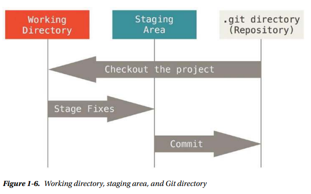

> 以下为`git`仓库中一个文件的生命周期

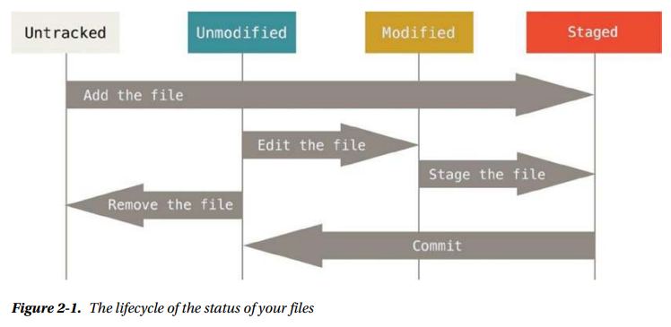

**查看仓库状态**

可以使用`git status`查看当前仓库状态，所处的分支，例如哪些文件已经修改但是还未`staged`，哪些文件`untracked`（即`staged`区是否有未`commit`的文件，当前目录是否有更改但未`commit`的文件）。如果没有，会显示如下

```
$ git status
On branch master
nothing to commit, working directory clean
```

> 使用`git status -s`会显示短格式。短格式中，`??`表示`untracked`，`A `表示刚刚通过`git add`命令`track`的新文件（`staged`），`M `表示文件已修改并已经通过`git add`命令`staged`的已有文件，` M`表示已修改但是还未`staged`的文件，`MM`表示`staged`以后，又被更改的文件

**添加文件**

如果需要`track`一个新文件，或`stage`一个修改后的文件，`git add`这个文件即可

```
$ git add README
```

> `git add`也用于处理合并冲突时，将文件标记为处理完成
>
> 如果在`git add`以后又更改了这个文件，那么需要再执行一次`git add`，下一次`git commit`时使用的才是该文件的最终修改版本

**查看文件更改**

使用`git diff`可以查看已经更改但还未`staged`的文件，具体修改了哪些内容。本质上是调用了`diff`

```
$ git diff 
```

使用`git diff --staged`可以查看已经`staged`的更改（相对于上一次`commit`）

```
$ git diff --staged
```

**忽略文件**

如果想让`git`忽略指定文件，在当前仓库添加一个`.gitignore`，其中每一行都代表了需要忽略的文件（可以使用通配符，或在一行开头使用`!`指定不要忽略的文件）

```
*.o
*.a
_build/
```

**提交更改**

向`git`仓库提交代码最关键的一步，使用`git commit`，此时在`staged`的内容会正式被记录到仓库快照并储存

```
$ git commit -m "file: updated"
```

> **要从一开始就习惯规范的message格式**。Linux内核以及[mesa](https://gitlab.freedesktop.org/mesa/mesa/-/commits/main)等开源项目中，通常使用的message格式为`path: description`，其中`path`一般取源文件绝对路径中的一部分，或源文件名去除扩展名，简略一些体现出修改的哪个方面的内容即可，通常由全小写字母和`-`组成；而`description`需要使用简短的语句写出修改的内容，结尾无句点`.`，可以用动词例如`Add` `Fix` `Remove`等开头。这也是大部分规范的开源项目采用的格式
>
> 具体message格式还是需要尊重项目习惯

> 而对于`commit`的间隔来说，**最好在逻辑上完整完成一项更改**，并且项目可以正常使用时，就及时执行`commit`。对于刚刚开始的项目来说，最好等到项目具备初始形态，能够以简单的形式正常运行后再执行第一次`commit`

对于已经`tracked`文件，可以跳过`git add`的`stage`操作，直接`git commit`一步完成`stage`和`commit`

```
$ git commit -a -m "file: updated"
```

可以通过`--author`和`--date`指定Author和日期（这也是`github`有些人主页显示年份甚至比`github`创立时间还早的原因）

```
$ git commit -m "file: fix bug" --author="user <user@email.com>" --date="2023-05-03 13:11:00 +0800"
```

**删除和重命名或移动文件**

删除`git`仓库下已经`tracked`的文件需要使用`git rm`。只要不是`untracked`的文件，如果出现了修改或修改后被`staged`，需要加`-f`强制删除

```
$ git rm data.bin
```

如果只是想要从`staged`删除一个刚刚添加的文件，但是不想删除该文件本体，使用`--cached`。适用于意外原因（例如忘写`.gitignore`）被`git add`到`staged`的文件

```
$ git rm --cached README
```

重命名/移动文件使用`git mv`

```
$ git mv function.c function_r.c
```

### 3.5.4 查看提交历史

通过以下命令可以直接查看指定分支、`HEAD`所指最新`commit`的`40`位ID

```
$ git rev-parse HEAD
$ git rev-parse master
```

`commit`历史使用`git log`查看，会显示该仓库所有的历史提交，包含`commit`的哈希，作者和email，日期，以及`commit`时填写的`message`。如果加`-2`表示只显示最近2条`commit`。加`--stat`可以统计更改。加`--pretty=oneline`（`short` `full` `fuller`）可以更改显示格式，便于阅读

```
$ git log -2
commit 994f9cbc3569aafc4a54609a6558099d8ec29ca5 (HEAD -> master, origin/master, origin/HEAD)
Author: user <user@email.com>
Date:   Sat Oct 11 12:35:00 2023 +0800

    file: updated function

...
```

> 限制输出条目还可以依据提交时间，例如`--since=2.weeks`显示最近2周的提交，`--since=2023-01-01`显示从指定日期开始的所有提交，`--since="3 months 2 weeks ago"`显示3个半月内的提交，使用`--until`则相反

加`-p`可以附带显示提交历史对应详细的`diff`

```
$ git log -1 -p
commit 994f9cbc3569aafc4a54609a6558099d8ec29ca5 (HEAD -> master, origin/master, origin/HEAD)
Author: user <user@email.com>
Date:   Sat Oct 11 12:35:00 2023 +0800

    file: updated function

diff --git a/file.txt b/file.txt
index 3efb4d6..3d4f3a9 100644
--- a/file.txt
+++ b/file.txt
@@ -1,7 +1,8 @@
...
```

使用`--pretty=format`可以自定义输出格式，包括显示作者，提交者等。使用`--graph`可以用图状显示分支以及合并情况

```
$ git log --pretty=format:"%h - %an, %ae"
```

常用格式

| 符号 | 定义 |
| :- | :- |
| `%H` | `commit`的完整哈希 |
| `%h` | 缩略哈希 |
| `%T` | Tree哈希 |
| `%t` | 缩略Tree哈希 |
| `%P` | 父哈希 |
| `%p` | 缩略父哈希 |
| `%an` | 作者（Author）名 |
| `%ae` | 作者email |
| `%ad` | 作者日期 |
| `%ar` | 作者相对日期（多久之前） |
| `%cn` | 提交者（Committer）名 |
| `%ce` | 提交者email |
| `%cd` | 提交者日期 |
| `%cr` | 提交者相对日期（多久之前） |
| `%s` | `commit`的message |

> `git`中Author作者和Committer提交者不是同一个事物，`git log`命令默认只显示Author
>
> Author和Committer不同的情况在多人协作项目上出现。一般情况下Author就是编写并贡献代码的一方，而Committer为合并代码的一方，例如项目的维护者
>
> 在传统的不使用代码托管平台的应用场合中，例如Linux内核，开发者需要使用email发送`patch`补丁来提交代码更改。如果补丁被合并，那么最终Author就是补丁的提交者，而Committer为合并补丁的维护者
>
> 而在Github等代码托管平台情况有所不同，这里不需要贡献者自己生成提交`patch`源文件。需要看具体的使用管理方式，如果是个人项目，如果不显式指定，我们向自己项目提交的`commit`中Committer和Author都是我们自己的用户名
>
> 在实际的Github开源项目中情况会不一样，后文会有相关讲解。有些项目会将`commit`的Committer都设定为一个默认的邮箱地址（例如`noreply@github.com`），而Author会被设定为贡献者

使用`git log`甚至可以查看添加或删除了指定字符串的`commit`，如下，查找添加或删除`function_name`字符串的`commit`

```
$ git log --Sfunction_name
```

也可以查看指定用户相关的`commit`，可以依据Author或Committer查找

```
$ git log --author=user
$ git log --committer=user
```

### 3.5.5 撤销

分别对应撤销`commit`，`staging`区，以及工作目录下文件修改的情况

**修改已提交的内容**

在执行过一次`commit`以后可以有一次反悔机会，重新修改刚刚提交的`commit`，通常用于意外的错误`commit`

可以再次添加`add`或删除`rm`文件，使用`git commit --amend`，此时会将`staged`文件再次`commit`，覆盖上一次`commit`

```
$ git add .
$ git commit --amend -m "file: Add function"
```

> 这种方法会改变`commit`的SHA-1值，相当于一次小的`rebase`。这种方法不适用于远程分支已经更新的情况

使用`git commit --amend`还可以修改上一个提交的`author`

```
$ git commit --amend --author="user <user@email.com>"
```

将`author`身份更改为和`commit`相同

```
$ git commit --amend --reset-author
```

**撤回staging内容**

通过`git reset`命令撤回`staging`区已经被`git add`的文件

```
$ git reset HEAD file.src
```

**从以往的提交中恢复文件到当前工作目录**

如果意外修改了一个文件，可以从上一次`commit`恢复到当前工作目录

```
$ git checkout -- file.src
```

### 3.5.6 配置远程仓库

使用远程仓库时，`git push`推送代码并合并，`git fetch`仅下载远程代码（默认下载远程仓库的所有分支），`git pull`下载代码并合并

使用`git remote -v`显示远程仓库的链接

```
$ git remote -v
origin	git@github.com:user/linux.git (fetch)
origin	git@github.com:user/linux.git (push)
```

**添加远程仓库**

本地通过`git init`创建的仓库是没有配置远程仓库的。可以通过`git remote add`添加其他远程仓库链接，需要指定一个短名称，这里起名为`mirror`

```
$ git remote add mirror https://gitlab.example.com/user/linux.git
$ git remote -v
origin	git@github.com:user/linux.git (fetch)
origin	git@github.com:user/linux.git (push)
mirror  https://gitlab.example.com/user/linux.git (fetch)
mirror  https://gitlab.example.com/user/linux.git (push)
```

**查看远程仓库信息**

使用`git remote show`显示指定远程仓库的信息

```
$ git remote show origin
* remote origin
  Fetch URL: git@github.com:user/linux.git
  Push  URL: git@github.com:user/linux.git
  HEAD branch: master
  Remote branch:
    master tracked
  Local branch configured for 'git pull':
    master merges with remote master
  Local ref configured for 'git push':
    master pushes to master (up to date)
```

> 上述信息除了链接以外，还给出了用户执行`git pull`以及`git push`时的本地、远程分支的合并对应关系。上述示例中的仓库是通过`git clone`克隆下来的，已经自动配置好了`track`，在本地`master`分支`git push`时会推送代码并尝试自动合并到远程的`master`分支，反之在本地`master`分支`git pull`时`git`也会尝试自动合并到本地`master`
>
> 没有配置分支`track`的仓库不会显示有关`git push`和`git pull`的信息
>
> 如果是多分支仓库，可以配置多条分支`track`。如果想要`git push`或`git pull`不同的分支，只需在本地切换到对应的分支即可
>
> 更多详细信息看[远程分支](#3511-远程分支)

**删除或重命名远程仓库**

使用`git remote rm`从本地仓库删除远程仓库

```
$ git remote rm mirror
```

可以给`remote-name`重命名，使用`git remote rename`

```
$ git remote rename mirror upstream-2
```

**拉取代码**

拉取代码使用`git fetch`

```
$ git fetch mirror
```

> `mirror`就是我们配置的`remote-name`。如果只配置了一个远程仓库，不指定`remote-name`也可以
>
> 使用`git fetch`拉取代码后只会下载远程仓库对应的数据（所有远程分支），并不会自动将这个更新的远程分支合并，也不会自动切换过去，当前目录内容不会变化
>
> 如果是直接使用`git clone`下来的仓库，`git`默认会配置`remote-name`为`origin`，其采用克隆时指定的仓库链接

使用`git pull`会自动拉取远程代码并尝试自动合并（相当于`fetch`和`merge`），但是使用`git pull`的**前提是需要配置一个本地分支**`track`**一个远程分支**（`git push`同理），后文会讲到。如果是通过`git clone`下来的仓库，`git`默认已经帮助我们配置好了让本地的`master`分支`track`远程的`master`分支。使用`git pull`可能需要手动解决潜在的本地合并冲突

```
$ git pull
```

**推送代码**

推送代码使用`git push`，将本地`master`分支推送到`origin`远程仓库的`master`分支（如果配置好）。一旦有任何合并冲突都不会成功

```
$ git push origin master
```

### 3.5.7 标签

**列出标签**

用户通常使用`tag`自定义标记一个软件版本，例如`20231119` `v1.0.1` `13.0-rc2`等。`tag`类似于一个特定`commit`的别名

使用`git tag`列出所有标签。没有输出就是没有标签

```
$ git tag
v0.1.0
v0.1.1
v0.1.2
...
```

有些仓库的`tag`过多，`git tag`可以支持通配符过滤

```
$ git tag -l 'v1.2.*'
```

**标签类型**

`git`中有两种标签，一种是Annotated注解标签，一种是Lightweight轻量标签

> Lightweight轻量标签本质上只是一个指向指定`commit`的指针而已
>
> Annotated注解标签会拥有更为完整的信息，包括校验值，打标签用户的名称，email，标签日期，以及message等。注解标签可以支持GPG签名

**Annotated注解标签**

注解标签使用`git tag -a`创建。message是必需

```
$ git tag -a v1.0.1 -m "version 1.0.1"
```

使用`git show`查看该标签信息

```
$ git show v1.0.1
tag v1.0.1
Tagger: user <user@email.com>
Date: Mon Dec 25 20:19:12 2023 +0800

version 1.0.1

commit ca82a6dff817ec66f44342007202690a93763949
Author: user <user@email.com>
Date: Mon Dec 25 20:11:23 2023 +0800

    file: updated function
```

**Lightweight轻量标签**

轻量标签使用`git tag`创建。无需附加信息

```
$ git tag v1.0.1
$ git tag
v1.0.1
v1.0.0
...
```

查看标签信息

```
$ git show v1.0.1
commit ca82a6dff817ec66f44342007202690a93763949
Author: user <user@email.com>
Date: Mon Dec 25 20:11:23 2023 +0800

    file: updated function
```

**为以前的提交创建标签**

上述做法只能为最近的`commit`打标签。`git`也可以支持为以往的`commit`打标签，指定`commit`的哈希即可。两种标签通用（哈希缩写只取前`7`位）

```
$ git tag v1.0.1 9fceb02
```

**远程仓库的标签**

`git push`时仓库的标签信息**默认不会传到远程仓库**。创建标签以后需要显式推送一下。下例将本分支的标签`v1.0.1`推送到远程仓库`origin`

```
$ git push origin v1.0.1
```

推送所有`tag`可以使用`--tags`参数

```
$ git push origin --tags
```

### 3.5.8 分支基本操作

`git`区分于其他版本管理系统非常重要的一点就是非常快速的分支切换

> 相比于其他版本系统，`git`并不是记录文件增量更改，而是直接在用户执行`commit`时，创建一个`commit`对象，这个`commit`对象包含了提交者的名称，email，message，指向先前`commit`的指针（可能不止一个），以及指向本次`staged`新内容快照的指针（每个文件都会保存到一个`blob`，会使用一个`tree`进行组织），如下示例

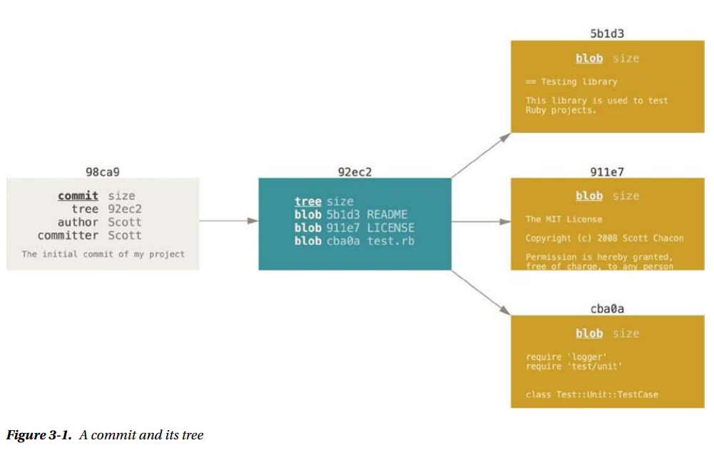

指向前一个`commit`的指针

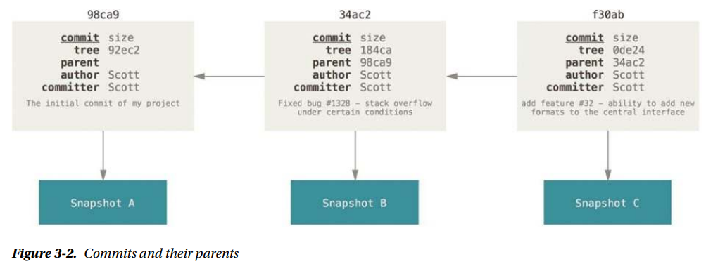

**有关分支的一些基本概念**

在`git`中，分支本质上只是指向特定`commit`的指针，默认分支为`master`。`master`和其他分支并无本质区别，地位相同，仅仅是`git init`时使用的名称而已。在当前分支`commit`时这个分支指针会自动随着`commit`向前移动

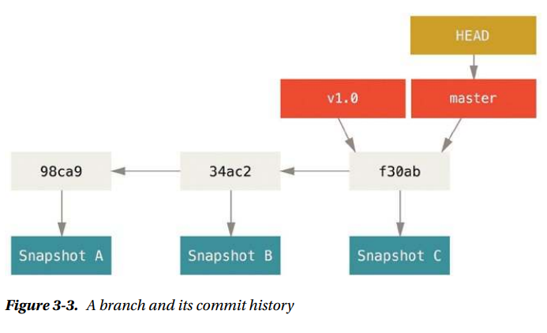

> 在`git`中，指针`HEAD`永远指向用户**当前所处的分支**

**创建新分支**

使用`git branch`创建新分支`testing`。创建新分支后不会自动切换过去，当前依然位于`master`分支。使用`git log`看到新创建的分支

```
$ git branch testing
```

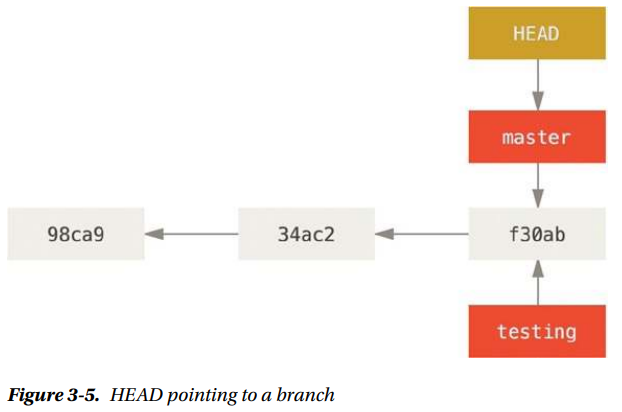

```
$ git log --oneline
f30ab (HEAD -> master, testing) ...
```

`git`创建新分支时可以指定一个`commit`哈希，这样就会创建只到指定`commit`的更短分支

```
$ git branch history 7735ad90
```

> 分支`history`只包含仓库创建到`7735ad90`的内容

**查看分支**

使用`git branch`查看所有本地分支

```
$ git branch
iss53
* master
```

> 带`*`的就是当前所处的分支

加`-v`可以看到最新的`commit`

```
$ git branch -v
  iss53  93b412c fix javascript issue
* master 7a98805 Merge branch 'iss53'
```

可以使用`--merged`和`--no-merged`（不是`--unmerged`）分别过滤出已合并或未合并的分支，比较有用的一个特性

```
$ git branch --merged
  iss53
* master
```

使用`git branch -a`显示包含[远程分支](#3511-远程分支)在内的所有分支。`git branch -r`仅显示远程分支

```
$ git branch -a
  iss53
* master
  remotes/origin/HEAD -> origin/master
  remotes/origin/master
```

**切换分支与修改文件**

使用`git checkout`切换分支，`HEAD`指针会指向对应分支

```
$ git checkout testing
$ git log --oneline
f30ab (HEAD -> testing, master) ...
```

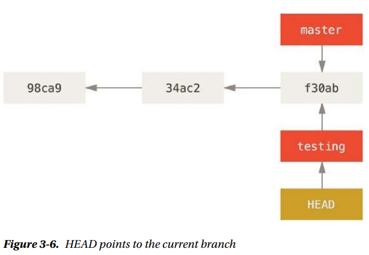

如果对`testing`内容进行修改后`commit`，`testing`分支会向前移动，`HEAD`也会随之移动

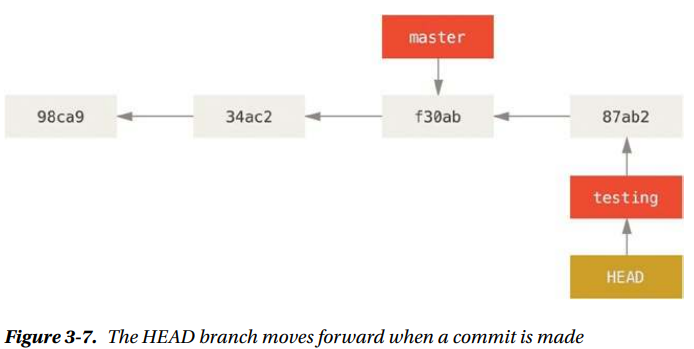

此时`git log`显示如下

```
$ git log --oneline
87ab2 (HEAD -> testing) ...
```

> 注意如果在`testing`分支修改文件但未`commit`时，是无法切换分支的。在这种情况下切换分支需要`stashing`和`commit amending`操作，后文会讲到

再返回到`master`分支，此时当前目录下的文件也会被替换为`master`的版本

```
$ git checkout master
```

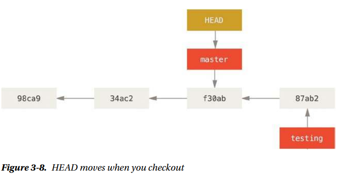

### 3.5.9 分支的合并

分支合并本质上仅仅是**当前分支**和**被合并分支**的**数据同步**，不会删除或更改被合并分支（被合并分支也不会前进，无论是下文所述的`Fast-forward`还是会创建新`commit`的三路合并）。如果想要删除分支，需要使用`git branch -d`删除

```
$ git branch -d testing
```

> 只有已经合并，同时没有后续更改的分支才能顺利删除（使用`git branch --no-merged`检查未合并分支）。如果想要强制删除，需要使用`-D`

```
$ git branch -D testing
```

**Fast-forward合并**

我们从`testing`切换回了`master`。由于当前`master`是`testing`分支的直接父节点（或者`testing`已经`merge`包含了`master`后续的更改），可以直接合并

```
$ git merge testing
Updating f30ab...
Fast-forward
...
```

> 注意看这里显示合并方式为`Fast-forward`。这种情况下，`git`只需直接将`testing`后续的`commit`拷贝过来（“拷贝”不太合适，并没有复制过程，应该更贴近于映射），`master`指针向前移动即可，用户无需写message

**自动合并**

如果我们不合并，在`master`分支再次分一个`hotfix`分支并`commit`，那么就会变成下图这样（摘录了教材图片，为方便讲述省略了部分冗余内容，从这里开始`iss53`等同于上文的`testing`）

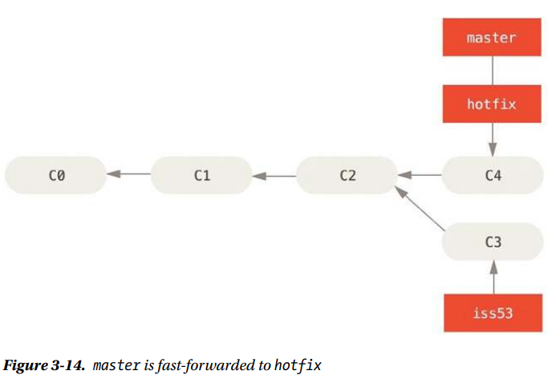

如果不分支直接`commit`，就会变成下图

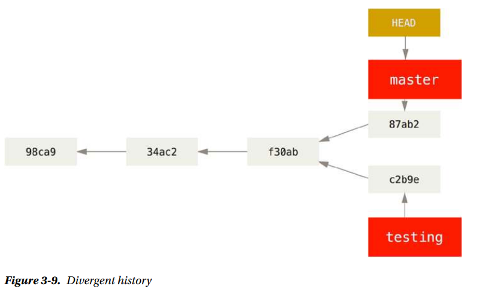

两种方法都导致`master`不再是`iss53`的直接父节点

> 此时如果我们在`iss53`想要`master`的最新内容，可以在`iss53`执行`git merge master`将最新内容合并过来。否则可以直接继续执行下面的内容，在`master`将`iss53`合并过来

此时在`master`合并`iss53`，如果**没有合并冲突**（即从创建`iss53`分支开始，`master`后续和`iss53`更改的内容没有重叠），`git`会根据最近公共父`commit`节点创建一个新的`merge commit`（作为对比，`Fast-forward`本质上没有创建新的`commit`），**并要求用户输入message**，最终会输出以下内容

```
$ git checkout master
$ git merge iss53
Merge made by the 'ort' strategy
...
```

> 老版本的`git`在这种情况下会使用`'recursive' strategy`。新版本中的`ort`是它的改进版
>
> 尽管`iss53`中不包含我们后来对`master`做出的更改，但是`git`明白这一点，它不会将当前`master`后来更改的内容再复原，使`master`退回到分支时的状态。这也被称为一个**三路合并**（three-way merge），原因是这个合并需要依据`master`，被合并的`iss53`，以及两者的最近公共父节点来创建新`commit`。一个示例如下，蓝边的就是这三个节点

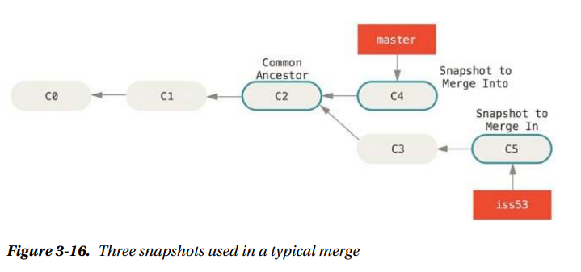

**合并冲突**

合并冲突发生在两个分支修改内容有重叠的情况，此时`git`是无法自动将它们合并的，如下

```
$ git merge iss53
Auto-merging index.html
CONFLICT (content): Merge conflict in index.html
Automatic merge failed; fix conflicts and then commit the result.
```

此时`git`不会自动创建新的`merge commit`，会将当前合并失败的分支标记为`unmerged`状态

```
$ git status
On branch master
You have unmerged paths.
  (fix conflicts and run "git commit")
  (use "git merge --abort" to abort the merge)

Unmerged paths:
  (use "git add <file>..." to mark resolution)
	both modified:   index.html

no changes added to commit (use "git add" and/or "git commit -a")
```

此时我们需要手动编辑冲突解决问题，然后手动创建`commit`。我们使用编辑器打开冲突的文件（当前在`master`分支下），会发现文件中出现了以下片段。用户编辑该文件后，最终效果必须是去除`<<<<<<<` `=======`和`>>>>>>>`


> `<<<<<<<`和`=======`之间的通常是当前`HEAD`所指分支的代码版本，而`=======`和`>>>>>>>`之间的是被合并分支的代码版本。下面是最终修改后的示例，可以为任何内容。`git`不会再关心用户写了什么，它只知道用户删除了`<<<<<<<`这些分隔符就表示问题解决

```
<div id="footer">
please contact us at email.support@github.com
</div>
```

> 之后执行`git add`和`git commit`即可成功执行合并，退出`unmerged`状态，无需再执行`git merge`

冲突合并也可以使用专用的合并工具

```
$ git mergetool
```

> `mergetool`需要使用`git config merge.tool`配置（例如`"vimdiff"`）。否则`git mergetool`会自动选择一个工具
>
> 在使用`mergetool`解决冲突后，`git`会询问用户是否满足当前更改，如果是，那么更改的文件会被自动`staged`。后续用户只需执行一个`git commit`即可

### 3.5.10 分支使用习惯

在基于`git`版本管理的软件开发流程中，`master`分支内的代码通常都是完全稳定，经过严密测试的。而为了添加新功能，以及测试不稳定代码，需要创建另外的分支，例如创建一个`develop`分支，专门用于测试。这个分支代码需要时不时合并到`master`，它永远在添加新功能（代码不稳定）、测试完成（代码稳定）之间变化，等到测试代码发现没有问题，就可以将该分支合并到`master`。这样可以使得`master`永远包含经过review和测试的代码，而`develop`分支永远不会删除，永远和`master`分支并行。类似于道路的主干道和匝道，这就是软件工程中的多级稳定性

而`develop`分支的开发也是依靠从`develop`分支创建新分支（针对特定问题的`topic`分支，命名例如`iss53`）来推进的。这样就形成了下面的图，越向下，通常代码稳定性越低，特性也越新

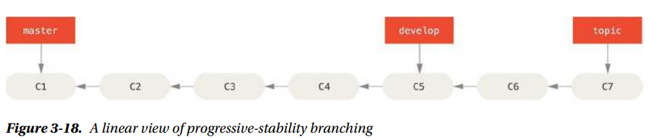

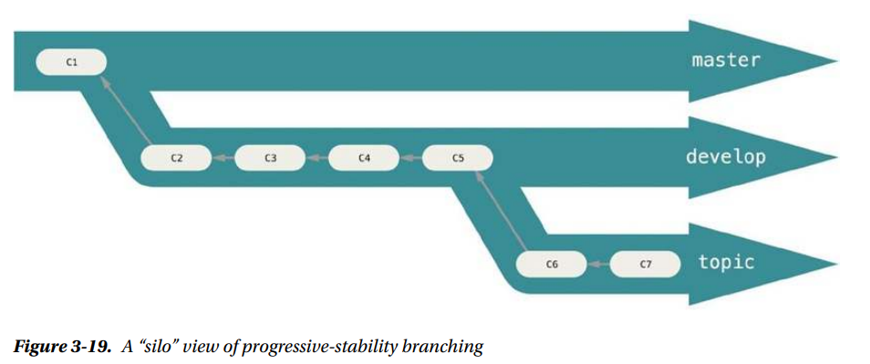

> 类似于`master`这样的分支就是长期分支`Long-Running Branches`，而`topic`分支为`Short-Lived Branches`，它只解决一个特定问题。`topic`分支的专一性非常有利于快速的上下文切换，也方便用户理清思路。如果维护者暂时来不及处理该问题，这个分支也可以一直保留，直到维护者有时间处理该问题

下例中，丢弃`C5 C6`，合并其他所有`commit`

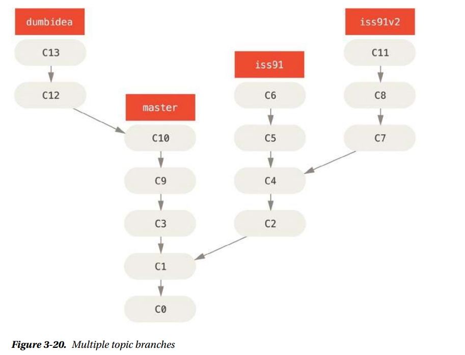

最终结果。其中`dumbidea`先使用`Fast-forward`合并；而`iss91v2`是使用`ort`进行三路合并，创建一个新的提交`C14`

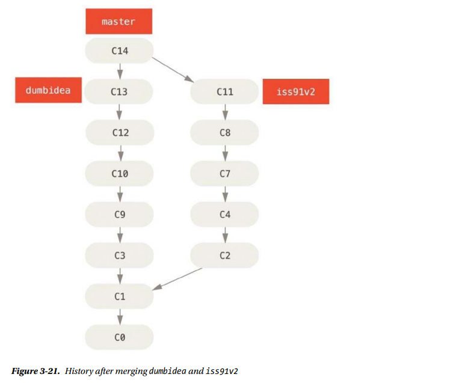

### 3.5.11 远程分支

**基本概念**

`git`仓库的远程分支使用`git branch -r`查看，在本地显示为`remotes/origin/master`（`remotes/remote-name/remote-branch`）。它本质上也是和`master`分支一样的本地分支，区别是用户无法直接在本地`commit`这个分支，所以**这个指针无法通过直接本地提交**`commit`**前进**

本地仓库的远程分支指针只有在使用`git pull`或`git fetch`等发生网络流量的操作时才会前进，它指向远程仓库的最新状态。它只是方便用户查看最近一次同步以后远程仓库的状态

可以切换到远程分支`origin/master`查看，当前工作区会被替换为该分支内容

```
$ git checkout origin/master
```

通过`git clone`下来的仓库也会带有远程仓库各分支对应的远程分支，**同时会自动为用户创建一个本地的**`master`**分支**（内容和此时`origin/master`相同），用户需要在这个本地`master`分支下`commit`

```
$ git clone https://github.com/Tencent/ncnn.git
$ cd ncnn
$ git branch -a
* master
  remotes/origin/HEAD -> origin/master
  remotes/origin/azure-pipelines
  remotes/origin/master
```

> 和`master`类似的，`origin`和其他`remote-name`也没有本质区别。它只是执行`git clone`时`git`给的一个默认名字。`origin`也可以被删除，在`clone`时也可以使用`git clone -o <remote-name>`指定想要的远程名

**数据拉取**

示例如下，我们拥有一个本地仓库，以及一个远程仓库，位于`git.ourcompany.com`

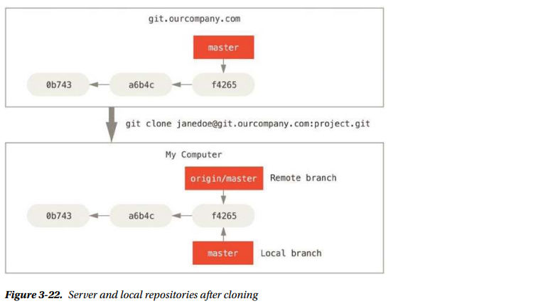

如果远程分支发生了更改，其`master`指针向前移动。如果此时本地也已经有了后续的`commit`，并且还未进行同步，这个场景可以描述如下

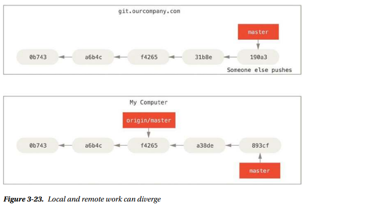

此时如果想更新本地的`origin`（包括其所有分支），需要执行`git fetch`（当前本地`master`分支不会更改）

```
$ git fetch origin
```

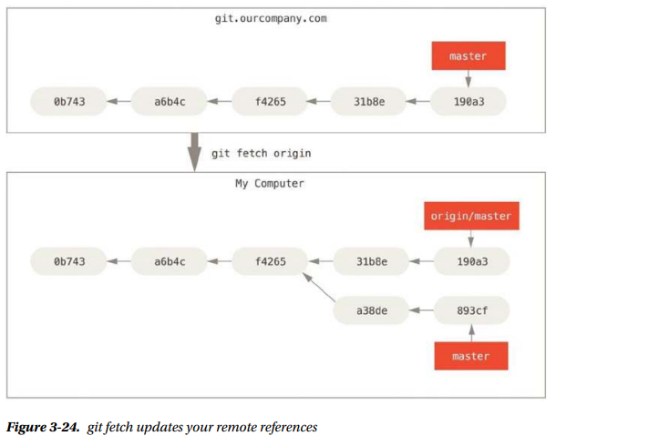

**数据推送**

将本地分支内容推送到远程仓库需要使用`git push`，远程仓库会**自动合并**。任何合并失败或权限问题都会导致`push`不成功

```
$ git push
```

如果未配置好分支`tracking`，或者还没有`origin/serverfix`这个分支

```
$ git push origin serverfix
```

> 上面这条命令就是创建远程分支的最常用方法

> 这条命令会将本地分支`serverfix`内容推送到`origin/serverfix`（当前该分支可以不存在）。这里的`serverfix`也可以写成`serverfix:serverfix`，前面的`serverfix`表示本地的`serverfix`分支，后面的`serverfix`表示远程`origin/serverfix`
>
> 本地分支和对应的远程分支名称可以不同，例如`serverfix:fix`

**分支tracking**

如果按上述方法新创建分支，且本地仓库最初不是通过`git clone`创建的，通常还需要设定分支的`tracking`（本质是远程分支和本地分支的对应关系），这样方便使用`git pull`和`git push`，无需每次都指定`<remote> <branch>`

如果当前是在其他主机上操作，还未创建`serverfix`本地分支

```
$ git fetch origin
remote: ...
...
* [new branch] serverfix -> origin/serverfix
$ git checkout -b serverfix origin/serverfix
```

第二条命令等价于

```
$ git checkout --track origin/serverfix
```

> 创建新远程分支后，后续在其他主机上使用`git fetch`时，远程分支`origin/serverfix`都会出现本地仓库里，但是**不会自动创建**`serverfix`**本地分支**
>
> 如果想要拉取所有远程仓库的所有分支，可以使用`git fetch --all`
>
> 上述命令会在本地创建一个`serverfix`分支并切换过去，自动`track`远程分支`origin/serverfix`，一条命令解决，也就无需再执行`git branch --set-upstream-to=`了
>
> 如果只是想要`commit`代码，不创建`serverfix`，直接将`origin/serverfix`合并到一个本地分支后也可以，但是不推荐这么做

如果当前是在刚刚`push`了`serverfix`本地分支的主机上，且仓库最初不是通过`git clone`创建，也需要设定`tracking`

```
$ git branch --set-upstream-to=origin/serverfix serverfix
```

而在使用`git clone`创建仓库时，`git`会自动创建一个`master`本地分支来`tracking`远程的`origin/master`分支，只要用户在`master`分支执行`git push`或`git pull`就会自动向`origin/master`上传或下载代码，并自动`merge`。使用`git clone`通常无需关心分支的`tracking`问题

本地分支`tracking`的上游分支是可以后续修改的，示例

```
$ git branch -u origin/serverfix-edge
```

或

```
$ git branch --set-upstream-to=origin/serverfix-edge serverfix
```

> 在配置好上游分支的本地分支上，在命令行中还可以使用`@{upstream}`或`@{u}`指代`tracking`的上游分支

查看各本地分支的`tracking`情况可以使用`git branch -vv`

```
$ git branch -vv
  iss53  7e424c3 [origin/iss53: ahead 2] forgot the brackets
* master 1ae2a45 [origin/master] deploying index fix
...
```

**拉取合并**

`git pull`相当于`git fetch`加`git merge`，自动合并上游分支到本地分支

```
$ git pull
```

未配置分支`tracking`时

```
$ git pull origin serverfix
```

> 如果当前仓库不是通过`git clone`创建的，仅仅是刚刚初始化，并添加了`origin`远程仓库，执行`git pull`只相当于`git fetch`

**从本地仓库删除远程分支**

远程分支和本地分支一样可以从本地仓库删除，区别是使用`git branch -d --remote`

```
$ git branch -d --remote origin/iss53
```

> 之后依旧可以通过`git fetch origin`添加回来，只要远程服务器上该分支还未删除

**删除远程分支**

注意这里和上面的删除不一样，这里使用`git push`删除了远程服务器上的分支，是彻底的删除，而对应的本地分支不会删除

```
$ git push origin --delete serverfix
```

### 3.5.12 Rebasing

**Rebase基本概念**

`git`的`rebase`和`merge`类似，也是从一个分支合并到另一个分支的机制。原理上它是近似于将一个分支的更改剪下来，拼接到另一个分支上，移动了分支的根基，这也是为什么叫`rebase`

思考前面的场景

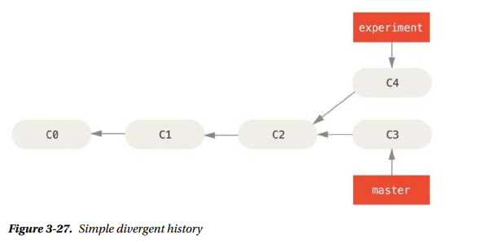

如果使用`merge`合并

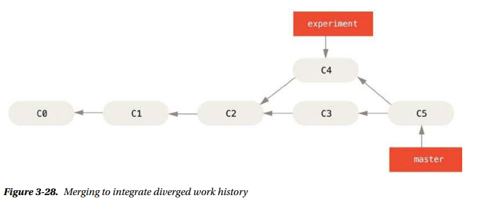

如果使用`rebase`合并，那么就会变成下面这样

```
$ git checkout experiment
$ git rebase master
```

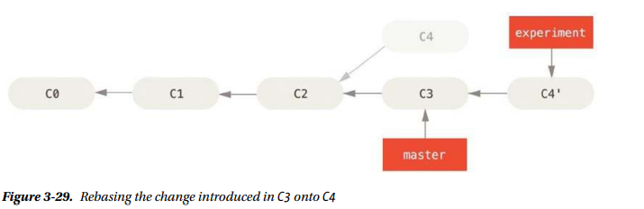

> 可以发现使用`rebase`以后，`commit`的历史记录变成了一条直线，而不是创建一个新的`merge commit`
>
> 背后的具体操作细节是：`git rebase`命令需要在被`rebase`的分支上执行，此时`HEAD`指向`experiment`分支。首先`git`会退回到当前`experiment`分支和`master`分支的最近公共父节点（即`C2`），同时计算`experiment`自从`C2`之后的所有更改（这里只有`C4`），并将这些更改保存到一个临时`diff`。之后`experiment`分支会被重置到和`master`同一个节点（指向`C3`），并将先前保存的更改`commit`到当前分支（`C4'`），于是`experiment`分支就变成了比`master`领先一个`commit`。此时`HEAD`指向`rebase`后最新的`experiment`分支
>
> 注意这里的`rebase`操作更改的是当前所处的`experiment`分支，而不是`master`分支。`master`分支不会变
>
> 此后`master`想要合并`experiment`只需执行一次`Fast-forward`即可，如下。此时`C4'`快照的内容和`C5`完全相同

```
$ git checkout master
$ git merge experiment
```

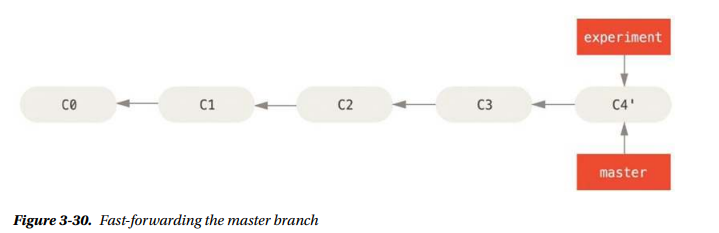

> 从这个角度看，`rebase`就好像将一个分支从原先的父节点（`C2`）剪切下来，移动到后面的节点`C3`上面（当然也可以是`master`的其他后续节点）

`rebase`通常用在**非维护者向某个项目提交代码的场景**。代码提交方首先创建一个分支并在该分支上更改，**在合并提交前才执行**`rebase`。这样可以有效减轻代码维护者的工作压力，因为只要一次`Fast-forward`合并即可，无需三路合并。相当于把潜在的代码集成问题转移到代码提交者处理

**更通用的Rebase操作**

`rebase`事实上可以修剪任意分支从最近分支节点开始的更改，合并到其他分支上

示例如下。我们想要将`client`分支的`C8`和`C9`剪切下来，拼接到`master`后面形成新的`client`分支

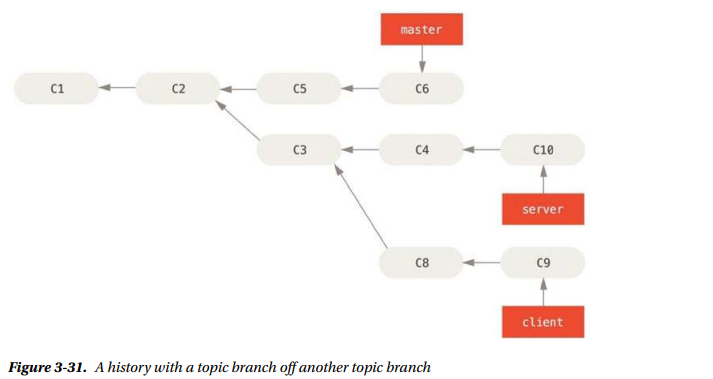

```
$ git rebase --onto master server client
```

> 这条命令的含义是：`checkout`到`client`分支，从`server`和`client`分支的最近公共节点开始算起，取`client`的更改（`C8`和`C9`）；将`C8`和`C9`依次`commit`到`master`后面（`C8'`和`C9'`）。结果如下

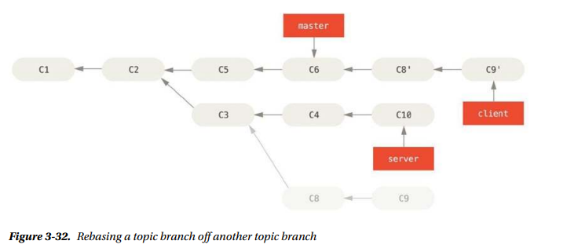

合并`client`，使用`Fast-forward`

```
$ git checkout master
$ git merge client
```

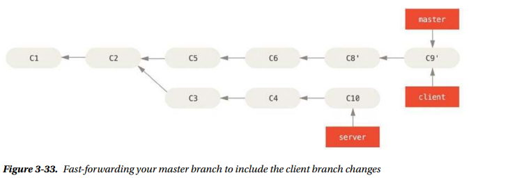

`server`分支合并使用前文所述方法

```
$ git rebase master server
```

> 这条命令的`server`同样指`checkout`到`server`分支。合并`server`分支不再讲述

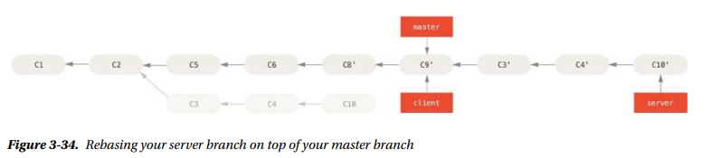

> 被`rebase`后的分支虽然会和`master`指向同一个节点，但是和`merge`一样**不会被自动删除**。需要`git branch -d`手动删除这里的`client`和`server`分支

**Rebase问题处理**

`rebase`使用不当容易造成混乱。在多人合作的场景中需要尤其注意。这里给出一个示例

`rebase`使用的原则是尽量少给其他人制造麻烦。不要变动别人已经依赖的`commit`路径

> 这个示例中，上游（远程）分支将`master`分支`rebase`到已经合并的分支上引发了问题，原先`merge`新建的`commit`失效，随之而来的是依赖于该`merge commit`的分支全部无法再使用

远程仓库和本机仓库的初始状态

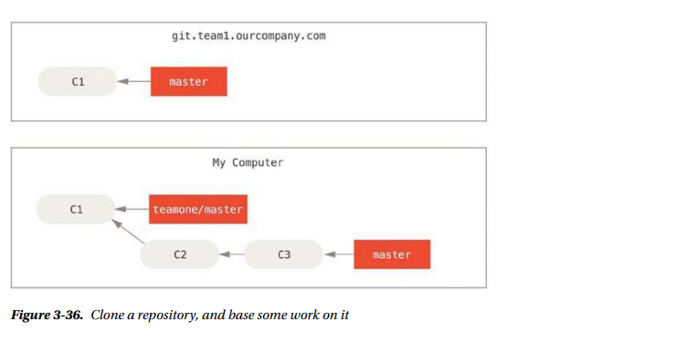

> 本机在远程仓库内容基础上提交了`C2`和`C3`

其他开发者分别在`master`分支和`test`分支贡献了`C4`和`C5`

```
$ git branch test
$ git checkout test
$ ...
$ git commit -m "Commit 5 on test"
$ git push teamone test:test
```

```
$ git checkout master
$ ...
$ git commit -m "Commit 4 on master"
$ git fetch teamone
$ git merge teamone/test -m "Commit 6 merges C4 and C5"
$ git push teamone
```

> 假设都是`git clone`下来的仓库，这些步骤步骤省略

在此之后本机合并`C6`，产生新的`C7`。此时本地`master`由`C3`和`C6`合并而来

```
$ git checkout master
$ git fetch teamone
$ git branch -a
* master
  remotes/teamone/master
  remotes/teamone/test
$ git merge teamone/master -m "Commit 7 merges C3 and C6"
```

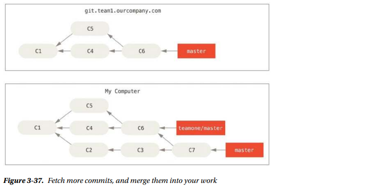

此时之前在`test`分支提交`C5`的开发者突然将`master`分支`rebase`到了`test`分支上，并且使用`git push --force`（可能不起作用，现在很多托管平台的`master`是受保护的。但是其他分支的`commit`历史可以被覆写）覆盖了原来的数据。此时在`teamone/master`原来的`C4`和`C6`全部作废

```
$ git checkout master
$ git pull
$ git rebase test
$ git push --force teamone
```

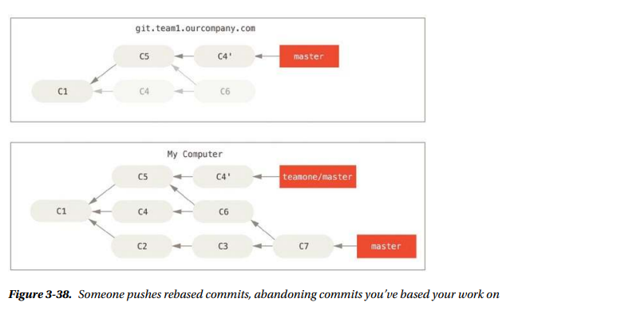

此时本机再`git pull`会创建一个新的`C8`，就会导致以下混乱的情况，使用`git log`查看会看到两条完全相同的提交`C5`，而`C4`和`C4'`的内容通常基本相同，哈希值不同。这种情况是绝对要避免发生的

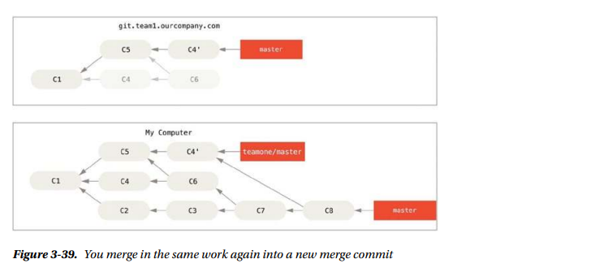

> 观察上图：如果尝试从`C1`走到`C8`，共有`4`条路径。除去其中的`merge commit`（`C6`，`C7`和`C8`，因为它们没有引入新内容），其余`commit`中`C5`会经过`2`次，而`C4`和`C4'`分别经过一次。也就是说，这些`commit`的内容会被`commit`历史重复包含两次
>
> 还有一个思维角度是远程`master`分支切换到了另一个平行的**顶点**上
>
> 不仅仅是本地仓库的问题。如果此时将本地仓库`push`到`teamone/master`，远程仓库的`master`分支原来只包含`C1`，`C5`和`C4'`，`C4`和`C6`本已经不存在。经过此次`push`以后本地仓库会将`C5`和`C4`重复出现的问题再次传染给远程仓库，使情况更糟糕

如果发生这种已经依赖的`commit`被覆盖的情况，必须在问题变严重之前尽早解决，使用`git rebase`将本地`master`分支`rebase`到远程分支上，`git`会自动计算最终需要追加的`commit`。受影响的本地仓库可以使用如下命令解决。如果远程仓库也被传染，需要再`push`一下

```
$ git fetch 
$ git rebase teamone/master
```

或更常用的方法

```
$ git pull --rebase
```

> 这里`git`解决重复`commit`的方法如下：
>
> 首先查看专属于当前本地分支`master`的`commit`，从其他分支出发按箭头向回走，最终得出只有`C4 C6 C2 C3 C7 C8`专属于本分支，滤除了`C1 C5 C4'`
>
> 之后滤除`merge commit`，剩余`C2 C3 C4`引入了新内容
>
> 最后查看当前`master`分支的`commit`中是否有`rebase`目标分支（`teamone/master`已经有的`commit`，通过`patch-id`判定）。这里滤除`C4`（目标分支已经有`C4'`，拥有不同的哈希但是`patch-id`相同），最终得到`C2 C3`
>
> 最终效果如下。原先的`C2`和`C3`变成`C2'`和`C3'`被追加到`C4'`后
>
> 基本原理就是找出独属于当前用户引入的含新内容的`commit`

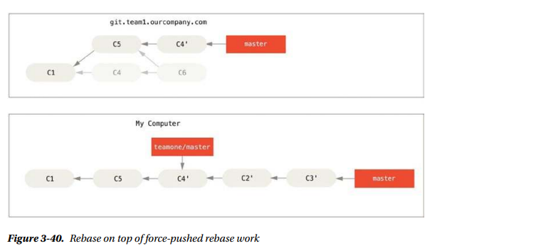

> 注意上述方法不是万能的，也经常会有出错的情况。例如`C4`和`C4'`内容不同的情况下，依旧会导致它们被重复应用，并且出错

总结一下，`git rebase`的使用原则是不能影响**已经公开的内容**，也就是已经通过`git push`推送过的，在远程仓库可以公开访问的，可能有其他人已经基于这个`commit`开始他的工作，否则很容易给别人带来麻烦（因为问题的处理需要在他人的仓库进行，也可能给整个项目带来麻烦）。如果被`rebase`影响的内容还未公开过（例如本地仓库编辑完成的代码但还未`push`），那么通常不会有大问题

也是因此`git rebase`通常只用于非维护者向项目提交代码前**在本地分支追踪上游代码**，以便在提交合并时可以立即合并代码，减少维护者的工作，同时让`commit`历史看上去更加线性，也不会多出`merge commit`

### 3.5.13 简易Git服务器：基于本地路径访问

本地路径访问无需部署服务端，所有任务都由`git`客户端完成。使用`samba`或`NFS`就可以很方便的实现网络服务器功能

> 本地访问有一个缺点是`git`默认不允许使用本地`submodule`

**Git 的 bare repository**

服务器上的`git`仓库由于无需workspace，需要使用特殊的`bare repository`，这种仓库根目录命名习惯上以`.git`结尾，相当于只存放普通仓库的`.git`目录部分。它没有workspace，并且允许`push`。普通的`git`仓库默认不允许`push`

使用`git init --bare`初始化一个`bare repo`

```
$ mkdir gitproject.git
$ cd gitproject.git
$ git init --bare
```

也可以克隆一个本地或远程普通仓库，转为`bare repo`

```
$ git clone --bare gitproject gitproject.git
```

```
$ git clone --bare https://myserver.com/gitproject.git gitproject.git
```

**本地访问使用方法**

可以在本地使用`git clone`直接克隆一个通过上述方法创建好的空`bare repo`（会自动配置好`origin`）

```
$ git clone /path/to/gitproject.git gitproject
```

也可以将`origin`仓库地址配置为一个本地路径

```
$ mkdir gitproject
$ cd gitproject
$ git init
$ git remote add origin /path/to/gitproject.git
```

此时本地仓库内没有任何分支，直接`commit`即可，本地仓库会自动创建一个`master`分支

```
$ git add .
$ git commit -m "Initial commit"
[master (root-commit) 664e08e] Initial commit
 1 file changed, 1 insertion(+)
 ...
```

直接`push`，上游仓库就会有新建的`master`分支了（分支`tracking`不会自动设定。见[远程分支](#3511-远程分支)）

```
$ git push origin master
$ git branch --set-upsream-to=origin/master master
```

### 3.5.14 简易Git服务器：基于SSH

通过SSH提供Git服务的服务端配置相较HTTP更为简单。克隆仓库的链接通常如下例

```
$ git clone user@myserver.com:gitproject.git
```

> SSH因为必须要用户的公钥，优点是更加安全。这也导致SSH无法提供匿名服务的问题

**SSH部署简单示例**

首先准备好要使用的仓库`gitproject.git`，假设从本目录下已有仓库`gitproject`克隆创建，当前用户名`user`

```
$ git clone --bare --shared gitproject gitproject.git
```

> 上述示例创建的仓库可以允许其他用户提交更改（`rwxrwsr-x`，见[权限管理](#1118-权限管理基础chmod和umask)），同时**必须将其他用户加入到自己的用户组**。上例中，需要在服务器上将其他人例如`bob`加入到仓库所属用户组`user`；也可以另外创建一个用户组，`chgrp`设置仓库`group`为该用户组，并将所有参与用户加入。上述所有用户都必须是可以通过`ssh`命令登录服务器的
>
> 如果不需要仓库属主以外的提交，使用`--bare`即可（`rwxr-xr-x`）。服务器上的访问权限管理直接使用文件系统权限已经可以满足大部分限制访问的需求

可以通过`scp`将该仓库放到服务器的`/srv/git`（前提是用户`user`对该目录写入权限）

```
$ scp -r gitproject.git user@myserver.com:/srv/git
```

也可以直接操作服务器

```
$ cp -r gitproject.git /srv/git
```

此时其他可以登录该SSH服务器的用户就可以克隆仓库了，并且可以`commit`以后直接`push`

```
$ git clone bob@myserver.com:/srv/git/gitproject.git
```

到这里为止的服务器已经可以满足一个小组的开发需求了。以下会给出一个更高级的示例，是在正规场合更常用的SSH部署方法，适用于小组成员在服务器上没有账号的情况，也无需在服务器创建账号，只需上传`ssh`公钥即可

**推荐的通用示例**

在服务器创建一个所有用户共用的`git`账户，不设置密码，设置登录`shell`为`git-shell`防止用户获取到`shell`。再创建一个管理员账户`gitadmin`，将`gitadmin`加入到`git`用户组（同时记得允许`gitadmin`的`sudo`权限，或者将`gitadmin`加入`wheel`用户组，视不同Linux发行版而定）

```
$ sudo useradd -m git
$ sudo chsh -s /usr/bin/git-shell git
$ sudo useradd -m gitadmin
$ sudo passwd gitadmin
$ sudo usermod -a -G git gitadmin
$ su gitadmin
```

首先创建目录`/srv/git`，并更改用户和组

```
$ sudo mkdir /srv/git
$ sudo chown git:git /srv/git
$ sudo chmod g+ws /srv/git
$ ls -l /srv
total 4
drwxrwsr-x 2 git git 4096 Dec 11 12:00 git
```

在`git`用户家目录下创建一个`.ssh/authorized_keys`用于存放其他用户的公钥

```
$ cd /home/git
$ sudo mkdir .ssh
$ sudo touch .ssh/authorized_keys
$ sudo chown -R git:git .ssh
```

用户在自己的主机上使用下述命令生成公钥。在家目录的`.ssh`下找到`.pub`结尾的文件（`id_rsa.pub`），就是公钥

```
$ ssh-keygen -t rsa
```

再转到服务器上的`gitadmin`用户，将上述方法生成的所有用户公钥逐个添加到`/home/git/.ssh/authorized_keys`末尾（可以写成一个脚本批量添加）

```
$ sudo bash -c "cat id_rsa.pub >> /home/git/.ssh/authorized_keys"
```

创建服务器仓库是最关键的一步（后续所有仓库都这样创建即可），需要在服务器上使用`gitadmin`身份创建。假设在`/srv/git`下创建`gitproject.git`（`bare repo`），先不添加任何`commit`

```
$ cd /srv/git
$ git init --bare --shared gitproject.git
$ ls -l
total 4
drwxrwsr-x 7 gitadmin git 4096 Dec 11 12:00 gitproject.git
```

> 这个`gitproject.git`的属主就是`gitadmin`。所有其他用户在服务器上都是以`git`身份存取

如果有必要，此时可以重启一下SSH服务

```
$ sudo systemctl restart sshd
```

假设用户`user`在自己的主机上创建`gitproject`仓库（或者使用已有的仓库），将`origin`设置到`git@myserver.com`（后续注意还需要设置好[分支](#3511-远程分支)的`tracking`，方便使用`push`和`pull`）

```
$ git init gitproject
$ cd gitproject
$ git remote add origin git@myserver.com:/srv/git/gitproject.git
```

或者直接`clone`

```
$ git clone git@myserver.com:/srv/git/gitproject.git
$ cd gitproject
```

此时`user`就可以直接提交初始`commit`并`push`了，会自动创建本地`master`分支，`git push`以后远程仓库也就有了`master`分支

接下来所有用户就可以开始正式工作了，所有已上传公钥的用户都可以通过`git@myserver.com:/srv/git/gitproject.git`自由`clone`，`fetch`，`push`或`pull`这个远程仓库

```
$ ...
$ git add .
$ git commit -m "Initial commit"
$ git push origin master
```

### 3.5.15 简易Git服务器：基于Git服务

`git`自带一个`daemon`模式用于提供Git服务，默认在TCP端口`9418`监听。这个守护进程模式通过专用的`git:`协议提供服务。该服务没有用户验证功能

> `git daemon`的优点是速度快，适用于分享较大的仓库。而被共享的仓库需要在其中创建一个`git-export-daemon-ok`文件，否则该仓库无法访问。缺点是由于`git daemon`没有用户验证的特性，它通常不用作代码推送，这里就只能选择一个仓库可以被所有人访问，或根本不能访问。如果允许了`push`，网络上的任何人都能推送代码到这个仓库，会引发安全问题。此外，`git daemon`的部署容易遇到网络问题，`9418`端口通常经常被防火墙禁止
>
> 通过`git daemon`提供的服务通常需要和其他协议例如HTTP或SSH同时使用，其中`git daemon`只用作代码拉取

**Git部署示例**

假设依旧在前文SSH部署完成以后的环境中，登录用户`gitadmin`，仓库全部位于`/srv/git`，`owner`为`gitadmin`，`group`为`git`

首先在想要允许访问的服务端仓库中创建一个`git-daemon-export-ok`空文件，表示`export`这些仓库

```
$ cd /srv/git/gitproject.git
$ touch git-daemon-export-ok
```

可以直接创建一个`gitdaemon`用户，不设置密码。由于该用户对`/srv/git`下所有仓库只有读取权限，其提供的`git daemon`服务也只能支持下载（例如`git clone`）。使用该用户身份运行`git daemon`（`git daemon`更多是由系统管理，自动启动）

```
$ sudo useradd gitdaemon
$ sudo git daemon \
--user=gitdaemon --group=gitdaemon \
--reuseaddr \
--base-path=/srv/git \
/srv/git
```

> `--reuseaddr`忽略`9418`端口当前可能未关闭的TCP连接并重启`git daemon`，`--base-path`指定所有仓库的根目录（无需在远程链接给出完整路径），最后指定要`export`的仓库所在路径

之后在本地通过链接`git://myserver.com/gitproject.git`就可以克隆这个仓库

```
$ git clone git://myserver.com/gitproject.git
```

此外需要注意设置一下`push`走其他链接例如SSH，就可以推送代码了

```
$ git remote -v
origin  git://myserver.com/gitproject.git (fetch)
origin  git://myserver.com/gitproject.git (push)
$ git remote set-url --push origin git@myserver.com:/srv/git/gitproject.git
$ git remote -v
origin  git://myserver.com/gitproject.git (fetch)
origin  git@myserver.com:/srv/git/gitproject.git (push)
```

### 3.5.16 简易Git服务器：基于HTTP

通过HTTP提供Git服务需要使用到Web服务器例如`apache2`。克隆仓库的链接通常如下例

```
$ git clone http://myserver.com/git/gitproject.git
```

> HTTP基本是目前最常用的Git服务提供方式，用户可以匿名克隆以及拉取代码。而在推送代码时需要根据`git`提示输入远程账户的用户名和密码进行登录，无需像SSH一样事先上传公钥。缺点是更难部署，要允许推送代码依旧是要登录用户信息的
>
> `git`早期使用的是Dumb HTTP，它只是简单的文件传输，通常只提供仓库拉取功能（只读）。现在的版本使用的是Smart HTTP，数据传输方式类似于SSH，可以支持仓库拉取与推送功能（读写）

**HTTP服务部署示例**

`git`为`apache2`提供了一个CGI，位于`/usr/lib/git-core/git-http-backend`。这个CGI会识别客户端请求哪个仓库，可以自动和`git`客户端协商使用的HTTP协议（Smart或Dumb）

`debian`下通过`sudo a2enmod`命令使能`cgi cgid alias env auth_basic authn_dbm`模块，`systemctl`中服务名为`apache2`。此外不要忘记将`debian`下默认部署的网页下线

```
$ sudo a2dissite 000-default.conf
```

> 而在`arch`下发行的`apache2`需要在`/etc/httpd/conf/httpd.conf`配置，注意以下行的设定

```
#LoadModule mpm_prefork_module modules/mod_mpm_prefork.so
LoadModule alias_module modules/mod_alias.so
LoadModule env_module modules/mod_env.so
LoadModule cgi_module modules/mod_cgi.so
LoadModule cgid_module modules/mod_cgid.so
LoadModule auth_basic_module modules/mod_auth_basic.so
#LoadModule auth_digest_module modules/mod_auth_digest.so
LoadModule authn_file_module modules/mod_authn_file.so
LoadModule authn_dbm_module modules/mod_authn_dbm.so
```

首先将运行`apache2`的用户名加入先前创建的`git`用户组（`debian`下默认为`www-data`），以允许写入仓库数据

```
$ sudo usermod -a -G git www-data
```

需要设定服务器端仓库的`http.receivepack`为`true`，才能允许推送

```
$ git config http.receivepack "true"
```

在`apache2`主配置文件同路径下新建一个配置文件`git-server.conf`，并且在主配置文件的末尾`Include`

```
# Include git server configuration
Include git-server.conf 
```

`git-server.conf`全部内容，推送代码时会要求用户输入名称和密码登录。只有带`git-daemon-export-ok`文件的仓库可以通过HTTP访问。如果设置了`GIT_HTTP_EXPORT_ALL`变量，相当于给所有仓库添加了这个文件

```
SetEnv GIT_PROJECT_ROOT /srv/git
#SetEnv GIT_HTTP_EXPORT_ALL
ScriptAlias /git/ /usr/lib/git-core/git-http-backend/

<Directory "/usr/lib/git-core*">
    Options ExecCGI Indexes
    Order allow,deny
    Allow from all
    Require all granted
</Directory>

<LocationMatch "^/git/.*/git-receive-pack$">
    AuthType Basic
    AuthName "Git Access"
    AuthBasicProvider dbm
    AuthDBMType DB
    AuthDBMUserFile /srv/.htdbm-git
    Require valid-user
</LocationMatch>
```

最后创建用户信息数据库，添加用户，根据提示输入密码（可以存放到其他更安全的目录）

```
$ sudo htdbm -c /srv/.htdbm-git user
$ sudo htdbm /srv/.htdbm-git bob
$ ...
```

> 需要确保创建的数据库文件为`Berkeley DB`格式。如果不确定可以使用`file`命令核实

接下来就可以开始使用该仓库了，通过以下URL克隆

```
$ git clone http://myserver.com/git/gitproject.git
```

**TLS配置**

加强安全防护建议配置TLS，走HTTPS上传下载仓库数据。这里演示使用自签名根证书的方法，如果想要使用CA签名的证书，需要有自己的域名，再到CA网站申请

首先生成证书并自签名（可以参考[OpenSSL用法](221112a_network.md#556-附加说明openssl)）：

生成`rsa`密钥，该密钥使用AES256加密，会提示输入PEM密码。记住该密码，以后每次使用该密钥都会要求输入密码

```
$ openssl genrsa -aes256 -out git-tls.key 2048
Enter PEM pass phrase:
Verifying - Enter PEM pass phrase:
```

生成CSR，注意`/CN`必须和主机名或主机域名一致

```
$ openssl req -new -key git-tls.key -out git-tls.csr -subj "/CN=myserver.com"
```

使用密钥和该CSR生成自签名证书

```
$ openssl x509 -req -in git-tls.csr -signkey git-tls.key -out git-tls.crt -days 2000 -subj "/CN=myserver.com"
```

部署`apache2`的TLS支持需要密钥和证书两个文件。将这两个文件分别复制到`/etc/ssl/private`和`/etc/ssl/certs`目录

```
$ sudo cp git-tls.key /etc/ssl/private/
$ sudo cp git-tls.crt /etc/ssl/certs/
```

在`debian`下使能`ssl`模块（`LoadModule ssl_module modules/mod_ssl.so`），会自动`Listen 443`端口（在`ports.conf`）

```
sudo a2enmod ssl
sudo a2ensite default-ssl
```

`debian`下编辑`/etc/apache2/sites-available/default-ssl.conf`。以下为所有必要行

```
<VirtualHost *:443>
    ErrorLog ${APACHE_LOG_DIR}/error.log
    CustomLog ${APACHE_LOG_DIR}/access.log combined

    SSLEngine on

    SSLCertificateFile       /etc/ssl/certs/git-tls.crt
    SSLCertificateKeyFile    /etc/ssl/private/git-tls.key
</VirtualHost>
```

最终重启`apache2`即可

> 需要在所有想要访问的客户端添加该自签名证书，在`/etc/ssl/certs`

克隆仓库

```
$ git clone https://myserver.com/git/gitproject.git
```

**简易网页：GitWeb**

`git`提供了一个简易网页功能。这里尝试在`80`端口部署`gitweb.cgi`（想要部署在`443`端口走HTTPS也可以）

从`https://git.kernel.org/pub/scm/git/git.git/`下载`git`源码编译

```
$ wget https://git.kernel.org/pub/scm/git/git.git/snapshot/git-2.43.0.tar.gz
$ tar -zxvf git-2.43.0.tar.gz
$ cd git-2.43.0
$ make clean
$ make prefix=/usr gitweb
$ sudo cp -Rf gitweb/ /var/www/
```

在`git-server.conf`配置文件追加以下内容

```
<VirtualHost *:80>
    ServerName myserver.com
    DocumentRoot /var/www/gitweb
    <Directory /var/www/gitweb>
        Options +ExecCGI +FollowSymLinks +SymLinksIfOwnerMatch
        AllowOverride All
        order allow,deny
        Allow from all
        AddHandler cgi-script cgi
        DirectoryIndex gitweb.cgi
    </Directory>
</VirtualHost>
```

编辑`/etc/gitweb.conf`，配置好`$projectroot`

```
# path to git projects (<project>.git)
$projectroot = "/srv/git";
```

重启`apache2`，在浏览器输入`http://myserver.com/`，就可以看到页面

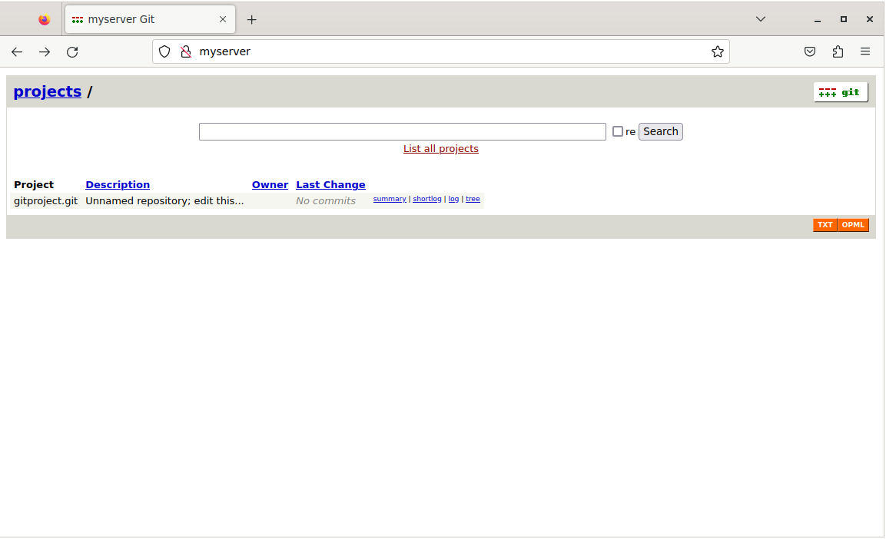

### 3.5.17 高级Git服务器：基于GitLab

GitLab功能很多，主要基于Rails，Redis，PostgreSQL，Nginx开发，体积较大，对服务器配置（主要为磁盘性能）也有一定要求，这里仅演示`debian`单机安装过程。Kubernetes平台部署，常用配置等见[配置说明](https://docs.gitlab.com/omnibus/settings/)，[功能说明](https://docs.gitlab.com/ee/install/next_steps.html)

> 如果是给最多`1000`人的团队使用，仅用于代码托管的情况下8核处理器+8G内存基本足够。而更小规模的场景2-4G内存也足够运行。如果需要在同机运行CI/CD工作流，视情况需要提高内存和处理器配置

**基本安装过程**

GitLab官方提供的安装包中包含了依赖的软件，例如Postgre等

安装`curl openssh-server ca-certificates perl`

```
$ sudo apt install curl perl openssh-server ca-certificates
```

如果需要使用邮件服务，安装`postfix`。配置界面选`Internet Site`，并填写自己的域名。收发邮件都通过这个域名

```
$ sudo apt install postfix
```

添加`gitlab`源（也可以手动添加其他有`gitlab`的镜像站）

```
$ wget https://packages.gitlab.com/install/repositories/gitlab/gitlab-ee/script.deb.sh
$ sudo bash ./script.dev.sh
```

安装`gitlab-ee`（企业版。社区版`gitlab-ce`，本文配置的镜像源暂无）

```
sudo apt-get install gitlab-ee
```

如果已经有自己的DNS域名，在安装时就通过`EXTERNAL_URL=`指定服务器域名

```
$ sudo EXTERNAL_URL="https://gitlab.myserver.com" apt-get install gitlab-ee
```

> 上面指定了`https:`，在安装过程中会自动向`letsencrypt.org`申请SSL证书并安装。如果是使用`http:`那么就不会自动安装。**安装前必须保证域名可以成功解析到服务器IP**
>
> 此外，每次重新配置`/etc/gitlab/gitlab.rb`时，如果指定走HTTPS，都会重新申请一次SSL证书（即便安装时没有指定走HTTPS）
>
> 如果要使用自己的证书，同样通过修改配置文件实现

如果通过IP访问，此时无法使用，需要编辑`/etc/gitlab/gitlab.rb`，修改以下两行配置

```
external_url "http://127.0.0.1"
letsencrypt['enable'] = false
```

如果想要使用自己的SSL证书，首先创建`/etc/gitlab/ssl`，将RSA密钥和证书放到该目录下

```
$ sudo mkdir /etc/gitlab/ssl
$ sudo cp myserver-gitlab.key myserver-gitlab.crt /etc/gitlab/ssl
```

如果RSA密钥使用AES等算法加密，还需要将密码写在`/etc/gitlab/ssl/key_passwd.txt`

```
$ sudo touch /etc/gitlab/ssl/key_passwd.txt
```

之后编辑配置文件如下

```
external_url "https://gitlab.myserver.com"
letsencrypt['enable'] = false
```

如果密钥被加密需要另外配置一行

```
nginx['ssl_password_file'] = '/etc/gitlab/ssl/key_passwd.txt'
```

最后执行一下重配置，会自动启动

```
$ sudo gitlab-ctl reconfigure
```

GitLab在启动完成后会创建一个默认用户名`root`，临时密码在`/etc/gitlab/initial_root_password`（有效期24小时）。使用浏览器访问部署好的GitLab网页，使用这个密码登录，并立即修改密码

```
$ sudo cat /etc/gitlab/initial_root_password
```

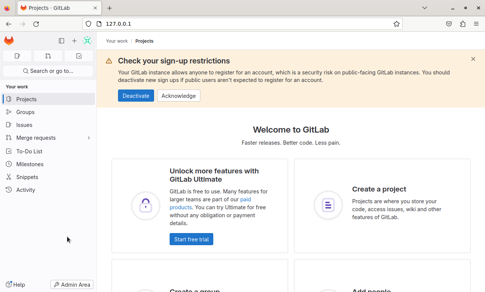

**常用管理命令**

查看运行状态

```
$ sudo gitlab-ctl status
```

启动，重启和停止

```
$ sudo gitlab-ctl start
$ sudo gitlab-ctl restart
$ sudo gitlab-ctl stop
```

显示配置以及重载配置

```
$ sudo gitlab-ctl show-config
$ sudo gitlab-ctl reconfigure
```

卸载以及删除所有数据

```
$ sudo gitlab-ctl uninstall
$ sudo gitlab-ctl cleanse
```

### 3.5.18 分布式工作流

在仅有几人的小型项目中，下图这种共享仓库的工作模式足以满足大部分场景。每个人在想要`push`代码到一个分支时都需要先`fetch`一下远程分支再合并到本地的分支，同时解决冲突问题。有冲突的代码`git`是不允许合并的，推送也不会成功

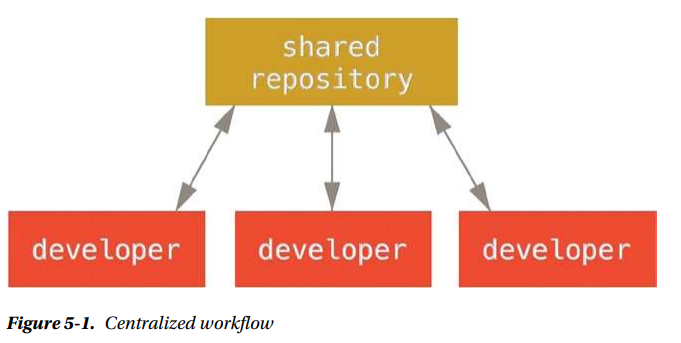

而在更大的团队中，会区分项目管理者以及附属的开发人员。管理者负责代码的合并测试等工作，而开发人员只需实现或修改功能即可。而服务器上也有多个远程仓库，通常每个开发者都有自己的仓库，并且只能`push`到自己的仓库；而主线仓库只有一个，开发者只能拉取代码，并不能直接`push`主线。而管理者有权限读取开发者的远程仓库，并且可以`push`主线仓库

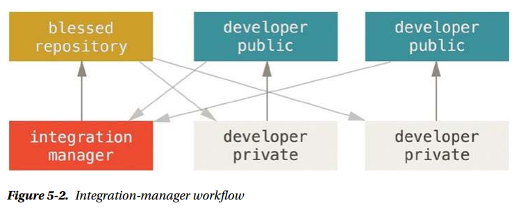

> 上图中，管理者将所有远程仓库都添加到自己本地的`remote`；而每个开发者只能将上游仓库和自己的仓库添加到`remote`
>
> 开发者开始编写代码之前，首先`fetch`一下主线仓库，并将主线仓库**某个分支**的内容合并到自己创建的**本地分支**。根据项目管理模式以及习惯的不同，可能是`fetch`远程的`master`或`main`**主分支**并将其直接合并到自己的本地**主分支**，最后直接`push`到远程仓库的**主分支**；或者需要先`fetch`主线，`branch`一个本地的**非主分支**最后`push`到远程仓库的**同名非主分支**（同样为新创建）；或者本地**非主分支**长期使用的情况下，直接`merge`主线仓库的**主分支**到该**非主分支**，最后`push`到远程仓库的**同名非主分支**
>
> 开发者在`push`完成代码以后，需要向管理者发送一个合并申请（例如通过email，其中包含了此次更改的patch等信息，而在GitHub是发起Pull Request）
>
> 管理者`fetch`该开发者仓库中刚刚提交更新的分支，可能会`checkout`过去先查看一下。如果没有问题，就可以开始将该分支合并到本地**主分支**，最后`push`到主线仓库
>
> 在开发过程中，开发者可以使用前文说过的方法在本地跟踪主线仓库的**主分支**，并及时更新

如果是更大的项目，例如Linux内核，一个管理者是不够的，需要多个管理者，管理者也分为两级或多级

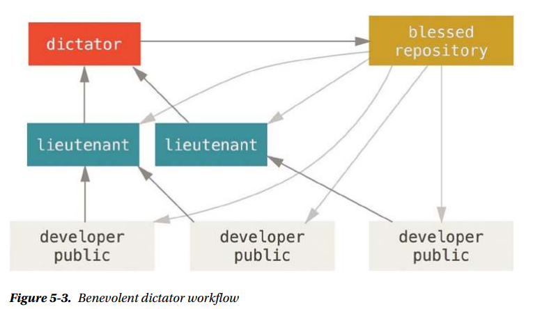

> 上图中，普通开发者直接将他们创建的`topic`分支`rebase`到主线仓库的**主分支**
>
> 二级管理者负责将开发者创建的`topic`分支合并到自己的**主分支**
>
> 核心管理者负责将二级管理者的**主分支**合并到自己的**主分支**，并`push`到主线仓库的**主分支**

### 3.5.19 Commit查看和引用方式

**基本哈希引用**

使用`git show`可以查看指定`commit`（通过哈希缩写指定）

```
$ git log --abbrev-commit --pretty=oneline
e062c46 (HEAD -> master) file: updated function

$ git show e062c46
commit e062c469da7977fb207c3787aae4b65f5110f447 (HEAD -> master)
Author: user <user@email.com>
Date:   ...

    file: updated function

diff --git ...
```

指定分支名会显示该分支的最新提交

```
$ git show master
commit e062c469da7977fb207c3787aae4b65f5110f447 (HEAD -> master)
...
```

**Tag标签引用**

也可以通过已有的标签引用一个`commit`。[前文](#357-标签)已经展示过

```
$ git show v1.5
```

**RefLog引用**

`git reflog`可以显示当前`HEAD`的前几次变化，使用`HEAD@{n}`格式显示，同时会显示`HEAD`指针变化的原因，可能是`commit`或`rebase`等。`{n}`表示从最新`commit`开始数向前`n`个提交

```
$ git reflog
e062c46 (HEAD -> master) HEAD@{0}: commit: file: updated function
...
80bf8a8 HEAD@{5}: commit (initial): Initial commit
```

> `git log -g master`也会显示出RefLog信息

显示前一次提交信息

```
$ git show HEAD@{1}
```

显示`master`分支昨天的提交

```
$ git show master@{yesterday}
```

**使用**`~`**和**`^`**符号的祖先引用**

在一个特定`commit`或`HEAD`后面加上`^`，指代这个`commit`的上一个`commit`

```
$ git show HEAD^
commit b7ac...
...
```

如果指定的`commit`是一个`merge commit`（有多于一个父`commit`），那么通过添加`^2`可以显示另一个父`commit`

```
$ git show HEAD^2
commit 435a...
```

而如果是想指定向前`n`个parent，那么需要使用`~`

```
$ git show HEAD~2
$ git show HEAD^^
```

> 如果没有`merge commit`，上述命令等价
>
> `^`和`~`可以任意组合，例如`43ac8b~4^2`等

**Commit Range**

管理难度较大的工程，常用于查看指定分支还未合并到当前分支的内容（本质上是显示一个分支上没有但是另一个分支上存在的`commit`）

查看分支`topic1`上面还未合并到`master`分支的`commit`，使用`..`

```
$ git log master..topic1
```

使用该命令检查当前分支（已完成所有`commit`）将要`push`到远程分支的内容

```
$ git log origin/master..HEAD
```

可以使用`--not`或`^`显示多个分支上还未合并到指定分支的`commit`

```
$ git log topic1 topic2 ^master
$ git log topic1 topic2 --not master
```

也可以显示两个分支之间不共有的`commit`，使用`...`。加上`--left-right`可以使用`>`和`<`显示输出在`...`右或左边分支有而另一边没有的`commit`

```
$ git log topic1...master
```

### 3.5.20 交互式Staging

使用`git add -i`可以启动交互式的`staging`

```
$ git add -i
        staged  unstaged path
  1: unchanged     +0/-1 README
  2: unchanged     +1/-1 index.html
...

*** Commands ***
  1: status     2: update     3: revert     4: add untracked
  5: patch      6: diff       7: quit       8: help
What now>
```

> `staged`和`unstaged`列显示的分别是该文件已经被`stage`和未被`stage`的更改（新增行、删除行，通过`diff`计算得出）

**添加新更改**

输入操作命令对应的数字即可，这里选择`2`，添加新的`staging`（`add`操作）

```
What now> 2
```

指定添加文件`1,2`（`git add README index.html`）

```
Update>> 1,2
           staged    unstaged path
* 1:    unchanged       +0/-1 README
* 2:    unchanged       +1/-1 index.html
  3:    unchanged       ...
```

直接回车，完成添加，回到主界面

```
Update>>
updated 2 paths

*** Commands ***
  1: status     2: update     3: revert     4: add untracked
  5: patch      6: diff       7: quit       8: help
What now>
```

在主界面输入`3`选`revert`可以撤销已经`staged`的文件，操作同理不再讲述

```
What now> 3
```

**查看已Stage更改**

输入`6`选择`diff`可以查看已`stage`文件的更改，相当于`git diff --cached`

```
What now> 6
         staged     unstaged path
  1:      +1/-1      nothing index.html
Review diff>> 1
```

**部分Stage**

可以通过`patch`功能，`git`会自动指引用户遍历指定文件的每一处更改，并根据用户要求进行处理。输入`?`可以查看`patch`功能使用帮助

```
What now> 5
```

> 部分Stage功能也可以通过`git add -p`直接执行

### 3.5.21 Stashing现场保存

如果用户还未完成当前workspace的工作，但是又不得不`checkout`到另一个分支去处理一些紧急问题，可以使用`git stash`保护当前未完成工作的现场。`git stash`保存当前workspace的内容（也包含已经`stage`的内容）到栈上，用户后续就可以回到该分支并恢复现场

**Stash保存**

执行`git stash`或`git stash save`来保存现场

```
$ git stash save
```

> 此后使用`git status`查看就会得到`working directory clean`，此时可以放心切换分支了

如果当前有`untracked`文件，又不想`add`，需要使用下述命令保存。常用

```
$ git stash save --include-untracked
```

或

```
$ git stash save -u
```

如果想要`commit`当前已经被`git add`的文件，使用下述命令，它会在保存时忽略`staged`区，只保存工作区（执行一次`commit`以后才能切换到其他分支）

```
$ git stash save --keep-index
```

**从Stash恢复**

如果`stash`了多次，可以通过下述命令列出当期分支已经保存的`stash`

```
$ git stash list
stash@{0}: WIP on master: 049d078...
stash@{1}: WIP on master: c264051...
```

恢复指定的`stash`到当前workspace，使用下述命令，会恢复最新的一个`stash`到当前目录

```
$ git stash apply
```

上述命令**不会恢复**之前`stage`的文件，如果想连带恢复`staged`，使用以下命令（更常用）

```
$ git stash apply --index
```

> 如果想要恢复一个`stash`，workspace并不是必须为clean的。`git`会自动处理它，如果有冲突，会使用解决分支`merge`冲突类似的方法处理

恢复更旧的`stash`，例如`stash@{1}`

```
$ git stash apply stash@{1}
```

**撤销Stash**

`git`没有直接提供Stash的撤销操作，但是可以通过以下命令实现。相当于提取该Stash的patch并反向应用该补丁

```
$ git stash show -p stash@{0} | git apply -R
```

**删除Stash**

恢复完成后，通过以下命令可以删除不想要的`stash`

```
$ git stash drop stash@{1}
```

**交互式Stashing**

Stash操作也可以像`git add`一样支持交互式，只保存指定的更改

```
$ git stash --patch
```

**从Stash创建分支**

如果当前分支的工作目录相比Stash时已经更改，可能会出现冲突。这种情况下可以基于Stash内容创建一个临时的分支，后续用户可以手动将该新分支合并到当前分支

```
$ git stash branch stash-merge
```

> 上述命令会自动删除Stash

### 3.5.22 清扫工作目录

使用`git clean`命令可以删除当前目录中`untracked`的文件，在使用`git stash`之前可能有用，主要用于删除无关紧要的缓存信息，中间文件等。删除之后就无法恢复。如果有用，尽量还是使用`git stash --all`，会保存到Stash中

```
$ git clean -d -f
```

如果担心删错文件，可以通过以下命令先dry-run一下

```
$ git clean -d -n
```

`git clean`不会删除`.gitignore`中指定的文件。如果还想删除这些文件，添加`-x`

```
$ git clean -f -d -x
```

交互模式

```
$ git clean -d -x -i
```

### 3.5.23 使用GPG签名

`git`可以使用`gpg`密钥对`tag`或`commit`进行签名。有关`gpg`用法见[1.1.30](#1130-gpg)

列出我们已有的`gpg`密钥

```
$ gpg --list-keys --keyid-format=long
```

通过`git config`配置该密钥用于签名（最好使用可签名`subkey`）

```
$ git config --global user.signingkey XXXXXXXX
```

**Tag签名**

创建`tag`，同时签名。使用`-s`创建。要求输入`gpg`密码

```
$ git tag -s v0.1 -m "New version v0.1"
```

通过`git show`可以看到该`gpg`签名

```
$ git show v0.1
tag v0.1
...
-----BEGIN PGP SIGNATURE-----
...
-----END PGP SIGNATURE-----
...
```

验证该`tag`的`gpg`签名需要在本地保存有签名者的公钥。使用`-v`

```
$ git tag -v v0.1 
```

**Commit签名**

需要`git 1.7.9`以上版本，使用`-S`在创建`commit`时添加`gpg`签名

```
$ git commit -S -m "file: fixed function"
```

如果是创建`merge commit`，验证签名同时给新创建`merge commit`签名

```
$ git merge --verify-signatures -S iss51
```

`commit`签名可以通过以下命令查看

```
$ git log --show-signature
```

`git`也可以支持在`merge`或`pull`时检验签名，检验未通过就中断操作

```
$ git merge --verify-signatures iss51
```

或

```
$ git pull --verify-signatures
```

### 3.5.24 查找功能

**grep功能**

`git`可以支持在当前工作目录或以往的提交文件内容中查找指定内容

添加`-n`显示文件中行号

```
$ git grep -n string
```

只显示匹配到`string`多少次

```
$ git grep --count string
```

显示出现过`string`的C函数名（在`.c`中查找）

```
$ git grep -p string *.c
```

显示`v1.0`中`#define`了`LINK`或`BUF_MAX`相关字符串的行

```
$ git grep --break --heading -n \
> -e "#define" --and \( -e LINK -e BUF_MAX \) v1.0
```

**log查找功能**

通过`git log`的查找功能也可以从`commit message`或`commit`内容追溯到一个字符串被添加或删除的时间点

查找`BUF_MAX`出现和消失的`commit`点

```
$ git log -SBUF_MAX --oneline
```

`git log`还支持查找特定C函数的更改记录。下例查找`secc.c`源码中`send_msg()`的所有修改记录

```
$ git log -L :send_msg:secc.c
```

如果不是C，可以使用正则表达式

```
$ git log -L '/fn send_msg/',/^}/:secc.rs
```

### 3.5.25 更改历史

如果只是更改刚刚提交的`commit`，参考[3.5.5](#355-撤销)

**更改更早提交的**`commit message`

如果想要更改更早提交的`commit message`，需要使用`git rebase`的交互模式。例如想要更改最近的`3`个`commit`

```
$ git rebase -i HEAD~3
```

回车，会出现类似以下的编辑器界面（`git`默认配置的编辑器）

```
pick c72bba5 winman: fix duplicated memfree
pick 6de7747 pipe: replace with atomic functions 
pick 505505e tracer: add extension

# Rebase 0a7f9d0..505505e onto 0a7f9d0 (3 commands)
#
# Commands:
# p, pick <commit> = use commit
...
```

> 注意这里的`commit`按照旧到新的顺序列出

这里将想要更改的`commit`行对应的`pick`改为`edit`，保存退出

接下来对于每一个想要修改的`commit`，都要在当前仓库循环执行以下两步操作

```
$ git commit --amend
```

修改完`commit message`以后，保存退出，执行以下命令应用更改。如果还有未完成修改的，会输出提示

```
$ git rebase --continue
```

**调换Commit顺序**

使用上文讲述的方法同样可以更改`commit`顺序，甚至于删除一些`commit`

```
pick c72bba5 winman: fix duplicated memfree
pick 6de7747 pipe: replace with atomic functions 
pick 505505e tracer: add extension
```

假设删除最近的一个`commit`，并且调换之前的两个`commit`顺序


```
pick 6de7747 pipe: replace with atomic functions 
pick c72bba5 winman: fix duplicated memfree
```

保存退出以后，`git`会自动回退当前仓库，删除以及调换指定的`commit`，最后执行`merge`。需要按照提示手动处理`merge`冲突

**合并Commit**

`git rebase -i`还有一个强大的历史修改功能，可以合并多个`commit`到一个`commit`中（`squash`）

示例

```
pick c72bba5 winman: fix duplicated memfree
pick 6de7747 pipe: replace with atomic functions 
pick 505505e tracer: add extension
```

更改为

```
pick c72bba5 winman: fix duplicated memfree
squash 6de7747 pipe: replace with atomic functions 
squash 505505e tracer: add extension
```

> `squash`将当前`commit`合并到上一个`commit`
>
> 退出编辑器以后，`git`会自动将合并操作，再次调用编辑器提示用户修改`commit message`。`git`中一个`commit`本就可以有多条`commit message`，在`git commit`命令行中通过多个`-m`指定

**分解Commit**

`git`也可以将一个`commit`分解为多个

例如分解前`3`个范围内的`commit`

```
$ git rebase -i HEAD~3
```

```
pick c72bba5 winman: fix duplicated memfree
pick 6de7747 pipe: replace with atomic functions 
pick 505505e tracer: add extension
```

更改第二个，修改如下

```
pick c72bba5 winman: fix duplicated memfree
edit 6de7747 pipe: replace with atomic functions 
pick 505505e tracer: add extension
```

回退到两个`commit`之前，依次执行分割后的`commit`。可以使用交互式`git add -i`

```
$ git reset HEAD~2
$ git add meminfo.c
$ git commit -m "meminfo: fixed harzard"
$ git add pipe.c
$ git commit -m "pipe: replaced with atomic operation"
$ git rebase --continue
```

**批量历史修改**`filter-branch`

`git filter-branch`可以批量修改仓库过往的提交信息（包括`email`等）以及提交文件。可以补救一些较难处理的失误（例如误添加的文件）

例如，我们想从过往的所有`commit`中删除一个文件`asc.o`（不同于单独的`git rm`，如果`asc.o`很大，该操作可以显著减小仓库大小）

```
$ git filter-branch --tree-filter "rm -f asc.o" HEAD
```

> 上述命令可以从当前分支`commit`历史的每一个快照中删除文件`asc.o`，并应用到该`commit`中
>
> 该命令更推荐的使用方法是创建一个测试分支进行删除操作，之后使用`git reset --hard`使得`master`分支切换到该测试分支（见[下一小节](#3526-reset)）

使用`git filter-branch`替换所有历史`commit`的电子邮件地址和用户名

```
$ git filter-branch --commit-filter '
> if [ "$GIT_AUTHOR_EMAIL" = "alice@example.com" ];
> then
> GIT_AUTHOR_NAME="Alice";
> GIT_AUTHOR_EMAIL="alice@email.com";
> git commit-tree "$@";
> else
> git commit-tree "$@";
> fi' HEAD
```

> 上述两种用法都是在每个`commit`上执行一条命令

`filter-branch`还可以切换当前工程根目录到一个子目录，示例切换到子目录`trunk`。当前目录会被替换为子目录的内容

```
$ git filter-branch --subdirectory-filter trunk HEAD
```

### 3.5.26 Reset和Checkout

`git reset`本质上的作用是将已经保存的历史`commit`快照恢复出来。`git reset`有三种选项，分别为`--soft`，`--mixed`，`--hard`

> 如果只是想要将某个历史`commit`快照恢复到工作目录，例如想要编译旧版本的代码，需要使用`git restore`（见[附加说明](#3531-其他命令参考)），它不会更改分支和`HEAD`指针；不要使用`git reset`

首先回忆一下，`git`下面有`3`块数据存储区，分别为当前的工作目录（可以直接访问），`staging`区，以及`commit`历史记录区。这里就涉及到`3`个不同的仓库快照副本，分别对应工作目录，Index，以及当前`HEAD`所指的快照，如下图

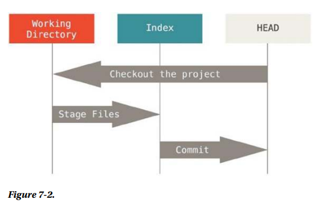

`git reset --soft`会更改当前`HEAD`所指的分支（例如`master`）指向的`commit`，通常是回退`commit`，**Index和工作目录不会更改**，如下示例

```
$ git reset --soft HEAD~
```

或

```
$ git reset --soft 9e5e6a4
```

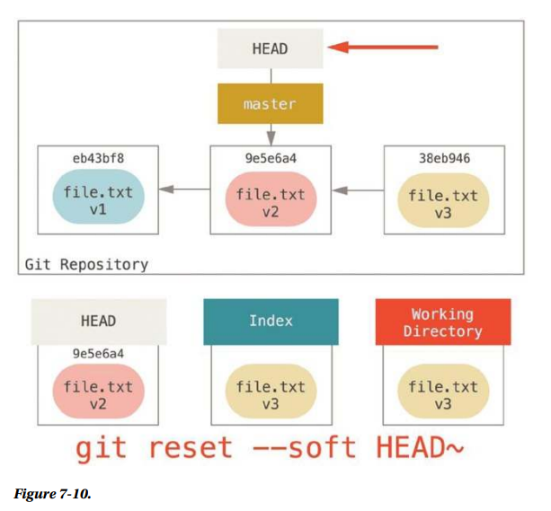

> 通过适当附加操作`git reset --soft`可以实现和`git commit --amend`类似的功能

`git reset --mixed`会同时修改Index内容（默认行为）

```
$ git reset HEAD~
```

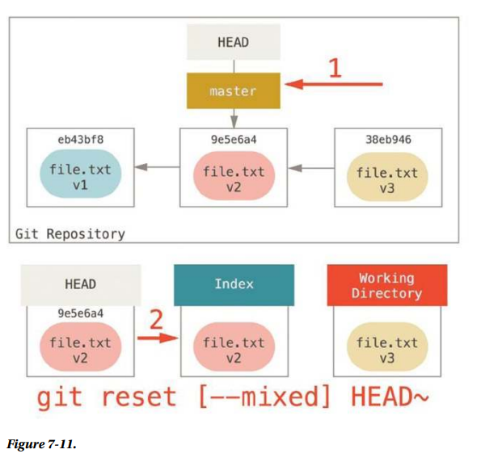

`git reset --hard`会同时修改Index和当前工作目录的内容

```
$ git reset --hard HEAD~
```


> `git reset --hard`执行前需要格外注意，所有指定`commit`之后的更改**在覆盖后无法找回**（因为已经没有仓库副本还保留这些更改）

`git reset`也可以从`HEAD`所指快照提取指定文件，来恢复Index中或工作目录中的指定文件。下述命令不会更改`HEAD`所指快照，但是会将`meminfo.c`文件从`HEAD`快照恢复到Index，而工作目录的`meminfo.c`副本不变

```
$ git reset --mixed HEAD meminfo.c
```

或

```
$ git reset meminfo.c
```

当然也可以从任意的`commit`恢复，`HEAD`不变

```
$ git reset 9e5e6a4 meminfo.c
```

`git reset --soft`也可以用于合并最近的几次`commit`

例如，我们想把`3`个最近的`commit`合并为单个最新的`commit`


首先回退`2`个`commit`

```
$ git reset --soft HEAD~2
```

此时由于Index区中保留了这几次`commit`的内容，我们可以直接执行`git commit`，就成功合并成了一个`commit`

```
$ git commit -m "file: squashed commits"
```

**有关分支**`checkout`

和`git reset --hard`类似的，`git checkout`会同时更改`HEAD`，Index和工作目录

`git checkout`和`git reset`的区别是，它不会更改仓库的分支指针，它只会修改`HEAD`指向哪个分支（它本就是用于切换分支的）。此外，`git checkout`在恢复数据到Index和工作目录时会自动进行检查，必要时会提示合并操作，而不是直接替换文件

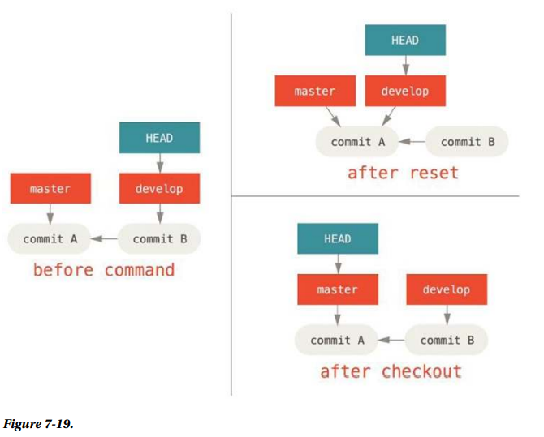

`git checkout`也可以支持从其他分支拷贝指定文件副本到当前工作目录（`HEAD`不变，分支不切换），例如从`iss1`分支拷贝`data.txt`过来

```
$ git checkout iss1 data.txt
```

或交互式

```
$ git checkout --patch iss1 data.txt
```

### 3.5.27 高级合并技巧

使用`git merge`合并功能时需要养成良好的检查习惯，在合并其他分支之前最好保证工作目录是`clean`的

尽管`git`可以自动进行合并操作，但是对于行末空格、批量修改等问题，还是难以使用普通方法解决的。这些问题可能给维护者造成过大的合并压力，需要解决

**空格问题**

这里解决批量出现行末空格、换行符变化、制表符变化的情况，有时可能导致以外的合并冲突。假设导致大量行合并冲突的分支为`iss51`

```
$ git merge iss51
```

上述命令会在文件中生成`merge conflict`的`pattern`。这里立即撤销刚刚的合并操作，恢复文件（使用`git reset --hard HEAD`也可以）

```
$ git merge --abort
```

忽略空格重新合并即可

```
$ git merge -Xignore-all-space iss51
```

**手动修复：获取三路合并文件**

执行普通三路合并时一共需要`3`个仓库副本：当前分支快照，被合并分支快照，以及最近公共祖先的快照。发生合并冲突时，也可以手动修复，通过以下命令**分别查看公共祖先，本分支，被合并分支**的文件副本，可以存到临时文件中

```
$ git show :1:data.txt > data.common.txt
$ git show :2:data.txt > data.master.txt
$ git show :3:data.txt > data.iss51.txt
```

显示三个冲突文件的哈希

```
$ git ls-files -u
```

假设我们修复`data.iss51.txt`为`unix`格式后合并

```
$ dos2unix data.iss51.txt
$ git merge-file -p data.master.txt data.common.txt data.iss51.txt > data.txt
$ git diff -w
```

使用下列命令可以查看最终的更改相对于本分支原先副本、被合并分支原先副本的变化，以及总的变化

```
$ git diff --ours
$ git diff --theirs -w
$ git diff --base -w
```

最终删除创建的临时文件

```
$ git clean -f
```

**使用**`diff3`**冲突Pattern**

合并冲突后，使用如下命令可以将冲突文件中的pattern转为`diff3`格式，会增加最近公共祖先`common`副本提示

```
$ git checkout --conflict=diff3 demo.run
```

可以配置该pattern格式到全局环境

```
$ git config --global merge.conflictstyle diff3
```

**冲突时查看**`log`

使用前文讲述的`--left-right`参数

```
$ git log --oneline --left-right HEAD...MERGE_HEAD
< 9af9d3b pipe: add atomic operation 
< 694971d meminfo: remove dual check
> e3eb223 memmon: fix buffer flush
> 7cff591 perfmon: fix clock function
```

只显示导致冲突的`commit`

```
$ git log --oneline --left-right --merge
```

**查看待解决的冲突**

`git merge`会自动`stage`没有冲突的文件，只保留有冲突的。通过`git diff`即可查看

**撤销合并**

如果`merge commit`还未公开，可以在本地直接通过`git reset`就撤销合并

```
$ git reset --hard HEAD~
```

初始状态

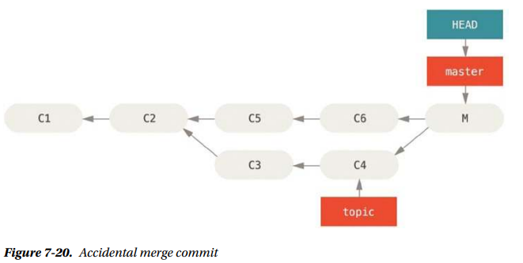

撤销后状态

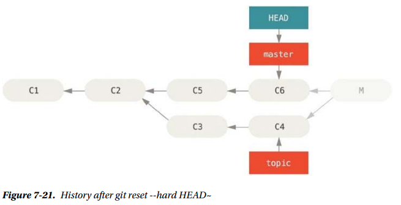

上述方法如果不可行，只能通过再增加一个反合并`commit`

```
$ git revert -m 1 HEAD
```

> `-m 1`表示保留第`1`个parent分支的内容，这里指代合并入的分支

示意图

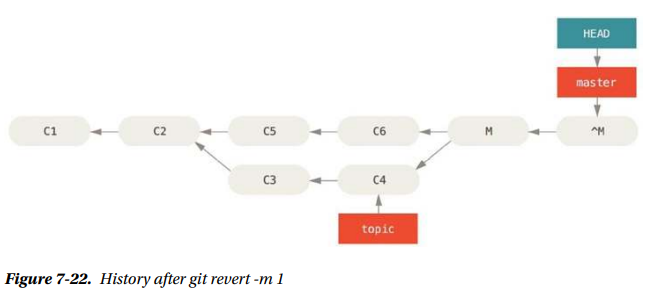

> 需要注意，此后`topic`分支想要再合并入`master`分支，`C3`和`C4`的更改不会再出现
>
> 一种选择是`topic`分支的作者可以关闭`topic`，开启新`topic`
>
> 另一种选择是`master`再撤销先前的撤销`commit`（文件状态又回到了`M`）后，立即接受`topic`的合并

```
$ git revert -m 1 HEAD
```

如下图

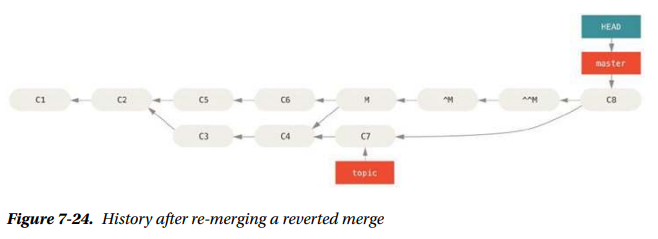

**Ours or Theirs**

如果发生了合并冲突，可以指定以谁为准（`ours`或`theirs`）

示例，以`ours`我们的仓库副本为准

```
$ git merge iss51
$ git merge -Xours iss51
```

**假合并**

`git`甚至可以假装执行一次合并，以`ours`为准

```
$ git merge -s ours iss51
```

> 从`git log`来看`iss51`似乎已经合并了，但是查看`git diff HEAD HEAD~`发现文件没有任何变化

### 3.5.28 子模块Submodule

`git`子模块功能非常常用，但是其设计和用法本身较为混乱。大部分网络教程（包括官方教程）对于`git submodule`的用法和概念原理讲述并不是很直白，使用需谨慎

> 依照一些教程的说法，`git submodule`本质上只是主仓库指向子模块一个确切`commit`的指针
>
> 总之，在使用子模块时，需要时刻注意远程主仓库指向的`commit`以及本地仓库的子模块版本。如果不一致，需要处理，不要贸然开始工作。本文也无法涉及`git submodule`的所有边界情况，仅供参考，实际操作以实际情况为准

**引入子模块**

添加子模块，`git`会立即克隆该仓库，同时创建一个`.gitmodules`文件，记录子模块信息

```
$ git submodule add https://github.com/Tencent/ncnn.git
```

> `.gitmodules`和普通文件一样，也会被主仓库`track`。而子模块里面的内容本质上不会被主仓库`track`，主仓库只会关心自己使用了子模块的哪个快照。而克隆下来的子模块仓库也就是一个普通仓库，并且会自动创建本地分支（例如有`origin/master`，那么就创建`master`本地分支）
>
> 子模块并不是必须放在仓库根目录，可以放在仓库下任何路径。只要`cd`到对应目录后`git submodule add`即可。`git`会自动记录到上层的主仓库

这里由于我们是执行了`add`添加操作，子模块仓库`HEAD`默认处于`master`分支，而不是`detached`状态。需要记住

```
$ cd ncnn
$ git status
On branch master
Your branch is up to date with 'origin/master'.
```

子模块克隆完成以后，通过`git diff --cached`可以看到`stage`区中`.gitmodules`以及新添加的子模块更改。它们还未`commit`

```
$ git diff --cached
```

提交更改到主仓库（这也是一个特殊的`submodule commit`。以后每次涉及到子模块更新的`commit`都是`submodule commit`），这里只需要`-m`即可，无需再`git add`一遍

```
$ git commit -m "submodule: add ncnn as dependency"
```

**克隆有子模块的仓库**

默认`git`克隆仓库时会创建子模块对应的目录，但是不会克隆子模块内容

克隆仓库以后初始化子模块并拉取文件才会完成子模块仓库的克隆

```
$ git submodule init
$ git submodule update
```

或者直接在克隆时指定`--recursive`，会自动克隆子模块，效果相同

```
$ git clone --recursive https://github.com/user/project.git
```

注意，这里和`add`添加子模块不同的是此时子模块仓库的`HEAD`处于`detached`模式。它指向子模块的一个特定`commit`

```
$ cd ncnn
$ git status
HEAD detached at 9578355
nothing to commit, working tree clean
```

> 前文所述添加子模块后`HEAD`处于`master`分支的情况事实上只是一个特殊状态，刚刚添加子模块后就处于这样的一个状态。如果子模块上游仓库`master`分支有了更新，只要在仓库中`git submodule update --remote`更新子模块，`HEAD`就会回到`detached`模式，指向`master`最新的`commit`
>
> 所谓`detached`就是`HEAD`不指向任何一个分支，只指向一个`commit`

**更新子模块**

更新子模块可以直接到子模块目录中操作（前提是需要从`detached`切换到`master`分支，此后子模块`HEAD`不再是`detached`模式）

```
$ cd ncnn
$ git fetch
$ git merge origin/master
```

返回主仓库目录，查看`submodule`是否有更改，以及显示具体的更改

```
$ cd ..
$ git diff
$ git diff --submodule
```

也可以直接使用以下命令。如果不添加`--rebase`或`--merge`，子模块`HEAD`**会强制切换到**`detached`**模式**，和上面方法不同。可以指定子模块名（不加默认更新所有子模块）

```
$ git submodule update --remote
```

```
$ git submodule update --remote ncnn
```

如果使用`--rebase`或`--merge`，需要子模块仓库`HEAD`处于非`detached`模式（指向子模块本地分支）。如果该本地分支已经有了新的`commit`，会自动进行`rebase`或`merge`操作

```
$ git submodule update --remote --merge
```

```
$ git submodule update --remote --rebase
```

> 这两条命令执行后`HEAD`依旧指向分支，而不是`detached`

以上命令都是默认追踪拉取子模块远程的`master`分支（`origin/master`）。如果需要追踪其他远程分支，假设为`stable`，使用以下命令（`-f`会将配置添加到`.gitmodules`文件，这样别人也能看到。本地仓库配置不属于`git`共享的部分）

```
$ git config -f .gitmodules submodule.ncnn.branch stable
$ git submodule update --remote ncnn
```

子模块更新后（无论子模块`HEAD`处于`detached`状态还是指向`master`分支。主仓库并不会关心这个`HEAD`的状态，它只关心这个`HEAD`指向哪个`commit`），因为子模块发生了更改，而主仓库依旧指向旧的子模块`commit`，此时通过`git diff`永远会显示有更改

```
$ git diff
...
-Subproject commit 9578355fbf...
+Subproject commit 30fde351cb...
```

必须进行一次`submodule commit`使主仓库指向新的子模块快照，注意这里需要`git add`（或`git commit -am`）

```
$ git commit -am "submodule: upgraded to version 12.2"
```

再查看一下`commit`记录

```
$ git log -p --submodule
```

> 注意，在主仓库执行`git pull`等针对本仓库的更新操作虽然会更新`submodule`指针，**但是没有自动更新子模块的功能，子模块依旧维持原样**，因为子模块和主仓库是相对独立的两部分。此时需要通过上述方法更新子模块。一般的应用推荐使用`detached`方法，即在主仓库执行`git submodule update --remote`命令，而不是直接操作子模块的本地分支

> 实际应用中，虽然`git`允许开发者直接在子模块仓库中做`commit`并提交到子模块上游，一般的项目为了避免混乱，建议子模块还是只作为一种依赖文件工具使用，只读取或拉取更新而不在本地修改；更新一律使用`git submodule update --remote sub`的形式。想要修改子模块并提交`commit`，还是建议使用独立的仓库
>
> 但是对于需要子模块和主仓库**联调**的应用，这就成为了无法避免的选择。开发者只能在子模块本地进行修改。这种用法的注意点见下

由于子模块不会和主仓库一起被`push`到上游仓库，需要先手动将所有子模块`push`一遍；而`push`主仓库需要使用以下命令。如果有子模块还未手动`push`，主仓库的`push`不会成功

```
$ git push --recurse-submodules=check
```

或直接自动`push`所有未`push`的子模块

```
$ git push --recurse-submodules=on-demand
```

**子模块指针冲突问题**

如果在主仓库执行`git pull`，但是`submodule`指针发生了冲突，需要一些技巧才能解决

此时`git diff`会输出类似以下关于`sub`子模块的内容，冲突的指针分别为`eb41d76`（本机）和`c771610`（上游）

```
$ git diff
diff --cc sub
index eb41d76,c771610..0000000
--- a/sub
+++ b/sub
```

通过以下方法解决

```
$ cd sub
$ git branch try-merge c771610
$ vim conflict-file
$ git add conflict-file
$ git commit -am "conflict-file: merged conficts"
$ cd ..
$ git add sub
$ git commit -m "sub: fix conflict"
```

**子模块遍历**

子模块遍历可以到每个子模块下都执行一遍指定命令

```
$ git submodule foreach 'git stash'
```

### 3.5.29 打包

`git`设计了打包功能是为了方便没有条件使用`git push`的情况

假设当前已经完成了所有`commit`，使用以下命令打包所有重建`master`分支的必需信息

```
$ git bundle create bob-commit.bundle HEAD master
```

接收方首先使用以下命令检查一下，确保文件有效，同时没有`commit`缺失

```
$ git bundle verify bob-commit.bundle
```

接收方查看包含的分支

```
$ git bundle list-heads bob-commit.bundle
```

将该文件`clone`到指定仓库就相当于完成了`push`操作

```
$ git clone bob-commit.bundle project
```

接收方也可以将`bundle`文件中指定分支`push`到仓库中指定分支（注意这里使用的是`fetch`）

```
$ git fetch ../bob-commit.bundle master:new-master
```

> 上述示例将`bundle`中的`master`放到仓库的新分支`new-master`

**计算必要的**`commit`

更好的解决方法是只打包必要的`commit`。以下命令计算`origin/master`到`master`经历的新`commit`

```
$ git log --oneline origin/master..master
71b84da ...
c99cf5b ...
7011d3d ...
```

打包以上`3`个`commit`，需要指定第`4`个`commit`

```
$ git bundle create bob-commit.bundle master ^9c2ba33
```

### 3.5.30 历史替换

`git`可以支持将完整的`commit`历史分为两段甚至多段，例如项目更换了客户或团队，可以隐藏以前的旧`commit`。而如果有查看旧`commit`的需要，又可以将两段历史拼接起来

假设有以下`commit`历史，我们想`1`到`4`为旧段，`4`到`5`为新段

```
$ git log --oneline
ef989d8 fifth commit
c6e1e95 fourth commit
9c68fdc third commit
945704c second commit
c1822cf first commit
```

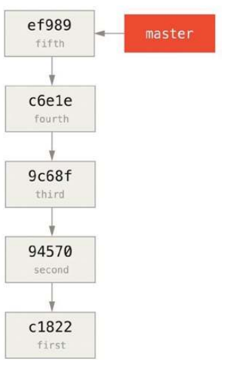

创建一个`history`分支，只到`4`为止。旧历史创建到此完成，可以直接将`history`推送到某个仓库并`archive`供人查看。不再演示

```
$ git branch history c6e1e95
```

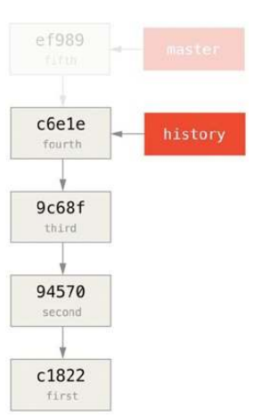

创建新历史段，需要基于一个初始`commit`（独立的`commit`，不和任何其他的分支或`commit`关联）创建

```
$ echo "get history from site http://example.com/archive/project.git" | git commit-tree 9c68fdc^{tree}
```

新建的一个`commit`和其他`commit`关系如下

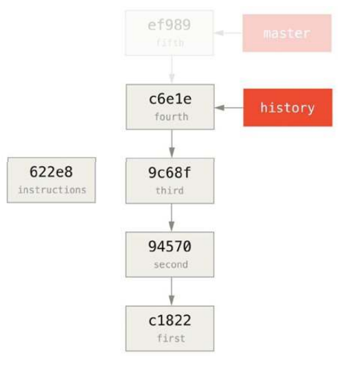

直接将新历史`rebase`到该`commit`上面即可

```
$ git rebase --onto 622e88 9c68fdc
```

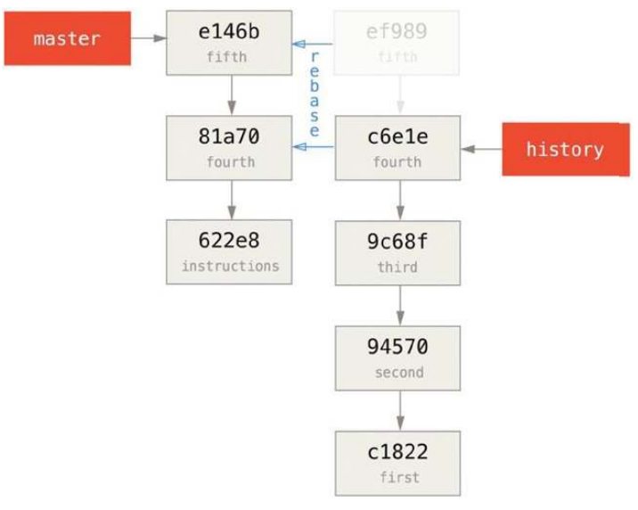

查看新历史，可以发现新的`4`和`5`的哈希值都变了

```
$ git log
e146b5f fifth commit
81a708d fourth commit
622e88e get history from site http://example.com/archive/project.git
```

作为新来的开发者，如果想要合并这两段仓库历史，使用以下命令（需要事先保证这两条历史在本仓库以不同的分支存在），直接将新的`4`替换为旧的`4`（`4`本身哈希值不变。`replace`的用法也是需要保留一个重叠`commit`的原因）

```
$ git replace 81a708d c6e1e95
```

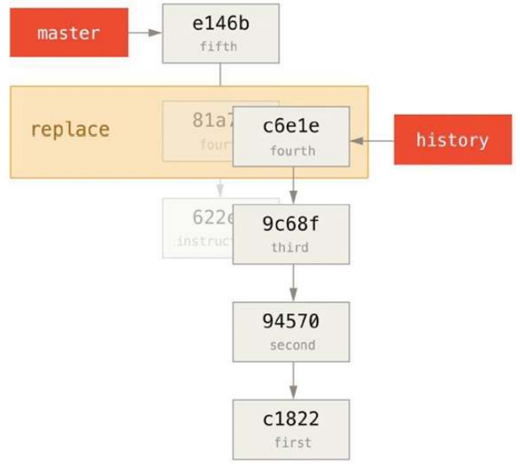

### 3.5.31 其他命令参考

**HTTP登录信息缓存**

通过以下命令开启HTTPS登录信息缓存，默认有效期`15`分钟（有效期可以通过`--timeout`参数指定，单位秒）。此外`git`还支持登录信息存储到文件，但是是明文，不建议使用

```
$ git config --global credential.helper cache
```

**生成补丁（常用于email提交）**

假设我们提交分支`iss51`相对`master`的补丁，通过以下命令生成（默认有几个`commit`就生成几个文件）

```
$ git checkout iss51
$ git format-patch master
```

或根据指定`commit`之后的提交生成补丁（不包含指定`commit`本身）

```
$ git format-patch a38727cb
```

或指定范围`commit`（不包含起始`commit`本身）

```
$ git format-patch cc61553e..70d849b2
```

或从仓库创建开始直到指定`commit`

```
$ git format-patch --root 70d849b2
```

或只包含指定`commit`

```
$ git format-patch -1 70d849b2
```

> 一个`patch`由`3`部分构成：元数据（`commit`哈希值，提交者，日期），Commit Log，以及补丁本身（`diff`格式）

合并到一个文件

```
$ git format-patch master --stdout > iss51-fix.patch
```

将上述文件合并到仓库使用`git am`命令

```
$ git checkout iss51-merge
$ cat iss51-fix.patch | git am
```

添加`--signoff`

```
$ cat iss51-fix.patch | git am --signoff
```

如果是应用多个补丁

```
$ cat *.patch | git am
```

交互模式

```
$ cat *.patch | git am -i
```

`patch`失败后，手动调整（需要一个`commit`）并继续

```
$ git am --continue
```

**应用补丁**

`git`使用`git apply`命令应用补丁，但是不创建新的`commit`

仅应用补丁到工作区

```
$ git apply iss51-fix.patch
```

同时应用补丁到工作区和Index（`stage`区）

```
$ git apply --index iss51-fix.patch
```

只应用补丁到Index

```
$ git apply --cached iss51-fix.patch
```

**从指定Commit恢复文件到工作区**

使用`git restore`可以恢复指定文件树到工作区或Index区。**编译旧版本代码或临时切换工作目录源码版本常用**，不要使用`git reset`

> 建议每次`git restore`之前先清空一下工作区，因为`git restore`不会自动删除目标commit中没有的文件

恢复`HEAD`内容（仅`src/`子目录）同时到工作区，Index区

```
$ git restore -s HEAD --staged --worktree src/
```

恢复整个工作区到指定版本（`tag`，也可以指定`commit`哈希）

```
$ git restore -s v1.1 --staged --worktree .
```

**二分查找**

有时我们需要快速定位导致Bug产生的`commit`，需要不断在历史提交之间切换。使用`git bisect`可以方便地使用二分查找法排除

二分查找首先需要找出一个好的`commit`，以及一个坏的`commit`，记住它们的哈希

开始二分查找

```
$ git bisect start
```

指定`commit`

```
$ git bisect good cc61553e
$ git bisect bad c7a15001
```

此时会回退到这两个`commit`的中间版本。如果这个`commit`是坏的，执行以下命令

```
$ git bisect bad
```

如果是好的

```
$ git bisect good
```

查找结束以后，会打印找到的引发`bug`的`commit`

```
$ git bisect good
b2b79df... is the first bad commit
commit b2b79df...
Author: ...
```

退出`bisect`，回到`master`分支

```
$ git bisect reset
```