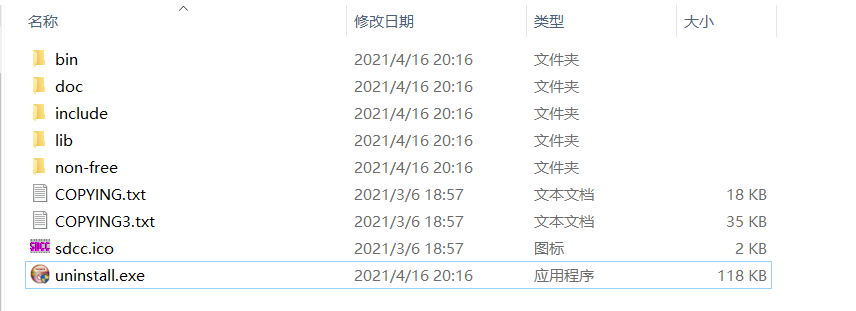
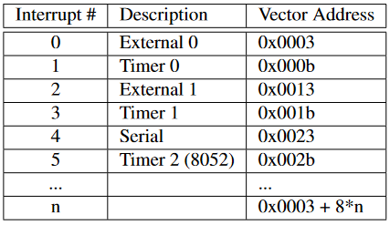

# 基于VSCode以及开源工具链的通用MCU开发环境，适用于Windows，Linux，FreeBSD

**本环境要求最好有Linux基础，~~主要面向经常使用Linux或FreeBSD的Windows用户~~**

支持的MCU：8051（Atmel，STC），ARM（ST，TI，Atmel）

未来添加对于AVR（Atmel）的支持，适用于Arduino Uno

上次编辑于：2021.06.16


## 1 环境搭建

### 1.1 基本环境配置

### 1.1.1 编辑器安装

安装VSCode（步骤略，一般Linux下VSCode的开源许可证版本为OSS）


### 1.1.2 Windows下的MSYS2安装

如果是Windows，安装[MSYS2](https://www.msys2.org/)

> MSYS2是一个Windows下的类Unix环境，类似并**包含了mingw和llvm-clang软件集，集成`pacman`包管理器**，可以方便下载安装各种开源软件比如Git，Make，GCC，LLVM，CMake，像使用ArchLinux一样使用Windows
>
> MSYS2下可以直接在Shell下操作串口，一般在`/dev/ttySx`

**首先配置Windows环境变量**，这样可以直接使用`bash`，也可以`Win+R`调出`msys2`或`mingw64`

设MSYS2安装在`D:\msys64`，那么

> 1. 在`Path`变量末尾添加`D:\msys64\usr\bin`（为了能运行基本的软件如`bash`，`make`等）
> 2. 添加`D:\msys64\mingw64\bin`和`D:\msys64\mingw32\bin`（为了使用mingw下的软件，比如mingw版的arm工具链）
> 3. 添加`D:\msys64\clang64\bin`和`D:\msys64\clang32\bin`
> 4. 添加`D:\msys64`（`Win+R`调出`msys2`和`mingw64`）

**使用方法1（直接运行bash，推荐）**：如果配置正常，`Win+R`运行，输入`bash`启动，此时`bash`继承了Windows的`Path`环境变量，现在既可以使用MSYS2下已经安装的软件，也可以使用Windows的命令

**使用方法2（常规方法，在msys2或mingw64或clang64下运行bash）**：`Win+R`运行，可以直接启动`msys2`并提供一个`bash`操作界面，但是注意`msys2`中的`$PATH`不是继承于Windows下`Path`环境变量，所以要用到其他命令时需要配置`$PATH`

其他更多有关MSYS2常规的配置（比如改镜像源，pacman更新）此处省略


### 1.2 工具链部署

### 1.2.1 安装make

安装`cmake`和`make`，有需要的话安装`git`

**Windows**

通过MSYS2安装

```shell
pacman -S cmake make
```

**ArchLinux**

```shell
pacman -S cmake make
```

**FreeBSD**

```shell
pkg install cmake gmake make
```


### 1.2.2 8051工具链

使用[SDCC](http://sdcc.sourceforge.net/)，官方[手册](http://sdcc.sourceforge.net/doc/sdccman.pdf)

SDCC是一个适用于8051，PIC，STM8等经典MCU的工具集

一般的Linux发行版也可以通过官方仓库安装，但是可能版本较老

~~SDCC虽然难以实机调试，但是已经包含了8051模拟器，使用`sdcdb`调试即可~~

SDCC的调试器`sdcdb`目前还处于非常不完备的状态，基本无法使用，可以使用[VM8051](https://github.com/lukbettale/VM8051)，pdf版使用[说明](src/201220a01/VM8051Guide.pdf)

**VM8051安装**

```shell
git clone https://github.com/lukbettale/VM8051.git
cd VM8051
make && make install
```

**Windows**

[下载](https://sourceforge.net/projects/sdcc/files/sdcc-win64/)页面

安装完成后，允许SDCC自动配置环境变量

此时启动`bash`，输入`sdcc`，正常情况下会有输出


**ArchLinux**

```shell
pacman -S sdcc
```

**FreeBSD**

```shell
pkg install sdcc
```


### 1.2.3 ARM（Cortex-M）工具链

可以直接通过官方仓库安装，使用GNU或LLVM工具链（**建议使用GNU工具链**，目前OpenOCD对GDB支持较好，LLDB未知）

**Windows**

`Win+R`，打开`bash`

```shell
pacman -S mingw-w64-x86_64-arm-none-eabi-toolchain
```

安装了包含`arm-none-eabi-gdb`在内的工具

**ArchLinux**

```shell
pacman -S arm-none-eabi-gcc arm-none-eabi-binutils arm-none-eabi-gdb
```

**FreeBSD**

~~FreeBSD正在去GNU化~~，官方仓库只有`arm-none-eabi-gcc`，可以使用`llvm`工具链作为替代（目前最新的Keil AC6已经转向`llvm`），或者下载`arm-none-eabi`编译安装

```shell
pkg install llvm
```


### 1.2.4 OpenOCD

OpenOCD是一个开源的调试服务器，会连接调试器（比如ST-LINK）驱动并负责接受`arm-none-eabi-gdb`的连接与调试。**建议安装最新版**

[官网](http://openocd.org)

[GNU toolchains](https://gnutoolchains.com/arm-eabi/openocd/)

[参考文档](http://openocd.org/documentation/)

**Windows**

MSYS2官方库有OpenOCD软件包，这里还是使用传统方法安装

OpenOCD Windows [下载](https://www.gnutoolchains.com/arm-eabi/openocd/)

假设解压到`D:\OpenOCD`下，需要添加`D:\OpenOCD\bin`到`Path`

**ArchLinux**

```shell
pacman -S openocd
```

**FreeBSD**

目前只有10版

```shell
pkg install openocd
```


### 1.3 硬件驱动

### 1.3.1 串口

Windows下常用串口VCP驱动

CH340 [南京沁恒](http://www.wch.cn/products/CH340.html)

CP2102 [Silicon Labs](https://www.silabs.com/developers/usb-to-uart-bridge-vcp-drivers)

FT232 [FTDI](https://ftdichip.com/drivers/vcp-drivers/)


### 1.3.2 调试器（Linker）驱动

如果是在Linux或者FreeBSD下，各种调试器在安装完OpenOCD之后应该就已经可以直接用了，而Windows下调试器驱动需要手动安装

CMSIS-DAP（开源） [ARM](https://www.keil.com/support/man/docs/dapdebug/dapdebug_introduction.htm)Keil官方 

CMSIS-DAP [Github1](https://github.com/RadioOperator/STM32F103C8T6_CMSIS-DAP_SWO)，[Github2](https://github.com/wuxx/nanoDAP)，需要自己编译烧录

ST-Link [ST](https://www.st.com/zh/development-tools/stsw-link009.html#get-software)

J-Link [SEGGER](https://www.segger.com/downloads/jlink/#J-LinkSoftwareAndDocumentationPack)

[OpenOCD](https://gnutoolchains.com/arm-eabi/openocd/)也有以上部分调试器驱动，可以直接使用里面的驱动


## 2 8051单片机

### 2.1 工具链使用：SDCC

### 2.1.1 SDCC的目录结构与组成

Windows下SDCC的目录如下



| Windows目录 | Linux安装路径 | FreeBSD安装路径 | 内容 |
| :-: | :-: | :-: | :-: |
| bin | /usr/bin | /usr/local/bin | 二进制文件，SDCC的各种工具，包括编译器，汇编器，链接器，调试器，模拟器，库文件工具，hex文件转换工具等 |
| include | /usr/share/sdcc/include | /usr/local/share/sdcc/include | 头文件 |
| lib | /usr/share/sdcc/lib | /usr/local/share/sdcc/lib | 库文件 |
| non-free/include | /usr/share/sdcc/non-free/include | /usr/local/share/sdcc/non-free/include | 非自由许可证头文件 |
| non-free/lib | /usr/share/sdcc/non-free/lib | /usr/local/share/sdcc/non-free/lib | 非自由许可证库文件 |

命令：

| 命令 | 作用 |
| :-: | :-: |
| `sdcc` | 主要的编译器，将根据不同的指令集生成不同的汇编代码 |
| `sdcpp` | 预处理器 |
| `sdas8051 sdas390 sdasz80 sdasgb sdas6808 sdasstm8` | 不同系统的汇编器 |
| `sdld sdldz80 sdldgb sdld6808` | 链接器 |
| `sdcdb` | 调试器 |
| `s51 sz80 shc08 sstm8`  | 各系统的ucSim模拟器 |
| `sdar sdranlib sdnm sdobjcopy` | 用于库文件的操作 |
| `packihx` | 将.ihx文件转换为.hex文件用于烧录（实际使用中可以不转换，.ihx文件可以直接用于烧录），输出到标准输出 |
| `makebin` | 将.hex转换为二进制.bin文件，输出到标准输出 |


### 2.1.2 SDCC的工作流程简介

在最为简单的情况下，`sdcc`调用`sdcpp`进行预处理，之后编译为汇编代码，然后调用对应`sdas`和`sdld`编译出目标代码

包含的头文件，**如果使用了`-I`参数进行指定，那么会优先到指定的目录下查找头文件，之后再到安装的`include`以及`non-free/include`下面找**。而类似的对于库文件来说，如果使用`-L`参数指定，那么同样会优先到指定的目录下查找


### 2.1.3 SDCC编译方法

**`sdcc`参数**

| 命令行参数 | 作用 |
| :-: | :-: |
| `--std-sdcc99` | c99标准，带sdcc扩展 |
| `--std-sdcc11` | c11标准（默认选项），带sdcc扩展 |
| `-mmcs51` | 指定为8051指令集，默认选项 |
| `-E` | 仅预处理，处理结果输出到标准输出 |
| `-S` | 仅预处理和编译，生成`.asm` |
| `-c` | 预处理、编译和汇编，但不链接，生成`.rel`，`.lst`，`.sym` |
| `-o` | 指定输出文件名或输出到目录，目录名必须带`/` |
| `--debug` | 如果需要使用`sdcdb`和模拟器调试，那么编译时在最后添加该选项 |
| `-V`或`-v` | 显示过程 |
| `--opt-code-size` | 优化程序大小 |
| `--opt-code-speed` | 优化程序速度 |
| `-Wp option1,option2` | 向`sdcpp`传参 |
| `-Wa option1,option2` | 向汇编器传参 |
| `-Wl option1,option2` | 向链接器传参 |

**`sdcpp`预处理参数**

| 命令行参数 | 作用 |
| :-: | :-: |
| `-I` | 添加头文件路径 |
| `-Dmy_macro=xxx` | 添加宏定义 |
| `-Umy_macro` | 去除宏定义 |
| `-M`或`-MM` | 从标准输出显示每个目标文件的文件依赖，`-M`显示全部 |
| `-dM` | 显示最终有用的宏 |
| `-dD` | 显示所有宏 |
| `-dN` | 显示所有宏，但是不显示宏内容 |

**链接器参数**

| 命令行参数 | 作用 |
| :-: | :-: |
| `-L` | 添加库文件路径 |
| `--xram-loc 0x8000` | 指定外部RAM起始位置为`0x8000` |
| `--code-loc` | 指定代码区起始位置 |
| `--stack-loc` | 指定堆栈起始位置 |
| `--xstack-loc` | 指定外部堆栈起始位置 |
| `--data-loc` | 指定内部RAM数据区起始位置 |
| `--idata-loc` | 指定间接寻址RAM起始位置 |
| `--bit-loc` | bit寻址起始位置 |
| `-i` | 单独使用`sdld`时，指定输出`.ihx`文件 |
| `-y` | 单独使用`sdld`时，指定输出`.cdb`文件 |


**mcs8051专有参数**

| 命令行参数 | 作用 |
| :-: | :-: |
| `--model-small` `--model-medium` `--model-large` `--model--huge` | 指定内存模型 |
| `--xstack` | 使用pseudo stack |
| `--iram-size` | 链接器检测内部RAM是否在限制以内 |
| `--xram-size` | 链接器检测外部RAM是否在限制以内 |
| `--code-size` | 链接器检测代码大小是否在限制以内 |
| `--stack-size` | 链接器检测堆栈大小 |

**`sdcc -c main.c`编译后生成各文件作用**

| 后缀名 | 作用 |
| :-: | :-: |
| `.asm` | `sdcc`通过预处理和编译生成的汇编源文件，如果使用的是`sdcc -S`，那么就只会生成这个文件 |
| `.rel` | 汇编器的输出，作为链接器的输入 |
| `.lst` | 汇编器生成的汇编列表文件 |
| `.sym` | 汇编器生成的符号列表 |

**如果是`sdcc main.c`，相比不链接多出以下文件**

| 后缀名 | 作用 |
| :-: | :-: |
| `.ihx` | 加载模块，Intel的hex格式文件 |
| `.lk` | 链接器命令行参数 |
| `.map` | 链接器的输出，加载模块的memory map |
| `.mem` | 内存使用统计 |
| `.rst` | 链接器输出，添加了linkedit信息的汇编列表文件 |

**`--debug`模式，相比普通模式会多出以下文件**

| 后缀名 | 作用 |
| :-: | :-: |
| `.cdb` | 调试信息文件，在 |
| `.adb` | 包含调试信息，用于生成.cdb文件的中间文件，在编译阶段生成 |
| `.omf` | absolute object module format，包含调试信息（AOMF51格式），用于第三方工具 |

**最后输出文件的处理**

| 命令 | 作用 |
| :-: | :-: |
| `packihx` | 将`.ihx`转换为标准`.hex`文件，输出到标准输出（实测可以不用转换，直接烧录`.ihx`文件） |
| `makebin` | 生成`.bin`二进制文件，输出到标准输出 |

**简单的多文件编译方法**

> 假设有main.c，lib1.c，lib2.c三个文件的工程
> 可以有如下两种编译方法

```shell
sdcc -c lib1.c
sdcc -c lib2.c
sdcc main.c lib1.rel lib2.rel
```

```shell
sdcc -c lib1.c
sdcc -c lib2.c
sdcc -c main.c
sdcc main.rel lib1.rel lib2.rel
```

### 2.1.4 使用库

`sdcc`同样支持`.lib`库的使用，生成`.lib`库时最好将不同的功能模块写到不同源文件。**`.lib`文件的作用和一般PC平台GCC中使用到的`.a`库文件类似，GCC中`.a`包含了多个`.o`文件，而SDCC的`.lib`包含了多个`.rel`文件**

**用于SDCC库操作的命令全部来自`sdbinutils`**，功能和常用GNU工具链中的相应命令基本相同

```shell
sdcc main.c mylib.lib -L libdir
```

可以使用`sdar`创建`.lib`库文件

```shell
sdar -rc mylib.lib module1.rel module2.rel module3.rel
```

**`sdbinutils`包括`sdar` `sdnm` `sdobjcopy` `sdranlib`**

**`sdar`用法**

`sdar`用于创建库以及管理库成员

```shell
sdar -options mylib.lib file1.rel file2.rel
```

| 命令行参数 | 作用 |
| :-: | :-: |
| `p` | 显示库内容 |
| `t` | 显示文件成员 |
| `r[a\|b][f][u]` | 替换或添加文件成员，其中`a`或`b`为成员名，分别代表某个成员之后和之前，`f`截断输入文件名，`u`仅更新改变的成员 |
| `d` | 删除文件成员 |
| `m[a\|b]` | 移动文件成员 |
| `x[o]` | 提取文件成员，`o`保留原始日期 |
| `s` | 相当于`ranlib` |
| `q[f]` | 快速添加文件成员 |
| `c` | 通用参数，需要创建库时不提示 |
| `T` | 通用参数，创建thin archive |
| `v` | 通用参数，显示过程 |

**`sdnm`用法**

`sdnm`用于列出一个目标文件里的符号

| 命令行参数 | 作用 |
| :-: | :-: |
| `a` | 过滤参数，显示调试标记 |
| `D` | 过滤参数，显示动态标记而不是普通标记 |
| `--defined-only` | 过滤参数，仅显示已定义 |
| `u` | 过滤参数，仅显示未定义 |
| `--special-syms` | 过滤参数，显示特殊标记 |
| `--synthetic` | 过滤参数，显示synthetic标记 |
| `g` | 过滤参数，仅显示外部标记 |
| `l` | 显示每个标记的文件名与行号 |
| `n` | 按地址排序 |
| `S` | 显示已定义符号所占空间 |


**`sdobjcopy`用法**

`sdobjcopy`用于将一种目标文件中的内容复制到另一种目标文件中，也可以用于将一种目标文件格式转换成为另一种目标文件格式

`sdobjcopy`支持的文件格式有`asxxxx` `symbolsrec` `verilog` `tekhex` `binary` `ihex`

```shell
sdobjcopy -options infile outfile
```

| 命令行参数 | 作用 |
| :-: | :-: |
| `-I bfdname` | 指定输入文件格式，可以是以上支持的文件格式的一种 |
| `-O bfdname` | 指定输出文件格式 |
| `-F bfdname` | 指定输入输出文件格式 |
| `-p` | 保留时间戳 |
| `-B arch` | 指定输出指令集架构 |
| `-D` | 产生的文件不可逆转，`-U`可逆转 |
| `-j name` | 仅拷贝名为`name`的section |
| `-R name` | 在输出中去除`name` |
| `-S` `--strip-all` | 除去所有`symbol`和重定位信息 |
| `-g` `--strip-debug` | 除去所有调试信息 |
| `--strip-dwo` | 除去所有DWO |
| `--strip-symbol sym` | 不复制指定标记 |
| `-K sym` | 保留指定标记 |
| `-G sym` | 指定某个为全局标记，其他为局部标记 |
| `-L sym` | 指定某个为局部标记 |
| `-W sym` | 弱化标记 |
| `--globalize-symbol=sym` | 指定某个为全局标记 |
| `-x` | 不拷贝非全局 |
| `-X` | 不拷贝局部 |
| `-i interleave` | 每隔interleave字节拷贝1byte |
| `-b byte` | 和`-i`一起使用，拷贝每个interleave中的第byte字节（0到i-1），一般用于srec的输出 |


**`sdranlib`用法**

`ranlib`用于更新库文件的符号索引，一般在追加新的成员之后，本质是`sdar`的另一种形式

| 命令行参数 | 作用 |
| :-: | :-: |
| `-t` | 更新时间戳 |


### 2.1.5 基于sdcdb的调试

**`sdcdb`目前基本无法使用，建议使用VM8051**

如果想要调试，就必须在编译时加上`--debug`选项，生成`.cdb`文件

假设调试`sample.c`，已经编译完成，`sdcdb`会自动启动相应模拟器

```shell
sdcdb -cpu 8051 sample
```

**`sdcdb`命令行参数**

| 命令行参数 | 作用 |
| :-: | :-: |
| `--directory=` | 指定查找目录，调试器会查找`.c` `.ihx` `.cdb` |
| `-cd` | 到指定目录 |
| `-cpu` | 指定cpu类型 |
| `-X` | 指定晶振频率 |
| `-s` `-S` `-k` | 模拟器参数 |


**`sdcdb`交互命令**

大部分命令和`gdb`类似

| 命令 | 作用 | 使用方法 |
| :-: | :-: | :-: |
| `break` | 设置断点 | `break [file:]{line|func}` |
| `clear` | 清除断点 | `clear [file:]{line|func}` |
| `continue` | 断点后继续 |  |
| `finish` | 执行到当前函数末尾 |  |
| `delete` | 删除断点n，不指定断点则删除所有 | `delete [n]` |
| `info` | 最重要的命令，显示各种信息，后加`break`显示当前所有断点，`stack`显示函数调用堆栈，`frame`显示当前执行frame，`registers`显示所有寄存器内容 | `info [break|stack|frame|registers]` |
| `step` | 单步调试 |  |
| `next` | 单步调试，经过子程序调用 |  |
| `run` | 启动调试程序 |  |
| `ptype` | 显示变量类型 | `ptype var` |
| `print` | 显示变量值 | `print var` |
| `file` | 加载文件 | `file filename` |
| `frame` | 显示当前`frame`信息 |  |
| `set srcmode` | 切换C源码或汇编源码调试模式 |  |
| `!` | 模拟器命令 | `! cmd` |
| `quit` | 退出调试 |  |


### 2.1.6 基于VM8051的调试

直接启动即可

```shell
vm8051 out.ihx
```

使用说明见[VM8051Guide](src/201220a01/VM8051Guide.pdf)


### 2.2 STC的89C51系列开发（STC89C52RC）

### 2.2.1 扩展关键字

SDCC扩展的关键字如下，**分为变量声明和寄存器声明两种**，和Keil C51类似，区别是在前面都要加上`__`双下划线

| 变量声明关键字 | 作用 |
| :-: | :-: |
| __bit | 单bit变量，置于内部可位寻址区，一般放在0x20\~0x2F，对于位地址0x00\~0x7F |
| __data | 将变量置于内部RAM的低128Byte地址空间中，可以直接或间接寻址，一般是放在0x30\~0x7F。**是small内存模式下默认的变量地址空间** |
| __idata | 将变量置于内部RAM中，间接寻址，一般是放在0x80\~0xFF |
| __pdata | 将变量置于外部RAM的低256Byte地址空间中，使用Ri间接寻址，地址从0x00到0xFF。**是medium内存模式下默认的变量地址空间** |
| __xdata | 将变量置于外部RAM中，使用DPTR间接寻址，地址从0x0000到0xFFFF。**是large内存模式下默认的变量地址空间** |
| __code | 将数据置于ROM中，使用DPTR间接寻址，地址从0x0000到0xFFFF |

示例

```c
__data unsigned char a = 0;
__xdata int b = 0;
__bit c = 0;
```

| 寄存器声明关键字 | 作用 |
| :-: | :-: |
| __sfr | 8bit长度特殊寄存器 |
| __sfr16 | 16bit长度特殊寄存器 |
| __sfr32 | 32bit长度特殊寄存器 |
| __sbit | 可位寻址寄存器地址 |

寄存器常量通过`__at`关键字进行规定，这和Keil C51不同，**其实就是给一个地址处的寄存器规定一个符号，比如P0**。一般寄存器常量已经在对应头文件中有声明，用户无需操作。**16bit寄存器需要分别指定高位和低位地址（如果寄存器访问有严格顺序规定最好不要使用__sfr16声明，因为编译器优化有可能会导致乱序访问）**，示例如下

```c
__sfr __at (0x80) P0;
__sbit __at (0x81) P0_1;
__sfr16 __at (0x8C8A) TMR0;
```

### 2.2.2 指针

和普通变量相同，指针也可以通过声明指定存放的位置，本质是间接寻址。指针可以不规定指向的数据类型，也可以使用指向函数的指针

示例

```c
__xdata unsigned char* __data p1;
__data unsigned char* __xdata p2;
__xdata unsigned char* __code p3;
unsigned char* __xdata p4;
char (*__data fp)(void);
```


### 2.2.3 中断声明

SDCC中断号与其对应中断如下



中断的声明如下

```c
void time_isr (void) __interrupt 0 __using 1
{
    // Interrupt service code
}
```

其中`__interrupt`关键词使得编译器在中断向量表中插入到这个函数的跳转指令（这里是中断0），`__using`关键词可以用于指定这个中断使用的工作寄存器组（0\~3），这样在保存现场时不用压栈所有通用寄存器，只要压栈ACC、B等关键寄存器即可（也可以不指定，但是会额外增加压栈时间导致中断响应延迟增加，这在高频率中断中可能会产生问题）。这和ARMv7 Cortex-A系列的FIQ快速中断原理类似

**中断注意事项**

> 1. 如果中断使用到了其他函数内使用到的变量，这些变量声明需要添加`volatile`关键字

```c
volatile __data char i;
```

> 2. 8位单片机访问一些16位或更长的变量时往往需要使用多于一条指令，这就是操作的非原子性，此时发生中断将会发生异常，建议关中断

> 3. 中断调用要注意栈溢出

> 4. 尽量不要在中断中或有中断发生的main中使用不可重入函数，这包括一些需要外部浮点函数库的数学运算。如果要使用，最好将这些不可重入函数使用`--stack-auto`参数重新编译，并且源代码需要使用`--int-long-reent`重新编译


### 2.2.4 常用技巧

**由于8051的体系结构限制，所有IO寄存器（所有SFR）只能使用直接寻址方式，所以不能使用IO引脚号作为函数的参数**（因为所有访问IO的指令，比如设置P0`MOV 80H, #01H`在编译时就已经定死无法更改），也不存在IO变量，这极大限制了8051代码的灵活性以及代码复用。而像Arduino这样基于AVR的单片机可以使用IO号作为函数的参数

这里提供一些变通的方法

**使用宏定义**

```c
#define PIN_D0 P0_0
#define PIN_D1 P0_1

void init() {
    PIN_D0 = 1;
    PIN_D1 = 0;
}
```

因为编译器处理流程是预处理-编译-汇编-链接，所以如果是自己设计的函数库，头文件分别放在./inc以及./src下，宏定义也必须放在相应头文件中而不是main.c中（独立的宏定义可以通过在用户区添加一个共用头文件实现，但是需要修改Makefile，目前的Makefile较为简单还无法实现qwq，计划改进工程模板以及Makefile支持更加复杂的文件依赖，或者引入Makefile的自动依赖推导）

从软件工程的角度看，使用宏定义不是一种完美的代码复用方案，因为需要更改原来的代码再次编译，这也不利于库文件以及可重定位文件的应用，因而8051开发中库文件一般只用在不涉及IO的场合。但是使用宏定义执行效率最高，并且一般的廉价8051单片机资源极其有限，所以宏定义还是最适合的方案

**定义IO函数**

可以定义专门的函数用于SFR操作，但是会用到switch或if判断，降低效率

```c
void io_func(unsigned char io, unsigned char s) {
    switch(io) {
        case 0:
            P0_0 = s;
            break;
        case 1:
            P0_1 = s;
            break;
        // ...
    }
}
```

**使用函数指针**

如果使用函数指针，需要定义额外的函数（可以额外定义一套.c和.h）用以不同的IO读写，消耗程序空间，并且函数调用也会额外增加开销，如果增加判断语句会进一步降低效率，综合来看效率不如以上方案，并且代码繁琐。这种方案一般很少采用


## 3 ARM单片机

### 3.1 工具链使用：arm-none-eabi-gcc

`arm-none-eabi-gcc`是目前在各大MCU厂商的集成开发环境中使用最多的编译工具链，目前最典型的搭配就是Eclipse魔改+GNU工具链，ST的STM32CubeIDE、TI的CCS、NXP的MCUexpresso都是此种方案


### 3.2 工具链使用：llvm

llvm工具链也是开源工具链，目前被Keil所使用，在AC6被引入，取代了原本的ARM编译器


### 3.3 ST的STM32系列开发（STM32F103C8T6，STM32F407VET6，STM32F401CCU6）（Third party boards）

### 3.4 Atmel的SAM系列开发（ATSAM3X8E）（Arduino DUE）

### 3.5 TI的Tiva系列开发（TM4C123GH6PM）（TI EK-TM4C123GXL）

## 4 AVR单片机

暂无