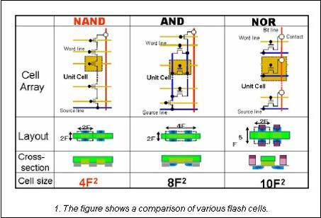
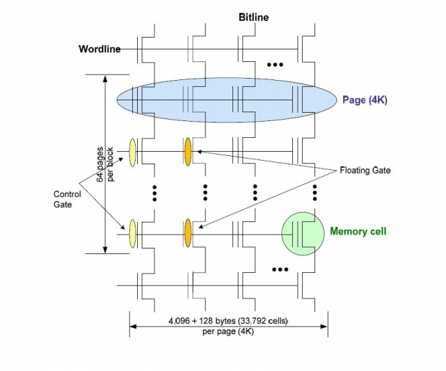
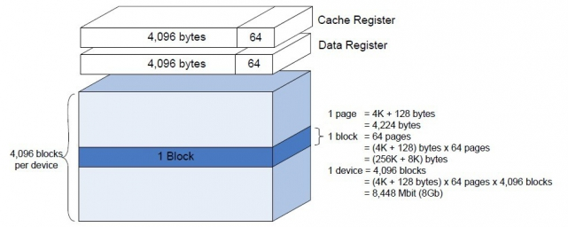
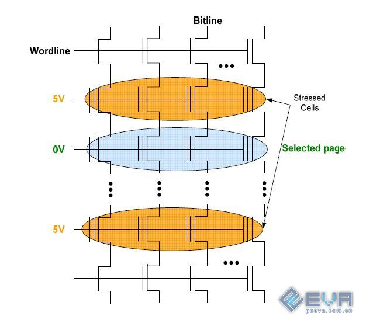
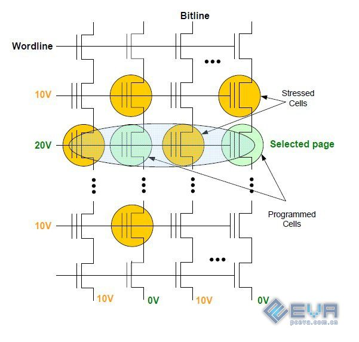
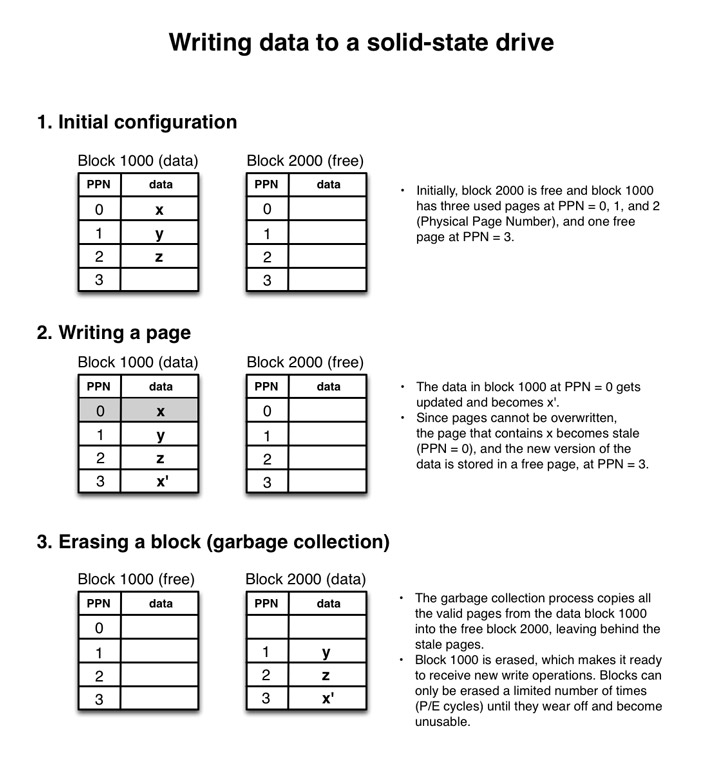
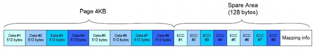
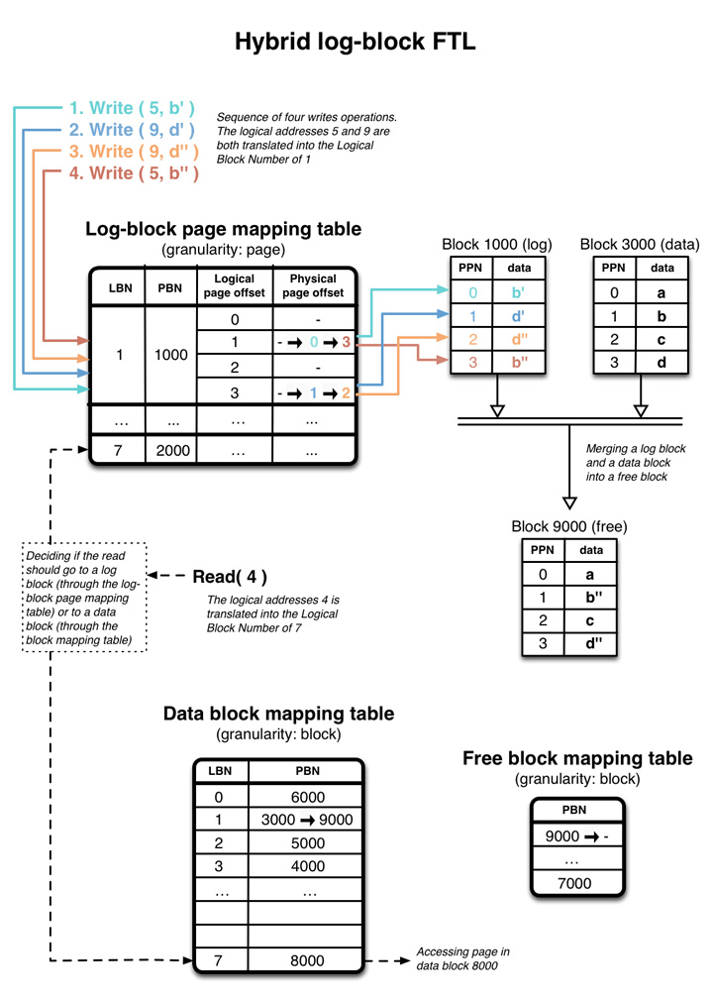

# 固态存储原理以及应用优化方法

有关于固态硬盘和其他类似闪存类存储介质的工作原理，以及软件的优化方法

主要参考网络资料，从个人理解出发，有的可能不是很准确

## 参考

重点参考文章[链接](http://codecapsule.com/tag/solid-state-drives/)，作者Emmanuel Goossaert，个人[主页](http://goossaert.com/)

## 前言

SSD的工作原理远比我们想象的要复杂。可以说FTL的实现就是SSD的核心技术。FTL是一些算法的集合，集成于主控，用来管理固态硬盘存储单元的映射，基本的读写更新操作，数据的搬运，校验，垃圾回收等，它很大程度上决定了一块SSD的性能以及耐用性。不仅大量的写入会损耗SSD的闪存颗粒寿命，大量的读取也会损耗闪存寿命（读取时也会有写入操作，对用户透明，不会计入SMART中的写入计数），甚至只要通电，不进行任何操作，SSD主控也会对数据单元进行搬运，产生读写

由于文件系统使用指针的特性，SSD的主控并不理解文件系统的删除操作，所以被永久删除的文件占用的数据单元依然会保留，并被不断搬运。所以就需要TRIM来回收

## 知识预备

在计算机的外设中，磁盘属于块设备，操作基于块。通过IO操作磁盘的方法，一般有LBA28和LBA48模式。主机向磁盘发送逻辑数据块地址，磁盘将LBA转译为物理地址。以LBA28模式为例，一般以前的机械硬盘一个sector容量为512字节，所以28bit理论上最多可以寻址512*2^28共计128GiB空间。而LBA48可以支持128PiB空间。

注意，这里的Block是指的数据操作的基本单位，对应传统机械硬盘的一个sector，并不对应之后讲到的SSD的Block概念，对应SSD的Page更为恰当

## 目录

+ [**1**](#1-固态硬盘物理结构) 固态硬盘物理结构
    + [**1.1**](#11-nand基本构成) NAND基本构成
+ [**2**](#2-固态硬盘工作机制) 固态硬盘工作机制
    + [**2.1**](#21-读取) 读取
    + [**2.2**](#22-写入与修改) 写入与修改
    + [**2.3**](#23-擦除) 擦除
    + [**2.4**](#24-ecc) ECC
    + [**2.5**](#25-常用性能评估单位) 常用性能评估单位
    + [**2.6**](#26-写入放大write-amplification) 写入放大（Write amplification）
    + [**2.7**](#27-损耗均衡wear-leveling) 损耗均衡（Wear leveling）
    + [**2.8**](#28-ftl层flash-translation-layer) FTL层（Flash Translation Layer）
    + [**2.9**](#29-垃圾回收gc) 垃圾回收（GC）
+ [**3**](#3-固态硬盘高级特性) 固态硬盘高级特性
    + [**3.1**](#31-trim指令) TRIM指令
    + [**3.2**](#32-冗余) 冗余
    + [**3.3**](#33-安全擦除重置) 安全擦除（重置）
    + [**3.4**](#34-本地指令队列ncq) 本地指令队列（NCQ）
    + [**3.5**](#35-掉电保护) 掉电保护
    + [**3.6**](#36-并行化) 并行化
+ [**4**](#4-总结ssd的应用优化方法) 总结：SSD的应用优化方法
    + [**4.1**](#41-读取写入形式) 读取写入形式
    + [**4.2**](#42-系统优化) 系统优化

## 1 固态硬盘物理结构

大部分人应该都看过固态硬盘的评测视频。固态硬盘一般由主控芯片以及若干NAND颗粒构成。主控芯片提供计算机接口（SATA或NVMe协议）并通过内部NAND控制器连接NAND，同时也是决定固态性能的关键因素之一。有的主控还带有外置DRAM。

目前常见非易失存储器分为NAND以及NOR两大阵营，两者都是由Fujio Masuoka发明改良而来。

NAND，NOR，顾名思义，其内部结构和与门、或门的构造原理有很大相似之处。其根本由特制的NMOS管组成，也有S，G，D极之分，区别是在G极之下添加了一个浮空栅。非易失存储器基本存储单元如下图所示：

浮空栅和G极以及衬底之间都有很薄的一层二氧化硅，用于隔开浮空栅防止电荷泄露，浮空栅用于长时间存储电荷。在NAND中，单个数据单元的读写都是通过电子隧道效应，通过给G极施加适当电压就可以对浮空栅极进行充放电。而在NOR中，充电是通过源极对浮栅进行热电子注入进行充电，而放电和NAND相同。

NAND各存储单元采用串联的形式，而NOR采用并联的形式，这也是其名称的由来。NAND属于块设备，操作基于块，软件上使用块号，页号，页内偏移量三级寻址，不可以直接寻址；而NOR可以直接寻址，操作基于字节或字。

NAND相比NOR成本更低，功耗也更低，目前固态硬盘等大容量存储块设备都是基于NAND。而NOR应用同样非常广泛，多用于单片机存储器（比如STM32的QSPI），x86计算机的BIOS等。

## 1.1 NAND基本构成

NAND基本由Block构成，每个Block又由若干Page构成。NAND以Page为基本读写单元，而擦除以Block为单位进行擦除。一般一个页大小为4KB（这也是SSD要进行所谓4K对齐的原因）

一般一个颗粒的逻辑结构如下，一个Page另外带128字节的Cache和数据寄存器

> 由之前的存储单元的基本结构（带浮空栅的NMOS）大概可以猜到了，为什么一个NAND颗粒可以开成SLC，MLC，TLC，乃至QLC，甚至以后的PLC（当然前提是颗粒硬件上支持）
>
> 严格从字面意义上讲非SLC统称为MLC，所以事实上TLC、QLC也是属于MLC。我们平时听到的MLC只是历史原因，是爱好者的习惯说法，实际上MLC定义要宽泛的多
>
> 这里把图再放一遍

> 一个单元可以代表0或者1，取决于其是否导通。而导通与否并不是绝对的，而是有一个阈值。参考NMOS工作原理，当NAND单元充电时电子由于隧道效应从S极穿过绝缘层到达悬浮栅极，使得悬浮栅极带上负电荷，MOS管倾向于截止。拿最简单粗暴的SLC来说，其悬浮栅极的电压高于Vth视作导通，代表1，为擦除后默认状态，而在充电后悬浮栅极的电压低于Vth，代表0
>
> 而MLC、TLC等之所以能在一个存储单元存储多个比特位，根本原因在于其可以在一个NMOS保持不同数量的电荷，以MLC为例，假设其浮栅电压为Vth0到Vth1时代表00，电压为Vth1'到Vth2时代表01，以此类推，共有4种状态，读取时测量通过的电流就可以确定该NMOS单元表示的数据
>
> 由此不难理解为什么TLC颗粒可以模拟MLC或SLC使用。目前绝大多数固态为提高性能一般会将部分单元开成SLC作Cache使用。当然，只支持SLC的颗粒不能开成MLC
>
> 也是由于电荷的控制精度变高，难度较大，所以MLC、TLC在数据写入时需要多次充放电以及数据校验才能得到正确的写入结果。这也是MLC、TLC相比SLC性能下降，寿命减短的原因。**厂商通过研发MLC技术，大大提高了其单个颗粒的存储密度（还有一种技术是3D-NAND）**
>
> 一般固态硬盘所说的缓外，就是指的SLC缓存使用完后的实际写入速度（相当于TLC直接写入速度），而缓内就是SLC直接写入速度

## 2 固态硬盘工作机制

有关于固态硬盘的读取、写入以及擦除操作

## 2.1 读取

读取操作如下

读取时，打开一个Block的上下两排控制MOS管，最上方Bitline连接检测电路，最下方场管连接低电势位。将除目标Page以外的所有Page控制栅极通上适当电压（可以使得一个Page的所有Cell导通又不至于导致其浮空栅极被充电造成数据破坏），检测电流从wordline进入。若检测到MOS管导通则代表1，截止代表0。

在实际操作中，读取会产生读取干扰，具体表现就是临近单元会由于电压波动而改变状态。

## 2.2 写入与修改

写入操作如下

**一个Page只能在标记为空闲状态下被写入，而不能被覆写**

**因此，想要修改一个Page的内容，就需要先将该页读取到寄存器，原先页状态被修改为stale，修改寄存器内容之后再存储到空闲页中**

写入时，最上方wordline截止，而最下方MOS管导通，输入要Program的数据，设0V代表0，Vp代表1（图中为10V，实际现代工艺不需要这么高电压）。设可以改变一个Cell（从1变为0）的条件是Vgs=2Vp。未编程时MOS为导通状态，为1。不需要Program的页控制栅极输入Vp，需要Program的一列Vgs=Vp导通，其他列截止。而需要Program的Page的控制栅极输入2Vp，这时Vgs=2Vp，这会导致S极为0V的Cell被充电更改为0。而其他Cell由于没有足够的Vgs，因此不变依然为1。Vgs=2Vp时，电子可以从Cell的S极通过隧道效应穿过绝缘层到达悬浮栅极而滞留，使悬浮栅极电压降低，Cell截止变为0。

以下为例，设想要修改Page0，修改x重新写入并回收原Block的过程如下

NAND之所以写入擦除次数（P/E Cycle）有限，就是因为电子在穿过绝缘层时，会部分滞留在绝缘层以内，并且这个过程是不可逆的。久而久之绝缘层永久带上负电，电子也无法到达悬浮栅极，导致Cell损坏，产生坏块。虽然有研究表明可以通过对NAND芯片施加高温来修复这些坏块，然而事实上目前还很少有实际应用出现。实际应用中的高温反而会导致寿命的缩短。

在实际操作中，写入也会产生写入干扰，并且相比读取干扰严重的多，一般由于一个Page充电时导致临近Page电压也升高，出现差错。

NAND的坏块纠错使用ECC或EDC实现。

## 2.3 擦除

NAND擦除操作只能以Block为单位。

擦除操作对于用户来讲是透明的，用户只知道读取和写入。擦除操作由SSD主控的垃圾回收机制自动完成。

> **TRIM**是目前很多固态硬盘用户的关注重点，尤其是在Linux以及FreeBSD下（现在的Linux、FreeBSD内核和默认文件系统都已支持TRIM）。很多FreeBSD用户应该知道可以使用命令`tunefs -t`指定开启或关闭UFS2文件系统的TRIM支持。

## 2.4 ECC

常用ECC算法：

1.Reed-Solomon

2.Hamming

3.BCH (Bose, Ray-Chaudhuri, Hocquenghem)

Block中一个Page结构如下：

Page被写入同时会生成一个ECC签名存储在SA中，下次取时主控会计算ECC签名并与该ECC比较，如果不同就会自动进行纠错

ECC性能对NAND总体性能影响很大

## 2.5 常用性能评估单位

**Throughput吞吐率**：一般指读写速率，一般以MB/s，KB/s计算，通常用于评估顺序读写性能

**IOPS每秒操作数**：SSD为块设备，这个单位指每秒操作的数据块数，通常用于评估随机读写性能

**Latency延迟**：发出一个指令到收到回应经历的时间，以ms计

这3个参数都是重要参数，没有哪个更重要之分。吞吐量大的硬盘不代表性能就好，如果传输速率快而延迟很大那么执行多条指令的宏观性能还是会比较差。

## 2.6 写入放大（Write amplification）

广义上讲，只要是会导致非必要多余写入的操作就被称为**写入放大。写入放大普遍存在，并且会极大影响SSD的使用寿命**。

最低效的情况就是，用户仅仅修改一个Byte，然而这却导致SSD对一个Page进行修改重写，有的SSD的Page大小达到了8KB，这造成了严重的浪费。**另外写入SSD时若未对齐页，也会增加写入放大。未对齐时，当写入一个Page的新数据，SSD需要将之前Page空闲部分读入cache，修改后和写入数据剩余的另半部分写入两个空闲Page中，这个操作被称为Read-Modify-Write，应当避免。相比直接将该Page写入到一个空闲Page中，这会造成大量不必要的操作，增加回收负担，降低SSD性能，也会降低SSD的寿命。**

**建议：**

**避免写入小于一个Page的数据**。当数据小于Page大小时不要写入。目前市场上的SSD最大页大小为16KB，所以设计软件时要以此为基准

**对齐写**。写入操作对齐页大小，并且保证写入数据大小是Page的整数倍

**写缓存**。将小的操作缓存在RAM的Buffer中，满后再一次性写入到SSD

## 2.7 损耗均衡（Wear leveling）

正因为NAND寿命有限，所以SSD主控要均衡各Block的读写，以防止个别一直被频繁擦写的Block过早的报废，导致磁盘物理坏块增多，最终导致磁盘损坏

所以，SSD主控算法（其实就是FTL层）会集成wear leveling功能用于均衡Block寿命。SSD主控自动将一个Block的内容转移到另一个Block，这也会增加写入放大。

> **垃圾回收**会涉及到wear leveling操作。一个Block的内容不太会同时stale，还是会有一部分有效数据，所以当触发垃圾回收操作后一个Block被擦除，有用的数据被写入到空闲页中，而过于频繁的垃圾回收就会导致过多不必要的擦写，造成过度的写入放大（极端假设，一个Block中有了一个stale页就触发垃圾回收）。所以SSD的GC操作的设计就是适当的wear leveling和限制写入放大之间的取舍问题。

## 2.8 FTL层（Flash Translation Layer）

**划重点**

尽管SSD和传统HDD相比底层操作有本质的区别，但对于用户（操作系统）来说，SSD的操作和HDD是相同的。

关于FTL存在的意义，可以从这个角度看： **在传统的机械硬盘中，数据可以直接被覆写，而保持原LBA到PBA的映射不变，而在SSD中，一个Page被更改以后会被存放到另一个空闲Page中**。问题就在这里，SSD更改一个Page以后，如何再像HDD一样再次使用同一个LBA访问？这就是**FTL层**存在的意义之一（地址的映射）

FTL可以看成是实现SSD中各种操作的实现算法的集合，集成于SSD的主控固件中，由SSD主控实现。这些算法主要控制数据块分配、移动、回收、擦除等各种操作的策略

> FTL的实现同样是性能和成本的折中。如果对于每一个Page都记录其映射，那么就会花费大量的空间；如果是基于Block的映射，那么就会导致大量写入放大，降低性能。

FTL一般采用类似日志文件系统的管理方式，被称为**hybrid log-block mapping**。在这种管理方式中，写入记录被顺序写入到log block中直到写满并和原始data block合并；而数据以Block为单位进行管理。

在这种hybrid log-block mapping中，除开LBA（相当于LPN，逻辑页号）到LBN（Logical Block Number）的映射（**这里的两个Block是两个完全不同的概念**），有**两张**关键的映射表，一张是**log-block mapping table**，用于映射log-block物理地址，另一张是**data-block mapping table**，用于映射data-block物理地址。主控先将写入的内容写入到log-block中，等到log-block写满后再将log-block中的写入结果和该LBN对应的data-block合并，写入到一个新的data-block中，并更新data-block映射表的指针。

除此之外，还有一张空闲Block映射表，用于记录空闲Block。

如下图示例：

> 解析：5和9两个LPN都被映射到LBN=1的区块（LPN=5对应逻辑PageOffset=1，LPN=9对应逻辑PageOffset=3），而LBN=1被映射到PBN=1000的物理log-block和PBN=3000的物理data-block。
>
> 首先，主机在LPN=5处写入b'。SSD主控将在对应的log-block table中记录下这一操作**并将更改的数据写入到log-block中（物理PageOffset=0）**（对应逻辑PageOffset=1，将其log-block物理Page更改为0）
>
> 接下来，主机在LPN=9处写入d'。SSD主控再次将更改追加到log-block，对应逻辑PageOffset=3，将其log-block物理Page更改为1
>
> 主机再次更改LPN=5，写入b"。主控再次追加更改到log-block table和log-block。
>
> 最后，log-block被填满。主控读取log-block中的更改，并将其与LBN=1对应data-block合并，填写到一个新的data-block中，并更改data-block table，将LBN=1映射到9000。而原先的LBN=1000和LBN=3000被释放，变为空闲Block。

由以上解析，已经大概可以猜到FTL的读取过程了。有的数据已经被更改保存在log-block中，而有的数据未被更改，应当到data-block中读取。所以FTL的读取需要同时到log-block和data-block中读取。

**优点**：这种log-block FTL算法的优势，就是在于当恰好更改一整个Block的Page之后，无需将log-block和原先的data-block合并，而是可以直接将data-block映射到该物理Block。而传统方式，需要不停修改data-block。这种直接更改映射的算法也被称为"**switch-merge**"或"**swap-merge**"。此外，这种算法还有一个优点，就是可以将随机写像类似顺序写一样处理。

> 以上的FTL算法已经发展出了很多改进，比如FAST，superblock mapping，以及flexible group mapping。进一步了解FTL可以参考这两篇文章[[1]](src/201225a01/Min.pdf)[[2]](src/201225a01/a38-park.pdf)

> 在实际中，SSD主控厂商一般不会透露他们主控的FTL算法，这些一般都有专利保护，并且FTL的实现算法和SSD的性能密切相关。不过了解具体SSD主控的算法意义不大，绝大多数都是由以上算法演变而来。

**建议：**

所以，由以上讨论，可以大概得到这样的结论：**在写入SSD时，最好一次性写入一个Block的数据，这样可以充分利用switch-merge，大大减少合并log-block和data-block的写入放大，提高性能**。

## 2.9 垃圾回收（GC）

当一个Page被更改以后就会被写入到另外一个新的Page，原来的Page就会被标记为Stale。而这些Page不能被直接使用，需要主控将一整个Block擦除以后才能被再次使用。而垃圾回收就负责使用过的Page的回收。

在NAND中，Block的擦除一般较慢，需要毫秒级别的时间。为了不影响进行中的读写操作，很多SSD主控会在空闲时在后台进行垃圾回收（称为**Idle garbage collection**），而另一些会在读写操作同时进行回收（称为**Parallel garbage collection**）。**垃圾回收会影响到前台操作**。而有时候当SSD的工作负荷比较大时，垃圾回收需要和写入同时进行以保证有足够的空间写入。

利用**TRIM**以及适当的**冗余（over-provision）** 可以降低后台GC对前台操作的影响。

> 这里先引入一个概念，即数据的热度。如果一个数据经常被更新，那么它就被称为**Hot Data**，反之就是**Cold Data**。

**不断转移数据的必要性：**

有些经常被访问的单元需要经常更换位置，因为访问会干扰周边单元导致数据出错。

而在另一方面，设想这样一种情况：一个Page同时包含了一部分的Hot Data和一部分的Cold Data。当Hot Data被修改时，Cold Data也会被拷贝并存储到新的Page中。这增加了写入放大。一种方法就是分离Hot Data和Cold Data，而这会增加Block擦写频率的差异。为了wear leveling，就要时常更换Hot Data和Cold Data的位置。

**然而，一个数据是Hot Data或是Cold Data，SSD主控无从知道（虽然理论上是可以实现的，但是会增加成本），只有应用层用户（操作系统）才知道**

**建议：**

由以上可以得出，在设计应用时，**应该尽量将Hot Data和Cold Data分开**，以方便GC。另外，更新非常频繁的数据**应当被缓存，尽量减少写入SSD的次数**。

另外，应当**以批处理形式进行垃圾回收**，这样可以一次回收多个Block，相比一个一个进行回收节省很多时间，同时也可以**减少碎片化**。

## 3 固态硬盘高级特性

包含了TRIM指令作用，冗余，并行化，以及clusterd block

## 3.1 TRIM指令

**划重点**

从文件系统角度看，在固态硬盘中，当文件被**删除**（前面只涉及到了写入和更新数据），一般的文件系统只会更改指针指示这片区域已经为空，并且一般不会同时覆写这片区域。然而，**SSD主控并不明白一片区域已经被删除（没有新数据，不能使用更新操作），不会进行自动垃圾回收（而更新数据的操作中FTL算法是可以实现自动回收的），直到文件系统再向同一个Block写入，主控才知道该区域可以回收，该Block才会被立即擦除并重新存储新数据**。这会严重降低SSD性能，并且SSD主控会继续将它们到处移动，这就会显著增加写入放大。（机械硬盘由于可覆写的原因，不需要垃圾回收。现在的固态都支持基于TRIM的垃圾回收，这也是固态硬盘比机械硬盘的数据恢复难得多的原因之一）

现代机械硬盘和固态硬盘很多都支持TRIM，只是机械硬盘基本没有使用TRIM的必要，除非在一些对数据安全有特殊要求的场合

> 这里的Stale概念和之前的有些许不同：这里的Stale代表文件已经不被需要了可以删除，而之前的Stale代表数据已经有新的版本代替

于是，TRIM指令应运而生。**TRIM作用就是告诉硬盘，这一片区域已经不再被需要，可以擦除。这样可以及时回收不需要的空间，而不是到重新写入时再擦除**。TRIM需要操作系统，文件系统和硬盘同时支持。Linux的ext4、F2FS和XFS，FreeBSD的UFS2和ZFS支持TRIM指令。Windows从7开始支持基于SATA的TRIM。

**建议：**

设计应用时，在删除操作时适当使用TRIM可以很好的提高性能，延长寿命。

## 3.2 冗余

和机械硬盘一样，一般固态都会在标签上标称LBA数。然而这不是固态的真实容量，固态一般会有一部分对用户不可见的冗余数据块（一般在7%到25%）。

同样，在对固态进行分区时，也可以保留一些空间（比如120G的固态只分110G的分区），剩下的空间对于主控仍然可见。

固态厂商保留冗余的目的，就是保证在有块损坏以后可以有多余的块可以补入。

**而分区时保证适当的冗余，也可以在磁盘在存有大量数据之后仍然保证较好的性能更长时间而不严重掉速。由于垃圾回收的速度较慢，所以可能跟不上写入，而冗余可以提供足够的空闲空间给写入。虽然最终冗余耗尽仍然会掉速，但是可以大大延长掉速前时间。**

**建议：**

分区时根据预计负载，留少量冗余空间，以提高性能，并且便于wear leveling。

## 3.3 安全擦除（重置）

部分固态提供ATA Secure Erase特性，可以擦除所有数据，重置FTL到完全出厂状态。

## 3.4 本地指令队列（NCQ）

NCQ在SATA中引进，是SATA的一个特性，允许同时发多个指令给磁盘（SATA的IDE兼容模式不支持NCQ，一般BIOS设置页面都有），而固态主控可以适当的将这些操作并行化。

## 3.5 掉电保护

有的高端固态（比如企业级）带有超级电容，可以保证掉电一瞬间有足够的电量可以完成所有未完成的操作。但绝大部分固态都没有超级电容，所以要注意意外掉电。

## 3.6 并行化

一般单个NAND的带宽是相当有限的，所以一般的SSD包含多片NAND，而SSD主控也带有多个NAND通道（控制器），这样可以在多个NAND实现并行操作。并行操作由FTL实现。

> 这里引入一个名词：**clustered block**

> 在SSD中，并行化操作允许同时在多片NAND访问多个Block。这些同时访问的Block就被称为**clustered block**

一般SSD中的并行化可以分为以下4级：

**Channel级并行**：一般SSD主控都带有多个Channel，每个Channel都可以同时访问。一个Channel可以连接多片芯片。

**Package级并行**：一个Channel上的多片芯片Package（封装）可以同时访问。

**Chip级并行**：一个芯片Package可以集成多个Chip（dies），可以同时访问。

**Plane级并行**：一个Chip可以包含多个Plane，多个Plane可以同时操作。

所以，SSD并行化的最小粒度为**Plane**，而操作的基本单位为Block。

**建议：**

尽量多使用对齐clustered block的操作，并且操作数据块大小为clustered block的整数倍。

## 4 总结：SSD的应用优化方法

## 4.1 读取写入形式

**写时尽量对齐clustered block，Block或Page（优先clustered block，实在无法实现再对齐Block或Page），且数据量尽量是整数倍**

**读写大数据时，使用单线程写代替多线程读写**

**写小数据时，缓存之后再一次性写入**

**随机写时尽量对齐clustered block**

**写入的数据比较小而且不可以批处理时，使用多线程**

**将相关数据同时写，利用clustered block可以保证数据被同步写入不同的Plane，读取时可以利用并行增加性能**

**将读写操作分开，相同类型操作合并，避免资源抢夺**

**分离Hot Data和Cold Data，缓存Hot Data**

**批量形式使用TRIM**

> 很多个人评测都表明顺序写入比随机写入快，然而事实并不完全是这样。当随机操作对齐clustered block并且为CB的整数倍时，随机读写就可以达到和顺序读写一样的速度。

> 固态以单个操作周期为时序单位。每个周期一片固态能在一个clustered block上面进行并行操作，为了填满并行带宽，无论随机写或顺序写尽量以clustered block为单位。

> **使用多线程访问磁盘很多时候不比单线程快，是因为SSD本身就已经有了并行化机制，会自动将单线程访问的一个大文件并行从各Plane读取。而多线程访问时，应用程序并不知道SSD的内部结构，结果可能读取的文件来自于同一个Plane，反而降低了读取性能。**

> **另外，尽量减少小于一个Block的随机写。这会导致Block中含有部分stale的Page却不能被回收，导致内部碎片化，增加写入放大，也增加GC的负担。**

## 4.2 系统优化

**分区对齐，可以对齐Page，Block或clustered block**

**适当的分区冗余**

**使用支持TRIM的操作系统和文件系统，并且使能TRIM**

**更改操作系统的IO策略。较老的Linux最好将CFQ更改为NOOP或Deadline，而新版本的不需要更改**

**更改操作系统的swap策略，或者直接不使用swap**

**类UNIX的不重要的常变目录，可以改为使用tmpfs或机械盘储存**

> 在Linux中，可以更改/etc/fstab的挂载选项，将realtime改为discard，以使能TRIM。而在FreeBSD中，同样需要更改挂载选项，另外UFS2需要通过`tunefs -t enable /dev/adaXpX`开启TRIM支持。
>
> 2021.1.30 更正：一般的日常使用中，还是不建议discard挂载使用实时TRIM，这可能会严重影响性能以及使用体验，原因可以参考[ArchWiki](https://wiki.archlinux.org/index.php/Solid_state_drive#Periodic_TRIM)，一般日常使用只要阶段性的进行TRIM即可(可以手动运行`fstrim`命令)

> 在Linux内核参数中，vm.swappiness可以更改swap的频率，最好设置为0。

## 附：有关F2FS的原理学习笔记推荐

https://github.com/RiweiPan/F2FS-NOTES

F2FS是一个专门为闪存介质设计的文件系统，全称**闪存友好型文件系统**，由三星开发，目前已被绝大部分Linux支持，在Linux中可以使用mkfs.f2fs格式化一个f2fs分区。GRUB也支持从F2FS引导。