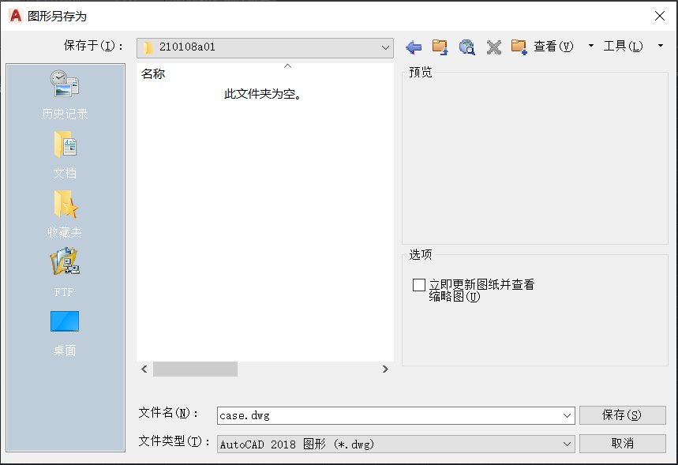
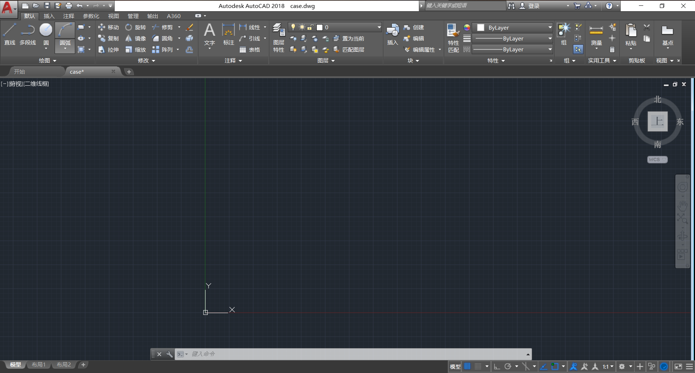
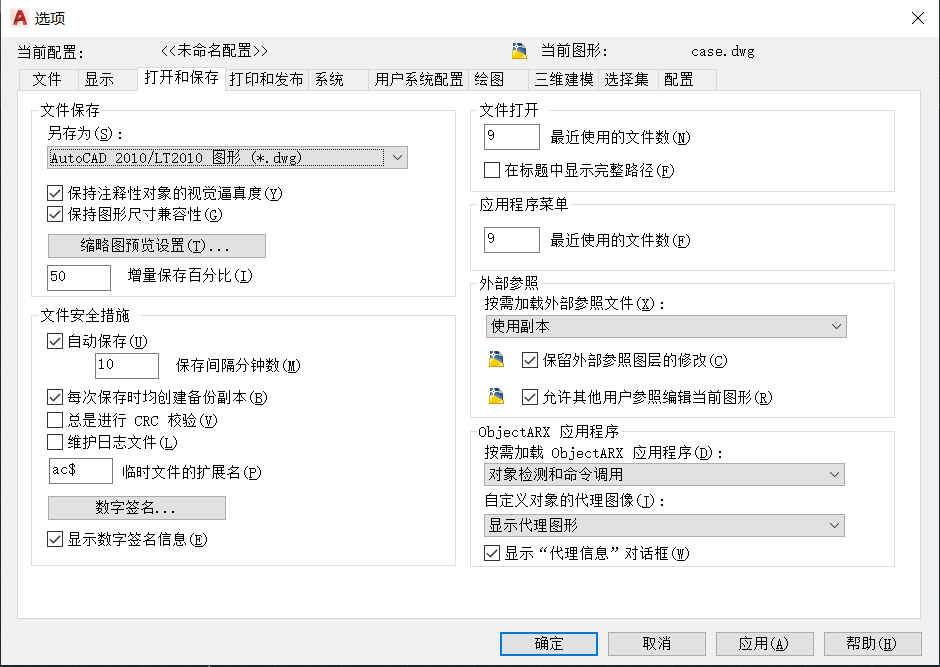
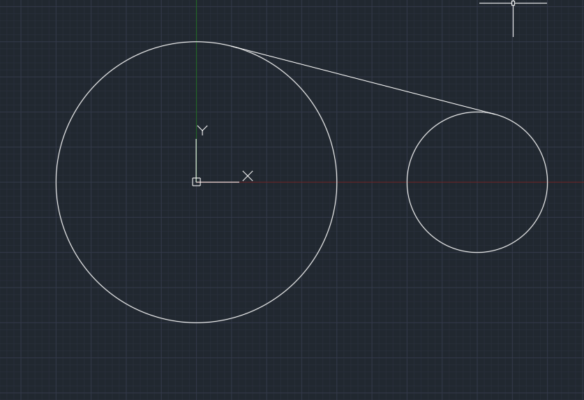
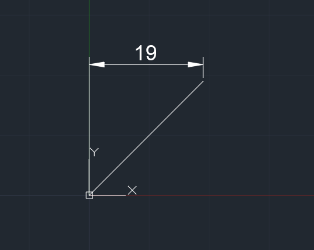
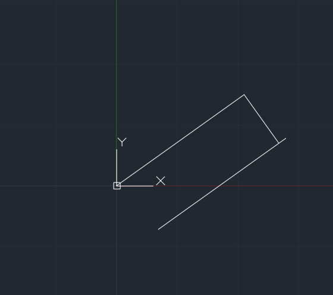

# AutoCAD学习笔记

学习AutoCAD的初衷其实是因为想自己组装一台低功耗ITX，结果发现收的拆机主板不是标准ITX尺寸（19*19），加上还有一块12vDC转ATX 20pin的电源板要安装，于是打算自己定制一个亚克力机箱。于是决定学一下AutoCAD，以后做其他东西也可以用上

就只涉及平面画图了，只包含实用的，保证基本的绘图能力

本笔记作为备忘，实际需要多操作以熟悉AutoCAD的使用

## 软件

Autodesk AutoCAD 2018

## 设计文件

ITX机箱设计[文件](src/210108a01)

## 1 基本操作

从新建文件开始

### 1.1 文件创建

开始画图，另存为

**.dwg**就是AutoCAD的图形文件后缀

也可以新建->选择样板，之后另存为即可

### 1.2 主窗口

命令输入框在最底端

### 1.3 鼠标操作

**挪动图片：** 鼠标中键

**缩放：** 鼠标滚轮

**框选：** 单击左键，再次单击选择，注意实线/蓝色选框和虚线/绿色选框的不同，以及操作方法

**套索选：** 按住左键选择，同样注意实线/蓝色选框和虚线/绿色选框的不同，以及操作方法

**三维视图：** Shift+鼠标中键旋转，视图在绘图窗口左上角切换

## 2 常用命令

命令在AutoCAD中非常常用，可以极大提高作图效率

### 2.1 配置以及编辑操作

#### 2.1.1 OP 配置

用于配置当前文件选项，比如文件和低版本AutoCAD的兼容性

最好设置兼容较老版本的dwg文件，因为很多加工商家没有新版本的

#### 2.1.2 U/UNDO 撤销

#### 2.1.3 REDO 重做

### 2.2 基本图形

有关于基本图形的画法

#### 2.2.1 图形操作

#### 2.2.1.1 RO/ROTATE 旋转

指定基准点以及旋转角度

可以在RO后按C复制，这样可以保留原来的直线（复制后旋转）

#### 2.2.1.2 O/OFFSET 偏移

**平行复制**几何线条，指定平移长度以及方向

#### 2.2.1.3 M/MOVE 移动

设置相对移动坐标，或使用@和<规定移动距离和角度

#### 2.2.1.4 TRIM 修剪

双击回车，点击修剪

#### 2.2.1.5 BR/BREAK 打断直线

BR，点击直线，设置打断起点以及终点

#### 2.2.1.6 CO/COPY 复制

复制一个图形

#### 2.2.1.7 X/EXPLODE 分解图形

将一个多边形分解成为若干条直线

#### 2.2.1.8 BO/BORDER 连通边界选择

选择一个连通的区域的边界

#### 2.2.1.9 MI/MIRROR 镜像

指定需要镜像的对象，并且指定镜像直线的两个端点

#### 2.2.1.10 ARRAYPOLAR

指定一个环绕中心点，将一个图形做成环绕，可以直接在工具栏设置项目数，取消关联可以单独编辑（或X命令）

#### 2.2.1.11 ARRAYRECT

将一个图形组成阵列，设置行数和列数，行距和列距可以选择方向

#### 2.2.1.12 PE/PEDIT

编辑直线，比如合并等

#### 2.2.1.13 SCALE

放大缩小，指定基准点以及倍率

#### 2.2.2 L/LINE 直线

**坐标绘制**，规定起点坐标以及相对终点坐标，中间使用","间隔。

**角度绘制**，规定起点坐标，"@"规定长度，"<"规定角度

**切线绘制**，TAN命令，点击要相切的圆，示例

#### 2.2.3 REC/RECTANG 矩形

**坐标绘制和角度绘制**，和绘制直线相同

**长宽绘制**，规定起点坐标，"@长度,宽度"

#### 2.2.4 C/CIRCLE 圆

**圆心坐标和半径绘制**，指定圆心坐标，以及半径。

**两点绘制**，2P命令，输入圆直径的2个点，绘制圆形。

**三点绘制**，3P命令，输入圆上3个点，绘制圆形。

**相切，相切，半径绘制**，T命令，选择要相切的两个圆弧，输入半径，绘制圆弧，可以外切或内切。

示例如下

#### 2.2.5 FILLET 圆角

**指定半径绘制**，输入R指定圆弧半径，选择两个要相切的对象，绘制圆弧。只能用于外切

**设置修剪**，T命令

#### 2.2.6 EL/ELLIPSE 椭圆

**中心点绘制**，指定椭圆的中心点，半轴端点，另一条半轴长度

**椭圆弧绘制**，命令A，绘制圆弧，指定角度

#### 2.2.7 POL/POLYGON 正多边形

**圆外切多边形绘制**，指定正多边形边数，中心点，以及外切C

**圆内接多边形绘制**，指定正多边形边数，中心点，以及内接I

**边绘制**，E命令，以一条直线作为边绘制

## 3 绘图技巧

### 3.1 标注

#### 3.1.1 一般标注

默认->线性/角度/半径/直径

角度标注需要先选中角的两条边

#### 3.1.2 快速标注

注释->快速，选择，回车

#### 3.1.3 连续标注

注释->连续

**在工程制图中已经学过了几何尺寸以及定位尺寸的概念，这里就不再赘述，标注时注意即可**

### 3.2 正交

如果绘图需要大量横平竖直的直线，为方便绘图可以点击右下方正交或F8(或ORTHOMODE=1)

### 3.3 斜线垂直

如果需要从一个点画一条线和已知斜线垂直，可以在右下角打开垂足功能

### 3.4 斜面绘图

如果要绘制一个斜的图形，可以先按照水平绘制，再进行旋转。

### 3.5 测量

测量工具，MEASUREGEOM