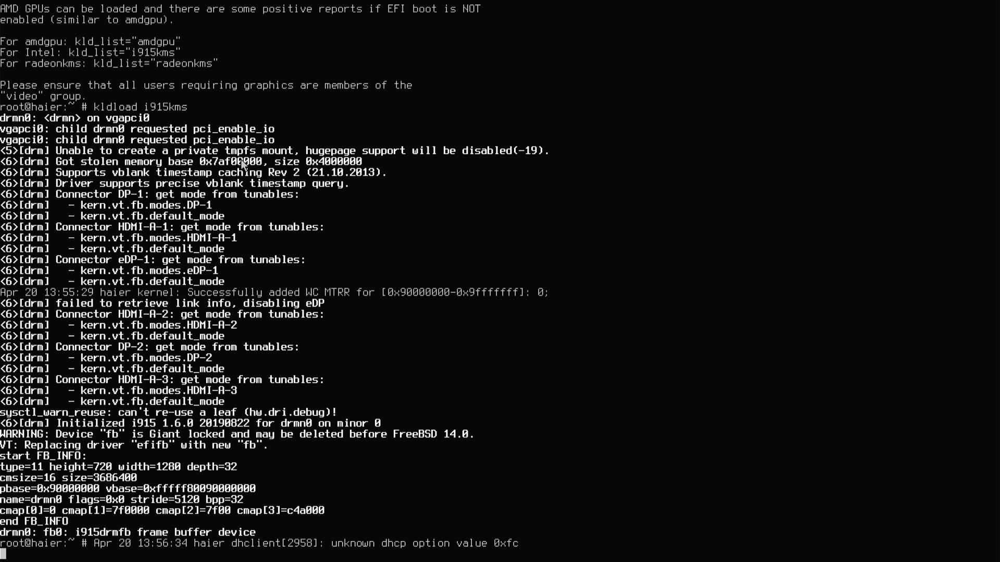
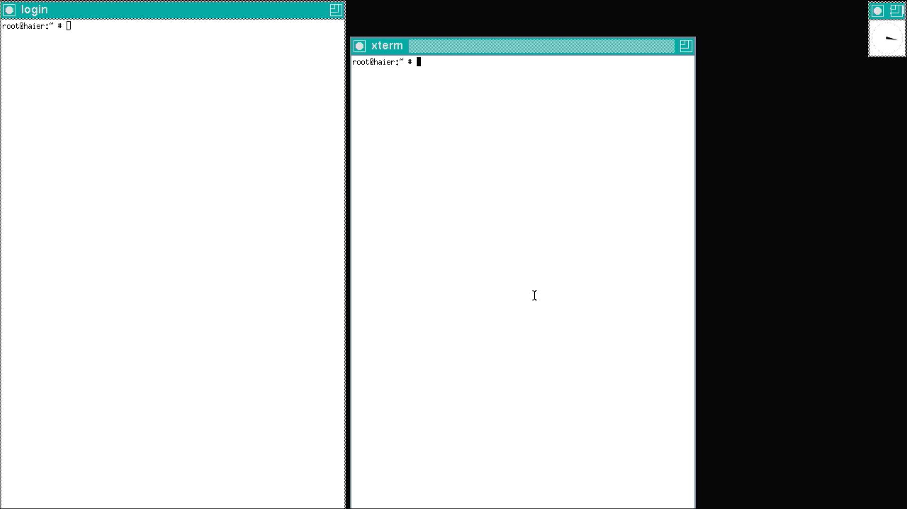
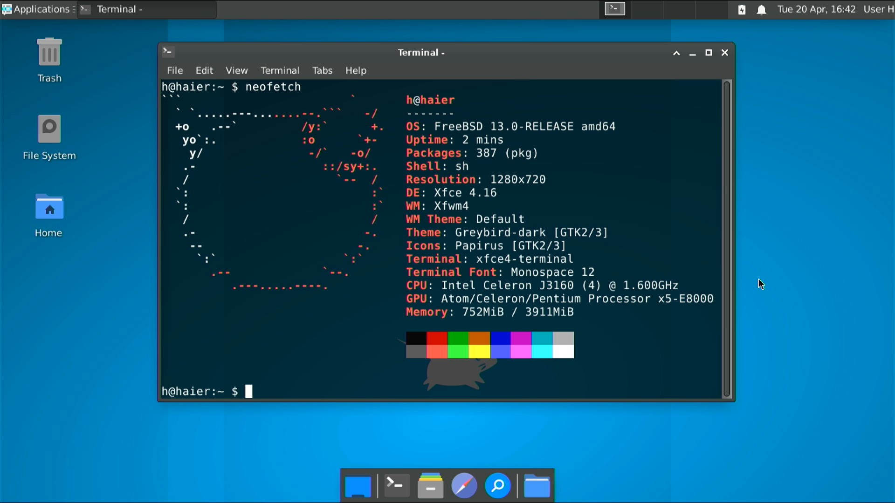

# FreeBSD作为桌面系统使用的安装过程以及注意事项

## 简介

记录有关FreeBSD作为桌面系统使用的安装过程，以及注意事项

常用参考

[FreeBSD Handbook](https://docs.freebsd.org/en/books/handbook/)

[FreeBSD Manual Pages](https://www.freebsd.org/cgi/man.cgi)

[FreeBSD Wiki](https://wiki.freebsd.org/)

[FreeBSD 论坛](https://forums.freebsd.org/)

[FreshPorts](https://www.freshports.org/)

## 目录

+ [**1**](#1-下载镜像) 下载镜像
+ [**2**](#2-基本安装) 基本安装
    + [**2.1**](#21-磁盘分区) 磁盘分区
        + [**2.1.1**](#211-分区与格式化) 分区与格式化
        + [**2.1.2**](#212-编辑fstab与安装) 编辑fstab与安装
        + [**2.1.3**](#213-在fstab中使用uuid) 在fstab中使用UUID
    + [**2.2**](#22-启动引导) 启动引导
        + [**2.2.1**](#221-单系统引导) 单系统引导
        + [**2.2.2**](#222-双系统多系统引导grub) 双系统/多系统引导：grub
        + [**2.2.3**](#223-refind引导配置) rEFInd引导配置
    + [**2.3**](#23-设置参考不代表建议的选择) 设置参考（不代表建议的选择）
+ [**3**](#3-安装后杂项) 安装后杂项
    + [**3.1**](#31-改镜像源) 改镜像源
        + [**3.1.1**](#311-pkg) pkg
        + [**3.1.2**](#312-ports) ports
    + [**3.2**](#32-x11) X11
        + [**3.2.1**](#321-安装显卡驱动) 安装显卡驱动
        + [**3.2.2**](#322-安装x) 安装X
        + [**3.2.3**](#323-安装中文字体) 安装中文字体
        + [**3.2.4**](#324-安装dewm以及配置) 安装DE/WM以及配置
        + [**3.2.5**](#325-图标) 图标
        + [**3.2.6**](#326-输入法) 输入法
        + [**3.2.7**](#327-声音配置声卡驱动) 声音配置，声卡驱动
    + [**3.3**](#33-wayland) Wayland
        + [**3.3.1**](#331-显卡驱动) 显卡驱动
        + [**3.3.2**](#332-基础组件) 基础组件
        + [**3.3.3**](#333-安装sway) 安装Sway
        + [**3.3.4**](#334-音频) 音频
        + [**3.3.5**](#335-输入法) 输入法
    + [**3.4**](#34-杂项) 杂项
        + [**3.4.1**](#341-关蜂鸣器) 关蜂鸣器
        + [**3.4.2**](#342-无线网络连接) 无线网络连接
        + [**3.4.3**](#343-网络管理) 网络管理
        + [**3.4.4**](#344-添加ext文件系统支持) 添加ext文件系统支持
        + [**3.4.5**](#345-doas) doas
+ [**4**](#4-zfs) ZFS
    + [**4.1**](#41-基本概念) 基本概念
    + [**4.2**](#42-基本功能的使用) 基本功能的使用
        + [**4.2.1**](#421-zpool的创建) zpool的创建
        + [**4.2.2**](#422-dataset的创建) dataset的创建
        + [**4.2.3**](#423-挂载点) 挂载点
        + [**4.2.4**](#424-创建与恢复快照) 创建与恢复快照
        + [**4.2.5**](#425-数据校验与修正) 数据校验与修正
    + [**4.3**](#43-不同vdev的应用与示例) 不同vdev的应用与示例
        + [**4.3.1**](#431-raid-z) RAID-Z
        + [**4.3.2**](#432-mirror) Mirror
    + [**4.4**](#44-故障处理) 故障处理
        + [**4.4.1**](#441-清除报错) 清除报错
        + [**4.4.2**](#442-自愈功能与scrub) 自愈功能与scrub
        + [**4.4.3**](#443-替换磁盘) 替换磁盘
    + [**4.5**](#45-vdev扩容) vdev扩容
    + [**4.6**](#46-导入导出) 导入导出
    + [**4.7**](#47-系统升级) 系统升级
    + [**4.8**](#48-查看历史) 查看历史
    + [**4.9**](#49-性能监测) 性能监测
    + [**4.10**](#410-zfs管理详解) ZFS管理详解
        + [**4.10.1**](#4101-dataset的创建和管理) Dataset的创建和管理
        + [**4.10.2**](#4102-volume) Volume
        + [**4.10.3**](#4103-移动和重命名) 移动和重命名
        + [**4.10.4**](#4104-快照) 快照
        + [**4.10.5**](#4105-clone) Clone
        + [**4.10.6**](#4106-replication备份) Replication：备份
        + [**4.10.7**](#4107-quota) Quota
        + [**4.10.8**](#4108-reservation) Reservation
        + [**4.10.9**](#4109-压缩和去重) 压缩和去重
        + [**4.10.11**](#41011-普通用户下放权限) 普通用户下放权限
    + [**4.11**](#411-进阶) 进阶
        + [**4.11.1**](#4111-独立缓存盘) 独立缓存盘
        + [**4.11.2**](#4112-调参) 调参
+ [**5**](#5-服务管理) 服务管理
+ [**6**](#6-系统更新) 系统更新

## 1 下载镜像

[FreeBSD 14.2](https://www.freebsd.org/releases/14.2R/announce/)

使用U盘启动安装，下载memstick安装镜像，使用`xz -dk`解压后，再使用`dd`命令将`.img`镜像刻录到u盘

## 2 基本安装

x86 UEFI启动

安装前建议将CMOS时钟设置成UTC时间。开机进启动项选择U盘启动，到Bootloader界面，按B启动多用户模式

基本安装操作非常简单，大部分步骤照着bsdinstall的提示走就行了

UEFI模式安装的主要难点在于磁盘分区和启动引导的解决，但是UEFI启动对于双系统乃至多系统用户来说会方便很多


## 2.1 磁盘分区

### 2.1.1 分区与格式化

bsdinstall自带的磁盘分区功能缺乏灵活性。这里提供使用Shell分区的方法（在界面选择最后一项Shell），便于灵活操作分区

首先UEFI启动模式需要一个ESP分区，一般为FAT或FAT32格式

如果是空磁盘先创建一个GPT分区表，这里假设磁盘为ada0

```
$ gpart create -s gpt ada0
```

创建分区，假设创建一个200M的ESP分区和一个32G的主分区（`/dev/ada0p1`和`/dev/ada0p2`）

> NVME硬盘在`/dev/nda0pX`

```
$ gpart add -t efi -s 200M ada0
$ gpart add -t freebsd-ufs -s 32G ada0
```

格式化分区，其中EFI分区格式化为FAT32，根目录分区格式化为UFS2

```
$ newfs_msdos -F 32 -c 1 /dev/ada0p1
$ newfs -U -L FreeBSD /dev/ada0p2
```

如果是SSD，可以使用`tunefs`打开UFS2的TRIM功能

```
$ tunefs -t enable /dev/ada0p2
```

如果想要创建swap分区（可选）

```
$ gpart add -t freebsd-swap -s 2G ada0
```

swap分区可以通过`swapon`挂载，这里先不必挂载

```
$ swapon /dev/ada0pX
```

### 2.1.2 编辑fstab与安装

最后使用`ee`编辑fstab，文件位于`/tmp/bsdinstall_etc/fstab`

示例，SSD`/dev/ada0p3`挂载到`/`，HDD`/dev/ada1p8`挂载到`/home`

```
/dev/ada0p3       /         ufs       rw              0 1
/dev/ada1p8       /home     ufs       rw              0 2
/dev/ada1p3       none      swap      sw              0 0
tmpfs             /tmp      tmpfs     rw,mode=1777    0 0
```

最后挂载数据分区到`/mnt`，如果想要将其他分区挂载到`/home`，就要创建目录挂载，示例

```
$ mount /dev/ada0p3 /mnt
$ mkdir /mnt/home
$ mount /dev/ada1p8 /mnt/home
```

`exit`退出Shell，bsdinstall即开始自动安装已选组件

### 2.1.3 在fstab中使用UUID

如果后续想要在`/etc/fstab`中使用UUID，可以如下操作。这可以在安装阶段末尾就做好

使用`gpart`查看UUID，其中的rawuuid就是我们想要的UUID

```
$ gpart list /dev/ada0 | less
```

删除`/etc/fstab`中该分区原来的入口，添加UUID入口，示例

```
/dev/gptid/xxxxxxxx-xxxx-xxxx-xxxx-xxxxxxxxxxxx  /   ufs   rw      0 1
```

开启内核启动参数，使能对UFS的UUID的识别（在`/boot/loader.conf`）

```
kern.geom.label.ufsid.enable="1"
```

此时重启，顺利进入系统则说明成功改为UUID访问

## 2.2 启动引导

启动引导问题可以到所有安装都结束以后再进入Shell处理，只要有ESP分区就可以

首先将安装介质的`loader.efi`拷贝到ESP分区下的`EFI/FreeBSD`，也可以叫其他的文件名

```
$ mount -t msdosfs /dev/ada0p1 /mnt
$ mkdir -p /mnt/EFI/freebsd
$ cp /boot/loader.efi /mnt/EFI/freebsd
```

### 2.2.1 单系统引导

直接使用`efibootmgr`将`loader.efi`注册到BIOS的启动项中。`efibootmgr`用法见[Alpine安装教程](240706a_alpine.md#191-refind)


### 2.2.2 双系统/多系统引导：grub

大部分用户一般都会在已经安装了其他操作系统的电脑上安装FreeBSD作为尝试

这里用GRUB来chainload FreeBSD的bootloader（原理和UEFI模式手动配置Windows双启动相同）

重启进ArchLinux配置`/etc/grub.d/40_custom`添加启动入口如下，将XXXX-XXXX替换为ESP分区的UUID（可以通过`blkid`命令获取），**而hints参数对于不同机器配置可能会不一样**，其他hints的获取具体可以参考[ArchWiki](https://wiki.archlinux.org/index.php/GRUB#Windows_installed_in_UEFI/GPT_mode)

```
# /etc/grub.d/40_custom
menuentry "FreeBSD Bootloader" {
    insmod part_gpt
    insmod fat
    insmod chain
    search --no-floppy --fs-uuid --set=root --hint-bios=hd0,gpt1 --hint-efi=hd0,gpt1 --hint-baremetal=ahci0,gpt1 XXXX-XXXX
    chainloader /EFI/freebsd/loader.efi
}
```

再执行`grub-mkconfig`重新生成grub配置文件即可。重启进入GRUB界面就应该看到`FreeBSD Bootloader`入口了，可以正常引导FreeBSD

### 2.2.3 rEFInd引导配置

配置`refind.conf`添加一个入口。假设`loader.efi`在`/EFI/freebsd/`

```
menuentry "FreeBSD" {
    icon /EFI/refind/icons/os_freebsd.png
    loader /EFI/freebsd/loader.efi
}
```

## 2.3 设置参考（不代表建议的选择）

基本组件：作为纯64位环境使用所以不使用lib32相关的项。不安装ports。如果之后有运行wine的需求，可以勾上lib32

服务启动：一般开启moused，ntpd，powerd，dumpdev。有需要可以开启sshd远程访问

安全特性：一般开启clear_tmp，disable_syslogd，secure_console，disable_ddtrace


## 3 安装后杂项

## 3.1 改镜像源

### 3.1.1 pkg

FreeBSD使用ports和pkg两种方法安装软件包，pkg是已经编译好的，ports是源码，需要自己编译

出于某种原因，FreeBSD官方对于镜像站管控非常严格，中国大陆目前还没有官方镜像，以下列出部分亚太地区的官方镜像

+ 台湾镜像 pkg0.twn.freebsd.org

+ 日本镜像 pkg0.kwc.freebsd.org

+ 马来西亚镜像 pkg0.kul.freebsd.org

> 直接使用官方源也可

几个国内的非官方镜像站：

+ 中科大镜像 mirrors.ustc.edu.cn

+ 网易镜像 mirrors.163.com

+ 兰大镜像 mirror.lzu.edu.cn

+ 北交大镜像 mirror.bjtu.edu.cn

修改举例：

修改pkg镜像：添加`/usr/local/etc/pkg/repos/mymirror.conf`如下（可以直接从`/etc/pkg/FreeBSD.conf`复制修改）

```
# 使用freebsd.cn，最新latest，否则quarterly
freebsdcn: {
  url: "pkg+http://pkg.freebsd.cn/${ABI}/quarterly", 
  mirror_type: "srv",
  signature_type: "none",
  fingerprints: "/usr/share/keys/pkg",
  enabled: yes
}

# 禁用原/etc/pkg/FreeBSD.conf
FreeBSD: {
  enabled: no
}
```

如果使用中科大镜像源，可以创建`/usr/local/etc/pkg/repos/ustc.conf`，在FreeBSD 14中配置如下。需要事先安装`ca_root_nss`

```
ustc: {
  url: "https://mirrors.ustc.edu.cn/freebsd-pkg/${ABI}/quarterly",
  signature_type: "none",
  fingerprints: "/usr/share/keys/pkg",
  enabled: yes
}

FreeBSD: {
  enabled: no
}
```

首次使用`pkg`会自动安装。改镜像源以后必须运行`pkg update -f`更新索引

> `pkg`在发生大版本更新时容易有一些意外发生，所以要求稳定的生产环境建议使用`quarterly`从一定程度规避风险，大更新使用`freebsd-upgrade`。如果出现问题，确定镜像源配置以后可以尝试`pkg bootstrap -f`，强制重新安装`pkg`

### 3.1.2 ports

> 不建议`ports`和`pkg`混用。如果要同时使用需要保证`pkg`和`ports`的release branch同步

USTC Ports配置见 https://mirrors.ustc.edu.cn/help/freebsd-ports.html

修改ports源`/etc/make.conf`，4为使用的线程数，根据需要更改

```
# 启用线程数
FETCH_CMD=axel -n 4 -a
DISABLE_SIZE=yes
MASTER_SITE_OVERRIDE?=http://mirrors.ustc.edu.cn/freebsd-ports/distfiles/${DIST_SUBDIR}/
```

## 3.2 X11

FreeBSD 13, Xfce

### 3.2.1 安装显卡驱动

安装`drm-kmod`，Intel集显平台可以不安装`xf86-video-intel`（原因参考[ArchWiki](https://wiki.archlinux.org/index.php/Intel_graphics#Installation)）

```
$ pkg install drm-fbsd13-kmod
```

之后通过`kldload`加载intel的驱动模块查看驱动是否工作正常

```
$ kldload i915kms
```

出现如下显示代表模块加载成功。如果没有出现类似输出或者出现卡死的情况，代表驱动可能不支持该显卡



如果没有问题，编辑`/etc/rc.conf`添加一行，在启动时加载模块

```
# Load i915kms
kld_list="i915kms"
```

编辑`/boot/loader.conf`，使能vt

```
kern.vty=vt
```

> 想要查看自己的显卡或其他硬件是否确实被FreeBSD支持，可以到[bsd-hardware](https://bsd-hardware.info)查看

安装3D库（mesa）

```
$ pkg install mesa-libs mesa-dri
```

安装intel硬件视频解码支持

```
$ pkg install libva-intel-media-driver # 适用于HD5000以及更新的显卡
```

或

```
$ pkg install libva-intel-driver # 旧驱动，最高支持到UHD630
```

最后注意必须要将用户添加到`video`或`wheel`组才能访问3D加速，示例

```
$ pw groupmod video -m me
```

### 3.2.2 安装X

```
$ pkg install xorg
```

此时`startx`，可以启动TWM，如下，说明xorg可以使用，关闭X只要在左侧窗口`exit`即可



### 3.2.3 安装中文字体

```
$ pkg install wqy-fonts # 安装文泉驿字体
```

### 3.2.4 安装DE/WM以及配置

安装xfce

```
$ pkg install xfce xfce4-goodies
```

使能`dbus`，在`/etc/rc.conf`

```
dbus_enable="YES"
```

编辑`~/.xinitrc`，`source`一下`xinitrc`

```
. /usr/local/etc/xdg/xfce4/xinitrc
```

重启，登陆后直接`startx`就可以启动xfce了



注意，`startx`之后X默认使用的虚拟终端为`ttyv8`，切换到其他虚拟终端后通过`Ctrl+Alt+F9`返回x

### 3.2.5 图标

安装Papirus扁平风格图标

```
$ pkg install papirus-icon-theme
```

### 3.2.6 输入法

安装`fcitx`，添加中文和日语输入支持。确保在`rc.conf`开启了dbus

```
$ pkg install zh-fcitx zh-fcitx-configtool zh-fcitx-libpinyin ja-fcitx-mozc fcitx-m17n
```

如果使用的是`sh`，那么编辑`.shrc`如下，添加几行设置环境变量（更加建议在`~/.xinitrc`中添加这些变量）。`csh`使用`setenv`

```
# fcitx env setup
export XMODIFIERS='@im=fcitx'
export GTK_IM_MODULE=fcitx
export GTK2_IM_MODULE=fcitx
export GTK3_IM_MODULE=fcitx
export QT_IM_MODULE=fcitx
export QT4_IM_MODULE=fcitx
```

自启动

```
$ mkdir ~/.config/autostart
$ cp /usr/local/share/applications/fcitx.desktop ~/.config/autostart/
```

重启进入fcitx设置添加中文日语输入法即可

### 3.2.7 声音配置，声卡驱动

主板集成声卡ALC662以及Intel的HDMI输出声卡。在`/boot/loader.conf`添加

```
snd_hda_load="YES"
sysctlinfo_load="YES"
```

调节音量使用终端工具`mixertui`，使用和`alsamixer`类似

```
$ pkg install mixertui
```

## 3.3 Wayland

FreeBSD 14.2, Sway 1.10

### 3.3.1 显卡驱动

将用户加入`video`

```
$ pw groupmod video -m USERNAME
```

Intel Gen9.5 核显（UHD630）上`drm-61-kmod`会导致黑屏，安装`drm-515-kmod`（驱动从linux移植来，数字代表linux版本）

```
$ pkg install drm-515-kmod mesa-dri mesa-gallium-va mesa-libs libva-intel-media-driver libva-utils
```

```
$ sysrc kld_list+=i915kms
```

### 3.3.2 基础组件

```
$ pkg install wayland seatd dbus mixertui e2fsprogs fusefs-ext2 bash bash-completion
```

```
$ sysrc seatd_enable="YES"
$ sysrc dbus_enable="YES"
$ service seatd start
$ service dbus start
```

> 从14.1开始FreeBSD默认有`pam_xdg`（`/usr/lib/pam_xdg.so`），所以无需设定`XDG_RUNTIME_DIR`，直接使用`seatd`就可以
>
> `sysrc`设定`servicename_enable="YES"`和`service servicename enable`具备相同的效果，都会将`servicename_enable="YES"`写到`/etc/rc.conf`，区别是`sysrc`不会检验`servicename`的有效性，也就是说如果`servicename`是无效的，`service`命令不会将其添加到`/etc/rc.conf`

### 3.3.3 安装Sway

```
$ pkg install sway swaybg swayimg waybar swappy grim slurp fuzzel mako foot wl-clipboard jetbrains-mono droid-fonts-ttf noto-emoji wqy-fonts papirus-icon-theme adwaita-icon-theme nemo usbutils pciutils xeyes wlr-randr qt5-wayland qt6-wayland xdg-desktop-portal xdg-desktop-portal-wlr xdg-desktop-portal-gtk obs-studio wlrobs 
```

dotfiles见 https://github.com/apachiww/dotfiles

配置完成后应当可以正常启动`sway`

### 3.3.4 音频

检查声卡驱动是否成功加载

```
$ dmesg | grep pcm
```

如果没有成功加载，尝试以下操作

```
$ kldload snd_driver
$ echo 'snd_driver_load="YES"' >> /boot/loader.conf
```

使用`beep`测试一下

```
$ beep
```

调节音量，`mixer`命令行使用方法，可以绑定到`sway`快捷键（FreeBSD目前不支持Fn音量功能键）

```
$ mixer vol=+2%
$ mixer vol=-2%
```

静音

```
$ mixer vol.mute=toggle
$ mixer mic.mute=toggle
```

### 3.3.5 输入法

```
$ pkg install fcitx5 fcitx5-configtool zh-fcitx5-chinese-addons fcitx5-gtk-common fcitx5-gtk4
```

启动方式见`sway`配置文件

## 3.4 杂项

### 3.4.1 关蜂鸣器

编辑`/boot/loader.conf`，添加一行

```
kern.vt.enable_bell=0
```

### 3.4.2 无线网络连接

以RTL8188EE网卡为例

编辑`/etc/rc.conf`，创建`wlan0`。这里是`rtwn0`，可以通过`sysctl net.wlan.devices`获取名称。注意如果使用`SYNCDHCP`选项会拖慢开机

```
wlans_rtwn0="wlan0"
ifconfig_wlan0="WPA DHCP"
```

在`/etc/wpa_supplicant.conf`根据ssid和密码添加配置

```
network={
  ssid="myssid"
  psk="mypasswd"
}
```

之后重启`netif`即可看到`wlan0`了

```
$ service netif restart
```

### 3.4.3 网络管理

`dhclient`背景启动

```
$ sysrc background_dhclient="YES"
```

### 3.4.4 添加ext文件系统支持

```
$ pkg install fusefs-ext2
```

建议只读方式挂载ext4分区

```
$ kldload ext2fs
$ mount -t ext2fs -o ro /dev/adaXpX /mnt
```

### 3.4.5 doas

安装`doas`

```
$ pkg install doas
```

创建并编辑`/usr/local/etc/doas.conf`

```
$ cp /usr/local/etc/doas.conf.sample /usr/local/etc/doas.conf
$ ee /usr/local/etc/doas.conf
```

只保留`wheel`组的`doas`权限

```
permit nopass :wheel
```

## 4 ZFS

## 4.1 基本概念

ZFS和传统的文件系统有较大的概念上的区别

先介绍一下`pool`，`vdev`和`dataset`的基本概念。在ZFS中，一块或多块磁盘/分区可以构成一个`vdev`，而一个或多个`vdev`可以组成一个`pool`。通常的应用中，一个`pool`的容量等于其中`vdev`有效容量的**总和**，而`vdev`依据其本身类型的不同拥有不同的冗余度和有效容量/比例

ZFS中总共有7种`vdev`，这些类型代表了`vdev`中磁盘/分区的组织形式与作用，分别为Disk，File，Mirror，RAID-Z，Spare，Log，Cache（Disk就是指磁盘/分区本身作为一个`vdev`使用）。ZFS由此实现软RAID

在`pool`上可以创建一些`dataset`，这些`dataset`可以各自开启各种额外特性，例如压缩，双备份等。一个`pool`上所有的`dataset`共享空间

ZFS主要使用到两个命令，`zpool`和`zfs`。`zpool`主要用于管理`pool`以及其中的`vdev`，而`zfs`主要用于`dataset`相关的操作

使用`zpool`命令创建的`pool`默认会被挂载到根目录`/`下的同名目录，并且可以在里面直接存取普通文件。而在`pool`中创建的`dataset`会被挂载到对应`pool`目录下的`dataset`同名目录，并且也可以直接访问存取文件

ZFS支援多种缓存机制，包括内存缓存，磁盘缓存，提供更高的读写性能

想要在FreeBSD下使用ZFS，首先需要执行以下命令并重启，会在启动时加载`zfs.ko`

```
$ sysrc zfs_enable="YES"
```

## 4.2 基本功能的使用

### 4.2.1 zpool的创建

基于磁盘`/dev/ada0`创建名为`pool0`的`zpool`（这里的`ada0`也是一个`vdev`）

> 指定`/dev/ada0`默认使用整张磁盘，由于磁盘无分区表所以无法从该磁盘启动系统
>
> 也可以基于分区例如`/dev/ada0p1`创建。用分区有许多优点，首先是可以自定义大小，这在Mirror/RAID阵列中有用，在使用不同型号磁盘时可以保证容量一致，并且后续更换磁盘时也不会因为容量不一致而造成额外的麻烦。此外也有多分区需求的场景，不得不使用分区
>
> FreeBSD上把磁盘分区作为`vdev`使用或基于分区创建`vdev`不会造成性能损失，但是其他平台不一定

```
$ zpool create pool0 /dev/ada0
```

或

```
$ zpool create pool0 ada0
```

基于分区创建

```
$ zpool create pool0 /dev/ada0p1
```

或者可以一次指定多块磁盘，组成RAID0

```
$ zpool create pool0 ada0 ada1 ada2
```

新创建的`pool0`默认挂载到`/pool0`下，可以使用`df -h`看到剩余空间

```
$ df -h
Filesystem  Size    Used    Avail   Capacity  Mounted on
...
pool0       225G    96K     225G    0%        /pool0
...
```

可以直接在`/pool0`里面创建文件

```
$ cd /pool0
$ touch log.txt
$ ls
log.txt
$ rm log.txt
```

列出`zpool`

```
$ zpool list
NAME    SIZE  ALLOC   FREE    CKPOINT   EXPANDSZ    FRAG    CAP   DEDUP   HEALTH  ALTROOT
pool0   232G   372K   232G          -          -      0%     0%   1.00x   ONLINE  -
```

查看`zpool`状态

```
$ zpool status
  pool: pool0
 state: ONLINE
config:
...
```

健康状态

```
$ zpool status -x
all pools are healthy
```

如果是SSD，可能有TRIM的需求

```
$ zpool trim pool0
```

销毁该`zpool`，必须使用`zpool destroy`命令，数据会同步销毁，会同时删除目录`/pool0`

> 销毁`zpool`前必须先销毁其中的`dataset`，有关`dataset`下一小节会讲

```
$ zpool destroy pool0
```

和`dataset`一样，`zpool`也有属性可以设置，通过`zpool set`设定，`zpool get`读取。创建`zpool`时可以通过`-o key=value`的形式设定

```
$ zpool get all pool0
```

### 4.2.2 dataset的创建

> 有关`dataset`的更多详细内容见[4.10.1](#4101-dataset的创建和管理)

`dataset`的属性可以通过`zfs get`获取，可以在`zfs create`时通过`-o key=value`设定，或后续通过`zfs set`设定

一个`pool`下可以创建多个`dataset`，这些`dataset`可以各自开启不同的功能。`pool`本身也是一个`dataset`

在`pool0`中创建`data0`，并在`data0`启用压缩。可以在目录`/pool0/data0`中直接存取文件

```
$ zfs create pool0/data0
$ zfs set compression=gzip pool0/data0
```

```
$ ls /pool0
data0
$ df -h
Filesystem    Size    Used    Avail   Capacity  Mounted on
...
pool0         225G    96K     225G    0%        /pool0
pool0/data0   225G    96K     225G    0%        /pool0/data0
...
```

> 启用压缩不建议存放已经压缩过的数据（例如压缩包，已经经过压缩的音视频等），它适合放系统镜像或`tar`档这类文件

关压缩

```
$ zfs set compression=off pool0/data0
```

卸载`data0`，`zfs umount`既不会删除目录`/pool0/data0`，也不会删除该`dataset`中的数据

```
$ zfs umount pool0/data0
$ ls /pool0
data0
```

重新挂载`data0`，依旧可以读到`data0`中原有的数据

```
$ zfs mount pool0/data0
```

除了压缩，还可以让`dataset`为所有存储的数据保存一份副本，缺点是会占据两倍空间

```
$ zfs set copies=2 pool0/data0
```

销毁`data0`，数据也随之销毁

```
$ zfs destroy pool0/data0
```

### 4.2.3 挂载点

由于`pool0`默认挂载点在`/pool0`，而`dataset`包含于其中，想要让指定目录的文件放到ZFS中，一种方案是可以把数据搬过去并使用软链接

```
$ zpool create pool0 /dev/ada0
$ zfs create pool0/data0
$ zfs set compression=gzip pool0/data0
$ cp -pr /home/* /pool0/data0/
$ rm -rf /home /usr/home
$ ln -s /pool0/data0 /home
$ ln -s /pool0/data0 /usr/home
```

另一种方案是直接改`dataset`挂载点

```
$ zfs set mountpoint=/home pool0/data0
```

而`pool`挂载点可以通过参数`altroot`指定，新`pool`目录创建于`altroot`目录下

```
$ zpool create -o altroot=/mnt pool0 mirror ada0 ada1
$ ls /mnt
pool0
```

### 4.2.4 创建与恢复快照

> 有关快照的更多内容见[4.10.4](#4104-快照)

可以为一个`dataset`创建快照，快照存放在`dataset`目录下的`.zfs/snapshot`中

```
$ zfs snapshot pool0/data0@snap-250101
```

查看快照

```
$ zfs get snapshot_count
NAME                      PROPERTY          VALUE   SOURCE
...
pool0/data0@snap-250101   snapshot_count    -       -
```

或

```
$ ls /pool0/data0/.zfs/snapshot
snap-250101 
```

回滚到快照

```
$ zfs rollback pool0/data0@snap-250101
```

删除快照

```
$ zfs destroy pool0/data0@snap-250101
```

### 4.2.5 数据校验与修正

可以使用`zpool scrub`对存储的数据进行校验并自动对可修复的数据进行修复

```
$ zpool scrub pool0
$ zpool status
  pool: pool0
 state: ONLINE
  scan: scrub repaired 0B in XX:XX:XX with 0 errors on Mon Jan 1 00:00:00 2025
  ...
```

可以每隔一段时间执行一下`scrub`校验数据。但是不建议在HDD发生明显严重故障（例如划盘，敲盘）的时候进行数据校验，这会加重数据损坏

更多描述见[4.4.2](#442-自愈功能与scrub)

## 4.3 不同vdev的应用与示例

### 4.3.1 RAID-Z

`raidz`一共有`raidz1` `raidz2` `raidz3`三种，如果不明确指定（`raidz`）那么默认创建`raidz1`。建议一个`raidz`阵列不超过9块磁盘/分区，且使用相同容量的磁盘/分区

> `raidz1`需要至少2块磁盘，可以容许1块磁盘故障（即数据冗余量为1块磁盘）；`raidz2`需要至少3块磁盘，可以容许2块磁盘同时故障（数据冗余量为2块磁盘）；`raidz3`需要至少4块磁盘，可以容许3块磁盘同时故障（数据冗余量为3块磁盘）。以下只举例`raidz1`
>
> 注意，虽然`raidz`阵列在`zpool list`中显示的总容量依旧是所有磁盘加起来的总和，在实际写入文件后就会发现分配的空间比文件本身大，所以实际可用容量依旧为总容量减去冗余

基于`ada0 ada1 ada2`三块磁盘创建`raidz1`，`pool0`中的`raidz1-0`就是一个`vdev`实例，是自动命名的，名称无法修改

```
$ zpool create pool0 raidz ada0 ada1 ada2
$ zpool status
  pool: pool0
 state: ONLINE
config:

        NAME        STATE   READ WRITE CKSUM
        pool0       ONLINE     0     0     0
          raidz1-0  ONLINE     0     0     0
            ada0    ONLINE     0     0     0
            ada1    ONLINE     0     0     0
            ada2    ONLINE     0     0     0

error: No known data errors
```

`raidz1`可以容许下线1块磁盘。当一个`raidz`阵列缺少磁盘但依旧可以保持数据完整性时，其运行于降级模式`DEGRADED`

```
$ zpool offline pool0 ada0
$ zpool status
  pool: pool0
 state: DEGRADED
status: One or more devices has been taken offline by the administrator.
        Sufficient replicas exist for the pool to continue functioning in a
        degraded state.
action: Online the device using 'zpool online' or replace the device with
        'zpool replace'.
config:

        NAME        STATE     READ WRITE CKSUM
        pool0       DEGRADED     0     0     0
          raidz1-0  DEGRADED     0     0     0
            ada0    OFFLINE      0     0     0
            ada1    ONLINE       0     0     0
            ada2    ONLINE       0     0     0

error: No known data errors
```

可以重新将`ada0`上线

```
$ zpool online pool0 ada0
```

示例，在`pool`中一次创建多个`raidz`阵列，这样`pool0`就包含了两个`vdev`，容量就等于单个`raidz1`的阵列容量乘2

```
$ zpool create pool0 raidz1 ada0 ada1 raidz1 ada2 ada3
$ zpool status
  pool: pool0
 state: ONLINE
config:

        NAME        STATE   READ WRITE CKSUM
        pool0       ONLINE     0     0     0
          raidz1-0  ONLINE     0     0     0
            ada0    ONLINE     0     0     0
            ada1    ONLINE     0     0     0
          raidz1-1  ONLINE     0     0     0
            ada2    ONLINE     0     0     0
            ada3    ONLINE     0     0     0

error: No known data errors
```

`raidz`阵列不容许后续再加磁盘，但是可以在`pool`中添加新的`raidz`阵列实现扩容，使用`add`命令

```
$ zpool add pool0 raidz1 ada4 ada5
$ zpool status
  pool: pool0
 state: ONLINE
config:

        NAME        STATE   READ WRITE CKSUM
        pool0       ONLINE     0     0     0
          raidz1-0  ONLINE     0     0     0
            ada0    ONLINE     0     0     0
            ada1    ONLINE     0     0     0
          raidz1-1  ONLINE     0     0     0
            ada2    ONLINE     0     0     0
            ada3    ONLINE     0     0     0
          raidz1-2  ONLINE     0     0     0
            ada4    ONLINE     0     0     0
            ada5    ONLINE     0     0     0     

error: No known data errors
```

> 没有数据冗余的磁盘阵列统称为`stripe`。`raidz`和`mirror`都不是`stripe`

### 4.3.2 Mirror

`mirror`顾名思义就是同一块磁盘的数据镜像n遍，至少需要2块磁盘。`mirror`和`raidz`的区别是一个`mirror`阵列无论有多少块磁盘/分区，其容量都为1块磁盘（使用`zpool list`显示容量也等于1块磁盘，而不是所有磁盘容量总和），而其余n-1块磁盘存储的都是冗余数据，因此可以容许n-1块磁盘失效。如果只有2块磁盘/分区，此时使用`mirror`和`raidz1`的效果是一样的

> 在ZFS中，RAID1可以通过`mirror`实现，而RAID0可以在一个`pool`中添加多个`vdev`实现，而RAID10就结合两者。这就是RAID的两个维度在ZFS中的实现

创建`mirror`

```
$ zpool create pool0 mirror ada0 ada1
$ zpool status
  pool: pool0
 state: ONLINE
config:

        NAME        STATE   READ WRITE CKSUM
        pool0       ONLINE     0     0     0
          mirror-0  ONLINE     0     0     0
            ada0    ONLINE     0     0     0
            ada1    ONLINE     0     0     0

error: No known data errors
```

`mirror`和`raidz`的一个区别是可以通过`attach`命令将新的磁盘/分区加入，成为新的冗余，但是`mirror`阵列实际可用容量不会增加。`attach`和后文的`detach`不适用于`raidz`。注意`attach`命令在`pool`后面至少需要指定一个该`pool`内已有的设备名

```
$ zpool attach pool0 ada0 ada2
$ zpool status
  pool: pool0
 state: ONLINE
config:

        NAME        STATE   READ WRITE CKSUM
        pool0       ONLINE     0     0     0
          mirror-0  ONLINE     0     0     0
            ada0    ONLINE     0     0     0
            ada1    ONLINE     0     0     0
            ada2    ONLINE     0     0     0

error: No known data errors
```

如果原先是直接基于单个磁盘/分区创建的`pool`，`attach`新的磁盘以后会自动组成`mirror`，无需显式指定

```
$ zpool status
  pool: pool0
 state: ONLINE
config:

        NAME        STATE   READ WRITE CKSUM
        pool0       ONLINE     0     0     0
          ada0      ONLINE     0     0     0

error: No known data errors
$ zpool attach pool0 ada0 ada1
$ zpool status
  pool: pool0
 state: ONLINE
config:

        NAME        STATE   READ WRITE CKSUM
        pool0       ONLINE     0     0     0
          mirror-0  ONLINE     0     0     0
            ada0    ONLINE     0     0     0
            ada1    ONLINE     0     0     0

error: No known data errors
```

> 一个`pool`里面是可以同时使用不同类型的`vdev`的，例如`raidz`和`mirror`混用，但是**不建议这样做**。并且如果加入的新`vdev`没有足够的冗余，由于新的`vdev`已经和原来的`vdev`组成RAID0，一旦新的`vdev`失效容易导致包括原先数据在内的所有数据丢失
>
> ZFS默认会将数据平摊到各个`vdev`。如果原来的`vdev`已经存得太满，再添加新的`vdev`扩容可能导致写入性能没有太大提升，或者写入性能会有波动（如果没有存太满，理论上写入性能可以翻倍）

添加到`pool`中的`vdev`是无法移除的，因为`vdev`之间组成了RAID0，但是可以将`mirror`中的磁盘/分区移除，使用`detach`命令。如果移除的`mirror`阵列原先就只有2块磁盘，移除后阵列会自动变为`stripe`，没有冗余

```
$ zpool status
  pool: pool0
 state: ONLINE
config:

        NAME        STATE   READ WRITE CKSUM
        pool0       ONLINE     0     0     0
          mirror-0  ONLINE     0     0     0
            ada0    ONLINE     0     0     0
            ada1    ONLINE     0     0     0
            ada2    ONLINE     0     0     0

error: No known data errors
$ zpool detach pool0 ada2
$ zpool status
  pool: pool0
 state: ONLINE
config:

        NAME        STATE   READ WRITE CKSUM
        pool0       ONLINE     0     0     0
          mirror-0  ONLINE     0     0     0
            ada0    ONLINE     0     0     0
            ada1    ONLINE     0     0     0

error: No known data errors
```

> `mirror`也可以使用`offline`命令将磁盘下线，下线后`mirror`阵列也会变为`DEGRADED`降级状态

**切分Mirror**

`mirror`可以支持`split`，从其中分出磁盘来新建`pool`。新`pool`需要`import`

```
$ zpool status
  pool: pool0
 state: ONLINE
config:

        NAME        STATE   READ WRITE CKSUM
        pool0       ONLINE     0     0     0
          mirror-0  ONLINE     0     0     0
            ada0    ONLINE     0     0     0
            ada1    ONLINE     0     0     0
            ada2    ONLINE     0     0     0
            ada3    ONLINE     0     0     0

error: No known data errors
$ zpool split pool0 pool1 ada3
$ zpool import pool1
$ zpool status
  pool: pool0
 state: ONLINE
config:

        NAME        STATE   READ WRITE CKSUM
        pool0       ONLINE     0     0     0
          mirror-0  ONLINE     0     0     0
            ada0    ONLINE     0     0     0
            ada1    ONLINE     0     0     0
            ada2    ONLINE     0     0     0

error: No known data errors

  pool: pool1
 state: ONLINE
config:

        NAME        STATE   READ WRITE CKSUM
        pool1       ONLINE     0     0     0
          ada3      ONLINE     0     0     0

error: No known data errors
```

> 进行正式的`split`之前可以先使用`zpool split -n`dryrun一下，看看预期的结果

## 4.4 故障处理

### 4.4.1 清除报错

使用`clear`命令清除报错，在脚本中有用

```
$ zpool clear pool0
```

### 4.4.2 自愈功能与scrub

ZFS的自愈功能就是在有冗余的磁盘阵列中，在读数据过程中，如果其中一块盘存储的数据出现错误，那么ZFS会尝试从其他盘的冗余数据恢复以替换这一部分损坏数据，尽可能保证返回给应用的数据是正确的。当然在`stripe`无冗余的阵列中无法实现自愈，只能返回损坏的数据

如果是运行中的磁盘阵列发生数据错误，那么会出现`zpool status`中`CKSUM`不为`0`的情况，并且会提示发生了`unrecoverable error`，如下示例

```
$ zpool status pool0
...
config:

        NAME        STATE   READ WRITE CKSUM
        pool0       ONLINE     0     0     0
          mirror-0  ONLINE     0     0     0
            ada0    ONLINE     0     0     0
            ada1    ONLINE     0     0     1
...
```

此时ZFS不会主动去修正`ada1`上的错误数据。数据修复需要手动执行`zpool scrub`实现，可以看到修复进度

```
$ zpool scrub pool0
$ zpool status pool0
...
config:

        NAME        STATE   READ WRITE CKSUM
        pool0       ONLINE     0     0     0
          mirror-0  ONLINE     0     0     0
            ada0    ONLINE     0     0     0
            ada1    ONLINE     0     0   627 (repairing)
...
```

修复成功后查看状态，`CKSUM`的值会保留

```
$ zpool status pool0
...
config:

        NAME        STATE   READ WRITE CKSUM
        pool0       ONLINE     0     0     0
          mirror-0  ONLINE     0     0     0
            ada0    ONLINE     0     0     0
            ada1    ONLINE     0     0 2.72K
...
```

需要使用`zpool clear`清除`CKSUM`，清除后不会再报错

```
$ zpool clear pool0
$ zpool status pool0
...
config:

        NAME        STATE   READ WRITE CKSUM
        pool0       ONLINE     0     0     0
          mirror-0  ONLINE     0     0     0
            ada0    ONLINE     0     0     0
            ada1    ONLINE     0     0     0
...
```

> `scrub`的作用是非常有限的。由于HDD的损坏特性，如果已经发生了敲盘，继续读写容易迅速扩大损坏导致更多数据丢失，如果真的发生了磁盘损坏但尚可通过冗余恢复，更好的处理方案是**第一时间将磁盘下线并立即替换**。如果故障的磁盘数过多而无法恢复，也应当立即下线磁盘并交由专业的数据恢复机构处理

### 4.4.3 替换磁盘

可以使用`replace`命令替换`vdev`阵列中的磁盘

> `replace`和`online`操作的一个主要区别是`online`不会执行`resilver`对磁盘进行数据初始化，磁盘必须是没有更换过的，数据和原来一样

以`raidz1`阵列为例，如果磁盘`ada0`没有发生故障只是普通的替换，无需将磁盘下线

```
$ zpool status
  pool: pool0
 state: ONLINE
config:

        NAME        STATE   READ WRITE CKSUM
        pool0       ONLINE     0     0     0
          raidz1-0  ONLINE     0     0     0
            ada0    ONLINE     0     0     0
            ada1    ONLINE     0     0     0
            ada2    ONLINE     0     0     0

error: No known data errors
$ zpool replace pool0 ada0 ada3
$ zpool status
  pool: pool0
 state: ONLINE
config:

        NAME        STATE   READ WRITE CKSUM
        pool0       ONLINE     0     0     0
          raidz1-0  ONLINE     0     0     0
            ada3    ONLINE     0     0     0
            ada1    ONLINE     0     0     0
            ada2    ONLINE     0     0     0

error: No known data errors
```

> 上述的`replace`操作因为无需将`ada0`下线，所以不会导致阵列进入到`DEGRADED`模式，可以无缝切换。替换的过程可能会耗费大量的时间，这个对新磁盘进行数据初始化的操作称为`resilvering`

如果磁盘`ada0`已经损坏，必须先将该磁盘下线，由于`raidz1`的冗余，此时也可以在`DEGRADED`状态下执行`replace`

```
$ zpool status
  pool: pool0
 state: ONLINE
config:

        NAME        STATE     READ WRITE CKSUM
        pool0       DEGRADED     0     0     0
          raidz1-0  DEGRADED     0     0     0
            ada0    OFFLINE      0     0     0
            ada1    ONLINE       0     0     0
            ada2    ONLINE       0     0     0

error: No known data errors
$ zpool replace pool0 ada0 ada3
$ zpool status
  pool: pool0
 state: ONLINE
config:

        NAME        STATE   READ WRITE CKSUM
        pool0       ONLINE     0     0     0
          raidz1-0  ONLINE     0     0     0
            ada3    ONLINE     0     0     0
            ada1    ONLINE     0     0     0
            ada2    ONLINE     0     0     0

error: No known data errors
```

如果条件限制新硬盘和原先的硬盘会放在同一个位置，在`/dev`中会显示为同一个盘符，那么此时无需指定新盘符名，但是前提**必须保证**`ada0`已经被替换为空白的新硬盘，无论是通过热插拔还是关机后替换。这里ZFS会自动检测这块盘是否和原来是同一块

```
$ zpool replace pool0 ada0
```

## 4.5 vdev扩容

不建议在一个`vdev`中使用不同容量的磁盘，因为木桶效应，其容量取决于最小的那块磁盘，也因此会影响`pool`的容量

但是如果有扩容的需求，又不想添加新的`vdev`，直接替换原来`vdev`中的磁盘也是可行的。而替换磁盘的过程中会面临容量不一致的问题

扩容操作步骤如下，假设`ada0 ada1`都为`32G`，`ada2 ada3`都为`64G`

```
$ zpool status pool0
...
config:

        NAME        STATE   READ WRITE CKSUM
        pool0       ONLINE     0     0     0
          mirror-0  ONLINE     0     0     0
            ada0    ONLINE     0     0     0
            ada1    ONLINE     0     0     0
...
$ zpool list
NAME    SIZE  ALLOC   FREE    CKPOINT   EXPANDSZ    FRAG    CAP   DEDUP   HEALTH  ALTROOT
pool0  31.5G  1.42M  31.5G          -          -      0%     0%   1.00x   ONLINE  -
$ zpool replace pool0 ada0 ada2
$ zpool replace pool0 ada1 ada3
$ zpool status pool0
...
config:

        NAME        STATE   READ WRITE CKSUM
        pool0       ONLINE     0     0     0
          mirror-0  ONLINE     0     0     0
            ada2    ONLINE     0     0     0
            ada3    ONLINE     0     0     0
...
$ zpool list
NAME    SIZE  ALLOC   FREE    CKPOINT   EXPANDSZ    FRAG    CAP   DEDUP   HEALTH  ALTROOT
pool0  31.5G  1.06M  31.5G          -          -      0%     0%   1.00x   ONLINE  -
```

可以发现替换更大的磁盘后`pool0`容量并没有提升。这是因为此时只是做完了`resilver`搬了数据，想要新的空间可用，还需要扩张一下可用空间，使用`zpool online -e`表示`expand`

```
$ zpool online -e pool0 ada2
$ zpool online -e pool0 ada3
$ zpool list
NAME    SIZE  ALLOC   FREE    CKPOINT   EXPANDSZ    FRAG    CAP   DEDUP   HEALTH  ALTROOT
pool0  63.5G  1.06M  63.5G          -          -      0%     0%   1.00x   ONLINE  -
```

此时才是扩容完成

## 4.6 导入导出

不像其他文件系统可以`umount`以后在到其他主机上直接`mount`访问，想要移动ZFS到其他主机要使用`zpool export`卸载，再到其他主机上`zpool import`导入。`import`会自动扫描所有磁盘并识别到之前导出的`pool`以及其构成

首先导出，导出后就看不到`pool0`了

```
$ zpool list
NAME    SIZE  ALLOC   FREE    CKPOINT   EXPANDSZ    FRAG    CAP   DEDUP   HEALTH  ALTROOT
pool0  95.5G  1.10M  95.5G          -          -      0%     0%   1.00x   ONLINE  -
$ zpool export pool0
$ zpool list
no pools available
```

> 如果导出时有进程正在使用该`pool`会导致无法`export`。这时候需要先检查并结束进程。想要强制卸载需要`zpool export -f pool0`

将所有磁盘转移到目标主机，使用`zpool import`列出可导入的`pool`

```
$ zpool import
  pool: pool0
    id: XXXXXXXXXXXXXXXXXXXX
 state: ONLINE
action: The pool can be imported using its name or numberic identifier.
config:

        pool0       ONLINE
          raidz1-0  ONLINE
            ada0    ONLINE
            ada1    ONLINE
            ada2    ONLINE
```

执行`pool0`的导入

```
$ zpool list
no pools available
$ zpool import pool0
$ zpool list
NAME    SIZE  ALLOC   FREE    CKPOINT   EXPANDSZ    FRAG    CAP   DEDUP   HEALTH  ALTROOT
pool0  95.5G  1.10M  95.5G          -          -      0%     0%   1.00x   ONLINE  -
```

> 默认导入`pool`的时候也会立即挂载其中的`dataset`。如果不想挂载`dataset`需要`zpool import -N pool0`
>
> 如果该`pool`上一次没有正确`export`就被移除，再次`import`会有问题，可以尝试`zpool import -f pool0`
>
> 导入所有未导入的`pool`使用`zpool import -a`
>
> 注意`zpool`的`ALTROOT`设定在`export`到`import`之间**不会保存**，由于ZFS中`pool`的根挂载点默认在`/`下，如果此时直接执行`zpool import pool0`那么`pool0`会直接挂载到`/pool0`下。和`zpool create -o altroot=/rootdir/`类似的，可以通过`zpool import -o altroot=/rootdir/ pool0`或`zpool import -R /rootdir/ pool0`指定`ALTROOT`以自定义挂载点

## 4.7 系统升级

ZFS随着版本更新可能会加上新的功能（主要是从较旧版本升级到支持`feature flag`，或新版本加了新的`feature flag`），这需要磁盘上的ZFS文件系统也同步更新。ZFS只能升级，无法降级

```
$ zpool status
...
status: The pool is formatted using a legacy on-disk format. The pool can still be used, but some features are unavailable.
...
```

使用`zpool upgrade`查看一下并更新，假设看到`pool0`较旧不支持`feature flag`

```
$ zpool upgrade
...
VER  POOL
---  ------------
28   pool0
...
$ zpool upgrade pool0
...
Enabled the following features on 'pool0':
  async_destroy
  empty_bpobj
  ...
```

## 4.8 查看历史

可以使用`zpool history`查看任何改变了`zpool`的操作，包括`zpool`和`zfs`命令

```
$ zpool history
History for 'pool0':
2025-01-01.00:00:00 zpool create pool0 mirror ada0 ada1
...
```

> 更详细的信息可以`zpool history -i`

## 4.9 性能监测

可以使用`zpool iostat`查看当前性能统计，包括剩余容量，IOPS，带宽等

```
$ zpool iostat
               capacity     operations    bandwidth
pool        alloc   free   read  write   read  write
----------  -----  -----  -----  -----  -----  -----
pool0        492K  31.5G      2     11  11.3K  57.1K
```

> 连续监测打印可以加一个数字例如`zpool iostat 1`表示打印统计数据的间隔。如果想要显示`pool0`中各`vdev`以及磁盘的性能，`zpool iostat -v`  

## 4.10 ZFS管理详解

ZFS的`dataset`支持嵌套，子`dataset`会继承父`dataset`的属性

ZFS一共支持4种类型的`dataset`，分别为`filesystem` `volume` `snapshot` `bookmark`。通过`zpool`创建的`pool`本身也是一个`filesystem`类型的`dataset`

### 4.10.1 Dataset的创建和管理

创建名为`shared`的`dataset`（默认类型为`filesystem`）

```
$ zfs list
NAME    USED  AVAIL   REFER   MOUNTPOINT
pool0   408K  45.0G     96K   /pool0
$ zfs create pool0/shared
$ zfs list
NAME          USED  AVAIL   REFER   MOUNTPOINT
pool0         576K  45.0G     96K   /pool0
pool0/shared   96K  45.0G     96K   /pool0/shared
```

> 列出所有类型的`dataset`使用`zfs list -rt all`

在`shared`下创建名为`iso`的`dataset`，并开启`lz4`压缩

```
$ zfs create -o compression=lz4 pool0/shared/iso
$ zfs list
NAME              USED  AVAIL   REFER   MOUNTPOINT
pool0             732K  45.0G     96K   /pool0
pool0/shared      192K  45.0G     96K   /pool0/shared
pool0/shared/iso   96K  45.0G     96K   /pool0/shared/iso
```

查看`dataset`所有属性列表

```
$ zfs get all pool0/shared/iso
NAME              PROPERTY          VALUE                  SOURCE
pool0/shared/iso  type              filesystem             -
pool0/shared/iso  creation          Sat Mar 22 00:00 2025  -
pool0/shared/iso  used              96K                    -
...
pool0/shared/iso  compression       lz4                    local
...
```

> 压缩还支持`gzip`等算法
>
> 关压缩使用`zfs set compression=off pool0/shared/iso`，这样做的场景不多

使用`destroy`删除`dataset`比逐个删除`dataset`中的文件速度快一些

```
$ zfs destroy pool0/shared/iso
$ zfs list
NAME          USED  AVAIL   REFER   MOUNTPOINT
pool0         708K  45.0G     96K   /pool0
pool0/shared   96K  45.0G     96K   /pool0/shared
```

如果删除的`dataset`里面有子`dataset`，需要使用`-r`递归删除

```
$ zfs list
NAME              USED  AVAIL   REFER   MOUNTPOINT
pool0             732K  45.0G     96K   /pool0
pool0/shared      192K  45.0G     96K   /pool0/shared
pool0/shared/iso   96K  45.0G     96K   /pool0/shared/iso
$ zfs destroy -r pool0/shared
$ zfs list
NAME          USED  AVAIL   REFER   MOUNTPOINT
pool0         648K  45.0G     96K   /pool0
```

销毁`dataset`前可以先dryrun一下检查会删除哪些内容

```
$ zfs destroy -nv pool0/shared
would destroy pool0/shared
```

如果`dataset`比较大，磁盘速度也不快，空间回收可能需要一段时间。`destroy`以后，ZFS空间回收会在后台执行，可以通过以下命令查看`pool0`中哪些`dataset`正在回收

```
$ zpool get freeing pool0
```

> `zfs`的`pool`一共支持存放4种类型的`dataset`。可以`zfs list -t filesystem`列出普通类型的`dataset`，`volume`列出卷，`snapshot`列出快照，`bookmark`列出书签

**dataset属性**

所有类型的`dataset`都有属性可以设定。以下给出`zfs set`和`zfs get`示例

```
$ zfs get all pool0/dataset0
NAME              PROPERTY          VALUE                  SOURCE
...
pool0/dataset0    compression       on                     default
...
$ zfs set compression=lz4 pool0/dataset0
$ zfs get compression pool0/dataset0
NAME              PROPERTY          VALUE                  SOURCE
pool0/dataset0    compression       lz4                    local
$ zfs create pool0/dataset0/iso
$ zfs get all pool0/dataset0/iso
NAME                PROPERTY          VALUE                  SOURCE
pool0/dataset0/iso  type              filesystem             -
pool0/dataset0/iso  creation          Sat Mar 22 00:00 2025  -
pool0/dataset0/iso  used              96K                    -
...
pool0/dataset0/iso  compression       lz4                    inherited from pool0/dataset0
...
```

> 属性有一列`SOURCE`，它代表该属性从哪里来，`default`表示默认值，`local`表示用户手动设置了该项；如果父`dataset`有设定一些属性，那么子`dataset`继承来的属性会显示为`inherited from pool0/xxx`

所有属性的可用值可以通过命令`zfs get`获取。可修改的属性在`EDIT`会标记为`YES`，默认会继承的属性会在`INHERIT`标记为`YES`，`VALUES`表示可设定值

```
$ zfs get
...
The following properties are supported:

        PROPERTY       EDIT  INHERIT   VALUES

        available        NO       NO   <size>
        clones           NO       NO   <dataset>[,...]
        ...
        compression     YES      YES   on | off | lzjb | gzip | gzip-[1-9] | zle | lz4 | zstd | zstd-[1-19] | zstd-fast | zstd-fast-[1-10,20,30,40,50,60,70,80,90,100,500,1000]
        ...
```

使用`zfs inherit`可以将当前`dataset`的特定属性（用户显式设置过的）还原到默认情况下会继承过来的值

```
$ zfs set compression=gzip pool0/dataset0/iso
$ zfs get compression pool0/dataset0/iso
NAME              PROPERTY          VALUE                  SOURCE
pool0/dataset0    compression       gzip                   local
$ zfs inherit compression pool0/dataset0/iso
$ zfs get compression pool0/dataset0/iso
NAME              PROPERTY          VALUE                  SOURCE
pool0/dataset0    compression       lz4                    inherited from pool0/dataset0
```

此外`dataset`还可以设定自定义的属性。这些属性和默认内置属性不同的是它们可以被随意创建与删除。自定义属性使用`:`创建命名空间来存储

```
$ zfs set mysettings:port=2333 pool0/dataset0
$ zfs get mysettings:port pool0/dataset0
NAME              PROPERTY          VALUE                  SOURCE
pool0/dataset0    mysettings:port   2333                   local
```

删除使用`-r`

```
$ zfs inherit -r mysettings:port pool0/dataset0
```

**NFS**

ZFS设定NFS共享需要设定`sharenfs`属性

```
$ zfs set sharenfs=on pool0/shared
```

开启后设置更多选项

```
$ zfs set sharenfs="-alldirs,-maproot=root,-network=192.168.1.0/24" pool0/shared
```

### 4.10.2 Volume

ZFS的卷是块设备，所以不会有挂载点的概念，卷放在`/dev/zvol`下。可以将它给虚拟机使用，也可以用于iSCSI等

ZFS的卷还有一个强大的功能是可以使用压缩等特性，可以轻易实现原有文件系统不支持的特性，例如可以把一个开了压缩的卷给`vfat`用

在`mkfs`以后`volume`直接使用`mount`挂载就可以使用

创建一个名为`nsvd0`的`volume`，大小`1g`

```
$ zfs create -V 1g pool0/nsvd0
$ zfs list
NAME              USED  AVAIL   REFER   MOUNTPOINT
pool0            1.02G  44.0G     96K   /pool0
pool0/nsvd0      1.02G  45.0G     56K   -
$ ls /dev/zvol/pool0
nsvd0
```

创建的同时开`lz4`压缩

```
$ zfs create -V 1g -o compression=lz4 pool0/nsvd0
```

`volume`的销毁操作同普通的`dataset`

### 4.10.3 移动和重命名

`zfs rename`同时可以用于重命名和移动`dataset`。因为都是只要指定原路径和新路径即可

```
$ zfs list
NAME              USED  AVAIL   REFER   MOUNTPOINT
pool0             780K  45.0G     96K   /pool0
pool0/dataset0     96K  45.0G     96K   /pool0/dataset0
$ zfs rename pool0/dataset0 pool0/dataset1
$ zfs list
NAME              USED  AVAIL   REFER   MOUNTPOINT
pool0             788K  45.0G    104K   /pool0
pool0/dataset1     96K  45.0G     96K   /pool0/dataset1
```

> `rename`移动`dataset`到不同的`parent`时，`dataset`原来继承来的属性也会被修改为新`parent`对应的可继承属性
>
> 此外`dataset`重命名后会被自动挂载到新的路径，可以使用`zfs rename -u datasetx datasety`来防止重命名后挂载

### 4.10.4 快照

ZFS快照最大的优点是创建以及恢复的速度快，并且会占用尽量小的体积。ZFS快照本质上还是利用了CoW只会记录文件的修改信息，并且保留旧版本文件的特性，它刚刚创建时是不会占用空间的；后续有文件被删除或修改才代表快照开始占用空间，所以看上去ZFS的快照会随着当前`dataset`修改变多而体积增大，实际这部分数据是旧数据。修改的数据越多，意味着快照需要记录的内容越多

而对于多余的数据，例如删除一个快照后遗留的旧数据，以及没有被快照覆盖但是被修改的数据，ZFS会自动回收并释放空间

**创建与删除**

```
$ zfs snapshot pool0/dataset0@snap-250312
$ zfs list -t snapshot
NAME                         USED  AVAIL   REFER   MOUNTPOINT
pool0/dataset0@snap-250312     0B      -    140K   -
$ zfs destroy pool0/dataset0@snap-250312
```

`snapshot`可以支持递归创建，即为一个`dataset`及其下所有子`dataset`都创建一份快照

```
$ zfs list -rt all pool0/dataset0
NAME                  USED  AVAIL   REFER   MOUNTPOINT
pool0/dataset0        430K  44.7G    151K   /pool0/dataset0
pool0/dataset0/usera  140K  44.7G    140K   /pool0/dataset0/usera
pool0/dataset0/userb  140K  44.7G    140K   /pool0/dataset0/userb
$ zfs snapshot -r pool0/dataset0@snap-250312
$ zfs list -rt all pool0/dataset0
NAME                              USED  AVAIL   REFER   MOUNTPOINT
pool0/dataset0                    430K  44.7G    151K   /pool0/dataset0
pool0/dataset0@snap-250312          0B      -    151K   -
pool0/dataset0/usera              140K  44.7G    140K   /pool0/dataset0/usera
pool0/dataset0/usera@snap-250312    0B      -    140K   -
pool0/dataset0/userb              140K  44.7G    140K   /pool0/dataset0/userb
pool0/dataset0/userb@snap-250312    0B      -    140K   -
```

> 删除递归创建的快照使用`zfs destroy -R`即可

**回滚恢复**

ZFS在回滚快照时会像数据库一样遵循ACID，不用担心数据的一致性问题

```
$ zfs rollback pool0/dataset0@snap-250312
```

> 如果有需要，在回滚到一个快照前可以再创建一个最新的快照，以防万一

ZFS不能跳过快照一次回滚到更老的快照。如果有需要，那么要删除中间的快照。可以使用`-r`自动删除

```
$ zfs rollback -r pool0/dataset0@snap-250222
```

**恢复单个文件**

恢复单个文件的做法比较暴力，直接从`.zfs/snapshot`下面取就可以

> 在`dataset`挂载目录下`ls -a`默认不显示`.zfs`这个目录，但是它确实存在，可以通过`zfs set snapdir=visible`开启显示（默认`hidden`）

```
$ zfs list -t snapshot pool0/dataset0
NAME                              USED  AVAIL   REFER   MOUNTPOINT
pool0/dataset0@snap-250312          0B      -    151K   -
$ cp /pool0/dataset0/.zfs/snapshot/snap-250312/log.txt .
```

**diff功能**

ZFS有`diff`功能，可以看出来当前文件系统/一个快照相比另一个快照修改的内容

查看ZFS当前最新内容相比快照的变化

```
$ zfs diff pool0/dataset0@snap-250312
M       /log/
+       /log/log-1413.txt
```

> `M`表示文件/目录被修改，`R`表示文件/目录被重命名，`+`表示新建，`-`表示删除

查看2个`snapshot`之间的变化

```
$ zfs diff pool0/dataset0@snap-250312 pool0/dataset0@snap-250315
```

### 4.10.5 Clone

`clone`基于`snapshot`创建，相当于`snapshot`的一个可变副本。`snapshot`是无法更改的，但是`clone`可以更改，因为它和普通的`dataset`并无本质区别，还可以任意挂载

```
$ zfs clone pool0/dataset0@snap-250312 pool0/dataset0-250312clone
$ zfs list
NAME                              USED  AVAIL   REFER   MOUNTPOINT
...
pool0/dataset0-250312clone          0B  44.7G    140K   /pool0/dataset0-250312clone
...
```

默认情况下新创建的`clone`是`snapshot`的Child，它依赖于原来的`snapshot`，所以原来的`snapshot`无法删除。但是可以通过`zfs promote`翻转`clone`和`snapshot`的父子关系，这样`clone`会变成一个独立的`dataset`。而此时`snapshot`成为`clone`的一个快照。此时`clone`相当于原有`dataset`（`snapshot`所依赖的）的一个分支

`clone`有一个`origin`属性，表示它所基于的`snapshot`。`promote`以后由于颠倒了父子关系所以`origin`属性也就不复存在

```
$ zfs get origin pool0/dataset0-250312clone
NAME                        PROPERTY  VALUE                       SOURCE
pool0/dataset0-250312clone  origin    pool0/dataset0@snap-250312  -
$ zfs promote pool0/dataset0-250312clone
$ zfs get origin pool0/dataset0-250312clone
NAME                        PROPERTY  VALUE   SOURCE
pool0/dataset0-250312clone  origin    -       -
```

> `clone`以后如果有需求就可以删除原来的`dataset`了，因为`clone`包含了原有`dataset`在快照时的所有内容，并且它本身就是和原有`dataset`具备一样属性的普通`dataset`

### 4.10.6 Replication：备份

ZFS可以使用`send`和`receive`将`dataset`的数据发送到标准输出。但是标准输出必须重定向到非终端输出，例如文件等

`send`的数据源需要是稳定一致的`snapshot`

```
$ zfs list -t all
NAME                              USED  AVAIL   REFER   MOUNTPOINT
pool0/dataset0                    140K  44.7G    140K   /pool0/dataset0
pool0/dataset0@snap-250312          0B      -    140K   -
pool0/backup0                     140K  44.7G    140K   /pool0/backup0
$ zfs send pool0/dataset0@snap-250312 > /pool0/backup0/backup0312
$ ls /pool0/backup0/
backup0312
```

该命令将`dataset0@snap-250312`保存为一个普通文件，如果想要直接复制为一个可用的`dataset`需要结合`zfs receive`使用。注意`zfs send -v`默认会同时发送原始数据（这里是`dataset0`本身）以及快照信息本身（`snap-250312`）到目标地址（`pool0/backup0312`），注意这里`receive`的目标名不能是已经存在的

```
$ zfs send -v pool0/dataset0@snap-250312 | zfs receive pool0/backup0312
$ zfs list -t all
NAME                                  USED  AVAIL   REFER   MOUNTPOINT
...
pool0/backup0/backup0312              140K  44.7G    140K   /pool0/backup0/backup0312
pool0/backup0/backup0312@snap-250312    0B      -    140K   -
...
```

之后`pool0/dataset0`如果有了新的`snapshot`例如`pool0/dataset0@snap-250314`，那么只需要发送`snap-250312`到`snap-250314`之间的差分即可，使用`-i`

```
$ zfs send -v -i pool0/dataset0@snap-250312 pool0/dataset0@snap-250312 | zfs receive pool0/backup0312
$ zfs list -t all
NAME                                  USED  AVAIL   REFER   MOUNTPOINT
...
pool0/backup0/backup0312              140K  44.7G    140K   /pool0/backup0/backup0312
pool0/backup0/backup0312@snap-250312   93K      -    140K   -
pool0/backup0/backup0312@snap-250314    0B      -    140K   -
...
```

> `-p`可以保留原`dataset`的所有属性包括压缩，`quota`，挂载点等；`-R`可以递归发送所有的Child

**SSH发送**

通过`ssh`发送`dataset`需要事先配置好`openssh`公钥。这些步骤省略

由于通过`ssh`收发`dataset`本质上都需要`root`权限，所以要用到`delegation`

首先在发送端允许普通用户`alice`在`pool0`上发送与创建快照

```
$ zfs allow -u alice send,snapshot pool0
```

在接收端允许`bob`挂载文件系统，创建并允许`bob`在`pool1/rcv`上接收。需要临时开内核参数

```
$ sysctl vfs.usermount=1
$ zfs create pool1/rcv
$ zfs allow -u bob create,mount,receive pool1/rcv
$ chown bob /pool1/rcv
```

在发送端上以`alice`身份发送

```
$ zfs snapshot -r pool0/dataset0@snap-250312
$ zfs send -R pool0/dataset0@snap-250312 | ssh bob@myserver.com zfs receive -dvu pool1/rcv
```

> `receive`端使用`-u`表示不自动挂载新的`dataset`，`-d`表示覆盖发送端的`pool`名，这样在接收端就可以确定写入`pool1`

### 4.10.7 Quota

`quota`用于限制特定`user` `group`或`dataset`的可占用空间

限制`dataset`大小

```
$ zfs set quota=10G pool0/dataset0
```

设置参考限制`refquota`，不强制

```
$ zfs set refquota=10G pool0/dataset0
```

取消限制

```
$ zfs set quota=none pool0/dataset0
```

限制用户

```
$ zfs set userquota@alice=50G
```

```
$ zfs set userquota@alice=none
```

限制用户组

```
$ zfs set groupquota@workgroup=50G
```

```
$ zfs set groupquota@workgroup=none
```

`root`以及有相关权限的用户可以查看各用户以及用户组允许占用多少空间

```
$ zfs userspace pool0/dataset0
TYPE        NAME    USED    QUOTA     OBJUSED   OBJQUOTA
POSIX User  root   1.50K     100G           3       none
```

```
$ zfs groupspace pool0/dataset0
```

查看具体的`dataset`限制，直接获取`quota`属性即可

```
$ zfs get quota pool0/dataset0
```

### 4.10.8 Reservation

`reservation`属性定义了一个`dataset`所需最少空间，同一个`pool`内其他`dataset`会主动保留出这些空间。通常用于一些重要文件例如日志等

```
$ zfs set reservation=20G pool0/dataset0/syslog
```

```
$ zfs set refreservation=20G pool0/dataset0/syslog
```

取消保留

```
$ zfs set reservation=none pool0/dataset0/syslog
```

获取`reservation`属性

```
$ zfs get reservation pool0/dataset0/syslog
```

### 4.10.9 压缩和去重

**压缩**

有关开启压缩的设定已经讲述过

有关压缩实际是一个取舍的过程，只要选择适合的压缩算法。更高的压缩率通常会增加CPU负载，但是通常会降低磁盘写入压力

而`lz4`算法有一个`early abort`的特性，如果它在一个数据开头没有达到至少`12.5%`的压缩率，那么它会放弃压缩以防止浪费CPU资源

当前的数据压缩率可以通过`compressratio`属性获取。此外还有`logicalused`属性可以知道实际的数据量，如果没有压缩实际上会占用多少空间

```
$ zfs get compressratio pool0/dataset0
NAME            PROPERTY          VALUE     SOURCE
pool0/dataset0  compressratio     1.11x     -
```

> 有关压缩需要注意的一个点是开启压缩后同样的空间可以存入的数据量是不一定的。尤其`quota`限制的是压缩后的数据，也就意味着如果一个限制了`quota`的`dataset`同时开了压缩那么它最多可以存放的数据量不确定，这在快达到实际`quota`限制的边界场景下需要格外注意。需要谨慎使用`quota`防止一些意外行为
>
> 此外开启压缩后进行备份也需要注意这个问题，如果不继承原有`dataset`的压缩设定（例如不开压缩）那么备份空间的大小需要根据原有`dataset`的`logicalused`来定

此外还需要根据数据的读写比例来确定使用什么样的压缩算法，例如读多写少，`zstd`就比较适合，因为它的解压速度和压缩率无关，可以把压缩率开大一些节省空间。`zstd-fast`提供更小的压缩率以及更低的CPU压力。RAM小于16G的主机避免使用`zstd-10`以上的压缩

ZFS的ARC（Adaptive Replacement Cache）功能会在RAM缓存压缩过的数据，开启压缩可以提升缓存命中率

如果压缩时没有足够的内存，ZFS会自动放弃压缩直接存储数据

**去重**

相同的block是通过计算checksum来判定的，类似于http中的字符串压缩去重，如果碰到了一样的block，ZFS会直接引用已有的block，这样就不会占用多份空间了

ZFS去重需要大量的RAM

```
$ zfs set dedup=on pool0/dataset0
```

> 开启`dedup`后已有的数据不会去重，只有新数据会
>
> `zpool`有一个`DEDUP`属性可以知道当前的去重率

使用`zdb`可以估算一个`pool`中`compression`和`dedup`分别贡献的压缩率

```
$ zdb -S pool0
```

### 4.10.11 普通用户下放权限

已经在[4.10.6](#4106-replication备份)讲述过

## 4.11 进阶

### 4.11.1 独立缓存盘

ZFS可以把RAM和指定磁盘（一般是SSD，或者傲腾™）作为缓存使用

ZFS一共有4种缓存。通常不用HDD作缓存使用，只作为数据池使用，保证数据完整性的最后一道屏障

> 正是因为ZFS默认会使用RAM做缓存用，所以为了数据完整性实际上ZFS对于DRAM的可靠性要求会比较高。建议至少使用ECC或RECC内存。可以执行memtest检查一下内存

| 位置 | 读缓存 | 写缓存 |
| :- | :- | :- |
| RAM | 称为`ARC`，是`adaptive replacement cache`的缩写。RAM里的`ARC`缓存永远存在，可以通过参数调节大小限制。机器配置的RAM充足可以有效提升ZFS读取性能 | `transaction groups`的作用是将要写入的数据暂存并整理成更适合底层磁盘结构的数据流，使写入更高效，同时在意外发生时丢失尽量少的数据。ZFS中上一笔数据写入磁盘和当前数据的整理同步进行，流水线设计。写缓存也是系统与较慢磁盘之间的桥梁 |
| SSD | 称为`L2ARC`，全新的`L2ARC`需要通过实际的数据读取才会逐渐填满。`L2ARC`不是必选项，移除`L2ARC`不会导致丢数据，只是所有原来可以在`L2ARC`上读取到的数据会直接从更底层的HDD读，降低性能 。如果开了`dedup`且SSD可以容纳下整张去重表，`L2ARC`对去重也会有性能提升 | 指`ZIL`（ZFS Intent Log）和`SLOG`（Secondary Log Device），注意这是两个不同的概念。`ZIL`记录的是刚刚写下的数据有关的内容，即刚刚从`transanction groups`下来的内容。`ZIL`中的内容会再定期更新到存储池。一个ZFS系统内不一定会有独立的`SLOG`设备，这种情况下主存储池会使用一片空间存`ZIL`，如果是HDD，速度会慢一些。而在有独立`SLOG`设备的情况下`ZIL`就放在这些高速`SLOG`设备里。由于`ZIL`放在非易失介质，`ZIL`和ZFS的Journaling共同保证了掉电后数据的可恢复性。此外将`ZIL`放在高速的`SLOG`设备可以加速同步传输，数据可以更早被确认写入到非易失介质，这有利于数据库和NFS等应用的性能 。不建议移除或随意更换ZFS的`SLOG`设备， 这会导致数据丢失。`ZIL`和`L2ARC`是互相独立的 |

> `L2ARC`不一定在所有场景下都对性能有帮助。`L2ARC`的维护是需要额外的内存的，如果内存较小，建议只使用`ARC`，无需创建`L2ARC`。400G的`L2ARC`需要约6.4GB内存

**添加L2ARC**

将`nda0p1` `nda1p1`两块盘添加到`pool0`作为`L2ARC`（`cache`是一种特殊的`vdev`）

```
$ zpool add pool0 cache nda0p1 nda1p1
$ zpool status pool0
  pool: pool0
 state: ONLINE
config:

        NAME        STATE     READ WRITE CKSUM
        pool0       ONLINE       0     0     0
          raidz1-0  ONLINE       0     0     0
            da0p1   ONLINE       0     0     0
            da1p1   ONLINE       0     0     0
            da2p1   ONLINE       0     0     0
        cache
          nda0p1    ONLINE       0     0     0
          nda1p1    ONLINE       0     0     0

errors: No known data errors
```

删除`L2ARC`设备，通常不会破坏数据

```
$ zpool remove pool0 nda0p1 nda1p1
```

**添加LOG设备**

```
$ zpool add pool0 log mirror nda0p1 nda1p1
$ zpool status pool0
  pool: pool0
 state: ONLINE
config:

        NAME        STATE     READ WRITE CKSUM
        pool0       ONLINE       0     0     0
          raidz1-0  ONLINE       0     0     0
            da0p1   ONLINE       0     0     0
            da1p1   ONLINE       0     0     0
            da2p1   ONLINE       0     0     0
        logs
          mirror-1
            nda0p1  ONLINE       0     0     0
            nda1p1  ONLINE       0     0     0

errors: No known data errors
```

> `log`可以支持`mirror` `raidz1`这样的`vdev`作为存储位置。`log`最好在创建`pool0`之后立即添加，或者直接在创建`zpool`时指定，且添加后无法从`pool0`删除，除非`destroy`整个`pool0`

### 4.11.2 调参

FreeBSD Handbook中许多ZFS参数已经过时，当时FreeBSD还没有使用OpenZFS。想要查看当前可调的参数可以使用`sysctl -a vfs.zfs`列出所有。如果没有遇到问题通常无需调参，现在最新的OpenZFS已经有较强的自适应能力了

| 参数 | 说明 |
| :- | :- |
| `vfs.zfs.arc.max` | `ARC`允许占用的最大内存，为防止其他程序无内存可用。无需调节 |
| `vfs.zfs.arc.min` | 系统需要为`ARC`保留的最小内存空间，防止其他程序用完内存导致`ARC`无内存可用。无需调节 |
| `vfs.zfs.prefetch.disable` | 默认`0`开prefetch。如果负载多是小数据读取，可以尝试关闭 |
| `vfs.zfs.vdev.max_auto_ashift` | `zpool`默认使用的最大文件系统扇区大小，默认`14`即16kB，无需修改（`ashift`是`zpool`的一个属性。现在ZFS会自动使用合适的`ashift`，该参数为`0`） |
| `vfs.zfs.vdev.min_auto_ashift` | `zpool`默认使用的最小文件系统扇区大小，默认`9`即512B，无需修改 |
| `vfs.zfs.top_maxinflight` | 每个`vdev`的命令队列大小。减小队列有时可以减小延迟 |
| `vfs.zfs.l2arc.write_max` | 限制每秒写入到`L2ARC`磁盘的数据量 |
| `vfs.zfs.l2arc.write_boost` | 每次启动时，`L2ARC`中的数据默认会失效重来。该参数可以允许`L2ARC`未用完时使用更高的写入速度，为`vfs.zfs.l2arc.write_max`和`vfs.zfs.l2arc.write_boost`两者之和 |
| `vfs.zfs.txg.timeout` | `transaction groups`两次写入到存储池（sync）之间允许间隔的最大时间，默认`5`秒。文件写入达到一定量也会提前触发sync |

## 5 服务管理

`freebsd`使用`rc`系统，脚本放在`/etc/rc.d`和`/usr/local/etc/rc.d`，使用`service`命令管理服务

列出所有服务

```
$ service -l
```

列出当前`enable`的服务（即在`/etc/rc.conf`中设定为`name_enable="YES"`的服务）

```
$ service -e
```

每种服务可用的操作是不一定相同的，但是一般都支持`start stop restart enable disable`等常用操作。进程类服务可以使用`status`查询状态。有些服务还可以使用`describe`输出简介

已经`enable`的服务（`/etc/rc.conf`有记录为`enable="YES"`的服务）才能使用`start stop`进行控制。`enable`后会在`/etc/rc.conf`中添加一行`servicename_enable="YES"`。实际上不建议使用`sysrc`直接修改`/etc/rc.conf`，防止输错服务名

```
$ service chronyd enable
```

启动服务

```
$ service chronyd start
```

查看状态

```
$ service chronyd status
```

停止服务

```
$ service chronyd stop
```

重启服务

```
$ service chronyd restart
```

禁用开机启动

```
$ service chronyd disable
```

禁用的服务只能通过`onestart onestop`进行控制

```
$ service chronyd onestart
$ service chronyd onestop
```

## 6 包管理

## 6.1 安装卸载

更新快照

```
$ pkg update
```

强制更新并覆盖快照（例如换源）

```
$ pkg update -f
```

安装

```
$ pkg install chrony
```

仅下载不安装

```
$ pkg fetch chrony
```

安装本地包

```
$ pkg install chrony-4.6.1_1.pkg
```

卸载，`remove`或`delete`都可

```
$ pkg delete chrony
```

自动卸载orphan

```
$ pkg autoremove
```

下载包到指定目录再安装

```
$ pkg fetch -d -o ~/pkg/ chrony
```

更新所有包

```
$ pkg upgrade
```

删除过时包缓存

```
$ pkg clean
```

强制删除所有包缓存

```
$ pkg clean -a
```

## 6.2 搜索查询

在快照中查询

```
$ pkg search chrony
```

列出所有已安装包

```
$ pkg info -a
```

列出指定包所有信息，依赖的动态库，依赖的包，被依赖，包含的文件，安装目录`prefix`，显示`manifest`，占用磁盘空间

```
$ pkg info chrony
$ pkg info -B chrony
$ pkg info -d chrony
$ pkg info -r chrony
$ pkg info -l chrony
$ pkg info -p chrony
$ pkg info -R chrony
$ pkg info -s chrony
```

## 6.3 进阶

审计，会fetch一个`vulnxml`并给出指定软件已知的CVE

```
$ pkg audit -F firefox
```

锁定包，被锁定的包无法进行任何升级，卸载等操作

```
$ pkg lock chrony
```

解锁

```
$ pkg unlock chrony
```

包之间的依赖关系就是一张有向图。列出不被任何包依赖的包

```
$ pkg prime-list
```

## 7 系统更新

`freebsd-upgrade`