# Linux和FreeBSD的系统管理

## 目录
    
+ [**Linux**](#linux)
+ [**1**](#1-安全专题防火墙iptables) 安全专题：防火墙iptables
    + [**1.1**](#11-基本概念) 基本概念
    + [**1.2**](#12-filter表简析) filter表简析
    + [**1.3**](#13-配置文件) 配置文件
    + [**1.4**](#14-常用命令和操作) 常用命令和操作
    + [**1.5**](#15-日志) 日志
    + [**1.6**](#16-常用配置) 常用配置
    + [**1.7**](#17-nat配置) NAT配置
+ [**2**](#2-存储与文件系统) 存储与文件系统
    + [**2.1**](#21-lvm逻辑卷管理) LVM逻辑卷管理
    + [**2.2**](#22-存储安全数据加密) 存储安全：数据加密
+ [**3**](#3-服务) 服务
    + [**3.1**](#31-基于systemd) 基于systemd
    + [**3.2**](#32-基于openrc) 基于openrc
+ [**4**](#4-其他杂项) 其他杂项
    + [**4.1**](#41-系统初始化显示) 系统初始化显示
    + [**4.2**](#42-sudo与特权用户) sudo与特权用户
    + [**4.3**](#43-将grub配置文件安装到esp分区) 将grub配置文件安装到ESP分区
    + [**4.4**](#44-cmos时间同步) CMOS时间同步
    + [**4.5**](#45-gpu与3d) GPU与3D
    + [**4.6**](#46-显示器亮度调节) 显示器亮度调节
+ [**5**](#5-安全专题selinux) 安全专题：SELinux
    + [**5.1**](#51-selinux简介) SELinux简介
        + [**5.1.1**](#511-selinux是什么) SELinux是什么
        + [**5.1.2**](#512-selinux的争议和类似项目) SELinux的争议和类似项目
        + [**5.1.3**](#513-基本工作原理) 基本工作原理
    + [**5.2**](#52-selinux中常见的术语解释) SELinux中常见的术语解释
    + [**5.3**](#53-selinux核心架构) SELinux核心架构
    + [**5.4**](#54-user) User
    + [**5.5**](#55-rolerbac) Role（RBAC）
    + [**5.6**](#56-type-enforcement) Type Enforcement
        + [**5.6.1**](#561-constraints) Constraints
        + [**5.6.2**](#562-bound) Bound
    + [**5.7**](#57-security-context安全上下文) Security Context安全上下文
    + [**5.8**](#58-subjects) Subjects
    + [**5.9**](#59-objects) Objects
        + [**5.9.1**](#591-object-class与相应的权限) Object Class与相应的权限
        + [**5.9.2**](#592-允许进程访问资源) 允许进程访问资源
        + [**5.9.3**](#593-为object打label) 为Object打Label
        + [**5.9.4**](#594-为subject打label) 为Subject打Label
        + [**5.9.5**](#595-object复用) Object复用
    + [**5.10**](#510-安全上下文的计算) 安全上下文的计算
        + [**5.10.1**](#5101-进程process) 进程Process
        + [**5.10.2**](#5102-文件files) 文件Files
        + [**5.10.3**](#5103-文件描述符file-descriptors) 文件描述符File Descriptors
        + [**5.10.4**](#5104-文件系统filesystems) 文件系统Filesystems
        + [**5.10.5**](#5105-套接字sockets) 套接字Sockets
        + [**5.10.6**](#5106-进程间通信ipc) 进程间通信IPC
        + [**5.10.7**](#5107-消息队列message-queues) 消息队列Message Queues
        + [**5.10.8**](#5108-信号量semaphores) 信号量Semaphores
        + [**5.10.9**](#5109-共享内存) 共享内存
    + [**5.11**](#511-计算访问决策access-decisions) 计算访问决策（Access Decisions）
    + [**5.12**](#512-domain和object的transition) Domain和Object的Transition
        + [**5.12.1**](#5121-进程的domain切换) 进程的domain切换
        + [**5.12.2**](#5122-object的type切换) Object的type切换
    + [**5.13**](#513-mls和mcs) MLS和MCS
        + [**5.13.1**](#5131-mls声明) MLS声明
        + [**5.13.2**](#5132-安全等级) 安全等级
    + [**5.14**](#514-selinux-policy种类概览) SELinux Policy种类概览
        + [**5.14.1**](#5141-reference-policy) Reference Policy
        + [**5.14.2**](#5142-policy功能) Policy功能
        + [**5.14.3**](#5143-custom-policy) Custom Policy
        + [**5.14.4**](#5144-monolithic) Monolithic
        + [**5.14.5**](#5145-loadable-module) Loadable Module
        + [**5.14.6**](#5146-conditional) Conditional
        + [**5.14.7**](#5147-二进制格式) 二进制格式
    + [**5.15**](#515-selinux运行模式) SELinux运行模式
    + [**5.16**](#516-通过audit查看事件记录) 通过Audit查看事件记录
        + [**5.16.1**](#5161-audit基本格式) Audit基本格式
        + [**5.16.2**](#5162-其他selinux-aware程序触发的audit) 其他SELinux-aware程序触发的Audit
    + [**5.17**](#517-selinux配置文件) SELinux配置文件
        + [**5.17.1**](#5171-policy-store) Policy store
        + [**5.17.2**](#5172-将policy-package反向转换为cil) 将policy package反向转换为CIL
        + [**5.17.3**](#5173-全局配置文件) 全局配置文件
        + [**5.17.4**](#5174-policy-store配置文件) Policy store配置文件
        + [**5.17.5**](#5175-policy配置文件) Policy配置文件
    + [**5.18**](#518-policy编写kernel-policy-language简介) Policy编写：Kernel Policy Language简介
        + [**5.18.1**](#5181-关键字) 关键字
    + [**5.19**](#519-policy编写cil简介) Policy编写：CIL简介
    + [**5.20**](#520-policy内容) Policy内容
        + [**5.20.1**](#5201-policy配置声明capability) Policy配置声明：Capability
        + [**5.20.2**](#5202-default-object-rules) Default Object Rules
        + [**5.20.3**](#5203-user) User
        + [**5.20.4**](#5204-role) Role
        + [**5.20.5**](#5205-type) Type
        + [**5.20.6**](#5206-access-vector规则) Access Vector规则
        + [**5.20.7**](#5207-bounds规则) Bounds规则
        + [**5.20.8**](#5208-object-class) Object class
        + [**5.20.9**](#5209-条件声明与布尔变量) 条件声明与布尔变量
        + [**5.20.10**](#52010-constraint) Constraint
        + [**5.20.11**](#52011-mls) MLS
        + [**5.20.12**](#52012-sid) SID
        + [**5.20.13**](#52013-文件系统) 文件系统
        + [**5.20.14**](#52014-网络) 网络
        + [**5.20.15**](#52015-infiniband) InfiniBand
        + [**5.20.16**](#52016-模块化policy) 模块化Policy
    + [**5.21**](#521-补充) 补充
        + [**5.21.1**](#5211-一些简单的管理操作) 一些简单的管理操作
        + [**5.21.2**](#5212-再探types) 再探Types
    + [**5.22**](#522-selinux实战) SELinux实战
        + [**5.22.1**](#5221-基本运行模式切换) 基本运行模式切换
        + [**5.22.2**](#5222-用户映射管理) 用户映射管理
        + [**5.22.3**](#5223-为非标准程序配置selinux) 为非标准程序配置SELinux
        + [**5.22.4**](#5224-处理selinux拒绝访问) 处理SELinux拒绝访问
        + [**5.22.5**](#5225-使用mls) 使用MLS
        + [**5.22.6**](#5226-使用mcs) 使用MCS
        + [**5.22.7**](#5227-编写policy) 编写Policy
        + [**5.22.8**](#5228-容器相关) 容器相关
        + [**5.22.9**](#5229-移植selinux配置到其他系统) 移植SELinux配置到其他系统
    + [**5.23**](#523-各class以及对应的权限) 各Class以及对应的权限
        + [**5.23.1**](#5231-file) File
        + [**5.23.2**](#5232-socket) Socket
        + [**5.23.3**](#5233-network) Network
        + [**5.23.4**](#5234-process) Process
        + [**5.23.5**](#5235-ipc) IPC
        + [**5.23.6**](#5236-capability) Capability
        + [**5.23.7**](#5237-misc) Misc
        + [**5.23.8**](#5238-netlink) Netlink
        + [**5.23.9**](#5239-infiniband) InfiniBand
        + [**5.23.10**](#52310-security) Security
        + [**5.23.11**](#52311-system) System
        + [**5.23.12**](#52312-database) Database
+ [**6**](#6-安全专题apparmor) 安全专题：AppArmor
+ [**7**](#7-运维工具ansible) 运维工具：Ansible
+ [**8**](#8-安全专题防火墙nftables) 安全专题：防火墙nftables
    + [**8.1**](#81-基本概念) 基本概念
    + [**8.2**](#82-表) 表
    + [**8.3**](#83-规则链) 规则链
    + [**8.4**](#84-规则) 规则
        + [**8.4.1**](#841-规则格式) 规则格式
+ [**9**](#9-安全专题防火墙前端ufw) 安全专题：防火墙前端ufw
+ [**10**](#10-安全专题防火墙前端firewalld) 安全专题：防火墙前端firewalld
+ [**FreeBSD**](#freebsd)
+ [**1**](#1-防火墙) 防火墙
+ [**2**](#2-存储与文件系统-1) 存储与文件系统
    + [**2.1**](#21-zfs) ZFS
+ [**3**](#3-服务管理) 服务管理
+ [**4**](#4-容器jails) 容器jails

# Linux

## 1 安全专题：防火墙iptables

Linux在内核中已经集成了网络数据包的观察（inspection），修改（modify），转发（forward），重定向（redirect），丢包（drop）功能。实现防火墙功能只需提供一些表（tables）即可。`iptables`就是配置这些表的工具

## 1.1 基本概念

每一张**表**`tables`都代表一个特定的功能，表由规则**链**`chains`组成，而规则链由**规则**`rules`构成。每一条规则`rules`由（多个）**匹配项**`matches`以及对应的**目标**`target`（动作）构成，在数据包和匹配项成功匹配时就会执行目标`target`对应的动作。匹配项可以判断数据包的各项参数，例如来源接口（`eth0 eth1 br0`等），传输层协议（`TCP UDP ICMP`等），目标端口，源IP等。如果一个数据包没有匹配上任何一个规则，每一条规则链还拥有一个`policy`，它指定了默认目标（行为）

> 之所以称为**链**，是因为数据包是依照规则链中规则的顺序一条一条依次匹配的。所以我们优先想要匹配的规则要往前面放
>
> `iptables`有4个内置目标类型，分别为`ACCEPT DROP QUEUE RETURN`，以及扩展目标类型`REJECT LOG`。一个规则的目标也可以是用户定义的**表**，这样可以从一个表跳到另一个表。最常用的目标有`ACCEPT DROP`以及用户定义的表。如果跳转到用户定义的表以后没有任何匹配的规则，那么就会跳回到原来的表，并继续在剩余规则中匹配

`iptables`工作原理如下


> Linux主机从任何端口（无论虚拟还是物理）接收到的数据包都要完整过一遍上图所示的流程。`raw mangle nat filter`就是表，而`PREROUTING INPUT FORWARD OUTPUT POSTROUTING`等就是属于这些表的规则链
>
> 路由会决定转发这些数据包还是将这些数据包给本机运行中的进程处理，相当于走左边的路径。否则走右边路径。最后路由会决定将处理后的数据包发往哪个接口
>
> 绝大部分情况下我们无需配置`raw mangle security`，只需关注`filter nat`两张表即可。`filter`就是我们主要需要配置的表，防火墙规则都放在这张表里

`iptables`对于IPv4以及IPv6分别有一个`systemd`服务，为`iptables`和`ip6tables`，默认自启，可以通过`systemctl`查看状态以及控制启动终止

```shell
sudo systemctl status iptables
sudo systemctl status ip6tables
```

## 1.2 filter表简析

`filter`表默认包含3个链`INPUT OUTPUT FORWARD`，如下，列出表中所有规则链和其中包含的`rules`

```shell
sudo iptables -nvL -t filter
```

```
Chain INPUT (policy ACCEPT 0 packets, 0 bytes)
 pkts bytes target     prot opt in     out     source               destination         

Chain FORWARD (policy ACCEPT 0 packets, 0 bytes)
 pkts bytes target     prot opt in     out     source               destination         

Chain OUTPUT (policy ACCEPT 0 packets, 0 bytes)
 pkts bytes target     prot opt in     out     source               destination         
```

> 没有配置任何有效的规则时，`policy`默认目标为`ACCEPT`。所有类型的数据包在经过规则链后最终都会被通过并移交给下一个处理阶段。而`DROP`表示将数据包直接丢弃消失，不再有任何后续处理或回应

## 1.3 配置文件

在`iptables`运行时我们的改动是易失的，重启以后就会恢复到原来的配置。`iptables`和`ip6tables`每次启动时都会从`/etc/iptables/iptables.rules`以及`/etc/iptables/ip6tables.rules`加载配置使用。为了将我们的配置存储到文件，可以使用以下命令

```shell
sudo iptables-save -f /etc/iptables/iptables.rules
sudo ip6tables-save -f /etc/iptables/ip6tables.rules
```

之后可以重启防火墙服务，或直接重载配置文件

```shell
sudo iptables-restore /etc/iptables/iptables.rules
sudo ip6tables-restore /etc/iptables/ip6tables.rules
```

## 1.4 常用命令和操作

常用命令示例（`sudo`执行）

创建新规则链

```shell
iptables -t filter -N LOGDROP # 在filter表创建一个名为LOGDROP的规则链
```

列出规则链

```shell
iptables -t filter -L
iptables -t filter -nvL # 列出表filter对应的规则链与规则，-L相当于--list，-n表示将主机名和端口显示为数字格式的地址，-v为verbose
iptables -t filter -nvL --line-numbers # 同时显示规则行数，行数在编辑规则时会有用
iptables -t nat -S # 列出表nat对应的规则链名以及默认policy目标
```

置空规则链，包括默认内置的

```shell
iptables -t filter -F # flush，相当于将filter表中规则链INPUT，FORWARD，OUTPUT内所有的规则一个一个依次删除
iptables -t filter -F INPUT # 重置filter的INPUT规则链。也可以是用户创建的规则链
```

删除表中非内置的空规则链

```shell
iptables -t filter -X # 将用户自己添加的空规则链全部删除
iptables -t filter -X LOGDROP # 删除用户添加的规则链LOGDROP
```

设置规则链的默认`policy`目标

```shell
iptables -t filter -P FORWARD DROP # 将filter中FORWARD规则链的policy设置为DROP，默认行为直接丢包
```

追加规则

```shell
iptables -t filter -A INPUT -p tcp --dport 17500 -j REJECT --reject-with icmp-port-unreachable # -A表示在现有规则链下追加规则，目标为REJECT。接收到的数据包走的传输层协议为tcp，--dport指定数据包目标端口
```

> 一条规则需要指定目标（`-j`跳转到）以及各项必需的用于匹配的参数，例如协议（`-p`，常用`tcp`，`udp`或`icmp`），端口（`--dport --sport`），接口（`-i`），IP（`-d -s`）等

插入规则

```shell
iptables -t filter -I INPUT 2 -p tcp --dport 17500 -s 10.0.0.85 -j ACCEPT -m comment --comment "Dropbox" # -I表示在INPUT表指定行数2添加规则，该规则链内原有后续规则依次向后移动
```

替换规则

```shell
iptables -t filter -R INPUT 1 -p tcp --dport 17500 ! -s 10.0.0.85 -j REJECT --reject-with icmp-port-unreachable # -R表示替换INPUT中的规则，1表示第一行，!表示反选，仅排除-s指定的特定的IP，除此IP外所有的其他IP都会和该规则匹配并被REJECT。使用iptables -L查看时就显示为!10.0.0.85
```

删除规则

```shell
iptables -t filter -D INPUT 1
```

## 1.5 日志

前面提到过`iptables`支持扩展目标`LOG`。`LOG`可以记录指定数据包，在从一条规则跳转到`LOG`后数据包不会消失，而是返回来继续匹配规则链中接下来的规则

可以创建一个`LOG`专用的规则链

```shell
iptables -t filter -N LOGDROP
```

示例，添加一些规则，记录并丢弃数据包

```shell
iptables -t filter -A LOGDROP -m limit --limit 5/m --limit-burst 10 -j LOG # 必须加限制防止攻击者写满磁盘，一开始的10个数据包会被记录，后续每分钟限制记录5个数据包
iptables -t filter -A LOGDROP -j DROP # 没添加任何匹配规则，无论什么数据包到这一步都会直接丢弃
```

> `-m`表示`match`，是一个扩展模块，用于检查并匹配数据包的特定属性，例如频度`limit`，连接状态`conntrack`等，后面需要加上该`match`对应的参数

从其他链中想要记录并丢弃数据包时，直接`-j`设置跳转到`LOGDROP`链即可

日志捕捉记录的数据包可以通过`journalctl`查看

```shell
journalctl -k --grep="IN=.*OUT=.*"
```

## 1.6 常用配置

可以将`TCP UDP`数据包分别处理，可以分别创建`TCP UDP`两个链，并使得对应的匹配项跳转到这两个链

```shell
iptables -t filter -N TCP
iptables -t filter -N UDP
```

如果主机不作为路由使用，设置`FORWARD`链默认动作`DROP`，禁用数据包转发

```shell
iptables -t filter -P FORWARD DROP
```

基于白名单的防火墙，将`INPUT`默认目标设置为`DROP`

```shell
iptables -t filter -P INPUT DROP
```

允许通过已建立连接所属数据包，以及与这些连接有关的ICMP数据包

```shell
iptables -t filter -A INPUT -m conntrack --ctstate RELATED,ESTABLISHED -j ACCEPT
```

> `ESTABLISHED`表示已建立的连接。对于`iptables`来说，一个数据包可以对应有4种状态，分别为`NEW ESTABLISHED RELATED INVALID`。例如对于TCP数据包而言，`NEW`表示允许握手包建立新连接，`ESTABLISHED`表示允许已建立的连接继续，`RELATED`表示已建立的连接引发的数据包，`INVALID`表示除上述数据包以外的无效数据包
>
> 所谓`stateful firewall`就是防火墙会跟踪数据包的状态并使用一个状态机维护有效的连接，并判断每个数据包所属的状态。除以上状态，还有`UNTRACKED`状态，以及`SNAT DNAT`两个虚拟状态
>
> 注意，`iptables`还有一个不同的`--ctstatus`参数，使用格式和`--ctstate`类似，不要混淆

允许所有`lo`回环接口的流量

```shell
iptables -t filter -A INPUT -i lo -j ACCEPT
```

丢弃所有无效（`INVALID`）数据包

```shell
iptables -t filter -A INPUT -m conntrack --ctstate INVALID -j DROP
```

允许其他主机发来的ICMP的[ping请求](221112a_network.md#535-echo和回复)

```shell
iptables -t filter -A INPUT -p icmp --icmp-type 8 -m conntrack --ctstate NEW -j ACCEPT
```

在`INPUT`创建跳转，分别跳转到`TCP UDP`规则链

```shell
iptables -t filter -A INPUT -p udp -m conntrack --ctstate NEW -j UDP
iptables -t filter -A INPUT -p tcp --syn -m conntrack --ctstate NEW -j TCP
```

> `--syn`匹配TCP连接发起时发送的第一个SYN数据包（也即SYN位有效，ACK位无效的数据包）

未匹配TCP UDP规则的（包括上述规则以及TCP UDP规则链内规则，原因[见前](#111-基本概念)），需要使用以下规则

```shell
iptables -t filter -A INPUT -p udp -j REJECT --reject-with icmp-port-unreachable
iptables -t filter -A INPUT -p tcp -j REJECT --reject-with tcp-reset
iptables -t filter -A INPUT -j REJECT --reject-with icmp-proto-unreachable
```

> 上述配置中，所有其他未跳转到`TCP`或`UDP`链的数据包都会使用恰当的方式进行`REJECT`

接下来可以按照需求配置TCP UDP规则，由于是基于白名单的防火墙，配置允许的访问即可

```shell
iptables -t filter -A TCP -p tcp --dport 80 -j ACCEPT # 允许请求本机的http服务器
iptables -t filter -A TCP -p tcp --dport 22 -j ACCEPT # 允许SSH
```

防范TCP SYN扫描开放端口

```shell
iptables -t filter -I TCP -p tcp -m recent --update --rsource --seconds 60 --name TCP-PORTSCAN -j REJECT --reject-with tcp-reset

iptables -t filter -D INPUT -p tcp -j REJECT --reject-with tcp-reset
iptables -t filter -A INPUT -p tcp -m recent --set --rsource --name TCP-PORTSCAN -j REJECT --reject-with tcp-reset
```

> 在一台主机接收到其他地方发来的TCP SYN数据包时，如果此时对应TCP端口关闭，那么没有防火墙配置时主机会回复一个TCP RESET；而端口打开时会回复一个SYN+ACK。而防火墙经过配置可以直接丢弃这些数据包，不进行任何回复
>
> 工作原理：由于扫端口时第一个被扫的端口恰巧开放的概率较小（除非有意扫常用的端口），本机将会回复一个TCP RESET并将对方加入到`TCP-PORTSCAN`，此后对方在`60`秒内进行任何TCP连接尝试都会收到TCP RESET，此时防火墙是起作用的。**这种防范措施的弊端也显而易见，如果直接从常用的端口开始扫，此时对方不在**`TCP-PORTSCAN`**中，本机会回复TCP ACK泄露开放的端口**。所以在实际应用中需要使用非标准端口，例如不能在22端口监听SSH连接
>
> 上述示例中分别配置了`TCP INPUT`链中的`REJECT`行为

防范UDP扫描端口

```shell
iptables -t filter -I UDP -p udp -m recent --update --rsource --seconds 60 --name UDP-PORTSCAN -j REJECT --reject-with icmp-port-unreachable

iptables -t filter -D INPUT -p udp -j REJECT --reject-with icmp-port-unreachable
iptables -t filter -A INPUT -p udp -m recent --set --rsource --name UDP-PORTSCAN -j REJECT --reject-with icmp-port-unreachable
```

> 对于无状态的UDP来说，如果是一个未开放的端口，主机回复`icmp-port-unreachable`，而开放的端口不会进行回复。配置基本相似，同样有类似的缺点

如果配置了TCP UDP防扫端口，需要重新将原先`INPUT`的最后一行放到最后

```shell
iptables -t filter -D INPUT -j REJECT --reject-with icmp-proto-unreachable
iptables -t filter -A INPUT -j REJECT --reject-with icmp-proto-unreachable
```

防SSH爆破示例配置，这些规则需要放在跳转`TCP`表之前

```shell
iptables -N IN_SSH
iptables -N LOG_AND_DROP
iptables -A INPUT -p tcp --dport ssh -m conntrack --ctstate NEW -j IN_SSH
iptables -A IN_SSH -m recent --name sshbf --rttl --rcheck --hitcount 3 --seconds 10 -j LOG_AND_DROP
iptables -A IN_SSH -m recent --name sshbf --rttl --rcheck --hitcount 4 --seconds 1800 -j LOG_AND_DROP 
iptables -A IN_SSH -m recent --name sshbf --set -j ACCEPT
iptables -A LOG_AND_DROP -j LOG --log-prefix "iptables deny: " --log-level 7
iptables -A LOG_AND_DROP -j DROP
```

## 1.7 NAT配置

作为NAT网关使用，配置完成后数据包转发功能需要启用才会生效

例如，启用IPv4数据包转发

```shell
sysctl net.ipv4.ip_forward=1
```

NAT还需要配置`nat`表下的规则链`PREROUTING POSTROUTING`

首先在`filter`创建两个新链`FW_INTERFACES FW_OPEN`，分别用于私网机器以及公网接口

```shell
iptables -t filter -N FW_INTERFACES
iptables -t filter -N FW_OPEN
```

配置`filter`的`FORWARD`链

```shell
iptables -t filter -A FORWARD -m conntrack --ctstate RELATED,ESTABLISHED -j ACCEPT
iptables -t filter -A FORWARD -j FW_INTERFACES
iptables -t filter -A FORWARD -j FW_OPEN
iptables -t filter -A FORWARD -j REJECT --reject-with icmp-host-unreachable
iptables -t filter -P FORWARD DROP
```

> 上述配置将允许转发目的地址非本机地址的（跟踪状态有效的）数据包，并依次与`FW_INTERFACES FW_OPEN`进行匹配

`POSTROUTING`应用，可以配置允许私有网络内主机访问公网

```shell
iptables -t filter -A FW_INTERFACES -i eth0 -j ACCEPT
iptables -t nat -A POSTROUTING -s 192.168.0.0/24 -o eth4 -j MASQUERADE
```

> 上述配置允许`eth0`所连接网络内的主机访问公网。注意，这里没有DHCP，`eth0`接口以及局域网内的主机都需要手动配置IP为`192.168.x.x`。私有网络内的数据包更改源IP后会从`eth4`发出，特殊目标`MASQUERADE`就代表了这个NAT操作
>
> 其他还有必要的DNS DHCP配置等操作，这里不再展示

`PREROUTING`应用，可以配置转发，从公网访问私网内的主机

```shell
iptables -t nat -A PREROUTING -i eth4 -p tcp --dport 22 -j DNAT --to 192.168.0.5
iptables -t filter -A FW_OPEN -d 192.168.0.5 -p tcp --dport 22 -j ACCEPT
```

> 上述配置中特殊目标`DNAT`就实现了端口映射功能。第一行配置指定`eth4`公网接口访问`22`端口的请求全部NAT转换IP后转发到`192.168.0.5`（相当于本机会监听22端口并在连接请求到来时转发）。第二行配置允许（NAT后的数据包）访问`192.168.0.5`的`22`端口

## 2 存储与文件系统

## 2.1 LVM逻辑卷管理

见[LVM](201219a_shell.md#127-逻辑卷管理lvm)

## 2.2 存储安全：数据加密

见[GPG](201219a_shell.md#1130-gpg)

实际应用中，仅仅依靠现有的一些软硬件方案通常还是无法保证数据安全的，相关的取证方案一直都在发展。取证的方法也可以应用于数据偷窃。类似GPG这样的软件加密只是再加上一层保险。保护数据安全也需要良好习惯，做好密钥备份

## 3 服务

## 3.1 基于systemd

TODO

## 3.2 基于openrc

TODO

## 4 其他杂项

## 4.1 系统初始化显示

编辑`/etc/default/grub`，去掉`quiet`

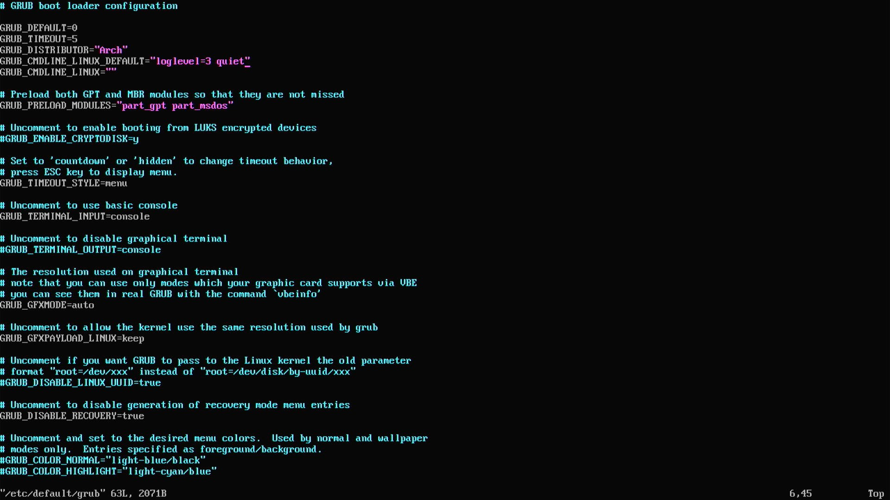

之后重新`grub-mkconfig`

## 4.2 sudo与特权用户

建议安装`sudo`后将想要使用特权指令的非特权用户添加到`wheel`组而不是手动添加用户入口。使用`visudo`编辑`/etc/sudoers`，去除`%wheel ALL=(ALL:ALL) NOPASSWD: ALL`（执行时无需密码）或`%wheel ALL=(ALL:ALL) ALL`（需要密码）的注释即可

```shell
su
usermod -a -G wheel your-username
visudo
```

## 4.3 将grub配置文件安装到ESP分区

通过以下命令，`grub`的配置文件就会安装到ESP分区下的`grub`目录，假设当前ESP挂载到`/mnt`

```shell
grub-install --target=x86_64-efi --efi-directory=/mnt --bootloader-id=GRUB --boot-directory=/mnt
grub-mkconfig -o /mnt/grub/grub.cfg
```

## 4.4 CMOS时间同步

`systemd`下使能`systemd-timesyncd`

```shell
sudo systemctl enable systemd-timesyncd
```

创建`/etc/systemd/timesyncd.conf.d/myserver.conf`配置文件

```shell
[Time]
NTP=0.arch.pool.ntp.org 1.arch.pool.ntp.org 2.arch.pool.ntp.org 3.arch.pool.ntp.org
FallbackNTP=0.pool.ntp.org 1.pool.ntp.org
```

使能时钟同步

```shell
timedatectl set-ntp true
```

查看状态

```shell
timedatectl status
```

## 4.5 GPU与3D

测试程序，`mesa-utils`

```shell
sudo pacman -S mesa-utils
```

运行`vkgears`和`glxgears`经典齿轮测试程序，分别检查Vulkan和OpenGL基本功能是否可用


还可以安装`vulkan-tools`，运行`vkcube`


也可以使用`glmark2`运行OpenGL跑分，使用`vkmark`运行Vulkan跑分。测试OpenGL ES，使用`glmark2-es2`

如下图，经典木箱


AMD显卡安装`radeontop`查看GPU资源使用

```shell
sudo pacman -S radeontop
```

## 4.6 显示器亮度调节

安装`light`并确保非特权用户加入`video`组

```shell
sudo pacman -S light
su
usermod -a -G video your-username
```

```shell
light -A 5 # 调亮5
light -U 5 # 降低5
```

查看目前可用的显示器，可以使用`xrandr`

## 5 安全专题：SELinux

可以在Fedora或RHEL（注册开发者后免费使用）下尝试SELinux

单看SELinux的官方手册比较晦涩难懂，建议先看[实战](#522-selinux实战)，有初步了解以后再看概念

> SELinux本身的设计比较混乱，给系统管理员带来了不小的负担。在Linux下实现全功能的MAC这个需求本身就是极度复杂的。但是为了数据安全，在关键的场合最好认真对待，不要禁用SELinux https://stopdisablingselinux.com/
>
> Dan Walsh [博客](https://danwalsh.livejournal.com/)

## 5.1 SELinux简介

### 5.1.1 SELinux是什么

SELinux是Linux内核的一个安全扩展，全称**Security Enhanced Linux**，在Linux内核中提供**MAC**（Mandatory Access Control）支持，限制程序的资源访问，包括但不限于普通文件，设备文件，网络接口，socket，消息队列，共享内存，数据库等。但是SELinux并没有提供特性丰富的程序运行时防护机制，例如随机链接地址ASLR等，但是它可以限制程序将自己的堆区、栈区等区域设定为可执行

区别于Linux中传统的**DAC**（Discretionary Access Control）访问控制，**MAC**可以提供更为细粒化的额外访问控制。从Discretionary和Mandatory的含义来看，Discretionary是较为宽松的访问控制，它主要基于用户本身的`uid`，`gid`以及文件的`u`，`g`，`o`，`rwx`权限，加上扩展的[ACL](201219a_shell.md#1126-权限管理进阶acl)等进行判定，系统内拥有高访问权限的用户例如`root`几乎可以自由访问任何资源；而Mandatory是较为严格的访问控制，用户或进程能否访问资源不仅决定于他们本身的身份和权限，还独立取决于内核安全模块例如SELinux的决定，即便是`root`也是不能自由访问任意资源的

SELinux的MAC鉴权位于DAC之后，也就是说如果DAC就没有允许访问，那么就不会再过SELinux

### 5.1.2 SELinux的争议和类似项目

SELinux的争议在于NSA参与了开发。很多非企业级Linux发行版都默认不使用SELinux，开启SELinux需要一些额外的操作，包括重编译、更换内核，设置参数，以及部分已有软件的重新编译

相比SELinux需要为每一个文件标记额外属性，另一个流行的解决方案为[AppArmor](#6-安全专题apparmor)，它是基于访问路径设计的，相比SELinux要简单一些

SELinux的开发与维护主要受RedHat赞助。红帽系的发行版例如Fedora，RHEL，Rocky Linux，AlmaLinux和CentOS默认使用SELinux。而其他许多Debian、SUSE系发行版例如Ubuntu，Debian，OpenSUSE，SLES等更加偏好AppArmor，因为Canonical赞助了它的开发。其他面向爱好者做桌面系统的发行版如ArchLinux，ArtixLinux，Gentoo等默认不会使用两者中的任何一个

> 安卓默认也开启了SELinux

此外还有一个收费的[grsecurity](https://grsecurity.net/)，在[Gentoo Wiki](https://wiki.gentoo.org/wiki/Hardened/Grsecurity2_Quickstart)有页面。这是除SELinux、AppArmor以外的又一个Linux安全扩展，除了MAC以外它还提供了程序运行时的内存防护。它提供了PaX（包含NOEXEC禁止执行，ASLR链接地址随机化功能），RBAC（基于Role的MAC）这些主要的安全功能模块。它以Linux内核`patch`的形式发布，用户需要自行下载补丁应用到内核源码后重新编译内核才能使用。而SELinux和AppArmor已经是Linux官方支持的安全扩展

如果是想要免费的ASLR等运行时保护特性，可以看看[linux-hardened](https://github.com/anthraxx/linux-hardened)。这也是ArchLinux的`linux-hardened`内核使用到的项目

> 检查自己系统对抗这些攻击的能力，可以使用`paxtest`测试，ArchLinux下可以通过`pacman -S paxtest`安装

### 5.1.3 基本工作原理

SELinux使用`policy`定义进程之间、进程和资源之间的访问限制，`policy`由`rule`组成。SELinux本质上是以白名单的形式进行过滤的。任何不符合`policy`规定的资源访问都会被拦截并禁止。SELinux中`policy`需要编译为二进制格式，可以以`base`和`module`等形式存在，其中模块`policy`可以加载卸载或安装删除，灵活扩展

SELinux的MAC是在DAC后进行的。也就是说如果DAC环节就没有允许访问，那么也就不会执行MAC检查

> 在设计`policy`时需要非常谨慎，最好要经过完整的验证，而一般的需求直接使用系统提供的`policy`就可以了

SELinux基于上下文`context`判断是否允许访问，上下文格式为`user:role:type:sX:cX`五元组。使用SELinux的发行版例如RHEL会至少提供两种预设`policy`，分别为`targeted`和`mls`，二者只能选一个（默认`targeted`），其中`targeted`就是普通的基于`type`的`policy`，上下文中的`sX`不起作用；而`mls`基于BLP分层安全模型，需要使用到`sX`域，只在军事机关等要求极高安全性的场合会使用。MCS只是上述两种主`policy`的附加机制，使用`targeted`和`mls`时MCS都是默认开启的，但是需要额外配置后`cX`域才会真正起作用

> **Type Enforcement**就是对应`targeted`策略，进程都运行在自己的`domain`下，`policy`以`type`为根据限制它们，它和SELinux的**RBAC**共同构成基本的MAC机制。**MLS**对应`mls`策略

被SELinux监管的每一个对象都有自己的`context`（通常叫`label`，无论进程，文件等）。通过统一格式的上下文，SELinux可以将所有这些受管辖的对象充分抽象化，同时规避了基于访问路径方案会带来的二义性问题（例如同一个文件可能因为文件系统的挂载或目录软链接，会有多个路径）

SELinux可以根据上下文将每个进程限制在合适的`domain`中，使其正常工作并给予最小的访问权限

> SELinux只是为系统提供了资源访问的安全保护措施。**它能做的仅仅是防止数据进一步泄漏，并不能从根源上解决软件的安全漏洞**

## 5.2 SELinux中常见的术语解释

**AV**：Access Vector，SELinux通过查询该列表获取对应的权限设定（permissions，例如`open read write attach`等）

**AVC**：Access Vector Cache，AV的查询缓存。有两种AVC，其中系统AVC缓存位于内核空间（kernel），而应用AVC位于用户空间（userspace）。内核空间的AVC存放Security Server自己的查询缓存，而用户空间的AVC需要使用`libselinux`为SELinux-aware的应用软件提供查询缓存

**Domain**：SELinux中每个域`domain`可以有一个或多个进程（process，例如同一个应用的不同实例）。这些进程与特定的安全上下文（Security Context，见下）相关联。`policy`中的类型执行规则（Type Enforcement rules，也即`rules`）定义了这些`domain`和不同`object`的交互规则

**LSM**：Linux Security Module，Linux内核专门为SELinux这类安全扩展提供的开发框架，可以在往常的资源访问等流程中加入探针（hooks），方便访问控制和权限检验等

**MLS**：Multi-Level Security，基于BLP模型的多层安全。在多层安全中，所有的资源和访问主体都会有自己的机密等级`sensitivity level`。等级数字越大等级越高，处于等级`sX`的进程只能读取小于等于`sX`等级的资源，或向同等级资源写入（只允许信息由低等级向高等级传递，而不能反向流通，否则就是泄密）

**Object Class**：每一个Object Class都定义了从属`object`的可用权限（`open read write attach`等）和其他附加信息。Object Manager依靠这些权限信息来管理对于`object`实例的访问

**Object Manager**：`object`管理器在SELinux中接受其他进程的访问请求，并向Security Server发送查询请求（基于Security Context或SID，Object Class，AV），基于伺服器的回复执行合适的动作，相当于SELinux的执行部分

**Policy**：相当于Security Server的数据库，由`rule`组成。使用`kernel policy language`或`CIL`语言编写，编译成二进制模块后使用

**Role Based Access Control**：SELinux中的每一个`user`可以隶属于一个或多个`role`，而每一个`role`可以和一个或多个域`domain`关联。在SELinux中它不是决定能否访问的关键因素（因为SELinux主要是`Type Based`的，在`targeted`中起作用的主要就是`type`）

**Security Server**：接收Object Manager以及其他使用SELinux库的软件发来的请求，查询`policy`，计算Security Context，返回结果表示是否可访问

**Security Context**：有些场合也称作`context`或`label`，格式为`user:role:type:sX:cX`

**SID**：Security Identifier，使用`u32`表示一个Security Context，每个`context`都有对应的`SID`，Security Server的数据库会记录`SID`和`context`的映射关系（可以看作数据库主键）。`SID`会用于Security Server和Object Manager之间的信息交换

**Type Enforcement**：SELinux中，所有的`object`和`subject`都有自己的`type`，并且SELinux默认的`targeted policy`就是靠这个`type`来规定是否访问

## 5.3 SELinux核心架构

介绍SELinux的架构，对SELinux的底层构成有大致的了解

SELinux的核心组件关系框图如下

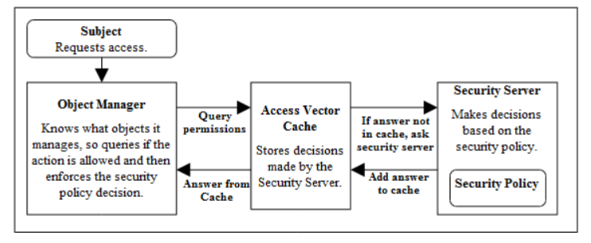

> 资源访问行为都可以抽象为发起访问请求的一方，以及被访问的一方。SELinux中进程（也即发起访问请求的一方）等同于`subject`，而被访问的资源例如文件、socket等对象等同于`object`（进程也可以是`object`）。`subject`和`object`都拥有自己的`context`，即Security Context，格式为`user:role:type:sX:cX`
>
> 每个进程（指`subject`视角下的）都有自己所归属的域`domain`，它就是相当于进程的`type`，我们说进程运行在这个域`domain`下面。而对于`object`来说`type`就是`type`
>
> 而`label`就是指包含`user:role:type:sX:cX`在内的完整的`context`。`object`和`subject`的安全上下文本质上是有一些区别的，其中之一就是在`mls`策略下，一个`object`只能有一个所属的机密等级`sX`，而`subject`经常会被赋予一个等级范围`sX-sY`
>
> Object Manager相当于给`subject`的资源访问功能包装了一层，它代理了`subject`触发的访问请求，并向AVC和Security Server请求查询。如果最终的结果允许访问，那么Object Manager就会执行相应的操作。**Object Manager只是执行部件**
>
> Security Server仅仅和Object Manager交互提供请求回复，而没有执行功能，内核中的AVC相当于Security Server的缓存。Security Policy（`policy`）相当于该服务器的数据库
>
> `policy`以若干**规则**（`rule`）为基本单位构成，使用`kernel policy language`或`CIL`编写（可以使用`m4`，`.cil`格式等）

更详细的架构图如下

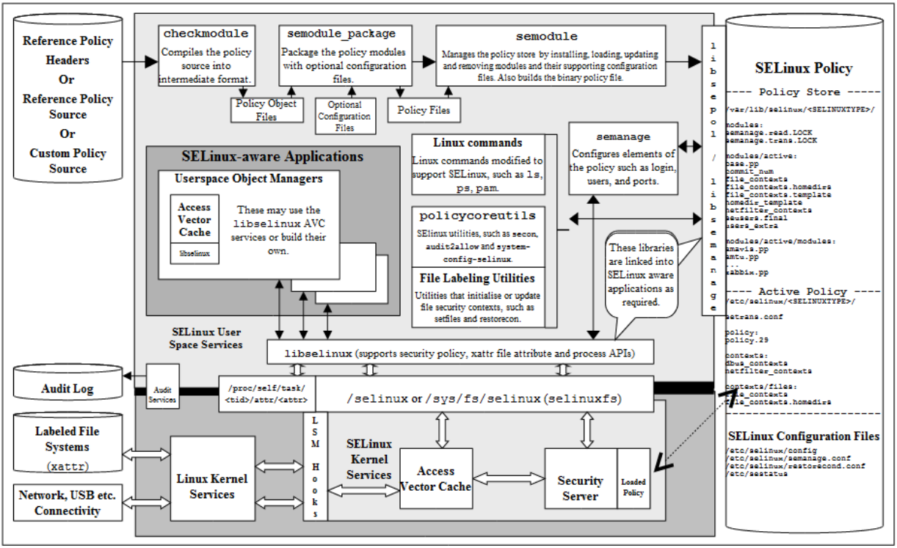

> 由上面的示意图可以看到，SELinux只有Security Server部分是完全集成在内核空间的。Object Manager和AVC都可以集成在**内核空间或用户空间**。**用户空间**的Object Manager也就是SELinux-aware Applications，它访问SELinux功能只通过调用`libselinux`库访问位于`/sys/fs/selinux`的`sysfs`来实现，同时它们有自己单独的AVC机制。而**内核空间**的Object Manager功能**实际上由LSM框架实现**（通过hooks），它只能使用内核空间的AVC
>
> 用户空间的应用程序可以通过`libsepol`或`libsemanage`直接访问`policy`数据库以获取、修改、管理信息，例如`ls`扩展的`ls -Z`参数，以及SELinux常用的管理命令`semanage` `semodule`等也会使用这些库。`libsepol`和`libsemanage`主要用于管理SELinux本身的设定，而`libselinux`才是给应用调用实现受控访问的
>
> 类似于设备树，开发者编写的`policy`源码需要编译为二进制格式才能被系统使用，这在上图的顶端有所体现。SELinux可以支持像其他普通的编程语言一样模块化构建`policy`，同时支持灵活的加载卸载或添加删除这些`module`，而无需将所有规则写到一个文件中。kernel policy language不适用于编写大型的`policy`，常用的其他方案有CIL
>
> SELinux的基本配置文件（包括`targeted`与`mls`相关的配置数据）位于`/etc/selinux`，SELinux filesystem的路径在`/sys/fs/selinux`，`policy`的二进制文件以及其他详细配置位于`/var/lib/selinux`
>
> SELinux提供了`audit`日志服务。Audit Log中存储的就是SELinux的日志，包括了记录到的安全事件，例如被拦截而失败的访问等

下图更直观地显示了加上MAC后的资源访问过程

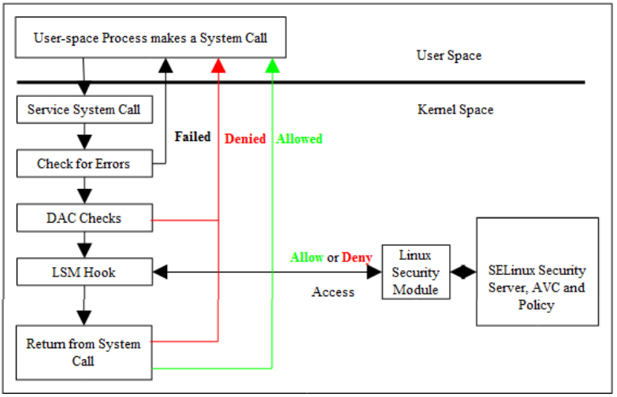

> 一旦启用了SELinux，基于SELinux的MAC是无法绕过的

## 5.4 User

SELinux有自己的用户定义，和Linux系统的用户没有关系。SELinux中的每一个`user`本质上表示了一组用户。例如`staff_u`代表了系统的管理员，而`user_u`代表了系统中的普通用户。SELinux中的特殊用户名`system_u`（系统用户）是专门用于系统服务和系统`object`的。在大部分Linux发行版中，习惯上SELinux的用户名都以`_u`结尾。安卓只使用一个用户名`u`

`user`也不能直接决定SELinux是否放行访问，它只是起辅助性的作用。然而如果有必要，**Type Enforcement**还是可以针对上下文的`user`域设置一些限制的

列出当前`policy`下（`targeted`）所有的SELinux`user`

```
# seinfo -u

Users: 8
    guest_u
    root
    staff_u
    sysadm_u
    system_u
    unconfined_u
    user_u
    xguest_u
```

> 这里还是要理清一个概念，SELinux中的`user`身份是对于`subject`来说的（虽然这些`subject`也可能以`object`身份出现），观察上述`user`名的字面意义就可以明白了。这里的`user`可以是`guest`，`staff`，`xxxadm`管理员等，而并不存在针对`object`定义的`user`
>
> 这涉及到了上下文的本质性问题。对于`object`来说上下文的作用和`subject`并不相同，`user`域并不会表示`object`本身的属性（例如是端口或文件）

## 5.5 Role（RBAC）

和`user`同理，`role`身份也是针对于`subject`来说的。它也不能直接决定SELinux是否放行访问。如果有必要，**Type Enforcement**也是可以针对上下文的`role`域设置一些限制的。在大部分Linux发行版中，习惯上SELinux的用户角色都以`_r`结尾。安卓只使用一个角色名`r`

列出当前`policy`下（`targeted`）所有的SELinux`role`

```
$ seinfo -r

Roles: 14
    auditadm_r
    dbadm_r
    guest_r
    logadm_r
    nx_server_r
    object_r
    secadm_r
    staff_r
    sysadm_r
    system_r
    unconfined_r
    user_r
    webadm_r
    xguest_r
```

SELinux中`user`，`role`和`type`（`domain`）的关系示例如下图

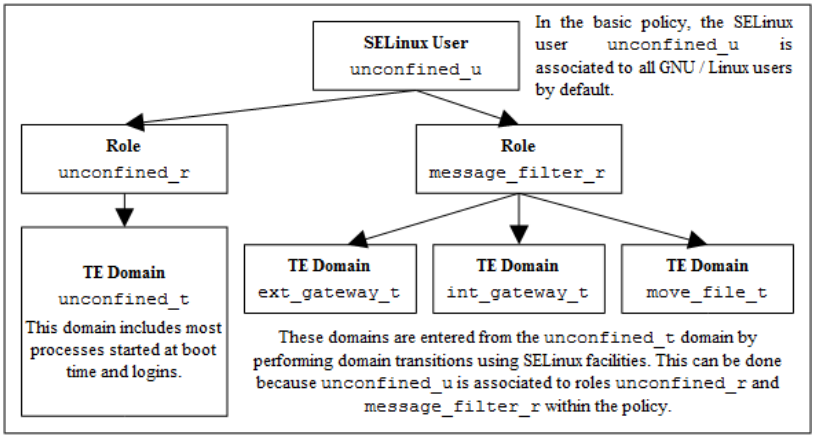

> SELinux中有上下文的`transition`机制，可以允许一个`domain`中的进程或用户切换到其他`domain`下。`user`，`role`和`type`的三层映射机制为这种转换提供了支持，如果一个`user`和多个`role`关联，那么它就有可能切换到其他可用`role`对应的`domain`下（需要使用`transition`显式声明）

## 5.6 Type Enforcement

**Type Enforcement**是SELinux（`targeted`政策）中起作用的机制之一（`targeted`下最主要的机制，而`mls`下还有机密等级），它会决定一个`subject`是否可以访问一个`object`

> `user:role:type:sX:cX`中的`type`域对于`subject`来说就是`domain`，而对于`object`来说就是`type`

在Type Enforcement中，SELinux中所有`subject`都拥有自己的`domain`，而被访问的`object`被赋予了各种各样的`type`。可以将`domain`看作一把伞，而它会罩住一些`type`（通常在`policy`的规则中通过`allow`声明，从一个`domain`可以访问哪些`type`）。安装或使能对应的`policy`模块后，`subject`就被允许访问这些`object`

> `policy`中大部分有用的声明和`rules`都是集中注意力在处理上下文的`type`域上的

> RHEL和Fedora提供的`targeted`政策默认会将未知的（例如第一次运行的）程序扔到`unconfined_t`下，即不受限制，限制该程序必须编写并添加新的`policy`

`type`（`domain`）命名习惯上以`_t`结尾。例如定义一个系统中`/var/www/html/`下的文件和目录的`type`域都为`httpd_sys_content_t`，而`/tmp/`和`/var/tmp/`下所有文件和目录`type`域都为`tmp_t`

### 5.6.1 Constraints

在Type Enforcement下实际上是可以对`role`加以限定的。示例如下

```
allow unconfined_t ext_gateway_t:process transition;
```

可以使用`constrain`声明加以限制（回忆前文给出的`user role type`三级映射）

```
constrain process transition ( r1 == r2 );
```

> 上述第一条声明规定运行在`unconfined_t`域下的进程有权将一个进程`transition`到`ext_gateway_t`下
>
> 第二条`constrain`声明规定了对于`transition`的进程，切换出的`role`必须和切换进的`role`相同（不能切换到不相关`role`）。这里的`process`是该条`constrain`命令的`object class`，而`transition`表示`permission`（`permission`可以有多个）

### 5.6.2 Bound

`bounds`是SELinux在`policy`版本24中引入的一种机制，`typebounds`规则规定被`bound`的`domain`不能拥有比`bound`它的`domain`更多的权限（例如读，写等）。它也可以适用于`user`和`role`，但是不会真正起作用

```
typebounds bounding_domain_t bounded_domain_t;
```

## 5.7 Security Context安全上下文

SELinux中所有`subject`和`object`都有对应的Security Context，Security Server会依照这些安全上下文结合`policy`规定来判断是否可以允许访问。安全上下文也被称为Security Label或`label`，**后文表述若不作特殊说明，**`label`**等同于安全上下文**

```
user:role:type:sX:cX
```

五元组，或更通用的形式，MLS和MCS可以指定`range`

```
user:role:type:sX:cX-sX:cX
```

> 前文已经展示过了`user role type`之间的映射关系。`policy`会规定`user`和`role`允许使用哪些`role`和`type`。最终起决定性作用的是`type`，`policy`中会规定拥有指定`domain`的`subject`允许访问拥有哪些`type`的`object`
>
> `sX`表示敏感等级sensitivity level，而`cX`表示category，分别为SELinux中`mls`和MCS机制所感兴趣的域。有关这个域解释见[实战](#5226-使用mcs)
>
> 对于`subject`来说，如果当前SELinux配置为`targeted`政策，那么`sX`域实际上不会起作用（默认所有`object`和`subject`都位于`s0`），而`cX`也要经过[配置](#5226-使用mcs)以及相应用户、文件的重标记以后才会起作用（默认所有`subject`处于`c0.c1023`，不受限）。`subject`是否允许访问`object`在绝大部分情况下只会取决于`type`一个域，`policy`中是否有对应的`allow`声明（也可能有UBAC或RBAC配置，这时也会从`user`和`role`的维度进行访问限制）
>
> 而对于`object`来说，其`user`会被设定为`system_u`或创建该`object`的进程的`user`名（例如`unconfined_u`）；`role`通常都是设定为特殊的内置`role`类型`object_r`
>
> 如果SELinux配置为`mls`，那么`sX`域也会起作用，`cX`域同样也需要配置以后才会发挥作用

`ls`和`ps`命令可以配合`-Z`参数显示`subject`进程和`object`文件资源的安全上下文

```
$ ps -eZ
LABEL                                                       PID TTY         TIME        CMD
system_u:system_r:init_t:s0                                   1 ?       00:00:01        systemd
system_u:system_r:kernel_t:s0                                 2 ?       00:00:00        kthreadd
system_u:system_r:kernel_t:s0                                 3 ?       00:00:00        rcu_gp
...
unconfined_u:unconfined_r:unconfined_t:s0-s0:c0.c1023     62491 ?       00:00:00        firefox
unconfined_u:unconfined_r:unconfined_t:s0-s0:c0.c1023     62511 pts/0   00:00:00        ps
```

```
$ ls -lZ
-rw-rw-rw-. 1 root root     unconfined_u:object_r:user_home_t:s0 40 Nov  1 09:00 file.txt
-rw-r--r--. 1 user group    unconfined_u:object_r:user_home_t:s0 32 Nov  1 09:01 raw.img

$ ls -lZ /etc
...
-rw-r--r--. 1 root root     system_u:object_r:net_conf_t:s0     158 Jun 23 2020 hosts
...
```

## 5.8 Subjects

在SELinux中，`subjects`就是进程，它们都拥有自己的安全上下文Security Context

> 进程本身也是一个`object`。SELinux中每个进程的`object class`都为`process`。`policy`中也定义了对应这些进程`object`的规则，例如进程的`transition`规则

SELinux中`subjects`可以分为可信Trusted或不可信Untrusted。在Linux系统中，可信的程序通常有`init`，`pam`，`login`等，可以认为它们不会出现非法访问的行为，是可信的。如果系统管理员有需要，也可以选择Trust其他任何安全并经过验证的应用。除这些`subject`以外，所有其他的`subject`都应该是不可信的

可信的程序可能会运行在自己的`domain`中，也可能几个程序共用一个`domain`，例如`semanage semodule`共用`semanage_t`

## 5.9 Objects

在SELinux中，`objects`就是指所有可以被`subjects`（进程）访问的实体，例如文件，socket，管道，网络端口等。所有的`objects`都有自己对应的`object class`，它会指示该`object`可用的属性，例如`read write receive attach`操作等。所有`object`都有自己的安全上下文

### 5.9.1 Object Class与相应的权限

每一个`object`都拥有一个`object class identifier`，指示它所属的类型（例如`file socket process`等），同时通过AV说明对该`object`允许的操作（例如`read write send`权限等）。当一个`object`被实例化时，SELinux会给这个`object`分配一个名称，同时创建对应的安全上下文。概念框图如下

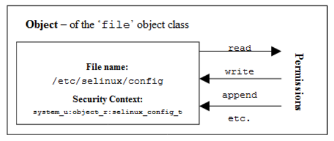

> 上述示例中，SELinux给文件`/etc/selinux/config`创建了一个`label`为`system_u:object_r:selinux_config_t`。其`object class`为`file`，在该类型的AV中说明了可用服务（操作）有`read write append`等。`policy`中应当最小化这些`object`的可用操作，以最大程度限制访问，保证安全性
>
> `object class`以及它们对应的可选访问权限是内置到Linux内核以及用户空间的Object Manager中的，无法通过`policy`更改
>
> `object class`分为内核类型`kernel object class`以及用户空间类型`userspace object class`两种。常见的`kernel object class`有`file socket`等，而`userspace object class`基本和X-Window、DBus等用户空间程序相关

### 5.9.2 允许进程访问资源

SELinux中的`policy`通过`allow`声明允许指定`domain`下的进程访问指定资源

```
allow Rule | source_domain |  target_type  :  class  | permission
-----------▼---------------▼-------------------------▼------------
allow        unconfined_t    ext_gateway_t :  process  transition;
```

> 上述示例中，`source_domain`就是指`subject`进程的`domain`，为`unconfined_t`，这里的`subject`可以是执行gateway应用程序的shell。这个shell进程通过fork形式运行新的程序，由于这个新程序默认会继承shell的`domain`，为了允许它切换到自己的`ext_gateway_t`，需要允许上述切换。这里shell程序就是主动方，而被执行的程序就是被作用的一方。`transition`需要的不仅是上述`allow`声明，更多详情见[5.12](#512-domain和object的切换transition)
>
> 上述示例就是一个`transition`，这是属于一种比较特殊的权限。在SELinux中，进程不仅可以是`subject`身份，也可以是`object`身份

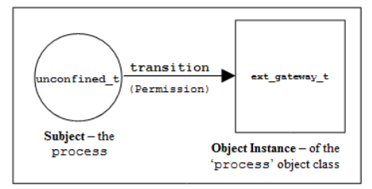

另一个示例，允许普通的文件访问

```
allow Rule | source_domain |  target_type  :  class  | permission
-----------▼---------------▼-------------------------▼------------------------
allow        unconfined_t     simple_log_t :  file     { write read getattr };
```

### 5.9.3 为Object打Label

`object`的`label`是由系统自动管理的，普通的用户是无法控制的。以下是SELinux中可能的`label`来源

在新创建进程或`object`时，它通常会从父进程（仅限于新进程）或父`object`（例如文件的父目录）继承`label`。可以在`policy`中使用相关的声明来设定默认的`user role type range`

`transition`机制（[5.12](#512-domain和object的切换transition)）可以允许切换`object`的`label`（例如切换子进程的`label`，或在一个目录下新建文件时使用不同的`label`）。需要通过`policy`中`role type range`相关声明实现

而对于支持SELinux的应用（SELinux-aware），可以在`policy`允许的前提下（`process { setfscreate }`权限），通过调用`libselinux`库函数`setfscreatecon()`给`object`指定想要的`label`。这样可以覆盖SELinux中的已有配置，为新建的文件赋予任意想要的`label`

Object Manager也可以基于内置设定或外部配置文件enforce一个默认`label`

SELinux还提供了初始`SID`（`initial Security Identifier`）设定功能。所有的`policy`都定义了初始`SID`，用于在系统启动过程中设定`label`，或者一个`object`还没有`label`时给予的默认`label`

**文件系统支持**

想要为每个文件添加`label`必须要文件系统的支持。在`policy`中使用`fs_use_xattr`声明可以使用扩展属性的文件系统，由此Security Server可以知道如何在文件系统内打标签。SELinux为文件系统重标记提供了`fixfiles setfiles chcon restorecon restorecond`等用户程序

文件的`label`通过`ls -lZ filename`或`getfattr -n security.selinux filename`可以查看

此外，SELinux中还有一个文件`file_contexts`，它使用正则表达式格式指明了在系统中各个文件的默认`label`，有几千项记录，几乎涵盖所有可能的文件。`semanage fcontext -l`就可以查看相关内容

```
$ semanage fcontext -l
SELinux fcontext                    type            Context

/                                   directory       system_u:object_r:root_t:s0
/.*                                 all files       system_u:object_r:default_t:s0
/[^/]+                              regular file    system_u:object_r:etc_runtime_t:s0
...            
```

**文件的复制和移动**

**复制**文件时，由于本质上是创建了一个新文件而不是简单的更改指针，新文件的`label`会默认继承父目录的`label`。而**移动**文件时，本质上没有创建新文件，移动后的文件依旧沿用原来的`label`

Linux系统下的`install`命令也可以用于复制文件，但可以使用`-Z`参数可以指定`label`

如果当前SELinux提供的`restorecond`正在运行，适当配置`restorecond.conf`可以指定文件复制、移动后的上下文，而不采用原来的`label`或`file_contexts`中提供的父目录`label`

例如`restorecond.conf`中有如下入口

```
/usr/message_queue/in_queue/*
```

`file_contexts`中有如下入口

```
/usr/message_queue/in_queue(/.*)? -- system_u:object_r:in_file_t
```

> 依照如上配置，在`/usr/message_queue/in_queue/`下创建新文件时（无论复制或移动），其`label`都会被`restorecond`设置为`system_u:object_r:in_file_t`，而非原来的`label`或目录`/usr/message_queue/in_queue/`的`label`

### 5.9.4 为Subject打Label

一个进程（`subject`）启动时，它首先会从父进程处继承上下文，也即使用父进程相同的`domain`

SELinux为进程的上下文切换提供了`transition`机制。可以在`policy`中定义`transition`来允许切换新程序的`domain`

SELinux的`policy`中提供了`user`，`role`，`type`，`role_allow`，`constrain`，`type_transition`，`role_transition`，`range_transition`等声明关键字来操作`label`，例如设定`label`

SELinux-aware的程序也可以调用`libselinux`中提供的接口函数来设定`label`。例如在`policy`中给特定`subject`（`process`）允许了`process { setexec setkeycreate setsockcreate }`后，进程可以调用`setexec() setkeycreatecon() setsockcreatecon()`来设定其他进程、kernel keyring和socket的`label`

SELinux对于内核线程，内核socket，以及`system`类，也有`label`的解决方案，它们会被赋予`kernel`这个初始`SID`。在内核启动过程中，由于第一次初始的`policy`加载之前都不会获得详细的`label`信息，此时包括其他一些非内核进程可能也会使用`kernel`这个`SID`，直到`policy`加载完成并进行`transition`或显式地为这些程序设置`label`

SELinux中还有一个`SID`为`unlabeled`。当发生`policy`重载时，一些`subject`或`object`的`label`会失效，此时它们的`SID`虽然表面上不变化，但是它们的`SID`会透明地重映射到`unlabeled`。此外，`unlabeled`也用于许多`object`在初始状态下的`SID`，例如inode，superblock等，直到`policy`中有了对应设定，它们可以得到指定的`label`

### 5.9.5 Object复用

在启用SELinux的系统中，如果一个进程释放了一个`object`（例如释放一片内存，删除文件或目录等），可能会留下一些SELinux有关的信息，这些释放资源中的残余SELinux信息有可能被其他程序获取。如果有必要，在程序设计中，释放`object`资源前最好销毁这些信息

## 5.10 安全上下文的计算

安全上下文计算就是得出一个新的`label`的过程，这通常会发生在一个进程或`object`被创建的时候。新的上下文通常需要依据已有的`policy`声明以及相关的`label`得出

> 不同的内核，SELinux版本以及`policy`版本对于同样的已知`label`会有不同的计算结果

执行一次计算时，需要一个源上下文（`source context`），一个目标上下文（`target object`），以及一个`object class`

> `libselinux`提供了以下用户空间接口函数用于安全上下文计算：`avc_compute_create()`和`security_compute_create()`，`avc_compute_member()`和`security_compute_member()`，以及`security_compute_relabel()`。这些函数实际上还是调用了内核用来访问Security Server的函数，加了一层包装

> 在`kernel policy language`中，有以下声明会影响上下文计算结果
>
> `type_transition`，`role_transition`，`range_transition`，`type_member`，`type_change`，`default_user`，`default_role`，`default_type`，`default_range`

以下小节讲述SELinux下不同`subject`或`object`的上下文计算方法

### 5.10.1 进程Process

启用SELinux的系统在启动时，默认所有进程都使用`kernel`上下文（初始`SID`），`init`也不例外。为了切换到自己的`domain`例如`init_t`下，有些情况下`init`进程会在`policy`加载以后再执行一下自身；而在一些使用了`initramfs`或`initrd`的系统中，`policy`加载会在`initramfs`阶段执行，之后才挂载磁盘上的文件系统并执行磁盘上的`init`程序副本，同时切换到`init_t`下

对于一个进程来说，它被创建时会以下述方式得到自己的`label`：

> 在调用`fork()`系统调用创建新进程时，新进程继承父进程的`domain`；
>
> 在调用`exec()`创建新进程时，新进程的`domain`可以基于`type_transition`，`role_transition`，`range_transition`，`type_member`，`type_change`，`default_user`，`default_role`，`default_type`，`default_range`声明进行对应切换，或者被父进程调用`setexeccon()`显式指定（不建议使用`setcon()`直接切换）；
>
> 如果`policy`使能了`nnp_nosuid_transition`，可能需要为`nosuid`方式挂载的文件系统使能`nosuid_transition`，以及为`no_new_privs`的线程使能`nnp_transition`，才能允许切换`domain`。如果禁用`nnp_nosuid_transition`，只能支持`bounded`切换

### 5.10.2 文件Files

文件本质上都是`inode`。`inode`包括了文件file，符号链接symbolic link，目录directory，套接字socket，fifo以及块设备block、字符设备character等

Linux中除了普通的存放文件的文件系统例如`ext4`以外，还有很多类型的文件系统，例如`sysfs`，`tmpfs`，`proc`，`devtmpfs`等

对于一个文件来说，创建时会以下述方式得到`label`：

> `user`域从创建的进程处继承；（`policy`版本`27`开始允许为每一个`object class`定义一个`default_user`）
>
> `role`通常默认为`object_r`；（`policy`版本`26`开始允许为每一个`object class`定义`role_transition`，`27`允许`default_role`）
>
> 对于`type`，如果没有设定对应的`type_transition`规则，默认会继承父目录的`type`；（`policy`版本`25`开始支持`type_transition`，`28`允许为每一个`object class`定义一个`default_type`）
>
> 对于`range`和`level`，如果没有设定对应的`range_transition`规则，默认采用创建进程同一级或低一级`level`；（`policy`版本`27`开始允许为每一个`object class`定义一个`default_range`）

> 应用可以通过`setfscreatecon`改变创建文件时设定的`label`

> 文件的`label`都是通过文件系统的`xattr`扩展进行记录，正常情况下每个文件都会有一个。正如系统启动时进程默认都使用`kernel`作为初始`SID`，文件在没有被赋予`label`之前会使用`file`这个特殊`SID`，并被`policy`映射到一个安全上下文。在`mount`或`/etc/fstab`中可以使用`defcontext=`参数指定这个默认的`label`

### 5.10.3 文件描述符File Descriptors

文件描述符（不是`inode`）继承其创建者或parent的`label`

### 5.10.4 文件系统Filesystems

除了文件以外，SELinux也会给所有类型的文件系统赋予`label`。根据`policy`中的声明，这些文件系统被挂载时就会获得相应的`label`

示例，`pipefs`

```
fs_use_task pipefs system_u:object_r:fs_t:s0
```

示例，`ext4`

```
fs_use_xattr ext4 system_u:object_r:fs_t:s0
```

> SELinux的`policy`提供了3个声明`fs_use_xattr` `fs_use_task` `fs_use_trans`，分别用于支持`xattr`特性（同时支持存放`security.selinux`）的文件系统例如`ext4`，用于进程间通信管道`pipes`和套接字`sockets`，以及用于`tmpfs` `devpts` `mqueue`等临时性的`objects`
>
> 这些文件系统的`label`在挂载时获得。SELinux会调用`selinux_set_mnt_opts()`（再调用`security_fs_use()`），在`policy`中匹配文件系统类型（例如`ext4`）并找到对应的`policy`声明条目，该条声明（例如`fs_use_xattr`）说明了该文件系统的类型以及对应的`label`，将其赋给挂载的文件系统
>
> 而例如`ext4`等类型的文件系统使用`mount`（或`/etc/fstab`）挂载时可以通过`seclabel`关键字直接指定`label`
>
> 此外，`mount`还支持`context=` `fscontext=` `defcontext=` `rootcontext=`等参数对`label`进行设定

例如挂载的文件系统是`fs_use_task`，它会以下述方式得到`label`：

> `user`从创建进程处获取（版本`27`开始允许定义`default_user`）
>
> `role`默认`object_r`（版本`26`开始允许为每一个`object class`定义`role_transition`，`27`允许`default_role`）
>
> 对于`type`，如果没有设定对应的`type_transition`规则，使用`target`的`type`（版本`28`允许为每一个`object class`定义一个`default_type`）
>
> 对于`range`和`level`，如果没有设定对应的`range_transition`规则，默认采用创建进程同一级或低一级`level`；（`policy`版本`27`开始允许定义一个`default_range`）

### 5.10.5 套接字Sockets

对于使用`socket()`调用创建的socket来说，它们的`label`使用如下方式得出：

> `user`从创建进程处继承；（版本`27`开始允许为每一个`object class`定义一个`default_user`）
>
> `role`从创建进程处继承；（版本`26`允许定义`role_transition`，`27`允许为每一个`object class`定义一个`default_role`）
>
> 对于`type`，如果未找到匹配的`type_transition`规则，默认从创建进程处继承；（版本`28`开始允许为每一个`object class`定义一个`default_type`）
>
> 对于`range`和`level`，如果未找到匹配的`range_transition`规则，默认从创建进程处继承；（版本`27`开始允许为每一个`object class`定义一个`default_range`）

> `libselinux`提供了`setsockcreatecon()`调用函数给用户显式设定socket的`label`
>
> 如果`socket`是由于连接建立创建的，它继承监听进程（服务器进程）的`label`
>
> 内核socket会使用`kernel`作为自己的`SID`

### 5.10.6 进程间通信IPC

继承其创建者或parent的`label`

### 5.10.7 消息队列Message Queues

消息队列默认继承它发送进程的`label`

发送的消息如果没有上下文，需要基于当前进程以及存入的消息队列的信息，以如下方式为其计算一个新的`label`：

> `user`从发送进程处继承；（`policy`版本`27`开始允许为每一个`object class`定义一个`default_user`）
>
> `role`从发送进程处继承；（`policy`版本`26`开始允许定义`role_transition`，`27`允许定义`default_role`）
>
> 对于`type`，如果未找到匹配的`type_transition`规则，默认从发送进程处继承；（版本`28`开始允许为每一个`object class`定义一个`default_type`）
>
> 对于`range`和`level`，如果未找到匹配的`range_transition`规则，默认从发送进程处继承；（版本`27`允许为每一个`object class`定义一个`default_range`）

### 5.10.8 信号量Semaphores

继承其创建者或parent的`label`

### 5.10.9 共享内存

继承其创建者或parent的`label`

## 5.11 计算访问决策（Access Decisions）

本章节不是很重要，除非开发SELinux-aware的软件

SELinux中有以下机制可以共SELinux-aware的应用计算访问决策，以决定是否允许当前的访问：

首先是通过调用`selinux_check_access()`的方法，这是最常用的做法，在单次函数调用中会包含以下操作

> 调用`string_to_security_class()`和`string_to_av_perm()`，将`class`和`permission`字符串解析为它们对应的值（value）。如果`class`和`permission`未知，调用`security_deny_unknown()`
>
> 调用`avc_has_perm()`，首先检查访问决策是否已经在AVC缓存中（如果没有就加载），之后调用`security_compute_av_flags()`得到结果，检查SELinux的`enforcing`模式，并将所有拒绝访问记录到日志中（使用`avc_audit()`添加额外日志信息）

除以上单次调用执行所有流程，也可以直接调用`avc_has_perm()`或`avc_has_perm_noaudit()`实现以上过程

至于无AVC缓存的方案，可以直接调用`security_compute_av()`或`security_compute_av_flags()`得到决策结果。可以调用`avc_netlink_*()`监视`policy`更改事件。开发者需要自己决定audit。应用程序也可以调用`security_compute_av()`和`security_compute_av_flags()`自己实现缓存功能

如果想以高效率获取信息，可以调用`selinux_status_open()`，`selinux_status_updated()`，`selinux_status_getenforce()`，`selinux_status_policyload()`，`selinux_status_close()`来调取信息

## 5.12 Domain和Object的Transition

SELinux在`policy`中使用`type_transition`声明切换进程的`domain`以及Object的`type`。应用程序也可以调用`libselinux`提供的接口实现这样的切换

### 5.12.1 进程的domain切换

进程切换`domain`最普遍的方法就是通过`exec()`调用，创建新的进程。因为大部分普通应用都不是SELinux-aware的，它们无法自行执行`domain`切换所需步骤。而使用SELinux的`type_transition`声明可以在`exec()`时自动切换`domain`，而无需应用本身干预

```
type_transition unconfined_t secure_services_exec_t : process ext_gateway_t;
```

上述示例中，`unconfined_t`为`source domain`，也即当前运行进程的`domain`；`secure_services_exec_t`为被执行的二进制文件的`type`，也即`target type`；而`ext_gateway_t`为`target domain`，也即当前进程执行该二进制文件后，新进程切换到的`domain`

这条`rule`的效果就是，一个`unconfined_t`的进程（例如`shell`）执行了一个`type`为`secure_services_exec_t`的二进制程序文件，这个新进程会被自动赋予`ext_gateway_t`这个`domain`

> 仅仅有以上声明还不够，这里为了`transition`还需要其他3条声明，分别需要允许`source domain`到`target domain`的切换，允许`source domain`的程序执行该二进制文件，以及为该二进制文件提供一个进入`target domain`的入口。下文会讲述

SELinux-aware的程序也可以调用`libselinux`提供的`setexeccon()`来设定新进程的`domain`，那么此时`policy`需要允许该程序`setexec`，示例如下

```
allow crond_t self:process setexec;
```

再次以上述`unconfined_t`到`ext_gateway_t`的切换为例，需要再添加如下所示的3条`allow`规则

首先需要允许`unconfined_t`下的进程`transition`到`ext_gateway_t`，这是最基本的要求

```
allow unconfined_t ext_gateway_t : process transition;
```

其次保证`type`为`secure_services_exec_t`的文件在`unconfined_t`这个`domain`下是可执行的；`secure_services_exec_t`还需要一个进入`ext_gateway_t`的入口。结合上面的声明组成**总共4条声明**

```
allow unconfined_t secure_services_exec_t : file { execute read getattr };
allow ext_gateway_t secure_services_exec_t : file entrypoint;
```

下图表示上述过程

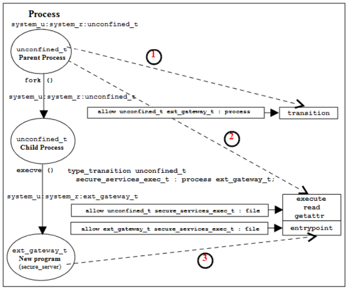

**Transition冲突**

SELinux有时候会碰到如下的冲突问题。SELinux不允许有两条`type_transition`声明从同一对`source domain` `target type`到不同`target domain`的转换（省略了配套的其他`allow`声明）。对于同一对`source`和`target`只允许有一个`target domain`（这称作`default type`），否则会产生歧义

```
type_transition unconfined_t secure_services_exec_t:process ext_gateway_t;
```

```
type_transition unconfined_t secure_services_exec_t:process int_gateway_t;
```

解决上述冲突的方法有以下几种：

一个方法是保留其中一个`type_transition`声明，另外一个声明删除，转而使用SELinux提供的`runcon`命令运行替代（`runcon`可以指定被执行程序的上下文）：

```
$ ./secure_server -p 1088
$ runcon -t int_gateway_t -r message_filter_r ./secure_server 1188
```

> 上述示例中，第一条命令运行的`secure_server`程序由于`type_transition`声明，会自动切换到`ext_gateway_t`运行。而第二条命令会使得该`secure_server`进程实例在`int_gateway_t`的`domain`下以`message_filter_r`的`role`运行
>
> `runcon`会调用`libselinux`检查该可执行文件的`label`（`getfilecon()`）以及设定新的`label`（`setexeccon()`），检查无误后才会切换`domain`并执行（因此除了上述的`type_transition`声明，其他`allow`声明**不能删除**）

另一个方法是删除两个`type_transition`声明，全部使用`runcon`执行

还有一个办法复制一份`secure_server`，这样得到两个可执行文件，并给这两个文件赋值不同的`type`，这样两条`type_transition`声明就不会冲突

也可以使用SELinux提供的参考`policy`模板自己设计一个`policy`，需要利用到`template interface principles`

### 5.12.2 Object的type切换

大部分情况下，新建`object`时它会自动从父目录（或其他父`object`）处继承`label`。如果`object`不想使用这个默认的`label`，就要使用到`transition`

例如，我们有一个目录`in_queue`，`ls -Z`显示它的`label`如下

```
drwxr-xr-x root root unconfined_u:object_r:in_queue_t in_queue
```

如果我们在`in_queue`下创建文件，文件也会被自动`label`为`in_queue_t`。想要不一样的`label`需要使用以下`type_transition`声明

```
type_transition ext_gateway_t in_queue_t:file in_file_t
```

> 上述声明规定进程`ext_gateway_t`在`label`为`in_queue_t`的目录下创建文件时，该文件应当获得的`type`为`in_file_t`，而不是继承父目录的`in_queue_t`

和`domain`的切换类似的，`object`的`type`切换也需要满足一些前提。首先`source domain`需要有权限在目标目录下添加文件入口，所以添加以下声明

```
allow ext_gateway_t in_queue_t:dir { write search add_name };
```

其次是需要允许`source domain`创建`type`为`in_file_t`的文件，这是最基本的要求

```
allow ext_gateway_t in_file_t:file { write read getattr };
```

综上，定义一条`object`的`type`切换需要**总共3条声明**

## 5.13 MLS和MCS

到前文为止讲述的都是`targeted`这个基于上下文中`type`的`policy`（Type Enforcement）。SELinux中`targeted`和`mls`两种基本`policy`是并列的关系，并且同时只能使用一种`policy`。而MCS机制是附加于`targeted`和`mls`的，无论对于`targeted`还是`mls`，MCS都要经过额外的配置才会有效果

> 一般的企业应用最多使用到`targeted`。所以如果对`mls`和MCS不感兴趣，可以不必关心本章。如果想要了解本章，可以先看[实战](#5225-使用mls)

`mls`使用了如下所示的BLP（Bell-La Padula）模型。基本的原理就是不允许向更低等级写，同时不允许读取更高等级的文件。在实际应用中也不允许向更高等级写，所以只允许写同等级。`sX`数字越大，敏感等级（机密等级）越高

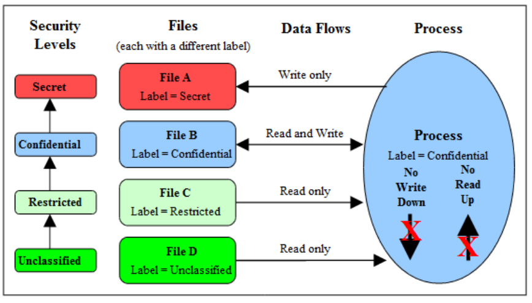

`mls`事实上是`targeted`的加强版。它同时启用了`label`中的`sX`域，使用`mlsconstrain`声明（作用机制类似于`constrain`声明）对安全等级进行可访问权限控制

> `mls`需要解决以下应用会遇到的问题：
>
> 在`mls`中，进程或用户（`subjects`）通常被赋予一个等级范围`range`而不是单个等级
>
> 通常`mls`和MCS会一起使用。这可以从两个维度进行访问控制，即便是同一个`mls`，如果当前`subject`的`cX`没有完全包含`object`的`cX`那么也是不能访问的
>
> 在`mls`中，一个进程能否访问`object`取决于`dominance`规则。`dominance`规定了不同`sX`之间的支配关系（其实就是哪个等级比哪个等级高的关系。SELinux中的敏感等级`sX`其实本身是没有高低意义的，必须要通过`dominance`定义。`mls`的`policy`已经内置了这些定义）
>
> 使用`mls`时可以允许配置一些完全信任的进程，使得它们不受`mls`的BLP机制控制
>
> 有些`object`例如网络对象可能不会分别支持`read`和`write`，而是使用`read respond`模型，所以需要特殊处理

### 5.13.1 MLS声明

SELinux中，`mls`定义`sX`并通过`dominance`声明等级高低的示例如下（`mls`策略的`policy`中应该已经有定义）

```
sensitivity s0;
sensitivity s1;
dominance { s0 s1 }
```

如果是只使用MCS而不使用`mls`，仍然至少需要声明一个`s0`

```
sensitivity s0;
dominance { s0 }
```

> `mls`和MCS的数量都是完全可以由`policy`编写者指定的。`mls`中给出了`16`个`sX`，以及`256`个`cX`

### 5.13.2 安全等级

SELinux中安全上下文（`label`）包含`sX`以及`cX`的格式如下

```
user:role:type:sX[:cX]-sY[:cY]
```

上述的`sX[:cX]`以及`sY[:cY]`就是**两个安全等级**`security level`，下文开始的`level`就是指代`sX`和`cX`。对于`object`来说`level`称为`classification`，而对于`subject`来说`level`称为`clearance`

> `subject`的`clearance`范围实际上只有下界是表示它当前实际的`level`，允许访问哪些文件实际只取决于这个单个`level`（所有用户都会有一个默认的`level`设定，后面实战有讲述）。用户只能更改这个`range`下界，以实现切换到不同`level`，并且不允许超过`range`上界

对于上述`range`格式，`sX[:cX]`永远表示当前的`level`（无论`subject`还是`object`），而`sY[:cY]`对于`subject`来说为`clearance`，对于`object`来说为最高允许的`level`

`mls`策略允许的最低的`level`为`s0`，最高的`level`为`s15:c0.c255`。通常认为拥有最高的`level`的进程访问可以不受`mls`和MCS限制

`level`**的**`range`**格式**

```
user:role:type:sensitivity[:category,...]  -  sensitivity [:category,...]
---------------▼------------------------▼-----▼-------------------------▼
               |         level          |  -  |          level          |
               |                         range                          |
```

> `sensitivity`前文已经展示过了定义方法，在`policy`中使用`sensitivity`以及`dominance`关键字声明。`sensitivity`定义一个`sX`的存在，`dominance`定义它们的高低关系
>
> `category`基于`cX`的包含关系来起作用，类似于`sensitivity`声明，它使用`category`关键字进行声明。使用`,`逗号连接两个不相邻的`cX`区域，使用`.`点`cX.cY`表示一个连续区间。可以使用例如`c3.c6`表示`c3 c4 c5 c6`，它等价于`c3,c4,c5,c6`
>
> `level`同样需要在`policy`中使用`level`关键字显式声明定义。一个`level`就是一个唯一的`sX[:cX]`组合

示例

```
# MLS Policy statements:
sensitivity s0;
sensitivity s1;
dominance { s0 s1 }
category c0;
category c1;
level s0:c0.c1;
level s1:c0.c1;
```

```
# MCS Policy statements:
sensitivity s0;
dominance { s0 }
category c0;
category c1;
level s0:c0.c1;
```

`level`**别名**

SELinux也为上文所述的`level`提供了别名翻译服务`mcstransd`，用户可以在`setrans.conf`中配置（更常用的是通过`semanage`命令），给这些`level`起别名（例如`s0 = Unclassified` `s15 = Topsecret`等）

`level`**的支配关系**

`sensitivity`的支配关系（高低关系）和`category`的包含关系一起决定了不同`level`的支配关系。不同的`level`会有以下4种关系：

> `Level1`支配`Level2`：`Level1`的`sensitivity`**大于等于**`Level2`的，并且`Level2`的`category`为`Level1`的**子集**
>
> `Level1`被`Level2`支配：`Level1`的`sensitivity`**小于等于**`Level2`的，并且`Level1`的`category`为`Level2`的**子集**
>
> `Level1`等于`Level2`：`Level1`的`sensitivity`**等于**`Level2`，并且`Level1`的`category`**等于**`Level2`（也就是说两者此时互相支配）
>
> `Level1`和`Level2`不可比：其他所有情况，主要为`category`不相容的情况

下表给出一个示例，`range`为`s0-s3:c1.c5`的程序访问文件（每个格子表示一个文件），加粗的就是它可以访问的文件的`level`。想要真正对这些文件进行访问操作，还需要`mlsconstrain`声明

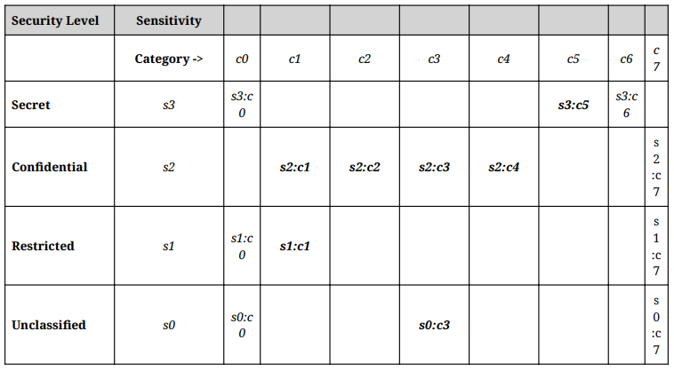


> 上图中定义了两条`mlsconstrain`，分别为`mlsconstrain file write （ l1 domby l2 ）`和`mlsconstrain file read （ l1 dom l2 ）`，分别定义允许写和读时的`level`关系。在应用程序访问文件时，SELinux就会根据`policy`中上述定义检查`level`的支配关系，以决定是否允许访问
>
> 实际的`mls`策略中，由于不允许向上写入所以使用的是`mlsconstrain file read （ l1 eq l2 ）`而不是上述示例的声明

## 5.14 SELinux Policy种类概览

SELinux中的`policy`有多种格式。从以下角度可以分为不同类型：

源码角度：分为Reference Policy和Custom。Reference Policy作为参考使用，用户自己定制的`policy`则是独立于Reference Policy的。Reference Policy提供了宏。`policy`可以使用Kernel Policy Language（`m4`格式）或CIL（`.cil`）编写

模块或单体：和静态编程语言类似的，`policy`可以分为单体Monolithic，基本模块Base Module以及可动态加载模块Loadable Module

基于声明：可以分为模块Modular，可选Optional或条件Conditional

二进制格式：和`m4`或CIL格式编写的`policy`相对的，内核使用的`policy`需要经过编译，成为Binary policy或Kernel policy

版本：`policy`有版本区别。截至2023.12，`policy`最高版本为`33`

目标平台：`policy`可以用于SELinux或Xen（这里不涉及）

### 5.14.1 Reference Policy

目前几乎所有的Linux发行版的SELinux策略都基于Reference Policy修改。Reference Policy可以编译成为单体Monolithic，或模块化Modular，由一个Base模块和若干可加载模块构成

### 5.14.2 Policy功能

各大发行版提供的基本的`policy`名称通常有`targeted`，`mls`，`minimum`等，他们会基于SELinux官方提供的`policy`源码进行修改

上述名称就是通过`/etc/selinux/config`中的`SELINUXTYPE=`配置的名称。这些`policy`会被存放在`/etc/selinux/<policy name>`下，例如`targeted`就在`/etc/selinux/targeted`

Reference Policy源码中提供了一个`build.conf`文件。其中有`NAME`和`TYPE`声明，`NAME`为编译出的`policy`的字面名称例如`targeted`，`mls`，`refpolicy`，`minimum`等；而`TYPE`由源码决定，可以用`standard`，`mcs`，`mls`等。见[Github](https://github.com/SELinuxProject/refpolicy)

### 5.14.3 Custom Policy

Custom Policy可以是基于Reference Policy的改版，也可以是用户自己使用`m4`或CIL编写的单独的策略

用户自己编写的策略可以使用`build-sepolicy`构建，这个工具会使用Reference Policy中定义的`security_classes`，`access_vectors`，`initial_sids`构建。此外SELinux的kernel source还提供了`scripts/selinux/mdp`脚本，可以直接在二进制`policy`上操作

### 5.14.4 Monolithic

单体`policy`通常由单个文件（`policy.conf`）编译而来，并且不会使用到可加载模块相关的声明。单体`policy`适用于嵌入式设备，按需求可以做的很简单，占用体积小

单体`policy`使用`checkpolicy`命令编译。Reference Policy可以编译为一个单体，而kernel policy有时也使用单体指代

### 5.14.5 Loadable Module

可加载模块必须基于一个基本模块Base Module。模块可以安装，删除，加载，卸载。SELinux为上述功能以及编译链接这些模块提供了工具，以及一个存放这些模块的空间`policy store`。此外，`policy`语言也为可加载`policy`模块提供了专用支持

可加载模块使用`optional`声明以支持在二进制内按相关条件使能或禁用一些规则

### 5.14.6 Conditional

条件`policy`是基于SELinux的`boolean`特性实现的，可以在运行时动态地使能或禁用`policy`的一部分。`boolean`可以用于单体`policy`或可加载模块

`boolean`使用`bool`关键字声明，而`policy`还提供了`if`关键字用于判断`boolean`状态并条件使能规则

更改一个`boolean`并永久生效

```
$ setsebool -P ext_gateway_audit false
```

临时更改

```
$ setsebool ext_gateway_audit false
```

### 5.14.7 二进制格式

kernel policy就是指二进制格式的`policy`

编译成二进制并直接被SELinux使用的`policy`位于`/etc/selinux/<SELINUXTYPE>/policy/policy.<version>`，例如`/etc/selinux/targeted/policy/policy.33`

`/etc/selinux/config`中要有相应配置，例如

```
SELINUX=enforcing
SELINUXTYPE=targeted
```

可以通过以下方式查看SELinux版本

```
$ sestatus
SELinux status: enabled
SELinuxfs mount: /sys/fs/selinux
SELinux root directory: /etc/selinux
Loaded policy name: targeted
Current mode: enforcing
Mode from config file: enforcing
Policy MLS status: enabled
Policy deny_unknown status: allowed
Memory protection checking: actual (secure)
Max kernel policy version: 33
```

## 5.15 SELinux运行模式

SELinux一共有`enforcing`，`permissive`，`disabled`一共3种运行模式（`/etc/selinux/config`的`SELINUX`行）。有关这3种状态的切换见[实战](#5221-基本运行模式切换)

> SELinux运行于`permissive`模式时MAC不会起作用，只有SELinux的日志（例如`audit`服务）会记录触发拒绝访问信息，用于调试。SELinux的`audit`提供了`audit2allow`以及`audit2why`工具来诊断解决这些错误

SELinux允许特定`domain`运行于`permissive`而其他`domain`运行于`enforcing`。需要通过添加模块实现，`semanage`可以自动添加这个模块

```
# semanage permissive -a user_t
```

> 上述命令会自动创建一个模块`/var/lib/selinux/targeted/active/modules/400/permissive_user_t`并加载

> 应用程序也可以调用`libselinux`的`avc_open()`设置运行模式
>
> 注意`sestatus`命令可以查看SELinux整体的运行模式，但不能查看单个`domain`处于`enforcing`还是其他模式

## 5.16 通过Audit查看事件记录

SELinux中的`audit`记录可能由SELinux的AVC本身触发，也可能由SELinux-aware的应用程序触发

AVC的`audit`记录通常与**拒绝访问**有关，也可能记录拒绝访问以外的信息（例如使用`auditallow`要求记录信息）。而SELinux的内核服务以及SELinux-aware的应用程序通常会记录例如**系统错误，初始化信息，**`policy`**加载，更改**`boolean`**变量，设定SELinux运行模式，文件系统重标签等**

SELinux的`audit`记录会存放于以下三个地方

> 内核刚刚启动时，由于此时尚处于一个非常初级的状态，SELinux的内核启动事件记录于`/var/log/dmesg`
>
> 在`auditd`服务程序启动之前，`audit`记录存放于`/var/log/messages`
>
> `auditd`服务启动之后，`audit`记录存放于`/var/log/audit/audit.log`
>
> SELinux要求SELinux-aware的程序尽量使用`audit_log_user_avc_message()`进行`audit`记录（同时开启`auditd`）。SELinux下可用的`audit`事件可以在`include/libaudit.h`以及`include/linux/audit.h`查看。而在调用`libselinux`输出`audit`信息时，默认走`stderr`

### 5.16.1 Audit基本格式

`audit`格式示例如下，由若干`keyword`以及附加信息构成。下文讲解常见`keyword`的定义

```
type=AVC msg=audit(1242575005.122:101): avc: denied { rename } for
pid=2508 comm="canberra-gtk-pl"
name="c73a516004b572d8c845c74c49b2511d:runtime.tmp" dev=dm-0 ino=188999
scontext=test_u:staff_r:oddjob_mkhomedir_t:s0
tcontext=test_u:object_r:gnome_home_t:s0 tclass=lnk_file
```

| Keyword | 定义 | 说明 |
| :- | :- | :- |
| `type` | 触发该`audit`的event类型 | `AVC`表示内核事件，`USER_AVC`表示用户空间程序触发 |
| `msg` | 该消息的记录时间以及序号，相同序号的`event`互相关联 | 格式`audit(time:serial_number)`。通常后面会带冒号`:` |
| `avc` | 表示拒绝访问还是允许访问，以及拒绝/允许的操作 | 格式示例`avc: denied { getattr } for`，`avc: granted { transition } for`（`auditallow`） |
| `pid` `comm` | 进程PID以及执行的命令（如果是进程） | `avc`后的可选域 |
| `capability` | `capability`事件ID（如果是`capability`事件） | `avc`后的可选域 |
| `path` `name` `dev` `ino` | 文件系统相关事件 | `avc`后的可选域，`name`可以不存在 |
| `laddr` `lport` `faddr` `fport` | Socket相关事件 | `avc`后的可选域，分别表示源IP，源端口，目标IP，目标端口 |
| `path` | 文件Socket事件 | `avc`后的可选域，为路径 |
| `saddr` `src` `daddr` `dest` `netif` | 网络事件 | `avc`后的可选域，源/目标地址/端口，以及网络接口 |
| `sauid` `hostname` `addr` | IPSec安全关联ID | `avc`后的可选域 |
| `resid` `restype` | X-Window源ID与`type` | `avc`后的可选域 |
| `scontext` | `subject`的`label`（源标签） |  |
| `tcontext` | `object`的`label`（目标标签） |  |
| `tclass` | `object`的`class`（目标`class`） |  |
| `permissive` | 指示单`domain`当前是否设定为`permissive` | 可选域 |

补充说明：

> 一个`type=AVC`记录通常和一个`type=SYSCALL`记录连着出现，`SYSCALL`为该`AVC`记录补充更多附加信息，它们拥有相同的`msg`序号

一般进程`audit`示例

```
type=AVC msg=audit(1242575005.122:101): avc: denied { unlink } for
pid=2508 comm="canberra-gtk-pl"
name="c73a516004b572d8c845c74c49b2511d:runtime" dev=dm-0 ino=188578
scontext=test_u:staff_r:oddjob_mkhomedir_t:s0
tcontext=system_u:object_r:gnome_home_t:s0 tclass=lnk_file

type=SYSCALL msg=audit(1242575005.122:101): arch=40000003 syscall=38
success=yes exit=0 a0=82d2760 a1=82d2850 a2=da6660 a3=82cb550 items=0
ppid=2179 pid=2508 auid=500 uid=500 gid=500 euid=500 suid=500 fsuid=500
egid=500 sgid=500 fsgid=500 tty=(none) ses=1 comm="canberra-gtk-pl"
exe="/usr/bin/canberra-gtk-play"
subj=test_u:staff_r:oddjob_mkhomedir_t:s0 key=(null)
```

X-Window`audit`示例

```
type=USER_AVC msg=audit(1267534171.023:18): user pid=1169 uid=0
auid=4294967295 ses=4294967295
subj=system_u:unconfined_r:unconfined_t msg='avc: denied { getfocus }
for request=X11:GetInputFocus comm=X-setest xdevice="Virtual core
keyboard" scontext=unconfined_u:unconfined_r:x_select_paste_t
tcontext=system_u:unconfined_r:unconfined_t tclass=x_keyboard :
exe="/usr/bin/Xorg" sauid=0 hostname=? addr=? terminal=?'

type=USER_AVC msg=audit(1267534395.930:19): user pid=1169 uid=0
auid=4294967295 ses=4294967295
subj=system_u:unconfined_r:unconfined_t msg='avc: denied { read } for
request=SELinux:SELinuxGetClientContext comm=X-setest resid=3c00001
restype=<unknown>
scontext=unconfined_u:unconfined_r:x_select_paste_t
tcontext=unconfined_u:unconfined_r:unconfined_t tclass=x_resource :
exe="/usr/bin/Xorg" sauid=0 hostname=? addr=? terminal=?'
```

允许访问`granted`示例

```
type=AVC msg=audit(1239116352.727:311): avc: granted { transition } for
pid=7687 comm="bash" path="/usr/move_file/move_file_c" dev=dm-0
ino=402139 scontext=unconfined_u:unconfined_r:unconfined_t
tcontext=unconfined_u:unconfined_r:move_file_t tclass=process

type=SYSCALL msg=audit(1239116352.727:311): arch=40000003 syscall=11
success=yes exit=0 a0=8a6ea98 a1=8a56fa8 a2=8a578e8 a3=0 items=0
ppid=2660 pid=7687 auid=0 uid=0 gid=0 euid=0 suid=0 fsuid=0 egid=0
sgid=0 fsgid=0 tty=(none) ses=1 comm="move_file_c"
exe="/usr/move_file/move_file_c"
subj=unconfined_u:unconfined_r:move_file_t key=(null)
```

### 5.16.2 其他SELinux-aware程序触发的Audit

> 可以到`include/libaudit.h`或`include/linux/audit.h`查看可用的`type`

示例，`policy`重载，分为SELinux security server生成的`MAC_POLICY_LOAD`以及用户空间的object manager生成的`USER_MAC_POLICY_LOAD`

```
type=MAC_POLICY_LOAD msg=audit(1336662937.117:394): policy loaded
auid=0 ses=2

type=SYSCALL msg=audit(1336662937.117:394): arch=c000003e syscall=1
success=yes exit=4345108 a0=4 a1=7f0a0c547000 a2=424d14 a3=7fffe3450f20
items=0 ppid=3845 pid=3848 auid=0 uid=0 gid=0 euid=0 suid=0 fsuid=0
egid=0 sgid=0 fsgid=0 tty=pts2 ses=2 comm="load_policy"
exe="/sbin/load_policy"
subj=unconfined_u:unconfined_r:load_policy_t:s0-s0:c0.c1023
key=(null)

type=USER_MAC_POLICY_LOAD msg=audit(1336662938.535:395): pid=0 uid=0
auid=4294967295 ses=4294967295
subj=system_u:system_r:xserver_t:s0-s0:c0.c1023 msg='avc: received
policyload notice (seqno=2) : exe="/usr/bin/Xorg" sauid=0 hostname=?
addr=? terminal=?'
```

切换SELinux的`enforce`状态，`MAC_STATUS`

```
type=MAC_STATUS msg=audit(1336836093.835:406): enforcing=1
old_enforcing=0 auid=0 ses=2

type=SYSCALL msg=audit(1336836093.835:406): arch=c000003e syscall=1
success=yes exit=1 a0=3 a1=7fffe743f9e0 a2=1 a3=0 items=0 ppid=2047
pid=5591 auid=0 uid=0 gid=0 euid=0 suid=0 fsuid=0 egid=0 sgid=0 fsgid=0
tty=pts0 ses=2 comm="setenforce" exe="/usr/sbin/setenforce"
subj=unconfined_u:unconfined_r:unconfined_t:s0-s0:c0.c1023 key=(null)
```

使用`setsebool`修改`boolean`，`MAC_CONFIG_CHANGE`。包括了修改前后的值（`1`或`0`）。随后的`SYSCALL`会指示哪个程序修改了该值

```
type=MAC_CONFIG_CHANGE msg=audit(1336665376.629:423):
bool=domain_paste_after_confirm_allowed val=0 old_val=1 auid=0
ses=2

type=SYSCALL msg=audit(1336665376.629:423): arch=c000003e syscall=1
success=yes exit=2 a0=3 a1=7fff42803200 a2=2 a3=7fff42803f80 items=0
ppid=2015 pid=4664 auid=0 uid=0 gid=0 euid=0 suid=0 fsuid=0 egid=0
sgid=0 fsgid=0 tty=pts0 ses=2 comm="setsebool" exe="/usr/sbin/setsebool"
subj=unconfined_u:unconfined_r:setsebool_t:s0-s0:c0.c1023 key=(null)
```

Netlabel事件，有`MAC_UNLBL_STCADD`，`MAC_MAP_DEL`，`MAC_CIPSOV4_DEL`等标签

IPSec事件，有`MAC_IPSEC_EVENT`，运行`setkey`时生成

使用`newrole`创建新的`role`，`USER_ROLE_CHANGE`

```
type=USER_ROLE_CHANGE msg=audit(1336837198.928:429): pid=0 uid=0
auid=0 ses=2
subj=unconfined_u:unconfined_r:unconfined_t:s0-s0:c0.c1023
msg='newrole:
old-context=unconfined_u:unconfined_r:unconfined_t:s0-s0:c0.c1023
new-context=?: exe="/usr/bin/newrole" hostname=? addr=?
terminal=/dev/pts/0 res=failed'
```

SELinux内核错误，由security server触发，`type`为`SELINUX_ERR`。`op`参数表示哪个步骤出错，这里是因为`anon_webapp_t`权限比程序更高

```
type=SELINUX_ERR msg=audit(1311948547.151:138):
op=security_compute_av reason=bounds
scontext=system_u:system_r:anon_webapp_t:s0-s0:c0,c100,c200
tcontext=system_u:object_r:security_t:s0 tclass=dir
perms=ioctl,read,lock

type=SELINUX_ERR msg=audit(1311948547.151:138):
op=security_compute_av reason=bounds
scontext=system_u:system_r:anon_webapp_t:s0-s0:c0,c100,c200
tcontext=system_u:object_r:security_t:s0 tclass=file
perms=ioctl,read,write,getattr,lock,append,open
```

`op`为`security_compute_sid`时，经常表示遇到了无效的`label`。下述示例中`wheel.role`没有和`mount.subj`关联，需要使用RBAC相关声明修复

```
type=SELINUX_ERR op=security_compute_sid
invalid_context="wheel.id:wheel.role:mount.subj:s0"
scontext=wheel.id:wheel.role:user.subj:s0
tcontext=sys.id:sys.role:mount.exec:s0 tclass=process

type=SYSCALL arch=c000003e syscall=59 success=no exit=-13 a0=55cbda501fe0
a1=55cb da502220 a2=55cbda49b210 a3=8 items=0 ppid=1303 pid=99865
auid=1000 uid=1000 gid=1000 euid=1000 suid=1000 fsuid=1000 egid=1000
sgid=1000 fsgid=1000 tty=pts1 ses=1 comm="bash" exe="/usr/bin/bash"
subj=wheel.id:wheel.role:user.subj:s0 key=(null)
```

SELinux-aware的程序调用`setcon()`出错。修复该错误需要添加一个`typebounds`声明

```
type=SELINUX_ERR msg=audit(1311947138.440:126):
op=security_bounded_transition result=denied
oldcontext=system_u:system_r:httpd_t:s0-s0:c0.c300
newcontext=system_u:system_r:anon_webapp_t:s0-s0:c0,c100,c200

type=SYSCALL msg=audit(1311947138.440:126): arch=c000003e syscall=1
success=no exit=-1 a0=b a1=7f1954000a10 a2=33 a3=6e65727275632f72
items=0 ppid=3295 pid=3473 auid=4294967295 uid=48 gid=48 euid=48 suid=48
fsuid=48 egid=48 sgid=48 fsgid=48 tty=(none) ses=4294967295 comm="httpd"
exe="/usr/sbin/httpd" subj=system_u:system_r:httpd_t:s0-s0:c0.c300
key=(null)
```

## 5.17 SELinux配置文件

SELinux中的**全局配置文件**用于配置当前使用哪个`policy`，对使用到SELinux的应用程序也有影响，包括SELinux本身提供的一些管理命令与功能等

SELinux中的`policy store`配置文件由`semanage`和`semodule`命令管理，这些文件用于构建`policy`文件，并且不可直接编辑

SELinux中`policy`配置文件就是指`policy`本身，它存放在`/etc/selinux/targeted`或`/etc/selinux/mls`等。SELinux同时刻只有一个`policy`是有效的

类似`sysfs`和`devtmpfs`，SELinux也拥有自己的虚拟文件系统`/sys/fs/selinux`，其中的内容指示当前有效的`policy`的状态与配置，SELinux-aware的应用程序通过`libselinux`访问它。这个目录下大部分文件都是只读，用户不可修改，可以使用例如`apol`这样的命令访问

### 5.17.1 Policy store

`policy store`位于`/var/lib/selinux/targeted`或`/var/lib/selinux/mls`下

以下示例编译两个可加载`module`以及一个`base module`，并安装

```
# checkmodule -o base.mod base.conf
# semodule_package -o base.pp -m base.mod -f base.fc
# checkmodule -m ext_gateway.conf -o ext_gateway.mod
# semodule_package -o ext_gateway.pp -m ext_gateway.mod -f gateway.fc
# checkmodule -m int_gateway.conf -o int_gateway.mod
# semodule_package -o int_gateway.pp -m int_gateway.mod
# semodule -s modular-test --priority 100 -i base.pp ext_gateway.pp int_gateway.pp
```

> 原始的`rule`声明都使用`m4`语法编写，存放在`.conf`文件中。所有`.conf`文件首先需要使用`checkmodule`编译成`.mod`模块。如果是可加载模块，需要使用`-m`参数指定。默认编译出`base module`
>
> 之后才能使用`semodule_package`将`.mod`和一个可选的文件`label`定义`.fc`组合到一起，生成可以链接的`.pp`（`policy package`）文件。`.fc`文件内容就是定义了相关路径下文件的`label`，使用`gen_context()`声明，路径使用正则表达式
>
> 最后使用`semodule`构建整个`policy`并安装。`-s`指定的是`policy store`的名称（之后可以使用这个名称指代这几个`module`）；`--priority`优先级数字越大越高，高优先级的`policy`可以override低优先级；`-i`后加前面编译出来的`.pp`模块文件名

下例再安装一个`.cil`格式编写的模块到上述`store`，并设定更高的优先级

```
# semodule -s modular-test --priority 400 -i custom/int_gateway.cil
```

列出上述`store`中安装的`policy`。这里由于`int_gateway`有两个，高优先级的那个会起实际作用，包含在实际的二进制`policy`中；而低优先级的会被忽略。这种优先级机制简化了修改`policy`的步骤。`semodule`默认使用`400`优先级安装，默认该`policy`为用户的`custom policy`

```
# semodule -s modular-test --list-modules=full
400 int_gateway cil
100 base pp
100 ext_gateway pp
100 int_gateway pp
```

### 5.17.2 将policy package反向转换为CIL

```
# cat sample.pp | /usr/libexec/selinux/hll/pp > sample.cil
```

### 5.17.3 全局配置文件

**基本运行模式**`/etc/selinux/config`

该文件配置SELinux的基本运行模式，有用的配置项如下示例

```
SELINUX=enforcing
SELINUXTYPE=targeted
#AUTORELABEL=0
```

> `SELINUX`可以为`enforcing permissive disabled`。`SELINUXTYPE`可以为`targeted mls`。`AUTORELABEL`通常不会包含
>
> `SELINUX`的`disabled`状态在以后的版本中会被去除，使用`selinux=0`启动命令参数替代。在`enforcing`模式下，SELinux可以指定特定`domain`下的程序运行在`permissive`模式，见[5.22.1](#5221-基本运行模式切换)
>
> `AUTORELABEL=0`时如果根目录有一个`.autorelabel`文件，系统重启时需要通过`root`登录并手动执行文件系统的`relabel`操作。如果没写`AUTORELABEL`或为`1`（默认），系统重启时如果检测到根目录有`.autorelabel`，那么就会根据已有的`fcontext`文件`label`配置对整个文件系统进行`relabel`（`fixfiles -F restore`），并自动删除`.autorelabel`

**命令工具**`semanage semodule`**的配置**`/etc/selinux/semanage.conf`

一般不要配置。配置文件中有说明

```
bzip-small=small
bzip-blocksize=5
```

> 上述参数配置是否压缩`policy`模块

**文件**`label`**恢复服务**`restorecond`**配置**`/etc/selinux/restorecond.conf`

该文件说明了可能会在创建时被赋予错误`label`的文件名，`restorecond`（如果安装了）会读取该文件，并根据`/etc/selinux/targeted/contexts/files`中的定义纠正它们的`label`

示例

```
/etc/services
/etc/resolv.conf
...
```

**执行**`sestatus -v`**时会显示**`label`**的文件以及进程**`/etc/selinux/sestatus.conf`

示例

```
[files]
/etc/passwd
/etc/shadow
/bin/bash
/bin/login
/bin/sh
/sbin/init

[process]
/sbin/mingetty
/sbin/agetty
/usr/sbin/sshd
```

### 5.17.4 Policy store配置文件

`policy store`相当于`policy`的构建目录，SELinux提供的`policy`编译工具都是将构建结果输出到该目录的

本小节讲述的所有文件都不可以直接更改，必须通过`semanage`和`semodule`操控

> `semanage`可以支持的操作有`boolean dontaudit export fcontext ibendport ibpkey import interface login module node permissive port user`

`policy store`位于`/var/lib/selinux/targeted` `/var/lib/selinux/mls`。`/var/lib/selinux`就是store root

**已经安装的模块**`<store root>/<SELINUXTYPE>/active/modules`

列出所有`module`示例，会显示这些`module`使用`m4`还是`cil`编写，以及是否启用

```
# semanage module -l
Module Name                 Priority        Language
abrt                        100             pp
accountsd                   100             pp
...
telnet                      100             pp
test_mlsconstrain           400             cil     Disabled
test_overlay_defaultrange   400             cil
...
```

如果安装或更改`policy`模块失败，出错的模块会放在`<SELINUXTYPE>/tmp`下面

**编译出的**`policy`**文件**`<store root>/<SELINUXTYPE>/active/policy.kern`

该二进制`policy`文件就是`/etc/selinux/<SELINUXTYPE>/policy/policy.33`，后者被内核SELinux加载直接使用

**布尔变量**`boolean`**定义文件**`<store root>/<SELINUXTYPE>/active/booleans.local`

`semanage boolean`命令会直接修改该文件中存在的`boolean`状态。而这些`boolean`必须在`policy`中已经声明

```
# semanage boolean -m --on daemons_enable_cluster_mode
```

或使用`setsebool`

```
# setsebool daemons_enable_cluster_mode=on
```

> 再看`booleans.local`就可以发现`daemons_enable_cluster_mode=1`。会根据需要重载`policy`模块

**文件上下文**`label`**配置**`<store root>/<SELINUXTYPE>/active/file_contexts`

**该文件很重要**。该文件内容和`/etc/selinux/targeted/contexts/files/file_contexts`通常相同（`file_contexts.homedir`也对应），其中包含了系统中所有文件的上下文配置，包括`restorecon`等命令会使用这些`label`

示例，路径支持使用正则表达式表示。这些文件都是通过`semanage`生成的

```
/.* system_u:object_r:default_t:s0
/[^/]+ -- system_u:object_r:etc_runtime_t:s0
/a?quota.(user|group) -- system_u:object_r:quota_db_t:s0
/nsr(/.*)? system_u:object_r:var_t:s0
/sys(/.*)? system_u:object_r:sysfs_t:s0
/xen(/.*)? system_u:object_r:xen_image_t:s0
/mnt(/[^/]*) -l system_u:object_r:mnt_t:s0
/mnt(/[^/]*)? -d system_u:object_r:mnt_t:s0
...
```

> 路径名后`--`表示普通文件，`-b`表示块设备，`-c`表示字符设备，`-d`表示目录，`-p`表示FIFO，`-l`表示符号链接，`-s`表示socket

> 在`<store root>/<SELINUXTYPE>/active`下有两个文件`file_contexts`和`file_contexts.homedirs`。之前已经讲过编译`policy`时（[5.17.1](#5171-policy-store)）可以使用`-f`指定`policy`配套的文件`label`（`.fc`文件。CIL中有对应的`(filecon ...)`声明），编译出来的`module`会带有`label`信息。`semanage`会自动调用SELinux工具组件生成这两个文件
>
> 此外，`/etc/selinux/targeted/contexts/files/`下还有二进制格式的`file_contexts.bin`以及`file_contexts.homedirs.bin`，它们使用Perl的PRCE二进制正则表达式格式（`semanage`调用`sefcontext_compile`生成）

下图展示了`file_contexts`和`file_contexts.homedirs`的构建过程。`/etc/`下的文件是给SELinux执行部分看的，例如`setfiles fixfiles restorecon`会使用到它们；而`/var/lib`下的文件是给`semanage`等SELinux管理部分看的，相当于build directory

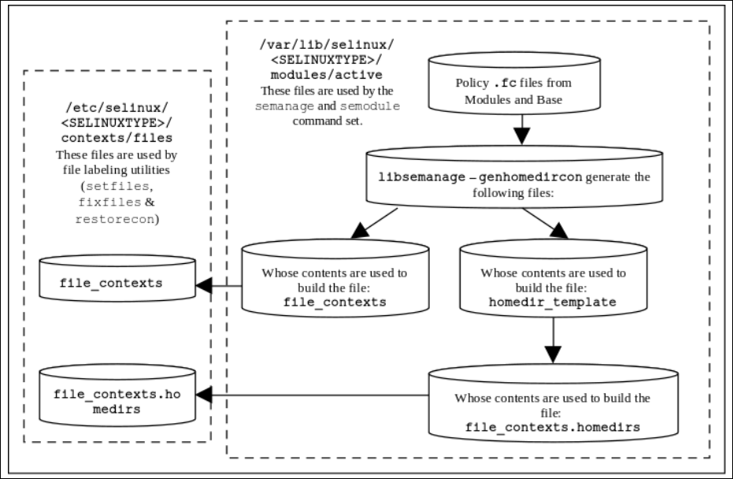

> `semanage`构建`policy`时还会用到`<store root>/<SELINUXTYPE>/active/`下的`homedir_template`文件。该文件定义了各用户`home`目录下的文件应当使用哪些`label`，其中使用了宏`HOME_ROOT`（`/home`）`HOME_DIR`（`/home/`）`USER`（Linux用户名）`ROLE`（不常用）等，这样可以不必为每个用户都写一个配置

除上述文件以外，`active`目录下还可能有一个`file_contexts.local`文件，里面也是`file_contexts`格式一样的内容。它是用户通过自定义`.fc`文件添加的不属于核心`policy`的附加部分，同样由`semanage`生成（使用`semanage fcontext`命令），并且被复制到`/etc`下相同的配置目录下面

添加本地自定义`label`示例

```
# semanage fcontext -a -t newlabel_t /path/to/file
```

`file_contexts.local`中会出现以下行

```
/path/to/file       system_u:object_r:unlabeled_t:s0
```

**强制开启**`audit`**配置**`<store root>/<SELINUXTYPE>/disable_dontaudit`

如果模块使用`semodule -D`编译，或使用`semanage dontaudit on`构建了整个`policy`，此时`policy`中潜在的`dontaudit`声明有效，`audit`可能不会记录一些访问错误。如果该文件存在，那么就会强制使`dontaudit`声明失效

**Linux用户映射配置**`<store root>/<SELINUXTYPE>/active/seusers`

文件`active/seusers`以及`active/seusers.local`中记录了Linux用户到SELinux的`user`的映射。构建`policy`以后`active/seusers`会被放到`/etc/selinux/targeted/seusers`，而`active/seusers.local`中包含了通过`semanage`命令添加的SELinux用户

文件每一行格式如下

```
root:unconfined_u:s0-s0:c0.c1023
```

可以在编译`policy`模块时就指定添加用户映射，这些用户映射在执行`semodule`安装以后会出现在最终的`seusers`中，示例，添加文件`seusers`

```
# semodule_package -o base.pp -m base.mod -s seusers
```

通过如下命令添加用户映射

```
# semanage login -a -s staff_u username
```

或添加一个Linux用户组

```
# semanage login -a -s staff_u %admin_group
```

**SELinux用户定义**`<store root>/<SELINUXTYPE>/active/users_extra`

`users.local`中包含了用户通过`semanage user`添加的SELinux用户身份

`users_extra`和`users_extra.local`中存放了各SELinux用户对应的`prefix`声明。不常用，它会替代`file_contexts`中的`ROLE`，示例如下

```
user user_u prefix user;
user staff_u prefix user;
```

> 如果需要用到这些定义，这两个文件需要在编译`policy`模块时显式包含`semodule_package -o base.pp -m base.mod -u users_extra`

示例，添加一个SELinux用户`sample_u`，指定可用`role`**列表**为`staff_r`，`prefix`为`staff`

```
# semanage user -a -R staff_r -P staff sample_u
```

那么`users_extra.local`内容如下

```
user sample_u prefix staff;
```

`users_extra`内容如下

```
...
user root prefix user;
user sample_u prefix staff;
```

`users.local`内容如下

```
user sample_u roles { staff_r } level s0 range s0;
```

**网络接口配置**`<store root>/<SELINUXTYPE>/active/interfaces.local`

示例，通过`semanage interface`添加网络接口配置，设定`enp1s0`的`type`和`range`

```
# semanage interface -a -t netif_t -r s0:c10.c20 enp1s0
```

`interfaces.local`内容如下

```
netifcon enp1s0 system_u:object_r:netif_t:s0:c10.c20
system_u:object_r:netif_t:s0:c10.c20
```

**网络访问配置**`<store root>/<SELINUXTYPE>/active/nodes.local`

示例，通过`semanage node`设定特定IP地址访问的限制

```
# semanage node -a -M 255.255.255.255 -t node_t -r s0:c10.c20 -p ipv4 127.0.0.2
```

`nodes.local`内容

```
nodecon ipv4 127.0.0.2 255.255.255.255 system_u:object_r:node_t:s0:c10.c20
```

**网络端口访问配置**`<store root>/<SELINUXTYPE>/active/ports.local`

示例，通过`semanage port`添加指定端口访问限制

```
# semanage port -a -t port_t -p tcp -r s0:c10.c20 8080
```

`ports.local`内容

```
portcon tcp 8080 system_u:object_r:port_t:s0:c10.c20
```

**使得特定**`domain`**运行于**`permissive`

```
# semanage permissive -a sample_t
```

上述命令会创建文件`<store root>/<SELINUXTYPE>/active/modules/400/permissive_sample_t`，为CIL格式

```
(typepermissive sample_t)
```

> CIL的`typepermissive`声明等同于`m4`格式中的`permissive`声明

### 5.17.5 Policy配置文件

`policy`配置文件放置于`/etc/selinux/<SELINUXTYPE>`下，它们为`running policy`，大部分的文件都由`semanage`和`semodule`管理。该目录下的`policy/policy.33`就是加载到系统中的二进制格式`policy`

> Linux运行于`init 3`时，必要的文件有`seusers` `policy/policy.33` `context/files/file_contexts`。运行于`init 5`使用X时，还需要`context/dbus_contexts` `context/x_contexts`

**Linux用户映射**`/etc/selinux/<SELINUXTYPE>/seusers`

该文件基本上就是`<store root>/<SELINUXTYPE>/active/seusers`的副本。不再解释

该文件只会为Linux的登录操作服务。登录时`login`程序为了找到对应Linux用户的`context`，首先会通过`libselinux`调用搜寻该文件中的用户名，确定对应的SELinux`user`（只有`root`，如果没有额外配置那么对应`unconfined_u`。为了安全，可以将`default`映射到`user_u`）；之后为了确定`role` `type`和`range`，会依次调用`libselinux`搜寻`contexts/users/<user>`，`contexts/default_contexts`，`contexts/failsafe_contexts`这些文件。例如`unconfined_u`，会首先查找文件`contexts/users/unconfined_u`。如果在`contexts/users`下没有找到合适的`context`，那么就查找后面两个文件

示例，`contexts/users/unconfined_u`片段

```
system_r:crond_t:s0 unconfined_r:unconfined_t:s0
unconfined_r:unconfined_cronjob_t:s0
system_r:initrc_t:s0 unconfined_r:unconfined_t:s0
system_r:local_login_t:s0 unconfined_r:unconfined_t:s0
system_r:remote_login_t:s0 unconfined_r:unconfined_t:s0
system_r:rshd_t:s0 unconfined_r:unconfined_t:s0
...
```

示例，`contexts/default_contexts`片段

```
system_r:crond_t:s0 system_r:system_crond_t:s0
system_r:local_login_t:s0 user_r:user_t:s0
system_r:remote_login_t:s0 user_r:user_t:s0
...
```

示例，`contexts/failsafe_context`

```
unconfined_r:unconfined_t:s0
```

> 上述文件都是为SELinux-aware的应用服务的，而`login`程序本身就是一个SELinux-aware的应用。其他普通程序使用的`context`是由`policy`决定的，而`policy`此时为二进制格式无法直接查看
>
> 上述文件中除`failsafe_context`以外，每一行的第一个`role:type:range`为`login`程序对应的`context`；而之后会有一个到多个`role:type:range`，表示可以赋给用户的`context`
>
> `failsafe_context`表示前面所有文件中都未找到，使用的`context`。只有一个

**布尔变量设定**`/etc/selinux/<SELINUXTYPE>/booleans`

该文件在较新版本的SELinux中移至`policy store`，见[5.17.1](#5171-policy-store)（`active/booleans.local`）

**布尔变量重命名**`/etc/selinux/<SELINUXTYPE>/booleans.subs_dist`

该文件是历史遗留问题。旧版本SELinux中有大量`allow`开头的`boolean`。该文件定义了它们的新名称

示例

```
allow_auditadm_exec_content auditadm_exec_content
...
```

**SELinux**`range`**别名设定**`/etc/selinux/<SELINUXTYPE>/setrans.conf`

该文件被`mcstransd`使用，为SELinux-aware的程序提供`sX:cX`别名的解析服务。使用`targeted`时默认不会用到

示例

```
Domain=NATOEXAMPLE

s0=SystemLow
s15:c0.c1023=SystemHigh
s0-s15:c0.c1023=SystemLow-SystemHigh

Base=Sensitivity Levels
s1=UNCLASSIFIED
s3:c0,c2,c11,c200.c511=RESTRICTED
s4:c0,c2,c11,c200.c511=CONFIDENTIAL
s5:c0,c2,c11,c200.c511=SECRET
s1:c1=NATO UNCLASSIFIED
s3:c1,c200.c511=NATO RESTRICTED
s4:c1,c200.c511=NATO CONFIDENTIAL
s5:c1,c200.c511=NATO SECRET
Include=/etc/selinux/mls/setrans.d/rel.conf
Include=/etc/selinux/mls/setrans.d/eyes-only.conf
Include=/etc/selinux/mls/setrans.d/constraints.conf
```

禁用服务只需在该文件添加一行

```
disable = 1
```

**SELinux**`policy`**二进制文件**`/etc/selinux/<SELINUXTYPE>/policy/policy.XX`

`XX`为SELinux版本号

**文件上下文**`/etc/selinux/<SELINUXTYPE>/contexts/files/file_contexts`

该文件如同[前文](#5171-policy-store)讲述过的，是`active/file_contexts`的副本。它会直接被`restorecon` `setfiles` `fixfiles`使用，并且由`semanage` `semodule`管理。`files/file_contexts.local`，`files/file_contexts.homedirs`同理

**文件重标记排除项**`/etc/selinux/<SELINUXTYPE>/contexts/customizable_types`

该文件记录在指定`setfiles`或`restorecon`时不应当被`relabel`的文件的`type`

示例

```
mount_loopback_t
public_content_rw_t
public_content_t
swapfile_t
```

**文件名转译**`/etc/selinux/<SELINUXTYPE>/contexts/files/file_contexts.subs`

该文件可以由Apache等Web服务器使用，将URL中的路径转译为本地路径。示例

```
/frontpage /var/www
```

**默认**`type`**设定**`/etc/selinux/<SELINUXTYPE>/contexts/default_type`

该文件可供SELinux-aware的程序调用，例如设定在使用`newrole`时，如果未指定，使用的默认的`type`（见[5.22.5](#5225-使用mls)中切换用户`clearance`）

示例

```
auditadm_r:auditadm_t
secadm_r:secadm_t
sysadm_r:sysadm_t
staff_r:staff_t
unconfined_r:unconfined_t
user_r:user_t
```

**安全终端设定**`/etc/selinux/<SELINUXTYPE>/contexts/securetty_types`

指明了使用`newrole`运行新终端时，可以用于终端的`type`，示例

```
sysadm_tty_device_t
user_tty_device_t
staff_tty_device_t
```

**进程间通信D-Bus上下文设定**`/etc/selinux/<SELINUXTYPE>/contexts/dbus_contexts`

见 http://dbus.freedesktop.org

**系统**`init`**上下文**`/etc/selinux/<SELINUXTYPE>/contexts/initrc_context`

该文件指明了系统`init`进程的`context`，可以被SELinux-aware的程序（例如`run_init`）获取，方便让其他程序运行于这个`context`

示例

```
system_u:system_r:initrc_t:s0
```

**Linux容器LXC上下文**`/etc/selinux/<SELINUXTYPE>/contexts/lxc_contexts`

和`lxc`容器以及`qemu`虚拟机有关，`libvirt`会使用。示例

```
process = "system_u:system_r:container_t:s0"
content = "system_u:object_r:virt_var_lib_t:s0"
file = "system_u:object_r:container_file_t:s0"
ro_file="system_u:object_r:container_ro_file_t:s0"
sandbox_kvm_process = "system_u:system_r:svirt_qemu_net_t:s0"
sandbox_kvm_process = "system_u:system_r:svirt_qemu_net_t:s0"
sandbox_lxc_process = "system_u:system_r:container_t:s0"
```

此外还有`contexts/virtual_domain_context`示例，为`libvirt`提供了`qemu`的`domain`

```
system_u:system_r:svirt_t:s0
system_u:system_r:svirt_tcg_t:s0
```

`contexts/virtual_image_context`示例，为`libvirt`提供的镜像的`context`

```
system_u:object_r:svirt_image_t:s0
system_u:object_r:virt_content_t:s0
```

**系统**`init`**进程配置**`/etc/selinux/<SELINUXTYPE>/contexts/openrc_contexts` `/etc/selinux/<SELINUXTYPE>/contexts/systemd_contexts`

`openrc`配置示例如下

```
run_init=run_init_t
```

`systemd`配置示例如下

```
runtime=system_u:object_r:systemd_runtime_unit_file_t:s0
```

**OpenSSH配置**`/etc/selinux/<SELINUXTYPE>/contexts/openssh_contexts`

RHEL规定的文件，定义`openssh`在`preauthentication`阶段的`domain`

```
privsep_preauth=sshd_net_t
```

**可移除设备配置**`/etc/selinux/<SELINUXTYPE>/contexts/files/media` `/etc/selinux/<SELINUXTYPE>/contexts/removable_context`

`files/media`定义格式如下示例，定义了常见可移除媒体的`context`

```
cdrom system_u:object_r:removable_device_t:s0
floppy system_u:object_r:removable_device_t:s0
disk system_u:object_r:fixed_disk_device_t:s0
```

`removable_context`用于`contexts/files/media`文件定义以外的可移除设备

```
system_u:object_r:removable_t:s0
```

**PostgreSQL配置**`/etc/selinux/<SELINUXTYPE>/contexts/sepgsql_contexts`

定义了PostgreSQL中创建数据库对象时默认的`context`，示例

```
# object_type  object_name  context
db_database    my_database  system_u:object_r:my_sepgsql_db_t:s0
db_database        *        system_u:object_r:sepgsql_db_t:s0
db_schema         *.*       system_u:object_r:sepgsql_schema_t:s0
```

**运行**`system-config-*`**程序时使用的**`context` `/etc/selinux/<SELINUXTYPE>/contexts/userhelper_context`

运行例如`system-config-selinux`时使用的`context`

```
system_u:sysadm_r:sysadm_t:s0
```

## 5.18 Policy编写：Kernel Policy Language简介

`policy`源文件分为三种，分别为单体`monolithic policy`，基础`base policy`，模块`module policy`

> 通常`monolithic policy`文件名`policy.conf`，其中包含了所有声明，使用`checkpolicy`编译生成二进制`policy`
>
> 通常`base policy`文件名`base.conf`，如果想要使用可加载模块`module policy`那么就必须要有一个`base`来支持。`base policy`中包含了对于模块化的支持声明，并且包含一个`policy`中必须要有的部分，其他非强制的部分放到模块中。它使用`checkpolicy`和`checkmodule`编译
>
> 通常`module policy`文件名后缀`.mod`，其编译后的二进制格式`.pp`（`policy package`）模块是可以动态加载卸载的。它使用`checkmodule`编译

下表分别给出了`base`和`module`中必须出现的声明

Base

| 声明 | 必须包含 |
| :- | :- |
| Security classes `class` | Y |
| Initial SIDs | Y |
| Access Vectors `permissions` | Y |
| `require` |  |
| MLS `sensitivity` `category` `level` |  |
| MLS Constraints `mlsconstrain` | Y |
| Policy Capability |  |
| Attributes |  |
| Booleans |  |
| `default_user` `default_role` `default_type` `default_range` |  |
| Type or Type Alias | Y |
| Roles | Y |
| Users | Y |
| Policy Rules `allow` `dontaudit` | Y |
| Constraints `constrain` |  |
| Default SID labeling | Y |
| `fs_use_xattr` |  |
| `fs_use_task` `fs_use_trans` |  |
| `genfscon` |  |
| `portcon` `netifcon` `nodecon` |  |

Module

| 声明 | 必须出现 |
| :- | :- |
| `module` | Y |
| `require` |  |
| Attributes |  |
| Booleans |  |
| Type or Type Alias |  |
| Roles |  |
| Policy Rules | |
| Users |  |

如果在同一条声明里出现了多个`source`或`target`入口，会自动展开，例如下面`allow`有两个`target`

```
allow apm_t { console_device_t tty_device_t }:chr_file { getattr read write append ioctl lock };
```

展开为

```
allow apm_t console_device_t:chr_file { getattr read write append ioctl lock };

allow apm_t tty_device_t:chr_file { getattr read write append ioctl lock };
```

> 这样使用`apol`，`sedispol`或`sedismod`对比这些源文件和`policy`二进制时会发现结果不同，但实际上是等效的

有些声明可以通过`semanage`命令添加，而有些不行，必须写到源文件内

三种`policy`都有各自允许存放以及不允许存放的声明`statement`

`if`关键字上下文中也有`statement`限制。而`optional` `require`并不是`m4`格式`policy`的内置声明，它是默认的Reference Policy中定义的**宏**，用于控制`policy`的构建。其中也有`statement`限制

### 5.18.1 关键字

下表列出了`m4`格式Kernel Policy Language中所有的保留关键字


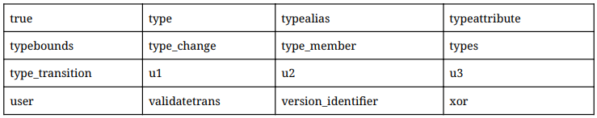

下表列出上述声明是否可以在各种类型的`policy`文件以及`if` `require` `optional`上下文中出现

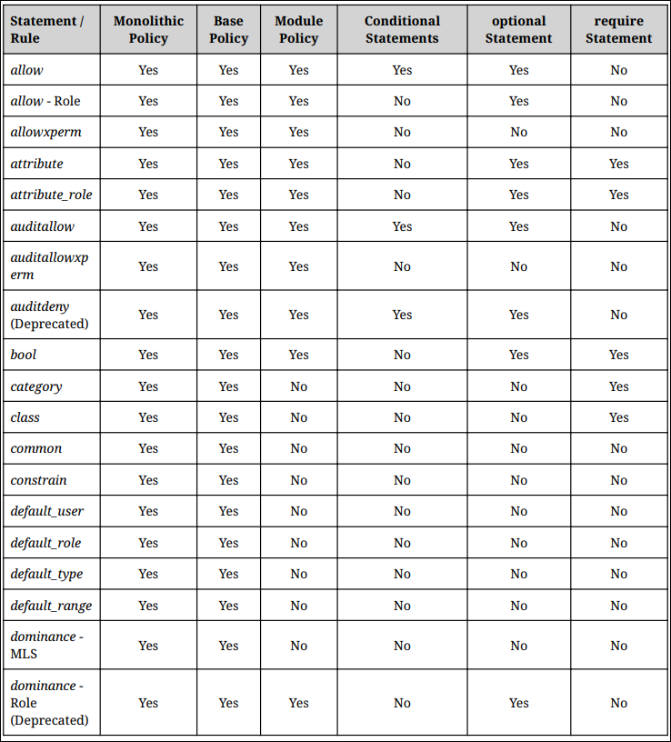


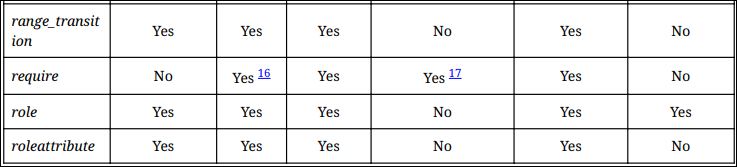

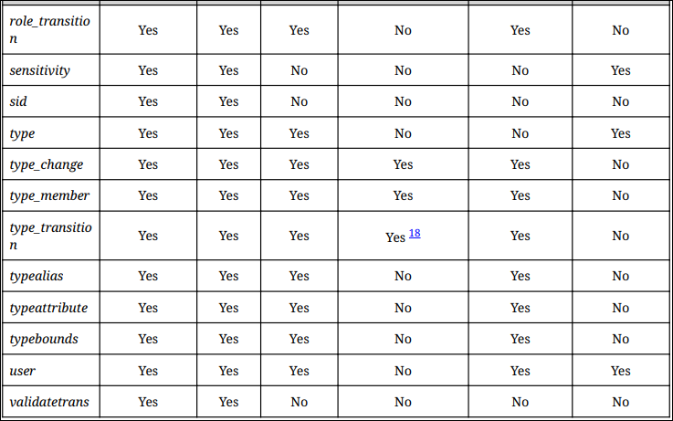

## 5.19 Policy编写：CIL简介

见 https://github.com/SELinuxProject/selinux/tree/master/secilc/docs

CIL中很多声明关键字和Kernel Policy Language不一样，需要注意

## 5.20 Policy内容

如果关心SELinux Policy的内在细节，本节非常重要。也可以解答例如`boolean`变量的控制原理。这里只介绍Kernel Policy Language中的关键字与用法

### 5.20.1 Policy配置声明：Capability

Linux内核和SELinux`policy`是一直在发展的，会添加新的capability。从版本`22`开始，新的capability需要通过`policycap`声明启用。不声明默认就不会启用这个新的capability

示例

```
policycap network_peer_controls;
```

可以包含`policycap`声明的地方

| Monolithic | Base | Module |
| :- | :- | :- |
| Y | Y | N |

| if | optional | require |
| :- | :- | :- |
| N | N | N |

新的capability是需要内核，`libsepol`以及`policy`共同支持的

**Capability是什么**

有关Linux系统中`capability`的说明，查看`man`即可

```
$ man capability
```

> 简单来说，最早的Linux中进程只分为`privileged`和`unprivileged`，其中只有`unprivileged`需要服从系统权限管理。后来出现的`capability`对`privileged`（`superuser`）程序的权限进行了细分，并且**每个线程都有自己的**`capability`属性设定列表，指定它可以进行哪些访问

SELinux中使用`allow`声明为指定程序设定可以允许的`capability`，使用如下命令查看

```
# sesearch -A -c capability
...
allow httpd_t httpd_t:capability audit_write; [ httpd_mod_auth_pam ]:True
allow httpd_t httpd_t:capability fowner; [ httpd_use_opencryptoki ]:True
...
```

> `capability`相关的`allow`声明中`source type`和`target type`**都是相同的**，表示给这个`domain`赋予了哪些`capability`，后面的`{}`就是列表

**添加新的capability**

添加一个新的capability支持需要以下操作

首先修改kernel中SELinux的源码，例如添加的capability名称为`custom_cap`

文件`security/selinux/include/policycap_names.h`，添加该新名称字符串

```
const char *selinux_policycap_names[__POLICYDB_CAP_MAX] = {
    ...
    "genfs_seclabel_symlinks",
    "ioctl_skip_cloexec",
    "custom_cap"
};
```

文件`security/selinux/include/policycap.h`，添加`POLICYDB_CAP_CUSTOM_CAP`（`POLICYDB_CAP_`加大写名称）

```
enum {
    ...
    POLICYDB_CAP_GENFS_SECLABEL_SYMLINKS,
    POLICYDB_CAP_IOCTL_SKIP_CLOEXEC,
    POLICYDB_CAP_CUSTOM_CAP,
    __POLICYDB_CAP_MAX
};
```

文件`security/selinux/include/security.h`，添加新的`policy capability`状态获取调用

```
static inline bool selinux_policycap_custom_cap(void)
{
    struct selinux_state *state = &selinux_state;
    return READ_ONCE(state->policycap[POLICYDB_CAP_CUSTOM_CAP]);
}
```

> 相应的代码中也需要使用`selinux_policycap_custom_cap()`调用

之后修改`libsepol`代码

文件`selinux/libsepol/src/polcaps.c`，添加`custom_cap`入口

```
static const char * const polcap_names[] = {
    ...
    "genfs_seclabel_symlinks", /* POLICYDB_CAP_GENFS_SECLABEL_SYMLINKS */
    "ioctl_skip_cloexec", /* POLICYDB_CAP_IOCTL_SKIP_CLOEXEC */
    "custom_cap", /* POLICYDB_CAP_CUSTOM_CAP */
    NULL
};
```

文件`selinux/libsepol/include/sepol/policydb/polcaps.h`，添加`POLICYDB_CAP_CUSTOM_CAP`

```
/* Policy capabilities */
enum {
    ...
    POLICYDB_CAP_GENFS_SECLABEL_SYMLINKS,
    POLICYDB_CAP_IOCTL_SKIP_CLOEXEC,
    POLICYDB_CAP_CUSTOM_CAP,
    __POLICYDB_CAP_MAX
};
```

最后修改Reference Policy，使能`custom_cap`

文件`policy/policy_capabilities`

```
policycap custom_cap
```

CIL写法

```
(policycap custom_cap)
```

### 5.20.2 Default Object Rules

`default_user`，`default_role`，`default_type`，`default_range`声明为新创建的`object`提供默认的`label`定义

`default_user`示例

```
default_user file target;
```

```
default_user { x_selection x_property } source;
```

> `default_user`声明由三部分构成，依次为关键字本身，`object class`，以及`default`默认的`user`来源。`default`可以是`source`或`target`，表示该类型`object`的默认`user`应当取自`source context`或`target context`

可以包含`default_user`声明的地方

| Monolithic | Base | Module |
| :- | :- | :- |
| Y | Y | N |

| if | optional | require |
| :- | :- | :- |
| N | N | N |

`default_role`示例，基本同理

```
default_role file target;
```

```
default_role { x_selection x_property } source;
```

可以包含`default_role`声明的地方

| Monolithic | Base | Module |
| :- | :- | :- |
| Y | Y | N |

| if | optional | require |
| :- | :- | :- |
| N | N | N |

`default_type`示例

```
default_type file target;
```

```
default_type { x_selection x_property } source;
```

可以包含`default_type`声明的地方

| Monolithic | Base | Module |
| :- | :- | :- |
| Y | Y | N |

| if | optional | require |
| :- | :- | :- |
| N | N | N |

`default_range`示例

```
default_range file target low;
```

```
default_range { x_selection x_property } source low_high;
```

```
default_range db_table glblub;
```

> `default_range`一共由3或4个域构成，依次为关键字本身，`object class`，`default`（可取`source`或`target`），`range`（可取`low`，`high`或`low_high`）；或没有`default`和`range`，只有`glblub`
>
> `glblub`需要版本`32`及以上，它的含义是`greatest lower bound lowest upper bound`，即取两个`range`的交集
>
> `range`取`low`时，表示取较低的`security level`；而`low_high`表示保持原有`range`不变

可以包含`default_range`声明的地方

| Monolithic | Base | Module |
| :- | :- | :- |
| Y | Y | N |

| if | optional | require |
| :- | :- | :- |
| N | N | N |

### 5.20.3 User

`user`声明用于定义新的SELinux用户身份，同时给出该用户可以使用的`role`，以及可选的`security level`范围。在`policy`编译安装完成后续再想添加`user`身份，使用`semanage user`命令即可添加

`user`声明示例

```
user user_u roles { user_r };
```

```
user user_u roles { user_r } level s0 range s0;
```

```
user sysadm_u roles { sysadm_r } level s0 range s0-s15:c0.c255;
```

`semanage user`命令添加示例

```
$ semanage user -a -R unconfined_r mque_u
```

> 上述命令会在`/var/lib/selinux`下生成新文件（或添加新内容），[见前](#5174-policy-store配置文件)（`users.local`，`users_extra`，`users_extra.local`）

> `user`声明由4或8个域构成，分别为关键字本身，定义的SELinux用户名，`roles`关键字以及对应的可以使用的`role`列表；如果需要定义`mls`还需要`level`关键字以及对应的默认`sensitivity`等级例如`s0`，`range`关键字以及对应的`level`范围

可以包含`user`声明的地方

| Monolithic | Base | Module |
| :- | :- | :- |
| Y | Y | Y |

| if | optional | require |
| :- | :- | :- |
| N | Y | Y |

### 5.20.4 Role

`role`，`attribute_role`，`roleattribute`，`allow`，`role_transition`声明和SELinux的`role`相关

`role`声明定义了`policy`中可用的`role`以及这个`role`可以使用的`type`，示例

```
role system_r;
role sysadm_r;
role staff_r;
...
```

```
role user_r types user_t;
role user_r types chfn_t;
```

> `role`声明由2或4个域构成，分别为关键字本身，`role`名称，`types`关键字以及对应的可用`type`。如果有多个`role`声明对应同一个`role`，编译时会将它们的定义合并。这里的`type`可以是已经声明的`type`名，或`typealias`，或`attribute`。如果有多个，使用`{}`括起来并使用` `空格间隔即可

可以包含`role`声明的地方

| Monolithic | Base | Module |
| :- | :- | :- |
| Y | Y | Y |

| if | optional | require |
| :- | :- | :- |
| N | Y | Y |

`attribute_role`和`roleattribute`可以创建一个组别名，用于指代一组`role`

`attribute_role`示例，它声明了这个`role attribute identifier`本身。将该别名和一组`role`关联使用另外的`roleattribute`声明，见后文

```
attribute_role role_list_1;
attribute_role srole_list_2;
```

可以包含`attribute_role`声明的地方

| Monolithic | Base | Module |
| :- | :- | :- |
| Y | Y | Y |

| if | optional | require |
| :- | :- | :- |
| N | Y | Y |

`roleattribute`使用示例，将指定`role`关联进来

```
attribute_role role_list_1;
attribute_role role_list_2;
role service_r;
roleattribute service_r { role_list_1 role_list_2 };
```

可以包含`roleattribute`声明的地方

| Monolithic | Base | Module |
| :- | :- | :- |
| Y | Y | Y |

| if | optional | require |
| :- | :- | :- |
| N | Y | N |

SELinux下`allow`关键字有两个作用。这里讲述它用于`role`的情况

`allow`示例，允许从一个`role`切换到另一个`role`

```
allow sysadm_r secadm_r;
```

> 上述`allow`声明表示允许从`sysadm_r`切换到`secadm_r`。后两个域都可以有多个`role`，使用`{}`括起来

可以包含`role`的`allow`声明的地方

| Monolithic | Base | Module |
| :- | :- | :- |
| Y | Y | Y |

| if | optional | require |
| :- | :- | :- |
| N | Y | N |

`role_transition`示例，它定义了自动的`role`切换

```
role_transition system_r unconfined_exec_t:process unconfined_r;
```

> `role_transition`由5个域构成，分别为关键字本身，当前的`role`，可执行文件的`type`，`: class`（不指定默认`process`），以及切换到的新`role`

可以包含`role_transition`声明的地方

| Monolithic | Base | Module |
| :- | :- | :- |
| Y | Y | Y |

| if | optional | require |
| :- | :- | :- |
| N | Y | N |

### 5.20.5 Type

`type`，`attribute`，`expandattribute`，`typeattribute`，`typealias`，`permissive`，`type_transition`，`type_change`，`type_member`声明和SELinux的`type`相关

习惯上`type`名称以`_t`结尾，而`attribute`以`_type`结尾

`type`声明示例

```
type shell_exec_t;
```

```
type bin_t
```

```
type bin_t alias { ls_exec_t sbin_t };
```

```
attribute booleans_type;
type boolean_t, booleans_type;
```

```
attribute can_relabelto_binary_policy;
type setfiles_t alias restorecon_t, can_relabelto_binary_policy;
```

```
attribute packet_type;
attribute server_packet_type;
type ssh_server_packet_t, packet_type, server_packet_type;
```

> `type`声明可以由2或4个域，或添加更多个可选的`attribute`域构成。和`role`的`attribute_role roleattribute`类似的，一个`type`的`attribute`也可以用于指代一组`type`
>
> `type`声明首先是关键字本身，其次是此次定义的`type`名称，一个可选的`alias`关键字以及紧随其后的别名（可以使用该别名指代该`type`）；之后可以有一个或多个可选的`attribute`，使用`,`逗号分隔
>
> 可执行文件通常会被赋予`_exec_t`后缀或`bin_t`。`attribute`需要先使用`attribute`关键字声明以后才能使用

可以包含`type`声明的地方

| Monolithic | Base | Module |
| :- | :- | :- |
| Y | Y | Y |

| if | optional | require |
| :- | :- | :- |
| N | Y | Y |

`type_transition`声明指定自动的`type`或`domain`切换规则（用于新创建的`object`或`subject`），**是最常用的声明之一**，示例

```
type_transition initrc_t acct_exec_t : process acct_t;
allow initrc_t acct_exec_t : file execute;
allow acct_t acct_exec_t : file entrypoint;
allow initrc_t acct_t : process transition;
```

```
type_transition acct_t var_log_t : file wtmp_t;
allow acct_t var_log_t : dir { read getattr lock search ioctl add_name remove_name
write };
allow acct_t wtmp_t : file { create open getattr setattr read write append rename link
unlink ioctl lock };
```

```
type_transition unconfined_t etc_t : file system_conf_t eric;
```

> [前文](#512-domain和object的transition)已经讲述过了`type_transition`需要对应的`allow`声明。定义一个`subject domain`的`transition`需要4条声明，而定义一个`object type`的`transition`需要3条声明
>
> `type_transition`声明由5或6个域构成，分别为关键字本身，`source`和`target type`分别指代当前上下文的两个实体的`type`（例如`source type`为当前进程的`domain`，`target type`为被执行二进制文件的`type`或被新建文件的目录的`type`），`object class`（例如`process` `file`等），`default`即新创建`object`的`type`（这里新创建的进程对于创建它的进程来说也是`object`），最后可以有一个可选的`name transition`（版本`25`开始的新特性，`object_name`，仅适用于`file`。这样会在文件名**等于**该指定名称时才使用指定的`type`，否则默认依旧继承父目录的`type`）

可以包含`type_transition`声明的地方

| Monolithic | Base | Module |
| :- | :- | :- |
| Y | Y | Y |

| if | optional | require |
| :- | :- | :- |
| Y | Y | N |

> `if`下不允许`name transition`

`attribute`声明示例

```
attribute domain;
attribute daemon;
attribute file_type;
attribute non_security_file_type;
```

可以包含`attribute`声明的地方

| Monolithic | Base | Module |
| :- | :- | :- |
| Y | Y | Y |

| if | optional | require |
| :- | :- | :- |
| N | Y | Y |

`expandattribute`声明可以指定一个`attribute`是否展开成列表后删除，示例

```
attribute packet_type;
expandattribute packet_type true;
```

> `expandattribute`由3个域组成，分别为关键字本身，要展开的`attribute`名称，以及是否展开`true`或`false`。如果指定`true`，那么在`policy`中所有引用到该`attribute`的地方都会被展开成一个`type`列表`{}`，同时该`attribute`会消失。如果指定`false`，那么该`attribute`受保护，无论如何不会展开

可以包含`expandattribute`声明的地方

| Monolithic | Base | Module |
| :- | :- | :- |
| Y | Y | Y |

| if | optional | require |
| :- | :- | :- |
| Y | Y | N |

`typeattribute`声明主要用于添加新的`attribute`关联，其中的`attribute`和`type`都是已经声明过的，示例

```
attribute attr_type;
type setroubleshootd_t;
typeattribute setroubleshootd_t attr_type;
```

> `typeattribute`和`type`一样，可以使用`,`分隔多个`attribute`。`typeattribute`由3个或更多域构成，分别为关键字本身，想要关联的`type`，以及一个或多个想要关联的`attribute`

可以包含`typeattribute`声明的地方

| Monolithic | Base | Module |
| :- | :- | :- |
| Y | Y | Y |

| if | optional | require |
| :- | :- | :- |
| N | Y | N |

`typealias`和`typeattribute`类似，区别是它用于为`type`添加新的`alias`，作为`type`声明时如果未同时定义`alias`的补偿，也增加了灵活性，示例

```
type mount_t;
typealias mount_t alias mount_ntfs_t;
```

> `typealias`由4个域构成，分别为关键字本身，`type`名，`alias`关键字，以及一个想关联的`alias`列表

可以包含`typealias`声明的地方

| Monolithic | Base | Module |
| :- | :- | :- |
| Y | Y | Y |

| if | optional | require |
| :- | :- | :- |
| N | Y | N |

`permissive`声明用于将指定`type`（`domain`）置于`permissive`模式下，示例

```
permissive unconfined_t;
```

将上述`permissive`声明编写成一个可加载模块，加载卸载即可完成临时的`permissive`设定

```
module permissive_unconfined_t 1.0.0;

require {
    type unconfined_t;
}

permissive unconfined_t;
```

> `permissive`指定`domain`下运行的进程的访问行为会被监控并记录，但是不会拦截

可以使用`semanage permissive`命令临时添加删除

```
$ semanage permissive -a unconfined_t
$ semanage permissive -d unconfined_t
```

可以包含`permissive`声明的地方

| Monolithic | Base | Module |
| :- | :- | :- |
| Y | Y | Y |

| if | optional | require |
| :- | :- | :- |
| N | Y | N |

`type_change`声明说明了指定文件被`relabel`时使用的`type`。该声明等级比`default_type`更高，会override已有的`default_type`声明。如果没有该声明，那么就会使用`default_type`或直接从父`object`继承`type`。示例

```
type_change auditadm_t sysadm_devpts_t : chr_file auditadm_devpts_t;
```

```
type_change staff_t server_ptynode : chr_file staff_devpts_t;
```

> `type_change`声明由5个域构成，依次为关键字本身，当前`source`和`target`的`type`（分别为当前调用`relabel`功能的进程的`type`和被`relabel`文件的`type`），`object class`，以及新的`change_type`。`type_change`声明需要有对应的`allow`规则允许

可以包含`type_change`声明的地方

| Monolithic | Base | Module |
| :- | :- | :- |
| Y | Y | Y |

| if | optional | require |
| :- | :- | :- |
| Y | Y | N |

`type_member`声明和内核的polyinstantiation特性有关，下面作简要讲述

> polyinstantiation特性主要是为了解决共用资源例如共用`/tmp /var/tmp`带来的安全隐患，例如数据泄露，竞争攻击等。内核使能polyinstantiation以后，每个用户从自己视角看都会有自己的`/tmp`以及`/var/tmp`，实际上分别挂载于`/tmp-inst`和`/var/tmp/tmp-inst`
>
> 通过以下步骤可以使能polyinstantiation（需要内核开启PAM）：
>
> 首先编辑`/etc/security/namespace.conf`，使能以下几行。每行第一个表示被polyinstantiated的目录（即从用户角度看到的路径），之后添加的是路径前缀，`user`表示以Linux用户名为单位进行polyinstantiation，`root,adm`表示除用户`root`和`adm`以外都需要polyinstantiation

```
/tmp        /tmp-inst/          user    root,adm
/var/tmp    /var/tmp/tmp-inst/  user    root,adm
$HOME       $HOME/$USER.inst/   user
```

> 依照上述示例，用户`david`登录后，会自动创建`/tmp/tmp-inst/david` `/var/tmp/tmp-inst/david` `/home/david/david.inst/david`目录，映射到`david`视角的`/tmp` `/var/tmp`和`/home/david`
>
> 除了依照`user`分隔外，有SELinux支持的系统还可以基于`level`（`mls`）或`context`进行分隔，在上述文件中将`user`替换为`level`或`context`即可

> 其次使能`pam_namespace.so`，在`/etc/pam.d/login`。之后重启

```
session     required        pam_namespace.so
```

`type_member`声明示例

```
type_member sysadm_t user_home_dir_t : dir user_home_dir_t;
```

> `type_member`声明为上述例如创建的新目录`/tmp/tmp-inst/david`提供默认的`type`
>
> 该声明由5个域组成，依次为关键字本身，`source`和`target`的`type`（分别指代原先目录例如`/tmp`的`type`以及登录用户的`domain`），`object class`，新的`type`

可以包含`type_member`声明的地方

| Monolithic | Base | Module |
| :- | :- | :- |
| Y | Y | Y |

| if | optional | require |
| :- | :- | :- |
| Y | Y | N |

### 5.20.6 Access Vector规则

Access Vector规则声明是SELinux的`policy`中最为核心的部分，主要使用到的声明有`allow`，`dontaudit`，`auditallow`，`neverallow`

可以包含上述声明的地方

| Monolithic | Base | Module |
| :- | :- | :- |
| Y | Y | Y |

| if | optional | require |
| :- | :- | :- |
|  | Y | N |

> `if`中允许`allow` `dontaudit` `auditallow`，不能包含`neverallow`

`allow`声明示例

```
allow initrc_t acct_exec_t : file { getattr read execute };
```

```
allow kernel_t filesystem_type : filesystem mount;
```

```
allow staff_t self : capability { setgid chown fowner };
allow staff_t staff_t : capability { setgid chown fowner };
```

```
allow bootloader_t system_dbusd_t : dbus *;
allow bootloader_t system_dbusd_t : dbus { acquire_svc send_msg };
```

```
allow files_unconfined_type file_type : { file chr_file } ~execmod;
```

> Access Vector四种规则声明的格式都是一样的，由5个域构成，依次为关键字本身，`source`和`target`的`type`或`domain`，被访问对象的`object class`，以及允许的操作权限列表。对于一个`object`来说，它可以允许的操作是由它的`class`定义决定的
>
> 第一个例子规定`initrc_t`进程对于`type`为`acct_exec_t`的普通文件拥有`getattr read execute`权限
>
> 第二个例子规定`kernel_t`进程对于`type`为`filesystem_type`（是个`attribute`）的文件系统拥有`mount`权限
>
> 第三个例子规定`staff_t`进程对于`type`为`staff_t`的`capability`有`setgid chown fowner`权限，两个声明是等价的，`self`就是代表`staff_t`本身
>
> 第四个例子第一条示例规定`bootloader_t`进程对于`type`为`system_dbusd_t`的`dbus`有任何权限`*`（通配符）
>
> 第五个例子规定`files_unconfined_type`进程对于`file_type`（`attribute`）的`file`以及`chr_file`（字符文件）有除`execmod`以外的所有该`class`可用权限
>
> 记住`*`通配符和`~`取反操作的用法，很多时候可以方便编写

`dontaudit`声明示例

```
dontaudit traceroute_t { port_type -port_t } : tcp_socket name_bind;
```

> `dontaudit`声明用于防止`audit`记录指定拒绝访问错误，例如频繁发生但是不会产生实质影响的错误。这样可以防止污染`audit`日志，方便在真正发生问题时排除干扰
>
> 上述声明规定进程`traceroute_t`在访问`type`为`port_type`（`attribute`）但不是`port_t`的`tcp_socket`时，如果发生了`name_bind`拒绝访问，那么不要记录
>
> 记住`-`排除`type`的用法，它也适用于其他几种声明

`auditallow`声明示例

```
auditallow ada_t self : process execstack;
```

> `auditallow`用于强制记录指定的通过的访问，上例中规定进程`ada_t`在对`type`同样为`ada_t`的`process`进行`execstack`时，在`audit`中记录该次访问

`neverallow`声明示例

```
neverallow ~can_read_shadow_passwords shadow_t : file read;
```

```
neverallow { domain -mmap_low_domain_type } self : memprotect mmap_zero;
```

> `checkpolicy` `checkmodule`和`secilc`命令都会在编译`policy`时检查`neverallow`声明，如果先前已经有`allow`声明和该`neverallow`冲突，就会停止编译`policy`。该声明会override所有已有的冲突的`allow`声明
>
> 第一个示例表示除`can_read_shadow_passwords`进程以外的所有进程都不允许读取`type`为`shadow_t`的普通文件
>
> 注意只有`neverallow`可以在`source`或`target`域使用`~`或`*`，分别表示除某个`type`以外或所有`type`

除上述4个声明，SELinux还支持为已定义的`class`扩展权限，使用`allowxperm` `dontauditxperm` `auditallowxperm` `neverallowxperm`关键字允许或禁用特定的扩展。目前Kernel Policy Language只扩展了`ioctl`，以提供更细粒的权限控制

`ioctl`声明示例

```
allow src_t tgt_t : tcp_socket ioctl;
allowxperm src_t tgt_t : tcp_socket ioctl ~0x8927;
```

> 上述声明表示允许指定上下文中，`ioctl`除`0x8927`（` SIOCGIFHWADDR`，get hardware address）以外的所有权限

可以包含扩展声明的地方

| Monolithic | Base | Module |
| :- | :- | :- |
| Y | Y | Y |

| if | optional | require |
| :- | :- | :- |
| N | N | N |

### 5.20.7 Bounds规则

`allow`声明了一个`domain`对于一个`object type`可以拥有的操作权限。而`typebounds`声明可以规定一个`domain`（`bounded domain`）拥有的权限不能超过另一个`domain`（`bounding domain`）

示例

```
typebounds httpd_t httpd_child_t;
allow httpd_t etc_t : file { getattr read };
allow httpd_child_t etc_t : file { read write };
```

> 上述示例中，由于`httpd_child_t`被`httpd_t`限制，即便`allow`声明允许了`write`，但是实际上`httpd_child_t`对于`etc_t`只有`read`权限

可以包含`typebounds`声明的地方

| Monolithic | Base | Module |
| :- | :- | :- |
| Y | Y | Y |

| if | optional | require |
| :- | :- | :- |
| N | Y | N |

### 5.20.8 Object class

由于一个`class`拥有的可用操作是和Linux内核代码紧密关联的，新的`class`定义通常由开发`object manager`的人负责，而`policy`编写方无需关心`class`的定义

> Reference Policy中的`class`定义可以在`./policy/flask/security_classes`中找到，而`class`对应的可用权限可以在`./policy/flask/access_vectors`中找到

`class`声明有两种，一种用于声明`class`名称，示例

```
class db_tuple
```

可以包含`class`声明的地方

| Monolithic | Base | Module |
| :- | :- | :- |
| Y | Y | N |

| if | optional | require |
| :- | :- | :- |
| N | N | Y |

`common`声明用于定义一组`permissions`，这里的`permissions`通常是那些可以被不同`class`共用的，示例

```
common database { create drop getattr setattr relabelfrom relabelto }
```

可以包含`common`声明的地方

| Monolithic | Base | Module |
| :- | :- | :- |
| Y | Y | N |

| if | optional | require |
| :- | :- | :- |
| N | N | N |

最后用`class`声明将已定义的`class`和一些`permissions`关联，示例

```
class db_tuple { relabelfrom relabelto }
```

```
class db_blob inherits database
```

```
class db_blob inherits database { read write import export }
```

> 通过`inherits`可以继承之前已经通过`common`定义的`permission`集合，再添加额外的权限

可以包含上述`class`声明的地方

| Monolithic | Base | Module |
| :- | :- | :- |
| Y | Y | N |

| if | optional | require |
| :- | :- | :- |
| N | N | Y |

### 5.20.9 条件声明与布尔变量

SELinux中的条件操作基于`bool`布尔变量声明以及`if else`关键字实现

```
bool allow_daemons_use_tty true;
if (allow_daemons_use_tty) {
    # Rules if condition is true;
} else {
    # Rules if condition is false;
}
```

可以使用`setsebool`修改`bool`变量，以调节有效的规则

```
$ setsebool allow_daemons_use_tty false
```

持久化，重启生效

```
$ setsebool -P allow_daemons_use_tty false
```

获取`bool`状态

```
$ getsebool -a
$ getsebool allow_daemons_use_tty
```

`bool`声明用于定义`bool`变量名以及默认值

```
bool allow_execheap false;
```

可以包含`bool`声明的地方

| Monolithic | Base | Module |
| :- | :- | :- |
| Y | Y | Y |

| if | optional | require |
| :- | :- | :- |
| N | Y | Y |

> `<store root>/<SELINUXTYPE>/active/booleans.local`文件中的`boolean`变量必须是已经在`policy`中使用上述`bool`声明定义过的

`if`声明示例如下

```
if (allow_execmem) {
    allow sysadm_t self : process execmem;
}
```

```
if (allow_execmem && allow_execstack) {
    allow sysadm_t self : process execstack;
}
```

```
if (read_untrusted_content) {
    allow sysadm_t { sysadm_untrusted_content_t sysadm_untrusted_content_tmp_t } : dir
    { getattr search read lock ioctl };
    ...
} else {
    dontaudit sysadm_t { sysadm_untrusted_content_t
    sysadm_untrusted_content_tmp_t }:dir { getattr search read lock ioctl };
    ...
}
```

> `if`的条件判断中可以使用`&&` `||` `^` `!` `==` `!=`运算符。`{}`中只允许使用`allow` `auditallow` `auditdeny` `dontaudit` `type_member` `type_transition`（除`file_name_transition`） `type_change` `require`这几个声明

可以包含`if`声明的地方

| Monolithic | Base | Module |
| :- | :- | :- |
| Y | Y | Y |

| if | optional | require |
| :- | :- | :- |
| N | Y | N |

### 5.20.10 Constraint

`constrain`用于进一步限定`class`支持某种操作权限时上下文需要满足的条件，示例

```
constrain process transition (
    u1 == u2
    or
    ( t1 == can_change_process_identity and t2 == process_user_target )
    or
    ( t1 == cron_source_domain and ( t2 == cron_job_domain or u2 == system_u ))
    or
    ( t1 == can_system_change and u2 == system_u )
    or
    ( t1 == process_uncond_exempt ) );
```

```
constrain { dir file lnk_file sock_file fifo_file chr_file blk_file } { create relabelto relabelfrom }
    (u1 == u2 or t1 == can_change_object_identity);
```

> `constrain`声明由4个域构成，分别为关键字本身，`class`列表，允许的操作权限列表，以及表达式。只要满足了后面的表达式，这些`class`就会被赋予指定的操作权限
>
> 操作权限列表可以使用`*`和`~`符号
>
> 表达式有两层，内层为基本表达式`expression`，主要是做一些基本的比较操作等；而多个`expression`又可以组成`expr`，它们之间可以使用`and` `or`等条件语句连接。操作权限列表后可以直接跟1个`expression`，也可以跟一个或多个`expr`

以下为可用的`expression`写法

```
( u1 op u2 )
( r1 role_op r2 )
( t1 op t2 )
( u1 op names )
( u2 op names )
( r1 op names )
( r2 op names )
( t1 op names )
( t2 op names )
```

> 常量`u1 r1 t1`表示`source`的`user`等，而`u2 r2 t2`表示`target`的`user`等。`names`为具体的`user` `role`或`type`名称列表，多个需要使用`{}`括起来
>
> `op`普通操作符有`==` `!=`。`role_op`操作符有`==` `!=` `eq` `dom` `domby` `incomp`，其中后4个已经基本不使用，因为SELinux废弃了`role`的`dominance`特性

多个`expression`可以组成如下的`expr`

```
( not expression )
( expression and expression )
( expression or expression )
```

可以包含`constrain`声明的地方

| Monolithic | Base | Module |
| :- | :- | :- |
| Y | Y | N |

| if | optional | require |
| :- | :- | :- |
| N | N | N |

`validatetrans`声明用于控制进程具备切换哪些类型的`object`的安全上下文的能力，在Reference Policy中没有使用到，实际应用也很少。示例

```
validatetrans { file } ( t1 == unconfined_t );
```

最后的`expr`同理，而`expression`可以有如下内容

```
( u1 op u2 )
( r1 role_op r2 )
( t1 op t2 )
( u1 op names )
( u2 op names )
( u3 op names )
( r1 op names )
( r2 op names )
( r3 op names )
( t1 op names )
( t2 op names )
( t3 op names )
```

> 其中`u1 r1 t1`为`transition`之前的，`u2 r2 t2`为`transition`之后的，`u3 r3 t3`为执行`transition`的进程

可以包含`validatetrans`声明的地方

| Monolithic | Base | Module |
| :- | :- | :- |
| Y | Y | N |

| if | optional | require |
| :- | :- | :- |
| N | N | N |

`mlsconstrain`从上下文中的`level`角度进行限定，示例

```
mlsconstrain dir search
    (( l1 dom l2 ) or
    (( t1 == mlsfilereadtoclr ) and ( h1 dom l2 )) or
    ( t1 == mlsfileread ) or
    ( t2 == mlstrustedobject ));
```

> `mlsconstrain`组成和`constrain`类似，区别是增加了基于`level`的`low`和`high`的比较
>
> 操作权限列表可以使用`*`和`~`符号

以下为可用的`expression`写法。`expr`同理

```
( u1 op u2 )
( r1 role_mls_op r2 )
( t1 op t2 )
( l1 role_mls_op l2 )
( l1 role_mls_op h2 )
( h1 role_mls_op l2 )
( h1 role_mls_op h2 )
( l1 role_mls_op h1 )
( l2 role_mls_op h2 )
( u1 op names )
( u2 op names )
( r1 op names )
( r2 op names )
( t1 op names )
( t2 op names )
```

> 常量`u1 r1 t1`表示`source`的`user`等，而`u2 r2 t2`表示`target`的`user`等。`names`为具体的`user` `role`或`type`名称列表。`l1 h1`分别为`source`的`level`下上界，而`l2 h2`分别为`target`的`level`下上界
>
> `role_mls_op`支持的操作符有`==` `!=` `dom` `domby` `incomp`，其中`dom`表示支配，`domby`表示被支配，`incomp`表示不可比，[见前](#5132-安全等级)

可以包含`mlsconstrain`声明的地方

| Monolithic | Base | Module |
| :- | :- | :- |
| Y | Y | N |

| if | optional | require |
| :- | :- | :- |
| N | N | N |

`mlsvalidatetrans`作用和`validatetrans`类似，也用于控制进程切换哪些`object`的上下文的能力，示例

```
mlsvalidatetrans { dir file lnk_file chr_file blk_file sock_file fifo_file }
    ((( l1 eq l2 ) or
    (( t3 == mlsfileupgrade ) and ( l1 domby l2 )) or
    (( t3 == mlsfiledowngrade ) and ( l1 dom l2 )) or
    (( t3 == mlsfiledowngrade ) and ( l1 incomp l2 ))) and (( h1 eq h2 ) or
    (( t3 == mlsfileupgrade ) and ( h1 domby h2 )) or
    (( t3 == mlsfiledowngrade ) and ( h1 dom h2 )) or
    (( t3 == mlsfiledowngrade ) and ( h1 incomp h2 ))));
```

以下为可用的`expression`写法。`expr`同理

```
( u1 op u2 )
( r1 role_mls_op r2 )
( t1 op t2 )
( l1 role_mls_op l2 )
( l1 role_mls_op h2 )
( h1 role_mls_op l2 )
( h1 role_mls_op h2 )
( l1 role_mls_op h1 )
( l2 role_mls_op h2 )
( u1 op names )
( u2 op names )
( u3 op names )
( r1 op names )
( r2 op names )
( r3 op names )
( t1 op names )
( t2 op names )
( t3 op names )
```

> `u3 r3 t3 [range]`分别表示执行`transition`的进程的`user` `role` `type`和`level`范围

可以包含`mlsvalidatetrans`声明的地方

| Monolithic | Base | Module |
| :- | :- | :- |
| Y | Y | N |

| if | optional | require |
| :- | :- | :- |
| N | N | N |

### 5.20.11 MLS

`sensitivity`用于声明一个`sensitivity`等级（`sX`），可以添加上一个或多个别名，示例

```
sensitivity s0;
....
sensitivity s15;
```

```
sensitivity s0 alias secret wellmaybe ornot;
```

> SELinux默认只使用`s0`到`s15`，数字越大等级越高

可以包含`sensitivity`声明的地方

| Monolithic | Base | Module |
| :- | :- | :- |
| Y | Y | N |

| if | optional | require |
| :- | :- | :- |
| N | N | Y |

`dominance`用于声明`sensitivity`之间的高低关系，示例

```
dominance { s0 s1 s2 s3 s4 s5 s6 s7 s8 s9 s10 s11 s12 s13 s14 s15 }
```

> 列表顺序从低等级到高等级。注意`dominance`声明结尾没有`;`

可以包含`dominance`声明的地方

| Monolithic | Base | Module |
| :- | :- | :- |
| Y | Y | N |

| if | optional | require |
| :- | :- | :- |
| N | N | N |

`category`用于声明可用的`category`（`cX`），同样可以起别名，示例

```
category c0;
...
category c255;
```

```
category c0 alias planning development benefits;
```

可以包含`category`声明的地方

| Monolithic | Base | Module |
| :- | :- | :- |
| Y | Y | N |

| if | optional | require |
| :- | :- | :- |
| N | N | Y |

`level`可以为每一个`sensitivity`指定对应的`category`列表，组成一个`level`，示例

```
level s0:c0.c255;
...
level s15:c0.c255;
```

> 一个`sX`只能有一个`level`定义对应
>
> `cX.cY`用于表示一个连续的`category`区间，`cX,cY`连接两个不连续的`category`区间

可以包含`level`声明的地方

| Monolithic | Base | Module |
| :- | :- | :- |
| Y | Y | N |

| if | optional | require |
| :- | :- | :- |
| N | N | N |

`range_transition`用于`init`进程或其他系统管理命令确定其调用执行的程序运行于正确的`range`，示例

```
range_transition anaconda_t init_script_file_type : process s0-s15:c0.c255;
```

```
range_transition initrc_t auditd_exec_t : process s15:c0.c255;
range_transition initrc_t cupsd_exec_t : process s15:c0.c255;
```

> 通常`init`运行于`SystemHigh`即最高等级
>
> `range_transition`由5个域构成，依次为关键字本身，执行`transition`的进程的`domain`（调用者进程），调用的可执行文件的`type`，`object class`（通常只有`process`），以及新进程的`range`

可以包含`range_transition`声明的地方

| Monolithic | Base | Module |
| :- | :- | :- |
| Y | Y | Y |

| if | optional | require |
| :- | :- | :- |
| N | Y | N |

`mlsconstrain`和`mlsvalidatetrans`见[前文](#52010-constraint)

### 5.20.12 SID

`sid`定义了SELinux启动未完成（`policy`未加载）时使用的`label`，通常写于`policy`源文件开头，示例

```
sid kernel
sid security
sid unlabeled
sid fs
```

可以包含`sid`声明的地方

| Monolithic | Base | Module |
| :- | :- | :- |
| Y | Y | N |

| if | optional | require |
| :- | :- | :- |
| N | N | N |

`sid context`声明用于将前文已定义的SID和一个初始的`label`关联，示例

```
sid unlabeled system_u:object_r:unlabeled_t
```

```
sid unlabeled system_u:object_r:unlabeled_t:s15:c0.c255
```

可以包含`sid context`声明的地方

| Monolithic | Base | Module |
| :- | :- | :- |
| Y | Y | N |

| if | optional | require |
| :- | :- | :- |
| N | N | N |

### 5.20.13 文件系统

`fs_use_xattr`声明为支持`security.selinux`扩展的文件系统提供了`label`（通常就是`ls -Z`该文件系统挂载点时显示的`label`），示例

```
fs_use_xattr encfs system_u:object_r:fs_t:s0;
fs_use_xattr ext2 system_u:object_r:fs_t:s0;
fs_use_xattr ext3 system_u:object_r:fs_t:s0;
```

> 可用的文件系统还有`ext4` `xfs`等

可以包含`fs_use_xattr`声明的地方

| Monolithic | Base | Module |
| :- | :- | :- |
| Y | Y | N |

| if | optional | require |
| :- | :- | :- |
| N | N | N |

`fs_use_task`声明用于task服务相关的虚拟文件系统如管道，socket等，示例

```
fs_use_task eventpollfs system_u:object_r:fs_t:s0;
fs_use_task pipefs system_u:object_r:fs_t:s0;
fs_use_task sockfs system_u:object_r:fs_t:s0;
```

可以包含`fs_use_task`声明的地方

| Monolithic | Base | Module |
| :- | :- | :- |
| Y | Y | N |

| if | optional | require |
| :- | :- | :- |
| N | N | N |

`fs_use_trans`声明用于虚拟文件系统例如虚拟终端，`tmpfs`等，示例

```
fs_use_trans mqueue system_u:object_r:tmpfs_t:s0;
fs_use_trans shm system_u:object_r:tmpfs_t:s0;
fs_use_trans tmpfs system_u:object_r:tmpfs_t:s0;
fs_use_trans devpts system_u:object_r:devpts_t:s0;
```

可以包含`fs_use_trans`声明的地方

| Monolithic | Base | Module |
| :- | :- | :- |
| Y | Y | N |

| if | optional | require |
| :- | :- | :- |
| N | N | N |

`genfscon`用于其他所有不支持以上声明的文件系统，示例

```
genfscon msdos / system_u:object_r:dosfs_t:s0
genfscon iso9660 / system_u:object_r:iso9660_t:s0
genfscon usbfs / system_u:object_r:usbfs_t:s0
genfscon selinuxfs / system_u:object_r:security_t:s0
```

```
genfscon proc / system_u:object_r:proc_t:s0
genfscon proc /sysvipc system_u:object_r:proc_t:s0
genfscon proc /fs/openafs system_u:object_r:proc_afs_t:s0
genfscon proc /kmsg system_u:object_r:proc_kmsg_t:s15:c0.c255
```

> `genfscon`中间多了一个`partial_path`域，除了`proc`以外所有的都应该是`/`。`label`默认会被该文件系统以及其下的所有文件继承。`proc`比较特殊，允许为不同路径挂载的`proc`定义不同的`label`
>
> 注意`genfscon`末尾没有`;`

可以包含`genfscon`声明的地方

| Monolithic | Base | Module |
| :- | :- | :- |
| Y | Y | N |

| if | optional | require |
| :- | :- | :- |
| N | N | N |

### 5.20.14 网络

注意`netifcon` `nodecon` `portcon`声明末尾都没有`;`

默认有以下初始SID

```
sid netif system_u:object_r:netif_t:s0-s15:c0.c255
sid node system_u:object_r:node_t:s0-s15:c0.c255
sid port system_u:object_r:port_t:s0
```

> IPv6回环地址为`0000:0000:0000:0000:0000:0000:0000:0001`或`::1`，全`0`地址表示为`::`

`netifcon`声明为网络端口添加`label`，示例

```
netifcon lo system_u:object_r:lo_netif_t:s0-s15:c0.c255 system_u:object_r:unlabeled_t:s0-s15:c0.c255
```

> `netifcon`由4个域构成，依次为关键字本身，端口名（例如`eth0` `enp2s0` `lo`等），给端口赋予的`label`，以及给该端口数据包赋予的`label`（不起作用。数据包`label`由`iptables`或`nft`负责）

可以使用`semanage interface`为一个端口添加`label`

```
$ semanage interface -a -t netif_t eth2
```

上述命令会在`/var/lib/selinux/targeted/active/interfaces.local`中添加以下内容并编译成二进制生效

```
netifcon eth2 system_u:object_r:netif_t:s0 system_u:object_r:netif_t:s0
```

可以包含`netifcon`声明的地方

| Monolithic | Base | Module |
| :- | :- | :- |
| Y | Y | N |

| if | optional | require |
| :- | :- | :- |
| N | N | N |

`nodecon`声明为IP地址添加`label`，示例

```
nodecon 127.0.0.1 255.255.255.255 system_u:object_r:lo_node_t:s0-s15:c0.c255
```

```
nodecon ff00:: ff00:: system_u:object_r:multicast_node_t:s0-s15:c0.c255
```

> `nodecon`由4个域构成，依次为关键字本身，IP地址，地址掩码，以及为该IP（或该网络内所有IP）赋予的`label`

可以使用`semanage node`为IP地址添加`label`

```
semanage node -a -t node_t -p ipv4 -M 255.255.255.255 127.0.0.2
```

上述命令会在`/var/lib/selinux/targeted/active/nodes.local`中添加以下内容并编译成二进制生效

```
nodecon ipv4 127.0.0.2 255.255.255.255 system_u:object_r:node_t:s0
```

可以包含`nodecon`声明的地方

| Monolithic | Base | Module |
| :- | :- | :- |
| Y | Y | N |

| if | optional | require |
| :- | :- | :- |
| N | N | N |

`portcon`声明为TCP/UDP/DCCP/SCTP端口添加`label`，示例

```
portcon tcp 20 system_u:object_r:ftp_data_port_t:s0
portcon tcp 21 system_u:object_r:ftp_port_t:s0
portcon tcp 600-1023 system_u:object_r:hi_reserved_port_t:s0
portcon udp 600-1023 system_u:object_r:hi_reserved_port_t:s0
portcon tcp 1-599 system_u:object_r:reserved_port_t:s0
portcon udp 1-599 system_u:object_r:reserved_port_t:s0
```

> `portcon`由4个域构成，依次为关键字本身，协议（`tcp`或`udp`），端口号范围（使用`-`表示范围，或直接单个端口），以及为这些端口赋予的`label`

可以使用`semanage port`为端口添加`label`

```
semanage port -a -t reserved_port_t -p udp 1234
```

上述命令会在`/var/lib/selinux/targeted/active/ports.local`中添加以下内容并编译成二进制生效

```
portcon udp 1234 system_u:object_r:reserved_port_t:s0
```

可以包含`portcon`声明的地方

| Monolithic | Base | Module |
| :- | :- | :- |
| Y | Y | N |

| if | optional | require |
| :- | :- | :- |
| N | N | N |

### 5.20.15 InfiniBand

InfiniBand（IB）是目前超算集群最常用的高速低延迟互联解决方案之一，是Nvidia旗下的技术（收购Mellanox以后）。它的竞争对手主要有以太网等

`ibpkeycon`声明为IB partition key添加`label`，示例

```
ibpkeycon fe80:: 0xFFFF system_u:object_r:default_ibpkey_t:s0
ibpkeycon fe80:: 0-0x10 system_u:object_r:public_ibpkey_t:s0
```

> `ibpkeycon`由4个域构成，依次为关键字本身，IPv6地址，partition key范围（使用`-`表示范围），以及为这些key赋予的`label`

可以使用`semanage ibpkey`为key添加`label`

```
semanage ibpkey -a -t default_ibpkey_t -x fe80:: 0xFFFF
```

上述命令会在`/var/lib/selinux/targeted/active/ibpkeys.local`中添加以下内容并编译成二进制生效

```
ibpkeycon fe80:: 0xFFFF system_u:object_r:default_ibpkey_t:s0
```

可以包含`ibpkeycon`声明的地方

| Monolithic | Base | Module |
| :- | :- | :- |
| Y | Y | Y |

| if | optional | require |
| :- | :- | :- |
| N | N | N |

`ibendportcon`声明为IB end port添加`label`，示例

```
ibendportcon mlx4_0 2 system_u:object_r:opensm_ibendport_t:s0
ibendportcon mlx5_0 1 system_u:object_r:opensm_ibendport_t:s0
```

> `ibendportcon`由4个域构成，依次为关键字本身，设备名，端口号，以及为该`port`赋予的`label`

可以使用`semanage ibendport`为端口添加`label`

```
semanage ibendport -a -t opensm_ibendport_t -z mlx4_0 2
```

上述命令会在`/var/lib/selinux/targeted/active/ibendports.local`中添加以下内容并编译成二进制生效

```
ibendportcon mlx4_0 2 system_u:object_r:opensm_ibendport_t:s0
```

可以包含`ibendportcon`声明的地方

| Monolithic | Base | Module |
| :- | :- | :- |
| Y | Y | Y |

| if | optional | require |
| :- | :- | :- |
| N | N | N |

### 5.20.16 模块化Policy

`module`声明必须出现在可加载模块源文件的第一行，且模块名必须唯一，否则加载该模块时会覆盖已有的同名模块。示例

```
module bind 1.0.0;
```

> `module`声明由3个域组成，依次为关键字本身，模块名，以及版本号

使用`semodule -l`可以查看所有已加载模块

```
$ semodule -l
abrt
accountsd
...
```

可以包含`module`声明的地方

| Monolithic | Base | Module |
| :- | :- | :- |
| N | N | Y |

| if | optional | require |
| :- | :- | :- |
| N | N | N |

`require`声明用于Base Policy或可加载模块。编译这两种`policy`时经常会用到其他文件中声明的`user` `sensitivity` `class`等，使用`require`关键字可以让编译程序到其他地方去寻找这些要使用到的部分，示例

```
require {
    role system_r;
    class security { compute_av compute_create compute_member check_context load_policy compute_relabel compute_user setenforce setbool setsecparam setcheckreqprot };
    class capability2 { mac_override mac_admin };
}

require {
    attribute direct_run_init, direct_init, direct_init_entry;
    type initrc_t;
    role system_r;
    attribute daemon;
}

require {
    type nscd_t, nscd_var_run_t;
    class nscd { getserv getpwd getgrp gethost shmempwd shmemgrp shmemhost shmemserv };
}
```

> `require`中每一行都以`user`，`role`，`type`，`attribute`，`bool`，`sensitivity`，`category`或`class`开始，如果太长可以分多行。除了`class`以外，其他例如`type`等都是使用`,`分隔多个要使用到的`type`。而每个`class`只能声明一个要用到的`class`，外加操作权限列表`{}`。所有声明以`;`结尾
>
> 如果是在Base Policy中，`require`声明必须包含在`optional`中

可以包含`require`声明的地方

| Monolithic | Base | Module |
| :- | :- | :- |
| N | Y* | Y |

| if | optional | require |
| :- | :- | :- |
| Y* | Y | N |

> `*`：必须包含在`optional`中

`optional`声明中，只有`optional {}`中所有的声明都成功展开，其中的声明才会被编译到最终的`policy`二进制文件中，否则就使用`else {}`中的声明。如果要成功展开，那么`require`中包含的`user` `type`等必须存在，示例

```
optional {
    require {
        type unconfined_t;
    }
    allow acct_t unconfined_t:fd use;
}
```

```
optional {
    require {
        type ping_t, ping_exec_t;
    }
    allow dhcpc_t ping_exec_t:file { getattr read execute };
    .....
    require {
        type netutils_t, netutils_exec_t;
    }
    allow dhcpc_t netutils_exec_t:file { getattr read execute };
    .....
    type_transition dhcpc_t netutils_exec_t:process netutils_t;
    ...
} else {
    allow dhcpc_t self:capability setuid;
    .....
} 
```

可以包含`optional`声明的地方

| Monolithic | Base | Module |
| :- | :- | :- |
| N | Y | Y |

| if | optional | require |
| :- | :- | :- |
| N | Y | N |

## 5.21 补充

### 5.21.1 一些简单的管理操作

**布尔变量**

获取状态

```
$ getsebool mozilla_execstack
```

设定布尔状态

```
$ setsebool mozilla_execstack=off
$ setsebool mozilla_execstack=on
```

持久化

```
$ setsebool -P mozilla_execstack=off
```

**模块管理**

禁用一些不需要的模块

```
$ semodule --disable=mozilla
```

删除模块

```
$ semodule --remove=mozilla
```

**用户映射**

将一个已经存在的Linux用户`test`映射到`user_u`

```
semanage login --add --seuser user_u --range 's0' test
```

### 5.21.2 再探Types

参考 https://danwalsh.livejournal.com/54803.html

不熟悉SELinux的管理员最常见的错误之一就是误用`type`

并不是任意的`type`都可以赋给任意`class`的`object`。前文已经讲过了`type`的`attribute`，它的作用之一就是将适用于各个`class`的`type`归类到一起

使用下面命令可以看到`policy`中所有的`attribute`

```
# seinfo -a

Type Attributes: 258
    abrt_domain
    admindomain
    afs_domain
    ...
```

使用下面命令可以看到`policy`中所有的`class`定义

```
# seinfo -c

Classes: 135
    alg_socket
    anon_inode
    appletalk_socket
    ...
```

> 查看已定义`user` `role` `type` `category` `sensitivity` `bool` `common` `constrain` `default` `permissive`，分别使用参数`-u` `-r` `-t` `--category` `--sensitivity` `-b` `--common` `--constrain` `--default` `--permissive`。其他可查看参数见`seinfo -h`
>
> 如果想要展开一个`attribute`，可以添加`-x`，它会显示所有和这个`attribute`关联的`type`。`-x`也可以用于展开一个`class`拥有的**权限列表**，或显示一个`type`的定义。它可以给出更多详细的信息

```
# seinfo -a file_type -x

Type Attributes: 1
    attribute file_type;
      NetworkManager_dispatcher_chronyc_script_t
      ...
```

> 适用于`process`的`type`归类在`domain`，适用于`file`的`type`归类在`file_type`，适用于`netif`的`type`归类在`netif_type`，适用于`node`的`type`归类于`node_type`，适用于`filesystem`的`type`归类在`filesystem_type`。其他还有很多不再列举

作者在文中指出的问题在于使用`chcon`命令将一个并不适用于`filesystem`类的`type`赋给了`filesystem`。而`filesystem`只能被赋予`file_type`

下述命令查找相关的含有`associate`权限的`allow`声明

```
# sesearch -A -s file_type -t filesystem_type -p associate
```

> `sesearch`命令用于查找指定的声明。`-A`表示查找有关的`allow`以及`allowxperm`声明。其他还有`--auditallow`查找`auditallow`声明，`--dontaudit`查找`dontaudit`声明，`--type_change`查找`type_change`声明，`--type_member`查找`type_member`声明等。具体参考`sesearch -h`
>
> `-s`指定`source`，`-t`指定`target`，`-p`指定`permission`。其他还有`-c`指定`target class`，`-D`指定`default`，`-b`指定`bool`

列出`file_type`包含的`type`，只有这些`type`才能被赋给文中提到的目录

```
# seinfo -a file_type -x
```

## 5.22 SELinux实战

参考[RedHat教程](https://access.redhat.com/documentation/en-us/red_hat_enterprise_linux/9/html/using_selinux/index)

> 在使用`systemd`并启用了SELinux的系统中，如果已经配置好了SELinux，必须使用`systemctl start`来启动一个`daemon`
>
> `RHEL 9`为SELinux支持提供了`selinux-policy-targeted`，`selinux-policy-mls`，`policycoreutils`，`policycoreutils-gui`，`libselinux-utils`，`policycoreutils-python-utils`，`setools-console`，`checkpolicy`等软件包，以支持SELinux常用功能与配置
>
> 如果不使用RHEL，也可以使用Fedora

### 5.22.1 基本运行模式切换

SELinux有`enforcing`，`permissive`，`disabled`三种运行模式。`enforcing`表示启用SELinux，所有的访问行为都会被SELinux监控，并拒绝不符合`policy`以及上下文验证的访问。而`permissive`只会产生警告并记录到日志，不会实际干预资源访问

**查看运行状态**

通过`sestatus`命令可以查看当前SELinux的各项配置与运行状态，会显示当前使用的`policy`

```
$ sestatus
SELinux status:             enabled
SELinuxfs mount:            /sys/fs/selinux
SELinux root directory:     /etc/selinux
Loaded policy name:         targeted
Current mode:               enforcing
Mode from config file:      enforcing
Policy MLS status:          enabled
Policy deny_unknown status: allowed
Memory protection checking: actual (secure)
Max kernel policy version:  33

$ sestatus -b
...
Policy booleans:
httpd_anon_write            off
httpd_builtin_scripting     on
...

$ sestatus -v
...
Process contexts:
Current context:            unconfined_u:unconfined_r:unconfined_t:s0-s0:c0.c1023
Init context:               system_u:system_r:init_t:s0

File contexts:
Controlling terminal:       unconfined_u:object_r:user_devpts_t:s0
/etc/passwd                 system_u:object_r:passwd_file_t:s0
...
```

> 参数`-b`表示显示当前`policy`中各个`boolean`布尔值的配置状态，使用`on`或`off`表示，参数`-v`表示显示`/etc/sestatus.conf`中记录的文件和程序的上下文信息

**临时切换运行模式**

使用`setenforce`命令只能临时切换`enforcing`和`permissive`模式，重启失效

```
$ sudo setenforce 1
$ getenforce
Enforcing
$ sudo setenforce 0
$ getenforce
Permissive
```

SELinux运行于`enforcing`模式时，可以单独设置一个`domain`到`permissive`状态，方便单个程序运行出问题时的调试

```
$ semanage permissive -a httpd_t
```

**永久切换至**`permissive`**模式**

首先需要保证当前没有使用`selinux=0`或`enforcing=0`内核参数

编辑`/etc/selinux/config`

```
$ sudo vim /etc/selinux/config
```

更改`SELINUX=`设定

```
SELINUX=permissive
```

重启生效

```
$ sudo reboot
```

> `permissive`模式下产生的AVC消息和`enforcing`模式的可能有所不同。此外，在`permissive`模式下，一系列相同的`denial`只会有第一个会显示，而程序并不会停止运行

**永久切换至**`enforcing`**模式**

首先需要保证当前没有使用`selinux=0`或`enforcing=0`内核参数

编辑`/etc/selinux/config`后重启

```
SELINUX=enforcing
```

> 从其他模式切换到`enforcing`模式后，由于`policy`设定中部分`rule`的缺失或错误，可能会发生较多SELinux拒绝访问的情况。可以通过以下命令查看这些错误（向`auditd`服务询问）

```
$ sudo ausearch -m AVC,USER_AVC,SELINUX_ERR,USER_SELINUX_ERR -ts today
```

如果安装了`setroubleshoot-server`，可以使用以下命令

```
$ sudo grep "SELinux is preventing" /var/log/messages
```

如果`auditd`守护进程没有启动，也就无法使用`ausearch`。可以直接搜索`dmesg`

```
$ sudo dmesg | grep -i -e type=1300 -e type=1400
```

**永久切换至**`enforcing`**模式**（先前处于`disabled`模式）

如果上述方法会发现SELinux错误，以下方案可以解决

> SELinux运行于`disabled`模式下时，创建的文件不带有`label`；而运行于`permissive`模式下时文件可能得到错误的`label`。此时切换到`enforcing`模式会出现问题
>
> 因此从其他模式切换到`enforcing`模式并重启时，SELinux需要重新给文件系统中的文件打标签。重启之前，执行一下`sudo fixfiles -F onboot`，这样会在系统根目录创建一个`.autorelabel`文件（内容仅仅为`-F`字符串），系统会在下一次启动时给文件系统中的文件重新标签；同时需要保证下一次启动时SELinux处于`permissive`模式，防止启动失败（例如通过`enforcing=0`内核参数。导致失败的原因是`systemd`在启动`selinux-autorelabel`之前就可能读取到未标签的文件）
>
> 在执行`sudo fixfiles -F onboot`之前一定要设定`SELINUX=permissive`

> 如果先前处于`permissive`模式并且发现有问题，也可以使用该方法

首先切换至`permissive`模式

```
SELINUX=permissive
```

再执行以下命令，重启，会自动重标签

```
$ sudo fixfiles -F onboot
```

> 如果需要运行自己编写的`daemon`（系统原先没有的），在`enforcing`模式下有两种选择：让程序运行在`unconfined_service_t`域，或者为该程序添加`policy`

**永久切换至**`disabled`**模式**

参考[内核参数](201219a_shell.md#128-内核参数)，在`grub`添加`selinux=0`内核启动参数，重启

> RHEL不推荐使用`disabled`模式，如果想要调试，使用`permissive`模式就可以

**SELinux相关常用内核参数**（启动参数）

强制以`permissive`模式启动

```
enforcing=0
```

强制`disabled`（不推荐使用）。系统的`init`会监测到`selinux=0`设定，并自动创建`/.autorelabel`文件，下次再次启用SELinux时会自动进行`relabel`操作

```
selinux=0
```

在本次启动时执行`autorelabel`

```
autorelabel=1
```

### 5.22.2 用户映射管理

每个Linux系统中的用户都会映射到一个SELinux用户。SELinux提供了多种可用的用户，这些用户拥有不同的访问权限。由这些用户执行的程序也会继承这些访问限制

在RHEL中，所有的Linux用户默认都映射到`unconfined_u`（不受限用户）。可以将这些用户映射到其他的SELinux用户

Linux系统中，每一个用户的SELinux安全上下文定义如下，分别为SELinux用户、SELinux角色、SELinux类型。其中`user_u`在Linux用户登录以后就不能更改，而`user_r`和`user_t`是可以更改的

```
user_u:user_r:user_t
```

**查看SELinux用户映射**

列出当前SELinux的用户映射配置

```
$ sudo semanage login -l

Login Name          SELinux User            MLS/MCS Range           Service

__default__         unconfined_u            s0-s0:c0.c1023          *
root                unconfined_u            s0-s0:c0.c1023          *
```

> 默认情况下除`root`以外的所有普通Linux用户都映射到`__default__`，而`__default__`对应`unconfined_u`，即不受限的用户（只受很少限制）
>
> 所有`confined`和`unconfined`用户都需要接受内存读写和执行检查

**查看可用的SELinux用户名**

列出所有可用的SELinux用户名

```
$ seinfo -u

Users: 8
    guest_u
    root
    staff_u
    sysadm_u
    system_u
    unconfined_u
    user_u
    xguest_u
```

列出所有可用的SELinux用户`role`

```
$ seinfo -r

Roles: 14
    auditadm_r
    dbadm_r
    guest_r
    logadm_r
    nx_server_r
    object_r
    secadm_r
    staff_r
    sysadm_r
    system_r
    unconfined_r
    user_r
    webadm_r
    xguest_r
```

> SELinux中可以定义程序运行时的`transition`（从一个`domain`自动切换到另一个`domain`）。即便执行该程序的用户为`unconfined_u`，程序的`domain`为`unconfined_t`，但是在切换`domain`以后必须遵守新`domain`的限制和规定。而对于其他SELinux用户来说，大部分情况下程序的`transition`也是同理的（下文：SELinux用户权限定义中所述的情况除外）

> 通过`useradd`新创建的普通用户默认映射到`unconfined_u`，通过`id -Z`命令就可以查看

**查看SELinux用户对应的信息**

列出所有SELinux用户以及他们对应的可能的`role`，MLS，MCS信息

```
$ sudo semanage user -l

                Labeling    MLS/            MLS/
SELinux User    Prefix      MCS Level       MCS Range           SELinux Roles

guest_u         user        s0              s0                  guest_r
root            user        s0              s0-s0:c0.c1023      staff_r sysadm_r system_r unconfined_r
staff_u         user        s0              s0-s0:c0.c1023      staff_r sysadm_r system_r unconfined_r
...
```

> 系统用户`system_u`是SELinux专门为系统服务提供的用户身份，不能用于普通的Linux用户

**SELinux用户权限定义**

下表列出部分`role`的部分关键访问权限

| Role | Type | 通过X登录 | 使用`su`和`sudo` | 从`home`和`/tmp`目录执行程序 | 网络访问 |
| :- | :- | :- | :- | :- | :- |
| `unconfined_r` | `unconfined_t` | y | y | y | y |
| `guest_r` | `guest_t` | n | n | y | n |
| `xguest_r` | `xguest_t` | y | n | y | 仅浏览器 |
| `user_r` | `user_t` | y | n | y | y |
| `staff_r` | `staff_t` | y | 仅`sudo` | y | y |
| `auditadm_r` | `auditadm_t` |  | y | y | y |
| `dbadm_r` | `dbadm_t` |  | y | y | y |
| `logadm_r` | `logadm_t` |  | y | y | y |
| `webadm_r` | `webadm_t` |  | y | y | y |
| `secadm_r` | `secadm_t` |  | y | y | y |
| `sysadm_r` | `sysadm_t` | 需要配置`xdm_sysadm_login`布尔值为`on` | y | y | y |

**查看布尔值设定**

SELinux中的布尔值本质上是一些`policy`的开关

受限用户的权限通过SELinux的`boolean`变量设定。使用以下命令显示当前的`boolean`设定

```
$ sudo semanage boolean -l
SELinux boolean         State   Default Description

abrt_anon_write         (off   ,   off) Allow ABRT to modify public files used for public file transfer services.
abrt_handle_event       (off   ,   off) Determine whether ABRT can run in the abrt_handle_event_t domain to handle ABRT event scripts.
...
```

可以看到很多和SELinux`role`相关的设定

```
...
sysadm_exec_content     (on    ,    on) Allow sysadm to exec content 
...
unconfined_dyntrans_all (off   ,   off) Allow a unconfined user to dynamically transition to a new context using setcon.
...
```

> `State`列为当前设定，`Default`列为默认设定

可以查看指定布尔值设定（例如`sysadm`相关的）

```
$ sudo getsebool -a | grep sysadm
```

**设定非管理员**`role`**布尔值**

临时设定布尔值使用`setsebool`命令，重启失效，示例

```
$ sudo setsebool xen_use_nfs off
```

或

```
$ sudo setsebool xen_use_nfs=off xdm_sysadm_login=off
```

如果想要记录更改到磁盘，重启后依然生效，使用`-P`

```
$ sudo setsebool -P xen_use_nfs off
```

默认情况下，`user_t`，`guest_t`，`xguest_t`只能运行`su`和`sudo`以外的`setuid`程序（需要`policy`设定允许），例如`passwd`等

而`staff_t`，`user_t`，`guest_t`，`xguest_t`默认只能运行`home`目录和`/tmp`目录下的程序，同时被执行的程序**只能继承该用户的权限**

常用的设置如下：

有关`guest_r`：

如果想要防止`guest_r`在他们可写的目录下执行程序，需要设定`guest_exec_content`为`off`

```
$ sudo setsebool guest_exec_content=off
```

有关`xguest_r`：

如果想要防止`xguest_r`在可写目录下执行程序，需要设定`xguest_exec_content`为`off`

```
$ sudo setsebool xguest_exec_content=off
```

> 其余`xguest_r`常用变量有`xguest_connect_network`，`xguest_mount_media`，`xguest_use_bluetooth`等

有关`user_r`：

可以执行绝大部分无需特权的操作

> 常用变量：`unprivuser_use_svirt`，是否允许`transition`到`svirt`

有关`staff_r`：

相比`user_r`有更多的权限，例如执行`sudo`

> 常用变量：`staff_exec_content`，`staff_use_svirt`

**设定管理员**`role`**布尔值**

有关`auditadm_r`：

作为SELinux`audit`使用的`role`

> 常用变量：`auditadm_exec_content`

有关`dbadm_r`：

仅用于数据库MySQL和PostgreSQL管理员的`role`

> 常用变量：`dbadm_exec_content`，`dbadm_manage_user_files`，`dbadm_read_user_file`

有关`logadm_r`：

日志管理员使用的`role`，访问Rsyslog或SELinux`audit`

> 常用变量：`logadm_exec_content`

有关`webadm_r`：

Apache服务器管理员使用的`role`

> 常用变量：`webadm_read_user_files`，`webadm_manage_user_files`

有关`secadm_r`：

SELinux管理员使用的`role`，可以访问SELinux数据库

> 常用变量：`secadm_exec_content`

有关`sysadm_r`：

拥有上述所有管理员的权限，附加一些其他权限。默认情况下安全管理（例如`secadm_r`所拥有的权限）和系统管理权限是一体的，如果想要将这两种管理功能分开，使`sysadm_r`无法使用安全管理功能，需要在`policy`禁用`sysadm_secadm`模块

如果想要允许`sysadm_r`通过SSH登录，需要设置以下变量。不推荐

```
$ sudo setsebool -P ssh_sysadm_login on
```

> 其他常用变量：`sysadm_exec_content`，`xdm_sysadm_login`

**映射普通Linux用户到指定SELinux用户**

可以在使用`useradd`（`root`身份操作）新建用户时就指定映射的SELinux用户，示例，将新建用户映射到`staff_u`

```
# useradd -Z staff_u
```

如果是已有用户，`usermod`使用类似的命令

```
# usermod -Z staff_u username
```

最后需要恢复一下该用户`home`目录的上下文

```
# restorecon -R -F -v /home/username
```

如果是已有的Linux普通用户，可以直接更改`__default__`的映射到例如`user_u`

```
# semanage login -m -s user_u -r s0 __default__
# semanage login -l

Login Name          SELinux User            MLS/MCS Range           Service

__default__         user_u                  s0-s0:c0.c1023          *
root                unconfined_u            s0-s0:c0.c1023          *
```

使用`semanage`也可以将一个SELinux用户和Linux用户关联

```
# semanage login -a -s user_u username
```

**映射系统管理员到指定SELinux用户**

如果想要创建一个系统管理员，映射到`sysadm_u`，使用以下步骤，将新用户加入到`wheel`Linux用户组并映射到`staff_u`

```
# adduser -G wheel -Z staff_u username
```

如果是已有用户，`usermod`使用类似的命令

```
# usermod -G wheel -Z staff_u username
```

最后需要恢复一下该用户`home`目录的上下文

```
# restorecon -R -F -v /home/username
```

**配置**`staff_u`**的**`sudo`**权限**

可以给`staff_u`下的用户配置`sudo`，这样用户就可以获取到`sysadm_r`角色了，用户在执行管理命令时不会被SELinux拒绝

> 也就是说，虽然用户默认处于`staff_u:staff_r:staff_t`，但是使用`sudo`时会切换到`staff_u:sysadm_r:sysadm_t`

首先按前文将指定用户`username`描述映射到`staff_u`，然后使用`root`身份执行以下命令，在`/etc/sudoers.d/`下创建一个文件

```
# visudo -f /etc/sudoer.d/username
```

编写以下行

```
username ALL=(ALL) TYPE=sysadm_t ROLE=sysadm_r ALL
```

通过以下命令验证

```
$ sudo -i
# id -Z
staff_u:sysadm_r:sysadm_t:s0-s0:c0.c1023
```

### 5.22.3 为非标准程序配置SELinux

如果修改了程序的默认配置，可能需要更改SELinux的`policy`。例如修改了Web服务器的监听端口（需要修改`type`），数据库存储路径（需要修改路径的`label`），文件系统权限等

**端口和文件访问配置：以Apache为例**

例如，我们配置Apache在`3131`端口监听，同时提供`/var/test_www`目录的访问，而非默认的`80`端口，`/var/www`。此时启动Apache会出现拒绝访问`3131`端口的情况，导致无法启动

查看SELinux中配置的Apache允许使用的端口

```
$ sudo semanage port -l
SELinux Port Type           Proto       Port Number

afs3_callback_port_t        tcp         7001
...
http_cache_port_t           tcp         8080, 8118, 8123, 10001-10010
http_cache_port_t           udp         3130
http_port_t                 tcp         80, 81, 443, 488, 8008, 8009, 8443, 9000
...
pegasus_http_port_t         tcp         5988
pegasus_https_port_t        tcp         5989
```

添加`3131`到`http_port_t`

```
$ sudo semanage port -a -t http_port_t -p tcp 3131
```

此时访问Web内容依旧无法访问。查看SELinux日志可能会发现如下拒绝访问记录

```
$ sudo sealert -l "*"
...
SELinux is preventing httpd from getattr access on file /var/test_www/html/...
...
```

使用`matchpathcon`可以检查两个目录的不同之处

```
$ sudo matchpathcon /var/www/html /var/test_www/html
/var/www/html       system_u:object_r:httpd_sys_content_t:s0
/var/test_www/html  system_u:object_r:var_t:s0 
```

使用`semanage`修改`/var/test_www/html/`的`type`使其和`/var/www/html/`的`type`一致

```
$ sudo semanage fcontext -a -e /var/www /var/test_www
```

或直接指定`type`

```
$ sudo semanage fcontext -a -t httpd_sys_content_t "/var/test_www"
```

之后需要重标记一次`/var`

```
$ sudo restorecon -R -v /var/
```

**文件系统访问配置：以Apache服务器访问NFS或CIFS挂载的分区为例**

这里使用修改`boolean`的方式实现

NFS方式挂载分区的目录`type`为`nfs_t`，CIFS方式挂载分区的目录`type`为`cifs_t`。我们的目的是想要让`httpd`访问`nfs_t`或`cifs_t`下的内容

查看`cifs`或`nfs`与`httpd`相关的布尔值

```
$ sudo semanage boolean -l | grep 'nfs\|cifs' | grep httpd
httpd_use_cifs                 (off  ,  off)  Allow httpd to access cifs file systems
httpd_use_nfs                  (off  ,  off)  Allow httpd to access nfs file systems
```

下述命令临时使能这些布尔值（`-P`持久化）以允许访问

```
$ sudo setsebool httpd_use_nfs on
$ sudo setsebool httpd_use_cifs on
```

**其他权限：数据库连接**

示例，允许Apache通过网络连接到MariaDB数据库

```
# setsebool -P httpd_can_network_connect_db on
```

### 5.22.4 处理SELinux拒绝访问

如果当前可以确定没有不信任的程序在运行，那么大部分的SELinux警告以及拒绝访问意味着配置有不正确的地方。这里主要讲述一些常用的日志查看操作，以及修复方案

**查看SELinux拒绝访问日志**

如果发生了禁止访问的情况，首先就要查看`/var/log/audit/audit.log`中记录的日志，使用`ausearch`命令

```
# ausearch -m AVC,USER_AVC,SELINUX_ERR,USER_SELINUX_ERR -ts recent
```

如果通过上述命令无法从`audit`查找到有参考意义的信息，可以查询`systemd`的日志，通过`journalctl`

```
# journalctl -t setroubleshoot 
```

如果`audit`没有启动，那么使用前文所述查询`demesg`的方法

```
# dmesg | grep -i -e type=1300 -e type=1400
```

如果因为某种原因此时`AVC`中的拒绝访问被silence，通常是因为启用了`dontaudit`规则，需要临时禁用`dontaudit`规则

```
# semodule -DB
```

> 恢复`dontaudit`使用`semodule -B`命令

**分析SELinux的拒绝访问记录**

需要事先安装`policycoreutils-python-utils`和`setroubleshoot-server`包

可以使用`sealert`查看一下拒绝访问的具体原因，会显示SELinux插件对于该问题的诊断结果，可能会包含建议执行的命令，对于寻找问题所在有帮助

```
# sealert -l "*"
SELinux is preventing ... from write access on the file ...

*****  Plugin leaks (86.2 confidence) suggests *****************************

...

*****  Plugin catchall (14.7 confidence) suggests **************************

...
```

如果没有看到有参考价值的信息，可以通过以下方法重点监控指定被访问资源，同时使得`audit`信息显示更为详细

```
# auditctl -w /etc/shadow -p w -k shadow-write
```

> 上述命令给文件`/etc/shadow`绑定了一个`watch`，指定在写文件（`w`）时触发，指定`key`为`shadow-write`（`audit rule`可以有对应的`key`，这个命令里的`key`作为一个过滤器。`auditctl`的`-D`删除规则或`-l`列出规则也可用）

接下来清除`setroubleshoot`产生的缓存

```
# rm -f /var/lib/setroubleshoot/setroubleshoot.xml
```

之后触发拒绝访问，通过上述的`sealert`命令就可以看到更详细的信息了

通过以下命令关闭`audit`详细信息输出

```
# auditctl -W /etc/shadow -p w -k shadow-write
```

**修复SELinux拒绝访问**

通常上述`sealert`命令已经可以查找并给出修复问题的方案了。然而SELinux提示使用`audit2allow`解决问题时需要小心，立即使用`audit2allow`生成本地`policy`模块并不是最佳解决方案；此时要做的首先是检查文件的`labeling`是否有问题，其次是更改程序配置后忘记修改SELinux配置，如同[前文](#5233-为非标准程序配置selinux)所述

可以使用以下命令检查文件的`context`是否有问题（是否不符合目录的默认`label`配置）

```
# matchpathcon -V /var/www/html/*
```

如果发现文件的`context`有问题（例如`/var/www/html/index.html`不符合，会输出指定报错），需要`restorecon`一下。或者直接`-R`恢复整个目录的`context`

```
# restorecon -v /var/www/html/index.html
```

**创建本地SELinux**`policy`**模块（重点）**

RHEL提供的SELinux`policy`配置也不总是面面俱到的，可能会漏掉一些边角条件导致访问失败。此外软件也是一直在更新的，难免需要更改`policy`。此时就需要用户使用`audit2allow`创建新的`policy`模块，并且及时上报到软件包维护方

可以通过`audit2allow`从`audit`中查询已有的拒绝访问记录（不一定是资源访问）

```
# audit2allow -a
```

显示更具体的原因

```
# audit2allow -a -w
```

创建`policy`需要用到`setools-console`和`audit`软件包。这里示例`policy`格式为`.cil`（也可以使用`m4`格式）。注意这里的`policy`模块是不可以自己随意编写的。这个`policy`模块最好是来自于发行版官方的、经过讨论和验证的解决方案

```
# vim local_new-module.cil
```

例如，发行版官方给出的解决方案为允许`cupsd_lpd_t`进程访问上下文为`cupsd_var_run_t`的`socket`文件，那么编写该文件内容如下

```
(allow cupsd_lpd_t cupsd_var_run_t (sock_file (read)))
```

如果使用`m4`格式编写，那么等价内容如下（这里是示例所以比较随意，实际需要在模块的命名中体现出该模块的作用与意义）

```
module local_new-module 1.0;

require {
    type cupsd_var_run_t;
    type cupsd_lpd_t;
    class sock_file read;
}

#============= cupsd_lpd_t ==============
allow cupsd_lpd_t cupsd_var_run_t:sock_file read;
```

安装上述模块

```
# semodule -i local_new-module.cil
```

删除该模块

```
# semodule -r local_new-module
```

查看刚刚添加的规则，可以看到`{}`内有新添加的`read`

```
# sesearch -A --source=cupsd_lpd_t --target=cupsd_var_run_t --class=sock_file --perm=read
allow cupsd_lpd_t cupsd_var_run_t:sock_file { append getattr open read write };
```

最后检验一下程序运行正常，SELinux不再产生拒绝访问记录

```
# ps -efZ
# ausearch -m AVC -i -ts recent
```

显示本地当前已经安装的`policy`模块，也可以用于查找已安装模块

```
# semodule -lfull
```

**SELinux在**`audit`**日志中的拒绝访问：详细讲解**

首先使用`ausearch`搜索相关错误日志

```
# ausearch -m AVC,USER_AVC,SELINUX_ERR,USER_SELINUX_ERR
```

输出错误日志示例

```
type=AVC msg=audit(1395177286.929:1638): avc:  denied  { read } for  pid=6591 comm="httpd" name="webpages" dev="0:37" ino=2112 scontext=system_u:system_r:httpd_t:s0 tcontext=system_u:object_r:nfs_t:s0 tclass=dir
```

> 上述结果中，有用信息从`avc: denied`开始。`{ read }`表示阻止了读取操作，`pid`为触发错误的程序PID，`comm`为启动该进程时使用的命令行，进程`domain`为`httpd_t`，而被访问资源`type`为`nfs_t`，其`class`为`dir`
>
> 具体含义使用一句话表达：SELinux阻止了PID为`6591`，`domain`为`httpd_t`的`httpd`程序访问`type`为`nfs_t`的目录（`dir`）

类似的Samba示例

```
type=AVC msg=audit(1226874073.147:96): avc:  denied  { getattr } for  pid=2465 comm="httpd" path="/var/www/html/file1" dev=dm-0 ino=284133 scontext=unconfined_u:system_r:httpd_t:s0 tcontext=unconfined_u:object_r:samba_share_t:s0 tclass=file
```

> 可以发现文件多出了`path`，指示触发此次禁止访问的文件的路径
>
> 其他`class`的资源还会输出更多特有的信息，不再列举

### 5.22.5 使用MLS

前面讲述的都是在`targeted`政策下SELinux的使用。本小节讲述的`mls`不是很重要

RHEL下使用`mls`需要预先安装`selinux-policy-mls`

**有关MLS的一些基本概念**

SELinux的`mls`（Multi-Level Security）是和`targeted`并列的一种`policy`，并不是`targeted`政策的附庸。在`targeted`模式下`mls`不起作用（包括`context`中的`s`等级）。`mls`模式很少使用，它并不适应普通的应用场合，只在军事机构等要求极高安全性的应用场合才会使用。在使用X或Wayland的环境下不要使用`mls`

`mls`中一共有`s0`到`s15`共计`16`个机密等级（sensitivity levels），数字越大等级越高。并且经常会和MCS一起使用

BLP（Bell-La Padula Model）是经典的安全模型。SELinux中`mls`的机密等级机制是BLP模型的一个小改版。在SELinux下，除了不允许向上读、向下写操作以保证数据的单向流动以外，**SELinux也不允许向更高等级写入，仅允许向同一等级写入**，防止处于低机密等级的用户写入到高机密等级的文件

> 在`mls`中，假设一个用户（`user`）当前的`clearance`为`s2`，那么他就只能写`classification`同样为`s2`的文件，同时无法读取`s3`及以上的文件
>
> SELinux可以允许用户更改`mls`配置，允许用户写更低`classification`的文件（默认无法写这些文件）

SELinux下通常会给用户设定一个可用的`clearance`范围（`range`），而不是单个`clearance`等级。例如用户被赋予了`s3-s5`，那么他可以读取`classification`为`s0`到`s4`的文件，写入`s3`或`s4`的文件，并且最高可以允许该用户切换`clearance`到`s5`

> 这里RHEL的文档表述不是很清楚，可能有些问题。SELinux官方讲述看[mls](#513-mls和mcs)

> `mls`中非特权用户的`context`示例：`user_u:user_r:user_t:s1`
>
> `mls`同样是在DAC通过以后才会起作用的。只要DAC没通过，MAC也就不会执行
>
> `mls`中，管理权限和等级高低没有必然联系，**更高的**`clearance`**不代表用户有更多的管理权限**。反过来也是同理，即便是`root`用户，在`mls`下也可能是无法访问`s15`机密文件的
>
> `mls`策略经常和MCS一起使用（下一小节会讲）。MCS只是适用于`mls`或`targeted`的一种附加机制，不是单独的一种政策。MCS将用户和文件归类到多个`category`中，用户只允许访问同一`category`的文件

**切换到MLS**

首先编辑`/etc/selinux/config`

```
SELINUX=permissive
SELINUXTYPE=mls
```

立即进行文件重标记，使用`fixfiles`

```
# fixfiles -F onboot
# reboot
```

重启后检查`audit`报错信息

```
# ausearch -m AVC,USER_AVC,SELINUX_ERR,USER_SELINUX_ERR -ts recent
```

处理完所有问题以后就可以`enforcing`了，重启

```
SELINUX=enforcing
SELINUXTYPE=mls
```

查看状态

```
# sestatus
Loaded policy name:         mls
```

**MLS中的用户角色**`role`

`mls`没有类似`targeted`中的`unconfined`模块，这意味着即便是在原来`targeted`中不受限的用户例如`root`也是受限的。`mls`默认不会像`targeted`那样给予不受限权限

> 在`mls`中，调节一个SELinux`user`的权限同样可以通过`setsebool`设置布尔值达成。而`user`的MLS/MCS信息可以通过`semanage user -l`查看

`mls`中有以下可用`user`，以及对应的`role`（同样可以使用`semanage user -l`查看）

| `user` | 默认`role` | 其他`role` |
| :- | :- | :- |
| `guest_u` | `guest_r` |  |
| `xguest_u` | `xguest_r` |  |
| `user_u` | `user_r` |  |
| `staff_u` | `staff_r` | `auditadm_r` `secadm_r` `sysadm_r` |
| `sysadm_u` | `sysadm_r` |  |
| `root` | `staff_r` | `auditadm_r` `secadm_r` `sysadm_r` `system_r` |
| `system_u` | `system_r` |  |
|  | `dbadm_r` |  |
|  | `logadm_r` |  |
|  | `webadm_r` |  |

> `mls`相比`targeted`少了很多`user`和`role`，包括`unconfined_u`和`unconfined_r`，且最后3个`role`没有`user`对应
>
> 同`targeted`，`system_u`也是专用于系统进程等`object`的，不能分配给Linux系统中的普通用户
>
> `sysadm_r`和`secadm_r`的功能同样可以通过禁用`sysadm_secadm`模块达成

**MLS下SELinux用户设定**

MLS下通常将普通用户映射到`user_u`，而管理员映射到`staff_u`

修改用户`clearance`之前需要临时切换到`permissive`

```
# setenforce 0
# semanage user -m -L s1 -r s1-s15 staff_u
```

> 上述命令将`staff_u`的`clearance`设定为`s1-s15`，即可以访问任意资源，且默认处于`s1`

之后还需要为所有用户`home`目录生成文件上下文配置，并恢复一下文件上下文

```
# genhomedircon
# restorecon -R -F -v /home/
```

可以指定特定Linux用户的`clearance`等级，并重标记其`home`目录

```
# semanage login -m -r s1 username
# chcon -R -l s1 /home/username
```

可以看到结果

```
# semanage login -l
```

检查`audit`确认无误后，使能`enforcing`

```
# setenforce 1
```

> 之后登录该用户，尝试一些资源访问操作，必须确认无法读高等级资源，无法写非同等级资源

> 使用命令`semanage user -m -L sX -r sX-sX selinux_u`设定SELinux用户的`clearance`范围以及默认等级时，习惯将默认等级设为范围内最低，例如`-r s1-s5`，那么对应的默认等级为`-L s1`

**切换当前用户**`clearance`

前文已经讲过，SELinux中一个用户通常会被赋予一个`range`，而不是单个`clearance`等级。这样做一个原因是为了方便一个用户向`range`内其他安全等级（`classification`）的资源进行写入操作，而无需更改该资源的等级，只需切换自己当前的`range`即可

切换`range`需要通过安全的shell登录

查看当前`range`

```
$ id -Z
user_u:user_r:user_t:s0-s2
```

切换`range`到`s1-s2`

> 注意，新的`range`必须包含在老`range`以内，这里不能切换到`s0-s2`之外的范围

```
$ newrole -l s1-s2
$
```

以下命令等价，只给出一个确切的等级，相当于只修改下界

```
$ newrole -l s1
$
```

查看结果

```
$ id -Z
user_u:user_r:user_t:s1-s2
```

> 切换`range`事实上是启动了一个新的shell，而当前处于`s1-s2`，所以无法再使用`newrole -l s0-s2`切换回原来的`range`。**这里只能使用**`exit`**退出shell以切换回原来的**`range`

**允许用户提升文件的机密等级**

SELinux中可以通过自己编写一个`mlsfilewrite`模块以允许处于高`clearance`的用户写低等级的文件，使得该文件的等级被提升至当前用户等级`range`的下界。这就是不更改用户`range`的情况下，提升文件等级的方法

> 而`secadm_r`还可以通过例如`chcon -l s2 filename`的方式修改文件等级

切换到`permissive`

```
# setenforce 0
```

创建一个`local_mlsfilewrite.cil`文件

```
# vim local_mlsfilewrite.cil
```

添加以下内容。可以指定为其他对应的`type`例如`staff_t`

```
(typeattributeset mlsfilewrite (user_t))
```

安装模块

```
# semodule -i local_mlsfilewrite.cil
# setenforce 1
```

确保使能该`module`

```
# semanage module -e mlsfilewrite
```

当前状态，可以看到文件处于`s0`

```
$ id -Z
user_u:user_r:user_t:s1-s2
$ ls -Z filename
user_u:object_r:user_home_t:s0 filename
```

直接`touch`一下文件，查看就变成了`s1`

```
$ touch filename
$ ls -Z filename
user_u:object_r:user_home_t:s1 filename
```

**修改文件的默认等级**

上文提到的提升文件等级的方法是临时的，只要一执行`restorecon`就会回到原样。这里我们需要修改SELinux记录的该文件的默认`level`，这样`restorecon`也会随之改变

> 执行该操作需要`secadm_r`

```
# ls -lZ filename
-rw-r-----. 1 david david user_u:object_r:user_home_t:s1 0 12. Feb 10:43 filename
# semanage fcontext -a -r s2 filename
# restorecon -F -v filename
# ls -lZ filename
-rw-r-----. 1 david david user_u:object_r:user_home_t:s2 0 12. Feb 10:43 filename
```

**分离**`sysadm_r`**和**`secadm_r`

默认情况下`sysadm_r`包含了`secadm_r`的功能。如果需要分离，首先必须将一个可用Linux用户映射到`staff_u:secadm_r`，之后再禁用`sysadm_secadm`模块，否则会导致系统变砖

首先创建新的`sudoers`文件

```
# visudo -f /etc/sudoers.d/david
```

添加以下内容

```
david ALL=(ALL) TYPE=secadm_t ROLE=secadm_r ALL 
```

退出`root`登录`david`（`su`无法完整地切换SELinux上下文），再以`root`运行`shell`

```
$ sudo -i
```

看一下当前`id`，确保为`root`，禁用模块

```
# id
# semanage -d sysadm_secadm
```

此后退出重新登录`root`，以下命令不会再成功

```
# seinfo -xt sysadm_t
```

**SELinux安全终端**

SELinux下，终端分为安全和不安全两种。例如通过本机`tty`登录的终端就是安全的，而通过SSH登录的终端就是不安全的，会限制例如`newrole`命令的使用

SELinux中允许的安全终端的`type`

```
# cat /etc/selinux/mls/contexts/securetty_types
console_device_t
sysadm_tty_device_t
user_tty_device_t
staff_tty_device_t
auditadm_tty_device_t
secureadm_tty_device_t
```

查看，示例

```
$ ls -Z $(tty)
root:object_r:user_devpts_t:s0 /dev/pts/0
```

添加即可

```
# echo "user_devpts_t" >> /etc/selinux/mls/contexts/securetty_types
```

### 5.22.6 使用MCS

MCS只是适用于`targeted`或`mls`的一种附加机制，并不是并列关系。在RHEL中MCS默认是开启的（无论`targeted`还是`mls`），但是默认没有针对用户的配置，所以如果不加以配置MCS在大部分情况下是不会起作用的

> 在`targeted`中，MCS只针对OpenShift，virt，sandbox，network labeling以及Linux容器进行了有效设定

MCS的基本原理是，定义`1024`个`categories`，`c0`到`c1023`，系统中所有的进程、用户以及文件的上下文中都会被赋予一个给定的`categories`**集合**。对于一个拥有`category`集合`Cx`的文件，用户或进程的集合`Cy`必须包含`Cx`，才能顺利访问该文件

因此`category`集合为`c0.1023`的用户或进程不受MCS限制

> SELinux允许给一个`categories`集合起标签（别名），例如`Personnel`，SELinux为MCS提供了一个`mcstrans`用于翻译这些别名，在使用时指定`Personnel`即可指代这个集合
>
> 用户可以修改他们拥有的文件的`label`，修改为该用户当前被赋予的`categories`

MCS发生在`targeted`或`mls`的MAC检查以后

**MCS用于MLS**

在MLS下应用MCS，就可以在每一个安全等级下再划分出一个隔离机制，示例

| 安全等级 | 不归类 | Project X | Project Y | Project Z |
| - | - | - | - | - |
| `s0` | `s0` | `s0:c0` | `s0:c1` | `s0:c2` |
| `s1` | `s1` | `s1:c0` | `s1:c1` | `s1:c2` |
| `s2` | `s2` | `s2:c0` | `s2:c1` | `s2:c2` |

> 这样就形成了一种二维的安全访问等级。即便是处于同一`sensitivity level`，不同Project之间也是无法互相访问的
>
> 上述情况下，一个文件或进程的上下文格式为`user:role:type:sX:cX`，使用了完整的5元组。而使用`targeted`时不会使用到`sX`，共计4元组

**MCS配置**

想要使能MCS，通过编写`.cil`模块实现

```
# vim local_mcs_user.cil
```

示例，添加以下行，使能对于SELinux用户`user_t`的MCS控制

```
(typeattributeset mcs_constrained_type (user_t))
```

安装模块

```
# semodule -i local_mcs_user.cil
```

检验一下MCS是否生效

```
# seinfo -xt user_t

Types: 1
type user_t, application_domain_type, nsswitch_domain, corenet_unlabeled_type, domain, kernel_system_state_reader, mcs_constrained_type, netlabel_peer_type, privfd, process_user_target, scsi_generic_read, scsi_generic_write, syslog_client_type, pcmcia_typeattr_1, user_usertype, login_userdomain, userdomain, unpriv_userdomain, userdom_home_reader_type, userdom_filetrans_type, xdmhomewriter, x_userdomain, x_domain, dridomain, xdrawable_type, xcolormap_type;
```

**定义**`category`**标签（别名）**

例如在`targeted`下，编辑文件`/etc/selinux/targeted/setrans.conf`

```
s0:c0=Marketing
s0:c1=Finance
s0:c2=Payroll
s0:c3=Personnel
```

> 上述定义给`c0`到`c3`赋予了4个不同的别名。`targeted`下只会有`s0`，而在`mls`下可以给不同的`sX`赋予不同的别名，例如`s0:c0=Junior` `s1:c0=Senior`

保存后重启`mcstrans`服务

```
# systemctl restart mcstrans
```

显示当前可用的`categories`别名

```
# chcat -L
```

**设定Linux系统中用户的**`categories`

默认认为此时所有普通用户被映射到`user_u`，管理员映射到`staff_u`

```
# semanage user -m -r s0:c0,c1-s0:c0.c9 user_u
```

> MCS中使用逗号`,`分隔两个`category`区间，使用点`.`表示一个区间，例如`c0,c5.c7`等价于`c0,c5,c6,c7`
>
> 不仅仅是`sX`，`cX`也是可以有`range`的。上述命令实质上也是指定了一个`range`，和`sensitivity`的`range`并无本质区别，多出了一个维度而已。如果没有`category`，那么`range`就表示为例如`s0-s0`，这就是我们之前熟悉的格式

只有在给SELinux用户指定完`range`以后才能指定Linux用户的`category`，这个`category`表示的`range`必须为上述的子集

```
# semanage login -m -r s0:c1 username
```

后续可以增删Linux用户的`category`

```
# chcat -l -- +c3,-c0 username
```

查看结果

```
# chcat -L -l username
```

**修改文件的**`categories`

可以通过`chcat`修改文件的`categories`，前提是当前可以访问该文件，并且只能赋予当前用户拥有的`categories`的子集

```
# chcat -- -c0,+c2,+c5 filename
```

### 5.22.7 编写Policy

在SELinux中，`policy`是以模块的形式存在，并且可以加载或卸载。而`policy`本身由许多条`rule`组成

除了直接`semodule`安装模块以外，一般情况通常使用`sepolicy`编译创建模块。`sepolicy`除了生成编译后的模块以外还会生成脚本，调用`restorecon`以方便用户修改文件的上下文

下文不作特殊说明，都是在`targeted`环境下

**示例：自编写的程序**

假设我们创建一个名为`readmessage`的daemon，它会访问文件`/var/log/messages`。编写systemd单元文件`readmessage.service`

```
[Unit]
Description=Daemon reading messages

[Service]
Type=simple
ExecStart=/usr/local/bin/readmessage

[Install]
WantedBy=multi-user.target
```

安装该daemon并启动

```
# cp readmessage /usr/local/bin/
# cp readmessage.service /usr/lib/systemd/system
# systemctl start readmessage
# systemctl status readmessage
```

由于SELinux还没有该daemon相关的配置，可以发现上下文`type`为`unconfined_service_t`，不受限

```
# ps -efZ | grep readmessage
system_u:system_r:unconfined_service_t:s0 root 4117    1  0 16:56 ?        00:00:00 /usr/local/bin/readmessage
```

此时直接使用`sepolicy`生成`readmessage`的`policy`模块

```
# sepolicy generate --init /usr/local/bin/readmessage
Created the following files:
/root/mysepol/readmessage.te # Type Enforcement file
/root/mysepol/readmessage.if # Interface file
/root/mysepol/readmessage.fc # File Contexts file
/root/mysepol/readmessage_selinux.spec # Spec file
/root/mysepol/readmessage.sh # Setup Script
```

直接执行脚本，会构建新的系统`policy`，包含刚刚新建的`policy`模块，同时还会执行`restorecon`自动修改文件上下文

```
# ./readmessage.sh
...
restorecon -v /usr/local/bin/readmessage /usr/lib/systemd/system
```

重启`readmessage`

```
# systemctl restart readmessage
# ps -eZ | grep readmessage
system_u:system_r:readmessage_t:s0 root        8150       1  0 17:18 ?        00:00:00 /usr/local/bin/readmessage
```

> 可以看到`sepolicy`会自动为`readmessage`设定新的上下文`type`，为`readmessage_t`

此时由于`policy`已经生效，`readmessage`会无法访问`/var/log/messages`

```
# ausearch -m AVC -ts recent
...
type=AVC msg=audit(1590247112.719:5935): avc:  denied  { open } for  pid=8150 comm="readmessage" path="/var/log/messages" dev="dm-0" ino=2430831 scontext=system_u:system_r:readmessage_t:s0 tcontext=unconfined_u:object_r:var_log_t:s0 tclass=file permissive=1
...
```

```
# sealert -l "*"
SELinux is preventing readmessage from open access on the file /var/log/messages.
...
```

一般情况下可以直接使用下面命令自动给出解决方案，最后一行输出就是需要往`readmessage.te`规则文件内添加的行（`m4`格式）

```
# ausearch -m AVC -ts recent | audit2allow -R
require {
	type readmessage_t;
}

#============= readmessage_t ==============
logging_write_generic_logs(readmessage_t)
```

添加并重新安装`policy`模块

```
# echo "logging_write_generic_logs(readmessage_t)" >> readmessage.te
# ./readmessage.sh
```

> `logging_write_generic_logs()`是SELinux中的一个接口，它表示允许程序读写日志文件或修改日志文件所在目录

如果`audit2allow`给出的解决方案不是很合理，可以手动编写并添加`rule`（`m4`格式）

```
# echo "allow mydaemon_t var_log_t:file { open write getattr };" >> readmessage.te
# ./readmessage.sh
```

此时可以重启`readmessage`，查看是否还有问题

```
# ausearch -m AVC -ts recent
```

### 5.22.8 容器相关

RHEL和Fedora为方便容器相关的SELinux配置，提供了`udica`

`udica`可以读取Linux容器的`json`描述文件并自动生成`allow rule`，最后生成`policy`。`udica`会检查`json`中记录的Linux capabilities，网络端口以及挂载点，以此为依据，生成的`rule`会`allow`所有必要的访问权限，包括端口，`udica`会自动调用SELinux软件库获取该端口的标签

> 由于`.cil`的特性，`udica`可以创建针对特定功能的模板，例如允许访问`home`目录，访问日志，访问X服务器等。这些模板称为`block`，最终的`policy`由这些`block`合成

> `udica`也可以通过`container-tools`模块安装，`dnf module install container-tools`

**示例**

以`podman`为例，创建容器

```
# dnf install podman
```

```
# podman run --env container=podman -v /home:/home:ro -v /var/spool:/var/spool:rw -p 21:21 -it my_instance bash
```

> 上述命令启动一个`podman`容器`my_instance`，只读挂载主机的`/home`到容器内`/home`，读写模式挂载`/var/spool`，同时映射端口`21`到主机端口`21`

默认情况下该容器运行于`container_t`，可以通过`ps -efZ`看到。如果该`type`不合适，以下进行配置

查看容器`id`

```
# podman ps
CONTAINER ID   IMAGE                                   COMMAND   CREATED          STATUS              PORTS   NAMES
37a3635afb8f   ...
```

生成文件的`json`描述，并使用`udica`生成名为`custom_container`的`policy`

```
# podman inspect 37a3635afb8f > my_instance.json
# udica -j my_instance.json custom_container
```

加载生成的`policy`模块，需要结合`udica`提供的`.cil`格式`policy`模板

```
# semodule -i custom_container.cil /usr/share/udica/templates/{base_container.cil,net_container.cil,home_container.cil}
```

重启容器，指定`type`为`custom_container.process`。如果没有问题，此时容器应当可以按给定挂载选项访问挂载的`/home`和`/var/spool`，同时无法使用`21`以外的端口

```
# podman stop 37a3635afb8f
# podman run --security-opt label=type:custom_container.process -v /home:/home:ro -v /var/spool:/var/spool:rw -p 21:21 -it my_instance bash
```

`ps`查看

```
# ps -efZ
...
unconfined_u:system_r:container_runtime_t:s0-s0:c0.c1023 root 2275 434  1 13:49 pts/1 00:00:00 podman run --security-opt label=type:custom_container.process -v /home:/home:ro -v /var/spool:/var/spool:rw -p 21:21 -it my_instance bash
system_u:system_r:custom_container.process:s0:c270,c963 root 2317 2305  0 13:49 pts/0 00:00:00 bash
...
```

### 5.22.9 移植SELinux配置到其他系统

导出SELinux配置

```
# semanage export -f all.mod
```

在其他系统导入

```
# semanage import -f all.mod
```

## 5.23 各Class以及对应的权限

SELinux中内置的常用Kernel Object Class以及对应的可用的操作权限

### 5.23.1 File

基类`file`可用操作权限

| 权限 | 定义 |
| :- | :- |
| `append` | 向文件添加内容 |
| `audit_access` | 只可用于`dontaudit`声明，如果`dontaudit`中有`audit_access`，表示**不记录**`access()`或`faccessat()`触发的拒绝访问。AVC日志中不会出现`audit_access`本身 |
| `create` | 创建新文件 |
| `execute` | 执行文件同时进行`transition` |
| `execmod` | 允许将一个copy-on-write修改后的文件设为可执行 |
| `getattr` | 获取文件attributes |
| `ioctl` | 允许`ioctl`系统调用 |
| `link` | 创建硬链接 |
| `lock` | 设定或取消文件锁 |
| `map` | 允许通过`mmap()`映射到内存 |
| `mounton` | 作为挂载点使用 |
| `open` | 允许`open()` |
| `quotaon` | 使能quota |
| `read` | 读取文件 |
| `relabelfrom` | 允许从当前`label`更改到其他`label` |
| `relabelto` | 允许从其他`label`更改到本`label` |
| `rename` | 重命名 |
| `setattr` | 更改文件attribute |
| `unlink` | 删除文件或硬链接 |
| `watch` | 监测文件更改 |
| `watch_mount` | 监测挂载更改 |
| `watch_sb` | 监测superblock更改 |
| `watch_with_perm` | 允许`fanotify mask` |
| `watch_reads` | 当发生`read-exclusive`时获取事件通知 |
| `write` | 写文件 |

> SELinux中的基类只能被继承，不能直接使用，`seinfo`无法查看其中可用的操作权限。SELinux中的实类`file`继承了`file`，并添加了`entrypoint` `execute_no_trans`两个可用操作权限。后文提到的基类同理

`filesystem`是一个独立的`class`，不继承`file`的操作权限

| 权限 | 定义 |
| :- | :- |
| `associate` | 使用`allow`允许将指定`type`赋给文件系统中的文件 |
| `getattr` | 获取文件属性attributes |
| `mount` | 挂载文件系统 |
| `quotaget` | 获取文件系统quota信息 |
| `quotamod` | 修改quota信息 |
| `relabelfrom` | 允许从当前`label`更改到其他`label` |
| `relabelto` | 允许从其他`label`更改到本`label` |
| `remount` | 重挂载已有挂载点 |
| `unmount` | 卸载文件系统 |
| `watch` | 监控文件系统更改 |

`dir`继承`file`的操作权限外，添加了以下操作权限

| 权限 | 定义 |
| :- | :- |
| `add_name` | 在目录下添加文件/目录入口 |
| `remove_name` | 删除目录下入口 |
| `reparent` | 更改父目录 |
| `rmdir` | 删除目录 |
| `search` | 在目录下查找 |

`file`继承`file`的操作权限外，添加了以下操作权限

| 权限 | 定义 |
| :- | :- |
| `entrypoint` | 允许作为一个`transition`的切入点（调用该文件时自动`transition`） |
| `execute_no_trans` | 调用该文件时保持在原调用者`domain`下，不进行`transition` |

`lnk_file`（链接文件）继承`file`的操作权限

`chr_file`（字符设备文件）继承`file`的操作权限

`blk_file`（块设备文件）继承`file`的操作权限

`sock_file`（socket文件）继承`file`的操作权限

`fifo_file`（FIFO管道文件named pipe）继承`file`的操作权限

`anon_inode`（匿名inode）继承`file`的操作权限

`fd`（文件描述符）是一个独立的`class`，不继承`file`的操作权限

| 权限 | 定义 |
| :- | :- |
| `use` | 允许继承文件描述符（即便已经`transition`），读写描述符属性，通过socket接受其他进程的描述符 |

### 5.23.2 Socket

基类`socket`可用操作权限

| 权限 | 定义 |
| :- | :- |
| `accept` | 接受连接 |
| `append` | 向`socket`写或添加数据内容 |
| `bind` | 绑定到一个名字 |
| `connect` | 初始化一个连接 |
| `create` | 创建新`socket` |
| `getattr` | 获取`socket`信息 |
| `getopt` | 获取`socket`选项 |
| `ioctl` | 允许调用`ioctl`获取或设定属性 |
| `listen` | 监听连接到来 |
| `lock` | 设定或取消`socket`文件锁 |
| `map` | 允许通过`mmap()`映射到内存 |
| `name_bind` | 如果`socket`为`AF_INET`，控制`socket`和端口之间的关系；如果为`AF_UNIX`，控制`socket`和文件之间的关系 |
| `read` | 从`socket`读数据 |
| `recvfrom` | 从`socket`接收数据块 |
| `relabelfrom` | 允许从当前`label`更改到其他`label` |
| `relabelto` | 允许从其他`label`更改到本`label` |
| `sendto` | 向`socket`发送数据块 |
| `setattr` | 更改attribute |
| `setopt` | 设定`socket`选项 |
| `shutdown` | 结束连接 |
| `write` | 向`socket`写数据 |

`socket`（实类`socket`）继承`socket`的操作权限

`tcp_socket`（`SOCK_STREAM`）继承`socket`的操作权限外，添加了以下操作权限

| 权限 | 定义 |
| :- | :- |
| `name_connect` | 允许连接到拥有指定`type`的端口 |
| `node_bind` | 绑定到一个node |

`udp_socket`（`SOCK_DGRAM`）继承`socket`的操作权限外，添加了以下操作权限

| 权限 | 定义 |
| :- | :- |
| `node_bind` | 绑定到一个node |

`rawip_socket`（`SOCK_RAW`）继承`socket`的操作权限外，添加了以下操作权限

| 权限 | 定义 |
| :- | :- |
| `node_bind` | 绑定到一个node |

`packet_socket`（`PF_PACKET`）继承`socket`的操作权限

`unix_stream_socket`（`PF_STREAM` `SOCK_STREAM`）继承`socket`的操作权限外，添加了以下操作权限

| 权限 | 定义 |
| :- | :- |
| `connectto` | 连接到服务器socket |

`unix_dgram_socket`（`PF_STREAM` `SOCK_DGRAM`）继承`socket`的操作权限

`tun_socket`（支持IP tunneling）继承`socket`的操作权限外，添加了以下操作权限

| 权限 | 定义 |
| :- | :- |
| `attach_queue` | 绑定到一个接口队列 |

`appletalk_socket`继承`socket`的操作权限

`dccp_socket`（DCCP）继承`socket`的操作权限外，添加了以下操作权限

| 权限 | 定义 |
| :- | :- |
| `name_connect` | 允许`connect()` |
| `node_bind` | 允许`bind()` |

`sctp_socket`（SCTP）继承`socket`的操作权限外，添加了以下操作权限

| 权限 | 定义 |
| :- | :- |
| `association` | 允许SCTP关联 |
| `name_connect` | 允许`connect()` `connectx()` |
| `node_bind` | 允许`bind()` `bindx()` |

`icmp_socket`（ICMP）继承`socket`的操作权限外，添加了以下操作权限

| 权限 | 定义 |
| :- | :- |
| `node_bind` | 允许`bind()` |

### 5.23.3 Network

`node`（IP地址）可用操作权限

| 权限 | 定义 |
| :- | :- |
| `recvfrom` | 对应`ingress`，接收地址检查，使用`ingress`时需要 |
| `sendto` | 对应`egress`，发送地址检查，使用`egress`时需要 |

`netif`可用操作权限

| 权限 | 定义 |
| :- | :- |
| `ingress` | 每个接收的数据包接受`ingress`检查控制，接收接口限制 |
| `egress` | 每个发送的数据包接受`egress`检查控制，发送接口限制 |

### 5.23.4 Process

`process`可用操作权限

| 权限 | 定义 |
| :- | :- |
| `dyntransition` | 允许进程调用`setcon()`动态切换到新的`label` |
| `execheap` | 允许堆区（heap）可执行 |
| `execmem` | 允许可写的mapping（匿名mapping或私有文件mapping）可执行 |
| `execstack` | 允许主进程栈区（stack）可执行 |
| `fork` | 允许调用`fork()` |
| `getattr` | 获取进程安全信息 |
| `getcap` | 获取进程capability |
| `getpgid` | 获取另一进程的group PID |
| `getsched` | 获取另一进程的调度信息 |
| `getsession` | 获取另一进程的session ID |
| `getrlimit` | 获取进程rlimit信息 |
| `noatsecure` | 禁用安全模式下环境清理 |
| `ptrace` | 跟踪父程序的执行 |
| `rlimitinh` | 从父进程继承rlimit信息 |
| `setcap` | 设置进程的capability |
| `setcurrent` | 设置当前进程的安全上下文 |
| `setexec` | 调用`setexecon()`设置被调用程序的`label` |
| `setfscreate` | 调用`setfscreatecon()` |
| `setkeycreate` | 调用`setkeycreatecon()` |
| `setpgid` | 设置另一进程的group PID |
| `setrlimit` | 设置进程rlimit信息 |
| `setsched` | 设置另一进程的调度配置 |
| `setsockcreate` | 调用`setsockcreatecon()` |
| `share` | 允许和`clone()`或`fork()`的进程共享状态 |
| `sigchld` | 允许发送SIGCHLD |
| `siginh` | 允许从父进程继承信号状态 |
| `sigkill` | 允许发送SIGKILL |
| `signal` | 允许发送前面提到以外的其他信号 |
| `signull` | 允许不发送信号的前提下检查另一个进程是否存在 |
| `sigstop` | 允许发送SIGSTOP |
| `transition` | 允许在调用`exec()`时`transition`到指定`domain` |

`process2`可用操作权限

| 权限 | 定义 |
| :- | :- |
| `nnp_transition` | 允许`no_new_privs`时切换`domain` |
| `nosuid_transition` | 允许在nosuid mount时切换`domain` |

### 5.23.5 IPC

基类`ipc`可用操作权限

| 权限 | 定义 |
| :- | :- |
| `associate` | 用于`shm`表示获取共享内存ID；用于`msgq`表示获取消息ID；用于`sem`表示获取信号量ID |
| `create` | 创建 |
| `destroy` | 销毁 |
| `getattr` | 获取IPC对象相关信息 |
| `read` | 用于`shm`表示允许关联共享内存到进程；用于`msgq`表示从消息队列读取消息；用于`sem`表示获取信号量值 |
| `setattr` | 设定IPC对象相关信息 |
| `unix_read` | 读取 |
| `unix_write` | 写入或添加 |
| `write` | 用于`shm`表示允许关联共享内存到进程；用于`msgq`表示向消息队列写消息；用于`sem`表示设定信号量值 |

`sem`（信号量）继承`ipc`的操作权限

`msgq`（消息队列）继承`ipc`的操作权限外，添加了以下操作权限

| 权限 | 定义 |
| :- | :- |
| `enqueue` | 向消息队列发送消息 |

`msg`（队列中的消息）继承`ipc`的操作权限外，添加了以下操作权限

| 权限 | 定义 |
| :- | :- |
| `receive` | 从队列读取并移除消息 |
| `send` | 向队列添加消息 |

`shm`（共享内存）继承`ipc`的操作权限外，添加了以下操作权限

| 权限 | 定义 |
| :- | :- |
| `lock` | 设置或取消共享内存锁 |

### 5.23.6 Capability

有关`capability`的概念以及`allow`声明的格式[见前](#5201-policy配置声明capability)

基类`cap`和`cap2`相关的操作权限通过`man capabilities`就可以看到，这些权限是定义在操作系统的，和下文列出的各个`capability`一一关联

基类`cap`可用操作权限

| 权限 | 定义 |
| :- | :- |
| `audit_control` | 开关内核`auditing`，获取或更改`auditing`规则，设定登录UID |
| `audit_write` | 从用户空间发送`audit`消息，记录到内核`auditing log` |
| `chown` | 任意修改文件属主（`o`）与属组（`g`） |
| `dac_override` | 不受DAC以及ACL权限控制 |
| `dac_read_search` | 读或目录查找时不受DAC权限控制 |
| `fowner` | 访问文件时如果只有属主`o`不符合，允许访问，同时允许任意设定文件`inode flag`以及ACL。其他见`man capabilities`中的解释 |
| `fsetid` | 进程发送信号或修改文件时不受真实用户（setuid）或组（setgid）检查 |
| `ipc_lock` | 允许锁`shared`或`non-shared`内存块 |
| `ipc_owner` | 操作System V IPC对象时不受身份检查限制 |
| `kill` | 允许任意发送信号 |
| `lease` | 允许在任意文件上`lease` |
| `linux_immutable` | 允许设定`inode`的`FS_APPEND_FL` `FS_IMMUTABLE_FL`两个`flag` |
| `mknod` | 允许创建字符设备与块设备等特殊节点 |
| `net_admin` | 允许各项网络管理，包括接口设置，防火墙设置，NAT，设定socket调试选项，修改路由表，设置任意socket的`o`和`g`，透明代理，设定ToS，设定混杂模式（`promiscuous`），多播，读写设备寄存器等 |
| `net_bind_service` | 允许TCP/UDP绑定到低端口号（小于`1024`的需要特权的端口号）。ATM中VCI小于`32` |
| `net_raw` | 允许使用`raw socket`和`packet socket`，允许绑定到任何地址进行透明代理 |
| `net_broadcast` | 允许广播以及监听广播 |
| `setfcap` | 给文件设定任意的`capability` |
| `setgid` | 任意修改进程`gid`与`gid`列表（`setgid` `setgroups`），允许通过socket传送credentials时使用伪`gid` |
| `setpcap` | 从当前进程传送`capability`到任意进程 |
| `setuid` | 任意修改进程`uid`（`setuid` `setreuid` `setresuid` `setfsuid`），允许通过socket传送credentials时使用伪`uid` |
| `sys_admin` | 系统管理权限，包含文件系统挂载卸载，`syslog`，域名设置，主机名设置等很多管理操作。详细见`man capabilities` |
| `sys_boot` | 重启系统 |
| `sys_chroot` | 允许调用`chroot` |
| `sys_module` | 加载卸载内核模块等 |
| `sys_nice` | 调度器设置，包括设定自身的实时调度特性，设定任意程序的运行优先级，CPU亲和度，IO调度等 |
| `sys_pacct` | 允许修改任意进程的记录（`accounting`） |
| `sys_ptrace` | 允许在任意进程使用`ptrace`进行监视与跟踪 |
| `sys_rawio` | 允许调用`ioperm()` `iopl()`，通过`/proc/bus/usb`向USB设备发送消息，访问`/proc/kcore`，映射`/proc/bus/pci`下的文件等等 |
| `sys_resource` | 使用`ext2`的保留空间，控制`ext3`日志模式，设置资源限制，设置消息队列大小限制，终端分配数量限制，允许超过64hz的RTC时钟中断等 |
| `sys_time` | 允许设定系统时钟与RTC时钟 |
| `sys_tty_config` | 允许设定虚拟终端`tty`设备 |

基类`cap2`可用操作权限

| 权限 | 定义 |
| :- | :- |
| `audit_read` | 允许读取`audit`日志 |
| `bpf` | 允许特权`bpf`操作，包括创建maps，调用`sys_bpf()`，加载`SK_REUSEPORT`程序等 |
| `block_suspend` | 阻止系统挂起休眠 |
| `mac_admin` | 允许MAC状态与配置修改（用于Smack LSM）。SELinux下表示允许给出`policy`以外新的`context` |
| `mac_override` | 跳过MAC检查（用于Smack LSM。不使用） |
| `perfmon` | 允许进行系统性能监视与观测（`perf_event_open()`调用） |
| `syslog` | 允许配置内核`syslog`（`printk()`） |
| `wake_alarm` | 允许唤醒系统 |

`capability`继承`cap1`的操作权限

`capability2`继承`cap2`的操作权限

`cap_userns`继承`cap1`的操作权限

`cap2_userns`继承`cap2`的操作权限

### 5.23.7 Misc

`packet`（网络数据包）可用操作权限，需要secmark服务支持，SELinux基于`iptables`赋予数据包的`label`进行过滤

| 权限 | 定义 |
| :- | :- |
| `forward_in` | 允许下行数据包 |
| `forward_out` | 允许上行数据包 |
| `recv` | 接受下行locally consumed数据包 |
| `relabelto` | 允许将数据包`label`更改为指定`label` |
| `send` | 发送上行locally generated数据包 |

`bpf`（Berkeley Packet Filter）可用操作权限

| 权限 | 定义 |
| :- | :- |
| `map_create` | 创建map |
| `map_read` | 读map |
| `map_write` | 写map |
| `prog_load` | 加载程序 |
| `prog_run` | 运行程序 |

`perf_event`（`perf`系统性能监视）可用操作权限

| 权限 | 定义 |
| :- | :- |
| `cpu` | 监控CPU |
| `kernel` | 监控内核 |
| `open` | 开启`perf`事件 |
| `read` | 读取`perf`事件 |
| `tracepoint` | 设置tracepoint跟踪点 |
| `write` | 写`perf`事件 |

`kernel_service`（内核服务）可用操作权限

| 权限 | 定义 |
| :- | :- |
| `use_as_override` | 允许一个进程代表另一个进程访问资源时，为内核提供一个另外的进程SID |
| `create_files_as` | 允许进程为内核服务提供file creation label |

`key`（keyring）可用操作权限

| 权限 | 定义 |
| :- | :- |
| `create` | 创建keyring |
| `link` | 将一个key链接到keyring |
| `read` | 读keyring |
| `search` | 查找keyring |
| `setattr` | 修改keyring的权限 |
| `view` | 查看keyring |
| `write` | 向keyring添加密钥 |

`memprotect`（低地址内存保护）可用操作权限

| 权限 | 定义 |
| :- | :- |
| `mmap_zero` | 使用`mmap()`映射内存时，检查映射到的内存地址是否过低 |

`binder`（Binder IPC服务）可用操作权限

| 权限 | 定义 |
| :- | :- |
| `call` | 允许进行指定进程的binder IPC |
| `impersonate` | 代表另一个进程进行binder IPC |
| `set_context_mgr` | 将自己注册为binder context manager |
| `transfer` | 将一个binder reference传送到另一个进程 |

**以下为一些用户空间的**`class`

`passwd`可用操作权限

| 权限 | 定义 |
| :- | :- |
| `chfn` | 更改另一个用户的finger info |
| `chsh` | 更改另一个用户的shell |
| `crontab` | crontab |
| `passwd` | 更改另一个用户的密码 |
| `rootok` | 跳过`pam_rootok`检查 |

`nscd`（Name Service Cache Daemon）可用操作权限

| 权限 | 定义 |
| :- | :- |
| `admin` | 允许`nscd`守护进程终止 |
| `getgrp` | 获取group信息 |
| `gethost` | 获取host信息 |
| `getnetgrp` |  |
| `getpwd` | 获取passwd信息 |
| `getserv` |  |
| `getstat` | 从`nscd`守护进程获取AVC统计 |
| `shmemgrp` |  |
| `shmemhost` |  |
| `shmemnetgrp` |  |
| `shmempwd` |  |
| `shmemserv` |  |

`dbus`可用操作权限

| 权限 | 定义 |
| :- | :- |
| `acquire_svc` | 开启virtual circuit |
| `send_msg` | 发送消息 |

`context`用于SELinux配置文件MLS/MCS，可用操作权限

| 权限 | 定义 |
| :- | :- |
| `contains` | 配置文件包含有效的`context`入口 |
| `translate` | 调用翻译服务将`label`翻译为字符串 |

`service`用于`systemd`服务管理，可用操作权限

| 权限 | 定义 |
| :- | :- |
| `disable` | 禁用服务 |
| `enable` | 启用服务 |
| `kill` | 强制停止服务 |
| `load` | 加载服务 |
| `reload` | 重载服务 |
| `start` | 启动服务 |
| `status` | 获取服务运行状态 |
| `stop` | 停止服务 |

`proxy`用于管理`gssd`服务，可用操作权限

| 权限 | 定义 |
| :- | :- |
| `read` | 读credentials |

### 5.23.8 Netlink

`netlink_socket`（`PF_NETLINK`）继承了`socket`的操作权限

`netlink_route_socket`继承`socket`的操作权限外，添加了以下操作权限

| 权限 | 定义 |
| :- | :- |
| `nlmsg_read` | 读内核路由表 |
| `nlmsg_write` | 写内核路由表 |

`netlink_tcpdiag_socket`继承`socket`的操作权限外，添加了以下操作权限

| 权限 | 定义 |
| :- | :- |
| `nlmsg_read` | 请求协议信息 |
| `nlmsg_write` | 写netlink消息 |

`netlink_nflog_socket`继承了`socket`的操作权限

`netlink_selinux_socket`继承了`socket`的操作权限

`netlink_audit_socket`继承`socket`的操作权限外，添加了以下操作权限

| 权限 | 定义 |
| :- | :- |
| `nlmsg_read` | 查询`audit`服务运行状态 |
| `nlmsg_readpriv` | 列出`audit`规则 |
| `nlmsg_relay` | 将用户空间的`audit`消息发送到`theaudit`服务 |
| `nlmsg_tty_audit` | 控制tty的`audit` |
| `nlmsg_write` | 更新`audit`服务配置 |

`netlink_dnrt_socket`继承了`socket`的操作权限

`netlink_kobject_uevent_socket`继承了`socket`的操作权限

`netlink_iscsi_socket`继承了`socket`的操作权限

`netlink_fib_lookup_socket`继承了`socket`的操作权限

`netlink_connector_socket`继承了`socket`的操作权限

`netlink_netfilter_socket`继承了`socket`的操作权限

`netlink_generic_socket`继承了`socket`的操作权限

`netlink_scsitransport_socket`继承了`socket`的操作权限

`netlink_rdma_socket`继承了`socket`的操作权限

`netlink_crypto_socket`继承了`socket`的操作权限

### 5.23.9 InfiniBand

`infiniband_pkey`可用操作权限

| 权限 | 定义 |
| :- | :- |
| `access` | 基于subnet访问一个或多个partition keys |

`infiniband_endport`可用操作权限

| 权限 | 定义 |
| :- | :- |
| `manage_subnet` | 允许在指定设备和端口首发subnet管理包 |

### 5.23.10 Security

`security`类型的`object`每个操作系统实例中只有一个，就是SELinux的security server本身

`security`可用操作权限

| 权限 | 定义 |
| :- | :- |
| `check_context` | 允许访问server查询context是否有效 |
| `compute_av` | 允许通过提供`source target class`计算是否允许访问（AV计算） |
| `compute_create` | 允许查询`type_transition`定义的`domain`或`type`切换，以决定为新创建的进程或`object`赋予什么`context` |
| `compute_member` | 允许查询`type_member`，决定为polyinstantiated目标文件赋予什么`context` |
| `compute_relabel` | 允许查询`type_change`，决定`relabel`时使用什么`context` |
| `compute_user` | 允许查询`user`，决定使用什么`context` |
| `load_policy` | 允许加载`policy`到内核 |
| `read_policy` | 允许将内核`policy`读取到用户空间 |
| `setbool` | 允许设定当前使用中的`policy`的`bool`变量 |
| `setenforce` | 允许切换SELinux运行状态为`permissive`或`enforcing` |
| `setsecparam` | 允许设定内核AVC调节参数 |
| `validate_trans` | 允许计算一个`validatetrans`规则 |

### 5.23.11 System

`system`可用操作权限

| 权限 | 定义 |
| :- | :- |
| `ipc_info` | 获取IPC对象的信息 |
| `module_load` | 读取内核模块 |
| `module_request` | 请求加载内核模块 |
| `syslog_console` | 使用`syslog()`控制内核消息输出到终端 |
| `syslog_mod` | 使用`syslog()`清除内核消息缓冲 |
| `syslog_read` | 使用`syslog()`读取内核消息 |

`system`用户空间可用操作权限（用于`systemd`）

| 权限 | 定义 |
| :- | :- |
| `disable` | 不使用 |
| `enable` | 使能default target/file |
| `halt` | 允许关机 |
| `reboot` | 允许重启 |
| `reload` | 允许重载 |
| `stop` | 不使用 |
| `start` | 不使用 |
| `status` | 允许获取`systemd`状态 |

### 5.23.12 Database

PostgreSQL

基类`database`可用操作权限

| 权限 | 定义 |
| :- | :- |
| `create` | 允许创建数据库对象，例如一个`TABLE` |
| `drop` | 允许删除数据库对象，例如`DROP`一个`TABLE` |
| `getattr` | 获取元数据（例如表名，表列定义），使用一个数据库对象必需 |
| `relabelfrom` | 从当前`label`切换到新`label` |
| `relabelto` | 从其他`label`切换到指定`label` |
| `setattr` | 设置数据库对象元数据，例如`ALTER`操作 |

PostgreSQL用户空间的`class`

`db_database`继承`database`的操作权限外，添加了以下操作权限

| 权限 | 定义 |
| :- | :- |
| `access` | 允许连接数据库 |
| `install_module` | 允许安装动态链接库 |
| `load_module` | 允许加载动态链接库 |

`db_table`继承`database`的操作权限外，添加了以下操作权限

| 权限 | 定义 |
| :- | :- |
| `delete` | 允许使用`DELETE` `TRUNCATE`删除表内容 |
| `insert` | 允许使用`INSERT`插入表内容，或使用`COPY FROM`恢复表内容 |
| `lock` | 允许使用`LOCK`锁表 |
| `select` | 允许`SELECT`查表，或使用`COPY TO`导出表数据 |
| `update` | 允许使用`UPDATE` |

`db_schema`继承`database`的操作权限外，添加了以下操作权限

| 权限 | 定义 |
| :- | :- |
| `search` | 在schema中查找对象 |
| `add_name` | 向schema添加对象 |
| `remove_name` | 从schema删除对象 |

`db_procedure`继承`database`的操作权限外，添加了以下操作权限

| 权限 | 定义 |
| :- | :- |
| `entrypoint` | 用于定义为Trusted Procedure的函数 |
| `execute` | 允许SQL请求执行函数 |
| `install` | 安装procedure |

`db_column`继承`database`的操作权限外，添加了以下操作权限

| 权限 | 定义 |
| :- | :- |
| `insert` | 允许`INSERT` |
| `select` | 允许`SELECT` |
| `update` | 允许`UPDATE` |

`db_tuple`可用操作权限

| 权限 | 定义 |
| :- | :- |
| `delete` | 允许执行`DELETE`或`TRUNCATE` |
| `insert` | 允许执行`INSERT`或`COPY FROM` |
| `relabelfrom` | PostgreSQL中一张表的每一行都可以有自己的`label`，可以使用`UPDATE`修改`security_context`列实现。需要`relabelfrom`以及`relabelto`声明允许这样的修改 |
| `relabelto` | 略 |
| `select` | 使用`SELECT`查询，并将结果用于`RETURNING`和`COPY TO`。客户端没有权限`SELECT`的行会被排除 |
| `update` | 使用`UPDATE`更新行。客户端没有权限`UPDATE`的行会被排除 |
| `use` | datatype，tablespace和operator使用控制 |

`db_blob`继承`database`的操作权限外，添加了以下操作权限

| 权限 | 定义 |
| :- | :- |
| `export` | 调用`lo_export()`导出二进制large object |
| `import` | 调用`lo_import()`导入二进制large object |
| `read` | `loread()`读二进制large object |
| `write` | `lowrite()`写二进制large object |

`db_view`继承`database`的操作权限外，添加了以下操作权限

| 权限 | 定义 |
| :- | :- |
| `expand` | 允许展开view |

`db_sequence`继承`database`的操作权限外，添加了以下操作权限

| 权限 | 定义 |
| :- | :- |
| `get_value` | 从序号生成器获取值 |
| `next_value` | 获取值并自增 |
| `set_value` | 设定任意值 |

`db_language`用于支持Perl和Tcl脚本，继承`database`的操作权限外，添加了以下操作权限

| 权限 | 定义 |
| :- | :- |
| `implement` | 是否允许集成代码 |
| `execute` | 允许使用`DO`执行代码块 |

## 6 安全专题：AppArmor

AppArmor相比SELinux的繁文缛节来说要简洁明了的多，对于用户来说更加友好。SELinux饱受诟病有本身设计的问题，也有历史包袱的原因。在现实应用中，如果人力有限，直观的设定实际上可以降低疏漏发生的概率，反而是有利的

TODO

## 7 运维工具：Ansible

TODO

## 8 安全专题：防火墙nftables

`nftables`是作为`iptables`的替代品出现的，同样使用netfilter

安装

```
$ sudo pacman -S nftables
```

启动服务

```
$ sudo systemctl start nftables
```

AlpineLinux

```
$ doas rc-service nftables start
```

> 可以像使用`iptables`一样使用`nftables`，安装`iptables-nft`。这里只介绍原生使用方法

## 8.1 基本概念

`nftables`的设计和`iptables`基本相似，同样也是由表`table`包含规则链`chain`，而`chain`中包含了规则。`nftables`不像`iptables`一样有`nat` `filter`这样的内置`table`，它的所有`table`本质上都是一样的，都可以删除

`nftables`只提供了一个`nft`命令用于所有的配置。`nftables`安装以后会提供一个初始配置文件`/etc/nftables.conf`或`/etc/nftables.nft`，每次`nftables`启动时防火墙配置就从该文件加载，其中定义了一张类型为`inet`的表`filter`。它通常还会通过`include`关键字包含`/etc/nftables.d`和`/var/lib/nftables`下的配置文件

使用以下命令显示当前有效的表，规则链以及包含的规则

```
$ sudo nft list ruleset
```

仅列出特定类型的`table`

```
$ sudo nft list ruleset inet
$ sudo nft list ruleset arp
```

清空所有`rule`。之后重启服务，会从`/etc/nftables.conf`以及`/etc/nftables.d`重新读入防火墙配置，此时防火墙失效

```
$ sudo nft flush ruleset
```

仅重置特定类型的`table`

```
$ sudo nft flush ruleset inet
```

> `nft`有一个交互模式`nft -i`。事实上直接从shell使用`nft`时，后面的所有参数就是`nft`的命令。这些命令可以直接在`nft`的交互模式下使用

## 8.2 表

`nftables`中每一张表都是有类型的。有以下几种可用类型

| 类型 | 定义 |
| :- | :- |
| `ip` | iptables（适用于IPv4） |
| `ip6` | ip6tables（适用于IPv6） |
| `inet` | iptables ip6tables（适用于IPv4 IPv6） |
| `arp` | arptables（适用于ARP数据包） |
| `bridge` | ebtables |

以下所有命令需要`sudo`或`root`身份执行

列出表，每一行都表示一张表，依次显示`table`关键字，`table`的类型，以及`table`的名称

```
$ nft list tables
table inet filter
table inet table_name
...
```

添加一张表，指定类型

```
$ nft add table inet table_name
```

列出表`table_name`中所有的链和规则，注意`nft list`以及`delete` `flush`命令都要加上表的类型

```
$ nft list table inet table_name
```

以数字形式显示集合

```
$ nft -nn list table inet table_name
```

删除表

```
$ nft delete table inet table_name
```

仅删除表内容

```
$ nft flush table inet table_name
```

## 8.3 规则链

`nftables`不像`iptables`一样有内置的规则链例如`PREROUTING INPUT FORWARD OUTPUT POSTROUTING`等。类似地，`nftables`中的规则链也都是相同的，可以添加删除

`nftables`中的规则链分为`base`和`regular`两种。`base`基本规则链作为数据包入口使用，同时需要指定`hook`；`regular`普通规则链作为跳转目标使用。只有`base`规则链是直接被关联到一个`hook`的；而`regular`规则链和具体的`hook`是没有直接关联的，这样可以方便一些`rule`的共用

示例，向表`table_name`（类型`inet`）添加一条`base`规则链`chain_name`

```
$ nft add chain inet table_name chain_name '{ type filter hook input priority 0; comment "Rules for LAN filtering"; }'
```

或

```
$ nft create chain inet table_name chain_name '{ type filter hook input priority 0; comment "Rules for LAN filtering"; }' 
```

> 注意使用`''`将后面的内容括起来，防止shell转译`{}`。也可以将`nft`之后的所有内容括起来

```
$ nft 'add chain inet table_name chain_name { type filter hook input priority 0; comment "Rules for LAN filtering"; }' 
```

> `base`规则链都有自己的优先级，通常是一个整数。优先级是针对于该规则链所属`hook`来说的，在同一个`hook`中，优先级数字越小优先级越高，并且可以为负数
>
> 此外，`base`和`regular`规则链都可以定义默认的动作`policy`以及可选的注释。后文会讲
>
> 使用`create`添加时，如果想要创建的规则链已经存在，会错误返回

向表`table_name`（类型`inet`）添加一条`regular`规则链`chain_name`

```
$ nft add chain inet table_name chain_name
```

```
$ nft add chain inet table_name chain_name '{ policy drop; comment "Rules for port access"; }'
```

列出规则链`chain_name`中所有的规则

```
$ nft list chain inet table_name chain_name
```

`base`规则链有以下几种类型（规则链`{}`中第一行，紧跟`type`）

| 类型 | 定义 |
| :- | :- |
| `filter` | 数据包过滤。可用于`ip` `ip6` `inet` `arp`和`bridge`表 |
| `route` | 数据包路由，作用和`iptables`中的`mangle`表类似，可使用`hook`类型只有`output`。如果使用其他`hook`，请使用`filter`类型的规则链。可用于`ip` `ip6` `inet`表 |
| `nat` | NAT。特定的经过NAT的数据流只有第一个数据包会经过该链，后续的直接跳过。不可用于数据包过滤。可用于`ip` `ip6` `inet`表 |

`base`规则链有以下可用的规则链`hook`类型（就是指定使用哪个阶段的探针）

| 类型 | 定义 |
| :- | :- |
| `ingress` | 最早的`hook`，在`prerouting`之前，可以看成从网卡例如`eth0`进来的原始数据。在`inet`类型的表中使用时至少需要内核版本5.10 |
| `prerouting` | iptables prerouting，在做出路由决策之前的所有数据包。可以是发到本机或发到其他主机的数据包 |
| `input` | 应用程序输入之前，是路由决策后发往本机进程的数据包 |
| `forward` | 转发，是路由决策后不属于本机的数据包。直接绕过本机进程 |
| `output` | 本机应用程序输出的数据包 |
| `postrouting` | iptables postrouting，是离开本机前的数据包，包括被转发以及本机应用程序输出的数据包 |

编辑规则链

```
$ nft chain inet table_name chain_name '{ type filter hook input priority 0; policy drop ; }'
```

> 上述规则将`policy`由`accept`更改为`drop`。**注意**`nftables`**中规则链的**`policy`**只能支持**`accept`**和**`drop`**两种动作，其他的不支持**

删除规则链

```
$ nft delete chain inet table_name chain_name
```

仅删除规则链内容

```
$ nft flush chain inet table_name chain_name
```

## 8.4 规则

### 8.4.1 基本增删操作

`base`规则链由一条关键字`type`开头的基本定义以及紧随其后的若干条规则`rule`构成

基本定义`type hook priority`，`policy`以及`comment`后面都有`;`，而每条`rule`后面没有`;`。`base`规则链可以定义`policy`，它和`iptables`中的policy含义一样表示该规则链对数据包默认采取的动作。而`regular`规则链没有`type`开头的基本定义，只有`rule`；`regular`规则链通常作为`jump`跳转到的目标。这里不再单独展示

```
$ nft list chain inet filter input
table inet filter {
    chain input {
        type filter hook input priority filter; policy drop;
        iifname "lo" accept comment "Accept any localhost traffic"
        ct state { established, related } accept comment "Accept traffic originated from us"
        ...
    }
}
```

列出`rule`与对应的`handle`序号

```
$ nft --handle --numeric list chain inet table_name chain_name
...
        ip saddr 127.0.0.1 accept # handle 12
... 
```

或

```
$ nft -na list chain inet table_name chain_name
```

示例，向规则链添加规则，其中`rule_statement`就是规则声明，后面章节会讲述其具体内容。如果不指定`handle`序号那么默认追加到规则链末尾

```
$ nft add rule inet table_name chain_name handle 10 rule_statement
```

插入规则到`12`之前

```
$ nft insert rule inet table_name chain_name handle 12 rule_statement
```

替换规则

```
$ nft replace rule inet table_name chain_name handle 10 rule_statement
```

删除规则，使用`handle`指定序号

```
$ nft delete rule inet table_name chain_name handle 10
```

删除规则链内所有规则

```
$ nft flush chain inet table_name chain_name
```

或

```
$ nft delete rule inet table_name chain_name
```

### 8.4.2 规则声明基本格式

规则声明`rule_statement`由两个关键部分构成，分别为匹配项，以及对匹配上的数据包采取的动作（verdict）。此外每条`rule_statement`还可以添加一个可选的注释`comment`

### 8.4.3 集合

`nftables`可以支持集合的使用。集合分为匿名集合与命名集合

匿名集合用例。匿名集合嵌入到`rule`中，不可更改，想要更改必须删除规则后重新添加

```
$ nft add rule inet filter input tcp dport { telnet, http, https } accept
```

命名集合定义示例，命名集合直接定义在`table`中

```
table ip forbidden {
    ...
    set banned {
        type ipv4_addr
        flags interval
        elements = {
            115.23.10.4,
            136.75.33.135
        }
    }
    ...
}
```

> 集合使用`{}`将多个元素括起来，使用`,`分隔多个元素。命名集合可以定义它的`type`和`flags`

对命名集合增删元素使用以下命令，示例

```
$ nft add element ip forbidden banned {133.32.23.55}
$ nft delete element ip forbidden banned {133.32.23.55}
```

命名集合可以使用`@`引用，示例

```
table ip forbidden {
    ...
    set banned {
        type ipv4_addr
        flags interval
        elements = {
            115.23.10.4,
            136.75.33.135
        }
    }

    chain my_input {
        type filter hook input priority filter; policy drop;
        ...
        ip saddr @banned jump reject_banned_ip comment "Reject connection from banned IPs"
        ...
    }
}
```

### 8.4.4 规则重载

规则重载实际上就是通过`nft -f`加载新的防火墙配置文件。为了方便在原来的配置基础上修改，可以使用以下方法

首先导出当前`ruleset`，在开头添加一行`flush ruleset`

```
$ echo "flush ruleset" > new.nft
$ nft -s list ruleset >> new.nft
```

修改完成后重载

```
$ nft -f new.nft
```

### 8.4.5 监控规则修改

`nft`提供了一个daemon运行模式用于实时监控防火墙配置的修改，并在终端打印。实际应用中可以将这些记录使用`tee`输出到文件

```
$ nft monitor rules
```

仅新规则

```
$ nft monitor new rules
```

### 8.4.6 nftrace

`nft`可以在防火墙配置中添加`nftrace`，以使用`nft monitor trace`命令进行数据包的追踪与显示，实现数据包的监控

通常的做法是给特定的`hook`阶段添加一个规则链，这个规则链中只有一个使能`nftrace`的声明

假设在`prerouting`这个`hook`添加一个专用规则链`trace_chain`，优先级设为最高

```
$ nft add chain inet table_name trace_chain '{ type filter hook prerouting priority -1; }'
$ nft add rule inet table_name trace_chain meta nftrace set 1
```

> 添加了一条`meta nftrace set 1`启用数据包追踪

也可以匹配特定类型的数据包，只跟踪这些特定的连接

```
$ nft add rule inet table_name trace_chain ip protocol tcp meta nftrace set 1
```

之后就可以使用以下命令追踪数据包

```
$ nft monitor trace
```

> 上述命令在当前终端输出追踪记录。每一个数据包都会被赋予一个`trace id`

取消跟踪只需删除该链即可

```
$ nft delete chain inet table_name trace_chain
```

## 8.5 规则匹配项

前文所述`rule_statement`中的匹配项部分，`rule_statement`的前半部分

### 8.5.1 基于meta元信息

元信息是指数据包本身具备的一些属性，这些属性由本机观测得来，不一定是数据包本身包含的信息

多个`meta`元信息匹配项需要以一个`meta`关键字起头

匹配数据包属性

| 关键字 | 定义 | 注释 |
| :- | :- | :- |
| `pkttype` | 数据包类型 | 可以是`unicast broadcast multicast other`，是可设定属性 |
| `length` | 数据包长度 | 32位整型 |
| `protocol` | EtherType | 见[以太网](221112a_network.md#312-以太网帧格式) |
| `nfproto` | 网络协议 | 可以是`ipv4 ipv6`等，仅适用于`inet`表 |
| `l4proto` | 传输协议 | 可以是`tcp udp`等 |

匹配网络接口

| 关键字 | 定义 | 注释 |
| :- | :- | :- |
| `iif` | 输入接口下标 | 32位整型，比`iifname`匹配速度快。接口下标动态分配所以使用时需要注意 |
| `iifname` | 输入接口名 | 16字节字符串，例如`eth0` |
| `iiftype` | 输入接口类型 | 16位整型，可以是`ether` `ppp` `ipip` `ipip6` `loopback` `sit` `ipgre`。不常用 |
| `iifkind` | 输入接口类型名 | 不常用 |
| `iifgroup` | 输入接口组 | devgroup |
| `oif` | 输出接口下标 | 32位整型，比`oifname`匹配速度快。接口下标动态分配所以使用时需要注意 |
| `oifname` | 输出接口名 | 16字节字符串，例如`eth0` |
| `oiftype` | 输出接口类型 | 同`iiftype`。不常用 |
| `oifkind` | 输出接口类型名 | 不常用 |
| `oifgroup` | 输出接口组 | 32位整型，设备devgroup |
| `ibrname` | 输入网桥接口名 |  |
| `obrname` | 输出网桥接口名 |  |
| `ibrvproto` | 输入网桥vlan协议 |  |
| `ibrpvid` | 输入网桥接口vid | VLAN ID |
| `sdif` | 从设备接口下标 |  |
| `sdifname` | 从设备接口名 |  |

示例

```
$ nft add rule inet table_name chain_name meta iifname lo accept
```

使用`l4proto`的`th`（transport header）简化对`tcp`和`udp`的重复配置

```
$ nft 'add rule inet table_name chain_name meta l4proto { tcp, udp } th dport 53 counter accept comment "accept DNS"'
```

匹配数据包标记，routing class和realm

| 关键字 | 定义 | 注释 |
| :- | :- | :- |
| `mark` | 数据包标记 | 是可设定属性 |
| `priority` | tc数据包优先级 | 是可设定属性 |
| `rtclassid` | routing realm |  |

示例

```
$ nft add rule inet table_name chain_name meta mark 123 counter
```

```
$ nft add rule inet table_name chain_name meta priority abcd:1234
```

```
$ nft add rule inet table_name chain_name meta priority none
```

匹配socket的UID/GID

| 关键字 | 定义 | 注释 |
| :- | :- | :- |
| `skuid` | UID |  |
| `skgid` | GID |  |

示例

```
$ nft add rule inet table_name chain_name meta skuid 1000 counter
```

匹配时间

| 关键字 | 定义 | 注释 |
| :- | :- | :- |
| `time` | 时间戳 | 可以是UNIX时间（单位ns）或ISO格式的日期 |
| `day` | 一周7天日期 | 可以是`0`到`6`，或`Monday`，或`Mon` |
| `hour` | 一天24小时时间 | 格式`HH:MM:SS`，可省略`SS` |

匹配安全特性

| 关键字 | 定义 | 注释 |
| :- | :- | :- |
| `cpu` | 处理该数据包的CPU序号 | 32位整型 |
| `cgroup` | socket的cgroup ID | 32位整型 |
| `secmark` | 数据包安全标记 | 32位整型，是可设定属性 |
| `ipsec` | 数据包是否通过ipsec加密 | 1位布尔 |

其他

| 关键字 | 定义 | 注释 |
| :- | :- | :- |
| `nftrace` | nftrace debugging | 1位布尔，是可设定属性 |
| `random` | 伪随机数 | 32位整型 |

### 8.5.2 基于数据头

较为常用的一些匹配项

匹配Ethernet数据头

> 基于`ether`的匹配只可用于`input`

| 关键字 | 定义 | 注释 |
| :- | :- | :- |
| `ether` | 以太网信息 | `saddr`源地址，`daddr`目标地址，`type`为EtherType，可以是`ip` `ip6` `arp` `vlan` |

示例，广播计数

```
$ nft add rule inet table_name chain_name ether daddr ff:ff:ff:ff:ff:ff counter
```

匹配ARP数据头

| 关键字 | 定义 | 注释 |
| :- | :- | :- |
| `arp` | ARP数据包信息 | 见[ARP](221112a_network.md#44-arp协议)。`htype`数据链路层协议（Ethernet`1`），`ptype`网络层协议，`hlen`链路层地址长度，`plen`网络层地址长度，`operation`操作类型（`1`Request，`2`Reply），`saddr ether`（`SHA`），`daddr ether`（`THA`），`saddr ip`（`SPA`），`daddr ip`（`TPA`） |

示例

```
$ nft add rule ip table_name chain_name arp operation 1 counter
```

匹配IPv4数据头

| 关键字 | 定义 | 注释 |
| :- | :- | :- |
| `ip` | IPv4数据包信息 | `saddr`源地址，`daddr`目标地址，`protocol`传输层协议（可以是`tcp` `udp`等） |

示例

```
$ nft add rule ip table_name chain_name ip saddr 192.168.1.12 ip daddr 192.168.1.13 counter
```

匹配IPv6数据头

| 关键字 | 定义 | 注释 |
| :- | :- | :- |
| `ip6` | IPv6数据包信息 | `saddr`源地址，`daddr`目标地址，`nexthdr`传输层协议（next header） |

示例

```
$ nft add rule ip6 table_name chain_name ip6 nexthdr udp counter
```

> 这里建议使用`meta`的`l4protocol`进行传输层协议鉴别，它会检查真正的传输层协议

匹配ICMP数据头

| 关键字 | 定义 | 注释 |
| :- | :- | :- |
| `icmp` | ICMP(v4)数据包信息 | `type`请求类型，可以是`echo-reply` `destination-unreachable` `source-quench` `redirect` `echo-request` `router-advertisement` `router-solicitation` `time-exceeded` `parameter-problem` `timestamp-request` `timestamp-reply` `info-request` `info-reply` `address-mask-request` `address-mask-reply`。可以通过`nft describe icmp type`查看 |
| `icmpv6` | ICMPv6数据包信息 | `type`请求类型。通过`nft describe icmpv6 type`查看 |

示例，丢弃所有`echo-request`

```
$ nft add rule inet table_name chain_name icmp type echo-request drop
```

示例，ICMPv6

```
$ nft add rule inet table_name chain_name icmpv6 type { nd-neighbor-solicit, nd-router-advert, nd-neighbor-advert } accept
```

匹配TCP/UDP/UDPlite数据流

| 关键字 | 定义 | 注释 |
| :- | :- | :- |
| `tcp` | TCP | `sport`源端口，`dport`目标端口，`flags`为信号位，包括`fin` `syn` `rst` `psh` `ack` `urg` `ecn` `cwr` |
| `udp` | UDP | `sport`源端口，`dport`目标端口 |

> 上述数字参数例如`dport`和`sport`是可以使用比较符的。例如`dport ge 1024`，表示源端口大于等于`1024`。所有比较运算有`ge gt eq ne le lt`或`>= > = != <= <`

示例

```
$ nft add rule inet table_name chain_name tcp flags != syn counter
```

```
$ nft add rule inet table_name chain_name tcp dport 1-1024 counter
```

还可以进行位运算

```
$ nft add rule inet table_name chain_name tcp flags & (syn | ack) == syn | ack counter
```

丢弃MSS小于500的TCP SYN数据包

```
$ nft add rule inet table_name chain_name tcp flags syn tcp option maxseg size 1-500 drop
```

### 8.5.3 状态跟踪元信息


### 8.5.4 路由

### 8.5.5 速率限制

## 8.6 规则动作

前文所述`rule_statement`中的动作（verdict）部分，`rule_statement`的后半部分

### 8.6.1 Accept和Drop

| 动作 | 定义 |
| :- | :- |
| `accept` | 接受，数据包继续向后传递，经过当前规则链后续的`rule`和同`hook`相关的优先级更低的规则链 |
| `drop` | 丢弃。数据包不再存在，不会再经过后续的任何`rule` |
| `queue` | 队列 |
| `continue` | 下一条 |
| `return` | 退出 |
| `jump chain_name` | 跳转 |
| `goto chain_name` | 跳转 |
| `counter` |  |

> 注意`drop`和`accept`的后续数据包匹配动作是不一样的。一个数据包被`drop`以后就不会再继续匹配规则链中的后续`rule`，它已经消失，也不会被后续的`hook`捕捉到；而如果数据包被`accept`，它会继续和后面的`rule`匹配，也会继续被后面的`hook`捕捉，除非在后续某个阶段被`drop`

### 8.6.2 Reject

### 8.6.3 规则链跳转

### 8.6.4 计数器

### 8.6.5 记录数据流

### 8.6.6 NAT

### 8.6.7 数据包元信息设定

### 8.6.8 数据包跟踪信息设定

### 8.6.9 修改数据包

### 8.6.10 重复数据包

### 8.6.11 负载均衡

### 8.6.12 队列

## 8.7 nft脚本

`nft`实质上就是有解释器功能的。可以直接将防火墙配置写到文件中，使用`nft`执行。`.nft`脚本格式如下。实际上`/etc/nftables.nft`或`/etc/nftables.conf`也是这样在`nft`启动时被执行的

> 不要使用shell脚本管理`nftables`，因为使用shell对多条规则进行修改是非原子的，如果是较为繁忙的系统会导致潜在的安全问题以及可用性问题

```
#!/usr/sbin/nft -f
```

> `nft`脚本有两种格式，一种就是例如`/etc/nftables.conf`这样的配置文件格式，也是我们执行`nft list ruleset`时看到的格式；另一种则是将我们在`nft`交互模式中输入的命令逐行写入到脚本中，例如`add table inet table_name`等。`nft`可以保证这些规则在被执行时以原子形式更新防火墙

使用`include`包含其他文件

```
include /etc/nftables.d/*
```

可以定义变量，并在其他地方使用`$`引用

```
define default_dns = 8.8.8.8
define aux_dns = { 114.114.114.114, 114.114.115.115 }
```

## 9 安全专题：防火墙前端ufw

Debian系发行版通常使用`ufw`

## 10 安全专题：防火墙前端firewalld

Redhat系发行版通常使用`firewalld`

# FreeBSD

## 1 防火墙

TODO

## 2 存储与文件系统

## 2.1 ZFS

TODO

## 3 服务管理

TODO

## 4 容器jails