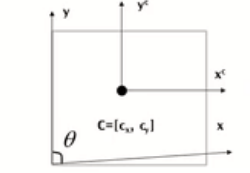
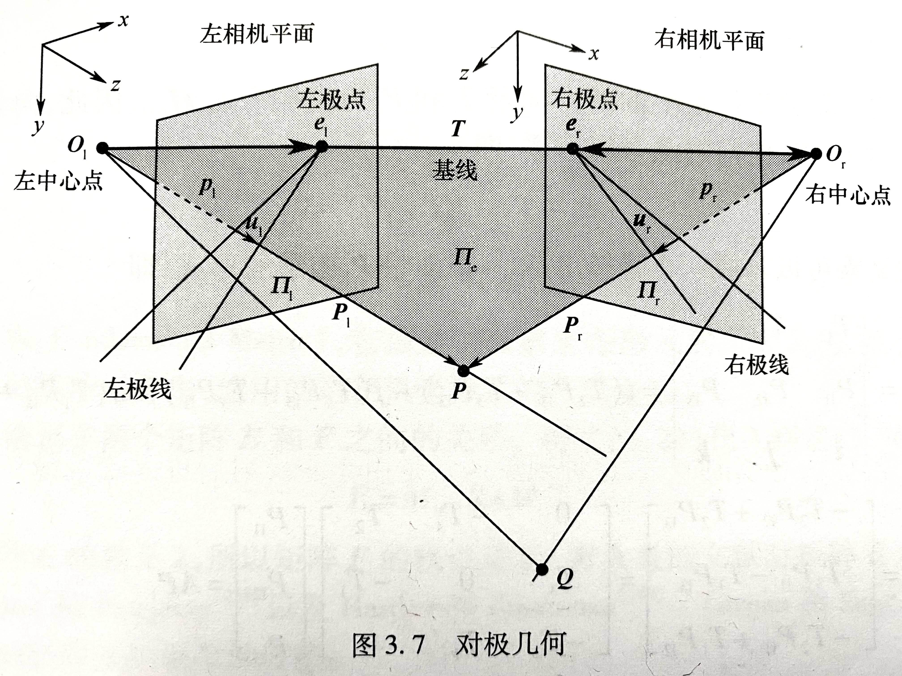
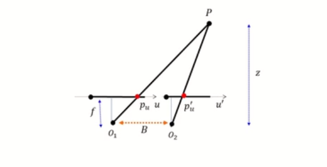
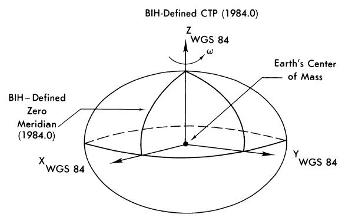
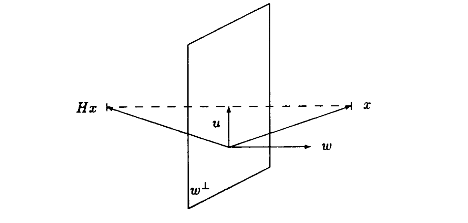

# 图像处理，卫星遥感

## 参考

An Introduction to 3D Computer Vision Techniques and Algorithms, Boguslaw lyganek, J. Paulsiebert, 2010

计算机视觉之三维重建篇（精简版）北京邮电大学 鲁鹏 https://www.bilibili.com/video/BV15f4y1v7pa

## 0 图像的表示

一般平面二维图像有RGB，YUV两种基本表示格式，YCbCr只是YUV的一种（使用隔行扫描，而YPbPr使用逐行扫描）

## 0.1 RGB

RGB表示方式是最直接的表示方式，**分别代表红、绿、蓝三种颜色的亮度**，常见有RGB888，RGB565等，一般在显示器等硬件中应用较多

## 0.2 YUV

YUV表示方式中，**Y表示亮度（Luma），而U和V分别表示两种色度**

RGB转YUV标准公式为

$$ 
\begin{aligned}
Y &= 0.299 R + 0.587 G + 0.114 B \\
U &= -0.1687 R - 0.3313 G + 0.5 B + 128 \\
V &= 0.5 R - 0.4187 G - 0.0813 B + 128 \\
\end{aligned}
$$

其中$UV$值都要加128，无加法时转换矩阵为（UV先减去128）

$$
\begin{bmatrix}
0.299 & 0.587 & 0.114 \\
-0.1687 & -0.3313 & 0.5 \\
0.5 & -0.4187 & -0.0813
\end{bmatrix}
$$

转换逆阵为

$$
\begin{bmatrix}
1 & 0 & 1.402 \\
1 & -0.34414 & -0.71414 \\
1 & 1.772 & 0
\end{bmatrix}
$$

YCbCr转RGB

$$
\begin{aligned}
Y&=0.299R+0.587G+0.114B \\
Cb&=0.564(B-Y) \\
Cr&=0.713(R-Y)
\end{aligned}
$$

RGB转YCbCr

$$
\begin{aligned}
R&=Y+1.402Cr \\
G&=Y-0.344Cb-0.714Cr \\
B&=Y+1.772Cb
\end{aligned}
$$

## 1 摄像机几何与内参数

## 1.1 针孔摄像机，透镜

针孔成像模型，就是将空间一个点通过小孔映射到胶片（一个平面）上面的过程

设想一个针孔成像的侧视图，小孔在胶片上方，发光点在小孔上方，在小孔处建立一个右手三维坐标系， $z$ 轴指向上方。针孔到胶片的距离为 $f$ （就是焦距，和 $z$ 轴共线）。设空间一个发光点 $A(x,y,z)$ ，那么胶片上该发光点的成像点 $y$ 坐标为 $f\dfrac{y}{z}$ 。同理可以得到$x$坐标为 $f\dfrac{x}{z}$

由于针孔成像亮度和清晰度不可兼得，所以引入透镜

**透镜的焦距：平行光通过透镜到达焦点，到透镜中心的距离$f$**

以后只考虑透镜到胶片的距离 $z_0$ ，这代表图像只有在特定的一段距离以内才可以清晰成像

**畸变：分为枕形畸变和桶形畸变**

> 数学模型：
>
> $$ \Delta_r = k_1r^3 + k_2r^5 + k_3r^7 + \cdots $$
> 
> 其中 $k_1 k_2 k_3$ 为径向畸变系数， $r = \sqrt{u_d^2 + v_d^2}$

**枕形畸变：成像点远离中心**

**桶形畸变：成像点靠近中心**

## 1.2 摄像机几何基础

摄像机几何其实是**射影几何**的一个分支。**射影几何**可以用于研究**三维图形在二维平面的成像原理**

空间中一个点到胶卷平面的映射（针孔成像），有一个公式

$$
(x,y,z)\rightarrow(fk\dfrac{x}{z}+c_x,fl\dfrac{y}{z}+c_y)
$$

> 解析：像平面的坐标原点和成像的坐标原点不同。成像的原点对应成像胶片的中心点，而胶片的坐标习惯将左下角作为坐标原点，所以相对胶卷坐标平面需要添加一个offset $(c_x,c_y)$ （单位pixel）
>
> 另外需要解决长度单位（m）到像素单位（pixel）的转换，这里添加 $k$ 和 $l$ 参数（单位都是pixel/m），方形像素中 $k$ 和 $l$ 的值相等
>
> 可以合并 $fk$ 和 $fl$ 分别为 $\alpha$ 和 $\beta$

$$
(x,y,z)\rightarrow(\alpha\dfrac{x}{z}+c_x,\beta\dfrac{y}{z}+c_y)
$$

**以上公式其实就是射影几何中基本公式的变形，基本原理就是将空间一个点的** $(x,y)$ **的坐标除以距离，得到透视的效果**

### 1.2.1 齐次坐标

**正是以上的** $z$ **坐标实现了投影之后的近大远小的透视效果**。但是 $z$ 位于分母，这不便于使用矩阵进行线性变换，所以这里引入齐次坐标

**齐次坐标系便于坐标转换的线性计算，添加的一维齐次坐标便于透视问题的处理。也是射影几何的重要组成部分**

欧氏三维坐标转换为齐次坐标添加一个**齐次项**（二维坐标同理），如下

$$
p=(x,y,z)\rightarrow\begin{bmatrix} x \\ y \\ z \\ 1 \end{bmatrix}
$$

点的齐次坐标可以转换为欧氏坐标，不同的齐次坐标点可能对应相同的欧氏坐标点（举一个比较生动的例子，如果看到了两个形状大小相同的物体，它们可能距离不同，而且距离远的那个物体更大）

$$
\begin{bmatrix}
x \\ y \\ w
\end{bmatrix}
\rightarrow(x/w,y/w)
$$

**在一般的计算机图形学/视觉中，对于三维坐标一般添加一个1。而在经过投影变换以后得到具有3个元的二维坐标（投影面坐标），再将其转变为欧氏坐标就是其在投影平面的位置**

### 1.2.2 摄像机映射矩阵（内参数）

齐次坐标中的映射矩阵，**重点公式**

$$
P'=\begin{bmatrix}\alpha x + c_xz \\ \beta y + c_yz \\ z \end{bmatrix}=\begin{bmatrix}
\alpha & 0 & c_x & 0 \\
0 & \beta & c_y & 0 \\
0 & 0 & 1 & 0 \\ 
\end{bmatrix}
\begin{bmatrix}
x \\ y \\ z \\ 1 
\end{bmatrix}
=MP
$$

可能会碰到像素坐标系不垂直的情况（摄像机偏歪），这种情况下需要对 $M$ 稍加改动

得到

$$
M=
\begin{bmatrix}
\alpha & -\alpha\cot\theta & c_x & 0 \\
0 & \dfrac{\beta}{\sin\theta} & c_y & 0 \\
0 & 0 & 1 & 0 \\
\end{bmatrix}
$$

取 $M$ 的一部分 $K$ ，称为**摄像机内参数矩阵**，因为只和摄像机参数有关

$$
K=
\begin{bmatrix}
\alpha & -\alpha\cot\theta & c_x \\
0 & \dfrac{\beta}{\sin\theta} & c_y \\
0 & 0 & 1 \\
\end{bmatrix}
$$

所以开头的公式也可以表示为

$$
P'=MP=K\begin{bmatrix} I & 0 \end{bmatrix}P
$$

**规范化相机**

规范化相机的矩阵 $M=\begin{bmatrix} 1 & 0 & 0 & 0 \\ 0 & 1 & 0 & 0 \\ 0 & 0 & 1 & 0 \\ \end{bmatrix}$

可以看成使用方形像素，没有偏歪，针孔和摄像机中心同轴

## 2 摄像机外参数

## 2.1 齐次坐标常用变换矩阵

设坐标 $P=\begin{bmatrix} x \\ y \\ z \\ 1 \end{bmatrix}$

$M$ 一般形式：

$$
M=\begin{bmatrix}
a_{11}x & a_{12}x & a_{13}x & \Delta x \\
a_{21}x & a_{22}x & a_{23}x & \Delta y \\
a_{31}x & a_{32}x & a_{33}x & \Delta z \\
0 & 0 & 0 & 1 \\
\end{bmatrix}
$$

**平移（Translation）**

$$
\begin{bmatrix}
1 & 0 & 0 & \Delta x \\
0 & 1 & 0 & \Delta y \\
0 & 0 & 1 & \Delta z \\
0 & 0 & 0 & 1 \\
\end{bmatrix}
$$

**尺度/缩放（Scale）**

$$
\begin{bmatrix}
Scalex & 0 & 0 & 0 \\
0 & Scaley & 0 & 0 \\
0 & 0 & Scalez & 0 \\
0 & 0 & 0 & 1 \\
\end{bmatrix}
$$

**旋转（Rotation）**

$x$ 轴

$$
\begin{bmatrix}
1 & 0 & 0 & 0 \\
0 & \cos(\theta) & -\sin(\theta) & 0 \\
0 & \sin(\theta) & \cos(\theta) & 0 \\
0 & 0 & 0 & 1 \\
\end{bmatrix}
$$

$y$ 轴

$$
\begin{bmatrix}
\cos(\theta) & 0 & \sin(\theta) & 0 \\
0 & 1 & 0 & 0 \\
-\sin(\theta) & 0 & \cos(\theta) & 0 \\
0 & 0 & 0 & 1 \\
\end{bmatrix}
$$

$z$ 轴

$$
\begin{bmatrix}
\cos(\theta) & -\sin(\theta) & 0 & 0 \\
\sin(\theta) & \cos(\theta) & 0 & 0 \\
0 & 0 & 1 & 0 \\
0 & 0 & 0 & 1 \\
\end{bmatrix}
$$

## 2.2 世界坐标系

世界坐标系用于设定一个绝对参考。如果使用相机坐标系，相机移动以后坐标也会变。将以上齐次坐标变换矩阵代入

世界坐标系到摄像机坐标系的转变， $R$ 为旋转部分， $T$ 为平移部分

设摄像机沿世界坐标系 $z$ 轴负方向平移 $z_0$ 距离，那么应该在 $T$ 加上相应的距离（平移的逆过程，**摄像机相对世界坐标所有移动步骤的逆**）

$$
P=\begin{bmatrix}
R & T \\
0 & 1 \\
\end{bmatrix}P_w
$$

其中 $P_w=\begin{bmatrix} x_w \\ y_w \\ z_w \\ 1 \end{bmatrix}$ 为世界坐标

可以和映射矩阵结合，得到世界坐标系到胶片平面的映射 **（重点公式）**

$$
P'=
K\begin{bmatrix}
I & 0
\end{bmatrix}
\begin{bmatrix}
R & T \\
0 & 1 \\
\end{bmatrix}P_w=
K\begin{bmatrix}
R & T
\end{bmatrix}P_w
$$

其中， $K$ 为摄像机的**内参数**矩阵， $R$ 和 $T$ 为**外参数**（即摄像机相对世界坐标系的位移的逆）。这两个矩阵可以合并，设为 $M$ ，那么 $P'=MP_w$

**自由度**：自由度就是看一个矩阵中可以影响一个矩阵的因素数量。 $K$ 有5个自由度， $R$ 有3个自由度（分别绕 $xyz$ 轴旋转）， $T$ 有3个自由度（分别沿 $xyz$ 轴移动），所以 $M$ 一共有11个自由度

设 $M=\begin{bmatrix} m_1 \\ m_2 \\ m_3 \end{bmatrix}$ 那么最终 $P'$ 的欧氏坐标形式为 $(\dfrac{m_1P_w}{m_3P_w},\dfrac{m_2P_w}{m_3P_w})$

## 2.3 Faugeras定理

原理会在之后提到，这里先引入结论

> 1. 设 $M=K\begin{bmatrix} R & T \end{bmatrix}=\begin{bmatrix} KR & KT \end{bmatrix}=\begin{bmatrix} A & b \end{bmatrix}$ ， $M$ 是一个透视投影矩阵的充要条件是 $\det (A) \neq 0$
> 
> 2. 设 $A=\begin{bmatrix} a_1 \\ a_2 \\ a_3 \end{bmatrix}$ ，那么 $M$ 是零倾斜( $\theta=90\degree$ )透视投影矩阵的充要条件是 $(a_1 \times a_3)\cdot(a_2 \times a_3)=0$
>
> 3. $M$ 宽高比为1（使用方形像素）的充要条件为
>
> $$
> \begin{cases}
> (a_1 \times a_3)\cdot(a_2 \times a_3) = 0 \\
> (a_1 \times a_3)\cdot(a_1 \times a_3) = (a_2 \times a_3)\cdot(a_2 \times a_3)
> \end{cases}
> $$

## 2.4 弱透视和正交投影

弱透视（将距离相差不大的点看成在同一个平面）， $m_3P_w=1$ ， $P'=(m_1P_w,m_2P_w)$ ，常用于图像识别

正交投影（无透视）， $x'=x,y'=y$ ，常用于工业设计CAD

## 3 摄像机标定

## 3.1 特征值分解（EVD）和奇异值分解（SVD）

分解 $A=P \Lambda P^{-1}$ ，这就是 **特征值分解（EVD）**

**特征值分解**的意义就是，计算 $A\vec{x}$ 时可以将 $\vec{x}$ 分解为向量组 $P$ 的线性组合，之后可以将矩阵 $A$ 替换为特征值矩阵计算

而在这里，如果A为**对称矩阵**，那么此时 $P$ 成为**正交矩阵**，可以进行标准化转化为**标准正交矩阵**（中文音译幺正矩阵/酉矩阵，Unitary Matrix，所有向量模为1且正交），此时 $P^T=P^{-1}$ ，可以得到

$$
A=P\Lambda P^T
$$

> 无关补充：向量组正交化可以使用**施密特正交化法**

**施密特正交化公式**

$$
\beta_1 = \alpha_1 \\
\beta_2 = \alpha_2 - \dfrac{[\beta_1,\alpha_2]}{[\beta_1,\beta_1]} \beta_1 \\
\quad \vdots \\
\beta_n = \alpha_n - \dfrac{[\beta_1,\alpha_n]}{[\beta_1,\beta_1]} \beta_1 - \dfrac{[\beta_2,\alpha_n]}{[\beta_2,\beta_2]} \beta_2 - \cdots - \dfrac{[\beta_{n-1},\alpha_n]}{[\beta_{n-1},\beta_{n-1}]} \beta_{n-1}
$$

而**奇异值分解（SVD）** ，可以理解为和**对称矩阵的特征值分解**类似，**区别是** $A$ **和** $\Lambda$ **不再是对称阵（主要用于非方阵的场合）。SVD可以用于最小二乘问题，求解一个齐次超定方程组的最优解**，形式如下

$$
A=U\Sigma V^T
$$

可以这样想：**无论** $A^TA$ **还是** $AA^T$ **都是对称矩阵（** $(AA^T)^T=AA^T$ **，反之同理），所以可以使用上面特征值分解中的技巧**。这里，方阵 $U$ 的阶数和 $A$ 的行数相同， $V$ 的阶数和 $A$ 的列数相同，并且直接得到的 $U$ 和 $V$ **都是正交矩阵**。 $U$ 可以通过求 $AA^T$ 的特征值和特征向量得到，由特征向量组合而成；而 $V$ 可以通过求 $A^TA$ 的特征值和特征向量得到

接下来可以这样看：

$$
AA^T = U \Sigma V^T (U \Sigma V^T)^T
= U \Sigma V^T V \Sigma^T U^T
= U \Sigma \Sigma^T U^T
= U \Sigma_U U^T \\
A^TA = (U \Sigma V^T)^T U \Sigma V^T
= V \Sigma^T U^T U \Sigma V^T
= V \Sigma^T \Sigma V^T
= V \Sigma_V V^T
$$

> 这里再次引用一条结论（证明过程省略）： $A^TA$ 和 $AA^T$ **拥有相同的非零特征值，且这些特征值都不为负数**。

由以上可以明显看出，其实等式就是 $A=P\Lambda P^T$ 的形式

综上，SVD基本步骤：

> 1. 分别求出 $AA^T$ 和 $A^TA$ 的特征值和特征向量，并将特征向量标准化（模为1），分别作为 $U$ 和 $V$
> 2. 方法1（较为繁琐）：由于 $A = U \Sigma V^T \Rightarrow AV = U\Sigma \Rightarrow Av_i = \sigma_i u_i \Rightarrow \sigma_i = \dfrac{Av_i}{u_i}$
> 方法2（简明高效）：因为 $\Sigma_U$ 和 $\Sigma_V$ 拥有相同的 $\lambda_1,\lambda_2,\cdots,\lambda_k$ ，所以 $\sigma_1=\sqrt{\lambda_1},\sigma_2=\sqrt{\lambda_2},\cdots,\sigma_k=\sqrt{\lambda_k}$

**SVD可以用于图像压缩（舍去较小的奇异值和奇异向量），但是效果较差，容易损失细节。常用的图片压缩算法一般基于DCT或DWT**

## 3.2 摄像机标定过程

**摄像机标定就是对于摄像机内外参数的求解（投影矩阵M的求解）**

本章开始使用 $p$ 替代 $P'$ ，使用 $P$ 替代 $P_w$

$$
p=K\begin{bmatrix} R & T \end{bmatrix}P
$$

$p_i$ 的欧氏坐标为

$$
p_i = \begin{bmatrix} u_i \\ v_i \end{bmatrix} = \begin{bmatrix} \dfrac{m_1P_i}{m_3P_i} \\ \dfrac{m_2P_i}{m_3P_i} \end{bmatrix}
$$

关键就在于 $m_1,m_2,m_3$ （都是1行4列的矩阵）的求解，**一共11个未知量，分别是世界坐标相对摄像机坐标的3个平移量、3个旋转量，以及5个摄像机参数，分别为** $\alpha,\beta,\theta,c_x,c_y$

而一对 $p_i$ 和 $P_i$ 可以得到两个方程，所以至少需要 $6 \times 2 = 12 \gt 11$ 共6对点数据（先求出 $m_1,m_2,m_3$ 的12个数据），而实际**一般取多于6对点**

可以列出方程组如下

$$
\begin{cases}
-u_1(m_3P_1)+m_1P_1=0 \\
-v_1(m_3P_1)+m_2P_1=0 \\
\quad \vdots \\
-u_n(m_3P_n)+m_1P_n=0 \\
-v_n(m_3P_n)+m_2P_n=0 \\
\end{cases}
$$

可以 $m_1,m_2,m_3$ 转置合并为一个12行1列的矩阵 $m=\begin{bmatrix} m_1^T \\ m_2^T \\ m_3^T \end{bmatrix}$

而 $P$ 如下，最后可以求解 $Pm=0$

$$
P=
\begin{bmatrix}
P_1^T & 0 & -u_1P_1^T \\
0 & P_1^T & -v_1P_1^T \\
\quad \vdots \\
P_n^T & 0 & -u_nP_n^T \\
0 & P_n^T & -v_nP_n^T \\
\end{bmatrix}
$$

但是由于方程行数一定大于列数，所以方程只有零解。**这里求解超定方程需要用到奇异值分解和最小二乘，只能求得近似的最优解（使得方程组左侧最接近于0）**

这里限制 $|| m || = 1$ ，设 $P=UDV^T$ 进行奇异值分解，那么 $m$ **为最小奇异值的右奇异向量**，由此求出 $m1,m2,m3$ ， $M=\begin{bmatrix} m1 \\ m2 \\ m3 \end{bmatrix}$

**接下来可以根据$M$提取摄像机内参数** $K$ **和外参数** $\begin{bmatrix} R & T \end{bmatrix}$

由于 $K = \begin{bmatrix} \alpha & -\alpha\cot\theta & c_x \\ 0 & \dfrac{\beta}{\sin\theta} & c_y \\ 0 & 0 & 1 \\ \end{bmatrix}$ ， $R = \begin{bmatrix} r_1^T \\ r_2^T \\ r_3^T \end{bmatrix}$ ， $T = \begin{bmatrix} \Delta x \\ \Delta y \\ \Delta z \end{bmatrix}$

如下，设 $A = \begin{bmatrix} a_1^T \\ a_2^T \\ a_3^T \end{bmatrix}, b = \begin{bmatrix} b_1 \\ b_2 \\ b_3 \end{bmatrix}$ 可以算已知，实际中 $\begin{bmatrix} A & b \end{bmatrix}$ 一般需要加上一个常数系数 $\rho$ ，那么

$$
M = K\begin{bmatrix} R & T \end{bmatrix} = \rho\begin{bmatrix} A & b \end{bmatrix} = \begin{bmatrix} \alpha r_1^T - \alpha \cot{\theta} r_2^T + c_x r_3^T & \alpha \Delta x - \alpha \cot{\theta} \Delta y + c_x \Delta z \\
\dfrac{\beta}{\sin{\theta}} r_2^T + c_y r_3^T & \dfrac{\beta}{\sin{\theta}} \Delta y + c_y \Delta z \\
r_3^T & \Delta z
\end{bmatrix}
$$

**先从旋转矩阵入手，求解** $c_x$ 和 $c_y$

$$
\rho A = \begin{bmatrix}
\alpha r_1^T - \alpha \cot{\theta} r_2^T + c_x r_3^T \\
\dfrac{\beta}{\sin{\theta}} r_2^T + c_y r_3^T \\
r_3^T \\
\end{bmatrix}
$$

由于 $r_3^T$ 是一个旋转矩阵的一行，**所以为单位向量**，可以得到以下结论

$$
|| \rho a_3 || = || r_3^T || = 1 \Rightarrow \rho = \dfrac{\pm 1}{| a_3 |}
$$

将 $\rho A$ 第一行和第三行点积，由于 $r_1^T,r_2^T,r_3^T$ **两两正交**，所以点积为0；而两个单位向量 $r_3^T$ **点积之后为1**，所以可以得到如下等式

$$
c_x = \rho^2(a_1\cdot a_3)
$$

同理

$$
c_y = \rho^2(a_2\cdot a_3)
$$

**接下来求解参数** $\theta$

> 这里再引入一条~~显而易见的~~定理：如果 $\vec x \vec y \vec z$ 为单位向量，两两正交且成右手系，那么 $\vec x \times \vec y = \vec z$

运用以上定理，可以对 $\theta$ 的求解作以下分析：

对 $\rho A$ 行之间作叉积，可以得到

$$
\begin{cases}
\rho^2 (a_1 \times a_3) = \alpha r_2 - \alpha \cot{\theta} r_1 \\
\rho^2 (a_2 \times a_3) = \dfrac{\beta}{\sin{\theta}} r_1
\end{cases}
$$

两边取模（推导过程较为复杂，略）

$$
\begin{cases}
\rho^2 |a_1 \times a_3| = \dfrac{|\alpha|}{sin{\theta}} \\
\rho^2 |a_2 \times a_3| = \dfrac{|\beta|}{sin{\theta}}
\end{cases}
$$

综合以上推导，可以由下求出 $\theta$

$$
\dfrac{(a_1 \times a_3)\cdot(a_2 \times a_3)}{|a_1 \times a_3|\cdot|a_2 \times a_3|} = \dfrac{\dfrac{-\alpha \beta \cos{\theta}}{\sin^2{\theta}}}{\dfrac{\alpha \beta}{\sin^2{\theta}}} = -\cos{\theta}
$$

如果这个式子为0，那么 $\theta=90\degree$ ，这里就得到了之前[1.2.5章](210320a_3drebuild.md#125-Faugeras定理)讲过的Faugeras定理，好理解

既然已经求得 $\theta$ ，那么最后内参数 $\alpha$ 和 $\beta$ 直接使用上式即可求得

**求解旋转外参数**

$\vec r_1 \vec r_2 \vec r_3$ 都是正交单位向量

所以

$$
\begin{cases}
r_1 = \dfrac{(a_2 \times a_3)}{| a_2 \times a_3 |} \\
r_2 = r_3 \times r_1 \\
r_3 = \dfrac{\pm a_3}{| a_3 |} \\
\end{cases}
$$

**最后算出平移外参数**

$$
\rho b = KT \Rightarrow T = K^{-1}\rho b
$$

## 3.3 径向畸变的处理

径向畸变包括之前讲过的**桶形畸变**和**枕形畸变**

桶形畸变将平面理想位置坐标乘以一个小于1的正数

枕形畸变将平面理想位置坐标乘以一个大于1的正数

具体转换如下，其中 $\lambda = 1 \pm \sum_{p=1}^3 K_p d^{2p} $

$$
p = 
\begin{bmatrix}
\dfrac{1}{\lambda} & 0 & 0 \\
0 & \dfrac{1}{\lambda} & 0 \\
0 & 0 & 1
\end{bmatrix}
MP
$$

设 $Q = \begin{bmatrix} q_1 \\ q_2 \\ q_3 \end{bmatrix} = \begin{bmatrix} \dfrac{1}{\lambda} & 0 & 0 \\ 0 & \dfrac{1}{\lambda} & 0 \\ 0 & 0 & 1 \end{bmatrix} M$ ，那么 $p_i = QP_i = \begin{bmatrix} \dfrac{q_1P_i}{q_3P_i} \\ \dfrac{q_2P_i}{q_3P_i} \end{bmatrix}$ ，**但是这不是线性方程组**

可以使用**列文伯格-马夸尔特（L-M）** 法求解最近似值，但是直接求解过程非常复杂

可以先将 $\dfrac{1}{\lambda}$ 分开算

$$
p_i = \begin{bmatrix} u_i \\ v_i \end{bmatrix} = \begin{bmatrix} \dfrac{q_1P_i}{q_3P_i} \\ \dfrac{q_2P_i}{q_3P_i} \end{bmatrix} 
= \dfrac{1}{\lambda} \begin{bmatrix} \dfrac{m_1P_i}{m_3P_i} \\ \dfrac{m_2P_i}{m_3P_i} \end{bmatrix}
\Rightarrow
\dfrac{u_i}{v_i} = \dfrac{m_1P_i}{m_2P_i}
$$

先求出前两行 $m_1,m_2$ ，再使用**L-M**求解 $m_3$ 和 $\lambda$

## 4 2D变换

## 4.1 等距变换（欧氏变换）

特性：描述平移和旋转，面积和形状不变，有个3自由度

$$
\begin{bmatrix} x' \\ y' \\ 1 \end{bmatrix} = \begin{bmatrix} R & T \\ 0 & 1 \end{bmatrix} \begin{bmatrix} x \\ y \\ 1 \end{bmatrix}
$$

## 4.2 相似变换

在等距变换基础上加一个缩放$S$

特性：形状不变，有4个自由度

$$
\begin{bmatrix} x' \\ y' \\ 1 \end{bmatrix} = \begin{bmatrix} SR & T \\ 0 & 1 \end{bmatrix} \begin{bmatrix} x \\ y \\ 1 \end{bmatrix}, S = \begin{bmatrix} s & 0 \\ 0 & s \end{bmatrix}
$$

## 4.3 仿射变换

$A$ 没有特殊要求

特性：平行线不变，有6个自由度

$$
\begin{bmatrix} x' \\ y' \\ 1 \end{bmatrix} = \begin{bmatrix} A & T \\ 0 & 1 \end{bmatrix} \begin{bmatrix} x \\ y \\ 1 \end{bmatrix}
$$

## 4.4 射影（透视）变换

特性：共线性不变，有8个自由度，相对于坐标轴做透视变换

$$
\begin{bmatrix} x' \\ y' \\ 1 \end{bmatrix} = \begin{bmatrix} A & T \\ v & 1 \end{bmatrix} \begin{bmatrix} x \\ y \\ 1 \end{bmatrix}
$$

## 5 影消点和影消线

## 5.1 平面直线以及透视坐标系中平行线的相交

平面上的一条直线可以使用 $ax+by+c=0$ 的形式表示，可以设 $l = \begin{bmatrix} a \\ b \\ c \end{bmatrix}$ ，设直线上有一个点 $x = \begin{bmatrix} x_1 \\ x_2 \end{bmatrix}$ ，那么 $\begin{bmatrix} x_1 \\ x_2 \\ 1 \end{bmatrix}^T \begin{bmatrix} a \\ b \\ c \end{bmatrix} = 0$

> 这里直接引入一条结论：平面两条直线的交点，就是这两条直线参数向量的叉乘，即 $x = l \times l'$ ，原因如下
>
> 由于叉乘得到的结果向量一定垂直于原向量，所以 $(l \times l')\cdot l = 0$
>
> 同理 $(l \times l')\cdot l' = 0$
> 
> 而由于直线的定义，交点的坐标代入正好是0，所以得证

> 无穷远点：齐次坐标 $\begin{bmatrix} x \\ y \\ 0 \end{bmatrix}$ 转换为欧氏坐标为 $(\infty,\infty)$
>
> 无穷远点经过仿射变换之后依然是无穷远点，但是经过射影（透视）变换之后就不是无穷远点了
>
> $$ \begin{bmatrix} A & T \\ 0 & 1 \end{bmatrix} \begin{bmatrix} 1 \\ 1 \\ 0 \end{bmatrix} = \begin{bmatrix} p_x \\ p_y \\ 0 \end{bmatrix}$$
> $$ \begin{bmatrix} A & T \\ v & 1 \end{bmatrix} \begin{bmatrix} 1 \\ 1 \\ 0 \end{bmatrix} = \begin{bmatrix} p_x \\ p_y \\ p_z \end{bmatrix}$$

**平行线的相交**

设两条平行线

$$
ax + by + c = 0 \\
a'x + b'y + c' = 0
$$

其中 $\dfrac{b}{a} = \dfrac{b'}{a'}$

那么 $l \times l' \propto \begin{bmatrix} b \\ -a \\ 0 \end{bmatrix} = x_\infty$

验证，可以反过来将坐标代入可得

$$
\begin{bmatrix}
a & b & c
\end{bmatrix}
\begin{bmatrix}
b \\ -a \\ 0
\end{bmatrix}
= 0
$$

> 无穷远线： $l_\infty = \begin{bmatrix} 0 \\ 0 \\ 1 \end{bmatrix}$
>
> 可以将无穷远点代入： $\begin{bmatrix} b & -a & 0 \end{bmatrix} \begin{bmatrix} 0 \\ 0 \\ 1 \end{bmatrix} = 0$
> 
> 无穷远线的变换，可以设直线上一个点 $x$ ，那么 $l'^THx=0$ ， $H = \begin{bmatrix} A & T \\ 0 & 1 \end{bmatrix}$，而$l^Tx = 0 \Rightarrow l^T H^{-1}Hx = 0 \Rightarrow (H^{-1T}l)^T Hx = 0$ ，所以 $l' = H^{-1T}l$
>
> 无穷远线的透视变换： $H^{-T} l_{\infty} = \begin{bmatrix} A & t \\ v & b \end{bmatrix}^{-T} \begin{bmatrix} 0 \\ 0 \\ 1 \end{bmatrix} = \begin{bmatrix} t_x \\ t_y \\ b \end{bmatrix}$
> 
> 可以发现，无穷远线经过透视变换之后得到的不再是无穷远线
>
> 同无穷远点的仿射变换，无穷远线仿射变换之后依然是无穷远线

## 5.2 三维空间中的点和面

空间中一个点的齐次坐标为

$$
x = 
\begin{bmatrix}
x_1 \\
x_2 \\
x_3 \\
1
\end{bmatrix}
$$

类似平面中直线的表示，空间中一个平面的表示如下

$$
\Pi=\begin{bmatrix}
a \\
b \\
c \\
d
\end{bmatrix}
$$

三维平面上一个点，可以表示为 $x^T\Pi=0$

**三维空间中的直线具有4个自由度，一般使用两个平面相交的形式表示。一般会定义直线的方向** $d = \begin{bmatrix} a & b & c \end{bmatrix}^T$

> 三维空间中的无穷远点（空间中平行线的交点，平行线方向为 $\begin{bmatrix} a & b & c \end{bmatrix}^T$ ）：表示形式为 $x_\infty = \begin{bmatrix} a \\ b \\ c \\ 0 \end{bmatrix}$

## 5.3 影消点

**三维空间中的无穷远点在图像平面上的投影点，成为影消点，不再是无穷远点**

$$
p_\infty = \begin{bmatrix} p_1 \\ p_2 \\ p_3 \end{bmatrix}
= v = Kd = K \begin{bmatrix} a \\ b \\ c \end{bmatrix}
$$

$$
d = \dfrac{K^{-1}v}{||K^{-1}v||}  
$$

> 可以作如下推导（K为摄像机内参数矩阵）：
>
> $$ x_\infty = \begin{bmatrix} a \\ b \\ c \\ 0 \end{bmatrix} \Rightarrow v = Mx_\infty = K \begin{bmatrix} I & 0 \end{bmatrix} \begin{bmatrix} a \\ b \\ c \\ 0 \end{bmatrix} = K\begin{bmatrix} a \\ b \\ c \end{bmatrix} $$

## 5.4 影消线

**三维空间中的无穷远线在图像平面上的投影线，成为影消线**

$$
l_{horiz} = H_P^{-T}l_\infty
$$

两条平行线一定交于影消线

> 影消线和平面法向量的关系：
> $$ \vec n = K^T l_{horiz} $$
>
> 其中K为摄像机内参数矩阵（投影）
>
> 推导：设水平面参数为 $\Pi$ ，数值和法向量相同，那么平面上 $X^T\Pi = 0$ ，经过投影矩阵 $P$ 之后可以得到 $(PX)^T l_{horiz} = 0 \Rightarrow X^T(P^Tl_{horiz}) = 0$ ，所以 $\Pi = P^Tl_{horiz}$ ，即 $ \vec n = P^T l_{horiz} $

> 无穷远平面：平行平面在无穷远处交于**无穷远直线**，多条无穷远直线组成无穷远平面 $\Pi$
>
> $$ \Pi_\infty = \begin{bmatrix} 0 \\ 0 \\ 0 \\ 1 \end{bmatrix} $$

## 5.5 两组平行线夹角和影消点的关系

由于空间一个无穷远点坐标可以通过影消点反向求得

$$
d = \dfrac{K^{-1}v}{||K^{-1}v||}
$$

空间两对平行线夹角可以如下求解

$$
\cos\theta = \dfrac{d_1 \cdot d_2}{|d_1||d_2|}
\dfrac{v_1^T \omega v_2}{\sqrt{v_1^T \omega v_1} \sqrt{v_2^T \omega v_2}}
$$

其中

$$
\omega = (KK^T)^{-1} = 
\begin{bmatrix}
\omega_1 & \omega_2 & \omega_4 \\
\omega_2 & \omega_3 & \omega_5 \\
\omega_4 & \omega_5 & \omega_6 \\
\end{bmatrix}
$$

是一个对称矩阵，若 $\omega_2 = 0$ 那么零倾斜，若同时 $\omega_1 = \omega_3$ 那么是方形像素， $\omega$ 只有5个自由度

并且

$$
\theta = 90\degree \rightarrow v_1^T \omega v_2 = 0
$$

## 6 单视图重构

> 单视图重构分两个步骤
>
> 1. 通过单视图标定摄像机内参数$K$
> 2. 通过参数还原空间中面的信息
>
> 单视图重构存在重大缺陷就是不能真实还原三维场景的尺寸以及实际比例，并且影消点和影消线需要手动选择，需要场景先验信息

在图片中取三组互相正交的平行线，由之前[5.5](210320a_3drebuild.md#55-两组平行线夹角和影消点的关系)可知此时 $\theta = 0$ ，设影消点分别为 $v_1,v_2,v_3$ ，那么有

$$
\begin{cases}
v_1^T\omega v_2 = 0 \\
v_1^T\omega v_3 = 0 \\
v_2^T\omega v_3 = 0
\end{cases}
$$

此时可以假设摄像机零倾斜（ $\omega_2 = 0$ ）并且使用方形像素（ $\omega_1 = \omega_3$ ），求出 $\omega$ 即可求出 $K$ ，完成摄像机的标定

标定完成之后就可以进行重构，求出这3个平面的法向量，就可以求出平面方程

$$
\vec n = K^Tl_{horiz}
$$

## 7 对极几何

使用双目视觉图片的重构方法（多视图几何）

## 7.1 对极几何基础

极几何描述同一场景或物体两个视点**图像**之间的几何关系，如下。对极几何有一个关键点就是**查找一个视图上面一个点在另一个视图上面的对应位置**

> 定义
> 1. **极平面**：过 $O_lO_rP$ 的平面 $\Pi_e$
> 2. **基线**：中心点 $O_lO_r$ 的连线
> 3. **极点**：**基线**和相机成像平面的交点 $e_l$ 和 $e_r$
> 4. **极线**：**极平面** $\Pi_e$ 和两相机成像平面的交线 $e_lp_l$ 和 $e_rp_r$
>
> 性质
> 1. **极平面**相交于**基线**
> 2. 所有**极线**相交于**极点**
> 3. $p_l$ 的对应点在 $e_rp_r$ 上
> 4. $p_r$ 的对应点在 $e_lp_l$ 上
>
> 极几何约束：查找一个视图中一个点在另一个视图中的坐标，只需要**在极线上查找**即可

> 平行视图：考虑一种特殊情况，**如果两个摄像机成像平面平行，那么基线** $O_lO_r$ **和摄像机成像平面平行，极点** $e_le_r$ **位于无穷远处**。这是大部分双目视觉系统的构造

> 前向平移：两个摄像机平面依然平行，此时两**极点** $e_le_r$ 在两平面中坐标相同

## 7.2 本质矩阵

本质矩阵用于**代数化描述规范相机拍摄的图像之间的极几何关系**（空间中同一个点 $P$ 在坐标 $O_l$ 和 $O_r$ 中对应坐标的关系）

设有两个规范化相机，那么每个规范化相机的投影矩阵就是

$$
p = MP = \begin{bmatrix} 1 & 0 & 0 & 0 \\ 0 & 1 & 0 & 0 \\ 0 & 0 & 1 & 0 \end{bmatrix} \begin{bmatrix} x \\ y \\ z \\ 1 \end{bmatrix} = \begin{bmatrix} x \\ y \\ z \end{bmatrix}
$$

三维坐标中一个点的投影坐标和三维坐标相同

设空间中一点 $P$ ，两摄像机中心点分别为 $O_lO_r$ ，空间同一点 $P$ 在两坐标的对应点分别为 $P_lP_r$ 。在 $O_l$ 和 $O_r$ 处建立坐标系。其中，摄像机 $O_l$ 可以经过 $R T$ 得到 $O_r$ （ $R$ 为旋转矩阵， $T$ 为平移坐标，**旋转矩阵的逆阵就是它的转置**），那么可以类似之前世界坐标到摄像机坐标的转换原理， $P_r = R(P_l  - T)$ （注：这里的 $P_lP_r$ 是同一个点 $P$ 在 $O_lO_r$ 的两个不同坐标）

**接下来作如下推导**

> 已知 $P_r = R(P_l  - T) \Rightarrow R^TP_r = P_l - T$ ，并且由图可知 $P_l$ 和 $T$ 在 $\Pi_e$ 内，那么 $P_l - T$ 也在 $\Pi_e$ 上，可得
>
> $$ (P_l - T) \cdot (T \times P_l) = 0 $$
>
> 接下来分析 $T \times P_l$ 。由于向量叉乘可以化为矩阵和向量点乘的形式，如下
>
> $$ T \times P_l = [T_\times]P_l = \begin{bmatrix} 0 & -T_3 & T_2 \\ T_3 & 0 & -T_1 \\ -T_2 & T_1 & 0 \end{bmatrix} \begin{bmatrix} P_{l1} \\ P_{l2} \\ P_{l3} \end{bmatrix} = AP_l$$
>
> 那么最后代入得到
>
> $$ (R^TP_r)^TAP_l = P_r^TRAP_l = P_r^TEP_l = 0 $$

其中， $E = RA$ 就是**本质矩阵**，本质矩阵体现了同一个坐标点在 $O_l$ 和 $O_r$ 中的坐标的关系

由于 $A$ 的秩为2，所以 $E = RA$ 的**秩为2**

## 7.3 基础矩阵

基础矩阵更进一步，**用于描述两个投影之后的齐次坐标的关系**

有关基础矩阵，可以作如下推导

> 在规范化相机中，由于 $p_l = MP_l$ ， $p_r = MP_r$ （ $p_lp_r$ **分别为经过规范化相机** $O_lO_r$ **的矩阵转换的坐标**），所以
>
> $$ p_r^TEp_l = 0 $$
> 
> 由实际情况中非规范摄像机 $O_lO_r$ 的内参数矩阵分别为 $K_lK_r$ ， $\bar p_l = K_lp_l$ ， $\bar p_r = K_rp_r$ 其中 $\bar p_l$ 和 $\bar p_r$ 分别是 $p_lp_r$ 经过投影之后的齐次坐标），那么
>
> $$ (K_r^{-1}\bar p_r)^TEK_l^{-1}\bar p_l = 0 \Rightarrow \bar p_r^TK_r^{-T}EK_l^{-1}\bar p_l = 0 $$
>
> 设 $F = K_r^{-T}EK_l^{-1} = K_r^{-T}RAK_l^{-1}$ ，所以
>
> $$ \bar p_r^TF \bar p_l = 0 $$

其中， $F = K_r^{-T}EK_l^{-1}$ 就是**基础矩阵**，因为 $E$ 的秩为2，所以 $F$ 的**秩也为2**

## 7.4 基础矩阵估计

> 由以上 $F$ 的组成分析， $F$ 有7个自由度（由于 $ \bar p_r^TF \bar p_l = 0 $ 右侧为0，所以 $F$ 具有**尺度等价性**，需要**减去1个自由度**。又因为 $F$ 为3阶方阵并且秩为2， $\det(F) = 0$ ，所以只有7个自由度）。计算中可以取8对点建立线性方程组，而实际中**一般会使用9对点以增加鲁棒性**
> 
> 最终可以列出矩阵的一行如下（点坐标分别为 $(u,v,1)(u',v',1)$ ，实际有9个点代入，所以有9行）

$$
\begin{bmatrix} uu' & vu' & u' & uv' & vv' & v' & u & v & 1 \end{bmatrix} \begin{bmatrix} F_{11} \\ F_{12} \\ F_{13} \\ F_{21} \\ F_{22} \\ F_{23} \\ F_{31} \\ F_{32} \\ F_{33} \\ \end{bmatrix} = 0
$$

> 表示形式为

$$
Wf = 0
$$

> 此时又到了求解超定方程组的**最小二乘问题**，同样对 $W$ 进行**SVD**，求解其**最小奇异值对应右特征向量**（ $|| f || = 1$ ），最终求得结果记为 $\hat F$
>
> 但是这里还存在一个问题： $\hat F$ **通常秩为3，而实际中** $F$ **秩为2**。所以这里还要对 $\hat F$ 做一次**SVD**使得 $\hat F$ 相对于 $F$ 最小化，**去除最小奇异值**（此时 $\det(F) = 0$ ）

$$
\hat F = U \begin{bmatrix} S_1 & 0 & 0 \\ 0 & S_2 & 0 \\ 0 & 0 & S_3 \end{bmatrix} V^T \Rightarrow F = U \begin{bmatrix} S_1 & 0 & 0 \\ 0 & S_2 & 0 \\ 0 & 0 & 0 \end{bmatrix} V^T
$$

**但是8点法存在精度差的问题，因为** $W$ **中有些变量是相乘得到的结果，所以数值差异可能很大**

所以改良这种算法得到了**归一化8点算法**，如下

> 对左右两张图分别施加平移和缩放（变换 $T_l$ 和 $T_r$ ），使得图像原点为图像重心，且各像点到原点均方根距离为 $\sqrt{2}$
>
> $$ q_{li} = T_lp_{li}, q_{ri} = T_rp_{ri} $$
>
> 之后计算 $F_q$ ，然后进行逆归一化 $F = T_r^TF_qT_l$

## 8 双目立体视觉系统

双目立体视觉系统是重构的方法之一，模仿生物视觉，一般使用两台摄像机同时拍摄的平行视图

## 8.1 平行视图

> 这里先补充一些概念：极点 $e_r$ 也是左摄像机的光心 $O_l$ 在右摄像机平面 $\Pi_r$ 的投影
>
> 所以极点的计算中， $e_r = K_r \begin{bmatrix} R & T \end{bmatrix} O_l$ ，又因为 $O_l = \begin{bmatrix} 0 \\ 0 \\ 0 \\ 1 \end{bmatrix}$ ，所以 $e_r = K_rT$
>
> 另外引入矩阵叉乘性质： $[t_\times]M = M^{-T}[(M^{-1}t)_\times]$
>
> 之前已经提到基础矩阵 $F = K_r^{-T}RAK_l^{-1}$ ，这里换一种表达方式（推导过程类似），设 $F = K_r^{-T}[T_\times]RK_l^{-1}$ ，其中 $T$ 为**坐标点的平移**（同上，和摄像机平移相反）， $R$ 为**旋转**

由上叉乘性质，可得

$$ [T_\times] K_r^{-1} = K_r^{T}[(K_rT)_\times] \Rightarrow [T_\times]  = K_r^{T}[(K_rT)_\times]K_r$$

那么可以得到如下结论

$$ \begin{aligned} F &= K_r^{-T}[T_\times]RK_l^{-1} \\ &= K_r^{-T}K_r^T[(K_rT)_\times]K_rRK_l^{-1} \\ &= [(K_rT)_\times]K_rRK_l^{-1} \\ \Rightarrow F &= [e_{r\times}]K_rRK_l^{-1} \end{aligned}$$

**这里就引入平行视图的巧妙利用：由于平行视图中，两个相机成像平面互相平行且和基线** $O_lO_r$ **平行，所以极点** $e_le_r$ **位于无穷远处，齐次坐标第三位为0**

设两相机参数相同， $K_l = K_r$ ，并且由于旋转矩阵 $R = I$ ， $T = \begin{bmatrix} T \\ 0 \\ 0 \end{bmatrix}$ ， $e_r = \begin{bmatrix} 1 \\ 0 \\ 0 \end{bmatrix}$ ，所以

$$ F = [e_{r\times}] = \begin{bmatrix} 0 & 0 & 0 \\ 0 & 0 & -1 \\ 0 & 1 & 0 \end{bmatrix}$$

> 这里再对极线进行推导：设 $p_r$ 所在极线为 $u_r$ ， $p_l$ 所在极线为 $u_l$ （这里的 $p_rp_l$ 为 $P$ 在摄像机平面成像的齐次坐标），那么有
>
> $$ p_ru_r = 0 \\ p_lu_l = 0 $$
>
> 由于 $p_r^TFp_l = 0$ ，所以有
>
> $$ u_r = Fp_l \\ u_l = F^Tp_r $$

由之前的极几何可知，左摄像机极线 $l = F^Tp_r = \begin{bmatrix} 0 & 0 & 0 \\ 0 & 0 & 1 \\ 0 & -1 & 0 \end{bmatrix} \begin{bmatrix} p_{ru} \\ p_{rv} \\ 1 \end{bmatrix} = \begin{bmatrix} 0 \\ 1 \\ -p_{rv} \end{bmatrix}$

**所以由上可以明显看出左摄像机极线和其** $y$ **轴平行**

接下来将 $F = \begin{bmatrix} 0 & 0 & 0 \\ 0 & 0 & -1 \\ 0 & 1 & 0 \end{bmatrix}$ 代入

$$
p_r^TFp_l = \begin{bmatrix} p_{ru} & p_{rv} & 1 \end{bmatrix} \begin{bmatrix} 0 & 0 & 0 \\ 0 & 0 & -1 \\ 0 & 1 & 0 \end{bmatrix} \begin{bmatrix} p_{lu} \\ p_{lv} \\ 1 \end{bmatrix} = 0 \\
\Rightarrow  -p_{rv} + p_{lv} = 0
$$

即 $p_{rv} = p_{lv}$ ，**可知** $p_{rv}p_{lv}$ **的** $v$ **坐标相等**

所以得到平行视图的一个重要结论：**平行视图的对应点在平行视图的同一** $v$ **坐标扫描线搜索即可，也就不用计算极线**

## 8.2 三角化

三角化就是已知两个摄像机的内外参数、位置关系以及点 $P$ 在两个平面的投影坐标 $p_lp_r$ 的情况下求解 $P$ 坐标的过程

这里只讲解平行视图的三角化

平行视图的三角化就是应用了视差原理计算深度

由相似三角形可得， $z = B \dfrac{f}{p_{lu}-p_{ru}}$

其中 $p_{lu}-p_{ru}$ 就是视差，**视差和深度成反比**

## 8.3 平行视图校正

一般在实际中很难得到完全的平行视图，所以要进行平行视图校正

平行视图校正，就是将非平行视图通过转换变为平行视图，以将非平行视图当作平行视图处理，简化过程

设两个非平行视图平面 $\Pi_l \Pi_r$ ，求出变换矩阵 $H_l H_r$ ，使得变换之后的图像共面且和基线平行，且基线和 $u$ 轴平行

> 平行视图校正分为5步
>
> **第1步**：在两张图像中匹配 $\ge 8$ 对点 $p_{li},p_{ri}$ （使用图像匹配算法），**计算** $F$
>
> **第2步**：由于所有极线相交于极点，所以可以先由 $u_l = F^Tp_r,u_r = Fp_l$ 计算出各点所在极线，再通过 $\begin{bmatrix} u_{l1} \\ u_{l2} \\ \vdots \\ u_{li} \end{bmatrix} e_l = 0$ 代入通过SVD**求得极点** $e_l$ ，而 $e_r$ 同理
>
> **第3步**：**求解** $H_r$ ，将 $e_r$ 映射到无穷远 $(f,0,0)$ 。 $H_r = T^{-1}GRT$ 分为如下几个方面
>
>  **首先将右图像坐标原点平移到图片中心**
>
> $$ T = \begin{bmatrix} 1 & 0 & -\dfrac{width}{2} \\ 0 & 1 & -\dfrac{height}{2} \\ 0 & 0 & 1 \end{bmatrix} $$
>
> 此时 $e_r$ 也会有新的坐标 $e_r' = (e_1',e_2',1)$
>
> **旋转** 
>
> $$ R = \begin{bmatrix} \alpha \dfrac{e_1'}{\sqrt{e_1'^2 + e_2'^2}} & \alpha \dfrac{e_2'}{\sqrt{e_1'^2 + e_2'^2}} & 0 \\ -\alpha \dfrac{e_2'}{\sqrt{e_1'^2 + e_2'^2}} & \alpha \dfrac{e_1'}{\sqrt{e_1'^2 + e_2'^2}} & 0 \\ 0 & 0 & 1 \end{bmatrix} $$
>
> $e_1'\gt 0$ 时 $\alpha = 1$ ，否则 $\alpha = -1$ ，此时将 $e_r'$ 映射到 $(f,0,1)$ （其实就是对整张图进行旋转，将 $e_r'$ 旋转到 $x$ 轴）
>
> 通过 $G$ 将 $e'$ **映射到无穷远** $e' = (f,0,0)$
>
> $$ G = \begin{bmatrix} 1 & 0 & 0 \\ 0 & 1 & 0 \\ -\dfrac{1}{f} & 0 & 1 \end{bmatrix} $$
>
> 最后通过 $T^{-1}$ **将坐标还原**
>
> **第4步**：需要使得 $\Pi_r$ 经过 $H_r$ 变换的图像和 $\Pi_l$ 经过 $H_l$ 变换的图像重合越多越好，使得
>
> $$ \sum_i d(H_lp_{li}, H_rp_{ri}) $$
>
> **值最小**
>
> **第5步**：最后使用求得的 $H_lH_r$ 对左右图像进行重采样转换

## 8.4 平行视图对应点搜索

对应点搜索也被称为双目融合问题

之前通过平行视图校正已经将左右两张图片的极线重合。所以现在对应点 $p_lp_r$ 的纵坐标相同（ $p_{lv} = p_{rv}$ ），只要对其横坐标（ $p_{lu}$ 和 $p_{ru}$ ）进行匹配即可

相关匹配需要用到图片窗口，具体步骤如下

> 1. 在左图像 $\Pi_l$ 一条极线上取一点 $(p_{lu},p_{lv})$ ，建立一个 $3 \times 3$ 窗口 $W_l$ ，将其窗口内数据展开为一个 $9 \times 1$ 向量 $\vec w_l$ 
> 2. 在右图像 $\Pi_r$ 对应极线 $v = p_{rv}$ 上依次取点 $(s,p_{rv})$ 建立 $3 \times 3$ 窗口 $W_r$，展开为 $\vec w_r$
> 3. 计算每个 $s$ 对应 $w_l^T w_r$
> 4. 那么一个 $p_{lu}$ 对应的 $p_{ru} = \argmax_s w_l^T w_r$ ，即求得 $w_l^T w_r$ 最大值时对应的 $s$ 值
> 注：**窗口取奇数阶方阵，不一定是** $3 \times 3$，**也可以是其他**。窗口越大，对细节越敏感，但容易受噪声影响；窗口越小，那么就容易丢失细节，需根据实际情况调节

但是对应点匹配存在一些问题：**如果左右两张图片对应的亮度值差距过大，有可能导致匹配的失败**；而如果匹配的区域没有显著特征就会产生**同质区域问题**，难以匹配；类似的还有**重复模式问题**（比如匹配一副栅栏的图片，周期性出现很多相似的匹配点）。另外还存在成像问题，一个是**透视缩短问题**（同一物体在两摄像机图片中大小变化过大），一个是**遮挡问题**（同一物体在两摄像机中呈现完全不同的两面）

对于图片亮度差距的问题，实际中一般需要使用**归一化的相关匹配**，这里的归一化就是**图片的相应点去除灰度均值**（由于整体光照对图像一片区域的影响是一致的，增加光照时对每个点的亮度增加相同）

> 所以以上第3步的计算公式 $w_l^T w_r$ 应该改为： $\dfrac{(w_l - \bar w_l)^T(w_r - \bar w_r)}{||w_l - \bar w_l|| ||w_r - \bar w_r||}$

而对于成像的透视缩短问题和遮挡问题，一般通过减少 $\dfrac{B}{z}$ 实现（即相对于两摄像机光心距离，尽量增大拍摄物体的距离），**但是这会导致深度估算误差的增大**

对应点匹配算法在实际中需要对匹配过程添加约束：**唯一性约束**，**顺序/单调性约束**以及**平滑性约束**

## 9 运动恢复结构

运动恢复结构是另一种重构方法，使用同一摄像机在不同角度拍摄进行重构

运动恢复结构可以建模为如下问题：

> $n$ 个三维坐标点 $X_j(1\le j\le n)$ 在 $m$ 个位置下的投影坐标为 $x_{ij}(1\le i\le m)$，且$x_{ij} = M_iX_j$ 。求解 $M_i$ 和 $X_j$ ，其中恢复 $M_i$ 的过程被称为**运动恢复**，恢复 $X_j$ 的过程被称为**结构恢复**

## 9.1 欧氏结构恢复

摄像机内参数已知，外参数未知

应用：自动驾驶，机器人视觉

**问题建模**：

> 已知 $X_j$ 在 $M_i$ 投影下得到 $x_{ij}$
> $M_i$ 对应内参数矩阵为 $K_i$ ，外参数矩阵为 $\begin{bmatrix} R_i & T_i\end{bmatrix}$ （未知）
> $$x_{ij} = K_i \begin{bmatrix} R_i & T_i\end{bmatrix} X_j$$
> 求解 $X_j$ 和 $R_iT_i$

**求解过程**：

设以 $i = 1$ 为基准坐标，那么 $M_1 = K_1\begin{bmatrix} I & 0 \end{bmatrix}$，$M_2 = K_2\begin{bmatrix} R & T \end{bmatrix}$

**问题就变成了求解** $X_j$ 和 $\begin{bmatrix} R & T \end{bmatrix}$

求解分4步

> 1. 首先根据**归一化八点法**求解求解基础矩阵 $F$
> 2. $F = K_2^{-T}EK_1^{-1} \Rightarrow E = K_2^TFK_1$ 求出 $E$
> 3. 分解 $E$ 得到 $RT$ （ $E = [T_\times]R$ ）
> 4. 最后根据三角化求解 $X_j$ （求解使得下式最接近的 $X_j$ ）
>
> $$X_j^* = \argmin_{X_j}(d(x_{1j},M_1X_j),d(x_{2j},M_2X_j))$$

其中第3步 $E = [T_\times]R$ 的求解过程：

> 首先分析：由于 $x_2^TFx_1 = 0$ ， $F$ 可以任意放缩以及变号，所以可能求得的是 $kF$ 或 $-F$ ，那么 $E = K_2^TFK_1$ 也是不定的
>
> 可以定义 $W = \begin{bmatrix} 0 & -1 & 0 \\ 1 & 0 & 0 \\ 0 & 0 & 1 \end{bmatrix}$ ， $Z = \begin{bmatrix} 0 & 1 & 0 \\ -1 & 0 & 0 \\ 0 & 0 & 0 \end{bmatrix}$
> 那么如果不计正负号的情况下
> $$ Z = diag(1,1,0)W = diag(1,1,0)W^T $$
> $[T_\times]$ 可以分解为如下形式
> $$ [T_\times] = kUZU^T $$
> 其中， $U$ 为单位正交矩阵，那么由之前的推导，如果不考虑符号和尺度
> $$ \begin{aligned} [T_\times] &= UZU^T \\ &= Udiag(1,1,0)WU^T \\ &= Udiag(1,1,0)W^TU^T \end{aligned} $$
> 那么
> $$ \begin{aligned} E &= [T_\times]R \\ &= (Udiag(1,1,0)WU^T)R \\ &= Udiag(1,1,0)(WU^TR) \end{aligned} $$
> 如果对 $E$ 作**SVD（关键步骤）**，那么
> $$ E = Udiag(1,1,0)V^T $$
> 所以 $V^T = WU^TR \Rightarrow R = UW^TV^T$ ，同理 $R = UWV^T$ ，**由此求出** $R$ **（符号不确定）**
>
> 又因为旋转矩阵行列式必须满足 $\det(R) \gt 0$ ，所以可以**在前面乘上行列式（关键公式）**
>
> $$\begin{aligned} R &= \det(UWV^T)UWV^T \\ &= \det(UW^TV^T)UW^TV^T \end{aligned}$$
>
> 接下来可以求解 $T$
>
> $$ T\times T = [T_\times]T = UZU^TT = 0 \\ \Rightarrow T = \pm u_3 $$
>
> 经过上述结果组合，最终得到的 $\begin{bmatrix} R & T \end{bmatrix}$ **可能有4种**，但是其中只有一组解是正确的
>
> 所以最终可以**将一个点代入进行三角化**，如果结果中**得到的两个摄像机的$z$坐标都为正**，那么这组解就是正确的解。**现实中可以代入多组解，选择最符合条件的那组**

到这里已经得到了 $RT$ ，最后通过**三角化**得到 $X_j$ 的坐标

**最终，恢复得到的欧氏结构和真实场景差相似变换（旋转，平移，缩放），这种重构被称为度量重构**

## 9.2 仿射结构恢复

仿射相机，内外参数都未知

之前提到过仿射相机的变换矩阵为 $M = \begin{bmatrix} m_1 \\ m_2 \\ 0 & 0 & 0 & 1 \end{bmatrix}$ ， $x = (m_1X, m_2X)^T = \begin{bmatrix} A & b \end{bmatrix}X = AX^E + b,(X^E = \begin{bmatrix} x \\ y \\ z \end{bmatrix})$

**问题建模**：

> 类似之前的，问题就是求解
> $$ x_{ij} = A_iX_j + b_i $$
> 其中只有 $x_{ij}$ 已知

**求解过程**：

求解可以使用代数法或因式分解法，这里使用**因式分解法**

因式分解法分两步

> 1. 数据中心化
> 2. 因式分解 

其中数据中心化求解：

> 数据中心化就是将所有点减去图像点的质心 $\dot x_i$ （坐标均值）
> $$ \begin{aligned} \hat x_{ij} &= x_{ij} - \dot x_i \\ \dot x_i &= \dfrac{1}{n} \sum^n_{k=1} x_{ik} \\ x_{ij} &= A_iX_j + b_i\end{aligned}$$
> 那么
> $$ \begin{aligned} \hat x_{ij} &= A_iX_j + b_i - \dfrac{1}{n} \sum^n_{k=1} x_{ik} \\ &= A_iX_j + b_i - \dfrac{1}{n} \sum^n_{k=1}A_iX_k - \dfrac{1}{n}nb_i \\ &= A_iX_j - \dfrac{1}{n} \sum^n_{k=1}A_iX_k \\ &= A_i(X_j - \bar X) \\ &= A_i\hat X_j \end{aligned} $$
> 如果3D点质心和世界坐标系中心重合
> $$ A_i\hat X_j = A_iX_j $$
>
> 开始求解（因式分解），首先将去质心（均值）之后的测量值写成矩阵，其中每个元素都是一个 $2\times 1$ 向量
> $$ D = \begin{bmatrix} \hat x_{11} & \hat x_{12} & \cdots & \hat x_{1n} \\ & & \ddots & \\ \hat x_{m1} & \hat x_{m2} & \cdots & \hat x_{mn} \end{bmatrix}  = \begin{bmatrix} A_1 \\ A_2 \\ \vdots \\ A_m \end{bmatrix} \begin{bmatrix} X_1 & X_2 & \cdots & X_n \end{bmatrix} = MS $$
> 在以上矩阵中，每一列代表一个三维点，所有行中元素不可缺失。 $A$ 为 $2 \times 3$ 维， $X$ 为 $3 \times 1$ 维。 $D$ 的秩为3，因为 $MS$ 的秩都为3
>
> 接下来问题就变成了求解 $M$ **运动矩阵**和 $S$ **结构矩阵**（点三维坐标）
>
> 可以直接对 $D$ 进行**SVD**
> $$ D = UWV^T $$
> 由于 $D$ 的秩为3，所以 $W$ 只有3个非零奇异值 $\sigma_1,\sigma_2,\sigma_3$ 。只取前3个，所以 $D$ 又可以写成以下形式
> $$ D = U_3W_3V_3^T = U_3(W_3V_3^T) = (U_3W_3)V_3^T = MS $$
> 由此求得 $MS$

但是很显然以上方法可以得到多种结果

> 设 $M^* = MH, S^* = H^{-1}S$ ，其中 $H$ 可以为任意可逆 $3 \times 3$ 矩阵，其确定化需要通过添加约束来实现，比如直角约束

## 9.3 透视结构恢复

透视相机，内外参数都未知

应用：卫星图重构

**问题建模**：

> 透视摄像机的参数矩阵 $M = \begin{bmatrix} A & b \\ v & 1 \end{bmatrix} = \begin{bmatrix} m_1 \\ m_2 \\ m_3 \end{bmatrix}$
> $$ x^E = (\dfrac{m_1X}{m_3X}, \dfrac{m_2X}{m_3X})^T $$
> 有11个摄像机参数，求解
> $$ x_{ij} = M_iX_j, M_i = K_i\begin{bmatrix} R_i & T_i \end{bmatrix} $$
> 同之前，其中只有 $x_{ij}$ 已知

**求解过程**：

同之前的仿射结构恢复，透视结构恢复也有歧义问题，如下

> $$ x_{ij} = M_iX_j \\ M^*X^* = (M_iH^{-1})(HX_j) $$
>
> 所以求解有一个前提条件：**求得结果和真实结果之间相差一个** $4 \times 4$ **可逆变换**

求解可以使用代数法（基础矩阵）、因式分解法（SVD）和捆绑调整法

这里提供代数法和捆绑调整法的求解过程

**代数法**：

代数法适用于两视图的计算，通过两两计算视图适用于多视图的计算，分为3步

> 设三维坐标中点 $X_j$ 在两个平面中的投影点分别为 $x_{1j}$ 和 $x_{2j}$
> 1. 归一化八点法求解 $F$
> 2. 利用 $F$ 求解摄像机矩阵 $M_1$ 和 $M_2$
> 3. 三角化计算三维点坐标

其中1和3在之前的[欧氏结构恢复](210320a_3drebuild.md#91-欧氏结构恢复)章节已经讲过，这里只讲述步骤2的过程

> 设
>
> $$ x_{1j} = M_1X_j \\ x_{2j} = M_2X_j $$
>
> 由于歧义的存在，设矩阵 $H$ 使得
>
> $$ M_1H^{-1} = [I|0] \\ M_2H^{-1} = [A|b] $$
>
> 那么接下来可以这样设
>
> $$ \begin{cases} \tilde M_1 = M_1H^{-1} = \begin{bmatrix} I & 0 \end{bmatrix} \\ \tilde M_2 = M_2H^{-1} = \begin{bmatrix} A & b  \end{bmatrix} \\ \tilde X = HX \end{cases} $$
>
> 其中 $x_l = M_1X, x_r = M_2X \\ \Rightarrow x_l = M_1H^{-1}HX = [I|0]\tilde X, x_r = M_2H^{-1}HX = [A|b]\tilde X$
>
> 由于 $[I|0]$ 看作已知，所以很容易就可以建立 $x_lx_r$ 的联系如下
>
> $$ x_r =  [A|b]\tilde X = [A|b]\begin{bmatrix} \tilde X_1 \\ \tilde X_2 \\ \tilde X_3 \\ 1 \end{bmatrix} = A[I|0] \begin{bmatrix} \tilde X_1 \\ \tilde X_2 \\ \tilde X_3 \\ 1 \end{bmatrix} + b = Ax_l + b$$
>
> 接下来作如下推导
>
> $$ x_r \times b = (Ax_l + b) \times b = Ax_l \times b \\ \Rightarrow x_r^T \cdot (x_r \times b) = x_r^T \cdot (Ax_l \times b) = 0 \\ x_r^T (b \times Ax_l) = 0 \Rightarrow x_r^T[b_\times]Ax_l = 0 $$
>
> 由 $x_r^TFx_l = 0$ ，所以可以得出
>
> $$ F = [b_\times]A $$
> 
> 接下来尝试求 $b$
>
> $$ F^T\cdot b = ([b_\times]A)^T\cdot b = A^T[b_\times]^T\cdot b = -A^T[b_\times]\cdot b = 0 $$
>
> 即 $ F^T\cdot b = 0 $ ，**就是一个求解齐次线性方程组的过程**。直接对 $F^T$ 进行**SVD**， $b$ 就是 $F^T$ 最小奇异值的右奇异向量，且 $|| b || = 1$
>
> 求得 $b$ 以后 $A$ 的求解就比较方便了，令
>
> $$ A' = -[b_\times]F \Rightarrow F = [b_\times]A' $$
>
> 证明：由 $F^T\cdot b = 0 \Rightarrow b^T F = 0, || b || = 1$
>
> $$ [b_\times]A' = -[b_\times][b_\times]F = -bb^TF + | b |^2F = 0 + 1\cdot F = F \\ \Rightarrow A = A' = -[b_\times]F $$
>
> 由此求出 $A$
>
> $F^T\cdot b = 0$ 的实际意义就是：由于 $F^T\cdot e_r = 0$ ，所以 $b$ 实际是极点

**捆绑调整法**：

由于因式分解法**假定所有点都是可见**（ $D$ 不能有无效坐标），所以不适用于**存在遮挡**和**对应点关系建立失败**的情况，并且重建点数少

而代数法应用于多视图的场景容易出现**误差累积**

最小重投影误差定义如下

> $$ E(M,X) = \sum_{i = 1}^m \sum_{j = 1}^n D(x_{ij}, M_iX_j)^2 $$

所以捆绑调整法是个**非线性最小化问题**，可以使用**牛顿法**或**L-M法（推荐）** 求解，优势是可以同时求解大量视图，并且可以处理丢失数据，劣势是参数非常多，需要求解大量参数最小化问题，并且对初始条件要求较高

**实际问题的求解中，一般将以上3种方法结合，使用分解或代数法作为优化的初始解，而将捆绑调整法作为最后一步提升解的精度**

## 补充

## 1 测绘相关：WGS84坐标

WGS84坐标是目前事实上的国际航天测绘标准坐标系之一。坐标以地球质心为原点，z轴指向北极和自转轴重合，x轴和BIH规定的子午面重合（格林尼治以东102m，5.3"），以近似地球形状的椭球面为参考面，赤道半径 $a =6378137 m$ ，变平 $f = 1/298.257223563$ （短轴相对长轴缩短的比例， $f = \dfrac{a - b}{a}$ ），示意图如下

> 一般的WGS84可以使用 $(\phi,\lambda,h)$ 形式表示，分别表示经度，纬度以及相对参考椭球面的高程

## 2 图片的重采样以及插值算法

通常所说的图片**下采样**，就是将一张图片缩小，形成图片的缩略图，一般下采样使用的算法就是求几个像素的均值，合并到一个像素点

而**上采样**，就是将一张图片放大，这需要在像素点之间插入新值，而插值算法有很多种，最终的显示效果也不尽相同

> 平时我们放大一张图像，发现图像会变模糊。而如果我们在ENVI中放大一张图像，可以发现显示的还是边缘清晰的正方形像素点。这就是**上采样**插值算法的不同造成的差异

## 3 传感器的有理函数模型（RFM）

由于商业技术保护以及军事机密等原因，现在可以获取到的遥感图像（包括商业卫星数据）很多只会提供RPC参数，而用于严格几何模型构建的数据越来越难获得

另外，由于严格物理几何模型涉及到极其复杂的数据转换以及大量的参数，所以计算速度较慢。而RFM屏蔽了这些过程（相当于将整个成像过程透明化），仅仅提供有限数量的关键RPC参数，这样也可以大大加快各种计算的速度，尤其是涉及到三维重建的方面。速度甚至可以达到实时处理的级别，但是一般精度不高，需要在计算之前进行修正

## 3.1 RFM基本原理

假设一张遥感图像上有一个点的像素坐标 $(r,c)$ ，它对应的地面点实际的三维坐标为 $(X,Y,Z)$ 。那么RFM可以将这两者的关系表达如下

$$
r_n = \dfrac{p1(X_n,Y_n,Z_n)}{p2(X_n,Y_n,Z_n)}

\quad

c_n = \dfrac{p3(X_n,Y_n,Z_n)}{p4(X_n,Y_n,Z_n)}
$$

> 在上式中所有的参数 $r_n c_n X_n Y_n Z_n$ 都已经归一化到 $(-1,1)$ 区间，归一化的形式如下，以 $r_n$ 为例

$$
r_n = \dfrac{r-r_o}{r_s}
$$

> 其中，不带下标的符号表示实际的坐标，带 $_o$ 下标的表示需要减去的offset，一般就是取最大值和最小值的均值；带 $_s$ 下标的表示需要除以的缩放系数，一般就是取最大值（或最小值）和 $r_o$ 的差值

而对于每一个式子 $p(X_n,Y_n,Z_n)$ ，将其定义如下

$$
p(X_n,Y_n,Z_n) = \sum_{i=0}^{m1}\sum_{j=0}^{m2}\sum_{k=0}^{m3}a_{ijk}X^iY^jZ^k = a_0 + a_1Z + a_2Y + a_3X + \\
a_4ZY + a_5ZX + a_6XY + a_7Z^2 + a_8Y^2 + a_9X^2 + \\
a_{10}ZYX + a_{11}Z^2Y + a_{12}Z^2X + a_{13}Y^2Z + a_{14}Y^2X + a_{15}X^2Z + a_{16}X^2Y + \\
a_{17}Z^3 + a_{18}Y^3 + a_{19}Z^3
$$

> 可以看到，一个式子里有20个 $a_{ijk}$ 参数，这些参数被称为RFC参数，属于RPC参数的一部分。可以猜到RPC参数其实就是4个式子中所有的参数，共计**80**个无量纲参数，这些参数目前还没有明确的物理意义解释。其中1阶项可以大致用于表示投影带来的失真，2阶项可以用来表示地球曲率、空气折射、透镜畸变等因素带来的失真，3阶项可以用来表示摄像机震动因素
>
> 上式还可以改写成为以下的形式，以 $r$ 为示例

$$
r = \dfrac{(1\ Z\ Y\ X \cdots Y^3 X^3)\cdot(a_0\ a_1\ a_2 \cdots a_{19})^T}{(1\ Z\ Y\ X \cdots Y^3 X^3)\cdot(1\ b_1\ b_2 \cdots b_{19})^T}
$$

> 可以发现分母中的常数项变为了1（其实就是在上下同时乘以一个系数就可以实现）。此时称该式是**规范3D多项式（Regular 3D Polynomials）**，此时所有的RPC参数加起来**只有78个**，这也是实际应用中RPC参数的个数。在实际的遥感图像中，一般都是给出80个参数，其中两个参数为1
>
> **事实上RPC参数具有非常大的冗余性，其中的很多参数都是相关的。这导致了RFM模型固有的过参数化（也即过拟合，over-parameterization或over-fitting）以及病态（ill-posed或ill-conditioned）问题，这个问题需要在之后解决**

另外还有测量误差估算公式，如下还是以 $r$ 为例

$$
v_r^{\prime} = \mathbf{B}v_r = [1\ Z\ Y\ X \cdots Y^3\ X^3\ -rZ\ -rY\ \cdots -rY^3\ -rX^3] \cdot \mathbf{J} - r
$$

其中

$$
\mathbf{B} = (1\ Z\ Y\ X \cdots Y^3\ X^3) \cdot (1\ b_1 \cdots b_{19})^T

\\

\mathbf{J} = (a_0\ a_1 \cdots a_{19}\ b_1 \cdots b_{19})^T
$$

> 注意上式中 $b_n$ 是从 $b_1$ 开始。 $\mathbf{B}$ 其实就是相当于 $r$ 表达式的分母那里的表达式。所以，误差表达式**右侧**实际上就是将 $r$ 表达式两边乘以一个分母 $\mathbf{B}$ 然后左右相减。外侧减去一个 $r$ 是因为 $b_0$ 为1。而 $\mathbf{J}$ 就是RPC参数
>
> $v_r$ 其实就是 $r$ 表达式等式左右的差值，就是实际坐标 $r$ 和使用RPC参数加上 $XYZ$ 坐标计算出来的值之差，越小越好

使用地面控制点可以计算RPC参数，设取 $n$ 个控制点，可以列出表达式如下。**划重点**

$$
\mathbf{V}_r = \mathbf{W}_r\mathbf{M}\mathbf{J} - \mathbf{W}_r\mathbf{R}
$$

其中

$$
\mathbf{V}_r =
\begin{bmatrix}
v_{r1} \\
v_{r2} \\
\vdots \\
v_{rn}
\end{bmatrix}
$$

$$
\mathbf{W}_r = diag(\dfrac{1}{\mathbf{B}_1}, \dfrac{1}{\mathbf{B}_2}, \cdots, \dfrac{1}{\mathbf{B}_n})
$$

$$
\mathbf{M} =
\begin{bmatrix}
1\ Z_1\ \cdots X_1^3\ -r_1Z_1\ \cdots -r_1X_1^3 \\
\vdots \\
1\ Z_n\ \cdots X_n^3\ -r_nZ_n\ \cdots -r_nX_n^3 \\
\end{bmatrix}
$$

$$
\mathbf{R} =
\begin{bmatrix}
r_1 \\
r_2 \\
\vdots \\
r_n
\end{bmatrix}
$$

> $\mathbf{V}_r$ 为各点对应的误差， $\mathbf{R}$ 为各点二维坐标之一， $\mathbf{M}$ 和各点二维以及三维坐标有关， $\mathbf{W}_r$ 和三维坐标以及RPC参数的后半部分有关， $\mathbf{J}$ 就是所有的RPC参数
>
> 在取完控制点的情况下，所有的二维以及三维坐标都是常数。要计算的只有 $\mathbf{W}_r$ 中的RPC参数

现在我们假设 $\mathbf{V}_r$ 为0，那么可以列出以下式子

$$
\mathbf{J} = \mathbf{M}^{-1}\mathbf{R} = (\mathbf{M}^T\mathbf{M})^{-1}\mathbf{M}^T\mathbf{R}
$$

也可以变形一下得到以下式子

$$
\mathbf{M}^T\mathbf{W}_r^2\mathbf{M}\mathbf{J} - \mathbf{M}^T\mathbf{W}_r^2\mathbf{R} = 0
$$

> 以上两个式子在RPC的计算中起到不同的作用，第2个式子更加严谨。一般使用第1个式子先计算出一个粗略的RPC，之后使用第2个式子迭代逼近计算（把上一次的计算结果带入到下一次计算中），直到最后两次计算结果的值之差小于某一个阈值，计算结束，此时的RPC参数可以看作是近乎精确的

我们可以将二维行列坐标结合起来看，可以列出以下式子

$$
\begin{bmatrix}
\mathbf{V}_r \\
\mathbf{V}_c
\end{bmatrix} =
\begin{bmatrix}
\mathbf{W}_r & 0 \\
0 & \mathbf{W}_c
\end{bmatrix}
\cdot
\begin{bmatrix}
\mathbf{M} & 0 \\
0 & \mathbf{N}
\end{bmatrix}
\cdot
\begin{bmatrix}
\mathbf{J} \\
\mathbf{K}
\end{bmatrix} -
\begin{bmatrix}
\mathbf{W}_r & 0 \\
0 & \mathbf{W}_c
\end{bmatrix}
\cdot
\begin{bmatrix}
\mathbf{R} \\
\mathbf{C}
\end{bmatrix}
$$

所以最后可以把式子改写为

$$
\mathbf{V} = \mathbf{WTI} - \mathbf{WG}
$$

而之前迭代计算的式子可以改写为

$$
\mathbf{T}^T\mathbf{W}^2\mathbf{T}\mathbf{I} - \mathbf{T}^T\mathbf{W}^2\mathbf{G} = 0
$$

> 事实上单独使用二维行列坐标计算和合并计算的结果相差不大，可以忽略不计

## 3.2 RFM存在的问题

RFM存在的固有问题之前已经说过，就是参数过多且冗余，很多参数其实都是相关的，非常容易过拟合，以及产生一些病态问题

使用地面控制点计算RPC参数时，如果采用的地面控制点分布不均匀， $\mathbf{B}_i$和$\mathbf{D}_i$ 可能会有很大的变动，从而引发 $\mathbf{T}$ 的病态（ill-conditioned）问题，对扰动以及噪音变得敏感， $\mathbf{T}^T\mathbf{W}^2\mathbf{T}$ 会变成奇异矩阵，导致迭代计算无法收敛（converged）

这个问题早在[RFM的完全研究](src/210320a01/001.pdf)中已经提到过，解决方法主要可以分为3种基本原理：

$l_2$ norm：主要用于解决病态问题，见[005.pdf（LM法）](src/210320a01/005.pdf)，[006.pdf（LM法）](src/210320a01/006.pdf)

$l_1$ norm：主要用于删除一些不必要的RPC参数，解决过拟合问题，见[007.pdf（L1LS）](src/210320a01/007.pdf)

$l_0$ norm：主要用于删除一些不必要的RPC参数。由于 $l_0$ 为NP完全问题，所以一般使用间接的方法，如计算变量选择（computational variable selection method）算法和元启发式（meta-heuristic）算法。前者典型的有[004.pdf（PCA）](src/210320a01/004.pdf)，[002.pdf（APCA）](src/210320a01/002.pdf)，[003.pdf（USS-RFM）](src/210320a01/003.pdf)，[008.pdf（scatter matrix）](src/210320a01/008.pdf)，[009.pdf（nested regression）](src/210320a01/009.pdf)；后者典型的有[010.pdf（基因算法）](src/210320a01/010.pdf)，[011.pdf（PSO与基因算法）](src/210320a01/011.pdf)，[012.pdf（PSO-KFCV）](src/210320a01/012.pdf)等

> 补充（有关 $l_2l_1l_0$ 范数的基本概念）：
>
> 参考：https://rorasa.wordpress.com/2012/05/13/l0-norm-l1-norm-l2-norm-l-infinity-norm/
>
> **范数**（norm）一般用于衡量一个矩阵或向量的大小，表示为 $||a||$ 。我们最常见的范数就是求一个向量 $\vec{a}$ 的长度，表示为 $|\vec{a}| = ||\vec{a}||_2 = \sqrt{x_a^2 + y_a^2}$ ，求的就是 $\vec{a}$ 的 $l_2$ 范数
>
> 而 $l_p$ 范数可以使用以下表达式表示
>
> $$
> ||x||_p = \sqrt[p]{\Sigma_i|x_i|^p} \quad p\in\mathbb{R}
> $$
>
> 就是求所有元素绝对值 $p$ 次方总和的 $p$ 次方根
>
> 在一般的实际工程应用当中常用的有 $l_0l_1l_2$ 范数，这些范数拥有完全不同的作用

> $l_0$ 范数：
>
> 是比较特殊的一个范数（**严格意义上不能算范数**）。目前 $\sqrt[0]{}$ 的意义存在争议。在大部分的工程应用中将 $l_0$ 定义如下
>
> $$
> ||x||_0 = \# \quad (i|x_i\neq0)
> $$
>
> 就是一个矩阵中非0元素的数量。实际应用中可以用于求取最稀疏（sparsest）的矩阵
>
> $l_0$ 优化一般认为是NP完全问题，只能通过间接方法（如启发式算法）求解

> $l_1$ 范数：
>
> 该范数其实就是求解一个向量所有元素绝对值之和，定义如下
>
> $$
> ||x||_1 = \Sigma_i|x_i|
> $$
>
> 一般用于计算两个向量之间的差值
>
> $$
> SAD(x_1,x_2) = || x_1 - x_2 ||_1 = \Sigma| x_{1i} - x_{2i} |
> $$
>
> $$
> MAE(x_1,x_2) = \dfrac{1}{n} || x_1 - x_2 ||_1 = \dfrac{1}{n} \Sigma| x_{1i} - x_{2i} |
> $$

> $l_2$ 范数：
> 
> 该范数是在工程中最为广泛使用的范数，一般也被称为**欧几里得（Euclidean）范数**，定义如下
>
> $$
> ||x||_2 = \sqrt{\Sigma_ix_i^2}
> $$
>
> 而常说的欧氏距离就是通过该范数求得（通俗来说就是勾股定理）
>
> $$
> || x_1 - x_2 ||_2 = \sqrt{\Sigma_i(x_{1i} - x_{2i})^2}
> $$
>
> 平方以及mean-squared error
>
> $$
> SSD(x_1,x_2) = || x_1 - x_2 ||_2^2 = \Sigma_i(x_{1i} - x_{2i})^2
> $$
>
> $$
> MSE(x_1,x_2) = \dfrac{1}{n} || x_1 - x_2 ||_2^2 = \dfrac{1}{n} \Sigma_i(x_{1i} - x_{2i})^2
> $$

> $l_\infty$ 范数：
>
> 无穷大范数一般定义为所有元素绝对值中的最大值
>
> $$
> l_\infty = \max(|x_i|)
> $$

> 小结：在实际工程中遇到需要求解的有理多项式方程组问题，使用 $l_0$ 就是求得使得右边0个数最多的解，一般认为是NP完全问题；使用 $l_1$ 就是求线性差值最小的解；使用 $l_2$ 就是求最小二乘解

> 拉格朗日乘子法：
>
> 首先介绍一下梯度：对于一个函数 $f(x,y)$ ，它的梯度表示为 $\nabla f = \begin{pmatrix} \dfrac{\partial f}{\partial x} \\[6pt] \dfrac{\partial f}{\partial y} \end{pmatrix}$ ，是一个二维向量，表示的是空间中这个函数在取特定的 $(x,y)$ 值时在该点处增长速度最快的方向（类比于爬山时最快的上坡方向）
>
> 拉格朗日乘子法中，规定一个函数 $f(x,y)$ ，以及一个约束函数 $g(x,y)$ ，那么拉格朗日乘子法定义如下
>
> $$
> minmaxf \\
> s.t.\quad g=0
> $$
>
> 翻译过来，就是函数 $f$ 服从（Subject to）于 $g=0$ ，在这种情况下求 $f$ 取得的最大或最小值时的 $(x,y)$ 值
>
> 这可以等价为求解两条曲线相切的情况。二维曲线 $g(x,y)=0$ 是已定的，而 $f(x,y)$ 可以表示三维空间一个面。众所周知两条曲线在切点处的法线互相平行，那么可以列出以下求解式
>
> $$
> \begin{cases}
> \nabla f = \lambda\nabla g \\
> g = 0
> \end{cases}
> $$
>
> 求出 $x,y,\lambda$ 即可
>
> 拉格朗日乘子法还有一种变形。设依然使用以上的服从条件，那么可以定义一个 $F$
>
> $$
> F = f + \lambda g
> $$
>
> 之后可以求解下式，是等价的
>
> $$ \begin{pmatrix} \dfrac{F}{\partial x} \\[6pt] \dfrac{F}{\partial y} \\[6pt] \dfrac{F}{\partial \lambda} \end{pmatrix} = \begin{pmatrix} 0 \\ 0 \\ 0 \end{pmatrix} $$
>
> 当然拉格朗日乘子法也适用于更多元的函数

> 接下来继续讲解 $l_2$ 范数在求解欠定方程组最优解中的应用
>
> 求解欠定方程组，可以设 $\min||x||_2 \quad s.t. \quad Ax=b$ ，它有无穷多个解，其中$x$就是我们待求的向量，我们需要求解最“小”的。此时就可以使用拉格朗日乘子法
>
> 我们可以把 $l_2$ 范数平方一下，设 $F(x) = ||x||_2^2 + \lambda^T(\mathbf{A}x - b)$ ，之后和前面一样设**求得的偏导**都为0（对于一个元素， $2\hat{x}_j + \lambda_i\mathbf{A}_{ij} = 0$ ，大致是这样，可能有错），那么我们想要的结果 $\hat{x}_{opt}$ 和 $\mathbf{A}$ 以及 $\lambda$ 的关系如下
>
> $$
> \hat{x}_{opt} = -\dfrac{1}{2}\mathbf{A}^T\lambda
> $$
>
> 将上式代入到 $\mathbf{A}\hat{x} = b$ ，可以得到下式，我们可以求出 $\lambda$
>
> $$
> \mathbf{A}\hat{x}_{opt} = -\dfrac{1}{2}\mathbf{A}\mathbf{A}^T\lambda = b \\
> \Rightarrow \lambda = -2 (\mathbf{A}\mathbf{A}^T)^{-1} b
> $$
>
> 那么最终我们可以求出
>
> $$
> \hat{x}_{opt} = \mathbf{A}^T(\mathbf{A}\mathbf{A}^T)^{-1} b = \mathbf{A}^+b
> $$
>
> 这就是**穆尔彭罗斯伪逆**

## 3.3 改进方法：PCA

在RPC参数的校正中使用PCA是近两年才有的

接下来就是有关于PCA的研究，主要的[参考文档](src/210320a01/004.pdf)

之前说到，目前RPC参数的计算以及修正深受过参数化以及病态问题的困扰。最早的解决方法是使用OLS（2001）。目前效果较好的方法有[USS-RFM](src/210320a01/003.pdf)，[L1LS](src/210320a01/007.pdf)，以及[PCA](src/210320a01/004.pdf)

### 3.3.1 PCA方法基本介绍

PCA-RFM主要使用了主成分分析（PCA）方法以及QR分解，解决了RPC中的病态问题，降低了设计矩阵中的数字变化

PCA方法首先把设计矩阵（就是RPC计算中的 $\mathbf{T}$ 矩阵）转换成为PC（主成分）空间，之后去除其中变化相对较小、非必要的部分，也是相当于去除了其中的噪声。之后进行PCA逆变换变回原来的设计矩阵形式，最终这个设计矩阵被用于估算RPC参数，这解决了病态问题

由于在PCA处理的过程中去除了一些数据，这会导致矩阵秩亏（rank deficient）。在之后的计算中将会使用一种LS（最小二乘）以及QR分解算法，这解决秩亏问题同时也解决了过参数化问题

### 3.3.2 规定

这里重新规定RFM表达式如下

$$
l = \dfrac{P_1(E,N,h)}{P_2(E,N,h)} \\[6pt]
s = \dfrac{P_3(E,N,h)}{P_4(E,N,h)}
$$

其中 $l$ 为点在图像中的横坐标， $s$ 为点在图像中的纵坐标。 $E,N,h$ 分别表示经纬度以及高程。所有的这些参数都已经归一化

### 3.3.3 步骤1：构造设计矩阵

首先构造设计矩阵 $\mathbf{A}$ 如下，是一个 $2r \times 78$ 的矩阵，其中 $r$ 是地面控制点的数量

$$
\mathbf{A} =
\begin{bmatrix}
A_l & 0 \\
0 & A_s 
\end{bmatrix}
\\[6pt]
$$

其中， $A_l$ 以及 $A_s$ 中的所有参数都和取的控制点有关。这里建议采集40个控制点

$$
A_l =
\begin{bmatrix}
1\ Z_1\ \cdots X_1^3\ -l_1Z_1\ \cdots -l_1X_1^3 \\
\vdots \\
1\ Z_n\ \cdots X_n^3\ -l_nZ_n\ \cdots -l_nX_n^3 \\
\end{bmatrix}
$$

$$
A_s =
\begin{bmatrix}
1\ Z_1\ \cdots X_1^3\ -s_1Z_1\ \cdots -s_1X_1^3 \\
\vdots \\
1\ Z_n\ \cdots X_n^3\ -s_nZ_n\ \cdots -s_nX_n^3 \\
\end{bmatrix}
$$

### 3.3.4 步骤2：设计矩阵到PC的转换

分为两个阶段

**阶段1**：

首先需要将 $\mathbf{A}$ 中每一列的向量都转换成为以该列均值为中心，表示为 $\overline{\mathbf{A}}$ 。计算表达式如下

$$
\overline{\mathbf{A}} = \mathbf{A}_i - mean(\mathbf{A}_i)
$$

其中， $\mathbf{A}_i$ 表示 $\mathbf{A}$ 中各列，将每一列都减去一个offset，使得该列数值分布在该列均值两侧

**阶段2**：

计算 $\mathbf{C}$ （ $\overline{\mathbf{A}}$ 的协方差矩阵），定义如下， $m$为地面控制点的数量

$$
\mathbf{C} = \dfrac{\overline{\mathbf{A}}^T\overline{\mathbf{A}}}{m-1}
$$

**阶段3**：

对 $\mathbf{C}$ 进行特征值分解，得到特征值以及特征向量，如下

$$
\mathbf{C} = V\Omega V^T
$$

其中

$$
\Omega = diag([\lambda _1, \lambda _2, \cdots, \lambda _n])
$$

$$
V = [\mathbf{v}_1, \mathbf{v}_2, \cdots, \mathbf{v}_n]_{n\times n}
$$

最后计算出来的特征值需要递减排列

**阶段4**：

最后将 $\mathbf{A}$ 变换到PC空间，如下得到 $\mathbf{S}$

$$
\mathbf{S} = \overline{\mathbf{A}}V
$$

### 3.3.5 步骤3：主成分分析

该步骤将会去除那些会影响RPC修正的噪声以及干扰

将 $V$ 分为两部分，如下所示

$$
\mathbf{S} = \overline{\mathbf{A}}V = [\overline{\mathbf{A}}V_1 \vdots \overline{\mathbf{A}}V_2]
$$

其中， $V_1$ 中的特征向量拥有较大的对应特征值， $V_2$ 中的特征向量拥有较小的对应特征值。这里我们将特征值筛选的阈值设为 $t = 0.01$ ，之后直接删除 $V_2$ ，此时 $\mathbf{S}_1 = \overline{\mathbf{A}}V_1$

### 3.3.6 步骤4：PCA逆变换

该步将求得的 $\mathbf{S}_1$ 再变换回去

$$
\overline{\mathbf{A}}_{nr} = \mathbf{S}_1V_1^T = \overline{\mathbf{A}}V_1V_1^T
$$

由于此时的 $\overline{\mathbf{A}}_{nr}$ 还是均值中心化的，所以需要用**之前求得**的均值还原

$$
\mathbf{A}_{nri} = \overline{\mathbf{A}}_{nri} + mean(\mathbf{A}_i)
$$

此时的 $\mathbf{A}_{nr}$ 的秩为 $r$ ，之后我们就可以直接使用QR分解以及LS算法进行最终的求解

### 3.3.7 步骤5：QR分解以及最小二乘

最终的方法就是工程中常用的数学方法

此时得到的 $\mathbf{A}_{nr}$ 是秩亏的，此时需要使用到最小二乘方法，但是使用一般的最小二乘法会计算出无穷多个解。所以这里会用到QR-with-column-pivoting方法计算basic solution（见[JHU教科书](http://math.ecnu.edu.cn/~jypan/Teaching/books/2013%20Matrix%20Computations%204th.pdf)第288页）

关于QR分解的基本概念以及作用，见[4.1章](#41-QR因数分解)

## 4 补充

## 4.1 矩阵的QR因数分解

QR因数分解在求解最小二乘问题上具有核心的作用

在此之前首先介绍一下Householder变换以及Householder矩阵。Householder变换实质就是一个 $n$ 维向量关于一个平面的**镜像**转换

$$
H = I - 2 \omega\omega^T
$$

其中 $H$ 就是Householder矩阵， $I$ 为单位对角阵， $\omega$ 为一个单位向量（ $||\omega||_2 = 1$ ）。易得 $H$ 为**正交对称矩阵**， $HH = HH^T = I$

我们称 $H\vec{x}$ 就是 $\vec{x}$ 关于 $\omega$ 的Householder转换

Householder变换有一个比较重要的作用就是可以将一个向量转换成为有若干个分量为1的矩阵，这在最小二乘的正交化解法中比较有用

关于Householder镜像的原理可以见下图：

> $\vec{x}$ 可以表示为 $a \omega + \mathbf{u}$ ，其中 $a$ 是一个数， $\mathbf{u}$ 是位于 $\omega$ 垂直面中的一个向量，和 $\omega$ 正交
>
> 那么 $H\vec{x} = (I - 2 \omega\omega^T)(\mathbf{u} + a \omega) = \mathbf{u} - 0 + a \omega - 2a \omega =  \mathbf{u} - a \omega$
>
> 得到的计算结果正好就是 $\vec{x}$ 关于 $\omega$ 正交面的镜像
>
> 此外，对于任意 $\vec{x},\vec{y}, ||\vec{x}||_2 = ||\vec{y}||_2$ 都存在这样的 $H$ 使得 $H\vec{x} = \vec{y}$ 。原理好理解