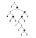

# Haskell函数式编程

## 参考

Programming in Haskell Second Edition. Graham Hutton, 2016

https://www.haskell.org/documentation/

纯靠个人归纳理解，可能有理解错误或理解未到位的地方

> Haskell发展较快。有些内容，尤其是附加库如数据类型定义等可能会过时，学习时注意结合实际操作

## 目录

+ [**1**](#1-haskell简介以及使用方法) Haskell简介以及使用方法
    + [**1.1**](#11-安装) 安装
    + [**1.2**](#12-基本使用) 基本使用
        + [**1.2.1**](#121-编译器模式) 编译器模式
        + [**1.2.2**](#122-交互模式) 交互模式
+ [**2**](#2-语法) 语法
    + [**2.1**](#21-简单实例) 简单实例
        + [**2.1.1**](#211-求和) 求和
        + [**2.1.2**](#212-快排) 快排
    + [**2.2**](#22-基本概念) 基本概念
        + [**2.2.1**](#221-格式要求) 格式要求
        + [**2.2.2**](#222-程序结构层次) 程序结构（层次）
        + [**2.2.3**](#223-命名要求以及命名空间) 命名要求以及命名空间
        + [**2.2.4**](#224-关键字) 关键字
        + [**2.2.5**](#225-字面量格式) 字面量格式
    + [**2.3**](#23-类型系统) 类型系统
        + [**2.3.1**](#231-类型的基本概念) 类型的基本概念
        + [**2.3.2**](#232-列表和元组) 列表和元组
        + [**2.3.3**](#233-type) type
        + [**2.3.4**](#234-class) class
        + [**2.3.5**](#235-函数类型) 函数类型
        + [**2.3.6**](#236-curried-functions) Curried Functions
        + [**2.3.7**](#237-多态类型polymorphic-types) 多态类型（Polymorphic Types）
        + [**2.3.8**](#238-重载类型overloaded-types) 重载类型（Overloaded Types）
        + [**2.3.9**](#239-代码示例) 代码示例
    + [**2.4**](#24-函数定义) 函数定义
        + [**2.4.1**](#241-函数定义基本格式) 函数定义基本格式
        + [**2.4.2**](#242-条件表达式if-then-else) 条件表达式：if-then-else
        + [**2.4.3**](#243-条件表达式case) 条件表达式：case
        + [**2.4.4**](#244-条件表达式guarded-equations) 条件表达式：guarded-equations
        + [**2.4.5**](#245-模式匹配) 模式匹配
        + [**2.4.6**](#246-lambda表达式) Lambda表达式
        + [**2.4.7**](#247-操作符) 操作符
    + [**2.5**](#25-list-comprehensions) List Comprehensions
        + [**2.5.1**](#251-基本概念) 基本概念
        + [**2.5.2**](#252-guards) Guards
        + [**2.5.3**](#253-zip函数) zip函数
        + [**2.5.4**](#254-string-comprehension) String comprehension
    + [**2.6**](#26-函数递归recursive-functions) 函数递归（Recursive Functions）
        + [**2.6.1**](#261-递归基本概念) 递归基本概念
        + [**2.6.2**](#262-列表递归list) 列表递归（List）
        + [**2.6.3**](#263-多参数) 多参数
        + [**2.6.4**](#264-多递归) 多递归
        + [**2.6.5**](#265-互递归) 互递归
        + [**2.6.6**](#266-基本设计步骤) 基本设计步骤
    + [**2.7**](#27-higher-order-functions) Higher-order Functions
        + [**2.7.1**](#271-高阶函数基本概念) 高阶函数基本概念
        + [**2.7.2**](#272-处理lists) 处理Lists
        + [**2.7.3**](#273-foldr函数) foldr函数
        + [**2.7.4**](#274-foldl函数) foldl函数
        + [**2.7.5**](#275-组合操作) 组合操作
    + [**2.8**](#28-类型声明) 类型声明
        + [**2.8.1**](#281-type声明) type声明
        + [**2.8.2**](#282-data声明) data声明
        + [**2.8.3**](#283-newtype声明) newtype声明
        + [**2.8.4**](#284-递归type) 递归type
        + [**2.8.5**](#285-class与实例声明) class与实例声明
+ [**3**](#3-进阶) 进阶
    + [**3.1**](#31-交互设计) 交互设计
    + [**3.2**](#32-monads) Monads
    + [**3.3**](#33-monadic-parsing) Monadic parsing
    + [**3.4**](#34-foldables-and-friends) Foldables and friends
    + [**3.5**](#35-深入探究lazy-evaluation) 深入探究：Lazy evaluation
+ [**4**](#4-prelude) Prelude
+ [**5**](#5-补充) 补充
    + [**5.1**](#51-lambda-calculus浅析) Lambda Calculus浅析
        + [**5.1.1**](#511-apply操作) Apply操作
        + [**5.1.2**](#512-lambda) Lambda
        + [**5.1.3**](#513-语法树构建) 语法树构建
        + [**5.1.4**](#514-free-variables自由变量) Free variables：自由变量
        + [**5.1.5**](#515-reduction) Reduction
        + [**5.1.6**](#516-y-combinator) Y-Combinator

## 1 Haskell简介以及使用方法

## 1.1 安装

仓库在 https://gitlab.haskell.org/ghc/ghc

目前最为常用的编译器是`ghc`，诞生于`University of Glasgow`。ArchLinux下通过以下命令安装

```shell
sudo pacman -S ghc
```

## 1.2 基本使用

### 1.2.1 编译器模式

生成可执行文件

```shell
ghc -dynamic -o main main.hs # Arch下默认配置需要使用动态链接
```

> 可以添加`-fglasgow-exts`使能扩展，否则仅兼容`Haskell 98`

### 1.2.2 交互模式

```shell
ghci # ghc --interactive
```

> 交互模式下使用命令`:q`退出，命令`:?`获取帮助

## 2 语法

## 2.1 简单实例

在正式讲解之前，先看几个实例，对`Haskell`代码形成一个初步理解

### 2.1.1 求和

```haskell
-- main.hs
 
module Main where -- 定义Main模块
import System.Environment -- 引用模块

main :: IO () -- 显式函数类型声明。函数`main`为类型`IO ()`

sumMe :: Num a => [a] -> a -- 显式函数类型声明。箭头`->`表示sumMe是一个函数。该函数输入一个元素类型为`Num`的列表`[a]`作为参数，返回一个类型为`Num`的数字`a`

testList :: Num a => [a] -- 显式列表类型声明

-- 到以上为止的代码在这个程序里面可以省略，编译器会自动推断

sumMe [] = 0 -- 接受空列表时的特殊情况
sumMe (x:xs) = x + sumMe xs -- `(x:xs)`表示将输入的列表分为第1个元素`x`以及后续元素列表`xs`。Haskell中`:`运算符表示将一个元素连接到列表开头
testList = [2,1,3,8]
main = print(show(sumMe testList)) -- 最终输出结果14。通常情况下Haskell中函数参数可以不加括号，但是遇到多个函数嵌套调用的时候为区分所以要加括号
```

### 2.1.2 快排

```haskell
-- main.hs
-- 只需5行代码的快排。省略了模块以及函数定义

qsortMe [] = []
qsortMe (x:xs) = qsortMe smallList ++ [x] ++ qsortMe bigList -- `++`运算符表示连接两个列表
    where -- `where`关键字用于描述本地的符号定义
        smallList = [a | a <- xs, a <= x] -- `|`运算符和数学语言相同，这种语句被称为List comprehension，是Haskell中强大的语法糖。在该上下文中，`<-`用于将右侧列表中的元素依次复制给左边的符号或表达式。`<=`为小于等于符
        bigList = [b | b <- xs, b > x]

main = print(show(qsortMe [1782,2,109805,7336096,6509,143]))
```

## 2.2 基本概念

`Haskell`中函数是一等公民。函数名可以作为其他函数的参数输入，其优先级也要高于例如`+ - * / ^ !! ++ /= == < > >= <=`等运算符。这和目前大部分语言不同

`Haskell`中的**函数只有一个返回值，且不同的返回值必须为同一类型**（例如`Bool`类型的`True`和`False`）。所以如果想要返回多个变量，就需要使用元组`()`或列表`[]`

`Haskell`一大特性就是规避了`side effects`。广义上讲，`Haskell`认为一个函数只要对外界产生影响（例如在终端输出，或读写一个全局内存，或依赖于输入参数以外的数据产生返回结果，或更改了输入的参数），那它就有`side effects`。如果一个函数功能仅依赖于参数输入，且只产生返回结果，那么它就是`pure`的。`Haskell`隔离了一般的函数与外界打交道的功能

`Haskell`同样不会改变输入的参数。例如使用变量`a`作为函数`f`的输入，多次相同的调用只会得到相同的结果

> `Haskell`中没有循环，所有需要循环迭代实现的算法需要使用函数嵌套以及递归实现

注：除示例以外可以先跳过

### 2.2.1 格式要求

`Haskell`是大小写敏感语言，且代码对于每一行开头的空格敏感

`Haskell`中单行注释使用`--`格式如下

```haskell
comment = 1.223 -- An ordinary comment
```

多行注释使用`{-` `-}`格式如下

```haskell
{-
 -
 - Nested comment
 - that extends over multiple lines
 -
 -}
```

### 2.2.2 程序结构（层次）

`Haskell`和`C`较为类似，在大型工程中也是以模块`module`为基本单元，最终链接到一起的。`Haskell`源文件使用以下格式定义该文件所属模块，例如`Main`模块

```haskell
module Main
```

在`module`的下一层就是声明`declaration`，一般会定义常量，`datatype`，`type class`以及`fixity information`

`declaration`的下一层是表达式`expressions`。函数式编程中每个表达式都是一个变量`value`，且类型为静态`static`

### 2.2.3 命名要求以及命名空间

`Haskell`中有**6种**符号名称。变量`variables`以及构造体`constructors`都是属于变量；`type variables`，`type constructors`以及`type classes`和类型系统有关；`module names`表示大型工程中一个模块的名称

`Haskell`**要求所有变量名**（包括`variables`以及`type variables`）**都以小写字母或下划线**`_`**开头，而其他所有名称**（包括模块名以及类型名等）**以大写字母开头**

> `Haskell`中下划线`_`作为小写字母看待。但是以`_`开头的变量名有特殊含义，一般用于命名没有使用到的参数，不常用

### 2.2.4 关键字

`Haskell`拥有以下保留关键字，作用会在之后讲解

| 关键字 | 目录 |
| :-: | :-: |
| `case` |  |
| `class` |  |
| `data` |  |
| `default` |  |
| `deriving` |  |
| `do` |  |
| `else` |  |
| `foreign` |  |
| `if` |  |
| `import` |  |
| `in` |  |
| `infix` |  |
| `infixl` |  |
| `infixr` |  |
| `instance` |  |
| `let` |  |
| `module` |  |
| `newtype` |  |
| `of` |  |
| `then` |  |
| `type` |  |
| `where` |  |
| `_` |  |

此外还有以下保留运算符

> 注意其他运算符如`+ - * ^ ++ !! /= == >= <= > <`等本质是函数，在库中定义，不属于语言本身的特性，所以不在以下列表出现

| 运算符 | 目录 |
| :-: | :-: |
| `..` | [2.3.2](#232-列表和元组) |
| `:` |  |
| `::` | [2.3.1](#231-类型的基本概念) |
| `=` | [2.4.1](#241-函数定义基本格式) |
| `\` | [2.4.6](#246-lambda表达式) |
| `\|` | [2.4.4](#244-条件表达式guarded-equations) |
| `<-` |  |
| `->` | [2.3.5](#235-函数类型) [2.4.3](#243-条件表达式case) [2.4.6](#246-lambda表达式) |
| `@` |  |
| `~` |  |
| `=>` | [2.3.8](#238-重载类型overloaded-types) |

### 2.2.5 字面量格式

数字格式和`C`基本一致

```haskell
a = 15 -- Decimal
b = 0o172 -- Octal
c = 0x312d1f -- Hexadecimal
d = -23.00 -- Float
e = 2.3e-6 -- Float
```

字符以及字符串如下

```haskell
a = 'c' -- Char
b = "Texas" -- String
c = '\ACK' -- ASCII
d = '\x37' -- ASCII
e = '\r' -- Escape
f = "Multiple \
\Lines" -- String
```

## 2.3 类型系统

`Haskell`虽然可以算静态语言，但是它的类型系统支持自动的类型推导，可以不对数据类型进行显式的声明。这和一些传统的静态语言是不同的

类型系统很重要。建议先熟悉类型系统再进行后续的学习

### 2.3.1 类型的基本概念

`Haskell`中**使用双冒号运算符**`::`**进行显式的类型指定**

`Haskell`中的**类型系统**分为**两层**，分别对应保留关键字中的`class`以及`type`。上层的是`class`（也可以说是`typeclass`），它是一系列`type`的集合。而`type`是一系列**相关的值**的集合（划重点）

> 以`Int`为例，在`ghc`中该`type`为64bit（8Byte）长度的整型数据，代表 $ -2^{63} $ 到 $ 2^{63} - 1 $ 的一系列二进制整数的集合。同时`Int`又属于`Num`，`Integral`，`Eq`，`Ord`，`Show`以及`Read`等基本`class`。`class`和`type`是**多对多**的关系

`class`是较为**高层、抽象**的，它一般会规定`type`支持的运算操作等，例如比较大小，加减运算等。而`type`是较为**底层、具象**的，它决定了最终的字面值集合，也会**重载**（`overload`）`class`定义的抽象操作，对这些操作进行具体的定义。`class`作用类似于模板

在`Haskell`中万物皆表达式（`expressions`），且程序中每一个表达式都拥有自己的类型`type`或`class`（`class`最终会被解析为具体的`type`）。包括**字面量**（例如`Bool`类型的字面量`False`，其本身就是一个表达式），**函数定义**等

> 每一个表达式的`type`会在该表达式被解析之前就被确定，这个过程称为`type inference`。正是因为事先检查并确定了`type`，`Haskell`可以提前发现`type`的不对应错误。所以说`Haskell`程序是**类型安全**（`type safe`）的
>
> 但是`Haskell`的这种特性并不会解决例如`Divide by zero`这样的错误。这样的错误只有到表达式被解析时才会被发现

`ghci`中触发`Divide by zero`异常示例：

```
ghci> div (134 :: Int) (0 :: Int)
*** Exception: divide by zero
```

### 2.3.2 列表和元组

**列表**`List`和**元组**`Tuple`是`Haskell`中两种基本的复合数据类型，分别使用`[]`以及`()`表示，元素之间使用`,`隔开。函数同样可以使用它们作为参数输入或输出

`List`可以使用下标引用其中的元素（运算符`!!`，下标`0`起始，示例 `[1,1,2,3,5,8] !! 4` 返回`5`），其中所有数据类型必须一致，不同长度`List`算作相同类型。可以定义无限长度的`List`。且`List`本身不会包含自身的长度信息，这点和C中的数组较为类似，长度需要通过特殊设计的函数获得

可以使用`..`运算符表示连续序列

```haskell
emptyList = []
intList1 = [35, 14, 27, 308]
intList2 = [15..18] -- [15, 16, 17, 18]
charList1 = ['U', 't', 'a', 'h'] -- charList1类型为[Char]
charList2 = "Utah" -- charList2类型为String，与[Char]等价
charList3 = ['W'..'Z'] -- ASCII ['W', 'X', 'Y', 'Z']
stringList = ["Alaska", "San Francisco", "Ohio", "New Jersey"]
```

此外，`List`的常用运算符还有`:`，表示将一个元素连接到`List`开头

```haskell
1 : [3, 2, 5] -- 该表达式返回[1, 3, 2, 5]
```

在之后的内容中我们会遇到很多`:`的应用，例如用于函数的输入参数中，用于分隔`List`的开头1个元素以及后续元素组成的列表

```haskell
myTail :: [a] -> [a]
myTail (x:xs) = xs -- 去除List的开头元素后返回，这里的括号不是表示元组，只是将`x:xs`括起来而已
```

`Tuple`不能使用下标，其中数据类型可以不同，包含了不同类型数据、不同长度的`Tuple`算作不同类型。`Tuple`是有限长度的，且长度（这里称为`arity`）不能为`1`，例如`(False)`就是非法的。**因为**`()`**圆括号兼具调整表达式解析次序的功能**，如果一个元组的`arity`为`1`那么将会产生冲突

```haskell
emptyTuple = ()
pairTuple = ("Helsinki", 97)
tripleTuple = (True, 19.584, [1, 5, 3])
```

> 习惯上将`arity`为`2`的称为`Pair`，`arity`为`3`的称为`Triple`，依次类推

### 2.3.3 type

`Haskell`定义了以下常用的基本数据`type`

| 名称 | 类型 | 字面值 |
| :-: | :-: | :-: |
| `Bool` | 布尔 | `True`或`False` |
| `Char` | Unicode字符（兼容ASCII） | 使用`''`括起来的任意单字符 |
| `String` | Unicode字符串`[Char]` | 使用`""`括起来的任意字符串，包含空串 |
| `Int` | 二进制整型 | `-2^63`到`2^63-1`的任意整数 |
| `Integer` | 无限精度整形 | 任意整数（使用高精度算法） |
| `Float` | 二进制单精度浮点 | IEEE754 |
| `Double` | 二进制双精度浮点 | IEEE754 |

### 2.3.4 class

`class`会规定在`type`中被重载的操作，称为`methods`

`class`并不是最小的类型划分单位，最小的划分单位为`type`

涉及到某类`class`的函数声明通常需要使用`class constraint`以及重载类型（关键符号`=>`），见[2.3.8](#238-重载类型overloaded-types)

`Haskell`定义了以下常用的基本数据`class`

| 名称 | 类型 | 包含的运算操作（函数） | 包含的type |
| :-: | :-: | :-: | :-: |
| `Eq` | `equality types`，可以比较是否相等的类型 | `==` `/=`，返回`Bool` | `Bool Char String Int Integer Float Double` 以及 `List` `Tuple` |
| `Ord` | `ordered types`，属于`Eq`同时有顺序可以比较大小的类型 | `>` `<` `>=` `<=` 返回 `Bool`， `min` `max` 返回对应最小最大元素 | 同上 |
| `Show` | `showable types`，可以转换为字符串显示的类型 | `show :: Show a => a -> String` | 同上 |
| `Read` | `readable types`，可以从字符串转换来的类型 | `read :: Read a => String -> a` | 同上 |
| `Num` | `numberic types`，数字 | `(+) (-) (*)`算术运算，`negate`取负，`abs`绝对值，`signum`符号（正`1`，负`-1`） | `Int Integer Float Double` |
| `Integral` | `integral types`，整型 | `div`除法，`mod`模（余） | `Int Integer` |
| `Fractional` | `fractional types`，非整型 | `(/)`除法，`recip`倒数 | `Float Double` |

> 一定注意`Integer`（`type`）和`Integral`（`class`）的区分。单词Integer为名词，Integral为形容词
>
> `Ord`的一个反例就是，我们定义一个名为`Fruit`的`type`，其中包含`Apple Pear Peach`几个字面值，我们认为这些字面值无法比较大小所以也就不能将`Fruit`归入`Ord`。但是`Fruit`可以归入`Eq`
>
> `Ord`中，`Bool`类型规定`True > False`，`True >= False`为真。而字符大小遵循`ASCII`顺序
>
> 可以使用`read "123" :: Float`强制`read`转换为指定`type`（通常不需要，编译器会自动推断）
>
> 要注意负数作为函数的参数输入时一定要加括号，如`abs (-13)`。不加括号`Haskell`会将其解析为`(-)`减运算，会变成`abs - 13`

### 2.3.5 函数类型

函数有两个数据要素，一个是输入参数，一个是返回

`Haskell`函数中输入参数和返回也可以是函数

函数的类型声明中一定会有`->`符号，符号前面放置输入的参数类型，后面放置返回的类型

```haskell
-- myFunc1接受1个Int参数，返回Bool类型变量
myFunc1 :: Int -> Bool

-- myFunc2接受1个Float列表，返回Int列表
myFunc2 :: [Float] -> [Int]

-- myFunc3可以接受类似myFunc1的函数作为输入，返回Bool类型变量
myFunc3 :: (Int -> Bool) -> Bool
```

### 2.3.6 Curried Functions

所谓高阶函数就是拥有多个输入参数的函数。这些函数可以看成是逐个提取输入参数，并依次返回一个部分符号被替换后的函数。可以观察以下示例

```haskell
triMult :: Int -> Int -> Int -> Int
triMult x y z = x*y*z
```

等价于

```haskell
triMult :: Int -> (Int -> (Int -> Int))
triMult x y z = x*y*z
```

> `Haskell`中的所有函数事实上都可以看作[Lambda表达式](#246-lambda表达式)。`Haskell`会将语法树最终按照`Lambda`来处理
>
> 以上的代码将`x y z`三个变量相乘后返回。类型`Int -> (Int -> (Int -> Int))`可以这样理解：函数`triMult`接受一个`Int`类型的变量`x=4`(假设)后返回一个`Int -> (Int -> Int)`类型的函数，表达式为`4*y*z`；该函数接受`y=5`后再返回一个`Int -> Int`类型的函数，表达式为`4*5*z`，依次类推

可以理解为**依次将已知的输入参数注入到函数表达式后将函数以及表达式本身返回**。在Lambda表达式中，未被注入的符号我们称之为`Free Variable`

也是由于**自由变量**特性，我们在调用一个函数时可以不传入每一个参数。如此调用函数将会返回一个已知参数变量被替换的匿名函数，而不是函数最终的执行结果

> 上述代码示例中，`triMult x y z`可以添加括号成为`(((triMult x) y) z)`（左相联）。如果我们调用`triMult 13 2`，那么我们将会得到一个匿名函数`\z -> 13*2*z`（为这个Lambda表达式起一个函数名`func`，`func z = 13*2*z`）

### 2.3.7 多态类型（Polymorphic Types）

很多复合数据类型如`List`和`Tuple`的操作是通用的（例如计算它的长度`length`函数），但是我们无法精确的在类型声明中表述该`List`中元素的类型`type`。由此我们使用一个`type variable`来进行函数的类型声明，格式示例如下

```haskell
-- 取一个List的头
head :: [a] -> a

-- 取Pair中第一个元素
fst :: (a, b) -> a

-- 计算长度
length :: Foldable t => t a -> Int
```

> 这里的`a`相当于一个我们给`List`中元素的`type`定义的变量，它可以是`Int Integer String Float Bool`等具体的`type`

### 2.3.8 重载类型（Overloaded Types）

和多态类型适用于所有`class`不同，我们在设计某类`class`适用的函数时，需要使用**类型限制**`class constraints`，将函数声明为**重载类型**`overloaded types`，典型的如`(+)`加法运算

```haskell
-- 加法
(+) :: Num a => a -> a -> a
```

> 加法需要将两个相同类型的数字`Num`相加，返回一个同样类型的`Num`。这里的`a`同样是`type variable`。`class constraints`就是示例中的`Num a`。我们在定义重载类型时就使用`Class a`的格式进行类型限制。而以上这个`type`定义本身就是一个`overloaded type`

出现`class constraints`的地方就会出现运算符`=>`

```haskell
myFunc1 :: Class a => a -> a -> a
myFunc2 :: (Class1 a, Class2 b) => a -> b -> a
```

### 2.3.9 代码示例

以下为一些变量的显式类型声明示例

`type`

```haskell
myVar :: Int
myList :: [Int]
myTuple :: (Int, Int, Bool)
```

`class`

```haskell
myVar :: Fractional p => p
myList :: Integral p => [p]
myTuple :: (Integral a, Num b) => (a, b, Int, Bool)
```

以下为一些函数的显式类型声明示例。注意，只要是出现了运算符`->`（**用于顺序连接各个输入参数类型名以及唯一的返回结果类型名**），就表示该声明为一个函数类型声明

`type`

```haskell
-- 输入1个Int型变量，返回1个Int型结果
myFunc1 :: Int -> Int

-- 输入2个参数，1个Int型List，1个Int型变量，返回1个Int型结果
myFunc2 :: [Int] -> Int -> Int

-- Haskell中一个函数可以作为另一个函数的输入参数
-- 输入2个参数。例如myFunc3之后接受myFunc1作为函数参数，外加一个Int型变量。返回一个Bool型结果
-- myFunc1的type为(Int -> Int)
myFunc3 :: (Int -> Int) -> Int -> Bool

myFunc4 :: [a] -> a
```

`class`

```haskell
myFunc1 :: Num a => [a] -> Int -> Bool

myFunc2 :: (Integral a, Fractional b) => a -> b -> Bool
```

我们可以在`ghci`进行以下尝试对默认的字面数据类型进行大致的理解（使用`:t`命令查询一个表达式的类型）：

示例1，默认声明为`Num`（`class`）

```
ghci> myIntNum = 1987
ghci> :t myIntNum 
myIntNum :: Num p => p
```

示例2，括号可以省略，显式声明为`Int`（`type`）

```
ghci> myIntNum = (1987 :: Int)
ghci> :t myIntNum 
myIntNum :: Int
```

示例3，显式声明为`Integer`（`type`）

```
ghci> myIntNum = 1987 :: Integer
ghci> :t myIntNum 
myIntNum :: Integer
```

示例4，显式声明为`Integral`（`class`）（注意和`Integer`进行区分）

```
ghci> myIntNum = 1987 :: Integral p => p
ghci> :t myIntNum 
myIntNum :: Integral p => p
```

示例5，显式声明为`Fractional`（`class`）。显示时以小数形式

```
ghci> myIntNum = 1987 :: Fractional p => p
ghci> :t myIntNum 
myIntNum :: Fractional p => p
ghci> myIntNum 
1987.0
```

示例6，默认声明为`Fractional`（`class`）(从该示例开始常量为小数`1987.875`)

```
ghci> myFloatNum = 1987.875
ghci> :t myFloatNum 
myFloatNum :: Fractional p => p
```

示例7，显式声明为`Double`（`type`）

```
ghci> myFloatNum = 1987.875 :: Double
ghci> :t myFloatNum 
myFloatNum :: Double
```

示例8，报错

```
ghci> myFloatNum = 1987.875 :: Integral p => p

<interactive>:41:15: error:
    • Could not deduce (Fractional p1)
    ...
```

示例9，报错

```
ghci> myFloatNum = 1987.875 :: Num p => p

<interactive>:47:15: error:
    • Could not deduce (Fractional p1)
    ...
```

## 2.4 函数定义

不是[函数类型声明](#235-函数类型)

### 2.4.1 函数定义基本格式

函数本质由**输入参数**以及**函数体表达式**组成，函数只产生一个返回。函数的输入参数以及返回可以是**函数或普通变量（包括列表和元组）**。如果想要返回多个元素只能使用元组`()`或列表`[]`

函数的定义中，**输入参数**和**函数体表达式**之间使用`=`隔开

```haskell
myFunc1 :: Integral a => a -> a -> a
myFunc1 x y = x `div` y
```

```haskell
myFunc2 :: Int -> Int -> Int
myFunc2 x y = x + y
```

同一个函数可以有多条定义语句对应，可以定义不同输入情况下的不同输出。这实际上是`case`语句的语法糖，**需要注意判断条件有顺序要求**，见[2.4.3](#243-条件表达式case)

```haskell
myFunc3 [] = []
myFunc3 (x:xs) = xs
```

可以使用`do`语句块规定该函数被调用时需要执行的多个语句，这些语句会依次执行

```haskell
myAction x = do
    inputNum <- getLine
    putStrLn "Got it"
```

### 2.4.2 条件表达式：if-then-else

`Haskell`中函数体表达式支持和其他语言类似的`if else`语句，区别是`Haskell`要求`else`分支**不可省略**

```haskell
myAbs :: Int -> Int
myAbs n = if n > 0 then n else (-n)
```

可以嵌套。和其他表达式一样，`if else`语句也可以放在括号内

```haskell
myFunc x = if x > 0 then x else
            if x == 0 then 1 else -x 
```

### 2.4.3 条件表达式：case

`Haskell`中有类似C中的`switch`结构，就是`case`语句（不是`switch`）。和C的`switch`语句只能使用非复合变量作为判断依据不同，由于`Haskell`中万物皆表达式，`case`同样可以输入表达式。语句中每一行都是真值以及对应的返回值（返回语句），两者使用`->`隔开。`Haskell`的`case`语句不存在`break`的概念，而是和`if else`一样，**然而如果各条件之间有包含或交集关系，需要将范围较小或我们偏好的匹配条目放在前面**。如下例中匹配条件`_`事实上包含了`14`与`15`，依照程序本意需要放在最后

```haskell
myFunc x = case (x - 1) of
    14 -> x - 1
    15 -> 0
    _ -> 2
```

> `Haskell`的`case`语句可以看作就是嵌套`if else`的变种，程序会依次匹配。而以C为代表的一些较贴近底层的语言中，`switch`语句和嵌套`if else`并不是等价的，C的`switch`基于跳转表，它只能接受非复合变量为判断跳转依据，且大部分已有的ISA都为C的`switch`语句提供专用的指令支持，如ARM的`TBB`和`TBH`指令。因此C的`switch`在遇到较多分支时可以达到优于嵌套`if else`的平均表现。也是因为非复式变量的原子性，C中的`switch`语句除`default`以外其余`case`条件不会出现交集

### 2.4.4 条件表达式：guarded-equations

另一种条件格式，使用`|`分隔。本质和`case`与`if else`是相同的，更易阅读。`otherwise`用于匹配所有的其他情况，**放在最后**

```haskell
myAbs x | x >= 0    = x
        | otherwise = -x
```

### 2.4.5 模式匹配

上面我们讲述过`Haskell`中同一函数的多条定义语句，用以针对不同的输入，此时我们就需要针对所有可能的输入进行处理，防止程序异常。但是有些特定情况下，函数的输入输出对应关系无法使用一个或数个特定表达式表述，只能使用逐个列举的方法，这有可能会非常繁琐。由此`Haskell`定义了通配符`_`，用以匹配同一`type`的任意值。例如逻辑与函数`(&&)`可以使用如下定义：

```haskell
(&&) :: Bool -> Bool -> Bool
True && True    = True
_    && _       = False
```

实际上在库中`(&&)`是如下定义的：

```haskell
True  && b  = b
False && _  = False
```

> 以上使用了变量`b`。然而`Haskell`不允许一个变量在函数的参数列表中多次出现。遇到这种情况只能使用前面讲述的条件语句

在`Tuple`中使用通配符`_`，传入函数的元组必须有对应的长度，例如`fst`以及`snd`的定义。**我们可以将不想要（不会在函数体表达式中出现）的输入参数写成**`_`

```haskell
fst :: (a,b) -> a
snd :: (a,b) -> b

fst (x,_) = x
snd (_,y) = y
```

也可以在`List`中使用`_`，结合构造符`:`可以有许多巧妙的应用

```haskell
-- 判断是否为长度为3且以字符'a'开头的字符串
myFunc1 ['a',_,_] = True
myFunc1 _ = False

-- 判断是否为'a'开头的字符串
myFunc2 ('a':_) = True
myFunc2 _ = False

-- 取List头
myHead (x:_) = x -- 写成(x:xs)作用是一样的
```

### 2.4.6 Lambda表达式

`Haskell`将函数和数据（变量）同等看待。Lambda表达式即**匿名函数**，是`Haskell`的核心，本质和函数相同，都是数据处理方式的表达。它具备函数的参数输入以及函数体，但是没有名字。事实上`Haskell`中所有的函数最终都会转换到Lambda表达式的语法树处理方法。处理Lambda表达式的理论都属于Lambda Calculus，美国逻辑学家Haskell Brooks Curry（1900-1982）对这个领域作出了突出贡献，这也是`Haskell`名称的由来。之前的[Curried Functions](#236-curried-functions)（~~咖喱函数~~）概念也是起源于此

`Haskell`中使用反斜杠`\`代替希腊字母$ \lambda $，示例如下

```
\x -> x * 2
```

单独的Lambda表达式无意义，以上写法在程序中不被允许

和有名函数一样，调用Lambda表达式的实参写在表达式后，使用空格` `分隔

> Lambda表达式的用法有多种形式：
>
> 直接将Lambda表达式写到其他有名函数体中
>
> 或者什么也不添加，直接为该表达式起一个函数名，之后该函数名可以作为其他函数的参数传入
>
> 将Lambda表达式应用（apply）到输入变量上，返回一个数据结果后赋一个变量名
>
> ...

简单示例

```haskell
-- 3^2，myVar1等于9
myVar1 = (\x -> x ^ 2) 3

-- 2^6，myVar2等于64。->右结合，里层的括号可以不加，但是外层括号必须加
myVar2 = (\x -> (\y -> x ^ y)) 2 6

-- myFunc1将两个输入相加后返回
-- 相当于 myFunc1 x y = x + y
myFunc1 = \x -> \y -> x + y
-- 结果等于9
myVar3  = myFunc1 5 4

-- myFunc2将输入加4
-- 相当于 myFunc2 a = (\x -> \y -> x + y) 4 a
myFunc2 = (\x -> \y -> x + y) 4
-- 结果等于11
myVar4  = myFunc2 7 

-- myFunc3输入x，返回2^x。这里由于x属于最外层Lambda的输入，x可以省略
myFunc3 x = (\a -> \b -> a ^ b) 2 x

-- Lambda中符号的作用域仅限于表达式内且独立。myFunc3和myFunc4相同，myFunc4传入的参数x和Lambda表达式中的x不是同一个，不会冲突
myFunc4 x = (\x -> \y -> x ^ y) 2 x

-- 甚至可以将一个表达式应用到另一个表达式上面，因为Haskell中数据和函数两者地位相同
-- myFunc5相当于myFunc5 a = 2 ^ (a + 1)，这里的a属于内层Lambda输入，不能省略
myFunc5 a = (\x -> \y -> x ^ y) 2 ((\x -> x + 1) a)

-- 也可以应用函数名，abc不可省略
myFunc6 a b c = (\x -> \y -> x ^ y) (myFunc1 a b) ((\x -> x + 1) c)
-- 结果(-3 + 5) ^ (4 + 1) = 32
myVar5 = myFunc6 (-3) 5 4
```

> 这里再次回到`Haskell`中函数本质的理解方法
>
> 在`Haskell`中我们调用一个函数`a`向它传参（显式定义的有名函数或Lambda表达式都可以，但是`a`**必须是函数**。其实显式定义的有名函数最终也可以转化为匿名函数处理），就相当于将一个函数体`f`或数据`d`**注入**（也可以理解为**替换**）到这个函数`a`里面，之后将注入后的运算结果或函数体返回，这个过程的官方称呼就是**应用**（`apply`），也即我们将函数`a`应用到函数`f`或数据`d`

关于Lambda Calculus的更多内容可以参见[5.1](#51-lambda-calculus浅析)

### 2.4.7 操作符

## 2.5 List Comprehensions

### 2.5.1 基本概念

### 2.5.2 Guards

### 2.5.3 zip函数

### 2.5.4 String comprehension

## 2.6 函数递归（Recursive Functions）

### 2.6.1 递归基本概念

### 2.6.2 列表递归（List）

### 2.6.3 多参数

### 2.6.4 多递归

### 2.6.5 互递归

### 2.6.6 基本设计步骤

## 2.7 Higher-order Functions

### 2.7.1 高阶函数基本概念

### 2.7.2 处理Lists

### 2.7.3 foldr函数

### 2.7.4 foldl函数

### 2.7.5 组合操作

## 2.8 类型声明

### 2.8.1 type声明

### 2.8.2 data声明

### 2.8.3 newtype声明

### 2.8.4 递归type

### 2.8.5 class与实例声明

## 3 进阶

## 3.1 交互设计

## 3.2 Monads

## 3.3 Monadic parsing

## 3.4 Foldables and friends

## 3.5 深入探究：Lazy evaluation

## 4 Prelude

## 5 补充

## 5.1 Lambda Calculus浅析

我们讲到过`Haskell`中Lambda表达式的基本格式。下式相当于`3 * 2`

```
\a -> (a * 2) 3
```

本小节我们规定为以下格式，`apply`依然为空格，将`->`替换为`.`，`\`依然代表$ \lambda $，表示`binder`绑定操作

```
\a.(a*2) 3
```

### 5.1.1 Apply操作

在Lambda表达式中`apply`操作的运算符就是一个空格` `，写作`a f`或`a d`，且`apply`操作是左相联的。`a b c`等于`((a b) c)`而不是`(a (b c))`。`apply`操作的本质就是将` `运算符后面的函数或数据带入到前面的函数中（这里的函数是匿名函数也即Lambda表达式）

在实际应用中，我们一般认为`apply`表达式中左侧的符号是一个函数，右侧符号（即被`apply`的符号）可以是函数或变量，例如`a (b c)`中，`a`和`b`一般是一个函数名，而`c`是一个数据。我们可以将一个函数`apply`到另一个函数或数据上，而将一个数据`apply`到其他函数或数据上是无意义的

### 5.1.2 Lambda

`\`即绑定符`binder`，后面紧接匿名函数的形参（即`bound variable`），如`\x`，这个形参`x`的作用域局限于该匿名函数内。按照上面规定的格式，`\x`后面必定会接一个`.`，成为`\x.M`的形式

`\`操作的本意是将符号`x`规定为该表达式内需要替换的参数。所谓替换即`apply`

在Lambda表达式中基本的操作只有`bind`和`apply`两种，`apply`**优先级高于**`bind`。可以使用括号`()`规定运算顺序

完整的Lambda表达式简单示例：

```
\x.\y.x y x
```

相当于

```
\x.(\y.((x y) x))
```

运算顺序遵照括号层次

### 5.1.3 语法树构建

我们在这里引入一种Lambda表达式二叉语法树的构造方法，在语法树中我们将`apply`运算定义为分支节点`@`，其下左分支节点将会被`apply`到右分支节点；而`bind`运算定义为`\`。观察以下示例

```
\x.((\z.z x) ((\r.\s.s r) y f))
```

构建语法树结果



> `\`的左支永远都是叶子节点`bound variable`

### 5.1.4 Free variables：自由变量

所谓自由变量，就是在一个Lambda表达式中未被`bind`的变量。`Free variable`的存在往往意味着表达式的不完全替换，该表达式在被`apply`后返回的结果是一个表达式而不是最终的数据

示例

```
\x.\y.x x -- 无FV
\y.x x -- FV为x
\x.\x.x -- 无FV
```

我们使用 $FV(M)$ 表示表达式`M`的自由变量

### 5.1.5 Reduction

Reduction就是依照Lambda表达式定义的`apply`以及`bind`规则进行的一系列代入替换操作，准确来说是 $\beta -$ Reduction。而这种表达式的基本组合形式为`(\x.M) N`，称为 $\beta -$ Redex。如果两个表达式之间可以通过 $\beta -$ Reduction转换，那么就说它们之间是 $\beta -$ Equal的

> 此外还有 $\alpha -$ Equivalence等基础概念不再讲述

以上例

```
\x.((\z.z x) ((\r.\s.s r) y f))
```

Reduction步骤如下

```
-> \x.((\z.z x) ((\s.s y) f))
-> \x.((\z.z x) (f y))
-> \x.((f y) x)
-> \x.(f y x)
```

到语法树中，看到如下结构就表示可以进行1步Reduction替换。替换后产生新的类似结构需要继续进行处理。建议遍历替换操作依照从下层向上层，先右支后左枝的顺序


### 5.1.6 Y-Combinator

Y Combinator是一种解决Lambda表达式无法递归的方案。实际编程当中很少会涉及到Y Combinator

在讲Y Combinator之前先要引入一个Fixpoint的概念

离散数学学过代数系统中幺元的定义。Fixpoint的基本概念也较为类似：假设`f`为