# AVR单片机深入学习

基于Arduino，了解AVR单片机的底层工作原理，像学8051一样学习AVR，仅仅利用Arduino廉价且普及的硬件

## 参考资料

[Microchip AVR](https://www.microchip.com/en-us/products/microcontrollers-and-microprocessors/8-bit-mcus/avr-mcus)

[Microchip Developer](https://www.microchipdeveloper.com)

[Arduino资料文档](src/210702a01/)


## 0 Arduino硬件解析

由浅入深的硬件分析

## 0.1 Arduino硬件博物馆：各版本Arduino外观以及对比

### 0.1.1 Arduino UNO

UNO作为Arduino最经典的一款开发板，分为很多个版本，因为各种克隆版、授权代工、改良版等等实在太多了。

> 这里遵循TB商家的命名习惯做一些定义：
>
> **官方版**代指**所有遵循官方电路以及PCB设计生产的开发板**，这些开发板包括正版开发板（TB商家一般称为**原装进口正版**、**意大利官方英文版**等），国内授权代工版（目前已停产，一般称为**官方中文版**等），以及一些国内厂家根据官方网站提供的PCB文件生产的官方盗版（一般称为**官方版本**），这些开发板共同的特点就是usb电路部分都是使用一片正方形的ATmega16u2或8u2的单片机（需要下载固件），并且一般会印上Arduino的logo
>
> **改良版**代指**国内一些厂家由官方电路更改而来，重新自行设计PCB之后生产的开发板**（一般称为**改良版**或**改进版**）。这些改良版的共同特点是usb部分使用了南京沁恒的CH340芯片，是一个16脚长方形芯片，可以大大降低成本（ATmega16u2和ATmega328P一样是个完整功能的AVR单片机，价格较高）。而主控芯片一般使用贴片ATmega328P，也有少部分和官方版一样使用插槽安装直插式DIP芯片，并且一般不会打印Arduino的logo
>
> **克隆版**代指所有非官方工厂（包括官方代工）来源的开发板，包括了官方盗版以及改良版。现在新款的原装和代工版的PCB一般使用蓝绿色油墨

**官方版**

官方版UNO有新版UNO R3和旧版UNO两种，其中旧版已经非常少见。在Arduino中AVR单片机基本都是使用的16Mhz的晶振

新版UNO R3电路[查看](src/210702a01/Arduino_Uno_R3.pdf)

旧版UNO电路[查看](src/210702a01/Arduino_Uno.pdf)

官方新版与旧版电路区别主要在5V稳压芯片以及13脚的LED电路上

> 旧版5V稳压芯片采用一片MC33269D-5.0，这个5V三端稳压有两种不同的封装，所以图中画了两个，实际只安装一种封装的芯片
>
> 
> 
> 新版R3的5V稳压芯片采用一片AMS1117-5.0
>
> 
>
> 旧版13脚LED直接和328P的IO（PB5）相连，通过电阻限流
>
> 
>
> 新版R3的13脚LED利用了板载运放LM358中未使用的一个运放，作为一个跟随器用，利用运放输入高阻抗特性隔离LED负载，可以减小PB5口的电流负载，同时13脚理论阻值无穷大
>
> 
>
> 此外，新版相对于旧版在电源口部分添加了IOREF引脚，用于为扩展板提供参考IO电平

原装英文版（引自Arduino官网）


背面


> 进口的价格非常高，同样价格可以买一打克隆版了。当然土豪不差钱无所谓

官方中文版（自摄）


背面


> Arduino官方授权中国厂商代工。这块中文版前主人将其用于小车电机控制，由于未知原因导致16u2芯片固件异常无法烧录，而328P芯片已被取下转移至旧版UNO上使用。之后有修复教程，以及16u2的开发（事实上UNO没有328P也可以当开发板用，功能和之后提到的Leonardo类似，可以模拟键盘，但是可扩展性稍差）

官方盗版（自摄）


背面


> 陪伴我时间最长的一块开发板，从刚上高中用到现在。这些克隆版缺点就是焊接工艺较差，元器件歪斜，但是工作稳定性没什么区别

旧版官方盗版（自摄）


背面


> 捡到的板子。字体形状比较奇怪，应该是当时的厂商没有相应的字体文件。比新版少一些接口，usb是使用的ATmega8u2而非16u2，复位键在中间，三端稳压不一样，功能方面和新版R3基本相同

**改良版**

改良版电路[查看](src/210702a01/Uno_ch340.jpg)

> 改良版就是将原ATmega16u2部分换成较为廉价的CH340，并且使用\#DTR作为复位信号

改良版（自摄）


背面


### 0.1.2 Arduino Nano

和UNO一样，Nano也有多种。Nano事实上是缩小版的UNO，同样使用ATmega328P，区别在usb部分

**官方版**

原装英文版（引自Arduino官网）


官方盗版（自摄）


背面


> 官方版usb部分都采用FTDI的FT232RL

**改良版**

改良版（自摄）


背面


> 改良版usb部分使用CH340


### 0.1.3 Arduino Leonardo

Leonardo因为没有单独的usb电路，所以没有所谓改良版。主控采用ATmega32u4，封装可能不同。另有Arduino Micro，就是Leonardo的缩小版，它和Leonardo的关系类似于UNO和Nano的关系

官方版电路[查看](src/210702a01/Leonardo_R3.pdf)

**官方版**

原装英文版（引自Arduino官网）


背面


官方盗版（自摄）


背面


### 0.1.4 Arduino Mega 2560

Mega2560使用ATmega2560-16AU作为主控芯片，本质和328P差不多，IO较多，但是RAM大小基本是一样的。所以Mega2560使用的场合一般是3D打印机等，这些CNC设备一般要使用到大量的IO。而在信号处理等场合，限于Mega2560的内存大小，其应用十分有限（1024点FFT都难以实现）。有信号处理的需求一般还是使用32位ARM单片机

这里只给出官方图片

**官方版**

原装英文版（引自Arduino官网）


背面


### 0.1.5 Arduino DUE

Arduino DUE主控芯片为SAM3X8E，使用32位ARM Cortex-M3核心而非AVR，IO电平为3.3V，不属于常规AVR开发板，比起UNO、Mega 2560等传统Arduino，和STM32更加相近，这里仅展示其新旧两种版本

新版DUE电路[查看](src/210702a01/Arduino_Due_V2.pdf)

旧版DUE电路[查看](src/210702a01/Arduino_Due.pdf)

> DUE功耗较大，新版以及旧版使用的5V供电电路不同。旧版使用的是LM2734Y构建的分立DC-DC，有一个较大的黑色方形电感，缺点是容易啸叫。新版采用全集成式MPM3610

**官方版**

原装英文版（引自Arduino官网）


背面


> 原装进口一样也是很贵，一般要350左右，不差钱的可以考虑

旧版官方盗版（自摄）


背面


> 相比官方原版，没有安装RTC晶振（32.768kHz）。入手时全新50多米，比很多2560还便宜一些


## 0.2 Arduino电路结构解析

只给出UNO以及Leonardo两种开发板的电路分析，其他经典AVR衍生版基本同理

### 0.2.1 UNO

这里再放一下UNO R3的[pdf](src/210702a01/Arduino_Uno_R3.pdf)

> 官方版本的UNO事实上使用了两片AVR单片机，一片是直插式DIP28的ATmega328P，另一片是贴片TQFP32的ATmega16u2。ATmega16u2作为usb芯片拥有usb所需的电路模块，而其他方面较328P较弱。
>
> ATmega16u2相比328P拥有usb模块，而缺少了计数器/定时器2，I2C模块以及AD模数转换

**电源**


> 由上图分析。Arduino UNO支持从DC口以及USB供电，主要电路以及MCU全部使用5V供电，3.3V供电仅仅用于为LM358（作为比较器使用）提供参考电压（左上角），当然也可以通过3.3V接口向外设供电。通过DC供电时，设AMS1117输出5V正常，LP2985输出3.3V，那么只有当VIN大于6.6V时，MOS管FDN340P才会截止，此时完全使用1117的5V供电。如果此时VIN输入电压小于6.6V（或VIN未连接），此时MOS管导通，主要由USB供电
>
> 设置这个电路就是为了防止在同时连接VIN和USB时USB口电流倒灌损坏电脑
>
> 328P分为数字部分供电以及模拟部分供电，这里都使用5V，其中模拟部分AVCC输入串联一个10uH电感

**GPIO**


> UNO引出了328P所有的引脚。这些引脚可以做普通IO功能。其中，PC兼做AD输入以及I2C；PD包含了UART，外部中断，计数器输入以及比较器输入；PB包含了SPI
>
> UART通过1k电阻直接和16u2相连。AREF为ADC模拟参考电压输入，IOREF直连5V为扩展板提供IO参考电压。SPI另外引出到一个6pin接口ICSP，用于AVRISP烧录，一般用于烧录空芯片、修复BootLoader功能

**USB电路以及复位电路**


> USB部分以ATmega16u2为中心。16u2同样引出了专门的ISP接口可用于烧录固件，另外的4个引脚在ISP（ICSP1）接口旁边，一般不焊接排针。usb接口通过22欧电阻连接到16u2，16u2没有专门的复位按钮，只能通过ICSP1接口复位。16u2和328P一样使用了一个16MHz的晶振，封装不同。
>
> 16u2和328P之间有3条线连接，除UART之外（TX、RX指示灯使用16u2另外的GPIO），16u2的PD7还连接到了328P的**复位电路部分**，在通过usb下载程序时16u2会自动复位328P
>
> 通过观察可以发现，328P的复位引脚通过10k电阻上拉到5V，同时通过100nF电容连接到32u4的PD7，PD7通过1k电阻接地。
>
> 上电后，**16u2的PD7输出低电平**，328P的RESET脚为0V，之后10k电阻为100nF电容充电，\#RESET失效，328P开始工作。**下载时，16u2的PD7给出一个正脉冲即可实现328P的复位**。此时电容C5两端都为5V而被放电。在正脉冲的下降沿后，328P的RESET引脚瞬间又被拉低到0V，328P复位，之后328P内部的BootLoader进入到ISP模式，烧录开始


### 0.2.2 Leonardo

Leonardo R3的[pdf](src/210702a01/Leonardo_R3.pdf)

Leonardo只有一片ATmega32u4，基本相当于拥有了16u2和328P的功能，下载程序原理和UNO完全不同，32u4的BootLoader可以直接从usb读取并更新代码，同时32u4可以编程变为任意的usb设备（UNO的16u2也可以，但是由于IO很多未引出所以利用价值不大）。另外32u4支持JTAG

**电源**

Leonardo的电源部分和UNO基本相同，不再赘述

**GPIO**


> Leonardo除用于UART指示灯的IO之外引出了32u4其他所有的IO。除GPIO作用外，PF还包括了ADC输入以及JTAG功能；PD部分包含了4个外部中断，以及部分ADC输入，UART，I2C，计数器输入，PWM输出（OCxx），互补PWM输出（OC4x）；PE包含了比较器输入，6号外部中断以及BootLoader的选择性执行（可通过熔丝位配置）；PC包含了PWM输出，互补PWM输出以及AD输入0；PB包含了SPI，PWM输出，互补PWM输出，AD输入11，外部中断等
>
> 同样，Leonardo也将32u4的ISP单独引出，用于ISP烧录

**USB电路以及复位电路**


> 同样，usb接口通过22欧电阻连接到32u4的usb输入。而32u4在下载时的复位机制和UNO完全不同，在通过usb下载时32u4使用的是软件复位而不是通过硬件复位，所以在Windows下面开发会发现Leonardo会自动插拔。而经过观察发现，RESET在默认状态下只有通过一个10k电阻上拉到5V，复位只有通过按下按钮或将ISP端口的RST拉低


## 1 AVR单片机深入分析

主要以ATmega328P/16U2/32u4为例，参考数据手册

## 1.1 AVR简介以及内存架构

AVR CPU核心结构如下


主要的存储设备包括通用寄存器，特殊寄存器，RAM，ROM，IO寄存器，熔丝位等

AVR使用了RISC设计以及哈佛结构，将数据（SRAM）以及指令存储区（Flash）分开并且独立编址。内部可以看作使用了简单的两级流水（预取指和执行），仅支持LOAD/STORE访存，有专门的IN/OUT指令可以用于IO内存区域的读写，并且使用了大量的通用寄存器，多达32个。这和8051中的32个寄存器不同，这32个寄存器都可以参加运算，而8051中基本的运算只能使用专门的寄存器。另外8051中的寄存器分为4组，同时只能使用一个寄存器组。而AVR的32个寄存器可以同时使用

AVR单片机系统结构如下


可以看到，SRAM和程序Flash使用不同的数据总线，各自单独编址


### 1.1.1 内部寄存器以及位于IO空间的寄存器

**内部寄存器**

8位版AVR拥有32个8位通用寄存器（另有AVR32，是32位机），编号从**R0**到**R31**，其中**R27:R26**组成**X**寄存器可以用于寻址，同理**R29:R28**组成**Y**寄存器，**R31:R30**组成**Z**寄存器

> **SREG**状态寄存器：拥有**I**中断使能、**T**位操作寄存器、**H**半进位标记、**S**符号标记（**N xor V**）、**V**溢出标记、**N**负值标记、**Z**零值标记、**C**进位标记。发生中断时CPU不会自动保存和恢复现场，需要由中断服务软件实现
>
> **PC**程序计数器：指令地址，长度和单片机Flash容量有关（328P有32k字节的Flash，PC为14位长（16k words）），用户不可直接访问。**注意，PC每增加1，对应Flash中的2字节，而不是1字节**，这和Flash的数据寻址不同，数据寻址以字节为单位

**位于IO地址空间的寄存器**

> **RAMPX RAMPY RAMPZ**：分别用于和**X**寄存器**R27:R26**，**Y**寄存器**R29:R28**，**Z**寄存器**R31:R30**连接，用于支持64kB以上空间的间接寻址（SRAM或Flash）
>
> **RAMPD**：用于和**Z**寄存器连接，支持64kB以上空间的直接寻址
>
> **EIND**：用于和**Z**寄存器连接，用以支持长跳转指令
>
> **SP**栈寄存器：堆栈指针，长度16位，有的只有8位（SPL）。堆栈**自上向下**增长，使用到堆栈操作的指令主要有`PUSH POP ICALL RCALL RET RETI`


### 1.1.2 内存结构以及寻址方式

**程序Flash**


由于AVR指令长度为16或32，CPU使用PC取指时在程序Flash中也是2字节对齐的。**Flash分为两个部分，Bootloader区和应用程序区，两个区域相对独立**，有各自的熔丝控制位，以及不同的安全保护措施

Flash可以通过`ELPM LPM SPM`指令进行字节数据访问，使用**Z**寄存器作为指针（地址寄存器），而`ELPM`会添加上**RAMPZ**寄存器，可以访问大于64k的空间

在不同单片机中`SPM`指令的执行流程可能不相同，**Flash只能以Page为单位进行擦除，有些单片机可以以word（2字节）为单位写入，而另一些单片机不支持word为单位的写入，只能以Page为单位写入，这样的单片机中会有一个Page Buffer，需要将该Buffer写满以后一次性写入到一个Page**。访问Flash时一般使用**Z**寄存器作为指针，而使用**R1:R0**作为数据寄存器

**实际的使用中，由于Program Memory的擦写次数有限，一旦程序出现问题容易导致擦写寿命耗尽，所以建议在用户程序中不要出现写入操作，而使用EEPROM记录数据。写入指令一般只在Bootloader中出现**

这些指令也可以用于熔丝位的访问

> 和STC的51单片机直接将Bootloader固件写死不同，AVR的Bootloader可以更改，Flash同样支持读时写技术（Read While Write）。Bootloader也是一段程序，如果复位后进入ISP模式，它可以在被CPU读取执行同时，CPU可以对Flash本身数据单元进行擦除与烧写操作，甚至是Bootloader本身的数据。这样CPU理论上可以从任意接口更新Flash的数据，比如UART，USB，TWI等。而通过ICSP的下载方式由硬件实现，和Bootloader无关。ICSP高压编程（从RST输入12V）是解决单片机变砖的终极方法

**SRAM**


SRAM分为4个区间，分别为**通用寄存器、IO寄存器、扩展IO寄存器、内部SRAM**

| 区间 | 物理地址范围 | 解释 |
| :-: | :-: | :-: |
| 通用寄存器    | 0x0000 ~ 0x001F | 32个通用寄存器R0 ~ R31 |
| IO寄存器      | 0x0020 ~ 0x005F | 共计64个，可以使用IO指令IN/OUT直接访问，使用地址0x0000 ~ 0x003F，也可以使用普通访存指令访问，使用地址0x0020 ~ 0x005F。这片区域的**低32字节（共256bit）**同样支持8051一样的**位寻址**，位操作指令有`SBI CBI SBIS SBIC` |
| 扩展IO寄存器  | 0x0060 ~ 0x00FF | 共计160个，只能使用普通访存指令访问，使用地址0x0060 ~ 0x00FF |
| 内部SRAM      | 0x0100 ~ | 只能使用普通访存指令访问 |

通用寄存器之间只能通过`MOV MOVW`传送数据，分别为传送单个寄存器和传送两个寄存器（word）

整个SRAM数据区可以通过`LD ST`指令进行字节数据访问，使用**X Y Z**寄存器作为指针，最多可以访问当前数据区64kB空间，如需要访问其他空间需要更改相应的**RAMP**寄存器

可以访问SRAM的还有堆栈指令

立即数装载指令`LDI`只能将立即数装载到R16 ~ R31，例如`LDI R30,0x3D`，而直接地址装载指令`LDS`（长32位）可以将数据装载到所有的32个通用寄存器，例如`LDS R3,0x0F33`

**EEPROM**

EEPROM不可直接寻址，只能通过寄存器操作。EEPROM有**数据寄存器，地址寄存器，控制寄存器**三种寄存器。EEPROM擦写寿命大约是100000次


### 1.1.3 16位外设寄存器访问方式

由于AVR是8位机，所以不能直接处理16位外设寄存器，16位寄存器的读写需要通过两次操作。为保证16位寄存器的**所有位同时被读写**，AVR在内部使用了16位的临时寄存器，该寄存器对用户不可见

**AVR对16位寄存器高位和低位的读写顺序有明确要求**

**写操作**：写16位寄存器时，**需要先写高位，再写低位**。高位被写入时被存到临时寄存器中，之后在写入低位同时高位和低位共2字节数据同时被自动写入到16位寄存器中

**读操作**：读16位寄存器时，**需要先读低位，再读高位**。读取低位时高位会在同一时刻被自动传输到临时寄存器中，只要再次读取高位即可


### 1.1.4 引脚定义

**328P的引脚定义**


**32u4的引脚定义**


**16u2的引脚定义**


### 1.1.5 中断

不同AVR单片机的中断向量表也不同，因为不同单片机带有的外设模块不同

> **AVR中所有中断的优先级都是固定的不可更改的，优先级以中断向量表的地址为参考，地址越低的拥有越高的优先级，RESET复位中断拥有最高优先级**

### 1.1.5.1 328P的中断向量表

328P拥有2k字节的内部SRAM以及32k字节的Flash


### 1.1.5.2 16u2的中断向量表

16u2拥有512字节的内部SRAM以及16k字节的Flash


### 1.1.5.3 32u4的中断向量表

32u4拥有2.5k字节的内部SRAM以及32k字节的Flash


> 因为Flash分为Bootloader以及应用程序两个区域，可以通过熔丝位**BOOTRST BOOTSZ**以及**MCUCR**寄存器位**IVSEL**更改中断向量指令的实际位置，这在ATmega系列的单片机中通用，如下图，可以分别设置复位中断和其余中断的位置。**BOOTRST**用于设置RESET中断的位置，**BOOTSZ**用于设置Bootloader区域的大小。具体可以参考数据手册


> 其中IVSEL位需要在IO地址区寄存器**MCUCR**设置，地址为0x35（使用`IN OUT`）或0x55（使用`LD ST`）。**在对IVSEL进行更改之前，需要首先向IVCE写入1，此时会自动禁止中断，之后需要在4个时钟以内向IVSEL写值，同时需要将IVCE置0（写0xN2/0xN0）。如果超出4个时钟，IVCE会自动置0，写入失败**


## 1.2 外部中断

AVR的外部中断原理都是相通的，这里只集中说明。外部中断引脚分为两种，一种是普通的**INT**引脚，使用的是普通的INTx中断，一个引脚对应一个中断。另一种是**PCINT**（Pin Change）引脚，使用的是PCINTx中断，多个引脚共用一个中断

INT支持的4种中断形式有低电平中断，以及上升沿/下降沿/边沿触发中断，而PCINT仅仅支持引脚变化中断

**注意这些引脚即便是配置成输出也会触发中断**

|  | 328P | 16u2 | 32u4 |
| :-: | :-: | :-: | :-: |
| PCINT | PCI0..PCI2 | PCI0,PCI1 | PCI0 |
| INT | INT0,INT1 | INT0..INT7 | INT0..INT3,INT6 |

> 328P中一共有3个PCI中断，23个PCINT引脚，**PCI0对应引脚PCINT(7..0)，PCI1对应引脚PCINT(14..8)，PCI2对应引脚PCINT(23..16)**
>
> 16u2中有2个PCI中断，13个PCINT引脚，**PCI0对应引脚PCINT(7..0)，PCI1对应引脚PCINT(12..8)**
>
> 32u4中有1个PCI中断，8个PCINT引脚，**PCI0对应引脚PCINT(7..0)**
>
> PCINT中断中的每一位可以通过对应的PCMSK0/PCMSK1/PCMSK2寄存器进行配置

外部中断控制寄存器主要有EICRx，EIMSK，EIFR，PCICR，PCIFR，PCMSKx六种寄存器


**EICRx寄存器**

用于控制**INTx**外部中断的触发方式，有4种可用方式

> 328P只有一个**EICRA**，2个INT中断，其中**ISC0x**配置**INT0**中断，**ISC1x**配置**INT1**中断，定义如下，**00代表低电平触发，01代表边沿触发，10代表下降沿触发，11代表上升沿触发**


> 16u2拥有**EICRA**和**EICRB**两个寄存器，8个INT中断，配置定义和上表相同


> 32u4拥有**EICRA**和**EICRB**两个寄存器，5个INT中断，地址和16u2相同


**EIMSK寄存器**

用于设置**INTx**中断屏蔽位

> 将328P的EIMSK寄存器中的**INT0**或**INT1**设为1，并且使能状态寄存器中的全局中断位I，允许相应中断


> 16u2的**EIMSK**，对应8个中断


> 32u4的**EIMSK**，对应5个中断，寄存器地址同上


**EIFR寄存器**

用于指示触发中断的**INTx**引脚号

> 在**INTx**触发中断时，328P的**EIFR**中的相应位会置1，在跳转进入中断服务程序之后相应位会自动置0，也可以向该位**写1**（注意不是写0）软件清除该位。**另外在低电平触发模式时这些位都不会置位**


> 16u2的**EIFR**，8个中断


> 32u4的**EIFR**，5个中断，寄存器地址同上


**PCICR寄存器**

从这里开始是**PCINT中断相关**，和以上内容没有关联

一整组PCINT的中断屏蔽

> 向328P的PCICR寄存器相应位**PCIEx**设为1可以使能相应的PCI中断，单独的引脚屏蔽位在**PCMSKx**设置


> 16u2的**PCICR**，2个中断


> 32u4的**PCICR**，1个中断，寄存器地址同上


**PCIFR寄存器**

指示**PCI**中断号

> 328P中的**PCIFR**寄存器，中断触发时对应位置1，并且会在跳转至中断服务程序时自动清0，也可以**写1**软件清零


> 16u2中的**PCIFR**，2个中断


> 32u4中的**PCIFR**，1个中断，寄存器地址同上


**PCMSKx寄存器**

一组PCI中单独引脚的中断屏蔽

> 328P拥有3个寄存器**PCMSK0**，**PCMSK1**，**PCMSK2**，可以将相应的位置1使能对应引脚中断


> 16u2拥有2个寄存器**PCMSK0**，**PCMSK1**


> 32u4只拥有1个寄存器**PCMSK0**，寄存器地址同上


## 1.3 时钟控制

AVR的时钟系统相比8051单片机要复杂，带USB功能的型号（16u2和32u4）有PLL锁相环用以提供USB所需48Mhz的高频时钟

### 1.3.1 328P的时钟系统架构详解


如上图，时钟系统以控制单元为核心，分5路输出到**定时器，GPIO，ADC，CPU和RAM部分以及Flash和EEPROM部分**，切断CPU时钟可以使CPU停止工作，而IO时钟提供给SPI，I2C，UART，定时器，外部中断使用（I2C的地址识别和时钟无关），定时器可以使用系统主时钟源也可以使用异步的外部时钟或低速的32.768khz外部振荡器（作为RTC使用）

系统时钟源可以选择外部时钟输入，外接晶振，低频外接晶振以及内部RC振荡器。而定时器和看门狗可以使用独立的振荡器

### 1.3.1.1 系统主时钟源与相关熔丝位

> 328P支持多种不同的主时钟源，可以通过熔丝位设置，用于配置时钟源的熔丝位都位于三个熔丝字节的最低一个字节（有关熔丝位的基本介绍参考[1.15熔丝位](210702a_avr.md#115-熔丝位)），如下


> 其中，**CKDIV8**用于配置是否对输入的系统时钟进行8分频，置1不分频。
>
> **CKOUT**用于配置是否在引脚**PB0**进行时钟输出。
>
> 而**SUT**指Startup Time，因为单片机的**振荡器在开始工作的时候有一个逐渐稳定的过程**，此时单片机还不能开始工作，所以需要设定一个在上电到复位信号失效的延时，通过**SUT**设置。**SUT一般设为默认的最大延时即可**，在使能BOD时需要改为对应配置，参考数据手册
>
> **补充：AVR单片机一般都支持Brown-Out-Detection（BOD）即掉电检测，为防止单片机的异常工作会及时进行复位。BOD的功能实际和SUT重复，所以熔丝位提供了相应的配置选项，需要在使能BOD时使用**

> 328P一共可配置使用6种不同的主时钟源，通过熔丝位**CKSELx**配置时钟，出厂时默认0010，使用内部的RC振荡器（8.0Mhz），定义如下
>
> 
>
> 选择**External Clock外部时钟**需要在**XTAL1**引脚输入时钟，并且时钟不能有超过2%的变化，如果需要调节频率要通过**预分频器**调节，**SUT**设为10
>
> 选择**128k内部RC振荡器**会使用单片机自带的低功耗RC振荡器，此时单片机引脚XTAL1和XTAL2可以当作GPIO使用。此种模式振荡器精准度较低，**SUT**设为10
>
> 选择**内部RC振荡器**会使用单片机自带的高速RC振荡器，频率为8Mhz左右，此时单片机引脚XTAL1和XTAL2可以当作GPIO使用，可以通过**OSCCAL**寄存器进行校准，**是328P出厂默认设置**，**SUT**设为10
>
> 选择**低频晶体振荡器**会使用到外接的晶振，一般为32.768khz，连接在TOSC1和TOSC2引脚（和XTAL1和XTAL2共用引脚），这种模式一般用在启动时震荡频率不敏感的场合。该种模式下**CKSEL**一般设为0101，**SUT**设为10
>
> **以下描述2种使用外部振荡器的常用配置**
>
> 配置定义参考
>
> 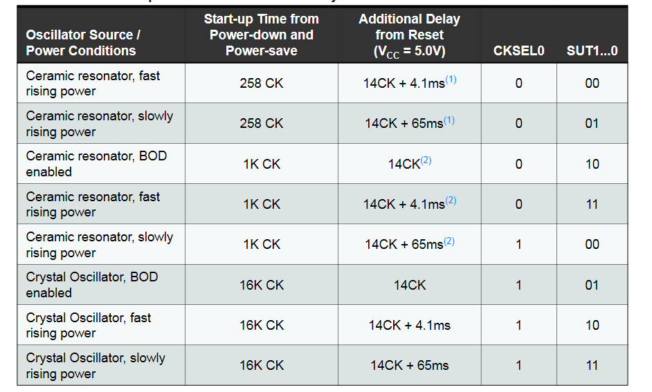
>
> 配置1：**是最常用的配置方式**，选择**Full Swing（满幅）全功率晶体振荡器**同样需要使用到外部晶振，比如Arduino使用的是16Mhz的晶振，此时振荡放大器以满功率工作（XTAL2输出满幅），晶振连接在XTAL1和XTAL2引脚，适用于干扰较重的场合。该种模式下一般使用400k到20Mhz晶振，12到22pF电容，**CKSEL**设为0111，**SUT**设为11（不使用BOD）或01（使用BOD）
>
> 配置2：选择**低功耗晶体振荡器**晶振连接和常用的Full Swing模式类似，区别是此时振荡放大器不是满功率输出，较为省电，但是容易受干扰影响。该种模式需要根据振荡频率设定**CKSEL**，一般使用900k到16Mhz晶振，12到22pF电容。**SUT**设为11（不使用BOD）或01（使用BOD）。使用900k到3Mhz振荡器**CKSEL3..0**设为1011，3Mhz到8Mhz振荡器**CKSEL3..0**设为1101，8Mhz到16Mhz振荡器**CKSEL3..0**设为1111

### 1.3.1.2 相关配置寄存器

**OSCCAL寄存器**

OSCCAL寄存器用于设置**RC振荡器**的校正系数


> OSCCAL寄存器有一个出厂设定值，这个值在单片机复位时会自动写入到该寄存器。可以在运行时通过程序调节，大约在7.3Mhz到8.1Mhz之间调节，一般用不上

**CLKPR寄存器**

CLKPR寄存器用于设置时钟的预分频系数


分频系数定义如下


> 其中，**CLKPCE**位是更改使能，**CLKPSx**为分频系数设置。**在复位时熔丝位CKDIV8的值会决定CLKPSx的初值，如果CKDIV8为0那么默认CLKPSx=0011（8分频）**。设置分频的步骤如下
>
> 步骤1：向CLKPR写入0x80（即置CLKPE为1，其余位为0）
>
> 步骤2：在之后4个周期以内同时向寄存器写入0x0N（即设置CLKPS的值同时置CLKCE为0）
>
> 设置该寄存器时建议**关闭中断**防止过程被打断


### 1.3.2 16u2的时钟系统架构详解


16u2相比328P去掉了定时器的异步时钟源，并且由于没有ADC模块所以也没有ADC时钟输出。16u2有usb模块，所以需要使用**PLL**提供48Mhz的高频时钟。PLL的时钟虽然和系统时钟使用同一个时钟源，但是相对系统时钟独立，**拥有自己的预分频配置**。由于PLL始终将时钟乘以6，而USB的标准频率是48Mhz，所以**PLL预分频之后需要提供一个8Mhz的时钟**

和328P只能通过熔丝位配置时钟源不同，**16u2支持使用软件通过寄存器配置时钟源**

16u2也**不支持异步时钟源**

16u2熔丝位低字节位定义和328P完全相同，这里不再赘述

### 1.3.2.1 系统主时钟源与相关熔丝位

> 由于16u2不支持低速32.768khz的时钟源，所以**CKSELx**熔丝位的定义也稍有不同，0101 ~ 0100不再有用，其余有关系统主时钟源配置的定义和328P完全相同
>
> 
>
> 出厂时16u2的**CKSELx**熔丝位默认配置为0010使用内部RC振荡器，**SUT**默认配置为10为最大，**CKDIV**默认配置为0使用8分频

### 1.3.2.2 PLL时钟源

这是16u2相比328P增加的部分

> PLL的结构如下，相关配置位定义见寄存器配置
> 
> 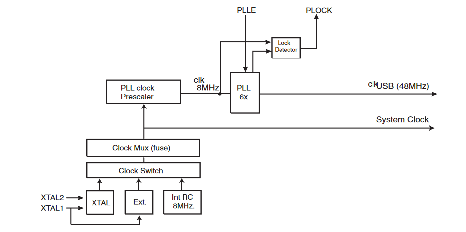

### 1.3.2.3 相关配置寄存器

16u2除了拥有**CLKPR**以及**OSCCAL**寄存器以外，还添加了**CLKSEL0**，**CLKSEL1**（注意不是熔丝位CKSEL），**CLKSTA**，**PLLCSR**共4个寄存器

**OSCCAL寄存器**

和328P定义完全相同，略

**CLKPR寄存器**

略

**CLKSEL0寄存器**

和328P不同，16u2支持通过寄存器软件更改时钟和振荡器参数。**CLKSEL0**用于设置**SUT**参数以及振荡器的选择与开关，定义如下


> 其中，**RCSUTx**用于设置**使用RC振荡器**时的SUT参数，在启动时熔丝位**SUTx**会**自动装载**到此处。设置这两位**没有任何作用**所以维持默认值即可
>
> **EXSUTx**寄存器同理，用于设置**使用外部振荡器或晶振**时的SUT参数，区别是更改该两位之后重启振荡器会生效（因为RC振荡器不可重启所以**RCSUTx**没有用）
>
> **RCE**和**EXTE**分别作为RC振荡器和外部/晶体振荡器的**开关**，置1开启置0关闭
>
> **CLKS**用于设置时钟源类型，置1使用外部/晶体振荡器，置0使用RC振荡器。**该位会在复位后根据熔丝位的设置自动选择**

**CLKSEL1寄存器**

该寄存器用于设置使用相应时钟（内部RC振荡器或外部时钟/晶体振荡器）时的**CKSELx**参数（启动时从熔丝位自动装载到**相应位**）


> **RCCKSELx**用于设置在使用RC振荡器作为时钟源时的CKSEL。由于RC模式只能设置为0010，所以更改无效，维持默认值即可
>
> **EXCKSELx**用于设置在使用外部/晶体振荡器作为时钟源时的CKSEL。区别是可以更改SUT参数，在clock switch之后生效

**CLKSTA寄存器**

该寄存器用于指示时钟源状态，1为开启0为关闭，定义如下


> **RCON**指示RC振荡器状态，**EXTON**指示外部/晶体振荡器状态

**PLLCSR寄存器**

该寄存器专用于PLL配置，以及指示PLL状态，**划重点**

> **注意，Atmel官方文档对于16u2的PLL配置寄存器的描述存在失误，目前也没有找到Errata**。截图如下
>
> 
>
> 之后参考了Atmel Studio中相关的头文件，分别找到了16u2和32u4有关PLL设置的寄存器定义

```c
//  16u2

#define PLLCSR _SFR_IO8(0x29)
#define PLOCK 0
#define PLLE 1
#define PLLP0 2
#define PLLP1 3
#define PLLP2 4
```

```c
//  32u4

#define PLLCSR _SFR_IO8(0x29)
#define PLOCK 0
#define PLLE 1
#define PINDIV 4

#define PLLFRQ _SFR_IO8(0x32)
#define PDIV0 0
#define PDIV1 1
#define PDIV2 2
#define PDIV3 3
#define PLLTM0 4
#define PLLTM1 5
#define PLLUSB 6
#define PINMUX 7
```

> Arduino软件维护者在代码中也提到了相关问题，参考github上[代码](https://github.com/apachiww/ArduinoCore-avr/blob/master/cores/arduino/USBCore.cpp)（个人Fork）的第681行开始，由此发现问题所在

```c
#elif defined(__AVR_AT90USB82__) || defined(__AVR_AT90USB162__) || defined(__AVR_ATmega32U2__) || defined(__AVR_ATmega16U2__) || defined(__AVR_ATmega8U2__)
	// for the u2 Series the datasheet is confusing. On page 40 its called PINDIV and on page 290 its called PLLP0
#if F_CPU == 16000000UL
	// Need 16 MHz xtal
	PLLCSR |= (1 << PLLP0);
#elif F_CPU == 8000000UL
	// Need 8 MHz xtal
	PLLCSR &= ~(1 << PLLP0);
#endif
```

> 16u2和32u4的PLL部分不相同，32u4使用了2个寄存器控制PLL（多了**PLLFRQ**）
>
> PLL电路框图也是错误的，实际16u2的时钟系统和AT90USB162是基本一样的
>
> 16u2文档中的错误框图，多出了很多不存在的信号
>
> 
>
> AT90USB162的电路
>
> 

最后根据Arduino官方的代码，参考了[AT90USB162](https://www.microchip.com/en-us/product/AT90USB162)的资料如下。**这是16u2的PLLCSR寄存器的正确定义**。该图中**PLLPx**的读写权限的标记应当是R/W


> **PLLE**是PLL的开关，置1启动。**注意如果使用的是RC振荡器，将PLLE置位时RC振荡器会自动启动**
>
> **PLOCK**是PLL锁定指示位，在PLL启动之后需要经过大约1ms到100ms该指示位才会置位，表示PLL输出和输入参考时钟已经锁定相位，**此时PLL才可以使用**
>
> **PLLPx**是PLL的预分频参数，**PLLP2..0**为000时不分频，为001时使用2分频。换言之有两位设置是无效的


### 1.3.3 32u4的时钟系统架构详解


32u4的时钟系统和16u2的主要区别在于PLL部分，PLL既可以使用系统时钟也可以直接使用RC振荡器，另外由于32u4比16u2多了一个高速定时器，PLL除了给usb提供时钟以外还要为高速定时器提供时钟

### 1.3.3.1 系统主时钟源与相关熔丝位

> 32u4的时钟熔丝位配置和16u2又是不同的。和16u2相反，32u4相比328P**没有振荡器的满幅模式**，只有低功耗模式。32u4支持低频32.768khz的外部振荡器
>
> 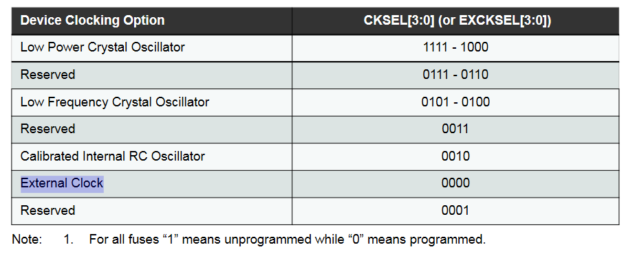
>
> 32u4分为两种，最普通的32u4默认出厂熔丝设置为使用**低功耗振荡器**并且设置系统时钟8分频（CKSELx=1110，SUTx=01），而32u4RC默认出厂熔丝设置为使用RC振荡器
>
> 32u4支持4种时钟源，这些时钟源的熔丝位设置和328P完全相同，这里不再赘述

### 1.3.3.2 PLL时钟源

32u4的PLL和16u2的不同，支持将8Mhz时钟倍频后输出32 ~ 96Mhz的时钟，为usb以及高速定时器提供时钟。并且32u4的PLL模块有预分频也有输出分频，可以分别单独设置

> 32u4的PLL时钟模块使用了2个寄存器**PLLCSR**和**PLLFRQ**进行配置。PLL电路结构如下
>
> 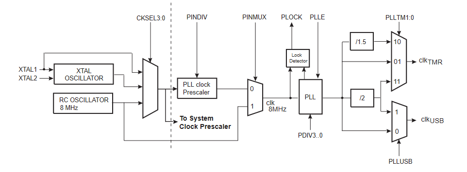

### 1.3.3.3 相关配置寄存器

**OSCCAL寄存器**

略

**CLKPR寄存器**

略

**CLKSEL0寄存器**

同16u2，以下同理，略

**CLKSEL1寄存器**

略

**CLKSTA寄存器**

略

**PLLCSR寄存器**

32u4的**PLLCSR**定义和16u2不同。这里的**PLLCSR**只有3个有效位，如下

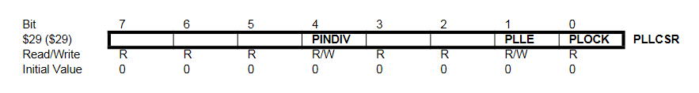

> **PINDIV**为PLL输入预分频，置0不分频，置1对输入时钟（振荡器等）进行2分频，需要在**启动PLL之前**进行设置
>
> **PLLE**和**PLOCK**分别为PLL使能（启动）和PLL锁定指示位，同16u2

**PLLFRQ寄存器**

该寄存器用于设置PLL的输出分频，以及高速定时器的时钟源


> **PINMUX**用于选择PLL的时钟输入，置0使用PLL专用预分频器（独立于系统时钟预分频器），置1直接使用内置8Mhz的RC振荡器，这样可以将usb和系统时钟分离开来，系统使用晶振而USB使用RC振荡器
>
> **PLLUSB**用于设置usb的输入分频（相对PLL输出时钟），置0不分频（此时PLL应当输出48Mhz），置1二分频（此时PLL应当输出96Mhz）
>
> **PLLTMx**用于设置高速定时器**TCNT4**的输入分频（相对PLL输出时钟），当**PLLTM1..0**为00时断开时钟，01时不分频，10时进行1.5分频，11时进行2分频
>
> **PDIVx**用于设置PLL的时钟输出频率，见下
>
> 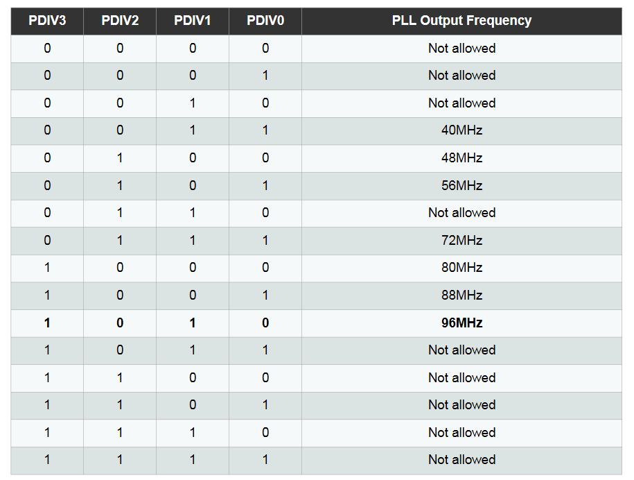
>
> Atmel建议在正常5v供电时，将**PDIV3..0**设置为1010，输出96Mhz时钟，将**PLLUSB**置1进行2分频之后得到48Mhz的时钟


## 1.4 GPIO

AVR的GPIO结构相比8051也要复杂很多，功能更加强大


### 1.4.1 AVR的GPIO基本电路结构

一般的AVR都有多组GPIO，比如328P的GPIO有PORTB，PORTC，PORTD等。每一组IO最多可以包含8个IO，单个IO的结构如下。以下对于GPIO做一个详细的分析

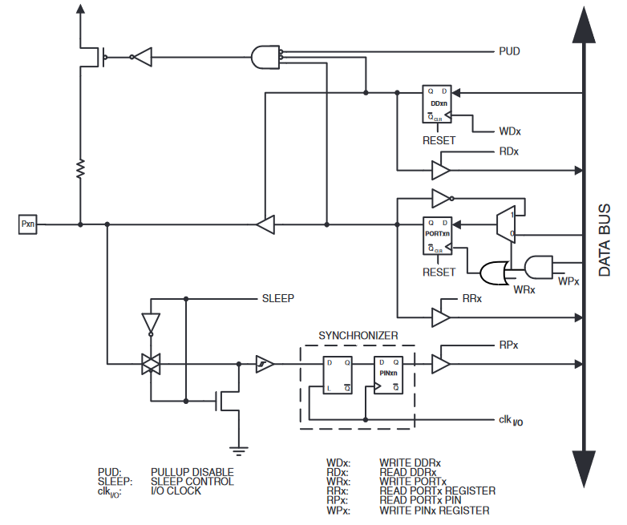

> 在一般模式下面，一组GPIO有3个主要的控制寄存器，分别为**DDRx**（Data Direction Register，用于设置IO为输入或输出模式），**PINx**（Port Input，用于读取引脚输入），**PORTx**（GPIO输出高低电平）。以下没有特殊说明，寄存器名称都代指一组IO中的1位
>
> 和最传统的8051单片机相比，AVR的GPIO由于其更加复杂严谨的设计，并且可以设置输入输出模式，输出时类似强推挽输出，所以输出高电平和低电平的负载驱动能力是基本相近的（足以点亮LED），不像8051输出高电平基本没有驱动能力可以轻易被拉低，需要加一个Buffer
>
> 仔细观察之后可以大致将该电路分为5个部分，分别为**上拉电阻**，**数据方向**，**输出数据**，**引脚读取**以及**休眠控制**
>
> 首先从**上拉电阻**（左上角）开始分析。上拉电阻只有在GPIO数据寄存器**PORTx**为1，并且数据方向**DDRx**为0（作为输入，关闭Buffer）相应的上拉才会生效。另外，建议将不使用的引脚上拉
>
> **数据方向**寄存器**DDRx**置1使能输出，置0禁止输出，此时如果没有上拉电阻那么引脚处于高阻态模式
>
> **输出数据**寄存器**PORTx**可以直接置位，置1输出高电平置0低电平，也会受到**PINx**寄存器的影响，见下
>
> **引脚读取**寄存器**PINx**一般是作为只读寄存器读取引脚状态使用，并且读取的是**Buffer输出之后**的电平状态，和**PORTx**寄存器的输出状态**没有必然联系**。也可以向**PINx**寄存器写1，可以**翻转PORTx相应位，改变输出**。另外，为了消除寄存器亚稳态的影响，输入端使用了两个寄存器（Synchronizer），注意**这会带来0.5到1.5个IO时钟的延迟**
>
> **休眠控制**和[休眠模式](210702a_avr.md#112-休眠模式)有关。休眠模式时SLEEP信号为高电平，此时施密特触发器输入端会被拉低到0，Buffer关闭，这样可以保证信号的确定性，降低功耗（对于CMOS电路来说中间电平是最消耗能源的）
>
> 最终可以得到各种配置模式定义如下
>
> 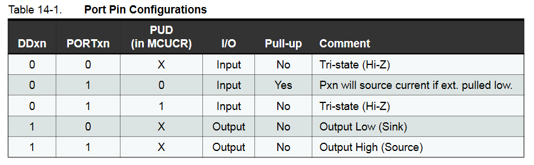
>
> 注意：由于从输入高阻态（**PORTx**为0，**DDRx**为0）到输出高电平（**PORTx**为1，**DDRx**为1）一定会经历一个中间状态01或10，在这两个状态中**建议使用输入上拉（PORTx为1，DDRx为0）模式**，此时如果有需要也可以在**MCUCR**临时禁用上拉。从01到10的转换同理，建议通过00中间状态跳转

另外GPIO会和单片机中的一些外设模块如SPI，I2C，UART，中断，ADC输入等复用，此时实际的GPIO电路会变成类似如下所示的结构（仅作为示意）

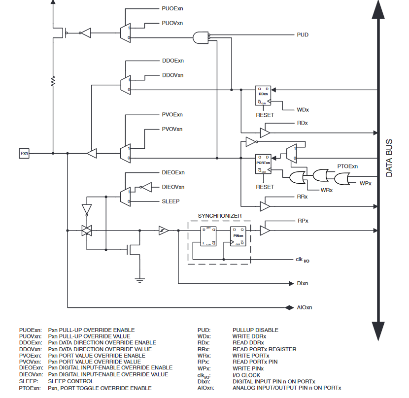

> 该种模式事实上和各外设的使能与否有关，相关的配置需要参考之后的各章节。由电路分析，其实就是在之前除引脚读取之外的4个部分（都和输出有关）添加了复用接口，如果使能了其他功能就会Override覆盖原始的普通GPIO功能。另外引出了单独的**模拟输入输出**以及**数字输入**接口


### 1.4.2 328P的GPIO

以下为328P的GPIO复用情况

**PORTB**

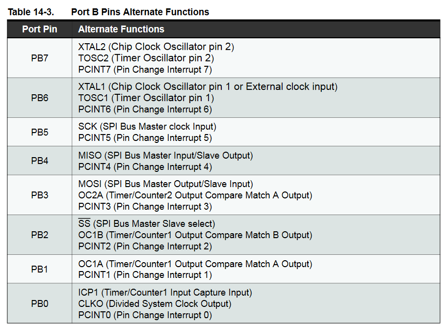

> 1. 在PB7和PB6作为振荡器接口使用时，所有寄存器**PORTx**，**PINx**以及**DDRx**读取都为0
>
> 2. SPI接口的SCK在Master模式时为输出，Slave模式时为输入（此时上拉电阻依然可以配置）。在Slave模式时\#SS配置为输入。同时SPI接口兼具ICSP下载功能
>
> 3. OC2A和OC1A OC1B分别为定时器2的比较输出A和定时器1的比较输出AB。ICP1为定时器1的捕获输入
>
> 4. CLKO用于输出系统时钟，通过熔丝位配置

**PORTC**

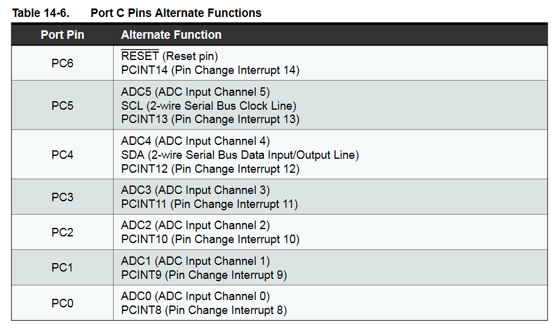

> 1. 复位输入\#RESET通过熔丝位**RSTDISBL**配置，此时PC6相应寄存器读取都为0
>
> 2. 当**TWCR**的TWEN置位时，TWI使能，此时SDA以及SCL为开集输出无上拉电阻
>
> 3. ADCx为模数转换器输入，理想输入电阻无穷大。不同输入通道使用的电源不同（328P使用了两个电源，一个为数字电路部分供电，一个为模拟电路部分供电）。ADC4和ADC5使用**数字电源**，其余使用**模拟电源**

**PORTD**

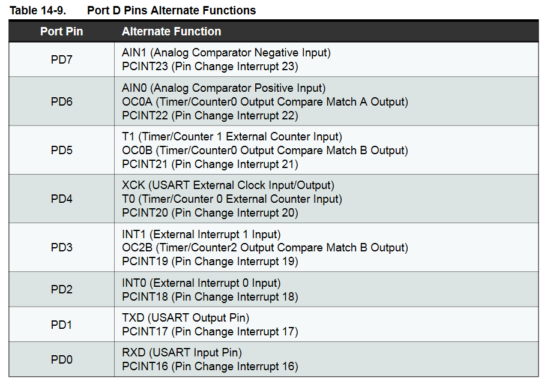

> 1. AIN0和AIN1分别为比较器的正相以及反相输入，理论输入电阻无穷大
>
> 2. OC2B和OC0A OC0B分别为定时器2的分别为定时器2的比较输出B和定时器0的比较输出AB。T0和T1分别为定时器0和1的外部时钟输入
>
> 3. XCK为UART外部时钟输入，TXD和RXD分别为UART发送和接收端口。使能UART的发送和接收模块时会分别自动将这些端口配置为发送和接收

### 1.4.2.1 相关配置寄存器

**MCUCR寄存器**

寄存器**MCUCR**中的**PUD**用于控制IO的上拉电阻

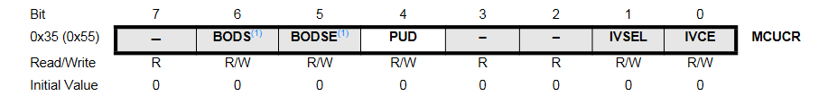

> 将**PUD**位置1可以禁用所有的上拉电阻

**PORTB寄存器**

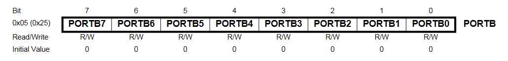

**DDRB寄存器**

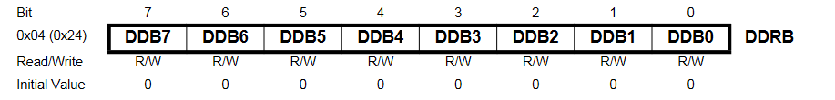

**PINB寄存器**

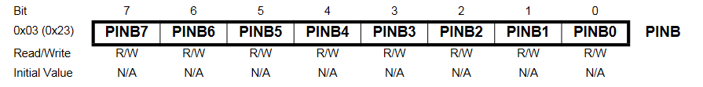

**PORTC寄存器**

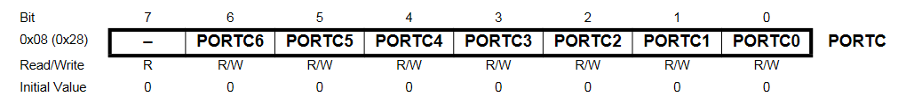

**DDRC寄存器**

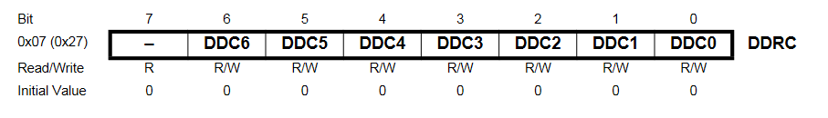

**PINC寄存器**

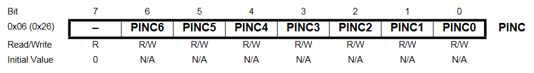

**PORTD寄存器**

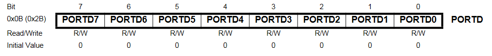

**DDRD寄存器**

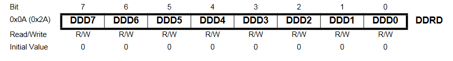

**PIND寄存器**

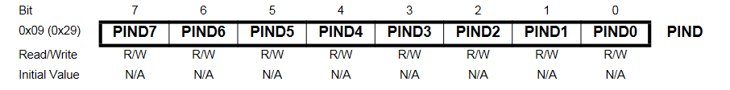


### 1.4.3 16u2的GPIO

以下为16u2的GPIO复用情况

**PORTB**

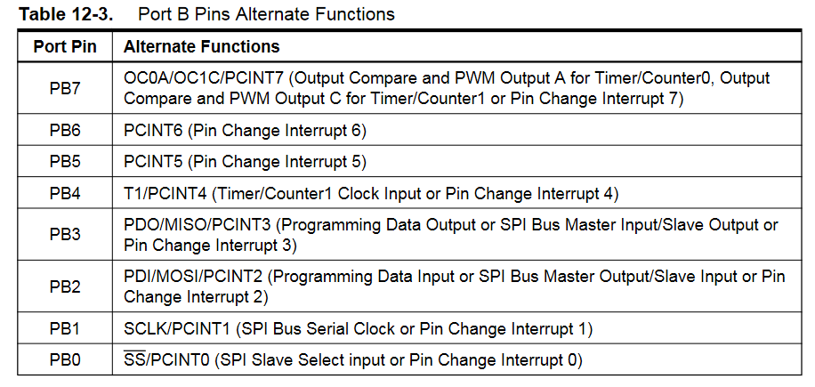

**PORTC**

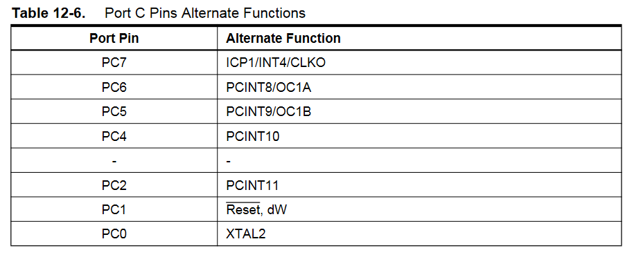

> 1. dW是Debug Wire，在熔丝位**DWEN**使能以后启用。一般用不上

**PORTD**

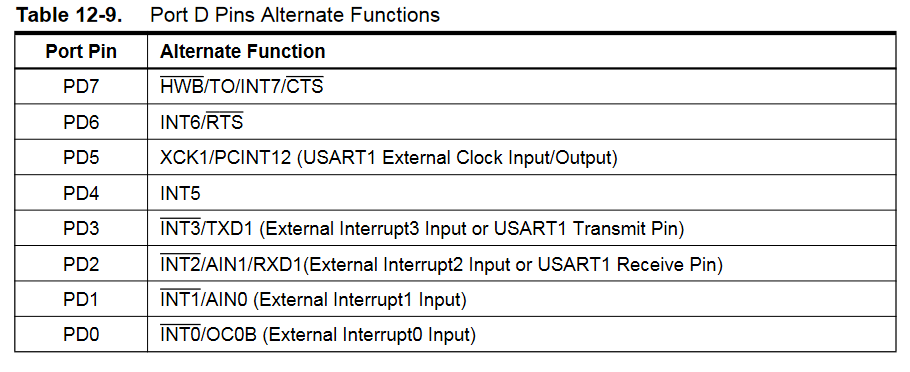

> 1. \#CTS和\#RTS分别为UART1的发送流控制信号以及接收流控制信号，XCK为UART1外部时钟

### 1.4.3.1 相关配置寄存器

**MCUCR寄存器**

寄存器**MCUCR**中的**PUD**用于控制IO的上拉电阻

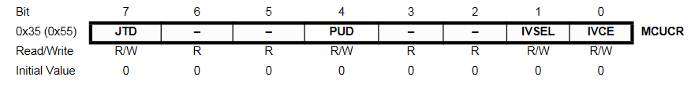

> 将**PUD**位置1可以禁用所有的上拉电阻

**PORTB寄存器**

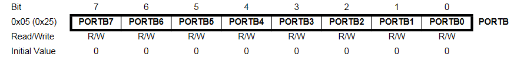

**DDRB寄存器**

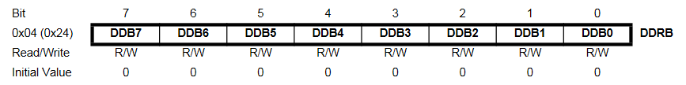

**PINB寄存器**

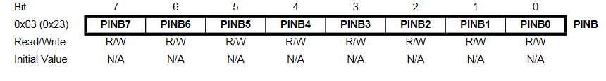

**PORTC寄存器**

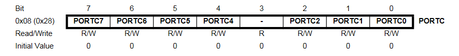

**DDRC寄存器**

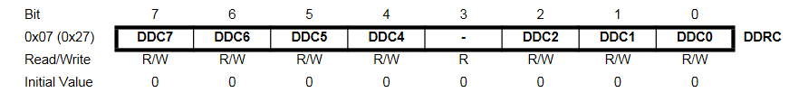

**PINC寄存器**

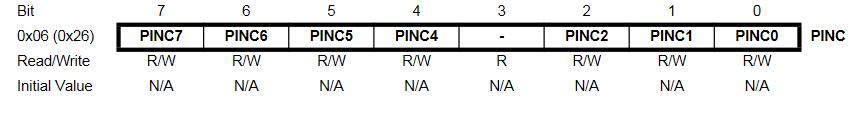

**PORTD寄存器**

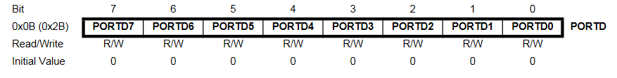

**DDRD寄存器**

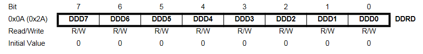

**PIND寄存器**

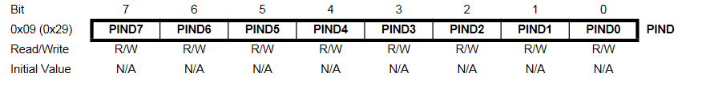


### 1.4.4 32u4的GPIO

以下为32u4的GPIO复用情况，32u4有5组GPIO

**PORTB**

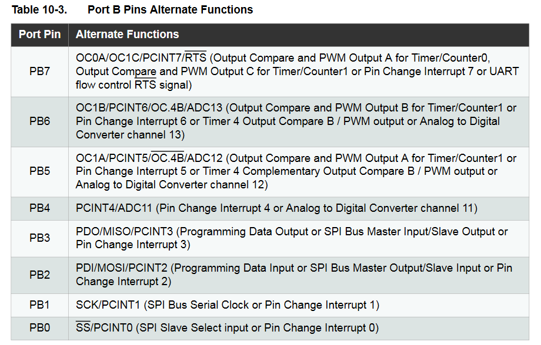

> 1. \#RTS为UART的时钟接收流控制信号
>
> 2. OC.4B和\#OC.4B分别为定时器T4的比较输出B，是一对互补信号

**PORTC**


> 1. OC.4A和\#OC.4A分别为定时器T4的比较输出A，是一对互补信号
>
> 2. OC.3A为定时器T3的比较输出A

**PORTD**

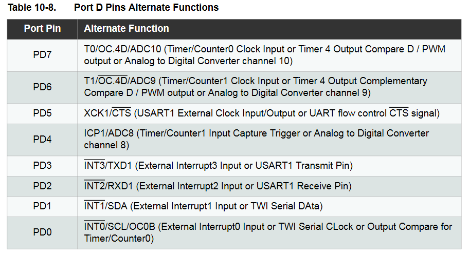

> 1. OC.4D和\#OC.4D分别为定时器T4的比较输出D，是一对互补信号
>
> 2. \#CTS为UART的时钟发送流控制信号

**PORTE**

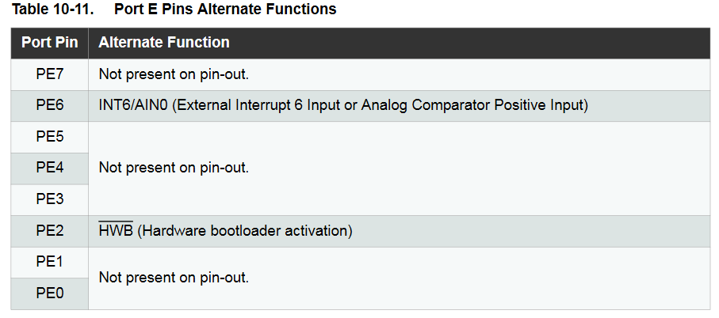

> 1. 复位时将\#HWB接地，可以允许在复位之后执行Bootloader（在非复位状态下可以使用正常功能），通过设置熔丝位**HWBE**使能

**PORTF**

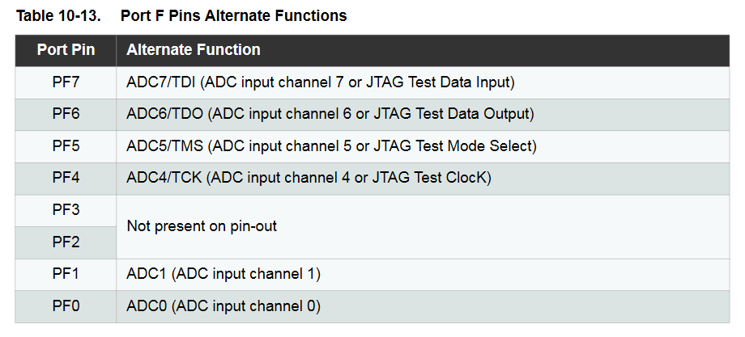

> 1. TDI、TDO、TMS以及TCK为JTAG引脚，使能JTAG时不能使用普通功能

### 1.4.4.1 相关配置寄存器

**MCUCR寄存器**

同16u2，略

**PORTB寄存器**

同16u2，略

**DDRB寄存器**

略

**PINB寄存器**

略

**PORTC寄存器**

地址0x08(0x28)

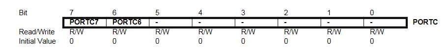

**DDRC寄存器**

地址0x07(0x27)

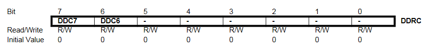

**PINC寄存器**

地址0x06(0x26)

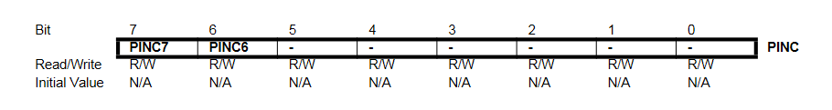

**PORTD寄存器**

略

**DDRD寄存器**

略

**PIND寄存器**

略

**PORTE寄存器**

地址0x0E(0x2E)


**DDRE寄存器**

地址0x0D(0x2D)

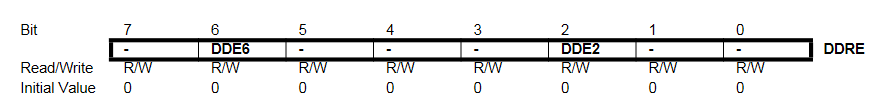

**PINE寄存器**

地址0x0C(0x2C)

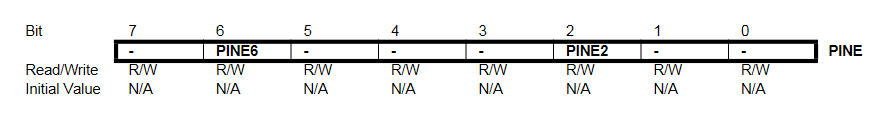

**PORTF寄存器**

地址0x11(0x31)

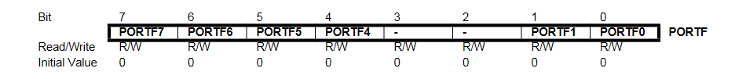

**DDRF寄存器**

地址0x10(0x30)

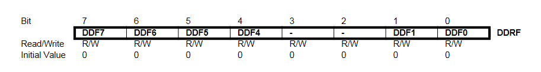

**PINF寄存器**

地址0x0F(0x2F)

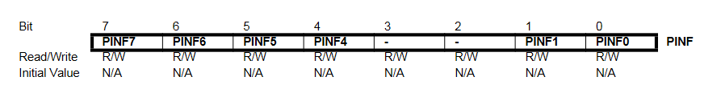


## 1.5 定时器（Timer/Counter）

AVR中的定时器有多种用途，可以用于PWM输出，为UART提供时钟，外部计数，精准定时任务等

> 首先引入几个定义
>
> 1. **TOP**代指计数器达到最大值
>
> 2. **BOTTOM**代指计数器达到0
>
> 3. **MAX**代指计数器达到0xFF或0xFFFF


### 1.5.1 328P的定时器

328P一共有3个通用定时器，分别为8位定时器**TCNT0**，16位带外部触发定时器**TCNT1**以及8位异步定时器**TCNT2**

### 1.5.1.1 8位定时器TCNT0详解

定时器**TCNT0**拥有2个单独的比较寄存器（输出引脚分别为**OC0A**和**OC0B**），3个不同的中断源（**TOV0**，**OC0A**和**OC0B**），可以用于PWM输出以及频率脉冲输出，计数，定时等

使用**TCNT0**时需要将**PRTIM0**置零，见[休眠模式](#112-休眠模式)

8位定时器的结构如下，其中标**粗体**的寄存器是可以使用CPU访问的

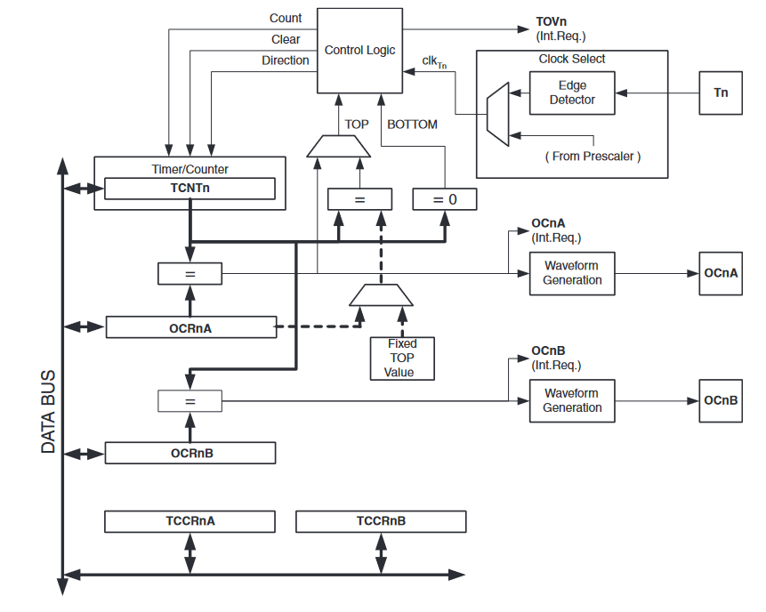

> 由上图分析，定时器1拥有**TCNT0**，**OCR0A**，**OCR0B**，**TCCR0A**以及**TCCR0B**一共5个主要的寄存器，另外有中断控制寄存器**TIFR0**和**TIMSK0**
>
> 其中，**TCNT0**寄存器为计数器，可以向上计数或向下计数，可以通过CPU强行置数，**注意置数后一个计数周期内将会屏蔽比较输出（这样可以在计数器初始化时将TCNT0和OCR0x初始化为相同的值而不触发比较输出）**。**OCR0A**可以作为比较寄存器A使用，也可以用于设置计数TOP值，**OCR0B**只能作为比较寄存器B使用。在PWM模式下**OCR0x**寄存器会**启用双缓冲**。
>
> 当比较器检测到**TCNT0**计数器数值和**OCR0A**以及**OCR0B**相同时，在下一个时钟比较标记会置位，可以通过软件写入1复位。此时如果使能中断就会产生中断，执行中断时标记位会**自动硬件复位**。另外输出引脚也是可以配置不同的输出模式的，如PWM，脉冲等，也可以通过强制置位改变比较器输出引脚的状态
>
> **TCCR0A**和**TCCR0B**分别用于控制比较器输出A和B
>
> 定时器**TCNT0**有3个外部引脚，分别为T0时钟输入，OC0A和OC0B为比较输出。输出引脚**必须在定时器初始化之前配置为输出**，具体原因参考下图


> 定时器的寄存器配置会影响到IO，OC0A和OC0B为输出寄存器，而**DDRx**寄存器不受影响

**工作模式**

定时器**TCNT0**一共支持3种工作模式，分别为**一般模式（Normal）**，**高速PWM模式（Fast PWM）**，**相校正PWM模式（Phase Correct PWM）**

> 1. **一般模式**下定时器向上计数，当计数溢出之后自动从0开始重新计数，同时**TOV0**溢出标记置位（需要软件复位）。如果使能了**TOV0**中断，执行中断服务程序时标记位会**自动清零**。**一般模式下还有一种CTC模式（相同时清零）**，定时器工作示意图如下，每一次触发比较都会使得**OC0x**置位。在当定时器**TCNT0**当前计数值大于想要的**OCR0x**比较值时，设置**OCR0x**后定时器会继续计数直到溢出，**而并不会立即触发比较**。另外，输出寄存器**OC0x**也可以配置为Toggle模式，也就是每触发一次比较就切换一下状态
>
> 
>
> 2. **高速PWM模式**事实上为单坡（Single Slope）PWM模式，工作示意图如下（相比之后的相校正PWM定时器只递增计数，所以可以输出两倍频率的PWM信号）。定时器的最大计数值**TOP**可以是0xFF也可以是寄存器**OCR0A**。PWM方波信号输出端OC0A或OC0B（**正相**）在计数到达BOTTOM以后就**置1**，而在触发比较到计数到TOP的区间就会**清0**，这就是PWM的基本原理。还可以将输出设置为**反相**输出。比较寄存器可以是**OCR0A**或**OCR0B**，用于设置PWM的占空比，启用了**双缓冲**可以随时赋值，每次计数溢出才更新真正的**OCR0x**。**注意，这种模式下计数溢出中断TOV0依然起作用（可以屏蔽）**，可以通过该中断设置下一次的比较值
>
> 
>
> 3. **相校正PWM（Phase Correct PWM）模式**为双坡（Dual Slope）PWM模式，工作示意图如下。这种模式的特征在于占空比改变时相位不变（适用于电机控制），最大只能达到高速PWM一半的频率。同高速PWM，定时器的最大计数值TOP可以是0xFF也可以是寄存器**OCR0A**。定时器在递增计数到TOP时（停留1个时钟）就会自动开始递减计数。OC0A或OC0B输出端（**正相**）会在**递增计数**区间**比较触发之后清0**，在**递减计数**区间**比较触发之后置1**。可以通过寄存器设置**反相**输出，同理。比较寄存器可以是**OCR0A**或**OCR0B**，**有双缓冲可以随时赋值，该种模式下每次计数到TOP会将缓冲中的数据存储到真正的OCR0x寄存器中**。但是注意该种模式下溢出中断**TOV0**会在**计数到BOTTOM（即0x00）时触发**
>
> 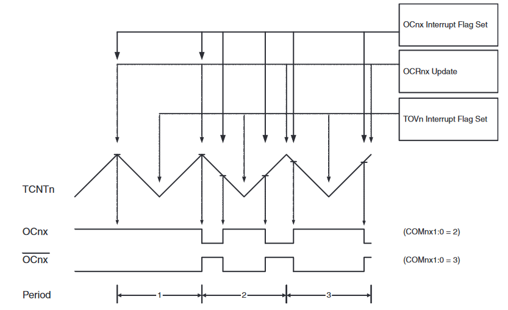
>
> > 可以注意到上图中OC0x第一次的状态翻转。比较寄存器**OCR0x**初始值等于TOP，在计数到TOP同时寄存器**OCR0x**被更改，此时发现输出状态发生了由高转低的翻转，而此时其实并未触发比较。这是一种特殊情况，为了保证这种相校正PWM的波形对称性

### 1.5.1.2 TCNT0相关寄存器

**TCCR0A和TCCR0B寄存器**

这两个寄存器是控制定时器1的主要配置寄存器

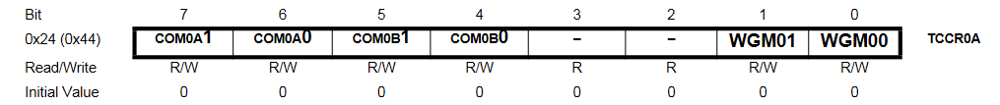

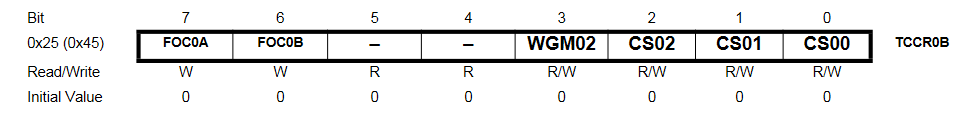

> 其中，**WGM02:0**用于设置定时器的工作模式（Waveform Generation Mode），各模式定义如下，观察可知计数模式无非就3种，每种模式可以使用2种不同的计数TOP（0xFF或**OCR0A**）
>
> 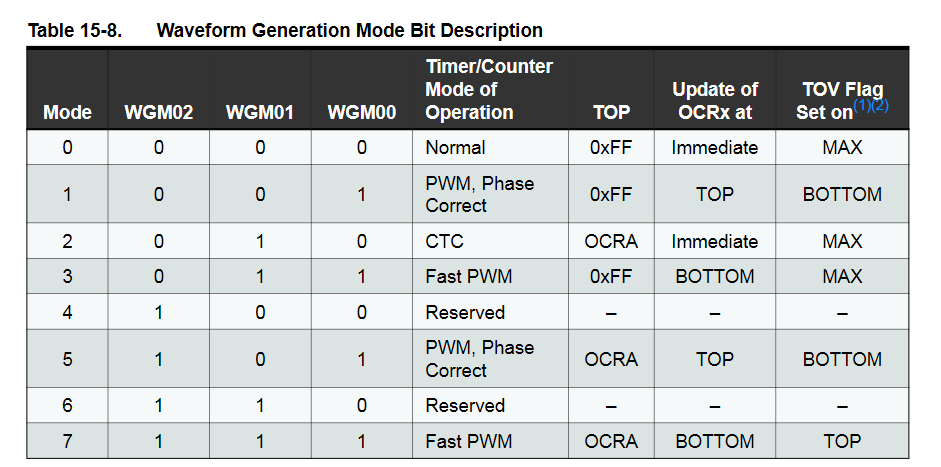
>
> 而**COM0A1:0**和**COM0B1:0**分别用于控制输出OC0A以及OC0B
>
> **Normal模式**
>
> OC0A的**COM0A1:0**定义如下，**COM0B1:0**的定义完全相同。置00可以断开定时器输出，使用引脚的原始功能；这种模式下可以生成占空比50%的方波，也可以用于连续/单次输出正/负脉冲或定时电平
>
> 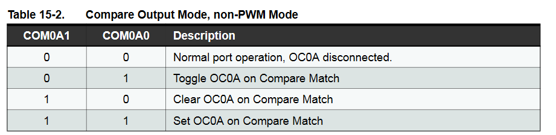
>
> **高速PWM模式**
>
> 该种模式下AB两个输出端的配置定义有所不同。当**COM0x1:0**为10时**正相输出**，为11时**反相输出**。而OC0A在**COM0A1:0**为01时，当**WGM02**为1（此时计数TOP值为**OCR0A**）时，可以输出占空比为50%的方波，基频为一般的PWM输出模式的1/2
>
> 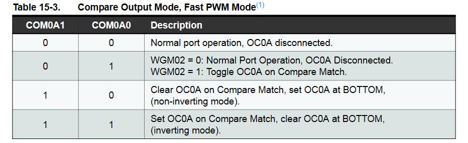
>
> 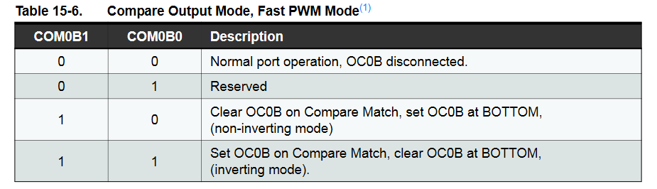
>
> **相校正PWM模式**
>
> 该种模式同理。当**COM0x1:0**为10时**正相输出**，为11时**反相输出**。而OC0A在**COM0A1:0**为01时，当**WGM02**为1时，可以输出占空比为50%的方波，基频和一般的相校正PWM模式相等
>
> 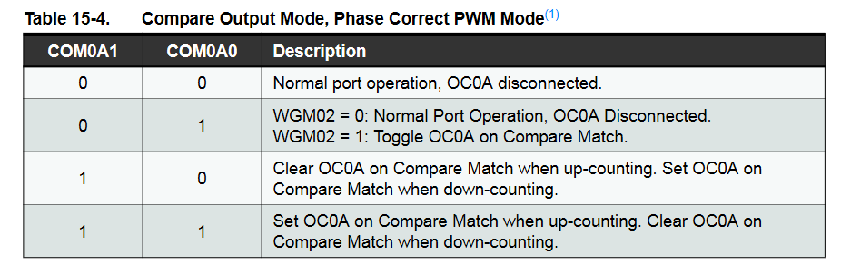
>
> 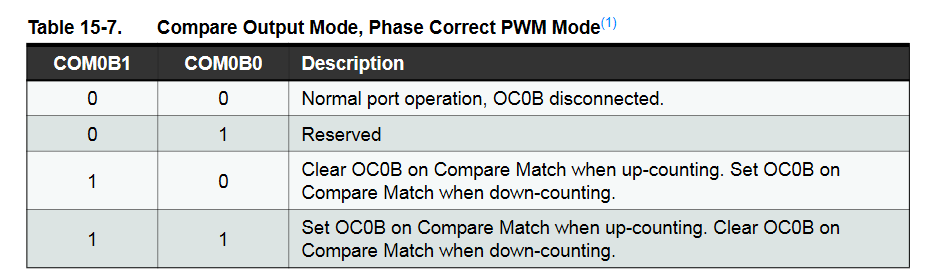
>
> 除以上配置位外，还有**CS0x**位用于设置定时器的**预分频**，定义如下
>
> 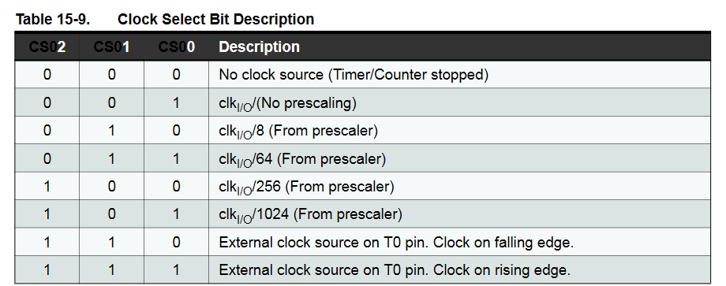
>
> 其中，可以将**CS0x**设置为000**停止时钟**，而正常的使用中，时钟一般取自IO时钟clkI/O的某个分频，或使用T0引脚作为时钟输入，这在外部计数中应用比较广泛
>
> 另外，**FOC0x**可以用于强制触发一次比较，一般的使用中没有什么用，**只能在Normal模式下使用，在PWM模式下只能写入0**。**FOC0x**的读取数值永远为0

**TCNT0寄存器**

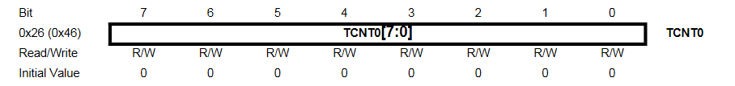

> 该寄存器为定时器的最主要部分，可以直接读写。向该寄存器写入之后会导致下一次比较信号的失效

**OCR0A和OCR0B寄存器**

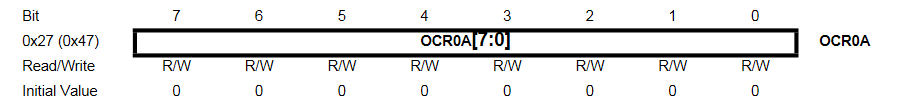


> 比较寄存器，作用已经在上文讲述，**在PWM模式下有双缓冲**

**TIMSK0寄存器**

定时器TCNT0有3个不同的中断，该寄存器是这3个中断的屏蔽位

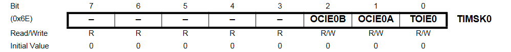

> 当**OCIE0x**置1时就会使能TCNT0相应的A或B比较中断，比较触发时就会转到相应的中断向量地址。而当**TOIE0**置1时就会使能TCNT0的计数溢出中断

**TIFR0寄存器**

该寄存器为3个中断的指示位

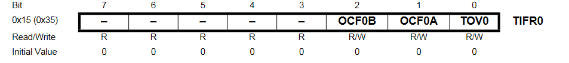

> 相应位置1时指示相应中断的触发，**在执行中断服务时会自动清零**，在禁用中断时也可以通过使用软件**写1**的方式置0

### 1.5.1.3 16位带捕获定时器TCNT1详解

16位定时器**TCNT1**拥有更长的计数器以及外部捕获引脚ICP1

使用**TCNT1**时需要将**PRTIM1**置零，见[休眠模式](#112-休眠模式)

16位定时器的结构如下

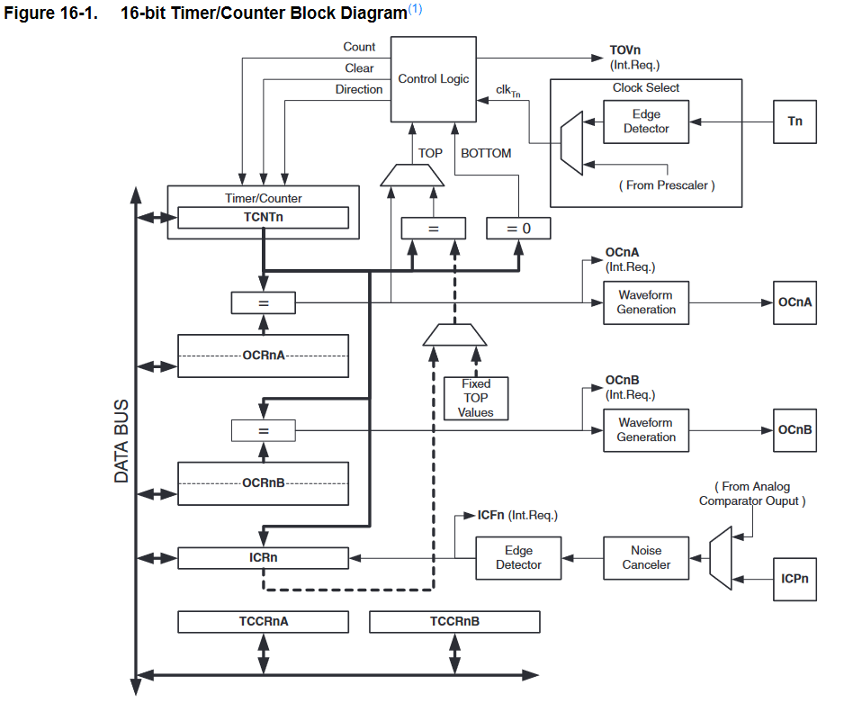

> 通过观察发现，16位定时器相对于8位定时器的主要区别就是支持捕获，**可以使用边沿触发，也可以使用电压比较器（见[1.6ADC以及比较器](#16-ADC以及比较器)）触发**，其余基本相同。多出的**ICR0**为输入捕获寄存器，长度16位。另外图中省略了中断寄存器**TIMSK1**和**TIFR1**
>
> 而16位寄存器的读写操作在前文已经讲述过，写时**先写高字节再写低字节**，读时**先读低字节再读高字节**，并且访问16位寄存器时最好**关闭中断**。高字节的临时寄存器为TCNT1中所有寄存器共用
>
> 定时器的捕获电路部分如下

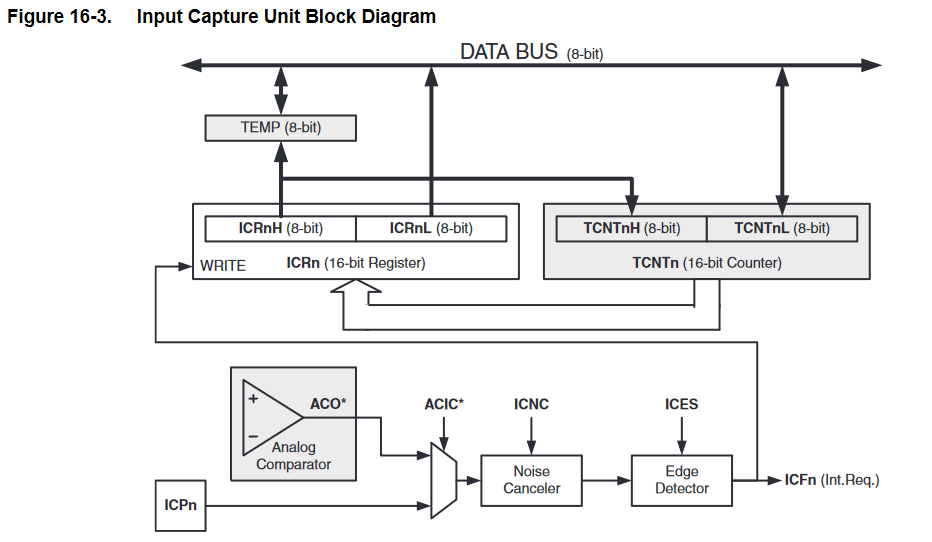

> 定时器所谓的捕获其实就是检测到触发信号时（外部输入的边沿触发或电压比较器触发，可以配置），立即将此时**TCNT1**中的值复制到寄存器**ICR1**中，此时如果使能了捕获中断也会触发中断**ICF1**，会在执行中断程序时自动清0，也可以使用软件写1清0。边沿触发捕获也可以通过**将引脚软件置1**实现软件触发
>
> 捕获寄存器**ICR1**只能在作为计数的TOP值寄存器时可以写入，其余状态下不可写入
>
> 注意在上图中还有输入降噪电路，在**使能降噪**时输入触发延时有4个时钟
>
> 另外在软件设计中应当注意：**在定时器捕获中断触发以后，应该在中断程序中尽早读取ICR1的值**
>
> 实际应用中，在使用定时器**TCNT1**测量脉冲的脉宽（Duty Cycle）时，需要在每次中断触发以后立即读取**ICR1**的值并更改捕获器的触发方式，此时捕获中断标记位**ICF1只能通过软件写1清0**。这个操作在使用SR04超声波传感器时比较关键。而如果在触发捕获中断以后不需要更改触发方式，**ICF1**会自动硬件清0

**工作模式**

16位寄存器的工作模式和8位寄存器基本相同，由于多了输入捕获功能，在寄存器的使用方面有所不同

> 1. **一般模式**的使用方式（包括**CTC模式**）和8位定时器完全相同，注意高低字节的读写顺序即可。**CTC模式**
>
> 2. **高速PWM模式**的计数TOP可以设置为固定的0x00FF，0x01FF或0x03FF，也可以使用**OCR1A**或**ICR1**作为计数TOP。这两个寄存器作为计数TOP值在写入值的操作方面稍有不同。由于**OCR1A**有双缓冲，所以可以在任意时间写入，**TCNT1**计数到本周期结束才会对真正的**OCR1A**进行数值更新。之前**TCNT0**的**OCR0A**寄存器同理在PWM模式下也有双缓冲。而**ICR1**没有双缓冲，所以写入的就是实际的寄存器，如果新值比当前的**TCNT1**小，定时器就会继续计数直到溢出，这在实际应用中容易导致问题
>
> 3. **相校正PWM模式**的计数TOP可以设定为3个固定值或使用寄存器**OCR1A**和**ICF1**。比较寄存器**OCR1x**的缓冲在计数到TOP时对实际的**OCR1x**进行赋值
>
> 4. **频率与相校正PWM模式**和相校正PWM的主要区别就是**OCR1x**寄存器被双缓冲Buffer更新的时机，比较寄存器**OCR1x**的缓冲在计数到BOTTOM时对实际的**OCR1x**进行赋值

### 1.5.1.4 TCNT1相关寄存器

**TCCR1A，TCCR1B和TCCR1C寄存器**

主要的配置寄存器，如下

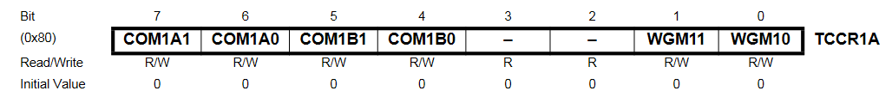

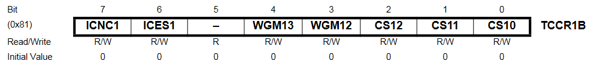

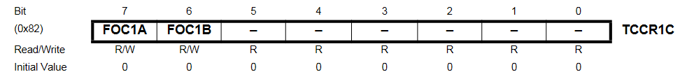

> 各模式**WGM1x**的设置定义如下，一共15种配置可用，普通**Normal模式**（包括CTC）有3种，**高速PWM模式**有5种（5种不同的计数TOP），**相校正PWM模式**有5种，**频率与相校正PWM模式**有2种
>
> 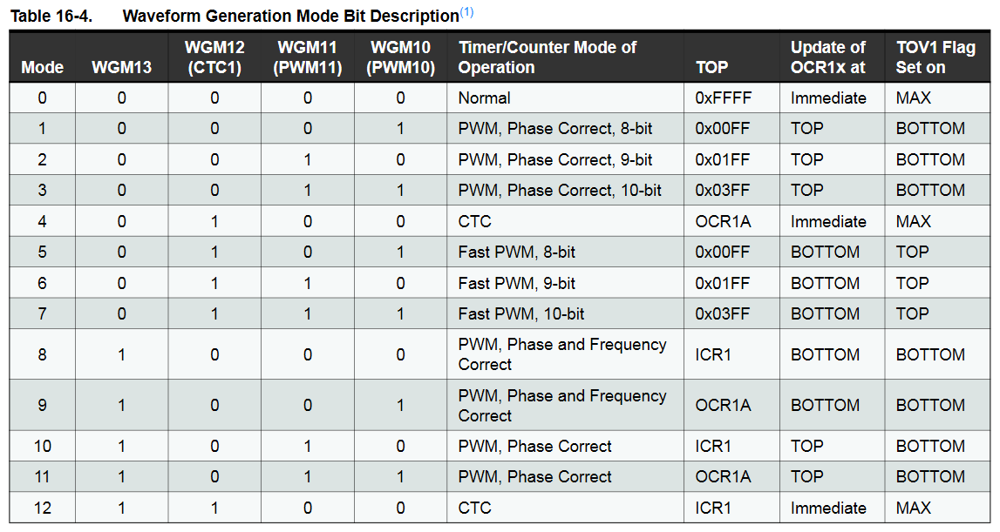
>
> 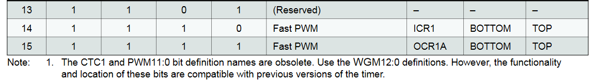
>
> **COM1Ax**和**COM1Bx**用于控制输出OC1A和OC1B
>
> **Normal模式**
>
> 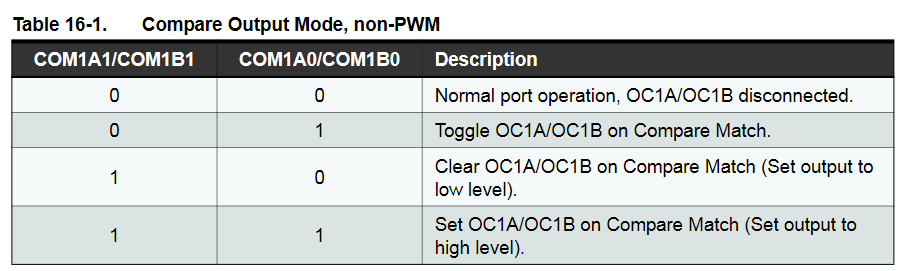
>
> **高速PWM模式**
>
> 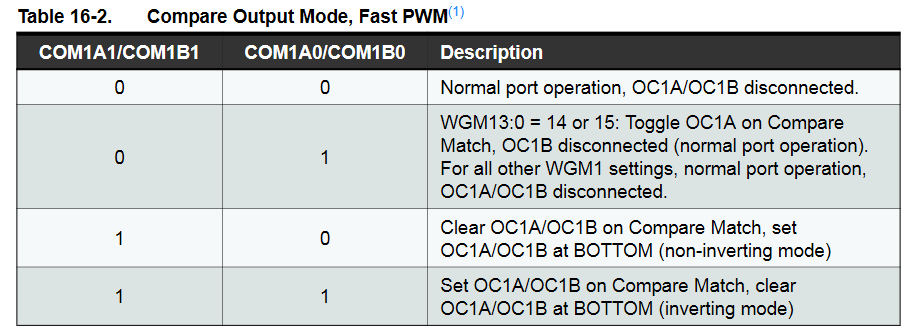
>
> **校正PWM模式**
>
> 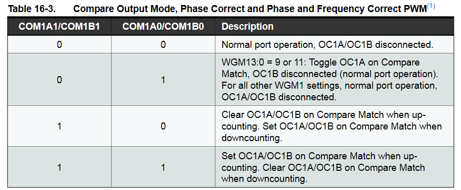
>
> 时钟选择**CS1x**的配置定义如下
>
> 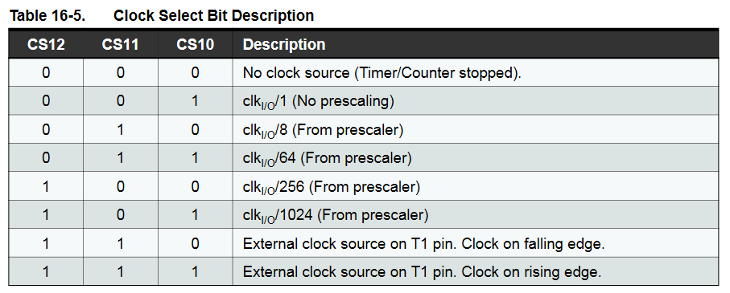
>
> **ICNC1**和**ICES1**是设置**外部捕获**的关键配置位。**ICNC1**用于配置降噪电路（Noise Canceler），置1使能降噪。**ICES1**用于配置上升或下降沿触发（Edge Select），置1上升沿触发，置0下降沿触发
>
> **FOC1x**用于强制触发比较，这里不再赘述

**TCNT1寄存器**

寄存器长度16位，分为**TCNT1H**和**TCNT1L**高低位共两个寄存器

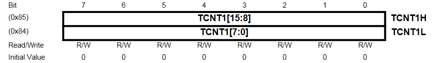

**OCR1A和OCR1B寄存器**

长度16位

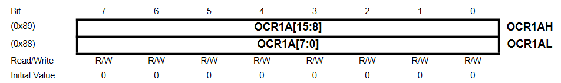

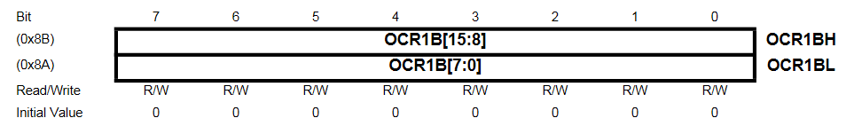

**ICR1寄存器**

长度16位，每次触发捕获之后会将当前**TCNT1**的数字截取

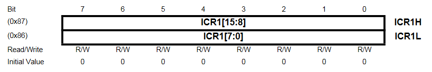

**TIMSK1寄存器**

定时器TCNT1有4个不同的中断，该寄存器是中断的屏蔽位


> 相比定时器TCNT0多出了捕获中断屏蔽位**ICIE1**，置1使能捕获中断

**TIFR1寄存器**

中断指示，原理不再赘述

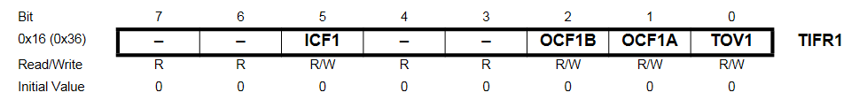

### 1.5.1.5 TCNT0和TCNT1的预分频

**TCNT0**和**TCNT1**定时器使用相同的分频器，而**TCNT2**异步定时器可以使用单独的异步分频器。这两个分频器都可以通过寄存器**GTCCR**进行复位

**GTCCR寄存器**

该寄存器可以用于对分频器进行复位，一般用于同步不同的计数器，使计数器可以同时开始计数或停止

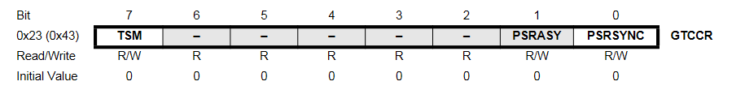

> 一般先向**TSM**置1使能预分频复位设置，之后向**PSRASY**或**PSRSYNC**置1复位相应的预分频器，此时所有定时器停止工作，可以进行一些定时器的参数设定。向**TSM**置0时**PSRASY**和**PSRSYNC**会自动置0，同时定时器立即开始工作

### 1.5.1.6 8位异步定时器TCNT2详解

8位异步定时器**TCNT2**和**TCNT0 TCNT1**不共用一个预分频器

**TCNT2**的电路结构和**TCNT0**完全相同，只是在时钟的选择方面还可以使用低频异步时钟（32.768khz），并且不支持外部时钟输入，具体电路这里不再赘述

**工作模式**

定时器**TCNT2**的3种工作模式和**TCNT0**完全相同，不再赘述

这里只讲述**TCNT2**的异步工作模式下需要注意的问题

> 1. 建议CPU时钟至少是**TCNT2**异步模式计数频率的4倍
>
> 2. 异步模式下向定时器**TCNT2**的寄存器**TCNT2**，**OCR2x**以及**TCCR2x**的写入操作要经过**2个异步时钟**之后才会真正写入，在这期间不能再次写入新值。这在使用**TCNT2**定时器作为休眠唤醒定时器时是需要重点关注的问题
>
> 3. 时钟源在异步时钟以及系统时钟之间切换时，建议使用以下步骤对寄存器进行初始化
>
> > 1. 禁用**TCNT2**中断（指示位和屏蔽位全部清零）
> > 2. 通过**AS2**设置想要的时钟源
> > 3. 向**TCNT2**，**OCR2x**以及**TCCR2x**写入新值
> > 4. 如果是要转向异步模式，就要等待**TCN2xUB**，**OCR2xUB**以及**TCR2xUB**
> > 5. 清除中断指示位
> > 6. 如果需要可以启用中断

### 1.5.1.7 TCNT2相关寄存器

**TCCR2A和TCCR2B寄存器**

只有时钟选择位**CS2x**的定义和**TCNT0**有所不同，其余相同

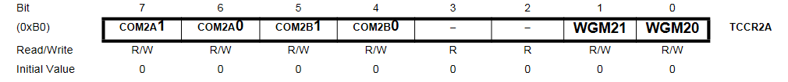

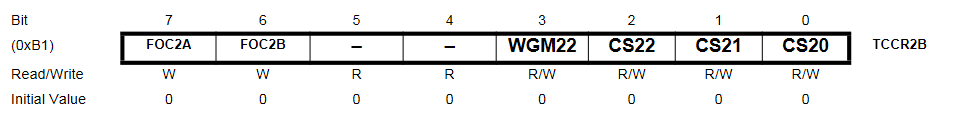

> 时钟/预分频的选择位**CS2x**的定义如下
>
> 
>
> 

**TCNT2寄存器**

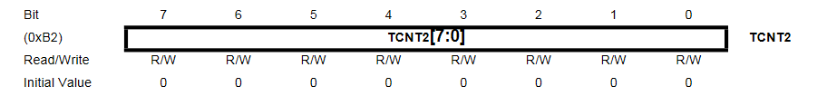

**OCR2A和OCR2B寄存器**


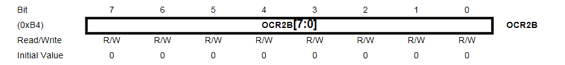

**TIMSK2寄存器**

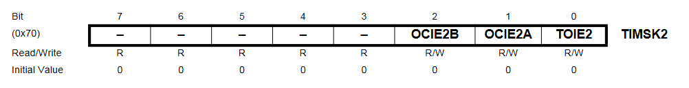

**TIFR2寄存器**

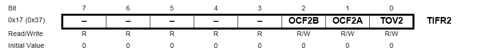

**ASSR寄存器**

该寄存器是定时器**TCNT2**相对于**TCNT0**多出的配置寄存器，专用于异步时钟的配置

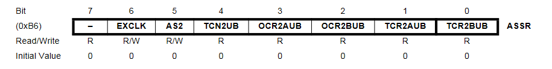

> 重要的配置位（可写）只有2位
>
> **EXCLK**位置1可以将振荡器模式设置为外部时钟输入，此时需要从TOSC1引脚输入时钟。如果使用晶体振荡器就需要将该位置0。注意振荡器的设置需要在置位**AS2**之前进行
>
> **AS2**置0时**TCNT2**使用内部IO时钟，置1使用独立异步时钟。注意**状态切换时TCNT2的主要数据寄存器会混乱，需要按照之前所述步骤进行初始化**
>
> 其余都是等待标志位（Update Busy），置1时分别用于指示当前**TCNT2 OCR2A OCR2B TCCR2A TCCR2B**寄存器正处于未更新完成的状态，不可再次写入


### 1.5.2 16u2的定时器

16u2一共有2个通用定时器，分别为8位定时器**TCNT0**和16位带外部触发定时器**TCNT1**。不支持异步时钟源

### 1.5.2.1 8位定时器TCNT0

16u2的定时器**TCNT0**和328P的**TCNT0**完全相同，这里不再赘述

### 1.5.2.2 TCNT0相关寄存器

寄存器和328P也完全相同。只是在高速PWM模式下双缓冲寄存器**OCR0x**的更新时机不同（在TOP更新而不是BOTTOM），不过作用等价

> 工作模式寄存器**WGM0x**配置定义
>
> 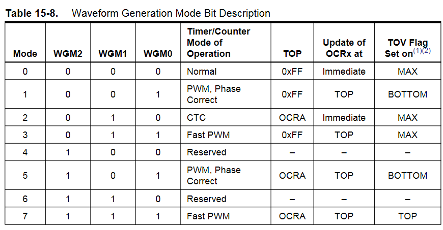

### 1.5.2.3 16位带捕获定时器TCNT1

16u2的16位定时器相比328P多了一个比较寄存器**OCR1C**，所以多了一个输出接口OC1C

电路框图如下

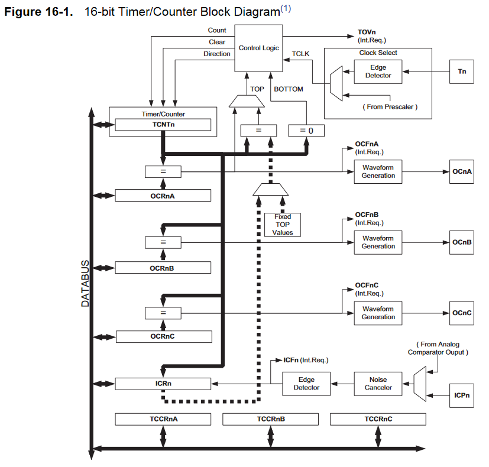

> 通过观察可以发现定时器**TCNT1**除了多了一个比较寄存器，其余和328P的完全相同。输出OC1C和OC1B拥有一样的功能（不支持占空比50%的输出）


### 1.5.2.4 TCNT1相关寄存器

**TCCR1A，TCCR1B和TCCR1C寄存器**

主要的配置寄存器，如下

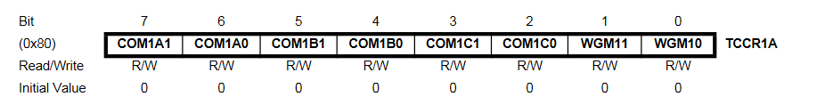

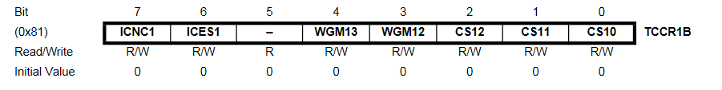

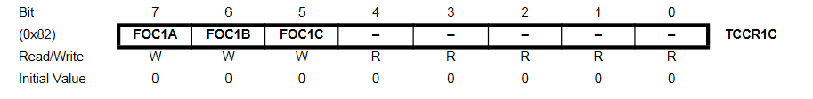

> 工作模式配置位**WGM1x**的定义如下
>
> 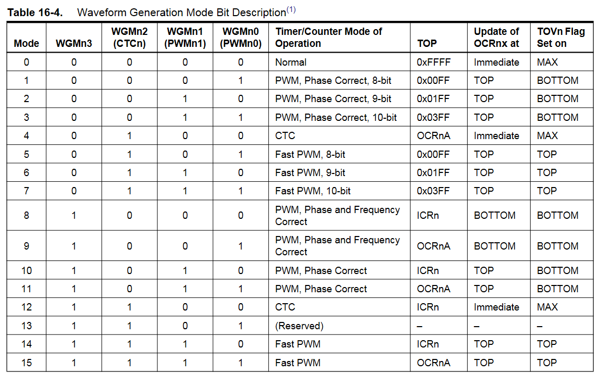
>
> 通过观察可以发现16u2的定时器**TCNT1**和328P功能基本相同，同样只在高速PWM模式有细微区别（寄存器双缓冲）

**TCNT1寄存器**

长度16位，略

**OCR1A，OCR1B和OCR1C寄存器**

这里只给出**OCR1C**寄存器的地址

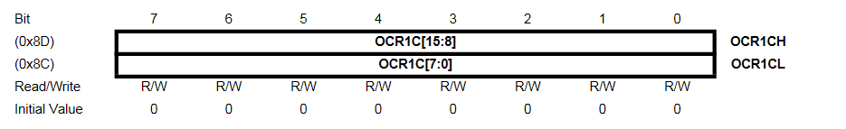

**ICR1寄存器**

输入捕获寄存器

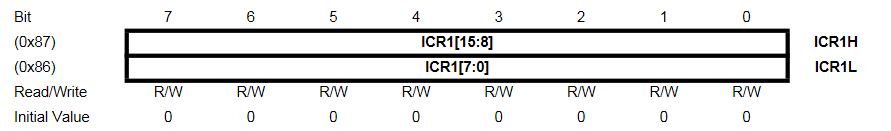

**TIMSK1寄存器**

中断屏蔽

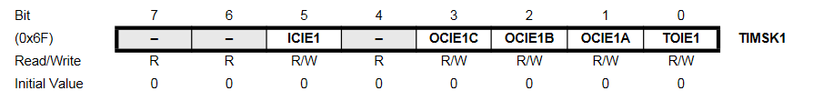

**TIFR1寄存器**

中断指示

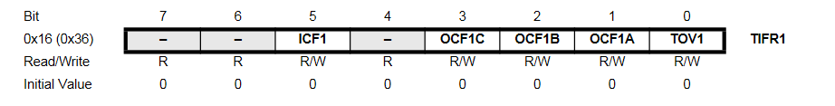


### 1.5.2.5 TCNT0和TCNT1的预分频

因为16u2不支持异步时钟源，所以**GTCCR**寄存器只有两个有效位，在向**PSRSYNC**置1之前需要先将**TSM**置1

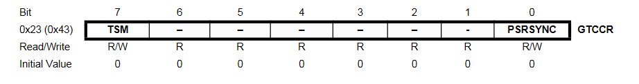


### 1.5.3 32u4的定时器

32u4的时钟系统较为复杂，一共有4个通用定时器，分别为8位定时器**TCNT0**，两个16位带外部触发定时器**TCNT1**和**TCNT3**，以及10位高速定时器**TCNT4**。另外32u4相比传统的AVR添加了定时器比较输出调制模块


### 1.5.3.1 8位定时器TCNT0

32u4的定时器**TCNT0**和16u2的**TCNT0**完全相同，这里不再赘述


### 1.5.3.2 TCNT0相关寄存器

同16u2，略


### 1.5.3.3 16位带捕获定时器TCNT1和TCNT3

16位定时器**TCNT1**和**TCNT3**结构和16u2的完全相同，略


### 1.5.3.4 TCNT1和TCNT3相关寄存器

这里主要记录定时器**TCNT3**的寄存器，定时器**TCNT1**的配置参考之前的16u2，这里不再赘述

**TCCR3A，TCCR3B和TCCR3C寄存器**

定时器**TCNT3**和**TCNT1**在强制比较触发方面有所不同，其余基本相同

地址0x90

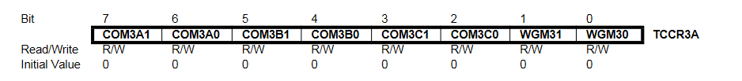

地址0x91

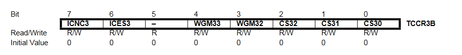

地址0x92，**注意TCCR3C只引出了OC3A输出引脚**

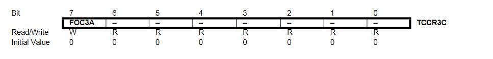

**TCNT3寄存器**

地址0x94（低位L）0x95（高位H）


**OCR3A，OCR3B和OCR3C寄存器**

比较寄存器，地址0x98（**OCR3AL**）到0x9D（**OCR3CH**）

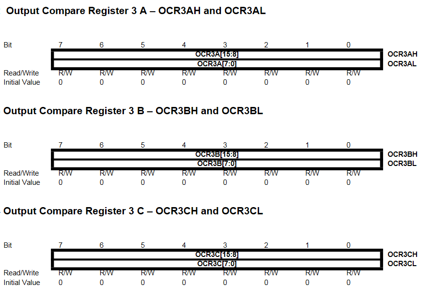

**ICR3寄存器**

地址0x96开始

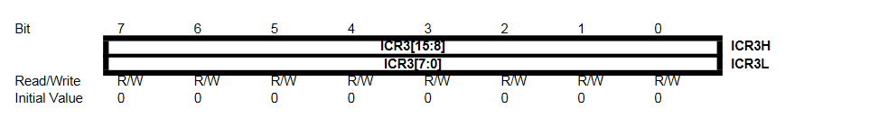

**TIMSK3寄存器**

地址0x71

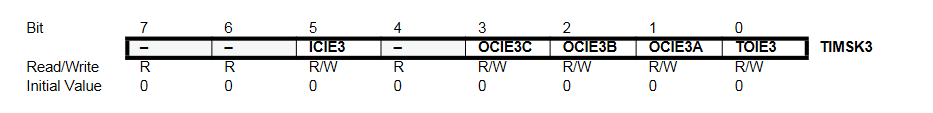

**TIFR3寄存器**

地址0x18(0x38)

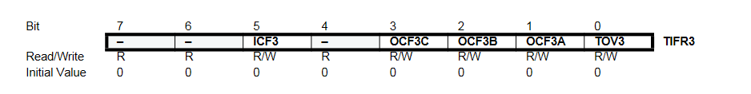


### 1.5.3.5 10位高速定时器TCNT4

10位高速定时器和之前的定时器都不相同，可以使用PLL作为时钟源，最高计数频率不超过64Mhz

电路框图如下

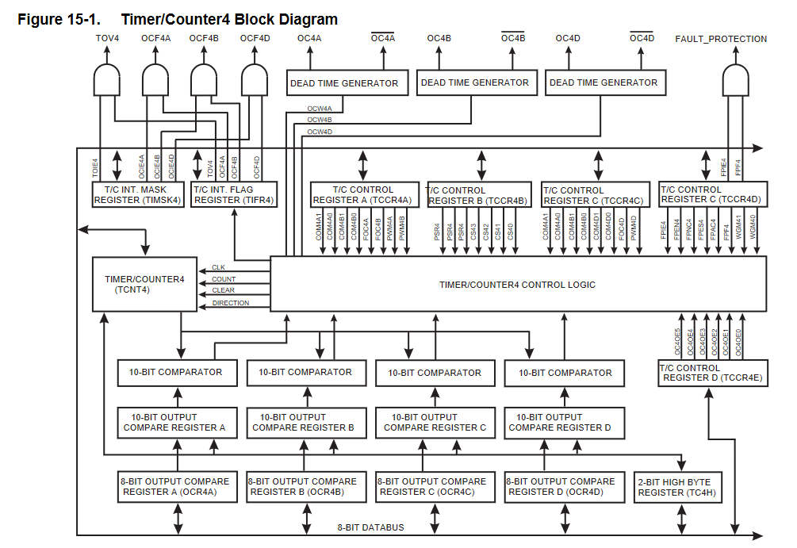

> 分析以上框图，**TCNT4**相比之前的定时器不支持捕获输入以及外部时钟，并且有OC4A，OC4B，OC4D以及对应的互补输出共6个输出（当使能OC4x输出时，这些IO的输出方向依然需要设置），分别对应比较寄存器**OCR4A**，**OCR4B**，**OCR4D**。而**OCR4C**寄存器没有对应的输出，也没有对应的中断，只作为计数TOP寄存器使用。注意这些寄存器长度为8位，而计数器**TCNT4**以及**OCR4x**的高2bit（增强模式下为3bit）可以通过**TC4H**读取（所有寄存器共用），访问方式和16位寄存器方法类似
>
> **TCNT4**可以作为10bit定时器使用也可以作为8bit定时器使用，作为8bit定时器使用时通过**TC4H**将**OCR4C**高2bit全部清0即可
>
> **TCNT4**可以使用高速异步时钟（在PLL中设置），和328P的异步时钟不是一个概念，这里的异步时钟是比系统时钟更快的时钟（PCK），也是由系统时钟倍频而来（多于2x）

> 另外，**TCNT4**的输出端还带有死区时间控制器（**仅在PWM模式有效，且在PWM模式下无法禁用**，只能设置延时为0）。由于32u4的**TCNT4**支持两个互补信号的输出所以可以用于逆变器或电机控制器中，驱动晶体管桥。
>
> > 所谓PWM死区就是为了防止晶体管桥上下两个晶体管同时导通导致短路损坏，在上下管切换时加上的一段空闲时间，使得两个晶体管不会同时导通。
>
> 3个输出端口都支持死区控制，电路结构如下。死区生成器本质是一个4bit计数器，**两个互补输出的死区时间可以分别设置**（通过**DT4**寄存器配置）
>
> 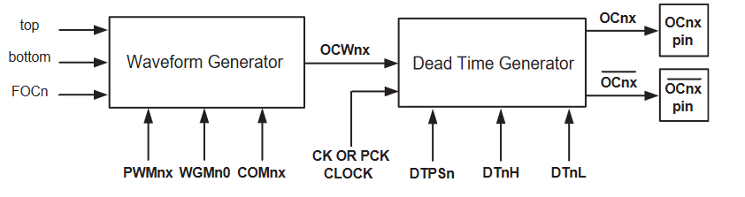

> 定时器**TCNT4**相比之前的定时器还有**增强模式（Enhanced Mode，将TCCR4E中的ENHC4置位）**。所谓的增强模式寄存器定义如下
>
> 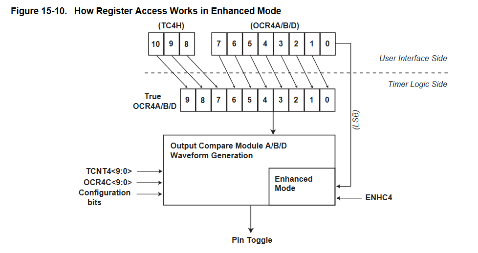
>
> 增强模式下，**TC4H**的最低3bit有效（一般模式是2bit），此时**OCR4x**寄存器的最低（LSB）位用于配置触发输出变化的时机，**置0**和一般模式相同，引脚在总时钟**上升沿**变化，**置1**在总时钟**下降沿**变化。相当于将PWM分辨率提高了一倍（提高到1/2时钟），PWM输出在总时钟上升沿或下降沿都可以变化

> 定时器**TCNT4**还有一个重要特性是异常保护（Fault Protection），可以在外部异常发生时（触发一个中断，可以是外部引脚中断INT0或模拟比较器输出）及时切断PWM引脚输出（**其实就是将COM4xx全部清0断开连接**）
>
> 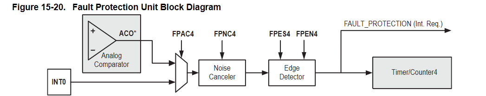
>
> 将**FPEN4**置1可以使能异常保护功能。此时可以由INT0或模拟比较器触发一个异常保护事件，定时器**TCNT4**进入保护模式，将**COM4x**全部清0，同时**FPEN4**也会**自动清0**，比较器输出会被**断开**恢复原始功能（寄存器**PORTx**的输出）。如果将**FPIE4**置1使能中断，此时还会自动触发相应中断，**FPEN4**在此时也会**自动清0**
>
> 异常保护的触发源INT0和模拟比较器同样支持**降噪**，通过置位**FPNC4**使能，会增加触发的延迟（4个时钟周期）

**工作模式**

32u4的**TCNT4**定时器有4种基本工作模式，前3种原理类似不再赘述。该定时器还支持一种**PWM6模式**

> 所谓PWM6模式一般用于控制无刷电机，直接看下面的图片可能更好理解一点
>
> 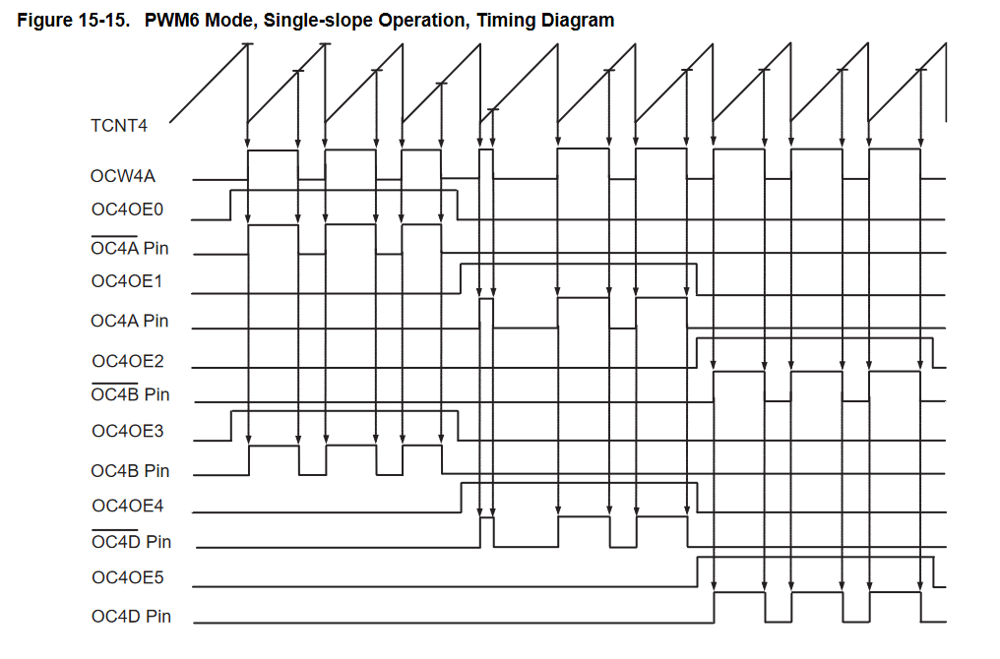
>
> 在PWM6模式下所有6个输出端口的波形事实上都由比较器A生成，通过**OCR4A**设置比较值，**OCR4C**设置计数TOP。计数模式同样有单坡和双坡两种模式，单坡模式下计数到TOP置位**TOV4**中断，双坡模式下计数到BOTTOM置位**TOV4**中断。需要通过相应的**OC4OEx**寄存器设置比较器输出使能。如果在PWM6模式下没有使能，引脚恒定输出0


### 1.5.3.6 TCNT4相关寄存器

**TCCR4A，TCCR4B，TCCR4C，TCCR4D和TCCR4E寄存器**

定时器**TCNT4**共使用5个配置寄存器，如下

地址0xC0

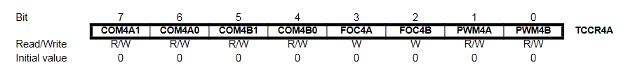

> **COM4Ax**和**COM4Bx**分别为输出端**OC4A**，**OC4B**比较器的输出模式配置
>
> **FOC4x**为强制比较触发。**PWM4x**为对应输出端口的PWM模式使能

地址0xC1

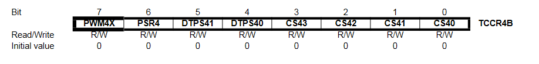

> **PWM4x**为PWM反相输出使能。**PSR4**为**TCNT4**预分频器的复位信号，置1复位。**DTPS4x**为PWM死区生成器的预分频（相对于**TCNT4**的输入时钟分频），如下图所示
>
> 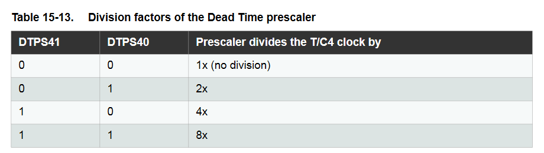
>
> 而**CS4x**为定时器**TCNT4**的预分频选择，时钟源通过**PLLTMx**设定（见[1.3.3.2 PLL时钟源](#1332-PLL时钟源)），如下
>
> 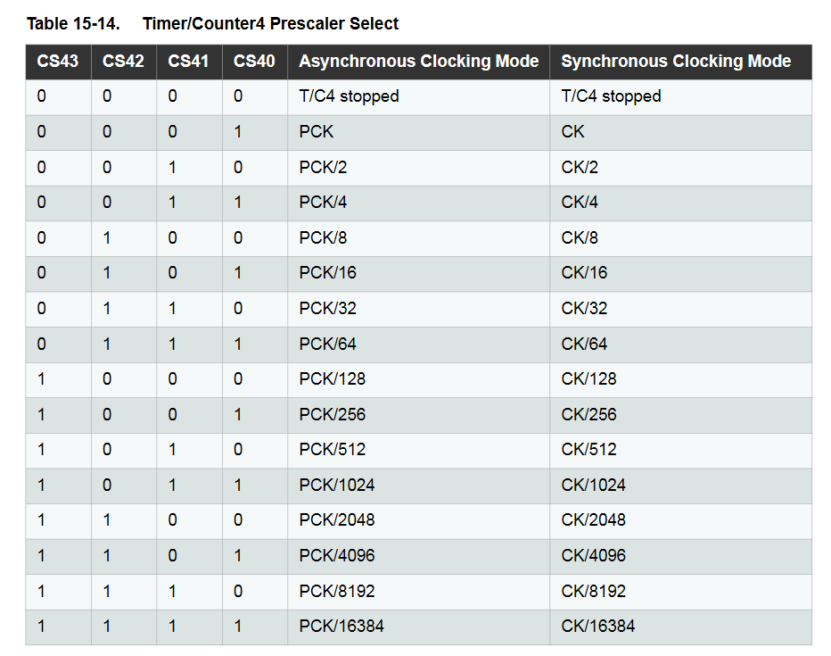

地址0xC2

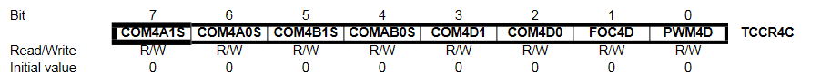

> **COM4AxS**和**COM4BxS**都是**TCCR4A**寄存器中相应**COM4xx**寄存器位的影子寄存器（Shadow Register），**相当于原寄存器**，没有什么用，写入操作时注意
>
> **COM4Dx**是输出端口**OC4D**的比较器输出模式配置。**FOC4D**强制比较触发。**PWM4D**为输出端口**FOC4D**的PWM模式使能

地址0xC3

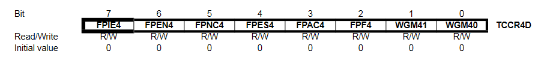

> 寄存器**TCCR4D**主要用于配置异常保护模块（Fault Protection）
>
> 将**FPEN4**置1使能PWM模式下的异常保护功能，**FPIE4**置1使能**异常保护中断**（在触发异常保护事件之后产生的中断）。**FPNC4**置1使能**降噪**（会增加延迟）
>
> **FPES4**用于设置引脚INT0的触发方式，置1使用**上升沿触发**置0使用**下降沿触发**
>
> 将**FPAC4**置1可以使能模拟比较器触发，否则模拟比较器和定时器**TCNT4**之间没有任何联系
>
> **FPF4**是**异常保护中断标志位**，在允许中断时，触发保护时会置1，执行中断服务程序时会和**FPEN4**一起**自动清0**，也可以写1清0
>
> **WGM41**和**WGM40**是基本工作模式设置，和各输出端口的**PWM4x**一起决定比较输出的模式，见下

地址0xC4

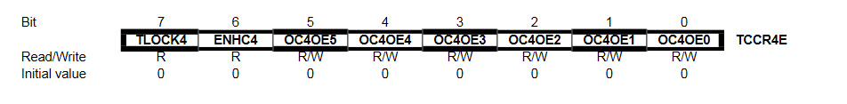

> **TLOCK4**为定时器4的比较寄存器锁。在将**TLOCK4**置1时，向比较寄存器**OCR4x**写入的值**不会马上生效**，要将该位清0新值才会生效，**一般用于同时更改多个比较寄存器**
>
> 将**ENHC4**置1可以使能**增强PWM模式**
>
> **OC4OEx**用于控制在PWM6模式下各引脚的输出与否，对应关系如下
>
> 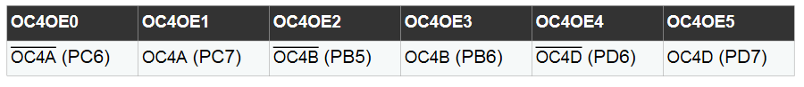

> 综合以上分析，定时器**TCNT4**的基本输出配置和之前的有所不同，三个带互补信号输出端**OC4A**，**OC4B**和**OC4D**，通过**WGM41**，**WGM42**以及对应的**PWM4x**设置模式，如下所示。将**PWM4x**置1可以将对应的**OC4x**输出切换为PWM模式。所有的输出端使用只能相同的PWM模式
>
> 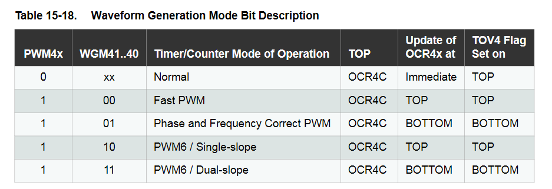
>
> 而输出端口**COM4xx**设置如下
>
> 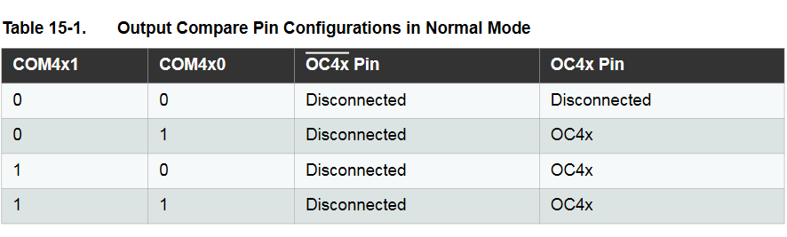
>
> 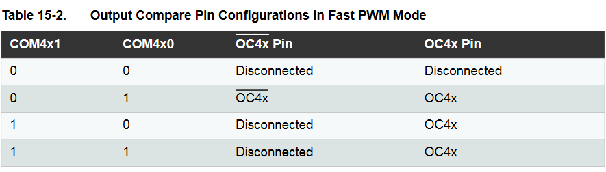
>
> 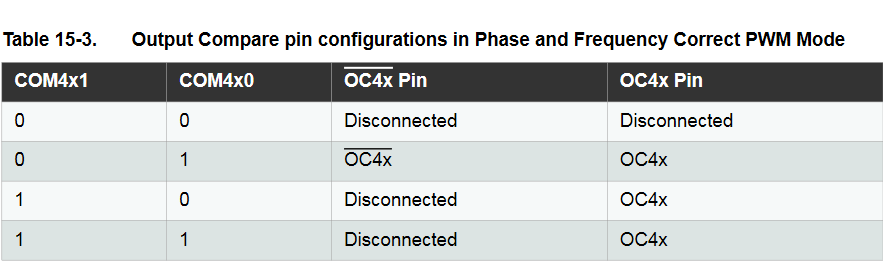
>
> PWM6模式
>
> 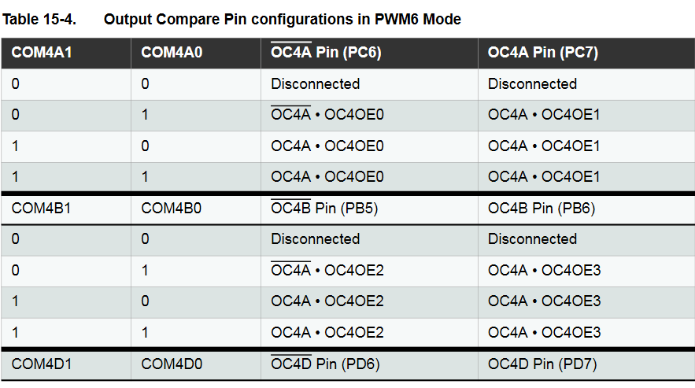
>
> 

**TCNT4寄存器**

地址0xBE

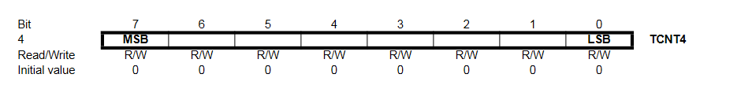

**TC4H寄存器**

地址0xBF

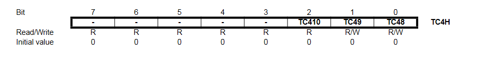

> 这个寄存器是**TCNT4**实现10bit操作的关键，事实上**TCNT4**寄存器以及**OCR4x**寄存器长度都为10bit，**当OCR4C高2bit为0时相当于8bit计数模式**

**OCR4A，OCR4B，OCR4C和OCR4D寄存器**

地址0xCF

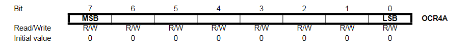

地址0xD0

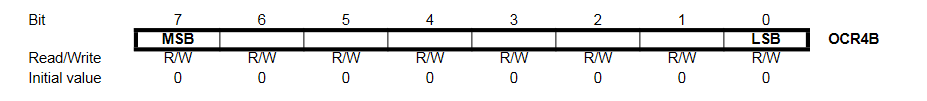

地址0xD1

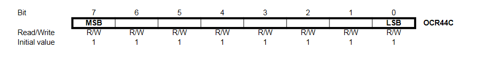

> 上图应为**OCR4C**，该寄存器和其他3个寄存器不同，一旦**TCNT4**和**OCR4C**相等就会将**TCNT4**清0，且**OCR4C**只有这个功能

地址0xD2

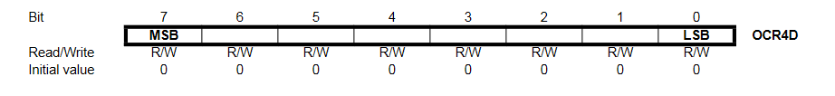

**TIMSK4寄存器**

地址0x72

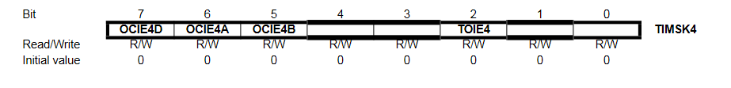

> 中断屏蔽位，置1使能中断，**OCIE4x**分别为对应比较器的比较中断，**TOIE4**为计数溢出中断

**TIFR4寄存器**

地址0x39

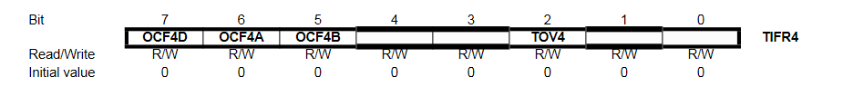

**DT4寄存器**

该寄存器用于设置PWM输出的死区时间。在普通模式下无效

地址0xD4

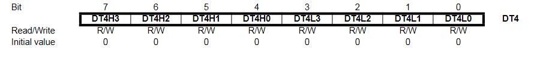

> **DT4Hx**为正相输出**OC4x**相比OCWxx**上升沿**死区延迟（下降沿不可调整），**DT4Lx**为其反相输出相比OCWxx**下降沿**死区延迟（上升沿不可调整），单位为时钟，可以设为0到15之间的值。示意图如下
>
> 


### 1.5.3.7 定时器预分频

32u4同样有同步时钟以及高速异步时钟预分频器的复位寄存器，使用方法同328P

**GTCCR寄存器**

地址0x23(0x43)

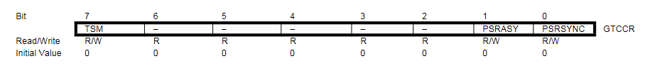


### 1.5.3.8 波形调制模块（OCM1C0A）

32u4的波形调制模块基于定时器**TCNT0**的**OC0A**输出以及定时器**TCNT1**的**OC1C**的输出。由于这两个输出共用引脚，在同时使能这两个比较器输出时会**自动启用波形调制功能**

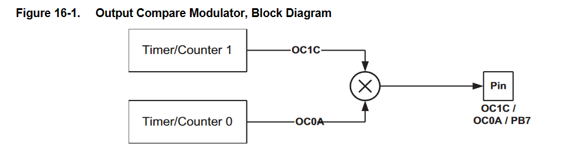

> 输出波形的调制方法由**PORTB7**决定，此时IO输出方向依然由**DDRB7**决定。**PORTB7**为0时使用**与门调制**，为1时使用**或门调制**，如下
>
> 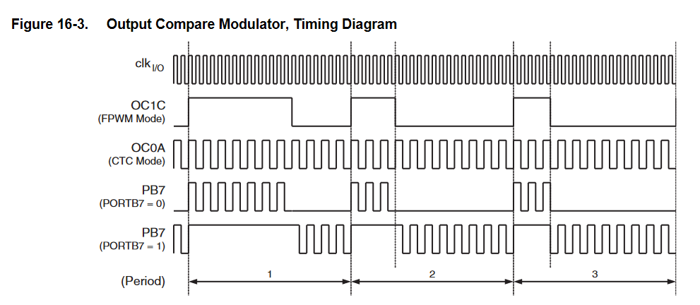


## 1.6 ADC以及比较器

集成ADC是现代单片机常见的部件。只有328P和32u4有ADC，16u2只有模拟比较器

### 1.6.1 328P的ADC

328P拥有一个精度为10bit的逐步逼近型ADC，输入通道有8个，与一般IO复用，建议信号源阻抗在10kΩ以下，可以工作在自动运行或单次转换模式，最高可以支持76.9kSPS的采样率（非满精度，保证满精度最高只有约15kSPS）

328P使用单独的AVcc模拟电源，和数字电源电压Vcc之差不能多于0.3V

注意，**ADC拥有一个参考电压代表测量的最高电压，从AREF引脚输入，也可以设置为内部的1.1V参考电压或AVcc**

使用ADC需要将**PRADC**清0，同时需要置位**ADCSRA**中的**ADEN**

ADC的电路框图如下所示

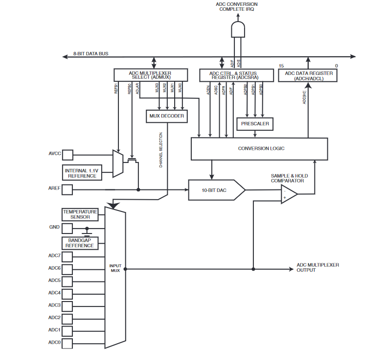

> ADC转换得来的10bit数据存储在两个寄存器**ADCH**和**ADCL**中，可以设置为**左对齐**或**右对齐**。右对齐是最传统的对齐方式，必须依次读取**ADCL**和**ADCH**，原理和16位寄存器的操作相同。而左对齐**常用于8bit精度够用的情况，这样只要使用1个CPU指令周期读取ADCH的内容即可**
>
> 使用右对齐时，尽量连续读取**ADCL**以及**ADCH**保证操作的原子性。在读取了**ADCL**而还未读取**ADCH**时ADC无法将新转换的数据存入到寄存器，**但是此时转换结束中断依然会触发，容易导致异常**
>
> **单次转换模式**可以向**ADSC**置1触发，转换结束以后ADC将数据写入到寄存器，**ADSC**自动清0，同时置位中断标志位**ADIF**
>
> **自动触发模式**可以使用多种时钟源作为触发，需要将**ADATE**置1。使用指定信号源的**上升沿**触发
>
> 如果在一次ADC转换未完成时时钟源再次出现上升沿触发，**该次触发会被忽略**
>
> 注意，**中断指示位即便是在禁用中断的情况下也会置位**，这种情况下需要**在下一次触发转换前将中断指示位清0**才能进行下一次转换

ADC支持的自动转换触发电路如下所示

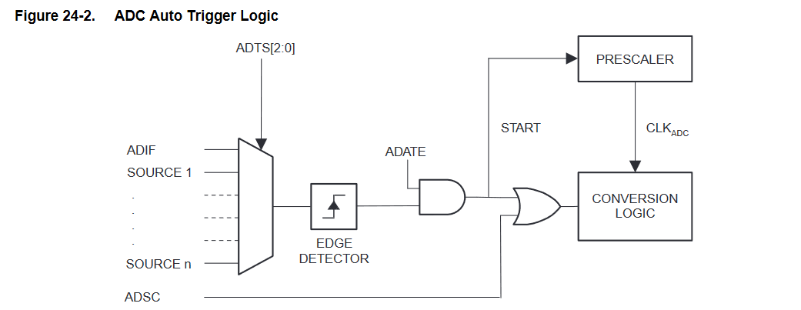

> 可以注意到在自动触发信号源中可以使用中断标志位**ADIF**作为触发信号。此时ADC工作在**自由模式（Free Running Mode）**，在一次转换结束以后会**自动**进行下一次转换同时不断更新寄存器，在这种工作模式下ADC的工作不受**ADIF**影响，所以基本可以随时读取数据。这种模式一般在配置完相关寄存器以后需要**将ADSC置1**触发第一次转换（类似多米诺骨牌效应）
>
> 在使用触发信号源时，单次转换依然可以通过将**ADSC**置1实现。在运行中，一次转换是否完成也可以通过检查**ADSC**是否为1实现（和触发转换的方式无关）

ADC另外可以选择**驱动时钟**的**预分频**（逐次逼近型ADC都有一个驱动时钟），电路如下

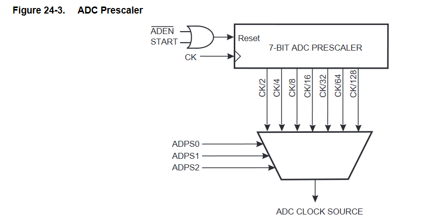

> 输入时钟直接由**系统时钟**分频而来（和CPU时钟频率相同）。328P的官方文档建议，如果需要一个准确的10bit精度测量值，最好将时钟控制在50 ~ 200kHz。如果要求精度不是很高那么可以使用200kHz以上的时钟。分频可以通过**ADPS3:0**设置
>
> 由以上电路分析，一旦将**ADEN**置0，分频器就一直处于复位状态，ADC就永远不会工作
>
> 在ADC的转换时间方面，**单次转换**模式下ADC**转换一次需要13个时钟**，而**第一次开始转换（使能ADEN）由于需要初始化模拟电路（多出了12个时钟用于采样与保持），所以需要25个时钟**
>
> 而在**自动触发**模式下，每次触发事件发生以后还会加上多余的2个ADC时钟的延迟，之后ADC才会开始采样保持。另外最终的逻辑时序同步还需要加上多余的3个CPU时钟
>
> 单次转换模式下第一次的工作时序如下所示，在25个时钟后会自动置位**ADIF**，其余略
>
> 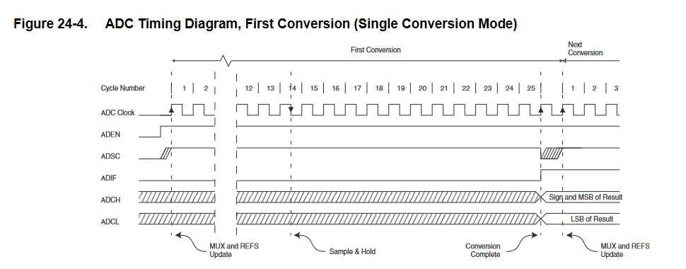

以下补充一些通道和参考电压选择方面的细节

> 通道以及参考电压选择通过**ADMUX**寄存器实现
>
> **ADMUX**寄存器为单缓冲（和之前的双缓冲相同）设计，向**ADMUX**写入新值以后ADC会在合适的时间自动更改配置（在开始转换之前）。所以更改**ADMUX**的配置应该尽量避开这段时间（从**ADSC**置1到之后1个ADC时钟）
>
> 使用**自动触发模式**时，Atmel建议在以下时间写**ADMUX**
>
> 1. 当**ADATE**和**ADEN**全部置0（禁用自动触发，禁用ADC）
>
> 2. 在转换期间，在触发事件以后**1个周期**以后
>
> 3. 一次转换完毕，在**ADIF**清0之后
>
> 无论如何，**最简单的方法就是在每一次转换之后再选择想要使用的通道**
>
> 而参考电压可以使用AREF引脚输入外部基准电压，AVcc或内部1.1V基准电源。Atmel建议在每次切换参考电压之后舍去第一次转换的值（一般误差较大）

另外ADC支持MCU休眠（Sleep）模式下的输入信号降噪功能，此时MCU所有的外设以及CPU核心都停止工作

> 降噪采样的使用步骤如下
>
> 1. 使能ADC，同时需要确保ADC不处在转换过程中。需要使用**单次触发**模式，同时**使能ADC中断**
>
> 2. 进入ADC降噪或Idle模式，ADC会自动在CPU休止后开始一次转换
>
> 3. 在转换完成以后触发ADC中断，**ADIF**置1，CPU被唤醒。如果在此之前有其他的中断发生，CPU会首先唤醒执行此中断，而此时的ADC转换不受影响
>
> **也是ADC的特殊性，MCU进入其他睡眠模式时不会自动切断ADC电源，需要软件将ADEN清0，否则会导致MCU休眠状态下过度的耗电**

328P还有一个内置的温度传感器，同样可以通过ADC读取测量（通过通道8，同时使用内置1.1V参考电压）

> 计算公式如下，k为固定系数，TOS为偏移，都是常量，可以校准以后存储在EEPROM中
>
> 

**相关寄存器**

**ADMUX寄存器**

该寄存器用于设置VREF参考或输入通道

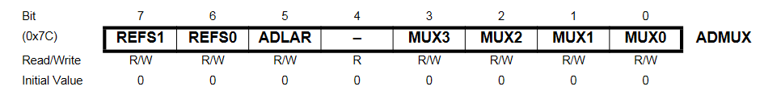

> 其中VREF参考设置**REFSx**定义如下，有3种可选的参考源
>
> 
>
> 将**ADLAR**置1时ADC会将转换结果在**ADCH**和**ADCL**中**左对齐**存放
>
> **MUXx**用于设置用于输入的模拟通道，定义如下
>
> 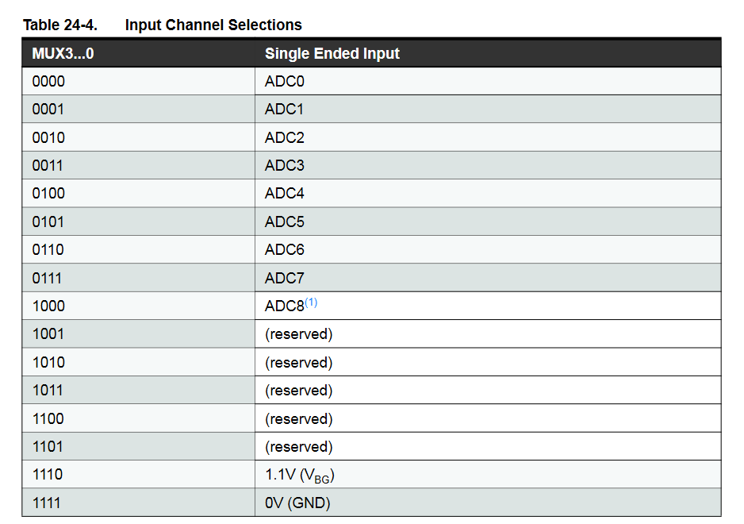

**ADCSRA和ADCSRB寄存器**

这两个寄存器是主要的ADC工作控制寄存器


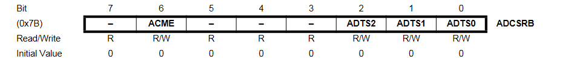

> **ADEN**是ADC的总开关，将ADEN置0会终止当前的转换
>
> **ADSC**置1开始转换，同时用于当前ADC的转换状态
>
> **ADIE**和**ADIF**分别为ADC的中断使能和中断标记。**ADIE**置1使能中断，**ADIF**在转换结束以后置1，在执行中断服务程序时自动清0，否则需要软件**写1**清0
>
> **ADATE**置1使用自动触发模式
>
> **ADPS2:0**用于设置ADC输入驱动时钟的预分频，定义如下
>
> 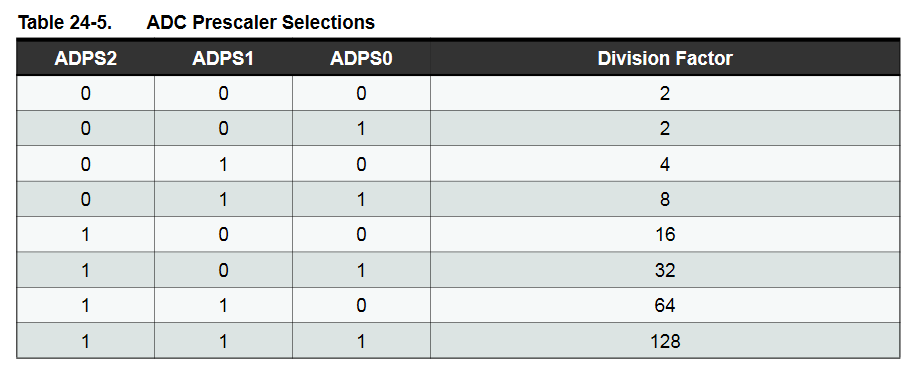

> **ACME**和模拟比较器有关，见之后的内容
>
> **ADTS2:0**用于设置自动触发信号源，定义如下
>
> 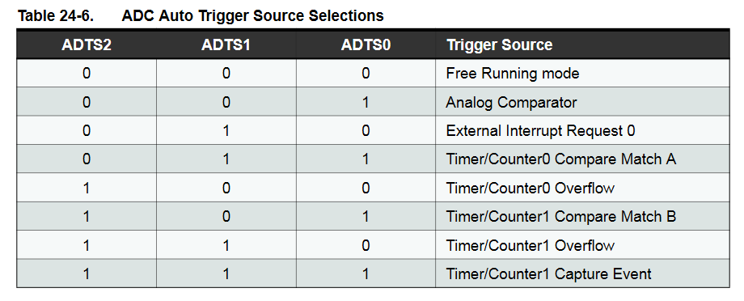

**ADCL和ADCH寄存器**

转换结果存储

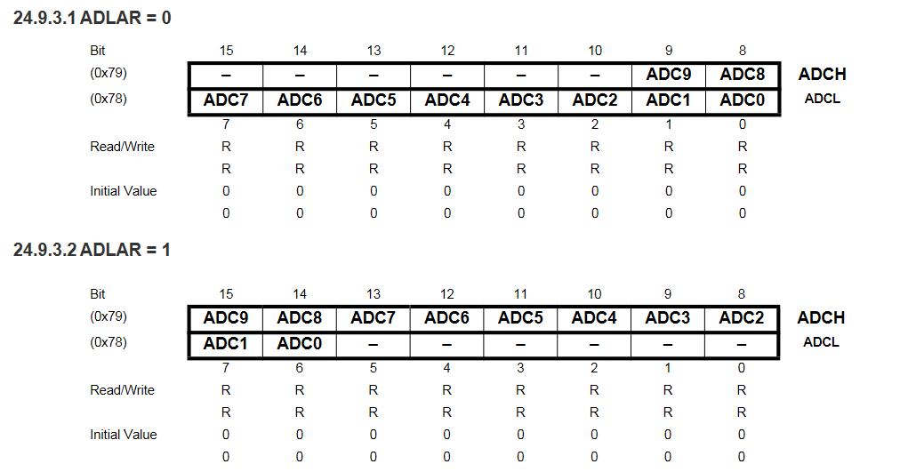


**DIDR0寄存器**

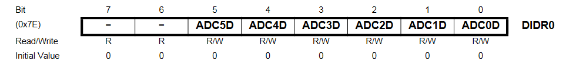

> 该寄存器用于禁用对应ADC引脚的数字输入缓冲（Digital Input Buffer）。当使用对应输入通道时建议将对应**ADCxD**置1，降低IO功耗


### 1.6.2 328P的模拟比较器

模拟比较器的电路如下

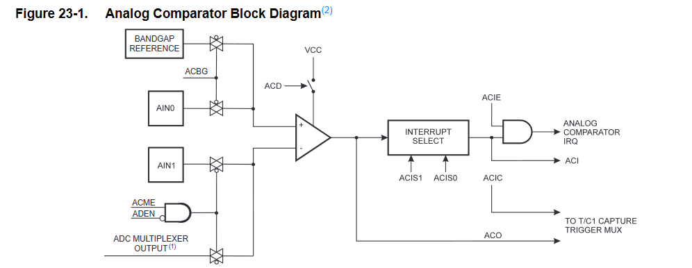

> 在外部引脚方面，比较器可以使用AIN0作为同相输入端，使用AIN1作为反相输入端。同相输入端另外可以选择使用内部1.1V参考电压，而反相输入端可以使用ADC的任意输入通道。此时需要关闭ADC（要将**ADEN**置0），模拟输入通道是ADC和比较器**互斥**使用的

**相关寄存器**

**ADSRB寄存器**

关键在于**ACME**

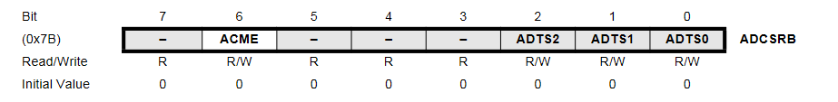

> 将**ACME**位置1同时关闭ADC可以设置比较器的反相输入端

**ACSR寄存器**

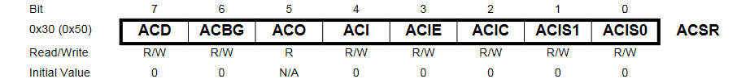

> **ACD**是模拟比较器的总开关（Disable），置1切断比较器的电源。**注意更改该bit时需要禁用比较器中断**
>
> 将**ACBG**置1，比较器**同相输入端**使用内部1.1V基准源，否则使用AIN0作为输入
>
> **ACO**为比较器输出
>
> **ACIE**为比较器中断使能，**ACI**为中断标志位，当比较器触发事件时会置1。清0过程略
>
> **ACIC**和定时器**TCNT1**有关。之前提到过定时器1可以使用模拟比较器输出作为捕获触发信号，将**ACIC**置1可以将定时器**TCNT1**捕获触发设置为比较器
>
> **ACISx**可以用于设置模拟比较器的中断触发方式，定义如下，有3种触发方式可用。**注意更改该bit时需要禁用比较器中断**
>
> 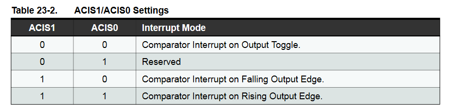

**DIDR1寄存器**

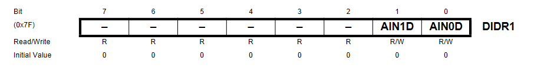

> 将**AINxD**置1可以禁用AIN1和AIN0对应IO数字输入缓冲


### 1.6.3 16u2的模拟比较器

16u2没有ADC，其比较器正相输入端可以使用AIN0或内部基准电源，反相输入端可以使用引脚AIN1到AIN6一共6个输入端，如下

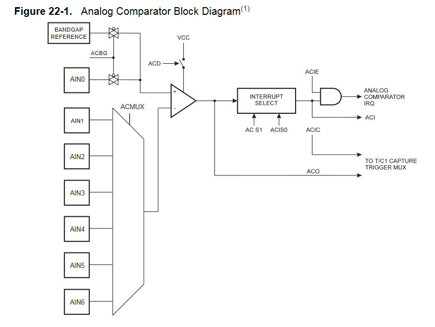

**相关寄存器**

**ACSR寄存器**

定义和328P完全相同，略

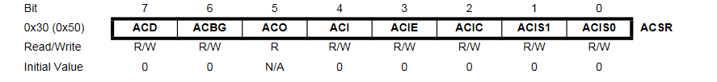

**ACMUX寄存器**

用于选择反相输入端通道


> 定义如下
>
> 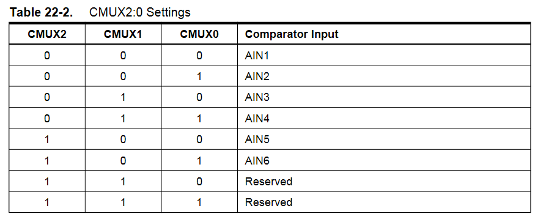

**DIDR1寄存器**

一共控制7个通道输入端口

地址0x7F

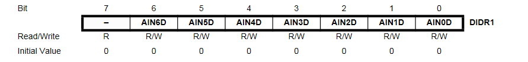


### 1.6.4 32u4的ADC

32u4的ADC支持12个通道的输入，以及额外添加的差分放大器功能，可以用于差分测量。另外注意32u4的内部基准源为2.56V

ADC的电路框图如下所示

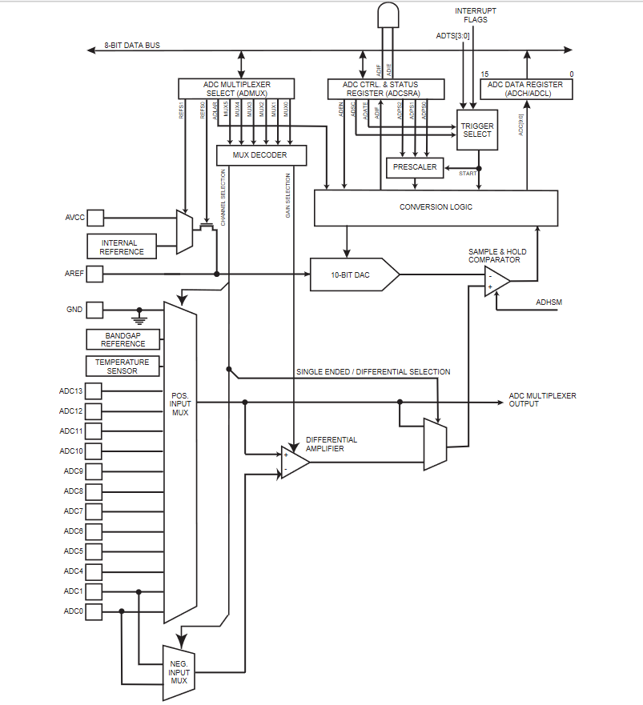

> 32u4的ADC除了添加了差分放大器以外其余部分的使用以及工作原理和328P相同，这里只对差分放大器模式做一些说明
>
> 使用差分放大器时，ADC的转换时间和普通转换模式相等，但是在使用差分放大器时开始转换的时机是对准时钟CKADC2的（由ADC输入时钟2分频而来）。在时钟CKADC2为**低电平**时转换**可以即时触发**而无延迟，转换耗费13个时钟；为**高电平**时会**等待1个ADC时钟之后才会触发**，需要耗费14个时钟。在**自动连续转换（Free Running）**模式下由于每次转换结束以后时钟都是高电平所以每次都需要14个时钟。
>
> 注意，在使用**自动触发模式**下如果使用了差分放大器，由于起始时钟的稳定性问题，需要在每一次转换结束以后开关一次ADC（**将ADEN清0之后再置1**），这样测量到的才是有效的值
>
> 另外，差分放大器的增益是可以调节的，通过**ADMUX**设置
>
> 差分放大器计算公式如下
>
> 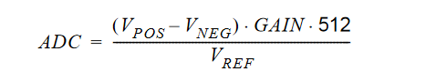

**相关寄存器**

**ADCSRA和ADCSRB寄存器**

ADC的控制寄存器，定义和之前不同

地址0x7A


地址0x7B

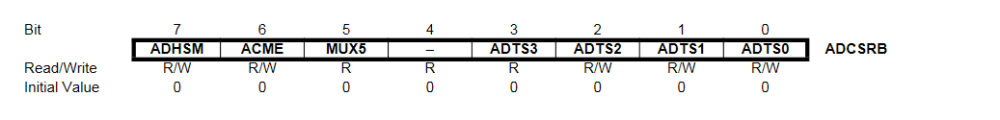

> **ADCSRA**寄存器中**ADPS2:0**用于设置分频，定义如下
>
> 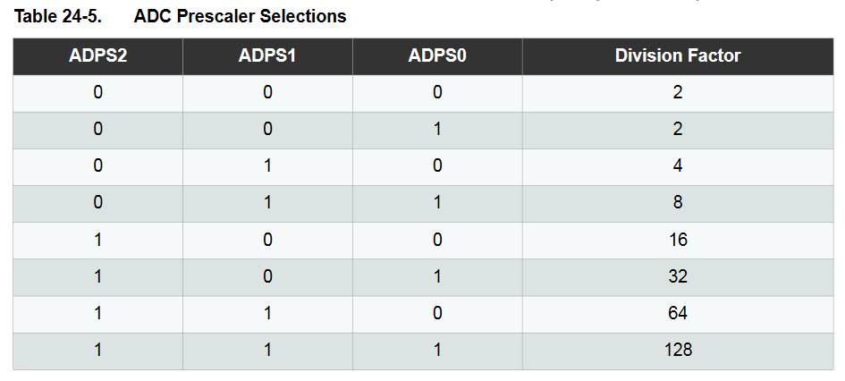
>
> 32u4支持**ADC高速模式**，这种模式下ADC的转换速率会变快，通过将**ADHSM**置1启用
>
> 而**ADTSx**自动触发源的选择定义如下
>
> 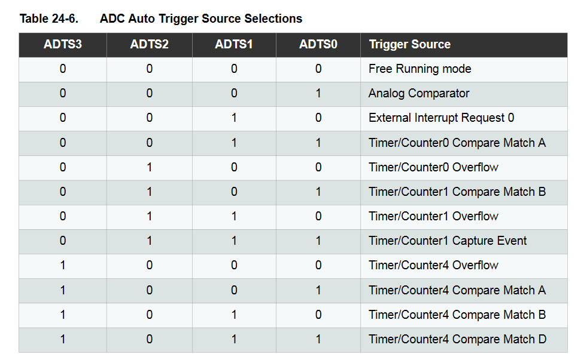

**ADCL和ADCH寄存器**

地址0x78，0x79

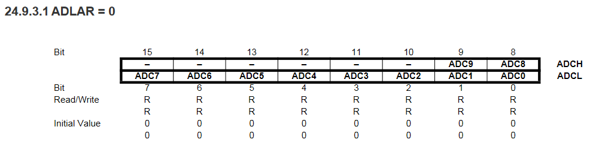

**ADMUX寄存器**

地址0x7C

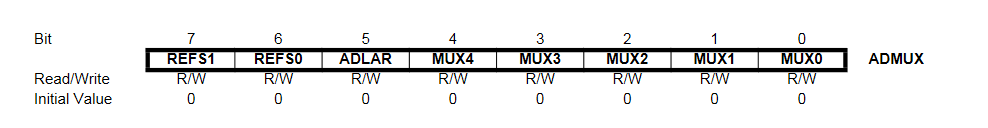

> 参考电压选择**REFSx**定义如下
>
> 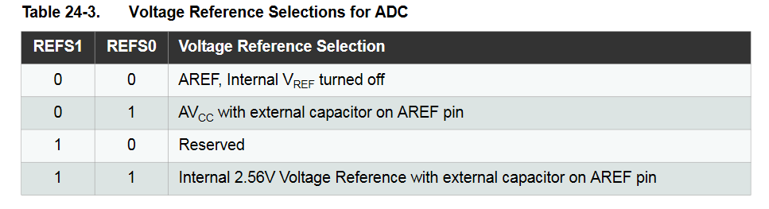
>
> **ADLAR**置1使用左对齐
>
> 可以通过**MUX5:0**选择输入通道以及差分放大器的增益，**MUX5**在**ADCSRB**寄存器中，定义如下
>
> 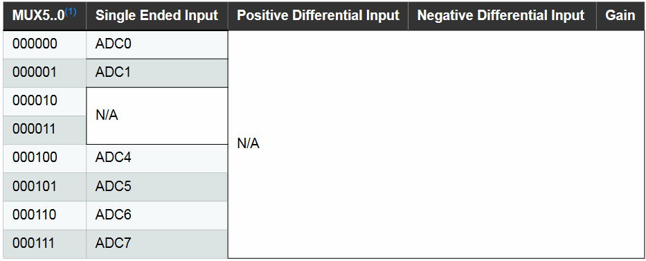
>
> 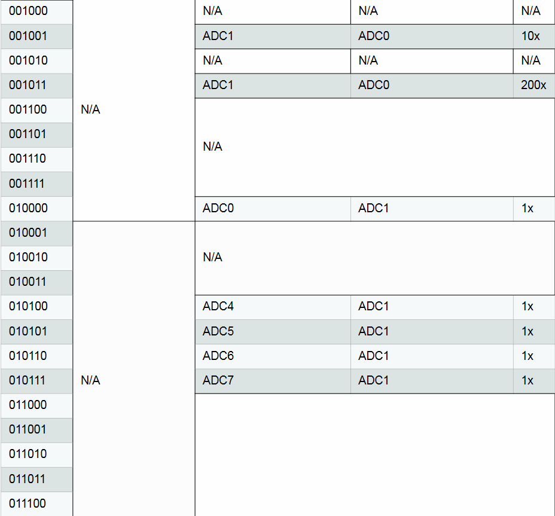
>
> 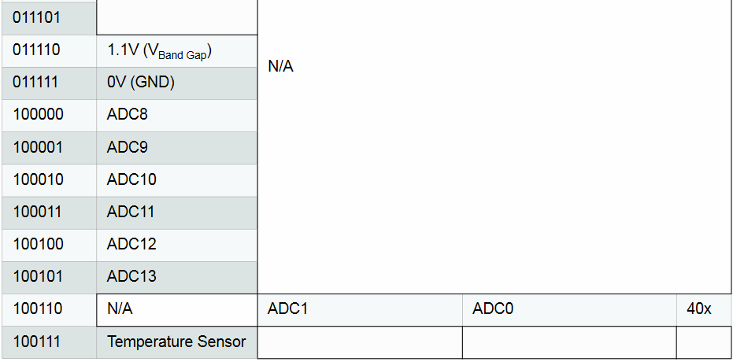
>
> 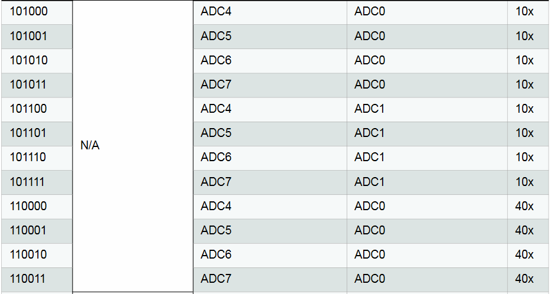
>
> 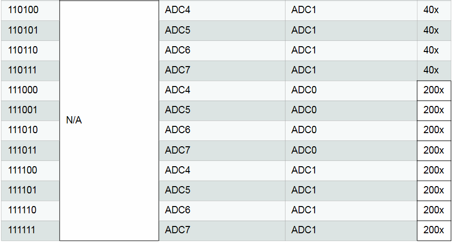

**DIDR0和DIDR2寄存器**

地址0x7E


地址0x7D

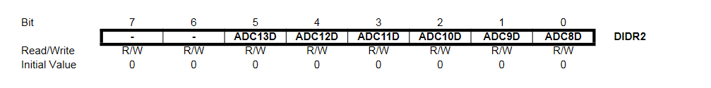

> 置1禁用对应模拟通道引脚的数字输入缓冲


### 1.6.5 32u4的模拟比较器

32u4的模拟比较器同样和ADC互斥使用。32u4的比较器的同相输入端可以使用内部基准电压源或AIN0，反相输入端可以使用基准电压源或ADC的输入

**相关寄存器**

**ADCSRB寄存器**

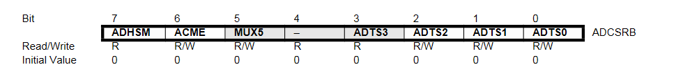

> 将**ACME**置1同时关闭ADC（将**ADEN**置0）可以选择比较器反相输入端的信号源

**ACSR寄存器**

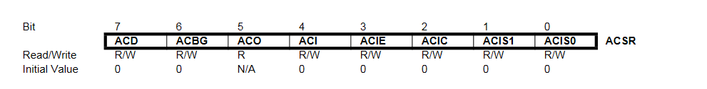

> 定义和328P相同。触发信号选择**ACISx**定义如下
>
> 

**DIDR1寄存器**

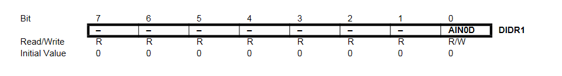

> 只有1位有效，控制AIN0的数字输入缓冲


## 1.7 UART

UART是最通用的串行通信接口之一

328P、16u2和32u4的UART模块基本完全相同，16u2和32u4相比328P只是多出了RTS和CTS流控制，这里不再分开讲解

使用USART时需要将**PRUSART0**置0使能

和8051一样，AVR的UART同样支持同步模式，所以称为USART。区别是AVR还多出了标准的SPI模式，并且在同步以及标准SPI模式下使用了单独的时钟引脚XCK（和PD4共用），有独立的发送接收端口

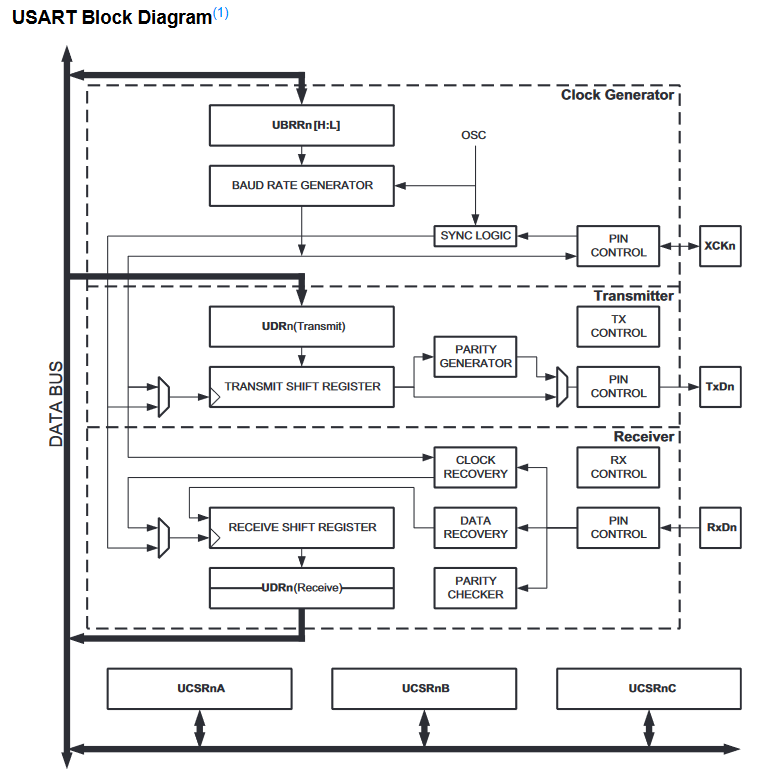

> USART模块包含了一个时钟发生器，可以工作在4种模式下，有**一般异步模式**，**倍频异步模式**，**主机同步模式**以及**从机同步模式**。通过**UMSEL0**位选择同步或异步模式，通过**U2X0**选择是否使用倍频模式
>
> 在同步模式下通过引脚**XCK0**的方向设定**DDR_XCK0**设定主从模式（使用外部时钟还是内部时钟），在该模式下最好将**U2X0**置0

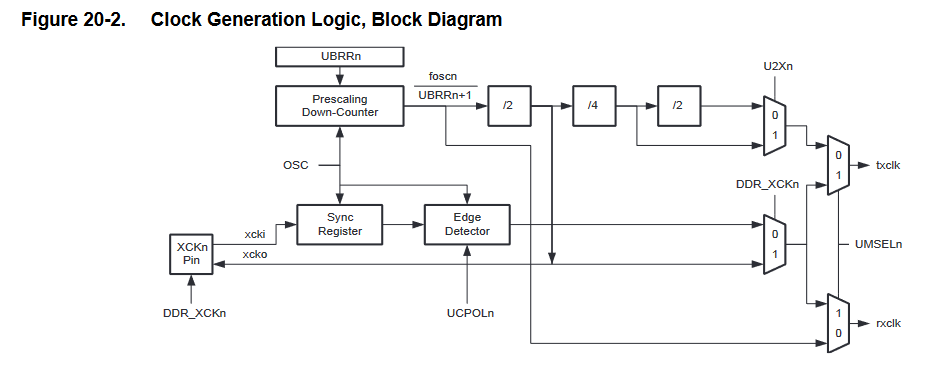

> 以上为时钟电路。时钟电路的基频通过波特率发生器生成，可以通过**UBRR0**配置。可以发现使用异步模式时（**UMSEL0**为0），发送模块的时钟可以使用发生器输出的**16分频**（**U2X0**为0）或**8分频**，而接收器直接使用了发生器的输出作为基频。
>
> 而在同步模式时（**UMSEL0**为1），**主机模式**下（**DDR_XCK0**为1）整个串口系统（发送器，接收器，XCK引脚）都是使用了波特率发生器的**2分频**。而在**从机模式**下，需要从XCK引脚输入时钟。注意在同步模式下输入时钟最大不能超过系统时钟的1/4。另外，同步模式的**数据采样模式**可以通过**UCPOL0**配置，置1使用XCK时钟的**下降沿发送**、**上升沿采样**，置0反之。主机以及从机一般使用相同的配置，同时收发
>
> 波特率发生器实质是一个**递减计数器**，使用系统时钟源。每次计数器计数到0时会产生一个脉冲，同时立即将**UBRR0**中的值载入。这个脉冲就是USART的基本时钟


### 1.7.1 帧格式

AVR的UART支持多种帧格式，排列组合可以有30种，如下

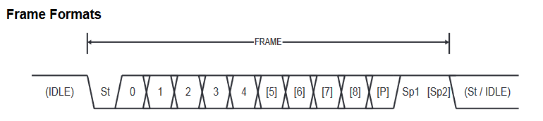

> AVR的UART帧有1个固定的起始位
>
> 之后的数据位可以配置为5-9bit长
>
> 数据位之后的奇偶校验位可以配置为无奇偶校验，以及奇校验（连带校验位奇数个1）或偶校验（连带校验位偶数个1）
>
> 最后的结束位可以为1个或2个


### 1.7.2 初始化

建议在初始化时禁用UART中断或全局中断

> 初始化步骤如下
>
> 1. 禁用中断
>
> 2. 通过**UBRR0**设置波特率
>
> 3. 使能发送器以及接收器
>
> 4. 设置帧格式


### 1.7.3 数据发送

数据发送模块可以通过使能**TXEN**开启，此时TXD所在引脚会切换到串口输出模式。如果使用的是同步模式那么此时**XCK**引脚也会覆盖原来的功能

数据发送是一个自动的过程。只要向收发寄存器**UDR0**写入新值发送器就会自动发送一次。如果发送完发现没有新值，就会进入到空闲模式，不再发送。如果发送完发现有新值，就会立即进行下一帧的发送

> 注意，发送长度为9的帧时，需要**在向UDR0写低8bit之前，将最高的第9位写入TXB8**

**发送中断**

> 每一次发送开始之后**数据从UDR0转移到发送的移位寄存器中**，**UDRE0**会自动置1，代表可以向**UDR0**写新值。每一次**发送结束**以后**TXC0**会自动置1，代表一次发送完成。这两个位都可以用于生成中断，分别通过**UDRIE0**以及**TXCIE0**使能。Atmel建议每一次写**UCSR0A**时都将**UDRE0**清零
>
> 在使用**UDRE0**中断时，需要在中断服务程序中向**UDR0**写新值（此时**UDRE0**自动清零）或将**UDRIE0**清零禁用中断，否则会循环触发中断
>
> 而**TXC0**触发的中断在执行中断服务程序时会自动将**TXC0**置0，用户一般无需操作（可以写1置0）


### 1.7.4 数据接收

数据接收同理，可以通过将**RXEN0**置1使能数据接收

接收器模块一旦接收到一个起始位，就触发一次接收，直到接收到结束位，代表接收完毕，此时**RXC0**置1。从第二个结束位开始都会被接收器忽略

接收器**有一个长度为2字节的缓冲，如果缓冲已满，那么之后的数据到来后就会丢失**。缓冲区可以通过连续的读取**UDR0**进行清除（flush，直到**RXC0**变为0）

> 接收长度为9的帧时，需要首先在**RXB80**读取第9位，之后再读取**UDR0**
>
> 另外，接收器还有3个纠错指示位，分别为帧错误**FE0**，数据丢失**DOR0**以及奇偶校验错误**UPE0**。和**RXB80**一样，这些位也需要在**UDR0**之前读取
>
> **FE0**为1时表示当前接收到的帧结束位有错误（为0），可以用于侦测不同步的情况。Atmel建议写入寄存器时将该位置0
>
> **DOR0**表示当前已经有数据丢失，在之后顺利转移读取之后会清0
>
> **UPE0**为1时表示本次接收到的帧奇偶校验错误（此时使能奇偶校验功能）

**接收中断**

接收器有1个中断**RXC0**，可以通过**RXCIE0**使能，表示当前**UDR0**中还有未取走的数据，读取**UDR0**后会自动清0

**异步接收时钟调节**

UART模块会自动根据输入对UART的时钟进行调节，使得时钟同步，接收器事实上会对传输过来的1bit数据进行3次采样并舍入，和8051相同

**多机通信**

使用多机通信需要涉及到地址的使用。AVR的多机通信原理和8051基本相似，需要将从机的**MPCM0**置1用于地址帧以及数据帧的区分过滤

> 当UART的帧长度设置为5-8bit时，UART使用第一个结束位区分当前是数据帧（0）还是地址帧（1）。当工作在帧长度为9bit时UART使用最后第9位区分当前是数据还是地址帧。如果是数据帧那么会被使能**MPCM0**的从机忽视，如果是地址帧就会被所有从机接收。**建议在多机通信模式中使用9位长度的帧，这也能和8051等其他设备的UART兼容**
>
> 主机发送的帧类型都需要通过软件设定


### 1.7.5 USART相关寄存器

**UDR0寄存器**

该寄存器为存储发送以及接收数据的主寄存器

328P地址0xC6，16u2地址0xCE，32u4地址0xCE（**32u4中为UDR1，以下所有寄存器同理**）

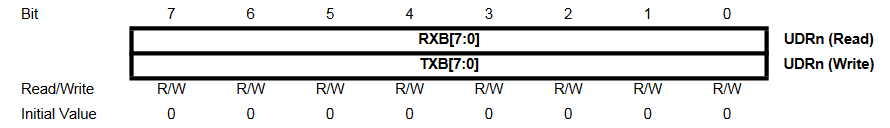

> 发送和接收使用两个物理上独立的寄存器，使用同一个地址，通过读写操作区分

**UCSR0A寄存器**

该寄存器为UART的主要控制寄存器，注意每次读取**UCSR0A**都要在读取**UDR0**之前，因为读取**UDR0**会改变**UCSR0A**中的值

328P地址0xC0，16u2地址0xC8，32u4地址0xC8

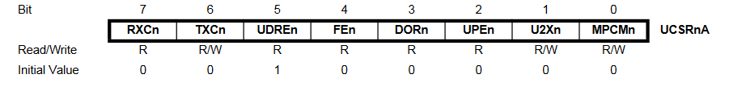

> **RXC0**为接收结束标志位，置1表示当前接收缓冲（2字节）**有未读取的数据**，在**读取后**会自动清0，可以屏蔽该中断
>
> **TXC0**为发送结束标志位，置1表示当前发送移位寄存器中的数据已经全部输出并且**UDR0**中不再有新值，在**执行中断服务时会自动清0**，可以屏蔽该中断
>
> **UDRE0**为发送寄存器空闲标志，置1表示当前发送寄存器**UDR0**可以接收新数据，**在向UDR0写新值时会自动清0**，可以屏蔽该中断
>
> **FE0**为帧错误标志位，结束位出错，不能触发中断。向**UCSR0A**写值时需要对该位写0
>
> **DOR0**为数据丢失标志位，一般在接收缓冲满时再次接收新数据触发，不能触发中断。向**UCSR0A**写值时需要对该位写0
>
> **UPE0**为奇偶校验错误标志位，不能触发中断。向**UCSR0A**写值时需要对该位写0
>
> **U2X0**为**异步模式**下发送模块的分频，置0使用波特率定时器溢出频率的16分频，置1使用8分频
>
> **MPCM0**用于异步多机通信，置1可以使从机忽略数据帧，只接收地址帧

**UCSR0B寄存器**

328P地址0xC1，16u2地址0xC9，32u4地址0xC9

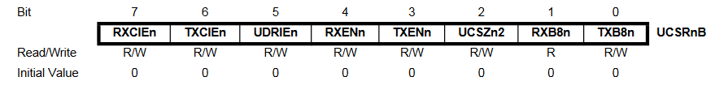

> **RXCIE0**，**TXCIE0**以及**UDRIE0**分别为之前**RXC0**，**TXC0**以及**UDRE0**中断的屏蔽位，置1使能中断
>
> **RXEN0**以及**TXEN0**分别为接收模块以及发送模块的使能总开关
>
> **RXB80**以及**TXB80**分别为9bit帧长模式下接收数据的第9位以及发送数据的第9位，都需要在**UDR0**之前读或写
>
> **UCSZ02**见下

**UCSR0C寄存器**

该寄存器为UART的主要状态控制寄存器

328P地址0xC2，16u2地址0xCA，32u4地址0xCA

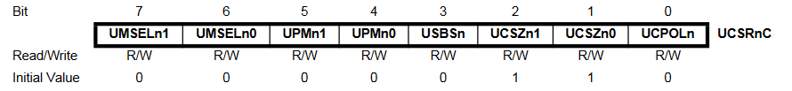

> **UMSEL0x**用于设置基本的工作模式，如下，00为一般的异步模式，01为同步模式，11为标准SPI模式
>
> 
>
> **UPM0x**用于设置奇偶校验，定义如下，00禁用奇偶校验，10使用偶校验，11使用奇校验
>
> 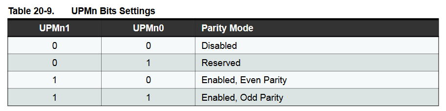
>
> **USBS0**用于设置结束位位数，置0使用1位结束位，置1使用2位校验位
>
> **UCSZ0x**用于设置一帧数据的位数，定义如下，可以设置为5到9位
>
> 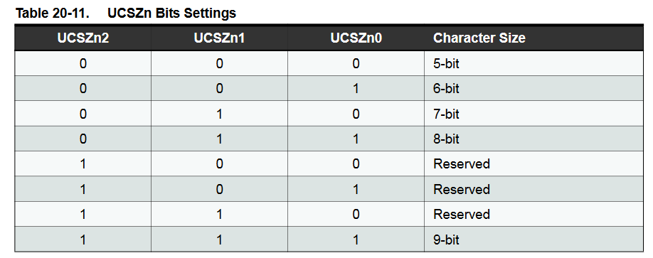
>
> **UCPOL0**用于控制同步模式下数据的发送以及接收相对时钟的关系。**异步模式下需要置0**

**UCSR0D寄存器**

16u2地址0xCB，32u4地址0xCB

该寄存器只在16u2以及32u4有，用于流控制使能RTS以及CTS引脚

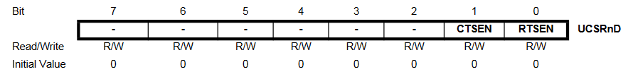

> 分别用于使能CTS以及RTS引脚，在#CTS输入为0时表示本机可以发送，在RTS输出有效时通知接收方本机可以接收

**UBRR0H和UBRR0L寄存器**

波特率时钟发生器加载值

328P地址0xC4，16u2地址0xCC，32u4地址0xCC

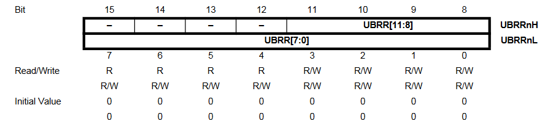


### 1.7.6 标准SPI模式

这种模式被称为**MSPIM**模式，并且只支持SPI主模式，所以该模式下时钟输出引脚**DDR_XCK0**需要配置为1（输出）才能正常使用

另外这种模式下的时钟为固定的波特率发生器频率的1/2

在这种模式下，UART的发送以及接收控制逻辑都已经被禁用，但是在寄存器中需要使能**TXEN0**，而**RXEN0**可以选择性开启。3个中断依然可用，但是错误校验功能在该模式下不再有用，错误校验位永远为0

可以配置4种SPI模式如下。其中Sample指的是输入采样，Setup指的是输出改变。而Leading Edge以及Trailing Edge指的是传输开始以及结束时的边沿类型

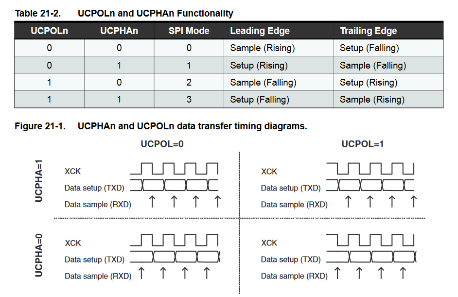


### 1.7.7 MSPIM模式相关寄存器

**UDR0寄存器**

略

**UCSR0A寄存器**

中断位，略

328P地址0xC0

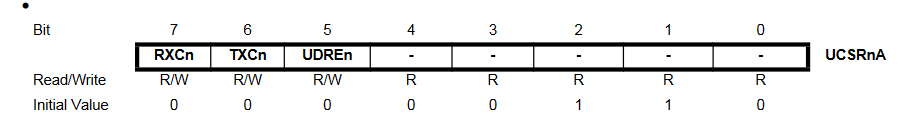

**UCSR0B寄存器**

略

328P地址0xC1

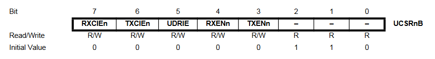

**UCSR0C寄存器**

328P地址0xC2

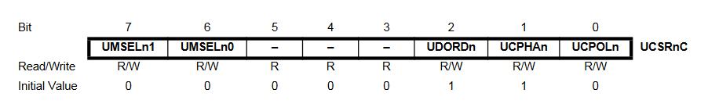

> 将**UMSEL0x**都设为1
>
> **UDORD0**用于设置数据输出顺序，置0首先输出MSB，置1首先输出LSB
>
> **UCPHA0**以及**UCPOL0**见前

**UBRR0H和UBRR0L寄存器**

略


## 1.8 SPI

SPI是一种非常简单的同步串行通信协议，是一种业界标准。AVR中的SPI只有两个状态控制寄存器以及一个数据寄存器

SPI拥有一个同步时钟。两个数据IO接口分别为**MOSI**（主机输出从机输入）以及**MISO**（主机输入从机输出）。单片机的SPI工作在主机模式（Master）时，**MOSI**配置为输出端口而**MISO**配置为输入端口，从机模式（Slave）时**相反**，**MOSI**配置为输入端口而**MISO**配置为输出端口。主机的**MOSI**连接从机的**MOSI**，**MISO**同理。时钟由主机输出

\#SS信号为SPI的从机选择信号，低电平有效，在主机模式时为输出，在从机模式时为输入。主机模式下\#SS需要使用软件控制输出高低电平，而在从机模式下\#SS作为输入会自动控制从机的数据传输

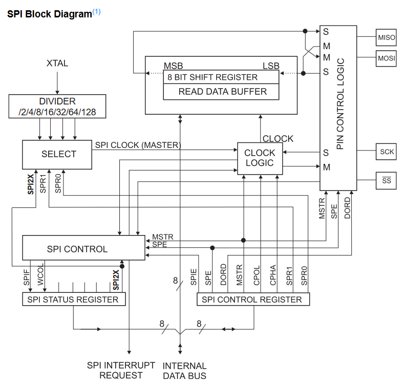


### 1.8.1 工作原理

SPI在主机模式以及从机模式下的工作流程如下

**主机模式下**，想要发送一帧数据之前，可以使用软件使能\#SS（如果需要使用从机选择功能的话），之后向发送数据寄存器**SPDR**写入想要发送的数据，发送器会**自动输出时钟并开始发送数据**。在输出一个字节以后，输出时钟**自动中断**同时将发送结束标记位**SPIF**置1。如果此时使能了传输结束中断**SPIE**那么此时会触发一次中断。之后可以继续向发送寄存器写入数据进行发送或将\#SS置为无效**结束传输**，此时发送的最后一字节数据依然会留存在发送寄存器中

**从机模式下**，如果\#SS输入无效，那么从机的MISO输出会保持为高阻态，此时就可以向发送寄存器**SPDR**写入想要发送的值，在主机使能\#SS同时向从机发送时钟，从机的**SPDR**中的数据就会在主机时钟的控制下依次输出。和主机模式相同，如果将**SPIE**置1，**SPIF**在传输完一帧数据以后也会置1并产生中断

SPI拥有1字节的发送缓冲，以及2字节的接收缓冲，所以接收数据时需要在下一字节完全进入之前取走当前字节


### 1.8.2 初始化配置

**主机模式**

主机模式下的初始化**需要使用软件将MOSI以及SCK引脚置为输出模式**，\#SS看情况而定，而MISO已经自动置为输入模式无需配置。之后可以使能SPI并设置SPI的工作模式

> 注意，在主机模式下如果\#SS被设置为输入（不输出），该引脚需要上拉保证发送的正常工作。如果该引脚被拉低，**主机会认为是另一个主机在向从机发送数据从而变为从机模式，同时也会触发SPIF中断（使能SPIE时）**

**从机模式**

从机模式下的初始化**可以使用软件将MISO引脚置为输出模式**，其余引脚\#SS，MOSI，SCK已经自动置为输入模式

> 在从机模式下使用\#SS引脚有个优势，就是方便数据包同步。在\#SS无效时从机的控制逻辑会自动进行复位，同时丢弃接收缓冲中的不完整数据


### 1.8.3 相关寄存器

**SPCR寄存器**

地址0x2C(0x4C)

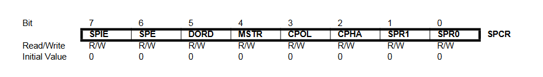

> **SPIE**为**SPIF**中断使能，置0屏蔽，见下
>
> **SPE**为SPI使能总开关，置1使能
>
> **DORD**为SPI数据帧发送顺序设定。置0先发送最高位MSB，置1先发送最低位LSB
>
> **MSTR**为主机模式选择，置1使用主机模式。在主机模式下将\#SS拉低（此时配置为输入）会导致该位清0从而进入从机模式
>
> **CPOL**以及**CPHA**用于配置收发数据的时序，定义见下图
>
> 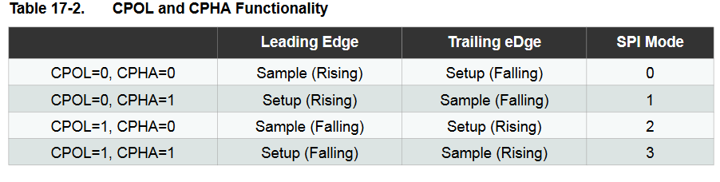
>
> **SPR1**以及**SPR0**和**SPSR**中的**SPI2X**一起可以用于设置SPI工作时钟的分频，定义如下
>
> 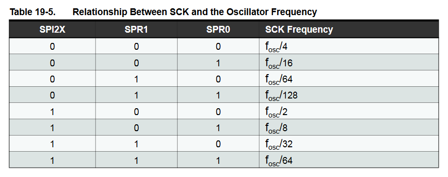

**SPSR寄存器**

地址0x2D(0x4D)

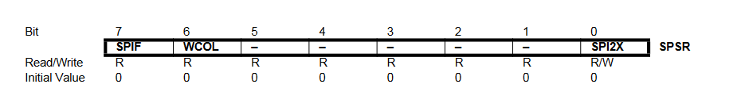

> **SPIF**为中断标志位，也是SPI唯一的中断，在一次传输结束以后会置1，执行中断服务程序时会自动清0。手动清0需要首先读取一次该寄存器，之后读或写数据寄存器**SPDR**
>
> **WCOL**为写冲突标记。如果数据寄存器**SPDR**在一次数据传输时被写入，该位就会置1。手动清0方法同上，该位不会产生中断

**SPDR寄存器**

地址0x2E(0x4E)

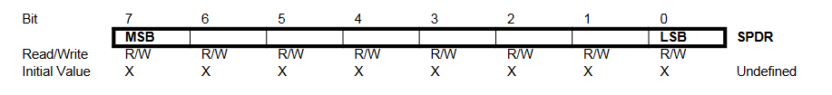

> 发送以及接收数据寄存器，主机模式下向该寄存器写入数据会自动启动一次发送


## 1.9 TWI（I2C）

I2C为原荷兰飞利浦（半导体部门独立后成为恩智浦半导体NXP）的专利。为规避风险，Atmel/Microchip等其他半导体厂商将I2C称为TWI，和I2C兼容

I2C为半双工类型总线，相比SPI等其他串口通信协议要复杂，优点是信号线少，同时使用地址进行从机的区分，可以只使用两条信号线支持最多128台从机的通信。主机以及从机通过同一条总线连接，两条信号线一条为数据（SDA），另一条为时钟（SCL），同时这两条信号线都要有上拉电阻（此时IO自动配置为开漏输出），示意图如下

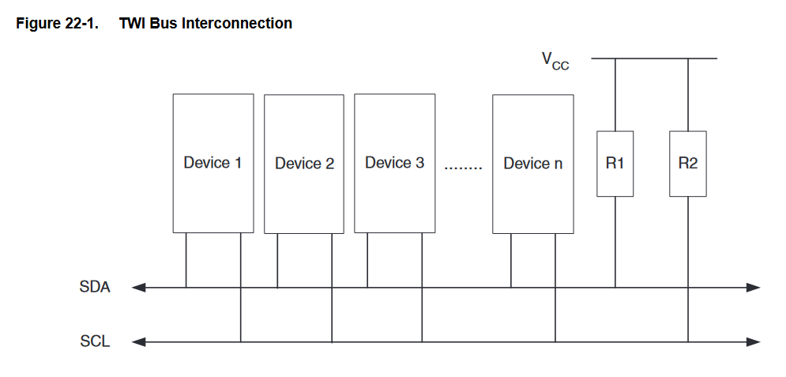

TWI的特性就是，无论有几个设备将数据线拉低，数据线总是呈现低电平状态。换句话说，只有所有设备都输出1（晶体管不导通），总线才会呈现高电平的状态，这也是TWI的**与**属性。使用开漏输出加上拉电阻的优势就是永远不会短路，极大方便了多机通信

TWI可以说是AVR中最复杂的通信协议之一。其本质还是基于状态机的设计，寄存器**TWSR**中就是该状态机的状态指示

另外，16u2不具有TWI模块，而328P和32u4的TWI完全一致，所以不再分开讲解

> 这里首先引入TWI通信中的几个基本概念：
>
> 主机（Master）：产生SCL时钟的设备。所有传输的启动以及结束也是由主机管理。一条总线上可以有多台主机
>
> 从机（Slave）：主机发送一个地址并与其通信的设备
>
> 发送者（Transmitter）：正在向总线传输数据的设备
>
> 接收者（Receiver）：正在从总线读取数据的设备


### 1.9.1 TWI模块电路构成

TWI可以算是一种基于中断的通信协议，电路结构如下

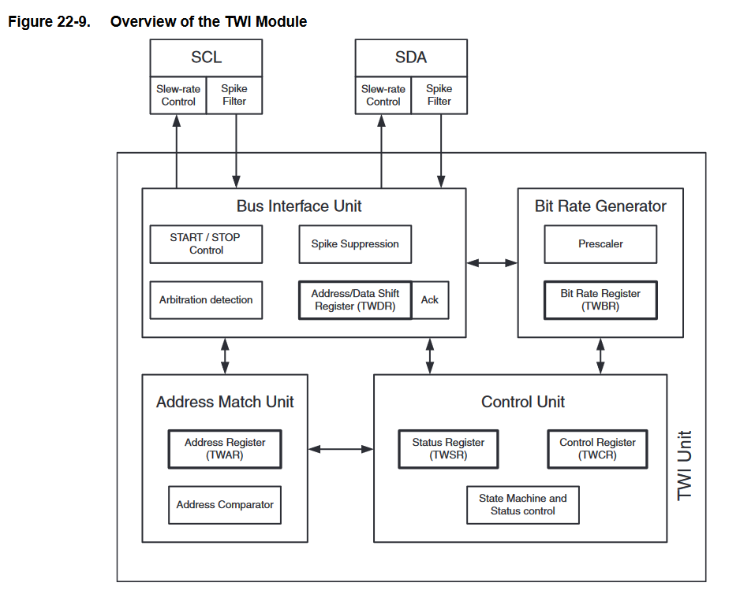

> TWI的引脚SCL以及SDA作为输出使用时，都为开漏输出，同时设有有压摆限制。作为输入使用时都设有毛刺消除。另外，在AVR中这两个引脚**可以使用对应GPIO的内置上拉电阻，这样可以省去外置的上拉电阻**
>
> **主机**TWI的传输速率（时钟SCL）由比特率生成器以及预分频决定，分别通过**TWBR**以及**TWSR**寄存器设置。从机模式下该设置无效。计算公式如下
>
> 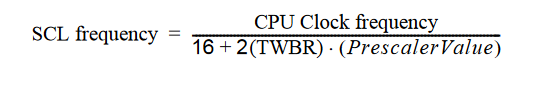
>
> 有关数据传输部分，数据以及地址通过**TWDR**寄存器进行收发。另外传输时的**ACK**可以在**接收模式下**可以通过**TWCR**寄存器设置，而在**发送模式下**可以通过**TWSR**寄存器读取
>
> 有关传输控制部分，开始/结束的侦测功能由硬件电路实现。在电路侦测到一个开始或结束事件时可以触发中断，可以用于休眠状态的唤醒
>
> 在主机模式下TWI还支持在发送模式下的仲裁/冲突检测。如果当前主机失去当前仲裁的总线控制权，会转到执行相应处理代码
>
> 工作在从机模式时，本机地址通过**TWAR**设定（1-127）。另外**TWAR**中还有一位**TWGCE**，置1可以使能广播地址的响应（接收到广播地址0x00以后也会产生中断做出响应）。另外还可以通过**TWCR**设置从机是发送**ACK**还是**NACK**
>
> TWI工作模式的控制主要由**TWCR**负责，中断标志位为**TWINT**。另外注意状态寄存器**TWSR**只有在**TWINT**为1时才会包含有效数据，与此同时时钟输出SCL输出低电平

> 触发中断的情况有以下几种
>
> 1. 作为主机发送了一个开始信号（START OR REPEATED START）
>
> 2. 作为主机发送了从机地址帧以后
>
> 3. 作为主机失去总线控制权
>
> 4. 作为从机被主机选中（私有地址或广播地址）
>
> 5. 作为接收方接收到一个数据帧
>
> 6. 作为从机接收到重复开始以及结束信号（REPEATED START OR STOP）
>
> 7. 接收到非法起始/结束信号


### 1.9.2 TWI通信协议原理

TWI要求在传输数据时，**数据SDA在时钟SCL为高电平的时候始终保持稳定**，如下

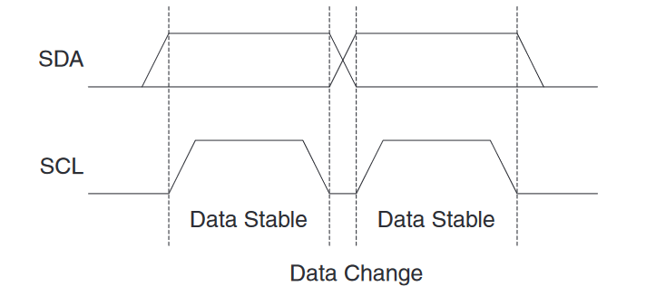

如果SDA在SCL为高电平时发生了翻转（一般由主机发出），就代表一个传输开始或传输结束信号，如下

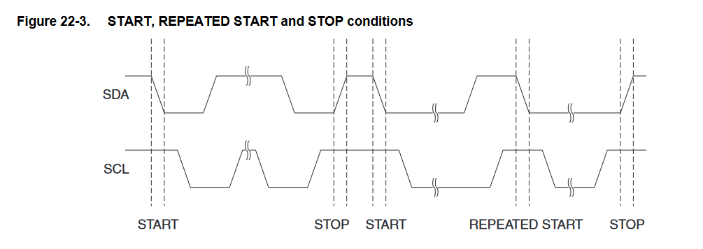

> 在SCL为高电平时如果SDA出现一个下降沿，那么就代表一次传输的开始。一个传输过程中可以有多次开始，多次传输（称为重复开始），但是一旦出现结束信号（SCL高电平时SDA出现一个上升沿）那么就代表当前传输过程的结束，总线被释放。在此之前认为总线处于忙（busy）状态

TWI的数据包格式如下，分为地址包以及数据包两种

**地址包**

地址包**长度为9位，包括7位地址位，1位读写位，1位ACK**。读写位**为0代表写操作，为1代表读操作**。起始以及结束信号永远由**主机**发出（主机永远控制整个传输过程）。主机选中的从机在发现自己被选中后如果没有异常情况，需要**在第9位ACK将数据线拉低表示可以响应请求**。如果当前从机无法响应，应当保持SDA为高电平，之后主机可以发送结束信号或再次开始一次传输。

地址帧发送时首先发送MSB，最后发送LSB。0-127的从机地址中，0x00为广播地址（所有从机都要响应，并同时在ACK将SDA拉低，一般用于所有从机接收相同数据，所以主机一般将读写位置0）

> TWI规范建议从机地址取0x01到0x77之间的地址

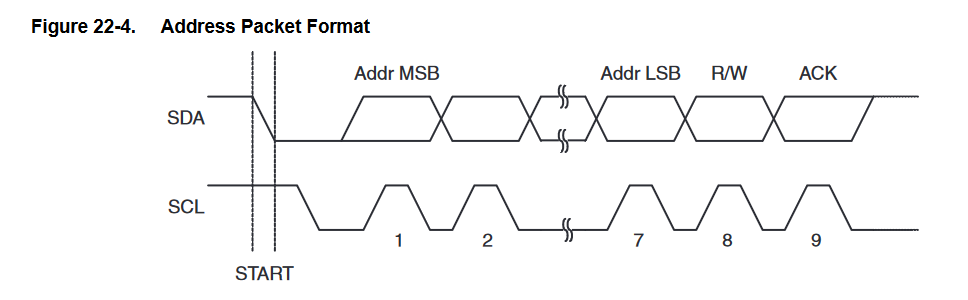

**数据包**

数据包**长度为9位，包括8位数据位，1位ACK**。数据包**发送方**（**可以是主机或从机**）随主机时钟开始发送数据。**接收方**（**可以是从机或主机**）需要在第9个时钟发送ACK（将SDA拉低）。如果接收方不想再接收数据，发送NACK即可（保持SDA为高电平，一般在接收方接收完最后一字节数据以后）

数据帧同样采用首先发送MSB的方式

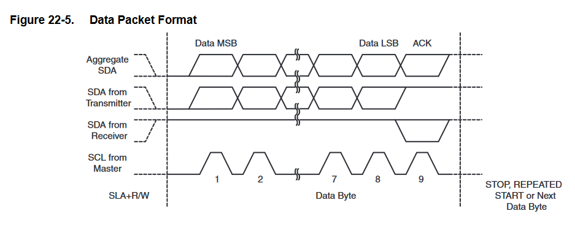

一个传输过程如下

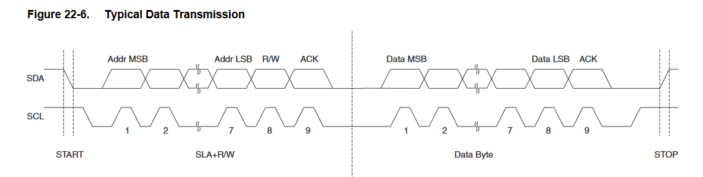

> 一个地址帧之后可以跟多少数据帧由具体的通信协议决定，需要由软件实现
>
> 另外，如上图，从机还可以主动将SCL拉低延长时间用于处理数据，准备继续传输。而SCL高电平时间固定，只由主机决定

**多主机通信系统**

TWI的设计本身就为多主机的通信提供了可能

> 多主机通信中涉及到一个**仲裁**的过程。这个仲裁的过程需要决定**本次传输中唯一的一个主机（TWI通信中同时刻只允许一台主机运行）**。其余未竞争得总线控制权的主机可以进入从机模式。注意这个仲裁的过程**不能影响到从机而导致从机数据的损失**。所有仲裁机制都由软件实现
>
> 另外，本仲裁过程也需要解决不同主机之间TWI通信时钟不统一的问题，在此之后才能开始仲裁过程
>
> 由于TWI总线的电路结构特性，在多主机系统中SCL的占空比取决于输出SCL占空比最小的那台主机。所有主机都可以同时监视SCL，调节自己的输出
>
> 仲裁的基本原理也是依赖于TWI总线的电路特性，**主机可以在输出数据同时监视SDA引脚的状态**。仲裁时，所有想要通信的主机**各自输出不同的数据帧**。如果一台主机发送数据同时发现接收到的SDA数据和自己发送的数据不同，那么就代表**该主机已经失去本次使用总线的资格，主机需要切换到从机模式，不再参与仲裁**。一次仲裁可能需要多次迭代。并且**仲裁用的数据帧也是需要特别设计的，不能是任意的数据帧（否则大概率会导致一次仲裁后所有主机都变为从机的情况）**。巧妙设计的仲裁数据帧甚至可以实现具有优先级的通信，比如0x07，0x0F，0x1F，优先级依次降低
>
> 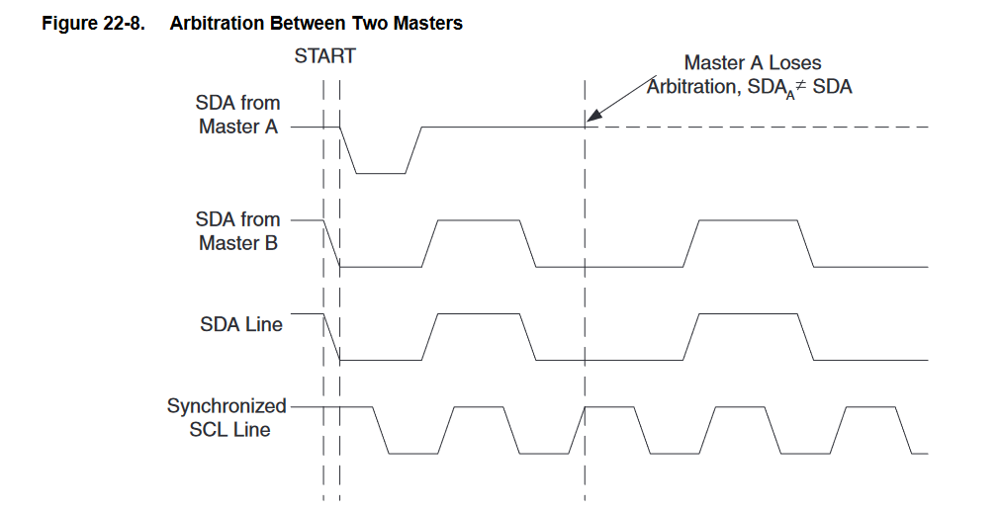
>
> 仲裁中时钟同步的大致流程如下
>
> 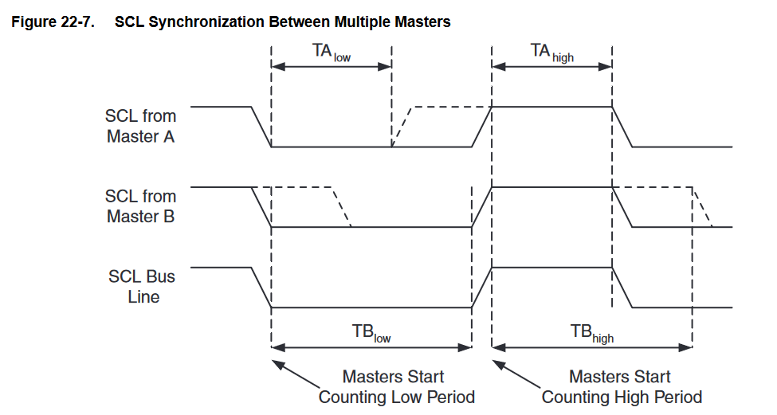


### 1.9.3 典型工作流程

一个典型的工作流程如下

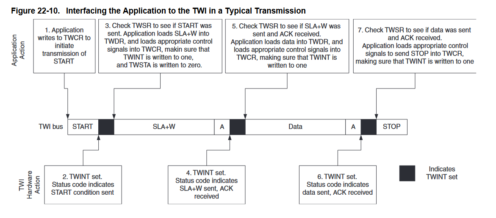

> 1. 首先是发送一个起始信号。起始信号的发送需要通过写**TWCR**触发，注意写入该寄存器时需要将**TWINT**对应位置1（会将**TWINT**置0），这样才会触发起始信号的发送
>
> 2. 发送完起始信号，**TWCR**中的**TWINT**会重新置1触发中断，此时状态寄存器**TWSR**已经被更新，指示当前状态
>
> 3. 检查状态标志位**TWSR**是否是想要的值，如果异常就要处理。如果检查正常，接下来就可以向**TWDR**写入从机地址帧。之后向控制寄存器**TWCR**写新值触发该地址帧的发送，同理此时需要向**TWINT**对应位写1清除中断位才能成功触发
>
> 4. 地址帧发送完毕，此时**TWINT**再次置1触发中断，同时**TWSR**状态被更新
>
> 5. 检查状态标志位**TWSR**，看是否成功发送地址帧，以及接收到的ACK。如果没有问题，可以继续向**TWDR**写想要发送的数据，之后写**TWCR**（**TWINT**写1）触发一次数据传输
>
> 6. 数据帧传输结束，此时**TWINT**再次置1触发中断，同时可以在**TWSR**读取当前状态（检查ACK）
>
> 7. 最后整个传输过程结束，可以写**TWCR**触发传输结束信号（**TWINT**写1）

> 可以发现，TWI每一步工作的共同特点是，每一小步结束以后都会触发中断，之后CPU需要首先检查状态寄存器**TWSR**的值，之后向数据寄存器**TWDR**以及控制寄存器**TWCR**写入新值（同时向**TWINT**写1清除该标记位），以进行下一步的传输

TWI**有4种工作模式**，分别为**主机发送（MT），主机接收（MR），从机发送（ST），从机接收（SR）**


### 1.9.4 相关寄存器

**TWBR寄存器**

比特率寄存器，见之前公式

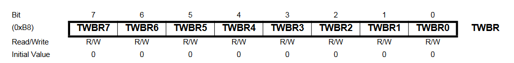

**TWCR寄存器**

主要的控制寄存器

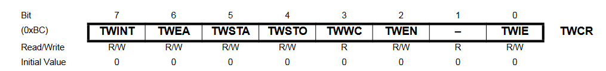

> **TWEN**为TWI总开关，置1使能TWI，同时对应SDA以及SCL引脚会取代原IO功能
>
> **TWINT**为中断标志位。如果启用全局中断同时**TWIE**中断使能为1，那么在**TWINT**置1时会自动触发一次中断
>
> **TWEA**用于控制ACK位，如果在传输之前将该位置1，TWI就会在输出的最后第9位置0输出ACK。（在3种情况下会输出，一种是作为从机接收到自己的地址，一种是在**TWGCE**置1时受到广播地址，还有一种是接收方接收到数据帧）
>
> **TWSTA**为传输开始控制位，写入寄存器时将该位置1可以使得进入主机模式，同时如果总线空闲会立即输出一个开始信号。如果当前总线忙，会等待至总线空闲以后才会数据开始信号。之后**TWSTA**需要使用软件清0
>
> **TWSTO**为传输结束控制位，写入寄存器时置1会输出一个结束信号。在成功输出一个结束信号以后该位会自动清0。另外，在**从机模式**下将该位置1可以**使得TWI从错误中恢复，此时该从机会将SDA以及SCL置为高阻态**
>
> **TWWC**为写入冲突检测。在**TWINT**为0时写入**TWDR**会导致该位置1（即在一次传输过程中写入）。之后只要在**TWINT**为1时再次向**TWDR**写入新值即可将该位清0

**TWDR寄存器**

收发数据寄存器

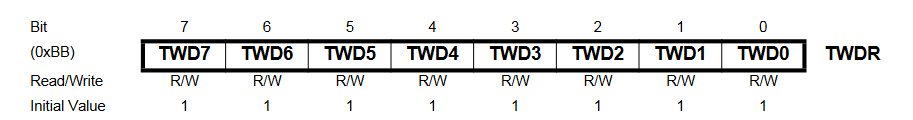

> 该寄存器事实上是两个寄存器，使用了同一个地址，发送模式下该寄存器存储下一个想要传输的数据。接收模式下该寄存器存储当前最后接收到的数据帧。只要**TWINT**为1，从该寄存器读取的值就保持不变
>
> 另外，在本机（发送方）发送数据时，数据也会回过来同步输入到**TWDR**。换句话说，该寄存器**总是存储上一次在总线上出现的数据**。这也为输出数据校验提供了可能

**TWSR寄存器**

状态寄存器

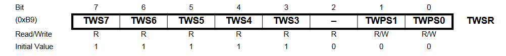

> 该寄存器的**TWS7..3**用于指示当前的TWI状态，具体定义见[1.9.5](#195-四种工作模式详解)
>
> **TWPS1..0**为时钟预分频设置，定义如下。注意在一般的状态读取中**需要将这两位屏蔽**
>
> 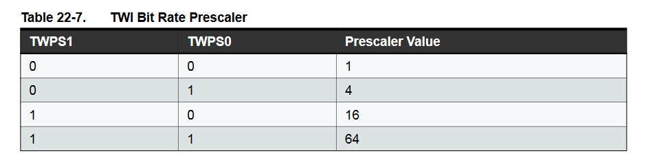

**TWAR寄存器**

从机地址寄存器

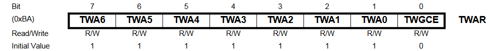

> 该位用于设置从机模式下的本机地址。**TWGCE**为**广播地址**使能，置1时从机如果接收到0x00也会产生中断

**TWAMR寄存器**

从机地址掩码寄存器

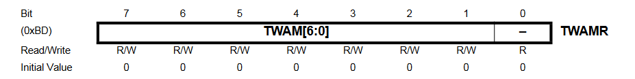

> **TWAM6..0**对应**TWAR**相应地址位。如果置1，那么从机在接收到地址帧时会忽略相应位的不同，产生中断


### 1.9.5 四种工作模式详解

首先介绍**主机发送模式（MT）**

> 主机发送模式首先要确保当前设备是主机，通过发送**起始信号**（START）进入。其次地址帧决定了是进入发送还是接收模式，需要将地址帧的读写位R/W**置0**表示写操作，发送起始信号需要向**TWCR**写以下值


> 当起始信号传输完毕，中断标志**TWINT**会自动置位，同时**TWSR**应当变为0x08。接下来先向**TWDR**写新值（**从机地址以及末位0代表写操作**），之后将**TWINT**写1清0触发地址帧的发送，如下


> 在地址帧的末尾会收到相应从机的ACK，此时**TWINT**会置1，**TWSR**会更新，值可能为0x18，0x20，0x38，需要采取相应的处理措施。如果发送成功，接下来就可以开始发送数据帧
>
> 发送数据帧时，首先向**TWDR**写入想要发送的数据，之后将**TWINT**清0触发数据帧的发送。注意，如果在**TWINT**为0时写**TWDR**，会导致发送冲突，**TWWC**会置位，而**TWDR**不会更新值


> 传输完所有字节以后，需要发送一个传输终止信号（STOP）或重复开始信号（REPEATED START），分别如下


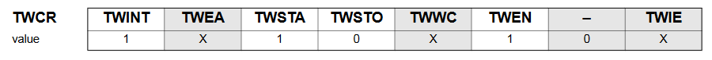

附：MT模式下状态寄存器**TWSR**各代码含义以及状态转移图

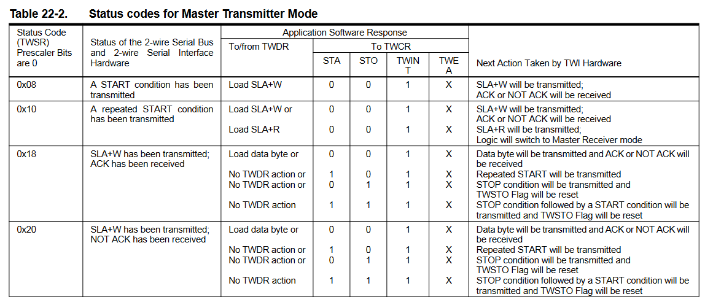

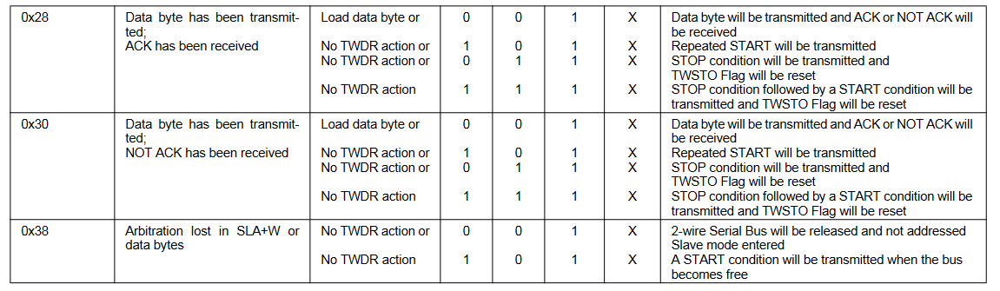

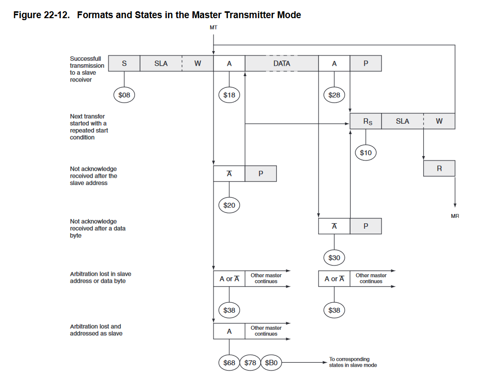


**主机接收模式（MR）**

> 主机接收模式同样需要首先发送**起始信号**（START），其次在地址帧将读写位**置1**表示读操作，发送起始信号需要向**TWCR**写以下值


> 之后**TWINT**置位，**TWSR**变为0x08。之后向**TWDR**写入从机地址（**末位R/W置1读**），之后将**TWINT**写1清0触发


> 在地址帧末尾会受到相应从机的ACK。此时**TWINT**会再次置1，同时**TWSR**中的值会更新（0x38，0x40或0x48）。运行相应的处理过程以后，TWI会自动进入到接收模式。一旦**TWI**接收到新的数据包，就会将**TWINT**置1
>
> 主机在接受到最后一个字节以后需要向从机（数据发送方）发送NACK表示已经接收到所有要求的数据帧
>
> 最后接收主机需要向从机发送一个传输终止信号（STOP）或重复开始信号（REPEATED START）


附：MR模式下状态寄存器**TWSR**各代码含义以及状态转移图

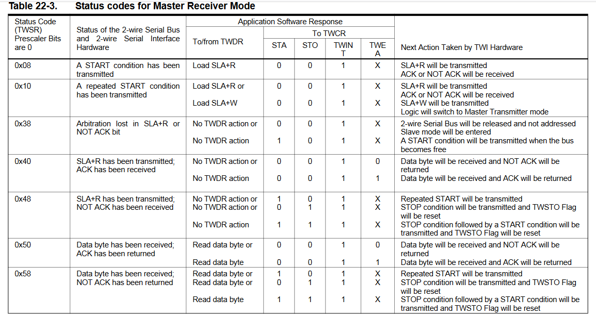

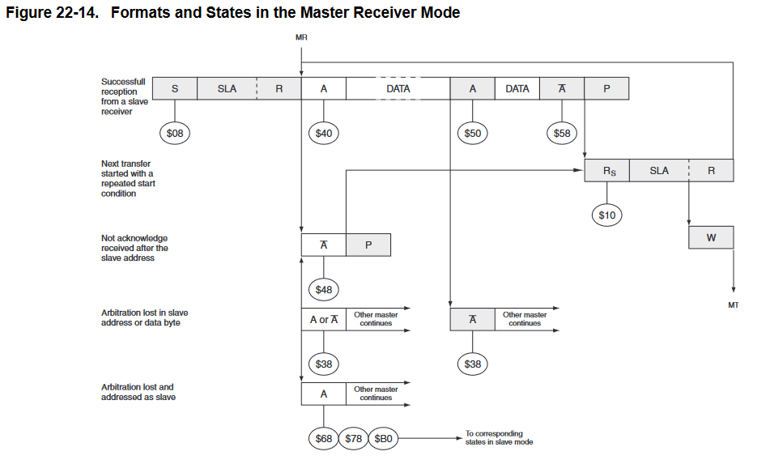

**从机发送模式（ST）**

> 从机发送模式首先需要进行初始化，设置从机地址**TWAR**，以及控制寄存器，分别设置如下。将**TWEA**置1，那么本设备就会在检测到自己被寻址后自动回复**ACK**


> 从机在接收到地址帧（读操作）以后自动进入到ST模式，同时**TWINT**会置1，同时**TWSR**中的值会更新。**一台主机在总线仲裁失败后也会进入到ST模式（0xB0）**
>
> 如果在一次数据传输过程中将**TWEA**置0，就代表从机发送最后一帧数据。在这帧数据之后会接收到MR发来的确认位，从机会进入到**TWSR**为0xC0（接收到**NACK**）的模式或0xC8（接收到**ACK**）的模式。如果是0xC0，在此之后从机会进入到未选中模式，并忽略主机发来的所有数据。如果是0xC8，就代表主机还需要额外数据
>
> 在**TWEA**置0的模式下，作为从机不会响应主机的寻址

附：ST模式下状态寄存器**TWSR**各代码含义以及状态转移图

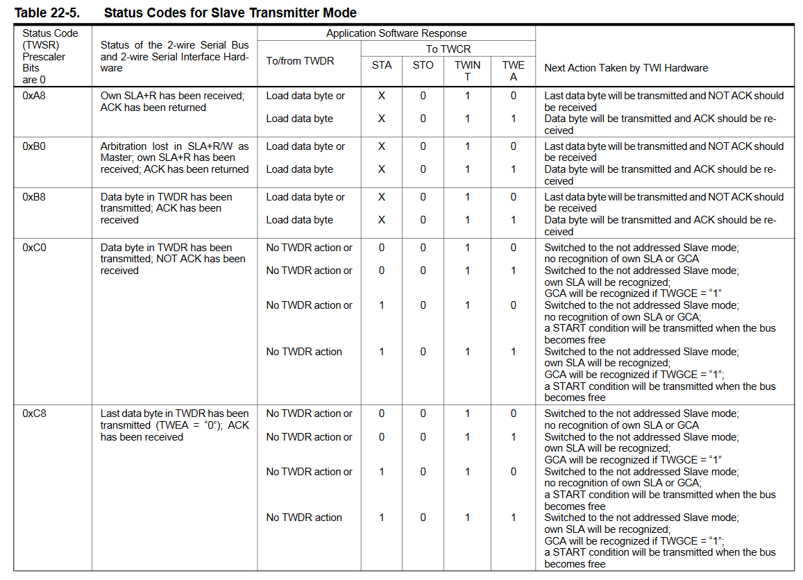


**从机接收模式（SR）**

> SR模式的寄存器初始化和ST模式相同


> 从机接收到地址帧（写操作）后会自动进入到SR模式，同时置位**TWINT**，更新**TWSR**。**一台主机在总线仲裁失败后也会进入到SR模式（0x68或0x78）**
>
> 如果在一次数据传输过程中将**TWEA**置0，那么当前从机就会在下一个接收到的数据帧之后回复NACK表示不再继续接收数据。
>
> 在**TWEA**置0的模式下，作为从机不会响应主机的寻址

附：SR模式下状态寄存器**TWSR**各代码含义以及状态转移图

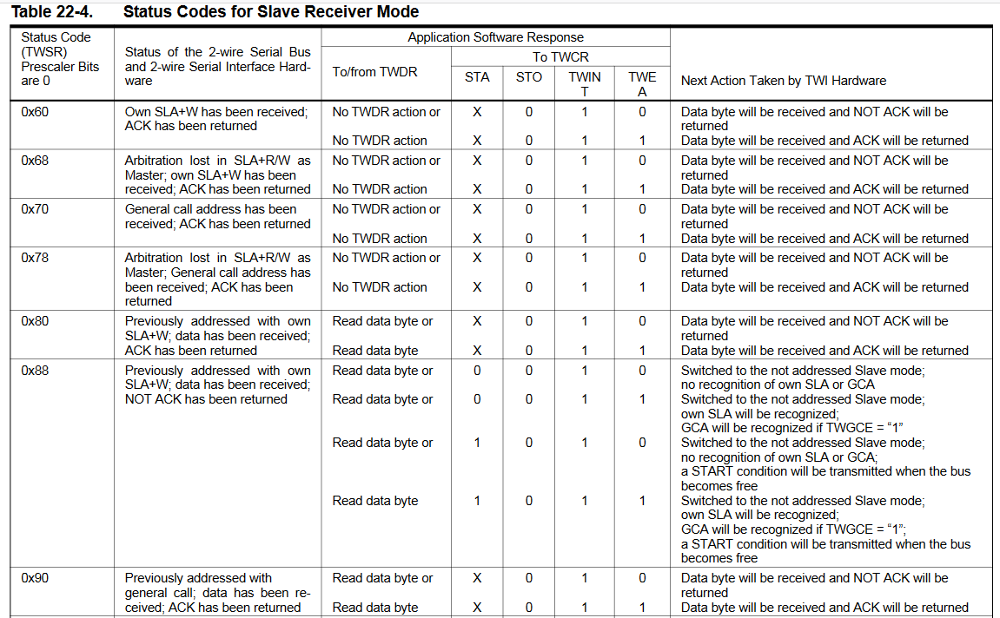

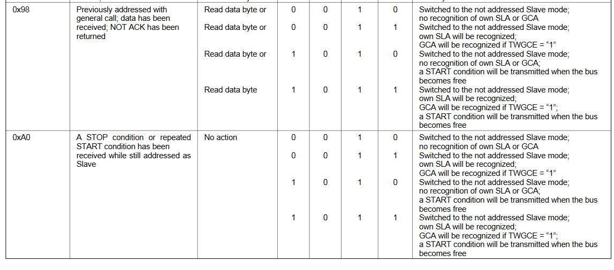

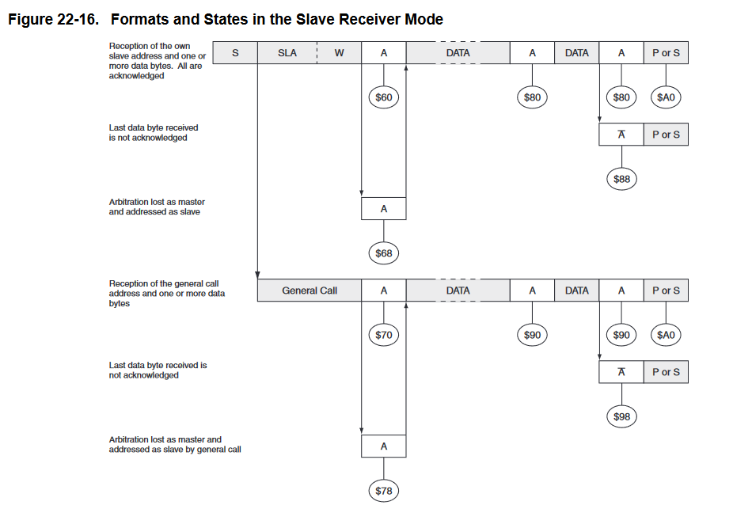

**其他模式**

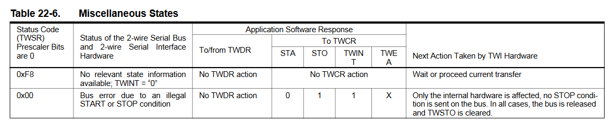


## 1.10 USB

USB是现代单片机普遍支持的接口。有关USB通信协议笔记见[210731b_usb.md](210731b_usb.md)

由于USB相当复杂，这里仅以32u4的USB为例进行分析。至于16u2的USB模块和32u4有较大不同，会在本章末尾进行一个简单的分析

### 1.10.1 USB控制器

### 1.10.2 USB

### 1.10.3 16u2的USB模块

## 1.11 单片机的复位和Watchdog看门狗

## 1.12 休眠模式

## 1.13 BootLoader相关

BootLoader作为AVR单片机启动时运行的第一个程序，具有很重要的作用。通过UART或USB的在线程序下载就是由BootLoader软件实现


## 1.14 AVR ISP下载协议

Atmel的AVR单片机通用的下载协议，通过SPI（ICSP）接口下载，由硬件支持所以和BootLoader无关，可以用于更新修复BootLoader等


## 1.15 熔丝位

熔丝位一般用于配置一些基础参数以及安全设置

> 事实上STC的8051单片机也有熔丝位，比如指令时钟的调节，以及ALE引脚的设置，就是通过编程软件更改熔丝位设置实现

**更改熔丝位一定要三思，否则单片机很容易变砖，只能通过高压编程（通过专用的高压编程接口，需要在\#RST输入12V）或强行输入时钟的方法修复**

包括ATmega328P，16u2，32u4的熔丝位，以及作用


## 1.16 熔丝位设置错误解决方法

熔丝位设置错误一般可以通过输入外部时钟修复。但是如果设置使用了内部时钟，就只能通过高压编程器恢复了（这是解决熔丝位设置错误的最终解决方法，如果这种方式依然无法修复那么就是单片机本身损坏了）

这里提供这两种方案的具体实现，并且会提供一种可行的高压编程器的DIY方案


## 2 从零开始搭建开发环境

从零开始的AVR开发环境，基于VSCode，包括了软件的安装，环境的配置，工具链的使用，Makefile的编写等

## 2.1 工具链

## 2.2 烧录以及仿真调试

使用两种方法，和Arduino IDE一样使用串口（依赖于Bootloader），以及使用ISP编程。基于开源工具`avrdude`

## 2.3 Makefile

## 3 实用示例

