# 记录各种常见屏幕的构造，工作原理以及单片机驱动方法

# 液晶屏LCD

## 液晶屏制造工艺以及基本工作原理

液晶屏的制造工艺和半导体非常类似，同样需要经过光刻。一般的全彩液晶屏构成如下（当然现在绝大多数的液晶屏都已经采用LED背光了）。其中彩色滤光片以及电极都使用光刻工艺

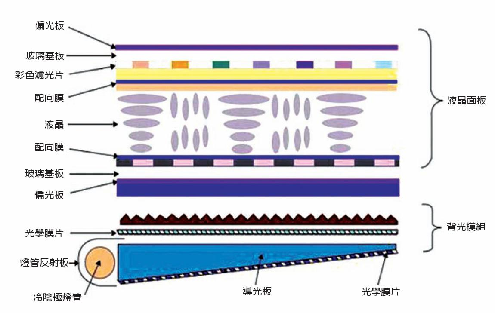

液晶屏显示的基本原理就是**光的偏振**。由上图可以看出，液晶屏的关键部分由上至下可以分为上偏光膜，上玻璃基板，上电极/上配向膜，液晶，下电极/下配向膜，下玻璃基板，下偏光膜以及背光

上图中，液晶屏的上偏光膜和下偏光膜的偏振方向**互相垂直**，所以在液晶屏未通电时点亮背光，屏幕显示黑色，只有微量的光。此时如果在一个像素的电极之间加上适当的电压，就会导致这两个电极之间液晶分子的有序偏转，从而导致从下偏光膜传来的光再次被扭转，此时透过上偏光膜的光强度就会发生变化，从而实现图像的显示

> 液晶屏事实上分为**主动型**和**被动型**两大类

> 日常使用的廉价电子产品一般都使用**被动型**液晶屏，常见的有计算器，数字时钟，电子温度计，各类家电等，这些液晶屏的构造和上述所说有所不同。其中**笔段式液晶**都是定制，出厂就蚀刻好的，驱动方式较为简单，一般只有一面有笔段电极，和外部引脚一一对应，而另一面整面都是一个公共电极。而**点阵式液晶**为减少引脚需要使用**扫描**的驱动形式，为降低工艺难度与成本，有些液晶屏上下面电极分别用于行/列的驱动。我们常用的12864屏就属于点阵式
>
> 另外，依据液晶屏的显示方式可以分为**正显液晶屏**以及**反显液晶屏**两大类。其中我们最常见的计算器就是使用的正显形式，这种显示优点是可以省去背光（需要在液晶屏背面加上反光片）。**正显液晶屏的上下偏光膜偏振方向互相平行**，所以有光照射时会无阻碍通过，也会有反射，形成绿底黑字的显示效果。而我们常用的蓝色1602和12864屏就是典型的反显液晶屏，相比正显液晶屏更好看，但这种液晶在没有背光时显示效果较差。**反显液晶屏的上下偏光膜偏振方向互相垂直**，所以光线在通过时会被大量衰减，反显液晶显示的字体颜色就是实际上的背光颜色

> 而我们常说的TFT液晶屏（Thin Film Transistor，薄膜晶体管）属于**主动型**液晶屏，一般用于高端领域，绝大多数电脑、手机等数码产品的彩色液晶屏幕都是属于这种类型。这种液晶屏和**被动型**液晶屏的显示原理基本相同，**上下偏光膜偏振方向互相垂直**，其中有一整面的公共电极，而所有像素电极都在另一面电极上。这种液晶屏的特征就是每一个点都集成了一个薄膜晶体管，而由于晶体管的电容特性，它可以用于**按需**维持当前电极的电压，而不像被动式液晶一旦断电就不再有显示（有长余辉类型的被动式液晶，但是这极大影响了液晶响应性能，显示下一幅图像还会残余之前的显示内容），所以可以在同样的驱动频率下达到更好的显示效果。也是这种构造特性增加了这种液晶屏的制造成本

## 驱动芯片：ST7565

基于TOPWAY的LM6063HFW液晶模块，单色蓝底白字，分辨率128*64

使用3.3V电压

LM6063HFW模块[手册](src/210808a01/LM6063HFW.pdf)

ST7565数据[手册](src/210808a01/ST7565.pdf)

### 数据接口

ST7565支持8位M68、i80并行数据接口，以及4线SPI接口（不是一般意义上的4线SPI，无MISO，不支持读取操作，但此时仍然需要通过RS（即A0）指定是命令还是数据）

物理接口引脚规格以及定义如下

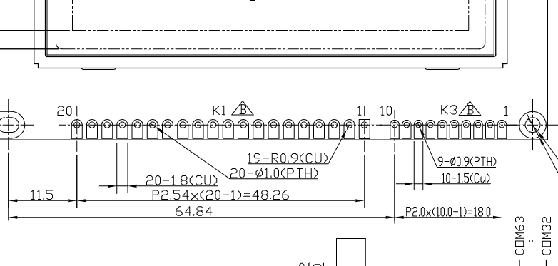

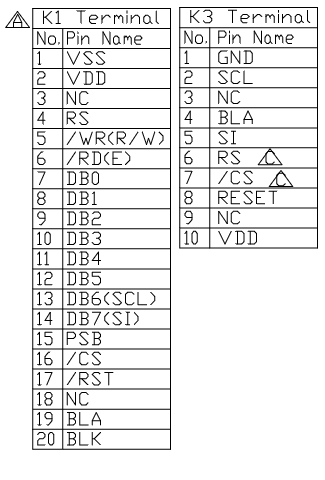

> 其中，VSS为电源负极，VDD为正极，RS（A0）为命令/数据选择（输入0为指令，输入1为数据），\#CS为片选信号（低电平有效，无效时所有IO保持高阻态模式），\#RST为复位信号，PSB为IO接口模式选择（为0使用SPI模式，为1使用并口模式。默认为SPI）。BLA和BLK分别为背光输入的阳极（正极）和阴极（负极）。所有电压输入输出**最高3.3V**

跳线配置参考如下

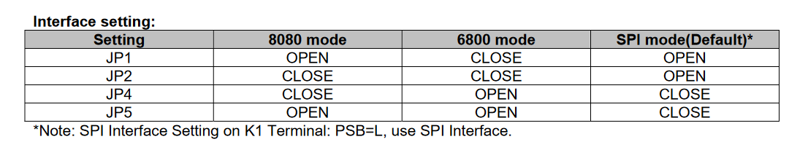

这里只使用默认接口SPI，使用上图中的SCL（SPI时钟），SI（SPI数据），\#CS（片选），RS（A0）以及\#RST（复位）引脚，此时数据引脚D5..0以及\#WR，\#RD可以直接到连接高电平

### 显示原理

ST7565最大支持131*65的显示，而LM6063HFW模块屏幕的像素点和显存的对应关系如下

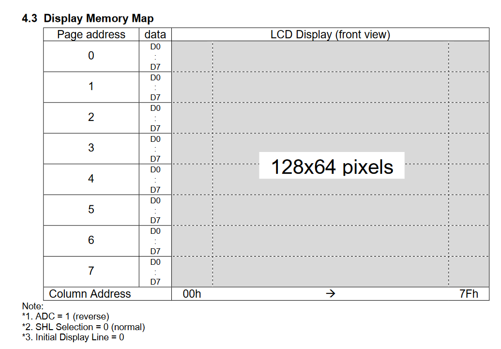

如上图，显存分为8个页（Page），每一个页大小128字节（128个Segment），数据使用小端显示。有2个数据指针分别为**页指针**以及**列指针**，这两个指针互相独立，需要单独设置。向一个页写入时**支持连续写入**，每次写入1字节，列指针都会自动加1

> 实际上ST7565支持9个页。8号页为特殊页，大小为1*131，只显示D0的内容，一般用于液晶屏除点阵以外的笔画显示，这里没有引出

液晶屏需要使用交流电驱动，所以ST7565内置了复杂的电源模块，具体驱动原理不再详述。关键点在于驱动液晶需要多个不同的电压。ST7565中有一个升压器，一个稳压器以及一个电压跟随器，可以产生驱动电压，也可以分别控制开关。升压器产生的电压VOUT比VDD高很多（通过更改电路最大可以为VDD的6倍），之后的基准电压V0经由稳压器产生。其他驱动电压都由电压V0产生，如下

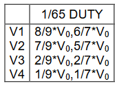

Regulator结构如下，本质就是一个运算放大器

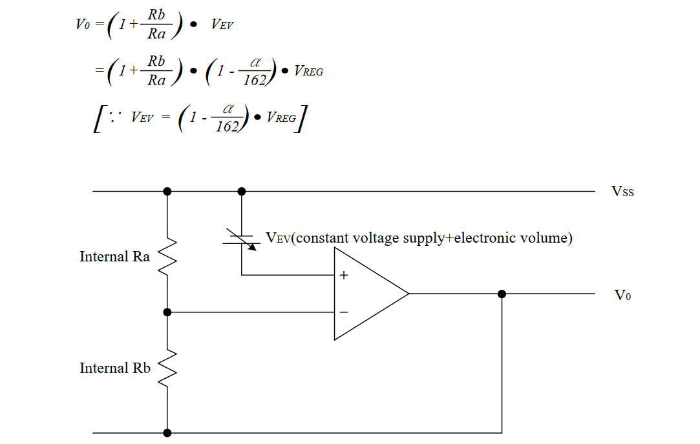

> V0的输出有2个参数可以设置，一个是电位器，一个是基准电压微调（Electronic Volume），调节V0可以实现显示亮度的调节
>
> 由运算放大器的虚短、虚断分析可以得到公式第一行。Vev就是基准电压源Vreg（一般为2.1V）经过微调参数$\alpha$之后的输出。$\alpha$就是一个可设置的关键参数，可以设置为0到63，如下
>
> 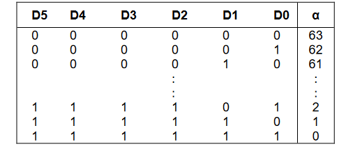
>
> 而电位器的设置与$(1+\dfrac{Rb}{Ra})$的关系如下
>
> 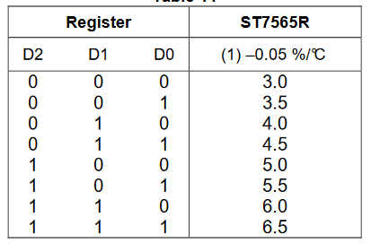

LM6063HFW的初始化配置如下。之后在命令讲解中会提到这个配置

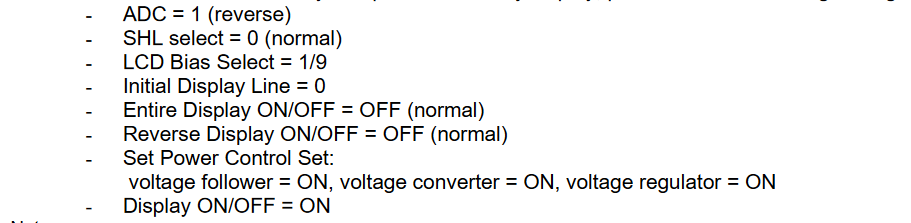

### 通信时序

在上电初始化之前建议将\#RST拉低，电压稳定以后再撤走

ST7565要求的SPI通信时序如下

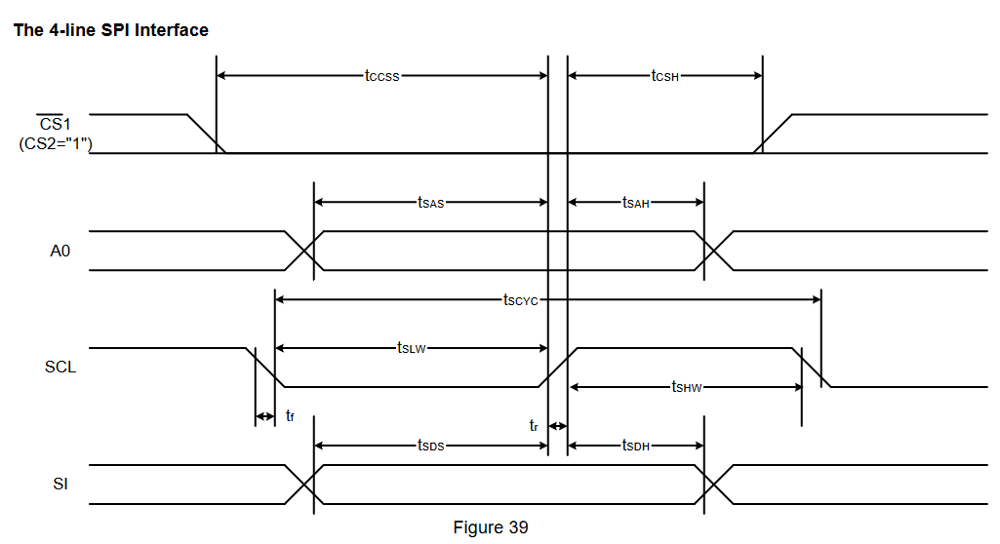

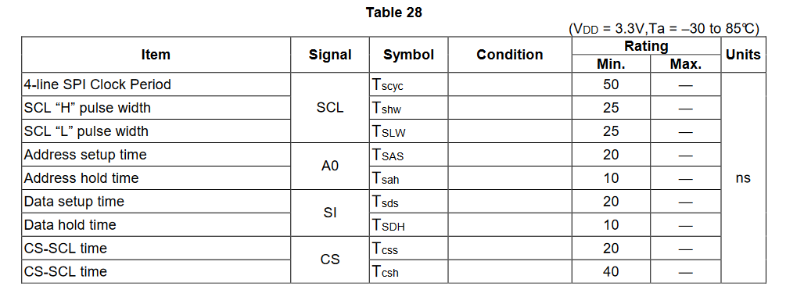

> SPI通信方式要求的上升/下降沿最大为15ns。SPI一个时钟周期不小于50ns，折合通信速度不大于20Mb/s。所有其余引脚的状态都在SCL上升沿被采样，由上表可知除\#CS片选信号以外其余信号不用考虑延时问题，只要速度不快于最大时钟即可。而在实际的使用中一般也不会使用到20Mb/s的通信速度，所以实际使用中不用考虑加入延时

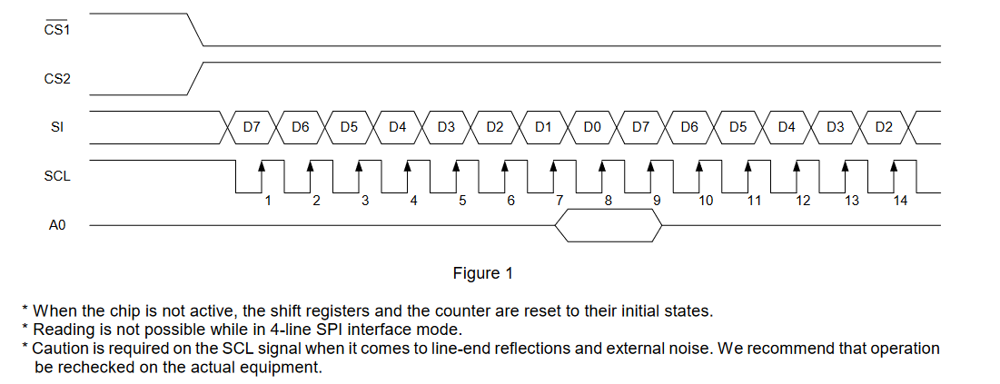

> 实际的SPI通信协议原理如上，一旦片选有效，之后SCL每一个上升沿都会采样SI的状态，数据的传输使用比特大端序。每次计数器计数到第8位都会触发一次对于A0的检测，以此循环往复。一旦片选失效，SPI的计数器以及移位寄存器也会复位
>
> 注意，在任何时候都不要让MCU的IO进入高阻态模式

### 命令详解

**硬复位**

硬复位不算命令，通过将\#RES拉低可以实现，硬复位以后各设置回归默认，如下

> 1. 显示关
> 2. 正显
> 3. ADC（列扫描）使用一般驱动模式（相当于命令D0=0）
> 4. 电源控制：全关（000）
> 5. SPI计数器以及移位寄存器复位
> 6. Bias：1/65模式下设置为1/9
> 7. 省电模式关
> 8. V0电位器设为Ra、Rb
> 9. 所有驱动端COM、SEG都输出低电平（VSS）
> 10. Read-Modify-Write模式关
> 11. 显示起始行设置为第1行
> 12. 列地址指针设为0
> 13. 页地址指针设为0
> 14. COM端使用一般驱动模式
> 15. V0电位器设置模式关
> 16. V0基准电压设置模式关（设置D5..0=100000）
> 17. 测试模式关

**显示开/关**

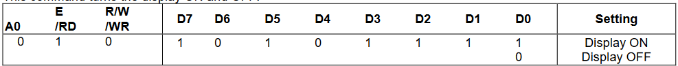

> 0xAF开启，0xAE关闭，在所有点开启之后执行0xAE可以进入睡眠模式，见下

**显示起始行设置**

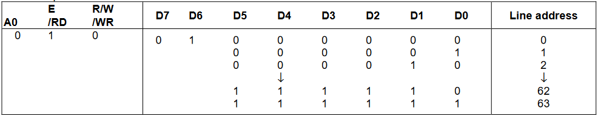

> 用于设置液晶行驱动第一行（Normal模式下为COM0，Reverse模式下为COM63）对应的SRAM行地址，可以为0到63。ST7565第9页不受影响。**使用该指令可以实现滚动显示**

**页地址设置**

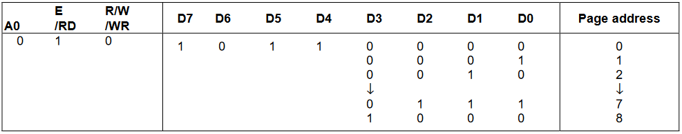

> 设置当前的页地址指针，0xB0到0xB7，0xB8为第9页

**列地址设置**

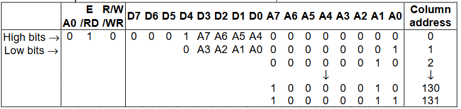

> 在LM6963HFW中使用到的地址范围为0x04(4)到0x83(131)。列地址设置需要通过两条指令，一条指定高4位一条指定低4位。**对于SRAM的读写操作都会导致列地址指针自动加1**

**状态读取**

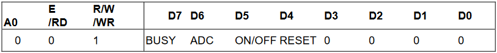

> SPI不支持

**写SRAM数据**

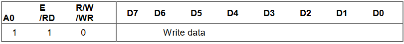

> 可以连续写入而不用每次都指定地址

**读SRAM数据**

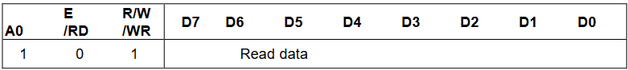

> SPI不支持

**Read-Modify-Write以及终止指令**

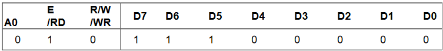

END指令

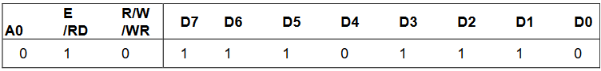

> SPI模式下只能使用写操作。执行0xE0进入到RMW模式以后，读操作不会导致列地址指针递增，而写操作和原来一样。和END成对使用，执行0xEE后**光标地址会自动返回到原来的位置**。可以用于局部刷新，比如光标闪烁的实现，降低复杂度

**ADC选择（列扫描方向）**

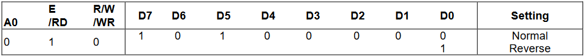

> 执行0xA0为正向，0xA1为反向。LM6063HFW需要设置为反向

**COM驱动端扫描模式**

即SHL设置

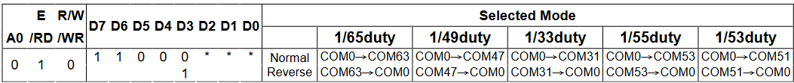

> 0xC0为正向，0xC1为反向。LM6063HFW使用正向模式

**正显/反显**

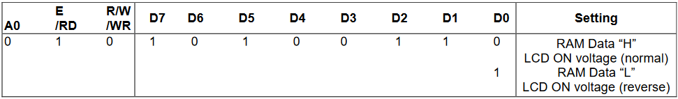

> 0xA6正显，0xA7反显

**所有点开/关（一般用于测试）**

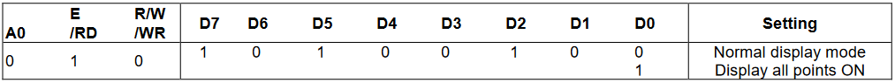

> 0xA4为一般的显示模式，0xA5强制所有点显示。和睡眠模式有关，见下

**显示Bias设置（未点亮点和点亮点电压比例）**

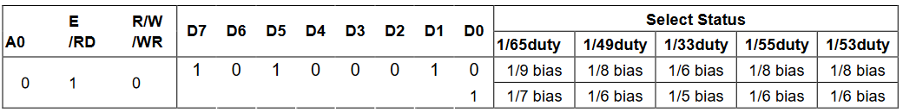

> 默认0xA2即可，Bias设为1/9

**软复位**

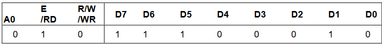

> 不能用于上电复位。执行0xE2会复位显示起始行设置，列地址指针，页指针，COM扫描模式，V0电位器设置，V0基准源设置，同时会退出RMW以及Test模式。**软复位不会影响SRAM中的数据**

**电源设置**

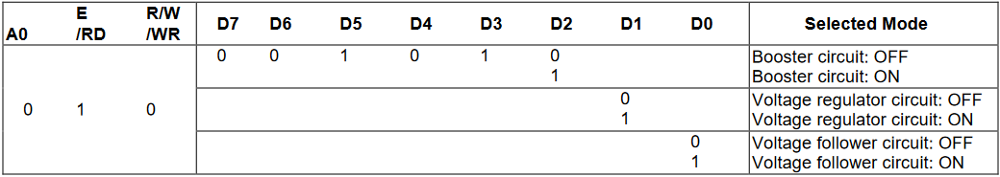

> 0x28到0x2F。在LM6063HFW需要全部打开，0x2F

**V0电位器设置**

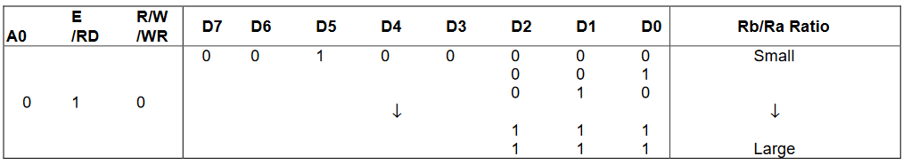

> 0x20到0x27，参考之前表格

**V0基准电压源微调（双字节）**

首先要进入到调节模式之后才能进行数据的设定

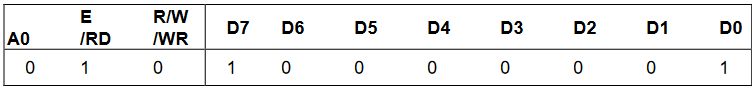

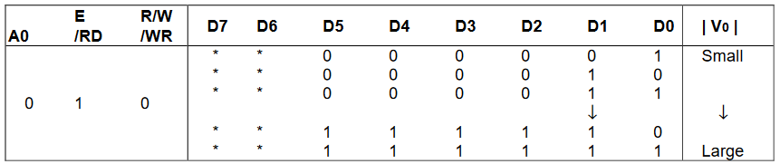

> 0x81进入调节模式，之后可选0x01到0x3F的调节值，参考之前表格。设置完成后自动退出

**睡眠模式设置（双字节）**

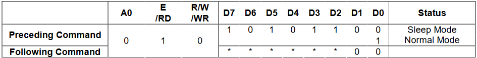

> 睡眠模式的两个字节的指令必须使用连续的方式执行
>
> 睡眠模式整个的执行流程如下
>
> 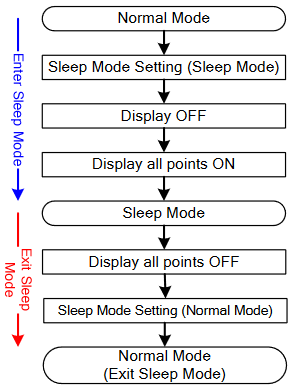
>
> 想要进入到睡眠模式，需要首先设置睡眠模式（连续执行0xAC以及0x00），执行0xAE关闭显示后执行0xA5强制所有点开。睡眠模式下SRAM仍然可以访问。想要唤醒屏幕退出睡眠模式，执行0xA4之后设置正常模式（连续执行0xAD以及0x00）即可

**升压设置（双字节）**

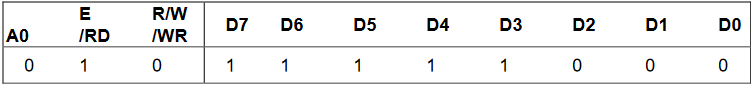

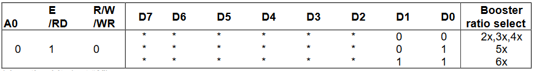

> 执行0xF8进入到设置模式，之后的升压设置最高可以设置到6倍升压

**无操作指令**

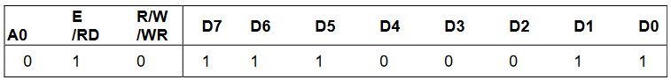

> 执行0xE3，空指令

### 工作流程

**初始化**

初始化流程如下

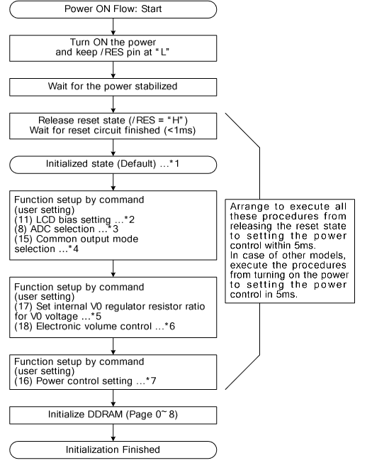

> 释放复位信号以后建议立即开始初始化流程。需要设置的关键选项解释如下
>
> 1. 设置Bias参数，这里设为0xA2
> 2. 设置ADC扫描方式，这里设为0xA1
> 3. 设置COM口扫描方式，这里设为0xC0
> 4. 设置V0电位器以及基准源参数，参数值越大V0越高
> 5. 设置电源，这里设为0x2F

而之前提到过LM6063HFW的初始化设置，可以更改如下。V0可以之后调节

> 1. 0xA2设置Bias为1/9
> 2. 0xA1设置ADC反向扫描，0xC0设置COM正向扫描
> 3. 0x40设置起始行为0
> 4. 0xAE关闭显示
> 5. 0xA6使用正显
> 6. 0x2F电源全开
> 7. 0xAF开启显示

**数据显示**

数据手册给出的流程图如下

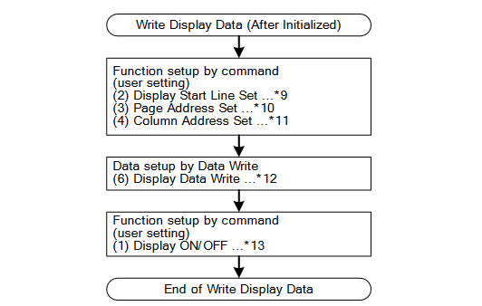

> 其实数据显示只要设定好页地址以及列地址之后直接传数据即可，写入的内容就会显示出来

**关机**

数据手册建议断电之前进行如下一些操作

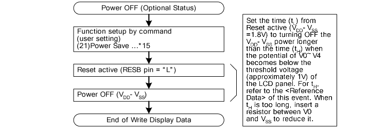

> 1. 进入到睡眠模式
> 2. 将\#RST拉低

**刷新**

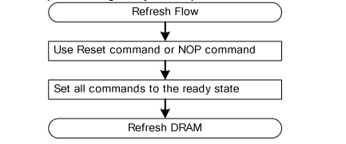

## 驱动芯片：uc1617s

# OLED

# 墨水屏

# VFD