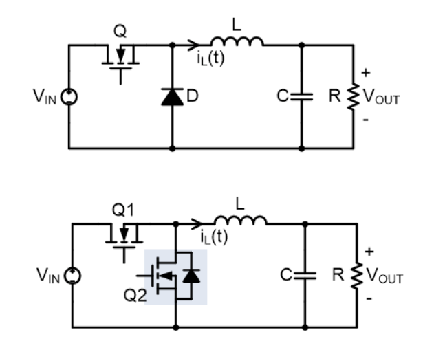
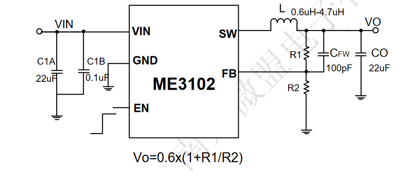
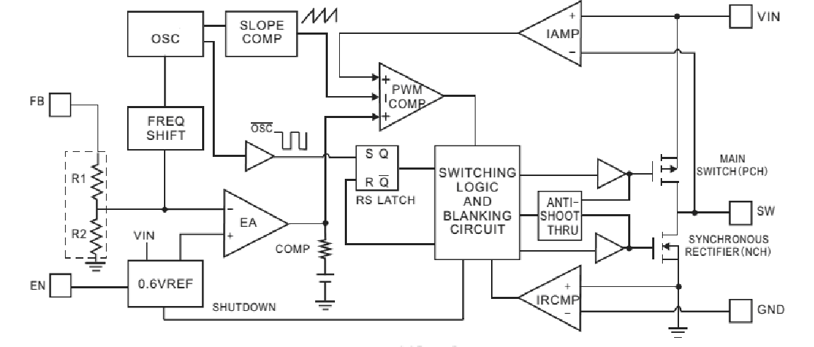

# 开关电源基本原理

《精通开关电源（第三版）》阅读笔记

## 补充：Buck布线原则与建议

常见的Buck电路拓扑如上图所示。图一中Q为开关管（NMOS，也可以使用PMOS），D为回流二极管（一般使用肖特基二极管）。而图二中使用Q2（NMOS）代替D用作回流，可以解决二极管压降带来的损耗问题，提高效率

实际的Buck集成电路一般使用PMOS作上管，NMOS作下管，以下为ME3102（SOT23-5）的应用电路以及内部结构

> 大部分SOT23-5封装的Buck集成电路都使用类似的电路拓扑设计，引脚定义也相同。其中`VIN`为电源输入（一般最高耐压在6.5V以下），`EN`为工作使能信号（输入耐压一般不高于`VIN`），`SW`为开关管的输出端，`FB`为反馈端，这样构成一个闭环控制回路，电路根据输出电压自动控制开关管（上管，PMOS）以及回流管（下管，NMOS）的切换

布线一般会遵循以下规则

> 1. `VIN`，`SW`端以及`VO`走线应当尽量粗短，保证较低的阻抗。其中首要保证`SW`尽量靠近电感，缩短路径长度，之后再进行电容等走线（输入电容环路优先级高于输出电容环路）
>
> 2. 输入电容`C1`尽量靠近`VIN`，输出电容`CO`尽量靠近`VO`（电感的一端）。同时保证输入输出电容尽量贴近`GND`端，最大程度减小电容环路面积
>
> 3. 分压反馈电阻网络`R1 R2`（各自一端）尽量贴近`FB`端，同时远离`SW`端以免`FB`受到干扰。其中`R2`可以通过一条较细的线与主地相连（单点接地），这样可以一定程度隔绝主地的开关噪声。`VIN`端也应当尽可能远离`SW`，而`EN`可以不用管
>
> 4. 电路回路尽量不要有大环路设计，尽量走直，否则容易引入附加电感。这也是将回路缩小的原因之一