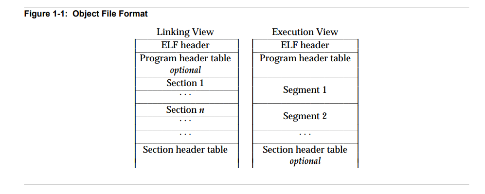
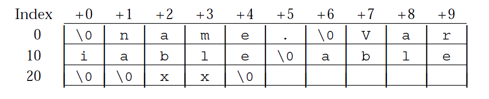
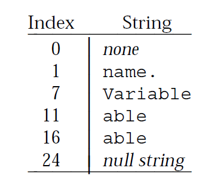

# ELF文件格式，链接器原理，编译原理

## 参考资料

《深入理解计算机系统》，Randal E. Bryant，David R. O'Hallaron

[耶鲁大学CS422讲义](src/210731a01/ELF_Format.pdf)

[FreeBSD ELF相关代码](https://cgit.freebsd.org/src/tree/sys?h=stable/13)。平台共用代码位于`sys/elf32`，`sys/elf64`。x86位于`x86/include/elf.h`，ARM位于`arm/include/elf.h`以及`arm64/include/elf.h`

## 0 序言

平时我们使用IDE开发一个桌面程序，或者开发一个简单的控制台程序，基本不会意识到程序构建过程中链接的存在，也不会去关心二进制程序底层是如何运作的。例如使用Qt开发程序，在IDE窗口点击构建按钮，我们创建的大量源码文件以及头文件貌似自然而然就成为了可执行文件，执行我们想要的功能

可执行文件远不止机器代码这么简单，它还需要包含很多只读、初始化数据以及各种描述信息。ELF这种类似的统一格式的出现使得程序文件的构建更加规范化，同时具备更强的通用性

链接也无处不在，大型工程的构建离不开链接（同样也离不开构建系统例如`Make`）。在大型工程中，将所有代码都放在一个源文件中是非常不明智的。链接器方便了程序构建的模块化，开发者可以将不同功能的代码分开，降低代码耦合度，减轻管理维护负担，同时闭源代码的发布也成为可能，也可以加快程序构建的速度。此外，在操作系统的支持下，共享库的动态链接机制也使得程序映像变得更小


## 1 CS422笔记：ELF文件结构

ELF文件格式由UNIX System Laboratories提出，作为ABI标准的一部分，后缀`.elf`，用以替代`a.out`等较老的二进制文件格式。Linux，FreeBSD等现代的类UNIX系统都广泛采用了这种文件格式，但是具体实现会略有不同

## 1.1 ELF文件的种类

ELF文件主要分为3种：**可重定位文件**（relocatable），**可执行文件**（executable）和**共享目标文件**（shared object）

ELF文件设计的用途主要有2个，一是被工具链中的链接器`ld`读取并和其他文件链接，另外也可以被操作系统的加载程序加载到内存中执行

此外，ELF文件适用于不同字长的硬件平台。以下基于32位架构讲解


## 1.2 ELF文件结构概览

ELF文件结构如下（区块的顺序会有所不同，不一定是下面展示的那样）



> `ELF header`位于ELF文件开头，主要记录了ELF文件的结构，处理器架构，`Program header table`和`Section header table`在文件中的位置等基本信息
>
> **可重定位文件**一般有`Section header table`以及多个`Section`，`Section`是给链接器看的，其中可能包含机器指令，只读数据，`switch`跳转表，变量，重定位信息等内容。这些文件不一定有`Program header table`
>
> **可执行文件**一般有`Program header table`以及多个`Segment`，`Segment`是给操作系统加载器看的，告诉加载器如何在内存中创建一个进程映像，一个`Segment`可能由1个或多个链接过程中的`Section`组成。可执行文件不一定有`Section header table`
>
> **共享目标文件**一般会同时拥有`Section header table`和`Program header table`

FreeBSD中ELF32基本数据类型定义如下

```cpp
/*
 * ELF definitions common to all 32-bit architectures.
 */

typedef uint32_t	Elf32_Addr;
typedef uint16_t	Elf32_Half;
typedef uint32_t	Elf32_Off;
typedef int32_t		Elf32_Sword;
typedef uint32_t	Elf32_Word;
typedef uint64_t	Elf32_Lword;

typedef Elf32_Word	Elf32_Hashelt;

/* Non-standard class-dependent datatype used for abstraction. */
typedef Elf32_Word	Elf32_Size;
typedef Elf32_Sword	Elf32_Ssize;
```

> 其中`Elf32_Addr`为32位地址，`Elf32_Off`为32位地址偏移，`Elf32_Half`为无符号半字数据，`Elf32_Sword`为有符号单字数据，`Elf32_Word`为无符号单字数据，`Elf32_Lword`为无符号双字数据
>
> 在ELF32文件中数据一般是4字节对齐的，可以发现`Elf32_Half`总是连续偶数个出现

> **逆向时一定要注意机器的大小端**。在小端机器中，ELF文件中所有的数据都按小端存放，在使用16进制编辑器查看时多字节变量要倒过来看


## 1.3 ELF文件头

FreeBSD中ELF头定义如下。取自`elf32.h`

```cpp
/*
 * ELF header.
 */

typedef struct {
	unsigned char	e_ident[EI_NIDENT];	/* File identification. */
	Elf32_Half	e_type;		/* File type. */
	Elf32_Half	e_machine;	/* Machine architecture. */
	Elf32_Word	e_version;	/* ELF format version. */
	Elf32_Addr	e_entry;	/* Entry point. */
	Elf32_Off	e_phoff;	/* Program header file offset. */
	Elf32_Off	e_shoff;	/* Section header file offset. */
	Elf32_Word	e_flags;	/* Architecture-specific flags. */
	Elf32_Half	e_ehsize;	/* Size of ELF header in bytes. */
	Elf32_Half	e_phentsize;	/* Size of program header entry. */
	Elf32_Half	e_phnum;	/* Number of program header entries. */
	Elf32_Half	e_shentsize;	/* Size of section header entry. */
	Elf32_Half	e_shnum;	/* Number of section header entries. */
	Elf32_Half	e_shstrndx;	/* Section name strings section. */
} Elf32_Ehdr;
```

`e_entry`表示程序入口的虚拟地址（没有入口则设为`0`），`e_ehsize`表示ELF头的大小

其中，`EI_NIDENT`定义为16（位于`sys/elf_common.h`）

```cpp
#define	EI_NIDENT	16	/* Size of e_ident array. */
```

### 1.3.1 ELF Identification

ELF32文件使用长度16字节的`e_ident`表示一些架构无关的信息，为Identification，其中前7字节定义如下。之后需要加上占位符`EI_PAD`

| 下标 | 名称 | 作用 |
| :-: | :-: | :-: |
| `e_ident[0]` | `EI_MAG0` | 魔法数`0x7F` |
| `e_ident[1]` | `EI_MAG1` | 魔法数`0x45`（`E`） |
| `e_ident[2]` | `EI_MAG2` | 魔法数`0x4C`（`L`） |
| `e_ident[3]` | `EI_MAG3` | 魔法数`0x46`（`F`） |
| `e_ident[4]` | `EI_CLASS` | 表示机器字长，`0`表示`ELFCLASSNONE`无效，`1`表示`ELFCLASS32`为32位目标文件，`2`表示`ELFCLASS64`为64位目标文件 |
| `e_ident[5]` | `EI_DATA` | 表大小端，`0`表示`ELFDATANONE`无效，`1`表示`ELFDATA2LSB`小端（Little-Endian），`2`表示`ELFDATA2MSB`大端（Big-Endian） |
| `e_ident[6]` | `EI_VERSION` | 文件版本，值和`e_version`相同，只能为`1`（`EV_CURRENT`） |

FreeBSD中定义如下，添加了几个变量

```cpp
#define	EI_MAG0		0	/* Magic number, byte 0. */
#define	EI_MAG1		1	/* Magic number, byte 1. */
#define	EI_MAG2		2	/* Magic number, byte 2. */
#define	EI_MAG3		3	/* Magic number, byte 3. */
#define	EI_CLASS	4	/* Class of machine. */
#define	EI_DATA		5	/* Data format. */
#define	EI_VERSION	6	/* ELF format version. */
#define	EI_OSABI	7	/* Operating system / ABI identification */
#define	EI_ABIVERSION	8	/* ABI version */
#define	OLD_EI_BRAND	8	/* Start of architecture identification. */
#define	EI_PAD		9	/* Start of padding (per SVR4 ABI). */
```


### 1.3.2 文件类型

`e_type`表示文件的类型，是重定位文件，可执行文件还是共享目标文件。可以取以下值

| 名称 | 值 | 含义 |
| :-: | :-: | :-: |
| `ET_NONE` | `0` | 无效 |
| `ET_REL` | `1` | 可重定位文件 |
| `ET_EXEC` | `2` | 可执行文件 |
| `ET_DYN` | `3` | 共享目标文件 |
| `ET_CORE` | `4` | 核心文件。保留，没有明确定义该种文件格式 |
| `ET_LOPROC` | `0xFF00` |  |
| `ET_HIPROC` | `0xFFFF` |  |

FreeBSD中定义如下

```cpp
/* Values for e_type. */
#define	ET_NONE		0	/* Unknown type. */
#define	ET_REL		1	/* Relocatable. */
#define	ET_EXEC		2	/* Executable. */
#define	ET_DYN		3	/* Shared object. */
#define	ET_CORE		4	/* Core file. */
#define	ET_LOOS		0xfe00	/* First operating system specific. */
#define	ET_HIOS		0xfeff	/* Last operating system-specific. */
#define	ET_LOPROC	0xff00	/* First processor-specific. */
#define	ET_HIPROC	0xffff	/* Last processor-specific. */
```


### 1.3.3 机器类型

`e_machine`指定机器指令集类型

| 名称 | 值 | 含义 |
| :-: | :-: | :-: |
| `EM_NONE` | `0` | 无效 |
| `EM_SPARC` | `2` | SPARC |
| `EM_386` | `3` | i386 |
| `EM_68K` | `4` | MC68000 |
| `EM_MIPS` | `8` | MIPS RS3000 |

常见的CPU定义如下

```cpp
/* Values for e_machine. */
#define	EM_NONE		0	/* Unknown machine. */
#define	EM_SPARC	2	/* Sun SPARC. */
#define	EM_386		3	/* Intel i386. */
#define	EM_68K		4	/* Motorola 68000. */
#define	EM_MIPS		8	/* MIPS R3000 Big-Endian only. */
#define	EM_MIPS_RS3_LE	10	/* MIPS R3000 Little-Endian. */
#define	EM_PARISC	15	/* HP PA-RISC. */
#define	EM_SPARC32PLUS	18	/* SPARC v8plus. */
#define	EM_PPC		20	/* PowerPC 32-bit. */
#define	EM_PPC64	21	/* PowerPC 64-bit. */
#define	EM_ARM		40	/* ARM. */
#define	EM_SPARCV9	43	/* SPARC v9 64-bit. */
#define	EM_IA_64	50	/* Intel IA-64 Processor. */
#define	EM_X86_64	62	/* Advanced Micro Devices x86-64 */
#define	EM_AMD64	EM_X86_64	/* Advanced Micro Devices x86-64 (compat) */
#define	EM_AVR		83	/* Atmel AVR 8-bit microcontroller. */
#define	EM_XTENSA	94	/* Tensilica Xtensa Architecture. */
#define	EM_MSP430	105	/* Texas Instruments embedded microcontroller msp430. */
#define	EM_BLACKFIN	106	/* Analog Devices Blackfin (DSP) processor. */
#define	EM_SEP		108	/* Sharp embedded microprocessor. */
#define	EM_AARCH64	183	/* AArch64 (64-bit ARM) */
#define	EM_RISCV	243	/* RISC-V */
```


### 1.3.4 Header Table相关

`e_phoff`和`e_shoff`分别表示`Program header table`和`Section header table`在ELF文件中的偏移

`e_phnum`和`e_shnum`分别表示两种表包含的Entry数量，如果没有就为`0`

`e_phentsize`和`e_shentsize`分别表示两种表中每一个Entry的大小（和`num`相乘就是表的大小）

`e_shstrndex`指向`Section header table`的一个特殊入口，它的值为`section name string table`的入口项下标，该字符串表用于存储所有的`Section`名称。如果没有该表那么该变量赋值为`SHN_UNDEF`（为`0`）

```cpp
#define	SHN_UNDEF	     0		/* Undefined, missing, irrelevant. */
```


### 1.3.5 机器特性

`e_flags`存储特定CPU架构的相关信息，只在部分RISC平台如ARM，MIPS，PowerPC，RISC-V，SPARC下有定义，i386以及AMD64下该变量为`0`

部分ARM以及RISC-V所属代码如下

```cpp
/**
 * e_flags
 */
#define	EF_ARM_RELEXEC	0x1
#define	EF_ARM_HASENTRY	0x2
#define	EF_ARM_SYMSARESORTED	0x4
#define	EF_ARM_DYNSYMSUSESEGIDX	0x8
#define	EF_ARM_MAPSYMSFIRST	0x10
#define	EF_ARM_LE8		0x00400000
#define	EF_ARM_BE8		0x00800000
#define	EF_ARM_EABIMASK		0xFF000000
#define	EF_ARM_EABI_UNKNOWN	0x00000000
#define	EF_ARM_EABI_VER1	0x01000000
#define	EF_ARM_EABI_VER2	0x02000000
#define	EF_ARM_EABI_VER3	0x03000000
#define	EF_ARM_EABI_VER4	0x04000000
#define	EF_ARM_EABI_VER5	0x05000000
#define	EF_ARM_INTERWORK	0x00000004
#define	EF_ARM_APCS_26		0x00000008
#define	EF_ARM_APCS_FLOAT	0x00000010
#define	EF_ARM_PIC		0x00000020
#define	EF_ARM_ALIGN8		0x00000040
#define	EF_ARM_NEW_ABI		0x00000080
#define	EF_ARM_OLD_ABI		0x00000100
#define	EF_ARM_ABI_FLOAT_SOFT	0x00000200
#define	EF_ARM_SOFT_FLOAT	EF_ARM_ABI_FLOAT_SOFT /* Pre-V5 ABI name */
#define	EF_ARM_ABI_FLOAT_HARD	0x00000400
#define	EF_ARM_VFP_FLOAT	EF_ARM_ABI_FLOAT_HARD /* Pre-V5 ABI name */
#define	EF_ARM_MAVERICK_FLOAT	0x00000800

#define	EF_RISCV_RVC		0x00000001
#define	EF_RISCV_FLOAT_ABI_MASK	0x00000006
#define	EF_RISCV_FLOAT_ABI_SOFT	0x00000000
#define	EF_RISCV_FLOAT_ABI_SINGLE 0x000002
#define	EF_RISCV_FLOAT_ABI_DOUBLE 0x000004
#define	EF_RISCV_FLOAT_ABI_QUAD	0x00000006
#define	EF_RISCV_RVE		0x00000008
#define	EF_RISCV_TSO		0x00000010
```


## 1.4 Sections

Section是目标文件的基本组成部分。每一个Section在`Section header table`中只有1个header描述它，并且不是所有header都会对应1个Section。一个Section在文件中永远是连续的，且各自之间不能重叠。一个文件中可以有多个同名Section。目标文件中可能有一些空间没有被利用，这些空间称之为`inactive space`（程序开发者可以在这些`inactive space`中隐藏一些彩蛋）


### 1.4.1 Section头

`Section header table`中每一个入口（每一个项）都是一个结构体，存储了一个Section的名称（在`section name string table`中的下标），类型，在内存中的地址，在文件中的偏移、大小等等必要信息，定义如下

```cpp
/*
 * Section header.
 */

typedef struct {
	Elf32_Word	sh_name;	/* Section name (index into the
					   section header string table). */
	Elf32_Word	sh_type;	/* Section type. */
	Elf32_Word	sh_flags;	/* Section flags. */
	Elf32_Addr	sh_addr;	/* Address in memory image. */
	Elf32_Off	sh_offset;	/* Offset in file. */
	Elf32_Word	sh_size;	/* Size in bytes. */
	Elf32_Word	sh_link;	/* Index of a related section. */
	Elf32_Word	sh_info;	/* Depends on section type. */
	Elf32_Word	sh_addralign;	/* Alignment in bytes. */
	Elf32_Word	sh_entsize;	/* Size of each entry in section. */
} Elf32_Shdr;
```

`Section header table`就是一个顺序表，入口的下标按顺序为`0,1,2,...,e_shnum-1`。其中部分index被保留，如下（除了开头固定的`0`下标以外，只在`sh_link`域以及符号表等其他地方较为常见）

| 值 | 名称 | 含义 |
| :-: | :-: | :-: |
| `0` | `SHN_UNDEF` | Section头表中第0个入口，其中所有变量都为`0`。如果`e_shnum`指示该文件有10个Section，那么一般实际有效的有9个，包含字符串表 |
| `0xFF00` | `SHN_LORESERVE` | 编码保留区低边界 |
| `0xFF00` | `SHN_LOPROC` | 处理器专用编码保留区低边界 |
| `0xFF1F` | `SHN_HIPROC` | 处理器专用编码保留区高边界 |
| `0xFFF1` | `SHN_ABS` | 表示其中的符号确定，不受重定位影响 |
| `0xFFF2` | `SHN_COMMON` | common symbols（例如未分配的外部C变量） |
| `0xFFFF` | `SHN_HIRESERVE` | 编码保留区高边界 |

FreeBSD中定义如下

```cpp
/* Special section indexes. */
#define	SHN_UNDEF	     0		/* Undefined, missing, irrelevant. */
#define	SHN_LORESERVE	0xff00		/* First of reserved range. */
#define	SHN_LOPROC	0xff00		/* First processor-specific. */
#define	SHN_HIPROC	0xff1f		/* Last processor-specific. */
#define	SHN_LOOS	0xff20		/* First operating system-specific. */
#define	SHN_FBSD_CACHED	SHN_LOOS	/* Transient, for sys/kern/link_elf_obj linker only: Cached global in local symtab. */
#define	SHN_HIOS	0xff3f		/* Last operating system-specific. */
#define	SHN_ABS		0xfff1		/* Absolute values. */
#define	SHN_COMMON	0xfff2		/* Common data. */
#define	SHN_XINDEX	0xffff		/* Escape -- index stored elsewhere. */
#define	SHN_HIRESERVE	0xffff		/* Last of reserved range. */
```

`sh_name`为该Section的名称，值为Section名称字符串在`String table`中的起始下标。`String table`位置由一个特殊的header指定，这个header在`Section header table`中的下标由ELF头的`e_shstrndex`指定。字符串表示例如下



通过下标引用字符串得到的结果如下



> 字符串表下标从0开始，`sh_name`一般表示字符串中第1个字符在表格中的位置（也可以不是第1个字符）。每一个字符串以`\0`结尾。引用下标`0`得到`none`，引用其他`\0`所在下标得到空字符串。
>
> 同一个字符串可以被引用多次，也可能未被引用

`sh_type`指示该Section的类型，定义如下

| 名称 | 值 | 含义 |
| :-: | :-: | :-: |
| `SHT_NULL` | `0` | 标记该header为inactive，没有Section对应 |
| `SHT_PROGBITS` | `1` | 该Section存放程序定义的内容 |
| `SHT_SYMTAB` | `2` | 较完整的符号表，一般用于**静态链接** |
| `SHT_STRTAB` | `3` | 字符串表 |
| `SHT_RELA` | `4` | 带加数（Addend）的重定位信息列表（`Elf32_Rela`结构体）。一个文件可以有多个重定位信息区块 |
| `SHT_HASH` | `5` | 符号哈希表（用于动态链接时必须包含） |
| `SHT_DYNAMIC` | `6` | 用于动态链接的信息 |
| `SHT_NOTE` | `7` | 记录与描述类信息 |
| `SHT_NOBITS` | `8` | 和`SHT_PROGBITS`类似，但是在文件中不会占有任何空间。同时`sh_offset`是有效的 |
| `SHT_REL` | `9` | 不带加数的重定位信息列表（`Elf32_Rel`结构体） |
| `SHT_SHLIB` | `10` | 未定义的保留类型。基本不会遇到 |
| `SHT_DYNSYM` | `11` | 较精简的符号表，一般用于**动态链接** |
| `SHT_LOPROC` | `0x70000000` | 编码保留区下界。处理器相关 |
| `SHT_HIPROC` | `0x7FFFFFFF` | 编码保留区上界 |
| `SHT_LOUSER` | `0x80000000` | 编码保留区下界。用于应用程序定义的数据 |
| `SHT_HIUSER` | `0x8FFFFFFF` | 编码保留区上界 |

FreeBSD中还有其他类型，部分定义如下

```cpp
/* sh_type */
#define	SHT_NULL		0	/* inactive */
#define	SHT_PROGBITS		1	/* program defined information */
#define	SHT_SYMTAB		2	/* symbol table section */
#define	SHT_STRTAB		3	/* string table section */
#define	SHT_RELA		4	/* relocation section with addends */
#define	SHT_HASH		5	/* symbol hash table section */
#define	SHT_DYNAMIC		6	/* dynamic section */
#define	SHT_NOTE		7	/* note section */
#define	SHT_NOBITS		8	/* no space section */
#define	SHT_REL			9	/* relocation section - no addends */
#define	SHT_SHLIB		10	/* reserved - purpose unknown */
#define	SHT_DYNSYM		11	/* dynamic symbol table section */
#define	SHT_INIT_ARRAY		14	/* Initialization function pointers. */
#define	SHT_FINI_ARRAY		15	/* Termination function pointers. */
#define	SHT_PREINIT_ARRAY	16	/* Pre-initialization function ptrs. */
#define	SHT_GROUP		17	/* Section group. */
#define	SHT_SYMTAB_SHNDX	18	/* Section indexes (see SHN_XINDEX). */

#define	SHT_LOPROC		0x70000000	/* reserved range for processor */
#define	SHT_X86_64_UNWIND	0x70000001	/* unwind information */
#define	SHT_AMD64_UNWIND	SHT_X86_64_UNWIND 

#define	SHT_ARM_EXIDX		0x70000001	/* Exception index table. */
#define	SHT_ARM_PREEMPTMAP	0x70000002	/* BPABI DLL dynamic linking pre-emption map. */
#define	SHT_ARM_ATTRIBUTES	0x70000003	/* Object file compatibility attributes. */
#define	SHT_ARM_DEBUGOVERLAY	0x70000004	/* See DBGOVL for details. */
#define	SHT_ARM_OVERLAYSECTION	0x70000005	/* See DBGOVL for details. */
#define	SHT_HIPROC		0x7fffffff	/* specific section header types */
#define	SHT_LOUSER		0x80000000	/* reserved range for application */
#define	SHT_HIUSER		0xffffffff	/* specific indexes */
```

`sh_flags`描述该Section的属性，如可写，可执行，内存分配等，如下。**这些属性可以通过位或运算合并到一起**

| 名称 | 值 | 含义 |
| :-: | :-: | :-: |
| `SHF_WRITE` | `1` | 该Section包含了在程序实际执行时可写的内容 |
| `SHF_ALLOC` | `2` | 该Section包含了在程序实际执行时会占有实际空间的内容 |
| `SHF_EXECINSTR` | `4` | 该Section包含可执行的机器代码 |
| `SHF_MASKPROC` | `0xF0000000` | 处理器专用保留编码掩码 |

FreeBSD中定义如下

```cpp
/* Flags for sh_flags. */
#define	SHF_WRITE		0x1	/* Section contains writable data. */
#define	SHF_ALLOC		0x2	/* Section occupies memory. */
#define	SHF_EXECINSTR		0x4	/* Section contains instructions. */
#define	SHF_MERGE		0x10	/* Section may be merged. */
#define	SHF_STRINGS		0x20	/* Section contains strings. */
#define	SHF_INFO_LINK		0x40	/* sh_info holds section index. */
#define	SHF_LINK_ORDER		0x80	/* Special ordering requirements. */
#define	SHF_OS_NONCONFORMING	0x100	/* OS-specific processing required. */
#define	SHF_GROUP		0x200	/* Member of section group. */
#define	SHF_TLS			0x400	/* Section contains TLS data. */
#define	SHF_COMPRESSED		0x800	/* Section contains compressed data. */
#define	SHF_MASKOS	0x0ff00000	/* OS-specific semantics. */
#define	SHF_MASKPROC	0xf0000000	/* Processor-specific semantics. */
```

`sh_addr`，`sh_offset`以及`sh_size`分别表示该Section在执行时在内存映像中的起始地址，在文件中的偏移以及大小

`sh_addralign`和`sh_entsize`分别表示该Section的内存对齐要求，以及该Section中每一个项的大小（只有在Section中每一个项大小相同时才会使用到）。`sh_addralign`为`0`或`1`时表示没有对齐要求，在有对齐要求的Section中`sh_addr`需要和`sh_addralign`设定相符

`sh_link`和`sh_info`在不同的Section类型中有不同的作用。一般来说，`sh_link`用于存储相关Section的下标，`sh_info`用于其他额外信息。如下

| `sh_type` | `sh_link` | `sh_info` |
| :-: | :-: | :-: |
| `SHT_DYNAMIC` | 该动态链接信息表对应的字符串表的Section下标 | `0` |
| `SHT_HASH` | 该哈希表对应的符号表的Section下标 | `0` |
| `SHT_REL` `SHT_RELA` | 重定位信息相关的符号表的Section下标 | 重定位信息所作用的Section下标 |
| `SHT_SYMTAB` `SHT_DYNSYM` | 符号表相关的字符串表的Section下标 | 符号表中下一个本地符号下标（当前最后一个加1） |
| 其他 | `SHN_UNDEF` | `0` |


### 1.4.2 特殊Section

所有名称以点`.`开头的都是特殊Section。如下，**划重点**

| 名称 | Section类型 | 属性 | 描述 |
| :-: | :-: | :-: | :-: |
| `.bss` | `SHT_NOBITS` | `ALLOC WRITE` | （Better Save Space）该Section存储未初始化或初始化为0的数据，在文件中不占有实际空间。执行时加载到内存会自动分配空间并全部初始化为`0` |
| `.comment` | `SHT_PROGBITS` | `none` | 版本控制信息 |
| `.data` `.data1` | `SHT_PROGBITS` | `ALLOC WRITE` | 该Section存储已经初始化的数据，在文件中占有实际空间。执行时会按照初始值加载到内存 |
| `.debug` | `SHT_PROGBITS` | `none` | 符号调试相关信息，ELF未具体定义 |
| `.dynamic` | `SHT_DYNAMIC` |  | 动态链接信息，会在内存中占有实际空间，因此一定有`SHF_ALLOC` |
| `.dynstr` | `SHT_STRTAB` | `ALLOC` | 动态链接字符串表，一般存储符号名称 |
| `.dynsym` | `SHT_DYNSYM` | `ALLOC` | 动态链接符号表 |
| `.fini` | `SHT_PROGBITS` | `ALLOC EXECINSTR` | 程序正常退出时执行的指令 |
| `.got` | `SHT_PROGBITS` |  | 全局偏移表，程序在执行时会用到 |
| `.hash` | `SHT_HASH` | `ALLOC` | 符号哈希表 |
| `.init` | `SHT_PROGBITS` | `ALLOC EXECINSTR` | 程序在进入到`main`函数之前执行的初始化指令 |
| `.interp` | `SHT_PROGBITS` |  | 程序解释器的路径。如果该文件中有一个运行时会被加载到内存的Segment包含了这个Section，那么这片区域会被设置为`SHF_ALLOC` |
| `.line` | `SHT_PROGBITS` | `none` | 调试使用的源码行信息，存储源码和机器代码的对应关系 |
| `.note` | `SHT_NOTE` | `none` | 记录、描述类信息 |
| `.plt` | `SHT_PROGBITS` |  | 包含`Procedure linkage table`，程序执行时会用到 |
| `.rel`+name | `SHT_REL` |  | 无加数的重定位信息。在`.rel`后面加上相应Section的名称，例如使用`.rel.text`表示这是`.text`的重定位信息。这片区域如果运行时会加载到内存则会被设置为`SHF_ALLOC` |
| `.rela`+name | `SHT_RELA` |  | 带加数的重定位信息。同上 |
| `.rodata` `.rodata1` | `SHT_PROGBITS` | `ALLOC` | 程序执行时的只读数据，不可写。可能是程序中使用到的字符串以及`switch`跳转表等（一些CPU硬件支持`switch`指令，需要使用到这些跳转表） |
| `.shstrtab` | `SHT_STRTAB` | `none` | Section名称字符串表 |
| `.strtab` | `SHT_STRTAB` |  | 通常为符号对应字符串表。这片区域如果运行时会加载到内存则会被设置为`SHF_ALLOC` |
| `.symtab` | `SHT_SYMTAB` |  | 符号表。这片区域如果运行时会加载到内存则会被设置为`SHF_ALLOC` |
| `.text` | `SHT_PROGBITS` | `ALLOC EXECINSTR` | 机器指令 |

此外，处理器架构专有的Section名称需要在前面加上该架构名称简写，例如`.ARM.attributes`


### 1.4.3 符号表

符号表中的每一个入口是一个结构体，定义如下。和Section表一样，符号表的`index[0]`同样是保留的，其所有变量值都为`0`

```cpp
/*
 * Symbol table entries.
 */

typedef struct {
	Elf32_Word	st_name;	/* String table index of name. */
	Elf32_Addr	st_value;	/* Symbol value. */
	Elf32_Word	st_size;	/* Size of associated object. */
	unsigned char	st_info;	/* Type and binding information. */
	unsigned char	st_other;	/* Reserved (not used). */
	Elf32_Half	st_shndx;	/* Section index of symbol. */
} Elf32_Sym;
```

`st_name`表示该符号的名称（在一个字符串表中的下标，和`sh_name`一样）。设为0表示该符号没有名称

`st_other`永远为`0`

`st_value`表示符号的值。在重定位文件中一般是一个地址，表示符号的实际数据内容在对应Section中的偏移。在可执行文件和共享目标文件中一般是程序执行时该符号对应的虚拟地址。也可能就是该符号实际的值

`st_shndx`表示该符号对应的Section的下标，和`st_value`共同决定符号的位置。重定位时`st_value`值也会变。`st_shndx`取特殊值时有以下含义，取这3个特殊值时该符号分别对应`UNDEF`，`ABS`以及`COMMON`这3个伪节（这3个伪节只在可重定位文件中存在，且不会在`Section header table`中出现）

| 特殊值 | 含义 |
| :-: | :-: |
| `SHN_UNDEF` | 表示符号是未定义的。一般是在该文件中已经声明但是没有定义（C语言中使用`extern`声明），需要在链接时到其他文件中寻找 |
| `SHN_ABS` | 表示符号不会受重定位影响 |
| `SHN_COMMON` | 表示该符号属于`COMMON`伪节，代表一个未分配空间的未初始化数据，此时`st_value`表示内存对齐参数（单位字节），`st_size`表示需要分配的大小 |

> 由以上可以发现`COMMON`的作用貌似和`.bss`非常相近。两者主要的区别是，`COMMON`存放未初始化的**全局**变量。`.bss`存放未初始化或初始化为`0`的**静态**变量（使用`static`关键字修饰），和初始化为`0`的**全局**变量
>
> 可以这样记忆，只要初始化为`0`就只能放到`.bss`，只有全局变量未初始化时才会放到`COMMON`。这两种情况下在目标文件中都不会占用空间

`st_size`表示符号的大小（单位字节，如果没有大小或不确定大小则设为`0`）

`st_info`表示符号的种类以及属性，只有低1字节有效，通过以下方式访问

```cpp
/* Macros for accessing the fields of st_info. */
#define ELF32_ST_BIND(info)		((info) >> 4)
#define ELF32_ST_TYPE(info)		((info) & 0xf)

/* Macro for constructing st_info from field values. */
#define ELF32_ST_INFO(bind, type)	(((bind) << 4) + ((type) & 0xf))
```

最低1字节的高4bit表示binding，低4bit表示type

`ELF32_ST_BIND`定义如下

| 名称 | 值 | 含义 |
| :-: | :-: | :-: |
| `STB_LOCAL` | `0` | **本地符号**，只对当前目标文件可见，其他文件不可引用且可以定义同名符号。在C语言中一般是使用`static`声明的函数或变量（这是C语言中的一种封装机制）。在C++中一般一个类就是一个文件，就是使用`private`声明的成员。本地符号会覆盖全局符号和弱符号 |
| `STB_GLOBAL` | `1` | **全局符号**，对所有目标文件可见。在C语言中是文件中未加修饰的普通符号，这些符号可以在其他文件中使用`extern`关键字声明后引用。在C++中就是使用`public`声明的成员 |
| `STB_WEAK` | `2` | **弱符号**属于特殊的全局符号，一般用于会发生全局符号冲突的情况。弱符号优先级较低，未初始化的全局变量默认是弱符号。与之相对的强符号，一般是函数和已经初始化的全局变量。可以使用`__attribute__((weak))`声明弱函数和弱变量，如果在链接（包括动态链接）时没有在其他文件中找到该符号，那么就使用该弱符号代替。而同名同类型强符号可以覆盖弱符号 |
| `STB_LOPROC` | `13` | 编码保留区下界。处理器相关 |
| `STB_HIPROC` | `15` | 编码保留区上界 |

`ELF32_ST_TYPE`定义如下

| 名称 | 值 | 含义 |
| :-: | :-: | :-: |
| `STT_NOTYPE` | `0` | 无类型 |
| `STT_OBJECT` | `1` | 数据符号，可以是变量，数组等 |
| `STT_FUNC` | `2` | 函数符号，可以是函数或其他类型的可执行代码。运行时从其他文件引用共享目标文件中的函数符号，操作系统会自动在`PLT`中创建一个入口 |
| `STT_SECTION` | `3` | Section符号，一般用于重定位，且低4位一般为`STB_LOCAL` |
| `STT_FILE` | `4` | 源文件符号，该符号的符号名给出当前目标文件对应的源文件名。该符号低4位为`STB_LOCAL`，且位于`index[SHN_ABS]`，不受重定位影响 |
| `STT_LOPROC` | `13` | 编码保留区下界。处理器相关 |
| `STT_HIPROC` | `15` | 编码保留区上界 |

FreeBSD中符号类型定义如下

```cpp
/* Symbol Binding - ELFNN_ST_BIND - st_info */
#define	STB_LOCAL	0	/* Local symbol */
#define	STB_GLOBAL	1	/* Global symbol */
#define	STB_WEAK	2	/* like global - lower precedence */
#define	STB_LOOS	10	/* Start of operating system reserved range. */
#define	STB_GNU_UNIQUE	10	/* Unique symbol (GNU) */
#define	STB_HIOS	12	/* End of operating system reserved range. */
#define	STB_LOPROC	13	/* reserved range for processor */
#define	STB_HIPROC	15	/*   specific semantics. */

/* Symbol type - ELFNN_ST_TYPE - st_info */
#define	STT_NOTYPE	0	/* Unspecified type. */
#define	STT_OBJECT	1	/* Data object. */
#define	STT_FUNC	2	/* Function. */
#define	STT_SECTION	3	/* Section. */
#define	STT_FILE	4	/* Source file. */
#define	STT_COMMON	5	/* Uninitialized common block. */
#define	STT_TLS		6	/* TLS object. */
#define	STT_NUM		7
#define	STT_LOOS	10	/* Reserved range for operating system */
#define	STT_GNU_IFUNC	10
#define	STT_HIOS	12	/*   specific semantics. */
#define	STT_LOPROC	13	/* Start of processor reserved range. */
#define	STT_SPARC_REGISTER 13	/* SPARC register information. */
#define	STT_HIPROC	15	/* End of processor reserved range. */
```


### 1.4.4 重定位信息

所谓重定位，就是在链接器将多个文件链接到一起时，将不同文件中同一个符号的引用和定义联系起来，**本质是对于Section数据内容的修改**。例如在机器代码Section中，如果调用了一个函数，那么就需要修改对应子程序调用指令中的地址。

> 一般在文件链接以后，有些程序代码需要拼接到一起，而各个代码块中指令的顺序一般是不会变的，重定位针对机器代码中涉及到跳转、内存数据存取等操作的指令进行更改。以ARM Cortex-M为例，函数调用有**立即数相对地址**跳转`BL label`和**寄存器绝对地址**跳转`BLX R1`两种，有些指令在重定位以后需要更改指令中的`label`相对地址或`R1`绝对地址（绝对跳转`BLX R1`之前往往还有其他`R1`相关的操作，例如把一个地址从Flash加载到`R1`）。这就是重定位的作用之一
>
> 函数调用的重定位会涉及到PLT（Procedure Linkage Table），将会在[1.5](#15-segments)讲解
>
> 此外重定位还需要解决全局变量等数据的重定位操作

文件链接的步骤中，首先链接器需要确定将两个文件结合拼接到一起的方法，之后需要修改符号的`st_value`，最后进行重定位操作，修改Section的内容（例如出现变量引用，函数调用，程序跳转的地方）

重定位信息位于`.rel`以及`.rela`（例如`.rel.text`，`.rel.data`等，重定位对应的Section会直接在名称中体现。同时`.rel`以及`.rela`的`sh_link`和`sh_info`分别表示**相关符号表**以及**重定位信息对应的Section**）

重定位信息表中每一个入口都是一个结构体，FreeBSD中定义如下

```cpp
/*
 * Relocation entries.
 */

/* Relocations that don't need an addend field. */
typedef struct {
	Elf32_Addr	r_offset;	/* Location to be relocated. */
	Elf32_Word	r_info;		/* Relocation type and symbol index. */
} Elf32_Rel;

/* Relocations that need an addend field. */
typedef struct {
	Elf32_Addr	r_offset;	/* Location to be relocated. */
	Elf32_Word	r_info;		/* Relocation type and symbol index. */
	Elf32_Sword	r_addend;	/* Addend. */
} Elf32_Rela;
```

`r_offset`在重定位文件中表示重定位操作在该Section中的偏移。在可执行文件以及共享链接目标文件中表示重定位操作的虚拟地址。这里它代表的都是受重定位影响需要更改的数据单元的第1个字节的位置

`r_info`这个变量也是一个复合变量，用于指示重定位对应的符号下标（例如子程序调用指令所调用的函数的符号，占`r_info`的高3字节），以及重定位的类型（占`r_info`的低1字节。重定位类型规定了链接器对数据单元进行哪种重定位操作）。符号下标可以是`STN_UNDEF`。重定位类型因为不同处理器指令格式不一样所以是不同的。访问方式和`st_info`相似，如下

```cpp
/* Macros for accessing the fields of r_info. */
#define ELF32_R_SYM(info)	((info) >> 8)
#define ELF32_R_TYPE(info)	((unsigned char)(info))

/* Macro for constructing r_info from field values. */
#define ELF32_R_INFO(sym, type)	(((sym) << 8) + (unsigned char)(type))
```

`r_addend`用于存储重定位地址计算中可能使用到的常量加数，而在`.rel`中这个加数是隐式的。一般一个平台只会使用到`.rela`或`.rel`两者其一，视方便程度而定

i386中重定位类型定义示例如下。其他还有很多

| 名称 | 值 | 含义 |
| :-: | :-: | :-: |
| `R_386_NONE` | `0` | 不进行重定位 |
| `R_386_32` | `1` | 一般是将`r_addend`和对应符号在Section中的偏移`st_value`相加 |

FreeBSD中对于ARM的`ELF32_R_TYPE`的定义如下

```cpp
/*
 * Relocation types.
 *
 * All machine architectures are defined here to allow tools on one to
 * handle others.
 */

#define	R_ARM_NONE		0	/* No relocation. */
#define	R_ARM_PC24		1
#define	R_ARM_ABS32		2
#define	R_ARM_REL32		3
#define	R_ARM_PC13		4
#define	R_ARM_ABS16		5
#define	R_ARM_ABS12		6
#define	R_ARM_THM_ABS5		7
#define	R_ARM_ABS8		8
#define	R_ARM_SBREL32		9
#define	R_ARM_THM_PC22		10
#define	R_ARM_THM_PC8		11
#define	R_ARM_AMP_VCALL9	12
#define	R_ARM_SWI24		13
#define	R_ARM_THM_SWI8		14
#define	R_ARM_XPC25		15
#define	R_ARM_THM_XPC22		16
/* TLS relocations */
#define	R_ARM_TLS_DTPMOD32	17	/* ID of module containing symbol */
#define	R_ARM_TLS_DTPOFF32	18	/* Offset in TLS block */
#define	R_ARM_TLS_TPOFF32	19	/* Offset in static TLS block */
#define	R_ARM_COPY		20	/* Copy data from shared object. */
#define	R_ARM_GLOB_DAT		21	/* Set GOT entry to data address. */
#define	R_ARM_JUMP_SLOT		22	/* Set GOT entry to code address. */
#define	R_ARM_RELATIVE		23	/* Add load address of shared object. */
#define	R_ARM_GOTOFF		24	/* Add GOT-relative symbol address. */
#define	R_ARM_GOTPC		25	/* Add PC-relative GOT table address. */
#define	R_ARM_GOT32		26	/* Add PC-relative GOT offset. */
#define	R_ARM_PLT32		27	/* Add PC-relative PLT offset. */
#define	R_ARM_GNU_VTENTRY	100
#define	R_ARM_GNU_VTINHERIT	101
#define	R_ARM_RSBREL32		250
#define	R_ARM_THM_RPC22		251
#define	R_ARM_RREL32		252
#define	R_ARM_RABS32		253
#define	R_ARM_RPC24		254
#define	R_ARM_RBASE		255
```


## 1.5 Segments

Segment用于程序的执行过程，存在于可执行文件和动态链接目标文件中

内存中的一个可执行程序映像包含了程序运行所需的机器代码，数据，堆栈等。在有高级操作系统支持的平台，程序运行需要经历程序加载和动态链接的过程，程序在RAM中执行。而在大部分单片机中，程序直接在Flash中运行，而变量、堆栈等可变数据在RAM分配

这里也会包含其他重定位相关但在前文未介绍的重要内容

### 1.5.1 Program头

和`Section header table`一样，Program也对应一个`Program header table`，其中每一个入口定义如下

```cpp
/*
 * Program header.
 */

typedef struct {
	Elf32_Word	p_type;		/* Entry type. */
	Elf32_Off	p_offset;	/* File offset of contents. */
	Elf32_Addr	p_vaddr;	/* Virtual address in memory image. */
	Elf32_Addr	p_paddr;	/* Physical address (not used). */
	Elf32_Word	p_filesz;	/* Size of contents in file. */
	Elf32_Word	p_memsz;	/* Size of contents in memory. */
	Elf32_Word	p_flags;	/* Access permission flags. */
	Elf32_Word	p_align;	/* Alignment in memory and file. */
} Elf32_Phdr;
```

`p_type`表示Segment的类型

`p_offset`表示Segment在文件中的偏移

`p_vaddr`表示Segment在内存中的虚拟地址

`p_paddr`表示Segment在内存中的物理地址（在有操作系统的环境中支持地址映射一般不会使用到）

`p_filesz`表示Segment在文件中的大小

`p_memsz`表示Segment在内存中的大小

`p_flags`表示该Segment的特性以及访问权限

`p_align`表示Segment的对齐参数。`0`和`1`时表示不对齐


## 1.6 实例分析

以`arm-none-eabi-gcc`工具链为例，使用`arm-none-eabi-readelf`，`arm-none-eabi-objdump`以及16进制编辑器对目标文件进行分析


## 2 CSAPP第7章：链接

## 2.1 链接基本概念

### 2.1.1 编译器基本工作流程

我们平时使用GCC编译一个程序（`gcc main.c -o test`），事实上要经过**预处理器**、**编译器**、**汇编器**以及**链接器**共4个工具的处理，这4种工具分别对应`cpp`，`cc`，`as`以及`ld`。我们使用的`gcc`命令事实上不是编译器本体，只是一个外壳，用来调用上述的四种工具。像`gcc`这样的命令被称为**驱动器（driver）**

> 其中，预处理器`cpp`处理源码中的宏以及文件包含，输出`.i`预处理后的源文件
>
> 之后编译器`cc`将源码文件编译成为ascii码格式的`.s`汇编文件，其中存储了之后构建二进制文件所需的汇编代码，符号，常量等
>
> 汇编器`as`会将汇编代码文件`.s`翻译成为二进制的`.o`可重定位目标文件，此时的`.o`文件是可以直接被计算机CPU识别的二进制文件。多个`.o`文件可以使用`ar`打包成为一个`.a`库文件（此外还可以选择生成动态链接库等格式）
>
> 最后如果是使用静态链接，就需要使用到链接器`ld`。`ld`会将多个`.o`可重定位目标文件链接成为一个可执行文件。通过shell执行该文件时会调用操作系统的加载器，将可执行文件加载到内存中并运行
>
> 运行时动态链接使用`.so`共享目标文件格式，由操作系统加载到内存并链接