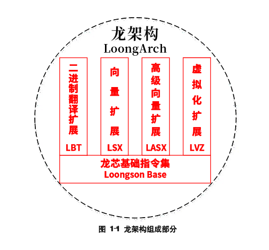
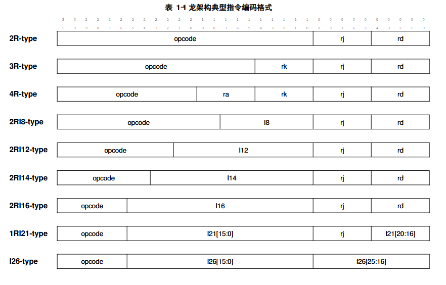
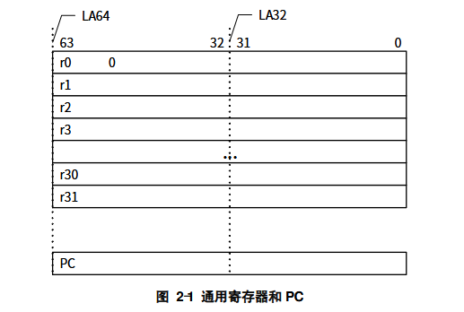

# LoongArch笔记

https://www.loongson.cn/index.php/download/index

LoongArch V1.1

暂只包含第一卷内容，对LoongArch的基础架构进行理解

## 目录

## 1 ISA概览

LoongArch的基础ISA为**Loongson Base**，并且在此基础上有4个扩展，分别为**LBT**二进制翻译扩展（Loongson Binary Translation），**LVZ**虚拟化扩展（Loongson Virtualization），**LSX**128位向量扩展（Loongson SIMD Extension），**LASX**256位向量扩展（Loongson Advanced SIMD Extension）



LoongArch也有LA32和LA64两个版本。LA64仅能在应用层面兼容LA32，系统层面无法兼容。本笔记只讲述LA64

## 1.1 指令编码

LoongArch所有指令采用固定的32位编码，且指令在内存中必须4Byte对齐，否则触发异常

LoongArch一共有9种典型的指令编码，分别为`2R` `3R` `4R` `2RI8` `2RI12` `2RI14` `2RI16` `1RI21` `I26`



> `R`代表寄存器，`I`代表立即数。目的寄存器放在最低位

## 1.2 指令助记符

指令助记符有**前缀**和**后缀**

**前缀**：LSX指令使用`v`开头，LSX浮点指令使用`vf`开头，LASX指令使用`xv`开头，LASX浮点指令使用`xvf`开头，非LSX和LASX的普通浮点指令使用`f`开头

**后缀**：后缀用于表征指令操作的对象类型。整数有`.b` `.h` `.w` `.d` `.bu` `.hu` `.wu` `.du`，分别表示Byte，HalfWord (2Byte)，Word (4Byte)，DoubleWord (8Byte)，以及对应的无符号类型；如果是否有符号对于指令执行结果来说没有影响，一律使用有符号后缀`.b` `.h` `.w` `.d`。而浮点数（`f` `vf` `xvf`开头的指令）有`.h` `.s` `.d` `.w` `.l` `.wu` `.lu`，分别表示Half半精度（16bit），Single单精度（32bit），Double双精度（64bit），Word单字（4Byte），Long双字（8Byte），以及无符号Word/Long。浮点指令有`.w` `.l` `.wu` `.lu`后缀是因为有整数浮点转换的指令会使用到

并不是所有指令都一定有前缀或后缀

## 1.3 指令格式

指令格式类似ARM，目的寄存器放在最前，后面再放各源寄存器

```
mulw.d.wu rd, rj, rk
```

```
crc.w.b.w rd, rj, rk
```

> 如果目标寄存器和源寄存器数据类型都相同，助记符只需1个后缀。如果源寄存器数据类型相同，但是和目标寄存器数据类型不同，那么助记符后缀有2个，分别依次对应目标寄存器和源寄存器数据类型。其余情况需要针对每个寄存器依次设定一个后缀，表征其数据类型

通用寄存器使用`rX`表示，浮点寄存器使用`fX`表示，128位LSX向量寄存器使用`vX`表示，256位LASX向量寄存器使用`xX`表示

## 2 整数

## 2.1 通用寄存器GR

LoongArch是**小端机**（Little-Endian），一共有32个GR，依次为`r0`到`r31`。其中`r0`恒为0（Hard-wired to zero）。LA64中所有GR长度64bit（`GRLEN=64`），LA32中所有GR长度32bit（`GRLEN=32`）

`r1`除了作通用寄存器，也是`bl`指令的隐含目标寄存器，用于存放函数调用返回地址

除了`r0` `r1`，其余所有30个寄存器没有本质区别，都是对称且通用的。其具体作用可以由ABI进一步定义



## 2.2 PC

LA64中`pc`长度64bit，LA32中`pc`长度32bit

`pc`显示当前指令地址，只可直接读取不可直接写入修改。只会因为分支、跳转、异常陷入等指令被间接修改

## 3 特权架构

LoongArch一共有4个特权等级（Privilege Level），依次为`PLV0`到`PLV3`，其中`PLV0`拥有最高权限，是**特权等级**，可访问的内容最多；而`PLV1`到`PLV3`都是**非特权等级**。Linux下内核态对应`PLV0`，用户态对应`PLV3`

非特权等级状态下不允许访问特权内容。一个例外是`CSR.MISC`中`RPCNTL1/RPCNTL2/RPCNTL3`置`1`时允许在非特权等级用`csrrd`指令读性能监测相关寄存器

非特权等级下有部分功能是可以控制是否开启的。通过给`CSR.MISC`中`DRDTL1/DRDTL2/DRDTL3`置`1`可以禁止在非特权等级下执行`rdtime`命令

## 4 中断与例外

这里方便习惯性表述，默认异常=例外

中断interrupt，异常/例外exception

**中断**和**异常**是两个概念，前者是由于外部信号引发，而后者是由于执行时出现异常情况例如除0，取指异常，访存异常，特权等级异常等

另外**产生**中断/异常和**触发**中断/异常的概念也是不一样的，前者只是产生，但是这些中断/异常是要进入流程去处理的，所以后者才是表示确实进入到了处理流程

非特权应用程序主要会遇到如下异常：系统调用`SYS`（执行`syscall`时触发），断点`BRK`（执行`break`时触发），指令不存在`INE`（未定义指令），特权等级错`IPE`（非特权模式下执行不该执行的特权指令），取指地址错`ADEF`，访存地址错`ADEM`，浮点异常`FPE`

## 5 内存架构

LoongArch支持3种访存方式，分别为一致可缓存（`CC`或`Coherent Cached`，主要用于数据存储例如DRAM空间）；强序非缓存（`Strongly-ordered Uncached`或`SUC`，主要用于外设IP寄存器）；弱序非缓存（`Weakly-ordered Uncached`或`WUC`，相当于`CC`模式关Cache，主要用于会被其他设备访问的存储空间，例如显存）

由于预测执行的存在，`SUC`虽然指令本身访存顺序可以保证，但是取指是允许有副作用的，它依旧可能提前被取指并执行。这会导致不预期的情况，这种情况由处理器硬件设计规避

LoongArch多核处理器中Cache一致性由硬件维护，所以LoongArch没有Cache维护指令。但是由于流水线和推测执行的存在依旧有内存屏障指令`ibar`保证取指之前做完所有的Store访存操作

LoongArch中取指必须4Byte对齐，否则触发`ADEF`

## 6 浮点数