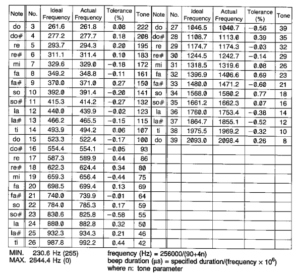
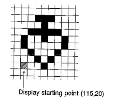
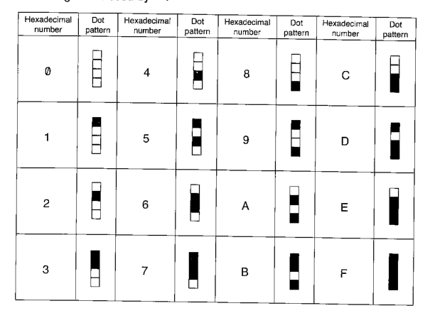
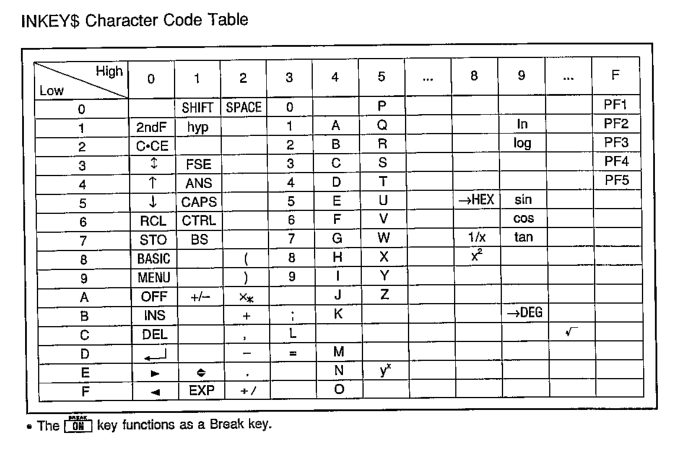
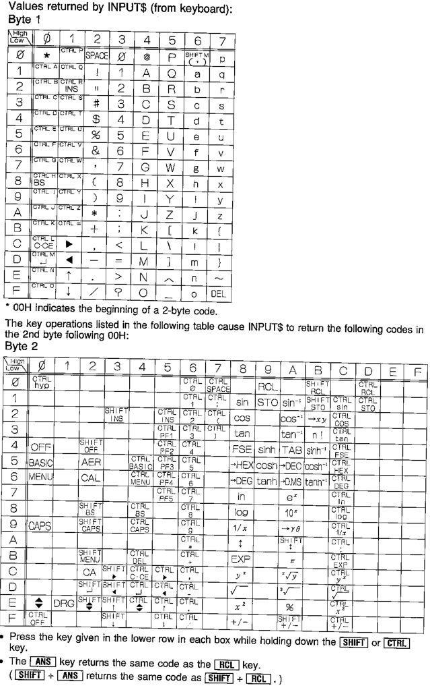
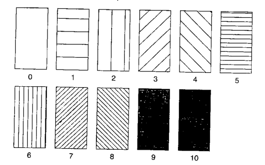

# 一些古老可编程计算器的试玩备忘

## 目录

+ [**SHARP PC-E500**](#sharp-pc-e500)
+ [**1**](#1-快速上手) 快速上手
    + [**1.1**](#11-存储) 存储
    + [**1.2**](#12-basic运行模式) BASIC运行模式
    + [**1.3**](#13-代码存取) 代码存取
        + [**1.3.1**](#131-基本操作) 基本操作
        + [**1.3.2**](#132-代码链接与合并) 代码链接与合并
+ [**2**](#2-basic编程) BASIC编程
    + [**2.1**](#21-基本格式) 基本格式
        + [**2.1.1**](#211-行号) 行号
        + [**2.1.2**](#212-标签) 标签
        + [**2.1.3**](#213-注释) 注释
        + [**2.1.4**](#214-变量类型) 变量类型
    + [**2.2**](#22-表达式) 表达式
        + [**2.2.1**](#221-运算表达式) 运算表达式
        + [**2.2.2**](#222-关系表达式) 关系表达式
        + [**2.2.3**](#223-逻辑运算表达式) 逻辑运算表达式
    + [**2.3**](#23-调试) 调试
    + [**2.4**](#24-数据文件操作) 数据文件操作
        + [**2.4.1**](#241-打开文件) 打开文件
        + [**2.4.2**](#242-写入文件) 写入文件
        + [**2.4.3**](#243-读取文件) 读取文件
        + [**2.4.4**](#244-其他操作) 其他操作
    + [**2.5**](#25-数值计算命令) 数值计算命令
    + [**2.6**](#26-其余通用命令) 其余通用命令
    + [**2.7**](#27-打印机绘图仪串口相关命令) 打印机/绘图仪/串口相关命令
    + [**2.8**](#28-保留命令) 保留命令
    + [**2.9**](#29-一些其他技巧) 一些其他技巧
        + [**2.9.1**](#291-使用十六进制编码常数) 使用十六进制编码常数

# SHARP PC-E500

## 1 快速上手

## 1.1 存储

SHARP PC-E500最多有3个存储设备，分别是不可修改的ROM（固件，S3），内置SRAM（S1），以及后盖打开可选的扩容卡（S2，是内置电池的SRAM卡）。所有SRAM由纽扣电池供电以保持数据

原装的PC-E500只有32K内置SRAM。南方测绘仪器公司以前进口过大量PC-E500并进行改装扩容，目前国内二手市场流通的PC-E500大多是南方测绘的扩容机，常见的扩容型号有256K，64K等（64K扩容型号在南方测绘内部称为PC-E550，256K扩容型号在内部称为PC-E5555）。这类机器拆开可见飞线并外挂一个逻辑门，SRAM叠焊。并不是维修机

SRAM存储分为程序运行时可用内存和内存磁盘。内存磁盘`E:`盘固定映射到`S1`也即内置SRAM；`F:`盘固定映射到`S2`也即外置扩容卡，没有扩容卡时不可使用`F:`盘；`G:`盘映射到ROM，固定分配，不可修改

机器到手后第一次上电时可能不会有`E:`盘，需要手动初始化以后才能用。示例，初始化一个`96K`大小的`E:`盘

```
INIT "E:96K"
```

编写好的BASIC程序需要通过`LOAD`命令加载到运行时内存以后才能修改与运行

查看可用运行时内存，创建磁盘后会相应减小

```
FRE 0
```

磁盘剩余容量可以使用`DSKF`命令查看。`3`表示`E:`，`4`表示`F:`，`5`表示`G:`

```
DSKF 3
```

PC-E500有3种内存模式，分别为`S1` `S2` `B`。其中`S1`模式把内置SRAM作运行内存使用，`LOAD`上来的BASIC代码、变量都放在这里，`E:`和`F:`盘都可以使用（如果有）。`S2`模式把外置扩容卡作运行内存使用，BASIC代码、变量都放在这里，`E:`和`F:`盘都可以使用，而AER、PF按键数据块依旧放在内置SRAM。`B`模式同时将内置SRAM和外置扩容卡作运行内存使用，此时内置SRAM和扩容卡合并为`S1`，只能使用`E:`

内存模式通过以下命令设定。默认模式`S1`，没有特殊需求不用改。在`S2`和`B`之间切换必须经过`S1`，也就是说必须先切到`S1`才能继续切到`S2`或`B`

```
MEM$="S1"
```

**附：南方测绘逆向出来的PC-E500地址分布**


## 1.2 BASIC运行模式

BASIC运行模式分为两种，分别为**命令模式**，在屏幕状态栏显示`RUN`，以及**编程模式**，在状态栏显示`PRO`。模式通过按`BASIC`键切换。两种模式下可用的BASIC命令有所不同。`PRO`模式下编写的代码需要切换到`RUN`模式下通过`RUN`命令运行

`PRO`模式实际也分2个子模式，分别是需要有行号的行编辑模式，以及出现`>`提示符时的命令模式。`PRO`行编辑模式下编写的代码正常情况下即便关机或按`RESET`键也不会丢失，会一直在内存里。想要从头开始编写新的代码，需要在`PRO`命令模式下执行一下`NEW`

`PRO`命令模式下可以通过`LIST`命令或按`↑`方向键进入行编辑模式；而`PRO`行编辑模式可以通过直接输入命令或直接输入空行（不要写行号，直接按回车）自动切换到`PRO`命令模式

`PRO`的命令模式不可以执行`RUN`命令，`RUN`命令必须切换到`RUN`模式下运行。而`RUN`模式也不可以执行`LIST`这些命令

`RUN` `LIST` `CONT` `SAVE` `LOAD`命令分别对应按键`PF1` `PF2` `PF3` `PF4` `PF5`，可以通过这些按键快捷调用命令

## 1.3 代码存取

### 1.3.1 基本操作

运行内存中的代码（只可能有1份）可以`SAVE`到SRAM磁盘中，也可以从内存磁盘中`LOAD`代码到运行内存中

> 下述文件命令在`PRO`命令模式与`RUN`模式都可以使用

BASIC代码有2种保存方式，一种是ASCII码，一种是二进制中间码

保存为ASCII码

```
SAVE "E:DEMO.BAS",A
```

保存为中间码

```
SAVE "E:DEMO.BAS"
```

> BASIC程序文件默认后缀名`.BAS`。即便不加后缀也会自动加

加载代码到内存

```
LOAD "E:DEMO.BAS"
```

此外`LOAD?`命令可以校验当前内存中的文件副本和内存盘中的是否一致

```
LOAD? "E:DEMO.BAS"
```

列出内存盘`E:`中的文件

```
FILES "E:"
```

将文件列表从打印机打印出来

```
LFILES "E:"
```

或列出整个`S1`中AER，按键设定，BASIC变量占用空间，BASIC代码占用空间等

```
FILES "S1:"
```

> 实际上PC-E500内存中所有数据都是以数据块的形式存储，包括上面所说的AER，BASIC变量，BASIC代码等，这里就是列出了`S1:`中所有的数据块

删除文件

```
KILL "E:DEMO.BAS"
```

重命名文件

```
NAME "E:DEMO.BAS" AS "E:NEW.BAS"
```

复制文件

```
COPY "E:DEMO.BAS" TO "E:NEW.BAS"
```

复制为ASCII格式

```
COPY "E:DEMO.BAS" TO "E:NEW.BAS",A
```

还可以将文件设定为写保护。设定写保护后使用`FILE`命令可以看到`P`标记

```
SET "E:DEMO.BAS", "P"
```

解除写保护

```
SET "E:DEMO.BAS", " "
```

### 1.3.2 代码链接与合并

如果代码太长内存里放不下，或者程序运行没有足够的内存空间，可以将程序拆成几段分别储存。一段程序执行到指定阶段可以通过`CHAIN`命令调用内存盘上的另一段程序，并从指定行（或标签）启动，实现Code Banking的作用。此时原有程序被清空，被替换为`CHAIN`指定的程序

```
CHAIN "E:ALTFUNC.BAS", 1010
```

> 建议多个文件行号按顺序来

代码合并将内存盘上指定程序按照行号和当前内存中程序合并。注意相同行号会被覆盖，并且在内存盘上被合并的代码必须是ASCII格式

```
MERGE "E:ALTFUNC.BAS"
```

## 2 BASIC编程

执行`NEW`命令可以清除运存中的BASIC程序，从头开始编写

## 2.1 基本格式

### 2.1.1 行号

BASIC中每一行代码都需要在开头加上行号

```
10:CLS
20:PRINT "Hello world!"
30:CLEAR
40:END
```

在PC-E500中只需输入行号后直接加对应命令即可，编写完当前行以后直接回车，会自动添加`:`

行号建议和BASIC编程习惯一样，不要连续，方便后续插入新代码。插入新代码时也是通过行号决定代码插入到哪里的

建议代码最后加上`CLEAR`和`END`命令。`CLEAR`命令将所有变量清除，可以防止变量污染（BASIC程序退出以后变量还在环境里）

`CLS`是清屏命令

想要删除一行只要输入行号，直接回车即可，或者使用`DELETE`命令，可以支持删除指定范围的行

```
DELETE 20,50
```

删除指定行到末尾

```
DELETE 40,
```

**自动行号**

可以在执行`NEW`开始编写新代码前，通过`AUTO`命令设定自动行号，这样输入代码时就无需输入行号，会自动按照步长递增

```
AUTO 10,10
```

> 上述命令表示从行号`10`开始，步长`10`递增

**重编行号**

有行号以后想要重新编行号，使用`RENUM`命令

```
RENUM 5,10,5
```

> 上述命令表示从原来的第`10`行开始修改行号，新行号从`5`开始（第一个`5`），步长为`5`直到末尾（第二个`5`）

**跳到指定行**

`LIST`加行号或标签可以显示到指定行

```
LIST 50
```

```
LIST *PROGSTART
```

**从串口或打印机打印代码**

`LLIST`默认从CE-126P配套打印机上打印代码。如果执行了`OPEN`会从串口输出

```
LLIST 10,70
```

**多条命令写在同一行**

可以在同一行写多条命令，中间使用`:`隔开

```
CLS: A = A + 1: PRINT A
```

### 2.1.2 标签

可以给行添加一个标签，标签名开头必须加`*`，示例

```
10:*PROGSTART:CLS
```

这样就可以使用标签名而非行号引用这行代码了，例如可以使用在`RUN`或`GOTO`命令中，增加代码可读性

为方便表述，后续代码块省略行号

### 2.1.3 注释

注释使用`REM`命令，`'`也等价于`REM`

```
10:REM This is a comment
```

### 2.1.4 变量类型

变量按照基本数据类型可以分为数值变量，字符串变量

BASIC中所有变量都是全局的，并且BASIC程序退出后依然会保留。清除所有变量使用`CLEAR`命令，可以在BASIC脚本中使用，也可以在`RUN`模式下使用

**数值变量**

数值变量分为单精度和双精度变量。单精度变量数据本身需要占用7Byte，双精度变量数据本身占用12Byte。而变量名需要额外占用字符数+4Byte的空间。单精度变量有10位十进制尾数，双精度变量有20位十进制尾数

单精度变量在变量名后添加`!`显式表明。`!`可以省略，所以默认情况下创建的变量都是单精度

双精度变量在变量名后添加`#`显式表明。除非对一个变量名进行`DEFDBL`，否则`#`不可省略

以下使用一些例子说明单双精度变量定义与引用所允许的行为

一些单精度变量创建与使用的示例

```
AA = PI
BB! = SQR 2
CC = PI#
PRINT AA!
PRINT BB
PRINT CC
```

> 最终上述变量`AA BB CC`都是单精度变量。`AA`和`AA!`是同一个变量，`BB`和`BB!`也是同一个变量，依次类推。`PI`是圆周率，`SQR 2`是根号2
>
> 这里为什么不用`A B C`命名，是因为涉及到固定变量，后面会讲

一些双精度变量创建与使用的示例（这里先`CLEAR`一下）

```
DEFDBL AA
AA = PI
BB# = PI
CC# = PI!
PRINT AA
PRINT BB#
PRINT CC#
```

> 最终上述变量`AA BB# CC#`都是双精度变量，其中`PI!`强转单精度让`CC#`可能看上去像单精度，`BB#`看上去也像单精度，实际上它们依旧是双精度变量（变量到底占用多少可以通过`FRE 0`命令看减少了多少字节可用内存）。`DEFDBL`命令将不带后缀的`AA`默认映射为双精度变量`AA#`，所以后续可以省略`#`后缀，此时`AA`和`AA#`才是同一个变量，而`AA!`是不相关的单精度变量，此时看`AA!`等于`0`。同理，在前面的单精度示例中如果看`AA#`也是`0`
>
> 也就是说，没有后缀的数值变量到底映射到双精度版本`#`还是单精度版本`!`，可以分别由`DEFDBL` `DEFSNG`决定。`DEFSNG`是默认情况下的设定，所以默认映射到`!`单精度版本
>
> 此外，使用`DEFDBL`显式声明的变量，在涉及到该变量的运算中，也会使用常量的双精度版本，上述例子中`AA = PI`相当于`AA# = PI#`。但是普通的`BB# = PI`不会有这种效果，赋值依旧是使用的`PI`的单精度版本，用0扩展精度
>
> 在涉及到混合精度的运算中，BASIC会尽量都转成双精度再计算

**十六进制常量**

十六进制常量需要在开头加上`&`或`&H`

```
A = &15F3
```

> 可以使用`HEX`或`DECI`命令将变量转为十六进制、十进制显示，这两条命令本身返回结果是单精度。在BASIC代码中主要用在`PRINT`命令中，示例`PRINT HEX 1513`。而在`RUN`模式下也可以直接使用这两条命令，方便转换

**单精度常量**

单精度常量使用`xxEyy`的格式

```
A! = 1.5E-10
```

**双精度常量**

双精度常量使用`xxDyy`的格式

```
A# = 3.9188209828357723D-6
```

**固定变量和简单变量**

内存中有26个固定位置可以存放单精度变量，这些位置不会占用内存，每个长度8Byte，通过变量名`A!`到`Z!`使用。也是因此，创建单精度变量`A!`到`Z!`时看`FRE 0`发现内存不会减少。这26个单精度变量称为固定变量Fixed Variables

还是先`CLEAR`一下

```
FRE 0
A = PI
FRE 0
AB = PI
FRE 0
A# = PI#
FRE 0
```

> 上述变量中，只有`A`（`A!`）是固定变量。而`AB`和`A#`都是简单变量，会占用内存。两类变量的本质区别就是静态分配和动态分配
>
> 简单变量的变量名最长可以支持40个字符

**字符串变量**

字符串变量最长254字节，命名必须以`$`符号结尾

```
USERNAME$ = "benjamin"
```

**数组**

数组使用`DIM`命令定义，数组元素类型需要通过名称体现（例如添加`!` `#` `$`后缀）

定义长度为`10`（下标`0~9`）的单精度数组`A`（这里`A`不是固定变量）

```
DIM A(9)
```

定义长度为`5`的字符串数组

```
DIM S$(4)
```

数组可以有任意维度（最多支持`120`维，每个维度长度最大`65534`）

定义一个`3*5`的双精度二维数组

```
DIM D#(2,4)
```

可以一次定义多个数组

```
DIM A$(9), L#(9,15), K(9,19)
```

元素引用与赋值，直接`()`内加下标

```
A(4) = 15 
```

## 2.2 表达式

### 2.2.1 运算表达式

| 符号 | 定义 | 使用例 |
| :- | :- | :- |
| `+` | 加法或正号 |  |
| `-` | 减法或负号 |  |
| `*` | 乘法 |  |
| `/` | 除法 |  |
| `^` | 指数 |  |
| `+`（字符串） | 连接两个字符串（或字符串变量，任意组合） |  `A$ = "First name " + "Last name"` |

> 运算表达式中，建议多加`()`显式说明运算次序

### 2.2.2 关系表达式

| 符号 | 定义 | 使用例 |
| :- | :- | :- |
| `=` | 等于 |  |
| `<>` | 不等于 |  |
| `<` | 小于 |  |
| `>` | 大于 |  |
| `<=` | 小于等于 |  |
| `>=` | 大于等于 |  |
| `=` `<>` `<` `>` `<=` `>=`（字符串） | 按ASCII码顺序比较两个字符串，如果长度不同会把短的字符串补`0` | `A$ = "Alice"` |

> 注意BASIC中使用`-1`表示TRUE，使用`0`表示FALSE（`-1`也就是寄存器全举1，`0`也就是寄存器全清0）

### 2.2.3 逻辑运算表达式

| 符号 | 定义 | 使用例 |
| :- | :- | :- |
| `AND` | 与 | `A = 5 AND B > 3` |
| `OR` | 或 | `A = 5 OR B > 3` |
| `NOT` | 非 | `NOT A = 10` |
| `XOR` | 异或 | `A = 5 XOR B > 3` |

因为如前所述BASIC中TRUE相当于全举`1`的寄存器，FALSE相当于全清`0`的寄存器，逻辑运算符实际上就是位运算，异或交换示例

```
A = A XOR B
B = A XOR B
A = A XOR B
```

表达式优先级如下，由高到低

| 运算优先级 |
| :- |
| `()`内表达式 |
| 从变量取值 |
| 命令 |
| `^` |
| `+` `-`（正负） |
| `*` `/` |
| `+` `-` |
| `=` `<>` `>` `<` `>=` `<=` |
| `NOT` `AND` `OR` `XOR` |

## 2.3 调试

调试可以通过`TRON`打开。打开`TRON`以后在执行每一行代码时会停顿一下，屏幕右上角会显示行号。执行到目标行时按`BREAK`键可以暂停运行，此时可以输入命令进行变量查看等操作

想要继续执行可以输入`CONT`命令或按`PF3`键

通过`TROFF`命令可以关闭调试状态，回到正常的执行模式

## 2.4 数据文件操作

PC-E500只支持Sequential File

### 2.4.1 打开文件

```
OPEN "E:DATA.TXT" FOR INPUT AS #10
```

> 这里的`#10`是文件描述符，合法值`#1`到`#255`。PC-E500上所有内存盘、串口、磁带加起来最多允许同时打开2个文件描述符
>
> `INPUT`表示从文件读取内容。除`INPUT`外还有`OUTPUT`表示覆写文件，`APPEND`表示向文件追加内容
>
> `APPEND`和`INPUT`模式必须保证指定文件存在。`OUTPUT`会自动创建文件
>
> `APPEND`和`OUTPUT`模式必须保证文件不是写保护的
>
> 不可以二次创建当前已有的文件描述符，也不可以二次打开同一个文件

文件使用后关闭文件描述符

```
CLOSE #10
```

> 指定`END`或`RUN`命令，关机，切换`PRO` `RUN`模式，执行`LOAD`会导致当前文件描述符被关闭

### 2.4.2 写入文件

文件中的内容本质上都是使用字符串存储的，包括数值

向文件写数据使用`PRINT`命令，指定文件描述符写入，后接表达式列表。一次`PRINT`写入一行数据，这行数据以`CR LF`换行符结尾

表达式之间使用`,`或`;`分隔。如果一个表达式后面加`,`，那么这个表达式（解析结果）在数据文件中的记录长度为`20`字节整数倍，字符串靠左放置（如果长于20字符那么会再开20字节空间），数值靠右放置。如果一个表达式后面加`;`，那么数值变量会相对前一个表达式解析结果空1字符，而字符串和前者不会有空格（也就是说，一个`PRINT`命令中字符串表达式之间如果使用了`;`分隔，需要手动添加分隔符`,`，否则两个字符串会合并为一个字段）

> 使用`,`经常造成空间浪费。建议多使用`;`。此外字符串里建议不要包含逗号

```
PRINT #10, -15.232; 16.152; -15.293; 16.211;
PRINT #10, "Norway", "Sweden", "Finland",
```

### 2.4.3 读取文件

> 读写文件不能同时进行。要写入后读取，需要关闭文件描述符后重新以`INPUT`模式打开，反之亦然

读取文件内容使用`INPUT`命令

数据文件中，规定空格` `，逗号`,`，换行`CR LF`作为数值变量的字段分隔符；规定逗号`,`，换行`CR LF`作为字符串变量的字段分隔符。也就是说对于一个数据类型，从上一个分隔符到下一个分隔符之间的内容会被赋值到变量。一条`INPUT`命令赋值结束后，之后的`INPUT`命令会从接下来的字段继续读取

> 双引号`" "`也可以强制把一个字段括起来，优先级更高，之间的内容被认为是一个字段整体

需要注意变量类型必须和字段存储的数据类型对应

```
INPUT #10, FIRSTN$, LASTN$, AGEU 
```

读取文件时，文件描述符维护了一个读指针。可以使用`EOF`命令检测指针是否读到文件末尾，如果已经是末尾那么返回`-1`

```
EOF 10
```

此外还可以使用`INPUT`命令直接读取指定长度字符串到字符串变量，不受分隔符限制

```
A$ = INPUT $(20, #10)
```

> 上述命令从`#10`当前位置读取20字符存储到`A$`

### 2.4.4 其他操作

查看当前文件描述符对应文件长度

```
LOF 10
```

查看指定描述符当前指针位置（记录号）

```
LOC 10
```

## 2.5 数值计算命令

| 命令 | 定义 | 使用例 |
| :- | :- | :- |
| `DEGREE` | 切换到DEG模式 |  |
| `RADIAN` | 切换到RAD模式 |  |
| `GRAD` | 切换到GRAD模式 |  |
| `ABS` | 绝对值 | `ABS I#` |
| `ACS` | arccos | `ACS (1/2)` |
| `AHC` | 双曲arccos | `AHC 1` |
| `AHS` | 双曲arcsin | `AHS 0` |
| `AHT` | 双曲arctan | `AHT 0` |
| `ASN` | arcsin | `ASN 0.5` |
| `ATN` | arctan | `ATN 1` |
| `COS` | cos | `COS 60` |
| `CUB` | 三次幂 | `CUB 3` |
| `CUR` | 三次根号 | `CUR 27` |
| `DECI` | 十六进制转十进制，只可用于单精度 | `DECI 1FF` |
| `DEG` | 度分秒转小数度数，小数点后跟2位分，2位秒 | `DEG 20.5112` |
| `DMS` | 小数读数转度分秒（角秒后还有2位） | `DMS 20.8533` |
| `EXP` | e^x | `EXP 1` |
| `FACT` | x! | `FACT 10` |
| `HCS` | 双曲cos | `HCS 0` |
| `HSN` | 双曲sin | `HSN 0` |
| `HTN` | 双曲tan | `HTN 0` |
| `HEX` | 十进制转十六进制，只可用于单精度 | `HEX 65535` |
| `INT` | 强转整数（去除小数部分） | `INT (A/B)` |
| `LN` | ln(x) | `LN 1` |
| `LOG` | log10(x) | `LOG 10000` |
| `NCR` | 组合 | `NCR (6,2)` |
| `NPR` | 排列 | `NPR (6,2)` |
| `PI` | 圆周率 |  |
| `POL` | 直角坐标转极坐标，结果r固定保存到变量`Y`，角度保存到变量`Z`，只可使用单精度。只返回结果`Y` | `POL (1,1)` |
| `^` | 幂 | `2 ^ 10` |
| `RCP` | 倒数 | `RCP 2` |
| `REC` | 极坐标转直角坐标，结果x固定保存到变量`Y`，y保存到变量`Z`，只可使用单精度。只返回结果`Y` | `REC (2,30)` |
| `RND` | 返回一个随机数。如果参数大于1，那么返回的随机数是一个整数，取值从1到不小于参数的最小整数。如果参数在0到1之间，那么返回的随机数是一个小数，取值在0到1之间 | `RND 15` |
| `RANDOMIZE` | 由于每次开机以后随机数种子都是相同的，该命令可以重置种子以达到真随机 | `RANDOMIZE` |
| `ROT` | n次根号 | `27 ROT 3` |
| `SGN` | 符号，正数返回`1`，0返回`0`，负数返回`-1` | `SGN A` |
| `SIN` | sin | `SIN 30` |
| `SQR` | 开根 | `SQR 16` |
| `SQU` | 平方 | `SQU 4` |
| `TAN` | tan | `tan 45` |
| `TEN` | 10的次方 | `TEN 5` |

## 2.6 其余通用命令

| 命令 | 定义 | 使用例 |
| :- | :- | :- |
| `LET` | 变量赋值，可以省略 | `LET A = 15` |
| `AER` | 调用AER下存储的公式，后加AER序号以及参数列表（格式示例`F(X,Y) = SIN X + COS Y`） | `AER 1(60,30)` |
| `ARUN` | 需要`PRO`模式下写到程序开头，开机时如果进入RUN模式自动运行程序，后可加行号或标签。运行前会清除所有非固定变量 | `ARUN *LABEL` |
| `ASC` | 返回字符串第一个字符的ASCII码 | `ASC "E"` |
| `AUTO` | 行自动编号，指定起始行号和步进，只在非行编辑模式使用 | `AUTO 10,10` |
| `AUTOGOTO` | 类似`ARUN`，但是不会清除变量 | `AUTOGOTO 80` |
| `BASIC` | `PRO`模式下切换到到`BASIC`模式。`PRO`模式下有2种编辑模式，一种是`BASIC`，会强制按照BASIC语法格式化代码，并且可将代码保存为二进制中间码或ASCII格式。另一种是普通的`TEXT`文本编辑模式，这种模式下相当于一个普通的文本编辑器，但是依旧需要行号，文本只能以ASCII格式存储，并且不会强制按BASIC格式化 | `BASIC` |
| `BEEP` | 蜂鸣器。后加第一个参数是次数，第二个参数是音调（`255`到`0`），第三个参数是长度（`0`到`65535`）。音调值越小音调越高。音调会影响长度，音调越高长度会自动随之缩短，而长度不会影响音调 | `BEEP 10,128,512` |
| `CHAIN` | 从一个程序调用另一个程序（可以具体到行或标签），常用于内存不够需要拆分程序的情况，相当于Code Banking | `CHAIN "E:FUNC.BAS", 10` |
| `CHR$` | 返回数值对应的ASCII字符 | `A$ = CHR$ &48` |
| `CLEAR` | 清除变量，不加参数默认清除所有变量，不可用于`FOR TO NEXT`循环中。但是不能清除指定数组变量，清除指定数组需要使用`ERASE` | `CLEAR A#` |
| `CLOAD` | 从磁带机加载程序，不加参数默认加载第一个程序 | `CLOAD "PRO2"` |
| `CLOAD?` | 读取磁带机上存储的程序并和内存里的程序比较校验 | `CLOAD? "PRO2"` |
| `CLOSE` | 关闭指定文件描述符 | `CLOSE #21` |
| `CLS` | 清屏 | `CLS` |
| `CONT` | 在`RUN`模式下按BREAK停止程序后继续执行 | `CONT` |
| `COPY TO` | 复制文件。`E:` `F:`盘可以向任何地方拷贝，包括`CAS:`磁带、`COM:`串口。保存到磁带、串口时会自动转ASCII格式 | `COPY "E:TEMP.BAS" TO "E:DEMO.BAS",A` |
| `CSAVE` | 将内存中的BASIC程序保存到磁带，可以加可选的密码 | `CSAVE "PRO1","5ECRET"` |
| `DATA` | 定义一系列的数据，可以是任何普通数值变量或字符串。这些定义的数据可以被`READ`命令顺序读取，常用于初始化数组。`DATA`命令可以出现在BASIC程序`END`前的任何位置，无论出现在哪里，还是多少条，所有这些`DATA`命令定义的数据会自动合并，效果和使用1条`DATA`命令定义的一样 | `DATA 10,15,12,11` |
| `DEFDBL` | 将单字符变量默认设定为双精度，不加参数切换到双精度计算模式 | `DEFDBL A,B,F-H` |
| `DEFSNG` | 将单字符变量默认设定为单精度，不加参数切换到单精度计算模式 | `DEFSNG A,B,F-H` |
| `DEGREE` | 角度模式切换到度 | `DEGREE` |
| `DELETE` | 仅可在`PRO`命令模式下输入，删除指定行 | `DELETE 50-80` `DELETE ,80` `DELETE 90,` |
| `DIM` | 定义数组，不可用于`FOR TO NEXT`循环中 | `DIM A(3,4)` |
| `DSKF` | 检查SRAM盘剩余容量，`3`对应`E:`，`4`对应`F:` | `DSKF (3)` `DSKF ("E:")` |
| `END` | 代码结束 | `END` |
| `EOF` | 文件描述符指针是否达到文件末尾 | `EOF (20)` |
| `ERASE` | 清除指定数组，不可用于`FOR TO NEXT`循环中 | `ERASE AA` |
| `ERL` | 返回出错行，经常用于`ON ERROR GOTO`到的语句中 | `IF ERL = 30 THEN PRINT ERL,ERN` |
| `ERN` | 返回错误码 |  |
| `FILES` | 列出文件 | `FILES "E:"` `FILES "S1:"` `FILES "E:F??F"` `FILES "E:NOTE*"` |
| `FOR NEXT` | `FOR`循环，变量只能是单精度。有可选的`STEP`步进，每次执行到`NEXT`就给变量加上`STEP`，该语句可以嵌套 | `FOR A = 1 TO 50 STEP 2 : PRINT A : NEXT A` |
| `FRE` | 列出内存空余空间。由于字符串变量是有idle space的，字符串变量在分配内存空间时可能会留有一些余量，这部分空间还是可以回收的，`0`返回加上这部分idle space的空余空间，`1`返回不加上这部分的空余空间。`FRE 1`可能执行更快 | `FRE 1` |
| `GCURSOR` | 设定LCD绘图光标。LCD分辨率240*32 | `GCURSOR (115,20)` |
| `GOSUB RETURN` | BASIC子程序调用。通常子程序放到`END`语句之后，在主程序通过`GOSUB`跳转到`END`之后的指定行号或标签，执行到子程序末尾再通过`RETURN`返回到`GOSUB`语句，从下一条语句开始执行 | `GOSUB 150` |
| `GOTO` | 无条件跳转，用在`IF`语句里可以实现有条件跳转 | `GOTO 10` `GOTO *FUNC` |
| `GPRINT` | 在LCD上`GCURSOR`处画图，参数可以是多个字符串 | `GPRINT "55AA55AA55AA55AA"` `GPRINT AA$;AA$;AA$;AA$` |
| `GRAD` | 角度模式切换到梯度 | `GRAD` |
| `HEX$` | 返回数值对应的十六进制字符串。注意和`HEX`是不同的，`HEX`返回的依旧是一个普通数值 | `S$ = HEX$ A` |
| `IF THEN ELSE` | 条件判断，可以没有`ELSE`。`IF THEN ELSE`必须写在同一行，使用`GOTO`跳转。如果`THEN`或`ELSE`后面是一个`GOTO`语句，那么可以省略`THEN`或`GOTO`，但是`ELSE`不可省略 | `IF A < 50 THEN GOTO 100` `IF A < 50 THEN GOTO 100 ELSE GOTO 120` `IF A < 50 GOTO 100 ELSE GOTO 120` `IF A < 50 GOTO 100 ELSE 120` `IF A < 50 THEN 100 ELSE 120` |
| `INIT` | 初始化SRAM磁盘 | `INIT "E:64K"` |
| `INKEY$` | 返回执行到当前语句时刻按下的按键。由于键盘是扫描方式，想要扫到有效的键，通常需要不断循环扫，同时一直按住键不松才会有结果。键码见后 | `A$ = INKEY$ : A = ASC A$` |
| `INPUT` | 读取用户输入，可以有多个提示字符串和对应的输入变量。提示字符串和变量之间可以是`,`或`;`，使用`,`时在用户输入的时候提示字符串会消失，而使用`;`不会消失，用户输入直接在提示字符串后面回显。`INPUT`以回车结束一条输入并填入到变量 | `INPUT A, B` `INPUT "PROMPT A: ", A, "PROMPT B: ", B` `INPUT "PROMPT A: "; A, "PROMPT B: "; B` |
| `INPUT$` | 从键盘或文件描述符读取指定字符数并返回为字符串（不受任何字符例如换行等影响），键码见后 | `A$ = INPUT $ (10)` `A$ = INPUT $ (10, #10)` |
| `INPUT#` | 从指定文件描述符（只能是软盘或SRAM盘）读取字段并保存到指定变量，字段不够会报错。对于普通数值变量来说字段分隔符可以是`,`，` `空格或`CRLF` `CR` `LF`，而字符串变量除了不使用空格作为分隔符其他都一致。建议都使用`,`作为分隔符。除此之外字符串可以用`""`括起来，表示是一个整体 | `INPUT #2, A$, B$` |
| `KEY` | 设定`PF`按键定义的功能字符串，可取值`1`到`10`，其中`6`到`10`对应SHIFT+PF键。默认不加回车，如果想要加回车需要在字符串后`+ CHR$ 13`，为回车对应的键码 | `KEY 10, "RUN 110"` |
| `KEY$` | 返回`PF`按键定义的功能字符串，可取值`1`到`10` | `FUNC$ = KEY$ 1` |
| `KILL` | 删除软盘或SRAM盘上的文件 | `KILL "E:DEMO.BAS"` |
| `LEFT$` | 返回字符串靠左的N个字符 | `S$ = LEFT$ (A$,3)` |
| `LEN` | 返回字符串长度 | `LEN "Jacob"` |
| `LET` | 变量赋值，可省略 | `LET A = 15` |
| `LINE` | 在LCD上画一条直线，或者矩形。至少需要指定一个目标坐标（单位像素），如果不指定源坐标默认从当前位置开始画（不是`GCURSOR`的位置），坐标XY取值范围都是`-32768`到`32767`。后面还有3个可选参数，依次为`S` `R` `X`（`S`表示经过的像素全部置1，`R`表示全部置0，`X`表示反转），线条样式（默认`&FFFF`实线），以及`B` `BF`矩形样式（此时坐标为对角坐标，`B`表示空心矩形，`BF`表示实心矩形。如果实心矩形有样式例如`&CCCC`，实心矩形实际上是由横向的线条组成，这样视宽度不同会有不同的花纹） | `LINE -(127,16)` `LINE (10,10)-(20,20),X` `LINE (127,0)-(137,10),S,$AAAA,BF` |
| `LIST` | 只在`PRO`命令模式可用，显示代码，可以指定行号 | `LIST 60` |
| `LOAD` | 从SRAM内存盘、磁带（`CAS:`）或串口（`COM:`）加载程序代码到内存，加`R`立即执行 | `LOAD "E:DEMO.BAS"` `LOAD "CAS:DEMO.BAS",R` |
| `LOAD?` | 检验代码，可以用于检测代码是否被意外修改 | `LOAD? "E:DEMO.BAS"` |
| `LOC` | 返回文件描述符指针位置（单位字段） | `LOC 20` |
| `LOCATE` | LCD可以显示4*40个字符（坐标范围分别为`0-3`以及`0-39`），该命令设定`PRINT`命令从哪里开始打印。`LOCATE`第一次重定位并`PRINT`以后下一次`PRINT`默认从下一行开头开始 | `LOCATE (10,1)` |
| `LOF` | 返回指定文件描述符对应文件大小 | `LOF 20` |
| `MDF` | 按照`USING`设定的格式进行舍入，默认`4`舍`5`入 | `MDF (7/22)` `MDF (7/22, 5)`（设定为`5`舍） |
| `MEM$` | 设定或获取当前存储模式 | `MEM$ = "S1"` `MEM$ = "S2"` `MEM$ = "B"` |
| `MERGE` | 合并代码，代码必须是ASCII格式 | `MERGE "E:FUNC.BAS"` |
| `MID$` | 从字符串中指定下标开始截取指定长度，下标从`1`开始 | `MID$ (A$,1,5)` |
| `NAME AS` | 重命名SRAM内存盘或软盘中的文件 | `NAME "E:DEMO.BAS" AS "E:PROJ.BAS"` |
| `NEW` | 清空程序区代码 | `NEW` |
| `ON ERROR GOTO` | 运行中发生任何错误跳转到指定行，错误处理通常结合`ERN` `ERL`实现 | `ON ERROR GOTO 100` |
| `ON GOSUB` | 根据表达式的值（转换为整数）判定跳转到`GOSUB`后面哪个子程序入口，`1`跳转到第一个，`2`跳转到第二个。子程序中可以使用`RETURN`返回 | `ON A GOSUB 100,110,120` |
| `ON GOTO` | 根据表达式的值（转换为整数）判定跳转到`GOSUB`后面哪行代码 | `ON A GOTO 100,110,120` |
| `OPEN FOR AS` | 打开文件并赋给一个文件描述符，`INPUT`读取，`OUTPUT`写入（文件不存在会自动创建），`APPEND`追加。不允许写入写保护的文件 | `OPEN "E:DATA.TXT" FOR OUTPUT AS #20` |
| `PASS` | 将内存中的代码加密、解密，密码不超过`8`位。加密后代码无法使用`LIST`查看，无法修改编辑，也无法保存 | `PASS "SECRET"` |
| `PAUSE` | 用法同`PRINT`，但是会暂停约`0.85`秒后继续执行 | `PAUSE A,B#` |
| `POINT` | 返回LCD屏上指定点的状态（坐标先列后行，左上角为`(0,0)`） | `POINT (128,1)` |
| `PRESET` | 清除LCD上指定点 | `PRESET (128,1)` |
| `PRINT` | 显示数据。列表末尾加`,`或`;`可以实现不换行继续打印。默认数字向右对齐，字符串向左对齐。单精度固定长度`13`字符，双精度固定长度`40`字符（一行）。可以使用`LOCATE`设定开始打印字符的位置，见上。使用打印机的情况下可以将`PRINT`映射到`LPRINT`（`PRINT=LPRINT`，反之`LPRINT=PRINT`），这样可以无需修改代码就可以让程序从打印机输出 | `PRINT A,B` `PRINT A,B,` `PRINT A;B` `PRINT USING "###.###"; A,B` |
| `PRINT#` | 打印输出到文件或串口 | `PRINT #20, A$` |
| `PSET` | 点亮LCD上指定点 | `PSET (128,1)` |
| `RADIAN` | 角度模式切换到弧度 | `RADIAN` |
| `RANDOMIZE` | 重置随机种子 | `RANDOMIZE` |
| `READ` | 读取程序中`DATA`语句定义的数据并赋值到变量 | `READ A,B,C,D,E` |
| `REM` `'` | 注释 | `REM THIS IS A COMMENT` |
| `RENUM` | `PRO`命令模式下重编号代码 | `RENUM 30,20,10`（对原有代码从`20`行开始的所有行进行重编号，新编号从`30`开始步进`10`） |
| `RESTORE` | 复位当前`DATA`数据读取指针，可以指定复位行。不指定默认复位到第一个`DATA`语句的第一个数据 | `RESTORE` `RESTORE 100` |
| `RESUME` | 相当于`ON ERROR GOTO`的`RETURN`语句，错误处理完成以后恢复执行。不加参数默认从出错的语句开始执行，加`NEXT`从`ON ERROR GOTO`的下一个语句开始执行，还可以加行号从指定位置继续执行 | `RESUME` `RESUME NEXT` `RESUME 100` |
| `RIGHT$` | 返回字符串靠右的N个字符 | `S$ = RIGHT$ (A$,3)` |
| `RND` | 返回一个随机数，如果参数小于`1`大于`0`那么返回`0`到`1`（不等于）之间的一个随机数。如果参数是大于等于`1`的数字，那么返回的是`1`到该值ceiling之间的整数（可等于）。不要使用负数参数 | `RND 0.5` `RND 10` |
| `RUN` | `RUN`模式下执行代码 | `RUN` `RUN *MAIN` |
| `SAVE` | `RUN`或`PRO`命令模式下将内存中代码保存到磁盘（`E: F: CAS: COM:`），文件名最长`8`字符，`,A`保存为ASCII文件（`CAS:` `COM:`无需指定，默认就是ASCII） | `SAVE "E:DEMO.BAS",A` |
| `SET` | `"P"`设定文件写保护，`" "`解除 | `SET "E:DEMO.BAS","P"` `SET "E:DEMO.BAS"," "` |
| `STOP` | 只可在代码中使用，在当前行停止执行，以方便进行一些调试；可以使用`CONT`命令继续执行 | `STOP` |
| `STR$` | 将数值变量转为字符串，和`VAL`作用相反。字符串开头固定有一个字符用于表示符号，正数为空格` `，负数为`-` | `S$ = STR$ A` |
| `TEXT` | 从`BASIC`模式切换到`TEXT`文本编辑模式 | `TEXT` |
| `TROFF` | 关TRACE调试 | `TROFF` |
| `TRON` | 开TRACE调试 | `TRON` |
| `USING` | 打印格式，可单独使用（永久生效）也可用于`LPRINT` `PRINT` `PAUSE`中（临时生效）。`&`通常用于字符串，向左对齐，有几个`&`表示字符串固定多长，多的会去掉不显示，少的补空格。`#`用于数值变量，表示数字位长度。`.`用于分隔`#`，左右的`#`数量表示整数和小数位。在`.`左侧的`#`中任意位置加上`,`表示添加千分位分隔符，注意`,`和负号`-`也算在数字内，需要相应增多左侧`#`数量。`^`表示使用科学记数法，不可与`,`同时使用。超出范围的整数无法打印 | `USING "&&&&&&"`（字符串限长`6`字符）`USING "######.##"`（`6`位整数加`2`位小数）`USING "######"`（`6`位整数，无小数）`USING "########,#.##"`（`7`位整数加千分位加`2`位小数）`USING "##.###^"`（科学计数法，小数部分保留`3`位。`.`左边有几个`#`不会影响结果，实际上恒定为`2`位）`USING`（清空当前设定） |
| `VAL` | 字符串转数值变量 | `A = VAL S$` `A = VAL "-1.334"` `A = VAL "&H55AA"` `A# = VAL "1.5523D10"` |
| `WAIT` | 对`PRINT` `GPRINT`语句有效，指定每次执行这两条命令以后暂停的时间，方便观察输出，不至于打印太快。`1`代表约`1/59`秒，开机默认`0`。不加任何参数表示一直停止，延时无限大 | `WAIT 59` |

**PC-E500S新增命令**

| 命令 | 定义 | 使用例 |
| :- | :- | :- |
| `SWITCH CASE DEFAULT ENDSWITCH` | 可以分行写，例如`CASE`和`CASE`对应的语句（`DEFAULT`同理）可以不写在同一行 | `SWITCH A : CASE 10 : PRINT "Alice" : DEFAULT : PRINT "Bob" : ENDSWITCH` |
| `REPEAT UNTIL` | 可以分行写，注意`REPEAT`本身也是一条语句需要分开写 | `REPEAT : PRINT A : A = A - 1 : UNTIL A = 4` |
| `WHILE WEND` | 可以分行写 | `WHILE A < 15 : PRINT A : A = A + 1 : WEND` |
| `IF THEN ELSE ENDIF`（多行） | 可以分行写，这样无需再使用`GOTO` | `IF A < 50 THEN : PRINT "Alice" : ELSE : PRINT "Bob" : ENDIF` |

**BEEP音调表**



**GCURSOR和图片的位置关系**

> `GPRINT "1824458F452418"`





`INKEY$`**键码**



`INPUT$`**键码**



## 2.7 打印机/绘图仪/串口相关命令

| 命令 | 定义 | 使用例 |
| :- | :- | :- |
| `CIRCLE` | 画圆，仅适用于打印机图形模式。参数需要至少指定圆心坐标和半径。后还可接6个参数，分别为颜色（`0`到`3`），起始角度，结束角度，椭圆`y/x`比例，折角（默认`1`，可以支持画正多边形，例如设定为`120`画正三角形），`0`圆弧`1`扇形 | `CIRCLE (50,50),30` `CIRCLE (240,-100),100,0,90,450,1,120,0` |
| `COLOR` | 指定CE-515P打印机打印颜色，`0`到`3`依次为黑蓝绿红 | `COLOR 0` |
| `CONSOLE` | 指定使用`LLIST` `LPRINT`从串口打印时，每打印多少列会打印一个换行符（`CR` `LF`或`CR LF`），可取值`7`到`160` | `CONSOLE 16` |
| `CROTATE` | 打印机图形模式下打印字符方向，`0`到`3`依次顺时针旋转0到270度 | `CROTATE 3` |
| `CSIZE` | 打印机打印字符大小，默认`2`，可取`1`到`15` | `CSIZE 5` |
| `GLCURSOR` | 设定打印机落笔相对坐标，1代表0.2mm | `GLCURSOR (60,40)` |
| `GRAPH` | CE-515P打印机从字符模式切换到绘图模式。`LTEXT`切回字符模式。此外`LLIST`命令会自动让打印机切换回字符模式 | `GRAPH` |
| `LF` | CE-515P进纸命令，需要在字符模式下使用，可加行数，默认进一行 | `LF 10` |
| `LFILES` | 在打印机上打印出文件列表 | `LFILES "E:"` |
| `LLINE` | CE-515P打印机线命令，坐标用法同`LINE`。`LLINE`命令使用`SORGN`设定的点作为原点，所有坐标都是相对于该点而定的。除了坐标，后面还有3个可选参数，依次为线条样式（`0`到`15`，`0`为默认实线，数值越大虚线越粗），颜色（`0`到`3`），是否画矩形（`B`） | `LLINE (10,10)-(40,40)` `LLINE (10,10)-(40,40),0,0,B` `LLINE (10,10)-(20,20)-(30,10)-(40,20)` |
| `LLIST` | 在打印机上打印出程序代码 | `LLIST` `LLIST 30` `LLIST 20, 60` |
| `LPRINT` | 从打印机或串口（`OPEN`串口的情况下默认从串口打印）打印数据。多个表达式之间使用`,`或`;`分隔。如果最后一个表达式后面加了`,`或`;`，下一条`LPRINT`会紧接着打印而不是换行。使用`,`每个字段`12`字符 | `LPRINT A,B,S$,` `LPRINT A;B;S$;` `LPRINT USING "###"; A,B`  |
| `LTEXT` | 将CE-515P切换到字符模式 | `LTEXT` |
| `OPEN AS` | 打开串口，`""`内参数依次为波特率（`300` `600` `1200` `2400` `4800` `9600`），奇偶校验（`N`关 `E`偶 `O`奇），字节长（`7`bit `8`bit），停止位数量（`1` `2`），代码类型（`A`ASCII），数据结束换行符（`C`CR `F`LF `L`CR LF），EOF代码（可取`&00`到`&FF`），`XON`流控制（`X`开 `N`关），SO SI switch（`S`开 `N`关，用于实现`7`bit字节模式下传输`128`及以上的值 | `OPEN "COM:9600,O,8,2,A,L,&H1A,N,N" AS #40` |
| `OPEN$` | 返回串口设定状态，格式为字符串 | `S$ = OPEN$` |
| `PAINT` | CE-515P使用`LLINE`绘制矩形时的填充，在`LLINE`命令后使用，有11种样式（`0`到`10`），4种颜色（`0`到`3`） | `PAINT 5,0` |
| `RLINE` | 用法基本同`LLINE`，区别是`RLINE`每次执行一遍，坐标原点就会被设定到当前位置，后续的`RLINE`语句中的坐标都是基于这个原点定的 | `RLINE (0,0)-(40,30)` |
| `SORGN` | 需要和`GLCURSOR`连续使用，设定`LLINE`的原点坐标 | `GLCURSOR (60,40) : SORGN` |

`PAINT`**样式**



## 2.8 保留命令

这些命令在PC-E500手册中没有给出，但是实际上可以使用，这提供了开发汇编程序的可能

| 命令 | 定义 | 使用例 |
| :- | :- | :- |
| `PEEK` | 读取指定内存地址的`1`字节数据 | `PEEK &EF890` |
| `POKE` | 修改指定内存地址的内容，可以后接多个单字节数据 | `POKE &BFD60,&55,&AA,&55,&AA,&55,&AA` |
| `CALL` | 跳转到指定地址执行机器码 | `CALL &FFFD8` |
| `INT` | 强转整型，丢弃小数 | `INT 66.34` |

**数据块操作**

[前面](#131-基本操作)已经说过`S1:`下所有数据都以数据块形式存储，包括`RAMFILE` `DATA.BAS` `TEXT.BAS` `FUNCKEY` `AER`。实际上BASIC使用的数据块`DATA.BAS` `TEXT.BAS`也是可以修改的，可以使用如下命令修改

| 命令 | 定义 | 使用例 |
| :- | :- | :- |
| `BDATA$` | 设定BASIC变量数据块，不加参数时获取数据块文件名 | `BDATA$ = "S1:DATA1.BAS"` |
| `BTEXT$` | 设定BASIC代码数据块，不加参数时获取数据块文件名 | `BTEXT$ = "S1:TEXT1.BAS"` |

修改后原有的`DATA.BAS`和`TEXT.BAS`不会删除，此时`FILES "S1:"`应当可以看到新的文件。这些数据块也是可以像普通文件一样`KILL`的

```
BTEXT$ = "S1:TEXT.BAS"
KILL "S1:TEXT1.BAS"
```

`BTEXT$`有2个特殊的数据块文件名，分别为`S1:AUTO.BAS`和`S1:CARD.BAS`

`AUTO.BAS`会优先于其余`BTEXT$`数据块打开，无论当前的`BTEXT$`设定，在`AUTO.BAS`中加上`ARUN`或`AUTOGOTO`可以实现强制开机自启动程序

使用以下命令切换后编辑

```
BTEXT$ = "S1:AUTO.BAS"
```

`CARD.BAS`会在MENU主页`[  AER  ]`后加上一个`[  CARD  ]`入口，方便直接通过`PF2`调用执行

使用以下命令切换后编辑

```
BTEXT$ = "S1:CARD.BAS"
```

## 2.9 一些其他技巧

### 2.9.1 使用十六进制编码常数

可以将表达式中的常数写为十六进制，可以节省内存，例如

```
A = A + 10
```

可以改写为

```
A = A + &HA
```