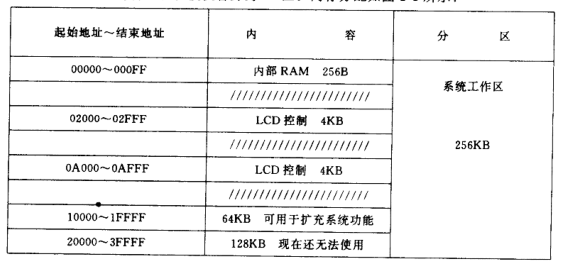
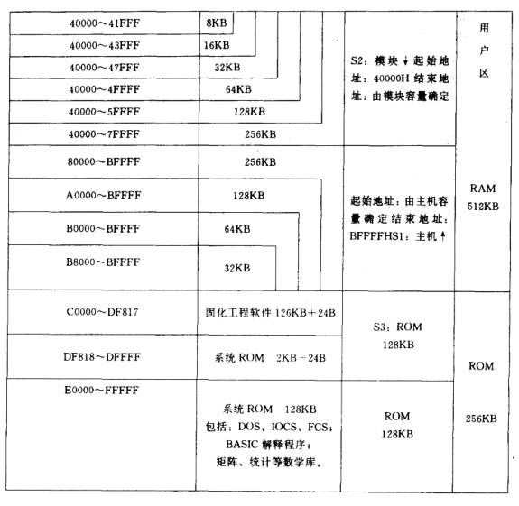

# 一些古老可编程计算器的试玩备忘

## 目录

+ [**SHARP PC-E500**](#sharp-pc-e500)
+ [**1**](#1-快速上手) 快速上手
    + [**1.1**](#11-存储) 存储
    + [**1.2**](#12-basic运行模式) BASIC运行模式
    + [**1.3**](#13-代码存取) 代码存取
        + [**1.3.1**](#131-基本操作) 基本操作
        + [**1.3.2**](#132-代码链接与合并) 代码链接与合并
+ [**2**](#2-basic编程) BASIC编程
    + [**2.1**](#21-基本格式) 基本格式
        + [**2.1.1**](#211-行号) 行号
        + [**2.1.2**](#212-标签) 标签
        + [**2.1.3**](#213-注释) 注释
        + [**2.1.4**](#214-变量类型) 变量类型
    + [**2.2**](#22-表达式) 表达式
        + [**2.2.1**](#221-运算表达式) 运算表达式
        + [**2.2.2**](#222-关系表达式) 关系表达式
        + [**2.2.3**](#223-逻辑运算表达式) 逻辑运算表达式
    + [**2.3**](#23-调试) 调试
    + [**2.4**](#24-数据文件操作) 数据文件操作
        + [**2.4.1**](#241-打开文件) 打开文件
        + [**2.4.2**](#242-写入文件) 写入文件
        + [**2.4.3**](#243-读取文件) 读取文件
        + [**2.4.4**](#244-其他操作) 其他操作
    + [**2.5**](#25-数值计算命令) 数值计算命令
    + [**2.6**](#26-其余通用命令) 其余通用命令

# SHARP PC-E500

## 1 快速上手

## 1.1 存储

SHARP PC-E500最多有3个存储设备，分别是不可修改的ROM（固件，S3），内置SRAM（S1），以及后盖打开可选的扩容卡（S2，是内置电池的SRAM卡）。所有SRAM由纽扣电池供电以保持数据

原装的PC-E500只有32K内置SRAM。南方测绘仪器公司以前进口过大量PC-E500并进行改装扩容，目前国内二手市场流通的PC-E500大多是南测仪器的扩容机，常见的扩容型号有256K，64K等（64K扩容型号在南测仪器内部称为PC-E550，256K扩容型号在内部称为PC-E5555）。这类机器拆开可见飞线并外挂一个逻辑门，SRAM叠焊。并不是维修机

SRAM存储分为程序运行时可用内存和内存磁盘。内存磁盘`E:`盘固定映射到`S1`也即内置SRAM；`F:`盘固定映射到`S2`也即外置扩容卡，没有扩容卡时不可使用`F:`盘；`G:`盘映射到ROM，固定分配，不可修改

机器到手后第一次上电时可能不会有`E:`盘，需要手动初始化以后才能用。示例，初始化一个`96K`大小的`E:`盘

```
INIT "E:96K"
```

编写好的BASIC程序需要通过`LOAD`命令加载到运行时内存以后才能修改与运行

查看可用运行时内存，创建磁盘后会相应减小

```
FRE 0
```

磁盘剩余容量可以使用`DSKF`命令查看。`3`表示`E:`，`4`表示`F:`，`5`表示`G:`

```
DSKF 3
```

PC-E500有3种内存模式，分别为`S1` `S2` `B`。其中`S1`模式把内置SRAM作运行内存使用，`LOAD`上来的BASIC代码、变量都放在这里，`E:`和`F:`盘都可以使用（如果有）。`S2`模式把外置扩容卡作运行内存使用，BASIC代码、变量都放在这里，`E:`和`F:`盘都可以使用，而AER、PF按键数据块依旧放在内置SRAM。`B`模式同时将内置SRAM和外置扩容卡作运行内存使用，此时内置SRAM和扩容卡合并为`S1`，只能使用`E:`

内存模式通过以下命令设定。默认模式`S1`，没有特殊需求不用改。在`S2`和`B`之间切换必须经过`S1`，也就是说必须先切到`S1`才能继续切到`S2`或`B`

```
MEM$="S1"
```

**附：南测仪器逆向出来的PC-E500地址分布**





## 1.2 BASIC运行模式

BASIC运行模式分为两种，分别为**命令模式**，在屏幕状态栏显示`RUN`，以及**编程模式**，在状态栏显示`PRO`。模式通过按`BASIC`键切换。两种模式下可用的BASIC命令有所不同。`PRO`模式下编写的代码需要切换到`RUN`模式下通过`RUN`命令运行

`PRO`模式实际也分2个子模式，分别是需要有行号的行编辑模式，以及出现`>`提示符时的命令模式。`PRO`行编辑模式下编写的代码正常情况下即便关机或按`RESET`键也不会丢失，会一直在内存里。想要从头开始编写新的代码，需要在`PRO`命令模式下执行一下`NEW`

`PRO`命令模式下可以通过`LIST`命令或按`↑`方向键进入行编辑模式；而`PRO`行编辑模式可以通过直接输入命令或直接输入空行（不要写行号，直接按回车）自动切换到`PRO`命令模式

`PRO`的命令模式不可以执行`RUN`命令，`RUN`命令必须切换到`RUN`模式下运行。而`RUN`模式也不可以执行`LIST`这些命令

`RUN` `LIST` `CONT` `SAVE` `LOAD`命令分别对应按键`PF1` `PF2` `PF3` `PF4` `PF5`，可以通过这些按键快捷调用命令

## 1.3 代码存取

### 1.3.1 基本操作

运行内存中的代码（只可能有1份）可以`SAVE`到SRAM磁盘中，也可以从内存磁盘中`LOAD`代码到运行内存中

> 下述文件命令在`PRO`命令模式与`RUN`模式都可以使用

BASIC代码有2种保存方式，一种是ASCII码，一种是二进制中间码

保存为ASCII码

```
SAVE "E:DEMO.BAS",A
```

保存为中间码

```
SAVE "E:DEMO.BAS"
```

> BASIC程序文件默认后缀名`.BAS`。即便不加后缀也会自动加

加载代码到内存

```
LOAD "E:DEMO.BAS"
```

此外`LOAD?`命令可以校验当前内存中的文件副本和内存盘中的是否一致

```
LOAD? "E:DEMO.BAS"
```

列出内存盘`E:`中的文件

```
FILES "E:"
```

将文件列表从打印机打印出来

```
LFILES "E:"
```

或列出整个`S1`中AER，按键设定，BASIC变量占用空间，BASIC代码占用空间等

```
FILES "S1"
```

删除文件

```
KILL "E:DEMO.BAS"
```

重命名文件

```
NAME "E:DEMO.BAS" AS "E:NEW.BAS"
```

复制文件

```
COPY "E:DEMO.BAS" TO "E:NEW.BAS"
```

复制为ASCII格式

```
COPY "E:DEMO.BAS" TO "E:NEW.BAS",A
```

还可以将文件设定为写保护。设定写保护后使用`FILE`命令可以看到`P`标记

```
SET "E:DEMO.BAS", "P"
```

解除写保护

```
SET "E:DEMO.BAS", " "
```

### 1.3.2 代码链接与合并

如果代码太长内存里放不下，或者程序运行没有足够的内存空间，可以将程序拆成几段分别储存。一段程序执行到指定阶段可以通过`CHAIN`命令调用内存盘上的另一段程序，并从指定行（或标签）启动，实现Code Banking的作用。此时原有程序被清空，被替换为`CHAIN`指定的程序

```
CHAIN "E:ALTFUNC.BAS", 1010
```

> 建议多个文件行号按顺序来

代码合并将内存盘上指定程序按照行号和当前内存中程序合并。注意相同行号会被覆盖，并且在内存盘上被合并的代码必须是ASCII格式

```
MERGE "E:ALTFUNC.BAS"
```

## 2 BASIC编程

执行`NEW`命令可以清除运存中的BASIC程序，从头开始编写

## 2.1 基本格式

### 2.1.1 行号

BASIC中每一行代码都需要在开头加上行号

```
10:CLS
20:PRINT "Hello world!"
30:CLEAR
40:END
```

在PC-E500中只需输入行号后直接加对应命令即可，编写完当前行以后直接回车，会自动添加`:`

行号建议和BASIC编程习惯一样，不要连续，方便后续插入新代码。插入新代码时也是通过行号决定代码插入到哪里的

建议代码最后加上`CLEAR`和`END`命令。`CLEAR`命令将所有变量清除，可以防止变量污染（BASIC程序退出以后变量还在环境里）

`CLS`是清屏命令

想要删除一行只要输入行号，直接回车即可，或者使用`DELETE`命令，可以支持删除指定范围的行

```
DELETE 20,50
```

删除指定行到末尾

```
DELETE 40,
```

**自动行号**

可以在执行`NEW`开始编写新代码前，通过`AUTO`命令设定自动行号，这样输入代码时就无需输入行号，会自动按照步长递增

```
AUTO 10,10
```

> 上述命令表示从行号`10`开始，步长`10`递增

**重编行号**

有行号以后想要重新编行号，使用`RENUM`命令

```
RENUM 5,10,5
```

> 上述命令表示从原来的第`10`行开始修改行号，新行号从`5`开始（第一个`5`），步长为`5`直到末尾（第二个`5`）

**跳到指定行**

`LIST`加行号或标签可以显示到指定行

```
LIST 50
```

```
LIST *PROGSTART
```

**从串口或打印机打印代码**

`LLIST`默认从CE-126P配套打印机上打印代码。如果执行了`OPEN`会从串口输出

```
LLIST 10,70
```

### 2.1.2 标签

可以给行添加一个标签，标签名开头必须加`*`，示例

```
10:*PROGSTART:CLS
```

这样就可以使用标签名而非行号引用这行代码了，例如可以使用在`RUN`或`GOTO`命令中，增加代码可读性

为方便表述，后续代码块省略行号

### 2.1.3 注释

注释使用`REM`命令，`'`也等价于`REM`

```
10:REM This is a comment
```

### 2.1.4 变量类型

变量按照基本数据类型可以分为数值变量，字符串变量

BASIC中所有变量都是全局的，并且BASIC程序退出后依然会保留。清除所有变量使用`CLEAR`命令，可以在BASIC脚本中使用，也可以在`RUN`模式下使用

**数值变量**

数值变量分为单精度和双精度变量。单精度变量数据本身需要占用7Byte，双精度变量数据本身占用12Byte。而变量名需要额外占用字符数+4Byte的空间。单精度变量有10位十进制尾数，双精度变量有20位十进制尾数

单精度变量在变量名后添加`!`显式表明。`!`可以省略，所以默认情况下创建的变量都是单精度

双精度变量在变量名后添加`#`显式表明。除非对一个变量名进行`DEFDBL`，否则`#`不可省略

以下使用一些例子说明单双精度变量定义与引用所允许的行为

一些单精度变量创建与使用的示例

```
AA = PI
BB! = SQR 2
CC = PI#
PRINT AA!
PRINT BB
PRINT CC
```

> 最终上述变量`AA BB CC`都是单精度变量。`AA`和`AA!`是同一个变量，`BB`和`BB!`也是同一个变量，依次类推。`PI`是圆周率，`SQR 2`是根号2
>
> 这里为什么不用`A B C`命名，是因为涉及到固定变量，后面会讲

一些双精度变量创建与使用的示例（这里先`CLEAR`一下）

```
DEFDBL AA
AA = PI
BB# = PI
CC# = PI!
PRINT AA
PRINT BB#
PRINT CC#
```

> 最终上述变量`AA BB# CC#`都是双精度变量，其中`PI!`强转单精度让`CC#`可能看上去像单精度，`BB#`看上去也像单精度，实际上它们依旧是双精度变量（变量到底占用多少可以通过`FRE 0`命令看减少了多少字节可用内存）。`DEFDBL`命令将不带后缀的`AA`默认映射为双精度变量`AA#`，所以后续可以省略`#`后缀，此时`AA`和`AA#`才是同一个变量，而`AA!`是不相关的单精度变量，此时看`AA!`等于`0`。同理，在前面的单精度示例中如果看`AA#`也是`0`
>
> 也就是说，没有后缀的数值变量到底映射到双精度版本`#`还是单精度版本`!`，可以分别由`DEFDBL` `DEFSNG`决定。`DEFSNG`是默认情况下的设定，所以默认映射到`!`单精度版本
>
> 此外，使用`DEFDBL`显式声明的变量，在涉及到该变量的运算中，也会使用常量的双精度版本，上述例子中`AA = PI`相当于`AA# = PI#`。但是普通的`BB# = PI`不会有这种效果，赋值依旧是使用的`PI`的单精度版本，用0扩展精度
>
> 在涉及到混合精度的运算中，BASIC会尽量都转成双精度再计算

**十六进制常量**

十六进制常量需要在开头加上`&`或`&H`

```
A = &15F3
```

> 可以使用`HEX`或`DECI`命令将变量转为十六进制、十进制显示，这两条命令本身返回结果是单精度。在BASIC代码中主要用在`PRINT`命令中，示例`PRINT HEX 1513`。而在`RUN`模式下也可以直接使用这两条命令，方便转换

**单精度常量**

单精度常量使用`xxEyy`的格式

```
A! = 1.5E-10
```

**双精度常量**

双精度常量使用`xxDyy`的格式

```
A# = 3.9188209828357723D-6
```

**固定变量和简单变量**

内存中有26个固定位置可以存放单精度变量，这些位置不会占用内存，每个长度8Byte，通过变量名`A!`到`Z!`使用。也是因此，创建单精度变量`A!`到`Z!`时看`FRE 0`发现内存不会减少。这26个单精度变量称为固定变量Fixed Variables

还是先`CLEAR`一下

```
FRE 0
A = PI
FRE 0
AB = PI
FRE 0
A# = PI#
FRE 0
```

> 上述变量中，只有`A`（`A!`）是固定变量。而`AB`和`A#`都是简单变量，会占用内存。两类变量的本质区别就是静态分配和动态分配
>
> 简单变量的变量名最长可以支持40个字符

**字符串变量**

字符串变量最长254字节，命名必须以`$`符号结尾

```
USERNAME$ = "benjamin"
```

**数组**

数组使用`DIM`命令定义，数组元素类型需要通过名称体现（例如添加`!` `#` `$`后缀）

定义长度为`10`（下标`0~9`）的单精度数组`A`（这里`A`不是固定变量）

```
DIM A(9)
```

定义长度为`5`的字符串数组

```
DIM S$(4)
```

数组可以有任意维度（最多支持`120`维，每个维度长度最大`65534`）

定义一个`3*5`的双精度二维数组

```
DIM D#(2,4)
```

可以一次定义多个数组

```
DIM A$(9), L#(9,15), K(9,19)
```

元素引用与赋值，直接`()`内加下标

```
A(4) = 15 
```

## 2.2 表达式

### 2.2.1 运算表达式

| 符号 | 定义 | 使用例 |
| :- | :- | :- |
| `+` | 加法或正号 |  |
| `-` | 减法或负号 |  |
| `*` | 乘法 |  |
| `/` | 除法 |  |
| `^` | 指数 |  |
| `+`（字符串） | 连接两个字符串（或字符串变量，任意组合） |  `A$ = "First name " + "Last name"` |

> 运算表达式中，建议多加`()`显式说明运算次序

### 2.2.2 关系表达式

| 符号 | 定义 | 使用例 |
| :- | :- | :- |
| `=` | 等于 |  |
| `<>` | 不等于 |  |
| `<` | 小于 |  |
| `>` | 大于 |  |
| `<=` | 小于等于 |  |
| `>=` | 大于等于 |  |
| `=` `<>` `<` `>` `<=` `>=`（字符串） | 按ASCII码顺序比较两个字符串，如果长度不同会把短的字符串补`0` | A$ = "Alice" |

> 注意BASIC中使用`-1`表示TRUE，使用`0`表示FALSE（`-1`也就是寄存器全举1，`0`也就是寄存器全清0）

### 2.2.3 逻辑运算表达式

| 符号 | 定义 | 使用例 |
| :- | :- | :- |
| `AND` | 与 | `A = 5 AND B > 3` |
| `OR` | 或 | `A = 5 OR B > 3` |
| `NOT` | 非 | `NOT A = 10` |
| `XOR` | 异或 | `A = 5 XOR B > 3` |

因为如前所述BASIC中TRUE相当于全举`1`的寄存器，FALSE相当于全清`0`的寄存器，逻辑运算符实际上就是位运算，异或交换示例

```
A = A XOR B
B = A XOR B
A = A XOR B
```

表达式优先级如下，由高到低

| 运算优先级 |
| :- |
| `()`内表达式 |
| 从变量取值 |
| 命令 |
| `^` |
| `+` `-`（正负） |
| `*` `/` |
| `+` `-` |
| `=` `<>` `>` `<` `>=` `<=` |
| `NOT` `AND` `OR` `XOR` |

## 2.3 调试

调试可以通过`TRON`打开。打开`TRON`以后在执行每一行代码时会停顿一下，屏幕右上角会显示行号。执行到目标行时按`BREAK`键可以暂停运行，此时可以输入命令进行变量查看等操作

想要继续执行可以输入`CONT`命令或按`PF3`键

通过`TROFF`命令可以关闭调试状态，回到正常的执行模式

## 2.4 数据文件操作

PC-E500只支持Sequential File

### 2.4.1 打开文件

```
OPEN "E:DATA.TXT" FOR INPUT AS #10
```

> 这里的`#10`是文件描述符，合法值`#1`到`#255`。PC-E500上所有内存盘、串口、磁带加起来最多允许同时打开2个文件描述符
>
> `INPUT`表示从文件读取内容。除`INPUT`外还有`OUTPUT`表示覆写文件，`APPEND`表示向文件追加内容
>
> `APPEND`和`INPUT`模式必须保证指定文件存在。`OUTPUT`会自动创建文件
>
> `APPEND`和`OUTPUT`模式必须保证文件不是写保护的
>
> 不可以二次创建当前已有的文件描述符，也不可以二次打开同一个文件

文件使用后关闭文件描述符

```
CLOSE #10
```

> 指定`END`或`RUN`命令，关机，切换`PRO` `RUN`模式，执行`LOAD`会导致当前文件描述符被关闭

### 2.4.2 写入文件

文件中的内容本质上都是使用字符串存储的，包括数值

向文件写数据使用`PRINT`命令，指定文件描述符写入，后接表达式列表。一次`PRINT`写入一行数据，这行数据以`CR LF`换行符结尾

表达式之间使用`,`或`;`分隔。如果一个表达式后面加`,`，那么这个表达式（解析结果）在数据文件中的记录长度为`20`字节整数倍，字符串靠左放置（如果长于20字符那么会再开20字节空间），数值靠右放置。如果一个表达式后面加`;`，那么数值变量会相对前一个表达式解析结果空1字符，而字符串和前者不会有空格（也就是说，一个`PRINT`命令中字符串表达式之间如果使用了`;`分隔，需要手动添加分隔符`,`，否则两个字符串会合并为一个字段）

> 使用`,`经常造成空间浪费。建议多使用`;`。此外字符串里建议不要包含逗号

```
PRINT #10, -15.232; 16.152; -15.293; 16.211;
PRINT #10, "Norway", "Sweden", "Finland",
```

### 2.4.3 读取文件

> 读写文件不能同时进行。要写入后读取，需要关闭文件描述符后重新以`INPUT`模式打开，反之亦然

读取文件内容使用`INPUT`命令

数据文件中，规定空格` `，逗号`,`，换行`CR LF`作为数值变量的字段分隔符；规定逗号`,`，换行`CR LF`作为字符串变量的字段分隔符。也就是说对于一个数据类型，从上一个分隔符到下一个分隔符之间的内容会被赋值到变量。一条`INPUT`命令赋值结束后，之后的`INPUT`命令会从接下来的字段继续读取

> 双引号`" "`也可以强制把一个字段括起来，优先级更高，之间的内容被认为是一个字段整体

需要注意变量类型必须和字段存储的数据类型对应

```
INPUT #10, FIRSTN$, LASTN$, AGEU 
```

读取文件时，文件描述符维护了一个读指针。可以使用`EOF`命令检测指针是否读到文件末尾，如果已经是末尾那么返回`-1`

```
EOF 10
```

此外还可以使用`INPUT`命令直接读取指定长度字符串到字符串变量，不受分隔符限制

```
A$ = INPUT $(20, #10)
```

> 上述命令从`#10`当前位置读取20字符存储到`A$`

### 2.4.4 其他操作

查看当前文件描述符对应文件长度

```
LOF 10
```

查看指定描述符当前指针位置（记录号）

```
LOC 10
```

## 2.5 数值计算命令

| 命令 | 定义 | 使用例 |
| :- | :- | :- |
|  |  |  |

## 2.6 其余通用命令

| 命令 | 定义 | 使用例 |
| :- | :- | :- |
|  |  |  |